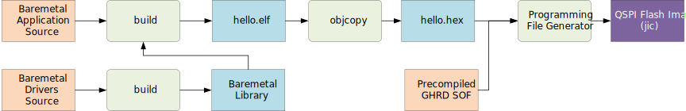
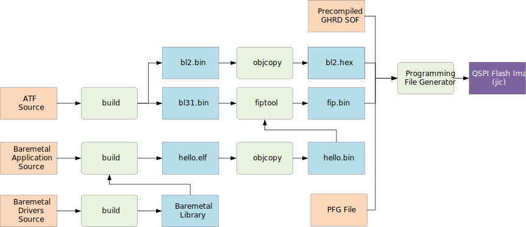

# Baremetal Hello World Example for Agilex™ 5 Premium Development Kit

## Overview

This page demonstrates how to use the [baremetal drivers](https://altera-fpga.github.io/rel-25.1.1/driver-list_baremetal/) for a simple hello world program, booting from QSPI, on the [Agilex 5 E-Series Premium Development Kit](https://www.intel.com/content/www/us/en/products/details/fpga/development-kits/agilex/a5e065b-premium.html)

Two different scenarios are covered:

* Baremetal program targets OCRAM, and is part of the bitstream. No bootloader is used, and the HPS DDR is not initialized.
* Baremetal program targets DDRAM, and is loaded by the ATF (Arm Trusted Firmware)

## HPS OCRAM Example

In this example, the baremetal program is placed in the configuration bitstream, which is stored in QSPI. On power up, the SDM loads the HPS baremetal program in HPS OCRAM and lets it execute.

As there is no bootloader involved, the baremetal application is configuring the HPS IO muxing, clock controller and reset controller according to the handoff from the configuration bitstream. HPS DDRAM is not brought up.

### Build Flow

The build flow is depicted in the following diagram:



The following inputs are used:

| Item | Link |
| -- | -- |
| Baremetal Drivers Source | [baremetal-drivers](https://github.com/altera-fpga/baremetal-drivers/tree/QPDS25.1.1_REL_GSRD_PR) |
| OCRAM Baremetal CMake Project File | [CMakeLists_ocram.txt](https://altera-fpga.github.io/rel-25.1.1/baremetal-embedded/agilex-5/e-series/premium/collateral/CMakeLists_ocram.txt)|
| Precompiled GHRD SOF | [ghrd_a5ed065bb32ae6sr0.sof](https://releases.rocketboards.org/2025.08/gsrd/agilex5_dk_a5e065bb32aes1_gsrd/ghrd_a5ed065bb32ae6sr0.sof) |

### Build Example


1\. Create the top folder to store this example:


```bash
rm -rf agilex5_bm.ocram
mkdir agilex5_bm.ocram
cd agilex5_bm.ocram
export TOP_FOLDER=`pwd`
```


2\. Set up the toolchain required to build the example:


```bash
cd $TOP_FOLDER
wget https://developer.arm.com/-/media/Files/downloads/gnu/13.2.rel1/binrel/arm-gnu-toolchain-13.2.rel1-x86_64-aarch64-none-elf.tar.xz
tar xf arm-gnu-toolchain-13.2.rel1-x86_64-aarch64-none-elf.tar.xz
rm -f arm-gnu-toolchain-13.2.rel1-x86_64-aarch64-none-elf.tar.xz
export PATH=`pwd`/arm-gnu-toolchain-13.2.Rel1-x86_64-aarch64-none-elf/bin/:$PATH
export CROSS_COMPILE=aarch64-none-elf-
```


3\. Add Quartus tools to the PATH - only the Quartus Programmer tools are actually used:


```bash
export QUARTUS_ROOTDIR=~/altera_pro/25.1.1/quartus/
export PATH=$QUARTUS_ROOTDIR/bin:$QUARTUS_ROOTDIR/linux64:$QUARTUS_ROOTDIR/../qsys/bin:$PATH
```


4\. Retrieve the baremetal library sources:


```bash
cd $TOP_FOLDER
rm -rf baremetal-drivers*
git clone -b QPDS25.1.1_REL_GSRD_PR https://github.com/altera-fpga/baremetal-drivers
```


6\. Create the sample application folder:


```bash
cd $TOP_FOLDER
rm -rf baremetal-example
mkdir baremetal-example
cd baremetal-example
```


7\. Bring in the hello world source code:


```bash
cp $TOP_FOLDER/baremetal-drivers/test/simics/hello-world/printf_hello_world.c hello_world.c
```


8\. Bring in the cmake file for the project:


```bash
wget -O CMakeLists.txt https://altera-fpga.github.io/rel-25.1.1/baremetal-embedded/agilex-5/e-series/premium/collateral/CMakeLists_ocram.txt
```


The file looks like this:
```bash
cmake_minimum_required(VERSION 3.5...3.28)

# disable building tests
set(BUILD_TESTS OFF)

# library dir
get_filename_component(LIBRARY_DIR "../baremetal-drivers" ABSOLUTE)

# library project
add_subdirectory(${LIBRARY_DIR} alterametal)

# linker script
set(ALTERAMETAL_LINKER_SCRIPT "${LIBRARY_DIR}/build/aarch64/core0_ocram.ld")

# project
project(bm_hello_world C CXX ASM)

# target
add_executable(hello_world.elf)

# sources
target_sources(hello_world.elf
    PRIVATE
        hello_world.c
)

# compile options
if(CMAKE_BUILD_TYPE STREQUAL "Debug")
    target_compile_options(hello_world.elf PRIVATE -DFSBL_EXECUTION ${DEFAULT_C_FLAGS_DEBUG})
    target_compile_options(hello_world.elf PRIVATE ${DEFAULT_C_FLAGS_DEBUG})
else()
    target_compile_options(hello_world.elf PRIVATE -DFSBL_EXECUTION ${DEFAULT_C_FLAGS_RELEASE})
    target_compile_options(hello_world.elf PRIVATE ${DEFAULT_C_FLAGS_RELEASE})
endif()

# link to the baremetal library
target_link_libraries(hello_world.elf PRIVATE
    alterametal
)

# specify linker script
target_link_options(hello_world.elf PRIVATE
    -T${ALTERAMETAL_LINKER_SCRIPT}
    --specs=nosys.specs -mstrict-align 
)
```

9\. Setup the build using cmake, build the executable and create the bin file


```bash
mkdir build
cd build
cmake -GNinja ..
ninja hello_world.elf
${CROSS_COMPILE}objcopy -O binary hello_world.elf hello_world.bin
${CROSS_COMPILE}objcopy -v -I binary -O ihex --change-addresses 0x0 hello_world.bin hello_world.hex
```


10\. Create JIC File, using the prebuilt hardware SOF file from GSRD release:


```bash
rm -f design.sof flash_image.hps.jic flash_image.core.rbf
wget -O design.sof https://releases.rocketboards.org/2025.08/gsrd/agilex5_dk_a5e065bb32aes1_gsrd/ghrd_a5ed065bb32ae6sr0.sof 
quartus_pfg \
-c design.sof flash_image.jic \
-o device=MT25QU128 \
-o flash_loader=A5ED065BB32AE6SR0 \
-o hps_path=hello_world.hex \
-o mode=ASX4 \
-o hps=1
```


### Run Example

1\. Set up the board as described in the GSRD [Configure Board](https://altera-fpga.github.io/rel-25.1.1embedded-designs/agilex-5/e-series/premium/gsrd/ug-gsrd-agx5e-premium/#configure-board).

2\. Power down board

3\. Set up MSEL dipswitch SW27 for JTAG boot: OFF-OFF-OFF-OFF

4\. Power up board

5\. Program the QSPI flash with the JIC file:

```bash
quartus_pgm -c 1 -m jtag -o "pvi;$TOP_FOLDER/baremetal-example/build/flash_image.hps.jic"
```

6\. Power down board

7\. Set up MSEL dipswitch SW27 for QSPI boot: OFF-ON-ON-OFF

8\. Power up board

9\. Observe on the HPS serial console how bl31 is ran, then it loads the FIP image, and runs the baremetal application which prints the hello world message.


## HPS DDRAM Example

In this example, the baremetal program is stored in QSPI, together with ATF. On power up, the SDM loads the ATF BL2 from bitream to OCRAM, which then loads an image containing both ATL BL31 and the baremetal program. ATF BL31 remains resident, and the baremetal program is executed.


ATF (Arm Trusted Firmware) is used, composed of the following two components:

* ATF bl22: First stage bootloader. Part of the bitstream. Initializes hardware, including SDRAM, and loads FIP image.
* ATF bl31: Secure Monitor Handler. Can perform services for the baremetal application for certain scenarios, such as configuring the FPGA fabric.

The layout of the QSPI flash is as follows:

| Address | Description |
| -- | -- |
| 0x0000_0000 | Bitstream, including ATF bl2 |
| 0x03C0_0000 | FIP image, including ATF bl31 and baremetal image |

### Build Flow

The build flow is depicted in the following diagram:



The following inputs are used:

| Item | Link |
| -- | -- |
| Baremetal Drivers Source | [baremetal-drivers](https://github.com/altera-fpga/baremetal-drivers/tree/QPDS25.1.1_REL_GSRD_PR) |
| DDR Baremetal CMake Project File | [CMakeLists_ddram.txt](https://altera-fpga.github.io/rel-25.1.1/baremetal-embedded/agilex-5/e-series/premium/collateral/CMakeLists_ddram.txt)|
| Programming File Generator File | [flash_image.pfg](https://altera-fpga.github.io/rel-25.1.1/baremetal-embedded/agilex-5/e-series/premium/collateral/flash_image.pfg) |
| Arm Trusted Firmware Source | [arm-trusted-firmware](https://github.com/altera-fpga/arm-trusted-firmware/tree/QPDS25.1.1_REL_GSRD_PR) |
| Precompiled GHRD SOF | [ghrd_a5ed065bb32ae6sr0.sof](https://releases.rocketboards.org/2025.08/gsrd/agilex5_dk_a5e065bb32aes1_gsrd/ghrd_a5ed065bb32ae6sr0.sof) |

### Build Example


1\. Create the top folder to store this example:


```bash
rm -rf agilex5_bm.ddram
mkdir agilex5_bm.ddram
cd agilex5_bm.ddram
export TOP_FOLDER=`pwd`
```


2\. Set up the toolchain required to build the example:


```bash
cd $TOP_FOLDER
wget https://developer.arm.com/-/media/Files/downloads/gnu/13.2.rel1/binrel/arm-gnu-toolchain-13.2.rel1-x86_64-aarch64-none-elf.tar.xz
tar xf arm-gnu-toolchain-13.2.rel1-x86_64-aarch64-none-elf.tar.xz
rm -f arm-gnu-toolchain-13.2.rel1-x86_64-aarch64-none-elf.tar.xz
export PATH=`pwd`/arm-gnu-toolchain-13.2.Rel1-x86_64-aarch64-none-elf/bin/:$PATH
export CROSS_COMPILE=aarch64-none-elf-
```


3\. Add Quartus tools to the PATH - only the Quartus Programmer tools are actually used:


```bash
export QUARTUS_ROOTDIR=~/altera_pro/25.1.1/quartus/
export PATH=$QUARTUS_ROOTDIR/bin:$QUARTUS_ROOTDIR/linux64:$QUARTUS_ROOTDIR/../qsys/bin:$PATH
```


4\. Build ATF


```bash
cd $TOP_FOLDER
git clone -b QPDS25.1.1_REL_GSRD_PR https://github.com/altera-fpga/arm-trusted-firmware atf
make -C atf fiptool
make -C atf bl2 bl31 PLAT=agilex5 DEBUG=1 SOCFPGA_BOOT_SOURCE_QSPI=1 LOG_LEVEL=50
```


5\. Retrieve the baremetal library sources:


```bash
cd $TOP_FOLDER
rm -rf baremetal-drivers*
git clone -b QPDS25.1.1_REL_GSRD_PR https://github.com/altera-fpga/baremetal-drivers
```


6\. Create the sample application folder:


```bash
cd $TOP_FOLDER
rm -rf baremetal-example
mkdir baremetal-example
cd baremetal-example
```


7\. Bring in the hello world source code:


```bash
cp $TOP_FOLDER/baremetal-drivers/test/simics/hello-world/printf_hello_world.c hello_world.c
```


8\. Bring in the cmake file for the project:


```bash
wget -O CMakeLists.txt https://altera-fpga.github.io/rel-25.1.1/baremetal-embedded/agilex-5/e-series/premium/collateral/CMakeLists_ddram.txt
```


The file looks like this:
```bash
cmake_minimum_required(VERSION 3.5...3.28)

# disable building tests
set(BUILD_TESTS OFF)

# library dir
get_filename_component(LIBRARY_DIR "../baremetal-drivers" ABSOLUTE)

# library project
add_subdirectory(${LIBRARY_DIR} alterametal)

# linker script
set(ALTERAMETAL_LINKER_SCRIPT "${LIBRARY_DIR}/build/aarch64/core0.ld")

# project
project(bm_hello_world C CXX ASM)

# target
add_executable(hello_world.elf)

# sources
target_sources(hello_world.elf
    PRIVATE
        hello_world.c
)

# link to the baremetal library
target_link_libraries(hello_world.elf PRIVATE
    alterametal
)

# specify linker script
target_link_options(hello_world.elf PRIVATE
    -T${ALTERAMETAL_LINKER_SCRIPT}
    --specs=nosys.specs -mstrict-align
)
```

9\. Setup the build using cmake, build the executable and create the bin file


```bash
mkdir build
cd build
cmake -GNinja ..
ninja hello_world.elf
${CROSS_COMPILE}objcopy -O binary hello_world.elf hello_world.bin
```


10\. Build FIP file, containing ATF bl31 and the hello application


```bash
$TOP_FOLDER/atf/tools/fiptool/fiptool create --soc-fw $TOP_FOLDER/atf/build/agilex5/debug/bl31.bin --nt-fw hello_world.bin fip.bin
```


11\. Bring the Programming File Generator file, used to instruct Quartus Programmer how to create the flash image:

```bash
wget https://altera-fpga.github.io/rel-25.1.1/baremetal-embedded/agilex-5/e-series/premium/collateral/flash_image.pfg
```


The file looks like this:

```xml
<pfg version="1">
    <settings custom_db_dir="./" mode="ASX4"/>
    <output_files>
        <output_file name="flash_image" hps="1" directory="./" type="PERIPH_JIC">
            <file_options/>
            <secondary_file type="MAP" name="flash_image_jic">
                <file_options/>
            </secondary_file>
            <secondary_file type="SEC_RPD" name="flash_image_jic">
                <file_options bitswap="1"/>
            </secondary_file>
            <flash_device_id>Flash_Device_1</flash_device_id>
        </output_file>
    </output_files>
    <bitstreams>
        <bitstream id="Bitstream_1">
            <path signing="OFF" finalize_encryption="0" hps_path="bl2.hex">design.sof</path>
        </bitstream>
    </bitstreams>
    <raw_files>
        <raw_file bitswap="1" type="RBF" id="Raw_File_1">fip.bin</raw_file>
    </raw_files>
    <flash_devices>
        <flash_device type="MT25QU512" id="Flash_Device_1">
            <partition reserved="1" fixed_s_addr="1" s_addr="0x00000000" e_addr="0x001FFFFF" fixed_e_addr="1" id="BOOT_INFO" size="0"/>
            <partition reserved="0" fixed_s_addr="0" s_addr="auto" e_addr="auto" fixed_e_addr="0" id="P1" size="0"/>
            <partition reserved="0" fixed_s_addr="0" s_addr="0x03C00000" e_addr="auto" fixed_e_addr="0" id="fip" size="0"/>
        </flash_device>
        <flash_loader>a5ed065bb32ae5sr0</flash_loader>
    </flash_devices>
    <assignments>
        <assignment page="0" partition_id="P1">
            <bitstream_id>Bitstream_1</bitstream_id>
        </assignment>
        <assignment page="0" partition_id="fip">
            <raw_file_id>Raw_File_1</raw_file_id>
        </assignment>
    </assignments>
</pfg>
```
12\. Convert bl2 to hex format to be used by Programming File Generator:


```bash
${CROSS_COMPILE}objcopy -v -I binary -O ihex --change-addresses 0x0 $TOP_FOLDER/atf/build/agilex5/debug/bl2.bin bl2.hex
```


13\. Create JIC File, using the prebuilt hardware SOF file from GSRD release:


```bash
wget -O design.sof https://releases.rocketboards.org/2025.08/gsrd/agilex5_dk_a5e065bb32aes1_gsrd/ghrd_a5ed065bb32ae6sr0.sof 
quartus_pfg -c flash_image.pfg
```


### Run Example

1\. Set up the board as described in the GSRD [Configure Board](https://altera-fpga.github.io/rel-25.1.1embedded-designs/agilex-5/e-series/premium/gsrd/ug-gsrd-agx5e-premium/#configure-board).

2\. Power down board

3\. Set up MSEL dipswitch SW27 for JTAG boot: OFF-OFF-OFF-OFF

4\. Power up board

5\. Program the QSPI flash with the JIC file:

```bash
quartus_pgm -c 1 -m jtag -o "pvi;$TOP_FOLDER/baremetal-example/build/flash_image.hps.jic"
```

6\. Power down board

7\. Set up MSEL dipswitch SW27 for QSPI boot: OFF-ON-ON-OFF

8\. Power up board

9\. Observe on the HPS serial console how bl31 is ran, then it loads the FIP image, and runs the baremetal application which prints the hello world message.


## Notices & Disclaimers

Altera<sup>&reg;</sup> Corporation technologies may require enabled hardware, software or service activation.
No product or component can be absolutely secure. 
Performance varies by use, configuration and other factors.
Your costs and results may vary. 
You may not use or facilitate the use of this document in connection with any infringement or other legal analysis concerning Altera or Intel products described herein. You agree to grant Altera Corporation a non-exclusive, royalty-free license to any patent claim thereafter drafted which includes subject matter disclosed herein.
No license (express or implied, by estoppel or otherwise) to any intellectual property rights is granted by this document, with the sole exception that you may publish an unmodified copy. You may create software implementations based on this document and in compliance with the foregoing that are intended to execute on the Altera or Intel product(s) referenced in this document. No rights are granted to create modifications or derivatives of this document.
The products described may contain design defects or errors known as errata which may cause the product to deviate from published specifications.  Current characterized errata are available on request.
Altera disclaims all express and implied warranties, including without limitation, the implied warranties of merchantability, fitness for a particular purpose, and non-infringement, as well as any warranty arising from course of performance, course of dealing, or usage in trade.
You are responsible for safety of the overall system, including compliance with applicable safety-related requirements or standards. 
<sup>&copy;</sup> Altera Corporation.  Altera, the Altera logo, and other Altera marks are trademarks of Altera Corporation.  Other names and brands may be claimed as the property of others. 

OpenCL* and the OpenCL* logo are trademarks of Apple Inc. used by permission of the Khronos Group™. 