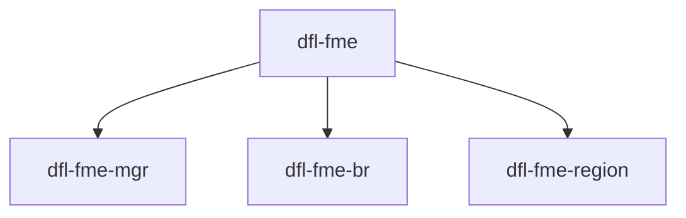

# **Host Attach DFL FPGA Management Engine IP Driver**

Last updated: **December 02, 2025** 

**Upstream Status**: [Upstreamed](https://git.kernel.org/pub/scm/linux/kernel/git/stable/linux.git/tree/drivers/fpga?h=master)

**Devices supported**: Stratix 10, Agilex 7

## **Introduction**

This set of drivers is designed to support FME functionality, as implemented under FPGA Device Feature List (DFL) framework. It is used to expose FME capabilities.

|Driver|Mapping|Source(s)|Required for DFL|
|---|---|---|---|
|dfl-fme.ko|FPGA Management Engine IP|drivers/fpga/ - dfl-fme.h, dfl-fme-main.c, dfl-fme-pr.c, dfl-fme-error.c, dfl-fme-perf.c|Y|
|dfl-fme-mgr.ko|PR IP|drivers/fpga/dfl-fme-mgr.c|N|
|dfl-fme-br.ko|SW Dependency|drivers/fpga/dfl-fme-br.c|N|
|dfl-fme-region.ko|SW Dependency|drivers/fpga/dfl-fme-region.c|N|

## **FPGA Management Engine IP**

The FPGA Management Engine IP provides management features for the platform and controls reset and loading of the AFU into the partial reconfiguration region of the FPGA. Implementation of a PR region is optional.

Each FME feature exposes its capability to host software drivers through a device feature header (DFH) register found at the beginning of its control status register (CSR) space. The FME CSR maps to physical function 0 (PF0) Base address register 0 (BAR0) so that software can access it through a single PCIe link. For more information about DFHs, refer to the [Device Feature Header (DFH) structure](https://ofs.github.io/latest/hw/d5005/reference_manuals/ofs_fim/mnl_fim_ofs_d5005/#721-device-feature-header-dfh-structure).

## **Driver Sources**

The source code for these drivers can be found at https://github.com/OFS/linux-dfl/tree/master/drivers/fpga, where branches labelled fpga-ofs-dev-*-lts correspond with the latest developmental versions of the DFL driver suite on that specific kernel version.

## **Driver Capabilities**

This driver set is a DFL specific implementation of generic FPGA drivers available in the kernel. `dfl-fme-mgr` is a DFL specific instantiation of the generic FPGA manager (drivers/linux/fpga/fpga-mgr.c), `dfl-fme-br` builds on top of a generic FPGA bridge (drivers/fpga/fpga-bridge.c), and `dfl-fme-region` instantiates an FPGA region. All three supplementary DFL Drivers depend on `dfl-fme`.

The DFL FME driver is a feature device implemented under the Device Feature List (DFL) framework. It enables the platform driver for the FME IP and implements all FPGA platform level management features. Only one FME is created per DFL based FPGA device. The DFL Bridge, Manager, and Region drivers are only required when attempting to configure a PR region in the FIM.

## **Kernel Configurations**

FPGA_DFL_FME

FPGA_DFL_FME_MGR

FPGA_DFL_FME_BRIDGE

FPGA_DFL_FME_REGION

## **Known Issues**

None known

## **Example Designs**

The FPGA Management Engine IP is included as a part of the FIM design for [PCIe Attach supporting DFL](https://github.com/OFS/ofs-agx7-pcie-attach), [Stratix 10 PCIe Attach](https://github.com/OFS/ofs-d5005.git), and [SoC Attach](https://github.com/OFS/ofs-f2000x-pl). Please refer to [site](https://ofs.github.io/) for more information about these designs.