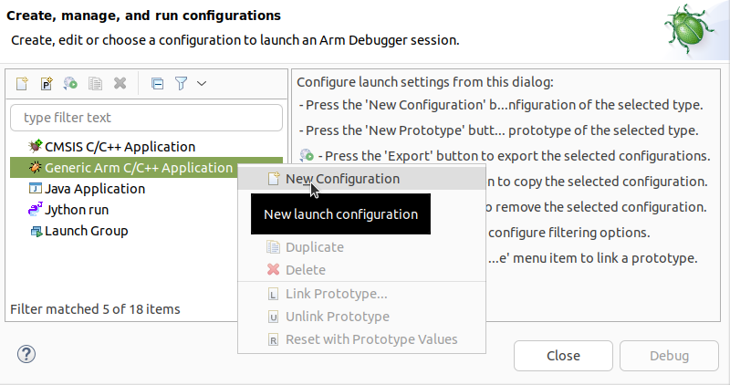
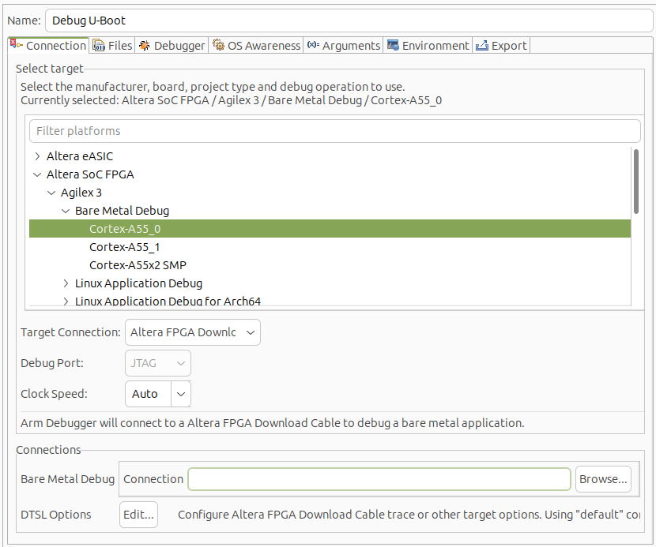
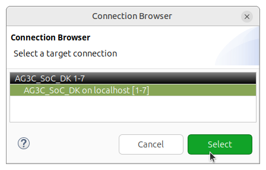
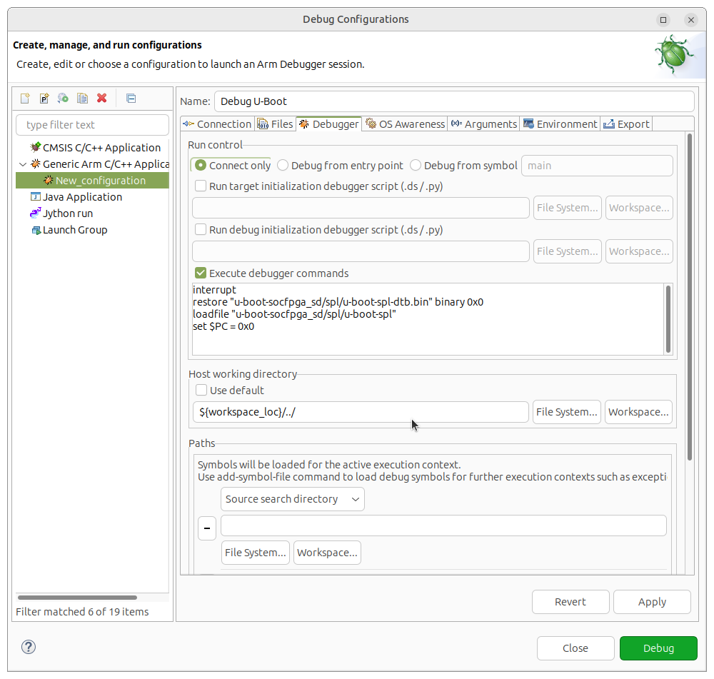
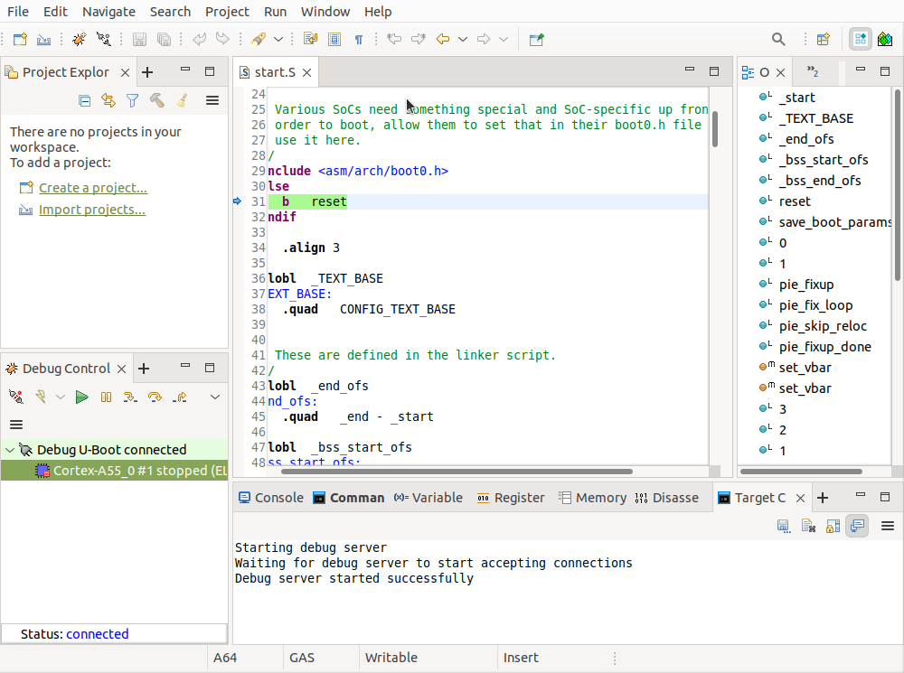
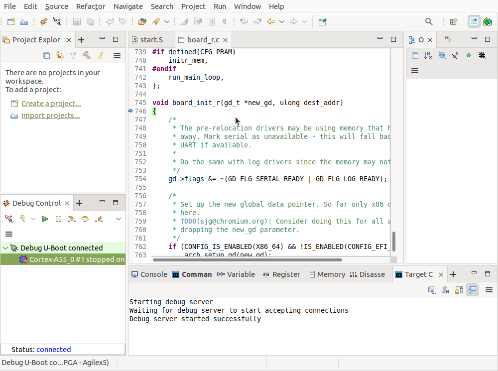

# Debugging U-Boot with Arm Development Studio Tutorial Example Design: Agilex™ 3 FPGA and SoC C-Series Development Kit

## Introduction

Arm* Development Studio for Altera® SoC FPGAs is an Eclipse based tool suite enabling Arm* software development and debugging for Altera® FPGAs.

This page demonstrates how to use Arm* Development Studio to debug U-Boot SPL and U-Boot. For further information about the tool, go to [Arm Development Studio](https://developer.arm.com/Tools%20and%20Software/Arm%20Development%20Studio).

## Prerequisites

The following are needed:

- Altera&reg; Agilex&trade; 3 FPGA and SoC C-Series Development Kit, ordering code DK-A3W135BM16AEA. Refer to [board documentation](https://www.intel.com/content/www/us/en/products/details/fpga/development-kits/agilex/a3y135b.html) for more information about the development kit.
- Host PC with:
  - 64 GB of RAM. Less will be fine for only exercising the binaries, and not rebuilding the GSRD.
  - Linux OS installed. Ubuntu 22.04LTS was used to create this page, other versions and distributions may work too
  - Serial terminal (for example GtkTerm or Minicom on Linux and TeraTerm or PuTTY on Windows)
  - Altera® Quartus<sup>&reg;</sup> Prime Pro Edition Version 25.3.1
  - Arm* Development Studio 2025.0-1

You will also need to compile the Agilex 3 GHRD Linux Boot Example targeting the HPS Enablement board, as described [here](https://altera-fpga.github.io/rel-25.3.1/embedded-designs/agilex-3/c-series/boot-examples/ug-linux-boot-agx3/#boot-from-sd-card). 

## Debug U-Boot

1\. Build the example design specified in the [Prerequisites](#prerequisites) section.

2\. Write the SD card image $TOP_FOLDER/sd_card/sdcard.img to the micro SD card and insert it on the slot on the HPS Enablement Board.

3\. Set MSEL dipswitch to JTAG, as specified in the design from the [Prerequisites](#prerequisites) section, then power cycle the board. That will ensure the device is not configured from QSPI.

4\. Go to the folder where the example was built, add the Quartus® tools in the path:

```bash
cd $TOP_FOLDER
export QUARTUS_ROOTDIR=~/altera_pro/25.3.1/quartus/
export PATH=$QUARTUS_ROOTDIR/bin:$QUARTUS_ROOTDIR/linux64:$QUARTUS_ROOTDIR/../qsys/bin
```
5\. Configure the device with the 'debug' SOF, which contains an empty loop HPS FSBL, designed specifically for a debugger to connect afterwards:

```bash
quartus_pgm -c 1 -m jtag -o "p;agilex3_soc_devkit_ghrd/output_files/legacy_baseline_hps_debug.sof@2"
```

6\. Start Arm* DS Eclipse using a new workspace in the current folder:

```bash
cd $TOP_FOLDER
/opt/arm/developmentstudio-2025.0-1/bin/suite_exec -t "Arm Compiler for Embedded 6" bash
armds_ide -data workspace &
```

7\. In Eclipse go to **Run** > **Debug Configurations** then select the **Generic Arm/C++ Application** and select **New launch configuration**: 



8\. Change the **Name** of the configuration as **Debug U-Boot**. Select target as **Altera SoC FPGA** > **Agilex 3** > **Bare Metal Debug** > **Cortex-A55_0**. Select target connection as **Altera FPGA Download Cable**:



9\. Click on the **Connections** > **Browse** button and select the board connection, then click the **Select** button:



10\. In the **Debugger** tab, select **Connect Only**, click **Execute debugger commands** and enter the desired debugging commands shown below. Also uncheck **Use default** for the **Host working directory** and enter the parent folder of the workspace: "${workspace_loc}/../" :



If you want to just load U-Boot SPL and start debugging it, enter the following debugging commands:

```bash
interrupt
restore "u-boot-socfpga_sd/spl/u-boot-spl-dtb.bin" binary 0x0
loadfile "u-boot-socfpga_sd/spl/u-boot-spl"
set $PC = 0x0
```

If you want to run U-Boot SPL to completion, up to the point where it decides what to load as next boot stage, add the following commands:

```bash
thb board_boot_order
continue
wait 60s
```

If after running U-Boot SPL to completion you want to load and run U-Boot, add the following commands:

```bash
set var $AARCH64::$Core::$X1 = 0
set spl_boot_list[0]=0
set $PC=$LR
restore "u-boot-socfpga_sd/u-boot.itb" binary 0x82000000
continue
```

Instead, if you want to load U-Boot and start debugging it, replace the previous **continue** command with the following:

```bash
symbol-file "u-boot-socfpga_sd/u-boot" 
thb el2:relocate_code
continue
wait 60s
symbol-file "u-boot-socfpga_sd/u-boot" ((gd_t*)$x18)->reloc_off
thb board_init_r
continue
wait 60s
```

11\. Click on the **Debug** button at the bottom of the **Debug Configurations** window. Eclipse Arm* DS will connect to the board and execute the debugger instructions.

If you opted to debug U-Boot SPL the window will look as below, showing U-Boot SPL stopped at its entry point:



If you opted to debug U-Boot, it will show it stopped at board_init_r, after the symbol relocation:



At this point, all the debugging features of Eclipse are available, such as:

* Viewing and editing variables and registers
* Setting breakpoints
