# Debugging Linux with Ashling RiscFree Tutorial Example Design: Agilex™ 3 FPGA and SoC C-Series Development Kit

## Introduction

RiscFree* is Ashling’s Eclipse* C/C++ Development Toolkit (CDT) based integrated development environment (IDE) for Altera® FPGAs Arm*-based HPS and RISC-V based Nios® V processors.

This page demonstrates how to use RiscFree* to debug the Linux kernel, including a kernel module. For further information about RiscFree*, consult [Ashling RiscFree* IDE for Altera® FPGAs User Guide](https://www.intel.com/content/www/us/en/docs/programmable/730783/24-3.html).

## Prerequisites

The following are needed:

- Altera&reg; Agilex&trade; 3 FPGA and SoC C-Series Development Kit, ordering code DK-A3W135BM16AEA. Refer to [board documentation](https://www.intel.com/content/www/us/en/products/details/fpga/development-kits/agilex/a3y135b.html) for more information about the development kit.
- Host PC with:
  - 64 GB of RAM. Less will be fine for only exercising the binaries, and not rebuilding the GSRD.
  - Linux OS installed. Ubuntu 22.04LTS was used to create this page, other versions and distributions may work too
  - Serial terminal (for example GtkTerm or Minicom on Linux and TeraTerm or PuTTY on Windows)
  - Altera® Quartus<sup>&reg;</sup> Prime Pro Edition Version 25.1.1

## Build Linux

For this example you need to build the Agilex 3 GHRD Linux Boot Example targeting the HPS Enablement board, as described [here](https://altera-fpga.github.io/rel-25.1.1/embedded-designs/agilex-3/c-series/boot-examples/ug-linux-boot-agx3/#boot-from-sd-card). 

The kernel compilation part of the boot example needs to be modified as follows:

```bash
cd $TOP_FOLDER
rm -rf linux-socfpga
git clone -b QPDS25.1.1_REL_GSRD_PR https://github.com/altera-opensource/linux-socfpga
cd linux-socfpga
make clean
make defconfig
./scripts/config --set-val CONFIG_DEBUG_INFO y
./scripts/config --set-val CONFIG_DEBUG_INFO_COMPRESSED_NONE y
./scripts/config --set-val CONFIG_GDB_SCRIPTS y
./scripts/config --disable CONFIG_DEBUG_INFO_REDUCED
./scripts/config --disable CONFIG_DEBUG_INFO_BTF
./scripts/config --set-val CONFIG_BLK_DEV_NULL_BLK m
make oldconfig
make -j 48 Image && make intel/socfpga_agilex3_socdk.dtb
make -j 64 modules
```

The changes achieve the following:

* Enabling the kernel debugging features required by RiscFree*.
* Build the kernel module used to demonstrate debugging modules.

You also need to change the SD card build instructions to add the compiled kernel module **null_blk.ko** to the **/home/root/** folder:

```bash 
cd $TOP_FOLDER
sudo rm -rf sd_card && mkdir sd_card && cd sd_card
wget https://releases.rocketboards.org/release/2020.11/gsrd/tools/make_sdimage_p3.py
sed -i 's/\"\-F 32\",//g' make_sdimage_p3.py
chmod +x make_sdimage_p3.py
mkdir fatfs &&  cd fatfs
cp $TOP_FOLDER/ghrd.core.rbf .
cp $TOP_FOLDER/u-boot-socfpga/u-boot.itb .
cp $TOP_FOLDER/linux-socfpga/arch/arm64/boot/Image .
cp $TOP_FOLDER/linux-socfpga/arch/arm64/boot/dts/intel/socfpga_agilex3_socdk.dtb .
cd ..
mkdir rootfs && cd rootfs
sudo tar xf $TOP_FOLDER/yocto/build/tmp/deploy/images/agilex3/core-image-minimal-agilex3.rootfs.tar.gz
sudo cp $TOP_FOLDER/linux-socfpga/drivers/block/null_blk/null_blk.ko home/root/
cd ..
sudo python3 make_sdimage_p3.py -f \
-P fatfs/*,num=1,format=fat32,size=64M \
-P rootfs/*,num=2,format=ext3,size=64M \
-s 140M \
-n sdcard.img
```

## Debug Linux

1\. Build the example. As mentioned above, only Linux kernel instructions need to be updated, the rest remains the same.

2\. Write the SD card and QSPI flash images and boot to Linux prompt

3\. Go to the folder where the example was built, add the Quartus® and RiscFree* tools in the path:

```bash
cd $TOP_FOLDER
export QUARTUS_ROOTDIR=~/altera_pro/25.1.1/quartus/
export PATH=$QUARTUS_ROOTDIR/bin:$QUARTUS_ROOTDIR/linux64:$QUARTUS_ROOTDIR/../qsys/bin:$QUARTUS_ROOTDIR/../riscfree/RiscFree:$PATH
```

4\. Start RiscFree* Eclipse using a new workspace in the current folder:

```bash
cd $TOP_FOLDER
RiscFree -data workspace &
```

7\.  In Eclipse, go to **File** > **Import** > **C/C++ Executable**, then click **Next**.

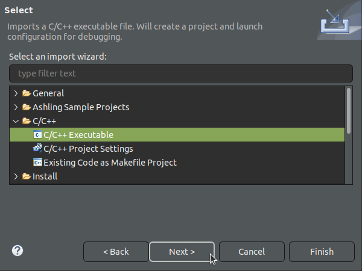

8\. Click **Browse** to select the **vmlinux** executable from where it was built in the project, then click **Next**

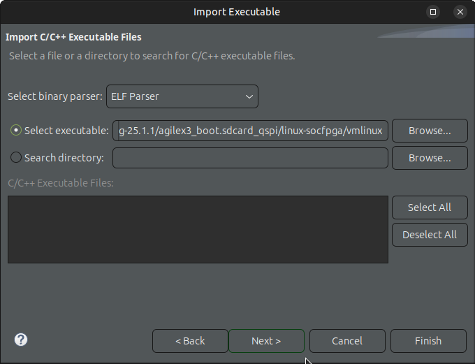

9\. Change the **New project name** and **Launch Configuration** as "Linux Kernel Debug", select **Ashling Heterogeneous Multicore Hardware Debug**  from the drop down box, and click **Finish**:

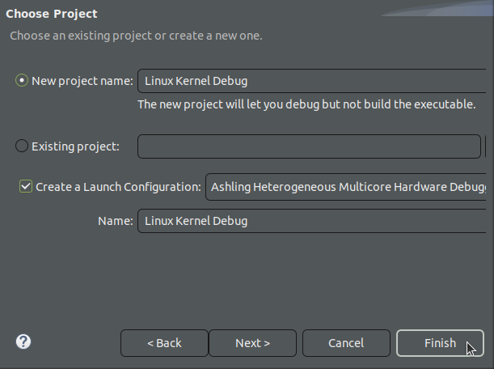

10\. The **Debug Configurations** window will be opened, with the **Linux Kernel Debug** configuration selected. If not automatically selected, select the **Debug probe** from the drop down list, then **Auto-detect Scan Chain**. Then check all the four Arm cores, to enable debugging for them. The window should look like this:

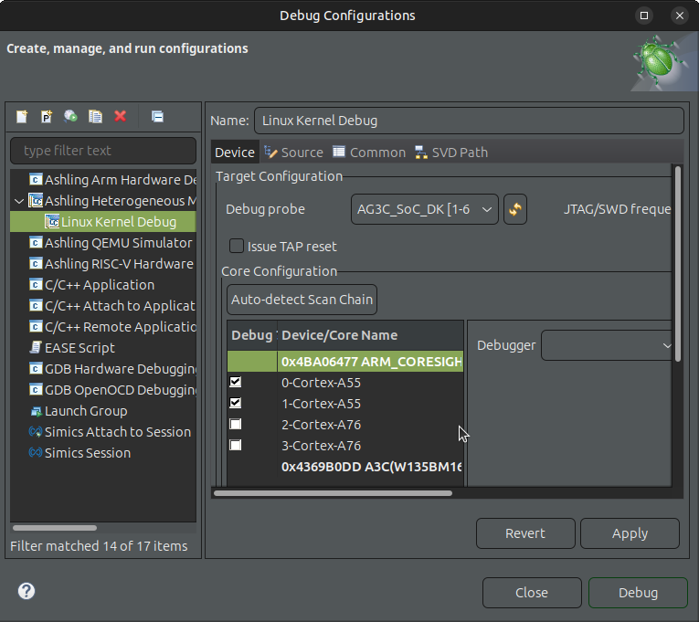 

11\. Make sure just the A55 cores are marked as enabled, as the A76's are not available on Agilex 3. 
Click on **0-Cortex-A55** core, and enter the following commands in the **Commands** section:

```bash
set remotetimeout 10
set mem inaccessible-by-default on
mem 0xffff000000000000 0xffff0003ffffffff rw
mem 0xffff800000000000 0xffff802effffffff rw
```

The above are needed to specify a proper memory access attributes to avoid unwanted or illegal memory access during the debug session. 

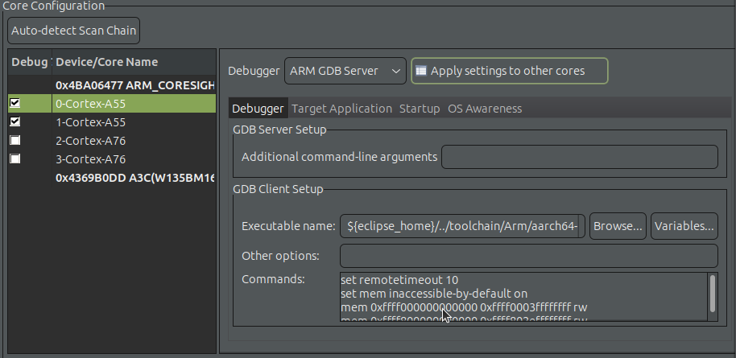z

12\. Go to **Target Application** tab. Click **Add**. The **Browse Executable** window appears. For **Project**, click **Browse...** and select the current project. For **C/C ++ Application**, click **Browse...** and select **vmlinux** as the executable. Click **OK**.

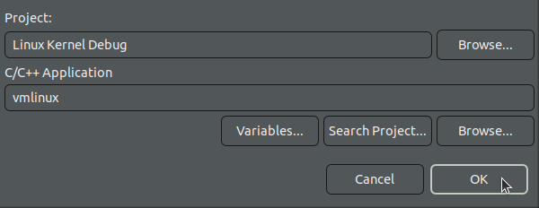

13\. After adding the executable, ensure you turn off **Load image** as the image is already loaded to the target:

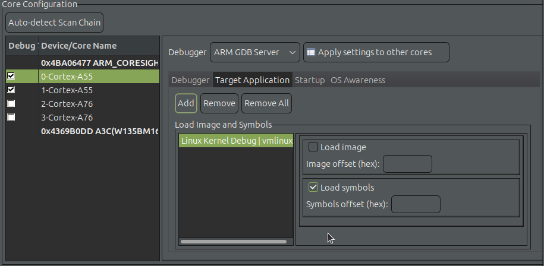

14\. Go to **Startup** tab and ensure the configuration is as shown below:

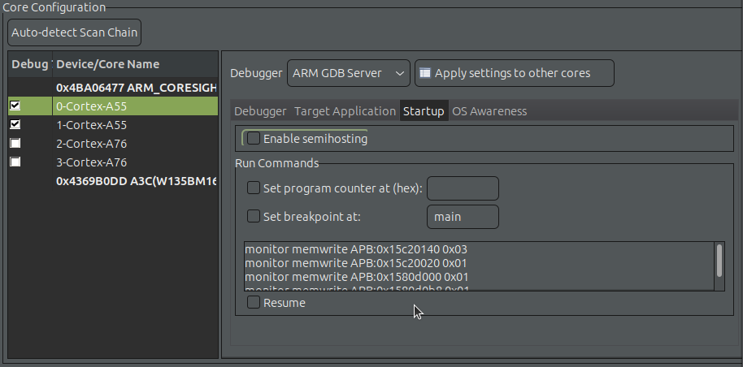

If you have watchdog(s) enabled, you need to add the following instructions in the "Run Commands" section, in order to disable watchdog while debugging:

```bash
monitor memwrite APB:0x15c20140 0x03
monitor memwrite APB:0x15c20020 0x01
monitor memwrite APB:0x1580d000 0x01
monitor memwrite APB:0x1580d0b8 0x01
monitor memwrite APB:0x1580d0bc 0x01
monitor memwrite APB:0x1580d0c0 0x01
monitor memwrite APB:0x1580d0c4 0x01
monitor memwrite APB:0x1580d0c8 0x02
monitor memwrite APB:0x1580d0cc 0x02
monitor memwrite APB:0x1580d0d0 0x02
monitor memwrite APB:0x1580d0d4 0x02
monitor memwrite APB:0x1580d140 0x03
```

*Note*: The above commands will be performed automatically in a future version of RiscFree.

15\. Go to **OS Awareness** tab, and check **Enable OS Aware Debugging**, then select **OS** to be **Linux** and version to be **6.1.20** as shown below:

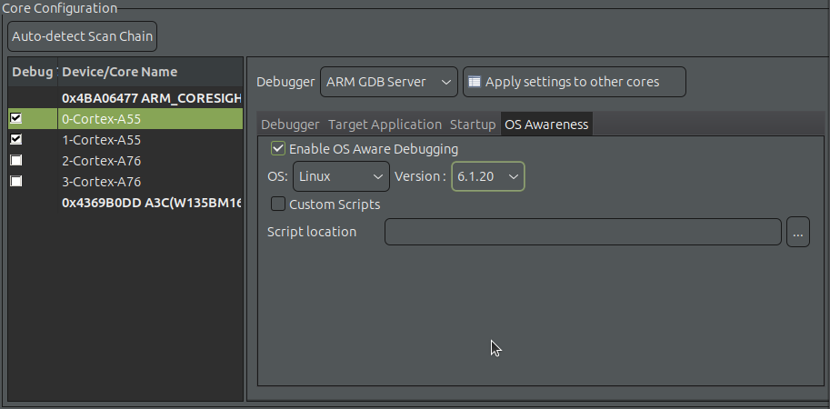

16\. Click the **Apply settings to other cores** to apply the same settings to all the cores.

17\. Click **Debug** button at the bottom of the **Debug Configurations** window.

18\.  Eclipse will suggest to move to the debug perspective. Click **Switch** to accept: 

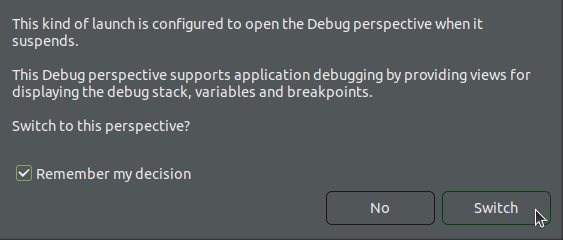

19\. Eclipse will show the Linux kernel stopped in the debugger:

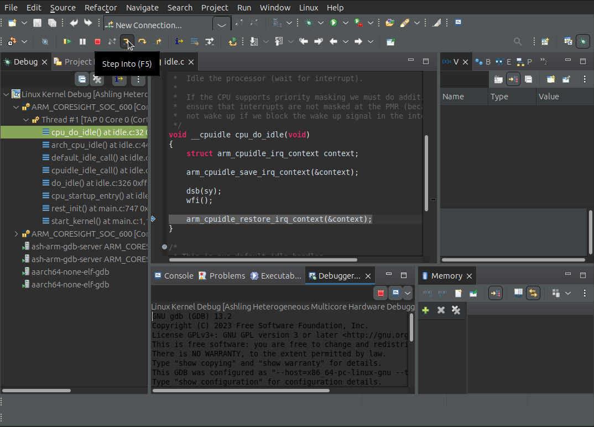

20\. Step through the code with **F5** a few times, look at variables etc. You are now debugging the Linux kernel!

21\. Go to **Linux** > **Processes** > **List Running Processes**, and then the debugger shows the processes. You may need to click the **Refresh view** button on the window for the processes to show up.

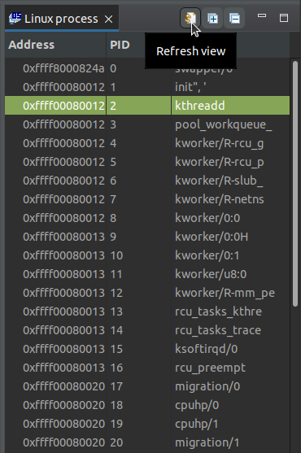

22\. Right-click a process in the list, then select the **Watch option**. 

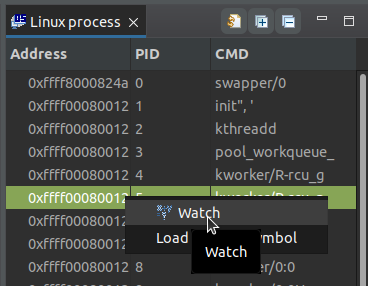

23\. The debugger opens the process in the **Expressions** window. You can now inspect and modify its properties:

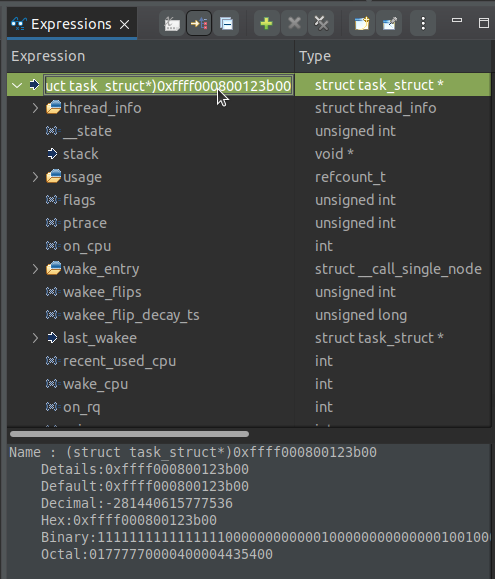

23\. Let the code run by clicking on the root debug task on the left panel, then pressing **F8**. Then go to the board serial console and load the driver:

```bash
root@agilex3:~# insmod null_blk.ko 
[  962.062224] null_blk: disk nullb0 created
[  962.066388] null_blk: module loaded
```

24\. Break the execution in the debugger, by clicking the **Suspend** button. Then go to **Linux** > **Modules** > **List loaded modules** to see the module that was loaded:

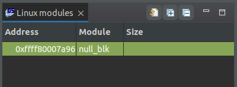

25\. Right click the module, and select the **Watch** option. This will open the module in the **Expressions** window, where it can be inspected:

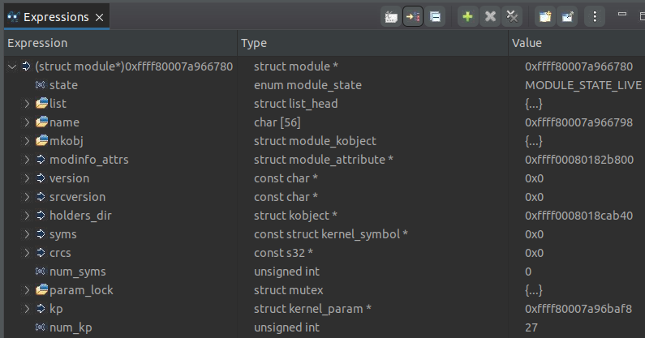

26\. Right click the module, and select **Load module symbol**

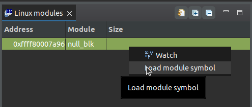

Then browse for the module object and click **OK**:

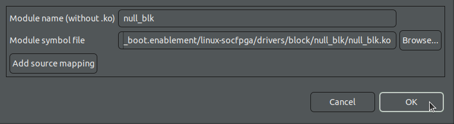

Now the module symbols are available, for example for setting breakpoints.