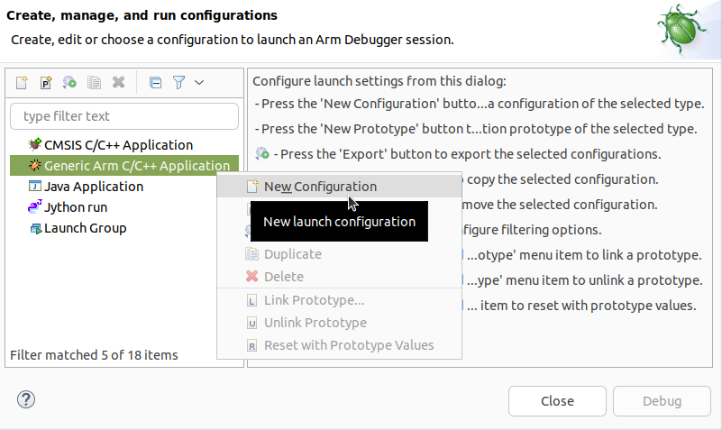
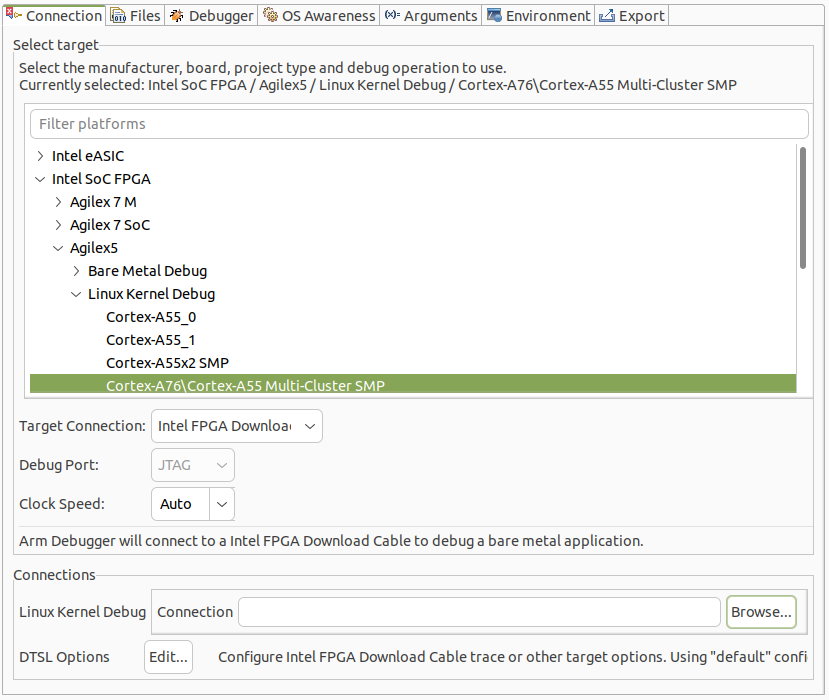
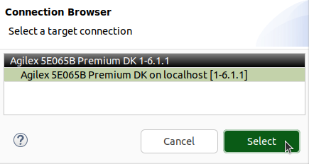
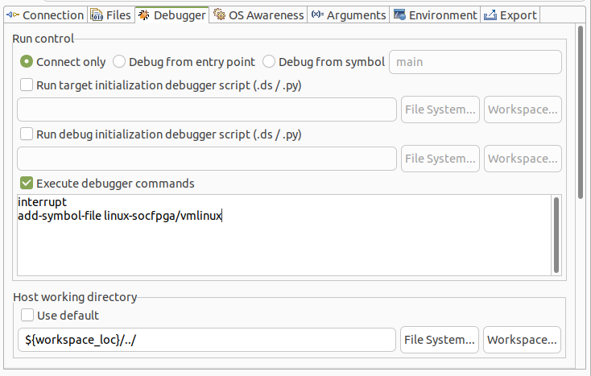
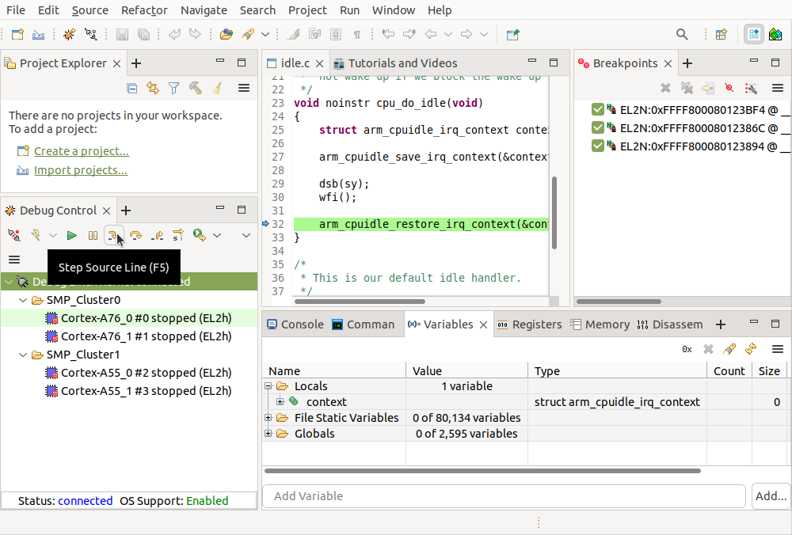
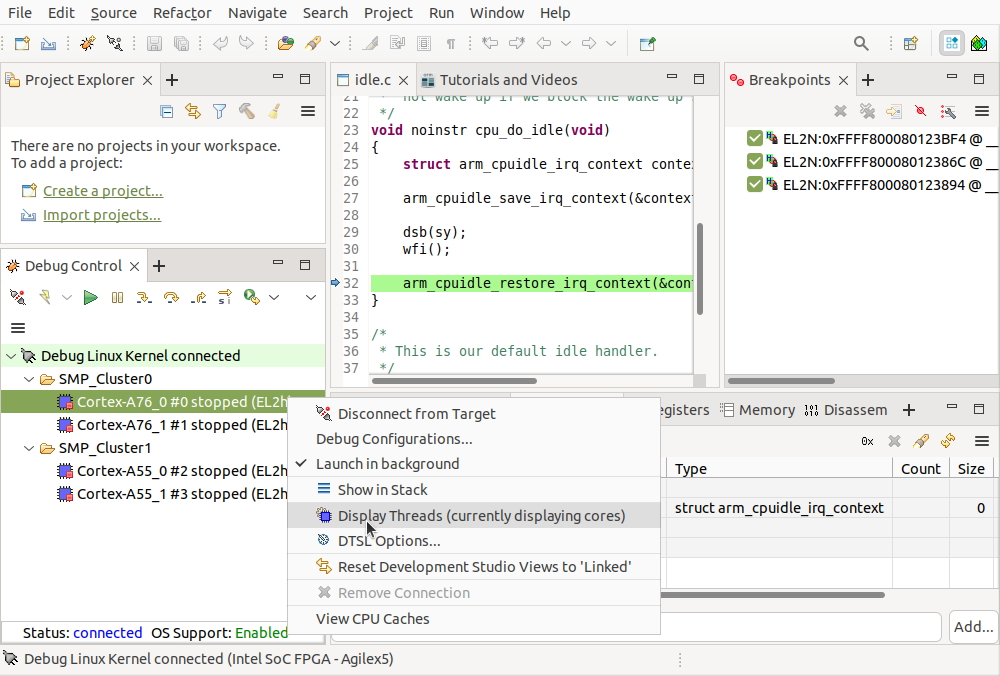
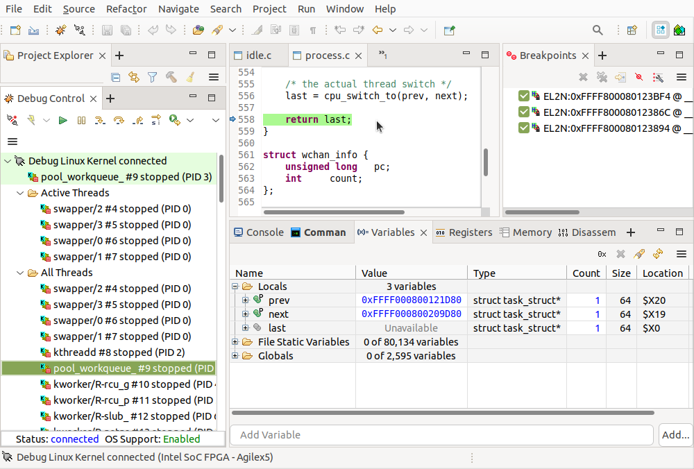
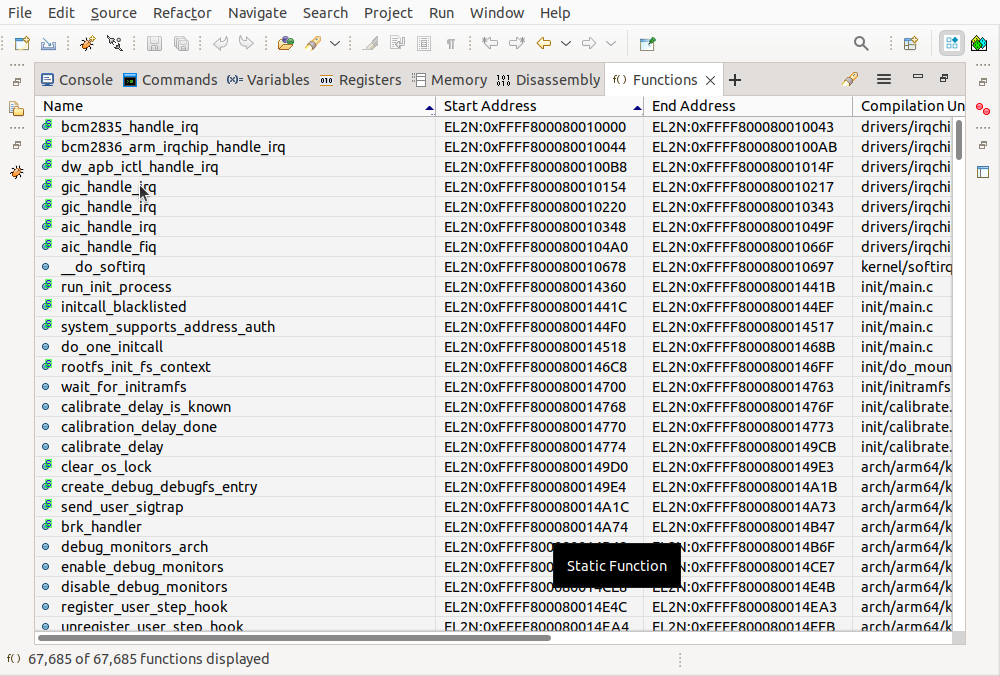

# Debugging Linux with Arm Development Studio Tutorial Example Design: Agilex™ 5 Premium Development Kit

## Introduction

Arm* Development Studio for Altera® SoC FPGAs is an Eclipse based tool suite enabling Arm* software development and debugging for Altera® FPGAs.

This page demonstrates how to use Arm* Development Studio to debug the Linux kernel. For further information about the tool, go to [Arm* Development Studio](https://developer.arm.com/Tools%20and%20Software/Arm%20Development%20Studio).

## Prerequisites

The following are needed:

- Altera® Agilex™ 5 FPGA E-Series 065B Premium Development Kit, ordering code DK A5E065BB32AES1, with the HPS Enablement Board. Refer to [Agilex™ 5 FPGA E-Series 065B Premium Development Kit](https://www.intel.com/content/www/us/en/products/details/fpga/development-kits/agilex/a5e065b-premium.html) for information about the development kit.

- Host PC with:
  - 64 GB of RAM. Less will be fine for only exercising the binaries, and not rebuilding the GSRD.
  - Linux OS installed. Ubuntu 22.04LTS was used to create this page, other versions and distributions may work too
  - Serial terminal (for example GtkTerm or Minicom on Linux and TeraTerm or PuTTY on Windows)
  - Altera® Quartus<sup>&reg;</sup> Prime Pro Edition Version 25.3
  - Arm* Development Studio 2025.0-1

## Build Linux

For this example you need to build the Agilex™ 5 GHRD Linux Boot Example targeting the HPS Enablement board, as described [here](https://altera-fpga.github.io/rel-25.3/embedded-designs/agilex-5/e-series/premium/boot-examples/ug-linux-boot-agx5e-premium/#boot-from-sd-card). 

The kernel compilation part of the boot example needs to be modified as follows:

```bash
cd $TOP_FOLDER
rm -rf linux-socfpga
git clone -b QPDS25.3_REL_GSRD_PR https://github.com/altera-opensource/linux-socfpga
cd linux-socfpga
make clean
make defconfig
./scripts/config --set-val CONFIG_DEBUG_INFO y
./scripts/config --set-val CONFIG_DEBUG_INFO_COMPRESSED_NONE y
./scripts/config --set-val CONFIG_GDB_SCRIPTS y
./scripts/config --disable CONFIG_DEBUG_INFO_REDUCED
./scripts/config --disable CONFIG_DEBUG_INFO_BTF
./scripts/config --set-val CONFIG_BLK_DEV_NULL_BLK m
make oldconfig
make -j 48 Image && make intel/socfpga_agilex5_socdk.dtb
make -j 64 modules
```

The changes achieve the following:

* Enabling the kernel debugging features required by the debugger.
* Build the kernel module used to demonstrate debugging modules.

You also need to change the SD card build instructions to add the compiled kernel module **null_blk.ko** to the **/home/root/** folder:

```bash 
cd $TOP_FOLDER
sudo rm -rf sd_card && mkdir sd_card && cd sd_card
wget https://releases.rocketboards.org/release/2020.11/gsrd/tools/make_sdimage_p3.py
sed -i 's/\"\-F 32\",//g' make_sdimage_p3.py
chmod +x make_sdimage_p3.py
mkdir fatfs &&  cd fatfs
cp $TOP_FOLDER/ghrd.core.rbf .
cp $TOP_FOLDER/u-boot-socfpga/u-boot.itb .
cp $TOP_FOLDER/linux-socfpga/arch/arm64/boot/Image .
cp $TOP_FOLDER/linux-socfpga/arch/arm64/boot/dts/intel/socfpga_agilex5_socdk.dtb .
cd ..
mkdir rootfs && cd rootfs
sudo tar xf $TOP_FOLDER/yocto/build/tmp/deploy/images/agilex5_dk_a5e065bb32aes1/core-image-minimal-agilex5_dk_a5e065bb32aes1.rootfs.tar.gz
sudo cp $TOP_FOLDER/linux-socfpga/drivers/block/null_blk/null_blk.ko home/root/
cd ..
sudo python3 make_sdimage_p3.py -f \
-P fatfs/*,num=1,format=fat32,size=64M \
-P rootfs/*,num=2,format=ext3,size=64M \
-s 140M \
-n sdcard.img
```

## Debug Linux

1\. Build the example. As mentioned above, only Linux kernel instructions need to be updated, the rest remains the same.

2\. Write the SD card and QSPI flash images and boot to Linux prompt

3\. Go to the folder where the example was built, add the Quartus® tools in the path:

```bash
cd $TOP_FOLDER
export QUARTUS_ROOTDIR=~/altera_pro/25.3/quartus/
export PATH=$QUARTUS_ROOTDIR/bin:$QUARTUS_ROOTDIR/linux64:$QUARTUS_ROOTDIR/../qsys/bin:$PATH

```

4\. Start Arm* DS Eclipse using a new workspace in the current folder:

```bash
cd $TOP_FOLDER
/opt/arm/developmentstudio-2025.0-1/bin/suite_exec -t "Arm Compiler for Embedded 6" bash
armds_ide -data workspace &
```

5\. Go to **Run** > **Debug Configurations**

6\. Right click **Generic Arm C/C++ Application** and select **New Configuration**



7\. Select the target as **Altera® SoC FPGA** > **Agilex 5** > **Linux Kernel Debug** > **Cortext-A76\Cortex-A55 Multi-Cluster SMP**. Select **Target Connection** as **Altera® FPGA Download Cable**.



8\. Click on the Connections **Browse** button, select your board connection, and click **Select**



9\. Go to the **Debugger** tab, select **Connect only**, check **Execute Debugger Commands** and add the commands shown below. Also uncheck the **Use default** for the host working directory, and add the text shown below indicating working folder is the parent folder of the workspace folder:



10\. Click the **Debug** button on the bottom of the **Debug Configuration** window. The debugger will connect to the board, stop the cores, add the symbols from the vmlinux elf file and you can start debugging the kernel:



11\. Right-click on a CPU core and select **Display Threads** from the menu to see the threads:



12\. Click on a thread and the context will update to show the source code of that thread with current PC highlighted in green, also local variables etc:



13\. Go to **Window** > **Show View** > **Functions** to see all the functions:



14\. The above were only examples of what you can do with the debugger. The tool offers a lot of other powerful capabilities to enable you to debug the Linux kernel. For more information refer to [Arm* Development Studio](https://developer.arm.com/Tools%20and%20Software/Arm%20Development%20Studio).

**Important Note**: The list of kernel versions fully validated with Arm DS can be found at this address: [https://developer.arm.com/AboutOSAwareness](https://developer.arm.com/AboutOSAwareness). Using a kernel version which has not been validated with Arm DS may lead to reduced functionality, such as not being able to switch from core viewing mode to thread list.