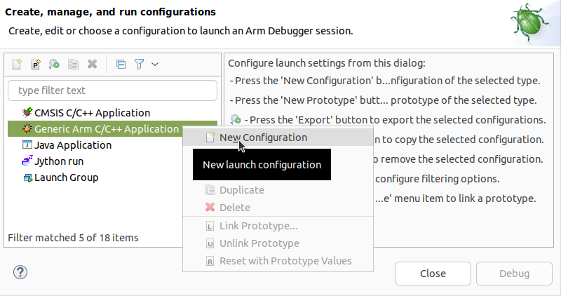
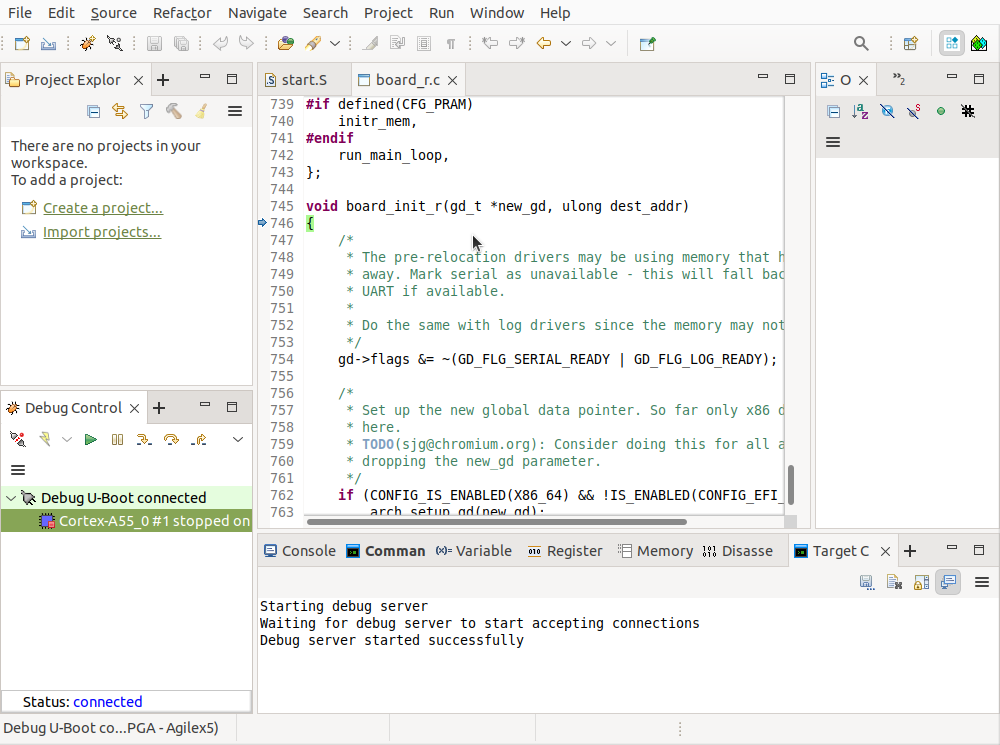

# Debugging U-Boot with Arm Development Studio Tutorial Example Design: Agilex™ 5 Premium Development Kit

## Introduction

Arm* Development Studio for Altera® SoC FPGAs is an Eclipse based tool suite enabling Arm* software development and debugging for Altera® FPGAs.

This page demonstrates how to use Arm* Development Studio to debug U-Boot SPL and U-Boot. For further information about the tool, go to [Arm Development Studio](https://developer.arm.com/Tools%20and%20Software/Arm%20Development%20Studio).

## Prerequisites

The following are needed:

- Altera® Agilex™ 5 FPGA E-Series 065B Premium Development Kit, ordering code DK A5E065BB32AES1, with the HPS Enablement Board. Refer to [Agilex™ 5 FPGA E-Series 065B Premium Development Kit](https://www.intel.com/content/www/us/en/products/details/fpga/development-kits/agilex/a5e065b-premium.html) for information about the development kit.
- Host PC with:
  - 64 GB of RAM. Less will be fine for only exercising the binaries, and not rebuilding the GSRD.
  - Linux OS installed. Ubuntu 22.04LTS was used to create this page, other versions and distributions may work too
  - Serial terminal (for example GtkTerm or Minicom on Linux and TeraTerm or PuTTY on Windows)
  - Altera® Quartus<sup>&reg;</sup> Prime Pro Edition Version 25.1.1
  - Arm Development Studio 2024.1 or 2024.1-1

You will also need to compile the Agilex 5 GHRD Linux Boot Example targeting the HPS Enablement board, as described [here](https://altera-fpga.github.io/rel-25.1.1/embedded-designs/agilex-5/e-series/premium/boot-examples/ug-linux-boot-agx5e-premium/#boot-from-sd-card). 

## Debug U-Boot

1\. Build the example design specified in the [Prerequisites](#prerequisites) section.

2\. Write the SD card image $TOP_FOLDER/sd_card/sdcard.img to the micro SD card and insert it on the slot on the HPS Enablement Board.

3\. Set MSEL dipswitch to JTAG, as specified in the design from the [Prerequisites](#prerequisites) section, then power cycle the board. That will ensure the device is not configured from QSPI.

4\. Go to the folder where the example was built, add the Quartus® tools in the path:

```bash
cd $TOP_FOLDER
export QUARTUS_ROOTDIR=~/altera_pro/25.1.1/quartus/
export PATH=$QUARTUS_ROOTDIR/bin:$QUARTUS_ROOTDIR/linux64:$QUARTUS_ROOTDIR/../qsys/bin
```
5\. Configure the device with the 'debug' SOF, which contains an empty loop HPS FSBL, designed specifically for a debugger to connect afterwards:

```bash
quartus_pgm -c 1 -m jtag -o "p;agilex5_soc_devkit_ghrd/output_files/legacy_baseline_hps_debug.sof"
```

6\. Start Arm* DS Eclipse using a new workspace in the current folder:

```bash
cd $TOP_FOLDER
/opt/arm/developmentstudio-2024.1/bin/suite_exec -t "Arm Compiler for Embedded 6" bash
armds_ide -data workspace &
```

7\. In Eclipse go to **Run** > **Debug Configurations** then select the **Generic Arm/C++ Application** and select **New launch configuration**: 



8\. Change the **Name** of the configuration as **Debug U-Boot**. Select target as **Intel SoC FPGA** > **Agilex 5** > **Bare Metal Debug** > **Cortex-A55_0**. Select target connection as **Intel FPGA Download Cable**:


9\. Click on the **Connections** > **Browse** button and select the board connection, then click the **Select** button:


10\. In the **Debugger** tab, select **Connect Only**, click **Execute debugger commands** and enter the desired debugging commands shown below. Also uncheck **Use default** for the **Host working directory** and enter the parent folder of the workspace: "${workspace_loc}/../" :


If you want to just load U-Boot SPL and start debugging it, enter the following debugging commands:

```bash
interrupt
restore "u-boot-socfpga/spl/u-boot-spl-dtb.bin" binary 0x0
loadfile "u-boot-socfpga/spl/u-boot-spl"
set $PC = 0x0
```

If you want to run U-Boot SPL to completion, up to the point where it decides what to load as next boot stage, add the following commands:

```bash
thb board_boot_order
continue
wait 60s
```

If after running U-Boot SPL to completion you want to load and run U-Boot, add the following commands:

```bash
set var $AARCH64::$Core::$X1 = 0
set spl_boot_list[0]=0
set $PC=$LR
restore "u-boot-socfpga/u-boot.itb" binary 0x82000000
continue
```

Instead, if you want to load U-Boot and start debugging it, replace the previous **continue** command with the following:

```bash
symbol-file "u-boot-socfpga/u-boot" 
thb el2:relocate_code
continue
wait 60s
symbol-file "u-boot-socfpga/u-boot" ((gd_t*)$x18)->reloc_off
thb board_init_r
continue
wait 60s
```

11\. Click on the **Debug** button at the bottom of the **Debug Configurations** window. Eclipse Arm* DS will connect to the board and execute the debugger instructions.

If you opted to debug U-Boot SPL the window will look as below, showing U-Boot SPL stopped at its entry point:


If you opted to debug U-Boot, it will show it stopped at board_init_r, after the symbol relocation:



At this point, all the debugging features of Eclipse are available, such as:

* Viewing and editing variables and registers
* Setting breakpoints


**Note:** Current Arm* DS 2024.1 release has an issue in that stepping through U-Boot code leads to an U-Boot exception and crash. You can set breakpoints, run up to them, look at variables, resume execution etc. Just stepping through the code causes the error. The issue does not happen when stepping through the U-Boot SPL.