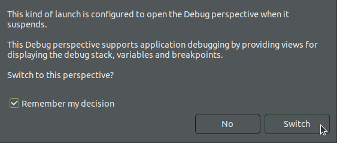

## Introduction

RiscFree* is Ashling’s Eclipse* C/C++ Development Toolkit (CDT) based integrated development environment (IDE) for Altera® FPGAs Arm*-based HPS and RISC-V based Nios® V processors.

This page demonstrates how to use RiscFree* to debug U-Boot SPL and U-Boot.

For further information about RiscFree*, consult [Ashling RiscFree* IDE for Altera® FPGAs User Guide](https://www.intel.com/content/www/us/en/docs/programmable/730783/24-3.html).

## Prerequisites

The following are needed:

- Altera® Agilex™ 5 FPGA E-Series 065B Premium Development Kit, ordering code DK A5E065BB32AES1, with the HPS Enablement Board. Refer to [Agilex™ 5 FPGA E-Series 065B Premium Development Kit](https://www.intel.com/content/www/us/en/products/details/fpga/development-kits/agilex/a5e065b-premium.html) for information about the development kit.

- Host PC with:
  - 64 GB of RAM. Less will be fine for only exercising the binaries, and not rebuilding the GSRD.
  - Linux OS installed. Ubuntu 22.04LTS was used to create this page, other versions and distributions may work too
  - Serial terminal (for example GtkTerm or Minicom on Linux and TeraTerm or PuTTY on Windows)
  - Altera® Quartus<sup>&reg;</sup> Prime Pro Edition Version 25.1

You will also need to compile the Agilex 5 GHRD Linux Boot Example targeting the HPS Enablement board, as described [here](https://altera-fpga.github.io/rel-25.1/embedded-designs/agilex-5/e-series/premium/boot-examples/ug-linux-boot-agx5e-premium/#boot-from-sd-card). 

## Debug U-Boot

1\. Build the example design specified in the [Prerequisites](#prerequisites) section.

2\. Write the SD card image $TOP_FOLDER/sd_card/sdcard.img to the micro SD card and insert it on the slot on the HPS Enablement Board.

3\. Set MSEL dipswitch to JTAG, as specified in the design from the [Prerequisites](#prerequisites) section, then power cycle the board. That will ensure the device is not configured from QSPI.

4\. Go to the folder where the example was built, add the Quartus and RiscFree* tools in the path:

```bash
cd $TOP_FOLDER
export QUARTUS_ROOTDIR=~/altera_pro/25.1/quartus/
export PATH=$QUARTUS_ROOTDIR/bin:$QUARTUS_ROOTDIR/linux64:$QUARTUS_ROOTDIR/../qsys/bin:$QUARTUS_ROOTDIR/../riscfree/RiscFree:$PATH
```
5\. Configure the device with the 'debug' SOF, which contains an empty loop HPS FSBL, designed specifically for a debugger to connect afterwards:

```bash
quartus_pgm -c 1 -m jtag -o "p;agilex5_soc_devkit_ghrd/output_files/legacy_baseline_hps_debug.sof"
```

6\. Start RiscFree* Eclipse using a new workspace in the current folder:

```bash
cd $TOP_FOLDER
RiscFree -data workspace &
```

7\.  In Eclipse, go to **Run** > **Debug Configurations**, this will open the **Debug Configurations** window.

8\. In the **Debug Configurations** window, select **Ashling Arm Hardware Debugging** on the left panel, right-click it then select **New Configuration** from the menu.


9\. Edit the configuration as follows

* Change the **Name** to "Debug U-Boot"
* Go to the **Debugger** tab
* Select the **Debug Probe** from the drop down to match your board
* Click on the **Auto-detect Scan Chain** to discover the Arm cores
* Check the first **Cortex-A55** in the list to enable debugging for it

The window will look similar to this:


10\. Go to the **Startup** tab, and change the configuration as follows:

* Uncheck **Load image**
* Uncheck **Load symbols**
* Uncheck **Set breakpoint at**
* Uncheck **Resume**

The window will look similar to this:


Then add in the **Run Commands** box the following commands that will enable you to load U-Boot SPL and start debugging it:

```bash
interrupt
delete breakpoints
set breakpoint always-inserted on
set mem inaccessible-by-default on
mem 0x00000000 0x0007FFFF rw
mem 0x80000000 0xFFFFFFFF rw
mem 0x880000000 0xFFFFFFFFFF rw
set confirm off
restore u-boot-socfpga/spl/u-boot-spl-dtb.bin binary 0x0
symbol-file u-boot-socfpga/spl/u-boot-spl
set $pc=0x0
step
```

If you have watchdog(s) enabled, you also need to add the following instructions in the above sequence, between 'interrupt' and 'delete breakpoints' commands, in order to disable watchdog while debugging:

```bash
monitor memwrite APB:0x15c20140 0x03
monitor memwrite APB:0x15c20020 0x01
monitor memwrite APB:0x1580d000 0x01
monitor memwrite APB:0x1580d0b8 0x01
monitor memwrite APB:0x1580d0bc 0x01
monitor memwrite APB:0x1580d0c0 0x01
monitor memwrite APB:0x1580d0c4 0x01
monitor memwrite APB:0x1580d0c8 0x02
monitor memwrite APB:0x1580d0cc 0x02
monitor memwrite APB:0x1580d0d0 0x02
monitor memwrite APB:0x1580d0d4 0x02
monitor memwrite APB:0x1580d140 0x03
```

*Note*: The above commands will be performed automatically in a future version of RiscFree.

If you want to run U-Boot SPL up to where it decides which image to load next, add the following lines to the previous step:

```bash
thb board_boot_order
continue
```

If then you want to load U-Boot and start debugging it, add the following lines to the previous step, which will load U-Boot, run it until the memory is relocated, perform the relocation, then drop to debugging mode

```bash
delete breakpoints
set spl_boot_list[0]=0
set $pc=$lr
set $x0=0
restore u-boot-socfpga/u-boot.itb binary 0x82000000
symbol-file "u-boot-socfpga/u-boot" 
thb relocate_code
continue
delete breakpoints
set $offset = ((gd_t*)$x18)->reloc_off
symbol-file
add-symbol-file u-boot-socfpga/u-boot -o $offset
thb board_init_r
continue
```

If you only want to run U-Boot, without debugging it, then remove the "thb board_init_r" from the above script, so it would not stop at the beginning of U-Boot, and instead continue running it.

11\. Click the **Debug** button on the bottom of the window. Eclipse will warn that the program file was not specified. Click **Yes** to proceed with the launch.


12\. Eclipse will suggest to move to the debug perspective. Click **Switch** to accept:



13\. Eclipse will then run the specified sequence of instructions. 

When the instructions for debugging U-Boot SPL were used, after running them, Eclipse will show the U-Boot SPL started:


When the instructions for debugging U-Boot were used, after running them, Eclipse will show the U-Boot started:


At this point, all the debugging features of Eclipse are available, such as:

* Viewing and editing variables and registers
* Setting breakpoints
* Controlling execution: run step by step, step into functions 
