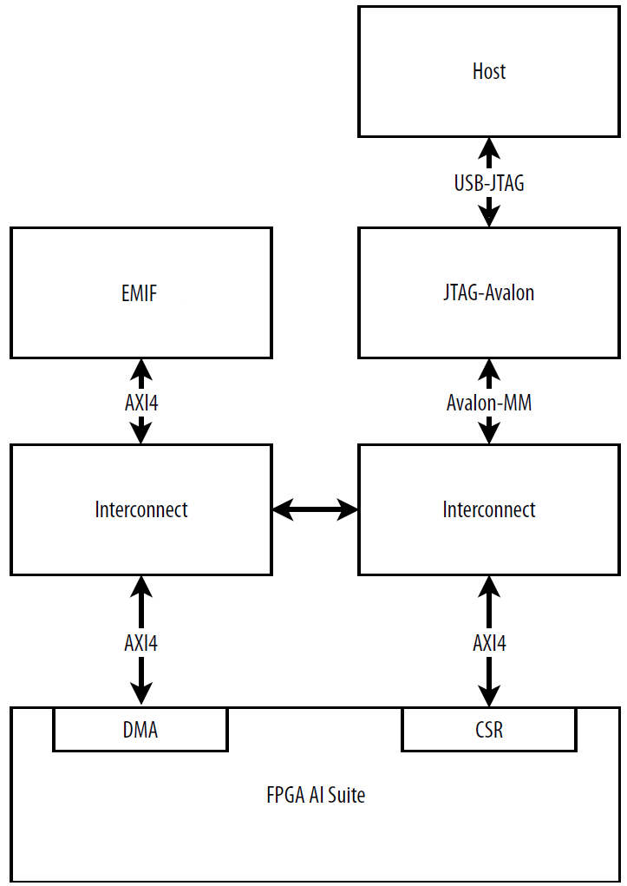

# 1.0 FPGA AI Suite JTAG System Example Design


# 4.0 Getting Started

The hostless JTAG design example example demonstrates how to instantiate one instance of the FPGA AI Suite IP on an Agilex 5 E-Series device or Agilex 3 C-Series device.

It places configurations and data on external DDR memory and allows an external host to interact with the memory and FPGA AI Suite IP via JTAG.

This design example targets the **Agilex 5 FPGA E-Series 065B Modular Development Kit** (MK-A5E065BB32AES1) or **Agilex 3 FPGA C-Series Development Kit** (A3CY135BM16AE6S).

This section describes the steps to build the necessary components and commands to launch inference with the `dla_benchmark` application.

## 4.1 Prerequisites

### 4.1.1 Software Requirements

You should install the FPGA AI Suite and OpenVINO according to the steps in the [FPGA AI Suite Handbook](https://docs.altera.com/r/docs/863373/2026.1.1/fpga-ai-suite-handbook/fpga-ai-suite-handbook).

To generate the bitstream files for this design example, you require the following components from Quartus Prime Pro Edition Version 25.3 or later:
* Quartus Prime software
* Agilex 5 E-Series device support or Agilex 3 C-Series device support depending on your chosen target

For host-FPGA device communication, and to configure either the Agilex 5 FPGA E-Series or Agilex 3 FPGA C-Series, you require the following components from Quartus Prime Pro Edition Version 26.1 or later:
* Quartus Prime Programmer
* Quartus Prime System Console

### 4.1.2 Hardware Requirements

The JTAG design example can be deployed on one of the following:

* Agilex 5 FPGA E-Series 065B Modular Development Kit (MK-A5E065BB32AES1)
* Agilex 3 FPGA C-Series Development Kit (A3CY135BM16AE6S)

Enable JTAG programming for the development kit as follows:

* Agilex 5 E-Series: Enable JTAG programming on the development kit board by setting the board switches SW4[1:2] to [OFF, OFF].
* Agilex 3 C-Series: Enable JTAG programming on the Agilex 3 development kit board by setting switches SW[1:4] to [OFF,OFF,OFF,OFF]

1. On the host computer, ensure that the necessary USB port rules and permissions are enabled by creating a `/etc/udev/rules.d/51-altera-usbblaster.rules` file with the following content:

    ```
    SUBSYSTEM=="usb", ATTR{idVendor}=="09fb", ATTR{idProduct}=="6001", MODE="0666"
    SUBSYSTEM=="usb", ATTR{idVendor}=="09fb", ATTR{idProduct}=="6002", MODE="0666"
    SUBSYSTEM=="usb", ATTR{idVendor}=="09fb", ATTR{idProduct}=="6003", MODE="0666"
    SUBSYSTEM=="usb", ATTR{idVendor}=="09fb", ATTR{idProduct}=="6010", MODE="0666"
    SUBSYSTEM=="usb", ATTR{idVendor}=="09fb", ATTR{idProduct}=="6810", MODE="0666"
    SUBSYSTEM=="usb", ATTR{idVendor}=="0403", ATTR{idProduct}=="6001", MODE="0666"
    SUBSYSTEM=="usb", ATTR{idVendor}=="0403", ATTR{idProduct}=="6002", MODE="0666"
    SUBSYSTEM=="usb", ATTR{idVendor}=="0403", ATTR{idProduct}=="6003", MODE="0666"
    SUBSYSTEM=="usb", ATTR{idVendor}=="0403", ATTR{idProduct}=="6010", MODE="0666"
    SUBSYSTEM=="usb", ATTR{idVendor}=="0403", ATTR{idProduct}=="6810", MODE="0666"
    ```

2. Change the port permission of the JTAG-USB connection to `0666`.
    
    Use the `lsusb` command to determine the bus and device numbers for adjusting permissions.
    
    For example, the command `lsusb` outputs the following bus and device path for devices on the development kit,
    
    ```
    Bus 002 Device 006: ID 09fb:6010 Altera
    Bus 002 Device 007: ID 0403:6010 Future Technology Devices International, Ltd FT2232C/D/H Dual UART/FIFO IC
    ```
    
    With this information, adjust the permissions with the following commands:
    
    ```bash
    sudo chmod 0666 /dev/bus/usb/002/006
    sudo chmod 0666 /dev/bus/usb/002/007
    ```

## 4.2 Building the FPGA AI Suite Runtime

Before you can run inference on the design example, build the FPGA AI Suite runtime using the provided `build_runtime.sh` script as follows:

1. Ensure that you have a working directory created as outlined in ["Creating a Working Directory" in FPGA AI Suite Getting Started Guide](https://docs.altera.com/r/docs/863373/2026.1.1/fpga-ai-suite-handbook/creating-a-working-directory).

2. Run the following commands:
   ```bash
   cd $COREDLA_WORK
   source $COREDLA_ROOT/bin/dla_init_local_directory.sh
   cd runtime
   ./build_runtime.sh -target_system_console
   ```

A successful build of the runtime creates the following objects:

* `<runtime-directory>/build_Release/libcoreDlaRuntimePlugin.so`
  A runtime library that has the APIs for the host to access the FPGA AI Suite IP's registers and memories in the design example.

* `<runtime-directory>/build_Release/system_console_script.tcl`
  A script that the runtime invokes via the Quartus Prime System Console to set up the JTAG services to access the memories and CSR registers in the design example.

* `<runtime-directory>/build_Release/dla_benchmark/dla_benchmark`
  The `dla_benchmark` application.

If you run into the following error, check if `/sbin` appears near the start of the list of paths in your PATH environment variable:

```
Imported target "Boost::filesystem" includes non-existent path "/include"
```

Your PATH environment variable does not need to include `/sbin` for the JTAG design example.

## 4.3 Building an FPGA Bitstream for the JTAG Design Examples

To generate an FPGA bitstream for the JTAG Design Example, run the following commands:


### For the Agilex 5 FPGA E-Series 065B Modular Development Kit (MK-A5E065BB32AES1):
```bash
cd $COREDLA_WORK

$COREDLA_ROOT/bin/dla_build_example_design.py build \
--output-dir build_agx5_jtag_ed \
--num-instances 1 \
--seed 1 \
agx5e_modular_jtag \
$COREDLA_ROOT/example_architectures/AGX5_Generic.arch
```
This command creates the bitstream file called `AGX5_Generic.sof` that can be found in the `$COREDLA_WORK/build_agx5_jtag_ed/` folder.

### For the Agilex 3 FPGA C-Series Development Kit (A3CY135BM16AE6S):

```bash
cd $COREDLA_WORK

$COREDLA_ROOT/bin/dla_build_example_design.py build \
--output-dir build_agx3_jtag_ed \
--num-instances 1 \
--seed 1 \
agx3c_jtag \
$COREDLA_ROOT/example_architectures/AGX3_Small_NoSoftmax.arch
```
This command creates the bitstream file called `AGX3_Small_NoSoftmax.sof` that can be found in the `$COREDLA_WORK/build_agx3_jtag_ed/` folder.

For more information about the `dla_build_example_design.py` command, refer to The [`dla_build_example_design.py`](#311-the-dla_build_example_designpy-command).

## 4.4 Programming the FPGA Device

Before you program the FPGA device, ensure that the USB-JTAG connection and port permissions are set up as described in [Hardware Requirements](#412-hardware-requirements).

Program the FPGA device with Quartus Prime Programmer and FPGA bitstream that you generated in [Building an FPGA Bitstream for the JTAG Design Examples](#43-building-an-fpga-bitstream-for-the-jtag-design-example) with the following commands:

```bash
cd $COREDLA_WORK/build_agx5_jtag_ed
quartus_pgm -c 1 -m jtag -o "p;AGX5_Generic.sof"
```

## 4.5. Preparing Graphs for Inference with FPGA AI Suite

Before running any demonstration application, you must convert the trained model to the Inference Engine format (.xml, .bin) with the OpenVINO Model Optimizer.

For details on creating the .bin/.xml files, refer to the FPGA AI Suite Getting Started Guide.

The network as described in the .xml and .bin files (created by the Model Optimizer) is compiled for a specific FPGA AI Suite architecture file by using the FPGA AI Suite compiler.

The FPGA AI Suite compiler compiles the network and exports it to a .bin file that uses the same .bin format as required by the OpenVINO Inference Engine.

This .bin file created by the compiler contains the compiled network parameters for all the target devices (FPGA, CPU, or both) along with the weights and biases. The inference application imports this file at runtime.

The FPGA AI Suite compiler can also compile the graph and provide estimated area or performance metrics for a given architecture file or produce an optimized architecture file.

For more details about the FPGA AI Suite compiler, refer to the FPGA AI Suite Compiler Reference Manual.

## 4.6. Performing Inference on the Agilex 5 FPGA E-Series or Agilex 3 FPGA C-Series

After the FPGA device on the targeted FPGA device has been programmed you can perform inference.

For this system example design, the FPGA AI Suite runtime needs the locations of the following items before performing inference:

* **Bitstream file location**
  The default bitstream path is `top.sof` located in the `$COREDLA_WORK` directory. You can override this default location by specifying the `$DLA_SOF_PATH` environment variable.

* **Quartus Prime System Console Tcl script** (required to properly claim JTAG services)
  The default script is `$COREDLA_WORK/runtime/build_Release/system_console_script.tcl`. You can override this value by specifying the `$DLA_SYSCON_SOURCE_FILE` environment variable.

Perform inference by running the following command:

**For Agilex 5 E-Series:**

```bash
# Modify MODEL to suit your application
export DLA_SOF_PATH=$COREDLA_WORK/build_agx5_jtag_ed/AGX5_Generic.sof
export MODEL=<path-to-model-XML-file>/resnet50.xml
cd $COREDLA_WORK/runtime/build_Release/dla_benchmark
dla_benchmark \
-b=1 \
-m=$MODEL \
-d=HETERO:FPGA,CPU \
-i <path-to-image-files> \
-niter=2 \
-plugins=../../plugins.xml \
-arch_file= $COREDLA_ROOT/example_architectures/AGX5_Generic.arch \
-api=async \
-perf_est \
-nireq=1 -dump_output -report_lsu_counters -enable_early_access
```

**For Agilex 3 C-Series**

```bash
# Modify MODEL to suit your application
export DLA_SOF_PATH=$COREDLA_WORK/build_agx3_jtag_ed/AGX3_Small_NoSoftmax.sof
export MODEL=<path-to-model-XML-file>/resnet50.xml
cd $COREDLA_WORK/runtime/build_Release/dla_benchmark

dla_benchmark \
-b=1 \
-m=$MODEL \
-d=HETERO:FPGA,CPU \
-i <path-to-image-files> \
-niter=2 \
-plugins=../../plugins.xml \
-arch_file= $COREDLA_ROOT/example_architectures/AGX3_Small_NoSoftmax.arch \
-api=async \
-perf_est \
-nireq=1 -dump_output -report_lsu_counters -enable_early_access
```

By default, the `dla_benchmark` application records the system-console commands that are executed during inference in a log file named `csr_log.txt` in the current work directory, and preserves the intermediate files created during inference. To prevent the creation of the log file and intermediate files, specify the `-dump_csr=false` of the dla_benchmark command.

For more information about the `dla_benchmark` application, refer to [Performing Accelerated Inference with the `dla_benchmark` Application](https://altera-fpga.github.io/rel-26.1/ed-ai-suite/agilex7/pcie/pcie_getting_started_extended/).

## 4.7 Inference Performance Measurement

The `dla_benchmark` application reports inference duration and throughput for the entire design example as well as for the FPGA AI Suite IP.

To perform one inference iteration, the host performs the following steps:

1. Write input data via JTAG to the DDR memory on the FPGA development board.
2. Program CSRs on the FPGA AI Suite IP to start inference.
3. Poll the CSRs until the FPGA AI Suite IP completes the inference.
4. Read the output from the DDR memory to the host via JTAG.

The system duration accounts for all these steps above.

In contrast, the IP duration omits the duration of input and output data transfer.

For this design example, system duration is usually much larger than the IP duration because data transfer over JTAG is relatively slow. Thus, the IP duration and throughput better reflect the performance of the FPGA AI Suite IP.

The following output is an example throughput report generated by the `dla_benchmark` application after performing 3925 inferences on a quantized ResNet-18 model using the Agilex 5 E-Series Development Kit Board:

```
[Step 11/12] Dumping statistics report
count: 3925 iterations
system duration: 464549.5363 ms
IP duration: 17945.7971 ms
latency: 118.2524 ms
system throughput: 8.4490 FPS
number of hardware instances: 1
number of network instances: 1
IP throughput per instance: 218.7142 FPS
IP throughput per fmax per instance: 1.0936 FPS/MHz
IP clock frequency: 200.0000 MHz
```

## 4.8 Known Issues and Limitations

The JTAG design example has the following known issues and limitations:

* The number of inference request (-nireq) must be 1 when running `dla_benchmark` with either the Agilex 5 E-Series or Agilex 3 C-Series JTAG Example Designs.

* The USB-JTAG connection between the host and the FPGA is relatively slow, so the system throughput is much lower than both the measured and estimated IP throughputs per instance.

* For FPGA AI Suite IP configured with large K<sub>vec</sub> and C<sub>vec</sub> parallelism, the peak throughput of the DDR4 interface on the Agilex 5 FPGA E-Series 065B Modular Development Kit can become the bottleneck. When you run the `dla_benchmark` application with the flag `-perf_est`, the application provides a throughput estimation that does not fully account for the limited external memory bandwidth on the development kit, so the estimate might be higher than the measured IP throughput per instance.

* On Ubuntu 22 systems, the runtime might fail when loading model to the FPGA device if the `$DLA_SOF_PATH` environment variable does not point to the correct bitstream file, or if the Quartus Prime System Console `system-console` command is not present in the `$PATH` environment variable.

The Quartus Prime System Console command is in `$QUARTUS_ROOTDIR/syscon/bin`.

```
[Step 5/12] Resizing network to match image sizes and given batch
[Step 6/12] Configuring input of the model
[Step 7/12] Loading the model to the device
Generating unsupported layer chains graph (./unsupported_layer_chains.dot)
Using the Tcl setup script at /home/user/coredla-work/runtime/build_Release/system_console_script.tcl
Saving temporary files to /home/user/Downloads
Segmentation fault (core dumped)
```

* You might occasionally see the following Quartus Prime System Console error when running inference with the runtime on this design example:

```
claim_service: Path cannot be found while executing
"claim_service master $path {}
"\{${::g_const_master_offset_dla} ${::g_const_master_range_dla} EXCLUSIVE\}""
procedure "claim_dla_csr_service" line 4)
invoked from within"claim_dla_csr_service"
procedure "initialization" line 4)
invoked from within
"initialization"
```

To recover from the issue, reprogram the FPGA with the correct bitstream and rerun the dla_benchmark application. To reduce the likelihood of this issue, lower the JTAG clock frequency to 16 MHz before running the run the dla_benchmark application:

```bash
jtagconfig --setparam 1 JtagClock 16M
```

# 5 Design Example Components

## 5.1 Hardware Components

The FPGA AI Suite JTAG design example uses a JTAG-USB connection on the development kit to facilitate host-FPGA transactions. The following diagram shows a simplified block diagram of the design.

### Figure 1: Simplified System Design of the JTAG Design Example



The design example stores filter weights, biases, configurations for the FPGA AI Suite IP, graph inputs, outputs, and intermediate data on the lower 2GB of a DDR4/LPDDR4 memory interface, similar to the PCIe-based design examples. An external memory interface (EMIF) IP manages the DDR4/LPDDR4 memory and toggles the 32-bit interface at 1600 MT/s for the Agilex 5 E-Series development kit board and 2133 Mb/s for the Agilex 3 E-Series development kit board.

For the Agilex 5 example design, the FPGA AI Suite IP can typically meet timing at around 300 MHz and accesses the EMIF IP via a 128-bit AXI4 data interface clocked at 200 MHz. The IP can only access the first 2GB of the memory. For the Agilex 3 version, the FPGA AI Suite IP can meet timing at around 400 MHz and use the EMIF IP at 200 MHz.

The host uses a JTAG-Avalon Bridge IP to access the DDR4 memory, as well as the CSR registers of the FPGA AI Suite IP via a 32-bit Avalon-MM interface clocked at 100 MHz. As seen from the JTAG-Avalon Bridge IP, the subordinates reside at the addresses outlined in the following table:

### Table 1: Subordinate Addresses Accessible from the JTAG-Avalon Interface

| External Memory | FPGA AI Suite IP CSRs |
|-----------------|----------------------|
| Address Range (Bytes) | 0x0000_0000 – 0x7FFF_FFFF | 0x8000_0000 – 0x8000_0FFF |

To investigate and modify the implementation of the hardware components, review the source files of the system design part of the design example in the `$COREDLA_ROOT/platform/a5e_modular_devkit_jtag` directory. For users who targeted the Agilex 3 development kit, these files can be found in `$COREDLA_ROOT/platform/agx3c_jtag directory`.

## 5.2. Software Components

The JTAG design example relies on the following software components to executed FPGA inference via the `dla_benchmark` application:

* OpenVINO Toolkit
* FPGA AI Suite Runtime Plugin
* Quartus Prime System Console

When the build target is this design example, the FPGA AI Suite Runtime Plugin instantiates an MMD Wrapper object that converts external memory and FPGA AI Suite CSR access commands into Quartus Prime System Console calls. The MMD wrapper depends on the Boost C++ Libraries. The definitions of the MMD wrapper object and its methods are implemented in `$COREDLA_WORK/runtime/coredla_device/mmd/system_console/mmd_wrapper.cpp`.

Upon instantiation, the MMD wrapper initializes the JTAG services via the routine in a Quartus Prime System Console script: `$COREDLA_WORK/runtime/coredla_device/mmd/system_console/system_console.tcl`.