# 1.0 FPGA AI Suite SoC Design Example Quick Start Tutorial

The FPGA AI Suite Design Example User Guides describe the design and implementation for accelerating AI inference using the FPGA AI Suite, Intel® Distribution of OpenVINO™ toolkit, and various development boards (depending on the design example). They share a common introduction between each document, which serves as an introduction to the material. Section 4.0 begins the ED specific material.

## About the FPGA AI Suite Documentation Library

Documentation for the FPGA AI Suite is split across a few publications. Use the following table to find the publication that contains the FPGA AI Suite information that you are looking for:

### Table 1. FPGA AI Suite Documentation Library

| Title and Description | Link |
|----------------------|------|
| **Release Notes**<br>Provides late-breaking information about the FPGA AI Suite including new features, important bug fixes, and known issues. | [Link](https://docs.altera.com/r/docs/772497/2026.1.1/fpga-ai-suite-version-2026.1.1-release-notes/fpga-ai-suite-version-2026.1.1-release-notes) |
| **FPGA AI Suite Handbook**<br>Get up and running with the FPGA AI Suite by learning how to initialize your compiler environment and reviewing the various design examples and tutorials provided with the FPGA AI Suite <br>Describes the use modes of the graph compiler (`dla_compiler`). It also provides details about the compiler command options and the format of compilation inputs and outputs. | [Link](https://docs.altera.com/r/docs/863373/2026.1.1/fpga-ai-suite-handbook/fpga-ai-suite-handbook) |

# 2.0 FPGA AI Suite Design Examples

The following is a comprehensive list of the available FPGA AI Suite Design Example User Guides.

## Table 2. FPGA AI Suite Design Examples Descriptions

| Design Example | Description |
|---------------|-------------|
| [PCIe-attach design example](https://altera-fpga.github.io/rel-26.1/ed-ai-suite/agilex7/pcie/pcie_getting_started_extended/) | Demonstrates how OpenVINO toolkit and the FPGA AI Suite support the look-aside deep learning acceleration model.<br><br>This design example targets the Terasic* DE10-Agilex™ Development Board (DE10-Agilex-B2E2). |
| [OFS PCIe-attach design example](https://altera-fpga.github.io/rel-26.1/ed-ai-suite/agilex7/ofs/ofs_pcie_getting_started) | Demonstrates the OpenVINO toolkit and the FPGA AI Suite that target Open FPGA Stack (OFS)-based boards.<br><br>This design example targets the following Open FPGA Stack (OFS)-based boards:<br>* Agilex™ 7 FPGA I-Series Development Kit ES2 (DK-DEV-AGI027RBES)<br>* Silicom FPGA SmartNIC N6001-PL Platform (without Ethernet controller) |
| [Hostless DDR-Free design examples](https://altera-fpga.github.io/rel-26.1/ed-ai-suite/agilex7/hostless_ddr_free_ed/hostless_ddr_free_design_example) | Demonstrates hostless DDR-free operation of the FPGA AI Suite IP. Graph filters, bias, and FPGA AI Suite IP configurations are stored in internal memory on the FPGA device.<br><br>This design example targets the Agilex™ 7 FPGA I-Series Development Kit ES2 (DK-DEV-AGI027RBES). |
| [Hostless JTAG design example](https://altera-fpga.github.io/rel-26.1/ed-ai-suite/agilex5/hostless_jtag/hostless_jtag_design_example) | Demonstrates the step-by-step sequence of configuring FPGA AI Suite IP and starting inference by writing into CSRs directly via JTAG.<br><br>This design example targets the Agilex™ 5 FPGA E-Series 065B Modular Development Kit (MK-A5E065BB32AES1). |
| [SoC design example](https://altera-fpga.github.io/rel-26.1/ed-ai-suite/agilex5/soc/fpga_ai_suite_soc_design_example) | Demonstrates how OpenVINO toolkit and the FPGA AI Suite support the CPU-offload deep-learning acceleration model in an embedded system.<br><br>The design example targets the following development boards:<br>* Agilex™ 3 FPGA and SoC C-Series Development Kit (DK-A3W135BM16AEA)<br>* Agilex™ 5 FPGA E-Series 065B Modular Development Kit (MK-A5E065BB32AES1)<br>* Agilex™ 7 FPGA I-Series Transceiver-SoC Development Kit (DK-SIAGI027FC)<br>* Arria® 10 SX SoC FPGA Development Kit (DK-SOC-10AS066S) |

## Table 3. FPGA AI Suite Design Examples Properties Overview

| Example | Design Type | Target FPGA Device | Host | Memory | Stream* | Design Example Identifier** | Supported Development Kit |
|---------|-------------|-------------------|------|--------|---------|---------------------------|---------------------------|
| PCIe-Attached | Agilex™ 7 | External host processor | DDR | M2M | agx7_de10_pcie | [Terasic DE10-Agilex™ Development Board (DE10-Agilex™-B2E2)](https://www.terasic.com.tw/cgi-bin/page/archive.pl?Language=English&CategoryNo=142&No=1252) |
| PCIe-Attached| Agilex™ 7 |External host processor |DDR |M2M | agx7_iseries_ofs_pcie | [Agilex™ 7 FPGA I-Series Development Kit ES2 (DK-DEV-AGI027RBES)](https://www.altera.com/products/devkit/a1jui0000049utmmam/agilex-7-fpga-i-series-development-kit-2x-r-tile-and-1x-f-tile) |
| PCIe-Attached|Agilex™ 7 |External host processor |DDR |M2M | agx7_n6001_ofs_pcie | [Silicom FPGA SmartNIC N6001-PL Platform (without Ethernet controller)](https://www.altera.com/asap/offering/po-2750/silicom-fpga-smartnic-n60106011-n6001-pln6000-pl-arrow-creek) |
| Hostless DDR-Free | Agilex™ 7 | Hostless | DDR-Free | Direct | agx7_iseries_ddrfree | [Agilex™ 7 FPGA I-Series Development Kit ES2 (DK-DEV-AGI027RBES)](https://www.altera.com/products/devkit/po-3012/agilex-7-fpga-i-series-development-kit-2x-r-tile-and-1x-f-tile) |
| Hostless JTAG Attached | Agilex™ 5 |Hostless | DDR | M2M | agx5e_modular_jtag | [Agilex™ 5 FPGA E-Series 065B Modular Development Kit (MK-A5E065BB32AES1)](https://www.altera.com/products/devkit/po-3274/agilex-5-fpga-and-soc-e-series-065b-modular-development-kit) |
|SoC | Agilex™ 3 |On-device HPS |DDR |M2M | agx3_soc_m2m<br> | [Agilex™ 3 FPGA and SoC C-Series Development Kit (DK-A3W135BM16AEA)](https://www.altera.com/products/devkit/po-3000/agilex-3-fpga-and-soc-c-series-development-kit) |
|SoC | Agilex™ 5 |On-device HPS |DDR |M2M and S2M | agx5_soc_m2m<br>agx5_soc_s2m | [Agilex™ 5 FPGA E-Series 065B Modular Development Kit (MK-A5E065BB32AES1)](https://www.altera.com/products/devkit/po-3274/agilex-5-fpga-and-soc-e-series-065b-modular-development-kit) |
| SoC | Agilex™ 7 | On-device HPS | DDR | M2M and S2M | agx7_soc_m2m<br>agx7_soc_s2m | [Agilex™ 7 FPGA I-Series Transceiver-SoC Development Kit (DK-SIAGI027FC)](https://www.altera.com/products/devkit/po-3013/agilex-7-fpga-i-series-transceiver-soc-development-kit-4x-f-tile) |
|SoC | Arria® 10 |On-device HPS |DDR |M2M and S2M | a10_soc_m2m<br>a10_soc_s2m | [Arria® 10 SX SoC FPGA Development Kit (DK-SOC-10AS066S)](https://www.altera.com/products/devkit/po-3006/arria-10-sx-soc-development-kit) |

\*For the **Design Example Identifier** column, these entries are the value to use with the FPGA AI Suite Design Example Utility (`dla_build_example_design.py`) command to build the design example

\*\*For the Stream column, the entries are defined as follows:

**M2M** FPGA AI Suite runtime software running on the external host transfers the image (or data) to the FPGA DDR memory.

**S2M** Streaming input data is copied to FPGA on-device memory. The FPGA AI Suite runtime runs on the FPGA device (HPS or RTL state machine). The runtime is used only to coordinate the data transfer from FPGA DDR memory into the FPGA AI Suite IP.

**Direct** Data is streamed directly in and out of the FPGA on-chip memory.

# 3.0 Shared Design Example Components

## 3.1. FPGA AI Suite Design Example Utility

The main entry point into the example design build system is the FPGA AI Suite design example utility (`dla_build_example_design.py`). This utility coordinates different aspects of building a design example, from the initial project configuration to extracting area metrics after a compile completes. With this utility, you can create bitstreams from custom AI Suite IP architecture files and with a configurable number of instances.

*Note: There is no '.py' extension on `dla_build_example_design` when using the FPGA AI Suite on Windows.*

To use the FPGA AI Suite design example build utility, ensure that your local development environment has been setup according to the steps in ["Installing FPGA AI Suite Compile and IP Generation Tools" in FPGA AI Suite Handbook](https://docs.altera.com/r/docs/863373/2026.1.1/fpga-ai-suite-handbook/installing-the-fpga-ai-suite-compiler-and-ip-generation-tools).

### 3.1.1. The `dla_build_example_design.py` Command

The FPGA AI Suite design example utility (`dla_build_example_design.py`) configures and compiles the bitstreams for the FPGA AI Suite design examples. The command has the following basic syntax:

```
dla_build_example_design.py [--logfile logfile] [--debug] [action]
```

where [action] is one of the following actions:

#### Table 4. Design Example Utility Actions

| Action | Description |
|--------|-------------|
| `list` | List the available example designs. |
| `build` | Build an example design. |
| `qor` | Generate QoR reports. |
| `quartus-compile` | Run a Quartus® Prime compile. |
| `scripts` | Managed the build support scripts. |

Some of the command actions have different additional required and optional parameters. Use the command `help` to see a list of available options for the command and its actions.

By default, the `dla_build_example_design.py` command always instructs the `dla_create_ip` command to create licensed IP. If no license can be found, inference-limited, unlicensed RTL is generated. The build log indicates if the IP is licensed or unlicensed. For more information about licensed and unlicensed IP, refer to ["The --unlicensed/--licensed Options" in FPGA AI Suite IP Reference Manual](https://www.intel.com/content/www/us/en/docs/programmable/863373/2025-3/ip-generation-utility-outputs.html).

#### Getting `dla_build_example_design.py` Command Help

For general help with the command and to see the list of available actions, run the following command:

```
dla_build_example_design.py --help
```

For help with a command actions and to the list of available options and arguments required for an action, run the following command:

```
dla_build_example_design.py action --help
```

#### Command Logging and Debugging

By default, the FPGA AI Suite design example utility logs its output to a set location in the (default) `build_platform` directory. Override this location by specifying the `--logfile` *logfile* option.

For extra debugging output, specify the `--debug` option.

Both the logging and debugging options must be specified before the command action.

### 3.1.2. Listing Available FPGA AI Suite Design Examples

To list the available FPGA AI Suite design examples, run the following command:

```
dla_build_example_design.py list
```

This command shows the design example identifiers (used with the build action of the design example utility) along with a short description of the design example and its target Quartus Prime version.

A list of the design examples and their identifiers is also available in [FPGA AI Suite Design Examples Properties Overview](#table-3-fpga-ai-suite-design-examples-properties-overview).

### 3.1.3. Building FPGA AI Suite Design Examples

To build FPGA AI Suite design examples, specify the build option of the design example utility.

In the most simple case of building a design example for an existing architecture, you can build a design example with the following command:

```
dla_build_example_design.py build \
<design_example_identifier> \
<architecture file>
```

For example, use the following command to build the Agilex™ 7 PCIe-based design example that targets the **DE10-Agilex-B2E2** board using the AGX7_Generic architecture:

```
dla_build_example_design.py build \
agx7_de10_pcie \
$COREDLA_ROOT/example_architectures/AGX7_Generic.arch
```

The default build directory is `build_platform`. The utility creates the folder if it does not exist. To specify a different build directory, specify the `--output-dir <directory>` option:

```
dla_build_example_design.py build \
--output-dir <directory> \
<design_example_identifier> \
<architecture file>
```

Be default, the utility also prevents the build directory from being overwritten. You can override this behavior with the `--force` option.

After the build is complete, the build directory has the following files and folders:

* **coredla_ip/**
This folder contains the RTL for the configured FPGA AI Suite IP.

* **hw/**
This folder contains the Quartus Prime or Open FPGA Stack (OFS) project files. It also includes its own self-contained copy of the contents of the `coredla_ip/` folder

* **.build.json**
This contents of this file (sometimes referred to as the "build context" file) allow the build to be split into multiple steps.

* **Reports**
The build directory will contain any log files generated by the build utility (such as `build.log`) and the QoR summary that is generated by a successful compilation.

* **Bitstreams**
This build directory will contain the bitstreams to program the target FPGA device as follows:
  - For OFS-based designs, `.gbs` files.
  - For other designs, `.sof` and `.rbf` files.

#### 3.1.3.1. Staging FPGA AI Suite Design Example Builds

The FPGA AI Suite design example utility supports staged builds via the `--skip-compile` option. When you specify this option, the utility creates the build folder and prepares the Quartus Prime or Open FPGA Stack (OFS) project but does not run compilation.

With a staged design example build flow, you must run the utility a few times to generate the same outputs as the regular build flow. For a complete build with a staged build flow, you would run the following commands:

```
dla_build_example_design.py build --skip-compile \
<design_example_identifier> \
<architecture file>
dla_build_example_design.py quartus-compile build_platform
# Optional: Generate QoR summary
dla_build_example_design.py qor build_platform
```

Information about the build configuration, namely what was passed into the `dla_build_example_design.py` build command, is stored inside of the build context (`.build.json`) file.

You can run the `dla_build_example_design.py quartus-compile` and `dla_build_example_design.py qor` commands multiple times. An example of when running these commands multiple times can be useful is when you have to recompile the bitstream after removing an unnecessary component from the design example.

You can also directly call the design compilation script. An FPGA AI Suite design example uses one of the following scripts, depending on whether the design example can built in a WSL 2 environment:

* **generate_sof.tcl**
Design examples with this design compilation script can be built in a WSL 2 environment.

* **build_project.sh**
Design examples with this design compilation script cannot be built in a WSL 2 environment.

If a design example uses a `generate_sof.tcl` script, then you can invoke the design compilation script either after opening the design example project in Quartus Prime or by running the following command:

```
quartus_sh -t generate_sof.tcl
```

If a design example uses the `build_project.sh` build script, the script must be executed in a Bash-compatible shell. For example:

```
bash build_project.sh
```

For both design example compilation scripts, the current working directory must be the `hw/` directory.

#### 3.1.3.2. WSL 2 FPGA AI Suite Design Example Builds

Staged builds allow the build utility to support hybrid Windows/Linux compilation in a WSL 2 environment on a Windows system. In a WSL 2 environment, FPGA AI Suite is installed in the WSL 2 Linux guest operating system while Quartus Prime is installed in the Windows host operating system.

**Restriction:** Only a subset of the FPGA AI Suite design examples can be build in a WSL 2 environment. For a list of design examples that support WSL 2, run the following command:

```
dla_build_example_design.py list --supports-wsl2
```

When you run the `dla_build_example_design.py` build command, the WSL 2 flow is enabled with the `--wsl` option. This option tells the utility to resolve the path to the build directory as a Windows file path instead of a Linux file path. The utility displays messages that provide you with more details about how to use the staged build commands to complete the compilation in your WSL 2 environment.

**Important:** If you specify a build directory in a WSL 2 environment with the `--output-dir` options, that build directory must be a relative path. This requirement is due to a limitation in how the WSL 2 environment maps paths between the Linux guest and Windows.

## 3.2. Example Architecture Bitstream Files

The FPGA AI Suite provides example Architecture Files and bitstreams for the design examples. The files are located in the FPGA AI Suite installation directory.

## 3.3. Design Example Software Components

The design examples contain a sample software stack for the runtime flow.

For a typical design example, the following components comprise the runtime stack:

* OpenVINO Toolkit (Inference Engine, Heterogeneous Plugin)
* FPGA AI Suite runtime plugin
* Vendor-provided FPGA board driver or OPAE driver (depending on the design example)

The design example contains the source files and Makefiles to build the FPGA AI Suite runtime plugin. The OpenVINO component (and OPAE components, where used) is external and must be manually preinstalled.

A separate flow compiles the AI network graph using the FPGA AI Suite compiler, as shown in [Figure 1 Software Stacks for FPGA AI Suite Inference](#figure-1-software-stacks-for-fpga-ai-suite-inference) that follows as the Compilation Software Stack.

The compilation flow output is a single binary file called `CompiledNetwork.bin` that contains the compiled network partitions for FPGA and CPU devices along with the network weights. The network is compiled for a specific FPGA AI Suite architecture and batch size. This binary is created on-disk only when using the Ahead-Of-Time flow; when the JIT flow is used, the compiled object stays in-memory only.

An Architecture File describes the FPGA AI Suite IP architecture to the compiler. You must specify the same Architecture File to the FPGA AI Suite compiler and to the FPGA AI Suite design example utility (`dla_build_example_design.py`).

The runtime flow accepts the `CompiledNetwork.bin` file as the input network along with the image data files.

### Figure 1. Software Stacks for FPGA AI Suite Inference


The runtime stack cannot program the FPGA with a bitstream. To build a bitstream and program the FPGA devices:

1. Compile the design example.
2. Program the device with the bitstream.

Instructions for these steps are provided in the sections for each design example.

To run inference through the OpenVINO Toolkit on the FPGA, set the OpenVINO device configuration flag (used by the heterogeneous Plugin) to `FPGA` or `HETERO:FPGA,CPU`.

### 3.3.1. OpenVINO FPGA Runtime Overview

The purpose of the runtime front end is as follows:

* Provide input to the FPGA AI Suite IP
* Consume output from the FPGA AI Suite IP
* Control the FPGA AI Suite IP

Typically, this front-end layer provides the following items:

* The `.arch` file that was used to configure the FPGA AI Suite on the FPGA.
* The ML model (possibly precompiled into an Ahead-of-Time `.bin` file by the FPGA AI Suite compiler (`dla_compiler`)).
* A target device that is passed to OpenVINO

The target device may instruct OpenVINO to use the HETERO plugin, which allows a graph to be partitioned onto multiple devices.

One of the directories provided in the installation of the FPGA AI Suite is the `runtime/` directory. In this directory, the FPGA AI Suite provides the source code to build a selection of OpenVINO applications. The `runtime/` directory also includes the `dla_benchmark` command line utility that you can use to generate inference requests and benchmark the inference speed.

The following applications use the OpenVINO API. They support the OpenVINO HETERO plugin, which allows portions of the graph to fall-back onto the CPU for unsupported graph layers.

* `dla_benchmark` (adapted from OpenVINO benchmark_app)
* `classification_sample_async`
* `object_detection_demo_yolov3_async`
* `segmentation_demo`

Each of these applications serve as a runtime executable for the FPGA AI Suite. You might want to write your own OpenVINO-based front ends to wrap the FPGA plugin. For information about writing your own OpenVINO-based front ends, refer to the [OpenVINO documentation](https://docs.openvino.ai/2025/index.html).

Some of the responsibilities of the OpenVINO FPGA plugin are as follows:

* **Inference Execution**
  - Mapping inference requests to an IP instance and internal buffers
  - Executing inference requests via the IP, managing synchronization and all data transfer between host and device.

* **Input / Output Data Transform**
  - Converting the memory layout of input/output data
  - Converting the numeric precision of input/output data

### 3.3.2. OpenVINO FPGA Runtime Plugin

The FPGA runtime plugin uses the OpenVINO Inference Engine Plugin API.

The OpenVINO Plugin architecture is described in the [OpenVINO Developer Guide for Inference Engine Plugin Library](https://docs.openvino.ai/2025/documentation/openvino-extensibility/openvino-plugin-library.html).

The source files are located under `runtime/plugin`. The three main components of the runtime plugin are the Plugin class, the Executable Network class, and the Inference Request class. The primary responsibilities for each class are as follows:

**Plugin class**

* Initializes the runtime plugin with an FPGA AI Suite architecture file which you set as an OpenVINO configuration key (refer to [PCIE - Running the Ported OpenVINO Demonstration Applications](https://altera-fpga.github.io/rel-26.1/ed-ai-suite/agilex7/pcie/pcie_getting_started_extended)).

* Contains `QueryNetwork` function that analyzes network layers and returns a list of layers that the specified architecture supports. This function allows network execution to be distributed between FPGA and other devices and is enabled with the HETERO mode.

* Creates an executable network instance in one of the following ways:
  - **Just-in-time (JIT) flow:** Compiles a network such that the compiled network is compatible with the hardware corresponding to the FPGA AI Suite architecture file, and then loads the compiled network onto the FPGA device.
  - **Ahead-of-time (AOT) flow:** Imports a precompiled network (exported by FPGA AI Suite compiler) and loads it onto the FPGA device.

**Executable Network Class**

* Represents an FPGA AI Suite compiled network

* Loads the compiled model and config data for the network onto the FPGA device that has already been programmed with an FPGA AI Suite bitstream. For two instances of FPGA AI Suite, the Executable Network class loads the network onto both instances, allowing them to perform parallel batch inference.

* Stores input/output processing information.

* Creates infer request instances for pipelining multiple batch execution.

**Infer Request class**

* Runs a single batch inference serially.

* Executes five stages in one inference job – input layout transformation on CPU, input transfer to DDR, FPGA AI Suite FPGA execution, output transfer from DDR, output layout transformation on CPU.

* In asynchronous mode, executes the stages on multiple threads that are shared across all inference request instances so that multiple batch jobs are pipelined, and the FPGA is always active.

### 3.3.3. FPGA AI Suite Runtime

The FPGA AI Suite runtime implements lower-level classes and functions that interact with the memory-mapped device (MMD). The MMD is responsible for communicating requests to the driver, and the driver connects to the BSP, and ultimately to the FPGA AI Suite IP instance or instances.

The runtime source files are located under `runtime/coredla_device`. The three most important classes in the runtime are the Device class, the GraphJob class, and the BatchJob class.

**Device class**

* Acquires a handle to the MMD for performing operations by calling `aocl_mmd_open`.

* Initializes a DDR memory allocator with the size of 1 DDR bank for each FPGA AI Suite IP instance on the device.

* Implements and registers a callback function on the MMD DMA (host to FPGA) thread to launch FPGA AI Suite IP for batch=1 after the batch input data is transferred from host to DDR.

* Implements and registers a callback function (interrupt service routine) on the MMD kernel interrupt thread to service interrupts from hardware after one batch job completes.

* Provides the `CreateGraphJob` function to create a GraphJob object for each FPGA AI Suite IP instance on the device.

* Provides the `WaitForDla`(*instance id*) function to wait for a batch inference job to complete on a given instance. Returns instantly if the number of batch jobs finished (that is, the number of jobs processed by interrupt service routine) is greater than number of batch jobs waited for this instance. Otherwise, the function waits until interrupt service routine notifies. Before returning, this function increments the number of batch jobs that have been waited for this instance.

**GraphJob class**

* Represents a compiled network that is loaded onto one instance of the FPGA AI Suite IP on an FPGA device.

* Allocates buffers in DDR memory to transfer configuration, filter, and bias data.

* Creates BatchJob objects for a given number of pipelines and allocates input and output buffers for each pipeline in DDR.

**BatchJob class**

* Represents a single batch inference job.

* Stores the DDR addresses for batch input and output data.

* Provides `LoadInputFeatureToDdr` function to transfer input data to DDR and start inference for this batch asynchronously.

* Provides `ReadOutputFeatureFromDdr` function to transfer output data from DDR. Must be called after inference for this batch is completed.

### 3.3.4. FPGA AI Suite Custom Platform

#### **Figure 2. Overview of FPGA AI Suite MMD Runtime**


The interface to the user-space portion of the BSP drivers is centralized in the MmdWrapper class, which can be found in the file `$COREDLA_ROOT/runtime/coredla_device/inc/mmd_wrapper.h`. This file is a wrapper around the MMD API.

The FPGA AI Suite runtime uses this wrapper so that the runtime can be reused on all platforms. When porting the runtime to a new board, you must ensure that each of the member functions in MmdWrapper calls into a board-specific implementation function. You must also modify the runtime build process and adjacent code.

Any implementation of a runtime for the FPGA AI Suite must support the following features via the MMD Wrapper:

* Open the device
* Register an interrupt service routine
* Read/write 32-bit register values in the IP control-and-status register (CSR)
* Transfer bulk data between the host and device

### 3.3.5. Memory-Mapped Device (MMD) Driver

The FPGA AI Suite runtime MMD software uses a driver to access and interact with the FPGA device. To integrate the FPGA AI Suite IP into your design on your platform, the MMD layer must interface with the hardware using the appropriate drivers (such as OPAE, UIO, or a custom driver). For example, the PCIe-based design example uses the drivers provided by the OpenCL board support package (BSP) for the Terasic DE10-Agilex Development Board.

If your board vendor provides a BSP, you can use the MMD Wrapper to interface the BSP with the FPGA AI Suite IP. Review the following sections for examples of adapting a vendor-provided BSP to use with the FPGA AI Suite IP:

* [Terasic DE10-Agilex Development Board BSP Example](#337-board-support-package-bsp-overview)
* [Agilex™ 7 PCIe-Attach OFS-based BSP Example](#3372-agilex-7-pcie-attach-ofs-based-bsp-example)

You can create a custom BSP for your board, but that process can be complex and can require more work.

The FPGA AI Suite runtime MMD software uses a driver to access and interact with the FPGA device. This driver is supplied as part of the board vendor BSP or, for OFS-based boards, the OPAE driver.

The source files for the MMD driver are provided in `runtime/coredla_device/mmd`. The source files contain classes for managing and accessing the FPGA device by using driver-supplied functions for reading/writing to CSR, reading/writing to DDR, and handling kernel interrupts.

#### Obtaining BSP Drivers

Contact your FPGA board vendor for information about the BSP for your FPGA board.

#### Obtaining the OPAE Drivers

Contact your FPGA board vendor for information about the OPAE driver for your FPGA board.

For the FPGA AI Suite OFS for PCIe attach design example, the OPAE driver is installed when you follow the steps in [Getting Started with Open FPGA Stack (OFS) for PCIe-Attach Design Examples](https://altera-fpga.github.io/rel-26.1/ed-ai-suite/agilex7/ofs/ofs_pcie_getting_started.md).

### 3.3.6. FPGA AI Suite Runtime MMD API

This section describes board-level functions that are defined in the `mmd_wrapper.cpp` file. Your implementation of the functions in the `mmd_wrapper.cpp` file for your specific board may differ. For examples of these functions, refer to the provided MMD implementations under `$COREDLA_ROOT/runtime/coredla_device/mmd/`.

The `mmd_wrapper.cpp` file contains the following MMD functions that are adapted from the Open FPGA Stack (OFS) accelerator support package (ASP) functions of the same name. For more information about these functions, refer to the [OFS AFS Memory Mapped Device Layer documentation](https://ofs.github.io/ofs-2025.1-1/hw/common/reference_manual/oneapi_asp/oneapi_asp_ref_mnl/#41-memory-mapped-devicemmd-layer).

* [aocl_mmd_get_offline_info](https://ofs.github.io/ofs-2025.1-1/hw/common/reference_manual/oneapi_asp/oneapi_asp_ref_mnl/#411-aocl_mmd_get_offline_info)
* [aocl_mmd_open](https://ofs.github.io/ofs-2025.1-1/hw/common/reference_manual/oneapi_asp/oneapi_asp_ref_mnl/#413-aocl_mmd_open)
* [aocl_mmd_close](https://ofs.github.io/ofs-2025.1-1/hw/common/reference_manual/oneapi_asp/oneapi_asp_ref_mnl/#414-aocl_mmd_close)
* [aocl_mmd_set_interrupt_handler](https://ofs.github.io/ofs-2025.1-1/hw/common/reference_manual/oneapi_asp/oneapi_asp_ref_mnl/#415-aocl_mmd_set_interrupt_handler)

Although several of the functions in the FPGA AI Suite MMD API share names and intended behavior with OpenCL MMD API functions, you do not need to use an OpenCL BSP. The naming convention is maintained for historical reasons only.

The `mmd_wrapper.cpp` file contains the following functions provided only with the FPGA AI Suite:

* [dla_mmd_get_max_num_instances](#the-dla_mmd_get_max_num_instances-function)
* [dla_mmd_get_ddr_size_per_instance](#the-dla_mmd_get_ddr_size_per_instance-function)
* [dla_mmd_get_coredla_clock_freq](#the-dla_mmd_get_coredla_clock_freq-function)
* [dla_mmd_get_ddr_clock_freq](#the-dla_mmd_get_ddr_clock_freq-function)
* [dla_mmd_csr_read](#the-dla_mmd_csr_read-function)
* [dla_mmd_csr_write](#the-dla_mmd_csr_write-function)
* [dla_mmd_ddr_read](#the-dla_mmd_ddr_read-function)
* [dla_mmd_ddr_write](#the-dla_mmd_ddr_write-function)
* [dla_is_stream_controller_valid](#the-dla_is_stream_controller_valid-function)
* [dla_mmd_stream_controller_read](#the-dla_mmd_stream_controller_read-function)
* [dla_mmd_stream_controller_write](#the-dla_mmd_stream_controller_write-function)

#### The dla_mmd_get_max_num_instances Function

Returns the maximum number of FPGA AI Suite IP instances that can be instantiated on the platform. In the FPGA AI Suite PCIe-based design examples, this number of IP instances that can be instantiated is the same as the number of external memory interfaces (for example, DDR memories).

**Syntax**
```
int dla_mmd_get_max_num_instances()
```

#### The dla_mmd_get_ddr_size_per_instance Function

Returns the maximum amount of external memory available to each FPGA AI Suite IP instance.

**Syntax**
```
uint64_t dla_mmd_get_ddr_size_per_instance()
```

#### The dla_mmd_get_coredla_clock_freq Function

Given the device handle, return the FPGA AI Suite IP PLL clock frequency in MHz. Return a negative value if there is an error.

In the PCIe-based design example, this value is determined by allowing a set amount of wall clock time to elapse between reads of counters onboard the IP.

**Syntax**
```
double dla_mmd_get_coredla_clock_freq(int handle)
```

#### The dla_mmd_get_ddr_clock_freq Function

Returns the DDR clock frequency, in Mhz. Check the documentation from your board vendor to determine this value.

**Syntax**
```
double dla_mmd_get_ddr_clock_freq()
```

#### The dla_mmd_csr_read Function

Performs a control status register (CSR) read for a given instance of the FPGA AI Suite IP at a given address. The result is stored in the data directory.

**Syntax**
```
int dla_mmd_csr_read(int handle, int instance, uint64_t addr, uint32_t *data)
```

#### The dla_mmd_csr_write Function

Performs a control status register (CSR) write for a given instance of the FPGA AI Suite IP at a given address.

**Syntax**
```
int dla_mmd_csr_write(int handle, int instance, uint64_t addr, const uint32_t *data)
```

#### The dla_mmd_ddr_read Function

Performs an external memory read for a given instance of the FPGA AI Suite IP at a given address. The result is stored in the data directory.

**Syntax**
```
int dla_mmd_ddr_read(int handle, int instance, uint64_t addr, uint64_t length, void *data)
```

#### The dla_mmd_ddr_write Function

Performs an external memory write for a given instance of the FPGA AI Suite IP at a given address.

**Syntax**
```
int dla_mmd_ddr_write(int handle, int instance, uint64_t addr, uint64_t length, const void *data)
```

#### The dla_is_stream_controller_valid Function

Optional. Required if `STREAM_CONTROLLER_ACCESS` is defined.

Queries the streaming controller device to see if it is valid.

**Syntax**
```
bool dla_is_stream_controller_valid(int handle, int instance)
```

For more information about the stream controller module, refer to [[SOC] Stream Controller Communication Protocol](todo).

#### The dla_mmd_stream_controller_read Function

Optional. Required if `STREAM_CONTROLLER_ACCESS` is defined.

Reads an incoming message from the streaming controller.

**Syntax**
```
int dla_mmd_stream_controller_read(int handle, int instance, uint64_t addr, uint64_t length, void* data)
```

For more information about the streaming controller device, refer to [[SOC] Stream Controller Communication Protocol](todo).

#### The dla_mmd_stream_controller_write Function

Optional. Required if `STREAM_CONTROLLER_ACCESS` is defined.

Writes an outgoing message from the streaming controller.

**Syntax**
```
int dla_mmd_stream_controller_write(int handle, int instance, uint64_t addr, uint64_t length, const void* data)
```

For more information about the streaming controller device, refer to [[SOC] Stream Controller Communication Protocol](todo).

### 3.3.7. Board Support Package (BSP) Overview

Every FPGA platform consists of the FPGA fabric and the hard IP that surrounds it. For example, an FPGA platform might provide an external memory interface as hard IP to provide access to external DDR memory. Soft logic that is synthesized on the FPGA fabric needs to be able to communicate with the hard IP blocks, and the implementation details are typically platform-specific.

A board support package (BSP) typically consists of two parts:

* **A software component** that runs in the host operating system.

This component includes the MMD and operating system driver for the board.

* **A hardware component** that is programming into the FPGA fabric.

This component consists of soft logic that enables the use of the FPGA peripheral hard IP blocks around the FPGA fabric. This component acts as the bridge between the FPGA AI Suite IP block in the FPGA fabric and the hard IP blocks.

Depending on your board and board vendor, you can have the following options for obtaining a BSP:

* If your board supports the Open FPGA Stack (OFS), you can use (and adapt, if necessary) an OFS reference design or FPGA interface manager (FIM).

For some boards, there are precompiled FIM reference designs available.

* Obtain a BSP directly from your board vendor. You board vendor might have multiple BSPs available for you board.

* Create your own BSP.

For a BSP to be compatible with FPGA AI Suite, the BSP must provide the following capabilities:

* Enable the FPGA AI Suite IP and the host to interface with the external memory interface IP.

* Enable the FPGA AI Suite IP to interface with the runtime (for example, PCIe IP for the PCIe-based design example, or the HPS-to-FPGA AXI bridge for the SoC design example).

* Enable the FPGA AI Suite IP to send interrupts to the runtime. If your BSP does not support this capability, you must use polling to determine when an inference is complete.

* Enable the host to access the FPGA AI Suite IP CSR.

The BSPs available for the boards supported by the FPGA AI Suite design example support these capabilities.

**Related Information**

[Open FPGA Stack (OFS) documentation.](https://ofs.github.io/ofs-2025.1-1/)

#### 3.3.7.1. Terasic DE10-Agilex™ Development Board BSP Example

For the Agilex™ 7 PCIe-based design example on the Terasic DE10-Agilex Development Board, the BSP provided by Terasic is adapted to work with the FPGA AI Suite IP. The Terasic-provided BSP is OpenCL™-based.

The following diagram shows the high-level interactions between the FPGA interface IPs on the platform, and the a custom OpenCL kernel. The different colors in the diagram indicate different clock domains.

##### Figure 3. Terasic BSP with OpenCL Kernel


The PCIe hard IP can read/write to the DDR4 external memory interface (EMIF) via the DMA and the Arbitrator. Additional logic is provided to handle interrupts from the custom IP and propagate them back to the host through the PCIe interface.

The following diagram hows how the Terasic DE10-Agilex Development Board BSP can be adapted to support the FPGA AI Suite IP.

##### Figure 4. Terasic BSP With FPGA AI Suite IP


Platform Designer automatically adds clock-domain crossings between Avalon memory-mapped interfaces and AXI4 interfaces, making the integration with the BSP easier.

For a custom platform, consider following a similar approach of modifying the BSP provided by the vendor to integrate in the FPGA AI Suite IP.

#### 3.3.7.2. Agilex™ 7 PCIe-Attach OFS-based BSP Example

For OFS-based devices, the BSP consists of a platform-specific FPGA interface manager (FIM) and a platform-agnostic accelerator functional unit (AFU).

The FPGA AI Suite OFS for PCIe attach design example supports Agilex™ 7 PCIe Attach OFS.

You can obtain the source files needed to build a Agilex™ 7 PCIe Attach FIM or obtain prebuillt FIMs for some boards from [OFS Agilex™ 7 PCIe Attach FPGA Development Directory in GitHub](https://github.com/OFS/ofs-agx7-pcie-attach).

The AFU wraps the FPGA AI Suite IP and must meet the following general requirements:

* The AFU must include an instance of the FPGA AI Suite IP.

* The AFU must support host access (for example, via DMA) to external memory that is shared with the FPGA AI Suite IP.

* The AFU must propagate interrupts from the FPGA AI Suite IP to the host.

* The AFU Must support host access to the FPGA AI Suite IP CSR memory.

If you are creating your own FPGA AI Suite AFU, consider starting with an AFU example design that implements some of the required functionality. Some examples designs and what they are offer are as follows:

* For an example of enabling direct memory access so the host can access DDR memory, review the direct memory access (DMA) AFU example on GitHub

* For an example of interrupt handling, review the oneAPI Accelerator Support Package (ASP) on GitHub.

* For an example MMD implementation, review the oneAPI Accelerator Support Package (ASP) on GitHub.

**Related Information**

* [Direct memory access (DMA) AFU example on GitHub](https://github.com/OFS/examples-afu/tree/main/tutorial/afu_types/01_pim_ifc/dma)
* [oneAPI accelerator support package (ASP) on GitHub](https://github.com/OFS/oneapi-asp)
* [Agilex™ 7 PCIe Attach OFS documentation](https://ofs.github.io/ofs-2025.1-1/hw/doc_modules/contents_agx7_pcie_attach/)
* [Agilex™ 7 PCIe Attach OFS Workload Development Guide](https://ofs.github.io/ofs-2025.1-1/hw/common/user_guides/afu_dev/ug_dev_afu_ofs_agx7_pcie_attach/ug_dev_afu_ofs_agx7_pcie_attach/)

# 4.0  FPGA AI Suite SoC Design Example Prerequisites

The SoC design example requires one of the following development kits:

* Agilex™ 3 FPGA and SoC C-Series Development Kit (DK-A3W135BM16AEA)
This development kit features and Agilex™ 3 C-Series devices (OPN: A3CW135BM16AE6S)

    * For more details about this development kit, refer to the following URL: [https://www.altera.com/products/devkit/po-3000/agilex-3-fpga-and-soc-c-series-development-kit](https://www.altera.com/products/devkit/po-3000/agilex-3-fpga-and-soc-c-series-development-kit)
* Agilex™ 5 FPGA E-Series 065B Modular Development Kit (MK-A5E065BB32AES1)
This development kit features and Agilex™ 5 E-Series devices (OPN: A5ED065BB32AE6S-R0).

    * For more details about this development kit, refer to the following URL: [https://www.altera.com/products/devkit/po-3274/agilex-5-fpga-and-soc-e-series-065b-modular-development-kit](https://www.altera.com/products/devkit/po-3274/agilex-5-fpga-and-soc-e-series-065b-modular-development-kit).

* Agilex™ 7 FPGA I-Series Transceiver-SoC Development Kit (DK-SI-AGI027FC) This development kit features an Agilex™ 7 I-Series SoC device with 4 F-Tiles (OPN: AGIB027R31B1E1V).

    * Important: The FPGA AI Suite requires DDR4 memory with an x8 or higher
    component data width. The RAM device provided with the Agilex™ 7
    FPGA I-Series Transceiver-SoC Development Kit provides only a x4
    component data width. For more details and recommended RAM
    modules, refer to [Agilex™ 7 FPGA I-Series Transceiver-SoC
    Development Kit Hardware Requirements](#41-agilex-7-fpga-i-series-transceiver-soc-development-kit-hardware-requirements)

    * For more details about this development kit, refer to the following URL: [https://www.altera.com/products/devkit/po-3013/agilex-7-fpga-i-series-transceiver-soc-development-kit-4x-f-tile](https://www.altera.com/products/devkit/po-3013/agilex-7-fpga-i-series-transceiver-soc-development-kit-4x-f-tile)

* Arria® 10 SX SoC FPGA Development Kit (DK-SOC-10AS066S)
This development kit features an Arria® 10 SX 660 device (OPN:
10AS066N3F40E2SG) with a “ -2” speed grade with the included DDR4 HILO
memory cards.
    * For more details about this development kit, refer to the following URL: [https://www.altera.com/products/devkit/po-3006/arria-10-sx-soc-development-kit](https://www.altera.com/products/devkit/po-3006/arria-10-sx-soc-development-kit)

In addition, the following hardware components are required:
* SDHC flash card, class 10 speed or faster (minimum 2 GB but 4 GB or more is
recommended)
* Mini-USB cable suitable for connecting the development board to a host PC
* Ethernet cable suitable for connecting the development board to a network to
provide access from a host PC on the same network

The host PC must use a supported operating system (Red Hat* Enterprise Linux* 8/9,
Ubuntu 22.04/24.04 LTS), and must have an internet connection to install the
software dependencies.

To build bitstreams, Quartus Prime Pro Edition Version 26.1 must be installed on the
host system.

Although the development host system does not need to be the same as the system
used to build packages and bitstreams, this guide does not explicitly cover the
scenario where they are distinct.

# 4.1 Agilex™ 7 FPGA I-Series Transceiver-SoC Development Kit Hardware Requirements

The FPGA AI Suite SoC design example requires x8 (or wider) DDR4 memory.

The RAM module provided with the Agilex™ 7 FPGA I-Series Transceiver-SoC
Development Kit does not support the FPGA AI Suite SoC design example because the
included RAM module provides only an x4 width.

The design example has been verified on a development kit fitted with a Kingston* x8
RDIMM (KSM32RS8/16MFR). Altera recommends using this memory module to help you
successfully use the design example.

# 4.2 FPGA AI Suite SoC Design Example Quick Start Tutorial

The SoC design example quick start tutorial provides instructions to do the following tasks:

- Build a bitstream and flash card image for the FPGA development kit.
- Run the `dla_benchmark` utility from the example runtime on the SoC FPGA HPS (Arm processor) host. This example runtime uses the memory-to-memory (M2M) model.
- Run the streaming image application that streams data from the HPS Arm processor host to the FPGA device in a way that mimics how data is streamed from any other input source (such as Ethernet, HDMI, or MIPI). This streaming image application uses the steaming-to-memory (S2M) model.

The FPGA AI Suite SoC design example shows how the Intel Distribution of OpenVINO toolkit and the FPGA AI Suite support the CPU-offload deep learning acceleration model in an embedded system

The SoC design examples are implemented with the following components:

* FPGA AI Suite IP
* Intel Distribution of OpenVINO toolkit
* The community-supported OpenVINO ARM plugin
* Sample hardware and software systems that illustrate the use of these components
* Arm*-Linux build scripts built using Yocto frameworks for the hard processor systems (HPSs) on the following FPGA SoC devices:
  - Agilex™ 3 C-Series SoC
  - Agilex™ 5 E-Series SoC
  - Agilex™ 7 I-Series SoC
  - Arria® 10 SX SoC

For an easier initial experience, these design examples include prebuilt FPGA bitstreams and a Linux-compiled system image that correspond to pre-optimized FPGA AI Suite architecture files.

You can copy this disk-image to an SD card and insert the card into a supported FPGA development kit. Additionally, you can use the design example scripts to choose from a variety of architecture files and build (or rebuild) your own bitstreams, subject to IP licensing limitations.

This quick start tutorial assumes that you have reviewed the following sections in the FPGA AI Suite Handbook:

- [What is the FPGA AI Suite](https://docs.altera.com/r/docs/863373/2026.1.1/fpga-ai-suite-handbook/fpga-ai-suite-handbook)
- [Installing the FPGA AI Suite](https://docs.altera.com/r/docs/863373/2026.1.1/fpga-ai-suite-handbook/installing-fpga-ai-suite-overview)

## SoC Design Example Quick Start Tutorial Prerequisites

Before you start the tutorial ensure that you have successfully completed the installation tasks outlined in [“Installing the FPGA AI Suite Compiler and IP Generation Tools”](https://docs.altera.com/r/docs/863373/2026.1.1/fpga-ai-suite-handbook/installing-the-fpga-ai-suite-compiler-and-ip-generation-tools) in the FPGA AI Suite Handbook.

The remaining sections of the FPGA AI Suite Getting Started Guide can help you understand the overall flow of using the FPGA AI Suite, but they are not required to complete this quick start tutorial.

In this section, some sequenctial architecture (`.arch`) files referred to in the instructions include the suffix *“LayoutTransform”*. This indicates that the FPGA AI Suite internal layout transform (described in the *FPGA AI Suite IP Reference Manual*) is enabled. On Agilex™ 5 and Agilex™ 7 devices, this internal layout transform must be enabled for S2M operation, and is optional for M2M operation.

## 4.2.1 Initial Setup

The quick start tutorial instructions assume that you have initialized your environment for the FPGA AI Suite with the `init_env.sh` script from a shell that is compatible with the Bourne shell (sh).

The FPGA AI Suite `init_env.sh` script might already be part of your shell login script. If not, then use the following command to initialize your shell environment:

```sh
source <ai suite installation path>fpga_ai_suite_2026.1.1/dla/setupvars.sh
```

This command assumes that the FPGA AI Suite is installed in the default location. If you are using an FPGA AI Suite version other than 2026.1, adjust the path to script accordingly.

## 4.2.2 Initializing a Work Directory

While you can build the design example directly in the `$COREDLA_ROOT` location, it is better to use a work directory. You can create a work directory as follows:

```sh
mkdir ~/coredla_work
cd ~/coredla_work
source dla_init_local_directory.sh
```

If you created a work directory while following the instructions in the *FPGA AI Suite Handbook*, the `dla_init_local_directory.sh` script prompts you to use the `coredla_work.sh` script instead to set the `$COREDLA_WORK` environment variable.

## 4.2.3 (Optional) Create an SD Card Image (`.wic`)

An SD card provides the FPGA bitstream and HPS disk image to the SoC FPGA development kit. You can build your own SD card image or use the prebuilt image provided by the FPGA AI Suite SoC design example.

If you want to use the prebuilt image, skip this section and go to [Writing the SD Card Image (`.wic`) to an SD Card](#43-writing-the-sd-card-image-wic-to-an-sd-card).

**Important:** You cannot build the SD card as `root` due to security checks in the BitBake tool used when creating an SD card image.

### 4.2.3.1 Installing Prerequisite Software for Building an SD Card Image

Building the SD card image requires the following additional software:

- Quartus Prime Pro Edition Version 26.1
- Ashling* RiscFree* IDE for Altera®
- (Ubuntu 22 only) Ubuntu package `libncurses5`
- (Ubuntu 24 only) Ubuntu package `libncurses6`

If you did not install Quartus Prime Pro Edition Version 26.1 when following the instructions in the FPGA AI Suite Handbook, you must install it now.

Building the SD card image also requires tools provided by Ashling RiscFree IDE for Altera. You can install Ashling RiscFree IDE from a separate installation package or part of your Quartus Prime bundled installation package.

You can download the required software from the following URL: [https://www.altera.com/downloads/fpga-development-tools/quartus-prime-pro-edition-design-software-version-26-1-linux](https://www.altera.com/downloads/fpga-development-tools/quartus-prime-pro-edition-design-software-version-26-1-linux).

To install the prerequisite software for building an SD card image:

1. Install Quartus Prime Pro Edition and Ashling RiscFree IDE for Altera
2. (Ubuntu only) Install Ubuntu package libcurses with the following command:
- Ubuntu 22:
	```sh
	sudo apt install libncurses5
	```
- Ubuntu 24:
	```sh
	sudo apt install libncurses6
	```

3. Ensure that the QUARTUS_ROOTDIR environment variable is set properly:

	```sh
	echo $QUARTUS_ROOTDIR
	```

	If the QUARTUS_ROODIR is not set, run the following command:

	```sh
	export QUARTUS_ROOTDIR=/opt/altera/altera_pro/26.1/quartus
	```

	If you chose install Quartus Prime in a location other than the default location, adjust the path in export command to match your Quartus Prime installation location

4. Ensure your `$PATH` environment variable includes paths to the installed Quartus Prime and Ashling RiscFree IDE binaries. Adjust the following commands appropriately if you did not install into the default location:

	```sh
	export PATH=$PATH:/opt/altera/altera_pro/26.1/niosv/bin
	export PATH=$PATH:/opt/altera/altera_pro/26.1/nios2eds/bin
	export PATH=$PATH:/opt/altera/altera_pro/26.1/riscfree/toolchain/riscv32-unknown-elf/bin
	```

5. Confirm that Quartus Prime Pro Edition Version 26.1 is installed by running the following command:

	```sh
	quartus_sh -v
	```

**Related Information**

- [Ashling RiscFree IDE for Altera User Guide](https://www.intel.com/content/www/us/en/docs/programmable/730783/25-1-1/about-this-document.html)
- [Altera FPGA Software Installation and Licensing](https://docs.altera.com/r/docs/683472/26.1/altera-fpga-software-installation-and-licensing/answers-to-top-faqs)

## 4.2.4 Building the FPGA Bitstreams

The FPGA AI Suite SoC design example also includes prebuilt demonstration FPGA bitstreams. If you want to use the prebuilt demonstration bitstreams in your SD card image, skip ahead to [Installing HPS Disk Image Build Prerequisites](#425-installing-hps-disk-image-build-prerequisites).

If you build your own bitstreams and do not have an FPGA AI Suite IP license, then your bitstream have a limit of 100,000 inferences. After 100,000 inferences, the unlicensed IP refuses to perform any additional inference. To reset the limit, reprogram the FPGA device.

### Building the FPGA Bitstream for the Agilex™ 3 FPGA C-Series Development Kit

To build the FPGA bitstream for the, Agilex™ 3 FPGA C-Series Development Kit run the following command:

```sh
dla_build_example_design.py build \
--output-dir $COREDLA_WORK/agx3_perf_bitstream \
--num-instances 1 \
agx3_soc_m2m \
$COREDLA_ROOT/example_architectures/AGX3_Performance.arch
```
The bitstream built by this command supports only the M2M execution model.

### Building the FPGA Bitstream for the Agilex™ 5 FPGA E-Series 065B Modular Development Kit

To build the FPGA bitstream for the, Agilex™ 5 FPGA E-Series 065B Modular Development Kit run the following command:

```sh
dla_build_example_design.py build \
--output-dir $COREDLA_WORK/agx5_perf_bitstream \
--num-instances 1 \
agx5_soc_s2m \
$COREDLA_ROOT/example_architectures/AGX5_Performance_LayoutTransform.arch
```
The bitstream built by this command supports both the M2M execution model and the S2M execution model.

### Building the FPGA Bitstream for the Agilex™ 7 FPGA I-Series Transceiver-SoC Development Kit

To build the FPGA bitstream for the Agilex™ 7 FPGA I-Series Transceiver-SoC Development Kit, run the following command:

```sh
dla_build_example_design.py build \
--output-dir $COREDLA_WORK/agx7_perf_bitstream \
--num-instances 1 \
agx7_soc_s2m \
$COREDLA_ROOT/example_architectures/AGX7_Performance_LayoutTransform.arch
```

The bitstream built by this command supports both the M2M execution model and the S2M execution model.

This design example bitstream is built with a “LayoutTransform” architecture because the design example uses the FPGA AI Suite IP internal layout transform rather than an external layout transform for converting image buffers to the target memory format. The layout transform is required for S2M bitstreams, but is optional for M2M bitstreams. For more information about the layout transform hardware, refer to [“Input Feature Tensor In-Memory Format” in FPGA AI Suite Handbook](https://docs.altera.com/r/docs/863373/2026.1.1/fpga-ai-suite-handbook/input-feature-tensor-in-memory-format).

### Building the FPGA Bitstream for the Arria® 10 SX SoC FPGA Development Kit

To build the FPGA bitstream for the Arria® 10 SX SoC FPGA Development Kit, run the following command:

```sh
dla_build_example_design.py build \
--output-dir $COREDLA_WORK/a10_perf_bitstream \
--num-instances 1 \
a10_soc_s2m \
$COREDLA_ROOT/example_architectures/A10_Performance.arch
```

The bitstream built by this command supports both the M2M execution model and the S2M execution model.

## 4.2.5 Installing HPS Disk Image Build Prerequisites

The process to build the HPS disk image has additional prerequisites. To install these prerequisites, follow the instructions for your operating system in the following sections:

- [Red Hat Enterprise Linux 8 Prerequisites](#red-hat-enterprise-linux-8-prerequisites)
- [Red Hat Enterprise Linux 9 Prerequisites](#red-hat-enterprise-linux-9-prerequisites)
- [Ubuntu 22 Prerequisites](#ubuntu-21-prerequisites)
- [Ubuntu 24 Prerequisites](#ubuntu-22-prerequisites)

### Red Hat Enterprise Linux 8 Prerequisites

To install the prerequisites for Red Hat Enterprise Linux 8:

1. Enable additional Red Hat* Enterprise Linux 8 repository and package manager:

	```sh
	sudo subscription-manager repos \
	--enable codeready-builder-for-rhel-8-x86_64-rpms
	wget https://dl.fedoraproject.org/pub/epel/epel-release-latest-8.noarch.rpm
	sudo dnf install ./epel-release-latest-8.noarch.rpm epel-release
	sudo dnf upgrade
	```

2. Install the dependency packages:

	```sh
	sudo dnf install gawk wget git diffstat unzip texinfo gcc gcc-c++ make \
	chrpath socat cpio python3 python3-pexpect xz iputils python3-jinja2 python3-packaging \
	mesa-libEGL SDL xterm python3-subunit rpcgen zstd lz4 perl-open.noarch \
	perl-Thread-Queue numactl-devel cmake git curl graphviz gcc gcc-c++ redhat-lsb \
  tbb-devel gflags-devel boost-devel ninja-build
	```

3. Install packages required to create the flash card image and FPGA AI Suite runtime and dependencies:

	```sh
	cd /tmp
	mkdir uboot_tools && cd uboot_tools
	wget https://kojipkgs.fedoraproject.org/\
	vol/fedora_koji_archive02/packages/uboot-tools/2018.03/3.fc28/x86_64/\
	uboot-tools-2018.03-3.fc28.x86_64.rpm
	sudo dnf install ./uboot-tools-2018.03-3.fc28.x86_64.rpm
	sudo dnf install ninja-build fakeroot
	sudo -E python3 -m pip install pylint passlib scons patchelf
	```

4. Install CMake Version 3.16.3 or later:

	```sh
	sudo dnf install openssl-devel
	cd /tmp
	mkdir cmake && cd cmake
	wget https://github.com/Kitware/CMake/releases/\
	download/v3.24.3/cmake-3.24.3.tar.gz
	tar zxf cmake-3*tar.gz
	cd cmake-3.24.3
	./bootstrap --prefix=/usr
	make
	sudo make install
	```

5. Install Make Version 4.3 or later:

	```sh
	cd /tmp
	mkdir make && cd make
	wget https://ftp.gnu.org/gnu/make/make-4.3.tar.gz
	tar xvf make-4.3.tar.gz
	cd make-4.3
	./configure
	make
	sudo make install
	```

6. Add the /sbin directory to your `$PATH` environment variable:

	```sh
	export PATH="/sbin:$PATH"
	```
7. Switch SELinux to permissive mode:
	```sh
	sudo setenforce 0
	```

### Red Hat Enterprise Linux 9 Prerequisites

To install the prerequisites for Red Hat Enterprise Linux 9:

1. Enable additional Red Hat* Enterprise Linux 9 repository and package manager:

	```sh
	sudo subscription-manager repos \
	--enable codeready-builder-for-rhel-9-x86_64-rpms
	wget https://dl.fedoraproject.org/pub/epel/epel-release-latest-9.noarch.rpm
	sudo dnf install ./epel-release-latest-9.noarch.rpm epel-release
	sudo dnf upgrade
	```

2. Install the dependency packages:

	```sh
	sudo dnf install gawk wget git diffstat unzip texinfo gcc gcc-c++ make \
	chrpath socat cpio python3 python3-pexpect xz iputils python3-jinja2 python3-packaging \
	mesa-libEGL SDL xterm python3-subunit rpcgen zstd lz4 perl-open.noarch \
	perl-Thread-Queue scons libomp-devel mtools patch perl-File-Compare perl-FindBin \
	numactl-devel cmake git curl graphviz gcc gcc-c++ \
	tbb-devel gflags-devel boost-devel ninja-build
	```

3. Install packages required to create the flash card image and FPGA AI Suite runtime and dependencies:

	```sh
	cd /tmp
	mkdir uboot_tools && cd uboot_tools
	wget https://kojipkgs.fedoraproject.org/\
	vol/fedora_koji_archive02/packages/uboot-tools/2018.03/3.fc28/x86_64/\
	uboot-tools-2018.03-3.fc28.x86_64.rpm
	sudo dnf install ./uboot-tools-2018.03-3.fc28.x86_64.rpm
	sudo dnf install ninja-build fakeroot
	sudo -E python3 -m pip install pylint passlib scons patchelf
	```

4. Install CMake Version 3.16.3 or later:

	```sh
	sudo dnf install openssl-devel
	cd /tmp
	mkdir cmake && cd cmake
	wget https://github.com/Kitware/CMake/releases/\
	download/v3.24.3/cmake-3.24.3.tar.gz
	tar zxf cmake-3*tar.gz
	cd cmake-3.24.3
	./bootstrap --prefix=/usr
	make
	sudo make install
	```

5. Install Make Version 4.3 or later:

	```sh
	cd /tmp
	mkdir make && cd make
	wget https://ftp.gnu.org/gnu/make/make-4.3.tar.gz
	tar xvf make-4.3.tar.gz
	cd make-4.3
	./configure
	make
	sudo make install
	```

6. Add the /sbin directory to your `$PATH` environment variable:

	```sh
	export PATH="/sbin:$PATH"
	```

### Ubuntu 22 Prerequisites

To install the prerequisites for Ubuntu 22:

1. If you have not already installed *libcurses5*, install the library now:
	```sh
	sudo apt install libncurses5
	```
2. Install the dependency packages:

	```sh
	sudo apt install gawk wget git diffstat unzip texinfo gcc build-essential \
	chrpath socat cpio python3 python3-pip python3-pexpect xz-utils debianutils \
	iputils-ping python3-git python3-jinja2 libegl1-mesa libsdl1.2-dev xterm \
	python3-subunit mesa-common-dev zstd liblz4-tool device-tree-compiler mtools \
	libnuma-dev cmake git curl graphviz unzip lsb libtbb-dev libgflags-dev \
	libboost-all-dev ninja-build
	```
3. Install packages required to create the flash card image and FPGA AI Suite runtime and dependencies:

	```sh
	sudo apt install ninja-build u-boot-tools scons fakeroot
	```
4. Add the /sbin directory to your `$PATH` environment variable:

	```sh
	export PATH="/sbin:$PATH"
	```

### Ubuntu 24 Prerequisites

To install the prerequisites for Ubuntu 24:

1. If you have not already installed *libcurses6*, install the library now:

	```sh
	sudo apt install libncurses6
	```
2. Install the dependency packages:
	```sh
	sudo apt install gawk wget git diffstat unzip texinfo gcc build-essential \
	chrpath socat cpio python3 python3-pip python3-pexpect xz-utils debianutils \
	iputils-ping python3-git python3-jinja2 libegl1-mesa libsdl1.2-dev xterm \
	python3-subunit mesa-common-dev zstd liblz4-tool device-tree-compiler mtools \
	libnuma-dev cmake git curl graphviz unzip libtbb-dev libgflags-dev libboost-all-dev ninja-build
	```
3. Install packages required to create the flash card image and FPGA AI Suite runtime and dependencies:

	```sh
	sudo apt install ninja-build u-boot-tools scons fakeroot
	```
4. Add the /sbin directory to your `$PATH` environment variable:

	```sh
	export PATH="/sbin:$PATH"
	```

## 4.2.6 (Optional) Downloading the ImageNet Categories

By default, the S2M streaming app prints the category associated with each image after inference.

Optionally, you can use human-readable category names as follows:

1. Download the list of ImageNet categories from a source such as the following URL:
	[https://github.com/xmartlabs/caffeflow/blob/master/examples/imagenet/imagenet-classes.txt](https://github.com/xmartlabs/caffeflow/blob/master/examples/imagenet/imagenet-classes.txt)
2. Place the contents into the following file:

	```text
	$COREDLA_WORK/runtime/streaming/streaming_inference_app/categories.txt
	```

## 4.2.7 Building the SD Card Image

The SD card image contains a Yocto Project embedded Linux system, HPS packages, and the FPGA AI Suite runtime.

Building the SD card image requires a minimum of 100GB of free disk space.

The SD card image is build with the `create_hps_image.sh` command, which does the following steps for you:

- Build a Yocto Project embedded Linux system.
- Build additional packages required by the SoC design example runtime, including the OpenVINO and OpenCV runtimes.
- Build the design example runtime.
- Combine all of these items and FPGA bitstreams into an SD card image using wic.
- Place the SD card image in the specified output directory.

For more details about the `create_hps_image.sh` command, refer to [Building the Bootable SD Card Image (.wic)](#62-building-the-bootable-sd-card-image-wic).

To build the SD card image, run the following commands:
1. **Ubuntu 24.04** Users: Check if AppArmor is restricting unprivileged user
namespaces with the following command:
	```sh
	sysctl kernel.apparmor_restrict_unprivileged_userns
	```
	If the result is `kernel.apparmor_restrict_unprivileged_userns = 1`, temporarily disable the restriction
	to allow the Yocto Project BitBake tool to run correctly when building the SD card image with the
	following command:

	```sh
	sudo sysctl kernel.apparmor_restrict_unprivileged_userns=0
	```
2. Build the SD card image for your board with one of the following commands:

- Agilex™ 3 FPGA C-Series Development Kit (DK-A3W135BM16AEA)

  ```sh
  cd $COREDLA_WORK/runtime
  ./create_hps_image.sh \
  -f $COREDLA_WORK/agx3_perf_bitstream/hw/output_files \
  -o <output_dir> -u \
  -m agilex3
  ```

- Agilex™ 5 FPGA E-Series 065B Modular Development Kit (MK-A5E065BB32AES1)

  ```sh
  cd $COREDLA_WORK/runtime
  ./create_hps_image.sh \
  -f $COREDLA_WORK/agx5_perf_bitstream/hw/output_files \
  -o <output_dir> -u \
  -m agilex5_mk_a5e065bb32aes1
  ```

- Agilex™ 7 FPGA I-Series Transceiver-SoC Development Kit

  ```sh
  cd $COREDLA_WORK/runtime
  ./create_hps_image.sh \
  -f $COREDLA_WORK/agx7_perf_bitstream/hw/output_files \
  -o <output_dir> -u \
  -m agilex7_dk_si_agi027fc
  ```

- Arria® 10 SX SoC FPGA Development Kit

  ```sh
  cd $COREDLA_WORK/runtime
  ./create_hps_image.sh \
  -f $COREDLA_WORK/a10_perf_bitstream/hw/output_files \
  -o <output_dir> -u \
  -m arria10
  ```

If the command returns errors such as “bitbake: command not found”, try deleting the $COREDLA_WORK/runtime/build_Yocto/ directory before rerunning the create_hps_image.sh command.

## 4.3 Writing the SD Card Image (`.wic`) to an SD Card

Before running the demonstration, you must create a bootable SD card for the FPGA development kit. You can use either the precompiled SD card image or an SD card image that you created.

The precompiled SD card image (`.wic`) is in the following location:

- Agilex™ 5 FPGA E-Series 065B Modular Development Kit (MK-A5E065BB32AES1)
  $COREDLA_ROOT/demo/ed4/agx5_soc_s2m/sd-card/coredla-image-agilex5_mk_a5e065bb32aes1.wic
- Agilex™ 7 FPGA I-Series Transceiver-SoC Development Kit
  $COREDLA_ROOT/demo/ed4/agx7_soc_s2m/sd-card/coredla-image-agilex7_dk_si_agi027fc.wic
- Arria® 10 SX SoC FPGA Development Kit
  $COREDLA_ROOT/demo/ed4/a10_soc_s2m/sd-card/coredla-image-arria10.wic

If you built your own SD card image following the instructions in [(Optional) Create an SD Card Image (`.wic`)](#423-optional-create-an-sd-card-image-wic), then your SD card image is located in the directory that you specified for the `-o` option of the `create_hps_image.sh` command.

To write the SD card image to an SD card:
- On Linux, use the `dd` utility as shown next:
1. Determine the device associated with the SD card on the host by running the following command before and after inserting the SD card:

	```sh
	cat /proc/partitions
	```

	Typical locations for the SD card include `/dev/sdb` or `/dev/sdc`. The rest of these instruction use `/dev/sdx` as the SD card location.

2. Use the `dd` command to write the SD card image as follows:

	```sh
	wic_image=<path to SD (.wic) image file>
	sudo umount /dev/sdx*
	sudo dd if=$wic_image of=/dev/sdx bs=1M
	sudo sync
	sudo udisksctl power-off -b /dev/sdx
	```

After the SD card image is written, insert the SD card into the development kit SD card slot.
- On Windows, use the Win32DiskImager program, available at [https://sourceforge.net/projects/win32diskimager](https://sourceforge.net/projects/win32diskimager). For this, first rename the card image (`.wic`) to an `.img` file (sdcard.img for example) and write the image as shown in the next figure:
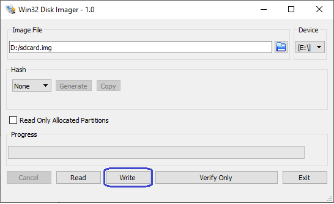

## 4.4 Preparing SoC FPGA Development Kits for the FPGA AI Suite SoC Design Example

To prepare an FPGA development kit for the FPGA AI Suite SoC design example:

1. Prepare one of the supported development kits:
	- [Prepare the Agilex™ 5 FPGA E-Series 065B Modular Development Kit.](#441-preparing-the-agilex-5-fpga-e-series-065b-modular-development-kit)
	- [Prepare the Agilex™ 7 FPGA I-Series Transceiver-SoC Development Kit.](#442-preparing-the-agilex-7-fpga-i-series-transceiver-soc-development-kit)
	- [Prepare the Arria® 10 SX SoC FPGA Development Kit.](#443-preparing-the-arria-10-sx-soc-fpga-development-kit)
2. [Configure the SoC FPGA development kit UART connection.](#444-configuring-the-soc-fpga-development-kit-uart-connection)
3. [Determine the SoC FPGA development kit IP address.](#445-determining-the-soc-fpga-development-kit-ip-address)

### 4.4.1 Preparing the Agilex™ 5 FPGA E-Series 065B Modular Development Kit

Prepare the Agilex™ 5 FPGA E-Series 065B Modular Development Kit for the FPGA AI Suite SoC design example with the following steps:

1. [Confirming the Agilex™ 5 FPGA E-Series 065B Modular Development Kit Board Setup](#4411-confirming-the-agilex-5-fpga-e-series-065b-modular-development-kit-board-setup).
2. Programming the FPGA device on the board in one of the following ways:
	- [Programming the Agilex™ 5 FPGA Device with the JTAG Indirect Configuration (`.jic`) File](#4412-programming-the-agilex-5-fpga-device-with-the-jtag-indirect-configuration-jic-file).
	  This method programs the QSPI flash memory, which then programs the FPGA device when the board is powered up. With this method, the FPGA programming can be persisted between board power cycles.
	  This method is preferred for deployment or testing the other parts of your application after your FPGA bitstream is finalized.
	- [Programming the Agilex™ 5 FPGA Device with the SRAM Object File (`.sof`)](#4413-programming-the-agilex-5-fpga-device-with-the-sram-object-file-sof).
	  This method programs the FPGA device directly. The FPGA programming is not persisted between board power cycles. This method is typically faster than programming the QSPI flash memory with `.jic` file that then programs the FPGA device.
	  This method is preferred when developing or debugging your FPGA bitstream.
3. [Connecting the Agilex™ 5 FPGA E-Series 065B Modular Development Kit to the Host Development System](#4414-connecting-the-agilex-5-fpga-e-series-065b-modular-development-kit-to-the-host-development-system).

#### 4.4.1.1 Confirming the Agilex™ 5 FPGA E-Series 065B Modular Development Kit Board Setup

Confirm the board settings as follows:

1. Ensure that the Agilex™ 5 FPGA E-Series 065B Modular Development Kit DIP switch and jumpers are set to their default settings. For this design example, you change the settings for some DIP switches depending on what are doing with the board:
	- For programming the FPGA device on the board, you will set the S4 DIP switch for JTAG mode.
	- For booting the FPGA device from flash memory, you will set the S4 DIP switch for QSPI mode.
	- To get power over the ATX connector, ensure that the SW2 switch is set to ATX power mode.

	For more details about default DIP switch and jumper settings, refer to [“Default Settings” in the Agilex™ 5 FPGA E-Series 065B Modular Development Kit User Guide](https://docs.altera.com/r/docs/814550/current/agilextm-5-fpga-e-series-065b-premium-development-kit-user-guide/default-settings).

2. Ensure that the SD card with the programmed Yocto image is installed on the board.

When configured and connected, the Agilex™ 5 FPGA E-Series 065B Modular Development Kit should resemble the following image:

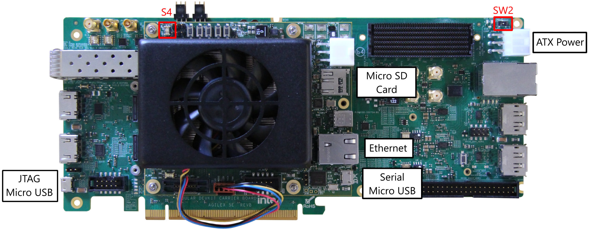

The board connections serve the following purposes:

- The JTAG micro USB connector is used to program the FPGA device.
- The Ethernet connector is used for fast data transfer to the HPS.
- The serial micro USB connector is used as follows:
  - To monitor the serial output from the HPS during operation.
  - To provide command-line input to the HPS during operation.

#### 4.4.1.2 Programming the Agilex™ 5 FPGA Device with the JTAG Indirect Configuration (`.jic`) File

Programming the Agilex™ 5 device with the JTAG indirect configuration (`.jic`) file programs the QSPI flash memory and allows the FPGA device to be automatically configured when power is applied to the board.

To program the Agilex™ 5 FPGA device with the JTAG indirect configuration (`.jic`) file:

1. Connect the Agilex™ 5 FPGA E-Series 065B Modular Development Kit to your host development system via JTAG micro USB connection as shown in the following diagram:

    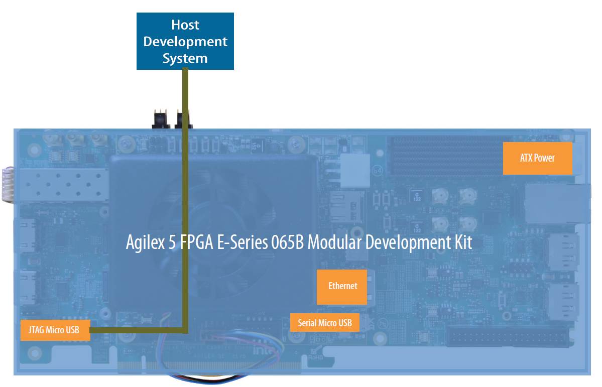

2. Switch the board into JTAG mode by setting the S4[1:2] DIP switch to OFF/OFF:

    

3. Program the QSPI with the `.jic` file by running the following commands on the host development system:

	```sh
	cd $COREDLA_ROOT/demo/ed4/agx5_soc_s2m/sd-card/
	quartus_pgm -m jtag -o "pvi;u-boot-spl-dtb.hex.jic@<device_number>"
	```

	where <*device_number*> is 1 or 2, depending on whether the HPS is already running (that is, the prior state of the device). Use 1 if the HPS is not running, and 2 if the HPS is already running. If you do not know the state of the device, try 1. If that fails, try 2.

4. Switch the board into QSPI mode by setting the S4[1:2] DIP switch to ON/ON and cycle the power to the board.

    At boot time, the Agilex™ 5 FPGA device is configured from the QSPI flash memory.

#### 4.4.1.3 Programming the Agilex™ 5 FPGA Device with the SRAM Object File (`.sof`)

Programming the Agilex™ 5 device with the SRAM object file (`.sof`) programs FPGA device directly. The FPGA configuration is lost when power is removed from the board.

To program the Agilex™ 5 FPGA device with the SRAM object file (`.sof`):

1. Connect the Agilex™ 5 FPGA E-Series 065B Modular Development Kit to your host development system via JTAG micro USB connection as shown in the following diagram:

    

2. Switch the board into JTAG mode by setting the S4[1:2] DIP switch to OFF/OFF:

3. Program the FPGA device `.sof` file by running the following commands on the host development system:

	```sh
	cd $COREDLA_ROOT/demo/ed4/agx5_soc_s2m/sd-card/
	quartus_pgm -m jtag -o "p;u-boot-spl-dtb.hex.sof"
	```

The Agilex™ 5 FPGA device now boots. The device will lose its configuration when you remove power from the board.

#### 4.4.1.4 Connecting the Agilex™ 5 FPGA E-Series 065B Modular Development Kit to the Host Development System

Connect the Agilex™ 5 FPGA E-Series 065B Modular Development Kit to your host development system via Ethernet and serial micro USB UART connections as shown in the following diagram:

<p align="left">
  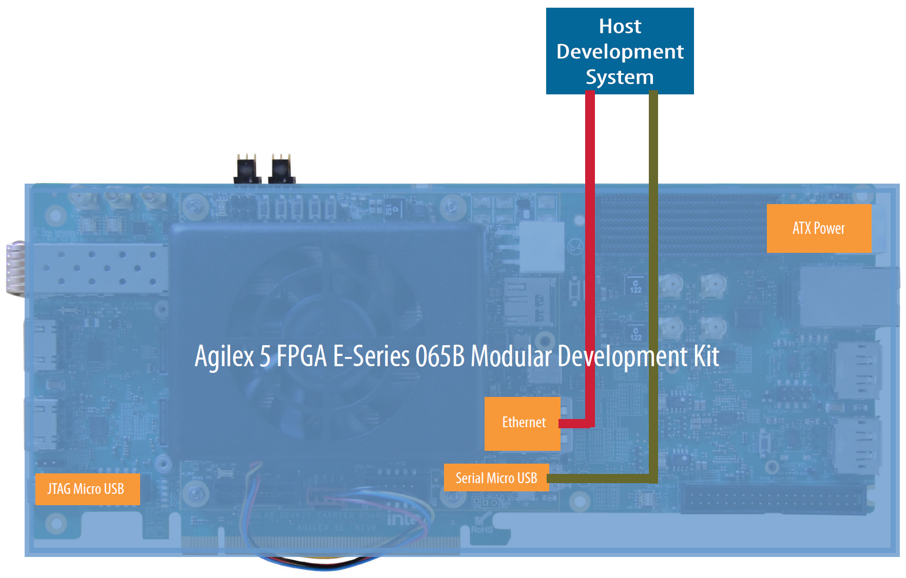
</p>

There are 4 COM ports on the one USB connection. The COM port connected to the HPS should be the 3rd available COM port.

### 4.4.2 Preparing the Agilex™ 7 FPGA I-Series Transceiver-SoC Development Kit

Prepare the Agilex™ 7 FPGA I-Series Transceiver-SoC Development Kit for the FPGA AI Suite SoC design example with the following steps:

1. [Confirming Agilex™ 7 FPGA I-Series Transceiver-SoC Development Kit Board Set Up](#4421-confirming-agilex-7-fpga-i-series-transceiver-soc-development-kit-board-set-up).
2. Programming the FPGA device on the board in one of the following ways:
	- [Programming the Agilex™ 7 FPGA Device with the JTAG Indirect Configuration (`.jic`) File](#4422-programming-the-agilex-7-fpga-device-with-the-jtag-indirect-configuration-jic-file).
	  This method programs the QSPI flash memory, which then programs the FPGA device when the board is powered up. With this method, the FPGA programming can be persisted between board power cycles.
	  This method is preferred for deployment or testing the other parts of your application after your FPGA bitstream is finalized.
	- [Programming the Agilex™ 7 FPGA Device with the SRAM Object File (`.sof`)](#4423-programming-the-agilex-7-fpga-device-with-the-sram-object-file-sof).
	  This method programs the FPGA device directly. The FPGA programming is not persisted between board power cycles. This method is typically faster than programming the QSPI flash memory with `.jic` file that then programs the FPGA device.
	  This method is preferred when developing or debugging your FPGA bitstream.
3. [Connecting the Agilex™ 7 FPGA I-Series Transceiver-SoC Development Kit to the Host Development System](#4424-connecting-the-agilex-7-fpga-i-series-transceiver-soc-development-kit-to-the-host-development-system).

#### 4.4.2.1 Confirming Agilex™ 7 FPGA I-Series Transceiver-SoC Development Kit Board Set Up

Confirm the board settings as follows:

1. Ensure that the Agilex™ 7 FPGA I-Series Transceiver-SoC Development Kit DIP switch and jumpers are set to their default settings. For this design example, you change the settings for the S9 DIP switch depending on what are doing with the board:
    - For programming the FPGA device on the board, you will set the S9 DIP switch for JTAG mode.
	- For booting the FPGA device from flash memory, you will set the S9 DIP switch for QSPI mode.

For more details about default DIP switch and jumper settings, refer to [“Default Settings” in the Agilex™ 7 FPGA I-Series Transceiver-SoC Development Kit User Guide](https://docs.altera.com/r/docs/721605/current/agilextm-7-fpga-i-series-transceiver-soc-development-kit-user-guide/default-settings).

1. Ensure that the HPS IO48 OOBE daughter card is installed in connector J4 on the development kit, and the SD card with the programmed Yocto image is installed in the daughter card.

2. Ensure that the DDR4 x8 RDIMM is installed in the PCIe slot furthest from the fan. For RDIMM requirements, refer to [Agilex™ 7 FPGA I-Series Transceiver-SoC Development Kit Hardware Requirements](#41-agilex-7-fpga-i-series-transceiver-soc-development-kit-hardware-requirements).

When configured and connected, the Agilex™ 7 FPGA I-Series Transceiver-SoC Development Kit should resemble the following image:


The board connections serve the following purposes:

- The USB 2.0 connector is used to program the FPGA device.
- The Ethernet connector is used for fast data transfer to the HPS.
- The micro USB connector is used as follows:
	- To monitor the serial output from the HPS during operation.
	- To provide command-line input to the HPS during operation.

#### 4.4.2.2 Programming the Agilex™ 7 FPGA Device with the JTAG Indirect Configuration (`.jic`) File

Programming the Agilex™ 7 device with the JTAG indirect configuration (`.jic`) file programs the QSPI flash memory and allows the FPGA device to be automatically configured when power is applied to the board.

To program the Agilex™ 7 FPGA device with the JTAG indirect configuration (`.jic`) file:

1. Connect the Agilex™ 7 FPGA I-Series Transceiver-SoC Development Kit to your host development system via USB 2.0 connection as shown in the following diagram:

    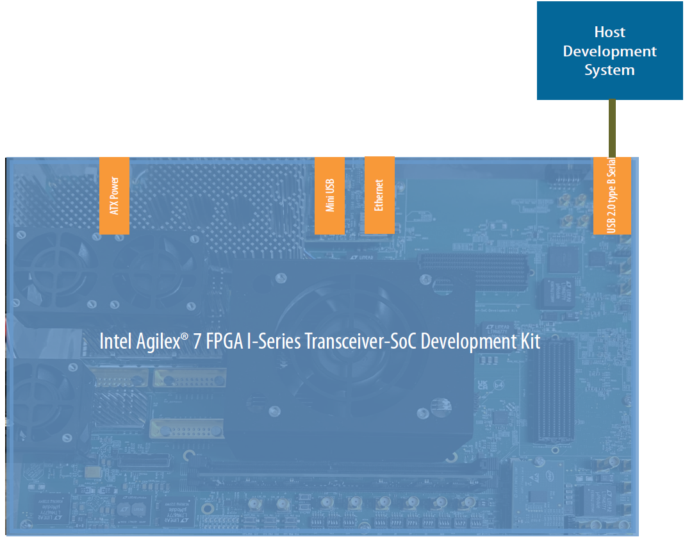

2. Switch the board into JTAG mode by setting the S9[1:4] DIP switch to ON/ON/ON/OFF:

    

3. Program the QSPI with the `.jic` file by running the following commands on the host development system:

    ```sh
    cd $COREDLA_ROOT/demo/ed4/agx7_soc_s2m/sd-card/
    quartus_pgm -m jtag -o "pvi;u-boot-spl-dtb.hex.jic@<device_number>"
    ```

    where <*device_number*> is 1 or 2, depending on whether the HPS is already running (that is, the prior state of the device). Use 1 if the HPS is not running, and 2 if the HPS is already running. If you do not know the state of the device, try 1. If that fails, try 2.

4. Switch the board into QSPI mode by setting the S9[1:4] DIP switch to ON/OFF/OFF/OFF and cycle power to the board:

    At boot time, the Agilex™ 7 FPGA device is configured from the QSPI flash memory.

#### 4.4.2.3 Programming the Agilex™ 7 FPGA Device with the SRAM Object File (`.sof`)

Programming the Agilex™ 7 device with the SRAM object file (`.sof`) programs FPGA device directly. The FPGA configuration is lost when power is removed from the board.

To program the Agilex™ 7 FPGA device with the SRAM object file (`.sof`):

1. Connect the Agilex™ 7 FPGA I-Series Transceiver-SoC Development Kit to your host development system via USB 2.0 connection as shown in the following diagram:

    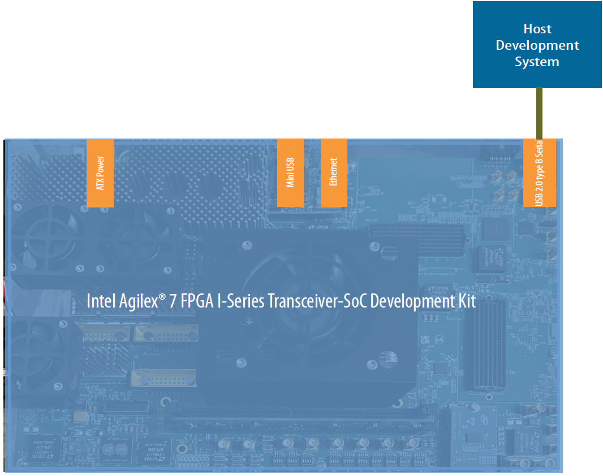

2. Switch the board into JTAG mode by setting the S9[1:4] DIP switch to ON/ON/ON/OFF:

    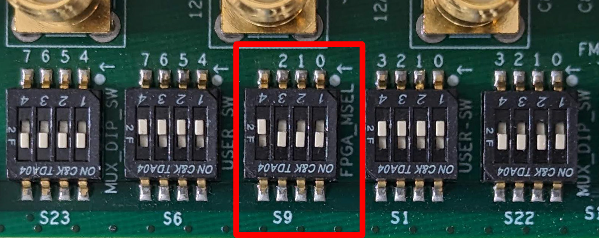

3. Program the FPGA device `.sof` file by running the following commands on the host development system:

```sh
cd $COREDLA_ROOT/demo/ed4/agx7_soc_s2m/sd-card/
quartus_pgm -m jtag -o "p;u-boot-spl-dtb.hex.sof"
```

The Agilex™ 7 FPGA device now boots. The device will lose its configuration when you remove power from the board.

#### 4.4.2.4 Connecting the Agilex™ 7 FPGA I-Series Transceiver-SoC Development Kit to the Host Development System

Connect the Agilex™ 7 FPGA I-Series Transceiver-SoC Development Kit to your host development system via Ethernet and USB UART connections as shown in the following diagram:

<p align="left">
  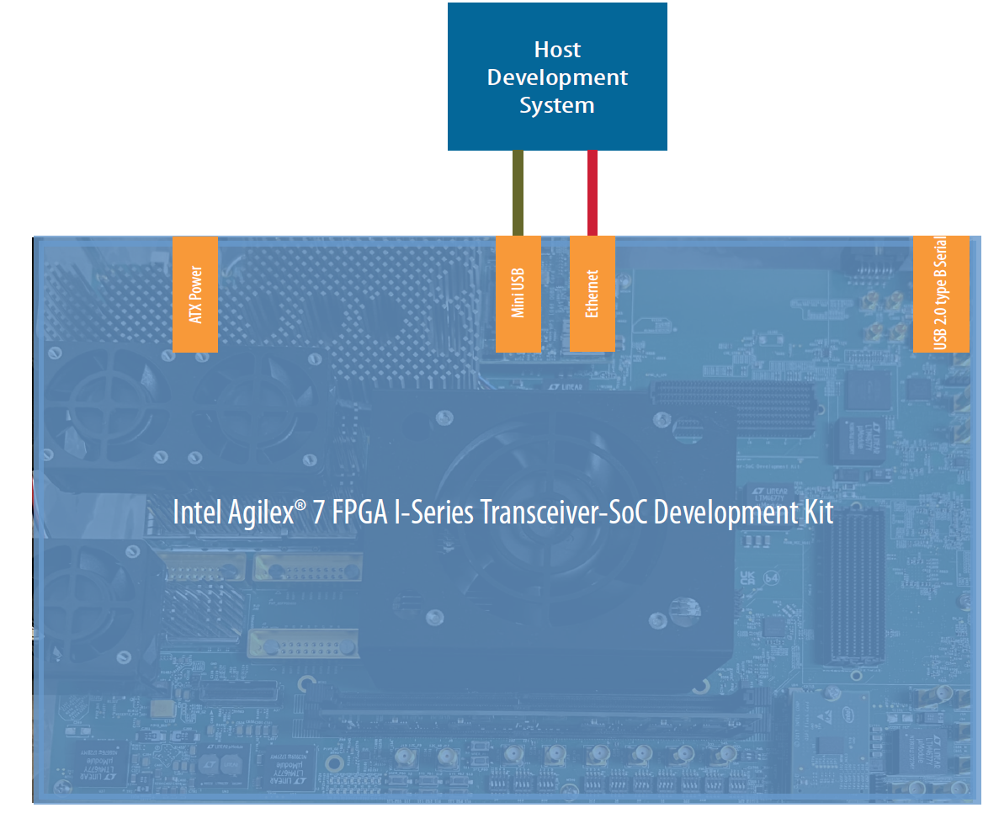
</p>

### 4.4.3 Preparing the Arria® 10 SX SoC FPGA Development Kit

To prepare the Arria® 10 SX SoC FPGA Development Kit for the FPGA AI Suite SoC design example:

1. [Confirming Arria® 10 SX SoC FPGA Development Kit Board Settings](#4431-confirming-arria-10-sx-soc-fpga-development-kit-board-settings).
2. [Connecting the Arria® 10 SX SoC FPGA Development Kit to the Host Development System](#4432-connecting-the-arria-10-sx-soc-fpga-development-kit-to-the-host-development-system).

#### 4.4.3.1 Confirming Arria® 10 SX SoC FPGA Development Kit Board Settings

Confirm the board settings as follows:

1. Ensure that the Arria® 10 SX SoC FPGA Development Kit has the required DIP switch and jumper settings. The SoC example design requires that all DIP switches have their default settings except for SW2 switches 5, 6, 7, and 8, which should be switched ON:

    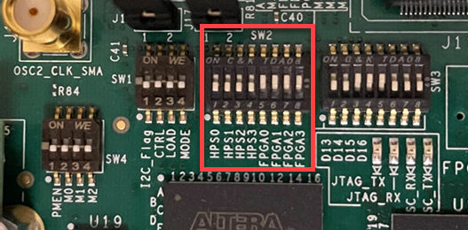

    For more details about default DIP switch and jumper settings, refer to [Arria® 10 SoC Development Kit User Guide](https://docs.altera.com/r/docs/683227/current/arria-10-sx-soc-development-kit-user-guide/default-switch-and-jumper-settings).

2. Ensure that the HILO cards are fitted correctly.

    The Arria® 10 SX SoC FPGA Development Kit includes two DDR4 HILO cards: the HPS memory (1GB) and the FPGA memory (2GB). Both the HPS Memory and FPGA Memory DDR4 HILO modules must be fitted as shown in the following image:

    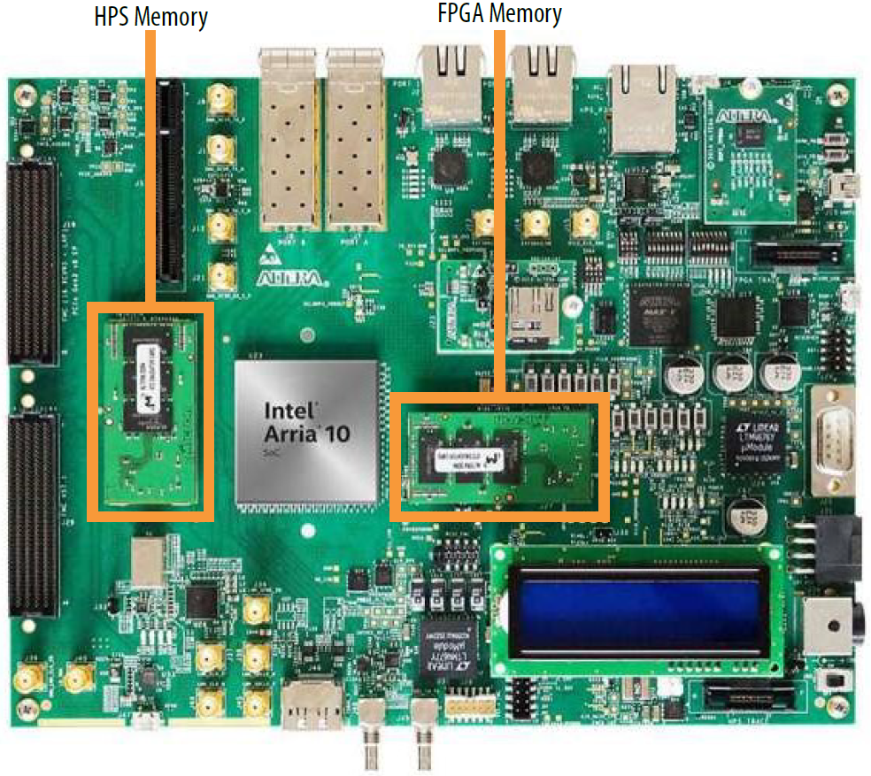

#### 4.4.3.2 Connecting the Arria® 10 SX SoC FPGA Development Kit to the Host Development System

Connect the Arria® 10 SX SoC FPGA Development Kit to your host development system via Ethernet and USB UART connections as shown in the following diagram:

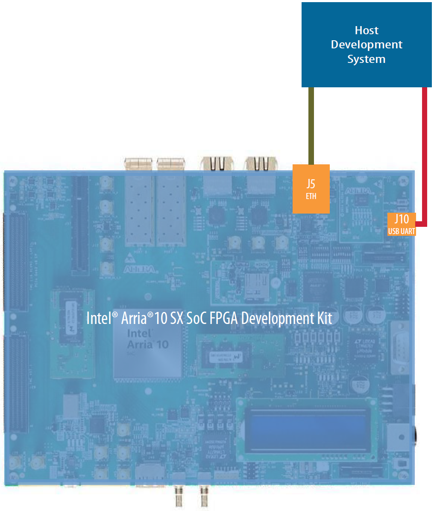

### 4.4.4 Configuring the SoC FPGA Development Kit UART Connection

The SoC FPGA development kit boards have USB-to-serial converters that allows the host computer to see the board as a virtual serial port:
- The Agilex™ 3 FPGA C-Series Development Kit has a FTDI USB-to-serial converter chip.
- The Agilex™ 5 FPGA E-Series 065B Modular Development Kit has a FTDI USB-to-serial converter chip.
- The Agilex™ 7 FPGA I-Series Transceiver-SoC Development Kit has a USB-to-serial converter on the IO48 daughter card.
- The Arria® 10 SX SoC FPGA Development Kit (DK-SOC-10AS066S) has a FTDI USB-to-serial converter chip.

Ubuntu, Red Hat Enterprise Linux, and other modern Linux distributions have built-in drivers for the FTDI USB-to-serial converter chip, so no driver installation is necessary on those platforms.

On Microsoft Windows, the Windows SoC EDS installer automatically installs the necessary drivers. For details, see the SoC GSRD for your SoC FPGA development kit:
- [HPS GSRD User Guide for the Agilex™ 3 C-Series Development Kit](https://altera-fpga.github.io/rel-26.1/embedded-designs/agilex-3/c-series/gsrd/ug-gsrd-agx3/)
- [HPS GSRD User Guide for the Agilex™ 5 FPGA E-Series 065B Modular Development Kit](https://altera-fpga.github.io/rel-26.1/embedded-designs/agilex-5/e-series/modular-065b/gsrd/ug-gsrd-agx5e-modular-065b/)
- [HPS GSRD User Guide for the Agilex™ 7 FPGA I-Series Transceiver-SoC Development Kit (4x F-Tile)](https://altera-fpga.github.io/rel-26.1/embedded-designs/agilex-7/i-series/soc/gsrd/ug-gsrd-agx7i-soc/)
- [HPS GSRD User Guide for the Arria® 10 SX SoC Development Kit](https://altera-fpga.github.io/rel-26.1/embedded-designs/arria-10/sx/soc/gsrd/ug-gsrd-a10sx-soc/)

The serial communication parameters are as follows:

- Baud rate: 115200
- Parity: None
- Flow control: None
- Stop bits: 1

On Windows, you can use utilities such as TeraTerm or PuTTY to connect the board. You can configure these utilities from their tool menus.

On Linux, you can use the Minicom utility. Configure the Minicom utility as follows:

1. Determine the device name associated with the virtual serial port on your host development system. The virtual serial port is typically named `/dev/ttyUSB0`.

   a. Before connecting the mini USB cable to the SoC FPGA development kit, determine which USB serial devices are installed with the following command:

   ```sh
   ls /dev/ttyUSB*
   ```

   b. Connect the mini USB cable from the SoC FPGA development kit to the host development system.

   c. Confirm the new device connection with the ls command again:

   ```sh
   ls /dev/ttyUSB*
   ```

2. If you do not have the Minicom application installed on the host development system, install it now.

   - On Red Hat Enterprise Linux 8: `sudo yum install minicom`
   - On Ubuntu: use `sudo apt-get install minicom`

3. Configure Minicom as follows:

   a. Start Minicom:

   ```sh
   sudo minicom -s
   ```

   b. Under **Serial Port Setup** choose the following:

   - Serial Device: **/dev/ttyUSB0** (Change this value to match the system value that you found earlier, if needed)
   - Bps/Par/Bits: **115200 8N1**
   - Hardware Flow Control: **No**
   - Software Flow Control: **No**

   Press **[ESC]** to return to the main configuration menu.

   c. Select **Save Setup as dfl** to save the default setup. Then select **Exit**.

### 4.4.5 Determining the SoC FPGA Development Kit IP Address

To determine the FPGA development kit IP address:

1. Open a Terminal session to the FPGA development kit via the UART connection and log in using the user name root and no password.

```
Starting Record Runlevel Change in UTMP…
[ OK ] Finished Record Runlevel Change in UTMP.
9.553286] random: crng init done
[ OK ] Finished Load/Save Random Seed.
[ 10.084845] socfpga-dwmax ff800000.ethernet eth0: Link is Up – 1Gbps/Full – flow control off
[ 10.103287] IPv6: ADDRCONF(NETDEV_CHANGE): eth0: link becomes ready

Poky (Yocto Project Reference Distro) 4.0.2 arria10-62747948036a ttyS0

arria10-62747948036a login:
```

2. Issue a hostname command to display the network name of the FPGA development kit board:

```sh
root@arria10-62747948036a:~# hostname
arria10-62747948036a
root@arria10-62747948036a:~#
```

In this example, the network name of the board is `arria10-62747948036a`.

**Tip**: You need this hostname later on to open an SSH connection to the FPGA development kit.

3. Confirm that you have a connection to the development kit from the development host with the ping command. Append the `.local` to the host name when you issue the `ping` command:

```sh
build-host:$ ping arria10-62747948036a.local -c4
PING arria10-62747948036a (192.168.0.23) 56(84) bytes of data.
64 bytes of data from arria10-62747948036a (192.168.0.23): icmp_seq=1 ttl=63 time=1.66ms
64 bytes of data from arria10-62747948036a (192.168.0.23): icmp_seq=1 ttl=63 time=1.66ms
64 bytes of data from arria10-62747948036a (192.168.0.23): icmp_seq=1 ttl=63 time=1.66ms
64 bytes of data from arria10-62747948036a (192.168.0.23): icmp_seq=1 ttl=63 time=1.66ms
--- arria10-62747948036a ping statistics ---
4 packets transmitted, 4 received, 0% packet loss, time 3005ms
rtt min/avg/max/mdev = 1.664/2.037/2.283/0.238 ms
```

You can use the host name when you need to transfer files to the running system by appending the `.local` to the host name. For example, for the host name `arria10-62747948036a`, you can use `arria10-62747948036a.local`.

## 4.5 Adding Compiled Graphs (AOT files) to the SD Card

An AOT file contains instructions for the FPGA AI Suite IP to "execute" in order to perform inference. For Agilex™ 5 and Agilex™ 7, the M2M design variant and the S2M design variant require different AOT files. The instructions in this section create both AOT files.

For Arria® 10, the M2M design variant and the S2M design variant use the same AOT file.

To add the compiled graphs to the development kit SD card:

**Tip**: If you completed installing the FPGA AI Suite by following the instructions in the [FPGA AI Suite Handbook](https://docs.altera.com/r/docs/863373/2026.1.1/fpga-ai-suite-handbook/installing-fpga-ai-suite-overview), you can skip steps 1-3.

1. [Create the `$COREDLA_WORK` directory](#422-initializing-a-work-directory), if you have not already done so.
2. [Prepare OpenVINO Model Zoo and Model Optimizer](#451-preparing-openvino-model-zoo).
3. [Prepare a model](#452-preparing-a-model).

    **Tip**: If you completed AI Suite Installation, you have already completed these first three steps.

4. Confirm that you have the following directory:

    ```
    $COREDLA_WORK/demo/models/public/resnet-50-tf/FP32/
    ```

    If you do not have this directory, confirm that you have completed the first three steps.

5. Compile the graphs.
6. Copy the compiled graphs to the SD card.

**Related Information**
[FPGA AI Suite Quick Start Tutorial](https://docs.altera.com/r/docs/863373/2026.1.1/fpga-ai-suite-handbook/fpga-ai-suite-quick-start-tutorial)

### 4.5.1 Preparing OpenVINO Model Zoo

These instructions assume that you have a copy of OpenVINO Model Zoo 2024.6 in your `$COREDLA_WORK/demo/open_model_zoo/` directory.

To download a copy of Model Zoo, run the following commands:

```sh
cd $COREDLA_WORK/demo
git clone https://github.com/openvinotoolkit/open_model_zoo.git
cd open_model_zoo
git checkout 2024.6.0
```

### 4.5.2 Preparing a Model

A model must be converted from a framework (such as TensorFlow, Caffe, or Pytorch) into a pair of `.bin` and `.xml` files before the FPGA AI Suite compiler (`dla_compiler` command) can ingest the model.

The following commands download the ResNet-50 TensorFlow model and run the OpenVINO Open Model Zoo tools with the following commands:

```sh
source ~/build-openvino-dev/openvino_env/bin/activate
omz_downloader --name resnet-50-tf \
--output_dir $COREDLA_WORK/demo/models/
omz_converter --name resnet-50-tf \
--download_dir $COREDLA_WORK/demo/models/ \
--output_dir $COREDLA_WORK/demo/models/
```

The `omz_downloader` command downloads the trained model to `$COREDLA_WORK/demo/models` folder. The `omz_converter` command runs model optimizer that converts the trained model into intermediate representation `.bin` and `.xml` files in the `$COREDLA_WORK/demo/models/public/resnet-50-tf/FP32/` directory.

The directory `$COREDLA_WORK/demo/open_model_zoo/models/public/resnet-50-tf/` contains two useful files that do not appear in the `$COREDLA_ROOT/demo/models/` directory tree:

- The *README.md* file describes background information about the model.
- The `model.yml` file shows the detailed command-line information given to Model Optimizer (`mo.py`) when it converts the model to a pair of `.bin` and `.xml` files

For a list OpenVINO Model Zoo models that the [FPGA AI Suite supports, refer to the FPGA AI Suite Handbook](https://docs.altera.com/r/docs/863373/2026.1.1/fpga-ai-suite-handbook/models-supported-by-the-fpga-ai-suite-sequential-ip).

**Troubleshooting OpenVINO Open Model Zoo Converter Errors**

You might get the following error while running the omz_converter on a TensorFlow model:

```
ValueError: Invalid filepath extension for saving. Please add either a '.keras' extension for the native Keras format (recommended) or a '.h5' extension. Use 'model.export(filepath)' if you want to export a SavedModel for use with TFLite/TFServing/etc.
```

If you get this error, you can follow a process similar to the following example process that convert MobilenetV3 TensorFlow model to an OpenVINO model:

1. Run the following Python code that converts MobileNetV3 to Tensorflow `.savedmodel` format:

```python
import os
import tensorflow as tf

COREDLA_WORK = os.environ.get("COREDLA_WORK")
DOWNLOAD_DIR = f"{COREDLA_WORK}/demo/models/"
OUTPUT_DIR = f"{COREDLA_WORK}/demo/models/"

# Set the image data format
tf.keras.backend.set_image_data_format("channels_last")

# Load the MobileNetV3Large model with the specified weights
model = tf.keras.applications.MobileNetV3Large(
    weights=str(
        f"{DOWNLOAD_DIR}/public/mobilenet-v3-large-1.0-224-tf/weights_mobilenet_v3_large_224_1.0_float.h5"
    )
)

# Save the model to the specified output directory
model.export(filepath=f"{OUTPUT_DIR}/mobilenet_v3_large_224_1.0_float.savedmodel")
```

2. Run the following command to convert the TensorFlow `.savedmodel` format to OpenVINO model format:

```sh
mo \
--input_model=$COREDLA_WORK/demo/models/mobilenet_v3_large_224_1.0_float.savedmodel \
--model_name=mobilenet_v3_large_224_1.0_float \
--input_shape=[1, 224,224,3]
--layout nhwc
```

### 4.5.3 Compiling the Graphs

The precompiled SD card image (`.wic`) provided with the FPGA AI Suite uses one of the following files as the IP architecture configuration file:

- Agilex™ 5 FPGA E-Series 065B Modular Development Kit
  AGX5_Performance_LayoutTransform.arch
- Agilex™ 7 FPGA I-Series Transceiver-SoC Development Kit
  AGX7_Performance_LayoutTransform.arch
- Arria® 10 SX SoC FPGA Development Kit
  A10_Performance.arch

To create the AOT file for the M2M variant (which uses the `dla_benchmark` utility), run the following command:

```sh
cd $COREDLA_WORK/demo/models/public/resnet-50-tf/FP32
dla_compiler \
--march $COREDLA_ROOT/example_architectures/<IP arch config file> \
--network-file ./resnet-50-tf.xml \
--foutput-format=open_vino_hetero \
--o $COREDLA_WORK/demo/RN50_Performance_b1.aot \
--batch-size=1 \
--fanalyze-performance
```

where <IP arch config file> is one of the IP architecture configuration files listed earlier.

To create the AOT file for the S2M variant (which uses the streaming inference app), run the following command:

```sh
cd $COREDLA_WORK/demo/models/public/resnet-50-tf/FP32
dla_compiler \
--march $COREDLA_ROOT/example_architectures/<IP arch config file> \
--network-file ./resnet-50-tf.xml \
--foutput-format=open_vino_hetero \
--o $COREDLA_WORK/demo/RN50_Performance_no_folding.aot \
--batch-size=1 \
--fanalyze-performance \
--ffolding-option=0
```

where <*IP arch config file*> is one of the IP architecture configuration files listed earlier.

After running either these commands, the compiled models and demonstration files are in the following locations:

| Compiled Models | |
|---|---|
| Compiled Models| $COREDLA_WORK/demo/RN50_Performance_b1.aot |
| Compiled Models| $COREDLA_WORK/demo/RN50_Performance_no_folding.aot |
| Sample Images | $COREDLA_WORK/demo/sample_images/ |
| Architecture File | Agilex™ 5 `$COREDLA_ROOT/example_architectures/AGX5_Performance_LayoutTransform.arch`<br>Agilex™ 7 `$COREDLA_ROOT/example_architectures/AGX7_Performance_LayoutTransform.arch`<br> Arria® 10 `$COREDLA_ROOT/example_architectures/A10_Performance.arch`|

### 4.5.4 Copying the Compiled Graphs to the SD card

To copy the required demonstration files to the `/home/root/resnet-50-tf` folder on the SD card:

1. In the serial console, create directories to receive the model data and sample images:

```sh
mkdir ~/resnet-50-tf
```

2. On the development host, use the secure copy (`scp`) command to copy the data to the board:

```sh
TARGET_IP=<Development Kit Hostname>.local
TARGET="root@$TARGET_IP:~/resnet-50-tf"
demodir=$COREDLA_WORK/demo
scp $demodir/*.aot $TARGET/.
scp -r $demodir/sample_images/ $TARGET/.
scp $COREDLA_ROOT/example_architectures/<architecture file> $TARGET/.
scp $COREDLA_ROOT/build_os.txt $TARGET/../app/
```

where <architecture file\> is one of the following files, depending on your development kit:

- Agilex™ 3 FPGA C-Series Development Kit
  AGX3_Performance.arch
- Agilex™ 5 FPGA E-Series 065B Modular Development Kit
  AGX5_Performance_LayoutTransform.arch
- Agilex™ 7 FPGA I-Series Transceiver-SoC Development Kit
  AGX7_Performance_LayoutTransform.arch
- Arria® 10 SX SoC FPGA Development Kit
  A10_Performance.arch

3. [Optional] In the serial console run the sync command to ensure that the data is flushed to disk.

## 4.6 Verifying FPGA Device Drivers

The device drivers should be loaded when the HPS boots. Verify that the device drivers are initialized by checking that uio files are listed in `/sys/class/uio` by running the following command:

```sh
ls /sys/class/uio
```

The command should show output similar to the following example:

```
uio0 uio1 uio2
```

If the drivers are not listed, refresh the modules by running the following command before checking again that the drivers are loaded:

```sh
uio-devices restart
```

## 4.7 Running the Demonstration Applications

Depending on the SoC design example mode that you want run, follow the instructions in one of the following sections:

- [Running the M2M Mode Demonstration Application](#471-running-the-m2m-mode-demonstration-application)
- [Running the S2M Mode Demonstration Application](#472-running-the-s2m-mode-demonstration-application)

**Important**: Running the demonstration applications requires the terminal session that you opened in [Determining the SoC FPGA Development Kit IP Address].

### 4.7.1 Running the M2M Mode Demonstration Application

The M2M dataflow model uses the `dla_benchmark` demonstration application. The S2M bitstream supports both the M2M dataflow model and the S2M dataflow model.

You must know the host name of the SoC FPGA development kit. If you do not know the development kit host name, go back to [Determining the SoC FPGA Development Kit IP Address](#445-determining-the-soc-fpga-development-kit-ip-address) before continuing here.

To run inference on the SoC FPGA development kit:

1. Open an SSH connection to the SoC FPGA development kit:

   a. Start a new terminal session

   b. Run the following command:

   ```sh
   build-host:$ ssh <devkit_hostname>
   ```

   Where <devkit_hostname> is the host name you determined in [Determining the SoC FPGA Development Kit IP Address](#445-determining-the-soc-fpga-development-kit-ip-address).

   Continuing the example from [Determining the SoC FPGA Development Kit IP Address](#445-determining-the-soc-fpga-development-kit-ip-address), the following command would open an SSH connection:

   ```sh
   build-host:$ ssh arria10-62747948036a.local
   ```

2. In the SSH terminal, run the following commands:

```sh
export compiled_model=~/resnet-50-tf/RN50_Performance_b1.aot
export imgdir=~/resnet-50-tf/sample_images
export archfile=~/resnet-50-tf/<architecture file>
cd ~/app
export COREDLA_ROOT=/home/root/app
export LD_LIBRARY_PATH=.
./dla_benchmark \
-b=1 \
-cm $compiled_model \
-d=HETERO:FPGA,CPU \
```

```sh
-i $imgdir \
-niter=8 \
-plugins ./plugins.xml \
-arch_file $archfile \
-api=async \
-groundtruth_loc $imgdir/TF_ground_truth.txt \
-perf_est \
-nireq=4 \
-bgr
```

where <architecture file\> is one of the following files, depending on your development kit:

- Agilex™ 3 FPGA C-Series Development Kit
  ```AGX3_Performance.arch```
- Agilex™ 5 FPGA E-Series 065B Modular Development Kit
  ```AGX5_Performance_LayoutTransform.arch```
- Agilex™ 7 FPGA I-Series Transceiver-SoC Development Kit
 ``` AGX7_Performance_LayoutTransform.arch```
- Arria® 10 SX SoC FPGA Development Kit
  ```A10_Performance.arch```

The `dla_benchmark` command generates output similar to the following example output for each step. This example output was generated using an Agilex™ 7 FPGA I-Series Transceiver-SoC Development Kit.

```
[Step 11/12] Dumping statistics report
count: 8 iterations
system duration: 286.0659 ms
IP duration: 64.9427 ms
latency: 138.7106 ms
system throughput: 27.9656 FPS
number of hardware instances: 1
number of network instances: 1
IP throughput per instance: 123.1856 FPS
IP throughput per fmax per instance: 0.3080 FPS/MHz
IP clock frequency measurement: 400.0000 MHz
estimated IP throughput per instance: 137.6405 FPS (500 MHz assumed)
estimated IP throughput per fmax per instance: 0.2753 FPS/MHz

[Step 12/12] Dumping the output values
[ INFO ] Comparing ground truth file /home/root/resnet-50-tf/sample_images/TF_ground_truth.txt with network Graph_0
top1 accuracy: 100 %
top5 accuracy: 100 %
[ INFO ] Get top results for "Graph_0" graph passed
```

### 4.7.2 Running the S2M Mode Demonstration Application

To run the S2M (streaming) mode demonstration application, you need two terminal connections to the host.

You must know the host name of the SoC FPGA development kit. If you do not know the development kit host name, go back to [Determining the SoC FPGA Development Kit IP Address](#445-determining-the-soc-fpga-development-kit-ip-address) before continuing here.

To run the streaming demonstration application:

1. Open an SSH connection to the SoC FPGA development kit:

   a. Start a new terminal session

   b. Run the following command:

   ```sh
   build-host:$ ssh <devkit_hostname>
   ```

   Where <devkit_hostname> is the host name you determined in [Determining the SoC FPGA Development Kit IP Address](#445-determining-the-soc-fpga-development-kit-ip-address).

   Continuing the example from [Determining the SoC FPGA Development Kit IP Address](#445-determining-the-soc-fpga-development-kit-ip-address), the following command would open an SSH connection:

   ```sh
   build-host:$ ssh arria10-62747948036a.local
   ```

2. Repeat step 1 to open a second SSH connection to the SoC FPGA development kit.

3. **Agilex™ 5 only**: The `~/app/run_inference_stream.sh` script in the prebuilt `coredla-image-agilex5_mk_a5e065bb32aes1.wic` image has the incorrect architecture file as an argument. Before running the script, edit `run_inference_stream.sh` and change `AGX5_Performance.arch` to `AGX5_Performance_LayoutTransform.arch`.

4. In a terminal session, run the following commands:

	```sh
	cd /home/root/app
	./run_inference_stream.sh
	```

5. In the other terminal session, run the following commands:

	```sh
	cd /home/root/app
	./run_image_stream.sh
	```

The first terminal session (where you ran the `run_inference_stream.sh` command) then shows output similar to the following example:

```
root@arria10-ea80b8d770e7:~/app# ./run_inference_stream.sh
Runtime arch check is enabled. Check started...
Runtime arch check passed.
Runtime build version check is enabled. Check started...
Runtime build version check passed.
Ready to start image input stream.
1 - class ID 776, score = 58.4
2 - class ID 968, score = 90.7
3 - class ID 769, score = 97.8
4 - class ID 769, score = 97.8
5 - class ID 872, score = 99.8
6 - class ID 954, score = 94.4
7 - class ID 954, score = 94.4
```

For more details about the streaming applications and their command line options, refer to [Streaming-to-Memory (S2M) Streaming Demonstration](#90-streaming-to-memory-s2m-streaming-demonstration).

### 4.7.3 Troubleshooting the Demonstration Applications

If you receive an error similar to the following error while running either the S2M or M2M applications, check that all the board DIMMs are securely installed:

```
altera-msgdma ff200000.msgdma: dma_sync_wait: timeout! [ 251.812846] DMA Failed
```

# 5.0 FPGA AI Suite SoC Design Example Run Process

This section describes the steps to run the demonstration application and perform accelerated inference using the SoC design example.

## 5.1 Exporting Trained Graphs from Source Frameworks

Before running any demonstration application, you must convert the trained model to the OpenVINO intermediate representation (IR) format (`.xml`/`.bin`) with the OpenVINO Model Optimizer.

For details on creating the `.xml`/`.bin` files, refer to [Preparing a Model](#452-preparing-a-model), which describes how to create `.xml`/`.bin`) files for *ResNet50*.

The rest of this guide assumes that the same file locations and file names are used as in [Preparing OpenVINO Model Zoo](#451-preparing-openvino-model-zoo).

The `stream_image_app` used for the S2M variant of the SoC design example assumes that images are 224x224. For details, refer to [The image_streaming_app Application](#92-the-image_streaming_app-application).

## 5.2 Compiling Exported Graphs Through the FPGA AI Suite

The network as described in the `.xml` and `.bin` files (created by the Model Optimizer) is compiled for a specific FPGA AI Suite architecture file by using the FPGA AI Suite compiler.

The FPGA AI Suite compiler compiles the network and exports it to a `.aot` file with the format required by the OpenVINO Inference Engine. For instructions on how to compile the `.xml` and `.bin` files into AOT file suitable for use with the FPGA AI Suite IP, refer to [Compiling the Graphs](#453-compiling-the-graphs).

This `.aot file created by the compiler contains the compiled network parameters for all the target devices (FPGA, CPU, or both) along with the weights and biases. The inference application imports this file at runtime.

The FPGA AI Suite compiler can also compile the graph and provide estimated area or performance metrics for a given architecture file or produce an optimized architecture file.

For the demonstration SD card, the FPGA bitstream has been built using one of the following IP architecture configuration files, so the architecture file for your development kit for compiling the OpenVINO™ Model:

- Agilex™ 5 FPGA E-Series 065B Modular Development Kit
  ```AGX5_Performance_LayoutTransform.arch```
- Agilex™ 7 FPGA I-Series Transceiver-SoC Development Kit
  ```AGX7_Performance_LayoutTransform.arch```
- Arria® 10 SX SoC FPGA Development Kit
  ```A10_Performance.arch```

For more details about the FPGA AI Suite compiler, refer to the [FPGA AI Suite Handbook](https://docs.altera.com/r/docs/863373/2026.1.1/fpga-ai-suite-handbook/the-fpga-ai-suite-compiler).

# 6.0 FPGA AI Suite SoC Design Example Build Process

The SoC design example is built around a complete software and hardware solution. The main building stages are:

- Build a Linux Distribution for a supported SoC FPGA development kit using a cross-compilation flow on a Linux system.
- Build the SoC design example Quartus Prime project
- Combine the FPGA and SoC Linux application and kernel onto an SD card

The following diagram illustrates the overall build process.

## Figure 1: FPGA AI Suite SoC Design Example Build Process

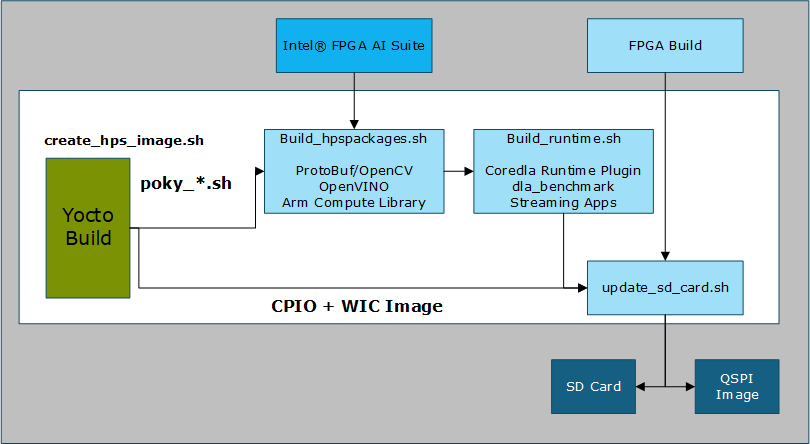

## 6.1 Building the Quartus Prime Project

This design example includes prepackaged bitstreams but you can also use the build script provided to build bitstreams with custom architectures or recreate the original bitstreams, subject to IP license limitations.

The Quartus Prime project consists of the FPGA AI Suite IP as well as IP to interface with the HPS and, in the case of the S2M variant, additional flow control IP.

[FPGA AI Suite SoC Design Example Quick Start Tutorial](#42-fpga-ai-suite-soc-design-example-quick-start-tutorial) shows how to use a specific architecture configuration file for the FPGA AI Suite IP, but you can use any other device-appropriate configuration file instead.

### 6.1.1 Quartus Prime Build Flow

All FPGA AI Suite design examples are built by running the `dla_build_example_design.py` command.

This command generates an FPGA AI Suite IP from the provided architecture file, creates an Quartus Prime build directory, builds the Quartus Prime project, and produces a bitstream.

For more information about this command, refer to [The dla_build_example_design.py Command](#311-the-dla_build_example_designpy-command).

You can build the following SoC design example variants with the `dla_build_example_design.py` command:

#### Table 1: SoC Design Example Variant

| Design Example Variant Identifier | Description | Layout Transform |
|---|---|---|
| *agx3_soc_m2m* | Builds a memory-to-memory (M2M) design for the Agilex™ 3 FPGA C-Series Development Kit | External demonstration transform as described in [The Layout Transform IP as an Application-Specific Block](#2235-the-layout-transform-ip-as-an-application-specific-block). |
| *agx5_soc_m2m* | Builds a memory-to-memory (M2M) design for the Agilex™ 5 FPGA E-Series 065B Modular Development Kit | External demonstration transform as described in [The Layout Transform IP as an Application-Specific Block](#2235-the-layout-transform-ip-as-an-application-specific-block). |
| *agx5_soc_s2m* | Builds a memory-to-memory (M2M) design for the Agilex™ 5 FPGA E-Series 065B Modular Development Kit | External demonstration transform as described in [The Layout Transform IP as an Application-Specific Block](#2235-the-layout-transform-ip-as-an-application-specific-block). |
| *agx7_soc_m2m* | Builds a memory-to-memory (M2M) design for the Agilex™ 7 FPGA I-Series Transceiver-SoC Development Kit | External demonstration transform as described in [The Layout Transform IP as an Application-Specific Block](#2235-the-layout-transform-ip-as-an-application-specific-block). |
| *agx7_soc_s2m* | Builds a streaming-to-memory (S2M) design for the Agilex™ 7 FPGA I-Series Transceiver-SoC Development Kit | FPGA AI Suite IP input layout transform must be enabled in the architecture file. For information about the input layout transform, refer to "Input Layout Transform Hardware" in FPGA AI Suite IP Reference Manual. |
| *a10_soc_m2m* | Builds a memory-to-memory (M2M) design for the Arria® 10 SX SoC FPGA Development Kit | External demonstration transform as described in [The Layout Transform IP as an Application-Specific Block](#2235-the-layout-transform-ip-as-an-application-specific-block). |
| *a10_soc_s2m* | Builds a streaming-to-memory (S2M) design for the Arria® 10 SX SoC FPGA Development Kit | External demonstration transform as described in [The Layout Transform IP as an Application-Specific Block](#2235-the-layout-transform-ip-as-an-application-specific-block). |

An example of building the Arria® 10 S2M variant with the A10_Performance architecture is as follows:

```sh
dla_build_example_design.py build \
--output-dir $COREDLA_WORK/a10_perf_bitstream \
-n 1 \
a10_soc_s2m \
$COREDLA_ROOT/example_architectures/A10_Performance.arch
```

After the design is built, the output products (`.sof` or `.rbf` files) must be combined with the SoC Linux system in order to be used. This is done in one of the steps in the `create_hps_image.sh` script.

For Agilex™ 5 and Agilex™ 7, the `.sof` file is combined with a `u-boot-spl-dtb.hex` file to create either a bootable `.sof` file or a `.jic` file that can program the flash memory.

For Arria® 10, the `.rbf` files are added to the `.wic` image so that the FPGA device can be programmed from the SD card.

If you attempt to reprogram a running Linux system with a new `.sof` file, the Linux system crashes and the reprogramming results in an unpredictable outcome.

The FPGA device is programmed by booting the Linux system on the SoC via the SD card (for Arria® 10) or by programming over JTAG (for Agilex™ 5 and Agilex™ 7), which then boots the Linux system from the SD card. For details about creating a functional solution by combining the build `.rbf` files with the SD card image or by creating the bootable `.sof` or `.jic` files, refer to [Building the Bootable SD Card Image (`.wic`)](#62-building-the-bootable-sd-card-image-wic).

#### 6.1.1.1 Build Synchronization of FPGA with Software

For a system to function correctly, the release version of each FPGA AI Suite component, including the compiler, the runtime, and the FPGA AI Suite IP, must match.

In addition, the *AOT* file created by the FPGA AI Suite `dla_compiler` command must target the same architecture (`.arch`) file as the FPGA AI Suite IP.

When Quartus Prime compiles the FPGA AI Suite IP, it generates a build-hash that is embedded into the IP. The runtime software checks this build-hash during runtime and if the hashes do not match then the application aborts and displays a mismatch error.

The FPGA AI Suite SoC design example is always built with only one instance of the FPGA AI Suite IP.

### 6.1.2 Build Script Options

The options available in the `dla_build_example_design.py` script are described in [The `dla_build_example_design.py` Command](#311-the-dla_build_example_designpy-command).

### 6.1.3 Build Directory

The `dla_build_example_design.py` command creates a Quartus Prime build in the hw folder in the directory that you specify with the `--output-dir` command option. The project is named top.qpf. You can open this project in Quartus Prime software to review the build logs.

Use the `dla_build_example_design.py` command to rebuild parts of the design example if you alter the design.

The build directory contains the following additional script file:

-`build_stream_controller.sh`: This script creates the Nios® V *.hex* file. This file holds the compiled Nios software that is embedded into the Nios subsystem.

#### 6.1.3.1 The `build_stream_controller.sh` Script

The `build_stream_controller.sh` script builds the Nios V application, and then generates a *.hex* file. The *.hex* file is embedded into the Nios V RAM by the Quartus Prime project. This file must be called `stream_controller.hex` and it must reside alongside the Quartus Prime project files (*top.qpf*).

This script has three command line options that must be entered in order:

```
build_stream_controller <quartus-project-file> <qsys system> <output-file>
```

This script is called as part of the `create_project.bash`, but you can call it manually if you modify the Nios V source code and need a new *.hex* file. The build script is typically called with the same options.

```sh
build_stream_controller.sh top.qpf qsys/dla.qsys stream_controller.hex
```

## 6.2 Building the Bootable SD Card Image (`.wic`)

To create a bootable SD Card image (`.wic` file), the following components must be built:

- Yocto Image
- Yocto SDK Toolchain
- Arm Cross-Compiled OpenVINO
- Arm Cross-Compiled FPGA AI Suite Runtime Plugin
- Arm Cross-Compiled Demonstration Applications
- FPGA `.sof`/`.rbf` filess

The `create_hps_image.sh` script performs the complete build process and combines all the necessary components into an SD card image that can be written to an SD card. For steps required to write an SD card image to an SD card, refer to [Writing the SD Card Image (`.wic`) to an SD Card](#43-writing-the-sd-card-image-wic-to-an-sd-card).

The SD card image is assembled using Yocto ([https://yoctoproject.org](https://yoctoproject.org)).

You must have a build system that meets the minimum build requirements. For details, refer to [https://docs.yoctoproject.org/5.0.5/ref-manual/systemrequirements.html#supported-linux-distributions](https://docs.yoctoproject.org/5.0.5/ref-manual/systemrequirements.html#supported-linux-distributions).

The commands to install the required packages are shown in [Installing HPS Disk Image Build Prerequisites](#425-installing-hps-disk-image-build-prerequisites).

To perform the build, run the following commands:

```sh
cd $COREDLA_WORK/runtime
./create_hps_image.sh \
-f <bitstream_directory>/hw/output_files \
-o <output_directory> \
-u \
-m <FPGA_target>
```

where <FPGA_target\> is `agilex3`, `agilex5_mk_a5e065bb32aes1`, `agilex7_dk_si_agi027fc`, or `arria10`.

The `create_hps_image.sh` script performs the following steps:

1. [Build the Yocto boot SD card image and Yocto SDK toolchain](#build-the-yocto-boot-sd-card-image-and-yocto-sdk-toolchain)
2. [Build the HPS Packages](#build-the-hps-packages)
3. [Build the runtime](#build-the-runtime)
4. [Update the SD card image](#update-the-sd-card-image)

The following diagram illustrates the overall build process performed by the `create_hps_image.sh` script:

### Figure 2: FPGA AI Suite SoC Design Example Build Process


**Build the Yocto boot SD card image and Yocto SDK toolchain**

The FPGA AI Suite Soc design example uses the Yocto Project Poky Distribution.

The Yocto images are based on Golden System Reference Designs, which you can find at the following URL: [https://www.rocketboards.org/foswiki/Documentation/GSRD](https://www.rocketboards.org/foswiki/Documentation/GSRD).

To customize the Yocto Poky distribution, modify the recipes found in layer `$COREDLA_ROOT/hps/ed4/yocto/meta-intel-coredla`.

More details can be found in [Yocto Build and Runtime Linux Environment](#81-yocto-build-and-runtime-linux-environment).

The defined Yocto Image recipe is `coredla-image` and can be found in `$COREDLA_ROOT/hps/ed4/yocto/meta-intel-coredla/recipes-image/coredla-image.bb`.

A Yocto SDK is also built as part of the build and this SDK is used in subsequent build steps to cross-compile the software for the Arm HPS subsystem:

- Agilex™ 5:
  ```
  $COREDLA_WORK/runtime/build_Yocto/build/tmp/deploy/sdk/pokyglibc-x86_64-coredla-image-armv8a-agilex5_mk_a5e065bb32aes1-toolchain-4.2.3.sh
  ```

- Agilex™ 7:
  ```
  $COREDLA_WORK/runtime/build_Yocto/build/tmp/deploy/sdk/pokyglibc-x86_64-coredla-image-armv8a-agilex7_dk_si_agi027fc-toolchain-4.2.3.sh
  ```

- Arria® 10:
  ```
  $COREDLA_WORK/runtime/build_Yocto/build/tmp/deploy/sdk/pokyglibc-x86_64-lbs-image-poky-cortexa9t2hf-neon-arria10-toolchain-4.1.2.sh
  ```

The SD card image (WIC file) is in the following location:

- Agilex™ 5:
  ```
  $COREDLA_WORK/runtime/build_Yocto/build/tmp/deploy/images/agilex5_mk_a5e065bb32aes1/*
  ```

- Agilex™ 7:
  ```
  $COREDLA_WORK/runtime/build_Yocto/build/tmp/deploy/images/agilex7_dk_si_agi027fc/*
  ```

- Arria® 10:
  ```
  $COREDLA_WORK/runtime/build_Yocto/build/tmp/deploy/images/arria10/*
  ```

By default, the `create_hps_image.sh` script builds Yocto from scratch. However, if a prebuilt Yocto build folder is available, you can specify the prebuilt Yocto folder via the `-y` option as follows:

```sh
./create_hps_image.sh \
-y <prebuilt_Yocto_directory>
-f <bitstream_directory>/hw/output_files \
-o <output_directory>
-u
-m <FPGA_target>
```

where <FPGA_target\> is agilex3, agilex5_mk_a5e065bb32aes1, agilex7_dk_si_agi027fc, or arria10.

This -y option loads the Yocto SDK from <PREBUILT_YOCTO_DIR>/build/tmp/deploy/sdk/ and the `.wic` image from <PREBUILT_YOCTO_DIR\>/build/tmp/deploy/images/<FPGA_target\> without rerunning a Yocto build.

**Build the HPS Packages**

The HPS packages are built by the `build_hpspackages.sh` script.

This script cross-compiles OpenCV, OpenVINO, and the Arm-based OpenVINO runtime plugin.

**Build the runtime**

The runtimes are built by the `build_runtime.sh` script.

This script cross-compiles the OpenVINO FPGA AI Suite runtime plugin and demonstration applications for the SoC devices.

**Update the SD card image**

If you specify the `-u` and `-f` options of the `create_hps_image.sh` command, the SD card image is updated by the `update_sd_card.sh` script.

The `update_sd_card.sh` script takes the output products from the previous build steps and builds a bootable SD Card image.

The software binaries are installed to the Ext4 partition under the `/home/root/app` directory.

For Arria® 10, the `.rbf` files are used to create an RTL `fit_spl_fpga.itb` file is copied to the Fat32 partition.

For Agilex™ 5 and Agilex™ 7, the `.sof` file is combined with a `u-boot-spl-dtb.hex` file to create a bootable `.sof` file and a flashable `.jic` file.

For the commands that create the software binaries, review create_<FPGA_target\>_fpga.sh script, where <FPGA_target\> is agilex3, agilex5_mk_a5e065bb32aes1, agilex7_dk_si_agi027fc, or arria10. You can also run the commands found in the script manually, if needed.

You can skip updating the SD card while building the rest of the SoC Example Design by omitting the `-f` and `-u` options:

```sh
./create_hps_image.sh \
-o <output_directory> \
-m <FPGA_target>
```

where <FPGA_target\> is agilex3, agilex5_mk_a5e065bb32aes1, agilex7_dk_si_agi027fc, or arria10.

When you skip updating the SD card image, you can build bitstreams and an HPS image (Yocto, HPS packages, FPGA AI Suite runtime) concurrently. You can update the SD card image (`.wic` file) image after all the files are ready:

```sh
./create_hps_image.sh \
-y ./build_Yocto
-f <bitstream_directory>/hw/output_files \
-o <output_directory> \
-u \
-m <FPGA_target>
```

where <FPGA_target\> is agilex3, agilex5_mk_a5e065bb32aes1, agilex7_dk_si_agi027fc, or arria10.

During regular development you might want to build the runtime software binaries and copy them over to the board app directory manually, without building the bitstream, updating the `.wic` image, or rebuilding Yocto:

```sh
./create_hps_image.sh \
-y ./build_Yocto
-o <output_directory> \
-m <FPGA_target>
```

where <FPGA_target\> is agilex3, agilex5_mk_a5e065bb32aes1, agilex7_dk_si_agi027fc, or arria10.

# 7.0 FPGA AI Suite SoC Design Example Quartus Prime System Architecture

The FPGA AI Suite SoC design examples provide two variants for demonstrating the FPGA AI Suite operation.

All designs are Platform Designer based systems.

There is a single top-level Verilog RTL file for instantiating the Platform Designer system.

These two variants demonstrate FPGA AI Suite operations in the two most common usage scenarios. These scenarios are as follows:

- **Memory to Memory (M2M)**: In this variant, the following steps occur:
  1. The Arm processor host presents input data buffers to the FPGA AI Suite that are stored in a system memory.
  2. The FPGA AI Suite IP performs an inference on these buffers.
  3. The host system collects the inference results.

  This variant demonstrates the simplest use-case of the FPGA AI Suite.

- **Streaming to Memory (S2M)**: This variant offers a superset of the M2M functionality. The S2M variant demonstrates sending streaming input source data into the FPGA AI Suite IP and then collecting the results. An Avalon streaming input captures live input data, stores the data into system memory, and then automatically triggers FPGA AI Suite IP inference operations.

  You can use this variant as a starting point for larger designs that stream input data to the FPGA AI Suite IP with minimal host intervention.

On the Agilex™ 7, the S2M mode uses the FPGA AI Suite IP internal layout transform capability instead of the external demonstration layout transform described in [The Layout Transform IP as an Application-Specific Block](#2235-the-layout-transform-ip-as-an-application-specific-block). The internal transform capability allows for a wider range of input bus widths and supports folding. For more information about the internal transform capability, refer to ["Transforming Input Data Layout" in FPGA AI Suite IP Reference Manual](https://docs.altera.com/r/docs/863373/2026.1.1/fpga-ai-suite-handbook/transforming-the-layout-of-input-data).

## 7.1 FPGA AI Suite SoC Design Example Inference Sequence Overview

The FPGA AI Suite IP works with system memory. To communicate with the system memory, the FPGA AI Suite has its own multichannel DMA engine.

This DMA engine pulls input commands and data from the system memory. It then writes the output data back to this memory for a Host CPU to collect.

When running inferences, the FPGA AI Suite continually reads and writes intermediate buffers to and from the system memory. The allocation of all the buffer addresses is done by the FPGA AI Suite runtime software library.

Running an inference requires minimal interaction between the host CPU and the IP Registers.

The system memory must be primed with all necessary buffers before starting a machine learning inference operation. These buffers are setup by the FPGA AI Suite runtime library and application that runs on the host CPU.

After the setup is complete, the host CPU pushes a job into the IP registers.

The FPGA AI Suite IP now performs a single inference. The job-queue registers in the IP are FIFO based, and the host application can store multiple jobs in the system memory and then prime multiple jobs inside the IP. Each job stores results in system memory and results in a CPU interrupt request.

For each inference operation in the M2M model, the host CPU (HPS) must perform an extensive data transfer from host (HPS) DDR memory to the external DDR memory that is allocated to the FPGA AI Suite IP. As this task has not been FPGA-accelerated in the design, the host operating system and FPGA AI Suite runtime library must manually transfer the data. This step consumes significant CPU resources. The M2M design uses a DMA engine to help with the data transfer from HPS DDR to the allocated DDR memory.

The FPGA AI Suite inference application and library software are responsible for keeping the FPGA AI Suite IP primed with new input data and responsible for consuming the results.

### Figure 3: FPGA AI Suite SoC Design Example Inference Sequence Overview

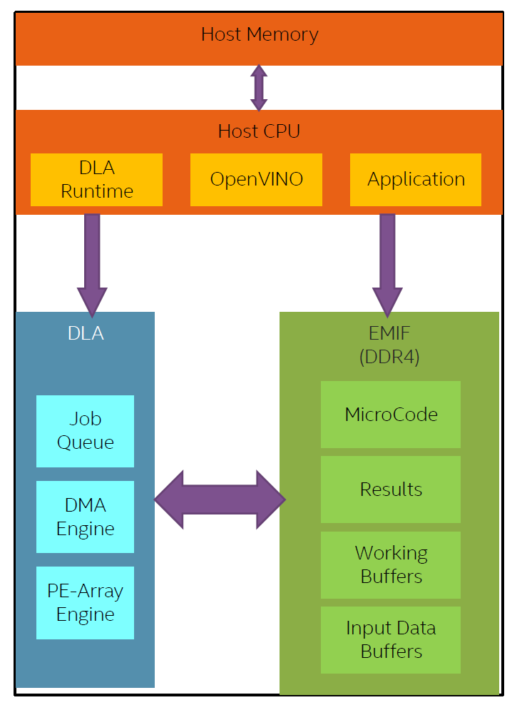

For a detailed overview of the FPGA AI Suite IP inference sequence, refer to the [FPGA AI Suite Handbook](https://docs.altera.com/r/docs/863373/2026.1.1/fpga-ai-suite-handbook/fpga-ai-suite-soc-design-example-inference-sequence-overview).

## 7.2 Memory-to-Memory (M2M) Variant Design

The memory-to-memory (M2M) variant of the SoC design example illustrates a technique for embedded (SoC) FPGA AI Suite operations where the input data sets are primarily drawn from a memory or file sources. In this scenario, the data is typically not real time and is processed as fast as possible.

This design combines the HPS SoC FPGA device with an additional DMA engine to allow for efficient transfer of data to and from the CPU and system memory. The HPS is an Arm Cortex*-A76/A55 on Agilex™ 5, an Arm Cortex-A53 on Agilex™ 7, and Arm Cortex-A9 on Arria® 10.

In the M2M design, the source data originally resides within the host CPU domain on an SD card. The application uses the DMA controller to move the host-side data to the device side domain. This movement mimics the process that an application would typically do.

The test program then initiates FPGA AI Suite IP inference operations and wait for the IP to complete its process. Command-line options to the user application define how many inferences are executed.

After the inference operation is completed, the application uses the DMA to transfer the results back from external memory to the host domain. The results are then displayed on the Linux console.

The Intel modular scatter-gather direct memory access (mSGDMA) controller IP provides this DMA facility.

### Figure 4: Block Diagram of M2M Variant

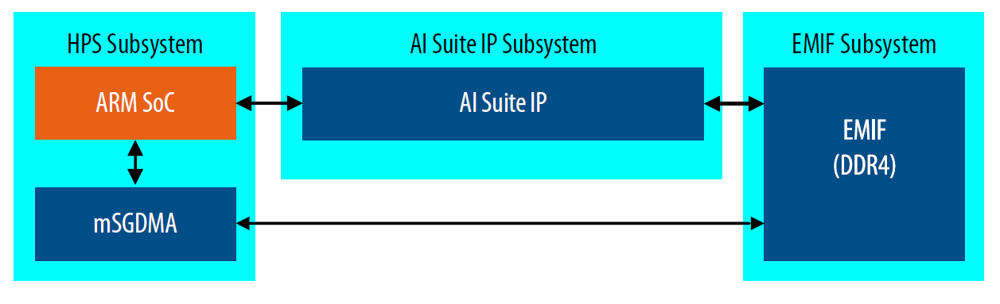

The M2M variant appears in Platform Designer as follows:

### Figure 5: M2M Variant in Platform Designer

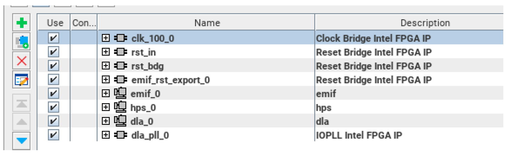

### 7.2.1 The mSGDMA Intel FPGA IP

The modular scatter-gather direct memory access (mSGDMA) Intel FPGA IP used in this design example serves as an example of how you can integrate a DMA into your own system. You can replace this DMA engine by another 3rd party controller.

The FPGA AI Suite runtime software must be modified if you want to use another DMA engine.

### 7.2.2 RAM considerations

An FPGA-based external memory interface is used to store all machine learning input, output, and intermediate data.

The FPGA AI Suite IP uses the DDR memory extensively in its operations.

Typically, you dedicate a memory to the FPGA AI Suite IP and avoid sharing it with the host CPU DDR memory. Although a design can use the host memory, other services that use the DDR memory impact the FPGA AI Suite IP performance and increase non-determinism in inference durations. Consider this impact when you choose to use a shared DDR resource.

The FPGA AI Suite IP requires an extensive depth of memory that prohibits the use of onboard RAM such as M20Ks. Consider the RAM/DDR memory footprint when you design with the FPGA AI Suite IP.

## 7.3 Streaming-to-Memory (S2M) Variant Design

The streaming-to-memory (S2M) variant of the SoC design example builds on top of the M2M design to demonstrate a method of using the FPGA AI Suite IP with continuously streaming input data.

The application example is a typical video stream being processed with ResNet50 to detect physical objects in the images, such as a person, cat, or dog.

In the example, test images are stored on the SD card file system. These images are loaded into host memory and a DMA (memory-to-streaming) IP is used to create a simulated video stream.

### Figure 6: Block Diagram of S2M Variant for Agilex™ 5 and Arria® 10

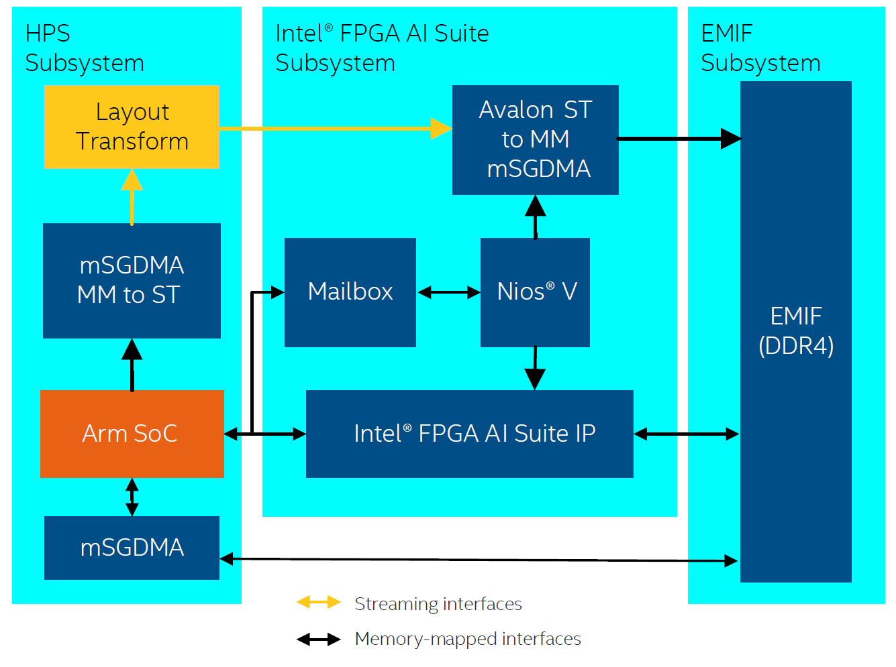

In the Agilex™ 7 version of the S2M variant, the "Layout Transform" block is not present. The layout transform occurs within the FPGA AI Suite IP.

The S2M variant appears in Platform Designer as follows:

### Figure 7: S2M Variant in Platform Designer

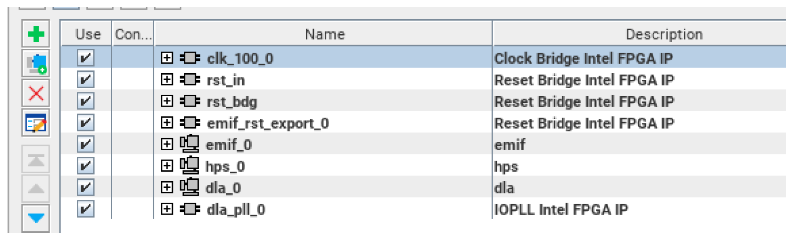

### 7.3.1 Streaming Enablement for FPGA AI Suite

In an M2M system, input buffers are provided by the host CPU. However, in a streaming system (S2M), input buffers are created by an external hardware stream.

For the FPGA AI Suite IP to process this external stream, several operations must happen in a coordinated way:

- The raw stream data must pass through a layout transform (either the FPGA AI Suite IP internal layout transform or layout transform in an external IP) to reformat the raw data into an FPGA AI Suite compliant data format
- The formatted data must be written into system memory at specific locations, known only to the host application and the FPGA AI Suite software library at run time.
- The FPGA AI Suite IP job queue must be primed at the correct time, in synchronization with the input stream buffers, such that the FPGA AI Suite IP starts an inference immediately upon a new input buffer becoming ready.

Within Platform Designer, a Nios V based subsystem is added alongside the FPGA AI Suite IP to provide the streaming capabilities. This subsystem highlighted in blue in the block diagram that follows.

In the diagram, the yellow interconnect lines indicate Avalon streaming interfaces, and the black interconnect lines indicate memory-mapped interfaces.

#### Figure 8: Nios V Streaming Subsystem

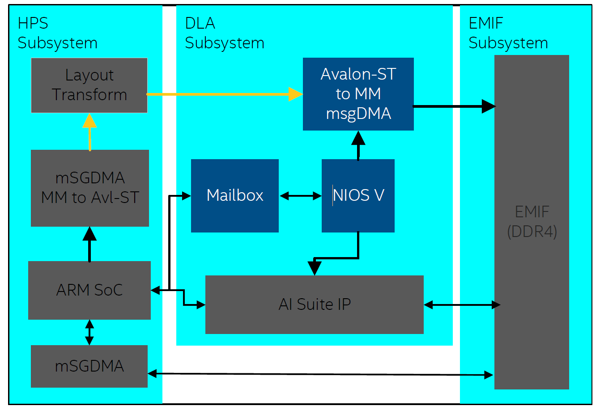

### 7.3.2 Nios V Subsystem

Three IP modules make up the Nios V subsystem:

- **mSGDMA (Avalon streaming to memory-mapped mode)**. This module is used to take the formatted input data stream and place it into system memory to create the FPGA AI Suite IP input buffers.
- **Mailbox (On-Chip Memory II Intel FPGA IP)**. This module is used to provide a communication API between the host-application and the Nios Subsystem. FPGA AI Suite IP command and status message are conveyed through this interface.
- **Nios V processor**. This module manages the FPGA AI Suite IP job-queue, mailbox and mSGDMA buffer allocation. Using the Nios V processor offloads the latency-sensitive ingest and buffer management from the HPS.

All C source-code to the Nios V application is provided. You can modify the Nios software to enable third-party DMA controllers, if required.

### 7.3.3 Streaming System Operation

Two operations must occur in parallel for streaming systems to work:

- Buffers must be managed appropriately. That is, buffers of streaming data must be written into system memory at a specific location ready for the FPGA AI Suite IP to process.
- Inference jobs must be managed appropriately. That is, inference jobs must be primed at the correct time to process the new buffer.

#### 7.3.3.1 Streaming System Buffer Management

Before machine learning inference operations can occur, the system requires some initial configuration.

As in the M2M variant, the S2M application allocates sections of system memory to handle the various FPGA AI Suite IP buffers at startup. These include the graph buffer, which contains the weights, biases and configuration, and the input and output buffers for individual inference requests.

Instead of fully managing these buffers, the input-data buffer management is offloaded to the Nios processor. The Nios processor owns the Avalon streaming to memory-mapped mSGDMA, and the processor programs this DMA to push the formatted data into system memory.

As the buffers are allocated at startup, the input buffer locations are written into the mailbox. The Nios V processor then holds onto these buffers until a new set is received. All stream data is now constantly pushed into these buffers in a circular ring-buffer concept.

#### 7.3.3.2 Streaming System Inference Job Management

In a M2M system, the host CPU handles pushing jobs into the FPGA AI Suite IP job queue by writing to the IP registers. In the streaming configuration, this task is offloaded to the Nios system and must be done in a coordinated way with the input buffer writing.

In streaming mode, the job-queue management is pushed to the mailbox instead of being managed by the host application. The job queue entry is then received by the Nios processor. After an input buffer is written, the mSGDMA interrupts the Nios processor, and the Nios processor now pushes one job into the FPGA AI Suite IP.

For every buffer stored by the mSGDMA, the Nios processor attempts to start another job.

For more details about the Nios V Stream Controller and the mailbox communication protocol, refer to [Streaming-to-Memory (S2M) Streaming Demonstration](#90-streaming-to-memory-s2m-streaming-demonstration).

### 7.3.4 Resolving Input Rate Mismatches Between the FPGA AI Suite IP and the Streaming Input

When designing a system, the stream buffer rate should be matched to the FPGA AI Suite IP inferencing rate, so that the input data does not arrive faster than the IP can process it.

The SoC design example has safeguards in the Nios subsystem for when the input data rate exceeds the FPGA AI Suite processing rate.

To prevent input buffer overflow (potentially writing to memory still being processed by the FPGA AI Suite IP), the Nios subsystem has a buffer dropping technique built into it. If the subsystem detects that the FPGA AI Suite IP is falling behind, it starts dropping input buffers to allow the IP to catch up.

Using mailbox commands, the host application can check the queue depth level of the Nios subsystem and see if the subsystem needs to drop input data.

Depending on the buffer processing requirements of a design, dropping input data might not be considered a failure. It is up to you to ensure that the IP inference rate meets the needs of the input data.

If buffer dropping is not desired, you can try to alleviate buffer dropping and increase FPGA AI Suite IP performance with the following options:

- Configure a higher performance `.arch` file (IP configuration), which requires more FPGA resource. The `.arch` can be customized for the target machine learning graphs.
- Increase the system clock-speed.
- Reduce the size of the machine learning network, if possible.
- Implement multiple instances of the FPGA AI Suite IP and multiplex input data between them.

### 22.3.5. The Layout Transform IP as an Application-Specific Block

For Agilex™ 5 and Arria® 10, the layout transformation IP in the S2M design is provided as RTL source as an example layout transformation within a video inferencing application.

For Agilex™ 7, the layout transform is part of the FPGA AI Suite IP. For details about layout transform within the FPGA AI Suite IP,refer to ["Transforming Input Data Layout" in FPGA AI Suite Handbook](https://docs.altera.com/r/docs/863373/2026.1.1/fpga-ai-suite-handbook/transforming-the-layout-of-input-data).

The flexibility of the FPGA AI Suite and the scope of projects it can support means that a layout transformation IP cannot serve all inference applications.

Each target application typically requires its own layout transformation module to be designed. System architectures need to budget for this design effort within their project.

Input data to the FPGA AI Suite IP must be formatted in memory so that the data matches the structure of the IP PE array and uses FP16 values.

The structure of the PE array is defined by the architecture file and the `c_vector` parameter setting describes the number of layers required for the input buffer. Typical `c_vector` values are 8, 16, and 32.

When considering streaming data, the `c_vector` can be viewed in comparison to the number of input channels of data that are present. For example, video has red, green, and blue channels that make up each pixel color. The following diagram shows how the video channels map to the input data stream required by the FPGA AI Suite IP.

#### Figure 9: Input Data Steam Mapping

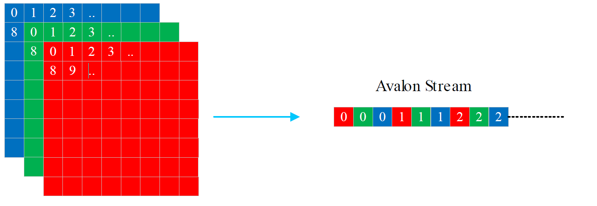

The S2M design demonstrates an example of video streaming. Pixel data is sent through the layout-transform as RGB pixels, where each color is considered an input channel of data.

As the input data comprise only three channels of input data, the input data must be padded with zeros for any unused channels. The following diagram shows an example of two architectures, one with `c_vector` value of 8 and another with `c_vector` value of 16.

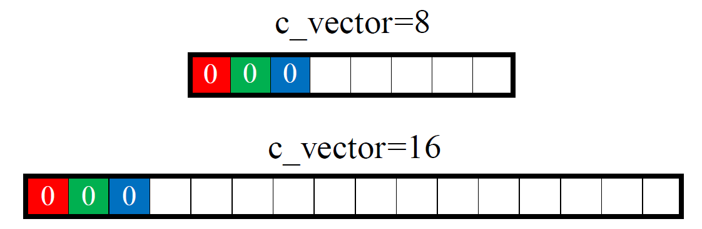

In the first example where `c_vector` is set to 8, the first pixel of RGB is placed on the input stream filling the first 3 channels, but there are 5 more channels remaining that must be initialized. These are filled with zero (represented by the white squares). This padded stream is then fed into the Nios subsystem.

This example layout transform does not support input folding. Input folding is an input preprocessing step that reduces the amount of zero padding in the c_vector. This folding then enables more efficient use of the dot product engine in the FPGA AI Suite IP. The efficiency gains can be significant depending on the graph and C_VEC. For more details, refer to ["Folding Input" in FPGA AI Suite Handbook](https://docs.altera.com/r/docs/863373/2026.1.1/fpga-ai-suite-handbook/folding-input).

**Related Information**
["Parameter: `c_vector`" in FPGA AI Suite IP Reference Manual](https://docs.altera.com/r/docs/863373/2026.1.1/fpga-ai-suite-handbook/parameter-group-global-parameters)

#### 22.3.5.1. Layout Transform Considerations

Pixels are typically 8-bit integer values, and the FPGA AI Suite requires FP16 values. As well as the `c_vector` padding, the layout transformation module converts the integer values to floating-point values.

The S2M example is a video-oriented demonstration. For networks such as ResNet50, the input pixel data must further be manipulated with a "mean" and "variance" value. The layout transformation module performs basic operation of Y=A*B+C operation on each pixel to meet the needs of a ResNet50 graph trained for ImageNet.

#### 22.3.5.2. Layout Transform IP Register Map

The layout transform IP has the following register address space:

##### Table 2: Register Address Space of Layout Transformation IP

| Register | Address Range | Description |
|---|---|---|
| Control | 0x00 | Main Control Register |
| C-Vector | 0x04 | Global C-Vector Control |
| Reserved | 0x08 .. 0x03f | |
| Variance | 0x40 .. 0x7f | Variance values per plane |
| Mean | 0x80 .. 0xbf | Mean Values per plane |
| Reserved | 0xc0 .. 0xff | |

##### **Control Register (0x00)**

This is the global control register. When altering other CSR registers, software should issue a reset to the LT module via this register to commission the new settings. The stream then generates outputs based on the new settings and flush out all stale data.

Attempting to alter the configuration registers of the LT during active streaming generates undefined output data.

##### Table 3: Control Register Layout

| Bit Location | Register | Description | Attributes |
|---|---|---|---|
| 0 | **Reset** | '1' = **In reset:** All streaming input data is discarded and no output data generated. <br> '0' = **Running:** Streaming input data produces LT output data. | RW |
| 31:1 | Reserved | | RO |

##### **C-Vector Register (0x04)**

This register should be configured to match the C-Vector value of the architecture built into the FPGA AI Suite. This value need only be written once at startup as the architecture of the FPGA AI Suite is fixed at build time.

##### Table 4: C-Vector Register Layout

| Bit Location | Register | Description | Attributes |
|---|---|---|---|
| 5:0 | **C-vector** | Value must match architecture of the DLA as defined in the `.arch` file | RW |
| 31:6 | Reserved | | RO |

##### **Variance Registers (0x40 .. 0x7F)**

Each plane has a unique variance value. Software must configure a value for each plane. The values are stored in FP32 format.

There are 16 registers in this section, where each register relates to a given plane.

This register is write-only and returns 0xFFFFFFFF when reading.

##### Table 5: Variance Registers Layout

| Bit Location | Register | Description | Attributes |
|---|---|---|---|
| 31:0 | **FP32 formatted Variance value per plane** | | WO |

##### **Mean Registers (0x80 .. 0xBF)**

Each plane has a unique a mean value. Software must configure a value for each plane. The values are stored in FP32 format.

There are 16 registers in this section, where each register relates to a given plane.

This register is write-only and returns 0xFFFFFFFF when reading.

##### Table 6: Mean Registers Layout

| Bit Location | Register | Description | Attributes |
|---|---|---|---|
| 31:0 | **FP32 formatted Mean value per plane** | | WO |

#### 22.3.5.3. Layout Transform Configuration Options

For SoC design examples other than the Agilex™ 7 S2M design, the example layout transform has a range of parameters to adjust to the data width based on the number of input planes being processed.

A maximum of 16 CSR mean and variance values are supported. The **Planes per sample** field sets this upper threshold.

All output data is in FP16 format which is the expected input format for the FPGA AI Suite.

The Input Layout Transform IP is not required for the Agilex™ 7 S2M design.

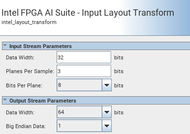

## 7.4 Top Level

After the Quartus Prime project has finished compiling, the design should look similar to the following image in the Quartus Prime Project Navigator:

### Figure 10: SoC Design Example Hierarchy

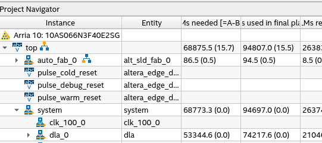

The top-level Verilog file and HPS configuration is derived directly from the GSRD designs located at the Altera FPGA Developer Site ([https://altera-fpga.github.io](https://altera-fpga.github.io)) or [RocketBoards.org](RocketBoards.org):


- For more information about the GSRD for the Agilex™ 5 FPGA E-Series 065B Modular Development Kit, refer to the following URL: [https://altera-fpga.github.io/latest/embedded-designs/agilex-5/e-series/modular/gsrd/ug-gsrd-agx5emodular/](https://altera-fpga.github.io/latest/embedded-designs/agilex-5/e-series/modular/gsrd/ug-gsrd-agx5emodular/).
- For more information about the GSRD for the Agilex™ 7 FPGA I-Series Transceiver-SoC Development Kit, refer to the following URL: [https://altera-fpga.github.io/latest/embedded-designs/agilex-7/i-series/soc/gsrd/ug-gsrd-agx7i-soc/](https://altera-fpga.github.io/latest/embedded-designs/agilex-7/i-series/soc/gsrd/ug-gsrd-agx7i-soc/).
- For more information about the GSRD for the Arria® 10 SX SoC FPGA Development Kit, refer to the following URL: [https://www.rocketboards.org/foswiki/Documentation/arria10SoCGSRD](https://www.rocketboards.org/foswiki/Documentation/arria10SoCGSRD).

The GSRD designs have been modified to include the FPGA AI Suite IP. All unnecessary logic has been removed, which provides a concise design example.

The main FPGA AI Suite SoC design example is contained within a single Platform Designer **system**, called system. Double-click this node in the Quartus Prime Project Navigator to launch Platform Designer.

**Related Information**
- [GSRD for Agilex™ 5 E-Series Modular Development Kit at Altera FPGA Developer Site](https://altera-fpga.github.io/rel-25.3/embedded-designs/agilex-5/e-series/modular/gsrd/ug-gsrd-agx5e-modular/)
- [GSRD for Agilex™ 7 I-Series Transceiver-SoC DevKit (4x F-Tile) at Altera FPGA Developer Site](https://altera-fpga.github.io/rel-25.3/embedded-designs/agilex-7/i-series/soc/gsrd/ug-gsrd-agx7i-soc/)
- [Arria® 10 SoC GSRD at RocketBoards.org](https://www.rocketboards.org/foswiki/Documentation/arria10SoCGSRD)

### 22.4.1. Clock Domains

There are three main clocks within this design. All the clocks are considered asynchronous to each other. The SDC file provided has the clocking constraints for this design.

The design clocks are as follows:

#### Table 7: SDC Clock Domains for SoC Design Example

| Clock | Clock Description | Agilex™ 5 Design Clock Frequency | Agilex™ 7 Design Clock Frequency | Arria® 10 Design Clock Frequency |
|---|---|---|---|---|
| **Board clock** | This clock is used for all mSGDMA infrastructure and CPU CSR interfaces. The HPS AXI interfaces all run off this clock. | 100 MHz | 100 MHz | 100 MHz |
| **DLA clock** | This clock is used only by the FPGA AI Suite IP. It feeds the dla_clk pin and is used inside FPGA AI Suite IP PE array. | 200 MHz | 400 MHz | 200 MHz |
| **DDR clock** | This is used for the DDR controller and interconnect between the DLA and DDR. This interface is used by the DLA to transfer workloads back and forth to system memory. | 200 MHz | 333 MHz | 266 MHz |

## 7.5 The SoC Design Example Platform Designer System

At the center of the SoC design example is the Platform Designer system.

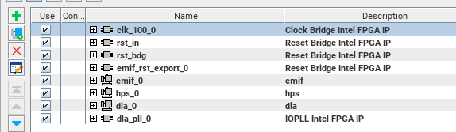

In Platform Designer, the SoC design example is separated into three hierarchical layers, the:

- **emif_0** : This layer contains the FPGA DDR4 External Memory Interface
- **dla_0** : This layer contains all the DLA IP and infrastructure IP
- **hps_0** : This layer contains all the ARM-HPS, ARM-EMIF and infrastructure IP for the ARM

The division of hierarchy demonstrates the sections of the design that are relevant to the solution. For example, if you want to target another board with a different external memory interface, you need to edit only the **emif_0** layer.

### 22.5.1. The dla_0 Platform Designer Layer (dla.qsys)

The **dla_0** layer contains the FPGA AI Suite IP and the Nios V subsystem to provide streaming capabilities.

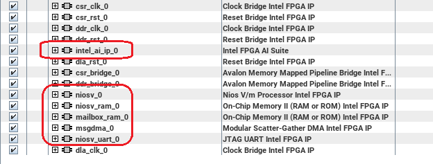

When incorporating the FPGA AI Suite IP into a custom design, you can use the dla.qsys file as a starting point for the new design.

### 22.5.2. The hps_0 Platform Designer Layer (hps.qys)

The **hps_0** layer contains the HPS, an mSGDMA instance (msgdma_0) for the FPGA AI Suite runtime, and an mSGDMA instance (msgdma_1) for the streaming generation app (S2M variant only).

The example layout transform is also located here and can be replaced by your version.

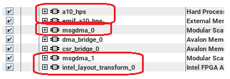

## 7.6 Fabric EMIF Design Component

The design provides a 266MHz DDR4-64Bit Avalon-based memory controller. This EMIF is used solely by the DLA.

The FPGA AI Suite IP memory interface is configured to be 512 bits wide. The EMIF interface is setup to complement this configuration.

## 7.7 PLL Configuration

The FPGA AI Suite IP is designed to operate at high fMAX rates in Intel FPGA devices. The SoC design example provides an IOPLL that provides the IP with a fast clock.

In the design example the external board 100 MHz reference clock is fed into the PLL and a 200 MHz output clock is produced. This clock feeds the FPGA AI Suite IP directly.

You can remove or alter this PLL if you want to profile different performance curves of the system.

The FPGA AI Suite `dla_benchmark` application has no runtime method to dynamically determine the PLL operating frequency in the SOC design. The frequency of 200 MHz has been set as a constant in this application source code. If you alter the PLL frequency, you must also alter the `dla_benchmark` application to match the new clock frequency. This matching ensures that the benchmark metrics accurately reflect the performance.

See `dla_mmd_get_coredla_clock_freq` in `$COREDLA_WORK/runtime/coredla_device/mmd/hps_platform/acl_hps.cpp` and change the return value accordingly.

# 8.0 FPGA AI Suite SoC Design Example Software Components

The FPGA AI Suite SoC design example contains a software environment for the runtime flow.

The software environment for the supported FPGA development kits consists of the following components:

- Yocto build and runtime Linux environment
- Intel Distribution of OpenVINO toolkit Version 2025.4 LTS (Inference Engine, Heterogeneous plugin)
- OpenVINO Arm CPU plugin
- FPGA AI Suite runtime plugin
- MMD hardware library

The FPGA AI Suite SoC design example contains the source files, Makefiles, and scripts to cross compile all the software for the supported FPGA development kit. The Yocto SDK provides the cross compiler, and is the first component that must be built.

The machine learning network graph is compiled separately using the OpenVINO Model Optimizer and the FPGA AI Suite compiler (`dla_compiler`) command. When you compile the graph for the FPGA AI Suite SoC design example, ensure that you specify the `--foutput-format=open_vino_hetero` and `-o <path_to_file>/CompiledNetwork.aot` options.

The AOT file from the FPGA AI Suite compiler contains the compiled network partitions for FPGA and CPU devices along with the network weights. The network is compiled for a specific FPGA AI Suite architecture and batch size.

The SoC flow does not support the Just-In-Time (JIT) flow because Arm libraries are not available for the FPGA AI Suite compiler.

An architecture file (`.arch`) describes the FPGA AI Suite IP architecture to the compiler. You must specify the same architecture file to the FPGA AI Suite compiler and to the FPGA AI Suite design example build script (`dla_build_example_design.py`).

The runtime stack cannot program the FPGA with a bitstream. The bitstream must be built into the SD card (`.wic`) image that is used to program the flash card, as described in (Optional) [Create an SD Card Image (`.wic`)](#423-optional-create-an-sd-card-image-wic) and [Writing the SD Card Image (`.wic`) to an SD Card](#43-writing-the-sd-card-image-wic-to-an-sd-card).

The runtime inference on the SoC FPGA device uses the OpenVINO Arm CPU plugin. To enable fallback to the OpenVINO Arm CPU plugin for graph layers that are not supported on the FPGA, the device flag must be set to HETERO:FPGA,CPU during the AOT compile step and when you run the `dla_benchmark` command.

In some cases, a layer might be supported by the FPGA even though the OpenVINO Arm CPU plugin does not support the layer. This support is handled by the HETERO plugin and the layer is executed on the FPGA as expected. As an example, 3D convolution layers are not supported by the OpenVINO Arm CPU plugin but still work properly provided that the `.arch` file used for the FPGA AI Suite IP configuration has enabled support for 3D convolutions.

**Related Information**
- ["Running the Model Compiler" in FPGA AI Suite Handbook](https://docs.altera.com/r/docs/863373/2026.1.1/fpga-ai-suite-handbook/running-the-model-compiler)
- ["Architecture Description File Parameters" in FPGA AI Suite Handbook](https://docs.altera.com/r/docs/863373/2026.1.1/fpga-ai-suite-handbook/architecture-description-file-parameters)
- ["Compilation Options (dla_compiler Command Options)" in FPGA AI Suite Handbook](https://docs.altera.com/r/docs/863373/2026.1.1/fpga-ai-suite-handbook/compilation-options-dla_compiler-command-options)

## 8.1 Yocto Build and Runtime Linux Environment

The Linux runtime and build environment is based on the Yocto build system. Yocto uses a build model based on the concept of layers and recipes.

The Yocto layers and recipes for FPGA AI Suite SoC design example are in `$COREDLA_ROOT/hps/ed4/yocto/`. The recipes extend the standard Golden System Reference Design (GSRD) that is used as the basis for the SoC design example system. For further details on setting up Yocto for Intel SoC devices see the GSRD documentation.

The rest of this section describes key recipes in the* metal-intel-fpga-coredla* layer.

**Related Information**
- [https://yoctoproject.org](https://yoctoproject.org)
- [https://www.rocketboards.org/foswiki/Documentation/GSRD](https://www.rocketboards.org/foswiki/Documentation/GSRD)

### 8.1.1 Yocto Recipe: recipes-core/images/coredla-image.bb

This Yocto recipe customizes the image used on the SoC design example.

The `IMAGE_INSTALL:append` section defines extra packages for the FPGA AI Suite SoC example design. In particular, the *msgdma-userio*, *uio-devices*, and kernel-modules recipes are enabled to support the UIO and mSGDMA. The `WKS_FILES:*` section specifies which definition is used for building the SD card image.

### 8.1.2 Yocto Recipe: recipes-bsp/u-boot/u-boot-socfpga_%.bbappend

This Yocto recipe appends to the *meta-intel-fpga/recipes-bsp* recipe and enables the FPGA to SDRAM bridge, if it is required for the device target. This bridge is not required for Arria® 10 designs.

On devices that require the bridge, the bridge allows mSGDMA to access the HPS SDRAM. This access exposes the full HPS SDRAM to the FPGA device.

### 8.1.3 Yocto Recipe: recipes-drivers/msgdma-userio/msgdma-userio.bb

This Yocto recipe enables an out-of-kernel (userspace) build of the *msgdma-userio* character driver used for transfer data to and from the HPS to the FPGA DDR memory.

This driver calls into the DMA_ENGINE API exposed by the altera-msgdma kernel driver. The kernel module altera-msgdma.ko is enabled in recipe-kernel/linux kernel configuration file: `recipes-kernel/linux/files/enable-coredla-mod.cfg`.

Device tree settings are set to assign base address, IRQ for the altera-msgdma and associated to the *msgdma-userio* driver. These can be found in `recipes-kernel/linux/files/coredla-dts.patch`.

### 8.1.4 Yocto Recipe: recipes-drivers/uio-devices/uio-devices.bb

This Yocto recipe installs a service which starts up the uio drivers within the system. The *uio_pdrv_genirq* driver provides user mode access to mapping and umapping CSR registers in the FPGA AI Suite IP.

The kernel modules `uio.ko` and `uio_pdev_genirq.ko` are enabled in the *recipe-kernel/linux* kernel configuration file: `recipes-kernel/linux/files/enable-mod.cfg`.

The device tree settings are set to assign base addresses and IRQs for the FPGA AI Suite IP, the stream controller, and the layout transform module. These can be found in `recipes-kernel/linux/files/coredla-dts.patch`.

### 8.1.5 Yocto Recipe: recipes-kernel/linux/linux-socfpga-lts_%.bbappend

This Yocto recipe applies the 0001-altera-msgdma.patch, which does the following fixes:

- Set the FPGA DDR src and dest addresses to allow memory to and from the device to work correctly.
- Fixes the calculation of the number of descriptors used for a transfer on an Arria® 10 device.

For Agilex™ 7 devices, the `agilex-dts.patch` patch enables necessary drivers in the device tree.

For Arria® 10 devices, the `coredla-dts.patch` patch enables necessary drivers in the device tree.

This recipe also includes `enable-coredla-mod.cfg`, which is the kernel configuration file to enable *altera-msgdma* driver, *uio*, and *uio_pdrv_genirq* drivers.

### 8.1.6 Yocto Recipe: recipes-support/devmem2/devmem2_2.0.bb

This Yocto recipe downloads, compiles, and installs The devmem2 utility from [https://github.com/radii/devmem2](https://github.com/radii/devmem2) for use in debugging designs. The `devmem2` utility is a simple program to read/write from/to any memory location.

### 8.1.7 Yocto Recipe: wic

This Yocto recipe contains four files that define the layout of the SD card image. Each file defines the layout for one of the following devices: Agilex™ 5, Agilex™ 7, Arria® 10, and Stratix® 10 (not currently supported by the SoC design example). The partitions are as follows:

- **vfat** - Storage for the Linux kernel, device tree, FPGA image, and u-boot
- **ext4** - Root file system
- **raw** - Arria® 10 only. A custom raw partition labeled "a2". This is used for the first-stage boot loader.

## 8.2 FPGA AI Suite Runtime Plugin

The FPGA AI Suite runtime plugin is described in "OpenVINO FPGA Runtime Plugin" in FPGA AI Suite PCIe-based Design Example User Guide.

Note that the FPGA AI Suite on Arm CPUs does not support the JIT (Just-In-Time) flow.

## 8.3 Runtime Interaction with the MMD Layer

The FPGA AI Suite runtime uses the MMD layer to interact with the memory-mapped device. In the SoC Example Design, the MMD layer communicates via Linux kernel drivers described in [MMD Layer Hardware Interaction Library](#84-mmd-layer-hardware-interaction-library).

The key classes and structure of the runtime are described in "FPGA AI Suite Runtime" in FPGA AI Suite PCIe-based Design Example User Guide.

## 8.4 MMD Layer Hardware Interaction Library

Runtime communication with CSR registers for the stream controller and for the FPGA AI Suite IP happens via the UIO driver. See The Userspace I/O HOWTO for more information on the UIO communication model.

FPGA AI Suite IP graph weights and instructions (from the AOT file) are transferred from host DDR memory to EMIF DDR memory (allocated to the FPGA FPGA AI Suite IP) via the *msgdma-userio* driver (a custom kernel driver, see [Yocto Recipe: recipes-drivers/msgdma-userio/msgdma-userio.bb](#813-yocto-recipe-recipes-driversmsgdma-useriomsgdma-useriobb)). This driver is also used to send microcode and images. Lastly, inference results are transferred into host DDR via the *mSGDMA-USERIO* driver.

The source files for the library are in `runtime/coredla_device/mmd/hps_platform/`. The files contain classes for managing and accessing the FPGA AI Suite IP, the stream controller, the layout transform module, and DMA by UIO and *MSGDMA-USERIO* drivers. The remainder of this section describes the key classes.

### 8.4.1 MMD Layer Hardware Interaction Library Class mmd_device

This class has the following responsibilities:

- Acquire the FPGA AI Suite IP, the stream controller (S2M only) and the mSGDMA
- Register interrupt callback for the FPGA AI Suite IP
- Provide read/write CSR and DDR functionality to the FPGA AI Suite runtime
- Linux device discovery.

The class attempts discovery of the following UIO devices, each from the `/sys/class/uio/ui*/` namespace.

| Device | Description |
|---|---|
| coredla0 | This represents the FPGA AI Suite IP CSR registers. |
| stream_controller0 | If present (S2M only), this represents the Stream Controller CSR registers. |
| layout_transform0 | If present (S2M only), this represents the Layout Transform CSR registers. Note that this device is not directly controlled from the runtime. |

The class also attempts to discover the following *mSGDMA-USERIO* devices.

| Device | Description |
|---|---|
| /dev/msgdma_coredla0 | This represents the mSGDMA used to transfer weights, instructions, microcode, and, during M2M operation, image data. |
| /dev/msgdma_stream0 | This represents the mSGDMA used to transfer images to the Layout Transform during the S2M mode of operation. |

### 8.4.2 MMD Layer Hardware Interaction Library Class uio_device

The Linux device tree is used for UIO devices. The following responsibilities are assumed by this file:

- Acquire and maps/unmap the FPGA CSRs to user mode, using the sysfs entries for UIO (`/sys/class/uio/uio*/`).
- Acquire and register a callback for the interrupt from the FPGA AI Suite IP.
- Provide `read_block()` and `write_block()` functions for accessing the CSRs.

### 8.4.3 MMD Layer Hardware Interaction Library Class dma_device

The Linux device tree is used for *mSGDMA-USERIO* devices. These devices provide a Linux character device for simple read/write access to/from the FPGA EMIF via `fseek()`, `fread()`, and `fwrite()`.

The following responsibilities are assumed by this class:

- Acquire the *mSGDMA-USERIO* driver interface.
- Provide `read_block()` and `write_block()` functions for transfers from and to the FPGA AI Suite assigned DDR memory


# 9.0 Streaming-to-Memory (S2M) Streaming Demonstration

A typical use case of the FPGA AI Suite IP is to run inferences on live input data. For instance, live data can come from a video source such as an HDMI IP core and stream to the FPGA AI Suite IP to perform image classification on each frame.

For simplicity, the S2M demonstration only simulates a live video source. The streaming demonstration consists of the following applications that run on the target SoC device:

- **streaming_inference_app**
  This application loads and runs a network and captures the results.
- **image_streaming_app**
  This application loads bitmap files from a folder on the SD card and continuously sends the images to the EMIF, simulating a running video source

The images are passed through a layout transform IP that maps the incoming images from their frame buffer encoding to the layout required by the FPGA AI Suite IP.

There is a module called the *stream controller* that runs on a Nios V microcontroller that controls the scheduling of the source images to the FPGA AI Suite IP.

The `streaming_inference_app` application creates OpenVINO inference requests. Each inference request is allocated memory on the EMIF for input and output buffers. This information is sent to the stream controller when the inference requests are submitted for asynchronous execution.

In its running state, the stream controller waits for input buffers to arrive from the `image_streaming_app` application. When the buffer arrives, the stream controller programs the FPGA AI Suite IP with the details of the received input buffer, which triggers the FPGA AI Suite IP to run an inference.

When an inference is complete, a completion count register is incremented within the FPGA AI Suite IP CSRs. This counter is monitored by the currently executing inference request in the `streaming_inference_app` application, and is marked as complete when the increment is detected. The output buffer is then fetched from the EMIF and the FPGA AI Suite IP portion of the inference is now complete.

Depending on the model used, there might be further processing of the output by the OpenVINO HETERO plugin and OpenVINO Arm CPU plugin. After the complete network has finished processing, a callback is made to the application to indicate the inference is complete.

The application performs some post processing on the buffer to generate the results and then resubmits the same inference request back to OpenVINO, which lets the stream controller use the same input/output memory block again.

## 9.1 Nios Subsystem

The stream controller module runs autonomously in a Nios V microcontroller. An interface to the module is created by the FPGA AI Suite OpenVINO plugin when an "external streaming" flag is enabled by the inference application. At startup, the interface checks that the stream controller is present by sending a ping message and waiting for a response.

The following sections describe details of the various messages that are sent between the plugin and the stream controller, along with their packet structure.

### 9.1.1 Stream Controller Communication Protocol

The FPGA AI Suite OpenVINO plugin running on the HPS system includes a *coredla-device* component which in turn has a stream controller interface if the "external streaming" flag is enabled by the inference application. This stream controller interface manages the communications from the HPS end to the stream controller microcode module running on the Nios V microcontroller.

Messages are sent between the HPS and the Nios V microcontroller using the mailbox RAM which is shared between the two. In the HPS, this RAM is at physical address 0xff210000, and in the Nios V microcontroller, it is at address 0x40000. The RAM is 4K bytes. The lower 2K is used to send messages from the HPS to the Nios V microcontroller, and the upper 2K is used to send messages from the Nios V microcontroller to the HPS.

Message flow is always initiated from the HPS end, and the Nios V microcontroller always responds with a message. Therefore, after sending any message the HPS end waits until it receives a reply message. This can contain payload data (for example, status information) or just a "no operation" message with no payload.

Each message has a 3 x uint32_t header, which consists of a *messageReadyMagicNumber* field, a messageType field, and a *sequenceID* field. This header is followed by a payload, the size of which depends on the messageType. The *messageReadyMagicNumber* field is set to the value of 0x55225522 when the message is ready to be received

When a message is to be sent, all of the buffer apart from the *messageReadyMagicNumber* is first written to the mailbox RAM. The *sequenceID* increments by 1 with every message sent. Then the *messageReadyMagicNumber* is written. The sending end then waits for the value of *messageReadyMagicNumber* to change to the value of the *sequenceID*. This is set by the stream controller microcode module and indicates that the message has been received and processed by the receiving end.

#### Figure 11: Stream Controller Mailbox RAM and Message Packets

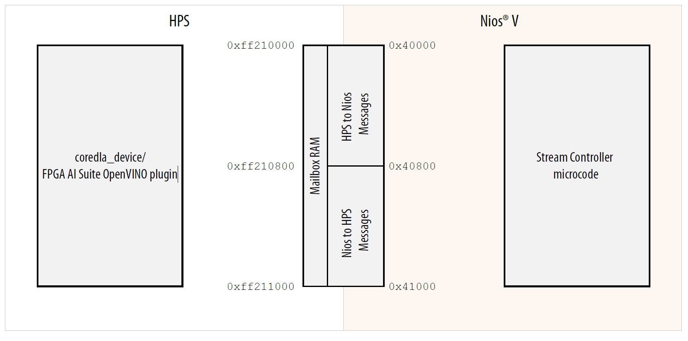

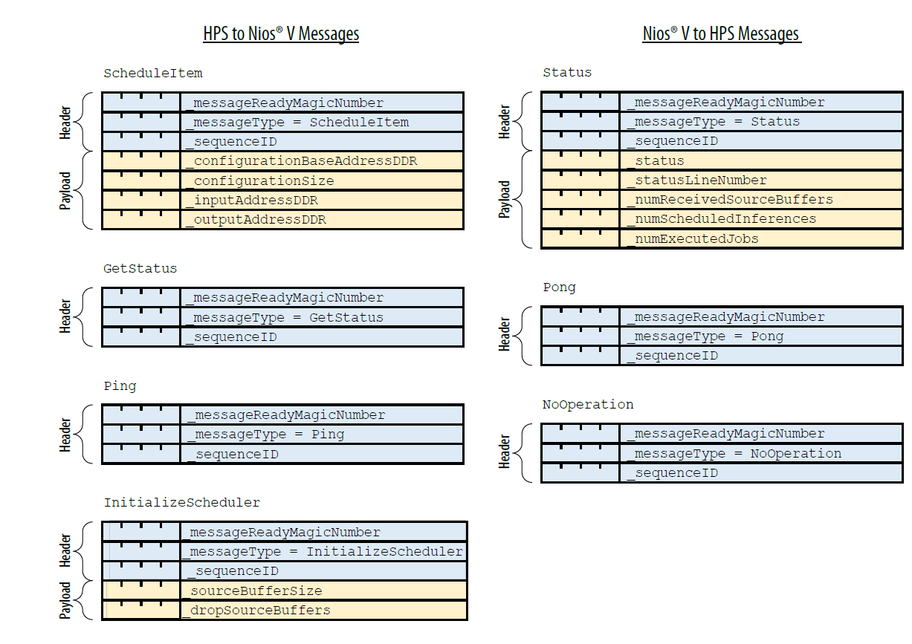

### 9.1.2 Buffer Flow in Streaming Mode using Nios V Software Scheduler

#### 9.1.2.1 Review of M2M mode

To explain how the buffers are managed in streaming mode, it can help to review the existing flow for M2M mode.

The inference application loads source images from .bmp files into memory allocated from its heap. These buffers are 224x224x3 uint8_t samples (150528 bytes). During the load, the BGR channels are rearranged from interleaved channels into planes.

OpenVINO inference requests are created by the application using the inference engine. These inference requests allocate buffers in the on-board EMIF memory. The size of each of these buffers is the size of the input buffer plus the size of the output buffer. The input buffer size depends FPGA AI Suite IP parameters (specified in the .arch file) for which the graph was compiled.

The BGR planar image buffers are attached as input blobs to these OpenVINO inference requests, which are then scheduled for execution.

**Preprocessing Steps**

In M2M mode, the preprocessing steps are performed in software.

• The samples are converted to 32-bit floating point, and the mean G, B and R values of the imagenet dataset are subtracted from each sample accordingly.
• The samples are converted to 16-bit floating point.
• A layout transform then maps these samples into a larger buffer which has padding, in the layout expected by the FPGA AI Suite.

**Inference Execution Steps**

• The transformed image is written directly to board memory at its allocated address.
• The FPGA AI Suite IP CSR registers are programmed to schedule the inference.
• The FPGA AI Suite OpenVINO plugin monitors the completion count register (located on the FPGA AI Suite IP), either by polling or receiving an interrupt, and waits until the count increments.
• The results buffer (2048 bytes) is read directly from the EMIF on the board to HPS memory.

**Postprocessing Steps**

• The samples in the results buffer (1001 16-bit floating point values) are converted to 32-bit floating point.
• The inference application receives these buffers, sorts them, and collects the top five results.

#### 9.1.2.2 External Streaming Mode Buffer Flow

External streaming mode is enabled in the inference application by setting the configuration value `DLIA_CONFIG_KEY(EXTERNAL_STREAMING)` to `CONFIG_VALUE(YES)` in the OpenVINO FPGA plugin.

In streaming mode, the inference application does not handle any of the input buffers. It still must create inference requests, which allocate the input and output buffers in the EMIF memory as before, but no input blobs are attached to the inference requests. When the inference request is executed, there are no preprocessing steps required, since they do not have any input blobs.

**Inference Execution Steps**

• Instead of writing a source buffer directly to its allocated address, a ScheduleItem command is sent to the Nios V stream controller which contains details of the input buffer EMIF address.
• The FPGA AI Suite IP CSR registers are **not** programmed by the plugin.
• The plugin waits for the completion count register to increment as before.
• The results buffer is read directly from the board as before.

**Postprocessing Steps**

• The samples in the results buffer (1001 16-bit floating point values) are converted to 32-bit floating point.
• The inference application receives these buffers, sorts them, and collects the top five results.
• The same inference request is rescheduled with the inference engine.

#### 9.1.2.3 Nios V Stream Controller State Machine Buffer Flow

When the network is loaded into the coredla_device, if external streaming has been enabled, a connection to the Nios V processor is created and an InitializeScheduler message is sent. This message resets the stream controller and sets the size of the raw input buffers and the drop/receive ratio of buffers from the input stream.

The inference application queries the plugin for the number of inference requests to create. When scheduled with the inference engine, these send ScheduleItem commands to the stream controller, and a corresponding CoreDlaJobItem is created. The CoreDlaJobItem keeps details of the input buffer address and size and has flags to indicate if it has a source buffer and to indicate if it has been scheduled for inference on the FPGA AI Suite IP. The CoreDlaJobItem instances are handled as if they are in a circular buffer.

When the Nios V stream controller has received a ScheduleItem command from all of the inference requests and created a CoreDlaJobItem instance for each of them, it changes to a running state, which arms the mSGDMA stream to receive buffers, and sets a pointer pFillingImageJob that identifies which of the buffers is the next to be filled.

It then enters a loop, waiting for two types of event:

• A buffer is received through the mSGDMA, which is detected by a callback from an ISR.
• A message is received from the HPS.

**New Buffer Received**

The pFillingImageJob pointer is marked as now having a buffer.

If the next job in the circular buffer does not have a buffer, the pFillingImageJob pointer is moved on and the mSGDMA is armed again to receive the next buffer at the address of this next job.

If it does have a buffer, the FPGA AI Suite IP cannot keep up with the input buffer rate, so the pFillingImageJob does not move and the mSGDMA is armed to capture the next buffer at the same address. This means that the previous input buffer is dropped and is not processed by the FPGA AI Suite IP.

Buffers that have not been dropped can now be scheduled for inference on the FPGA AI Suite IP provided that the IP has fewer than two jobs in its pipeline.

Scheduling a job for execution means programming the CSR registers with the configuration address, the configuration size, and the input buffers address in DDR memory. This programming also sets the flag on the job so the controller knows that the job has been scheduled.

**Message Received**

If the message is a ScheduleItem message type then an inference request has been scheduled by the inference application.

This request happens only if a previous inference request has been completed and rescheduled. The number of jobs in the FPGA AI Suite IP pipeline has decreased by 1, so another job can potentially be scheduled for inference execution, providing it has an input buffer assigned.

If there are no jobs available with valid input buffers, then the FPGA AI Suite IP is processing buffers faster than they are being received by the mSGDMA stream, and consequently all input buffers are processed (that is, none are dropped).

## 9.2 Building the Stream Controller Module

The stream controller is built as part of the steps described in [Installing HPS Disk Image Build Prerequisites](#425-installing-hps-disk-image-build-prerequisites). For system development that extends the FPGA AI Suite SoC design example, you might want to compile the stream controller module independently.

The stream controller module source code can be found in the distribution, in the `runtime/coredla_device/stream_controller/` directory.

There is a script `build.sh` in the source code directory that builds a binary *.hex* file. This file is then used by Quartus Prime when building the firmware to embed the microcode module.

The script should be run from a Nios V command shell, which is part of Quartus Prime. It requires a Quartus Prime project file and a Quartus Prime *.qsys* file. For this design example, the project file is `top.qpf`, and the Platform Designer file is `dla.qsys`.

An example command to build the stream controller module is as follows:

```bash
./build.sh top.qpf dla.qsys stream_controller.hex
```

## 9.3 Building the Streaming Demonstration Applications

The two streaming demonstration applications, `streaming_inference_app` and `image_streaming_app`, are built as part of the runtime and are included on the SD card image for the target device in the directory `/home/root/app/`.

## 9.4 Running the Streaming Demonstration

You need two terminals connected to the target device, one for each of the streaming applications.

One can be a serial terminal, and the other can be an SSH connection from a desktop PC. For details, refer to [Running the S2M Mode Demonstration Application](#472-running-the-s2m-mode-demonstration-application).

## 9.5 The streaming_inference_app Application

The `streaming_inference_app` application is an OpenVINO-based application. It loads a given precompiled ResNet50 network, then creates inference requests that are executed asynchronously by the FPGA AI Suite IP.

The resulting tensors are captured from the EMIF using the mSGDMA controller. The postprocessing required in the software involves converting the output tensors to floating point, assigning the values to the appropriate image classification, sorting the results, and selecting the top 5 classification results.

For each inference, the result is displayed on the terminal, and the results for each inference up to the 1000th one are logged in a `results.txt` file in the application folder.

The application depends on the following shared libraries. The system build adds these libraries to the directory `/home/root/app` on the SD card image, along with the application binary and a `plugins.xml` file that defines the plugins available to OpenVINO.

- libhps_platform_mmd.so
- libngraph.so
- libinference_engine.so
- libinference_engine_transformations.so
- libcoreDLAHeteroPlugin.so
- libcoreDlaRuntimePlugin.so

You also need a compiled network binary file and an `.arch` file (which describes the FPGA AI Suite IP parameterization) to run inferences. These have been copied to the `/home/root/resnet-50-tf` directory.

For example, a ResNet50 model compiled for an Arria® 10 might have the following files:

- RN50_Performance_no_folding.aot
- A10_Performance.arch

Before running the application, set the `LD_LIBRARY_PATH` shell environment variable to define the location of the shared libraries:

```sh
root@arria10-1ac87246f24f:~# cd /home/root/app
root@arria10-1ac87246f24f:~# export LD_LIBRARY_PATH=.
```

Use the `--help` of the `streaming_inference_app` command to display the command usage:

```sh
# ./streaming_inference_app -help
Usage:
streaming_inference_app -model=<model\> -arch=<arch\> -device=<device\>

Where:
<model> is the compiled model binary file, eg /home/root/resnet-50-tf/RN50_Performance_no_folding.aot
<arch> is the architecture file, eg /home/root/resnet-50-tf/A10_Performance.arch
<device> is the OpenVINO device ID, eg HETERO:FPGA or HETERO:FPGA,CPU
```

Start the streaming inference app with a command like this:

```sh
# ./streaming_inference_app \
-model=/home/root/resnet-50-tf/RN50_Performance_no_folding.aot \
-arch=/home/root/resnet-50-tf/A10_Performance.arch \
-device=HETERO:FPGA
```

The distribution includes a shell script utility called `run_inference_stream.sh` which calls this command above.

For Agilex™ 5 and Arria® 10, the layout transform IP core does not support folding on the input buffer. For streaming, you must use models that have been compiled by the `dla_compiler` command with the `--ffolding-option=0` command line option specified.

For Agilex™ 7, folding is supported on the input buffer.

## 9.6 The image_streaming_app Application

The `image_streaming_app` application loads images from the SD card, programs the layout transform IP, and then transfers the buffers via a streaming mSGDMA interface to the device. The buffers are sent at regular intervals at a frequency set by one of the command line options. Buffers are continually sent until the program is stopped with Ctrl+C.

The `image_streaming_app` application works only with *.bmp* files with dimensions of 224x224 pixels. The *.bmp* files can be either 24 or 32 bits per pixel format. If they are 24 bits, the buffers are padded to make them 32 bits per pixel. This format is expected by the input of the layout transform IP.

The command usage from the -help command option is as follows:

```
root@agilex7:~/app# ./image_streaming_app --help
Usage:
image_streaming_app [Options]

Options:
-images_folder=folder  Location of bitmap files. Defaults to working folder.
-image=path           Location of a single bitmap file for single inference.
-send=n              Number of images to stream. Default is 1 if -image is set, otherwise infinite.
-rate=n              Rate to stream images, in Hz. n is an integer. Default is 30.
-width=n             Image width in pixels, default = 224
-height=n            Image height in pixels, default = 224
-c_vector=n          C vector size, default = 32
-blue_variance=n     Blue variance, default = 1.0
-green_variance=n    Green variance, default = 1.0
-red_variance=n      Red variance, default = 1.0
-blue_shift=n        Blue shift, default = -103.94
-green_shift=n       Green shift, default -116.78
-red_shift=n         Red shift, default = -123.68
```

The distribution includes a shell script utility called `run_image_stream.sh` that calls the `image_streaming_app` command with a rate of 50 Hz and default layout transform settings.

Once both applications are running, the `streaming_inference_app` application outputs the results to the terminal and a `results.txt` file.

Example output from the `streaming_inference_app` application is as follows:

```
root@agilex7:~/app# ./run_inference_stream.sh
Runtime version check is enabled.
[ INFO ] Architecture used to compile the imported model: AGX7_Performance
Using licensed IP
Read hash from bitstream ROM...
Read build version string from bitstream ROM...
Read arch name string from bitstream ROM...
Runtime arch check is enabled. Check started...
Runtime arch check passed.
Runtime build version check is enabled. Check started...
Runtime build version check passed.
Ready to start image input stream.
1 - class ID 776, score = 58.4
2 - class ID 968, score = 90.7
3 - class ID 769, score = 97.8
4 - class ID 769, score = 97.8
5 - class ID 872, score = 99.8
6 - class ID 954, score = 94.4
7 - class ID 954, score = 94.4
8 - class ID 776, score = 58.4
9 - class ID 872, score = 99.8
10 - class ID 968, score = 90.7
11 - class ID 776, score = 58.4
12 - class ID 968, score = 90.7
13 - class ID 769, score = 97.8
14 - class ID 769, score = 97.8
15 - class ID 872, score = 99.8
16 - class ID 954, score = 94.4
17 - class ID 954, score = 94.4
18 - class ID 776, score = 58.4
19 - class ID 872, score = 99.8
20 - class ID 968, score = 90.7
^C
Ctrl+C detected. Shutting down application
```

The resulting `results.txt` file from the example is as follows:

```
root@agilex7:~/app# cat results.txt
Result: image[1]
1. class ID 776, score = 58.4
2. class ID 683, score = 27.6
3. class ID 513, score = 10.2
4. class ID 432, score = 1.8
5. class ID 558, score = 1.6

Result: image[2]
1. class ID 968, score = 90.7
2. class ID 901, score = 1.1
3. class ID 868, score = 1.0
4. class ID 899, score = 1.0
5. class ID 725, score = 0.9

Result: image[3]
1. class ID 769, score = 97.8
2. class ID 845, score = 0.5
3. class ID 587, score = 0.4
4. class ID 798, score = 0.1
5. class ID 618, score = 0.1

Result: image[4]
1. class ID 769, score = 97.8
2. class ID 845, score = 0.5
3. class ID 587, score = 0.4
4. class ID 798, score = 0.1
5. class ID 618, score = 0.1
```
