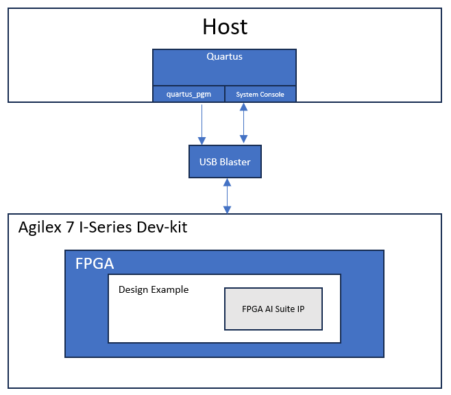
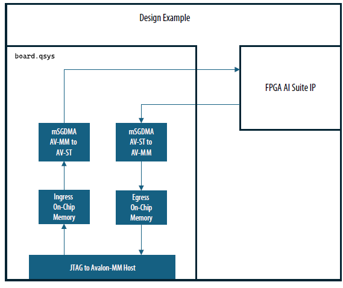

# 1.0 FPGA AI Suite DDR-Free System Example Design

The FPGA AI Suite Design Example User Guides describe the design and implementation for accelerating AI inference using the FPGA AI Suite, Intel® Distribution of OpenVINO™ toolkit, and various development boards (depending on the design example). They share a common introduction between each document, which serves as an introduction to the material. Section 4.0 begins the ED specific material.

## About the FPGA AI Suite Documentation Library

Documentation for the FPGA AI Suite is split across a few publications. Use the following table to find the publication that contains the FPGA AI Suite information that you are looking for:

### Table 1. FPGA AI Suite Documentation Library

| Title and Description | Link |
|----------------------|------|
| **Release Notes**<br>Provides late-breaking information about the FPGA AI Suite including new features, important bug fixes, and known issues. | [Link](https://docs.altera.com/r/docs/772497/2026.1.1/fpga-ai-suite-version-2026.1.1-release-notes/fpga-ai-suite-version-2026.1.1-release-notes) |
| **FPGA AI Suite Handbook**<br>Get up and running with the FPGA AI Suite by learning how to initialize your compiler environment and reviewing the various design examples and tutorials provided with the FPGA AI Suite <br>Describes the use modes of the graph compiler (`dla_compiler`). It also provides details about the compiler command options and the format of compilation inputs and outputs. | [Link](https://docs.altera.com/r/docs/863373/2026.1.1/fpga-ai-suite-handbook/fpga-ai-suite-handbook) |

# 2.0 FPGA AI Suite Design Examples

The following is a comprehensive list of the available FPGA AI Suite Design Example User Guides.

## Table 2. FPGA AI Suite Design Examples Descriptions

| Design Example | Description |
|---------------|-------------|
| [PCIe-attach design example](https://altera-fpga.github.io/rel-26.1/ed-ai-suite/agilex7/pcie/pcie_getting_started_extended/) | Demonstrates how OpenVINO toolkit and the FPGA AI Suite support the look-aside deep learning acceleration model.<br><br>This design example targets the Terasic* DE10-Agilex™ Development Board (DE10-Agilex-B2E2). |
| [OFS PCIe-attach design example](https://altera-fpga.github.io/rel-26.1/ed-ai-suite/agilex7/ofs/ofs_pcie_getting_started) | Demonstrates the OpenVINO toolkit and the FPGA AI Suite that target Open FPGA Stack (OFS)-based boards.<br><br>This design example targets the following Open FPGA Stack (OFS)-based boards:<br>* Agilex™ 7 FPGA I-Series Development Kit ES2 (DK-DEV-AGI027RBES)<br>* Silicom FPGA SmartNIC N6001-PL Platform (without Ethernet controller) |
| [Hostless DDR-Free design examples](https://altera-fpga.github.io/rel-26.1/ed-ai-suite/agilex7/hostless_ddr_free_ed/hostless_ddr_free_design_example) | Demonstrates hostless DDR-free operation of the FPGA AI Suite IP. Graph filters, bias, and FPGA AI Suite IP configurations are stored in internal memory on the FPGA device.<br><br>This design example targets the Agilex™ 7 FPGA I-Series Development Kit ES2 (DK-DEV-AGI027RBES). |
| [Hostless JTAG design example](https://altera-fpga.github.io/rel-26.1/ed-ai-suite/agilex5/hostless_jtag/hostless_jtag_design_example) | Demonstrates the step-by-step sequence of configuring FPGA AI Suite IP and starting inference by writing into CSRs directly via JTAG.<br><br>This design example targets the Agilex™ 5 FPGA E-Series 065B Modular Development Kit (MK-A5E065BB32AES1). |
| [SoC design example](https://altera-fpga.github.io/rel-26.1/ed-ai-suite/agilex5/soc/fpga_ai_suite_soc_design_example) | Demonstrates how OpenVINO toolkit and the FPGA AI Suite support the CPU-offload deep-learning acceleration model in an embedded system.<br><br>The design example targets the following development boards:<br>* Agilex™ 3 FPGA and SoC C-Series Development Kit (DK-A3W135BM16AEA)<br>* Agilex™ 5 FPGA E-Series 065B Modular Development Kit (MK-A5E065BB32AES1)<br>* Agilex™ 7 FPGA I-Series Transceiver-SoC Development Kit (DK-SIAGI027FC)<br>* Arria® 10 SX SoC FPGA Development Kit (DK-SOC-10AS066S) |

## Table 3. FPGA AI Suite Design Examples Properties Overview

| Example | Design Type | Target FPGA Device | Host | Memory | Stream* | Design Example Identifier** | Supported Development Kit |
|---------|-------------|-------------------|------|--------|---------|---------------------------|---------------------------|
| PCIe-Attached | Agilex™ 7 | External host processor | DDR | M2M | agx7_de10_pcie | [Terasic DE10-Agilex™ Development Board (DE10-Agilex™-B2E2)](https://www.terasic.com.tw/cgi-bin/page/archive.pl?Language=English&CategoryNo=142&No=1252) |
| PCIe-Attached| Agilex™ 7 |External host processor |DDR |M2M | agx7_iseries_ofs_pcie | [Agilex™ 7 FPGA I-Series Development Kit ES2 (DK-DEV-AGI027RBES)](https://www.altera.com/products/devkit/a1jui0000049utmmam/agilex-7-fpga-i-series-development-kit-2x-r-tile-and-1x-f-tile) |
| PCIe-Attached|Agilex™ 7 |External host processor |DDR |M2M | agx7_n6001_ofs_pcie | [Silicom FPGA SmartNIC N6001-PL Platform (without Ethernet controller)](https://www.altera.com/asap/offering/po-2750/silicom-fpga-smartnic-n60106011-n6001-pln6000-pl-arrow-creek) |
| Hostless DDR-Free | Agilex™ 7 | Hostless | DDR-Free | Direct | agx7_iseries_ddrfree | [Agilex™ 7 FPGA I-Series Development Kit ES2 (DK-DEV-AGI027RBES)](https://www.altera.com/products/devkit/po-3012/agilex-7-fpga-i-series-development-kit-2x-r-tile-and-1x-f-tile) |
| Hostless JTAG Attached | Agilex™ 5 |Hostless | DDR | M2M | agx5e_modular_jtag | [Agilex™ 5 FPGA E-Series 065B Modular Development Kit (MK-A5E065BB32AES1)](https://www.altera.com/products/devkit/po-3274/agilex-5-fpga-and-soc-e-series-065b-modular-development-kit) |
|SoC | Agilex™ 3 |On-device HPS |DDR |M2M | agx3_soc_m2m<br> | [Agilex™ 3 FPGA and SoC C-Series Development Kit (DK-A3W135BM16AEA)](https://www.altera.com/products/devkit/po-3000/agilex-3-fpga-and-soc-c-series-development-kit) |
|SoC | Agilex™ 5 |On-device HPS |DDR |M2M and S2M | agx5_soc_m2m<br>agx5_soc_s2m | [Agilex™ 5 FPGA E-Series 065B Modular Development Kit (MK-A5E065BB32AES1)](https://www.altera.com/products/devkit/po-3274/agilex-5-fpga-and-soc-e-series-065b-modular-development-kit) |
| SoC | Agilex™ 7 | On-device HPS | DDR | M2M and S2M | agx7_soc_m2m<br>agx7_soc_s2m | [Agilex™ 7 FPGA I-Series Transceiver-SoC Development Kit (DK-SIAGI027FC)](https://www.altera.com/products/devkit/po-3013/agilex-7-fpga-i-series-transceiver-soc-development-kit-4x-f-tile) |
|SoC | Arria® 10 |On-device HPS |DDR |M2M and S2M | a10_soc_m2m<br>a10_soc_s2m | [Arria® 10 SX SoC FPGA Development Kit (DK-SOC-10AS066S)](https://www.altera.com/products/devkit/po-3006/arria-10-sx-soc-development-kit) |

\*For the **Design Example Identifier** column, these entries are the value to use with the FPGA AI Suite Design Example Utility (`dla_build_example_design.py`) command to build the design example

\*\*For the Stream column, the entries are defined as follows:

**M2M** FPGA AI Suite runtime software running on the external host transfers the image (or data) to the FPGA DDR memory.

**S2M** Streaming input data is copied to FPGA on-device memory. The FPGA AI Suite runtime runs on the FPGA device (HPS or RTL state machine). The runtime is used only to coordinate the data transfer from FPGA DDR memory into the FPGA AI Suite IP.

**Direct** Data is streamed directly in and out of the FPGA on-chip memory.

# 3.0 Shared Design Example Components

## 3.1. FPGA AI Suite Design Example Utility

The main entry point into the example design build system is the FPGA AI Suite design example utility (`dla_build_example_design.py`). This utility coordinates different aspects of building a design example, from the initial project configuration to extracting area metrics after a compile completes. With this utility, you can create bitstreams from custom AI Suite IP architecture files and with a configurable number of instances.

*Note: There is no '.py' extension on `dla_build_example_design` when using the FPGA AI Suite on Windows.*

To use the FPGA AI Suite design example build utility, ensure that your local development environment has been setup according to the steps in ["Installing FPGA AI Suite Compile and IP Generation Tools" in FPGA AI Suite Handbook](https://docs.altera.com/r/docs/863373/2026.1.1/fpga-ai-suite-handbook/installing-the-fpga-ai-suite-compiler-and-ip-generation-tools).

### 3.1.1. The `dla_build_example_design.py` Command

The FPGA AI Suite design example utility (`dla_build_example_design.py`) configures and compiles the bitstreams for the FPGA AI Suite design examples. The command has the following basic syntax:

```
dla_build_example_design.py [--logfile logfile] [--debug] [action]
```

where [action] is one of the following actions:

#### Table 4. Design Example Utility Actions

| Action | Description |
|--------|-------------|
| `list` | List the available example designs. |
| `build` | Build an example design. |
| `qor` | Generate QoR reports. |
| `quartus-compile` | Run a Quartus® Prime compile. |
| `scripts` | Managed the build support scripts. |

Some of the command actions have different additional required and optional parameters. Use the command `help` to see a list of available options for the command and its actions.

By default, the `dla_build_example_design.py` command always instructs the `dla_create_ip` command to create licensed IP. If no license can be found, inference-limited, unlicensed RTL is generated. The build log indicates if the IP is licensed or unlicensed. For more information about licensed and unlicensed IP, refer to ["The --unlicensed/--licensed Options" in FPGA AI Suite IP Reference Manual](https://www.intel.com/content/www/us/en/docs/programmable/863373/2025-3/ip-generation-utility-outputs.html).

#### Getting `dla_build_example_design.py` Command Help

For general help with the command and to see the list of available actions, run the following command:

```
dla_build_example_design.py --help
```

For help with a command actions and to the list of available options and arguments required for an action, run the following command:

```
dla_build_example_design.py action --help
```

#### Command Logging and Debugging

By default, the FPGA AI Suite design example utility logs its output to a set location in the (default) `build_platform` directory. Override this location by specifying the `--logfile` *logfile* option.

For extra debugging output, specify the `--debug` option.

Both the logging and debugging options must be specified before the command action.

### 3.1.2. Listing Available FPGA AI Suite Design Examples

To list the available FPGA AI Suite design examples, run the following command:

```
dla_build_example_design.py list
```

This command shows the design example identifiers (used with the build action of the design example utility) along with a short description of the design example and its target Quartus Prime version.

A list of the design examples and their identifiers is also available in [FPGA AI Suite Design Examples Properties Overview](#table-3-fpga-ai-suite-design-examples-properties-overview).

### 3.1.3. Building FPGA AI Suite Design Examples

To build FPGA AI Suite design examples, specify the build option of the design example utility.

In the most simple case of building a design example for an existing architecture, you can build a design example with the following command:

```
dla_build_example_design.py build \
<design_example_identifier> \
<architecture file>
```

For example, use the following command to build the Agilex™ 7 PCIe-based design example that targets the **DE10-Agilex-B2E2** board using the AGX7_Generic architecture:

```
dla_build_example_design.py build \
agx7_de10_pcie \
$COREDLA_ROOT/example_architectures/AGX7_Generic.arch
```

The default build directory is `build_platform`. The utility creates the folder if it does not exist. To specify a different build directory, specify the `--output-dir <directory>` option:

```
dla_build_example_design.py build \
--output-dir <directory> \
<design_example_identifier> \
<architecture file>
```

Be default, the utility also prevents the build directory from being overwritten. You can override this behavior with the `--force` option.

After the build is complete, the build directory has the following files and folders:

* **coredla_ip/**
This folder contains the RTL for the configured FPGA AI Suite IP.

* **hw/**
This folder contains the Quartus Prime or Open FPGA Stack (OFS) project files. It also includes its own self-contained copy of the contents of the `coredla_ip/` folder

* **.build.json**
This contents of this file (sometimes referred to as the "build context" file) allow the build to be split into multiple steps.

* **Reports**
The build directory will contain any log files generated by the build utility (such as `build.log`) and the QoR summary that is generated by a successful compilation.

* **Bitstreams**
This build directory will contain the bitstreams to program the target FPGA device as follows:
  - For OFS-based designs, `.gbs` files.
  - For other designs, `.sof` and `.rbf` files.

#### 3.1.3.1. Staging FPGA AI Suite Design Example Builds

The FPGA AI Suite design example utility supports staged builds via the `--skip-compile` option. When you specify this option, the utility creates the build folder and prepares the Quartus Prime or Open FPGA Stack (OFS) project but does not run compilation.

With a staged design example build flow, you must run the utility a few times to generate the same outputs as the regular build flow. For a complete build with a staged build flow, you would run the following commands:

```
dla_build_example_design.py build --skip-compile \
<design_example_identifier> \
<architecture file>
dla_build_example_design.py quartus-compile build_platform
# Optional: Generate QoR summary
dla_build_example_design.py qor build_platform
```

Information about the build configuration, namely what was passed into the `dla_build_example_design.py` build command, is stored inside of the build context (`.build.json`) file.

You can run the `dla_build_example_design.py quartus-compile` and `dla_build_example_design.py qor` commands multiple times. An example of when running these commands multiple times can be useful is when you have to recompile the bitstream after removing an unnecessary component from the design example.

You can also directly call the design compilation script. An FPGA AI Suite design example uses one of the following scripts, depending on whether the design example can built in a WSL 2 environment:

* **generate_sof.tcl**
Design examples with this design compilation script can be built in a WSL 2 environment.

* **build_project.sh**
Design examples with this design compilation script cannot be built in a WSL 2 environment.

If a design example uses a `generate_sof.tcl` script, then you can invoke the design compilation script either after opening the design example project in Quartus Prime or by running the following command:

```
quartus_sh -t generate_sof.tcl
```

If a design example uses the `build_project.sh` build script, the script must be executed in a Bash-compatible shell. For example:

```
bash build_project.sh
```

For both design example compilation scripts, the current working directory must be the `hw/` directory.

#### 3.1.3.2. WSL 2 FPGA AI Suite Design Example Builds

Staged builds allow the build utility to support hybrid Windows/Linux compilation in a WSL 2 environment on a Windows system. In a WSL 2 environment, FPGA AI Suite is installed in the WSL 2 Linux guest operating system while Quartus Prime is installed in the Windows host operating system.

**Restriction:** Only a subset of the FPGA AI Suite design examples can be build in a WSL 2 environment. For a list of design examples that support WSL 2, run the following command:

```
dla_build_example_design.py list --supports-wsl2
```

When you run the `dla_build_example_design.py` build command, the WSL 2 flow is enabled with the `--wsl` option. This option tells the utility to resolve the path to the build directory as a Windows file path instead of a Linux file path. The utility displays messages that provide you with more details about how to use the staged build commands to complete the compilation in your WSL 2 environment.

**Important:** If you specify a build directory in a WSL 2 environment with the `--output-dir` options, that build directory must be a relative path. This requirement is due to a limitation in how the WSL 2 environment maps paths between the Linux guest and Windows.

## 3.2. Example Architecture Bitstream Files

The FPGA AI Suite provides example Architecture Files and bitstreams for the design examples. The files are located in the FPGA AI Suite installation directory.

## 3.3. Design Example Software Components

The design examples contain a sample software stack for the runtime flow.

For a typical design example, the following components comprise the runtime stack:

* OpenVINO Toolkit (Inference Engine, Heterogeneous Plugin)
* FPGA AI Suite runtime plugin
* Vendor-provided FPGA board driver or OPAE driver (depending on the design example)

The design example contains the source files and Makefiles to build the FPGA AI Suite runtime plugin. The OpenVINO component (and OPAE components, where used) is external and must be manually preinstalled.

A separate flow compiles the AI network graph using the FPGA AI Suite compiler, as shown in [Figure 1 Software Stacks for FPGA AI Suite Inference](#figure-1-software-stacks-for-fpga-ai-suite-inference) that follows as the Compilation Software Stack.

The compilation flow output is a single binary file called `CompiledNetwork.bin` that contains the compiled network partitions for FPGA and CPU devices along with the network weights. The network is compiled for a specific FPGA AI Suite architecture and batch size. This binary is created on-disk only when using the Ahead-Of-Time flow; when the JIT flow is used, the compiled object stays in-memory only.

An Architecture File describes the FPGA AI Suite IP architecture to the compiler. You must specify the same Architecture File to the FPGA AI Suite compiler and to the FPGA AI Suite design example utility (`dla_build_example_design.py`).

The runtime flow accepts the `CompiledNetwork.bin` file as the input network along with the image data files.

### Figure 1. Software Stacks for FPGA AI Suite Inference


The runtime stack cannot program the FPGA with a bitstream. To build a bitstream and program the FPGA devices:

1. Compile the design example.
2. Program the device with the bitstream.

Instructions for these steps are provided in the sections for each design example.

To run inference through the OpenVINO Toolkit on the FPGA, set the OpenVINO device configuration flag (used by the heterogeneous Plugin) to `FPGA` or `HETERO:FPGA,CPU`.

### 3.3.1. OpenVINO FPGA Runtime Overview

The purpose of the runtime front end is as follows:

* Provide input to the FPGA AI Suite IP
* Consume output from the FPGA AI Suite IP
* Control the FPGA AI Suite IP

Typically, this front-end layer provides the following items:

* The `.arch` file that was used to configure the FPGA AI Suite on the FPGA.
* The ML model (possibly precompiled into an Ahead-of-Time `.bin` file by the FPGA AI Suite compiler (`dla_compiler`)).
* A target device that is passed to OpenVINO

The target device may instruct OpenVINO to use the HETERO plugin, which allows a graph to be partitioned onto multiple devices.

One of the directories provided in the installation of the FPGA AI Suite is the `runtime/` directory. In this directory, the FPGA AI Suite provides the source code to build a selection of OpenVINO applications. The `runtime/` directory also includes the `dla_benchmark` command line utility that you can use to generate inference requests and benchmark the inference speed.

The following applications use the OpenVINO API. They support the OpenVINO HETERO plugin, which allows portions of the graph to fall-back onto the CPU for unsupported graph layers.

* `dla_benchmark` (adapted from OpenVINO benchmark_app)
* `classification_sample_async`
* `object_detection_demo_yolov3_async`
* `segmentation_demo`

Each of these applications serve as a runtime executable for the FPGA AI Suite. You might want to write your own OpenVINO-based front ends to wrap the FPGA plugin. For information about writing your own OpenVINO-based front ends, refer to the [OpenVINO documentation](https://docs.openvino.ai/2025/index.html).

Some of the responsibilities of the OpenVINO FPGA plugin are as follows:

* **Inference Execution**
  - Mapping inference requests to an IP instance and internal buffers
  - Executing inference requests via the IP, managing synchronization and all data transfer between host and device.

* **Input / Output Data Transform**
  - Converting the memory layout of input/output data
  - Converting the numeric precision of input/output data

### 3.3.2. OpenVINO FPGA Runtime Plugin

The FPGA runtime plugin uses the OpenVINO Inference Engine Plugin API.

The OpenVINO Plugin architecture is described in the [OpenVINO Developer Guide for Inference Engine Plugin Library](https://docs.openvino.ai/2025/documentation/openvino-extensibility/openvino-plugin-library.html).

The source files are located under `runtime/plugin`. The three main components of the runtime plugin are the Plugin class, the Executable Network class, and the Inference Request class. The primary responsibilities for each class are as follows:

**Plugin class**

* Initializes the runtime plugin with an FPGA AI Suite architecture file which you set as an OpenVINO configuration key (refer to [PCIE - Running the Ported OpenVINO Demonstration Applications](https://altera-fpga.github.io/rel-26.1/ed-ai-suite/agilex7/pcie/pcie_getting_started_extended)).

* Contains `QueryNetwork` function that analyzes network layers and returns a list of layers that the specified architecture supports. This function allows network execution to be distributed between FPGA and other devices and is enabled with the HETERO mode.

* Creates an executable network instance in one of the following ways:
  - **Just-in-time (JIT) flow:** Compiles a network such that the compiled network is compatible with the hardware corresponding to the FPGA AI Suite architecture file, and then loads the compiled network onto the FPGA device.
  - **Ahead-of-time (AOT) flow:** Imports a precompiled network (exported by FPGA AI Suite compiler) and loads it onto the FPGA device.

**Executable Network Class**

* Represents an FPGA AI Suite compiled network

* Loads the compiled model and config data for the network onto the FPGA device that has already been programmed with an FPGA AI Suite bitstream. For two instances of FPGA AI Suite, the Executable Network class loads the network onto both instances, allowing them to perform parallel batch inference.

* Stores input/output processing information.

* Creates infer request instances for pipelining multiple batch execution.

**Infer Request class**

* Runs a single batch inference serially.

* Executes five stages in one inference job – input layout transformation on CPU, input transfer to DDR, FPGA AI Suite FPGA execution, output transfer from DDR, output layout transformation on CPU.

* In asynchronous mode, executes the stages on multiple threads that are shared across all inference request instances so that multiple batch jobs are pipelined, and the FPGA is always active.

### 3.3.3. FPGA AI Suite Runtime

The FPGA AI Suite runtime implements lower-level classes and functions that interact with the memory-mapped device (MMD). The MMD is responsible for communicating requests to the driver, and the driver connects to the BSP, and ultimately to the FPGA AI Suite IP instance or instances.

The runtime source files are located under `runtime/coredla_device`. The three most important classes in the runtime are the Device class, the GraphJob class, and the BatchJob class.

**Device class**

* Acquires a handle to the MMD for performing operations by calling `aocl_mmd_open`.

* Initializes a DDR memory allocator with the size of 1 DDR bank for each FPGA AI Suite IP instance on the device.

* Implements and registers a callback function on the MMD DMA (host to FPGA) thread to launch FPGA AI Suite IP for batch=1 after the batch input data is transferred from host to DDR.

* Implements and registers a callback function (interrupt service routine) on the MMD kernel interrupt thread to service interrupts from hardware after one batch job completes.

* Provides the `CreateGraphJob` function to create a GraphJob object for each FPGA AI Suite IP instance on the device.

* Provides the `WaitForDla`(*instance id*) function to wait for a batch inference job to complete on a given instance. Returns instantly if the number of batch jobs finished (that is, the number of jobs processed by interrupt service routine) is greater than number of batch jobs waited for this instance. Otherwise, the function waits until interrupt service routine notifies. Before returning, this function increments the number of batch jobs that have been waited for this instance.

**GraphJob class**

* Represents a compiled network that is loaded onto one instance of the FPGA AI Suite IP on an FPGA device.

* Allocates buffers in DDR memory to transfer configuration, filter, and bias data.

* Creates BatchJob objects for a given number of pipelines and allocates input and output buffers for each pipeline in DDR.

**BatchJob class**

* Represents a single batch inference job.

* Stores the DDR addresses for batch input and output data.

* Provides `LoadInputFeatureToDdr` function to transfer input data to DDR and start inference for this batch asynchronously.

* Provides `ReadOutputFeatureFromDdr` function to transfer output data from DDR. Must be called after inference for this batch is completed.

### 3.3.4. FPGA AI Suite Custom Platform

#### **Figure 2. Overview of FPGA AI Suite MMD Runtime**


The interface to the user-space portion of the BSP drivers is centralized in the MmdWrapper class, which can be found in the file `$COREDLA_ROOT/runtime/coredla_device/inc/mmd_wrapper.h`. This file is a wrapper around the MMD API.

The FPGA AI Suite runtime uses this wrapper so that the runtime can be reused on all platforms. When porting the runtime to a new board, you must ensure that each of the member functions in MmdWrapper calls into a board-specific implementation function. You must also modify the runtime build process and adjacent code.

Any implementation of a runtime for the FPGA AI Suite must support the following features via the MMD Wrapper:

* Open the device
* Register an interrupt service routine
* Read/write 32-bit register values in the IP control-and-status register (CSR)
* Transfer bulk data between the host and device

### 3.3.5. Memory-Mapped Device (MMD) Driver

The FPGA AI Suite runtime MMD software uses a driver to access and interact with the FPGA device. To integrate the FPGA AI Suite IP into your design on your platform, the MMD layer must interface with the hardware using the appropriate drivers (such as OPAE, UIO, or a custom driver). For example, the PCIe-based design example uses the drivers provided by the OpenCL board support package (BSP) for the Terasic DE10-Agilex Development Board.

If your board vendor provides a BSP, you can use the MMD Wrapper to interface the BSP with the FPGA AI Suite IP. Review the following sections for examples of adapting a vendor-provided BSP to use with the FPGA AI Suite IP:

* [Terasic DE10-Agilex Development Board BSP Example](#337-board-support-package-bsp-overview)
* [Agilex™ 7 PCIe-Attach OFS-based BSP Example](#3372-agilex-7-pcie-attach-ofs-based-bsp-example)

You can create a custom BSP for your board, but that process can be complex and can require more work.

The FPGA AI Suite runtime MMD software uses a driver to access and interact with the FPGA device. This driver is supplied as part of the board vendor BSP or, for OFS-based boards, the OPAE driver.

The source files for the MMD driver are provided in `runtime/coredla_device/mmd`. The source files contain classes for managing and accessing the FPGA device by using driver-supplied functions for reading/writing to CSR, reading/writing to DDR, and handling kernel interrupts.

#### Obtaining BSP Drivers

Contact your FPGA board vendor for information about the BSP for your FPGA board.

#### Obtaining the OPAE Drivers

Contact your FPGA board vendor for information about the OPAE driver for your FPGA board.

For the FPGA AI Suite OFS for PCIe attach design example, the OPAE driver is installed when you follow the steps in [Getting Started with Open FPGA Stack (OFS) for PCIe-Attach Design Examples](https://altera-fpga.github.io/rel-26.1/ed-ai-suite/agilex7/ofs/ofs_pcie_getting_started.md).

### 3.3.6. FPGA AI Suite Runtime MMD API

This section describes board-level functions that are defined in the `mmd_wrapper.cpp` file. Your implementation of the functions in the `mmd_wrapper.cpp` file for your specific board may differ. For examples of these functions, refer to the provided MMD implementations under `$COREDLA_ROOT/runtime/coredla_device/mmd/`.

The `mmd_wrapper.cpp` file contains the following MMD functions that are adapted from the Open FPGA Stack (OFS) accelerator support package (ASP) functions of the same name. For more information about these functions, refer to the [OFS AFS Memory Mapped Device Layer documentation](https://ofs.github.io/ofs-2025.1-1/hw/common/reference_manual/oneapi_asp/oneapi_asp_ref_mnl/#41-memory-mapped-devicemmd-layer).

* [aocl_mmd_get_offline_info](https://ofs.github.io/ofs-2025.1-1/hw/common/reference_manual/oneapi_asp/oneapi_asp_ref_mnl/#411-aocl_mmd_get_offline_info)
* [aocl_mmd_open](https://ofs.github.io/ofs-2025.1-1/hw/common/reference_manual/oneapi_asp/oneapi_asp_ref_mnl/#413-aocl_mmd_open)
* [aocl_mmd_close](https://ofs.github.io/ofs-2025.1-1/hw/common/reference_manual/oneapi_asp/oneapi_asp_ref_mnl/#414-aocl_mmd_close)
* [aocl_mmd_set_interrupt_handler](https://ofs.github.io/ofs-2025.1-1/hw/common/reference_manual/oneapi_asp/oneapi_asp_ref_mnl/#415-aocl_mmd_set_interrupt_handler)

Although several of the functions in the FPGA AI Suite MMD API share names and intended behavior with OpenCL MMD API functions, you do not need to use an OpenCL BSP. The naming convention is maintained for historical reasons only.

The `mmd_wrapper.cpp` file contains the following functions provided only with the FPGA AI Suite:

* [dla_mmd_get_max_num_instances](#the-dla_mmd_get_max_num_instances-function)
* [dla_mmd_get_ddr_size_per_instance](#the-dla_mmd_get_ddr_size_per_instance-function)
* [dla_mmd_get_coredla_clock_freq](#the-dla_mmd_get_coredla_clock_freq-function)
* [dla_mmd_get_ddr_clock_freq](#the-dla_mmd_get_ddr_clock_freq-function)
* [dla_mmd_csr_read](#the-dla_mmd_csr_read-function)
* [dla_mmd_csr_write](#the-dla_mmd_csr_write-function)
* [dla_mmd_ddr_read](#the-dla_mmd_ddr_read-function)
* [dla_mmd_ddr_write](#the-dla_mmd_ddr_write-function)
* [dla_is_stream_controller_valid](#the-dla_is_stream_controller_valid-function)
* [dla_mmd_stream_controller_read](#the-dla_mmd_stream_controller_read-function)
* [dla_mmd_stream_controller_write](#the-dla_mmd_stream_controller_write-function)

#### The dla_mmd_get_max_num_instances Function

Returns the maximum number of FPGA AI Suite IP instances that can be instantiated on the platform. In the FPGA AI Suite PCIe-based design examples, this number of IP instances that can be instantiated is the same as the number of external memory interfaces (for example, DDR memories).

**Syntax**
```
int dla_mmd_get_max_num_instances()
```

#### The dla_mmd_get_ddr_size_per_instance Function

Returns the maximum amount of external memory available to each FPGA AI Suite IP instance.

**Syntax**
```
uint64_t dla_mmd_get_ddr_size_per_instance()
```

#### The dla_mmd_get_coredla_clock_freq Function

Given the device handle, return the FPGA AI Suite IP PLL clock frequency in MHz. Return a negative value if there is an error.

In the PCIe-based design example, this value is determined by allowing a set amount of wall clock time to elapse between reads of counters onboard the IP.

**Syntax**
```
double dla_mmd_get_coredla_clock_freq(int handle)
```

#### The dla_mmd_get_ddr_clock_freq Function

Returns the DDR clock frequency, in Mhz. Check the documentation from your board vendor to determine this value.

**Syntax**
```
double dla_mmd_get_ddr_clock_freq()
```

#### The dla_mmd_csr_read Function

Performs a control status register (CSR) read for a given instance of the FPGA AI Suite IP at a given address. The result is stored in the data directory.

**Syntax**
```
int dla_mmd_csr_read(int handle, int instance, uint64_t addr, uint32_t *data)
```

#### The dla_mmd_csr_write Function

Performs a control status register (CSR) write for a given instance of the FPGA AI Suite IP at a given address.

**Syntax**
```
int dla_mmd_csr_write(int handle, int instance, uint64_t addr, const uint32_t *data)
```

#### The dla_mmd_ddr_read Function

Performs an external memory read for a given instance of the FPGA AI Suite IP at a given address. The result is stored in the data directory.

**Syntax**
```
int dla_mmd_ddr_read(int handle, int instance, uint64_t addr, uint64_t length, void *data)
```

#### The dla_mmd_ddr_write Function

Performs an external memory write for a given instance of the FPGA AI Suite IP at a given address.

**Syntax**
```
int dla_mmd_ddr_write(int handle, int instance, uint64_t addr, uint64_t length, const void *data)
```

#### The dla_is_stream_controller_valid Function

Optional. Required if `STREAM_CONTROLLER_ACCESS` is defined.

Queries the streaming controller device to see if it is valid.

**Syntax**
```
bool dla_is_stream_controller_valid(int handle, int instance)
```

For more information about the stream controller module, refer to [[SOC] Stream Controller Communication Protocol](todo).

#### The dla_mmd_stream_controller_read Function

Optional. Required if `STREAM_CONTROLLER_ACCESS` is defined.

Reads an incoming message from the streaming controller.

**Syntax**
```
int dla_mmd_stream_controller_read(int handle, int instance, uint64_t addr, uint64_t length, void* data)
```

For more information about the streaming controller device, refer to [[SOC] Stream Controller Communication Protocol](todo).

#### The dla_mmd_stream_controller_write Function

Optional. Required if `STREAM_CONTROLLER_ACCESS` is defined.

Writes an outgoing message from the streaming controller.

**Syntax**
```
int dla_mmd_stream_controller_write(int handle, int instance, uint64_t addr, uint64_t length, const void* data)
```

For more information about the streaming controller device, refer to [[SOC] Stream Controller Communication Protocol](todo).

### 3.3.7. Board Support Package (BSP) Overview

Every FPGA platform consists of the FPGA fabric and the hard IP that surrounds it. For example, an FPGA platform might provide an external memory interface as hard IP to provide access to external DDR memory. Soft logic that is synthesized on the FPGA fabric needs to be able to communicate with the hard IP blocks, and the implementation details are typically platform-specific.

A board support package (BSP) typically consists of two parts:

* **A software component** that runs in the host operating system.

This component includes the MMD and operating system driver for the board.

* **A hardware component** that is programming into the FPGA fabric.

This component consists of soft logic that enables the use of the FPGA peripheral hard IP blocks around the FPGA fabric. This component acts as the bridge between the FPGA AI Suite IP block in the FPGA fabric and the hard IP blocks.

Depending on your board and board vendor, you can have the following options for obtaining a BSP:

* If your board supports the Open FPGA Stack (OFS), you can use (and adapt, if necessary) an OFS reference design or FPGA interface manager (FIM).

For some boards, there are precompiled FIM reference designs available.

* Obtain a BSP directly from your board vendor. You board vendor might have multiple BSPs available for you board.

* Create your own BSP.

For a BSP to be compatible with FPGA AI Suite, the BSP must provide the following capabilities:

* Enable the FPGA AI Suite IP and the host to interface with the external memory interface IP.

* Enable the FPGA AI Suite IP to interface with the runtime (for example, PCIe IP for the PCIe-based design example, or the HPS-to-FPGA AXI bridge for the SoC design example).

* Enable the FPGA AI Suite IP to send interrupts to the runtime. If your BSP does not support this capability, you must use polling to determine when an inference is complete.

* Enable the host to access the FPGA AI Suite IP CSR.

The BSPs available for the boards supported by the FPGA AI Suite design example support these capabilities.

**Related Information**

[Open FPGA Stack (OFS) documentation.](https://ofs.github.io/ofs-2025.1-1/)

#### 3.3.7.1. Terasic DE10-Agilex™ Development Board BSP Example

For the Agilex™ 7 PCIe-based design example on the Terasic DE10-Agilex Development Board, the BSP provided by Terasic is adapted to work with the FPGA AI Suite IP. The Terasic-provided BSP is OpenCL™-based.

The following diagram shows the high-level interactions between the FPGA interface IPs on the platform, and the a custom OpenCL kernel. The different colors in the diagram indicate different clock domains.

##### Figure 3. Terasic BSP with OpenCL Kernel


The PCIe hard IP can read/write to the DDR4 external memory interface (EMIF) via the DMA and the Arbitrator. Additional logic is provided to handle interrupts from the custom IP and propagate them back to the host through the PCIe interface.

The following diagram hows how the Terasic DE10-Agilex Development Board BSP can be adapted to support the FPGA AI Suite IP.

##### Figure 4. Terasic BSP With FPGA AI Suite IP


Platform Designer automatically adds clock-domain crossings between Avalon memory-mapped interfaces and AXI4 interfaces, making the integration with the BSP easier.

For a custom platform, consider following a similar approach of modifying the BSP provided by the vendor to integrate in the FPGA AI Suite IP.

#### 3.3.7.2. Agilex™ 7 PCIe-Attach OFS-based BSP Example

For OFS-based devices, the BSP consists of a platform-specific FPGA interface manager (FIM) and a platform-agnostic accelerator functional unit (AFU).

The FPGA AI Suite OFS for PCIe attach design example supports Agilex™ 7 PCIe Attach OFS.

You can obtain the source files needed to build a Agilex™ 7 PCIe Attach FIM or obtain prebuillt FIMs for some boards from [OFS Agilex™ 7 PCIe Attach FPGA Development Directory in GitHub](https://github.com/OFS/ofs-agx7-pcie-attach).

The AFU wraps the FPGA AI Suite IP and must meet the following general requirements:

* The AFU must include an instance of the FPGA AI Suite IP.

* The AFU must support host access (for example, via DMA) to external memory that is shared with the FPGA AI Suite IP.

* The AFU must propagate interrupts from the FPGA AI Suite IP to the host.

* The AFU Must support host access to the FPGA AI Suite IP CSR memory.

If you are creating your own FPGA AI Suite AFU, consider starting with an AFU example design that implements some of the required functionality. Some examples designs and what they are offer are as follows:

* For an example of enabling direct memory access so the host can access DDR memory, review the direct memory access (DMA) AFU example on GitHub

* For an example of interrupt handling, review the oneAPI Accelerator Support Package (ASP) on GitHub.

* For an example MMD implementation, review the oneAPI Accelerator Support Package (ASP) on GitHub.

**Related Information**

* [Direct memory access (DMA) AFU example on GitHub](https://github.com/OFS/examples-afu/tree/main/tutorial/afu_types/01_pim_ifc/dma)
* [oneAPI accelerator support package (ASP) on GitHub](https://github.com/OFS/oneapi-asp)
* [Agilex™ 7 PCIe Attach OFS documentation](https://ofs.github.io/ofs-2025.1-1/hw/doc_modules/contents_agx7_pcie_attach/)
* [Agilex™ 7 PCIe Attach OFS Workload Development Guide](https://ofs.github.io/ofs-2025.1-1/hw/common/user_guides/afu_dev/ug_dev_afu_ofs_agx7_pcie_attach/ug_dev_afu_ofs_agx7_pcie_attach/)

## 4.0 Getting Started with the FPGA AI Suite DDR-Free system example design

Before starting with the FPGA AI-Suite DDR-free system example design, ensure that you have followed all the installation instructions for the FPGA AI Suite compiler and IP generation tools.

The DDR-free system example design is validated for use only with Quartus Prime Pro Edition Version 26.1 and Version 26.1.

The FPGA AI Suite provides a design example to demonstrate hostless and DDR-free operation of the FPGA AI Suite IP. Graph filters, bias, and FPGA AI Suite IP configurations are stored in on-chip memory on the FPGA device instead of DDR memory on the board.

The DDR-free design example demonstrates how FPGA AI Suite supports the following features:

* DDR-free operation
* Hostless operation (that is, running on the devices without the FPGA AI Suite runtime)
* Streaming of input features
* Streaming of inference results

The DDR-Free design example is implemented with the following components:

* FPGA AI Suite IP
* Agilex™ 7 FPGA I-Series Development Kit ES2 (DK-DEV-AGI027RBES)
* Sample hardware and software systems that illustrate the use of these components

For more details about DDR-free operation, refer to [DDR-Free Operation](https://docs.altera.com/r/docs/863373/2026.1.1/fpga-ai-suite-handbook/using-fpga-ai-suite-in-hostless-on-chip-parameter-mode) in the FPGA AI Suite Handbook.

The design example build scripts in [Building the FPGA AI Suite Runtime](https://docs.altera.com/r/docs/863373/2026.1.1/fpga-ai-suite-handbook/building-the-fpga-ai-suite-pcie-design-example-runtime) let you choose from a variety of architecture files and build your own bitstreams, provided that you have a license permitting bitstream generation.

This design is provided with the FPGA AI Suite as an example showing how to incorporate the FPGA AI Suite IP into a DDR-Free design. This design is not intended for unaltered use in production scenarios. Any potential production application that uses portions of this design example must be reviewed for both robustness and security.

The following sections in this document describe the steps to build and execute the design:

* [Getting Started with the FPGA AI Suite DDR-Free Design Example](#40-getting-started-with-the-fpga-ai-suite-ddr-free-system-example-design)
* [Running the Hostless DDR-Free Design Example](#50-running-the-hostless-ddr-free-system-example-design)

The following sections in this document describe design decisions and architectural details about the design:

* [Design Example System Architecture](#60-design-architecture)
* [Quartus Prime System Console](#70-quartus-prime-system-console)
* [JTAG to Avalon MM Host Register Map](#table-2-jtag-to-avalon-mm-host-register-map)
* [Updating MIF Files](#80-updating-mif-files)

### 4.1 Hardware Requirements

This system example design requires the following hardware:
• Agilex 7 FPGA I-Series Development Kit ES2 (DK-DEV-AGI027RBES)
• [Intel FPGA Download Cable](https://docs.altera.com/r/docs/683076/current/altera-fpga-download-cable-user-guide/introduction-to-altera-fpga-download-cable)

### 4.2 Software Requirements

This system example design requires the following software:
• FPGA AI Suite
• Quartus Prime Programmer (either standalone or as part of Quartus Prime Design Suite).
• Quartus Prime System Console (either standalone or as part of Quartus Prime Design Suite).

Ensure that all the binaries included in the Quartus Prime Design Suite are added to your $PATH environment variable so that they can be called from any location.

When you have met these prerequisites, validate that the development kit is connected to the JTAG interface by using the *jtagconfig* utility provided by the Quartus Prime Design Suite. A successful confirmation of the JTAG connection looks like the following example output:

```
$ jtagconfig
1) AGI FPGA Development Kit [1-7.2]
034BB0DD AGIB027R29A(.|B|C|R0|R1|R3)/..
020D10DD VTAP10
```

## 5.0 Running the Hostless DDR-Free System Example Design

### Procedure

To run the hostless DDR-free system example design with a ResNet-18 PyTorch Model:

1. Download and prepare the ResNet-18 PyTorch Model with the OpenVINO Open Model Zoo tools with the following commands:
   ```bash
   source ~/build-openvino-dev/openvino_env/bin/activate

   omz_downloader --name resnet-18-pytorch \
   --output_dir $COREDLA_WORK/demo/models/

   omz_converter --name resnet-18-pytorch \
   --download_dir $COREDLA_WORK/demo/models/ \
   --output_dir $COREDLA_WORK/demo/models/
   ```

   Important: The OpenVINO Open Model Zoo (OMZ) PyTorch models do not include a softmax operation at the end of the model.

2. Generate the parameter ROMs as *.mif* files by running the FPGA AI Suite compiler with the following command:
   ```bash
   dla_compiler \
   --batch-size=1 \
   --network-file <path/to/graph> \
   --march $COREDLA_ROOT/example_architectures/AGX7_Streaming_Ddrfree_Resnet18.arch \
   --foutput-format=open_vino_hetero \
   --o <compiler output .bin file name> \
   --fplugin HETERO:FPGA \
   --dumpdir $COREDLA_WORK/resnet-18-dlac-out/
   ```

   The *.mif* files are created in a subdirectory of the directory specified by the *--dumpdir* option. This subdirectory is called *parameter_rom*.

   For details about creating the .mif files required for DDR-free operation, refer to "Generating Artifacts for DDR-Free Operation" in the [FPGA AI Suite Handbook](https://docs.altera.com/r/docs/863373/2026.1.1/fpga-ai-suite-handbook/using-fpga-ai-suite-in-hostless-on-chip-parameter-mode).

3. Build the example design with the following command:
   ```bash
   dla_build_example_design.py build \
   --output-dir <path/to/build/dir> \
   --num-instances 1 \
   --seed 1 \
   --parameter-rom-dir $COREDLA_WORK/resnet-18-dlac-out/parameter_rom/ \
   agx7_iseries_ddrfree \
   $COREDLA_ROOT/example_architectures/AGX7_Streaming_Ddrfree_Resnet18.arch
   ```

   Building the example design creates the bitstream needed to program the FPGA device.

   For more information about the *dla_build_example_design.py* command, refer to The `dla_build_example_design.py` script.

4. Program the FPGA device with the Quartus Prime Programmer.

   The bitstream used to program the device is *<path/to/build/dir>/hw/output_files/top.sof*.

   Program the FPGA device with the following command:
   ```
   quartus_pgm -c 1 -m jtag -o "p;top.sof@1"
   ```

   For more information about the Quartus Prime Programmer, refer to Quartus Prime Pro Edition User Guide: Programmer.

5. Lower the JTAG clock speed to 16 MHz or lower in order to make the JTAG connection stable. This can be accomplished with the following command:

    ```
    jtagconfig --setparam 1 JtagClock 16M
    ```

6. Use the Quartus Prime System Console to run inference on the example design.

   Because this example design is hostless, operations that typically come from the host are performed through Quartus Prime System Console instead. For more information about the Quartus Prime System Console, refer to [“Analyzing and Debugging Designs with System Console”](https://docs.altera.com/r/docs/683819/26.1/quartus-prime-pro-edition-user-guide-debug-tools/analyzing-and-debugging-designs-with-system-console) in [Quartus Prime Pro Edition User Guide: Debug Tools](https://docs.altera.com/r/docs/683819/26.1/quartus-prime-pro-edition-user-guide-debug-tools/answers-to-top-faqs).

   Use the System Console to complete the following steps:
   a. (Optional) Update the graph parameter and instructions using the CSR interface.
   b. Store input features in the FPGA on-chip memory.
   c. Prime the FPGA AI Suite IP registers for inference.
   d. Configure an ingress Modular Scatter-Gather DMA (mSGDMA) core to read the input features from on-chip memory and stream data into the FPGA AI Suite IP.
   e. Configure an egress mSGDMA core to stream data from the FPGA AI Suite IP into on-chip memory.
   f. Read the inference results from on-chip memory.

   The system example design provides a System Console script to automate these operations for you. You can find the script in the *$CORDLA_ROOT/runtime/streaming/ed0_streaming_example* folder.

   To use the system example design's System Console script:
   a. Run the following command to execute inference:
      ```bash
      system-console --script=system_console_script.tcl \
      --input <path-to-img.bin> \
      --num_inferences <#-of-inferences> \
      --output_shape <[C H W]> \
      --functional --arch=<path-to-architecture-description-file>
      ```

      The system example design's Quartus Prime System Console script generates a file called *output.bin* that contains the raw inference results.

   b. (Optional) To measure the performance of the system example design, run the following command:
      ```bash
      system-console --script=system_console_script.tcl \
      --input <path-to-img.bin> \
      --output_shape <[C H W]> \
      --core_ip_performance --arch=<path-to-architecture-description-file>
      ```

      For more information about the System Console script, refer to [Quartus Prime System Console](#70-quartus-prime-system-console).

7. Postprocess the raw inference output for readability with the following command:
   ```bash
   python3 $COREDLA_ROOT/bin/streaming_post_processing.py <path-to-output.bin>
   ```

   This script cleans the raw output binary file by script some invalid bytes and storing an FP16 formatted *result_hw.txt* file for readability.

## 6.0 Design Architecture

### 6.1 System Overview

The FPGA image consists of the FPGA AI Suite IP and additional logic that connects the IP to a JTAG interface. The DDR-Free system example design does not use the *dla_benchmark* runtime. Instead, it allows for communication and control of the FPGA AI Suite IP through a JTAG-Quartus Prime System Console connection. In addition, the DDR-Free system example design showcases the FPGA AI Suite IP streaming functionality. For more information about feature input and output streaming, refer to ["Feature Input and Output Streaming" in FPGA AI Suite Handbook](https://docs.altera.com/r/docs/863373/2026.1.1/fpga-ai-suite-handbook/input-streaming).

The system configuration of this system example design is shown in the following block diagram:


#### Figure 1: DDR-Free System Configuration

### 6.2 Hardware

This section provides an in-depth description of the system example design, focusing on the integration and functionality of the JTAG to Avalon-MM host, the ingress and egress mSGDMA engines, the FPGA AI Suite IP for inference, and the on-chip memory modules. It covers the configuration and control mechanisms, as well as the interaction between different components to achieve efficient AI inference on an FPGA device.

A top-level view of the system example design that illustrates the data flow is shown in [Figure 2](#figure-2-ddr-free-system-architecture). The DDR-Free system example design is currently limited to one FPGA AI Suite IP instance.

All components are connected to the JTAG to Avalon-MM host and are memory-mapped on the JTAG bus, allowing for efficient communication and control from the Quartus Prime System Console. Address offsets for each component is provided in [JTAG to Avalon MM Host Register Map](#table-2-jtag-to-avalon-mm-host-register-map).


#### Figure 2: DDR-Free System Architecture

#### 6.2.1 The Modular Scatter-Gather DMA (mSGDMA) Engines

The data flow within the system is orchestrated by the modular scatter-gather DMA (mSGDMA) engines and the FPGA AI Suite IP (which performs the inference computation). The following mSGDMA engines are used in the system example design:

• **Ingress mSGDMA**
  The ingress mSGDMA engine performs memory-mapped reads from the on-chip memory and streams the data into the FPGA AI Suite IP. It converts Avalon-MM transactions to Avalon Streaming format.

• **Egress mSGDMA**
  The egress mSGDMA engine receives the streamed inference results from the FPGA AI Suite IP and stores them into the egress on-chip memory using MM operations. It converts Avalon-ST transactions back to Avalon-MM format.

The mSGDMA engines are configured to use 128-bit streaming transfer sizes.

For more information about how to use the modular scatter-gather DMA core, refer to ["Modular Scatter-Gather DMA Core" in Embedded Peripherals IP User Guide](https://docs.altera.com/r/docs/683130/26.1/embedded-peripherals-ip-user-guide/modular-scatter-gather-dma-core).

#### 6.2.2 On-Chip Memory Modules

The on-chip memory modules store input data and final inference results. These memories are accessible via Avalon-MM interfaces. There are two modules: one for staging input memory and one for staging output inference results. These are referred to as ingress and egress on-chip memory, respectively. The sizes of the on-chip memory modules are defined in [Table 1](#table-1-on-chip-memory-module-sizes).

• **Ingress On-Chip Memory**
  This module is dedicated to storing the input data before it is processed by the FPGA AI Suite IP. It serves as the staging area for data that will be read by the ingress mSGDMA engine and streamed into the inference IP.

• **Egress On-Chip Memory**
  This module is used to store the final inference results after they have been processed by the FPGA AI Suite IP. The egress mSGDMA engine writes the inference results from the FPGA AI Suite IP to this memory, making it available for retrieval and further use.

The following table provides the specific sizes allocated for each on-chip memory module, ensuring that the system has adequate storage for both input data and inference result:

| On-Chip Memory Module | Size (in bytes) |
|-----------------------|-----------------|
| Ingress               | 524288          |
| Egress                | 131072          |
##### Table 1: On-Chip Memory Module Sizes

#### 6.2.3 Platform Designer System

The on-chip memory modules, mSGDMA engines, and other components are instantiated and interconnected within the board.qsys Platform Designer system. This comprehensive system design is then instantiated as an IP block within the top.sv file, ensuring seamless integration and efficient operation of the entire design.

#### 6.2.4 PLL Adjustment

The system example design build script adjusts the PLL driving the FPGA AI Suite IP clock based on the fMAX that the Quartus Prime compiler achieves.

## 7.0 Quartus Prime System Console

This system example design requires user interaction on the host system through Quartus Prime System Console. For more information about the Quartus Prime System Console, refer to ["Analyzing and Debugging Designs with System Console" in Quartus Prime Pro Edition User Guide: Debug Tools](https://docs.altera.com/r/docs/683819/26.1/quartus-prime-pro-edition-user-guide-debug-tools/analyzing-and-debugging-designs-with-system-console).

The system console user interface communicates over JTAG to a JTAG to Avalon-MM host IP that enables the following functions:
• Read/write to the FPGA AI Suite IP DMA CSR
  For more information about the FPGA AI Suite IP CSR map, refer to ["CSR Map and Descriptor Queue" in the FPGA AI Suite IP Handbook](https://docs.altera.com/r/docs/863373/2026.1.1/fpga-ai-suite-handbook/csr-map-and-descriptor-queue)
• Read/write to ingress and egress on-chip memory
• Read/write to ingress and egress modular scatter-gather DMA (mSGDMA) CSR
  For more information about mSGDMA CSR, refer to ["Register Map of mSGDMA" in Embedded Peripherals IP User Guide](https://docs.altera.com/r/docs/683130/26.1/embedded-peripherals-ip-user-guide/register-map-of-msgdma).

You can find the Quartus Prime System Console Tcl script in the following location:
$COREDLA_ROOT/runtime/streaming/ed0_streaming_example/system_console_script.tcl

### 7.1 Quartus Prime System Console Script Options

The Quartus Prime System Console script facilitates various operations related to performance testing and functional evaluation of the system example design. The following table provides an explanation of the options that you can use with the script:

#### Table 1: System Console Script Options

| Option | Usage |
|--------|-------|
| --input | Path to input binary (*.bin) file Must be in either fp16 or uint8 depending on layout transform arch parameter option: do_u8_fp16_conversion. |
| --num_inferences | Number of inferences. For some operation modes, the number of inferences is hardcoded for optimal performance measurements: • Core IP Performance: 1 • IP Performance: 32 |
| --output_shape | Output shape of graph in CHW format. For example: [1000 1 1]. |
| --online_reconfiguration | Path to the directory containing MIFs of the parameters and instructions of a new graph. If specified, then graph update via JTAG occurs and all inference arguments are ignored. |
|--arch| Path to the architectural description file. This argument is required for running inference. |
| --functional | Mode of operation. You can use only one of these options at a time. • Functional: Used for functional testing for large number of inferences. • Core IP Performance: Evaluates core IP Performance. • IP Performance: End to end IP performance including input and output streamer. |
| --core_ip_performance | |
| --ip_performance | |

### 7.2 Inference Functionality

The process of executing an inference on the DDR-Free system example design involves the following steps in the Quartus Prime System Console. Each step translates to a specific Tcl process in the *system_console_script.tcl* script:

1. Prime the FPGA AI Suite IP's CSR and resets the SGDMA's for streaming inference.
   ```initialize_coredla{}```

2. Load raw input features into ingress on-chip memory
   ```stage_input{}```

3. Queue a descriptor into the ingress SGDMA for MM to streaming operation
   ```queue_ingress_descriptor{}```

4. Queue a descriptor into the egress SGDMA for streaming to MM operation
   ```queue_egress_descriptor{}```

5. Reads inference results from the egress on-chip memory
   ```read_output{}```

### 7.3 System Reset

In most FPGA AI Suite Design Examples, system resets are typically managed through software running on a host. However, because this system example design operates without a host, this system example design uses In-System Sources and Probes to perform a reset via JTAG.

This approach enables remote control of the reset process, ensuring both flexibility and accessibility. For the DDR-Free system example design, the reset operation is initiated by writing a reset bit through the system console via JTAG. The following Tcl code snippet demonstrates the reset process.

```tcl
# Initiate reset via source/probe IP
proc assert_reset {} {
    set issp_index 0
    set issp [lindex [get_service_paths issp] 0]
    set claimed_issp [claim_service issp $issp mylib]
    set source_data 0x0
    issp_write_source_data $claimed_issp $source_data
    set source_data 0x1
    issp_write_source_data $claimed_issp $source_data
}
```

*Related Information: [“Design Debugging Using In-System Sources and Probes” in Quartus Prime Pro Edition
User Guide: Debug Tools](https://docs.altera.com/r/docs/683819/26.1/quartus-prime-pro-edition-user-guide-debug-tools/design-debugging-using-in-system-sources-and-probes)*

### 7.4 Input Data Conversion

This system example design streams data into the FPGA AI Suite IP from the ingress on-chip memory. To achieve this, the system console script must stage input data in a *.bin* file format instead of *.bmp* format. The *.bin* file must be in FP16 (halfprecision floating point) and organized in HWC (height-width-channel) format.

To facilitate this conversion, refer to the following example Python code. This script reads a *.bmp* file, converts the image data to FP16 format, and saves it in the required *.bin* format.

#### Figure 2: Python Example Code for *.bmp* to *.bin* conversion

```python
import sys
from PIL import Image
import numpy as np

def convert_image_to_bin(input_image_name):
    # Read the BMP file
    img = Image.open(input_image_name)
    output_file_name = 'array_hwc_fp16.bin'

    # Convert the image to a numpy array
    arr = np.array(img)

    # Convert the image to FP16 format
    arr_fp16 = arr.astype(np.float16)

    # Save the FP16 HWC formatted data to a .bin file
    with open(output_file_name, 'wb') as f:
        arr_fp16.tofile(f)

    print(f"Converted {input_image_name} to {output_file_name}")

if __name__ == "__main__":
    if len(sys.argv) != 2:
        print("Usage: python bmp_to_bin_converter.py <input_image_name>")
        sys.exit(1)

    input_image_name = sys.argv[1]
    convert_image_to_bin(input_image_name)
```

### 7.5 Measuring Performance

The system console script allows you to measure the following types of performance:

• Core IP Performance
  Specifying the `--core_ip_performance` operation mode option sets the `--num_inferences` option to 1 and stages the input into the `input_streamer` before starting the inference.

  This operation mode measures the latency of 1 inference through the IP without the time to fill the input streamer FIFO.

• System Throughput
  Specifying the `--ip_performance` operation mode sets the `--num_inferences` option to 32 and measures the throughput of the graph. This mode only saves the last output since offloading the output after every inference could limit the performances.

  This operation mode measures the throughput of the whole system including input streamer and output streamer.

#### Table 2: JTAG to Avalon MM Host Register Map

| IP | Offset | Description |
|----|--------|-------------|
| FPGA AI Suite IP | 0x0003_8000 – 0x0003_87ff | Refer to ["CSR Map and Descriptor Queue" in the FPGA AI Suite Handbook](https://docs.altera.com/r/docs/863373/2026.1.1/fpga-ai-suite-handbook/csr-map-and-descriptor-queue) |
| Ingress On-Chip Memory | 0x0020_0000 – 0x0027_ffff | Refer to ["On-Chip Memory II (RAM or ROM) Intel FPGA IP" in Embedded Peripherals IP User Guide.](https://docs.altera.com/r/docs/683130/26.1/embedded-peripherals-ip-user-guide/on-chip-memory-ii-ram-or-rom-intel-fpga-ip) |
| Egress On-Chip Memory | 0x0028_0000 – 0x0029_ffff | |
| Ingress mSGDMA (MM to Streaming) | CSR: 0x0003_0000 – 0x0003_001f Descriptor: 0x0003_0020 – 0x0003_002f | Refer to ["Modular Scatter-Gather DMA Core" in Embedded Peripherals IP User Guide.](https://docs.altera.com/r/docs/683130/26.1/embedded-peripherals-ip-user-guide/modular-scatter-gather-dma-core) |
| Egress mSGDMA (Streaming to MM) | CSR: 0x0003_0040 – 0x0003_005f Descriptor: 0x0003_0060 – 0x0003_006f | |

## 8.0 Updating MIF Files

The system example design build process uses `*.mif` files to initialize the on-chip M2Ks. The M20Ks store filters, bias, and configuration data on-chip rather than in external memory. The DDR-free flow allows inference of different graphs using the "update_mif" feature of Quartus Prime software without needing to recompile the bitstream. You must guarantee that the filter, bias, and configuration cache depth are large enough to hold the new graph parameters and FPGA AI Suite IP configuration.

After a system example design is compiled, you can update the contents of the M20Ks through the Quartus Prime tools. The commands regenerate the *top.sof* bitstream file that needs to be reprogrammed on the device.

The Quartus Prime tools do not change the architecture of the FPGA AI Suite IP. They update only the contents of the on-chip M20Ks that store the graph information and the FPGA AI Suite IP configuration.

To update the contents of the M20K on-chip memory:

1. Recompile the `.mif` files for the new graph as described in [Running the Hostless DDR-Free System Example Design](#50-running-the-hostless-ddr-free-design-example).

2. Replace the `.mif` files under `<path/to/build/dir>/coredla_ip/intel_ai_ip/verilog/` with the files that were created in the previous step.

3. Run the following commands from `<path/to/build/dir>/hw/`:
   ```
   quartus_cdb top -c top --update_mif
   quartus_asm --read_settings_files=on --write_settings_files=off top -c top
   ```