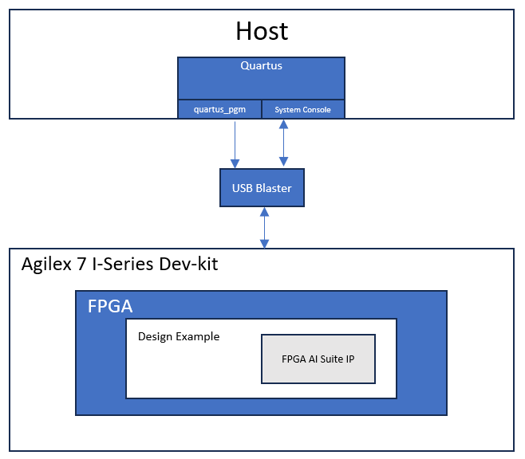
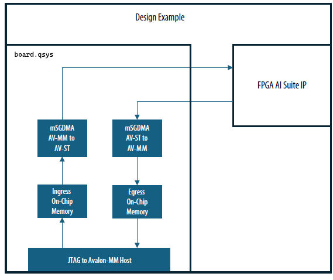

# 1.0 FPGA AI Suite DDR-Free System Example Design


## 4.0 Getting Started with the FPGA AI Suite DDR-Free system example design

Before starting with the FPGA AI-Suite DDR-free system example design, ensure that you have followed all the installation instructions for the FPGA AI Suite compiler and IP generation tools.

The DDR-free system example design is validated for use only with Quartus Prime Pro Edition Version 24.3 and Version 25.3.

The FPGA AI Suite provides a design example to demonstrate hostless and DDR-free operation of the FPGA AI Suite IP. Graph filters, bias, and FPGA AI Suite IP configurations are stored in on-chip memory on the FPGA device instead of DDR memory on the board.

The DDR-free design example demonstrates how FPGA AI Suite supports the following features:

* DDR-free operation
* Hostless operation (that is, running on the devices without the FPGA AI Suite runtime)
* Streaming of input features
* Streaming of inference results

The DDR-Free design example is implemented with the following components:

* FPGA AI Suite IP
* Agilex 7 FPGA I-Series Development Kit ES2 (DK-DEV-AGI027RBES)
* Sample hardware and software systems that illustrate the use of these components

For more details about DDR-free operation, refer to [DDR-Free Operation](https://www.intel.com/content/www/us/en/docs/programmable/863373/2025-3/using-in-hostless-ddr-free-mode.html) in the FPGA AI Suite Handbook.

The design example build scripts in [Building the FPGA AI Suite Runtime](https://www.intel.com/content/www/us/en/docs/programmable/863373/2025-3/building-the-pcie-design-example-runtime.html) let you choose from a variety of architecture files and build your own bitstreams, provided that you have a license permitting bitstream generation.

This design is provided with the FPGA AI Suite as an example showing how to incorporate the FPGA AI Suite IP into a DDR-Free design. This design is not intended for unaltered use in production scenarios. Any potential production application that uses portions of this design example must be reviewed for both robustness and security.

The following sections in this document describe the steps to build and execute the design:

* [Getting Started with the FPGA AI Suite DDR-Free Design Example](#40-getting-started-with-the-fpga-ai-suite-ddr-free-system-example-design)
* [Running the Hostless DDR-Free Design Example](#50-running-the-hostless-ddr-free-system-example-design)

The following sections in this document describe design decisions and architectural details about the design:

* [Design Example System Architecture](#60-design-architecture)
* [Quartus Prime System Console](#70-quartus-prime-system-console)
* [JTAG to Avalon MM Host Register Map](#table-2-jtag-to-avalon-mm-host-register-map)
* [Updating MIF Files](#80-updating-mif-files)

### 4.1 Hardware Requirements

This system example design requires the following hardware:
• Agilex 7 FPGA I-Series Development Kit ES2 (DK-DEV-AGI027RBES)
• [Intel FPGA Download Cable](https://www.intel.com/content/www/us/en/products/sku/215633/intel-fpga-download-cable/specifications.html)

### 4.2 Software Requirements

This system example design requires the following software:
• FPGA AI Suite
• Quartus Prime Programmer (either standalone or as part of Quartus Prime Design Suite).
• Quartus Prime System Console (either standalone or as part of Quartus Prime Design Suite).

Ensure that all the binaries included in the Quartus Prime Design Suite are added to your $PATH environment variable so that they can be called from any location.

When you have met these prerequisites, validate that the development kit is connected to the JTAG interface by using the *jtagconfig* utility provided by the Quartus Prime Design Suite. A successful confirmation of the JTAG connection looks like the following example output:

```
$ jtagconfig
1) AGI FPGA Development Kit [1-7.2]
034BB0DD AGIB027R29A(.|B|C|R0|R1|R3)/..
020D10DD VTAP10
```

## 5.0 Running the Hostless DDR-Free System Example Design

### Procedure

To run the hostless DDR-free system example design with a ResNet-18 PyTorch Model:

1. Download and prepare the ResNet-18 PyTorch Model with the OpenVINO Open Model Zoo tools with the following commands:
   ```bash
   source ~/build-openvino-dev/openvino_env/bin/activate

   omz_downloader --name resnet-18-pytorch \
   --output_dir $COREDLA_WORK/demo/models/

   omz_converter --name resnet-18-pytorch \
   --download_dir $COREDLA_WORK/demo/models/ \
   --output_dir $COREDLA_WORK/demo/models/
   ```

   Important: The OpenVINO Open Model Zoo (OMZ) PyTorch models do not include a softmax operation at the end of the model.

2. Generate the parameter ROMs as *.mif* files by running the FPGA AI Suite compiler with the following command:
   ```bash
   dla_compiler \
   --batch-size=1 \
   --network-file <path/to/graph> \
   --march $COREDLA_ROOT/example_architectures/AGX7_Streaming_Ddrfree_Resnet18.arch \
   --foutput-format=open_vino_hetero \
   --o <compiler output .bin file name> \
   --fplugin HETERO:FPGA \
   --dumpdir $COREDLA_WORK/resnet-18-dlac-out/
   ```

   The *.mif* files are created in a subdirectory of the directory specified by the *--dumpdir* option. This subdirectory is called *parameter_rom*.

   For details about creating the .mif files required for DDR-free operation, refer to "Generating Artifacts for DDR-Free Operation" in the [FPGA AI Suite Handbook](https://www.intel.com/content/www/us/en/docs/programmable/863373/2025-3/generating-artifacts-for-hostless-ddr.html).

3. Build the example design with the following command:
   ```bash
   dla_build_example_design.py build \
   --output-dir <path/to/build/dir> \
   --num-instances 1 \
   --seed 1 \
   --parameter-rom-dir $COREDLA_WORK/resnet-18-dlac-out/parameter_rom/ \
   agx7_iseries_ddrfree \
   $COREDLA_ROOT/example_architectures/AGX7_Streaming_Ddrfree_Resnet18.arch
   ```

   Building the example design creates the bitstream needed to program the FPGA device.

   For more information about the *dla_build_example_design.py* command, refer to The `dla_build_example_design.py` script.

4. Program the FPGA device with the Quartus Prime Programmer.

   The bitstream used to program the device is *<path/to/build/dir>/hw/output_files/top.sof*.

   Program the FPGA device with the following command:
   ```
   quartus_pgm -c 1 -m jtag -o "p;top.sof@1"
   ```

   For more information about the Quartus Prime Programmer, refer to Quartus Prime Pro Edition User Guide: Programmer.

5. Lower the JTAG clock speed to 16 MHz or lower in order to make the JTAG connection stable. This can be accomplished with the following command:

    ```
    jtagconfig --setparam 1 JtagClock 16M
    ```

6. Use the Quartus Prime System Console to run inference on the example design.

   Because this example design is hostless, operations that typically come from the host are performed through Quartus Prime System Console instead. For more information about the Quartus Prime System Console, refer to [“Analyzing and Debugging Designs with System Console”](https://www.intel.com/content/www/us/en/docs/programmable/683819/25-1-1/analyzing-and-debugging-designs-with-84752.html) in [Quartus Prime Pro Edition User Guide: Debug Tools](https://www.intel.com/content/www/us/en/docs/programmable/683819/25-1-1/faq.html).

   Use the System Console to complete the following steps:
   a. (Optional) Update the graph parameter and instructions using the CSR interface.
   b. Store input features in the FPGA on-chip memory.
   c. Prime the FPGA AI Suite IP registers for inference.
   d. Configure an ingress Modular Scatter-Gather DMA (mSGDMA) core to read the input features from on-chip memory and stream data into the FPGA AI Suite IP.
   e. Configure an egress mSGDMA core to stream data from the FPGA AI Suite IP into on-chip memory.
   f. Read the inference results from on-chip memory.

   The system example design provides a System Console script to automate these operations for you. You can find the script in the *$CORDLA_ROOT/runtime/streaming/ed0_streaming_example* folder.

   To use the system example design's System Console script:
   a. Run the following command to execute inference:
      ```bash
      system-console --script=system_console_script.tcl \
      --input <path-to-img.bin> \
      --num_inferences <#-of-inferences> \
      --output_shape <[C H W]> \
      --functional --arch=<path-to-architecture-description-file>
      ```

      The system example design's Quartus Prime System Console script generates a file called *output.bin* that contains the raw inference results.

   b. (Optional) To measure the performance of the system example design, run the following command:
      ```bash
      system-console --script=system_console_script.tcl \
      --input <path-to-img.bin> \
      --output_shape <[C H W]> \
      --core_ip_performance --arch=<path-to-architecture-description-file>
      ```

      For more information about the System Console script, refer to [Quartus Prime System Console](#70-quartus-prime-system-console).

7. Postprocess the raw inference output for readability with the following command:
   ```bash
   python3 $COREDLA_ROOT/bin/streaming_post_processing.py <path-to-output.bin>
   ```

   This script cleans the raw output binary file by script some invalid bytes and storing an FP16 formatted *result_hw.txt* file for readability.

## 6.0 Design Architecture

### 6.1 System Overview

The FPGA image consists of the FPGA AI Suite IP and additional logic that connects the IP to a JTAG interface. The DDR-Free system example design does not use the *dla_benchmark* runtime. Instead, it allows for communication and control of the FPGA AI Suite IP through a JTAG-Quartus Prime System Console connection. In addition, the DDR-Free system example design showcases the FPGA AI Suite IP streaming functionality. For more information about feature input and output streaming, refer to ["Feature Input and Output Streaming" in FPGA AI Suite Handbook](https://www.intel.com/content/www/us/en/docs/programmable/863373/2025-3/input-streaming.html).

The system configuration of this system example design is shown in the following block diagram:


#### Figure 1: DDR-Free System Configuration



### 6.2 Hardware

This section provides an in-depth description of the system example design, focusing on the integration and functionality of the JTAG to Avalon-MM host, the ingress and egress mSGDMA engines, the FPGA AI Suite IP for inference, and the on-chip memory modules. It covers the configuration and control mechanisms, as well as the interaction between different components to achieve efficient AI inference on an FPGA device.

A top-level view of the system example design that illustrates the data flow is shown in [Figure 2](#figure-2-ddr-free-system-architecture). The DDR-Free system example design is currently limited to one FPGA AI Suite IP instance.

All components are connected to the JTAG to Avalon-MM host and are memory-mapped on the JTAG bus, allowing for efficient communication and control from the Quartus Prime System Console. Address offsets for each component is provided in [JTAG to Avalon MM Host Register Map](#table-2-jtag-to-avalon-mm-host-register-map).

#### Figure 2: DDR-Free System Architecture



#### 6.2.1 The Modular Scatter-Gather DMA (mSGDMA) Engines

The data flow within the system is orchestrated by the modular scatter-gather DMA (mSGDMA) engines and the FPGA AI Suite IP (which performs the inference computation). The following mSGDMA engines are used in the system example design:

• **Ingress mSGDMA**
  The ingress mSGDMA engine performs memory-mapped reads from the on-chip memory and streams the data into the FPGA AI Suite IP. It converts Avalon-MM transactions to Avalon Streaming format.

• **Egress mSGDMA**
  The egress mSGDMA engine receives the streamed inference results from the FPGA AI Suite IP and stores them into the egress on-chip memory using MM operations. It converts Avalon-ST transactions back to Avalon-MM format.

The mSGDMA engines are configured to use 128-bit streaming transfer sizes.

For more information about how to use the modular scatter-gather DMA core, refer to ["Modular Scatter-Gather DMA Core" in Embedded Peripherals IP User Guide](https://www.intel.com/content/www/us/en/docs/programmable/683130/25-3/modular-scatter-gather-dma-core.html).

#### 6.2.2 On-Chip Memory Modules

The on-chip memory modules store input data and final inference results. These memories are accessible via Avalon-MM interfaces. There are two modules: one for staging input memory and one for staging output inference results. These are referred to as ingress and egress on-chip memory, respectively. The sizes of the on-chip memory modules are defined in [Table 1](#table-1-on-chip-memory-module-sizes).

• **Ingress On-Chip Memory**
  This module is dedicated to storing the input data before it is processed by the FPGA AI Suite IP. It serves as the staging area for data that will be read by the ingress mSGDMA engine and streamed into the inference IP.

• **Egress On-Chip Memory**
  This module is used to store the final inference results after they have been processed by the FPGA AI Suite IP. The egress mSGDMA engine writes the inference results from the FPGA AI Suite IP to this memory, making it available for retrieval and further use.

The following table provides the specific sizes allocated for each on-chip memory module, ensuring that the system has adequate storage for both input data and inference result:

##### Table 1: On-Chip Memory Module Sizes

| On-Chip Memory Module | Size (in bytes) |
|-----------------------|-----------------|
| Ingress               | 524288          |
| Egress                | 131072          |

#### 6.2.3 Platform Designer System

The on-chip memory modules, mSGDMA engines, and other components are instantiated and interconnected within the board.qsys Platform Designer system. This comprehensive system design is then instantiated as an IP block within the top.sv file, ensuring seamless integration and efficient operation of the entire design.

#### 6.2.4 PLL Adjustment

The system example design build script adjusts the PLL driving the FPGA AI Suite IP clock based on the fMAX that the Quartus Prime compiler achieves.

## 7.0 Quartus Prime System Console

This system example design requires user interaction on the host system through Quartus Prime System Console. For more information about the Quartus Prime System Console, refer to ["Analyzing and Debugging Designs with System Console" in Quartus Prime Pro Edition User Guide: Debug Tools](https://www.intel.com/content/www/us/en/docs/programmable/683819/25-1-1/analyzing-and-debugging-designs-with-84752.html).

The system console user interface communicates over JTAG to a JTAG to Avalon-MM host IP that enables the following functions:
• Read/write to the FPGA AI Suite IP DMA CSR
  For more information about the FPGA AI Suite IP CSR map, refer to ["CSR Map and Descriptor Queue" in the FPGA AI Suite IP Handbook](https://www.intel.com/content/www/us/en/docs/programmable/863373/2025-3/csr-map-and-descriptor-queue.html)
• Read/write to ingress and egress on-chip memory
• Read/write to ingress and egress modular scatter-gather DMA (mSGDMA) CSR
  For more information about mSGDMA CSR, refer to ["Register Map of mSGDMA" in Embedded Peripherals IP User Guide](https://www.intel.com/content/www/us/en/docs/programmable/683130/25-3/register-map-of-msgdma.html).

You can find the Quartus Prime System Console Tcl script in the following location:
$COREDLA_ROOT/runtime/streaming/ed0_streaming_example/system_console_script.tcl

### 7.1 Quartus Prime System Console Script Options

The Quartus Prime System Console script facilitates various operations related to performance testing and functional evaluation of the system example design. The following table provides an explanation of the options that you can use with the script:

#### Table 1: System Console Script Options

| Option | Usage |
|--------|-------|
| --input | Path to input binary (*.bin) file Must be in either fp16 or uint8 depending on layout transform arch parameter option: do_u8_fp16_conversion. |
| --num_inferences | Number of inferences. For some operation modes, the number of inferences is hardcoded for optimal performance measurements: • Core IP Performance: 1 • IP Performance: 32 |
| --output_shape | Output shape of graph in CHW format. For example: [1000 1 1]. |
| --online_reconfiguration | Path to the directory containing MIFs of the parameters and instructions of a new graph. If specified, then graph update via JTAG occurs and all inference arguments are ignored. |
|--arch| Path to the architectural description file. This argument is required for running inference. |
| --functional | Mode of operation. You can use only one of these options at a time. • Functional: Used for functional testing for large number of inferences. • Core IP Performance: Evaluates core IP Performance. • IP Performance: End to end IP performance including input and output streamer. |
| --core_ip_performance | |
| --ip_performance | |

### 7.2 Inference Functionality

The process of executing an inference on the DDR-Free system example design involves the following steps in the Quartus Prime System Console. Each step translates to a specific Tcl process in the *system_console_script.tcl* script:

1. Prime the FPGA AI Suite IP's CSR and resets the SGDMA's for streaming inference.
   ```initialize_coredla{}```

2. Load raw input features into ingress on-chip memory
   ```stage_input{}```

3. Queue a descriptor into the ingress SGDMA for MM to streaming operation
   ```queue_ingress_descriptor{}```

4. Queue a descriptor into the egress SGDMA for streaming to MM operation
   ```queue_egress_descriptor{}```

5. Reads inference results from the egress on-chip memory
   ```read_output{}```

### 7.3 System Reset

In most FPGA AI Suite Design Examples, system resets are typically managed through software running on a host. However, because this system example design operates without a host, this system example design uses In-System Sources and Probes to perform a reset via JTAG.

This approach enables remote control of the reset process, ensuring both flexibility and accessibility. For the DDR-Free system example design, the reset operation is initiated by writing a reset bit through the system console via JTAG. The following Tcl code snippet demonstrates the reset process.

```tcl
# Initiate reset via source/probe IP
proc assert_reset {} {
    set issp_index 0
    set issp [lindex [get_service_paths issp] 0]
    set claimed_issp [claim_service issp $issp mylib]
    set source_data 0x0
    issp_write_source_data $claimed_issp $source_data
    set source_data 0x1
    issp_write_source_data $claimed_issp $source_data
}
```

*Related Information: [“Design Debugging Using In-System Sources and Probes” in Quartus Prime Pro Edition
User Guide: Debug Tools](https://www.intel.com/content/www/us/en/docs/programmable/683819/25-1-1/quick-design-verification-with.html)*

### 7.4 Input Data Conversion

This system example design streams data into the FPGA AI Suite IP from the ingress on-chip memory. To achieve this, the system console script must stage input data in a *.bin* file format instead of *.bmp* format. The *.bin* file must be in FP16 (halfprecision floating point) and organized in HWC (height-width-channel) format.

To facilitate this conversion, refer to the following example Python code. This script reads a *.bmp* file, converts the image data to FP16 format, and saves it in the required *.bin* format.

#### Figure 2: Python Example Code for *.bmp* to *.bin* conversion

```python
import sys
from PIL import Image
import numpy as np

def convert_image_to_bin(input_image_name):
    # Read the BMP file
    img = Image.open(input_image_name)
    output_file_name = 'array_hwc_fp16.bin'
    
    # Convert the image to a numpy array
    arr = np.array(img)
    
    # Convert the image to FP16 format
    arr_fp16 = arr.astype(np.float16)
    
    # Save the FP16 HWC formatted data to a .bin file
    with open(output_file_name, 'wb') as f:
        arr_fp16.tofile(f)
    
    print(f"Converted {input_image_name} to {output_file_name}")

if __name__ == "__main__":
    if len(sys.argv) != 2:
        print("Usage: python bmp_to_bin_converter.py <input_image_name>")
        sys.exit(1)
    
    input_image_name = sys.argv[1]
    convert_image_to_bin(input_image_name)
```

### 7.5 Measuring Performance

The system console script allows you to measure the following types of performance:

• Core IP Performance
  Specifying the `--core_ip_performance` operation mode option sets the `--num_inferences` option to 1 and stages the input into the `input_streamer` before starting the inference.

  This operation mode measures the latency of 1 inference through the IP without the time to fill the input streamer FIFO.

• System Throughput
  Specifying the `--ip_performance` operation mode sets the `--num_inferences` option to 32 and measures the throughput of the graph. This mode only saves the last output since offloading the output after every inference could limit the performances.

  This operation mode measures the throughput of the whole system including input streamer and output streamer.

#### Table 2: JTAG to Avalon MM Host Register Map

| IP | Offset | Description |
|----|--------|-------------|
| FPGA AI Suite IP | 0x0003_8000 – 0x0003_87ff | Refer to ["CSR Map and Descriptor Queue" in the FPGA AI Suite Handbook](https://www.intel.com/content/www/us/en/docs/programmable/863373/2025-3/csr-map-and-descriptor-queue.html) |
| Ingress On-Chip Memory | 0x0020_0000 – 0x0027_ffff | Refer to ["On-Chip Memory II (RAM or ROM) Intel FPGA IP" in Embedded Peripherals IP User Guide.](https://www.intel.com/content/www/us/en/docs/programmable/683130/25-3/on-chip-memory-ii-ram-or-rom-intel-fpga-ip.html) |
| Egress On-Chip Memory | 0x0028_0000 – 0x0029_ffff | |
| Ingress mSGDMA (MM to Streaming) | CSR: 0x0003_0000 – 0x0003_001f Descriptor: 0x0003_0020 – 0x0003_002f | Refer to ["Modular Scatter-Gather DMA Core" in Embedded Peripherals IP User Guide.](https://www.intel.com/content/www/us/en/docs/programmable/683130/25-3/modular-scatter-gather-dma-core.html) |
| Egress mSGDMA (Streaming to MM) | CSR: 0x0003_0040 – 0x0003_005f Descriptor: 0x0003_0060 – 0x0003_006f | |

## 8.0 Updating MIF Files

The system example design build process uses `*.mif` files to initialize the on-chip M2Ks. The M20Ks store filters, bias, and configuration data on-chip rather than in external memory. The DDR-free flow allows inference of different graphs using the "update_mif" feature of Quartus Prime software without needing to recompile the bitstream. You must guarantee that the filter, bias, and configuration cache depth are large enough to hold the new graph parameters and FPGA AI Suite IP configuration.

After a system example design is compiled, you can update the contents of the M20Ks through the Quartus Prime tools. The commands regenerate the *top.sof* bitstream file that needs to be reprogrammed on the device.

The Quartus Prime tools do not change the architecture of the FPGA AI Suite IP. They update only the contents of the on-chip M20Ks that store the graph information and the FPGA AI Suite IP configuration.

To update the contents of the M20K on-chip memory:

1. Recompile the `.mif` files for the new graph as described in [Running the Hostless DDR-Free System Example Design](#50-running-the-hostless-ddr-free-design-example).

2. Replace the `.mif` files under `<path/to/build/dir>/coredla_ip/intel_ai_ip/verilog/` with the files that were created in the previous step.

3. Run the following commands from `<path/to/build/dir>/hw/`:
   ```
   quartus_cdb top -c top --update_mif
   quartus_asm --read_settings_files=on --write_settings_files=off top -c top
   ```