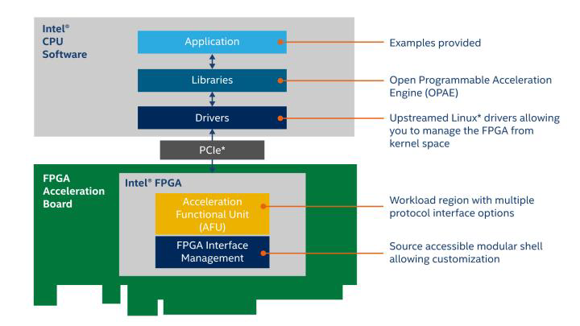
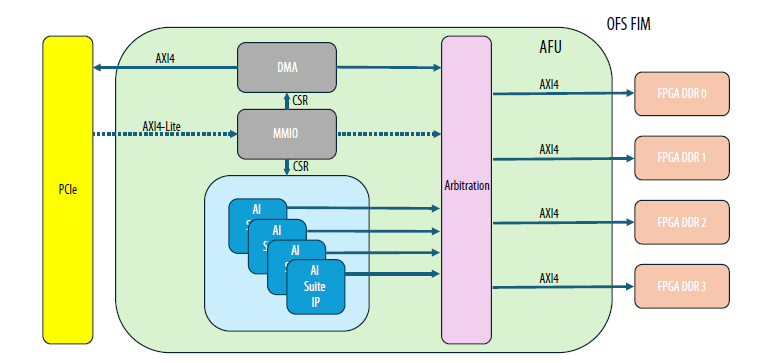

# 1.0 FPGA AI Suite OFS System Example Design

The FPGA AI Suite Design Example User Guides describe the design and implementation for accelerating AI inference using the FPGA AI Suite, Intel® Distribution of OpenVINO™ toolkit, and various development boards (depending on the design example). They share a common introduction between each document, which serves as an introduction to the material. Section 4.0 begins the ED specific material.

## About the FPGA AI Suite Documentation Library

Documentation for the FPGA AI Suite is split across a few publications. Use the following table to find the publication that contains the FPGA AI Suite information that you are looking for:

### Table 1. FPGA AI Suite Documentation Library

| Title and Description | Link |
|----------------------|------|
| **Release Notes**<br>Provides late-breaking information about the FPGA AI Suite including new features, important bug fixes, and known issues. | [Link](https://docs.altera.com/r/docs/772497/2026.1.1/fpga-ai-suite-version-2026.1.1-release-notes/fpga-ai-suite-version-2026.1.1-release-notes) |
| **FPGA AI Suite Handbook**<br>Get up and running with the FPGA AI Suite by learning how to initialize your compiler environment and reviewing the various design examples and tutorials provided with the FPGA AI Suite <br>Describes the use modes of the graph compiler (`dla_compiler`). It also provides details about the compiler command options and the format of compilation inputs and outputs. | [Link](https://docs.altera.com/r/docs/863373/2026.1.1/fpga-ai-suite-handbook/fpga-ai-suite-handbook) |

# 2.0 FPGA AI Suite Design Examples

The following is a comprehensive list of the available FPGA AI Suite Design Example User Guides.

## Table 2. FPGA AI Suite Design Examples Descriptions

| Design Example | Description |
|---------------|-------------|
| [PCIe-attach design example](https://altera-fpga.github.io/rel-26.1/ed-ai-suite/agilex7/pcie/pcie_getting_started_extended/) | Demonstrates how OpenVINO toolkit and the FPGA AI Suite support the look-aside deep learning acceleration model.<br><br>This design example targets the Terasic* DE10-Agilex™ Development Board (DE10-Agilex-B2E2). |
| [OFS PCIe-attach design example](https://altera-fpga.github.io/rel-26.1/ed-ai-suite/agilex7/ofs/ofs_pcie_getting_started) | Demonstrates the OpenVINO toolkit and the FPGA AI Suite that target Open FPGA Stack (OFS)-based boards.<br><br>This design example targets the following Open FPGA Stack (OFS)-based boards:<br>* Agilex™ 7 FPGA I-Series Development Kit ES2 (DK-DEV-AGI027RBES)<br>* Silicom FPGA SmartNIC N6001-PL Platform (without Ethernet controller) |
| [Hostless DDR-Free design examples](https://altera-fpga.github.io/rel-26.1/ed-ai-suite/agilex7/hostless_ddr_free_ed/hostless_ddr_free_design_example) | Demonstrates hostless DDR-free operation of the FPGA AI Suite IP. Graph filters, bias, and FPGA AI Suite IP configurations are stored in internal memory on the FPGA device.<br><br>This design example targets the Agilex™ 7 FPGA I-Series Development Kit ES2 (DK-DEV-AGI027RBES). |
| [Hostless JTAG design example](https://altera-fpga.github.io/rel-26.1/ed-ai-suite/agilex5/hostless_jtag/hostless_jtag_design_example) | Demonstrates the step-by-step sequence of configuring FPGA AI Suite IP and starting inference by writing into CSRs directly via JTAG.<br><br>This design example targets the Agilex™ 5 FPGA E-Series 065B Modular Development Kit (MK-A5E065BB32AES1). |
| [SoC design example](https://altera-fpga.github.io/rel-26.1/ed-ai-suite/agilex5/soc/fpga_ai_suite_soc_design_example) | Demonstrates how OpenVINO toolkit and the FPGA AI Suite support the CPU-offload deep-learning acceleration model in an embedded system.<br><br>The design example targets the following development boards:<br>* Agilex™ 3 FPGA and SoC C-Series Development Kit (DK-A3W135BM16AEA)<br>* Agilex™ 5 FPGA E-Series 065B Modular Development Kit (MK-A5E065BB32AES1)<br>* Agilex™ 7 FPGA I-Series Transceiver-SoC Development Kit (DK-SIAGI027FC)<br>* Arria® 10 SX SoC FPGA Development Kit (DK-SOC-10AS066S) |

## Table 3. FPGA AI Suite Design Examples Properties Overview

| Example | Design Type | Target FPGA Device | Host | Memory | Stream* | Design Example Identifier** | Supported Development Kit |
|---------|-------------|-------------------|------|--------|---------|---------------------------|---------------------------|
| PCIe-Attached | Agilex™ 7 | External host processor | DDR | M2M | agx7_de10_pcie | [Terasic DE10-Agilex™ Development Board (DE10-Agilex™-B2E2)](https://www.terasic.com.tw/cgi-bin/page/archive.pl?Language=English&CategoryNo=142&No=1252) |
| PCIe-Attached| Agilex™ 7 |External host processor |DDR |M2M | agx7_iseries_ofs_pcie | [Agilex™ 7 FPGA I-Series Development Kit ES2 (DK-DEV-AGI027RBES)](https://www.altera.com/products/devkit/a1jui0000049utmmam/agilex-7-fpga-i-series-development-kit-2x-r-tile-and-1x-f-tile) |
| PCIe-Attached|Agilex™ 7 |External host processor |DDR |M2M | agx7_n6001_ofs_pcie | [Silicom FPGA SmartNIC N6001-PL Platform (without Ethernet controller)](https://www.altera.com/asap/offering/po-2750/silicom-fpga-smartnic-n60106011-n6001-pln6000-pl-arrow-creek) |
| Hostless DDR-Free | Agilex™ 7 | Hostless | DDR-Free | Direct | agx7_iseries_ddrfree | [Agilex™ 7 FPGA I-Series Development Kit ES2 (DK-DEV-AGI027RBES)](https://www.altera.com/products/devkit/po-3012/agilex-7-fpga-i-series-development-kit-2x-r-tile-and-1x-f-tile) |
| Hostless JTAG Attached | Agilex™ 5 |Hostless | DDR | M2M | agx5e_modular_jtag | [Agilex™ 5 FPGA E-Series 065B Modular Development Kit (MK-A5E065BB32AES1)](https://www.altera.com/products/devkit/po-3274/agilex-5-fpga-and-soc-e-series-065b-modular-development-kit) |
|SoC | Agilex™ 3 |On-device HPS |DDR |M2M | agx3_soc_m2m<br> | [Agilex™ 3 FPGA and SoC C-Series Development Kit (DK-A3W135BM16AEA)](https://www.altera.com/products/devkit/po-3000/agilex-3-fpga-and-soc-c-series-development-kit) |
|SoC | Agilex™ 5 |On-device HPS |DDR |M2M and S2M | agx5_soc_m2m<br>agx5_soc_s2m | [Agilex™ 5 FPGA E-Series 065B Modular Development Kit (MK-A5E065BB32AES1)](https://www.altera.com/products/devkit/po-3274/agilex-5-fpga-and-soc-e-series-065b-modular-development-kit) |
| SoC | Agilex™ 7 | On-device HPS | DDR | M2M and S2M | agx7_soc_m2m<br>agx7_soc_s2m | [Agilex™ 7 FPGA I-Series Transceiver-SoC Development Kit (DK-SIAGI027FC)](https://www.altera.com/products/devkit/po-3013/agilex-7-fpga-i-series-transceiver-soc-development-kit-4x-f-tile) |
|SoC | Arria® 10 |On-device HPS |DDR |M2M and S2M | a10_soc_m2m<br>a10_soc_s2m | [Arria® 10 SX SoC FPGA Development Kit (DK-SOC-10AS066S)](https://www.altera.com/products/devkit/po-3006/arria-10-sx-soc-development-kit) |

\*For the **Design Example Identifier** column, these entries are the value to use with the FPGA AI Suite Design Example Utility (`dla_build_example_design.py`) command to build the design example

\*\*For the Stream column, the entries are defined as follows:

**M2M** FPGA AI Suite runtime software running on the external host transfers the image (or data) to the FPGA DDR memory.

**S2M** Streaming input data is copied to FPGA on-device memory. The FPGA AI Suite runtime runs on the FPGA device (HPS or RTL state machine). The runtime is used only to coordinate the data transfer from FPGA DDR memory into the FPGA AI Suite IP.

**Direct** Data is streamed directly in and out of the FPGA on-chip memory.

# 3.0 Shared Design Example Components

## 3.1. FPGA AI Suite Design Example Utility

The main entry point into the example design build system is the FPGA AI Suite design example utility (`dla_build_example_design.py`). This utility coordinates different aspects of building a design example, from the initial project configuration to extracting area metrics after a compile completes. With this utility, you can create bitstreams from custom AI Suite IP architecture files and with a configurable number of instances.

*Note: There is no '.py' extension on `dla_build_example_design` when using the FPGA AI Suite on Windows.*

To use the FPGA AI Suite design example build utility, ensure that your local development environment has been setup according to the steps in ["Installing FPGA AI Suite Compile and IP Generation Tools" in FPGA AI Suite Handbook](https://docs.altera.com/r/docs/863373/2026.1.1/fpga-ai-suite-handbook/installing-the-fpga-ai-suite-compiler-and-ip-generation-tools).

### 3.1.1. The `dla_build_example_design.py` Command

The FPGA AI Suite design example utility (`dla_build_example_design.py`) configures and compiles the bitstreams for the FPGA AI Suite design examples. The command has the following basic syntax:

```
dla_build_example_design.py [--logfile logfile] [--debug] [action]
```

where [action] is one of the following actions:

#### Table 4. Design Example Utility Actions

| Action | Description |
|--------|-------------|
| `list` | List the available example designs. |
| `build` | Build an example design. |
| `qor` | Generate QoR reports. |
| `quartus-compile` | Run a Quartus® Prime compile. |
| `scripts` | Managed the build support scripts. |

Some of the command actions have different additional required and optional parameters. Use the command `help` to see a list of available options for the command and its actions.

By default, the `dla_build_example_design.py` command always instructs the `dla_create_ip` command to create licensed IP. If no license can be found, inference-limited, unlicensed RTL is generated. The build log indicates if the IP is licensed or unlicensed. For more information about licensed and unlicensed IP, refer to ["The --unlicensed/--licensed Options" in FPGA AI Suite IP Reference Manual](https://www.intel.com/content/www/us/en/docs/programmable/863373/2025-3/ip-generation-utility-outputs.html).

#### Getting `dla_build_example_design.py` Command Help

For general help with the command and to see the list of available actions, run the following command:

```
dla_build_example_design.py --help
```

For help with a command actions and to the list of available options and arguments required for an action, run the following command:

```
dla_build_example_design.py action --help
```

#### Command Logging and Debugging

By default, the FPGA AI Suite design example utility logs its output to a set location in the (default) `build_platform` directory. Override this location by specifying the `--logfile` *logfile* option.

For extra debugging output, specify the `--debug` option.

Both the logging and debugging options must be specified before the command action.

### 3.1.2. Listing Available FPGA AI Suite Design Examples

To list the available FPGA AI Suite design examples, run the following command:

```
dla_build_example_design.py list
```

This command shows the design example identifiers (used with the build action of the design example utility) along with a short description of the design example and its target Quartus Prime version.

A list of the design examples and their identifiers is also available in [FPGA AI Suite Design Examples Properties Overview](#table-3-fpga-ai-suite-design-examples-properties-overview).

### 3.1.3. Building FPGA AI Suite Design Examples

To build FPGA AI Suite design examples, specify the build option of the design example utility.

In the most simple case of building a design example for an existing architecture, you can build a design example with the following command:

```
dla_build_example_design.py build \
<design_example_identifier> \
<architecture file>
```

For example, use the following command to build the Agilex™ 7 PCIe-based design example that targets the **DE10-Agilex-B2E2** board using the AGX7_Generic architecture:

```
dla_build_example_design.py build \
agx7_de10_pcie \
$COREDLA_ROOT/example_architectures/AGX7_Generic.arch
```

The default build directory is `build_platform`. The utility creates the folder if it does not exist. To specify a different build directory, specify the `--output-dir <directory>` option:

```
dla_build_example_design.py build \
--output-dir <directory> \
<design_example_identifier> \
<architecture file>
```

Be default, the utility also prevents the build directory from being overwritten. You can override this behavior with the `--force` option.

After the build is complete, the build directory has the following files and folders:

* **coredla_ip/**
This folder contains the RTL for the configured FPGA AI Suite IP.

* **hw/**
This folder contains the Quartus Prime or Open FPGA Stack (OFS) project files. It also includes its own self-contained copy of the contents of the `coredla_ip/` folder

* **.build.json**
This contents of this file (sometimes referred to as the "build context" file) allow the build to be split into multiple steps.

* **Reports**
The build directory will contain any log files generated by the build utility (such as `build.log`) and the QoR summary that is generated by a successful compilation.

* **Bitstreams**
This build directory will contain the bitstreams to program the target FPGA device as follows:
  - For OFS-based designs, `.gbs` files.
  - For other designs, `.sof` and `.rbf` files.

#### 3.1.3.1. Staging FPGA AI Suite Design Example Builds

The FPGA AI Suite design example utility supports staged builds via the `--skip-compile` option. When you specify this option, the utility creates the build folder and prepares the Quartus Prime or Open FPGA Stack (OFS) project but does not run compilation.

With a staged design example build flow, you must run the utility a few times to generate the same outputs as the regular build flow. For a complete build with a staged build flow, you would run the following commands:

```
dla_build_example_design.py build --skip-compile \
<design_example_identifier> \
<architecture file>
dla_build_example_design.py quartus-compile build_platform
# Optional: Generate QoR summary
dla_build_example_design.py qor build_platform
```

Information about the build configuration, namely what was passed into the `dla_build_example_design.py` build command, is stored inside of the build context (`.build.json`) file.

You can run the `dla_build_example_design.py quartus-compile` and `dla_build_example_design.py qor` commands multiple times. An example of when running these commands multiple times can be useful is when you have to recompile the bitstream after removing an unnecessary component from the design example.

You can also directly call the design compilation script. An FPGA AI Suite design example uses one of the following scripts, depending on whether the design example can built in a WSL 2 environment:

* **generate_sof.tcl**
Design examples with this design compilation script can be built in a WSL 2 environment.

* **build_project.sh**
Design examples with this design compilation script cannot be built in a WSL 2 environment.

If a design example uses a `generate_sof.tcl` script, then you can invoke the design compilation script either after opening the design example project in Quartus Prime or by running the following command:

```
quartus_sh -t generate_sof.tcl
```

If a design example uses the `build_project.sh` build script, the script must be executed in a Bash-compatible shell. For example:

```
bash build_project.sh
```

For both design example compilation scripts, the current working directory must be the `hw/` directory.

#### 3.1.3.2. WSL 2 FPGA AI Suite Design Example Builds

Staged builds allow the build utility to support hybrid Windows/Linux compilation in a WSL 2 environment on a Windows system. In a WSL 2 environment, FPGA AI Suite is installed in the WSL 2 Linux guest operating system while Quartus Prime is installed in the Windows host operating system.

**Restriction:** Only a subset of the FPGA AI Suite design examples can be build in a WSL 2 environment. For a list of design examples that support WSL 2, run the following command:

```
dla_build_example_design.py list --supports-wsl2
```

When you run the `dla_build_example_design.py` build command, the WSL 2 flow is enabled with the `--wsl` option. This option tells the utility to resolve the path to the build directory as a Windows file path instead of a Linux file path. The utility displays messages that provide you with more details about how to use the staged build commands to complete the compilation in your WSL 2 environment.

**Important:** If you specify a build directory in a WSL 2 environment with the `--output-dir` options, that build directory must be a relative path. This requirement is due to a limitation in how the WSL 2 environment maps paths between the Linux guest and Windows.

## 3.2. Example Architecture Bitstream Files

The FPGA AI Suite provides example Architecture Files and bitstreams for the design examples. The files are located in the FPGA AI Suite installation directory.

## 3.3. Design Example Software Components

The design examples contain a sample software stack for the runtime flow.

For a typical design example, the following components comprise the runtime stack:

* OpenVINO Toolkit (Inference Engine, Heterogeneous Plugin)
* FPGA AI Suite runtime plugin
* Vendor-provided FPGA board driver or OPAE driver (depending on the design example)

The design example contains the source files and Makefiles to build the FPGA AI Suite runtime plugin. The OpenVINO component (and OPAE components, where used) is external and must be manually preinstalled.

A separate flow compiles the AI network graph using the FPGA AI Suite compiler, as shown in [Figure 1 Software Stacks for FPGA AI Suite Inference](#figure-1-software-stacks-for-fpga-ai-suite-inference) that follows as the Compilation Software Stack.

The compilation flow output is a single binary file called `CompiledNetwork.bin` that contains the compiled network partitions for FPGA and CPU devices along with the network weights. The network is compiled for a specific FPGA AI Suite architecture and batch size. This binary is created on-disk only when using the Ahead-Of-Time flow; when the JIT flow is used, the compiled object stays in-memory only.

An Architecture File describes the FPGA AI Suite IP architecture to the compiler. You must specify the same Architecture File to the FPGA AI Suite compiler and to the FPGA AI Suite design example utility (`dla_build_example_design.py`).

The runtime flow accepts the `CompiledNetwork.bin` file as the input network along with the image data files.

### Figure 1. Software Stacks for FPGA AI Suite Inference


The runtime stack cannot program the FPGA with a bitstream. To build a bitstream and program the FPGA devices:

1. Compile the design example.
2. Program the device with the bitstream.

Instructions for these steps are provided in the sections for each design example.

To run inference through the OpenVINO Toolkit on the FPGA, set the OpenVINO device configuration flag (used by the heterogeneous Plugin) to `FPGA` or `HETERO:FPGA,CPU`.

### 3.3.1. OpenVINO FPGA Runtime Overview

The purpose of the runtime front end is as follows:

* Provide input to the FPGA AI Suite IP
* Consume output from the FPGA AI Suite IP
* Control the FPGA AI Suite IP

Typically, this front-end layer provides the following items:

* The `.arch` file that was used to configure the FPGA AI Suite on the FPGA.
* The ML model (possibly precompiled into an Ahead-of-Time `.bin` file by the FPGA AI Suite compiler (`dla_compiler`)).
* A target device that is passed to OpenVINO

The target device may instruct OpenVINO to use the HETERO plugin, which allows a graph to be partitioned onto multiple devices.

One of the directories provided in the installation of the FPGA AI Suite is the `runtime/` directory. In this directory, the FPGA AI Suite provides the source code to build a selection of OpenVINO applications. The `runtime/` directory also includes the `dla_benchmark` command line utility that you can use to generate inference requests and benchmark the inference speed.

The following applications use the OpenVINO API. They support the OpenVINO HETERO plugin, which allows portions of the graph to fall-back onto the CPU for unsupported graph layers.

* `dla_benchmark` (adapted from OpenVINO benchmark_app)
* `classification_sample_async`
* `object_detection_demo_yolov3_async`
* `segmentation_demo`

Each of these applications serve as a runtime executable for the FPGA AI Suite. You might want to write your own OpenVINO-based front ends to wrap the FPGA plugin. For information about writing your own OpenVINO-based front ends, refer to the [OpenVINO documentation](https://docs.openvino.ai/2025/index.html).

Some of the responsibilities of the OpenVINO FPGA plugin are as follows:

* **Inference Execution**
  - Mapping inference requests to an IP instance and internal buffers
  - Executing inference requests via the IP, managing synchronization and all data transfer between host and device.

* **Input / Output Data Transform**
  - Converting the memory layout of input/output data
  - Converting the numeric precision of input/output data

### 3.3.2. OpenVINO FPGA Runtime Plugin

The FPGA runtime plugin uses the OpenVINO Inference Engine Plugin API.

The OpenVINO Plugin architecture is described in the [OpenVINO Developer Guide for Inference Engine Plugin Library](https://docs.openvino.ai/2025/documentation/openvino-extensibility/openvino-plugin-library.html).

The source files are located under `runtime/plugin`. The three main components of the runtime plugin are the Plugin class, the Executable Network class, and the Inference Request class. The primary responsibilities for each class are as follows:

**Plugin class**

* Initializes the runtime plugin with an FPGA AI Suite architecture file which you set as an OpenVINO configuration key (refer to [PCIE - Running the Ported OpenVINO Demonstration Applications](https://altera-fpga.github.io/rel-26.1/ed-ai-suite/agilex7/pcie/pcie_getting_started_extended)).

* Contains `QueryNetwork` function that analyzes network layers and returns a list of layers that the specified architecture supports. This function allows network execution to be distributed between FPGA and other devices and is enabled with the HETERO mode.

* Creates an executable network instance in one of the following ways:
  - **Just-in-time (JIT) flow:** Compiles a network such that the compiled network is compatible with the hardware corresponding to the FPGA AI Suite architecture file, and then loads the compiled network onto the FPGA device.
  - **Ahead-of-time (AOT) flow:** Imports a precompiled network (exported by FPGA AI Suite compiler) and loads it onto the FPGA device.

**Executable Network Class**

* Represents an FPGA AI Suite compiled network

* Loads the compiled model and config data for the network onto the FPGA device that has already been programmed with an FPGA AI Suite bitstream. For two instances of FPGA AI Suite, the Executable Network class loads the network onto both instances, allowing them to perform parallel batch inference.

* Stores input/output processing information.

* Creates infer request instances for pipelining multiple batch execution.

**Infer Request class**

* Runs a single batch inference serially.

* Executes five stages in one inference job – input layout transformation on CPU, input transfer to DDR, FPGA AI Suite FPGA execution, output transfer from DDR, output layout transformation on CPU.

* In asynchronous mode, executes the stages on multiple threads that are shared across all inference request instances so that multiple batch jobs are pipelined, and the FPGA is always active.

### 3.3.3. FPGA AI Suite Runtime

The FPGA AI Suite runtime implements lower-level classes and functions that interact with the memory-mapped device (MMD). The MMD is responsible for communicating requests to the driver, and the driver connects to the BSP, and ultimately to the FPGA AI Suite IP instance or instances.

The runtime source files are located under `runtime/coredla_device`. The three most important classes in the runtime are the Device class, the GraphJob class, and the BatchJob class.

**Device class**

* Acquires a handle to the MMD for performing operations by calling `aocl_mmd_open`.

* Initializes a DDR memory allocator with the size of 1 DDR bank for each FPGA AI Suite IP instance on the device.

* Implements and registers a callback function on the MMD DMA (host to FPGA) thread to launch FPGA AI Suite IP for batch=1 after the batch input data is transferred from host to DDR.

* Implements and registers a callback function (interrupt service routine) on the MMD kernel interrupt thread to service interrupts from hardware after one batch job completes.

* Provides the `CreateGraphJob` function to create a GraphJob object for each FPGA AI Suite IP instance on the device.

* Provides the `WaitForDla`(*instance id*) function to wait for a batch inference job to complete on a given instance. Returns instantly if the number of batch jobs finished (that is, the number of jobs processed by interrupt service routine) is greater than number of batch jobs waited for this instance. Otherwise, the function waits until interrupt service routine notifies. Before returning, this function increments the number of batch jobs that have been waited for this instance.

**GraphJob class**

* Represents a compiled network that is loaded onto one instance of the FPGA AI Suite IP on an FPGA device.

* Allocates buffers in DDR memory to transfer configuration, filter, and bias data.

* Creates BatchJob objects for a given number of pipelines and allocates input and output buffers for each pipeline in DDR.

**BatchJob class**

* Represents a single batch inference job.

* Stores the DDR addresses for batch input and output data.

* Provides `LoadInputFeatureToDdr` function to transfer input data to DDR and start inference for this batch asynchronously.

* Provides `ReadOutputFeatureFromDdr` function to transfer output data from DDR. Must be called after inference for this batch is completed.

### 3.3.4. FPGA AI Suite Custom Platform

#### **Figure 2. Overview of FPGA AI Suite MMD Runtime**


The interface to the user-space portion of the BSP drivers is centralized in the MmdWrapper class, which can be found in the file `$COREDLA_ROOT/runtime/coredla_device/inc/mmd_wrapper.h`. This file is a wrapper around the MMD API.

The FPGA AI Suite runtime uses this wrapper so that the runtime can be reused on all platforms. When porting the runtime to a new board, you must ensure that each of the member functions in MmdWrapper calls into a board-specific implementation function. You must also modify the runtime build process and adjacent code.

Any implementation of a runtime for the FPGA AI Suite must support the following features via the MMD Wrapper:

* Open the device
* Register an interrupt service routine
* Read/write 32-bit register values in the IP control-and-status register (CSR)
* Transfer bulk data between the host and device

### 3.3.5. Memory-Mapped Device (MMD) Driver

The FPGA AI Suite runtime MMD software uses a driver to access and interact with the FPGA device. To integrate the FPGA AI Suite IP into your design on your platform, the MMD layer must interface with the hardware using the appropriate drivers (such as OPAE, UIO, or a custom driver). For example, the PCIe-based design example uses the drivers provided by the OpenCL board support package (BSP) for the Terasic DE10-Agilex Development Board.

If your board vendor provides a BSP, you can use the MMD Wrapper to interface the BSP with the FPGA AI Suite IP. Review the following sections for examples of adapting a vendor-provided BSP to use with the FPGA AI Suite IP:

* [Terasic DE10-Agilex Development Board BSP Example](#337-board-support-package-bsp-overview)
* [Agilex™ 7 PCIe-Attach OFS-based BSP Example](#3372-agilex-7-pcie-attach-ofs-based-bsp-example)

You can create a custom BSP for your board, but that process can be complex and can require more work.

The FPGA AI Suite runtime MMD software uses a driver to access and interact with the FPGA device. This driver is supplied as part of the board vendor BSP or, for OFS-based boards, the OPAE driver.

The source files for the MMD driver are provided in `runtime/coredla_device/mmd`. The source files contain classes for managing and accessing the FPGA device by using driver-supplied functions for reading/writing to CSR, reading/writing to DDR, and handling kernel interrupts.

#### Obtaining BSP Drivers

Contact your FPGA board vendor for information about the BSP for your FPGA board.

#### Obtaining the OPAE Drivers

Contact your FPGA board vendor for information about the OPAE driver for your FPGA board.

For the FPGA AI Suite OFS for PCIe attach design example, the OPAE driver is installed when you follow the steps in [Getting Started with Open FPGA Stack (OFS) for PCIe-Attach Design Examples](https://altera-fpga.github.io/rel-26.1/ed-ai-suite/agilex7/ofs/ofs_pcie_getting_started.md).

### 3.3.6. FPGA AI Suite Runtime MMD API

This section describes board-level functions that are defined in the `mmd_wrapper.cpp` file. Your implementation of the functions in the `mmd_wrapper.cpp` file for your specific board may differ. For examples of these functions, refer to the provided MMD implementations under `$COREDLA_ROOT/runtime/coredla_device/mmd/`.

The `mmd_wrapper.cpp` file contains the following MMD functions that are adapted from the Open FPGA Stack (OFS) accelerator support package (ASP) functions of the same name. For more information about these functions, refer to the [OFS AFS Memory Mapped Device Layer documentation](https://ofs.github.io/ofs-2025.1-1/hw/common/reference_manual/oneapi_asp/oneapi_asp_ref_mnl/#41-memory-mapped-devicemmd-layer).

* [aocl_mmd_get_offline_info](https://ofs.github.io/ofs-2025.1-1/hw/common/reference_manual/oneapi_asp/oneapi_asp_ref_mnl/#411-aocl_mmd_get_offline_info)
* [aocl_mmd_open](https://ofs.github.io/ofs-2025.1-1/hw/common/reference_manual/oneapi_asp/oneapi_asp_ref_mnl/#413-aocl_mmd_open)
* [aocl_mmd_close](https://ofs.github.io/ofs-2025.1-1/hw/common/reference_manual/oneapi_asp/oneapi_asp_ref_mnl/#414-aocl_mmd_close)
* [aocl_mmd_set_interrupt_handler](https://ofs.github.io/ofs-2025.1-1/hw/common/reference_manual/oneapi_asp/oneapi_asp_ref_mnl/#415-aocl_mmd_set_interrupt_handler)

Although several of the functions in the FPGA AI Suite MMD API share names and intended behavior with OpenCL MMD API functions, you do not need to use an OpenCL BSP. The naming convention is maintained for historical reasons only.

The `mmd_wrapper.cpp` file contains the following functions provided only with the FPGA AI Suite:

* [dla_mmd_get_max_num_instances](#the-dla_mmd_get_max_num_instances-function)
* [dla_mmd_get_ddr_size_per_instance](#the-dla_mmd_get_ddr_size_per_instance-function)
* [dla_mmd_get_coredla_clock_freq](#the-dla_mmd_get_coredla_clock_freq-function)
* [dla_mmd_get_ddr_clock_freq](#the-dla_mmd_get_ddr_clock_freq-function)
* [dla_mmd_csr_read](#the-dla_mmd_csr_read-function)
* [dla_mmd_csr_write](#the-dla_mmd_csr_write-function)
* [dla_mmd_ddr_read](#the-dla_mmd_ddr_read-function)
* [dla_mmd_ddr_write](#the-dla_mmd_ddr_write-function)
* [dla_is_stream_controller_valid](#the-dla_is_stream_controller_valid-function)
* [dla_mmd_stream_controller_read](#the-dla_mmd_stream_controller_read-function)
* [dla_mmd_stream_controller_write](#the-dla_mmd_stream_controller_write-function)

#### The dla_mmd_get_max_num_instances Function

Returns the maximum number of FPGA AI Suite IP instances that can be instantiated on the platform. In the FPGA AI Suite PCIe-based design examples, this number of IP instances that can be instantiated is the same as the number of external memory interfaces (for example, DDR memories).

**Syntax**
```
int dla_mmd_get_max_num_instances()
```

#### The dla_mmd_get_ddr_size_per_instance Function

Returns the maximum amount of external memory available to each FPGA AI Suite IP instance.

**Syntax**
```
uint64_t dla_mmd_get_ddr_size_per_instance()
```

#### The dla_mmd_get_coredla_clock_freq Function

Given the device handle, return the FPGA AI Suite IP PLL clock frequency in MHz. Return a negative value if there is an error.

In the PCIe-based design example, this value is determined by allowing a set amount of wall clock time to elapse between reads of counters onboard the IP.

**Syntax**
```
double dla_mmd_get_coredla_clock_freq(int handle)
```

#### The dla_mmd_get_ddr_clock_freq Function

Returns the DDR clock frequency, in Mhz. Check the documentation from your board vendor to determine this value.

**Syntax**
```
double dla_mmd_get_ddr_clock_freq()
```

#### The dla_mmd_csr_read Function

Performs a control status register (CSR) read for a given instance of the FPGA AI Suite IP at a given address. The result is stored in the data directory.

**Syntax**
```
int dla_mmd_csr_read(int handle, int instance, uint64_t addr, uint32_t *data)
```

#### The dla_mmd_csr_write Function

Performs a control status register (CSR) write for a given instance of the FPGA AI Suite IP at a given address.

**Syntax**
```
int dla_mmd_csr_write(int handle, int instance, uint64_t addr, const uint32_t *data)
```

#### The dla_mmd_ddr_read Function

Performs an external memory read for a given instance of the FPGA AI Suite IP at a given address. The result is stored in the data directory.

**Syntax**
```
int dla_mmd_ddr_read(int handle, int instance, uint64_t addr, uint64_t length, void *data)
```

#### The dla_mmd_ddr_write Function

Performs an external memory write for a given instance of the FPGA AI Suite IP at a given address.

**Syntax**
```
int dla_mmd_ddr_write(int handle, int instance, uint64_t addr, uint64_t length, const void *data)
```

#### The dla_is_stream_controller_valid Function

Optional. Required if `STREAM_CONTROLLER_ACCESS` is defined.

Queries the streaming controller device to see if it is valid.

**Syntax**
```
bool dla_is_stream_controller_valid(int handle, int instance)
```

For more information about the stream controller module, refer to [[SOC] Stream Controller Communication Protocol](todo).

#### The dla_mmd_stream_controller_read Function

Optional. Required if `STREAM_CONTROLLER_ACCESS` is defined.

Reads an incoming message from the streaming controller.

**Syntax**
```
int dla_mmd_stream_controller_read(int handle, int instance, uint64_t addr, uint64_t length, void* data)
```

For more information about the streaming controller device, refer to [[SOC] Stream Controller Communication Protocol](todo).

#### The dla_mmd_stream_controller_write Function

Optional. Required if `STREAM_CONTROLLER_ACCESS` is defined.

Writes an outgoing message from the streaming controller.

**Syntax**
```
int dla_mmd_stream_controller_write(int handle, int instance, uint64_t addr, uint64_t length, const void* data)
```

For more information about the streaming controller device, refer to [[SOC] Stream Controller Communication Protocol](todo).

### 3.3.7. Board Support Package (BSP) Overview

Every FPGA platform consists of the FPGA fabric and the hard IP that surrounds it. For example, an FPGA platform might provide an external memory interface as hard IP to provide access to external DDR memory. Soft logic that is synthesized on the FPGA fabric needs to be able to communicate with the hard IP blocks, and the implementation details are typically platform-specific.

A board support package (BSP) typically consists of two parts:

* **A software component** that runs in the host operating system.

This component includes the MMD and operating system driver for the board.

* **A hardware component** that is programming into the FPGA fabric.

This component consists of soft logic that enables the use of the FPGA peripheral hard IP blocks around the FPGA fabric. This component acts as the bridge between the FPGA AI Suite IP block in the FPGA fabric and the hard IP blocks.

Depending on your board and board vendor, you can have the following options for obtaining a BSP:

* If your board supports the Open FPGA Stack (OFS), you can use (and adapt, if necessary) an OFS reference design or FPGA interface manager (FIM).

For some boards, there are precompiled FIM reference designs available.

* Obtain a BSP directly from your board vendor. You board vendor might have multiple BSPs available for you board.

* Create your own BSP.

For a BSP to be compatible with FPGA AI Suite, the BSP must provide the following capabilities:

* Enable the FPGA AI Suite IP and the host to interface with the external memory interface IP.

* Enable the FPGA AI Suite IP to interface with the runtime (for example, PCIe IP for the PCIe-based design example, or the HPS-to-FPGA AXI bridge for the SoC design example).

* Enable the FPGA AI Suite IP to send interrupts to the runtime. If your BSP does not support this capability, you must use polling to determine when an inference is complete.

* Enable the host to access the FPGA AI Suite IP CSR.

The BSPs available for the boards supported by the FPGA AI Suite design example support these capabilities.

**Related Information**

[Open FPGA Stack (OFS) documentation.](https://ofs.github.io/ofs-2025.1-1/)

#### 3.3.7.1. Terasic DE10-Agilex™ Development Board BSP Example

For the Agilex™ 7 PCIe-based design example on the Terasic DE10-Agilex Development Board, the BSP provided by Terasic is adapted to work with the FPGA AI Suite IP. The Terasic-provided BSP is OpenCL™-based.

The following diagram shows the high-level interactions between the FPGA interface IPs on the platform, and the a custom OpenCL kernel. The different colors in the diagram indicate different clock domains.

##### Figure 3. Terasic BSP with OpenCL Kernel


The PCIe hard IP can read/write to the DDR4 external memory interface (EMIF) via the DMA and the Arbitrator. Additional logic is provided to handle interrupts from the custom IP and propagate them back to the host through the PCIe interface.

The following diagram hows how the Terasic DE10-Agilex Development Board BSP can be adapted to support the FPGA AI Suite IP.

##### Figure 4. Terasic BSP With FPGA AI Suite IP


Platform Designer automatically adds clock-domain crossings between Avalon memory-mapped interfaces and AXI4 interfaces, making the integration with the BSP easier.

For a custom platform, consider following a similar approach of modifying the BSP provided by the vendor to integrate in the FPGA AI Suite IP.

#### 3.3.7.2. Agilex™ 7 PCIe-Attach OFS-based BSP Example

For OFS-based devices, the BSP consists of a platform-specific FPGA interface manager (FIM) and a platform-agnostic accelerator functional unit (AFU).

The FPGA AI Suite OFS for PCIe attach design example supports Agilex™ 7 PCIe Attach OFS.

You can obtain the source files needed to build a Agilex™ 7 PCIe Attach FIM or obtain prebuillt FIMs for some boards from [OFS Agilex™ 7 PCIe Attach FPGA Development Directory in GitHub](https://github.com/OFS/ofs-agx7-pcie-attach).

The AFU wraps the FPGA AI Suite IP and must meet the following general requirements:

* The AFU must include an instance of the FPGA AI Suite IP.

* The AFU must support host access (for example, via DMA) to external memory that is shared with the FPGA AI Suite IP.

* The AFU must propagate interrupts from the FPGA AI Suite IP to the host.

* The AFU Must support host access to the FPGA AI Suite IP CSR memory.

If you are creating your own FPGA AI Suite AFU, consider starting with an AFU example design that implements some of the required functionality. Some examples designs and what they are offer are as follows:

* For an example of enabling direct memory access so the host can access DDR memory, review the direct memory access (DMA) AFU example on GitHub

* For an example of interrupt handling, review the oneAPI Accelerator Support Package (ASP) on GitHub.

* For an example MMD implementation, review the oneAPI Accelerator Support Package (ASP) on GitHub.

**Related Information**

* [Direct memory access (DMA) AFU example on GitHub](https://github.com/OFS/examples-afu/tree/main/tutorial/afu_types/01_pim_ifc/dma)
* [oneAPI accelerator support package (ASP) on GitHub](https://github.com/OFS/oneapi-asp)
* [Agilex™ 7 PCIe Attach OFS documentation](https://ofs.github.io/ofs-2025.1-1/hw/doc_modules/contents_agx7_pcie_attach/)
* [Agilex™ 7 PCIe Attach OFS Workload Development Guide](https://ofs.github.io/ofs-2025.1-1/hw/common/user_guides/afu_dev/ug_dev_afu_ofs_agx7_pcie_attach/ug_dev_afu_ofs_agx7_pcie_attach/)


# 4.0 Getting Started with Open FPGA Stack (OFS) for PCIe-Attach Design Examples

Before starting with the FPGA AI Suite OFS for PCIe-attach design example, ensure that you have followed all the installation instructions for the FPGA AI Suite compiler and IP generation tools and completed the design example prerequisites as provided in the [FPGA AI Suite Handbook](https://docs.altera.com/r/docs/863373/2026.1.1/fpga-ai-suite-handbook/installing-the-fpga-ai-suite-compiler-and-ip-generation-tools).

The FPGA AI Suite Open FPGA Stack (OFS) for PCIe-attach design examples demonstrate the design and implementation for accelerating AI inference using the FPGA AI Suite, Intel Distribution of OpenVINO toolkit, and boards that support Agilex 7 PCIe Attach OFS:

* Agilex 7 FPGA I-Series Development Kit ES2 (DK-DEV-AGI027RBES)
* Intel FPGA SmartNIC N6001-PL Platform (without Ethernet controller)

**Tip:** N6001-PL SmartNIC boards are available through ODM partners. For more information, including ordering information, refer to the [SmartNIC N6000-PL product brief](https://docs.altera.com/api/khub/documents/4c0HlWPvaz6Rhe_DtpE2pg/content).

Use this document to help you understand how to create the OFS for PCIe-attach design example with the targeted FPGA AI Suite architecture and number of instances and compiling the design for use with the Intel FPGA Basic Building Blocks (BBBs) system.


## Open FPGA Stack (OFS) Requirements

For Open FPGA Stack (OFS) support, ensure that you have completed the OFS installation and configuration for your board, including the Open Programmable Acceleration Engine (OPAE) and Device Feature List (DFL) as outlined in the [Agilex 7 PCIe Attach OFS Workload Development Guide](https://ofs.github.io/ofs-2025.1-1/hw/common/user_guides/afu_dev/ug_dev_afu_ofs_agx7_pcie_attach/ug_dev_afu_ofs_agx7_pcie_attach/).

Additionally, you might need additional environment configuration such as development permissions such as those provided in the [setup_permissions.sh](https://github.com/OFS/oneapi-asp/blob/5ed1c74a774f014cbd1b854150376bf788f3ac1c/common/linux64/libexec/setup_permissions.sh) script provided by the [oneAPI Accelerator Support Package (ASP)](https://github.com/OFS/oneapi-asp/blob/5ed1c74a774f014cbd1b854150376bf788f3ac1c/common/linux64/libexec/setup_permissions.sh).

## Additional Agilex 7 FPGA I-Series Development Kit Configuration

For the Agilex 7 FPGA I-Series Development Kit, the development kit provides a single 16 GB DIMM that you must replace with two 8 GB DIMMs in the board DIMM Sockets.

This design example was developed and tested to work with the following DIMMs:

* Micron MTA8ATF1G64AZ-2G6E1
* Hynix HMA81GU6JJR8N-VK

### Related Information

* [Agilex 7 PCIe Attach OFS documentation](https://ofs.github.io/ofs-2025.1-1/hw/doc_modules/contents_agx7_pcie_attach/)
* [Agilex 7 PCIe Attach OFS Workload Development Guide](https://ofs.github.io/ofs-2025.1-1/hw/common/user_guides/afu_dev/ug_dev_afu_ofs_agx7_pcie_attach/ug_dev_afu_ofs_agx7_pcie_attach/)

## 4.1 Building the FPGA AI Suite Runtime

The FPGA AI Suite OFS for PCIe Attach design example `runtime` directory contains the source code for the OpenVINO plugins and the `dla_benchmark` program. The CMake tool manages the overall build flow to build the FPGA AI Suite runtime plugin.

### 4.1.1 CMake Targets

The top level CMake build target is the FPGA AI Suite runtime plugin shared library, `libcoreDLARuntimePlugin.so`. It will not be built if the target is the software reference. Details on how to target one of the example design boards or the software emulation are specified in [OFS-PCIE](#412-build-options) Build Options. The source files used to build the libcoreDLARuntimePlugin.so target are located under the following directories:

* `runtime/plugin/src/`
* `runtime/coredla_device/src/`

The flow also builds additional targets as dependencies for the top-level target. The most significant additional targets are as follows:

* The Input and Output Layout Transform library, `libdliaPluginIOTransformations.a`. The sources for this target are under `runtime/plugin/io_transformations/`.

### 4.1.2 Build Options

To build the runtime for the OFS for PCIe Attach design example:

1. Ensure that you have created a working directory as described in "Creating a Working Directory" in the [FPGA AI Suite Getting Started Guide](https://docs.altera.com/r/docs/863373/2026.1.1/fpga-ai-suite-handbook/fpga-ai-suite-handbook).

2. Ensure that the `OPAE_SDK_ROOT` environment variable is set in your build environment. For example, `export OPAE_SDK_ROOT=/usr/`.

3. Run one of the following sets of commands to build the runtime, depending on your Agilex 7 PCIe Attach OFS board:

   * Agilex 7 FPGA I-Series Development Kit
     ```bash
     cd $COREDLA_WORK/runtime
     ./build_runtime.sh -target_agx7_i_dk
     ```

   * Intel FPGA SmartNIC N6001-PL Platform
     ```bash
     cd $COREDLA_WORK/runtime
     ./build_runtime.sh -target_agx7_n6001
     ```

For other `build_runtime.sh` options, refer to [Build Options](#412-build-options).

FPGA AI Suite hardware is compiled to include one or more IP instances, with the same architecture for all instances. Each instance accesses data from a unique bank of DDR.

The Agilex 7 FPGA I-Series Development Kit and Intel FPGA SmartNIC N6001-PL Platform both have four DDR banks (two onboard and two DIMM slots) and support up to four FPGA AI Suite IP instances. Install the required DIMMs into each slot that is used. For example, to support four FPGA AI Suite IP instances, you must have both DIMM slots fitted with 8 GB DIMMs. To support two FPGA AI Suite IP instances, you must have the first DIMM slot fitted with an 8GB DIMM.

The four DDR banks are ordered as follows:

1. Onboard DDR 0
2. DIMM slot 0
3. Onboard DDR 1
4. DIMM slot 1

Each DIMM slot can support two FPGA AI Suite IP instances.

The runtime automatically adapts to the correct number of instances.

If the FPGA AI Suite runtime uses two or more instances, then the image batches are divided between the instances to execute two or more batches in parallel on the FPGA device.

## 4.2 Running the Design Example Demonstration Applications

This section describes the steps to run the demonstration application and perform accelerated inference using the OFS for PCIe attach design example.

### 4.2.1 Setup the OFS Environment for the FPGA Device

Before you can program the FPGA device with the OFS for PCIe attach design example, you must set up the FPGA device with the OFS framework components and ensure that the OPAE drivers on the host system run correctly.

These steps must be done whenever the system hosting the FPGA board is power-cycled or soft-rebooted.

To set up the FPGA device:

1. Ensure that the PCIe bifurcation BIOS setting on the host machine that hosts the FPGA card is set as follows, depending on the target board:

   * Agilex 7 FPGA I-Series Development Kit: x8
   * Intel FPGA SmartNIC N6001-PL Platform: Auto

2. Program the FPGA devices with the `.sof` file for the OFS 2025.1-1 slim FIM for your board:

   * Agilex 7 FPGA I-Series Development Kit: [https://github.com/OFS/ofs-agx7-pcie-attach/releases/download/ofs-2025.1-1/iseries-dk-slimfim-images_ofs-2025-1-1.tar.gz](https://github.com/OFS/ofs-agx7-pcie-attach/releases/download/ofs-2025.1-1/iseries-dk-slimfim-images_ofs-2025-1-1.tar.gz)
   * Intel FPGA SmartNIC N6001-PL Platform: [https://github.com/OFS/ofs-agx7-pcie-attach/releases/download/ofs-2025.1-1/n6001-slimfim-images_ofs-2025-1-1.tar.gz](https://github.com/OFS/ofs-agx7-pcie-attach/releases/download/ofs-2025.1-1/n6001-slimfim-images_ofs-2025-1-1.tar.gz)

   Program the FPGA with the following command:
   ```bash
   quartus_pgm -c 1 -m jtag \
   -o "p;<path to the sof file>/ofs_top.sof@1"
   ```

3. Soft-reboot the machine with the following command:
   ```bash
   sudo reboot
   ```

   A soft reboot is required whenever you program the FPGA with a `.sof` file (SRAM object file) so that the PCIe host can re-enumerate the attached devices. A hard reboot or power cycle would require you to reprogram the FPGA device with the earlier command.

4. If you want to use a non-root user to run inference on the FPGA board, complete the following steps:

   1. Set user process resource limits as follows:

      1. Create a rule file at `/etc/security/limits.d/90-intel-fpga-ofs-limits.conf` with the following content:
         ```
         soft memlock unlimited
         hard memlock unlimited
         ```

      2. Log out of your current session and log back in.

      3. Run the `ulimit -l` command to ensure that limits are set to `unlimited`.

   2. Enable huge pages help improve the performance of DMA operations between host and FPGA device. Enable huge pages as follows:

      1. Create a rule file at `/etc/sysctl.d/intel-fpga-ofs-sysctl.conf` with the following content:
         ```
         vm.nr_hugepages = 2048
         ```

      2. Create a rule file at `/sys/kernel/mm/hugepages/hugepages-2048kB/nr_hugepages` with the following content:
          ```
          2048
          ```

   3. Set the permissions for the OFS device feature list (DFL) framework as follows:

      1. Create a rule file at `/etc/udev/rules.d` named `90-intel-fpga-ofs.rules` with the following content:
         ```
         KERNEL=="dfl-fme.[0-9]", ACTION=="add|change", GROUP="root", MODE="0666", RUN+="/bin/bash -c 'chmod 0666 %S%p/errors/ /dev/%k'"
         KERNEL=="dfl-port.[0-9]", ACTION=="add|change", GROUP="root", MODE="0666", RUN+="/bin/bash -c 'chmod 0666 %S%p/dfl/userclk/frequency %S%p/errors/* /dev/%k'"
         ```

         Ensure you enter the content as two lines only. The lines are line-wrapped only due to document formatting restrictions.

      2. Run the following commands:
          ```bash
          sudo udevadm control --reload
          sudo udevadm trigger /dev/dfl-fme.0
          sudo udevadm trigger /dev/dfl-port.0
          ```

   4. Set the permissions for userspace I/O (UIO) devices as follows:

      1. Create a rule file at `/etc/udev/rules.d` named `uio.rules` with the following content:
         ```
         SUBSYSTEM=="uio" KERNEL=="uio*" MODE="0666"
         ```

      2. Run the following commands:
          ```bash
          sudo udevadm control --reload
          sudo udevadm trigger --subsystem-match=uio --settle
          ```

   5. Initialize the OPAE SDK.

      You must initialize the OPAE SDK after every system power cycle or soft reboot. You can make this initialization persistent by using a `systemd` startup service.

      To initialize the OPAE SDK:

      1. Determine the PCIe B:d.F (system, bus, device, function) of your board by running the `fpgainfo` command:
         ```bash
         sudo fpgainfo fme
         ```

         In the output, look for a line similar to the following line:
         ```
         PCIe s:b:d.f : 0000:03:00.0
         ```

      2. (For Agilex 7 FPGA I-Series Development Kit only) Assign the first SR-IOF virtual function to the FPGA board with the following command:
          ```bash
          sudo pci_device s:b:d.f vf 1
          ```

      3. Initialize opae.io with the following command:
           ```bash
           sudo opae.io init -d s:b:d.1 <your user name>
           ```

           Note: The original function (f in s:b:d.f) value that the `fpgainfo` command reported is replaced here by 1.

5. Ensure that the `OPAE_PLATFORM_ROOT` environment variable points to your OFS FPGA interface manager (FIM) `pr_build_template` directory.

### 4.2.2 Exporting Trained Graphs from Source Frameworks

Before running any demonstration application, you must convert the trained model to the Inference Engine format (`.xml`, `.bin`) with the OpenVINO Model Optimizer.

For details on creating the `.bin`/`.xml` files, refer to the [FPGA AI Suite Handbook](https://docs.altera.com/r/docs/863373/2026.1.1/fpga-ai-suite-handbook/exporting-trained-graphs-from-source-frameworks).

### 4.2.3 Compiling Exported Graphs Through the FPGA AI Suite

The network as described in the `.xml` and `.bin` files (created by the Model Optimizer) is compiled for a specific FPGA AI Suite architecture file by using the FPGA AI Suite compiler.

The FPGA AI Suite compiler compiles the network and exports it to a `.bin` file that uses the same `.bin` format as required by the OpenVINO Inference Engine.

This `.bin` file created by the compiler contains the compiled network parameters for all the target devices (FPGA, CPU, or both) along with the weights and biases. The inference application imports this file at runtime.

The FPGA AI Suite compiler can also compile the graph and provide estimated area or performance metrics for a given architecture file or produce an optimized architecture file.

For more details about the FPGA AI Suite compiler, refer to the [FPGA AI Suite Handbook](https://docs.altera.com/r/docs/863373/2026.1.1/fpga-ai-suite-handbook/compiling-your-model-with-the-fpga-ai-suite-compiler).

### 4.2.4 Compiling the OFS for PCIe Attach Design Example

To build example design bitstreams, you must have a license that permits bitstream generation for the IP, and have the correct version of Quartus Prime software installed.

Use the `dla_build_example_design.py` utility to create a bitstream.

For details about this command, the steps it performs, and advanced command options, refer to The [dla_build_example_design.py](#311-the-dla_build_example_designpy-command) Command and to the [FPGA AI Suite Handbook](https://docs.altera.com/r/docs/863373/2026.1.1/fpga-ai-suite-handbook/the-dla_build_example_design-command).

Before running the `dla_build_example_design.py` utility, ensure that the `OPAE_PLATFORM_ROOT` environment variable points to your OFS FPGA interface manager (FIM) `pr_build_template` directory. If you do not want to compile your own FIM, you can get prebuilt OFS FIM binaries for boards supported by the Agilex 7 OFS for PCIe Attach reference shells on GitHub at the following URL:
```bash
https://github.com/OFS/ofs-agx7-pcie-attach/releases/
```

The FPGA AI Suite OFS for PCIe Attach design example is based on the OFS 2025.1-1 release of the reference shells.

The `dla_build_example_design.py` utility generates a wrapper that wraps one or more FPGA AI Suite IP instances along with adapters required to connect to the OFS slim FIM.

**Important:** The OFS FIM uses FPGA resources as well as the FPGA AI Suite IP instances. Keep the FPGA resource limitations in mind when deciding on how many FPGA AI Suite IP instances to use.

Get an estimate of the FPGA resource required for a single FPGA AI Suite IP instance by using the `--fanalyze-area` option of the `dla_compiler`. Use the single instance values to determine the resources required for the number of instances that you want. For more details, see the `--fanalyze-area` option description in [FPGA AI Suite Compiler Reference Manual](https://docs.altera.com/r/docs/863373/2026.1.1/fpga-ai-suite-handbook/analyzer-tool-options-dla_compiler-command-options).

To generate an FPGA bitstream for the OFS for PCIe Attach design example for the Agilex 7 FPGA I-Series Development Kit with two FPGA AI Suite IP instances, run the following commands:

```bash
cd $COREDLA_WORK
dla_build_example_design.py build \
--output-dir build_generic_2inst \
--seed 1 \
--num-instances 2
agx7_iseries_ofs_pcie \
$COREDLA_ROOT/example_architectures/AGX7_Generic.arch \
```

This command generates a green bitstream (GBS) file called `AGX7_Generic.gbs` that can be found in the `$COREDLA_WORK/build_generics_2inst/` folder.

### 4.2.5 Programming the FPGA Green Bitstream

Program the FPGA AI Suite design example green bitstream (.gbs) to the devices with the following command:

```bash
fpgaconf -V <path_to_design_example_green_bitstream(.gbs)_file>
```

For example, to program the FPGA device with the green bitstream file generated by the earlier example command, run the following command:

```bash
fpgaconf -V $COREDLA_WORK/build_generics_2inst/AGX7_Generic.gbs
```

### 4.2.6 Performing Accelerated Inference with the dla_benchmark application

You can use the `dla_benchmark` demonstration application included with the FPGA AI Suite runtime to benchmark the performance of image classification networks.

#### 4.2.6.1 Inference on Image Classification Graphs

The demonstration application requires the OpenVINO device flag to be either `HETERO:FPGA,CPU` for heterogeneous execution or `HETERO:FPGA` for FPGA-only execution.

The `dla_benchmark` demonstration application runs five inference requests (batches) in parallel on the FPGA, by default, to achieve optimal system performance. To measure steady state performance, you should run multiple batches (using the niter flag) because the first iteration is significantly slower with FPGA devices.

The `dla_benchmark` demonstration application also supports multiple graphs in the same execution. You can place more than one graphs or compiled graphs as input, separated by commas.

Each graph can have either a different input dataset or use a commonly shared dataset among all graphs. Each graph requires an individual `ground_truth_file` file, separated by commas. If some `ground_truth_file` files are missing, the `dla_benchmark` continues to run and ignore the missing ones.

When multi-graph is enabled, the `-niter` flag represents the number of iterations for each graph, so the total number of iterations becomes `-niter` × *number of graphs*.

The `dla_benchmark` demonstration application switches graphs after submitting `-nireq` requests. The request queue holds the number of requests up to `-nireq` × *number of graphs*. This limit is constrained by the DMA CSR descriptor queue size (64 per hardware instance).

The board you use determines the number of instances that you can compile the FPGA AI Suite hardware for. For the Agilex 7 FPGA I-Series Development Kit and Intel FPGA SmartNIC N6001-PL Platform, you can compile up to four instances with the same architecture on all instances. Some large architecture might not fit on the board for four instances, such as `AGX7_Performance_Giant`.

Each instance accesses one of the DDR banks on the board and executes the graph independently. This optimization enables multiple batches to run in parallel, limited by the number of DDR banks available. Each inference request created by the demonstration application is assigned to one of the instances in the FPGA plugin.

To enable memory-mapped device (MMD) debug messages when you run the `dla_benchmark` demonstration application. set the `MMD_ENABLE_DEBUG` environment variable as follows:

```
MMD_ENABLE_DEBUG=1
```

Also, you can test full DDR write and read back functionality when the `dla_benchmark` demonstration application runs by setting the `COREDLA_RUNTIME_MEMORY_TEST` environment variable as follows:

```
COREDLA_RUNTIME_MEMORY_TEST=1
```

To ensure that batches are evenly distributed between the instances, you must choose an inference request batch size that is a multiple of the number of FPGA AI Suite instances. For example, with two instances, specify the batch size as six (instead of the OpenVINO default of five) to ensure that the experiment meets this requirement.

The example usage that follows has the following assumptions:

* A Model Optimizer IR `.xml` file is in `demo/models/public/resnet-50-tf/FP32/`
* An image set is in `demo/sample_images/`
* The board is programmed with a bitstream that corresponds to `AGX7_Performance.arch`

```bash
binxml=$COREDLA_ROOT/demo/models/public/resnet-50-tf/FP32

imgdir=$COREDLA_ROOT/demo/sample_images

cd $COREDLA_ROOT/runtime/build_Release

./dla_benchmark/dla_benchmark \
-b=1 \
-m $binxml/resnet-50-tf.xml \
-d=HETERO:FPGA,CPU \
-i $imgdir \
-niter=4 \
-plugins ./plugins.xml \
-arch_file $COREDLA_ROOT/example_architectures/AGX7_Performance.arch \
-api=async \
-groundtruth_loc $imgdir/TF_ground_truth.txt \
-perf_est \
-nireq=8 \
-bgr
```

#### 4.2.6.2 Inference on Object Detection Graphs

To enable the accuracy checking routine for object detection graphs, you can use the `-enable_object_detection_ap=1` flag.

This flag lets the `dla_benchmark` calculate the mAP and COCO AP for object detection graphs. Besides, you need to specify the version of the YOLO graph that you provide to the `dla_benchmark` through the `–yolo_version `flag. Currently, this routine is known to work with YOLOv3 (graph version is yolo-v3-tf) and TinyYOLOv3 (graph version is yolo-v3-tiny-tf).

##### 4.2.6.2.1 The mAP and COCO AP Metrics

Average precision and average recall are averaged over multiple Intersection over Union (IoU) values.

Two metrics are used for accuracy evaluation in the dla_benchmark application. The mean average precision (mAP) is the challenge metric for PASCAL VOC. The mAP value is averaged over all 80 categories using a single IoU threshold of 0.5. The COCO AP is the primary challenge for object detection in the Common Objects in Context contest. The COCO AP value uses 10 IoU thresholds of .50:.05:.95. Averaging over multiple IoUs rewards detectors with better localization.

##### 4.2.6.2.2 Specifying Ground Truth

The path to the ground truth files is specified by the flag `–groundtruth_loc`.

The validation dataset is available on the COCO official website.

The `dla_benchmark` application currently allows only plain text ground truth files. To convert the downloaded JSON annotation file to plain text, use the `convert_annotations.py` script.

##### 4.2.6.2.3 Example of Inference on Object Detection Graphs

The example that follows makes the following assumptions:

* The Model Optimizer IR `graph.xml` for either YOLOv3 or TinyYOLOv3 is in the current working directory.

Model Optimizer generates an FP32 version and an FP16 version. Use the FP32 version.

* The validation images downloaded from the COCO website are placed in the `./mscoco-images` directory.

* The JSON annotation file is downloaded and unzipped in the current directory.

To compute the accuracy scores on many images, you can usually increase the number of iterations using the flag `-niter` instead of a large batch size `-b`. The product of the batch size and the number of iterations should be *less than or equal to* the number of images that you provide.

```bash
cd $COREDLA_ROOT/runtime/build_Release

python ./convert_annotations.py ./instances_val2017.json \
./groundtruth
./dla_benchmark/dla_benchmark \
-b=1 \
-niter=5000 \
-m=./graph.xml \
-d=HETERO:FPGA,CPU \
-i=./mscoco-images \
-plugins=./plugins.xml \
-arch_file=../../example_architectures/AGX7_Performance.arch \
-yolo_version=yolo-v3-tf \
-api=async \
-groundtruth_loc=./groundtruth \
-nireq=8 \
-enable_object_detection_ap \
-perf_est \
-bgr
```

#### 4.2.6.3 Additional `dla_benchmark` Options

The `dla_benchmark` tool is part of the example design and the distributed runtime includes full source code for the tool.

**Table 7. Command Line dla_benchmark Options**

| Command Option | Description |
|----------------|-------------|
| -nireq=<N\> | This option controls the number of simultaneous inference requests that are sent to the FPGA. Typically, this should be at least twice the number of IP instances; this ensures that each IP can execute one inference request while `dla_benchmark` loads the feature data for a second inference request to the FPGA-attached DDR memory. |
| -b=<N\> --batch-size=<N\> | This option controls the batch size. A batch size greater than 1 is created by repeating configuration data for multiple copies of the graph. A batch size of 1 is typically best for latency System throughput for small graphs, when inference operations are offloaded from a CPU to an FPGA, may improve by using a batch greater than 1. On very small graphs, IP throughput may also improve when using a batch greater than 1. The default value is 1. |
| -niter=<N\> | Number of batches to run. Each batch has a size specified by the `--batch-size` option. The total number of images processed is the product of the `--batch-size` option value multiplied by the -niter option value. |
| -d=<STRING\> | Using `-d=HETERO:FPGA`, CPU causes `dla_benchmark` to use the OpenVINO heterogeneous plugin to execute inference on the FPGA, with fallback to the CPU for any layers that cannot go to the FPGA. Using `-d=HETERO:CPU` or `-d=CPU` executes inference on the CPU, which may be useful for testing the flow when an FPGA is not available. Using `-d=HETERO:FPGA` may be useful for ensuring that all graph layers are accelerated on the FPGA (and an error is issued if this is not possible). |
| -arch_file=<FILE\> --arch=<FILE\> | This specifies the location of the `.arch` file that was used to configure the IP on the FPGA. The `dla_benchmark` will issue an error if this does not match the.arch file used to generate the IP on the FPGA. |
| -m=<FILE\> --network_file=<FILE\> | This points to the XML file from OpenVINO Model Optimizer that describes the graph. The BIN file from Model Optimizer must be kept in the same directory and same filename (except for the file extension) as the XML file. |
| -i=<DIRECTORY\> | This points to the directory containing the input images. Each input file corresponds to one inference request. The files are read in order sorted by filename; set the environment variable `VERBOSE=1` to see details describing the file order. |
| -api=[sync\|async] | The `-api=async` option allows `dla_benchmark` to fully take advantage of multithreading to improve performance. The `-api=sync` option may be used during debug. |
| -groundtruth_loc=<FILE\> | Location of the file with ground truth data. If not provided, then `dla_benchmark` will not evaluate accuracy. This may contain classification data or object detection data, depending on the graph. |
| -yolo_version=<STRING\> | This option is used when evaluating the accuracy of a YOLOv3 or TinyYOLOv3 object detection graph. The options are `yolo-v3-tf` and `yolo-v3-tiny-tf`. |
| -enable_object_detection_ap | This option may be used with an object detection graph (YOLOv3 or TinyYOLOv3) to calculate the object detection accuracy. |
| -bgr | When used, this flag indicates that the graph expects input image channel data to use BGR order. |
| -plugins_xml_file=<FILE\> | Deprecated: This option is deprecated and will be removed in a future release. Use the `-plugins` option instead. This option specifies the location of the file specifying the OpenVINO plugins to use. This should be set to `$COREDLA_ROOT/runtime/plugins.xml` in most cases. If you are porting the design to a new host or doing other development, it may be necessary to use a different value. |
| -plugins=<FILE\> | This option specifies the location of the file that specifies the OpenVINO plugins to use. The default behavior is to read the `plugins.xml` file from the `runtime/` directory. This runs inference on the FPGA device. If you want to run inference using the emulation model, specify `-plugins=emulation`. If you are porting the design to a new host or doing other development, you might need to use a different value. |
| -mean_values=<input_name[mean_values]\> | Uses channel-specific mean values in input tensor creation through the following formula: input − mean scale. The Model Optimizer mean values are the preferred choice and the mean values defined by this option serve as fallback values. |
| -scale_values=<input_name[scale_values]\> | Uses channel-specific scale values in input tensor creation through the following formula: input − mean scale. The Model Optimizer scale values are the preferred choice and the scale values defined by this option serve as fallback values. |
| -pc | This option reports the performance counters for the CPU subgraphs, if there is any. No sorting is done on the report. |
| -pcsort=[sort\|no_sort\|simple_sort] | This option reports the performance counters for the CPU subgraph and sets the sorting option for the performance counter report. **sort**: Report is sorted by operation time cost **no_sort:** Report is not sorted **simple_sort:** Report is sorted by opts time cost but print only executed operations |
| -save_run_summary | Collect performance metrics during inference. These metrics can help you determine how efficient an architecture is at executing a model. For more information, refer to the `dla_benchmark` [Performance Metrics](#4264-the-dla_benchmark-performance-metrics). |

#### 4.2.6.4 The `dla_benchmark` Performance Metrics

The `-save_run_summary` option makes the `dla_benchmark` demonstration application collect performance metrics during inference. These metrics can help you determine how efficient an architecture is at executing a model.

Note: The `dla_benchmark` application provides throughput in "frames per second". The time per frame (latency) is 1/throughput.

| Statistic | Description |
|-----------|-------------|
| Count | The number of times interference was performed. This is set by the `-niter` option. |
| System duration | The total time between when the first inference request was made to when the last request was finished, as measured by the host program. |
| IP duration | The total time the spent-on inference. This is reported by the IP on the FPGA. |
| Latency | The median time of all inference requests made by the host. This includes any overhead from OpenVINO or the FPGA AI Suite runtime. |
| System throughput | The total throughput of the system, including any OpenVINO or FPGA AI Suite runtime overhead. |
| Number of hardware instances | The number of IP instances on the FPGA. |
| Number of network instances | The number graphs that the IP processes in parallel. |
| IP throughput per instance | The throughput of a single IP instance. This is reported by the IP on the FPGA. |
| IP throughput per f<sub>MAX</sub> per instance | The **IP throughput per instance** value scaled by the **IP clock frequency** value. |
| IP clock frequency | The clock frequency, as reported by the IP running on the FPGA device. The `dla_benchmark` application treats this value as the IP core f<sub>MAX</sub> value. |
| Estimated IP throughput per instance | The estimated per-IP throughput, as estimated by the `dla_compiler` command with the `--fanalyze-performance` option. |
| Estimated IP throughput per f<sub>MAX</sub> per instance | The Estimated IP throughput per instance value scaled by the compiler f<sub>MAX</sub> estimate. |

##### 8.2.6.4.1 Interpreting System Throughput and Latency Metrics

The **System throughput** and **Latency** metrics are measured by the host through the OpenVINO API. These measurements include any overhead that is incurred by both the API and the FPGA AI Suite runtime. They also account for any time spent waiting to make inference requests and the number of available instances.

In general, the system throughput is defined as follows:

```
System Throughput = Batch Size × Images per Batch
                    -----------------------------
                    Latency
```

The **Batch Size** and **Images Per Batch** values are set by the `--batch-size` and `-niter` options, respectively.

For example, consider when `-nireq=1` and there is a single IP instance. The **System** throughput value is approximately the same as the **IP-reported throughput** value because the runtime can perform only one inference at a time. However, if both the `-nireq` and the number of IP instances is greater than one, the runtime can perform requests in parallel. As such, the total system throughput is greater than the individual IP throughput.

In general, the `-nireq` value should be twice the number of IP instances. This setting enables the FPGA AI Suite runtime to pipeline inferences requests, which allows the host to prepare the data for the next request while an IP instance is processing the previous request.

# 5.0 Design Example Components

## 5.1 Hardware Components

The FPGA AI Suite OFS for PCIe attach design example is based on OFS (Open FPGA Stack). The following diagram shows a high-level view of a typical OFS system/A software stack runs on the host CPU (applications, OFS libraries, FPGA drivers) that connects via a PCIe connection to an FPGA board.



The design example hardware implementation, sits in the AFU (acceleration functional unit) region and uses the OFS FIM (FPGA interface manager) to connect to both the host CPU via a PCIe connection and also to the on-board DDR4 memory.

For more information about OFS, refer to the [Open FPGA Stack (OFS) documentation](https://ofs.github.io/ofs-2025.1-1/).

The Agilex 7 FPGA I-Series Development Kit has four banks of DDR4 memory on board: two banks are soldered-on 8 GB of DDR4 memory each, two banks are DIMM slots for DDR4 DIMMs. For the design example, the DIMMs must also be 8GB in size each to match the soldered DDR4 memories. Larger size memories are currently not supported.

The Intel FPGA SmartNIC N6001-PL Platform has four banks of DD4 memory on board. All banks are soldered-on 4 GB DDR4 DIMMs.

The following diagram shows how the OFS for PCIe attach design example is implemented within the OFS AFU:



The OFS FIM provides the following external interfaces:

* Towards the host CPU via the PCIe connection two interfaces are exposed:
  * A high-throughput AXI4 agent that initiates reads and writes from the FPGA fabric over the PCIe connection to the host CPU memory that is used by the DMA controller.
  * An AXI4-Lite host so that initiates reads and writes from the host CPU to the FPGA fabric. This interface is used, mainly for configuring the FPGA AI Suite IP CSRs, the DMA CSR, and unaligned    MMIO accesses of the FPGA DDRs.

* Towards the on-board FPGA DDR banks.

Four AXI4 agents, each of which connects to one DDR memory bank, connect to arbitration logic to enable the following paths into the DDR memory banks:
- DMA controller to DDR
- MIMO to DDR
- FPGA AI Suite IP to DDR.

That design example has three different clock domains:

* PCIe core clock (500 MHz)
* DDR core clock (333 MHz)
* User clock (configurable, typically around 600 MHz)

At the entry from the PCIe interface to the AFU, there are clock crossers from the PCIe core clock into the DDR core clock. The DDR core clock is used in all the DMA, CSR and arbitration logic to help benefit timing closure, while always still maintaining the full bandwidth to all four FPGA DDR banks.

The FPGA AI Suite IP runs on a configurable user clock and is set accordingly after the Quartus compile to match the maximum supported frequency of the IP in its chosen configuration. Typically, this frequency is 600 MHz and above for designs with only one FPGA AI Suite IP instance and just below 600 MHz for four FPGA AI Suite IP instances.

**Caution:** The Intel FPGA SmartNIC N6001-PL Platform card is designed for its specified power budget. If a majority of the FPGA DSPs on the device are operating at 600 MHz, you can exceed this power budget. Exceeding the power budget causes the power regulators on the card to shut the card down, which renders the card invisible on the PCIe bus.

If the card shuts down in this way, the host machine issues a kernel panic (in Linux) and either freezes or reboots automatically.

If this occurs, you must reduce the target frequency of the FPGA AI Suite IP or reduce the number of FPGA AI Suite IP instances in your instantiation of the design example.

## 9.2 Software Components

The OFS for PCIe attach design example contains a sample software stack for the runtime flow. For details about the sample software stack, refer to [Design Example Software Components](#50-design-example-components).