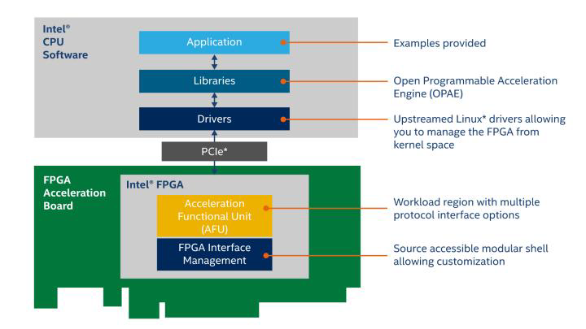
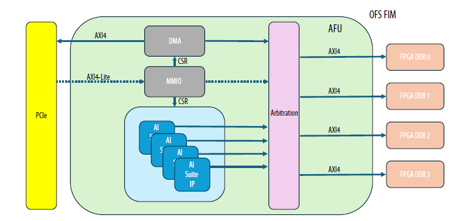

# 1.0 FPGA AI Suite OFS System Example Design


# 4.0 Getting Started with Open FPGA Stack (OFS) for PCIe-Attach Design Examples

Before starting with the FPGA AI Suite OFS for PCIe-attach design example, ensure that you have followed all the installation instructions for the FPGA AI Suite compiler and IP generation tools and completed the design example prerequisites as provided in the [FPGA AI Suite Handbook](https://docs.altera.com/r/docs/863373/2026.1.1/fpga-ai-suite-handbook/installing-the-fpga-ai-suite-compiler-and-ip-generation-tools).

The FPGA AI Suite Open FPGA Stack (OFS) for PCIe-attach design examples demonstrate the design and implementation for accelerating AI inference using the FPGA AI Suite, Intel Distribution of OpenVINO toolkit, and boards that support Agilex 7 PCIe Attach OFS:

* Agilex 7 FPGA I-Series Development Kit ES2 (DK-DEV-AGI027RBES)
* Intel FPGA SmartNIC N6001-PL Platform (without Ethernet controller)

**Tip:** N6001-PL SmartNIC boards are available through ODM partners. For more information, including ordering information, refer to the [SmartNIC N6000-PL product brief](https://docs.altera.com/api/khub/documents/4c0HlWPvaz6Rhe_DtpE2pg/content).

Use this document to help you understand how to create the OFS for PCIe-attach design example with the targeted FPGA AI Suite architecture and number of instances and compiling the design for use with the Intel FPGA Basic Building Blocks (BBBs) system.


## Open FPGA Stack (OFS) Requirements

For Open FPGA Stack (OFS) support, ensure that you have completed the OFS installation and configuration for your board, including the Open Programmable Acceleration Engine (OPAE) and Device Feature List (DFL) as outlined in the [Agilex 7 PCIe Attach OFS Workload Development Guide](https://ofs.github.io/ofs-2025.1-1/hw/common/user_guides/afu_dev/ug_dev_afu_ofs_agx7_pcie_attach/ug_dev_afu_ofs_agx7_pcie_attach/).

Additionally, you might need additional environment configuration such as development permissions such as those provided in the [setup_permissions.sh](https://github.com/OFS/oneapi-asp/blob/5ed1c74a774f014cbd1b854150376bf788f3ac1c/common/linux64/libexec/setup_permissions.sh) script provided by the [oneAPI Accelerator Support Package (ASP)](https://github.com/OFS/oneapi-asp/blob/5ed1c74a774f014cbd1b854150376bf788f3ac1c/common/linux64/libexec/setup_permissions.sh).

## Additional Agilex 7 FPGA I-Series Development Kit Configuration

For the Agilex 7 FPGA I-Series Development Kit, the development kit provides a single 16 GB DIMM that you must replace with two 8 GB DIMMs in the board DIMM Sockets.

This design example was developed and tested to work with the following DIMMs:

* Micron MTA8ATF1G64AZ-2G6E1
* Hynix HMA81GU6JJR8N-VK

### Related Information

* [Agilex 7 PCIe Attach OFS documentation](https://ofs.github.io/ofs-2025.1-1/hw/doc_modules/contents_agx7_pcie_attach/)
* [Agilex 7 PCIe Attach OFS Workload Development Guide](https://ofs.github.io/ofs-2025.1-1/hw/common/user_guides/afu_dev/ug_dev_afu_ofs_agx7_pcie_attach/ug_dev_afu_ofs_agx7_pcie_attach/)

## 4.1 Building the FPGA AI Suite Runtime

The FPGA AI Suite OFS for PCIe Attach design example `runtime` directory contains the source code for the OpenVINO plugins and the `dla_benchmark` program. The CMake tool manages the overall build flow to build the FPGA AI Suite runtime plugin.

### 4.1.1 CMake Targets

The top level CMake build target is the FPGA AI Suite runtime plugin shared library, `libcoreDLARuntimePlugin.so`. It will not be built if the target is the software reference. Details on how to target one of the example design boards or the software emulation are specified in [OFS-PCIE](#412-build-options) Build Options. The source files used to build the libcoreDLARuntimePlugin.so target are located under the following directories:

* `runtime/plugin/src/`
* `runtime/coredla_device/src/`

The flow also builds additional targets as dependencies for the top-level target. The most significant additional targets are as follows:

* The Input and Output Layout Transform library, `libdliaPluginIOTransformations.a`. The sources for this target are under `runtime/plugin/io_transformations/`.

### 4.1.2 Build Options

To build the runtime for the OFS for PCIe Attach design example:

1. Ensure that you have created a working directory as described in "Creating a Working Directory" in the [FPGA AI Suite Getting Started Guide](https://docs.altera.com/r/docs/863373/2026.1.1/fpga-ai-suite-handbook/fpga-ai-suite-handbook).

2. Ensure that the `OPAE_SDK_ROOT` environment variable is set in your build environment. For example, `export OPAE_SDK_ROOT=/usr/`.

3. Run one of the following sets of commands to build the runtime, depending on your Agilex 7 PCIe Attach OFS board:

   * Agilex 7 FPGA I-Series Development Kit
     ```bash
     cd $COREDLA_WORK/runtime
     ./build_runtime.sh -target_agx7_i_dk
     ```

   * Intel FPGA SmartNIC N6001-PL Platform
     ```bash
     cd $COREDLA_WORK/runtime
     ./build_runtime.sh -target_agx7_n6001
     ```

For other `build_runtime.sh` options, refer to [Build Options](#412-build-options).

FPGA AI Suite hardware is compiled to include one or more IP instances, with the same architecture for all instances. Each instance accesses data from a unique bank of DDR.

The Agilex 7 FPGA I-Series Development Kit and Intel FPGA SmartNIC N6001-PL Platform both have four DDR banks (two onboard and two DIMM slots) and support up to four FPGA AI Suite IP instances. Install the required DIMMs into each slot that is used. For example, to support four FPGA AI Suite IP instances, you must have both DIMM slots fitted with 8 GB DIMMs. To support two FPGA AI Suite IP instances, you must have the first DIMM slot fitted with an 8GB DIMM.

The four DDR banks are ordered as follows:

1. Onboard DDR 0
2. DIMM slot 0
3. Onboard DDR 1
4. DIMM slot 1

Each DIMM slot can support two FPGA AI Suite IP instances.

The runtime automatically adapts to the correct number of instances.

If the FPGA AI Suite runtime uses two or more instances, then the image batches are divided between the instances to execute two or more batches in parallel on the FPGA device.

## 4.2 Running the Design Example Demonstration Applications

This section describes the steps to run the demonstration application and perform accelerated inference using the OFS for PCIe attach design example.

### 4.2.1 Setup the OFS Environment for the FPGA Device

Before you can program the FPGA device with the OFS for PCIe attach design example, you must set up the FPGA device with the OFS framework components and ensure that the OPAE drivers on the host system run correctly.

These steps must be done whenever the system hosting the FPGA board is power-cycled or soft-rebooted.

To set up the FPGA device:

1. Ensure that the PCIe bifurcation BIOS setting on the host machine that hosts the FPGA card is set as follows, depending on the target board:

   * Agilex 7 FPGA I-Series Development Kit: x8
   * Intel FPGA SmartNIC N6001-PL Platform: Auto

2. Program the FPGA devices with the `.sof` file for the OFS 2025.1-1 slim FIM for your board:

   * Agilex 7 FPGA I-Series Development Kit: [https://github.com/OFS/ofs-agx7-pcie-attach/releases/download/ofs-2025.1-1/iseries-dk-slimfim-images_ofs-2025-1-1.tar.gz](https://github.com/OFS/ofs-agx7-pcie-attach/releases/download/ofs-2025.1-1/iseries-dk-slimfim-images_ofs-2025-1-1.tar.gz)
   * Intel FPGA SmartNIC N6001-PL Platform: [https://github.com/OFS/ofs-agx7-pcie-attach/releases/download/ofs-2025.1-1/n6001-slimfim-images_ofs-2025-1-1.tar.gz](https://github.com/OFS/ofs-agx7-pcie-attach/releases/download/ofs-2025.1-1/n6001-slimfim-images_ofs-2025-1-1.tar.gz)

   Program the FPGA with the following command:
   ```bash
   quartus_pgm -c 1 -m jtag \
   -o "p;<path to the sof file>/ofs_top.sof@1"
   ```

3. Soft-reboot the machine with the following command:
   ```bash
   sudo reboot
   ```

   A soft reboot is required whenever you program the FPGA with a `.sof` file (SRAM object file) so that the PCIe host can re-enumerate the attached devices. A hard reboot or power cycle would require you to reprogram the FPGA device with the earlier command.

4. If you want to use a non-root user to run inference on the FPGA board, complete the following steps:

   1. Set user process resource limits as follows:

      1. Create a rule file at `/etc/security/limits.d/90-intel-fpga-ofs-limits.conf` with the following content:
         ```
         soft memlock unlimited
         hard memlock unlimited
         ```

      2. Log out of your current session and log back in.

      3. Run the `ulimit -l` command to ensure that limits are set to `unlimited`.

   2. Enable huge pages help improve the performance of DMA operations between host and FPGA device. Enable huge pages as follows:

      1. Create a rule file at `/etc/sysctl.d/intel-fpga-ofs-sysctl.conf` with the following content:
         ```
         vm.nr_hugepages = 2048
         ```

      2. Create a rule file at `/sys/kernel/mm/hugepages/hugepages-2048kB/nr_hugepages` with the following content:
          ```
          2048
          ```

   3. Set the permissions for the OFS device feature list (DFL) framework as follows:

      1. Create a rule file at `/etc/udev/rules.d` named `90-intel-fpga-ofs.rules` with the following content:
         ```
         KERNEL=="dfl-fme.[0-9]", ACTION=="add|change", GROUP="root", MODE="0666", RUN+="/bin/bash -c 'chmod 0666 %S%p/errors/ /dev/%k'"
         KERNEL=="dfl-port.[0-9]", ACTION=="add|change", GROUP="root", MODE="0666", RUN+="/bin/bash -c 'chmod 0666 %S%p/dfl/userclk/frequency %S%p/errors/* /dev/%k'"
         ```

         Ensure you enter the content as two lines only. The lines are line-wrapped only due to document formatting restrictions.

      2. Run the following commands:
          ```bash
          sudo udevadm control --reload
          sudo udevadm trigger /dev/dfl-fme.0
          sudo udevadm trigger /dev/dfl-port.0
          ```

   4. Set the permissions for userspace I/O (UIO) devices as follows:

      1. Create a rule file at `/etc/udev/rules.d` named `uio.rules` with the following content:
         ```
         SUBSYSTEM=="uio" KERNEL=="uio*" MODE="0666"
         ```

      2. Run the following commands:
          ```bash
          sudo udevadm control --reload
          sudo udevadm trigger --subsystem-match=uio --settle
          ```

   5. Initialize the OPAE SDK.

      You must initialize the OPAE SDK after every system power cycle or soft reboot. You can make this initialization persistent by using a `systemd` startup service.

      To initialize the OPAE SDK:

      1. Determine the PCIe B:d.F (system, bus, device, function) of your board by running the `fpgainfo` command:
         ```bash
         sudo fpgainfo fme
         ```

         In the output, look for a line similar to the following line:
         ```
         PCIe s:b:d.f : 0000:03:00.0
         ```

      2. (For Agilex 7 FPGA I-Series Development Kit only) Assign the first SR-IOF virtual function to the FPGA board with the following command:
          ```bash
          sudo pci_device s:b:d.f vf 1
          ```

      3. Initialize opae.io with the following command:
           ```bash
           sudo opae.io init -d s:b:d.1 <your user name>
           ```

           Note: The original function (f in s:b:d.f) value that the `fpgainfo` command reported is replaced here by 1.

5. Ensure that the `OPAE_PLATFORM_ROOT` environment variable points to your OFS FPGA interface manager (FIM) `pr_build_template` directory.

### 4.2.2 Exporting Trained Graphs from Source Frameworks

Before running any demonstration application, you must convert the trained model to the Inference Engine format (`.xml`, `.bin`) with the OpenVINO Model Optimizer.

For details on creating the `.bin`/`.xml` files, refer to the [FPGA AI Suite Handbook](https://docs.altera.com/r/docs/863373/2026.1.1/fpga-ai-suite-handbook/exporting-trained-graphs-from-source-frameworks).

### 4.2.3 Compiling Exported Graphs Through the FPGA AI Suite

The network as described in the `.xml` and `.bin` files (created by the Model Optimizer) is compiled for a specific FPGA AI Suite architecture file by using the FPGA AI Suite compiler.

The FPGA AI Suite compiler compiles the network and exports it to a `.bin` file that uses the same `.bin` format as required by the OpenVINO Inference Engine.

This `.bin` file created by the compiler contains the compiled network parameters for all the target devices (FPGA, CPU, or both) along with the weights and biases. The inference application imports this file at runtime.

The FPGA AI Suite compiler can also compile the graph and provide estimated area or performance metrics for a given architecture file or produce an optimized architecture file.

For more details about the FPGA AI Suite compiler, refer to the [FPGA AI Suite Handbook](https://docs.altera.com/r/docs/863373/2026.1.1/fpga-ai-suite-handbook/compiling-your-model-with-the-fpga-ai-suite-compiler).

### 4.2.4 Compiling the OFS for PCIe Attach Design Example

To build example design bitstreams, you must have a license that permits bitstream generation for the IP, and have the correct version of Quartus Prime software installed.

Use the `dla_build_example_design.py` utility to create a bitstream.

For details about this command, the steps it performs, and advanced command options, refer to The [dla_build_example_design.py](#311-the-dla_build_example_designpy-command) Command and to the [FPGA AI Suite Handbook](https://docs.altera.com/r/docs/863373/2026.1.1/fpga-ai-suite-handbook/the-dla_build_example_design-command).

Before running the `dla_build_example_design.py` utility, ensure that the `OPAE_PLATFORM_ROOT` environment variable points to your OFS FPGA interface manager (FIM) `pr_build_template` directory. If you do not want to compile your own FIM, you can get prebuilt OFS FIM binaries for boards supported by the Agilex 7 OFS for PCIe Attach reference shells on GitHub at the following URL:
```bash
https://github.com/OFS/ofs-agx7-pcie-attach/releases/
```

The FPGA AI Suite OFS for PCIe Attach design example is based on the OFS 2025.1-1 release of the reference shells.

The `dla_build_example_design.py` utility generates a wrapper that wraps one or more FPGA AI Suite IP instances along with adapters required to connect to the OFS slim FIM.

**Important:** The OFS FIM uses FPGA resources as well as the FPGA AI Suite IP instances. Keep the FPGA resource limitations in mind when deciding on how many FPGA AI Suite IP instances to use.

Get an estimate of the FPGA resource required for a single FPGA AI Suite IP instance by using the `--fanalyze-area` option of the `dla_compiler`. Use the single instance values to determine the resources required for the number of instances that you want. For more details, see the `--fanalyze-area` option description in [FPGA AI Suite Compiler Reference Manual](https://docs.altera.com/r/docs/863373/2026.1.1/fpga-ai-suite-handbook/analyzer-tool-options-dla_compiler-command-options).

To generate an FPGA bitstream for the OFS for PCIe Attach design example for the Agilex 7 FPGA I-Series Development Kit with two FPGA AI Suite IP instances, run the following commands:

```bash
cd $COREDLA_WORK
dla_build_example_design.py build \
--output-dir build_generic_2inst \
--seed 1 \
--num-instances 2
agx7_iseries_ofs_pcie \
$COREDLA_ROOT/example_architectures/AGX7_Generic.arch \
```

This command generates a green bitstream (GBS) file called `AGX7_Generic.gbs` that can be found in the `$COREDLA_WORK/build_generics_2inst/` folder.

### 4.2.5 Programming the FPGA Green Bitstream

Program the FPGA AI Suite design example green bitstream (.gbs) to the devices with the following command:

```bash
fpgaconf -V <path_to_design_example_green_bitstream(.gbs)_file>
```

For example, to program the FPGA device with the green bitstream file generated by the earlier example command, run the following command:

```bash
fpgaconf -V $COREDLA_WORK/build_generics_2inst/AGX7_Generic.gbs
```

### 4.2.6 Performing Accelerated Inference with the dla_benchmark application

You can use the `dla_benchmark` demonstration application included with the FPGA AI Suite runtime to benchmark the performance of image classification networks.

#### 4.2.6.1 Inference on Image Classification Graphs

The demonstration application requires the OpenVINO device flag to be either `HETERO:FPGA,CPU` for heterogeneous execution or `HETERO:FPGA` for FPGA-only execution.

The `dla_benchmark` demonstration application runs five inference requests (batches) in parallel on the FPGA, by default, to achieve optimal system performance. To measure steady state performance, you should run multiple batches (using the niter flag) because the first iteration is significantly slower with FPGA devices.

The `dla_benchmark` demonstration application also supports multiple graphs in the same execution. You can place more than one graphs or compiled graphs as input, separated by commas.

Each graph can have either a different input dataset or use a commonly shared dataset among all graphs. Each graph requires an individual `ground_truth_file` file, separated by commas. If some `ground_truth_file` files are missing, the `dla_benchmark` continues to run and ignore the missing ones.

When multi-graph is enabled, the `-niter` flag represents the number of iterations for each graph, so the total number of iterations becomes `-niter` × *number of graphs*.

The `dla_benchmark` demonstration application switches graphs after submitting `-nireq` requests. The request queue holds the number of requests up to `-nireq` × *number of graphs*. This limit is constrained by the DMA CSR descriptor queue size (64 per hardware instance).

The board you use determines the number of instances that you can compile the FPGA AI Suite hardware for. For the Agilex 7 FPGA I-Series Development Kit and Intel FPGA SmartNIC N6001-PL Platform, you can compile up to four instances with the same architecture on all instances. Some large architecture might not fit on the board for four instances, such as `AGX7_Performance_Giant`.

Each instance accesses one of the DDR banks on the board and executes the graph independently. This optimization enables multiple batches to run in parallel, limited by the number of DDR banks available. Each inference request created by the demonstration application is assigned to one of the instances in the FPGA plugin.

To enable memory-mapped device (MMD) debug messages when you run the `dla_benchmark` demonstration application. set the `MMD_ENABLE_DEBUG` environment variable as follows:

```
MMD_ENABLE_DEBUG=1
```

Also, you can test full DDR write and read back functionality when the `dla_benchmark` demonstration application runs by setting the `COREDLA_RUNTIME_MEMORY_TEST` environment variable as follows:

```
COREDLA_RUNTIME_MEMORY_TEST=1
```

To ensure that batches are evenly distributed between the instances, you must choose an inference request batch size that is a multiple of the number of FPGA AI Suite instances. For example, with two instances, specify the batch size as six (instead of the OpenVINO default of five) to ensure that the experiment meets this requirement.

The example usage that follows has the following assumptions:

* A Model Optimizer IR `.xml` file is in `demo/models/public/resnet-50-tf/FP32/`
* An image set is in `demo/sample_images/`
* The board is programmed with a bitstream that corresponds to `AGX7_Performance.arch`

```bash
binxml=$COREDLA_ROOT/demo/models/public/resnet-50-tf/FP32

imgdir=$COREDLA_ROOT/demo/sample_images

cd $COREDLA_ROOT/runtime/build_Release

./dla_benchmark/dla_benchmark \
-b=1 \
-m $binxml/resnet-50-tf.xml \
-d=HETERO:FPGA,CPU \
-i $imgdir \
-niter=4 \
-plugins ./plugins.xml \
-arch_file $COREDLA_ROOT/example_architectures/AGX7_Performance.arch \
-api=async \
-groundtruth_loc $imgdir/TF_ground_truth.txt \
-perf_est \
-nireq=8 \
-bgr
```

#### 4.2.6.2 Inference on Object Detection Graphs

To enable the accuracy checking routine for object detection graphs, you can use the `-enable_object_detection_ap=1` flag.

This flag lets the `dla_benchmark` calculate the mAP and COCO AP for object detection graphs. Besides, you need to specify the version of the YOLO graph that you provide to the `dla_benchmark` through the `–yolo_version `flag. Currently, this routine is known to work with YOLOv3 (graph version is yolo-v3-tf) and TinyYOLOv3 (graph version is yolo-v3-tiny-tf).

##### 4.2.6.2.1 The mAP and COCO AP Metrics

Average precision and average recall are averaged over multiple Intersection over Union (IoU) values.

Two metrics are used for accuracy evaluation in the dla_benchmark application. The mean average precision (mAP) is the challenge metric for PASCAL VOC. The mAP value is averaged over all 80 categories using a single IoU threshold of 0.5. The COCO AP is the primary challenge for object detection in the Common Objects in Context contest. The COCO AP value uses 10 IoU thresholds of .50:.05:.95. Averaging over multiple IoUs rewards detectors with better localization.

##### 4.2.6.2.2 Specifying Ground Truth

The path to the ground truth files is specified by the flag `–groundtruth_loc`.

The validation dataset is available on the COCO official website.

The `dla_benchmark` application currently allows only plain text ground truth files. To convert the downloaded JSON annotation file to plain text, use the `convert_annotations.py` script.

##### 4.2.6.2.3 Example of Inference on Object Detection Graphs

The example that follows makes the following assumptions:

* The Model Optimizer IR `graph.xml` for either YOLOv3 or TinyYOLOv3 is in the current working directory.

Model Optimizer generates an FP32 version and an FP16 version. Use the FP32 version.

* The validation images downloaded from the COCO website are placed in the `./mscoco-images` directory.

* The JSON annotation file is downloaded and unzipped in the current directory.

To compute the accuracy scores on many images, you can usually increase the number of iterations using the flag `-niter` instead of a large batch size `-b`. The product of the batch size and the number of iterations should be *less than or equal to* the number of images that you provide.

```bash
cd $COREDLA_ROOT/runtime/build_Release

python ./convert_annotations.py ./instances_val2017.json \
./groundtruth
./dla_benchmark/dla_benchmark \
-b=1 \
-niter=5000 \
-m=./graph.xml \
-d=HETERO:FPGA,CPU \
-i=./mscoco-images \
-plugins=./plugins.xml \
-arch_file=../../example_architectures/AGX7_Performance.arch \
-yolo_version=yolo-v3-tf \
-api=async \
-groundtruth_loc=./groundtruth \
-nireq=8 \
-enable_object_detection_ap \
-perf_est \
-bgr
```

#### 4.2.6.3 Additional `dla_benchmark` Options

The `dla_benchmark` tool is part of the example design and the distributed runtime includes full source code for the tool.

**Table 7. Command Line dla_benchmark Options**

| Command Option | Description |
|----------------|-------------|
| -nireq=<N\> | This option controls the number of simultaneous inference requests that are sent to the FPGA. Typically, this should be at least twice the number of IP instances; this ensures that each IP can execute one inference request while `dla_benchmark` loads the feature data for a second inference request to the FPGA-attached DDR memory. |
| -b=<N\> --batch-size=<N\> | This option controls the batch size. A batch size greater than 1 is created by repeating configuration data for multiple copies of the graph. A batch size of 1 is typically best for latency System throughput for small graphs, when inference operations are offloaded from a CPU to an FPGA, may improve by using a batch greater than 1. On very small graphs, IP throughput may also improve when using a batch greater than 1. The default value is 1. |
| -niter=<N\> | Number of batches to run. Each batch has a size specified by the `--batch-size` option. The total number of images processed is the product of the `--batch-size` option value multiplied by the -niter option value. |
| -d=<STRING\> | Using `-d=HETERO:FPGA`, CPU causes `dla_benchmark` to use the OpenVINO heterogeneous plugin to execute inference on the FPGA, with fallback to the CPU for any layers that cannot go to the FPGA. Using `-d=HETERO:CPU` or `-d=CPU` executes inference on the CPU, which may be useful for testing the flow when an FPGA is not available. Using `-d=HETERO:FPGA` may be useful for ensuring that all graph layers are accelerated on the FPGA (and an error is issued if this is not possible). |
| -arch_file=<FILE\> --arch=<FILE\> | This specifies the location of the `.arch` file that was used to configure the IP on the FPGA. The `dla_benchmark` will issue an error if this does not match the.arch file used to generate the IP on the FPGA. |
| -m=<FILE\> --network_file=<FILE\> | This points to the XML file from OpenVINO Model Optimizer that describes the graph. The BIN file from Model Optimizer must be kept in the same directory and same filename (except for the file extension) as the XML file. |
| -i=<DIRECTORY\> | This points to the directory containing the input images. Each input file corresponds to one inference request. The files are read in order sorted by filename; set the environment variable `VERBOSE=1` to see details describing the file order. |
| -api=[sync\|async] | The `-api=async` option allows `dla_benchmark` to fully take advantage of multithreading to improve performance. The `-api=sync` option may be used during debug. |
| -groundtruth_loc=<FILE\> | Location of the file with ground truth data. If not provided, then `dla_benchmark` will not evaluate accuracy. This may contain classification data or object detection data, depending on the graph. |
| -yolo_version=<STRING\> | This option is used when evaluating the accuracy of a YOLOv3 or TinyYOLOv3 object detection graph. The options are `yolo-v3-tf` and `yolo-v3-tiny-tf`. |
| -enable_object_detection_ap | This option may be used with an object detection graph (YOLOv3 or TinyYOLOv3) to calculate the object detection accuracy. |
| -bgr | When used, this flag indicates that the graph expects input image channel data to use BGR order. |
| -plugins_xml_file=<FILE\> | Deprecated: This option is deprecated and will be removed in a future release. Use the `-plugins` option instead. This option specifies the location of the file specifying the OpenVINO plugins to use. This should be set to `$COREDLA_ROOT/runtime/plugins.xml` in most cases. If you are porting the design to a new host or doing other development, it may be necessary to use a different value. |
| -plugins=<FILE\> | This option specifies the location of the file that specifies the OpenVINO plugins to use. The default behavior is to read the `plugins.xml` file from the `runtime/` directory. This runs inference on the FPGA device. If you want to run inference using the emulation model, specify `-plugins=emulation`. If you are porting the design to a new host or doing other development, you might need to use a different value. |
| -mean_values=<input_name[mean_values]\> | Uses channel-specific mean values in input tensor creation through the following formula: input − mean scale. The Model Optimizer mean values are the preferred choice and the mean values defined by this option serve as fallback values. |
| -scale_values=<input_name[scale_values]\> | Uses channel-specific scale values in input tensor creation through the following formula: input − mean scale. The Model Optimizer scale values are the preferred choice and the scale values defined by this option serve as fallback values. |
| -pc | This option reports the performance counters for the CPU subgraphs, if there is any. No sorting is done on the report. |
| -pcsort=[sort\|no_sort\|simple_sort] | This option reports the performance counters for the CPU subgraph and sets the sorting option for the performance counter report. **sort**: Report is sorted by operation time cost **no_sort:** Report is not sorted **simple_sort:** Report is sorted by opts time cost but print only executed operations |
| -save_run_summary | Collect performance metrics during inference. These metrics can help you determine how efficient an architecture is at executing a model. For more information, refer to the `dla_benchmark` [Performance Metrics](#4264-the-dla_benchmark-performance-metrics). |

#### 4.2.6.4 The `dla_benchmark` Performance Metrics

The `-save_run_summary` option makes the `dla_benchmark` demonstration application collect performance metrics during inference. These metrics can help you determine how efficient an architecture is at executing a model.

Note: The `dla_benchmark` application provides throughput in "frames per second". The time per frame (latency) is 1/throughput.

| Statistic | Description |
|-----------|-------------|
| Count | The number of times interference was performed. This is set by the `-niter` option. |
| System duration | The total time between when the first inference request was made to when the last request was finished, as measured by the host program. |
| IP duration | The total time the spent-on inference. This is reported by the IP on the FPGA. |
| Latency | The median time of all inference requests made by the host. This includes any overhead from OpenVINO or the FPGA AI Suite runtime. |
| System throughput | The total throughput of the system, including any OpenVINO or FPGA AI Suite runtime overhead. |
| Number of hardware instances | The number of IP instances on the FPGA. |
| Number of network instances | The number graphs that the IP processes in parallel. |
| IP throughput per instance | The throughput of a single IP instance. This is reported by the IP on the FPGA. |
| IP throughput per f<sub>MAX</sub> per instance | The **IP throughput per instance** value scaled by the **IP clock frequency** value. |
| IP clock frequency | The clock frequency, as reported by the IP running on the FPGA device. The `dla_benchmark` application treats this value as the IP core f<sub>MAX</sub> value. |
| Estimated IP throughput per instance | The estimated per-IP throughput, as estimated by the `dla_compiler` command with the `--fanalyze-performance` option. |
| Estimated IP throughput per f<sub>MAX</sub> per instance | The Estimated IP throughput per instance value scaled by the compiler f<sub>MAX</sub> estimate. |

##### 8.2.6.4.1 Interpreting System Throughput and Latency Metrics

The **System throughput** and **Latency** metrics are measured by the host through the OpenVINO API. These measurements include any overhead that is incurred by both the API and the FPGA AI Suite runtime. They also account for any time spent waiting to make inference requests and the number of available instances.

In general, the system throughput is defined as follows:

```
System Throughput = Batch Size × Images per Batch
                    -----------------------------
                    Latency
```

The **Batch Size** and **Images Per Batch** values are set by the `--batch-size` and `-niter` options, respectively.

For example, consider when `-nireq=1` and there is a single IP instance. The **System** throughput value is approximately the same as the **IP-reported throughput** value because the runtime can perform only one inference at a time. However, if both the `-nireq` and the number of IP instances is greater than one, the runtime can perform requests in parallel. As such, the total system throughput is greater than the individual IP throughput.

In general, the `-nireq` value should be twice the number of IP instances. This setting enables the FPGA AI Suite runtime to pipeline inferences requests, which allows the host to prepare the data for the next request while an IP instance is processing the previous request.

# 5.0 Design Example Components

## 5.1 Hardware Components

The FPGA AI Suite OFS for PCIe attach design example is based on OFS (Open FPGA Stack). The following diagram shows a high-level view of a typical OFS system/A software stack runs on the host CPU (applications, OFS libraries, FPGA drivers) that connects via a PCIe connection to an FPGA board.



The design example hardware implementation, sits in the AFU (acceleration functional unit) region and uses the OFS FIM (FPGA interface manager) to connect to both the host CPU via a PCIe connection and also to the on-board DDR4 memory.

For more information about OFS, refer to the [Open FPGA Stack (OFS) documentation](https://ofs.github.io/ofs-2025.1-1/).

The Agilex 7 FPGA I-Series Development Kit has four banks of DDR4 memory on board: two banks are soldered-on 8 GB of DDR4 memory each, two banks are DIMM slots for DDR4 DIMMs. For the design example, the DIMMs must also be 8GB in size each to match the soldered DDR4 memories. Larger size memories are currently not supported.

The Intel FPGA SmartNIC N6001-PL Platform has four banks of DD4 memory on board. All banks are soldered-on 4 GB DDR4 DIMMs.

The following diagram shows how the OFS for PCIe attach design example is implemented within the OFS AFU:



The OFS FIM provides the following external interfaces:

* Towards the host CPU via the PCIe connection two interfaces are exposed:
  * A high-throughput AXI4 agent that initiates reads and writes from the FPGA fabric over the PCIe connection to the host CPU memory that is used by the DMA controller.
  * An AXI4-Lite host so that initiates reads and writes from the host CPU to the FPGA fabric. This interface is used, mainly for configuring the FPGA AI Suite IP CSRs, the DMA CSR, and unaligned    MMIO accesses of the FPGA DDRs.

* Towards the on-board FPGA DDR banks.

Four AXI4 agents, each of which connects to one DDR memory bank, connect to arbitration logic to enable the following paths into the DDR memory banks:
- DMA controller to DDR
- MIMO to DDR
- FPGA AI Suite IP to DDR.

That design example has three different clock domains:

* PCIe core clock (500 MHz)
* DDR core clock (333 MHz)
* User clock (configurable, typically around 600 MHz)

At the entry from the PCIe interface to the AFU, there are clock crossers from the PCIe core clock into the DDR core clock. The DDR core clock is used in all the DMA, CSR and arbitration logic to help benefit timing closure, while always still maintaining the full bandwidth to all four FPGA DDR banks.

The FPGA AI Suite IP runs on a configurable user clock and is set accordingly after the Quartus compile to match the maximum supported frequency of the IP in its chosen configuration. Typically, this frequency is 600 MHz and above for designs with only one FPGA AI Suite IP instance and just below 600 MHz for four FPGA AI Suite IP instances.

**Caution:** The Intel FPGA SmartNIC N6001-PL Platform card is designed for its specified power budget. If a majority of the FPGA DSPs on the device are operating at 600 MHz, you can exceed this power budget. Exceeding the power budget causes the power regulators on the card to shut the card down, which renders the card invisible on the PCIe bus.

If the card shuts down in this way, the host machine issues a kernel panic (in Linux) and either freezes or reboots automatically.

If this occurs, you must reduce the target frequency of the FPGA AI Suite IP or reduce the number of FPGA AI Suite IP instances in your instantiation of the design example.

## 9.2 Software Components

The OFS for PCIe attach design example contains a sample software stack for the runtime flow. For details about the sample software stack, refer to [Design Example Software Components](#50-design-example-components).