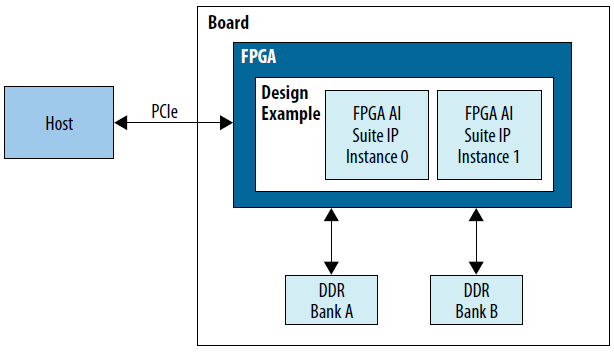
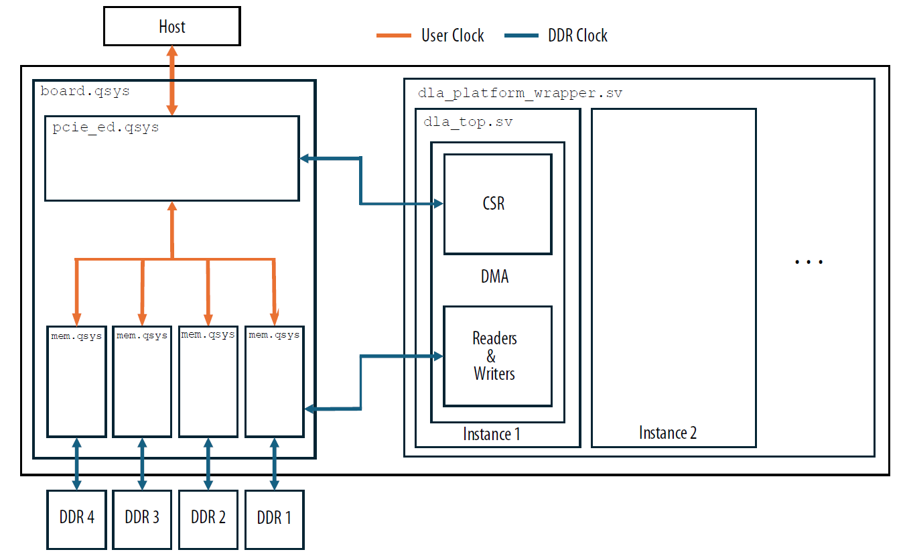
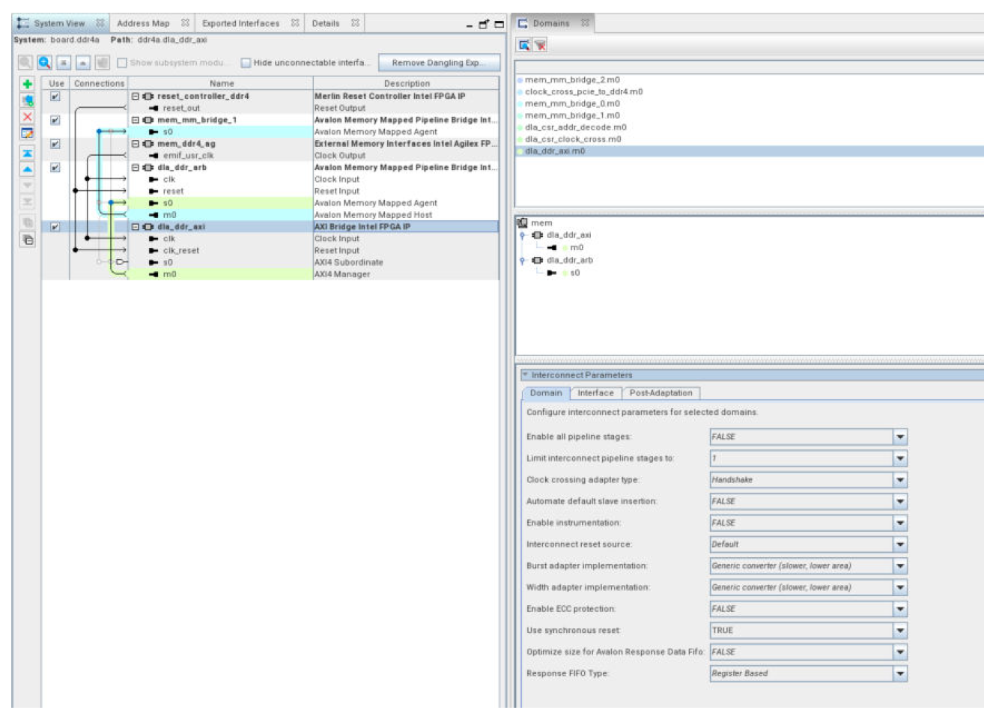

# 1.0 FPGA AI Suite PCIe-based System Example Design


# 4.0 Getting Started with the FPGA AI Suite PCIe-based Design Example

Before starting with the FPGA AI Suite PCIe-based Design Example, ensure that you have followed all the installation instructions for the FPGA AI Suite compiler and IP generation tools and completed the design example prerequisites as provided in the [FPGA AI Suite Handbook](https://docs.altera.com/r/docs/863373/2026.1.1/fpga-ai-suite-handbook/installing-the-fpga-ai-suite-compiler-and-ip-generation-tools).

The FPGA AI Suite PCIe-attach design example (sometimes referred to as the *PCIe-based design example*) demonstrates how the Intel Distribution of OpenVINO toolkit and the FPGA AI Suite support the look-aside deep learning acceleration model.

The PCIe-attach design example is implemented with the following components:

* FPGA AI Suite IP
* Intel Distribution of OpenVINO toolkit
* Terasic DE10-Agilex Development Board
* Sample hardware and software systems that illustrate the use of these components

This design example includes prebuilt FPGA bitstreams that correspond to preoptimized architecture files. However, the design example build scripts let you choose from a variety of architecture files and build (or rebuild) your own bitstreams, provided that you have a license permitting bitstream generation.

This design is provided with the FPGA AI Suite as an example showing how to incorporate the IP into a design. This design is not intended for unaltered use in production scenarios. Any potential production application that uses portions of this example design must review them for both robustness and security.


# 5.0 Building the FPGA AI Suite Runtime

The FPGA AI Suite PCIe-based Design Example runtime directory contains the source code for the OpenVINO plugins and customized versions of the following OpenVINO programs:

* `dla_benchmark`
* `classification_sample_async`
* `object_detection_demo_yolov3_async`
* `segmentation_demo`

The CMake tool manages the overall build flow to build the FPGA AI Suite runtime plugin.

## 5.1 CMake Targets

The top level CMake build target is the FPGA AI Suite runtime plugin shared library, `libcoreDLARuntimePlugin.so`. It will not be built if the target is the software reference. Details on how to target one of the example design boards or the software emulation are specified in  [Build Options](#52-build-options). The source files used to build the `libcoreDLARuntimePlugin.so` target are located under the following directories:

* `runtime/plugin/src/`
* `runtime/coredla_device/src/`

The flow also builds additional targets as dependencies for the top-level target. The most significant additional targets are as follows:

* The Input and Output Layout Transform library, `libdliaPluginIOTransformations.a`. The sources for this target are under `runtime/plugin/io_transformations/`.

## 5.2 Build Options

The runtime folder in the design example package contains a script to build the runtime called `build_runtime.sh`.

Issue the following command to run the script:

```
./build_runtime.sh <command_line_options>
```

Where \<command_line_options\> are defined in the following table:

### **Table 1: Command Line Options for the `build_runtime.sh` Script**

| Command | Description |
|---------|-------------|
| -h | --help | Show usage details |
| --cmake_debug | Call cmake with a debug flag |
| --verbosity=<number\> | Large numbers add some extra verbosity |
| --build_dir=<path\> | Directory where the runtime build should be placed |
| --disable_jit | If this flag is specified, then the runtime will only support the Ahead of Time mode. The runtime will not link to the precompiled compiler libraries. Use this mode when trying to compile the runtime on an unsupported operating system. |
| --build_demo | Adds several OpenVINO demo applications to the runtime build. The demo applications are in subdirectories of the `runtime/directory`. |
| --target_de10_agilex | Target the Terasic DE10-Agilex Development Board. |
| --target_emulation | Target the software emulator model. Specify this option to build the runtime without a board installed. Inference requests are executed by the software emulator model of the FPGA AI Suite IP. |
| --aot_splitter_example | Builds the AOT splitter example utility for the selected target (Terasic DE10-Agilex Development Board). This option builds an AOT file for a model, splits the AOT file into its constituent components (weights, overlay instructions, etc), and the builds a small utility that loads the model and a single image onto the target FPGA board without using OpenVINO. You must set the `$AOT_SPLITTER_EXAMPLE_MODEL` and `$AOT_SPLITTER_EXAMPLE_INPUT` environment variables correctly. For details, refer to ["FPGA AI Suite Ahead-of-Time (AOT) Splitter Utility Example Application" in FPGA AI Suite Handbook](https://docs.altera.com/r/docs/863373/2026.1.1/fpga-ai-suite-handbook/fpga-ai-suite-ahead-of-time-aot-splitter-utility-example-application). |

The FPGA AI Suite runtime plugin is built in release mode by default. To enable debug mode, you must specify the `--cmake_debug` option of the script command.

The `-no_make` option skips the final call to the make command. You can make this call manually instead.

FPGA AI Suite hardware is compiled to include one or more IP instances, with the same architecture for all instances. Each instance accesses data from a unique bank of DDR:

* The Terasic DE10-Agilex Development Board has four DDR banks and supports up to four instances.

The runtime automatically adapts to the correct number of instances.

If the FPGA AI Suite runtime uses two or more instances, then the image batches are divided between the instances to execute two or more batches in parallel on the FPGA device.

# 6.0 Running the Design Example Demonstration Applications

This section describes the steps to run the demonstration application and perform accelerated inference using the PCIe Example Design.

## 6.1 Exporting Trained Graphs from Source Frameworks

Before running any demonstration application, you must convert the trained model to the Inference Engine format (`.xml`, `.bin`) with the OpenVINO Model Optimizer.

For details on creating the `.bin`/`.xml` files, refer to the [FPGA AI Suite Handbook](https://docs.altera.com/r/docs/863373/2026.1.1/fpga-ai-suite-handbook/fpga-ai-suite-input-file-formats).

## 6.2 Compiling Exported Graphs Through the FPGA AI Suite

The network as described in the `.xml` and `.bin` files (created by the Model Optimizer) is compiled for a specific FPGA AI Suite architecture file by using the FPGA AI Suite compiler.

The FPGA AI Suite compiler compiles the network and exports it to a `.bin` file that uses the same `.bin` format as required by the OpenVINO Inference Engine.

This `.bin` file created by the compiler contains the compiled network parameters for all the target devices (FPGA, CPU, or both) along with the weights and biases. The inference application imports this file at runtime.

The FPGA AI Suite compiler can also compile the graph and provide estimated area or performance metrics for a given architecture file or produce an optimized architecture file.

For more details about the FPGA AI Suite compiler, refer to the [FPGA AI Suite Handbook](https://docs.altera.com/r/docs/863373/2026.1.1/fpga-ai-suite-handbook/compiling-your-model-with-the-fpga-ai-suite-compiler).

## 6.3 Compiling the PCIe-based Example Design

Prepackaged bitstreams are available for the PCIe Example Design. If the prepackaged bitstreams are installed, they are installed in `demo/bitstreams/`.

To build example design bitstreams, you must have a license that permits bitstream generation for the IP, and have the correct version of Quartus Prime software installed.

Use the `dla_build_example_design.py` utility to create a bitstream.

For details about this command, the steps it performs, and advanced command options, refer to The [`dla_build_example_design.py`](#311-the-dla_build_example_designpy-command) and to the [FPGA AI Suite Handbook](https://docs.altera.com/r/docs/863373/2026.1.1/fpga-ai-suite-handbook/the-dla_build_example_design-command).

## 6.4 Programming the FPGA Device (Agilex 7)

You can program the Terasic DE10-Agilex Development Board board using the `fpga_jtag_reprogram` tool.

For details, refer to ["FPGA AI Suite Quick Start Tutorial" in the FPGA AI Suite Handbook](https://docs.altera.com/r/docs/863373/2026.1.1/fpga-ai-suite-handbook/fpga-ai-suite-quick-start-tutorial).

## 6.5 Performing Accelerated Inference with the dla_benchmark Application

You can use the `dla_benchmark` demonstration application included with the FPGA AI Suite runtime to benchmark the performance of image classification networks.

### 6.5.1 Inference on Image Classification Graphs

The demonstration application requires the OpenVINO device flag to be either `HETERO:FPGA,CPU` for heterogeneous execution or `HETERO:FPGA` for FPGA-only execution.

The `dla_benchmark` demonstration application runs five inference requests (batches) in parallel on the FPGA, by default, to achieve optimal system performance. To measure steady state performance, you should run multiple batches (using the `-niter` flag) because the first iteration is significantly slower with FPGA devices.

The `dla_benchmark` demonstration application also supports multiple graphs in the same execution. You can place more than one graphs or compiled graphs as input, separated by commas.

Each graph can have either a different input dataset or use a commonly shared dataset among all graphs. Each graph requires an individual `ground_truth_file` file, separated by commas. If some `ground_truth_file` files are missing, the `dla_benchmark` continues to run and ignore the missing ones.

When multi-graph is enabled, the `-niter` flag represents the number of iterations for each graph, so the total number of iterations becomes `-niter` × number of graphs.

The `dla_benchmark` demonstration application switches graphs after submitting `-nireq` requests. The request queue holds the number of requests up to `-nireq` × number of graphs. This limit is constrained by the DMA CSR descriptor queue size (64 per hardware instance).

The board you use determines the number of instances that you can compile the FPGA AI Suite hardware for:

* For the Terasic DE10-Agilex Development Board, you can compile up to four instances with the same architecture on all instances.

Each instance accesses one of the DDR banks on the board and executes the graph independently. This optimization enables multiple batches to run in parallel, limited by the number of DDR banks available. Each inference request created by the demonstration application is assigned to one of the instances in the FPGA plugin.

To enable memory-mapped device (MMD) debug messages when you run the `dla_benchmark` demonstration application. set the `ACL_PCIE_DEBUG` environment variable as follows:

```
ACL_PCIE_DEBUG=1
```

Also, you can test full DDR write and read back functionality when the `dla_benchmark` demonstration application runs by setting the `COREDLA_RUNTIME_MEMORY_TEST` environment variable as follows:

```
COREDLA_RUNTIME_MEMORY_TEST=1
```

To ensure that batches are evenly distributed between the instances, you must choose an inference request batch size that is a multiple of the number of FPGA AI Suite instances. For example, with two instances, specify the batch size as six (instead of the OpenVINO default of five) to ensure that the experiment meets this requirement.

The example usage that follows has the following assumptions:

* A Model Optimizer IR `.xml` file is in `demo/models/public/resnet-50-tf/FP32/`
* An image set is in `demo/sample_images/`
* The board is programmed with a bitstream that corresponds to `AGX7_Performance.arch`

```bash
binxml=$COREDLA_ROOT/demo/models/public/resnet-50-tf/FP32

imgdir=$COREDLA_ROOT/demo/sample_images

cd $COREDLA_ROOT/runtime/build_Release
./dla_benchmark/dla_benchmark \
-b=1 \
-m $binxml/resnet-50-tf.xml \
-d=HETERO:FPGA,CPU \
-i $imgdir \
-niter=4 \
-plugins ./plugins.xml \
-arch_file $COREDLA_ROOT/example_architectures/AGX7_Performance.arch \
-api=async \
-groundtruth_loc $imgdir/TF_ground_truth.txt \
-perf_est \
-nireq=8 \
-bgr
```

The following example shows how the FPGA AI Suite IP can dynamically swap between graphs. This example usage assumes that another Model Optimizer IR `.xml` file has been placed in `demo/models/public/resnet-101-tf/FP32/`. It also assumes that another image set has been placed into `demo/sample_images_rn101/`. In this case, `dla_benchmark` only evaluates the classification accuracy of Resnet50 because we did not provide ground truth for the second graph (ResNet101).

```bash
binxml1=$COREDLA_ROOT/demo/models/public/resnet-50-tf/FP32

binxml2=$COREDLA_ROOT/demo/models/public/resnet-101-tf/FP32

imgdir1=$COREDLA_ROOT/demo/sample_images

imgdir2=$COREDLA_ROOT/demo/sample_images_rn101

cd $DEVELOPER_PACKAGE_ROOT/runtime/build_Release
./dla_benchmark/dla_benchmark \
-b=1 \
-m $binxml1/resnet-50-tf.xml,$binxml2/resnet-101-tf.xml \
-d=HETERO:FPGA,CPU \
-i $imgdir1,$imgdir2 \
-niter=8 \
-plugins ./plugins.xml \
-arch_file $COREDLA_ROOT/example_architectures/AGX7_Performance.arch \
-api=async \
-groundtruth_loc $imgdir1/TF_ground_truth.txt \
-perf_est \
-nireq=8 \
-bgr
```

### 6.5.2 Inference on Object Detection Graphs

To enable the accuracy checking routine for object detection graphs, you can use the `-enable_object_detection_ap=1` flag.

This flag lets the `dla_benchmark` calculate the mAP and COCO AP for object detection graphs. Besides, you need to specify the version of the YOLO graph that you provide to the `dla_benchmark` through the `–yolo_version` flag. Currently, this routine is known to work with YOLOv3 (graph version is `yolo-v3-tf`) and TinyYOLOv3 (graph version is `yolo-v3-tiny-tf`).

#### 6.5.2.1 The mAP and COCO AP Metrics

Average precision and average recall are averaged over multiple Intersection over Union (IoU) values.

Two metrics are used for accuracy evaluation in the `dla_benchmark` application. The mean average precision (mAP) is the challenge metric for PASCAL VOC. The mAP value is averaged over all 80 categories using a single IoU threshold of 0.5. The COCO AP is the primary challenge for object detection in the Common Objects in Context contest. The COCO AP value uses 10 IoU thresholds of .50:.05:.95. Averaging over multiple IoUs rewards detectors with better localization.

#### 6.5.2.2 Specifying Ground Truth

The path to the ground truth files is specified by the flag `–groundtruth_loc`.

The validation dataset is available on the [COCO official website](http://images.cocodataset.org/annotations/annotations_trainval2017.zip).

The `dla_benchmark` application currently allows only plain text ground truth files. To convert the downloaded JSON annotation file to plain text, use the `convert_annotations.py` script.

#### 6.5.2.3 Example of Inference on Object Detection Graphs

The example that follows makes the following assumptions:

* The Model Optimizer IR `graph.xml` for either YOLOv3 or TinyYOLOv3 is in the current working directory.

Model Optimizer generates an FP32 version and an FP16 version. Use the FP32 version.

* The validation images downloaded from the COCO website are placed in the `./mscoco-images` directory.

* The JSON annotation file is downloaded and unzipped in the current directory.

To compute the accuracy scores on many images, you can usually increase the number of iterations using the flag `-niter` instead of a large batch size `-b`. The product of the batch size and the number of iterations should be less than or equal to the number of images that you provide.

```bash
cd $COREDLA_ROOT/runtime/build_Release

python ./convert_annotations.py ./instances_val2017.json \
./groundtruth
./dla_benchmark/dla_benchmark \
-b=1 \
-niter=5000 \
-m=./graph.xml \
-d=HETERO:FPGA,CPU \
-i=./mscoco-images \
-plugins=./plugins.xml \
-arch_file=../../example_architectures/AGX7_Performance.arch \
-yolo_version=yolo-v3-tf \
-api=async \
-groundtruth_loc=./groundtruth \
-nireq=8 \
-enable_object_detection_ap \
-perf_est \
-bgr
```

### 6.5.3 Additional `dla_benchmark` Options

The `dla_benchmark` tool is part of the example design and the distributed runtime includes full source code for the tool.

#### **Table 2: Command Line `dla_benchmark` Options**

| Command Option | Description |
|----------------|-------------|
| -nireq=<N\> | This option controls the number of simultaneous inference requests that are sent to the FPGA. Typically, this should be at least twice the number of IP instances; this ensures that each IP can execute one inference request while `dla_benchmark` loads the feature data for a second inference request to the FPGA-attached DDR memory. |
| -b=<N\><br>--batch-size=<N\> | This option controls the batch size. A batch size greater than 1 is created by repeating configuration data for multiple copies of the graph. A batch size of 1 is typically best for latency System throughput for small graphs, when inference operations are offloaded from a CPU to an FPGA, may improve by using a batch greater than 1. On very small graphs, IP throughput may also improve when using a batch greater than 1. The default value is 1. |
| -niter=<N\> | Number of batches to run. Each batch has a size specified by the `--batch-size` option. The total number of images processed is the product of the `--batch-size` option value multiplied by the -niter option value. |
| -d=<STRING\> | Using `-d=HETERO:FPGA`, CPU causes `dla_benchmark` to use the OpenVINO heterogeneous plugin to execute inference on the FPGA, with fallback to the CPU for any layers that cannot go to the FPGA. Using `-d=HETERO:CPU` or `-d=CPU executes` inference on the CPU, which may be useful for testing the flow when an FPGA is not available. Using `-d=HETERO:FPGA` may be useful for ensuring that all graph layers are accelerated on the FPGA (and an error is issued if this is not possible). |
| -arch_file=<FILE\><br>--arch=<FILE\> | This specifies the location of the `.arch` file that was used to configure the IP on the FPGA. The `dla_benchmark` will issue an error if this does not match the.arch file used to generate the IP on the FPGA. |
| -m=<FILE\><br>--network_file=<FILE\> | This points to the XML file from OpenVINO Model Optimizer that describes the graph. The BIN file from Model Optimizer must be kept in the same directory and same filename (except for the file extension) as the XML file. |
| -i=<DIRECTORY\> | This points to the directory containing the input images. Each input file corresponds to one inference request. The files are read in order sorted by filename; set the environment variable `VERBOSE=1` to see details describing the file order. |
| -api=[sync\|async] | The `-api=async` option allows `dla_benchmark` to fully take advantage of multithreading to improve performance. The `-api=sync` option may be used during debug. |
| -groundtruth_loc=<FILE\> | Location of the file with ground truth data. If not provided, then `dla_benchmark` will not evaluate accuracy. This may contain classification data or object detection data, depending on the graph. |
| -yolo_version=<STRING\> | This option is used when evaluating the accuracy of a YOLOv3 or TinyYOLOv3 object detection graph. The options are `yolo-v3-tf` and `yolo-v3-tiny-tf`. |
| -enable_object_detection_ap | This option may be used with an object detection graph (YOLOv3 or TinyYOLOv3) to calculate the object detection accuracy. |
| -bgr | When used, this flag indicates that the graph expects input image channel data to use BGR order. |
| -plugins_xml_file=<FILE\> | *Deprecated*: This option is deprecated and will be removed in a future release. Use the `-plugins` option instead. This option specifies the location of the file specifying the OpenVINO plugins to use. This should be set to `$COREDLA_ROOT/runtime/plugins.xml` in most cases. If you are porting the design to a new host or doing other development, it may be necessary to use a different value. |
| -plugins=<FILE\> | This option specifies the location of the file that specifies the OpenVINO plugins to use. The default behavior is to read the plugins.xml file from the runtime/ directory. This runs inference on the FPGA device. If you want to run inference using the emulation model, specify `-plugins=emulation`. If you are porting the design to a new host or doing other development, you might need to use a different value. |
| -mean_values=<input_name[mean_values]\> | Uses channel-specific mean values in input tensor creation through the following formula: ((input − mean) / scale) . The Model Optimizer mean values are the preferred choice and the mean values defined by this option serve as fallback values. |
| -scale_values=<input_name[scale_values]\> | Uses channel-specific scale values in input tensor creation through the following formula: ((input − mean) / scale) . The Model Optimizer scale values are the preferred choice and the scale values defined by this option serve as fallback values. |
| -pc | This option reports the performance counters for the CPU subgraphs, if there is any. No sorting is done on the report. |
| -pcsort=[sort\|no_sort\|simple_sort] | This option reports the performance counters for the CPU subgraph and sets the sorting option for the performance counter report: * `sort`: Report is sorted by operation time cost \n* `no_sort`: Report is not sorted \n* `simple_sort`: Report is sorted by opts time cost but print only executed operations |
| -save_run_summary | Collect performance metrics during inference. These metrics can help you determine how efficient an architecture is at executing a model. For more information, refer to [The dla_benchmark Performance Metrics](#654-the-dla_benchmark-performance-metrics) |

### 6.5.4 The `dla_benchmark` Performance Metrics

The -save_run_summary option makes the `dla_benchmark` demonstration application collect performance metrics during inference. These metrics can help you determine how efficient an architecture is at executing a model.

Note: The `dla_benchmark` application provides throughput in "frames per second". The time per frame (latency) is 1/throughput.

| Statistic | Description |
|-----------|-------------|
| Count | The number of times interference was performed. This is set by the `-niter` option. |
| System duration | The total time between when the first inference request was made to when the last request was finished, as measured by the host program. |
| IP duration | The total time the spent-on inference. This is reported by the IP on the FPGA. |
| Latency | The median time of all inference requests made by the host. This includes any overhead from OpenVINO or the FPGA AI Suite runtime. |
| System throughput | The total throughput of the system, including any OpenVINO or FPGA AI Suite runtime overhead. |
| Number of hardware instances | The number of IP instances on the FPGA. |
| Number of network instances | The number graphs that the IP processes in parallel. |
| IP throughput per instance | The throughput of a single IP instance. This is reported by the IP on the FPGA. |
| IP throughput per f<sub>MAX</sub> per instance | The IP throughput per instance value scaled by the IP clock frequency value. |
| IP clock frequency | The clock frequency, as reported by the IP running on the FPGA device. The `dla_benchmark` application treats this value as the IP core f<sub>MAX</sub> value. |
| Estimated IP throughput per instance | The estimated per-IP throughput, as estimated by the `dla_compiler` command with the `--fanalyze-performance` option. |
| Estimated IP throughput per fmax per instance | The Estimated IP throughput per instance value scaled by the compiler f<sub>MAX</sub> estimate. |

#### 6.5.4.1 Interpreting System Throughput and Latency Metrics

The **System throughput** and **Latency** metrics are measured by the host through the OpenVINO API. These measurements include any overhead that is incurred by both the API and the FPGA AI Suite runtime. They also account for any time spent waiting to make inference requests and the number of available instances.

In general, the system throughput is defined as follows:

```
System Throughput = Batch Size × Images per Batch
                    -----------------------------
                              Latency
```

The **Batch Size** and **Images Per Batch** values are set by the `--batch-size` and `-niter` options, respectively.

For example, consider when `-nireq=1` and there is a single IP instance. The **System throughput** value is approximately the same as the **IP-reported throughput** value because the runtime can perform only one inference at a time. However, if both the `-nireq` and the number of IP instances is greater than one, the runtime can perform requests in parallel. As such, the total system throughput is greater than the individual IP throughput.

In general, the `-nireq` value should be twice the number of IP instances. This setting enables the FPGA AI Suite runtime to pipeline inferences requests, which allows the host to prepare the data for the next request while an IP instance is processing the previous request.

## 6.6 Running the Ported OpenVINO Demonstration Applications

Some of the sample demonstration applications from the OpenVINO toolkit for Linux Version 2024.6 have been ported to work with the FPGA AI Suite. These applications are built at the same time as the runtime when using the `-build_demo` flag to `build_runtime.sh`.

The FPGA AI Suite runtime includes customized versions of the following demo applications for use with the FPGA AI Suite IP and plugins:

* `classification_sample_async`
* `object_detection_demo_yolov3_async`
* `segmentation_demo`

Each demonstration application uses a different graph. The OpenVINO HETERO plugin can fall-back to the CPU for portions of the graph that are not supported with FPGA-based acceleration. However, in a production environment, it may be more efficient to use alternate graphs that execute exclusively on the FPGA.

You can use the example `.arch` files that are supplied with the FPGA AI Suite with the demonstration applications. However, certain example `.arch` files do not enable some of the layer-types used by the graphs associated with the demonstration applications. Using these `.arch` files cause portions of the graph to needlessly execute on the CPU.

To minimize the number of layers that are executed on the CPU by the demonstration application, use the following architecture description files located in the `example_architectures/` directory of the FPGA AI Suite installation package to run the demos:

* Agilex 7: `AGX7_Generic.arch`

As specified in [Programming the FPGA Device (Agilex 7)](#64-programming-the-fpga-device-agilex-7), you must program the FPGA device with the bitstream for the architecture being used. Each demonstration application includes a README.md file specifying how to use it.

When the OpenVINO sample applications are modified to support the FPGA AI Suite, the FPGA AI Suite plugin used by OpenVINO needs to know how to find the `.arch` file describing the IP parameterization by using the following configuration key. The following C++ code is used in the demo for this purpose:

```cpp
ie.SetConfig({ { DLIA_CONFIG_KEY(ARCH_PATH), FLAGS_arch_file } }, "FPGA");
```

The OpenVINO demonstration application hello_query_device does not work with the FPGA AI Suite due to low-level hardware identification assumptions.

### 6.6.1 Example Running the Object Detection Demonstration Application

You must download the following items:

* `yolo-v3-tf` from the OpenVINO Model Downloader. The command should look similar to the following command:

```bash
python3 <path_to_installation>/open_model_zoo/omz_downloader \
--name yolo-v3-tf \
--output_dir <download_dir>
```

From the downloaded model, generate the `.bin`/`.xml` files:

```bash
python3 <path_to_installation>/open_model_zoo/omz_converter \
--name yolo-v3-tf \
--download_dir <download_dir> \
--output_dir <output_dir> \
--mo <path_to_installation>/model_optimizer/mo.py
```

Model Optimizer generates an FP32 version and an FP16 version. Use the FP32 version.

* Input video from: [https://github.com/intel-iot-devkit/sample-videos](https://github.com/intel-iot-devkit/sample-videos).

* The recommended video is `person-bicycle-car-detection.mp4`

To run the object detection demonstration application,

1. Ensure that demonstration applications have been built with the following command:

```
build_runtime.sh -target_de10_agilex -build-demo
```

2. Ensure that the FPGA has been configured with the Generic bitstream.

3. Run the following command:

```bash
./runtime/build_Release/object_detection_demo/object_detection_demo \
-d HETERO:FPGA,CPU \
-i <path_to_video>/input_video.mp4 \
-m <path_to_model>/yolo_v3.xml \
-arch_file=$COREDLA_ROOT/example_architectures/AGX7_Generic.arch \
-plugins $COREDLA_ROOT/runtime/plugins.xml \
-t 0.65 \
-at yolo
```

*Tip*: High-resolution video input, such as when using HD camera as input, imposes considerable decoding overhead on the inference engine that can potentially lead to reduced system throughput. Use the the `-input_resolution=<width>x<height>` option that is included in the demonstration application to adjust the input resolution to a level that balances video quality with system performance.

# 7.0 Design Example System Architecture for the Agilex 7 FPGA

The Agilex 7 design example is derived from the BSP provided by the Terasic DE10-Agilex Development Board.

## 7.1 System Overview

The system consists of the following components connected to a host system via a PCIe interface as shown in the following figure.

* A board with the FPGA device
* On-board DDR memory

The FPGA image consists of the FPGA AI Suite IP and an additional logic that connects it to a PCIe interface and DDR. The host can read and write to the DDR memory through the PCIe port. In addition, the host can communicate and control the FPGA AI Suite instances through the PCIe connection which is also connected the direct memory access (DMA) CSR port of FPGA AI Suite instances.

The FPGA AI Suite IP accelerates neural network inference on batches of images. The process of executing a batch follows these steps:

1. The host writes a batch of images, weights, and configuration data to DDR where weights can be reused between batches.
2. The host writes to the FPGA AI Suite CSR to start execution.
3. FPGA AI Suite computes the results of the batch and stores them in DDR.
4. Once the computation is complete, FPGA AI Suite raises an interrupt to the host.
5. The host reads back the results from DDR.

### **Figure 1: FPGA AI Suite Example Design System Overview**



## 7.2 Hardware

This section describes the PCIe-based Example Design in detail.

A top-level view of the design example is shown in [FPGA AI Suite Example Design Top Level](#figure-2-fpga-ai-suite-example-design-top-level).

The instances of FPGA AI Suite IP are on the right (`dla_top.sv`). All communication between the FPGA AI Suite IP systems and the outside occurs via the FPGA AI Suite IP DMA. The FPGA AI Suite IP DMA provides a CSR (which also has interrupt functionality) and reader/writer modules which read/write from DDR.

The host communicates with the board through the PCIe protocol. The host can do the following things:

1. Read and write the on-board DDR memory (these reads/writes do not go through FPGA AI Suite IP).
2. Read/write to the FPGA AI Suite IP DMA CSR of the instances.
3. Receive interrupt signals from the FPGA AI Suite IP DMA CSR of both instances.

Each FPGA AI Suite IP instance can do the following things:

1. Read/write to its DDR bank.
2. Send interrupts to the host through the interrupt interface.
3. Receive reads/writes to its DMA CSR.

From the perspective of the FPGA AI Suite, external connections are to the PCIe interface and to the on-board DDR4 memory. The DDR memory is connected directly to `mem.qsys` block, while the PCIe interface is converted into Avalon® memory mapped (MM) interfaces in `pcie_ed.qsys` block for communication with the `mem.qsys` block.

The `mem.qsys` blocks arbitrate the connections to DDR memory between the reader/writer modules in FPGA AI Suite IP and reads/writes from the host. Each FPGA AI Suite IP instance in this design has access to only one of the DDR banks. This design decision implies that the number simultaneous FPGA AI Suite IP instances that can exist in the design is limited to the number of DDR blocks available on the board. Adding an additional arbiter would relax this restriction and allow additional FPGA AI Suite IP instances.

Much of `board.qsys` operates using the Avalon Memory-mapped (MM) interface protocol. The FPGA AI Suite DMA uses AXI protocol, and `board.qsys` has Avalon MM interface to AXI adapters just before each interface is exported to the FPGA AI Suite IP (so that outside of the Platform Designer system it can be connected to FPGA AI Suite IP). Clock crossing is also handled inside of `board.qsys`. For example, the host interface must be brought to the DDR clock to talk with the FPGA AI Suite IP CSR.

There are three clock domains: host clock, DDR clock, and the FPGA AI Suite IP clock. The PCIe logic runs on the host clock. FPGA AI Suite DMA and the platform adapters run on the DDR clock. The rest of FPGA AI Suite IP runs on the FPGA AI Suite IP clock.

FPGA AI Suite IP protocols:

* Readers and Writers: 512-bit data (width configurable), 32-bit address AXI4 interface, 16-word max burst (width fixed).
* CSR: 32-bit data, 11-bit address

### **Figure 2: FPGA AI Suite Example Design Top Level**



The `board.qsys` block contains two major elements; the `pcie_ed.qsys` block and the `mem.qsys` blocks. The `pcie_ed.qsys` block interfaces between the host PCIe data and the mem.qsys blocks. The `mem.qsys` blocks interface between DDR memory, the readers/writers, and the host read/write channels.

* Host read is used to read data from DDR memory and send it to the host.
* Host write is used to read data from the host into DDR memory.
* The MMIO interface performs several functions:
  — DDR read and write transactions are initiated by the host via the MMIO interface
  — Reading from the AFU ID block. The AFU ID block identifies the AFU with a unique identifier and is required for the OPAE driver.  
  — Reading/writing to the DLA DMA CSRs where each instance has its own CSR base address.

Note: Avalon MM/AXI4 adapters in Platform Designer might not close timing. Platform Designer optimizes for area instead of f<sub>MAX</sub> by default, so you might need to change the interconnect settings for the inferred Avalon MM/AXI4 adapter. For example, we made some changes as shown in the following figure.

#### **Figure 3: Adjusting the Interconnect Settings for the Inferred Avalon MM/AXI4 Adapter to Optimize for fMAX Instead of Area.**



*Note*: This enables timing closure on the DDR clock.

To access the view in the above figure:

* Within the Platform Designer GUI choose **View -> Domains**. This brings up the **Domains** tab in the top-right window.
* From there, choose an interface (for example, `dla_ddr_axi`).
* For the selected interface, you can adjust the interconnect parameters, as shown on the bottom-right pane.
* In particular, we needed to change **Burst adapter implementation** from **Generic converter (slower, lower area)** to **Per-burst-type converter (faster, higher area)** to close timing on the DDR clock.

This was the only change needed to close timing, however it took several rounds of experimentation to determine this was the setting of importance. Depending on your system, other settings might need to be tweaked.

### 7.2.1 PLL Adjustment

The design example build script adjusts the PLL driving the FPGA AI Suite IP clock based on the f<sub>MAX</sub> that the Quartus Prime compiler achieves.

A fully rigorous production-quality flow would re-run timing analysis after the PLL adjustment to account for the small possibility that change in PLL frequency might cause a change in clock characteristics (for example, jitter) that cause a timing failure.

A production design that shares the FPGA AI Suite IP clock with other system components might target a fixed frequency and skip PLL adjustment.