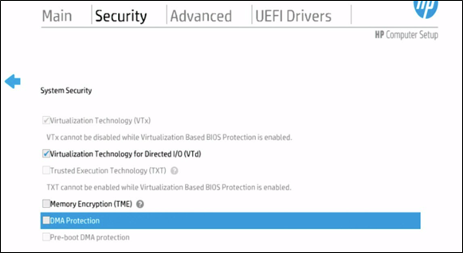
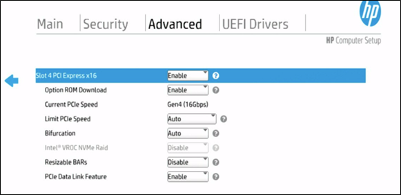
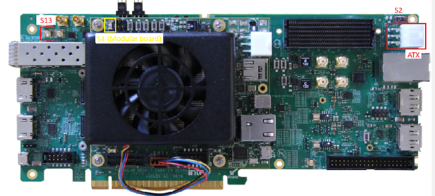
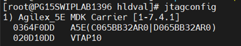
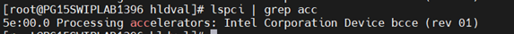

# BKMs for AGX5 Modular Development Kit Setup with OFS 2025.1 

The following instructions are intended to enable users in using an Agilex 5 Modular Development Kit with the OFS 2025.1 release. 

## 1.0 Host Machine  Settings

The following BIOS settings will need to be changed to support the Agilex 5 Modular Development Kit on an HP server running ILO 5+. The location of specific settings in the BIOS menu may change depending on the server manufacturer and BIOS revision.

1. BIOS Setting: System Security.

    1.a. Enable Virtualization Technology for Directed I/O (VTd) 




2. BIOS Setting: PCIe Slot Setting (Everything default) 



 

## 2.0 AGX5 E-Series Modular Development Kit Installation



### 2.1 Switch Settings

1. Enable the following switch settings for JTAG programming:

    #### Table 1: SW for Jtag Programming

    |Switch|Position|Description|
    |----|----|----|
    |S2 (carrier board)|POS-1|POS-1 - for PCIe EF 12V input for system power, POS-3 - Enable ATX 12V input for system power|
    |S4.1 & S4.2 (modular board)| OFF / OFF|ON — MSEL 1 Low, OFF — MSEL 1 High, *Note: If you want to control the configuration over BTS, set this switch to OFF state*|
    |S13.1 (carrier board)|ON|ON — PCIe edge clock, OFF — Clock from onboard Si52202|

    Every other switch should be in its default position, as per the [Agilex 5 FPGA E-Series 065B Modular Development Kit User Guide](https://cdrdv2-public.intel.com/820978/ug-820977-820978.pdf), section **3.1 Default Settings**.


2. Connect the development kit to host machine via PCIe Gen3 (or higher) slot.

3. Connect the development kit to ATX power supply between it and the host.

## 3.0 Software Requirements 

* RHEL 9.4 (Supports OFS 2025.1 and FPGA AI Suite 2025.1.1) 
  * Can also use RHEL 8.10 if preferred
* A valid Quartus Prime Pro 25.1 installation
  * If just programming the card, only the Quartus Programmer is required
* Install the OFS (Open FPGA Stack) SDK and relevant DFL drivers

## 4.0 How to Program the FIM 

1. Download the OFS 2025.1 FIM from https://github.com/OFS/ofs-agx5-pcie-attach/releases/download/ofs-2025.1-1/eseries-mdk-images_ofs-2025-1-1.tar.gz. 
2. If you haven't already, add the Quartus Programmer binaries to PATH. 

    ```bash session
    export PATH="$PATH:"/<quartus_install_path>/intelFPGA_pro/25.1/qprogrammer/quartus/bin 
    ```

3. List FPGA connected via JTAG. 

    ```bash session
    jtagconfig -D
    ```
    
    

4. Program the FIM  onto FPGA. (Note the device_number from `jtagconfig`).  

    ```bash session
    quartus_pgm -c 1 -m jtag -o "p;/<path_to_image>/eseries-mdk-images_ofs-2025-1-1/ofs_top.sof@1" 
    ```

5. Warm reboot the server. 

    ```bash session
    sudo reboot 
    ```

6. After programming FIM and reboot, the host machine should be able to detect the new FPGA via its PCIe connection. 

    ```bash session
    lspci | grep acc 
    ```

    

    In this case, the PCI-address of AGX5E Modular Development Kit is 5e:00.0 