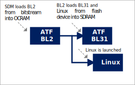

# HPS GHRD Linux Boot Tutorial Example Design: Agilex™ 3 FPGA and SoC C-Series Development Kit

##  Introduction

### Overview

This page contains instructions on how to build Linux systems from separate components: Hardware Design, U-Boot, Arm Trusted Firmware, Linux kernel and device tree, Linux root filesystem. This is different from the Golden System Reference Design, where all the software is built through Yocto. While the instructions use Yocto for building the root file system, alternatives could be used there, such as the buildroot utility for example.

The key differences versus the GSRD are:

 * Fabric is configured from U-Boot directly with the rbf file, with `fpga load` command, instead of using the `bootm` command with the core.rbf part of the kernel.itb file
 * Single image boot is disabled in U-Boot, and it boots directly with the slected boot source, not trying them all
 * The applications and drivers form `meta-intel-fpga-refdes` are not included. That includes accessing GPIOs in the fabric for LEDs, push buttons, dip switches, the webserver running on the board, etc.

The following scenarios are covered:

*  Boot from SD card
*  Boot from QSPI


The instructions on this page are based on the [GSRD](https://altera-fpga.github.io/rel-25.3.1/embedded-designs/agilex-3/c-series/gsrd/ug-gsrd-agx3/).

### Prerequisites

The following are required to be able to fully exercise the guides from this page:

* [Altera&reg; Agilex&trade; 3 FPGA C-Series Development Kit](https://www.intel.com/content/www/us/en/products/details/fpga/development-kits/agilex/a3y135b.html), ordering code DK-A3Y135BM16AEA.
  * Type-C USB Cable
  * Ethernet Cable
  * Micro SD card and USB card writer. Included with the development kit
* Host PC with
  * 64 GB of RAM or more
  * Linux OS installed. Ubuntu 22.04LTS was used to create this page, other versions and distributions may work too
  * Serial terminal (for example GtkTerm or Minicom on Linux and TeraTerm or PuTTY on Windows)
  * Altera&reg; Quartus<sup>&reg;</sup> Prime Pro Edition Version 25.3.1 
  * TFTP server. This used to download the eMMC binaries to board to be flashed by U-Boot
* Local Ethernet network, with DHCP server
* Internet connection. For downloading the files.

### Component Versions

Altera&reg; Quartus<sup>&reg;</sup> Prime Pro Edition Version 25.3.1 and the following software component versions integrate the 25.3.1 release. 

**Note:** Regarding the GHRD components in the following table, only the device-specific GHRD is used in this page.

| Component                             | Location                                                     | Branch                       | Commit ID/Tag       |
| :------------------------------------ | :----------------------------------------------------------- | :--------------------------- | :------------------ |
| Agilex 3 GHRD | [https://github.com/altera-fpga/agilex3c-ed-gsrd](https://github.com/altera-fpga/agilex3c-ed-gsrd)    | main  | QPDS25.3.1_REL_GSRD_PR   |
| Agilex 5 GHRD - Include GSRD 2.0 baseline design + meta_custom | [https://github.com/altera-fpga/agilex5e-ed-gsrd](https://github.com/altera-fpga/agilex5e-ed-gsrd) | main                    | QPDS25.3.1_REL_GSRD_PR |
| Agilex 7 GHRD                         | [https://github.com/altera-fpga/agilex7f-ed-gsrd](https://github.com/altera-fpga/agilex7f-ed-gsrd) | main | QPDS25.3.1_REL_GSRD_PR |
| Stratix 10 GHRD                       | [https://github.com/altera-fpga/stratix10-ed-gsrd](https://github.com/altera-fpga/stratix10-ed-gsrd) | main | QPDS25.3.1_REL_GSRD_PR |
| Arria 10 GHRD                         | [https://github.com/altera-fpga/arria10-ed-gsrd](https://github.com/altera-fpga/arria10-ed-gsrd)  | main | QPDS25.3.1_REL_GSRD_PR |
| Linux                                 | [https://github.com/altera-fpga/linux-socfpga](https://github.com/altera-fpga/linux-socfpga) | socfpga-6.12.43-lts | QPDS25.3.1_REL_GSRD_PR |
| Arm Trusted Firmware                  | [https://github.com/altera-fpga/arm-trusted-firmware](https://github.com/altera-fpga/arm-trusted-firmware) | socfpga_v2.13.1   | QPDS25.3.1_REL_GSRD_PR |
| U-Boot                                | [https://github.com/altera-fpga/u-boot-socfpga](https://github.com/altera-fpga/u-boot-socfpga) | socfpga_v2025.10 | QPDS25.3.1_REL_GSRD_PR |
| Yocto Project                         | [https://git.yoctoproject.org/poky](https://git.yoctoproject.org/poky) | walnascar | latest              |
| Yocto Project: meta-altera-fpga (for GSRD 2.0) | [https://github.com/altera-fpga/meta-altera-fpga](https://github.com/altera-fpga/meta-altera-fpga) | walnascar | QPDS25.3.1_REL_GSRD_PR |
| Yocto Project: meta-intel-fpga (for Legacy GSRD) | [https://git.yoctoproject.org/meta-intel-fpga](https://git.yoctoproject.org/meta-intel-fpga) | walnascar | latest |
| Yocto Project: meta-intel-fpga-refdes (for Legacy GSRD) | [https://github.com/altera-fpga/meta-intel-fpga-refdes](https://github.com/altera-fpga/meta-intel-fpga-refdes) | walnascar | QPDS25.3.1_REL_GSRD_PR |
| Legacy GSRD | [https://github.com/altera-fpga/gsrd-socfpga](https://github.com/altera-fpga/gsrd-socfpga) | walnascar | QPDS25.3.1_REL_GSRD_PR |

**Note:** The combination of the component versions indicated in the table above has been validated through the use cases described in this page and it is strongly recommended to use these versions together. If you decided to use any component with different version than the indicated, there is not warranty that this will work.

### Development Kit

Refer to [Development Kit](https://altera-fpga.github.io/rel-25.3.1/embedded-designs/agilex-3/c-series/gsrd/ug-gsrd-agx3) for details about the board.

### Release Notes

Refer to [Release Notes](https://github.com/altera-fpga/gsrd-socfpga/releases/tag/QPDS25.3.1_REL_GSRD_PR) for release readiness information and known issues.


## HPS Enablement Board

This section demonstrates how to build a Linux system from separate components, targetting the HPS Enablement Board. Both booting from SD card and booting from QSPI are covered.


### Boot from SD Card 


<h4>Setup Environment</h4>


1\. Create the top folder to store all the build artifacts:


```bash
sudo rm -rf agilex3_boot.sdcard_qspi
mkdir agilex3_boot.sdcard_qspi
cd agilex3_boot.sdcard_qspi
export TOP_FOLDER=`pwd`
```


Download the compiler toolchain, add it to the PATH variable, to be used by the GHRD makefile to build the HPS Debug FSBL:


```bash
cd $TOP_FOLDER
wget https://developer.arm.com/-/media/Files/downloads/gnu/14.3.rel1/binrel/\
arm-gnu-toolchain-14.3.rel1-x86_64-aarch64-none-linux-gnu.tar.xz
tar xf arm-gnu-toolchain-14.3.rel1-x86_64-aarch64-none-linux-gnu.tar.xz
rm -f arm-gnu-toolchain-14.3.rel1-x86_64-aarch64-none-linux-gnu.tar.xz
export PATH=`pwd`/arm-gnu-toolchain-14.3.rel1-x86_64-aarch64-none-linux-gnu/bin/:$PATH
export ARCH=arm64
export CROSS_COMPILE=aarch64-none-linux-gnu-
```

Enable Quartus tools to be called from command line:


```bash
export QUARTUS_ROOTDIR=~/altera_pro/25.3.1/quartus/
export PATH=$QUARTUS_ROOTDIR/bin:$QUARTUS_ROOTDIR/linux64:$QUARTUS_ROOTDIR/../qsys/bin:$PATH
```


<h4>Build Hardware Design</h4>


```bash
cd $TOP_FOLDER
rm -rf agilex3_soc_devkit_ghrd && mkdir agilex3_soc_devkit_ghrd && cd agilex3_soc_devkit_ghrd
wget https://github.com/altera-fpga/agilex3c-ed-gsrd/releases/download/QPDS25.3.1_REL_GSRD_PR/a3cw135-devkit-oobe-legacy-baseline.zip
unzip a3cw135-devkit-oobe-legacy-baseline.zip
rm -f a3cw135-devkit-oobe-legacy-baseline.zip
make legacy_baseline-build
make legacy_baseline-install
quartus_pfg -c output_files/legacy_baseline.sof \
  output_files/legacy_baseline_hps_debug.sof \
  -o hps_path=software/hps_debug/hps_wipe.ihex
cd ..
```

The following files are created:

* `$TOP_FOLDER/agilex3_soc_devkit_ghrd/output_files/legacy_baseline.sof`
* `$TOP_FOLDER/agilex3_soc_devkit_ghrd/output_files/legacy_baseline_hps_debug.sof`


<h4>Build Arm Trusted Firmware</h4>


```bash
cd $TOP_FOLDER
rm -rf arm-trusted-firmware
git clone -b QPDS25.3.1_REL_GSRD_PR https://github.com/altera-fpga/arm-trusted-firmware
cd arm-trusted-firmware
make -j 48 PLAT=agilex3 bl31
cd ..
```

The following file is created:

* `$TOP_FOLDER/arm-trusted-firmware/build/agilex3/release/bl31.bin`


<h4>Build U-Boot</h4>


```bash
cd $TOP_FOLDER
rm -rf u-boot-socfpga_sd
git clone -b QPDS25.3.1_REL_GSRD_PR https://github.com/altera-fpga/u-boot-socfpga u-boot-socfpga_sd
cd u-boot-socfpga_sd 
# enable dwarf4 debug info, for compatibility with arm ds
sed -i 's/PLATFORM_CPPFLAGS += -D__ARM__/PLATFORM_CPPFLAGS += -D__ARM__ -gdwarf-4/g' arch/arm/config.mk
# only boot from SD, do not try QSPI and NAND
sed -i 's/u-boot,spl-boot-order.*/u-boot\,spl-boot-order = \&mmc;/g' arch/arm/dts/socfpga_agilex3_socdk-u-boot.dtsi
# link to atf
ln -s ../arm-trusted-firmware/build/agilex3/release/bl31.bin 
# create configuration custom file. 
cat << EOF > config-fragment
# use Image instead of kernel.itb
CONFIG_BOOTFILE="Image"
# disable NAND/UBI related settings from defconfig. 
CONFIG_NAND_BOOT=n
CONFIG_SPL_NAND_SUPPORT=n
CONFIG_CMD_NAND_TRIMFFS=n
CONFIG_CMD_NAND_LOCK_UNLOCK=n
CONFIG_NAND_DENALI_DT=n
CONFIG_SYS_NAND_U_BOOT_LOCATIONS=n
CONFIG_SPL_NAND_FRAMEWORK=n
CONFIG_CMD_NAND=n
CONFIG_MTD_RAW_NAND=n
CONFIG_CMD_UBI=n
CONFIG_CMD_UBIFS=n
CONFIG_MTD_UBI=n
CONFIG_ENV_IS_IN_UBI=n
CONFIG_UBI_SILENCE_MSG=n
CONFIG_UBIFS_SILENCE_MSG=n
# disable distroboot and use specific boot command. 
CONFIG_DISTRO_DEFAULTS=n
CONFIG_HUSH_PARSER=y
CONFIG_SYS_PROMPT_HUSH_PS2="> "
CONFIG_USE_BOOTCOMMAND=y
CONFIG_BOOTCOMMAND="load mmc 0:1 \${loadaddr} ghrd.core.rbf; fpga load 0 \${loadaddr} \${filesize};bridge enable; mmc rescan; fatload mmc 0:1 82000000 Image;fatload mmc 0:1 86000000 socfpga_agilex3_socdk.dtb;setenv bootargs console=ttyS0,115200 root=\${mmcroot} rw rootwait;booti 0x82000000 - 0x86000000"
CONFIG_CMD_FAT=y
CONFIG_CMD_FS_GENERIC=y
CONFIG_DOS_PARTITION=y
CONFIG_SPL_DOS_PARTITION=y
CONFIG_CMD_PART=y
CONFIG_SPL_CRC32=y
CONFIG_LZO=y
CONFIG_CMD_DHCP=y
# enable more QSPI flash manufacturers
CONFIG_SPI_FLASH_MACRONIX=y
CONFIG_SPI_FLASH_GIGADEVICE=y
CONFIG_SPI_FLASH_WINBOND=y
CONFIG_SPI_FLASH_ISSI=y
EOF
# build U-Boot
make clean && make mrproper
make socfpga_agilex3_defconfig 
# use created custom configuration file to merge with the default configuration obtained in .config file. 
./scripts/kconfig/merge_config.sh -O . -m .config config-fragment
make -j 64
cd ..
```

The following files are created:

* `$TOP_FOLDER/u-boot-socfpga_sd/u-boot.itb`
* `$TOP_FOLDER/u-boot-socfpga_sd/spl/u-boot-spl-dtb.hex`


<h4>Build QSPI Image</h4>


```bash
cd $TOP_FOLDER
quartus_pfg -c agilex3_soc_devkit_ghrd/output_files/legacy_baseline.sof ghrd_sd.jic \
-o device=QSPI512 \
-o flash_loader=A3CW135BM16AE6S \
-o hps_path=$TOP_FOLDER/u-boot-socfpga_sd/spl/u-boot-spl-dtb.hex \
-o mode=ASX4 \
-o hps=1

```

The following file is created:

* `$TOP_FOLDER/ghrd_sd.hps.jic`


<h4>Build HPS RBF</h4>

This is an optional step, in which you can build an HPS RBF file, which can be used to configure the HPS through JTAG instead of QSPI though the JIC file.


```bash
cd $TOP_FOLDER
quartus_pfg -c agilex3_soc_devkit_ghrd/output_files/legacy_baseline.sof ghrd_sd.rbf \
-o hps_path=$TOP_FOLDER/u-boot-socfpga_sd/spl/u-boot-spl-dtb.hex \
-o hps=1
```

The following file is created:

* `$TOP_FOLDER/ghrd_sd.hps.rbf


<h4>Build Linux</h4>


```bash
cd $TOP_FOLDER
rm -rf linux-socfpga
git clone -b QPDS25.3.1_REL_GSRD_PR https://github.com/altera-fpga/linux-socfpga
cd linux-socfpga
cat << EOF > config-fragment-agilex3
# Enable Ethernet connectivity so we can get an IP address
CONFIG_MARVELL_PHY=y
EOF
make defconfig
# Apply custom Configs in file
./scripts/kconfig/merge_config.sh -O ./ ./.config ./config-fragment-agilex3
make oldconfig
make -j 64 Image && make intel/socfpga_agilex3_socdk.dtb
```

The following files are created:

* `$TOP_FOLDER/linux-socfpga/arch/arm64/boot/dts/intel/socfpga_agilex3_socdk.dtb`
* `$TOP_FOLDER/linux-socfpga/arch/arm64/boot/Image`


<h4>Install Yocto Dependencies</h4>

1\. Make sure you have Yocto system requirements met: https://docs.yoctoproject.org/5.0.1/ref-manual/system-requirements.html#supported-linux-distributions.

The command to install the required packages on Ubuntu 22.04 is:

```bash
sudo apt-get update
sudo apt-get upgrade
sudo apt-get install openssh-server mc libgmp3-dev libmpc-dev gawk wget git diffstat unzip texinfo gcc \
build-essential chrpath socat cpio python3 python3-pip python3-pexpect xz-utils debianutils iputils-ping \
python3-git python3-jinja2 libegl1-mesa libsdl1.2-dev pylint xterm python3-subunit mesa-common-dev zstd \
liblz4-tool git fakeroot build-essential ncurses-dev xz-utils libssl-dev bc flex libelf-dev bison xinetd \
tftpd tftp nfs-kernel-server libncurses5 libc6-i386 libstdc++6:i386 libgcc++1:i386 lib32z1 \
device-tree-compiler curl mtd-utils u-boot-tools net-tools swig -y
```

On Ubuntu 22.04 you will also need to point the /bin/sh to /bin/bash, as the default is a link to /bin/dash:

```bash
 sudo ln -sf /bin/bash /bin/sh
```

**Note**: You can also use a Docker container to build the Yocto recipes, refer to https://rocketboards.org/foswiki/Documentation/DockerYoctoBuild for details. When using a Docker container, it does not matter what Linux distribution or packages you have installed on your host, as all dependencies are provided by the Docker container.

<h4>Build Rootfs</h4>


```bash
cd $TOP_FOLDER
rm -rf yocto && mkdir yocto && cd yocto
git clone -b walnascar https://git.yoctoproject.org/poky
git clone -b walnascar https://git.yoctoproject.org/meta-intel-fpga
git clone -b walnascar https://github.com/openembedded/meta-openembedded
source poky/oe-init-build-env ./build
echo 'MACHINE = "agilex3"' >> conf/local.conf
echo 'BBLAYERS += " ${TOPDIR}/../meta-intel-fpga "' >> conf/bblayers.conf
echo 'BBLAYERS += " ${TOPDIR}/../meta-openembedded/meta-oe "' >> conf/bblayers.conf
echo 'CORE_IMAGE_EXTRA_INSTALL += "openssh gdbserver"' >> conf/local.conf
bitbake core-image-minimal
```

The following file is created:

* `$TOP_FOLDER/yocto/build/tmp/deploy/images/agilex3/core-image-minimal-agilex3.rootfs.tar.gz`


<h4>Create SD Card Image</h4>


```bash
cd $TOP_FOLDER
sudo rm -rf sd_card && mkdir sd_card && cd sd_card
wget https://releases.rocketboards.org/release/2020.11/gsrd/tools/make_sdimage_p3.py
sed -i 's/\"\-F 32\",//g' make_sdimage_p3.py
chmod +x make_sdimage_p3.py
mkdir fatfs &&  cd fatfs
cp $TOP_FOLDER/ghrd_sd.core.rbf ghrd.core.rbf
cp $TOP_FOLDER/u-boot-socfpga_sd/u-boot.itb .
cp $TOP_FOLDER/linux-socfpga/arch/arm64/boot/Image .
cp $TOP_FOLDER/linux-socfpga/arch/arm64/boot/dts/intel/socfpga_agilex3_socdk.dtb .
cd ..
mkdir rootfs && cd rootfs
sudo tar xf $TOP_FOLDER/yocto/build/tmp/deploy/images/agilex3/core-image-minimal-agilex3.rootfs.tar.gz
cd ..
sudo python3 make_sdimage_p3.py -f \
-P fatfs/*,num=1,format=fat32,size=64M \
-P rootfs/*,num=2,format=ext3,size=64M \
-s 140M \
-n sdcard.img
cd ..
```

The following file is created:

* `$TOP_FOLDER/sd_card/sdcard.img`


<h4>Write SD Card</h4>

Write the SD card image `sd_card/sdcard.img` to the micro SD card using the included USB writer:

- On Linux, use the `dd` utility as shown next:
```bash
	# Determine the device asociated with the SD card on the host computer.	
	cat /proc/partitions
	# This will return for example /dev/sdx
	# Use dd to write the image in the corresponding device
	sudo dd if=sdcard.img of=/dev/sdx bs=1M
	# Flush the changes to the SD card
	sync
```
- On Windows, use the Win32DiskImager program, available at [https://sourceforge.net/projects/win32diskimager](https://sourceforge.net/projects/win32diskimager). Write the image as shown in the next figure:
 

<h4>Write QSPI Flash</h4>

1\. Power cycle the board

2\. Write JIC image to QSPI:

```bash
cd $TOP_FOLDER
jtagconfig --setparam 1 JtagClock 16M
quartus_pgm -c 1 -m jtag -o "pvi;ghrd.hps.jic"
```

<h4>Boot Linux</h4>

1\. Power cycle the board

2\. Wait for Linux to boot, use `root` as user name, and no password wil be requested.


### Boot from QSPI

This section demonstrates how to build Linux system from separate components, which boots from QSPI.

**NOTE:**  This section assumes that the [Boot from SD Card](#boot-from-sd-card) section has been already built and the environment setup in that section is still available.

This section presents how to build the binaries and boot from QSPI with the HPS Enablement Board.
While the example is based on the GSRD, it contains the following differences:

* U-Boot tries to boot only from QSPI flash, does not try SD card
* U-Boot does not use a script to boot, instead it used the `BOOTCMD` environment variable directly
* kernel.itb file contains only one set of core.rbf, kernel and device tree files, targeted for this scenario

1\. Prepare the top folder


```bash
rm -rf $TOP_FOLDER/qspi-boot
mkdir $TOP_FOLDER/qspi-boot
```


2\. Build U-Boot for QSPI:


```bash
cd $TOP_FOLDER/qspi-boot
rm -rf u-boot-socfpga_qspi
git clone -b QPDS25.3.1_REL_GSRD_PR https://github.com/altera-fpga/u-boot-socfpga u-boot-socfpga_qspi
cd u-boot-socfpga_qspi 
# enable dwarf4 debug info, for compatibility with arm ds
sed -i 's/PLATFORM_CPPFLAGS += -D__ARM__/PLATFORM_CPPFLAGS += -D__ARM__ -gdwarf-4/g' arch/arm/config.mk
# only boot from QSPI
sed -i 's/u-boot,spl-boot-order.*/u-boot\,spl-boot-order = \&flash0;/g' arch/arm/dts/socfpga_agilex3_socdk-u-boot.dtsi
# link to atf
ln -s $TOP_FOLDER/arm-trusted-firmware/build/agilex3/release/bl31.bin 
# create configuration custom file. 
cat << EOF > config-fragment
# mtd info
CONFIG_MTDIDS_DEFAULT="nor0=nor0"
# Match PFG (boot area below 0xc00000, linux components starting at 0xc00000 til the end of the qspi device)
CONFIG_MTDPARTS_DEFAULT="mtdparts=nor0:12m(u-boot),52m(root)"
# use Image instead of kernel.itb
CONFIG_BOOTFILE="Image"
# do not keep env on sd card
CONFIG_ENV_IS_IN_FAT=n
# disable NAND related settings from defconfig
CONFIG_NAND_BOOT=n
CONFIG_SPL_NAND_SUPPORT=n
CONFIG_CMD_NAND_TRIMFFS=n
CONFIG_CMD_NAND_LOCK_UNLOCK=n
CONFIG_NAND_DENALI_DT=n
CONFIG_SYS_NAND_U_BOOT_LOCATIONS=n
CONFIG_SPL_NAND_FRAMEWORK=n
CONFIG_CMD_NAND=n
CONFIG_MTD_RAW_NAND=n
# disable distroboot and use specific boot command. 
CONFIG_DISTRO_DEFAULTS=n
CONFIG_HUSH_PARSER=y
CONFIG_SYS_PROMPT_HUSH_PS2="> "
CONFIG_USE_BOOTCOMMAND=y
CONFIG_BOOTCOMMAND="mtdparts;ubi part root;ubi readvol \${loadaddr} kernel;ubi detach;setenv bootargs earlycon panic=-1 ubi.mtd=1 root=ubi0:rootfs rootfstype=ubifs rw rootwait;bootm \${loadaddr}#board-0;"
CONFIG_CMD_FAT=y
CONFIG_CMD_FS_GENERIC=y
CONFIG_DOS_PARTITION=y
CONFIG_SPL_DOS_PARTITION=y
CONFIG_CMD_PART=y
CONFIG_SPL_CRC32=y
CONFIG_LZO=y
CONFIG_CMD_DHCP=y
# enable more QSPI flash manufacturers
CONFIG_SPI_FLASH_MACRONIX=y
CONFIG_SPI_FLASH_GIGADEVICE=y
CONFIG_SPI_FLASH_WINBOND=y
CONFIG_SPI_FLASH_ISSI=y
EOF
# build U-Boot
make clean && make mrproper
make socfpga_agilex3_defconfig 
# use created custom configuration file to merge with the default configuration obtained in .config file. 
./scripts/kconfig/merge_config.sh -O . -m .config config-fragment
make -j 64
cd ..
```

The following files are created:

* `$TOP_FOLDER/qspi-boot/u-boot-socfpga_qspi/u-boot.itb`
* `$TOP_FOLDER/qspi-boot/u-boot-socfpga_qspi/spl/u-boot-spl-dtb.hex`


3\. Build `kernel.itb` FIT file containing kernel, device tree and fpga fabric configuration file:


```bash
cd $TOP_FOLDER/qspi-boot
rm -f core.rbf devicetree.dtb Image.lzma kernel.its kernel.itb
ln -s $TOP_FOLDER/ghrd_sd.core.rbf core.rbf
ln -s $TOP_FOLDER/linux-socfpga/arch/arm64/boot/dts/intel/socfpga_agilex3_socdk.dtb devicetree.dtb
xz --format=lzma --extreme -k -c ../linux-socfpga/arch/arm64/boot/Image > Image.lzma
cat << EOF > kernel.its
// SPDX-License-Identifier: GPL-2.0
/*
 * Copyright (C) 2024 Intel Corporation
 *
 */

/dts-v1/;

/ {
    description = "FIT image with kernel, DTB and FPGA core binary";
    #address-cells = <1>;

    images {
        kernel {
            description = "Linux Kernel";
            data = /incbin/("./Image.lzma");
            type = "kernel";
            arch = "arm64";
            os = "linux";
            compression = "lzma";
            load = <0x86000000>;
            entry = <0x86000000>;
            hash {
                algo = "crc32";
            };
        };

        fdt-0 {
            description = "Device Tree";
            data = /incbin/("./devicetree.dtb");
            type = "flat_dt";
            arch = "arm64";
            compression = "none";
            hash {
                algo = "crc32";
            };
        };

        fpga-0 {
            description = "FPGA bitstream";
            data = /incbin/("./core.rbf");
            type = "fpga";
            arch = "arm64";
            compression = "none";
            load = <0x8A000000>;
            hash {
                algo = "crc32";
            };
        };
    };

    configurations {
        default = "board-0";

        board-0 {
            description = "board_0";
            kernel = "kernel";
            fdt = "fdt-0";
            fpga = "fpga-0";
            signature {
                algo = "crc32";
                key-name-hint = "dev";
                sign-images = "fdt-0", "kernel", "fpga-0";
            };
        };
    };
};
EOF
./u-boot-socfpga_qspi/tools/mkimage -f kernel.its kernel.itb
```


The following file is created:

* `$TOP_FOLDER/qspi-boot/kernel.itb`

4\. Truncate U-Boot binary `u-boot.bin` with a size of exactly 2MB:


```bash
cd $TOP_FOLDER/qspi-boot
cp u-boot-socfpga_qspi/u-boot.itb .
uboot_part_size=2*1024*1024
uboot_size=`wc -c < u-boot.itb`
uboot_pad="$((uboot_part_size-uboot_size))"
truncate -s +$uboot_pad u-boot.itb
mv u-boot.itb u-boot.bin
```


The following file is created:

* `$TOP_FOLDER/qspi-boot/u-boot.bin`

5\. Build the `rootfs.ubifs` file:


```bash
cd $TOP_FOLDER/qspi-boot
rm -rf rootfs rootfs.ubifs
mkdir rootfs 
tar -xzvf $TOP_FOLDER/yocto/build/tmp/deploy/images/agilex3/core-image-minimal-agilex3.rootfs.tar.gz -C rootfs 
mkfs.ubifs -r rootfs -F -e 65408 -m 1 -c 6500 -o rootfs.ubifs 
```


The following file is created:

* `$TOP_FOLDER/qspi-boot/rootfs.ubifs`


6\. Build the `root.ubi` file:


```bash
cat << EOF > ubinize.cfg
[env]
mode=ubi
vol_id=0
vol_name=env
vol_size=256KiB
vol_type=dynamic

[script]
mode=ubi
vol_id=1
vol_name=script
vol_size=128KiB 
vol_type=dynamic

[kernel]
mode=ubi
image=kernel.itb
vol_id=2
vol_name=kernel
vol_size=14MiB
vol_type=dynamic

[dtb]
mode=ubi
vol_id=3    
vol_name=dtb   
vol_size=256KiB 
vol_type=dynamic

[rootfs]
mode=ubi
image=rootfs.ubifs
vol_id=4
vol_name=rootfs
vol_type=dynamic
vol_size=36MiB
vol_flag=autoresize
EOF
ubinize -o root.ubi -p 65536 -m 1 -s 1 ubinize.cfg
```


The following file is created:

* `$TOP_FOLDER/qspi-boot/root.ubi`

7\. Build the QSPI flash image:


```bash
ln -s $TOP_FOLDER/agilex3_soc_devkit_ghrd/output_files/legacy_baseline.sof fpga.sof
ln -s u-boot-socfpga_qspi/spl/u-boot-spl-dtb.hex spl.hex
ln -s root.ubi hps.bin
cat << EOF > flash_image.pfg
<pfg version="1">
    <settings custom_db_dir="./" mode="ASX4"/>
    <output_files>
        <output_file name="flash_image" hps="1" directory="./" type="PERIPH_JIC">
            <file_options/>
            <secondary_file type="MAP" name="flash_image_jic">
                <file_options/>
            </secondary_file>
            <flash_device_id>Flash_Device_1</flash_device_id>
        </output_file>
    </output_files>
    <bitstreams>
        <bitstream id="Bitstream_1">
            <path hps_path="spl.hex">fpga.sof</path>
    </bitstream>
    </bitstreams>
    <raw_files>
        <raw_file bitswap="1" type="RBF" id="Raw_File_1">u-boot.bin</raw_file>
        <raw_file bitswap="1" type="RBF" id="Raw_File_2">hps.bin</raw_file>
    </raw_files>
    <flash_devices>
        <flash_loader>A3CW135BM16AR0</flash_loader>
        <flash_device type="QSPI512" id="Flash_Device_1">
            <partition reserved="1" fixed_s_addr="1" s_addr="0x00000000" e_addr="0x001FFFFF" fixed_e_addr="1" id="BOOT_INFO" size="0"/>
            <partition reserved="0" fixed_s_addr="0" s_addr="auto" e_addr="auto" fixed_e_addr="0" id="P1" size="0"/>
            <partition reserved="0" fixed_s_addr="0" s_addr="0x0a00000" e_addr="auto" fixed_e_addr="0" id="UBOOT" size="0"/>
            <partition reserved="0" fixed_s_addr="0" s_addr="0x0c00000" e_addr="auto" fixed_e_addr="0" id="HPS" size="0"/>
        </flash_device>
    </flash_devices>
    <assignments>
        <assignment page="0" partition_id="P1">
            <bitstream_id>Bitstream_1</bitstream_id>
        </assignment>
        <assignment page="0" partition_id="UBOOT">
            <raw_file_id>Raw_File_1</raw_file_id>
        </assignment>
        <assignment page="0" partition_id="HPS">
            <raw_file_id>Raw_File_2</raw_file_id>
        </assignment>
    </assignments>
</pfg>
EOF
quartus_pfg -c flash_image.pfg
```


The following file is created:

* `$TOP_FOLDER/qspi-boot/flash_image.hps.jic`


<h4>Write QSPI Flash</h4>

1\. Power cycle the board

2\. Write JIC image to QSPI:

```bash
cd $TOP_FOLDER
jtagconfig --setparam 1 JtagClock 16M
quartus_pgm -c 1 -m jtag -o "qspi-boot/flash_image.hps.jic"
```
Note: You need to wipe the micro SD card or remove it from the board before start running.

<h4>Boot Linux</h4>

1\. Power cycle the board

4\. Wait for Linux to boot, use `root` as user name, and no password wil be requested.

## Direct ATF to Linux Boot on HPS Enablement Board

Starting from 25.3 release, the 3 device is provided with the support of direct booting from ATF to Linux. In this boot flow, ATF acts as a First Stage Bootloader (BL2) and also as a Secure Monitor (BL31). BL2 is also in charge of loading and launching Linux OS, so U-Boot is not used in this boot flow.

    

In this boot flow, the BL2 (FSBL) is included in the bitstream together with the SDM FW and hardware design (first phase only in HPS boot first mode). When booting from QSPI, this bitstream is stored in the QSPI memory. In this boot flow, the BL31 (Secure Monitor) is packed with the Linux kernel and device tree into a FIP format image. This format provides to ATF the information about the components included in the image in a partition header. The resulting FIP image is added to the final flash image used to boot from (QSPI, SDCard, NAND or eMMC). 

When creating the flash image, it's necessary to provide the location in where ATF expects to find the FIP image (fip.bin). This is hardcoded in the ATF code (**plat/intel/soc/common/include/platform_def.h**) for each one of the flash devices in which this boot flow is supported as indicated in the next table:

| Flash Device | Definition           | Location in Flash device |
| :----------- | :------------------- | :----------------------- |
| QSPI         | PLAT_QSPI_DATA_BASE  | 0x00250000               |
| SDCard       | PLAT_SDMMC_DATA_BASE | 0x0                      |


The following sections provide instructions about how to generate the binaries to exercise this boot flow booting from different boot sources.  The instructions provided to build the binaries to boot form any flash device are expected to be executed togheter becuase therre are some dependencies among them. In all the cases the environment set up is needed. For dependencies, check at the beggining of each one of the sections.


### Boot from SD Card

Here we provide all the steps needed to create the binaries that allow you to exercise the ATF to Linux boot flow from a SD Card device. This includes building the hardware design, ATF (BL2, BL31), Linux file system, and Linux. These are some notes about the build instructions:

* Exercise the HPS boot first flow.
* When building ATF, we indicate the device used to boot from. We also indicate the SDRAM memory locations where the Linux kernel image and device tree will be loaded and launched from. In this boot flow, Linux is referred to as BL33.
* The FIP image (fip.bin) is created using the ATF fiptool, indicating the binaries that integrate this image.
* The SD Card created will include 2 partitions. One in which the fip.bin file is located (raw format and type A2) and the other for the file system (ext3 format).
* If wanted to perform FPGA configuration (2nd phase) from Linux create overlay.dtb as indicated in [Reconfiguring Core Fabric from Linux](#reconfiguring-core-fabric-from-linux) section.

    

<h4>Toolchain Setup (ATF-To-Linux)</h4>


```bash
sudo rm -rf agilex3_boot.atf2linux_sd_qspi
mkdir agilex3_boot.atf2linux_sd_qspi && cd agilex3_boot.atf2linux_sd_qspi
export TOP_FOLDER=`pwd`
```

Download the compiler toolchain, add it to the PATH variable, to be used by the GHRD makefile to build the HPS Debug FSBL:


```bash
cd $TOP_FOLDER
wget https://developer.arm.com/-/media/Files/downloads/gnu/14.3.rel1/binrel/\
arm-gnu-toolchain-14.3.rel1-x86_64-aarch64-none-linux-gnu.tar.xz
tar xf arm-gnu-toolchain-14.3.rel1-x86_64-aarch64-none-linux-gnu.tar.xz
rm -f arm-gnu-toolchain-14.3.rel1-x86_64-aarch64-none-linux-gnu.tar.xz
export PATH=`pwd`/arm-gnu-toolchain-14.3.rel1-x86_64-aarch64-none-linux-gnu/bin/:$PATH
export ARCH=arm64
export CROSS_COMPILE=aarch64-none-linux-gnu-
```

Enable Quartus tools to be called from command line:


```bash
export QUARTUS_ROOTDIR=~/altera_pro/25.3.1/quartus/
export PATH=$QUARTUS_ROOTDIR/bin:$QUARTUS_ROOTDIR/linux64:$QUARTUS_ROOTDIR/../qsys/bin:$PATH
```


<h4>Build Hardware Design</h4>


```bash
cd $TOP_FOLDER
rm -rf agilex3_soc_devkit_ghrd_sdqspi && mkdir agilex3_soc_devkit_ghrd_sdqspi && cd agilex3_soc_devkit_ghrd_sdqspi
wget https://github.com/altera-fpga/agilex3c-ed-gsrd/releases/download/QPDS25.3.1_REL_GSRD_PR/a3cw135-devkit-oobe-legacy-baseline.zip
unzip a3cw135-devkit-oobe-legacy-baseline.zip
rm -f a3cw135-devkit-oobe-legacy-baseline.zip
make legacy_baseline-build
make legacy_baseline-install
quartus_pfg -c output_files/legacy_baseline.sof \
  output_files/legacy_baseline_hps_debug.sof \
  -o hps_path=software/hps_debug/hps_wipe.ihex
cd ..
```


The following file is created:

* $TOP_FOLDER/agilex3_soc_devkit_ghrd_sdqspi/output_files/legacy_baseline.sof

<h4>Build Arm Trusted Firmware</h4>


```bash
cd $TOP_FOLDER
rm -rf arm-trusted-firmware-sdcard
git clone -b QPDS25.3.1_REL_GSRD_PR https://github.com/altera-fpga/arm-trusted-firmware arm-trusted-firmware-sdcard
cd arm-trusted-firmware-sdcard
# Beacuse of limitations on DDR we need to change the following
# sed -i 's/PLAT_QSPI_DATA_BASE.*/PLAT_QSPI_DATA_BASE			(0x00250000)/g' plat/altera/soc/common/include/platform_def.h
make realclean
# Setting Bootsource as SDMMC
make bl2 bl31 PLAT=agilex3 fiptool ARM_LINUX_KERNEL_AS_BL33=1  PRELOADED_BL33_BASE=0x82000000 ARM_PRELOADED_DTB_BASE=0x90000000 SOCFPGA_BOOT_SOURCE_SDMMC=1
cd ..
```


The following files are created:

* $TOP_FOLDER/arm-trusted-firmware-sdcard/build/agilex3/release/bl2.bin
* $TOP_FOLDER/arm-trusted-firmware-sdcard/build/agilex3/release/bl31.bin

<h4>Build Linux</h4>


```bash
cd $TOP_FOLDER
rm -rf linux-socfpga-sdcard
git clone -b QPDS25.3.1_REL_GSRD_PR https://github.com/altera-fpga/linux-socfpga linux-socfpga-sdcard
cd linux-socfpga-sdcard

cat << EOF > config-fragment-agilex3
# Enable DHCP 
CONFIG_IP_PNP_DHCP=y
# enable kernel debugging with RiscFree
CONFIG_DEBUG_INFO=y
CONFIG_GDB_SCRIPTS=y
CONFIG_INITRAMFS_ROOT_UID=0
CONFIG_INITRAMFS_ROOT_GID=0
CONFIG_INITRAMFS_COMPRESSION_GZIP=y

# Include these configs if wanted to perform fpga reconfiguration using overlays (enable device tree overlays and fpga bridges)
# Taken from https://altera-fpga.github.io/latest/embedded-designs/agilex-7/f-series/soc/fabric-config/ug-linux-fabric-config-agx7f-soc/
CONFIG_OF_RESOLVE=y
CONFIG_OF_OVERLAY=y
CONFIG_OF_CONFIGFS=y
CONFIG_FPGA_MGR_STRATIX10_SOC=y
CONFIG_FPGA_BRIDGE=y
CONFIG_FPGA_REGION=y
CONFIG_OF_FPGA_REGION=y
CONFIG_OVERLAY_FS=y
CONFIG_ALTERA_SYSID=y

# Needed for netwrok connectivity
CONFIG_MARVELL_PHY=y
EOF

make clean && make mrproper
make defconfig
# Apply custom Configs in file
./scripts/kconfig/merge_config.sh -O ./ ./.config ./config-fragment-agilex3

make oldconfig
make -j 64 Image dtbs
```


The following files are created:

* $TOP_FOLDER/linux-socfpga-sdcard/arch/arm64/boot/Image
* $TOP_FOLDER/linux-socfpga-sdcard/arch/arm64/boot/dts/intel/socfpga_agilex3_socdk_sdmmc_atfboot.dtb

<h4>Build Rootfs</h4>


```bash
cd $TOP_FOLDER
rm -rf yocto && mkdir yocto && cd yocto
git clone -b walnascar https://git.yoctoproject.org/poky
git clone -b walnascar https://git.yoctoproject.org/meta-intel-fpga
git clone -b walnascar https://github.com/openembedded/meta-openembedded
# work around issue
echo 'do_package_qa[noexec] = "1"' >> $(find meta-intel-fpga -name linux-socfpga_6.6.bb)
source poky/oe-init-build-env ./build
echo 'MACHINE = "agilex3"' >> conf/local.conf
echo 'BBLAYERS += " ${TOPDIR}/../meta-intel-fpga "' >> conf/bblayers.conf
echo 'BBLAYERS += " ${TOPDIR}/../meta-openembedded/meta-oe "' >> conf/bblayers.conf
echo 'IMAGE_FSTYPES = "tar.gz cpio jffs2"' >> conf/local.conf
echo 'CORE_IMAGE_EXTRA_INSTALL += "openssh gdbserver devmem2"' >> conf/local.conf
bitbake core-image-minimal

```


The following files are created:

* $TOP_FOLDER/yocto/build/tmp/deploy/images/agilex3/core-image-minimal-agilex3.rootfs.tar.gz
* $TOP_FOLDER/yocto/build/tmp/deploy/images/agilex3/core-image-minimal-agilex3.rootfs.jffs2

<h4>Build QSPI Image</h4>


```bash
cd $TOP_FOLDER
rm -rf jic_sdcard
mkdir jic_sdcard && cd jic_sdcard
# Convert fsbl
aarch64-none-linux-gnu-objcopy -v -I binary -O ihex --change-addresses 0x00000000 $TOP_FOLDER/arm-trusted-firmware-sdcard/build/agilex3/release/bl2.bin fsbl.hex
ln -s $TOP_FOLDER/agilex3_soc_devkit_ghrd_sdqspi/output_files/legacy_baseline.sof legacy_baseline.sof
# Create .jic file
quartus_pfg -c legacy_baseline.sof \
design_atf.jic \
-o hps_path=fsbl.hex \
-o device=QSPI512 \
-o flash_loader=A3CW135BM16AE6S   \
-o mode=ASX4 \
-o hps=1
```


The following files are created:

* $TOP_FOLDER/jic_sdcard/design_atf.hps.jic
* $TOP_FOLDER/jic_sdcard/design_atf.core.rbf

<h4>Build SD Card Image</h4>


```bash
cd $TOP_FOLDER
sudo rm -rf sd_card
mkdir sd_card && cd sd_card
## Create FIP image
$TOP_FOLDER/arm-trusted-firmware-sdcard/build/agilex3/release/tools/fiptool/fiptool create \
--soc-fw $TOP_FOLDER/arm-trusted-firmware-sdcard/build/agilex3/release/bl31.bin \
--nt-fw $TOP_FOLDER/linux-socfpga-sdcard/arch/arm64/boot/Image \
--nt-fw-config $TOP_FOLDER/linux-socfpga-sdcard/arch/arm64/boot/dts/intel/socfpga_agilex3_socdk_sdmmc_atfboot.dtb fip.bin

# Build now the SDCard
wget https://releases.rocketboards.org/release/2020.11/gsrd/tools/make_sdimage_p3.py
# remove mkfs.fat parameter which has some issues on Ubuntu 22.04
sed -i 's/\"\-F 32\",//g' make_sdimage_p3.py
chmod +x make_sdimage_p3.py
mkdir rootfs && cd rootfs
sudo tar -xf $TOP_FOLDER/yocto/build/tmp/deploy/images/agilex3/core-image-minimal-agilex3.rootfs.tar.gz
sudo cp $TOP_FOLDER/jic_sdcard/design_atf.core.rbf home/root/
sudo rm -rf lib/modules/*
cd ..
sudo python3 make_sdimage_p3.py -f \
-P fip.bin,num=1,format=raw,size=64M,type=a2 \
-P rootfs/*,num=2,format=ext3,size=64M \
-s 128M -n sdimage_atf.img

```


The following file is created:

* $TOP_FOLDER/sd_card/sdimage_atf.img

You can exercise ATF to Linux boot flow from SD Card using the following binaries generated:

* $TOP_FOLDER/sd_card/sdimage_atf.img
* $TOP_FOLDER/jic_sdcard/design_atf.hps.jic

When booting with the binaries generated, this is the log that you will see. This is the log is just a refenrece and captured by the time the page was created and in the future the versions in the components may change.

```
NOTICE:  DDR: Reset type is 'Power-On'
NOTICE:  IOSSM: Calibration success status check...
NOTICE:  IOSSM: All EMIF instances within the IO96 have calibrated successfully!
NOTICE:  DDR: Calibration success
NOTICE:  DDR: ECC is enabled (inline ECC)
NOTICE:  ###DDR:init success###
NOTICE:  SOCFPGA: SDMMC boot
NOTICE:  BL2: v2.13.0(release):QPDS25.3_REL_GSRD_PR-dirty
NOTICE:  BL2: Built : 13:18:17, Nov 26 2025
NOTICE:  BL2: Booting BL31
NOTICE:  SOCFPGA: Boot Core = 0
NOTICE:  SOCFPGA: CPU ID = 0
NOTICE:  SOCFPGA: Setting CLUSTERECTRL_EL1
NOTICE:  BL31: v2.13.0(release):QPDS25.3_REL_GSRD_PR-dirty
NOTICE:  BL31: Built : 13:18:22, Nov 26 2025
[    0.000000] Booting Linux on physical CPU 0x0000000000 [0x412fd050]
[    0.000000] Linux version 6.12.33-g3234b1ed8956-dirty (rolando@rolando3-linux-lab) (aarch64-none-linux-gnu-gcc (Arm GNU Toolchain 14.3.Rel1 (Build arm-14.174)) 14.3.1 20250623, GNU ld (Arm GNU Toolchain 14.3.Rel1 (Build arm-14.174)) 2.44.0.20250616) #1 SMP PREEMPT Wed Nov 26 13:47:26 CST 2025
:
[    0.000000] Kernel command line: console=ttys0,115200 earlycon panic=-1 root=/dev/mmcblk0p2 rw rootwait
[    0.000000] Dentry cache hash table entries: 262144 (order: 9, 2097152 bytes, linear)
[    0.000000] Inode-cache hash table entries: 131072 (order: 8, 1048576 bytes, linear)
[    0.000000] Fallback order for Node 0: 0 
[    0.000000] Built 1 zonelists, mobility grouping on.  Total pages: 458752
[    0.000000] Policy zone: DMA
[    0.000000] mem auto-init: stack:all(zero), heap alloc:off, heap free:off
[    0.000000] software IO TLB: SWIOTLB bounce buffer size adjusted to 1MB
[    0.000000] software IO TLB: area num 4.
[    0.000000] software IO TLB: SWIOTLB bounce buffer size roundup to 2MB
[    0.000000] software IO TLB: mapped [mem 0x00000000eba9c000-0x00000000ebc9c000] (2MB)
[    0.000000] SLUB: HWalign=64, Order=0-3, MinObjects=0, CPUs=4, Nodes=1
[    0.000000] rcu: Preemptible hierarchical RCU implementation.
[    0.000000] rcu: 	RCU event tracing is enabled.
[    0.000000] rcu: 	RCU restricting CPUs from NR_CPUS=512 to nr_cpu_ids=4.
[    0.000000] 	Trampoline variant of Tasks RCU enabled.
:
[   15.092069] socfpga-dwmac 10830000.ethernet eth0: PHY [stmmac-2:00] driver [Micrel KSZ9031 Gigabit PHY] (irq=POLL)
[   15.102516] socfpga-dwmac 10830000.ethernet eth0: No Safety Features support found
[   15.110108] socfpga-dwmac 10830000.ethernet eth0: IEEE 1588-2008 Advanced Timestamp supported
[   15.119328] socfpga-dwmac 10830000.ethernet eth0: registered PTP clock
[   15.125915] socfpga-dwmac 10830000.ethernet eth0: configuring for phy/rgmii link mode
[   23.336259] socfpga-dwmac 10830000.ethernet eth0: Link is Up - 1Gbps/Full - flow control rx/tx
[   24.770813] dw-apb-uart 10c02000.serial: failed to request DMA

Poky (Yocto Project Reference Distro) 5.2.4 agilex3 /dev/ttyS0

agilex3 login:
```

### Boot from QSPI

This section provides instructions to build binaries to exercise ATF to Linux direct boot flow booting from a QSPI device.

**NOTE:** This section depends on some steps from the [ATF to Linux from SD Card](#atf-to-linux-from-sd-card) section. So, to build the binaries in this section, you need to perform the instructions in the following sections before:

* [Toolchain Setup (ATF-To-Linux)](#toolchain-setup-atf-to-linux)
* [Build Hardware Design SD_QSPI (ATF-To-Linux)](#build-hardware-design-sd_qspi-atf-to-linux)
* [Build Linux File System  (ATF-To-Linux)](#build-linux-file-system-atf-to-linux)

ATF requires to be rebuilt to enable booting from QSPI by setting **SOCFPGA_BOOT_SOURCE_QSPI** to '1'. Linux also need to be rebuild since this time we are including a JFFS2 file system and since booting from QSPI, we need to change some parameters in the device tree. The FIP image is created in the same way but this time the FIP image is put into the QSPI image using a specific .pfg file. In this .pfg file, we are indicating that the fip file will be located at **0x00250000** location in the QSPI since this is also indicated by the **PLAT_QSPI_DATA_BASE** definition in the ATF.

    

<h4>Build Arm Trusted Firmware</h4>


```bash
cd $TOP_FOLDER
# Building ATF
rm -rf arm-trusted-firmware-qspi
git clone -b QPDS25.3.1_REL_GSRD_PR https://github.com/altera-fpga/arm-trusted-firmware arm-trusted-firmware-qspi
cd arm-trusted-firmware-qspi
# Replacing the default location of fip.bin from 0x3C00000 to 0x00250000
sed -i 's/PLAT_QSPI_DATA_BASE.*/PLAT_QSPI_DATA_BASE			(0x00250000)/g' plat/altera/soc/common/include/platform_def.h
make realclean
# Setting Bootsource as QSPI
make bl2 bl31 PLAT=agilex3 fiptool ARM_LINUX_KERNEL_AS_BL33=1  PRELOADED_BL33_BASE=0x82000000 ARM_PRELOADED_DTB_BASE=0x90000000 SOCFPGA_BOOT_SOURCE_QSPI=1
cd ..
```


The following files are created:

* $TOP_FOLDER/arm-trusted-firmware-qspi/build/agilex3/release/bl2.bin 
* $TOP_FOLDER/arm-trusted-firmware-qspi/build/agilex3/release/bl31.bin
* $TOP_FOLDER/arm-trusted-firmware-qspi/build/agilex3/release/tools/fiptool/fiptool

<h4>Build Linux</h4>


```bash
cd $TOP_FOLDER
rm -rf linux-socfpga-qspi
git clone -b QPDS25.3.1_REL_GSRD_PR https://github.com/altera-fpga/linux-socfpga linux-socfpga-qspi
cd linux-socfpga-qspi

## Adjust the root partition to fit in 64MB memory
sed -i  's/reg = <0x03400000 0x04FFFFFF>;/reg = <0x03400000 0x00C00000>;/g' arch/arm64/boot/dts/intel/socfpga_agilex3_socdk_qspi_atfboot.dts


cat << EOF > config-fragment-agilex3
# Enable DHCP 
CONFIG_IP_PNP_DHCP=y
# enable kernel debugging with RiscFree
CONFIG_DEBUG_INFO=y
CONFIG_GDB_SCRIPTS=y
CONFIG_INITRAMFS_ROOT_UID=0
CONFIG_INITRAMFS_ROOT_GID=0
CONFIG_INITRAMFS_COMPRESSION_GZIP=y

# Include these configs if wanted to perform fpga reconfiguration using overlays (enable device tree overlays and fpga bridges)
# Taken from https://altera-fpga.github.io/latest/embedded-designs/agilex-7/f-series/soc/fabric-config/ug-linux-fabric-config-agx7f-soc/
CONFIG_OF_RESOLVE=y
CONFIG_OF_OVERLAY=y
CONFIG_OF_CONFIGFS=y
CONFIG_FPGA_MGR_STRATIX10_SOC=y
CONFIG_FPGA_BRIDGE=y
CONFIG_FPGA_REGION=y
CONFIG_OF_FPGA_REGION=y
CONFIG_OVERLAY_FS=y
CONFIG_ALTERA_SYSID=y
# Enabling JFFS2 File system
CONFIG_JFFS2_FS=y

# Needed for netwrok connectivity
CONFIG_MARVELL_PHY=y
EOF

make clean && make mrproper
make defconfig
# Apply custom Configs in file
./scripts/kconfig/merge_config.sh -O ./ ./.config ./config-fragment-agilex3

make oldconfig
make -j 64 Image dtbs
```


The output files from this stage are:

* $TOP_FOLDER/linux-socfpga-qspi/arch/arm64/boot/Image
* $TOP_FOLDER/linux-socfpga-qspi/arch/arm64/boot/dts/intel/socfpga_agilex3_socdk_qspi_atfboot.dtb

<h4>Buid QSPI Image</h4>


```bash
cd $TOP_FOLDER
rm -rf jic_qspi
mkdir jic_qspi && cd jic_qspi

## Create .pfg to create the .jic
cat << EOF > qspi_flash_image_agilex3_boot.pfg
<pfg version="1">
  <settings custom_db_dir="./" mode="ASX4"/>
  <output_files>
      <output_file name="flash_image_atf_qspi" directory="." type="JIC">
          <file_options/>
          <secondary_file type="MAP" name="flash_image_atf_qspi_jic">
              <file_options/>
          </secondary_file>
          <secondary_file type="SEC_RPD" name="flash_image_atf_qspi_jic">
              <file_options bitswap="1"/>
          </secondary_file>
          <flash_device_id>Flash_Device_1</flash_device_id>
      </output_file>
  </output_files>
  <bitstreams>
      <bitstream id="Bitstream_1">
          <path hps_path="./fsbl.hex">./legacy_baseline.sof</path>
      </bitstream>
  </bitstreams>
  <raw_files>
      <raw_file bitswap="1" type="RBF" id="Raw_File_1">fip.bin</raw_file>
      <raw_file bitswap="1" type="RBF" id="Raw_File_2">rootfs.bin</raw_file>
  </raw_files>
  <flash_devices>
      <flash_device type="QSPI512" id="Flash_Device_1">
          <partition reserved="1" fixed_s_addr="1" s_addr="0x00000000" e_addr="0x001FFFFF" fixed_e_addr="1" id="BOOT_INFO" size="0"/>
          <partition reserved="0" fixed_s_addr="0" s_addr="auto" e_addr="auto" fixed_e_addr="0" id="P1" size="0"/>
          <partition reserved="0" fixed_s_addr="0" s_addr="0x00250000" e_addr="auto" fixed_e_addr="0" id="fip" size="0"/>
          <partition reserved="0" fixed_s_addr="0" s_addr="0x03400000" e_addr="auto" fixed_e_addr="0" id="Rootfs" size="0"/>
      </flash_device>
      <flash_loader>A3CW135BM16AE6S</flash_loader>
  </flash_devices>
  <assignments>
      <assignment page="0" partition_id="P1">
          <bitstream_id>Bitstream_1</bitstream_id>
      </assignment>
      <assignment page="0" partition_id="fip">
          <raw_file_id>Raw_File_1</raw_file_id>
      </assignment>
      <assignment page="0" partition_id="Rootfs">
          <raw_file_id>Raw_File_2</raw_file_id>
      </assignment>
  </assignments>
</pfg>
EOF

# Convert bl2.bin
aarch64-none-linux-gnu-objcopy -v -I binary -O ihex --change-addresses 0x00000000 $TOP_FOLDER/arm-trusted-firmware-qspi/build/agilex3/release/bl2.bin fsbl.hex

# Build FIP Image  
$TOP_FOLDER/arm-trusted-firmware-qspi/build/agilex3/release/tools/fiptool/fiptool create \
--soc-fw $TOP_FOLDER/arm-trusted-firmware-qspi/build/agilex3/release/bl31.bin \
--nt-fw $TOP_FOLDER/linux-socfpga-qspi/arch/arm64/boot/Image \
--nt-fw-config $TOP_FOLDER/linux-socfpga-qspi/arch/arm64/boot/dts/intel/socfpga_agilex3_socdk_qspi_atfboot.dtb fip.bin

# Create the jic file
ln -s $TOP_FOLDER/agilex3_soc_devkit_ghrd_sdqspi/output_files/legacy_baseline.sof legacy_baseline.sof
ln -s $TOP_FOLDER/yocto/build/tmp/deploy/images/agilex3/core-image-minimal-agilex3.rootfs.jffs2 rootfs.bin
quartus_pfg -c qspi_flash_image_agilex3_boot.pfg

```


After building, you can use the following binary to exercise the ATF to Linux boot flow booting from QSPI:

* $TOP_FOLDER/jic_qspi/flash_image_atf_qspi.jic


When booting with the binaries generated, this is the log that you will see. This is the log is just a refenrece and captured by the time the page was created and in the future the versions in the components may change.

```
NOTICE:  DDR: Reset type is 'Power-On'
NOTICE:  IOSSM: Calibration success status check...
NOTICE:  IOSSM: All EMIF instances within the IO96 have calibrated successfully!
NOTICE:  DDR: Calibration success
NOTICE:  DDR: ECC is enabled (inline ECC)
NOTICE:  IOSSM: inline_ecc_bist_mem_init: Memory initialized successfully on IO96B_0
NOTICE:  ###DDR:init success###
NOTICE:  SOCFPGA: QSPI boot
NOTICE:  BL2: v2.13.0(release):QPDS25.3_REL_GSRD_PR-dirty
NOTICE:  BL2: Built : 14:59:07, Nov 26 2025
NOTICE:  BL2: Booting BL31
NOTICE:  SOCFPGA: Boot Core = 0
NOTICE:  SOCFPGA: CPU ID = 0
NOTICE:  SOCFPGA: Setting CLUSTERECTRL_EL1
NOTICE:  BL31: v2.13.0(release):QPDS25.3_REL_GSRD_PR-dirty
NOTICE:  BL31: Built : 14:59:12, Nov 26 2025
[    0.000000] Booting Linux on physical CPU 0x0000000000 [0x412fd050]
[    0.000000] Linux version 6.12.33-g3234b1ed8956-dirty (rolando@rolando3-linux-lab) (aarch64-none-linux-gnu-gcc (Arm GNU Toolchain 14.3.Rel1 (Build arm-14.174)) 14.3.1 20250623, GNU ld (Arm GNU Toolchain 14.3.Rel1 (Build arm-14.174)) 2.44.0.20250616) #1 SMP PREEMPT Wed Nov 26 16:20:35 CST 2025
[    0.000000] KASLR disabled due to lack of seed
[    0.000000] Machine model: SoCFPGA Agilex3 SoCDK
:
[    0.000000] Kernel command line: console=ttys0,115200 earlycon panic=-1 root=/dev/mtdblock1 rw rootfstype=jffs2 rootwait
[    0.000000] Dentry cache hash table entries: 262144 (order: 9, 2097152 bytes, linear)
[    0.000000] Inode-cache hash table entries: 131072 (order: 8, 1048576 bytes, linear)
[    0.000000] Fallback order for Node 0: 0 
[    0.000000] Built 1 zonelists, mobility grouping on.  Total pages: 458752
:
[   15.691915] socfpga-dwmac 10830000.ethernet eth0: PHY [stmmac-2:00] driver [Micrel KSZ9031 Gigabit PHY] (irq=POLL)
[   15.702388] socfpga-dwmac 10830000.ethernet eth0: No Safety Features support found
[   15.709982] socfpga-dwmac 10830000.ethernet eth0: IEEE 1588-2008 Advanced Timestamp supported
[   15.719176] socfpga-dwmac 10830000.ethernet eth0: registered PTP clock
[   15.725783] socfpga-dwmac 10830000.ethernet eth0: configuring for phy/rgmii link mode
[   20.852295] socfpga-dwmac 10830000.ethernet eth0: Link is Up - 1Gbps/Full - flow control rx/tx
[   25.603895] dw-apb-uart 10c02000.serial: failed to request DMA

Poky (Yocto Project Reference Distro) 5.2.4 agilex3 /dev/ttyS0

agilex3 login:
```


## Reconfiguring Core Fabric from U-Boot
The GSRD configures the FPGA core fabric only once by U-boot during the Linux launch using the **bootm** command. In the bootloaders build flow, the reconfiguration is done in the U-Boot Shell through the **fpga load** command.

**Important**: If the FPGA fabric is already configured and bridges are enabled, you must call the **bridge disable** command from U-Boot before issuing the **bootm** or **fpga load** commands to reconfigure the fabric. Only do this if you are using an **arm-trusted-firmware** version more recent than the following:

* v2.7.1 = [https://github.com/altera-fpga/arm-trusted-firmware/commit/0a5edaed853e0dc1e687706ccace8e844b2a8db7](https://github.com/altera-fpga/arm-trusted-firmware/commit/0a5edaed853e0dc1e687706ccace8e844b2a8db7)
* v2.8.0 = [https://github.com/altera-fpga/arm-trusted-firmware/commit/bf933536d4582d63d0e29434e807a641941f3937](https://github.com/altera-fpga/arm-trusted-firmware/commit/bf933536d4582d63d0e29434e807a641941f3937)


The example below shows the steps to perform FPGA configuration from the U-boot.

1\. First, write the sdcard.img into an SD card. (Rename the wic file to 'sdcard.img')<br>
2\. Copy the configuration bitstream, ghrd.core.rbf, into the same SD Card.<br>
3\. Insert the SD Card to the board, boot the board up, and enter the U-boot shell when prompted.<br>
4\. In U-boot shell, run the following commands in sequence to perform FPGA configuration:<br>

* fatload mmc 0:1 [address] [ghrd.core.rbf]<br>
* fpga load [device] [address] [file_size]<br>

5\. The message "FPGA reconfiguration OK!" will be printed out upon successful transaction.<br>


Here is an example for Agilex® 7 device, but the same steps apply for Stratix® 10, Agilex® 5, and Agilex® 3 SoC FPGA devices.

```bash
Hit any key to stop autoboot:  0 /// Hit any key at this point to enter the U-boot Shell ///

SOCFPGA_AGILEX #
SOCFPGA_AGILEX # fatload mmc 0:1 ${loadaddr} ghrd.core.rbf
2404352 bytes read in 116 ms (19.8 MiB/s)
SOCFPGA_AGILEX # fpga load 0 ${loadaddr} ${filesize}
…FPGA reconfiguration OK!
```

## Reconfiguring Core Fabric from Linux

Reconfiguration of FPGA Core Fabric can be implemented by using the Linux device tree overlay mechanism, it is a powerful and flexible mechanism to enable the customization of the device tree during in run-time.

**Note**:

* This feature is supported with Linux* kernel v4.9 LTSI and onwards. 
* The Linux* kernel for Stratix® and Agilex® SoC FPGA devices allow you to enable the programming of FPGA from within the OS.
* Refer to *Build Linux* for the prerequisite work.

To implement the FPGA reconfiguration at kernel level, the following changes must be made to the kernel source code:

1\. Create a new overlay file, use filename "overlay.dts" as example, and add the overlay information of the RBF file:

```bash
cd $TOP_FOLDER
vi linux-socfpga/arch/arm64/boot/dts/intel/overlay.dts

# Add the DTS file content:
==============================================================
/dts-v1/;
/plugin/;
/ {
	fragment@0 {
		target-path = "/soc/base_fpga_region";
		#address-cells = <2>;
		#size-cells = <2>;
		__overlay__ {
			#address-cells = <2>;
			#size-cells = <2>;

			firmware-name = "overlay.rbf";
			config-complete-timeout-us = <30000000>;
		};
	};
};
==============================================================
```

The explanation of the keywords:

| Keyword | Meaning |
| :-- | :-- |
| fragment@0 | Node Name of the Overlay |
| target-path | Refers to base_fpga_region located in arch/arm64/boot/dts/intel/socfpga_agilex.dtsi. This will invoke the driver: drivers/fpga/of-fpga-region.c |
| fragment@0 <br>#address-cells<br>#size-cells | This specifies the number of cells (32-bit size) to be used for the child's address map. For overlays, this value must be set to avoid "default_addr_size" errors |
| \_\_overlay__ <br>#address-cells<br>#size-cells | These fields should match those in arch/arm64/boot/dts/intel/socfpga_agilex.dtsi |
| firmware-name = "overlay.rbf" | The fabric's file name |
|||


2\. Add the newly created overlay file **overlay.dtb** into the Makefile:

```bash
cd $TOP_FOLDER
vi linux-socfpga/arch/arm64/boot/dts/intel/Makefile

# Append to existing Makefile content, continue with ONE Device Tree Blob according to your device:
==============================================================
# Stratix® 10 SoC FPGA device:
dtb-$(CONFIG_ARCH_AGILEX) += socfpga_stratix10_socdk.dtb
dtb-$(CONFIG_ARCH_INTEL_SOCFPGA) += overlay.dtb

# Agilex® 7 SoC FPGA device:
dtb-$(CONFIG_ARCH_AGILEX) += socfpga_agilex_socdk.dtb
dtb-$(CONFIG_ARCH_INTEL_SOCFPGA) += overlay.dtb

# Agilex® 5 SoC FPGA device:
dtb-$(CONFIG_ARCH_AGILEX) += socfpga_agilex5_socdk.dtb
dtb-$(CONFIG_ARCH_INTEL_SOCFPGA) += overlay.dtb

# Agilex® 3 SoC FPGA device:
dtb-$(CONFIG_ARCH_AGILEX) += socfpga_agilex3_socdk.dtb
dtb-$(CONFIG_ARCH_INTEL_SOCFPGA) += overlay.dtb

==============================================================
```

3\. The commands to configure and build the Linux kernel are:

```bash
cd $TOP_FOLDER 
cd linux-socfpga
make clean && make mrproper
make defconfig
# enable device tree overlays and fpga bridges
./scripts/config --set-val CONFIG_INTEL_STRATIX10_SERVICE y
./scripts/config --set-val CONFIG_FPGA y
./scripts/config --set-val CONFIG_FPGA_BRIDGE y
./scripts/config --set-val CONFIG_FPGA_MGR_STRATIX10_SOC y
./scripts/config --set-val CONFIG_FPGA_REGION y
./scripts/config --set-val CONFIG_OF_FPGA_REGION y
./scripts/config --set-val CONFIG_FW_LOADER y
./scripts/config --set-val CONFIG_FW_LOADER_PAGED_BUF y
./scripts/config --set-val CONFIG_FW_LOADER_SYSFS y
./scripts/config --set-val CONFIG_FW_LOADER_USER_HELPER y

# Build the Linux kernel image, continue with ONE command according to your device:
# Stratix® 10 SoC FPGA device:
make -j 48 Image && make intel/socfpga_stratix10_socdk.dtb && make intel/overlay.dtb

# Agilex® 7 SoC FPGA device:
make -j 48 Image && make intel/socfpga_agilex_socdk.dtb && make intel/overlay.dtb

# Agilex® 5 SoC FPGA device:
make -j 48 Image && make intel/socfpga_agilex5_socdk.dtb && make intel/overlay.dtb

# Agilex® 3 SoC FPGA device:
make -j 48 Image && make intel/socfpga_agilex3_socdk.dtb && make intel/overlay.dtb
```

When you build the Linux* kernel for this feature, two <*.dtb> files are generated under $TOP_FOLDER/linux-socfpga/arch/arm64/boot/dts/intel/:

* socfpga_*DEVICE*_socdk.dtb --- The default *.dtb file used with the kernel image to boot the system.
* overlay.dtb --- The *.dtb file used to trigger FPGA configuration in OS.


4\. In your hardware (GHRD) compilation output folder, rename the FPGA configuration file (.rbf) to "overlay.rbf". Then, copy both the **overlay.rbf** and the **overlay.dtb** files to the Root File System:

```bash
$ mkdir -p $TOP_FOLDER/sd_card/rootfs/lib/firmware

$ cd $TOP_FOLDER/linux-socfpga/arch/arm64/boot/dts/intel/
$ cp overlay.dtb $TOP_FOLDER/sd_card/rootfs/lib/firmware/

$ cd [GHRD_OUTPUT_DIR i.e. ghrd/output_files/]
$ mv <DEVICE_GHRD>.core.rbf overlay.rbf
# e.g. mv ghrd_a5ed065bb32ae5s.core.rbf overlay.rbf
$ cp overlay.rbf $TOP_FOLDER/sd_card/rootfs/lib/firmware/

# To create the SD Card Image:
cd $TOP_FOLDER/sd_card/

# Get the make_sdimage_p3.py
wget https://releases.rocketboards.org/release/2020.11/gsrd/tools/make_sdimage_p3.py

# remove mkfs.fat parameter which has some issues on Ubuntu 22.04
sed -i 's/\"\-F 32\",//g' make_sdimage_p3.py
chmod +x make_sdimage_p3.py

sudo python3 make_sdimage_p3.py -f \
-P fatfs/*,num=1,format=fat32,size=512M \
-P rootfs/*,num=2,format=ext3,size=512M \
-s 1024M \
-n sdcard.img
```

**Note**: Refer to *Create SD Card Image* for the full instructions.


5\. The changes above allow you to program the FPGA in Linux* by applying an overlay on the system. Next, you may boot your device to Linux.

```bash
# In the U-boot Shell, run the following commands to load the kernel image and boot to Linux. 
# This step is not required if your device boots to Linux automatically.
Hit any key to stop autoboot:  0 /// Hit any key at this point to enter the U-boot Shell ///

# Stratix® 10 SoC FPGA device:
mmc rescan
fatload mmc 0:1 01000000 Image
fatload mmc 0:1 08000000 socfpga_stratix10_socdk.dtb
setenv bootargs console=ttyS0,115200 root=${mmcroot} rw rootwait;
booti 0x01000000 - 0x08000000

# Agilex® 7 SoC FPGA device:
mmc rescan
fatload mmc 0:1 02000000 Image
fatload mmc 0:1 06000000 socfpga_agilex_socdk.dtb
setenv bootargs console=ttyS0,115200 root=${mmcroot} rw rootwait;
booti 0x02000000 - 0x06000000

# Agilex® 5 SoC FPGA device:
mmc rescan
fatload mmc 0:1 82000000 Image
fatload mmc 0:1 86000000 socfpga_agilex5_socdk.dtb
setenv bootargs console=ttyS0,115200 root=${mmcroot} rw rootwait;
booti 0x82000000 - 0x86000000

# Agilex® 3 SoC FPGA device:
mmc rescan
fatload mmc 0:1 82000000 Image
fatload mmc 0:1 86000000 socfpga_agilex3_socdk.dtb
setenv bootargs console=ttyS0,115200 root=${mmcroot} rw rootwait;
booti 0x82000000 - 0x86000000

```

6\. After you boot to Linux and log in with root privilege, use the following command to begin FPGA configuration:

```bash
mkdir /sys/kernel/config/device-tree/overlays/0
cd /lib/firmware/
echo overlay.dtb > /sys/kernel/config/device-tree/overlays/0/path
```

7\. If you want to re-apply the overlay, you have to first remove the existing overlay, and then re-run the previous steps:

```bash
rmdir /sys/kernel/config/device-tree/overlays/0
mkdir /sys/kernel/config/device-tree/overlays/0
cd /lib/firmware/
echo overlay.dtb >/sys/kernel/config/device-tree/overlays/0/path
```

## Notices & Disclaimers

Altera<sup>&reg;</sup> Corporation technologies may require enabled hardware, software or service activation.
No product or component can be absolutely secure. 
Performance varies by use, configuration and other factors.
Your costs and results may vary. 
You may not use or facilitate the use of this document in connection with any infringement or other legal analysis concerning Altera or Intel products described herein. You agree to grant Altera Corporation a non-exclusive, royalty-free license to any patent claim thereafter drafted which includes subject matter disclosed herein.
No license (express or implied, by estoppel or otherwise) to any intellectual property rights is granted by this document, with the sole exception that you may publish an unmodified copy. You may create software implementations based on this document and in compliance with the foregoing that are intended to execute on the Altera or Intel product(s) referenced in this document. No rights are granted to create modifications or derivatives of this document.
The products described may contain design defects or errors known as errata which may cause the product to deviate from published specifications.  Current characterized errata are available on request.
Altera disclaims all express and implied warranties, including without limitation, the implied warranties of merchantability, fitness for a particular purpose, and non-infringement, as well as any warranty arising from course of performance, course of dealing, or usage in trade.
You are responsible for safety of the overall system, including compliance with applicable safety-related requirements or standards. 
<sup>&copy;</sup> Altera Corporation.  Altera, the Altera logo, and other Altera marks are trademarks of Altera Corporation.  Other names and brands may be claimed as the property of others. 

OpenCL* and the OpenCL* logo are trademarks of Apple Inc. used by permission of the Khronos Group™. 