# **4Kp30 Camera Lite Solution System Example Design for Agilex™ 3 Devices**

The design is compatible with
[Altera® Quartus® Prime Pro Edition version 25.3 Linux](https://www.altera.com/downloads/fpga-development-tools/quartus-prime-pro-edition-design-software-version-25-3-linux)

## **Overview**

The 4Kp30 Camera Lite Example Design for Agilex™ 3 Devices,
demonstrates a practical, area and cost-efficient glass-to-glass camera system solution.
The support for industry-standard Mobile Industry Processor
Interface (MIPI) D-PHY and MIPI CSI-2 interface on Agilex™ 3 FPGAs
provide a powerful platform for camera product development.

The MIPI interface supports up to 2.5Gbps per lane and up to 8x lanes per MIPI
interface, enabling seamless data reception from a 4K image sensor to
the FPGA fabric for further processing. The MIPI CSI-2 IP instance converts
pixel data to AXI4-Streaming outputs, enabling connectivity to other IP cores
within Altera®'s Video and Vision Processing (VVP) Suite.

The design is a hardware-software co-design, where:

* The hardware component includes a sensor feeding into an Image
Signal Processing (ISP) subsystem. The ISP subsystem is a video processing pipeline
incorporating many VVP IP cores such that the raw sensor image data can be
processed into RGB video data. The design drives the resulting 4Kp30
streaming video output data through an Altera® DisplayPort IP.

* The software stack consists of a baremetal application running on
an embedded Nios® V soft processor. The backend part of the
software application interrogates the hardware, discovers the IP components
dynamically and configures them. Multiple feedback loops monitor the hardware
and keep various hardware components in lockstep, e.g. DisplayPort Hot Plug Detect (HPD).
The frontend of the software creates a terminal-based user interface and runs it
over a JTAG-UART.

The following diagram provides an overview of the interaction between the software
running on the Nios® V and the hardware
components running in the programmable logic parts of the device.

<br>

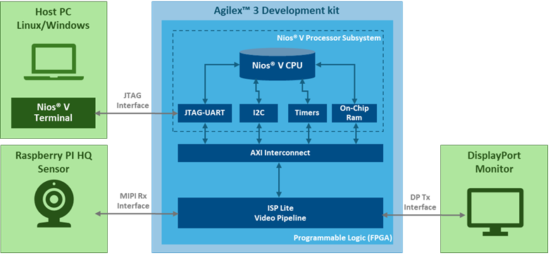{:style="display:block; margin-left:auto; margin-right:auto; width: 80%"}
<center markdown="1">

**High-Level Block Diagram of the Camera Lite Solution System Example Design**
</center>

<br>

The rest of this documentation has been organized in the following sections:

* [Features and Specifications](#features-and-specifications)
* [Camera Lite Video Pipeline Functional Description](#camera-lite-video-pipeline-functional-description)
* [Pre-requisites](#pre-requisites)
* [Getting Started](#getting-started)
* [Running the Demonstration](#running-the-demonstration)
* [Generating the Example Design from Scratch Using the MDT-Flow](#generating-the-example-design-from-scratch-using-the-mdt-flow)
* [Extra Resources](#extra-resources)
* [Other Repositories Used](#other-repositories-used)
* [Useful User Manuals and Reference Materials](#useful-user-manuals-and-reference-materials)

<br>

## **Features and Specifications**

The 4Kp30 Camera Lite Example Design provides:

* Support for the following Input and Output video interfaces
  * Input: MIPI CSI-2
  * Output: DisplayPort 1.4

* Support for the following sensor:
  * Raspberry PI HQ IMX477

* Support for the following progressive video resolutions on the input and output interfaces:
  * Fixed: 3840x2160 30Hz (4K30p)

* Video pipeline subsystem:
  * 12-bit raw data from the sensor up to the Demosaic IP.
  * 10-bit RGB for video processing.
  * VVP ISP IP cores included: Black Level Correction, White Balance Correction, Demosaic, Color Correction Matrix and 1D LUT.
  * Video Frame Buffer
  * Support for an input video switch:
    * 2 inputs and 1 output
    * Input ports receive the data from Sensor and a TPG
    * The selected input data is broadcast to the ISP-Lite video pipeline
  * Support for an output video mixer:
    * Icon Generator
    * Input video stream
    * TPG

## **Camera Lite Video Pipeline Functional Description**

The 4Kp30 Camera Lite Example Design ingests the video input through an industry-standard MIPI interface directly
connected to the sensor. The raw video data coming from the sensor is then processed through
the Image Signal Processing (ISP) pipeline, before output through DisplayPort
(DP). Additionally, the design runs an embedded baremetal Software Application (SW App) on
a Nios® V Soft Processor. 

The following block diagram shows the main components and subsystems of the
Camera Lite Solution System Example Design.

<br>

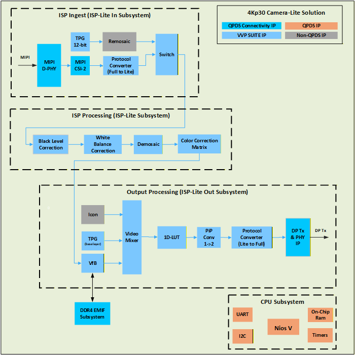{:style="display:block; margin-left:auto; margin-right:auto"}
<center markdown="1">

**The 4Kp30 Camera Lite Example Design Top Block Diagram**
</center>

<br>

The remaining of this section describes each subsystem implemented for this example design, and their internal components. 

### **ISP Ingest**

The ISP pipeline ingests video from a Raspberry Pi (RPi) High-Quality (HQ) Camera module. 
The RPi HQ Camera provides a 2-lane MIPI interface
running at a maximum of 2400Mbps per lane. The optical sensor for the RPi HQ Camera module, is a Sony
IMX477 that outputs a Color Filter Array (CFA) image (also known as a Bayer
image) and can support up to UHD 4K resolution at 30 FPS, with 12 bits per pixel.

<br>

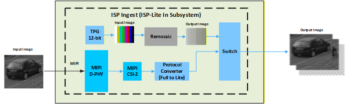{:style="display:block; margin-left:auto; margin-right:auto"}
<center markdown="1">

**ISP Ingest Block Diagram**
</center>

<br>

A CFA is typically a 2x2 mosaic of tiny colored filters (usually red, green,
and blue) placed over a monochromatic image sensor to effectively capture
single color pixels. The CFA typically contains twice the amount of green
filters to align with human vision which is more sensitive to light in the
yellow-green part of the spectrum. The example below shows a typical RGGB (Red,
Green, Green, Blue) CFA pattern which repeats over the entire image (an 8x8
image in this example). Pixels arrive left to right, top to bottom, as
alternating Red and Green pixels on the first line, and then alternating Green
and Blue pixels on the next line. This pattern repeats on the next pair of
lines, and so on. Using single color pixels reduces the overall bandwidth requirements of the
sensor.

<br>

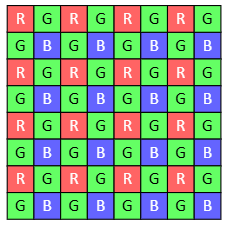{:style="display:block; margin-left:auto; margin-right:auto"}
<center markdown="1">

**8x8 RGGB Color Filter Array (Bayer) Image Example**
</center>

<br>

A demosaic algorithm can be used to rebuild the full color image.
Note that in the CFA domain, 4 color channels actually exist (in our example
they are Red, Green1, Green2, and Blue). Therefore, it can be seen that any
given pixel belongs to just one of these color channels when processing. Each
color channel is sometimes referred to as a CFA phase.

The Altera® MIPI D-PHY IP interfaces the FPGA directly to the RPi HQ Camera 
module via a MIPI cable. The design showcases a 4K (3840x2160)
sensor that can process images up to 30 FPS using 12-bit Bayer pixel samples.
The MIPI D-PHY is configured for 1 link of x2 lanes at 1500
Mbps, which provides sufficient bandwidth, with no skew calibration and
non-continuous clock mode. The sensor module has additional pins, including
Power enable, and a slave I2C interface for powering
and setting up the camera. The power enable pin is connected to an Altera
Parallel Input/Output (PIO) IP, which has an agent Avalon memory-mapped
interface that allows runtime control via the Nios® V Soft Processor. Likewise, the I2C interface is
connected via an I2C Controller. When the SW App starts, it powers the
camera and sets it up for 1500Mbps lane speed, 3840x2160 resolution, raw12
pixel samples, no skew calibration, and blanking for 30 FPS.

The design connects an Altera® MIPI CSI-2 IP to the MIPI D-PHY IP Rx
link using a 2-lane 16-bit PHY Protocol Interface (PPI) bus. The design
configures the CSI-2 IP output at 1 Pixel In Parallel (PiP) using a 297MHz
clock and minimal internal buffering. Since all ISP IPs only support VVP AXI4-S
Lite protocol, a VVP Protocol Converter IP is used on the CSI-2 IP output.

The Input TPG IP allows you to test the ISP parts of the design
without a sensor module input connected to it. It uses the VVP Test Pattern Generator IP and a
non-QPDS IP called Remosaic (RMS) (supplied with the source project). The TPG
has an RGB output which cannot be processed by the ISP IPs as they only support
CFA images. The RMS is used to convert the RGB image into a CFA image by
discarding color information for pixels based on the CFA phase supported by
the sensor. The TPG features several modes, including color bars and
solid colors. The VVP Switch IP, is used to select
the Input source between the MIPI-CSI Rx and the Input TPG.

!!! note "Related Information"

    [Test Pattern Generator IP] <br/>
    [Switch IP]

### **ISP Processing**

This section summarizes the ISP processing functions and IPs used in the
Camera Lite Solution System Example Design:

* [**Black Level Correction**](#black-level-correction)

The Black Level Correction (BLC) IP operates on a 2x2 CFA input image and
adjusts the minimum brightness level of the image, ensuring an actual black
value is represented by the minimum pixel intensity. A camera system typically
adds a pedestal value as an offset to the image at the sensor side.
Artificially increasing black level creates foot room for preserving noise
distribution of the black pixels and prevents artifacts in the final image.

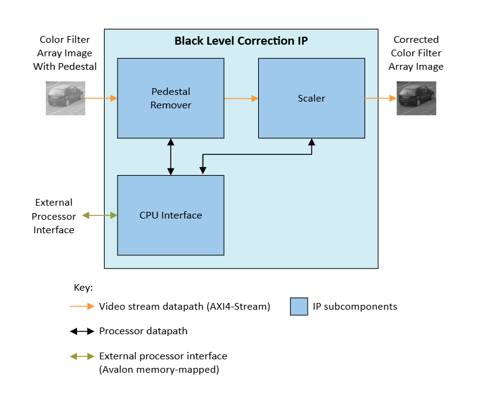{:style="display:block; margin-left:auto; margin-right:auto"}
<center markdown="1">

**Black Level Correction Block Diagram**
</center>

The BLC IP subtracts the pedestal value from the input video stream and scales
the result back to the full dynamic range. The scaler part of BLC multiplies
the pedestal remover value by the scaler coefficient, clipping to the maximum
output pixel value should the calculation overflow.

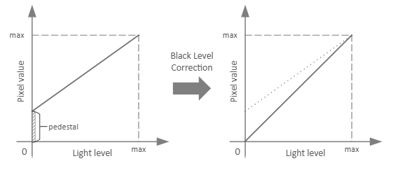{:style="display:block; margin-left:auto; margin-right:auto"}
<center markdown="1">

**BLC Function**
</center>

The SW App sets the pedestal and scaler coefficients for each of the 2x2 CFA
color channels dynamically during runtime. These values can be pre-calibrated,
or calculated dynamically from statistics obtained from the Black Level Statistics
(BLS) IP using the Optical Black Region (OBR) of
the sensor. You can configure the BLC IP to reflect negative values around zero
or clip them to zero.

Note that for this example design the BLS IP is not included,
and the SW App provided relies on pre-calibrated coefficients as a
function of the sensor's analog gain.

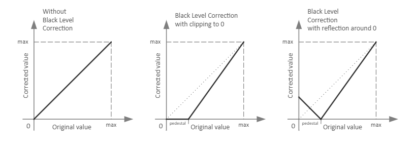{:style="display:block; margin-left:auto; margin-right:auto"}
<center markdown="1">

**Effects of Reflection Around Zero**
</center>

!!! note "Related Information"

    [Black Level Correction IP]

* [**White Balance Correction**](#white-balance-correction)

The White Balance Correction (WBC) IP adjusts colors in a CFA image to
eliminate color casts, which occurs due to lighting conditions or differences
in the light sensitivity of the pixels of different colors. The IP ensures that
gray and white objects appear truly gray and white without, unwanted color
tinting.

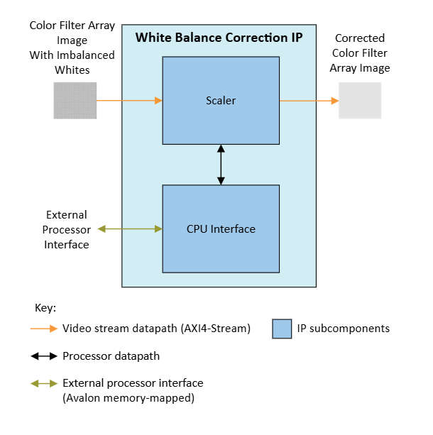{:style="display:block; margin-left:auto; margin-right:auto"}
<center markdown="1">

**White Balance Correction Block Diagram**
</center>

The WBC IP multiplies the color channels of a 2x2 CFA input image by scalar
coefficients per color channel, clipping to the maximum output pixel value
should the calculation overflow.

The design provides a table of WBC scalars pre-calibrated for the sensor for a
range of color temperatures. The white balance algorithm in the SW App uses
color temperature information of the scene to look up WBC scalars from the
calibration table and configures the WBC IP over the Avalon® memory-mapped
interface.

!!! note "Related Information"

    [White Balance Correction IP]

* [**Demosaic**](#demosaic)

The Demosaic IP (DMS) is a color reconstruction IP for converting a 2x2 Bayer
CFA input image to an RGB output image. The DMS interpolates missing colors
for each pixel based on its neighboring pixels.

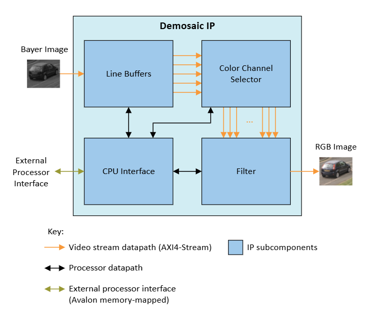{:style="display:block; margin-left:auto; margin-right:auto"}
<center markdown="1">

**Demosaic Block Diagram**
</center>

The DMS analyzes the neighboring pixels for every CFA input pixel and
interpolates the missing colors to produce an RGB output pixel. The IP uses
line buffers to construct pixel neighborhood information, maps the pixels in
the neighborhood depending on the position on the 2x2 CFA pattern, and
interpolates missing colors to calculate the RGB output.

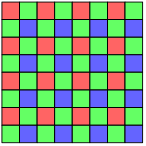{:style="display:block; margin-left:auto; margin-right:auto"}
<center markdown="1">

**An example of a 2x2 RGGB Bayer Color Filter Array (for an 8x8 pixel section of the image)**
</center>

!!! note "Related Information"

    [Demosaic IP]

* [**Color Correction Matrix**](#color-correction-matrix)

The Color Correction Matrix (CCM) functionality is provided by the VVP Color
Space Converter (CSC) IP. A CCM correction is necessary to untangle the
undesired color bleeding across CFA color channels on the sensor. This is
mainly caused by each colored pixel being sensitive to color spectrums other
than their intended color.

The design configures the CSC IP to multiply the input RGB values of each pixel
with a 3x3 CCM to obtain the color corrected output RGB values.
The design provides a table of CCM coefficients pre-calibrated for the sensor
for a range of color temperatures.

!!! note "Related Information"

    [Color Space Converter IP]

### **Output Processing**

The Output Processing side of the video pipeline provides a way to adjust the colorimetry,
as well as to combine an overlay on top of the final ISP 4K output to the DP Tx IP.

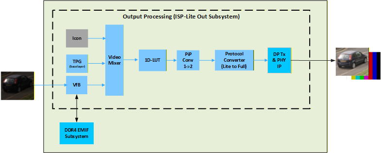{:style="display:block; margin-left:auto; margin-right:auto"}
<center markdown="1">

**Output Processing Subsystem**
</center>

* [**Video Mixer**](#video-mixer)

The Video Mixer is used to combine three different input images, into a single 4K output image. 

The three input images come from the following IPs:

* A VVP Test Pattern Generator IP 
* A VVP Video Frame Buffer IP
* A non-QPDS Icon IP (supplied with the source project).


The TPG is the base layer for the Mixer IP. It is configured by
default as a 4K solid black image which also serves as the screensaver
function, which can be used to test the DP output.

The video buffer provides the image coming from the ISP ingest subsystem, 
and the Nios® V does not have access to its video data.
The video buffer is generated using a VVP Frame Buffer IP, and
an external DDR4 SDRAM (via an EMIF). It is only used for video synchronization, 
as the sensor ingest cannot accept any sufficient back-pressure.

The base layer is mixed with the video buffer
output image (ISP output image), and the Altera® logo overlay image.
The opacity of the Icon overlay is globally controlled and can be changed during runtime by the SW App.

!!! note "Related Information"

    [Test Pattern Generator IP] <br/>
    [Video Frame Buffer IP] <br/>
    [EMIF] <br/>
    [Mixer IP]

* [**1D LUT**](#1d-lut)

The 1D LUT IP uses a runtime configurable LUT to apply a transfer
function to the image. You may use it to implement OOTF, OETF, and EOTF
transfer functions defined for video standards and legacy gamma compression or
decompression. You may also change the LUT content arbitrarily for other
transfer functions or to apply an artistic effect to the image.

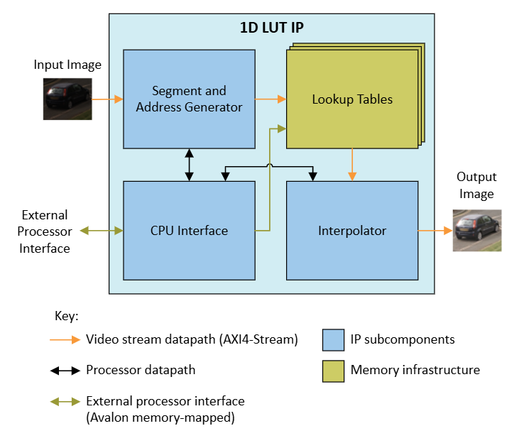{:style="display:block; margin-left:auto; margin-right:auto"}
<center markdown="1">

**1D LUT Block Diagram**
</center>

The 1D LUT IP calculates LUT addresses from the input pixels. It interpolates
fractional differences between LUT values to generate output pixel values. The
IP uses an independent LUT for each color plane. The SW App uses the Avalon®
memory-mapped interface to configure the LUTs.

In this instance, the 1D LUT is used for traditional Gamma correction. The 1D
LUT is configured as a 9-bit LUT and the output is increased to 10-bits to
match the DP Tx that follows. 
The DP Tx functionality is provided by the Altera® DisplayPort connectivity IP.
The DP IP is configured to support DisplayPort 1.4 x4 lanes of 8.1 Gbps, sufficient for
4Kp30 10-bit RGB. The DP IP also supports the VVP AXI4-S Full protocol interface.
Since the DP IP does not support 1 PiP or the VVP AXI4-S Lite protocol, the
output from the 1D-LUT is passed through a VVP PiP Converter IP followed by a
VVP Protocol Converter IP.

!!! note "Related Information"

    [1D LUT IP] <br/>
    [Pixels in Parallel Converter IP] <br/>
    [Protocol Converter IP]


[NiosV Processor for Altera® FPGA]: https://www.altera.com/design/guidance/nios-v-developer
[Agilex™ 3 FPGA and SoC C-Series Development Kit]: https://www.altera.com/products/devkit/a1jui000006ty5dmae/agilex-3-fpga-and-soc-c-series-development-kit
[Agilex™ 3 FPGA C-Series Development Kit]: https://www.altera.com/products/devkit/a1jui000006own7mai/agilex-3-fpga-c-series-development-kit


[7-Zip]: https://www.7-zip.org


[DP to HDMI Adapter]: https://www.amazon.co.uk/gp/product/B01M6WK3KU/ref=ppx_yo_dt_b_asin_title_o02_s00?ie=UTF8&psc=1


[VVP IP Suite]: https://www.altera.com/products/ip/a1jui000004qxfpmak/video-and-vision-processing-suite
[MIPI DPHY IP and MIPI CSI-2 IP]: https://www.altera.com/products/ip/a1jui0000049uuamam/mipi-d-phy-ip#tab-blade-1-3
[Nios® V Processor]: https://www.altera.com/products/ip/a1jui0000049uvama2/nios-v-processors


[Altera® Quartus® Prime Pro Edition version 25.3]: https://www.altera.com/downloads/fpga-development-tools/quartus-prime-pro-edition-design-software-version-25-3-linux


[https://github.com/altera-fpga/agilex-ed-camera]: https://github.com/altera-fpga/agilex-ed-camera
[https://github.com/altera-fpga/modular-design-toolkit]: https://github.com/altera-fpga/modular-design-toolkit
[meta-altera-fpga]: https://github.com/altera-fpga/agilex-ed-camera/tree/rel-25.1/sw/meta-altera-fpga
[meta-altera-fpga-ocs]: https://github.com/altera-fpga/agilex-ed-camera/tree/rel-25.1/sw/meta-altera-fpga-ocs
[meta-vvp-isp-demo]: https://github.com/altera-fpga/agilex-ed-camera/tree/rel-25.1/sw/meta-vvp-isp-demo
[agilex-ed-camera/sw]: https://github.com/altera-fpga/agilex-ed-camera/tree/rel-25.1/sw


[Release Tag]: https://github.com/altera-fpga/agilex-ed-camera/releases/tag/rel-25.1
[https://github.com/altera-fpga/agilex-ed-camera/releases/tag/rel-25.1]: https://github.com/altera-fpga/agilex-ed-camera/releases/tag/rel-25.1
[hps-first-vvp-isp-demo-image-agilex5_mk_a5e065bb32aes1.wic.gz]: https://github.com/altera-fpga/agilex-ed-camera/releases/download/rel-25.1/hps-first-vvp-isp-demo-image-agilex5_mk_a5e065bb32aes1.wic.gz
[fpga-first-vvp-isp-demo-image-agilex5_mk_a5e065bb32aes1.wic.gz]: https://github.com/altera-fpga/agilex-ed-camera/releases/download/rel-25.1/fpga-first-vvp-isp-demo-image-agilex5_mk_a5e065bb32aes1.wic.gz
[fsbl_agilex5_modkit_vvpisp_time_limited.sof]: https://github.com/altera-fpga/agilex-ed-camera/releases/download/rel-25.1/fsbl_agilex5_modkit_vvpisp_time_limited.sof
[top.core.jic]: https://github.com/altera-fpga/agilex-ed-camera/releases/download/rel-25.1/top.core.jic
[top.core.rbf]: https://github.com/altera-fpga/agilex-ed-camera/releases/download/rel-25.1/top.core.rbf
[model_compiler]: https://github.com/altera-fpga/agilex-ed-camera/releases/download/rel-25.1/compile_model.exe


[AGX_5E_Modular_Devkit_ISP_FF_RD.xml]: https://github.com/altera-fpga/agilex-ed-camera/blob/rel-25.1/AGX_5E_Altera_Modular_Dk_ISP_designs/AGX_5E_Modular_Devkit_ISP_FF_RD.xml
[AGX_5E_Modular_Devkit_ISP_RD.xml]: https://github.com/altera-fpga/agilex-ed-camera/blob/rel-25.1/AGX_5E_Altera_Modular_Dk_ISP_designs/AGX_5E_Modular_Devkit_ISP_RD.xml
[Create microSD card image (.wic.gz) using YOCTO/KAS]: https://github.com/altera-fpga/agilex-ed-camera/blob/rel-25.1/sw/README.md
[<g>&check;</g><span hidden="true"> YOCTO/KAS </span>]: https://github.com/altera-fpga/agilex-ed-camera/blob/rel-25.1/sw/README.md

[SOF Modular Design Toolkit (MDT) Flow]: https://github.com/altera-fpga/agilex-ed-camera/blob/rel-25.1/README.md#create-the-design-using-the-modular-design-toolkit-mdt
[RBF Modular Design Toolkit (MDT) Flow]: https://github.com/altera-fpga/agilex-ed-camera/blob/rel-25.1/README.md#create-the-design-using-the-modular-design-toolkit-mdt
[<g>&check;</g><span hidden="true"> SOF MDT Flow </span>]: https://github.com/altera-fpga/agilex-ed-camera/blob/rel-25.1/README.md#create-the-design-using-the-modular-design-toolkit-mdt
[<g>&check;</g><span hidden="true"> RBF MDT Flow </span>]: https://github.com/altera-fpga/agilex-ed-camera/blob/rel-25.1/README.md#create-the-design-using-the-modular-design-toolkit-mdt


[Modular Design Toolkit]: https://github.com/altera-fpga/modular-design-toolkit
[Video Frame Buffer IP]: https://docs.altera.com/r/docs/683329/25.1/video-and-vision-processing-suite-ip-user-guide/video-frame-buffer-ip
[Color Correction Matrix]: https://docs.altera.com/r/docs/683329/25.1/video-and-vision-processing-suite-ip-user-guide/color-space-converter-ip
[Test Pattern Generator IP]: https://docs.altera.com/r/docs/683329/25.1/video-and-vision-processing-suite-ip-user-guide/test-pattern-generator-ip
[Switch IP]: https://docs.altera.com/r/docs/683329/25.1/video-and-vision-processing-suite-ip-user-guide/switch-ip
[Black Level Correction IP]:https://docs.altera.com/r/docs/683329/25.1/video-and-vision-processing-suite-ip-user-guide/black-level-correction-ip
[Clipper IP]: https://docs.altera.com/r/docs/683329/25.1/video-and-vision-processing-suite-ip-user-guide/clipper.html
[White Balance Correction IP]: https://docs.altera.com/r/docs/683329/25.1/video-and-vision-processing-suite-ip-user-guide/white-balance-correction-ip
[Demosaic IP]: https://docs.altera.com/r/docs/683329/25.1/video-and-vision-processing-suite-ip-user-guide/demosaic-ip
[Color Space Converter IP]: https://docs.altera.com/r/docs/683329/25.1/video-and-vision-processing-suite-ip-user-guide/color-space-converter-ip
[1D LUT]: https://www.altera.com/products/ip/a1jui000004r4gnmas/1d-lut-altera-fpga-ip
[1D LUT IP]: https://docs.altera.com/r/docs/683329/25.1/video-and-vision-processing-suite-ip-user-guide/about-the-1d-lut-ip
[Mixer IP]: https://docs.altera.com/r/docs/683329/25.1/video-and-vision-processing-suite-ip-user-guide/mixer-ip
[Video Frame Writer IP]: https://docs.altera.com/r/docs/683329/25.1/video-and-vision-processing-suite-ip-user-guide/video-frame-writer-intel-fpga-ip.html
[Video Frame Reader IP]: https://docs.altera.com/r/docs/683329/25.1/video-and-vision-processing-suite-ip-user-guide/video-frame-reader-intel-fpga-ip.html
[Bits per Color Sample Adapter IP]: https://docs.altera.com/r/docs/683329/25.1/video-and-vision-processing-suite-ip-user-guide/bits-per-color-sample-adapter.html
[Protocol Converter IP]: https://docs.altera.com/r/docs/683329/25.1/video-and-vision-processing-suite-ip-user-guide/protocol-converter-ip
[Pixels in Parallel Converter IP]: https://docs.altera.com/r/docs/683329/25.1/video-and-vision-processing-suite-ip-user-guide/pixels-in-parallel-converter-ip
[Video and Vision Processing Suite Altera® FPGA IP User Guide]: https://www.altera.com/products/ip/a1jui000004qxfpmak/video-and-vision-processing-suite
[Altera® FPGA Streaming Video Protocol Specification]: https://www.intel.com/content/www/us/en/docs/programmable/683397/current/about-the-intel-fpga-streaming-video.html
[AMBA 4 AXI4-Stream Protocol Specification]: https://developer.arm.com/documentation/ihi0051/a/
[Avalon® Interface Specifications – Avalon® Streaming Interfaces]: https://www.intel.com/content/www/us/en/docs/programmable/683091/20-1/streaming-interfaces.html
[EMIF]: https://www.altera.com/design/guidance/emif-support


## **Pre-requisites**

### **Hardware Requirements**

* [Agilex™ 3 FPGA and SoC C-Series Development Kit] or [Agilex™ 3 FPGA C-Series Development Kit].
* [Raspberry Pi High Quality Camera with C/CS mount](https://www.raspberrypi.com/products/raspberry-pi-high-quality-camera/)
* [Wide-angle lens](https://thepihut.com/products/ultra-wide-angle-c-mount-lens-for-raspberry-pi-hq-camera-3-2mm-focal-length)
* [Tripod](https://thepihut.com/products/small-tripod-for-raspberry-pi-hq-camera)
* [15-> 22 pin flat mipi cable 20cm](https://thepihut.com/products/camera-adapter-cable-for-raspberry-pi-5)
* DP cable or HDMI Cable with a [4KP60 converter dongle](https://www.amazon.co.uk/gp/product/B01M6WK3KU/ref=ppx_yo_dt_b_asin_title_o02_s00?ie=UTF8&th=1)
* USB-C JTAG Cable.
* 4K Monitor/TV.

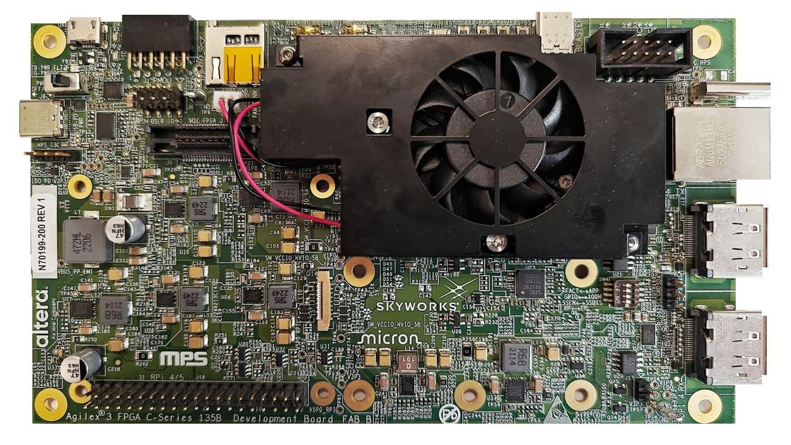{:style="display:block; margin-left:auto; margin-right:auto; width: 80%"}
<center markdown="1">

**Agilex™ 3 FPGA and SoC C-Series Development Kit**
</center>


<br>

### **Software Requirements**

* [Altera® Quartus® Prime Pro version (25.3)](https://www.altera.com/downloads/fpga-development-tools/quartus-prime-pro-edition-design-software-version-25-3-linux).
  * Including open-source tools to compile software targeting Nios® V soft-processors
* Device Support for Agilex™ 3.
* [FPGA Nios® V Open-Source Tools 25.3](https://www.altera.com/design/guidance/nios-v-developer).


<br>

### **Repository and Assets Release Tag Requirements**

The sources listed in this table are the most current and highly recommended
for Quartus® 25.3 builds.  Users are advised to utilize the updated versions of these
building blocks in production environments.
Please note that this is a demonstration design and is not suitable for production or final deployment.

<br>

<center markdown="1">

|Component |Location |Branch |
|-|-|-|
|Assets Release Tag|[https://github.com/altera-fpga/agilex3-ed-camera/releases/tag/rel-25.3](https://github.com/altera-fpga/agilex3-ed-camera/releases/tag/rel-25.3)| rel-25.3|
|Repository|[https://github.com/altera-fpga/agilex3-ed-camera](https://github.com/altera-fpga/agilex3-ed-camera)|rel-25.3|
|Modular Design Toolkit|[https://github.com/altera-fpga/modular-design-toolkit](https://github.com/altera-fpga/modular-design-toolkit)|rel-25.3|

</center>

<br>

## **Getting Started**

Follow the instructions provided in this section to run the 4K30p Camera Solution
System Example Design on the Altera® Agilex™ 3 Development Kit.

### **Download the pre-built FPGA SOF Binary Files**

* Download the binaries for your specific Agilex™ 3 development kit:

<br>

<center markdown="1">

| Source | Link | Description | Device Part Number |
| ---- | ---- | ---- | ---- |
| SOF | [golden_agx3c_soc_devkit_isp_lite_top.sof](https://github.com/altera-fpga/agilex3-ed-camera/releases/download/rel-25.3/golden_agx3c_soc_devkit_isp_lite_top.sof) | SOF file for the [Agilex™ 3 FPGA and SoC C-Series Development Kit](https://www.altera.com/products/devkit/a1jui000006xwkvmac/agilex-3-fpga-and-soc-c-series-development-kit)| A3W135BM16AEA|
| SOF | [golden_agx3c_fpga_devkit_isp_lite_top.sof](https://github.com/altera-fpga/agilex3-ed-camera/releases/download/rel-25.3/golden_agx3c_fpga_devkit_isp_lite_top.sof) | SOF file for the [Agilex™ 3 FPGA C-Series Development Kit](https://www.altera.com/products/devkit/a1jui000006xx13mac/agilex-3-fpga-c-series-development-kit) | A3Y135BM16AEA|

</center>

<br>

### **Setting Up the Development Kit**

!!! NOTE "Warning"
    Handle ESD-sensitive equipment (boards, microSD cards, camera sensors, etc.) only when properly grounded and at an ESD-safe workstation

* Configure the Agilex™ 3 FPGA and SoC C-Series Development Kit switches and jumpers to their factory default settings,
  as per to the user guide [instructions](https://docs.altera.com/r/docs/851698/current/agilextm-3-fpga-and-soc-c-series-development-kit-user-guide/default-settings)

<br>

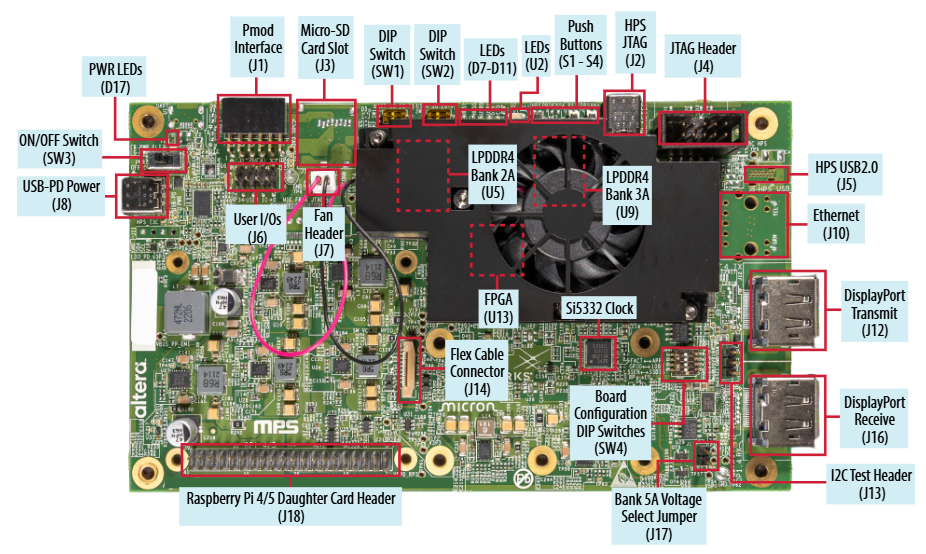{:style="display:block; margin-left:auto; margin-right:auto"}
<center markdown="1">

**Agilex™ 3 Development Kit - Default Switch Positions (Top View)**
</center>

<br>

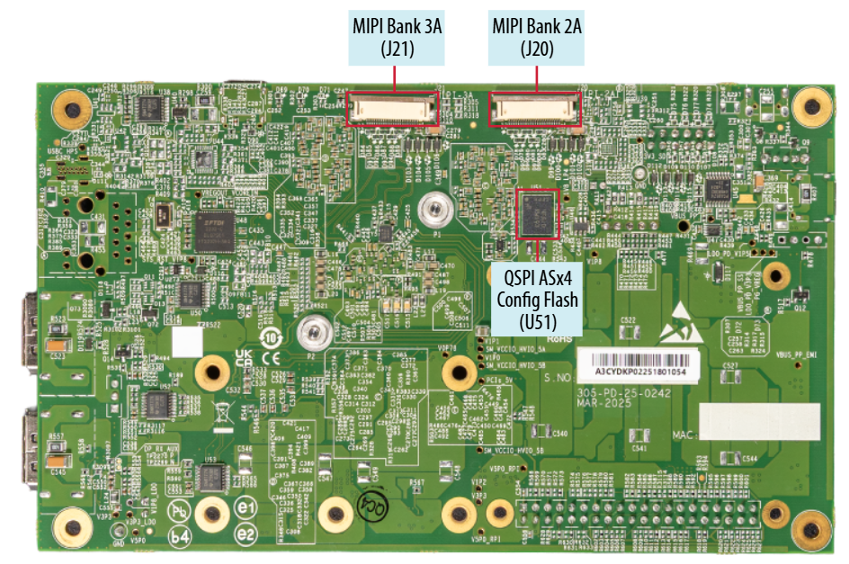{:style="display:block; margin-left:auto; margin-right:auto"}
<center markdown="1">

**Agilex™ 3 Development Kit - Default Switch Positions (Bottom View)**
</center>

<br>

* Proceed to connect the following items to the development kit, as shown in the following figures:
  * USB-C power supply (J8)
  * MIPI sensor cable ( MIPI Bank 3A - J21)
  * DisplayPort Transmit cable (J12)
  * USB-C JTAG cable (J2)

<br>

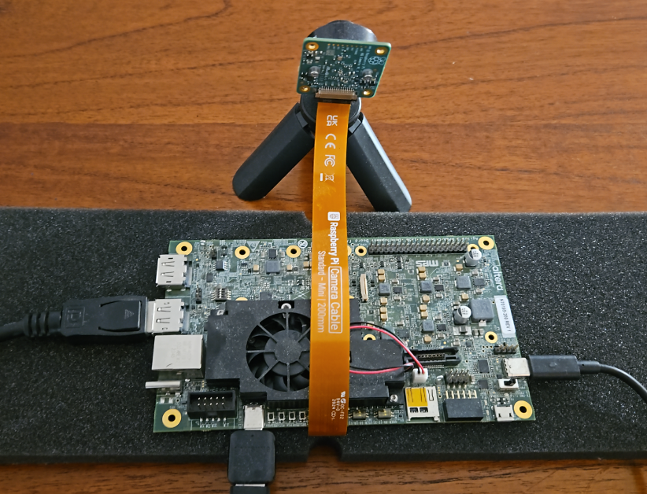{:style="display:block; margin-left:auto; margin-right:auto"}
<center markdown="1">

**Sensor and Development Kit Connections (#1)**
</center>

<br>

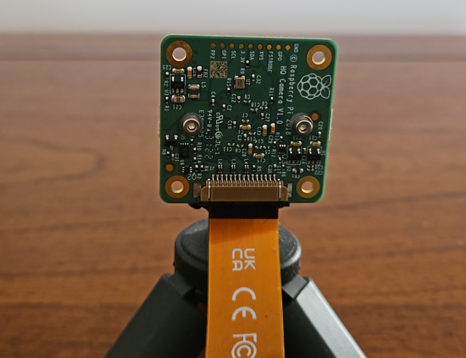{:style="display:block; margin-left:auto; margin-right:auto"}
<center markdown="1">

**Sensor and Development Kit Connections (#2)**
</center>

<br>

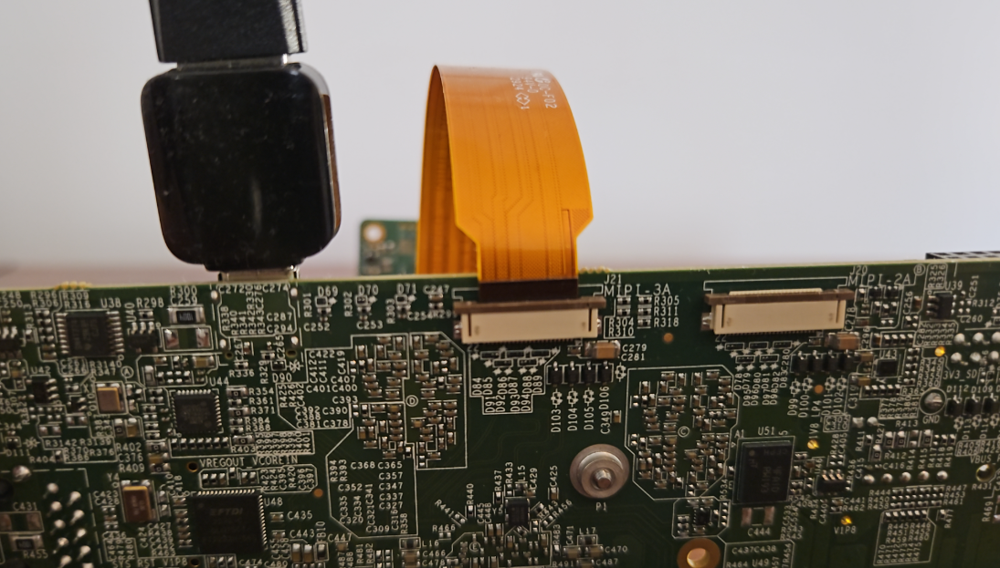{:style="display:block; margin-left:auto; margin-right:auto"}
<center markdown="1">

**Sensor and Development Kit Connections (#3)**
</center>


<br>

## **Running the Demonstration**

### **Programming the Development Kit**

* To program the FPGA using a SOF File:

  * Power up the board.

  * Launch the Quartus® Programmer and Configure the **"Hardware Setup..."**
    settings as follows:

<br>

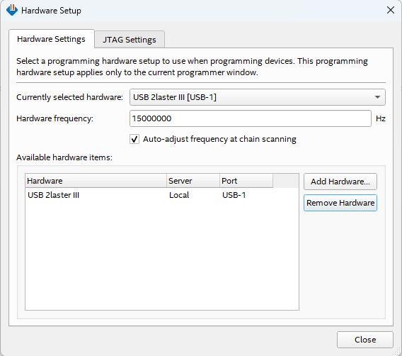{:style="display:block; margin-left:auto; margin-right:auto"}
<center markdown="1">

**Programmer GUI Hardware Settings**
</center>

<br>

* Click "Auto Detect", select the device `A3CW135BM16A` (for the Devkit with SoC) or `A3CY135BM16A` (for the Devkit without SoC), and press
  **"Change File.."**

<br>

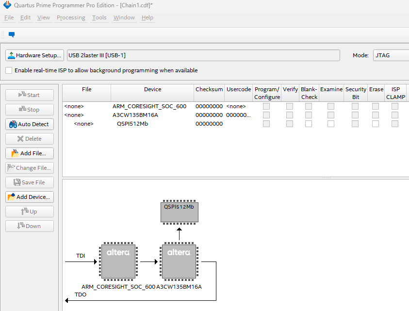{:style="display:block; margin-left:auto; margin-right:auto"}
<center markdown="1">

**Programmer after "Auto Detect"**
</center>

<br>

* Select your `SOF` file, e.g. `golden_agx3c_soc_devkit_isp_lite_top.sof`. Check the
**"Program/Configure"** box and press the **"Start"** button (see below). Wait
until the programming has been completed.

<br>

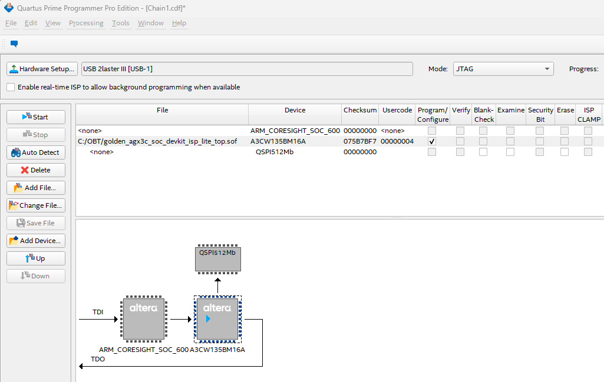{:style="display:block; margin-left:auto; margin-right:auto"}
<center markdown="1">

**Programming the FPGA with a SOF file**
</center>


<br>

### **Demonstrations**

* After the FPGA has been programmed, you could proceed to open a JTAG-UART terminal, using the following command:
  * Linux:
    ```bash
    juart-terminal --device 1 --instance 0
    ```

  * Windows:
    ```bash
    juart-terminal.exe --device 1 --instance 0
    ```

* If successful, you should see the following message on the terminal:

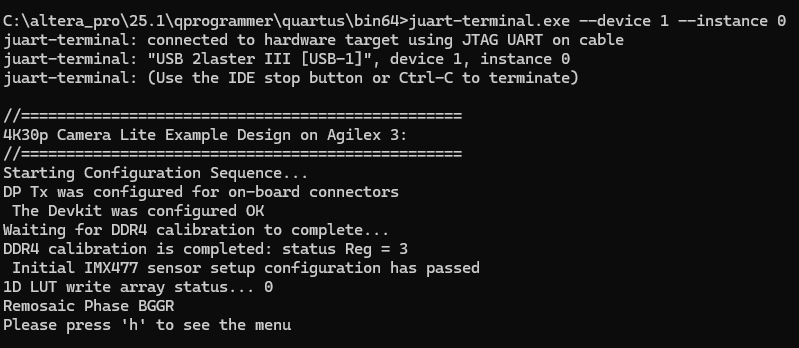{:style="display:block; margin-left:auto; margin-right:auto;"}

<br>

* After pressing `h`, you should see the menu for this demo:

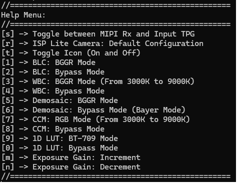{:style="display:block; margin-left:auto; margin-right:auto;"}

<br>

* The menu provides a list of different debug and configuration options in this example design.
  Each option has been mapped to a specific alphanumeric character, and you can control them from a JTAG-UART terminal interface via keyboard input.
  A brief description of all the options is provided below:

* Pressing `s`, will toggle between MIPI Rx and Input TPG.
  The Input TPG has been pre-configured to support four patterns:
  * Color Bars
  * Solid Colors: Blue, Green, and Red

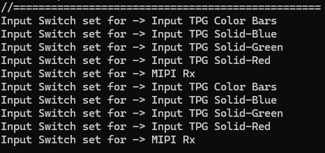{:style="display:block; margin-left:auto; margin-right:auto;"}

<br>

* Pressing `r`, will restore the ISP video pipeline to its default configuration.

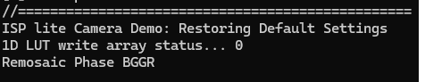{:style="display:block; margin-left:auto; margin-right:auto;"}

<br>

* Pressing `t`, will toggle the Icon `on` and `off`.

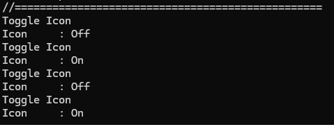{:style="display:block; margin-left:auto; margin-right:auto;"}

<br>

* Pressing `1` will enable the BLC, while Pressing `2` will put the BLC in bypass mode.

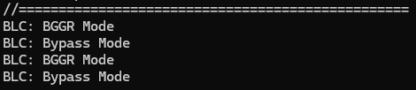{:style="display:block; margin-left:auto; margin-right:auto;"}

<br>

* Pressing `3` will enable the WBC, while Pressing `4` will put the WBC in bypass mode.
  * WBC enabled allows incremental changes from 3000K to 9000K on 1000K steps

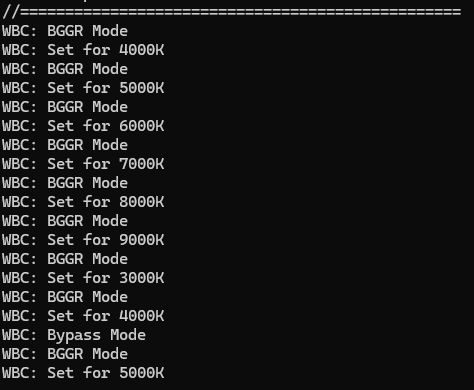{:style="display:block; margin-left:auto; margin-right:auto;"}

<br>

* Pressing `5` will enable the Demosaic, while Pressing `6` will put the Demosaic in bypass mode.

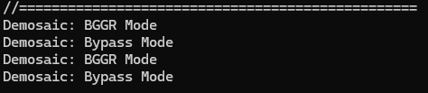{:style="display:block; margin-left:auto; margin-right:auto;"}

<br>

* Pressing `7` will enable the CCM, while Pressing `8` will put the CCM in bypass mode.
  * CCM enabled allows incremental changes from 3000K to 9000K on 1000K steps

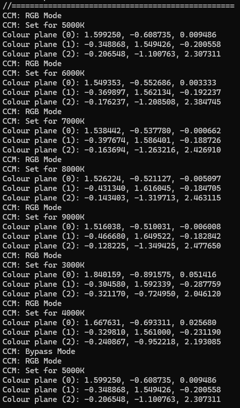{:style="display:block; margin-left:auto; margin-right:auto;"}

<br>

* Pressing `9` will enable the 1D-LUT, while Pressing `0` will put the 1D-LUT in bypass mode.
  * 1D-LUT enabled produces a BT-709 gamma curve

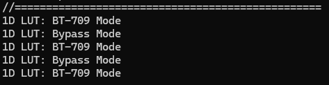{:style="display:block; margin-left:auto; margin-right:auto;"}

<br>

* Pressing `m` will increase the exposure gain of the sensor, while Pressing `n` will decrease the exposure gain of the sensor.
  * For incremental changes, the SW App first increases the digital gain, and once the value reaches its maximum limit,
    it then increases the analog gain.
  * For decremental changes, the SW App first decreases the analog gain, and once the value reaches zero,
    it then decreases the digital gain.

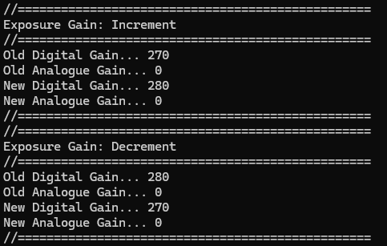{:style="display:block; margin-left:auto; margin-right:auto;"}


<br>

## **Generating the Example Design from Scratch Using the MDT-Flow**

The hardware design for the 4Kp30 Camera Lite Solution System
Example Design uses the Modular Design Toolkit (MDT). The MDT is a method of
creating and building Platform Designer (PD) based Quartus® projects from a
single `.xml` file.

The main advantages of using MDT are:

* Enforces a hierarchical design approach (single level deep).
* Encourages design reuse through a library of off-the-shelf subsystems.
* Enables simple porting of designs to different development boards and FPGA
  devices.
* Provides consistent folder structure and helper scripts.
* Uses TCL scripting for the PD Quartus® project.

The MDT flow consists of 2 separate main steps; a create step and a build step.

**The create step:**

* Parses the design `.xml` file.
* Creates a Quartus® project.
* Creates a PD system for the project.
* Copies all the project files and adds all the MDT generated files to the Quartus® project.

**The build step:**

* Compiles the Nios® V Software and generates a `.hex` file.
* Runs the Quartus® compilation flow.
* Post processes `.sof` files.

!!! note "Related Information"

    [Modular Design Toolkit](https://github.com/altera-fpga/modular-design-toolkit)

<br>

#### **Create the design using the Modular Design Toolkit (MDT)**

Follow the next steps to create the Quartus® and Platform Designer Project for
the 4Kp30 Camera Lite Solution System Example Design:

* Currently, there are available two design description files, provided in a XML format:
  * `AGX_3C_SoC_Devkit_ISP_Lite.xml` for [Agilex™ 3 FPGA and SoC C-Series Development Kit](https://www.altera.com/products/devkit/a1jui000006ty5dmae/agilex-3-fpga-and-soc-c-series-development-kit)
    * Device Part Number: A3CW135BM16AE6S
  * `AGX_3C_FPGA_Devkit_ISP_Lite.xml` for [Agilex™ 3 FPGA C-Series Development Kit](https://www.altera.com/products/devkit/a1jui000006own7mai/agilex-3-fpga-c-series-development-kit)
    * Device Part Number: A3CY135BM16AE6S

* Create your workspace and clone the repository using `--recurse-submodules`:

```bash
cd <workspace>
git clone -b rel-25.3 --recurse-submodules https://github.com/altera-fpga/agilex3-ed-camera.git agilex3-ed-camera
```

* Define a `<project>` location of your choice, creating a directory structure where necessary.

* Navigate to the `agilex3-ed-camera/agx3c_devkit` directory containing the cloned repository and create your project, selecting the XML variant for the project.

```bash
cd agilex3-ed-camera/agx3c_devkit/designs
quartus_sh -t ../modular-design-toolkit/scripts/create/create_shell.tcl -xml_path ./AGX_3C_SoC_Devkit_ISP_Lite.xml -proj_path <project> -o
```

* The previous command will create your Quartus® Prime and Platform Designer Project in `<project>`,
with a folder structure that is consistent with the MDT methodology.

<br>

  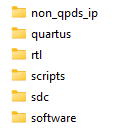{:style="display:block; margin-left:auto; margin-right:auto; width: 20%"}
  <center>

  **Project Directory Structure.**
  </center>

<br>

* The following table provides a brief explanation regarding the content of each of the top-level folders:

    | Directory     | Description  |
    | --------------| ---- |
    | non_qpds_ip   | Contains the source code (RTL) of the design’s custom IP that is not part of Quartus® Prime. |
    | quartus       | Contains the base files for the Quartus® Project including the top.qpf, top.qsf. |
    | rtl           | Contains the sources files to build the project. |
    | scripts       | Contains a collection of TCL scripts from "Modular Design Toolkit" to build and compile the design software and hardware. |
    | sdc           | Contains the .sdc files for the subsystems to compile the project. |
    | software      | Contains all the files for building the application for the Nios® V. |

    </center>

<br>

#### **Build this hardware design using the Modular Design Toolkit (MDT)**

Follow the next steps to build and generate the SOF file for the 4Kp30 Camera Lite Solution System Example Design:

* Navigate to the `<project>/scripts` directory and build your project:

```bash
quartus_sh -t build_shell.tcl -full_compile
```

* The `-full_compile` MDT build option performs not just the full Quartus® compilation, but also
compiles any Nios® V software, and merges it into the `.hex` ROM file built into the project
during compilation.

* Wait for the compilation to finish.

* The generated FPGA programming file is located in the `<project>/quartus/output_files` directory:
  * `top.sof`

* In case you need to recompile the Nios® V SW App, please follow the additional steps:

  * The design includes an initial version of `settings.bsp` that contains parameters
    to run the design. If you modify the Platform Designer's hardware, ensure you keep
    the integrity of the `settings.bsp` file fully synchronized with the Plaform Designer project, i.e. `top_qsys.qsys`.

  * Compile the software application and merge the SOF file with the newly generated `HEX` file
    with the following command:

    ```bash
      cd <project>/scripts/
      quartus_sh -t build_shell.tcl -update_sof
    ```

  * The `-update_sof` MDT build option compiles the Nios® V software and merges it into the `.hex` ROM file built into the project,
    generating a new `top.sof` file with the latest SW App updates.

<br>

## **Extra Resources**
* [Design Security Considerations.](./design-security-considerations.md)
* [Acronyms and Terminology.](./glossary.md)

<br>

## **Other Repositories Used**
|Component |Location |Branch |
|-|-|-|
|Modular Design Toolkit|[https://github.com/altera-fpga/modular-design-toolkit](https://github.com/altera-fpga/modular-design-toolkit)|rel-25.3|

<br>

## **Useful User Manuals and Reference Materials**
* [Agilex™ 3 FPGA and SoC C-Series Development Kit User Guide](https://docs.altera.com/r/docs/851698/current/agilextm-3-fpga-and-soc-c-series-development-kit-user-guide/overview).
* [Raspberry Pi High Quality Camera with C/CS mount](https://www.raspberrypi.com/products/raspberry-pi-high-quality-camera/)
* [Video and Vision Processing Suite Altera® FPGA IP User Guide](https://www.altera.com/products/ip/a1jui000004qxfpmak/video-and-vision-processing-suite).
* [Altera® FPGA Streaming Video Protocol Specification](https://www.intel.com/content/www/us/en/docs/programmable/683397/current/about-the-intel-fpga-streaming-video.html)
* [AMBA 4 AXI4-Stream Protocol Specification](https://developer.arm.com/documentation/ihi0051/a/)
* [Avalon® Interface Specifications – Avalon® Streaming Interfaces](https://www.intel.com/content/www/us/en/docs/programmable/683091/20-1/streaming-interfaces.html)
* [MIPI DPHY IP and MIPI CSI-2 IP](https://www.altera.com/products/ip/a1jui0000049uuamam/mipi-d-phy-ip#tab-blade-1-3).
* [Nios® V Processor](https://www.altera.com/products/ip/a1jui0000049uvama2/nios-v-processors).

<br>

## Notices & Disclaimers

Altera<sup>&reg;</sup> Corporation technologies may require enabled hardware, software or service activation.
No product or component can be absolutely secure. 
Performance varies by use, configuration and other factors.
Your costs and results may vary. 
You may not use or facilitate the use of this document in connection with any infringement or other legal analysis concerning Altera or Intel products described herein. You agree to grant Altera Corporation a non-exclusive, royalty-free license to any patent claim thereafter drafted which includes subject matter disclosed herein.
No license (express or implied, by estoppel or otherwise) to any intellectual property rights is granted by this document, with the sole exception that you may publish an unmodified copy. You may create software implementations based on this document and in compliance with the foregoing that are intended to execute on the Altera or Intel product(s) referenced in this document. No rights are granted to create modifications or derivatives of this document.
The products described may contain design defects or errors known as errata which may cause the product to deviate from published specifications.  Current characterized errata are available on request.
Altera disclaims all express and implied warranties, including without limitation, the implied warranties of merchantability, fitness for a particular purpose, and non-infringement, as well as any warranty arising from course of performance, course of dealing, or usage in trade.
You are responsible for safety of the overall system, including compliance with applicable safety-related requirements or standards. 
<sup>&copy;</sup> Altera Corporation.  Altera, the Altera logo, and other Altera marks are trademarks of Altera Corporation.  Other names and brands may be claimed as the property of others. 

OpenCL* and the OpenCL* logo are trademarks of Apple Inc. used by permission of the Khronos Group™. 


[NiosV Processor for Altera® FPGA]: https://www.altera.com/design/guidance/nios-v-developer
[Agilex™ 3 FPGA and SoC C-Series Development Kit]: https://www.altera.com/products/devkit/a1jui000006ty5dmae/agilex-3-fpga-and-soc-c-series-development-kit
[Agilex™ 3 FPGA C-Series Development Kit]: https://www.altera.com/products/devkit/a1jui000006own7mai/agilex-3-fpga-c-series-development-kit


[7-Zip]: https://www.7-zip.org


[DP to HDMI Adapter]: https://www.amazon.co.uk/gp/product/B01M6WK3KU/ref=ppx_yo_dt_b_asin_title_o02_s00?ie=UTF8&psc=1


[VVP IP Suite]: https://www.altera.com/products/ip/a1jui000004qxfpmak/video-and-vision-processing-suite
[MIPI DPHY IP and MIPI CSI-2 IP]: https://www.altera.com/products/ip/a1jui0000049uuamam/mipi-d-phy-ip#tab-blade-1-3
[Nios® V Processor]: https://www.altera.com/products/ip/a1jui0000049uvama2/nios-v-processors


[Altera® Quartus® Prime Pro Edition version 25.3]: https://www.altera.com/downloads/fpga-development-tools/quartus-prime-pro-edition-design-software-version-25-3-linux


[https://github.com/altera-fpga/agilex-ed-camera]: https://github.com/altera-fpga/agilex-ed-camera
[https://github.com/altera-fpga/modular-design-toolkit]: https://github.com/altera-fpga/modular-design-toolkit
[meta-altera-fpga]: https://github.com/altera-fpga/agilex-ed-camera/tree/rel-25.1/sw/meta-altera-fpga
[meta-altera-fpga-ocs]: https://github.com/altera-fpga/agilex-ed-camera/tree/rel-25.1/sw/meta-altera-fpga-ocs
[meta-vvp-isp-demo]: https://github.com/altera-fpga/agilex-ed-camera/tree/rel-25.1/sw/meta-vvp-isp-demo
[agilex-ed-camera/sw]: https://github.com/altera-fpga/agilex-ed-camera/tree/rel-25.1/sw


[Release Tag]: https://github.com/altera-fpga/agilex-ed-camera/releases/tag/rel-25.1
[https://github.com/altera-fpga/agilex-ed-camera/releases/tag/rel-25.1]: https://github.com/altera-fpga/agilex-ed-camera/releases/tag/rel-25.1
[hps-first-vvp-isp-demo-image-agilex5_mk_a5e065bb32aes1.wic.gz]: https://github.com/altera-fpga/agilex-ed-camera/releases/download/rel-25.1/hps-first-vvp-isp-demo-image-agilex5_mk_a5e065bb32aes1.wic.gz
[fpga-first-vvp-isp-demo-image-agilex5_mk_a5e065bb32aes1.wic.gz]: https://github.com/altera-fpga/agilex-ed-camera/releases/download/rel-25.1/fpga-first-vvp-isp-demo-image-agilex5_mk_a5e065bb32aes1.wic.gz
[fsbl_agilex5_modkit_vvpisp_time_limited.sof]: https://github.com/altera-fpga/agilex-ed-camera/releases/download/rel-25.1/fsbl_agilex5_modkit_vvpisp_time_limited.sof
[top.core.jic]: https://github.com/altera-fpga/agilex-ed-camera/releases/download/rel-25.1/top.core.jic
[top.core.rbf]: https://github.com/altera-fpga/agilex-ed-camera/releases/download/rel-25.1/top.core.rbf
[model_compiler]: https://github.com/altera-fpga/agilex-ed-camera/releases/download/rel-25.1/compile_model.exe


[AGX_5E_Modular_Devkit_ISP_FF_RD.xml]: https://github.com/altera-fpga/agilex-ed-camera/blob/rel-25.1/AGX_5E_Altera_Modular_Dk_ISP_designs/AGX_5E_Modular_Devkit_ISP_FF_RD.xml
[AGX_5E_Modular_Devkit_ISP_RD.xml]: https://github.com/altera-fpga/agilex-ed-camera/blob/rel-25.1/AGX_5E_Altera_Modular_Dk_ISP_designs/AGX_5E_Modular_Devkit_ISP_RD.xml
[Create microSD card image (.wic.gz) using YOCTO/KAS]: https://github.com/altera-fpga/agilex-ed-camera/blob/rel-25.1/sw/README.md
[<g>&check;</g><span hidden="true"> YOCTO/KAS </span>]: https://github.com/altera-fpga/agilex-ed-camera/blob/rel-25.1/sw/README.md

[SOF Modular Design Toolkit (MDT) Flow]: https://github.com/altera-fpga/agilex-ed-camera/blob/rel-25.1/README.md#create-the-design-using-the-modular-design-toolkit-mdt
[RBF Modular Design Toolkit (MDT) Flow]: https://github.com/altera-fpga/agilex-ed-camera/blob/rel-25.1/README.md#create-the-design-using-the-modular-design-toolkit-mdt
[<g>&check;</g><span hidden="true"> SOF MDT Flow </span>]: https://github.com/altera-fpga/agilex-ed-camera/blob/rel-25.1/README.md#create-the-design-using-the-modular-design-toolkit-mdt
[<g>&check;</g><span hidden="true"> RBF MDT Flow </span>]: https://github.com/altera-fpga/agilex-ed-camera/blob/rel-25.1/README.md#create-the-design-using-the-modular-design-toolkit-mdt


[Modular Design Toolkit]: https://github.com/altera-fpga/modular-design-toolkit
[Video Frame Buffer IP]: https://docs.altera.com/r/docs/683329/25.1/video-and-vision-processing-suite-ip-user-guide/video-frame-buffer-ip
[Color Correction Matrix]: https://docs.altera.com/r/docs/683329/25.1/video-and-vision-processing-suite-ip-user-guide/color-space-converter-ip
[Test Pattern Generator IP]: https://docs.altera.com/r/docs/683329/25.1/video-and-vision-processing-suite-ip-user-guide/test-pattern-generator-ip
[Switch IP]: https://docs.altera.com/r/docs/683329/25.1/video-and-vision-processing-suite-ip-user-guide/switch-ip
[Black Level Correction IP]:https://docs.altera.com/r/docs/683329/25.1/video-and-vision-processing-suite-ip-user-guide/black-level-correction-ip
[Clipper IP]: https://docs.altera.com/r/docs/683329/25.1/video-and-vision-processing-suite-ip-user-guide/clipper.html
[White Balance Correction IP]: https://docs.altera.com/r/docs/683329/25.1/video-and-vision-processing-suite-ip-user-guide/white-balance-correction-ip
[Demosaic IP]: https://docs.altera.com/r/docs/683329/25.1/video-and-vision-processing-suite-ip-user-guide/demosaic-ip
[Color Space Converter IP]: https://docs.altera.com/r/docs/683329/25.1/video-and-vision-processing-suite-ip-user-guide/color-space-converter-ip
[1D LUT]: https://www.altera.com/products/ip/a1jui000004r4gnmas/1d-lut-altera-fpga-ip
[1D LUT IP]: https://docs.altera.com/r/docs/683329/25.1/video-and-vision-processing-suite-ip-user-guide/about-the-1d-lut-ip
[Mixer IP]: https://docs.altera.com/r/docs/683329/25.1/video-and-vision-processing-suite-ip-user-guide/mixer-ip
[Video Frame Writer IP]: https://docs.altera.com/r/docs/683329/25.1/video-and-vision-processing-suite-ip-user-guide/video-frame-writer-intel-fpga-ip.html
[Video Frame Reader IP]: https://docs.altera.com/r/docs/683329/25.1/video-and-vision-processing-suite-ip-user-guide/video-frame-reader-intel-fpga-ip.html
[Bits per Color Sample Adapter IP]: https://docs.altera.com/r/docs/683329/25.1/video-and-vision-processing-suite-ip-user-guide/bits-per-color-sample-adapter.html
[Protocol Converter IP]: https://docs.altera.com/r/docs/683329/25.1/video-and-vision-processing-suite-ip-user-guide/protocol-converter-ip
[Pixels in Parallel Converter IP]: https://docs.altera.com/r/docs/683329/25.1/video-and-vision-processing-suite-ip-user-guide/pixels-in-parallel-converter-ip
[Video and Vision Processing Suite Altera® FPGA IP User Guide]: https://www.altera.com/products/ip/a1jui000004qxfpmak/video-and-vision-processing-suite
[Altera® FPGA Streaming Video Protocol Specification]: https://www.intel.com/content/www/us/en/docs/programmable/683397/current/about-the-intel-fpga-streaming-video.html
[AMBA 4 AXI4-Stream Protocol Specification]: https://developer.arm.com/documentation/ihi0051/a/
[Avalon® Interface Specifications – Avalon® Streaming Interfaces]: https://www.intel.com/content/www/us/en/docs/programmable/683091/20-1/streaming-interfaces.html
[EMIF]: https://www.altera.com/design/guidance/emif-support


<br/>
