The 4Kp30 Camera Lite Example Design ingests the video input through an industry-standard MIPI interface directly
connected to the sensor. The raw video data coming from the sensor is then processed through
the Image Signal Processing (ISP) pipeline, before output through DisplayPort
(DP). Additionally, the design runs an embedded baremetal Software Application (SW App) on
a Nios® V Soft Processor. 

The following block diagram shows the main components and subsystems of the
Camera Lite Solution System Example Design.

 

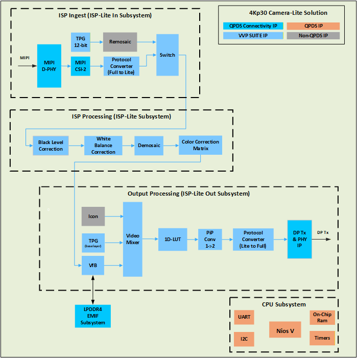{:style="display:block; margin-left:auto; margin-right:auto"}

**The 4Kp30 Camera Lite Example Design Top Block Diagram**

 

The remaining of this section describes each subsystem implemented for this example design, and their internal components. 

### **ISP Ingest**

The ISP pipeline ingests video from a Raspberry Pi (RPi) High-Quality (HQ) Camera module. 
The RPi HQ Camera provides a 2-lane MIPI interface
running at a maximum of 2400Mbps per lane. The optical sensor for the RPi HQ Camera module, is a Sony
IMX477 that outputs a Color Filter Array (CFA) image (also known as a Bayer
image) and can support up to UHD 4K resolution at 30 FPS, with 12 bits per pixel.

 

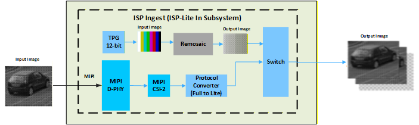{:style="display:block; margin-left:auto; margin-right:auto"}

**ISP Ingest Block Diagram**

 

A CFA is typically a 2x2 mosaic of tiny colored filters (usually red, green,
and blue) placed over a monochromatic image sensor to effectively capture
single color pixels. The CFA typically contains twice the amount of green
filters to align with human vision which is more sensitive to light in the
yellow-green part of the spectrum. The example below shows a typical RGGB (Red,
Green, Green, Blue) CFA pattern which repeats over the entire image (an 8x8
image in this example). Pixels arrive left to right, top to bottom, as
alternating Red and Green pixels on the first line, and then alternating Green
and Blue pixels on the next line. This pattern repeats on the next pair of
lines, and so on. Using single color pixels reduces the overall bandwidth requirements of the
sensor.

 

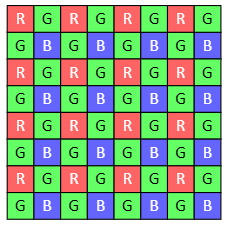{:style="display:block; margin-left:auto; margin-right:auto"}

**8x8 RGGB Color Filter Array (Bayer) Image Example**

 

A demosaic algorithm can be used to rebuild the full color image.
Note that in the CFA domain, 4 color channels actually exist (in our example
they are Red, Green1, Green2, and Blue). Therefore, it can be seen that any
given pixel belongs to just one of these color channels when processing. Each
color channel is sometimes referred to as a CFA phase.

The Altera® MIPI D-PHY IP interfaces the FPGA directly to the RPi HQ Camera 
module via a MIPI cable. The design showcases a 4K (3840x2160)
sensor that can process images up to 30 FPS using 12-bit Bayer pixel samples.
The MIPI D-PHY is configured for 1 link of x2 lanes at 1500
Mbps, which provides sufficient bandwidth, with no skew calibration and
non-continuous clock mode. The sensor module has additional pins, including
Power enable, and a slave I2C interface for powering
and setting up the camera. The power enable pin is connected to an Altera
Parallel Input/Output (PIO) IP, which has an agent Avalon memory-mapped
interface that allows runtime control via the Nios® V Soft Processor. Likewise, the I2C interface is
connected via an I2C Controller. When the SW App starts, it powers the
camera and sets it up for 1500Mbps lane speed, 3840x2160 resolution, raw12
pixel samples, no skew calibration, and blanking for 30 FPS.

The design connects an Altera® MIPI CSI-2 IP to the MIPI D-PHY IP Rx
link using a 2-lane 16-bit PHY Protocol Interface (PPI) bus. The design
configures the CSI-2 IP output at 1 Pixel In Parallel (PiP) using a 297MHz
clock and minimal internal buffering. Since all ISP IPs only support VVP AXI4-S
Lite protocol, a VVP Protocol Converter IP is used on the CSI-2 IP output.

The Input TPG IP allows you to test the ISP parts of the design
without a sensor module input connected to it. It uses the VVP Test Pattern Generator IP and a
non-QPDS IP called Remosaic (RMS) (supplied with the source project). The TPG
has an RGB output which cannot be processed by the ISP IPs as they only support
CFA images. The RMS is used to convert the RGB image into a CFA image by
discarding color information for pixels based on the CFA phase supported by
the sensor. The TPG features several modes, including color bars and
solid colors. The VVP Switch IP, is used to select
the Input source between the MIPI-CSI Rx and the Input TPG.

!!! note "Related Information"

    [Test Pattern Generator IP](https://docs.altera.com/r/docs/683329/25.1/video-and-vision-processing-suite-ip-user-guide/test-pattern-generator-ip)  
    [Switch IP](https://docs.altera.com/r/docs/683329/25.1/video-and-vision-processing-suite-ip-user-guide/switch-ip)

### **ISP Processing**

This section summarizes the ISP processing functions and IPs used in the
Camera Lite Solution System Example Design:

* [**Black Level Correction**](#black-level-correction)

The Black Level Correction (BLC) IP operates on a 2x2 CFA input image and
adjusts the minimum brightness level of the image, ensuring an actual black
value is represented by the minimum pixel intensity. A camera system typically
adds a pedestal value as an offset to the image at the sensor side.
Artificially increasing black level creates foot room for preserving noise
distribution of the black pixels and prevents artifacts in the final image.

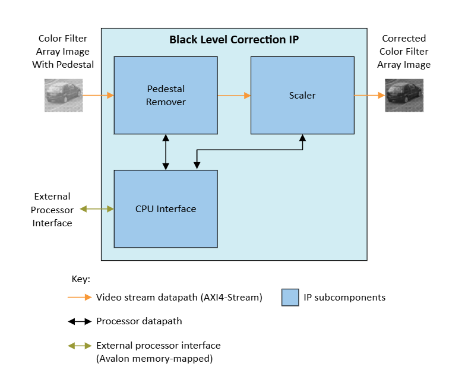{:style="display:block; margin-left:auto; margin-right:auto"}

**Black Level Correction Block Diagram**

The BLC IP subtracts the pedestal value from the input video stream and scales
the result back to the full dynamic range. The scaler part of BLC multiplies
the pedestal remover value by the scaler coefficient, clipping to the maximum
output pixel value should the calculation overflow.

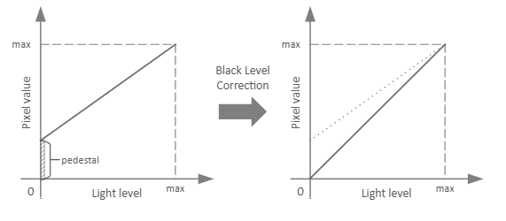{:style="display:block; margin-left:auto; margin-right:auto"}

**BLC Function**

The SW App sets the pedestal and scaler coefficients for each of the 2x2 CFA
color channels dynamically during runtime. These values can be pre-calibrated,
or calculated dynamically from statistics obtained from the Black Level Statistics
(BLS) IP using the Optical Black Region (OBR) of
the sensor. You can configure the BLC IP to reflect negative values around zero
or clip them to zero.

Note that for this example design the BLS IP is not included,
and the SW App provided relies on pre-calibrated coefficients as a
function of the sensor's analog gain.

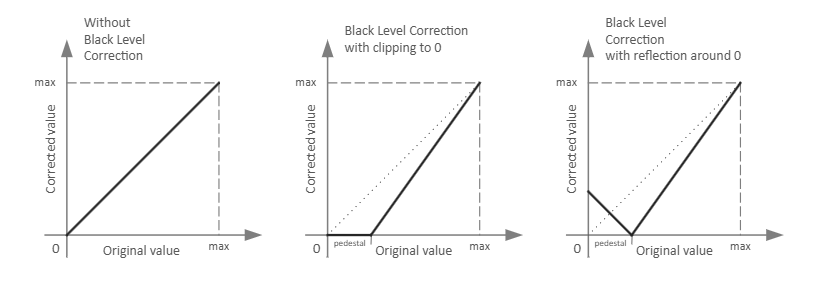{:style="display:block; margin-left:auto; margin-right:auto"}

**Effects of Reflection Around Zero**

!!! note "Related Information"

    [Black Level Correction IP]

* [**White Balance Correction**](#white-balance-correction)

The White Balance Correction (WBC) IP adjusts colors in a CFA image to
eliminate color casts, which occurs due to lighting conditions or differences
in the light sensitivity of the pixels of different colors. The IP ensures that
gray and white objects appear truly gray and white without, unwanted color
tinting.

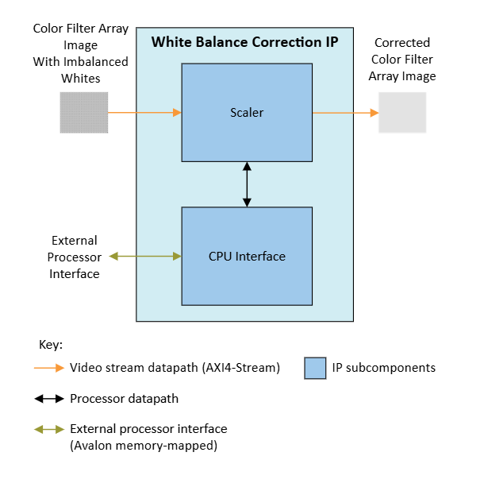{:style="display:block; margin-left:auto; margin-right:auto"}

**White Balance Correction Block Diagram**

The WBC IP multiplies the color channels of a 2x2 CFA input image by scalar
coefficients per color channel, clipping to the maximum output pixel value
should the calculation overflow.

The design provides a table of WBC scalars pre-calibrated for the sensor for a
range of color temperatures. The white balance algorithm in the SW App uses
color temperature information of the scene to look up WBC scalars from the
calibration table and configures the WBC IP over the Avalon® memory-mapped
interface.

!!! note "Related Information"

    [White Balance Correction IP](https://docs.altera.com/r/docs/683329/25.1/video-and-vision-processing-suite-ip-user-guide/white-balance-correction-ip)

* [**Demosaic**](#demosaic)

The Demosaic IP (DMS) is a color reconstruction IP for converting a 2x2 Bayer
CFA input image to an RGB output image. The DMS interpolates missing colors
for each pixel based on its neighboring pixels.

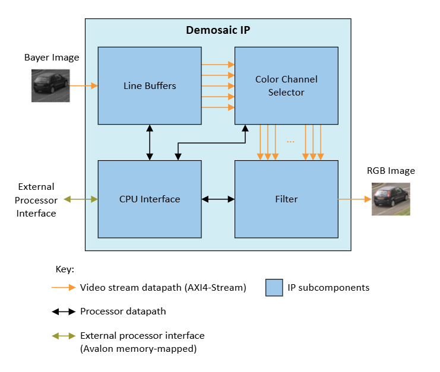{:style="display:block; margin-left:auto; margin-right:auto"}

**Demosaic Block Diagram**

The DMS analyzes the neighboring pixels for every CFA input pixel and
interpolates the missing colors to produce an RGB output pixel. The IP uses
line buffers to construct pixel neighborhood information, maps the pixels in
the neighborhood depending on the position on the 2x2 CFA pattern, and
interpolates missing colors to calculate the RGB output.

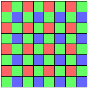{:style="display:block; margin-left:auto; margin-right:auto"}

**An example of a 2x2 RGGB Bayer Color Filter Array (for an 8x8 pixel section of the image)**

!!! note "Related Information"

    [Demosaic IP](https://docs.altera.com/r/docs/683329/25.1/video-and-vision-processing-suite-ip-user-guide/demosaic-ip)

* [**Color Correction Matrix**](#color-correction-matrix)

The Color Correction Matrix (CCM) functionality is provided by the VVP Color
Space Converter (CSC) IP. A CCM correction is necessary to untangle the
undesired color bleeding across CFA color channels on the sensor. This is
mainly caused by each colored pixel being sensitive to color spectrums other
than their intended color.

The design configures the CSC IP to multiply the input RGB values of each pixel
with a 3x3 CCM to obtain the color corrected output RGB values.
The design provides a table of CCM coefficients pre-calibrated for the sensor
for a range of color temperatures.

!!! note "Related Information"

    [Color Space Converter IP](https://docs.altera.com/r/docs/683329/25.1/video-and-vision-processing-suite-ip-user-guide/color-space-converter-ip)

### **Output Processing**

The Output Processing side of the video pipeline provides a way to adjust the colorimetry,
as well as to combine an overlay on top of the final ISP 4K output to the DP Tx IP.

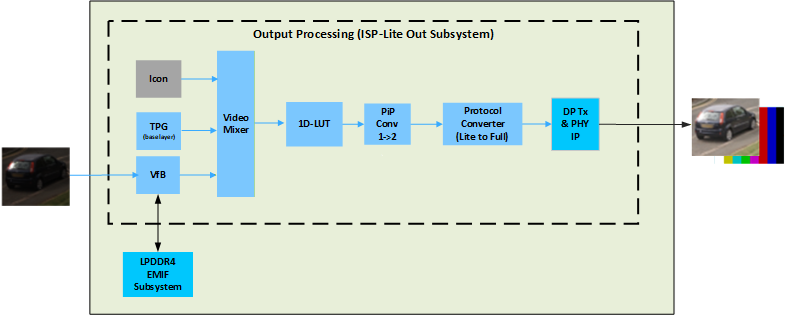{:style="display:block; margin-left:auto; margin-right:auto"}

**Output Processing Subsystem**

* [**Video Mixer**](#video-mixer)

The Video Mixer is used to combine three different input images, into a single 4K output image. 

The three input images come from the following IPs:

* A VVP Test Pattern Generator IP 
* A VVP Video Frame Buffer IP
* A non-QPDS Icon IP (supplied with the source project).

The TPG is the base layer for the Mixer IP. It is configured by
default as a 4K solid black image which also serves as the screensaver
function, which can be used to test the DP output.

The video buffer provides the image coming from the ISP ingest subsystem, 
and the Nios® V does not have access to its video data.
The video buffer is generated using a VVP Frame Buffer IP, and
an external LPDDR4 SDRAM (via an EMIF). It is only used for video synchronization, 
as the sensor ingest cannot accept any sufficient back-pressure.

The base layer is mixed with the video buffer
output image (ISP output image), and the Altera® logo overlay image.
The opacity of the Icon overlay is globally controlled and can be changed during runtime by the SW App.

!!! note "Related Information"

    [Test Pattern Generator IP](https://docs.altera.com/r/docs/683329/25.1/video-and-vision-processing-suite-ip-user-guide/test-pattern-generator-ip)  
    [Video Frame Buffer IP](https://docs.altera.com/r/docs/683329/25.1/video-and-vision-processing-suite-ip-user-guide/video-frame-buffer-ip)  
    [EMIF](https://www.altera.com/design/guidance/emif-support)  
    [Mixer IP](https://docs.altera.com/r/docs/683329/25.1/video-and-vision-processing-suite-ip-user-guide/mixer-ip)

* [**1D LUT**](#1d-lut)

The 1D LUT IP uses a runtime configurable LUT to apply a transfer
function to the image. You may use it to implement OOTF, OETF, and EOTF
transfer functions defined for video standards and legacy gamma compression or
decompression. You may also change the LUT content arbitrarily for other
transfer functions or to apply an artistic effect to the image.

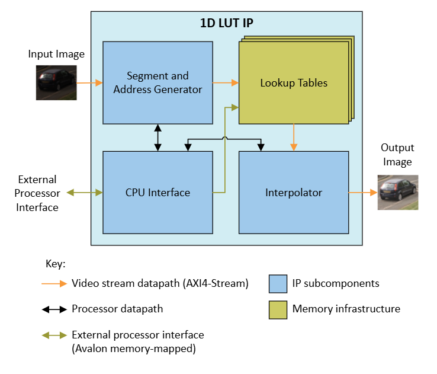{:style="display:block; margin-left:auto; margin-right:auto"}

**1D LUT Block Diagram**

The 1D LUT IP calculates LUT addresses from the input pixels. It interpolates
fractional differences between LUT values to generate output pixel values. The
IP uses an independent LUT for each color plane. The SW App uses the Avalon®
memory-mapped interface to configure the LUTs.

In this instance, the 1D LUT is used for traditional Gamma correction. The 1D
LUT is configured as a 9-bit LUT and the output is increased to 10-bits to
match the DP Tx that follows. 
The DP Tx functionality is provided by the Altera® DisplayPort connectivity IP.
The DP IP is configured to support DisplayPort 1.4 x4 lanes of 8.1 Gbps, sufficient for
4Kp30 10-bit RGB. The DP IP also supports the VVP AXI4-S Full protocol interface.
Since the DP IP does not support 1 PiP or the VVP AXI4-S Lite protocol, the
output from the 1D-LUT is passed through a VVP PiP Converter IP followed by a
VVP Protocol Converter IP.

!!! note "Related Information"

    [1D LUT IP](https://docs.altera.com/r/docs/683329/25.1/video-and-vision-processing-suite-ip-user-guide/about-the-1d-lut-ip)  
    [Pixels in Parallel Converter IP](https://docs.altera.com/r/docs/683329/25.1/video-and-vision-processing-suite-ip-user-guide/pixels-in-parallel-converter-ip)  
    [Protocol Converter IP](https://docs.altera.com/r/docs/683329/25.1/video-and-vision-processing-suite-ip-user-guide/protocol-converter-ip)

