## Introduction

RiscFree* is Ashling’s Eclipse* C/C++ Development Toolkit (CDT) based integrated development environment (IDE) for Altera® FPGAs Arm*-based HPS and RISC-V based Nios® V processors.

This page demonstrates how to use RiscFree* to debug a Linux application running on the Agilex 3 FPGA and SoC C-Series Development Kit. For further information about RiscFree*, visit [The Ashling RiscFree IDE for Altera® FPGAs](https://www.altera.com/products/development-tools/ashling).

### Architecture

The following diagram shows the overall architecture for debugging a Linux application running on the board, with Ashling RiscFree:

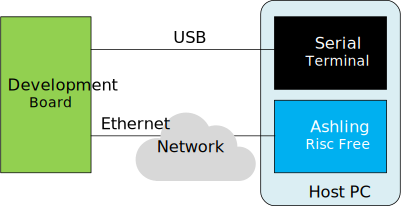

The components are:

* Development Board with Linux running on it
* Serial terminal on Host PC, connected over USB, showing the Linux Console
* Ashling RiscFree running on Host PC, communicating Linux over the network

> *Note*: For debugging Linux applications, we do not use a JTAG connection. Instead the debugger connects to the GDB server running on the board, over Ethernet. 
> *Note*: For the Linux terminal, SSH could also be used instead of serial over USB, provided the IP address of the board is identified first.

### Prerequisites

The following are needed:

* [Agilex 3 FPGA and SoC C-Series Development Kit](https://www.altera.com/products/devkit/po-3000/agilex-3-fpga-and-soc-c-series-development-kit), ordering code DK-A3W135BM16AEA. Other Agilex 3 development boards will also work in the same manner, just that other set HPS Baseline System Example Design binaries will be used.
* Host PC with Linux (Ubuntu 22.04 was used, but others should work too)
* Quartus Pro 26.1 (or just Quartus Pro standalone Programmer 26.1).
* Ashling RiscFree bundled with Quartus Pro 26.1 (can be installed and use with just the standalone Programmer)
* Network access, for downloading the sources while building the binaries

## Instructions


### Setup Environment

Create a folder to contain all the example files:


```bash
sudo rm -rf riscfree-linux-app-debug
mkdir riscfree-linux-app-debug
cd riscfree-linux-app-debug
export TOP_FOLDER=`pwd`
```


Download the compiler toolchain, add it to the PATH variable, to be used by the GHRD makefile to build the HPS Debug FSBL:


```bash
cd $TOP_FOLDER
wget https://developer.arm.com/-/media/Files/downloads/gnu/14.3.rel1/binrel/\
arm-gnu-toolchain-14.3.rel1-x86_64-aarch64-none-linux-gnu.tar.xz
tar xf arm-gnu-toolchain-14.3.rel1-x86_64-aarch64-none-linux-gnu.tar.xz
rm -f arm-gnu-toolchain-14.3.rel1-x86_64-aarch64-none-linux-gnu.tar.xz
export PATH=`pwd`/arm-gnu-toolchain-14.3.rel1-x86_64-aarch64-none-linux-gnu/bin/:$PATH
export ARCH=arm64
export CROSS_COMPILE=aarch64-none-linux-gnu-
```


Enable Quartus tools to be called from command line:


```bash
source ~/altera_pro/26.1/qinit.sh
```


Sdd RiscFree to the system PATH:

```bash
 export PATH="$HOME/altera_pro/26.1/riscfree/RiscFree/:$PATH"
```


### Boot HPS Baseline System Example Design


>*Note*: This design was formerly called "GSRD".

1\. Download and extract the HPS Baseline System Example Design binaries:

```bash
cd $TOP_FOLDER
wget https://releases.rocketboards.org/2026.04/gsrd/agilex3_gsrd.baseline/sdimage.tar.gz
tar xf sdimage.tar.gz
wget https://releases.rocketboards.org/2026.04/gsrd/agilex3_gsrd.baseline/ghrd.hps.jic
```


2\. Write SD card image `$TOP_FOLDER/gsrd-console-image-agilex3.rootfs.wic` to the micro SD card and insert it into the socket on the HPS Expansion Board.

3\. Write QSPI image `$TOP_FOLDER/ghrd.hps.jic` to the board QSPI flash.

4\. Power up the board. It will boot up to Linux prompt. Enter 'root' as username, no password will be requested:

```bash
[   12.897701] arm-smmu-v3-pmcg 160e2000.pmu: Registered PMU @ 0x00000000160e2000 using 4 counters with Global(Counter0) filter settings
[  OK  ] Listening on Load/Save RF Kill Switch Status /dev/rfkill Watch.
         Starting Virtual Console Setup...
[  OK  ] Finished Virtual Console Setup.
[  OK  ] Finished OpenSSH Key Generation.
[   16.477595] socfpga-dwmac 10830000.ethernet eth0: Link is Up - 1Gbps/Full - flow control rx/tx

Poky (Yocto Project Reference Distro) 5.0.16 agilex3 ttyS0

agilex3 login: root

WARNING: Poky is a reference Yocto Project distribution that should be used for
testing and development purposes only. It is recommended that you create your
own distribution for production use.

root@agilex3:~# 

```


### Build Sample Application 


For this example, we will use a very simple Linux C application. Follow the instructions to create the source code, compile the application and download it to the target board.

1. Create the source code:

```bash
cd $TOP_FOLDER
cat << 'EOF' >> application.c
#include <stdio.h>
#include <string.h>

#define N 8

struct stats {
    int    sum;
    int    min;
    int    max;
    double avg;
};

static int process_value(int x, int idx)
{
    int squared = x * x;
    int scaled  = squared + idx;
    return scaled;
}

static void compute_stats(const int *data, int n, struct stats *s)
{
    s->sum = 0;
    s->min = data[0];
    s->max = data[0];

    for (int i = 0; i < n; i++) {
        int v = data[i];
        s->sum += v;
        if (v < s->min) s->min = v;
        if (v > s->max) s->max = v;
    }
    s->avg = (double)s->sum / n;
}

int main(void)
{
    int input[N]  = { 3, 1, 4, 1, 5, 9, 2, 6 };
    int output[N];
    struct stats s;

    memset(&s, 0, sizeof(s));

    printf("input: ");
    for (int i = 0; i < N; i++) printf("%d ", input[i]);
    printf("\n");

    for (int i = 0; i < N; i++)
        output[i] = process_value(input[i], i);

    printf("output: ");
    for (int i = 0; i < N; i++) printf("%d ", output[i]);
    printf("\n");

    compute_stats(output, N, &s);

    printf("sum=%d min=%d max=%d avg=%.2f\n",
           s.sum, s.min, s.max, s.avg);

    return 0;
}
EOF
```

2\. Compile the application:

```bash
cd $TOP_FOLDER
${CROSS_COMPILE}gcc -g3 -O0 -static -o application application.c
```


The following options are used:

| Option | Explanation |
| :--: | :-- |
| -g3 | Enable maximum debug information |
| -o0 | Disable optimizations |
| -static | Create a statically linked image, to avoid any incompatibilities between tool chain an target system |

### Debug Sample Application

1\. Run `ifconfig` to determine the IP address of your board:

```bash
root@agilex3:~# ifconfig
eth0: flags=-28605<UP,BROADCAST,RUNNING,MULTICAST,DYNAMIC>  mtu 1500
        inet 10.244.157.174  netmask 255.255.255.0  broadcast 10.244.157.255
        inet6 fe80::c48b:28ff:fe6f:dde1  prefixlen 64  scopeid 0x20<link>
        ether c6:8b:28:6f:dd:e1  txqueuelen 1000  (Ethernet)
        RX packets 10031  bytes 799236 (780.5 KiB)
        RX errors 0  dropped 0  overruns 0  frame 0
        TX packets 330  bytes 33306 (32.5 KiB)
        TX errors 0  dropped 0 overruns 0  carrier 0  collisions 0
        device interrupt 22  base 0x8000  
```

> *Note*: In the above example the IP address was `10.244.157.174`. But in your specific case you will more than likely get a different value.


2\. Transfer the application binary to the board:

```bash
root@agilex3:~# scp radu@big-machine.local:/home/radu/riscfree-linux-app-debug/application .
The authenticity of host 'big-machine.local (10.244.157.123)' can't be established.
ED25519 key fingerprint is SHA256:dBidwUjHgxubKfiR0gM6piyTJek4QigISANpbR1SXBw.
This key is not known by any other names.
Are you sure you want to continue connecting (yes/no/[fingerprint])? yes
Warning: Permanently added 'big-machine.local' (ED25519) to the list of known hosts.
radu@big-machine.local's password: 
application                                   100% 2808KB  21.5MB/s   00:00    
root@agilex3:~#
```

Adjust the command to match your system:

* Replace `radu` with your host username. 
* Replace `big-machine.local` with your host name or ip address.
* Replace `/home/radu/riscfree-linux-app-debug` with the path for your `$TOP_FOLDER`

3\. Make the application executable:

```bash
root@agilex5e:~# chmod +x ./application
```

4\. Start the GDB server debug session on the board:

```bash
root@agilex5e:~# gdbserver :1234 ./application
Process ./application created; pid = 331
Listening on port 1234
```

>*Note*: For applications that accept command line parameters, you can add them to the line above, after application filename.

5\. Start *RiscFree* on your host

```bash
$ RiscFree -data workspace&
```

6\. Once *RiscFree* has opened, go to **File** > **Import...** and in the **Import** window, select **C/C++** > **C/X++ Executable** and click **Next**:

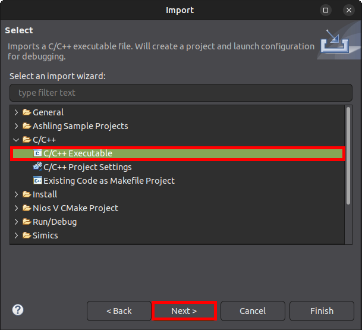


7\. In the **Import Executable** window, click on **Browse** button near the **Select Executable**:

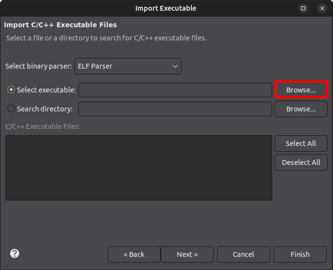

8\. Navigate to the `$TOP_FOLDER/application` location, click on `application` to select it, then click **Open**:

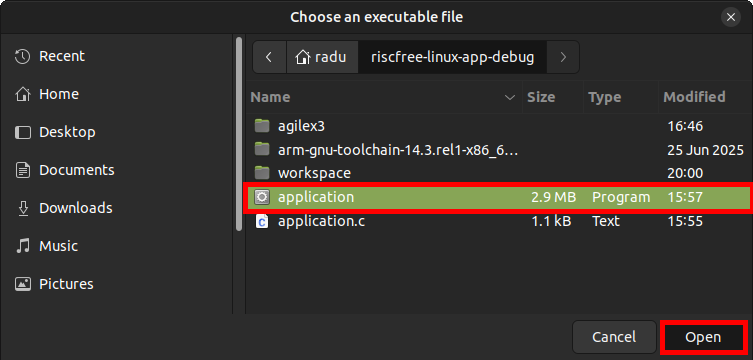

9\. Click **Next** in the **Import** window:

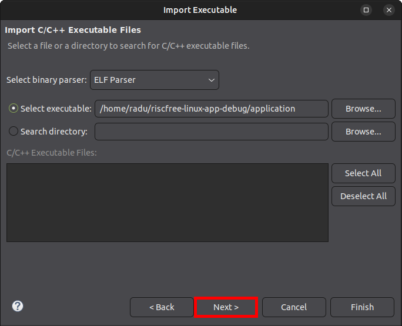

10\. Change the **Create a Launch Configuration** type from **C/C++ Application** to **C/C++ Remote Application**:

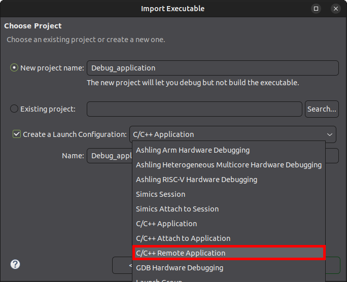

11\. Click **Finish**

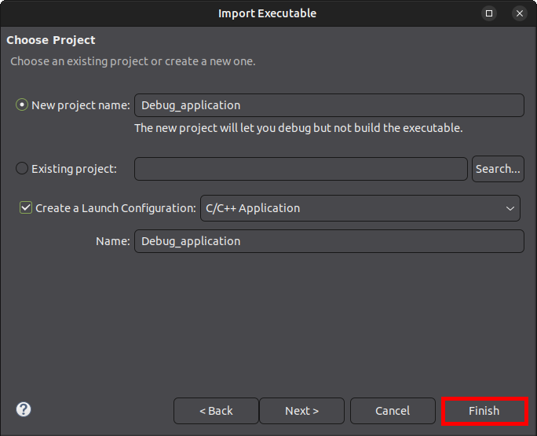

12\. In the **Debug Configurations**:**Main** window, click the **Select one...** link at the bottom of the page, near the message **Multiple launchers available**:

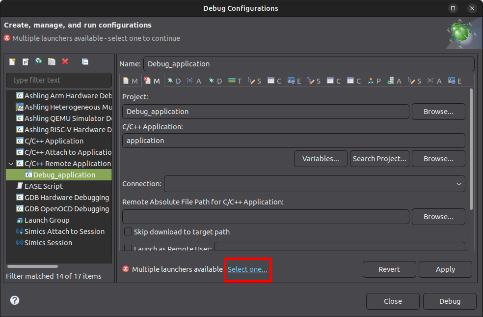

13\. In the **Select Preferred Launcher** window, check **Use configuration specific settings** then select the **GDB (DSF) Manual Remote Debugging Launcher** and click **OK**:

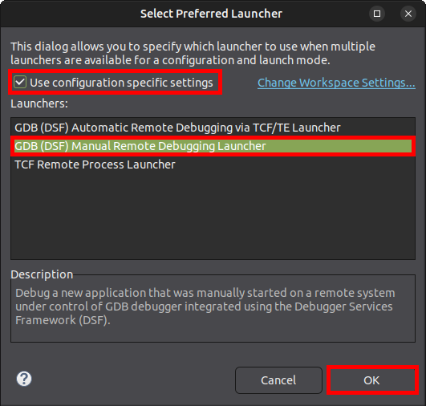

14\. Go to the **Debugger** tab, check **Stop on startup at** **main**, then Click the **Browse** button for the **GDB debugger** field:

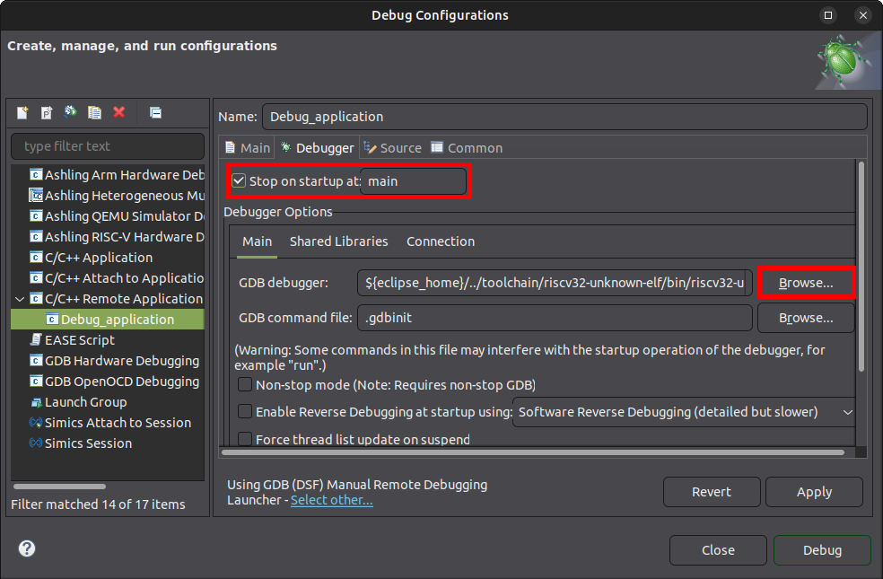

15\. Browse to `~/altera_pro/26.1/riscfree/toolchain/Arm/aarch64-none-linux-gnu/bin/` then select `aarch64-none-linux-gnu-gdb` and click **Open**:

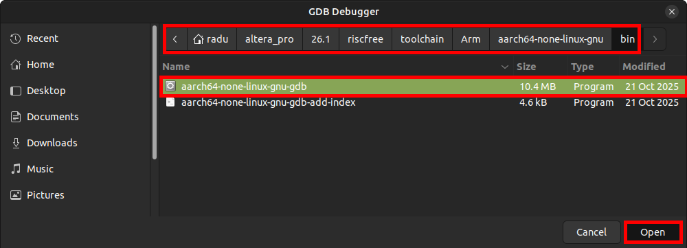

16\. Clear the **GDB command file** field:

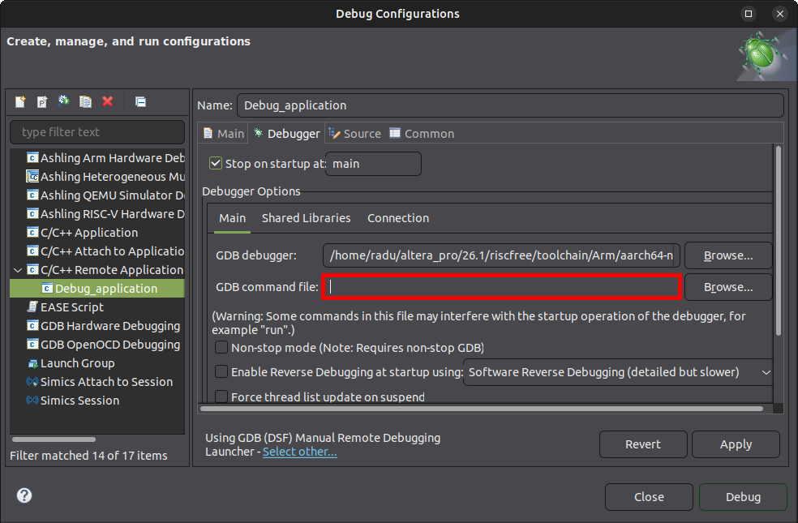

17\. Click on the **Debugger**:**Connection** tab, and edit the **Host name or IP address** to be `your-ip-address` and the **Port number** to be `1234`, then click the **Debug** button:

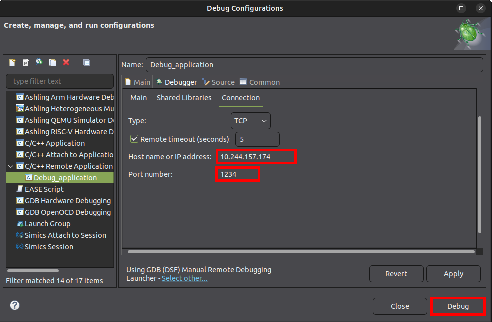

18\. RiscFree will show the `application` stopped at entry to `main` function. 

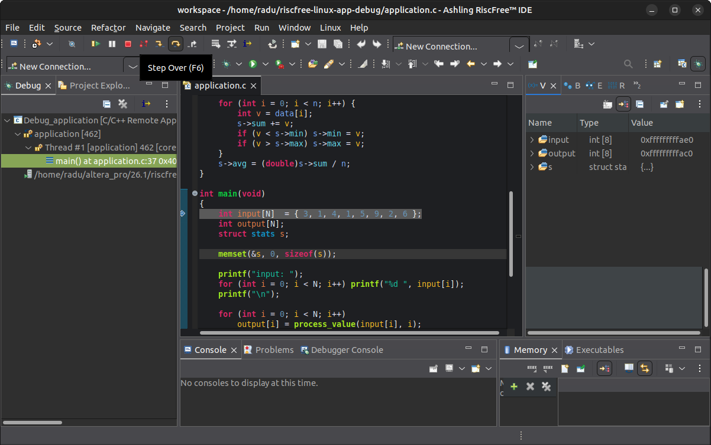

Also, the board Linux console will show a message from the GDB server:

```bash
Remote debugging from host ::ffff:10.244.157.123, port 47072
```

19\. Press **F6 (Step Over)** a few times, to get past displaying the `input` array:

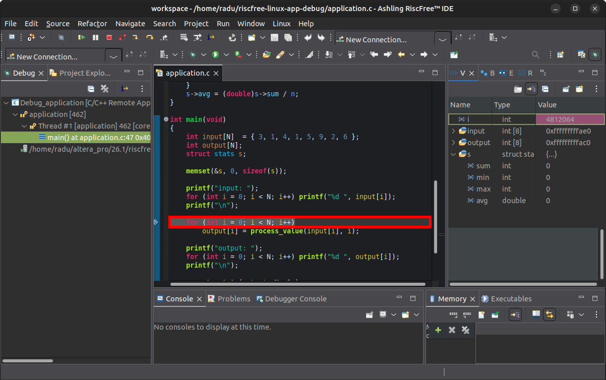

The board Linux console will show the messages printed by the application:

```bash
input: 3 1 4 1 5 9 2 6 
```

20\. Put a breakpoint at the line `printf("output: ");` by double-clicking the left margin of the source code window at that line. Alternatively you can right-click the same left margin at that line, and set the breakpoint from the menu:

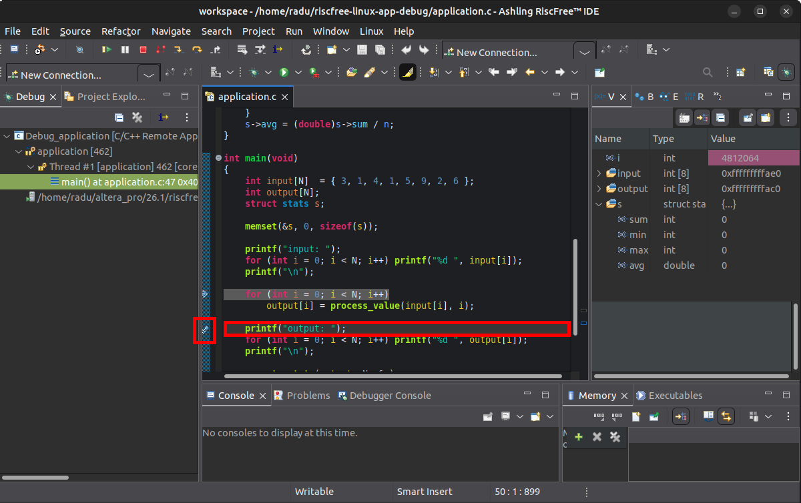

21\. Press the **Resume (F8)** button. Execution will stop at the breakpoint:

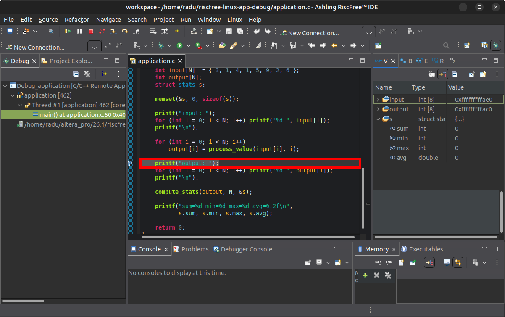

22\. Run the code to after `compute_stats` was called, either by putting a breakpoint then let it run, or by running it step-by-step. Inspect the `s` variable on the right **Variables** panel:

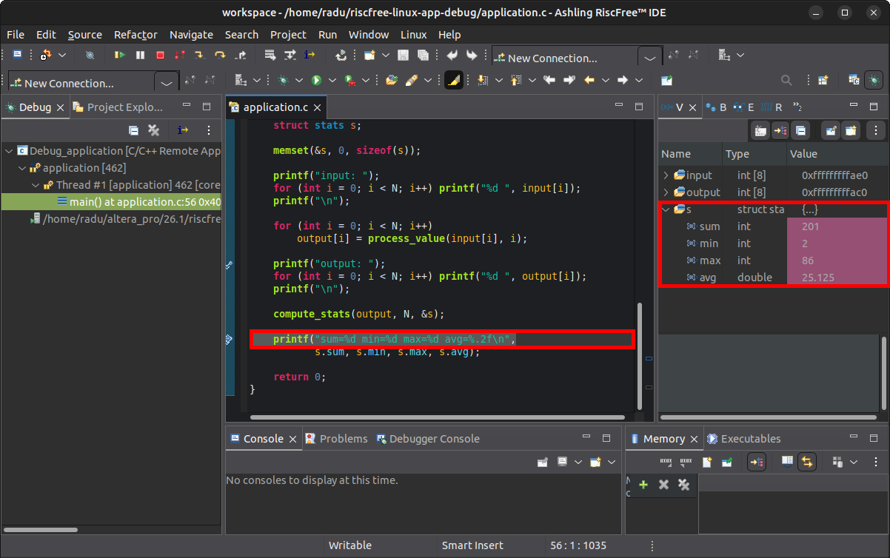

23\. Let the program execute to completion by clicking the **Resume (F8)** button.


Board Linux console will show this:

```bash
output: 9 2 18 4 29 86 10 43 
sum=201 min=2 max=86 avg=25.12

Child exited with status 0
root@agilex3:~# 
```

**RiscFree** will show the debug session ended:

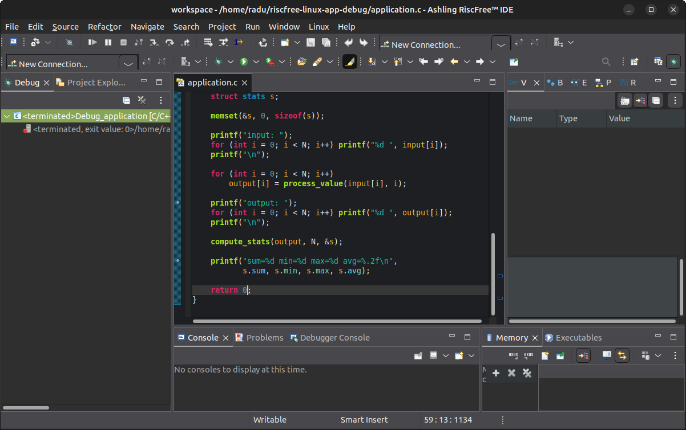

There are more **RiscFree** features that can be used for a full Linux application debugging experience.

## Notices & Disclaimers

Altera<sup>&reg;</sup> Corporation technologies may require enabled hardware, software or service activation.
No product or component can be absolutely secure. 
Performance varies by use, configuration and other factors.
Your costs and results may vary. 
You may not use or facilitate the use of this document in connection with any infringement or other legal analysis concerning Altera or Intel products described herein. You agree to grant Altera Corporation a non-exclusive, royalty-free license to any patent claim thereafter drafted which includes subject matter disclosed herein.
No license (express or implied, by estoppel or otherwise) to any intellectual property rights is granted by this document, with the sole exception that you may publish an unmodified copy. You may create software implementations based on this document and in compliance with the foregoing that are intended to execute on the Altera or Intel product(s) referenced in this document. No rights are granted to create modifications or derivatives of this document.
The products described may contain design defects or errors known as errata which may cause the product to deviate from published specifications.  Current characterized errata are available on request.
Altera disclaims all express and implied warranties, including without limitation, the implied warranties of merchantability, fitness for a particular purpose, and non-infringement, as well as any warranty arising from course of performance, course of dealing, or usage in trade.
You are responsible for safety of the overall system, including compliance with applicable safety-related requirements or standards. 
<sup>&copy;</sup> Altera Corporation.  Altera, the Altera logo, and other Altera marks are trademarks of Altera Corporation.  Other names and brands may be claimed as the property of others. 

OpenCL* and the OpenCL* logo are trademarks of Apple Inc. used by permission of the Khronos Group™. 