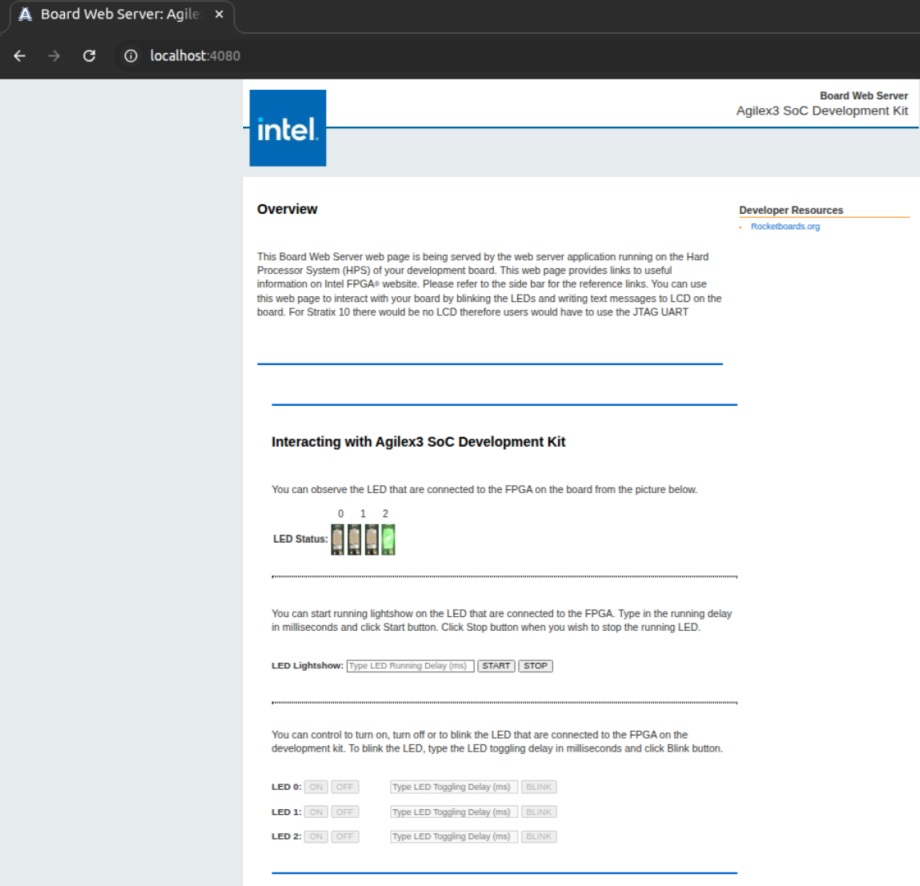

# HPS Simics Linux GSRD Tutorial Example Design: Agilex™ 3  Virtual Platforms

## Overview

The Agilex™ 3 device expands the Altera portfolio with low power and Cost-optimized applications. The Agilex™ 3 dives brings high performance to the cost optimized space for XCRV, IO, EMIF and fast AI-infused fabric. The Agilex™ 3 device is based on the Agilex™ 5 SoC device with the following main differences:

* Functionality based of Agilex™ 5 Production device.*

* HPS Dual core supporting only A55 only (up to 800 MHz), A76 cores not supported.*

* Lower frequency fabric with only 2 speed grade options(345 MHz -6, and 300 MHz -7). Fabric with fixed voltage only.

* XCVR up to 12.5 Gbps. PCIe up to 3.0 x4.

* EMIF support of LPDDR4 @ 2,133. No DDR4 or LPDDR5 supported. 

* No BBRAM.


The Agilex™ 3 C-Series device has the following supported virtual platforms:

- Agilex™ 3  Universal Virtual Platform 


Because the HPS functionality between the Agilex™ 3 and Agilex™ 5 devices is quite similar, the Agilex™ 3 Universal Virtual Platform also instantiates the Agilex™ 5 HPS model. The differences in the functionality between the 2 devices is addressed through configuration parameters in the corresponding target script, which are restricted to the values supported by the Agilex™ 3 device.

The following sections describe the prerequisites for the Intel® Simics Simulator for Altera FPGA and the available virtual platforms, including prebuilt binaries, and instructions for building these binaries. It also covers some common use cases that you can exercise on the virtual platforms.


### Prerequisites

To exercise the instructions presented on this page (build your binaries and exercise the use cases), your system must satisfy the following prerequisites:

- Host PC with Linux OS. (**Note:** Instructions on this page use Ubuntu 22.04 LTS.)
- The following packages are needed to deploy the Simics project:
  - GCC 6.3 compiler or higher
  - g++ 9.4 or higher
  - GNU make 4.1 or higher
- Local Ethernet network with DHCP server (provides IP address to the board).
- Intel Simics Simulator for Altera FPGAs installed.
- Altera Agilex™ 3 Virtual Platform components available to be deployed.


**Notes:**

- For binaries building instructions, see [Build Instructions](#build-instructions).
- For installation instructions for the Intel Simics Simulator for Altera FPGAs and the Agilex™ 3 E-Series virtual platforms, refer to the following documents:
  - [Intel® Simics® Simulator Landing Page](https://www.intel.com/content/www/us/en/products/details/fpga/development-tools/simics-virtual-platform.html) 
  - [Intel® Simics® Simulator for Altera® FPGAs User Guide](https://www.intel.com/content/www/us/en/docs/programmable/784383/)
  - [Agilex™ 5 and Agilex 3 Virtual Platforms User Guide](https://www.intel.com/content/www/us/en/docs/programmable/786901/)
- U-Boot, Linux compilation, Yocto compilation, and the creation of an SD card image require a Linux host PC.
  To create these binaries, the toolchain and other software required need to be downloaded. This is described as part of the instructions in each section.
- The Intel Simics Simulator for Altera® FPGAs is available only for Linux systems.
- In case any use case requires additional prerequisites, these are listed as part of the use case description.


## Release Content

Altera&reg; Quartus<sup>&reg;</sup> Prime Pro Edition Version 25.3 and the following software component versions are used to build the binaries presented in this page: 

| Component | Location | Branch | Commit ID/Tag |
| :-------- | :------- | :----- | :------------ |
| Linux                                 | [https://github.com/altera-fpga/linux-socfpga](https://github.com/altera-fpga/linux-socfpga) | socfpga-6.12.33-lts | QPDS25.3_REL_GSRD_PR |
| Arm Trusted Firmware                  | [https://github.com/altera-fpga/arm-trusted-firmware](https://github.com/altera-fpga/arm-trusted-firmware) | socfpga_v2.13.0   | QPDS25.3_REL_GSRD_PR |
| U-Boot                                | [https://github.com/altera-fpga/u-boot-socfpga](https://github.com/altera-fpga/u-boot-socfpga) | socfpga_v2025.07 | QPDS25.3_REL_GSRD_PR |
| Yocto Project                         | [https://git.yoctoproject.org/poky](https://git.yoctoproject.org/poky) | walnascar | latest              |
| Yocto Project: meta-altera-fpga (for GSRD 2.0)  | [https://github.com/altera-fpga/meta-altera-fpga](https://github.com/altera-fpga/meta-altera-fpga) | walnascar | QPDS25.3_REL_GSRD_PR |
| Yocto Project: meta-intel-fpga (for Legacy GSRD) | [https://git.yoctoproject.org/meta-intel-fpga](https://git.yoctoproject.org/meta-intel-fpga) | walnascar | latest |
| Yocto Project: meta-intel-fpga-refdes (for Legacy GSRD) | [https://github.com/altera-fpga/meta-intel-fpga-refdes](https://github.com/altera-fpga/meta-intel-fpga-refdes) | walnascar | QPDS25.3_REL_GSRD_PR |
| Legacy GSRD | [https://github.com/altera-fpga/gsrd-socfpga](https://github.com/altera-fpga/gsrd-socfpga) | walnascar | QPDS25.3_REL_GSRD_PR |
| Agilex 5 GSRD 2.0 baseline design + meta_custom | [https://github.com/altera-fpga/agilex5e-ed-gsrd](https://github.com/altera-fpga/agilex5e-ed-gsrd) | main                    | QPDS25.3_REL_GSRD_PR |


**Note:** The combination of the component versions indicated in the table above has been validated through the use cases described in this page and it is strongly recommended to use these versions together. If you decided to use any component with different version than the indicated, there is not warranty that this will work.


### Prebuilt Binaries

You can find the prebuilt binaries from the GSRD prebuilt at the following URL: [https://releases.rocketboards.org/2025.10/gsrd/agilex3_gsrd/](https://releases.rocketboards.org/2025.10/gsrd/agilex3_gsrd/). The files in this folder allow you to boot directly from SDCard. It also contains some of the files that are used to generate the final images used to boot from QSPI. The following folder contains the remaining files used by the recipes to create the binaries to boot from QSPI.

- QSPI: [QSPI boot complement files](https://releases.rocketboards.org/2025.10/qspi/agilex3_qspi/). Here is the link to obtain the [uboot_script.its](https://github.com/altera-fpga/meta-intel-fpga-refdes/blob/walnascar/recipes-bsp/u-boot/files/uboot_script.its) file which is also needed.

**Note:** The NAND Boot will be supported in a future release.


| HPS Peripheral                         | Supported |
| :------------------------------------- | :-------- |
| eMMC/SDCard & Combo Phy Controllers    | Yes       |
| DMA Controller                         | Yes       |
| XGMAC Ethernet Controller              | Yes       |
| USB 3.1 Gen1 Controller                | Yes       |
| USB 2.0 Controller                     | Yes       |
| GPIO Controller                        | Yes       |
| I2C Controller Initiator/Target        | Yes       |
| SPI Controller Initiator/Target        | Yes       |
| I3C Controller Initiator               | Yes       |
| I3C Controller Target                  | Yes       |
| NAND Controller & Combo PHY Controller | Yes       |
| APB Timer                              | Yes       |
| QSPI Controller                        | Yes       |
| GICv3 Interrupt controller             | Yes       |
| EDAC RAS Driver                        | Yes       |
| Clock manager                          | Yes       |
| Reset manager                          | Yes       |
| UART                                   | Yes       |
| WatchDog timer                         | Yes       |
| System manager                         | Yes       |
| SVC SOC FPGA manager                   | Yes       |
| SVC FPGA firmware                      | Yes       |
| SMMU                                   | Yes       |
| SVC FCS Crypto                         | Yes       |
| SVC HWMON                              | Yes       |
| SVC RSU                                | Yes       |
| CVP                                    | Yes       |
| PMU                                    | Yes       |


### Build Instructions

The Agilex 3 C-Series development kit includes a QSPI device of 64 MB which is smaller than the regular QSPI device in other development kits. In Simics this is not relevant because the size of the QSPI device in the virtual platform is 256 MB, but in order to keep consistency with the same of the QSPI binary used in the development kit, the instructions to build QSPI binaries requires a different build than the one used to build the binaries for the SD Card boot.

#### Yocto Build Prerequisites

1\. Make sure you have Yocto system requirements met: https://docs.yoctoproject.org/5.0.1/ref-manual/system-requirements.html#supported-linux-distributions.

The command to install the required packages on Ubuntu 22.04 is:

```bash
sudo apt-get update
sudo apt-get upgrade
sudo apt-get install openssh-server mc libgmp3-dev libmpc-dev gawk wget git diffstat unzip texinfo gcc \
build-essential chrpath socat cpio python3 python3-pip python3-pexpect xz-utils debianutils iputils-ping \
python3-git python3-jinja2 libegl1-mesa libsdl1.2-dev pylint xterm python3-subunit mesa-common-dev zstd \
liblz4-tool git fakeroot build-essential ncurses-dev xz-utils libssl-dev bc flex libelf-dev bison xinetd \
tftpd tftp nfs-kernel-server libncurses5 libc6-i386 libstdc++6:i386 libgcc++1:i386 lib32z1 \
device-tree-compiler curl mtd-utils u-boot-tools net-tools swig -y
```

On Ubuntu 22.04 you will also need to point the /bin/sh to /bin/bash, as the default is a link to /bin/dash:

```bash
 sudo ln -sf /bin/bash /bin/sh
```

**Note**: You can also use a Docker container to build the Yocto recipes, refer to https://rocketboards.org/foswiki/Documentation/DockerYoctoBuild for details. When using a Docker container, it does not matter what Linux distribution or packages you have installed on your host, as all dependencies are provided by the Docker container.


#### Build SD Card Boot Binaries

The following diagram illustrates the full-build flow for the binaries used with the Intel Simics simulator. The build flow utilizes the source code placed in [GitHub](https://github.com/altera-fpga) in repositories and uses a flow based on Yocto.


<h5> Set Up the Environment </h5>


```bash
sudo rm -rf agilex3_gsrd
mkdir agilex3_gsrd
cd agilex3_gsrd
export TOP_FOLDER=$(pwd)
```


Download the compiler toolchain, add it to the PATH variable, to be used by the GHRD makefile to build the HPS Debug FSBL:


```bash
cd $TOP_FOLDER
wget https://developer.arm.com/-/media/Files/downloads/gnu/14.3.rel1/binrel/\
arm-gnu-toolchain-14.3.rel1-x86_64-aarch64-none-linux-gnu.tar.xz
tar xf arm-gnu-toolchain-14.3.rel1-x86_64-aarch64-none-linux-gnu.tar.xz
rm -f arm-gnu-toolchain-14.3.rel1-x86_64-aarch64-none-linux-gnu.tar.xz
export PATH=`pwd`/arm-gnu-toolchain-14.3.rel1-x86_64-aarch64-none-linux-gnu/bin/:$PATH
export ARCH=arm64
export CROSS_COMPILE=aarch64-none-linux-gnu-
```

Enable Quartus tools to be called from command line:


```bash
export QUARTUS_ROOTDIR=~/altera_pro/25.3/quartus/
export PATH=$QUARTUS_ROOTDIR/bin:$QUARTUS_ROOTDIR/linux64:$QUARTUS_ROOTDIR/../qsys/bin:$PATH
```


<h5> Build Yocto </h5>


  **1\. Clone Yocto repository and prepare the build:**
  

  ```bash
  cd $TOP_FOLDER
  rm -rf gsrd-socfpga
  git clone -b walnascar https://github.com/altera-fpga/gsrd-socfpga
  cd gsrd-socfpga
  . agilex3-gsrd-build.sh
  build_setup
  ```
  


  **2\. Customize the Yocto Build (Optional)**

  Change the following files in **gsrd-socfpga/meta-intel-fpga-refdes/recipes-bsp/u-boot/files/**:
   * distroboot script:[uboot.txt](https://github.com/altera-fpga/meta-intel-fpga-refdes/blob/master/recipes-bsp/u-boot/files/uboot.txt)
   * **its** file for creating FIT image fromthe above script: [uboot_script.its](https://github.com/altera-fpga/meta-intel-fpga-refdes/blob/master/recipes-bsp/u-boot/files/uboot_script.its) 

  Change the following file in **gsrd-socfpga/meta-intel-fpga-refdes/recipes-kernel/linux/linux-socfpga-lts**:
   * **its** file for creating the **kernel.itb** image: [fit_kernel_agilex5.its](https://github.com/altera-fpga/meta-intel-fpga-refdes/blob/master/recipes-kernel/linux/linux-socfpga-lts/fit_kernel_agilex5.its) , which by default contains the following:<br>

* Kernel <br>
* Distroboot boot script<br>
* Device tree configurations<br>
* Board configurations 


  **3\.Build Yocto**


```bash
bitbake_image
package 
```


After the build is completed successfully, the following two folders are created:

* `agilex3-gsrd-rootfs`: area used by OpenEmbedded build system for builds. For the description of the build directory structure, refer to https://docs.yoctoproject.org/ref-manual/structure.html#the-build-directory-build.
* `agilex3-gsrd-images`: the build script copies here are relevant files built by Yocto from the `agilex3-gsrd-rootfs/tmp/deploy/images/agilex3` folder. It also includes other relevant files.<br>


**Note**: If you want to build binaries creating each one of the binaries independently, you could refer to [HPS GHRD Linux Boot Examples for the Agilex™ 3 ](https://altera-fpga.github.io/rel-25.3/embedded-designs/agilex-3/c-series/boot-examples/ug-linux-boot-agx3/).


The files created from this stage are:

* $TOP_FOLDER/gsrd-socfpga/agilex3-gsrd-images/gsrd-console-image-agilex3.wic - SD Card image<br>
* $TOP_FOLDER/gsrd-socfpga/agilex3-gsrd-images/u-boot-agilex3-socdk-gsrd-atf/u-boot-spl-dtb.bin - FSBL<br>


#### Build QSPI Boot Image

The next step consists of creating the binaries necessaries to boot from QSPI. Since the QSPI device used in the Agilex 3 C-Series development kit includes an small QSPI device, and we want to keep compatibility between the images used in real hardware and the images used in Simics, we need to create a reduced file system through the Yocto build. The following steps need to be re-run to build the final QSPI image used for Simics.


<h5> Set Up the Environment </h5>


```bash
sudo rm -rf agilex3_gsrd-qspi
mkdir agilex3_gsrd-qspi
cd agilex3_gsrd-qspi
export TOP_FOLDER=$(pwd)
```


Download the compiler toolchain, add it to the PATH variable, to be used by the GHRD makefile to build the HPS Debug FSBL:


```bash
cd $TOP_FOLDER
wget https://developer.arm.com/-/media/Files/downloads/gnu/14.3.rel1/binrel/\
arm-gnu-toolchain-14.3.rel1-x86_64-aarch64-none-linux-gnu.tar.xz
tar xf arm-gnu-toolchain-14.3.rel1-x86_64-aarch64-none-linux-gnu.tar.xz
rm -f arm-gnu-toolchain-14.3.rel1-x86_64-aarch64-none-linux-gnu.tar.xz
export PATH=`pwd`/arm-gnu-toolchain-14.3.rel1-x86_64-aarch64-none-linux-gnu/bin/:$PATH
export ARCH=arm64
export CROSS_COMPILE=aarch64-none-linux-gnu-
```

Enable Quartus tools to be called from command line:


```bash
export QUARTUS_ROOTDIR=~/altera_pro/25.3/quartus/
export PATH=$QUARTUS_ROOTDIR/bin:$QUARTUS_ROOTDIR/linux64:$QUARTUS_ROOTDIR/../qsys/bin:$PATH
```


<h5> Build Yocto </h5>


Execute the following commands to build Yocto to generate the QSPI binaries. 

  
  ```bash
  cd $TOP_FOLDER
  rm -rf gsrd-socfpga
  git clone -b walnascar https://github.com/altera-fpga/gsrd-socfpga
  cd gsrd-socfpga
  . agilex3-qspi-build.sh
  build_setup
  bitbake_image
  package
  ```
  

After Yocto build has completed, the following files were created:

* `$TOP_FOLDER/gsrd-socfpga/agilex3-qspi-images/u-boot-agilex3-socdk-qspi-atf/u-boot-spl-dtb.hex`
* `$TOP_FOLDER/gsrd-socfpga/agilex3-qspi-images/core-image-minimal-agilex3_nor.ubifs`
* `$TOP_FOLDER/gsrd-socfpga/agilex3-qspi-images/u-boot-agilex3-socdk-qspi-atf/u-boot.itb`
* `$TOP_FOLDER/gsrd-socfpga/agilex3-qspi-images/u-boot-agilex3-socdk-qspi-atf/u-boot-spl-dtb.hex`
* `$TOP_FOLDER/gsrd-socfpga/agilex3-qspi-images/kernel.itb`
* `$TOP_FOLDER/gsrd-socfpga/agilex3-qspi-images/u-boot-agilex3-socdk-qspi-atf/boot.scr.uimg`


<h5> Build the RPD Image </h5>


The build flow for to create the QSPI image is shown in the following figure:


The layout of the QSPI image is shown in the following table:


| Partition    | MTD Partition | UBI Volume | Volume Name | Type         | Image/Individual File               | Group File | Start Addr | Size |
| :---------------- | :--------- | :--------- | :---------- | :----------- | :----------------------------------- | :--------- | :-------- | ----------- |
| BOOT_INFO | 0 <br>(u-boot) | N/A        | N/A         | RAW          | Bootinfo (Empty)                     | N/A | 0x0    | 2MB |
|   P1 | 0<br> (u-boot) | N/A | N/A | RAW | bitstream (FPGA image, SDM firmware) | N/A | 0x00200000 | ~1 MB |
| U_BOOT | 0 <br>(u-boot) | N/A    | N/A     | RAW      | u-boot.itb | N/A | 0x00400000 |AUTO|
| HPS | 1 <br>(root) | 0<br>1<br>2<br>3<br>4 | env<br>script<br>kernel<br>dtb<br>rootfs | UBI<br>UBI<br>UBI<br>UBI<br>UBIFS | u-boot.env<br>u-boot.scr<br>kernel.itb<br>kernel.dtb<br>rootfs.ubifs | <br><br>root.ubi | 0x00600000<br>Auto<br>Auto<br>Auto<br>Auto | 256KB<br>128KB<br>14MB<br>256KB<br>42MB |


 **1\. Gather the required files**


  ```bash
  cd $TOP_FOLDER
  # Get pre-build .sof
  wget https://releases.rocketboards.org/2025.10/qspi/agilex3_qspi/fpga.sof
  mv fpga.sof legacy_baseline.sof
  # Link files build from Yocto flow
  ln -s $TOP_FOLDER/gsrd-socfpga/agilex3-qspi-images/core-image-minimal-agilex3_nor.ubifs rootfs.ubifs
  ln -s $TOP_FOLDER/gsrd-socfpga/agilex3-qspi-images/kernel.itb .
  ln -s $TOP_FOLDER/gsrd-socfpga/agilex3-qspi-images/u-boot-agilex3-socdk-qspi-atf/boot.scr.uimg .
  ln -s $TOP_FOLDER/gsrd-socfpga/agilex3-qspi-images/u-boot-agilex3-socdk-qspi-atf/u-boot-spl-dtb.hex .
  # Get .pfg
  wget https://releases.rocketboards.org/2025.10/qspi/agilex3_qspi/agilex3_flash_image_hps.pfg 
  sed -i 's/ghrd_a3cw135bm16ae6s\.sof/legacy_baseline.sof/g' agilex3_flash_image_hps.pfg
  # Get /ubinize.cfg
  wget https://releases.rocketboards.org/2025.10/qspi/agilex3_qspi/ubinize.cfg
  ```
  

**2\. Process the u-boot.itb file to be exactly 2MB in size**


```bash
cd $TOP_FOLDER
cp $TOP_FOLDER/gsrd-socfpga/agilex3-qspi-images/u-boot-agilex3-socdk-qspi-atf/u-boot.itb .
uboot_part_size=2*1024*1024
uboot_size=`wc -c < u-boot.itb`
uboot_pad="$((uboot_part_size-uboot_size))"
truncate -s +$uboot_pad u-boot.itb
mv u-boot.itb u-boot.bin
```


**3\. Create the `root.ubi` file and rename it to `hps.bin` as Programming File Generator needs the `.bin` extension**


```bash
cd $TOP_FOLDER
ubinize -o root.ubi -p 65536 -m 1 -s 1 ubinize.cfg
ln -s root.ubi hps.bin
```


**4\. Create the RPD file**


```bash
cd $TOP_FOLDER
quartus_pfg -c agilex3_flash_image_hps.pfg    
```


The following file is created:

* $TOP_FOLDER/agilex_flash_image_jic.rpd


#### How to Manually Update the kernel.itb file


The **kernel.itb** file is a Flattattened Image Tree (FIT) file that includes the following components:

* Linux kernel.
* Several board configurations that indicate what components from the **kernel.itb** (Linux kernel, device tree and 2nd Phase fabric design) should be used for a specific board.
* Linux device tree*.
* 2nd Phase Fabric Design*.

 \* One or more of these components to support the different board configurations.

The **kernel.itb** is created from a **.its** (Image Tree Source file) that describes its structure. In the GSRD, the  **kernel.itb** file is located in the following directory, where you can find also all the components needed to create it, including the .its file:

* **$TOP_FOLDER/gsrd-socfpga/<*device-devkit*>-gsrd-rootfs/tmp/work/<*device-devkit*>-poky-linux/linux-socfpga-lts/<*linux branch*>+git/linux-<*device devkit*>-standard-build/**

If you want to modify the kernel.itb by replacing one of the component or modifying any board configuration, you can do the following:

1. Install **mtools** package in your Linux machine.
   ```bash
   $ sudo apt update
   $ sudo apt install mtools
   ```
   
2. Go to the folder in which the **kernel.itb** is being created under the GSRD.
   ```bash
   $ cd $TOP_FOLDER/gsrd-socfpga/<device-devkit>-gsrd-rootfs/tmp/work/<device-devkit>-poky-linux/linux-socfpga-lts/<linux branch>+git/linux-<device-devkit>-standard-build/
   $ ls *.its
   fit_kernel_<device-devkit>.its
   ```
   
3. In the .its file, observe the components that integrates the kernel.itb identifying the nodes as indicated next:

   **images** node:<br>
   - **kernel** node - Linux kernel defined with the **data** parameter in the node.<br>
   - **fdt-X** node    - Device tree X defined with the **data** parameter in the node.<br>
   - **fpga-X** node -  2nd Phase FPGA Configuration .rbf defined with the **data** parameter in the node.
   
   **configurations** node:<br>
   - **board-X** node - Board configuration with the name defined with the **description** parameter. The components for a specific board configuration are defined with the **kernel**, **fdt** and **fpga** parameters.   

4. In this directory, you can replace any of the files corresponding to any of the components that integrate the **kernel.itb**, or you can also modify the **.its** to change the name/location of any of the components or change the board configuration.

5. Finally, you need to re-generate the new **kernel.itb** as indicated next.
   ```bash
   $ rm kernel.itb
   $ mkimage -f fit_kernel_<device-devkit>.its kernel.itb
   ```

At this point you can use the new **kernel.itb** as needed. Some options could be:

* Use U-Boot to bring it to your SDRAM board through TFTP to boot Linux or to write it to a SD Card device
* Update the flash image (QSPI, SD Card, eMMC or NAND) from your working machine.
 

#### How to Manually Update the Content of the SD Card Image


As part of the Yocto GSRD build flow, the SD Card image is built for the SD Card boot flow. This image includes a couple of partitions. One of these partition (a FAT32) includes the U-Boot proper, a Distroboot boot script and the Linux.itb - which includes the Linux kernel image, , the Linux device tree, the 2nd phase fabric design and board configuration (actually several versions of these last 3 components). The 2nd partition (an EXT3 or EXT4 ) includes the Linux file system. 

{: style="height:500px"}

If you want to replace any the components or add a new item in any of these partitions, without having to run again the Yocto build flow. 

This can be done through the **wic** application available on the **Poky** repository that is included as part of the GSRD build directory: **$TOP_FOLDER/gsrd-socfpga/poky/scripts/wic** 

This command allows you to inspect the content of a SD Card image, delete, add or replace any component inside of the image. This command is also provided with help support:

   ```bash
   $ $TOP_FOLDER/gsrd-socfpga/poky/scripts/wic help
   
   Creates a customized OpenEmbedded image.

   Usage:  wic [--version]
           wic help [COMMAND or TOPIC]
           wic COMMAND [ARGS]

       usage 1: Returns the current version of Wic
       usage 2: Returns detailed help for a COMMAND or TOPIC
       usage 3: Executes COMMAND

   COMMAND:

    list   -   List available canned images and source plugins
    ls     -   List contents of partitioned image or partition
    rm     -   Remove files or directories from the vfat or ext* partitions
    help   -   Show help for a wic COMMAND or TOPIC
    write  -   Write an image to a device
    cp     -   Copy files and directories to the vfat or ext* partitions
    create -   Create a new OpenEmbedded image
    :
    :
   ```
   The following steps show you how to replace the **kernel.itb** file inside of the fat32 partition in a .wic image.

1. The **wic ls** command allows you to inspect or navigate over the directory structure inside of the SD Card image. For example you can observe the partitions  in the SD Card image in this way:

   ```bash
   # Here you can inspect the content a wic image see the 2 partitions inside of the SD Card image
   $ $TOP_FOLDER/gsrd-socfpga/poky/scripts/wic ls my_image.wic
   Num     Start        End          Size      Fstype
   1       1048576    525336575    524288000  fat32    
   2     525336576   2098200575   1572864000  ext4   
   
   # Here you can naviagate inside of the partition 1
   $ $TOP_FOLDER/gsrd-socfpga/poky/scripts/wic ls my_image.wic:1
   Volume in drive : is boot       
   Volume Serial Number is 9D2B-6341
   Directory for ::/
   
   BOOTSC~1 UIM      2431 2011-04-05  23:00  boot.scr.uimg
   kernel   itb  15160867 2011-04-05  23:00 
   u-boot   itb   1052180 2011-04-05  23:00 
        3 files          16 215 478 bytes
                        506 990 592 bytes free
   ```
   
2. The **wic rm** command allows you to delete any of the components in the selected partition. For example, you can delete the **kernel.itb** image from the partition 1(fat32 partition).

   ```bash
   $ $TOP_FOLDER/gsrd-socfpga/poky/scripts/wic rm my_image.wic:1/kernel.itb
   ```

3. The **wic cp** command allows you to copy any new item or file from your Linux machine to a specific partition and location inside of the SD Card image. For example, you can copy a new **kernel.itb** to the partition 1.

   ```bash
   $ $TOP_FOLDER/gsrd-socfpga/poky/scripts/wic cp <path_new_kernel.itb> my_image.wic:1/kernel.itb
   ```

**NOTE**: The **wic** application also allows you to modify any image with compatible vfat and ext* type partitions which also covers images used for **eMMC** boot flow. 

#### Known Issues with the Release

For known issues in this release please refer to the **Intel Simics Simulator for Altera FPGAs Release** information located in the [Intel Simics Simulator for Altera FPGAs Landing Page](https://www.intel.com/content/www/us/en/products/details/fpga/development-tools/simics-virtual-platform.html).

## Agilex™ 3  Universal Virtual Platform

The Intel Simics Simulator for Altera FPGAs supports a virtual platform specific for the Agilex™ 3 device named Agilex™ 3 Universal Virtual Platform. Since the design of the Agilex 3 device is based on Agilex™ 5, the  Agilex™ 3 Universal Virtual platform is also based on the Agilex™ 5  Universal Virtual Platform and and actually the Agilex™ 3 Universal Virtual Platform also instantiates the HPS model of the Agilex™ 5 device. In the Agilex™ 3 Universal Virtual Platform some configurable parameters are kept fixed

 In order to mimics the Agilex™ 3 device functionality, some configurable parameters in the Agilex™ 3 Universal Virtual Platform are kept fixed, so the functionality of the Agilex™ 3 device can be replicated. 


The  Agilex™ 3 Universal Virtual Platform is associated with the **agilex3c-universal.simics** target script. For detailed information about the architecture and capabilities of this virtual platform, you can refer to the  [Agilex™ 5 Simics Virtual Platform - Universal](https://altera-fpga.github.io/rel-25.3/embedded-designs/agilex-5/common/virtual-platforms/linux-gsrd/ug-linux-gsrd-agilex5-virtual-platforms/#agilextm-5-simics-virtual-platform-universal) page. Here, we just going to describe the differences that applies for the Agilex™ 3 Universal Virtual Platform.

#### Differences between the Agilex™ 3  Universal Virtual Platform and the Agilex™ 5  Universal Virtual Platform

As mentioned before, both virtual platforms instantiates the HPS model of the Agilex™ 5 device, and the functional differences are handled through fixed configuration parameters in the **agilex3c-universal.simics** target script.  These differences and the fixed value is listed next:

| Differences | Configuration Parameter Fixed Value |
| :---------------- | :--------- |
| Agilex™ 3 is based on Agilex 5 Production version | **stepping** = B0 |
| Agilex™ 3 only have the 2 A55 Cores | **hps_core0_1_power_on** = TRUE<br>**hps_core2_power_on** = FALSE<br/>**hps_core3_power_on** = FALSE |
|Agilex™ 3 boot core only can be set the core0 A55|**hps_boot_core** = 0|
| Agilex™ 3 Cores maximum frequency is limited to 800 MHz | **hps_cpu_freq_mhz** must be lower or equal 800              |

### Use Cases Supported by the Agilex™ 3 E-Series Universal Virtual Platform

The following sections explain some basic use cases using the **Agilex™ 3 C-Series Universal** virtual platform. The features and use cases supported by the Agilex™ 5 Universal Virtual platform described in  [Agilex™ 5 Universal Virtual Platform Use Cases](https://altera-fpga.github.io/rel-25.3/embedded-designs/agilex-5/common/virtual-platforms/linux-gsrd/ug-linux-gsrd-agilex5-virtual-platforms/#use-case-exercise-sdcard-boot-flow-from-fsbl-to-linux) also are supported by this virtual platform, so you can refer to those instructions to exercise them.

The preconditions required to execute them are listed in the following section:

#### Simulation Setup

Consider that the Intel Simics Simulator for Altera® FPGAs Simulator has been installed on a Linux System and the output binaries generated from [Build Instructions](#build-instructions) section are already available.


1. Create a project directory under the Intel Simics Simulator installation directory (Assuming it is **SimicsInstallDir**):

  ```bash
  $ mkdir project-1
  $ cd project-1
  ```

2. Under the new project directory created, deploy the **agilex3c-universal** virtual platform:

  ```bash
  $<Simics installation dir>/simics/bin/simics_intelfpga_cli --list-platforms
  Simics(R) Simulator for Intel(R) FPGA CLI: 
  INFO: Available platforms:
  INFO:    agilex5e-universal
  INFO:    agilex3c-universal
  $<Simics installation dir>/simics/bin/simics_intelfpga_cli --deploy agilex3c-universal
  Simics(R) Simulator for Intel(R) FPGA CLI: 
  
  INFO: Preparing to initialize /home/rolando/tasks/SimicsEnv/Simics_25p3_pre/myLTHProject as a Simics workspace
  Project created successfully
  # Note that the directory has been initialized and the simics and simics-gui
  # commands appear in the project directory. Also, the target directory is
  # created. This includes the target script corresponding to the deployed
  # platform.
  ```

3. Build the virtual platform components:

  ```bash
  $ make
  === Environment Check ===
  '/home/simicsUser/SimicsInstallDir/project-1' is up-to-date
  gcc version 9
  === Building module sm-fabric-example-design ===
  :
  === Building module sm-fabric-example-design-comp ===
  :
  === Building module sm-ghrd-qsys-top-comp ===
  :
  === Building module sm-ghrd-subsys-hps-comp ===
  :
  === Building module sm-ghrd-subsys-periph-comp ===
  :
  === Building module sm-universal-board-comp ===
  :
  === Building module sm-universal-fpga-comp ===
  :
  === Building module sm-universal-system-comp ===
  :
  Copying agilex5_icon_84x84.png
  ```

4. Copy the following binaries created in [Build Instructions](#build-instructions) section to the Simics project directory:

  - agilex3_gsrd/gsrd-socfpga/agilex3-gsrd-images/gsrd-console-image-agilex3.wic

  - agilex3_gsrd/gsrd-socfpga/agilex3-gsrd-images/u-boot-agilex3-socdk-gsrd-atf/u-boot-spl-dtb.bin

  - agilex3_gsrd-qspi/agilex_flash_image_jic.rpd

    

5. Customize the configuration of the **Agilex™ 3 C-Series Universal Virtual Platform**, according to the setup required to exercise any specific use case.  Use the following guideness:
   * Set up the **fsbl_image_filename** parameter with the first-stage bootloader. 
   * If the boot implies booting from an SD Card device, configure **sd_image_filename** with the path of the sdcard image and set **create_hps_sd_card** parameter to TRUE (this image should include the main bootloader and the OS and/or application images). 
   * If the boot implies booting from an QSPI device, configure **qspi_image_filename** with the path of the QSPI image and set  **create_hps_sd_card** parameter to FALSE. 

  You can configure the virtual platform either by updating the **agilex3c-universal.simics** target script or creating a separate top-level **.simics** target script (named based on the simulation purpose) that is expected to be used to launch the simulation (example: **uboot-linux_sdcard.simics** used to boot from U-Boot to Linux from an SD Card device). You become the owner of this new target script, in which, you can set the required parameters and call the original virtual platform target script (**targets/agilex3c-universal/agilex3c-universal.simics** path). An example of the setup required to run a simulation that exercises the boot flow going from U-Boot to Linux, booting from an SD Card is shown in the following:

  ```bash
  #uboot-linux_sdcard.simics
  $sd_image_filename = "gsrd-console-image-agilex3.wic"
  $fsbl_image_filename = "u-boot-spl-dtb.bin"
  $create_hps_sd_card = TRUE
  run-script "targets/agilex3c-universal/agilex3c-universal.simics"
  ```

  **Note:** The **uboot-linux_sdcard.simics** file must be created under the Intel Simics project directory.

  **Tip:** Any specific configuration needed for a use case is indicated under the **Setup** section of that use case.

#### Use Case: Exercise SDCard Boot Flow from FSBL to Linux

This use case consists of booting from an SDCard device going from U-Boot to Linux prompt passing through **U-Boot SPL → ATF → U-Boot → Linux**.

<h5>Setup</h5>

Complete the procedure described in the [Simulation Setup](#simulation-setup) section.

<h5>Procedure</h5>

To exercise this use case, follow the below steps once the Simulation setup is complete:

1. From the project directory, launch the simulation using the **uboot-linux_sdcard.simics** target script. This script launches the simulator and the current terminal becomes the Simics CLI:

  ```bash
  $ ./simics uboot-linux_sdcard.simics 
  ```

2. From the Simics CLI, start running the simulation with the **run** command.

  ```bash
  simics>  run
  ```

3. Wait to get to the Linux prompt in the target serial console. 
4. Login into the Linux prompt using the **root** user without a password.

  ```bash
  # Target Serial console
  U-Boot SPL 2025.07-g08197d3d7344 (Jul 28 2025 - 08:30:01 +0000)
  Reset state: Cold
  MPU           875000 kHz
  L4 Main       400000 kHz
  L4 sys free   100000 kHz
  L4 MP         200000 kHz
  L4 SP         100000 kHz
  SDMMC          50000 kHz
  :
  DDR4: 8192 MiB
  DDR: size check success
  DDR: firewall init success
  DDR: init success
  QSPI: Reference clock at 400000 kHz
  Bloblist at 72000 not found (err=-2)
  WDT:   Not starting watchdog@10d00200
  Trying to boot from MMC1
  ## Checking hash(es) for config board-0 ... OK
  ## Checking hash(es) for Image atf ... crc32+ OK
  ## Checking hash(es) for Image uboot ... crc32+ OK
  ## Checking hash(es) for Image fdt-0 ... crc32+ OK
  NOTICE:  SOCFPGA: Boot Core = 0
  NOTICE:  SOCFPGA: CPU ID = 0
  NOTICE:  SOCFPGA: Setting CLUSTERECTRL_EL1
  NOTICE:  BL31: v2.12.1(release):QPDS25.1.1_REL_GSRD_PR
  NOTICE:  BL31: Built : 01:54:40, Aug  1 2025
  
  U-Boot 2025.07-g08197d3d7344 (Jul 28 2025 - 08:30:01 +0000)socfpga_agilex3

  CPU:   Altera FPGA SoCFPGA Platform (ARMv8 64bit Cortex-A55/A76)
  Model: SoCFPGA Agilex3 SoCDK
  DRAM:  2 GiB (effective 8 GiB)
  Core:  50 devices, 26 uclasses, devicetree: separate
  WDT:   Not starting watchdog@10d00200
  WDT:   Not starting watchdog@10d00300
  WDT:   Not starting watchdog@10d00400
  WDT:   Not starting watchdog@10d00500
  WDT:   Not starting watchdog@10d00600
  NAND:  4096 MiB
  MMC:   mmc0@10808000: 0
  Loading Environment from FAT... Unable to read "uboot.env" from mmc0:1...
  Loading Environment from UBI... SF: Detected mt25qu02g with page size 256 Bytes, erase size 64 KiB, total 256 MiB
  :
  switch to partitions #0, OK
  mmc0 is current device
  Scanning mmc 0:1...
  Found U-Boot script /boot.scr.uimg
  2071 bytes read in 11 ms (183.6 KiB/s)
  ## Executing script at 81000000
  crc32+ Trying to boot Linux from device mmc0
  Found kernel in mmc0
  :
  Starting kernel ...

  Deasserting all peripheral resets
  [    0.000000] Booting Linux on physical CPU 0x0000000000 [0x412fd050]
  [    0.000000] Linux version 6.12.33-altera-g7b497655d942 (oe-user@oe-host) (aarch64-poky-linux-gcc (GCC) 14.3.0, GNU ld (GNU Binutils) 2.44.0.20250715) #1 SMP PREEMPT Fri Jul 11 06:21:15 UTC 2025
  [    0.000000] KASLR disabled due to lack of seed
  [    0.000000] Machine model: SoCFPGA Agilex3 SoCDK
  [    0.000000] efi: UEFI not found.
  [    0.000000] earlycon: uart0 at MMIO32 0x0000000010c02000 (options '115200n8')
  [    0.000000] printk: legacy bootconsole [uart0] enabled
  [    0.000000] Reserved memory: created DMA memory pool at 0x0000000080000000, size 32 MiB
  [    0.000000] OF: reserved mem: initialized node svcbuffer@0, compatible id shared-dma-pool
  [    0.000000] OF: reserved mem: 0x0000000080000000..0x0000000081ffffff (32768 KiB) nomap non-reusable svcbuffer@0
  [    0.000000] NUMA: Faking a node at [mem 0x0000000080000000-0x00000009ffffffff]
  [    0.000000] NODE_DATA(0) allocated [mem 0x9fefe8d80-0x9fefeb3bf]
  [    0.000000] Zone ranges:
  [    0.000000]   DMA      [mem 0x0000000080000000-0x00000000ffffffff]
  [    0.000000]   DMA32    empty
  [    0.000000]   Normal   [mem 0x0000000100000000-0x00000009ffffffff]
  [    0.000000] Movable zone start for each node
  [    0.000000] Early memory node ranges
  [    0.000000]   node   0: [mem 0x0000000080000000-0x0000000081ffffff]
  [    0.000000]   node   0: [mem 0x0000000082000000-0x00000000ffffffff]
  [    0.000000]   node   0: [mem 0x0000000880000000-0x00000009ffffffff]
  [    0.000000] Initmem setup node 0 [mem 0x0000000080000000-0x00000009ffffffff]
  [    0.000000] cma: Reserved 32 MiB at 0x00000000fca00000 on node -1
  [    0.000000] psci: probing for conduit method from DT.
  [    0.000000] psci: PSCIv1.1 detected in firmware.
  [    0.000000] psci: Using standard PSCI v0.2 function IDs
  [    0.000000] psci: MIGRATE_INFO_TYPE not supported.
  [    0.000000] psci: SMC Calling Convention v1.5
  [    0.000000] percpu: Embedded 25 pages/cpu s61720 r8192 d32488 u102400
  [    0.000000] Detected VIPT I-cache on CPU0
  [    0.000000] CPU features: detected: GIC system register CPU interface
  [    0.000000] CPU features: detected: Virtualization Host Extensions
  [    0.000000] CPU features: detected: ARM errata 1165522, 1319367, or 1530923
  [    0.000000] alternatives: applying boot alternatives
  [    0.000000] Kernel command line: earlycon panic=-1 root=/dev/mmcblk0p2 rw rootwait
  :
  [  OK  ] Reached target Network is Online.
           Starting Lighttpd Daemon...
           Starting Notify NFS peers of a restart...
  [  OK  ] Started Notify NFS peers of a restart.
  [  OK  ] Started Lighttpd Daemon.
  [  OK  ] Reached target Multi-User System.
           Starting Record Runlevel Change in UTMP...
  [  OK  ] Finished Record Runlevel Change in UTMP.
  p104p104
  Poky (Yocto Project Reference Distro) 5.2.2 dhcp0 ttyS0

  dhcp0 login: root

  WARNING: Poky is a reference Yocto Project distribution that should be used for
  testing and development purposes only. It is recommended that you create your
  own distribution for production use.

  root@dhcp0:~# 
  ```
  This finishes the main scenario of this use case. This scenario can be extended in any of the Use Cases described in [Agilex™ 5 Universal Virtual Platform Use Cases](https://altera-fpga.github.io/rel-25.3/embedded-designs/agilex-5/common/virtual-platforms/linux-gsrd/ug-linux-gsrd-agilex5-virtual-platforms/#use-case-exercise-sdcard-boot-flow-from-fsbl-to-linux). Next is shown an example that demonstrates this.

  **Note**: You can speed-up the boot process by skipping the U-Boot autoboot countdown by pressing any key and then typing the **boot** command:


  ```bash
  U-Boot 2025.07 (Jul 28 2025 - 09:28:56 +0000)socfpga_agilex5

  CPU:   Altera® FPGA SoCFPGA Platform (ARMv8 64bit Cortex-A55/A76)
  Model: SoCFPGA Agilex5 SoCDK

  :
  Net:   No ethernet found.
  Hit any key to stop autoboot:  0 
  SOCFPGA_AGILEX3 # boot
  switch to partitions #0, OK
  mmc0 is current device
  Scanning mmc 0:1...
  ```

#### Use Case: Exercise Hello Application

This is an extension of the **Use Case: Exercise SDCard Boot Flow from FSBL to Linux** and includes executing the **hello** application from the Linux prompt.

<h5>Setup</h5>

Complete the procedure described in the [Simulation Setup](#simulation-setup) section.

<h5>Procedure</h5>

1. Execute the parent use case to get to the Linux prompt and log in.

2. Execute the **hello** application located in the **intelFPGA** directory. After executing this application, the **Hello SoC FPGA!** message is displayed on the command prompt:

  ```bash
  # Target Serial console 
  root@dhcp0:~#  ./intelFPGA/hello 
  Hello SoC FPGA!
  ```

#### Use Case: Access the Web Server Application from Host PC

This use case is an extension of the **Use Case: Exercise SDCard Boot Flow from FSBL to Linux** and includes accessing from the host PC a web page that is being hosted by the target system, which runs a web server application. This application is launched automatically as part of the Linux boot process.

<h5>Setup</h5>

Using the **uboot-linux_sdcard.simics** Simics script, create an incoming port forwarding shown in the following:

```bash
connect-real-network-port-in ethernet-link = ethernet_switch0 target-ip=10.10.0.100 target-port = 80 host-port = 4080 -tcp 
```

The port forwarding created allows you to access the webpage from the host PC. In the configuration, use the **connect-real-network-port-in** command, port 4080 in the host PC, and the target port in the target system is 80 (HTTP port). You also assign as the target IP, the IP that corresponds to the target system, which is 10.10.0.100. Also, indicate that this port forwarding is related to the TCP protocol. YOu can check the new port forwarding setup using the **list-port-forwarding-setup** command (this setup also could be done from the Simics CLI but in this case, the simulation should be stopped to perform the network configuration).

<h5>Procedure</h5>

1. Execute the parent use case to get to the Linux prompt and log in.

2. From the host PC, open a web browser and access the webpage running in the target system using the address: http://localhost:4080 . Note that the host machine is referred to as **localhost** and the port is 4080, which is the one visible from the host PC. 

  

  **Note:** The IP address of the host PC could be used as well instead of **localhost**.

  **Note:** The webpage displays instructions to connect to the target system using SSH. These instructions are valid if you run these binaries in real hardware. If you want to establish the SSH connection with a simulated target system, create a second incoming port forwarding with the following setup:


  **connect-real-network-port-in ethernet-link = ethernet_switch0 target-ip=10.10.0.100 target-port = 22 host-port = 4022 -tcp**


  Then, connect to the target system using **ssh -p 4022 root@localhost** from the host PC or **ssh -p 4022 root@<*host PC IP address*>** from any other PC in the same network.

A variation of this use case consists of accessing the web page from another PC under the same network that the host PC (both PCs in a real network). For this, use the IP address of the host PC instead of **localhost** and continue using the same port: **http://<*host PC address*>:4080**.

**Note:** In the Linux Ubuntu system, you can get the IP address using the **ifconfig** command from a terminal. Also, ensure that the firewall in this PC is not blocking port 80.

#### Use Case: Exercise UBIFS QSPI Boot Flow from FSBL to Linux

This use case consists of booting from a QSPI flash device going from U-Boot to Linux prompt passing through **U-Boot SPL → ATF → U-Boot → Linux** using an image with UBIFS format.

<h5>Setup</h5>

Perform steps 1 to 4 described in the [Simulation Setup](#simulation-setup) section.

5. In the Intel Simics environment at the project directory, generate a compressed version of the .rpd file created (.craff) file using the **craff** tool provided under the Simics Base installation directory:

  ```bash
  <SimicsInstallDir>/simics-7.52.0/bin/craff -o qspi_image.img.craff agilex_flash_image_jic.rpd
  ```

  The following file is created under the Simics project directory:

  - qspi_image.img.craff

6. In the Intel Simics environment at the project directory, create a customized target script to exercise the FSBL to Linux boot flow from QSPI device with an image with UBIFS format. The file to create is called **uboot-linux_qspi.simics**. This file will look like this:

  ```bash
  #uboot-linux_qspi.simics
  $fsbl_image_filename = "u-boot-spl-dtb.bin"
  $qspi_image_filename  = "qspi_image.img.craff"
  $hps_boot_core = 0
  $create_hps_sd_card = FALSE
  run-script "targets/agilex3c-universal/agilex3c-universal.simics"
  ```

<h5>Procedure</h5>

To exercise this use case, follow the steps below once the Simulation setup is complete:

1. From the project directory, launch the simulation using the **uboot-linux_qspi.simics** target script. This script launches the simulator and the current terminal becomes the Simics CLI:

  ```bash
  $ ./simics uboot-linux_qspi.simics 
  ```

2. From the Simics CLI, start running the simulation with the `run` command.
  ```bash
  simics>  run
  ```

3. Wait for the simulation to get to the Linux prompt in the target serial console.

4. Login into the Linux prompt using the **root** user without a password.  

   ```bash
   U-Boot SPL 2025.07-g08197d3d7344 (Jul 28 2025 - 08:30:01 +0000)
   Reset state: Cold
   MPU           875000 kHz
   L4 Main       400000 kHz
   L4 sys free   100000 kHz
   L4 MP         200000 kHz
   L4 SP         100000 kHz
   SDMMC          50000 kHz
   io96b_cal_status: Calibration for IO96B instance 0x18400400 done at 0 msec!
   :
   DDR4: 8192 MiB
   DDR: size check success
   DDR: firewall init success
   DDR: init success
   QSPI: Reference clock at 400000 kHz
   Bloblist at 72000 not found (err=-2)
   WDT:   Not starting watchdog@10d00200
   Trying to boot from MMC1
   MMC: no card present
   spl: mmc init failed with error: -123
   Error: -123
   Trying to boot from SPI
   ## Checking hash(es) for config board-0 ... OK
   ## Checking hash(es) for Image atf ... crc32+ OK
   ## Checking hash(es) for Image uboot ... crc32+ OK
   ## Checking hash(es) for Image fdt-0 ... crc32+ OK
   NOTICE:  SOCFPGA: Boot Core = 0
   NOTICE:  SOCFPGA: CPU ID = 0
   NOTICE:  SOCFPGA: Setting CLUSTERECTRL_EL1
   NOTICE:  BL31: v2.12.1(release):QPDS25.1.1_REL_GSRD_PR
   NOTICE:  BL31: Built : 01:54:40, Aug  1 2025
   
   U-Boot 2025.07-g08197d3d7344 (Jul 28 2025 - 08:30:01 +0000)socfpga_agilex3
   
   CPU:   Altera FPGA SoCFPGA Platform (ARMv8 64bit Cortex-A55/A76)
   Model: SoCFPGA Agilex3 SoCDK
   DRAM:  2 GiB (effective 8 GiB)
   Core:  50 devices, 26 uclasses, devicetree: separate
   WDT:   Not starting watchdog@10d00200
   WDT:   Not starting watchdog@10d00300
   WDT:   Not starting watchdog@10d00400
   WDT:   Not starting watchdog@10d00500
   WDT:   Not starting watchdog@10d00600
   NAND:  4096 MiB
   MMC:   mmc0@10808000: 0
   Loading Environment from FAT... MMC: no card present
   :
   In:    serial0@10c02000
   Out:   serial0@10c02000
   Err:   serial0@10c02000
   Net:   
   Warning: ethernet@10830000 (eth2) using random MAC address - 92:47:ea:26:21:4b
   eth2: ethernet@10830000
   Hit any key to stop autoboot:  0 
   MMC: no card present
   SF: Detected mt25qu02g with page size 256 Bytes, erase size 64 KiB, total 256 MiB
   Select Environment on UBI: OK
   :
   QSPI: Running script from UBIFS fallback
   QSPI: Trying to boot script at 0x81000000
   ## Executing script at 81000000
   crc32+ Trying to boot Linux from device qspi
   
   device nor0 <nor0>, # parts = 2
    #: name                size            offset          mask_flags
    0: u-boot              0x00600000      0x00000000      0
    1: root                0x03a00000      0x00600000      0
   
   active partition: nor0,0 - (u-boot) 0x00600000 @ 0x00000000
   :
   Enabling QSPI at Linux DTB...
   Working FDT set to fead0000
   QSPI clock frequency updated
   RSU: Firmware or flash content not supporting RSU
   RSU: Firmware or flash content not supporting RSU
   RSU: Firmware or flash content not supporting RSU
   RSU: Firmware or flash content not supporting RSU
   
   Starting kernel ...
   
   Deasserting all peripheral resets
   [    0.000000] Booting Linux on physical CPU 0x0000000000 [0x412fd050]
   [    0.000000] Linux version 6.12.19-altera-g7b497655d942 (oe-user@oe-host) (aarch64-poky-linux-gcc (GCC) 14.3.0, GNU ld (GNU Binutils) 2.44.0.20250715) #1 SMP PREEMPT Fri Jul 11 06:21:15 UTC 2025
   [    0.000000] KASLR disabled due to lack of seed
   [    0.000000] Machine model: SoCFPGA Agilex3 SoCDK
   [    0.000000] efi: UEFI not found.
   [    0.000000] earlycon: uart0 at MMIO32 0x0000000010c02000 (options '115200n8')
   [    0.000000] printk: legacy bootconsole [uart0] enabled
   [    0.000000] Reserved memory: created DMA memory pool at 0x0000000080000000, size 32 MiB
   [    0.000000] OF: reserved mem: initialized node svcbuffer@0, compatible id shared-dma-pool
   [    0.000000] OF: reserved mem: 0x0000000080000000..0x0000000081ffffff (32768 KiB) nomap non-reusable svcbuffer@0
   [    0.000000] NUMA: Faking a node at [mem 0x0000000080000000-0x00000009ffffffff]
   [    0.000000] NODE_DATA(0) allocated [mem 0x9fefe8d80-0x9fefeb3bf]
   [    0.000000] Zone ranges:
   [    0.000000]   DMA      [mem 0x0000000080000000-0x00000000ffffffff]
   [    0.000000]   DMA32    empty
   [    0.000000]   Normal   [mem 0x0000000100000000-0x00000009ffffffff]
   [    0.000000] Movable zone start for each node
   [    0.000000] Early memory node ranges
   [    0.000000]   node   0: [mem 0x0000000080000000-0x0000000081ffffff]
   [    0.000000]   node   0: [mem 0x0000000082000000-0x00000000ffffffff]
   [    0.000000]   node   0: [mem 0x0000000880000000-0x00000009ffffffff]
   [    0.000000] Initmem setup node 0 [mem 0x0000000080000000-0x00000009ffffffff]
   [    0.000000] cma: Reserved 32 MiB at 0x00000000fca00000 on node -1
   [    0.000000] psci: probing for conduit method from DT.
   [    0.000000] psci: PSCIv1.1 detected in firmware.
   [    0.000000] psci: Using standard PSCI v0.2 function IDs
   [    0.000000] psci: MIGRATE_INFO_TYPE not supported.
   [    0.000000] psci: SMC Calling Convention v1.5
   [    0.000000] percpu: Embedded 25 pages/cpu s61720 r8192 d32488 u102400
   [    0.000000] Detected VIPT I-cache on CPU0
   [    0.000000] CPU features: detected: GIC system register CPU interface
   [    0.000000] CPU features: detected: Virtualization Host Extensions
   [    0.000000] CPU features: detected: ARM errata 1165522, 1319367, or 1530923
   [    0.000000] alternatives: applying boot alternatives
   [    0.000000] Kernel command line: earlycon panic=-1 ubi.mtd=1 root=ubi0:rootfs rootfstype=ubifs rw rootwait
   :
   [   80.126605] socfpga-dwmac 10830000.ethernet eth0: Link is Up - 100Mbps/Full - flow control rx/tx
   udhcpc: started, v1.37.0
   udhcpc: broadcasting discover
   udhcpc: broadcasting select for 10.10.0.100, server 10.10.0.1
   udhcpc: lease of 10.10.0.100 obtained from 10.10.0.1, lease time 3600
   /etc/udhcpc.d/50default: Adding DNS 10.10.0.1
   ip: SIOCGIFFLAGS: No such device
   Starting OpenBSD Secure Shell server: sshd
     generating ssh ECDSA host key...
   done.
   Starting syslogd/klogd: done
   
   Poky (Yocto Project Reference Distro) 5.2.2 agilex3 /dev/ttyS0
   
   agilex3 login: root
   
   WARNING: Poky is a reference Yocto Project distribution that should be used for
   testing and development purposes only. It is recommended that you create your
   own distribution for production use.
   
   root@agilex3:~#
   ```

    

For additional Use Cases that can be exercised in Simics with **Agilex™ 3 Universal Virtual Platform**, you can refer to [Agilex™ 5 Universal Virtual Platform Use Cases](https://altera-fpga.github.io/rel-25.3/embedded-designs/agilex-5/common/virtual-platforms/linux-gsrd/ug-linux-gsrd-agilex5-virtual-platforms/#use-case-exercise-sdcard-boot-flow-from-fsbl-to-linux) since these are also supported by this virtual platform.

