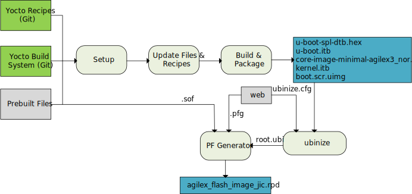
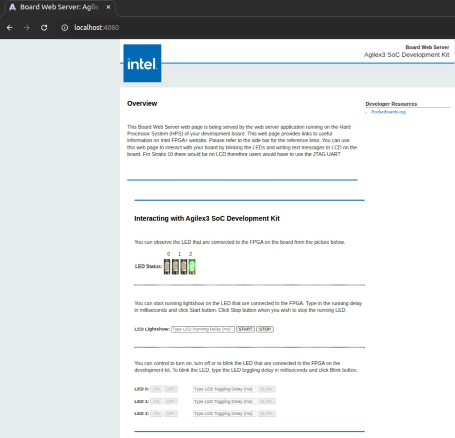

## Overview

The Agilex™ 3 device expands the Altera portfolio with low power and Cost-optimized applications. The Agilex™ 3 dives brings high performance to the cost optimized space for XCRV, IO, EMIF and fast AI-infused fabric. The Agilex™ 3 device is based on the Agilex™ 5 SoC device with the following main differences:

* Functionality based of Agilex™ 5 Production device.*

* HPS Dual core supporting only A55 only (up to 800 MHz), A76 cores not supported.*

* Lower frequency fabric with only 2 speed grade options(345 MHz -6, and 300 MHz -7). Fabric with fixed voltage only.

* XCVR up to 12.5 Gbps. PCIe up to 3.0 x4.

* EMIF support of LPDDR4 @ 2,133. No DDR4 or LPDDR5 supported. 

* No BBRAM.


The Agilex™ 3 C-Series device has the following supported virtual platforms:

- Agilex™ 3  Universal Virtual Platform 


Because the HPS functionality between the Agilex™ 3 and Agilex™ 5 devices is quite similar, the Agilex™ 3 Universal Virtual Platform also instantiates the Agilex™ 5 HPS model. The differences in the functionality between the 2 devices is addressed through configuration parameters in the corresponding target script, which are restricted to the values supported by the Agilex™ 3 device.

The following sections describe the prerequisites for the Intel® Simics Simulator for Altera FPGA and the available virtual platforms, including prebuilt binaries, and instructions for building these binaries. It also covers some common use cases that you can exercise on the virtual platforms.


### Prerequisites

To exercise the instructions presented on this page (build your binaries and exercise the use cases), your system must satisfy the following prerequisites:

- Host PC with Linux OS. (**Note:** Instructions on this page use Ubuntu 22.04 LTS.)
- The following packages are needed to deploy the Simics project:
  - GCC 6.3 compiler or higher
  - g++ 9.4 or higher
  - GNU make 4.1 or higher
- Local Ethernet network with DHCP server (provides IP address to the board).
- Intel Simics Simulator for Altera FPGAs installed.
- Altera Agilex™ 3 Virtual Platform components available to be deployed.


**Notes:**

- For binaries building instructions, see [Build Instructions](#build-instructions).
- For installation instructions for the Intel Simics Simulator for Altera FPGAs and the Agilex™ 3 E-Series virtual platforms, refer to the following documents:
  - [Intel® Simics® Simulator Landing Page](https://www.altera.com/products/development-tools/simics-virtual-platform)
  - [Intel® Simics® Simulator for Altera® FPGAs User Guide](https://docs.altera.com/r/docs/784383/current)
  - [Agilex™ 5 E-Series Virtual Platform User Guide](https://docs.altera.com/r/docs/786901/current)
  - [Intel® Simics® Simulator for Altera® FPGAs Release Notes](https://docs.altera.com/r/docs/870556/current/intel-simics-simulator-for-altera-fpgas-release-notes/)
- U-Boot, Linux compilation, Yocto compilation, and the creation of an SD card image require a Linux host PC.
  To create these binaries, the toolchain and other software required need to be downloaded. This is described as part of the instructions in each section.
- The Intel Simics Simulator for Altera® FPGAs is available only for Linux systems.
- In case any use case requires additional prerequisites, these are listed as part of the use case description.


## Release Content

Altera&reg; Quartus<sup>&reg;</sup> Prime Pro Edition Version 26.1 and the following software component versions integrate the 26.1 release. 

**Note:** Regarding the Hardware Design components in the following table, only the device-specific one is used in this page.

| Component                             | Location                                                     | Branch                       | Commit ID/Tag       |
| :------------------------------------ | :----------------------------------------------------------- | :--------------------------- | :------------------ |
| Agilex 3 Hardware Design | [https://github.com/altera-fpga/agilex3c-ed-gsrd](https://github.com/altera-fpga/agilex3c-ed-gsrd)    | main  | QPDS26.1_REL_GSRD_PR   |
| Agilex 5 Hardware Design - Include HPS Baseline System Example Design 2.0 baseline design + meta_custom | [https://github.com/altera-fpga/agilex5e-ed-gsrd](https://github.com/altera-fpga/agilex5e-ed-gsrd) | main                    | QPDS26.1_REL_GSRD_PR |
| Agilex 7 Hardware Design          | [https://github.com/altera-fpga/agilex7f-ed-gsrd](https://github.com/altera-fpga/agilex7f-ed-gsrd) | main | QPDS26.1_REL_GSRD_PR |
| Stratix 10 Hardware Design         | [https://github.com/altera-fpga/stratix10-ed-gsrd](https://github.com/altera-fpga/stratix10-ed-gsrd) | main | QPDS26.1_REL_GSRD_PR |
| Arria 10 Hardware Design          | [https://github.com/altera-fpga/arria10-ed-gsrd](https://github.com/altera-fpga/arria10-ed-gsrd)  | main | QPDS26.1_REL_GSRD_PR |
| Linux                                 | [https://github.com/altera-fpga/linux-socfpga](https://github.com/altera-fpga/linux-socfpga) | socfpga-6.18.2-lts | QPDS26.1_REL_GSRD_PR |
| Arm Trusted Firmware                  | [https://github.com/altera-fpga/arm-trusted-firmware](https://github.com/altera-fpga/arm-trusted-firmware) | socfpga_v2.14.0   | QPDS26.1_REL_GSRD_PR |
| U-Boot                                | [https://github.com/altera-fpga/u-boot-socfpga](https://github.com/altera-fpga/u-boot-socfpga) | socfpga_v2026.01 | QPDS26.1_REL_GSRD_PR |
| Yocto Project                         | [https://git.yoctoproject.org/poky](https://git.yoctoproject.org/poky) | scarthgap | latest              |
| Yocto Project: meta-altera-fpga (for HPS Baseline System Example Design 2.0) | [https://github.com/altera-fpga/meta-altera-fpga](https://github.com/altera-fpga/meta-altera-fpga) | scarthgap | QPDS26.1_REL_GSRD_PR |
| Yocto Project: meta-intel-fpga (for HPS Legacy System Example Design) | [https://git.yoctoproject.org/meta-intel-fpga](https://git.yoctoproject.org/meta-intel-fpga) | scarthgap | latest |
| Yocto Project: meta-intel-fpga-refdes (for HPS Legacy System Example Design) | [https://github.com/altera-fpga/meta-intel-fpga-refdes](https://github.com/altera-fpga/meta-intel-fpga-refdes) | scarthgap | QPDS26.1_REL_GSRD_PR |
| HPS Legacy System Example Design | [https://github.com/altera-fpga/gsrd-socfpga](https://github.com/altera-fpga/gsrd-socfpga) | scarthgap | QPDS26.1_REL_GSRD_PR |

**Note:** The combination of the component versions indicated in the table above has been validated through the use cases described in this page and it is strongly recommended to use these versions together. If you decided to use any component with different version than the indicated, there is not warranty that this will work.


### Prebuilt Binaries

You can find the prebuilt binaries from the HPS Baseline System Example Design prebuilt at the following URL:

- SD Card: [HPS Baseline System Example Design Binaries](https://releases.rocketboards.org/2026.04/gsrd/agilex3_gsrd.baseline/)
- QSPI: [QSPI Binaries](https://releases.rocketboards.org/2026.04/qspi/agilex3_qspi.baseline/)

You can exercise them using the internal Simics environment included under HPS Baseline System Example Design2.0 or also from a separate Simics environment in which you need to create and build the project directory manually.

**Note:** The final images used to boot from QSPI in Simics are not provided, but the binaries used to generate these are provided, so you can generate the final images following the instructions in [Build QSPI HPS Baseline System Example Design 2.0](#build-instructions-for-sd-card-and-qspi) section.


| HPS Peripheral                         | Supported |
| :------------------------------------- | :-------- |
| eMMC/SDCard & Combo Phy Controllers    | Yes       |
| DMA Controller                         | Yes       |
| XGMAC Ethernet Controller              | Yes       |
| USB 3.1 Gen1 Controller                | Yes       |
| USB 2.0 Controller                     | Yes       |
| GPIO Controller                        | Yes       |
| I2C Controller Initiator/Target        | Yes       |
| SPI Controller Initiator/Target        | Yes       |
| I3C Controller Initiator               | Yes       |
| I3C Controller Target                  | Yes       |
| NAND Controller & Combo PHY Controller | Yes       |
| APB Timer                              | Yes       |
| QSPI Controller                        | Yes       |
| GICv3 Interrupt controller             | Yes       |
| EDAC RAS Driver                        | Yes       |
| Clock manager                          | Yes       |
| Reset manager                          | Yes       |
| UART                                   | Yes       |
| WatchDog timer                         | Yes       |
| System manager                         | Yes       |
| SVC SOC FPGA manager                   | Yes       |
| SVC FPGA firmware                      | Yes       |
| SMMU                                   | Yes       |
| SVC FCS Crypto                         | Yes       |
| SVC HWMON                              | Yes       |
| SVC RSU                                | Yes       |
| CVP                                    | Yes       |
| PMU                                    | Yes       |

#### Known Issues with the Release

For known issues in this release please refer to the [Intel Simics Simulator for FPGA Release page](https://www.intel.com/content/www/us/en/docs/programmable/870556.html).

### Build Instructions HPS Baseline System Example Design 2.0

The HPS Baseline System Example Design 2.0 was intruduced on release 25.3. The HPS Baseline System Example Design 2.0 provides a framework based on **kas** and **yocto**, that allows to build be HPS binaries in a more simplified and automated methodology. In the HPS Baseline System Example Design 2.0, the  [agilex3c-ed-gsrd](https://github.com/altera-fpga/agilex3c-ed-gsrd) repository integrates HPS Baseline System Example Design and hardware design components, which differs from the legacy System Example Design build flow in which the HPS Baseline System Example Design and hardware design components were in separate repositories. 
For the  Simics simulation case specific, the HPS Baseline System Example Design 2.0 also provides a Simics simulation environment allows to run Simics simulations from the HPS Baseline System Example Design build environment using directly the binaries produced from the build. The following steps shows how to produced the required binaries that can be used in Simics simulation.


For more information about the HPS Baseline System Example Design 2.0 for Agilex 3 device, please refer to the corresponding  System Example Design page.

**NOTE:**The Agilex 3 C-Series development kit includes a QSPI device of 64 MB which is smaller than the regular QSPI device in other development kits. In Simics this is not relevant because the size of the QSPI device in the virtual platform is 256 MB, but in order to keep consistency with the same of the QSPI binary used in the development kit, the instructions to build QSPI binaries requires a different build than the one used to build the binaries for the SD Card boot.

#### Yocto Build Prerequisites

1\. Make sure you have Yocto system requirements met: [https://docs.yoctoproject.org/scarthgap/ref-manual/system-requirements.html#supported-linux-distributions](https://docs.yoctoproject.org/scarthgap/ref-manual/system-requirements.html#supported-linux-distributions).

The command to install the required packages on Ubuntu 22.04 is:

```bash
sudo apt-get update
sudo apt-get upgrade
sudo apt-get install openssh-server mc libgmp3-dev libmpc-dev gawk wget git diffstat unzip texinfo gcc \
build-essential chrpath socat cpio python3 python3-pip python3-pexpect xz-utils debianutils iputils-ping \
python3-git python3-jinja2 libegl1-mesa libsdl1.2-dev pylint xterm python3-subunit mesa-common-dev zstd \
liblz4-tool git fakeroot build-essential ncurses-dev xz-utils libssl-dev bc flex libelf-dev bison xinetd \
tftpd tftp nfs-kernel-server libncurses5 libc6-i386 libstdc++6:i386 libgcc++1:i386 lib32z1 \
device-tree-compiler curl mtd-utils u-boot-tools net-tools swig -y
```

On Ubuntu 22.04 you will also need to point the /bin/sh to /bin/bash, as the default is a link to /bin/dash:

```bash
 sudo ln -sf /bin/bash /bin/sh
```

**Note**: You can also use a Docker container to build the Yocto recipes, refer to https://rocketboards.org/foswiki/Documentation/DockerYoctoBuild for details. When using a Docker container, it does not matter what Linux distribution or packages you have installed on your host, as all dependencies are provided by the Docker container.

#### Build Instructions for SD Card and QSPI


<h5> Set Up the Environment </h5>


```bash
sudo rm -rf agilex3_gsrd20_sd_qspi
mkdir agilex3_gsrd20_sd_qspi
cd agilex3_gsrd20_sd_qspi
export TOP_FOLDER=$(pwd)
```


Enable Quartus tools to be called from command line:


```bash
source ~/altera_pro/26.1/qinit.sh
```


<h5> Build Hardware Design </h5>


```bash
cd $TOP_FOLDER
rm -rf agilex3_soc_devkit_ghrd_sdqspi
mkdir agilex3_soc_devkit_ghrd_sdqspi && cd agilex3_soc_devkit_ghrd_sdqspi
wget https://github.com/altera-fpga/agilex3c-ed-gsrd/releases/download/QPDS26.1_REL_GSRD_PR/a3cw135-devkit-oobe-baseline.zip
unzip a3cw135-devkit-oobe-baseline.zip
rm -f a3cw135-devkit-oobe-baseline.zip
make baseline-install-core-rbf
pushd software/hps_debug && ./build.sh && popd
quartus_pfg -c output_files/baseline.sof \
  output_files/baseline_hps_debug.sof \
  -o hps_path=software/hps_debug/hps_wipe.ihex
cd ..
```


The output from this stage is:

* $TOP_FOLDER/agilex3_soc_devkit_ghrd_sdqspi/output_files/ghrd.rbf - Phase 2 hardware design.
* $TOP_FOLDER/agilex3_soc_devkit_ghrd_sdqspi/output_files/baseline_hps_debug.sof - SOF file with Phase 1 hardware design and Debug HPS
* $TOP_FOLDER/agilex3_soc_devkit_ghrd_sdqspi/software/yocto_linux - Clean HPS Baseline System Example Design 2.0 software direcotry (not built yet).


<h5> Build SD Card GSRD 2.0 </h5>


This section provides the instructions needed to build the HPS binaries needed to boot from SD Card in Simics. 

**Note:** To Build the HPS Baseline System Example Design 2.0 you need to have the **KAS** version 4.8.2 in your Linux build machine. You also need also install `python3-newt`, and `python3.10-venv` packages. You can get them with:

```bash
$ sudo apt-get install python3-newt python3.10-venv
$ python3 -m pip install --upgrade kas
$ kas --version
kas 4.8.2 (configuration format version 19, earliest compatible version 1)
```
The instructions to build the HPS Baseline System Example Design 2.0 to boot from SD Card are shown next:

```bash
#Optional to Cash yocto downloads and sstate dirs
export BB_ENV_PASSTHROUGH_ADDITIONS="DL_DIR SSTATE_DIR"
export DL_DIR="$HOME/tasks/yocto/downloads"
export SSTATE_DIR="$HOME/tasks/yocto/sstate"
 
# Build sd binaries with kas
cd $TOP_FOLDER
cp -r $TOP_FOLDER/agilex3_soc_devkit_ghrd_sdqspi/software/yocto_linux $TOP_FOLDER/agilex3_soc_devkit_ghrd_sdqspi/software/yocto_linux_sd
cd $TOP_FOLDER/agilex3_soc_devkit_ghrd_sdqspi/software/yocto_linux_sd
# Add some tools used to exercise use cases
sed -i '/local_conf_header:/a\\n  add-tools: |\n    CORE_IMAGE_EXTRA_INSTALL \+= \"gdbserver devmem2 openssh\"\n' kas.yml
# Remove optimizations that are not needed in machines with high amount of memory.
sed -i '/BB_NUMBER_THREADS\|PARALLEL_MAKE/d' kas.yml

time ./build.sh $TOP_FOLDER/agilex3_soc_devkit_ghrd_sdqspi/output_files/ghrd.rbf sd
```


The output files that will be used to simulate with Simics are:

* $TOP_FOLDER/agilex3_soc_devkit_ghrd_sdqspi/software/yocto_linux_sd/build/tmp/deploy/images/agilex3/u-boot-spl-dtb.bin
* $TOP_FOLDER/agilex3_soc_devkit_ghrd_sdqspi/software/yocto_linux_sd/build/tmp/deploy/images/agilex3/gsrd-console-image-agilex3.rootfs.wic


<h5> Build QSPI Card GSRD 2.0 </h5>

This section provides the instructions to generate the binaries necessaries to boot from QSPI in Simics. Since the QSPI device used in the Agilex 3 C-Series development kit includes an small QSPI device, and we want to keep compatibility between the images used in real hardware and the images used in Simics, we need to create a reduced file system through the Yocto build. The following steps need to be re-run to build the final QSPI image used for Simics.

**Note:** To Build the HPS Baseline System Example Design 2.0 you need to have the **KAS** version 4.8.2 in your Linux build machine. You also need also install `python3-newt`, and `python3.10-venv` packages. You can do this with:

```bash
$ sudo apt-get install python3-newt python3.10-venv
$ python3 -m pip install --upgrade kas
$ kas --version
kas 4.8.2 (configuration format version 19, earliest compatible version 1)
```
The instructions to build the HPS Baseline System Example Design 2.0 to boot from QSPI are shown next:


```bash
#Optional to Cash yocto downloads and sstate dirs
export BB_ENV_PASSTHROUGH_ADDITIONS="DL_DIR SSTATE_DIR"
export DL_DIR="$HOME/tasks/yocto/downloads"
export SSTATE_DIR="$HOME/tasks/yocto/sstate"
 
# Build qspi dependencies with kas
cd $TOP_FOLDER
cp -r $TOP_FOLDER/agilex3_soc_devkit_ghrd_sdqspi/software/yocto_linux $TOP_FOLDER/agilex3_soc_devkit_ghrd_sdqspi/software/yocto_linux_qspi
cd $TOP_FOLDER/agilex3_soc_devkit_ghrd_sdqspi/software/yocto_linux_qspi
# Add some tools used to exercise use cases
sed -i '/local_conf_header:/a\\n  add-tools: |\n    CORE_IMAGE_EXTRA_INSTALL \+= \"gdbserver devmem2 openssh\"\n' kas.yml
# Remove optimizations that are not needed in machines with high amount of memory.
sed -i '/BB_NUMBER_THREADS\|PARALLEL_MAKE/d' kas.yml

time ./build.sh $TOP_FOLDER/agilex3_soc_devkit_ghrd_sdqspi/output_files/ghrd.rbf qspi
```


The output files that will be used to generate the final binaries to simulate with Simics are:

* $TOP_FOLDER/agilex3_soc_devkit_ghrd_sdqspi/software/yocto_linux_qspi/build/tmp/deploy/images/agilex3/u-boot-spl-dtb.bin
* 										$TOP_FOLDER/agilex3_soc_devkit_ghrd_sdqspi/software/yocto_linux_qspi/build/tmp/deploy/images/agilex3/u-boot-spl-dtb.hex
* $TOP_FOLDER/agilex3_soc_devkit_ghrd_sdqspi/software/yocto_linux_qspi/build/tmp/deploy/images/agilex3/u-boot.itb
* $TOP_FOLDER/agilex3_soc_devkit_ghrd_sdqspi/software/yocto_linux_qspi/build/tmp/deploy/images/agilex3/core-image-minimal-agilex3.rootfs_nor.ubifs
* $TOP_FOLDER/agilex3_soc_devkit_ghrd_sdqspi/software/yocto_linux_qspi/build/tmp/deploy/images/agilex3/kernel.itb
* $TOP_FOLDER/agilex3_soc_devkit_ghrd_sdqspi/software/yocto_linux_qspi/build/tmp/deploy/images/agilex3/boot.scr.uimg
* $TOP_FOLDER/agilex3_soc_devkit_ghrd_sdqspi/software/yocto_linux_qspi/build/tmp/deploy/images/agilex3/uboot.env

<h5> Build the RPD Image </h5>

The build flow for to create the QSPI image is shown in the following figure:



At this point you can build the \*.rpd file used in Simics simulation using the Simics environment  integrated into the HPS Baseline System Example Design or building this apart from the HPS Baseline System Example Design environment (i.e. independent directory in which you manually create, deploy and build the Simics project.

The following step tells you how to build the final \*.rpd to be used outside of the HPS Baseline System Example Design Simics environment. For this,  you require a \*.pfg file with the following layout:


| Partition    | MTD Partition | UBI Volume | Volume Name | Type         | Image/Individual File               | Group File | Start Addr | Size |
| :---------------- | :--------- | :--------- | :---------- | :----------- | :----------------------------------- | :--------- | :-------- | ----------- |
| BOOT_INFO | 0 <br>(u-boot) | N/A        | N/A         | RAW          | Bootinfo (Empty)                     | N/A | 0x0    | 2MB |
|   P1 | 0<br> (u-boot) | N/A | N/A | RAW | bitstream (FPGA image, SDM firmware) | N/A | 0x00200000 | ~1 MB |
| U_BOOT | 0 <br>(u-boot) | N/A    | N/A     | RAW      | u-boot.itb | N/A | 0x00400000 |AUTO|
| HPS | 1 <br>(root) | 0<br>1<br>2<br>3<br>4 | env<br>script<br>kernel<br>dtb<br>rootfs | UBI<br>UBI<br>UBI<br>UBI<br>UBIFS | u-boot.env<br>u-boot.scr<br>kernel.itb<br>kernel.dtb<br>rootfs.ubifs | <br><br>root.ubi | 0x00600000<br>Auto<br>Auto<br>Auto<br>Auto | 256KB<br>128KB<br>14MB<br>256KB<br>42MB |

You also require to use the  **ubinize** command and the **ubinize_nor.cfg** file to create the .ubi needed to create the image. The **ubinize_nor.cfg** is provided as part of the HPS Baseline System Example Design repository. The **ubinize** command is available from the Ubuntu as part of the **mtd-tools** package.


```bash
cd $TOP_FOLDER/agilex3_soc_devkit_ghrd_sdqspi/software/
rm -rf qspi_rpd
mkdir qspi_rpd && cd qspi_rpd
cp $TOP_FOLDER/agilex3_soc_devkit_ghrd_sdqspi/software/yocto_linux_qspi/build/tmp/deploy/images/agilex3/u-boot.itb u-boot.itb
ln -s $TOP_FOLDER/agilex3_soc_devkit_ghrd_sdqspi/software/yocto_linux_qspi/scripts/qspi_boot.pfg qspi_boot.pfg
ln -s $TOP_FOLDER/agilex3_soc_devkit_ghrd_sdqspi/software/yocto_linux_qspi/scripts/ubinize_nor.cfg ubinize.cfg
ln -s $TOP_FOLDER/agilex3_soc_devkit_ghrd_sdqspi/output_files/baseline_hps_debug.sof ghrd.sof 
ln -s $TOP_FOLDER/agilex3_soc_devkit_ghrd_sdqspi/software/yocto_linux_qspi/build/tmp/deploy/images/agilex3/u-boot-spl-dtb.bin u-boot-spl-dtb.bin
ln -s $TOP_FOLDER/agilex3_soc_devkit_ghrd_sdqspi/software/yocto_linux_qspi/build/tmp/deploy/images/agilex3/u-boot-spl-dtb.hex u-boot-spl-dtb.hex
ln -s $TOP_FOLDER/agilex3_soc_devkit_ghrd_sdqspi/software/yocto_linux_qspi/build/tmp/deploy/images/agilex3/uboot.env uboot.env
ln -s $TOP_FOLDER/agilex3_soc_devkit_ghrd_sdqspi/software/yocto_linux_qspi/build/tmp/deploy/images/agilex3/boot.scr.uimg boot.scr.uimg
ln -s $TOP_FOLDER/agilex3_soc_devkit_ghrd_sdqspi/software/yocto_linux_qspi/build/tmp/deploy/images/agilex3/kernel.itb kernel.itb
ln -s $TOP_FOLDER/agilex3_soc_devkit_ghrd_sdqspi/software/yocto_linux_qspi/build/tmp/deploy/images/agilex3/core-image-minimal-agilex3.rootfs_nor.ubifs .
# Truncate u-boot.itb to 2 MB
uboot_part_size=2*1024*1024
uboot_size=`wc -c < u-boot.itb`
uboot_pad="$((uboot_part_size-uboot_size))"
truncate -s +$uboot_pad u-boot.itb
mv u-boot.itb u-boot.bin
# Ceate UBI image
ubinize -o hps.bin -p 65536 -m 1 -s 1 ubinize.cfg
# Create the RPD file
quartus_pfg -c qspi_boot.pfg
```


The following files are created after this step:

* $TOP_FOLDER/agilex3_soc_devkit_ghrd_sdqspi/software/qspi_rpd/qspi_boot.rpd
* $TOP_FOLDER/agilex3_soc_devkit_ghrd_sdqspi/software/qspi_rpd/u-boot-spl-dtb.bin


## Agilex™ 3  Universal Virtual Platform

The Intel Simics Simulator for Altera FPGAs supports a virtual platform specific for the Agilex™ 3 device named Agilex™ 3 Universal Virtual Platform. Since the design of the Agilex 3 device is based on Agilex™ 5, the  Agilex™ 3 Universal Virtual platform is also based on the Agilex™ 5  Universal Virtual Platform and and actually the Agilex™ 3 Universal Virtual Platform also instantiates the HPS model of the Agilex™ 5 device. In the Agilex™ 3 Universal Virtual Platform some configurable parameters are kept fixed.

 In order to mimics the Agilex™ 3 device functionality, some configurable parameters in the Agilex™ 3 Universal Virtual Platform are kept fixed, so the functionality of the Agilex™ 3 device can be replicated. 


The  Agilex™ 3 Universal Virtual Platform is associated with the **agilex3c-universal.simics** target script. For detailed information about the architecture and capabilities of this virtual platform, you can refer to the  **Agilex™ 5 Simics Virtual Platform - Universal** section in the **HPS Simics Linux Baseline Tutorial Example Design User Guide: Agilex™ 5 Virtual Platform** page. Here, we just going to describe the differences that applies for the Agilex™ 3 Universal Virtual Platform.

#### Differences between the Agilex™ 3  Universal Virtual Platform and the Agilex™ 5  Universal Virtual Platform

As mentioned before, both virtual platforms instantiates the HPS model of the Agilex™ 5 device, and the functional differences are handled through fixed configuration parameters in the **agilex3c-universal.simics** target script.  These differences and the fixed value is listed next:

| Differences | Configuration Parameter Fixed Value |
| :---------------- | :--------- |
| Agilex™ 3 is based on Agilex 5 Production version | **stepping** = B0 |
| Agilex™ 3 only have the 2 A55 Cores | **hps_core0_1_power_on** = TRUE<br>**hps_core2_power_on** = FALSE<br/>**hps_core3_power_on** = FALSE |
|Agilex™ 3 boot core only can be set the core0 A55|**hps_boot_core** = 0|
| Agilex™ 3 Cores maximum frequency is limited to 800 MHz | **hps_cpu_freq_mhz** must be lower or equal 800              |


### Exercising Simics Simulation from HPS Baseline System Example Design 2.0

The HPS Baseline System Example Design 2.0 build framework is provided with the capability to simulate with Simics some reference use cases using the binaries built with this framework. The components included as part of the HPS Baseline System Example Design repository are listed next. These are included at **$TOP_FOLDER/agilex3_soc_devkit_ghrd_sdqspi/simics/linux** directory.

* [runsimics.sh](https://github.com/altera-fpga/agilex3c-ed-gsrd/blob/main/a3cw135-devkit-oobe/baseline/simics/linux/runsimics.sh) : This script is in charge of deploy the Simics project (under $TOP_FOLDER/agilex3_soc_devkit_ghrd_sdqspi/simics/linux which becomes the Simics project directory) and build it,  similarly to what is described in the [Simulation Setup section](#simulation-setup).  The script receives as parameter the device used to boot  along with the path of the location of the binaries. <br>
Parameters:<br>  1\. **Boot mode:** **sdmmc** to boot from sdcard, **qspi** to boot from QSPI. <br>  2\. **Binaries path:** Path where the binares were built. The binaries needed could be the ones listed as output of the  [Build Instructions for SD Card and QSPI](#build-instructions-for-sd-card-and-qspi) section, but the binaries could be taken from any other source. 

* [sdmmc_boot](https://github.com/altera-fpga/agilex3c-ed-gsrd/blob/main/a3cw135-devkit-oobe/baseline/simics/linux/sdmmc_boot) directory: This directory is used to the exercise the boot for SD Card use case. This includes  [sdmmc_gsrd.simics](https://github.com/altera-fpga/agilex3c-ed-gsrd/blob/main/a3cw135-devkit-oobe/baseline/simics/linux/sdmmc_boot/sdmmc_gsrd.simics) target script which defines the parameters needed to boot in this mode. The .simics target script calls the Agilex 5 Universal Virtual Platform target script which is the one that configures this virtual platform, loading all the components needed. In the binary directory, the SD Card image must be called **gsrd-console-image-agilex3.rootfs.wic**.
* [qspi_boot](https://github.com/altera-fpga/agilex3c-ed-gsrd/blob/main/a3cw135-devkit-oobe/baseline/simics/linux/qspi_boot) directory: This directory is used to the exercise the QSPI boot mode. This includes the [qspi_gsrd.simics](https://github.com/altera-fpga/agilex3c-ed-gsrd/blob/main/a3cw135-devkit-oobe/baseline/simics/linux/qspi_boot/qspi_gsrd.simics) target script which defines the parameters needed to boot in this mode. The .simics target script in this directory calls the Agilex 5 Universal Virtual Platform target script which is the one that configures this virtual platform, loading all the components needed to run the simulation. In the binary directory, the QSPI image must be called **qspi_boot.rpd**.

The boot modes supported by the HPS Baseline System Example Design 2.0 are:

* Booting from U-Boot to Linux from SD Card using Agilex 3 Universal Virtual Platform
* Booting from U-Boot to Linux from QSPI using Agilex 3 Universal Virtual Platform

The use cases that are listed in the [Use Cases Supported by the Agilex™ 5 E-Series Universal Virtual Platform](#use-cases-supported-by-the-agilextm-5-e-series-universal-virtual-platform) are also supported, but require manual update of the **.simics** target scripts included in the boot mode directories listed above. 

####  Simulation Setup under HPS Baseline System Example Design 2.0

At this time, it is assumed that you had already built the HPS binaries as indicated in [Build Instructions - HPS Baseline System Example Design 2.0 Baseline](#build-instructions-hps-baseline-system-example-design-20) and you also have installed the Intel Simics Simulator for Altera FPGAs in to your Linux machine.

You also need to add the following to yout Linux **$PATH** environment variable:

* Simics Simulator installation directory. 
* Quartus Pro. Needed only for QSPI boot mode.

This can be done with:

```bash
$ cd $TOP_FOLDER
# Simics installation dir
$ export PATH=<Simics_installation_dir/simics/bin/:$PATH
# Quartus Pro
$ export QUARTUS_ROOTDIR=~/altera_pro/26.1/quartus/
$ export PATH=$QUARTUS_ROOTDIR/bin:$QUARTUS_ROOTDIR/linux64:$QUARTUS_ROOTDIR/../qsys/bin:$PATH
```
#### Exercise SDCard Boot Mode under HPS Baseline System Example Design 2.0 Environment

It is assumed that the instructions at [Simulation Setup under HPS Baseline System Example Design 2.0](#simulation-setup-under-hps-baseline-system-example-design-20) section have been already executed.

The **runsimics.sh** script need to be called, providing as parameters the **sdmmc** boot mode and the location of the binaries.
```bash
$ cd $TOP_FOLDER/agilex3_soc_devkit_ghrd_sdqspi/simics/linux/
$ ./runsimics.sh  sdmmc $TOP_FOLDER/agilex3_soc_devkit_ghrd_sdqspi/software/yocto_linux_sd/build/tmp/deploy/images/agilex3
```
This will deploy the **agilex3c-universal** virtual platform under **$TOP_FOLDER/agilex3_soc_devkit_ghrd_sdqspi/simics/linux/** directory, create the Simics project and build it. This will also launch the Simics simulation using **$TOP_FOLDER/agilex3_soc_devkit_ghrd_sdqspi/simics/linux/sdmmc_boot/sdmmc_gsrd.simics** as target script. 

When the simulation is launched, the current Linux terminal will become the Simics CLI and the Serial console will pop up.  To start the simulation enter **"run"** command in the Simics CLI.


#### Exercise QSPI Boot Mode under HPS Baseline System Example Design 2.0 Environment

It is assumed that the instructions at [Simulation Setup under HPS Baseline System Example Design 2.0](#simulation-setup-under-hps-baseline-system-example-design-20) section have been already executed.

The **runsimics.sh** script need to be called, providing the (**qspi**) boot mode and the location of the binaries used to boot from QSPI as parameters.

```bash
$ cd $TOP_FOLDER/agilex3_soc_devkit_ghrd_sdqspi/simics/linux/
$ ./runsimics.sh  qspi $TOP_FOLDER/agilex3_soc_devkit_ghrd_sdqspi/software/qspi_rpd
```

This will deploy the **agilex3c-universal** virtual platform under **$TOP_FOLDER/agilex3_soc_devkit_ghrd_sdqspi/simics/linux/** directory, create the Simics project and build it. This will also launch the Simics simulation using **$TOP_FOLDER/agilex3_soc_devkit_ghrd_sdqspi/simics/linux/qspi_boot/qspi_gsrd.simics** as target script.

When the simulation is launched, the current Linux terminal will become the Simics CLI and the Serial console will pop up.  To start the simulation enter **"run"** command in the Simics CLI.


### Use Cases Supported by the Agilex™ 3 E-Series Universal Virtual Platform

The following sections explain some basic use cases using the **Agilex™ 3 C-Series Universal** virtual platform. The features and use cases supported by the Agilex™ 5 Universal Virtual platform described in  **Agilex™ 5 Universal Virtual Platform Use Cases** section in the **HPS Simics Linux Baseline Tutorial Example Design User Guide: Agilex™ 5 Virtual Platform** page also are supported by this virtual platform, so you can refer to those instructions to exercise them.

The preconditions required to execute them are listed in the following section:

#### Simulation Setup

Consider that the Intel Simics Simulator for Altera® FPGAs Simulator has been installed on a Linux System and the output binaries generated from [Build Instructions HPS Baseline System Example Design 2.0](#build-instructions-hps-baseline-system-example-design-20) section are already available.


1. Create a project directory under the Intel Simics Simulator installation directory (Assuming it is **SimicsInstallDir**):

  ```bash
  $ mkdir project-1
  $ cd project-1
  ```

2. Under the new project directory created, deploy the **agilex3c-universal** virtual platform:

  ```bash
  $<Simics installation dir>/simics/bin/simics_intelfpga_cli --list-platforms
  Simics(R) Simulator for Intel(R) FPGA CLI: 
  INFO: Available platforms:
  INFO:    agilex5e-universal
  INFO:    agilex3c-universal
  $<Simics installation dir>/simics/bin/simics_intelfpga_cli --deploy agilex3c-universal
  Simics(R) Simulator for Intel(R) FPGA CLI: 
  
  INFO: Preparing to initialize /home/rolando/tasks/SimicsEnv/Simics_26p1/project-1 as a Simics workspace
  Project created successfully
  # Note that the directory has been initialized and the simics and simics-gui
  # commands appear in the project directory. Also, the target directory is
  # created. This includes the target script corresponding to the deployed
  # platform.
  ```

3. Build the virtual platform components:

  ```bash
  $ make
  === Environment Check ===
  '/home/simicsUser/SimicsInstallDir/project-1' is up-to-date
  gcc version 9
  === Building module sm-fabric-example-design ===
  :
  === Building module sm-fabric-example-design-comp ===
  :
  === Building module sm-ghrd-qsys-top-comp ===
  :
  === Building module sm-ghrd-subsys-hps-comp ===
  :
  === Building module sm-ghrd-subsys-periph-comp ===
  :
  === Building module sm-universal-board-comp ===
  :
  === Building module sm-universal-fpga-comp ===
  :
  === Building module sm-universal-system-comp ===
  :
  Copying agilex5_icon_84x84.png
  ```

4. Copy the following binaries created in [Build Instructions](#build-instructions) section to the Simics project directory:

 SD Boot:<br>

* $TOP_FOLDER/agilex3_soc_devkit_ghrd_sdqspi/software/yocto_linux_sd/build/tmp/deploy/images/agilex3/u-boot-spl-dtb.bin
* $TOP_FOLDER/agilex3_soc_devkit_ghrd_sdqspi/software/yocto_linux_sd/build/tmp/deploy/images/agilex3/gsrd-console-image-agilex3.rootfs.wic

QSPI Boot:<br>

* $TOP_FOLDER/agilex3_soc_devkit_ghrd_sdqspi/software/qspi_rpd/qspi_boot.rpd
* $TOP_FOLDER/agilex3_soc_devkit_ghrd_sdqspi/software/qspi_rpd/u-boot-spl-dtb.bin

5. Customize the configuration of the **Agilex™ 3 C-Series Universal Virtual Platform**, according to the setup required to exercise any specific use case.  Use the following guideness:
   * Set up the **fsbl_image_filename** parameter with the first-stage bootloader. 
   * If the boot implies booting from an SD Card device, configure **sd_image_filename** with the path of the sdcard image and set **create_hps_sd_card** parameter to TRUE (this image should include the main bootloader and the OS and/or application images). 
   * If the boot implies booting from an QSPI device, configure **qspi_image_filename** with the path of the QSPI image and set  **create_hps_sd_card** parameter to FALSE. 

  You can configure the virtual platform either by updating the **agilex3c-universal.simics** target script or creating a separate top-level **.simics** target script (named based on the simulation purpose) that is expected to be used to launch the simulation (example: **uboot-linux_sdcard.simics** used to boot from U-Boot to Linux from an SD Card device). You become the owner of this new target script, in which, you can set the required parameters and call the original virtual platform target script (**targets/agilex3c-universal/agilex3c-universal.simics** path). An example of the setup required to run a simulation that exercises the boot flow going from U-Boot to Linux, booting from an SD Card is shown in the following:

  ```bash
  #uboot-linux_sdcard.simics
  $sd_image_filename = "gsrd-console-image-agilex3.rootfs.wic"
  $fsbl_image_filename = "u-boot-spl-dtb.bin"
  $create_hps_sd_card = TRUE
  run-script "targets/agilex3c-universal/agilex3c-universal.simics"
  ```

  **Note:** The **uboot-linux_sdcard.simics** file must be created under the Intel Simics project directory.

  **Tip:** Any specific configuration needed for a use case is indicated under the **Setup** section of that use case.

#### Use Case: Exercise SDCard Boot Flow from FSBL to Linux

This use case consists of booting from an SDCard device going from U-Boot to Linux prompt passing through **U-Boot SPL → ATF → U-Boot → Linux**.

<h5>Setup</h5>

Complete the procedure described in the [Simulation Setup](#simulation-setup) section.

<h5>Procedure</h5>

To exercise this use case, follow the below steps once the Simulation setup is complete:

1. From the project directory, launch the simulation using the **uboot-linux_sdcard.simics** target script. This script launches the simulator and the current terminal becomes the Simics CLI:

  ```bash
  $ ./simics uboot-linux_sdcard.simics 
  ```

2. From the Simics CLI, start running the simulation with the **run** command.

  ```bash
  simics>  run
  ```

3. Wait to get to the Linux prompt in the target serial console. 
4. Login into the Linux prompt using the **root** user without a password.

  ```bash
  # Target Serial console
  U-Boot SPL 2025.07-g08197d3d7344 (Jul 28 2025 - 08:30:01 +0000)
  Reset state: Cold
  MPU           875000 kHz
  L4 Main       400000 kHz
  L4 sys free   100000 kHz
  L4 MP         200000 kHz
  L4 SP         100000 kHz
  SDMMC          50000 kHz
  :
  DDR4: 8192 MiB
  DDR: size check success
  DDR: firewall init success
  DDR: init success
  QSPI: Reference clock at 400000 kHz
  Bloblist at 72000 not found (err=-2)
  WDT:   Not starting watchdog@10d00200
  Trying to boot from MMC1
  ## Checking hash(es) for config board-0 ... OK
  ## Checking hash(es) for Image atf ... crc32+ OK
  ## Checking hash(es) for Image uboot ... crc32+ OK
  ## Checking hash(es) for Image fdt-0 ... crc32+ OK
  NOTICE:  SOCFPGA: Boot Core = 0
  NOTICE:  SOCFPGA: CPU ID = 0
  NOTICE:  SOCFPGA: Setting CLUSTERECTRL_EL1
  NOTICE:  BL31: v2.12.1(release):QPDS25.1.1_REL_GSRD_PR
  NOTICE:  BL31: Built : 01:54:40, Aug  1 2025
  
  U-Boot 2025.07-g08197d3d7344 (Jul 28 2025 - 08:30:01 +0000)socfpga_agilex3

  CPU:   Altera FPGA SoCFPGA Platform (ARMv8 64bit Cortex-A55/A76)
  Model: SoCFPGA Agilex3 SoCDK
  DRAM:  2 GiB (effective 8 GiB)
  Core:  50 devices, 26 uclasses, devicetree: separate
  WDT:   Not starting watchdog@10d00200
  WDT:   Not starting watchdog@10d00300
  WDT:   Not starting watchdog@10d00400
  WDT:   Not starting watchdog@10d00500
  WDT:   Not starting watchdog@10d00600
  NAND:  4096 MiB
  MMC:   mmc0@10808000: 0
  Loading Environment from FAT... Unable to read "uboot.env" from mmc0:1...
  Loading Environment from UBI... SF: Detected mt25qu02g with page size 256 Bytes, erase size 64 KiB, total 256 MiB
  :
  switch to partitions #0, OK
  mmc0 is current device
  Scanning mmc 0:1...
  Found U-Boot script /boot.scr.uimg
  2071 bytes read in 11 ms (183.6 KiB/s)
  ## Executing script at 81000000
  crc32+ Trying to boot Linux from device mmc0
  Found kernel in mmc0
  :
  Starting kernel ...

  Deasserting all peripheral resets
  [    0.000000] Booting Linux on physical CPU 0x0000000000 [0x412fd050]
  [    0.000000] Linux version 6.12.33-altera-g7b497655d942 (oe-user@oe-host) (aarch64-poky-linux-gcc (GCC) 14.3.0, GNU ld (GNU Binutils) 2.44.0.20250715) #1 SMP PREEMPT Fri Jul 11 06:21:15 UTC 2025
  [    0.000000] KASLR disabled due to lack of seed
  [    0.000000] Machine model: SoCFPGA Agilex3 SoCDK
  [    0.000000] efi: UEFI not found.
  [    0.000000] earlycon: uart0 at MMIO32 0x0000000010c02000 (options '115200n8')
  [    0.000000] printk: legacy bootconsole [uart0] enabled
  [    0.000000] Reserved memory: created DMA memory pool at 0x0000000080000000, size 32 MiB
  [    0.000000] OF: reserved mem: initialized node svcbuffer@0, compatible id shared-dma-pool
  [    0.000000] OF: reserved mem: 0x0000000080000000..0x0000000081ffffff (32768 KiB) nomap non-reusable svcbuffer@0
  [    0.000000] NUMA: Faking a node at [mem 0x0000000080000000-0x00000009ffffffff]
  [    0.000000] NODE_DATA(0) allocated [mem 0x9fefe8d80-0x9fefeb3bf]
  [    0.000000] Zone ranges:
  [    0.000000]   DMA      [mem 0x0000000080000000-0x00000000ffffffff]
  [    0.000000]   DMA32    empty
  [    0.000000]   Normal   [mem 0x0000000100000000-0x00000009ffffffff]
  [    0.000000] Movable zone start for each node
  [    0.000000] Early memory node ranges
  [    0.000000]   node   0: [mem 0x0000000080000000-0x0000000081ffffff]
  [    0.000000]   node   0: [mem 0x0000000082000000-0x00000000ffffffff]
  [    0.000000]   node   0: [mem 0x0000000880000000-0x00000009ffffffff]
  [    0.000000] Initmem setup node 0 [mem 0x0000000080000000-0x00000009ffffffff]
  [    0.000000] cma: Reserved 32 MiB at 0x00000000fca00000 on node -1
  [    0.000000] psci: probing for conduit method from DT.
  [    0.000000] psci: PSCIv1.1 detected in firmware.
  [    0.000000] psci: Using standard PSCI v0.2 function IDs
  [    0.000000] psci: MIGRATE_INFO_TYPE not supported.
  [    0.000000] psci: SMC Calling Convention v1.5
  [    0.000000] percpu: Embedded 25 pages/cpu s61720 r8192 d32488 u102400
  [    0.000000] Detected VIPT I-cache on CPU0
  [    0.000000] CPU features: detected: GIC system register CPU interface
  [    0.000000] CPU features: detected: Virtualization Host Extensions
  [    0.000000] CPU features: detected: ARM errata 1165522, 1319367, or 1530923
  [    0.000000] alternatives: applying boot alternatives
  [    0.000000] Kernel command line: earlycon panic=-1 root=/dev/mmcblk0p2 rw rootwait
  :
  [  OK  ] Reached target Network is Online.
           Starting Lighttpd Daemon...
           Starting Notify NFS peers of a restart...
  [  OK  ] Started Notify NFS peers of a restart.
  [  OK  ] Started Lighttpd Daemon.
  [  OK  ] Reached target Multi-User System.
           Starting Record Runlevel Change in UTMP...
  [  OK  ] Finished Record Runlevel Change in UTMP.
  p104p104
  Poky (Yocto Project Reference Distro) 5.2.2 dhcp0 ttyS0

  dhcp0 login: root

  WARNING: Poky is a reference Yocto Project distribution that should be used for
  testing and development purposes only. It is recommended that you create your
  own distribution for production use.

  root@dhcp0:~# 
  ```
  This finishes the main scenario of this use case. This scenario can be extended in any of the Use Cases described in **Agilex™ 5 Universal Virtual Platform Use Cases** in the **HPS Simics Linux Tutorial System Example Design: Agilex™ 5 Virtual Platforms** page. Next is shown an example that demonstrates this.

  **Note**: You can speed-up the boot process by skipping the U-Boot autoboot countdown by pressing any key and then typing the **boot** command:


  ```bash
  U-Boot 2025.07 (Jul 28 2025 - 09:28:56 +0000)socfpga_agilex5

  CPU:   Altera® FPGA SoCFPGA Platform (ARMv8 64bit Cortex-A55/A76)
  Model: SoCFPGA Agilex5 SoCDK

  :
  Net:   No ethernet found.
  Hit any key to stop autoboot:  0 
  SOCFPGA_AGILEX3 # boot
  switch to partitions #0, OK
  mmc0 is current device
  Scanning mmc 0:1...
  ```

#### Use Case: Exercise Hello Application

This is an extension of the **Use Case: Exercise SDCard Boot Flow from FSBL to Linux** and includes executing the **hello** application from the Linux prompt.

<h5>Setup</h5>

Complete the procedure described in the [Simulation Setup](#simulation-setup) section.

<h5>Procedure</h5>

1. Execute the parent use case to get to the Linux prompt and log in.

2. Execute the **hello** application located in the **intelFPGA** directory. After executing this application, the **Hello SoC FPGA!** message is displayed on the command prompt:

  ```bash
  # Target Serial console 
  root@dhcp0:~#  ./intelFPGA/hello 
  Hello SoC FPGA!
  ```

#### Use Case: Access the Web Server Application from Host PC

This use case is an extension of the **Use Case: Exercise SDCard Boot Flow from FSBL to Linux** and includes accessing from the host PC a web page that is being hosted by the target system, which runs a web server application. This application is launched automatically as part of the Linux boot process.

<h5>Setup</h5>

Using the **uboot-linux_sdcard.simics** Simics script, create an incoming port forwarding shown in the following:

```bash
connect-real-network-port-in ethernet-link = ethernet_switch0 target-ip=10.10.0.100 target-port = 80 host-port = 4080 -tcp 
```

The port forwarding created allows you to access the webpage from the host PC. In the configuration, use the **connect-real-network-port-in** command, port 4080 in the host PC, and the target port in the target system is 80 (HTTP port). You also assign as the target IP, the IP that corresponds to the target system, which is 10.10.0.100. Also, indicate that this port forwarding is related to the TCP protocol. YOu can check the new port forwarding setup using the **list-port-forwarding-setup** command (this setup also could be done from the Simics CLI but in this case, the simulation should be stopped to perform the network configuration).

<h5>Procedure</h5>

1. Execute the parent use case to get to the Linux prompt and log in.

2. From the host PC, open a web browser and access the webpage running in the target system using the address: http://localhost:4080 . Note that the host machine is referred to as **localhost** and the port is 4080, which is the one visible from the host PC. 

  

  **Note:** The IP address of the host PC could be used as well instead of **localhost**.

  **Note:** The webpage displays instructions to connect to the target system using SSH. These instructions are valid if you run these binaries in real hardware. If you want to establish the SSH connection with a simulated target system, create a second incoming port forwarding with the following setup:


  **connect-real-network-port-in ethernet-link = ethernet_switch0 target-ip=10.10.0.100 target-port = 22 host-port = 4022 -tcp**


  Then, connect to the target system using **ssh -p 4022 root@localhost** from the host PC or **ssh -p 4022 root@<*host PC IP address*>** from any other PC in the same network.

A variation of this use case consists of accessing the web page from another PC under the same network that the host PC (both PCs in a real network). For this, use the IP address of the host PC instead of **localhost** and continue using the same port: **http://<*host PC address*>:4080**.

**Note:** In the Linux Ubuntu system, you can get the IP address using the **ifconfig** command from a terminal. Also, ensure that the firewall in this PC is not blocking port 80.

#### Use Case: Exercise UBIFS QSPI Boot Flow from FSBL to Linux

This use case consists of booting from a QSPI flash device going from U-Boot to Linux prompt passing through **U-Boot SPL → ATF → U-Boot → Linux** using an image with UBIFS format.

<h5>Setup</h5>

Perform steps 1 to 4 described in the [Simulation Setup](#simulation-setup) section.

5. In the Intel Simics environment at the project directory, generate a compressed version of the .rpd file created (.craff) file using the **craff** tool provided under the Simics Base installation directory:

  ```bash
  <SimicsInstallDir>/simics-7.73.0/bin/craff -o qspi_boot.craff qspi_boot.rpd
  ```

  The following file is created under the Simics project directory:

  - qspi_image.img.craff

6. In the Intel Simics environment at the project directory, create a customized target script to exercise the FSBL to Linux boot flow from QSPI device with an image with UBIFS format. The file to create is called **uboot-linux_qspi.simics**. This file will look like this:

  ```bash
  #uboot-linux_qspi.simics
  $fsbl_image_filename = "u-boot-spl-dtb.bin"
  $qspi_image_filename  = "qspi_boot.craff"
  $hps_boot_core = 0
  $create_hps_sd_card = FALSE
  run-script "targets/agilex3c-universal/agilex3c-universal.simics"
  ```

<h5>Procedure</h5>

To exercise this use case, follow the steps below once the Simulation setup is complete:

1. From the project directory, launch the simulation using the **uboot-linux_qspi.simics** target script. This script launches the simulator and the current terminal becomes the Simics CLI:

  ```bash
  $ ./simics uboot-linux_qspi.simics 
  ```

2. From the Simics CLI, start running the simulation with the `run` command.
  ```bash
  simics>  run
  ```

3. Wait for the simulation to get to the Linux prompt in the target serial console.

4. Login into the Linux prompt using the **root** user without a password.  

   ```bash
   U-Boot SPL 2025.07-g08197d3d7344 (Jul 28 2025 - 08:30:01 +0000)
   Reset state: Cold
   MPU           875000 kHz
   L4 Main       400000 kHz
   L4 sys free   100000 kHz
   L4 MP         200000 kHz
   L4 SP         100000 kHz
   SDMMC          50000 kHz
   io96b_cal_status: Calibration for IO96B instance 0x18400400 done at 0 msec!
   :
   DDR4: 8192 MiB
   DDR: size check success
   DDR: firewall init success
   DDR: init success
   QSPI: Reference clock at 400000 kHz
   Bloblist at 72000 not found (err=-2)
   WDT:   Not starting watchdog@10d00200
   Trying to boot from MMC1
   MMC: no card present
   spl: mmc init failed with error: -123
   Error: -123
   Trying to boot from SPI
   ## Checking hash(es) for config board-0 ... OK
   ## Checking hash(es) for Image atf ... crc32+ OK
   ## Checking hash(es) for Image uboot ... crc32+ OK
   ## Checking hash(es) for Image fdt-0 ... crc32+ OK
   NOTICE:  SOCFPGA: Boot Core = 0
   NOTICE:  SOCFPGA: CPU ID = 0
   NOTICE:  SOCFPGA: Setting CLUSTERECTRL_EL1
   NOTICE:  BL31: v2.12.1(release):QPDS25.1.1_REL_GSRD_PR
   NOTICE:  BL31: Built : 01:54:40, Aug  1 2025
   
   U-Boot 2025.07-g08197d3d7344 (Jul 28 2025 - 08:30:01 +0000)socfpga_agilex3
   
   CPU:   Altera FPGA SoCFPGA Platform (ARMv8 64bit Cortex-A55/A76)
   Model: SoCFPGA Agilex3 SoCDK
   DRAM:  2 GiB (effective 8 GiB)
   Core:  50 devices, 26 uclasses, devicetree: separate
   WDT:   Not starting watchdog@10d00200
   WDT:   Not starting watchdog@10d00300
   WDT:   Not starting watchdog@10d00400
   WDT:   Not starting watchdog@10d00500
   WDT:   Not starting watchdog@10d00600
   NAND:  4096 MiB
   MMC:   mmc0@10808000: 0
   Loading Environment from FAT... MMC: no card present
   :
   In:    serial0@10c02000
   Out:   serial0@10c02000
   Err:   serial0@10c02000
   Net:   
   Warning: ethernet@10830000 (eth2) using random MAC address - 92:47:ea:26:21:4b
   eth2: ethernet@10830000
   Hit any key to stop autoboot:  0 
   MMC: no card present
   SF: Detected mt25qu02g with page size 256 Bytes, erase size 64 KiB, total 256 MiB
   Select Environment on UBI: OK
   :
   QSPI: Running script from UBIFS fallback
   QSPI: Trying to boot script at 0x81000000
   ## Executing script at 81000000
   crc32+ Trying to boot Linux from device qspi
   
   device nor0 <nor0>, # parts = 2
    #: name                size            offset          mask_flags
    0: u-boot              0x00600000      0x00000000      0
    1: root                0x03a00000      0x00600000      0
   
   active partition: nor0,0 - (u-boot) 0x00600000 @ 0x00000000
   :
   Enabling QSPI at Linux DTB...
   Working FDT set to fead0000
   QSPI clock frequency updated
   RSU: Firmware or flash content not supporting RSU
   RSU: Firmware or flash content not supporting RSU
   RSU: Firmware or flash content not supporting RSU
   RSU: Firmware or flash content not supporting RSU
   
   Starting kernel ...
   
   Deasserting all peripheral resets
   [    0.000000] Booting Linux on physical CPU 0x0000000000 [0x412fd050]
   [    0.000000] Linux version 6.12.19-altera-g7b497655d942 (oe-user@oe-host) (aarch64-poky-linux-gcc (GCC) 14.3.0, GNU ld (GNU Binutils) 2.44.0.20250715) #1 SMP PREEMPT Fri Jul 11 06:21:15 UTC 2025
   [    0.000000] KASLR disabled due to lack of seed
   [    0.000000] Machine model: SoCFPGA Agilex3 SoCDK
   [    0.000000] efi: UEFI not found.
   [    0.000000] earlycon: uart0 at MMIO32 0x0000000010c02000 (options '115200n8')
   [    0.000000] printk: legacy bootconsole [uart0] enabled
   [    0.000000] Reserved memory: created DMA memory pool at 0x0000000080000000, size 32 MiB
   [    0.000000] OF: reserved mem: initialized node svcbuffer@0, compatible id shared-dma-pool
   [    0.000000] OF: reserved mem: 0x0000000080000000..0x0000000081ffffff (32768 KiB) nomap non-reusable svcbuffer@0
   [    0.000000] NUMA: Faking a node at [mem 0x0000000080000000-0x00000009ffffffff]
   [    0.000000] NODE_DATA(0) allocated [mem 0x9fefe8d80-0x9fefeb3bf]
   [    0.000000] Zone ranges:
   [    0.000000]   DMA      [mem 0x0000000080000000-0x00000000ffffffff]
   [    0.000000]   DMA32    empty
   [    0.000000]   Normal   [mem 0x0000000100000000-0x00000009ffffffff]
   [    0.000000] Movable zone start for each node
   [    0.000000] Early memory node ranges
   [    0.000000]   node   0: [mem 0x0000000080000000-0x0000000081ffffff]
   [    0.000000]   node   0: [mem 0x0000000082000000-0x00000000ffffffff]
   [    0.000000]   node   0: [mem 0x0000000880000000-0x00000009ffffffff]
   [    0.000000] Initmem setup node 0 [mem 0x0000000080000000-0x00000009ffffffff]
   [    0.000000] cma: Reserved 32 MiB at 0x00000000fca00000 on node -1
   [    0.000000] psci: probing for conduit method from DT.
   [    0.000000] psci: PSCIv1.1 detected in firmware.
   [    0.000000] psci: Using standard PSCI v0.2 function IDs
   [    0.000000] psci: MIGRATE_INFO_TYPE not supported.
   [    0.000000] psci: SMC Calling Convention v1.5
   [    0.000000] percpu: Embedded 25 pages/cpu s61720 r8192 d32488 u102400
   [    0.000000] Detected VIPT I-cache on CPU0
   [    0.000000] CPU features: detected: GIC system register CPU interface
   [    0.000000] CPU features: detected: Virtualization Host Extensions
   [    0.000000] CPU features: detected: ARM errata 1165522, 1319367, or 1530923
   [    0.000000] alternatives: applying boot alternatives
   [    0.000000] Kernel command line: earlycon panic=-1 ubi.mtd=1 root=ubi0:rootfs rootfstype=ubifs rw rootwait
   :
   [   80.126605] socfpga-dwmac 10830000.ethernet eth0: Link is Up - 100Mbps/Full - flow control rx/tx
   udhcpc: started, v1.37.0
   udhcpc: broadcasting discover
   udhcpc: broadcasting select for 10.10.0.100, server 10.10.0.1
   udhcpc: lease of 10.10.0.100 obtained from 10.10.0.1, lease time 3600
   /etc/udhcpc.d/50default: Adding DNS 10.10.0.1
   ip: SIOCGIFFLAGS: No such device
   Starting OpenBSD Secure Shell server: sshd
     generating ssh ECDSA host key...
   done.
   Starting syslogd/klogd: done
   
   Poky (Yocto Project Reference Distro) 5.2.2 agilex3 /dev/ttyS0
   
   agilex3 login: root
   
   WARNING: Poky is a reference Yocto Project distribution that should be used for
   testing and development purposes only. It is recommended that you create your
   own distribution for production use.
   
   root@agilex3:~#
   ```

    

For additional Use Cases that can be exercised in Simics with **Agilex™ 3 Universal Virtual Platform**, you can refer to **Agilex™ 5 Universal Virtual Platform Use Cases** in the **HPS Simics Linux Baseline Tutorial Example Design User Guide: Agilex™ 5 Virtual Platform** page since these are also supported by this virtual platform.

