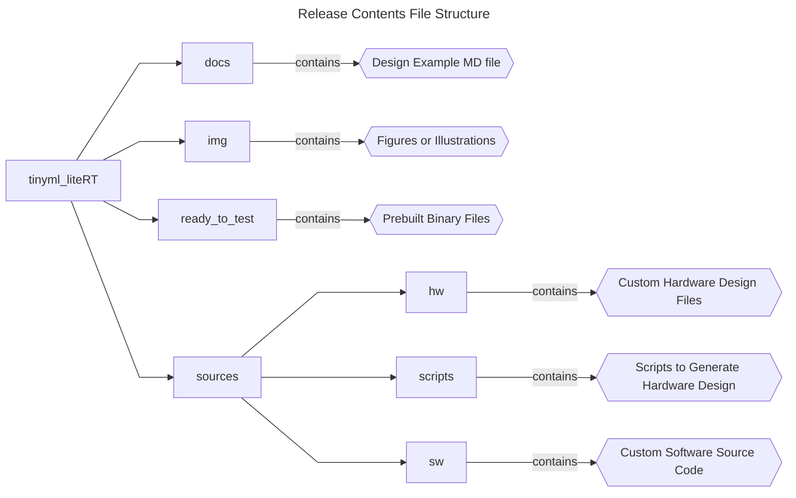
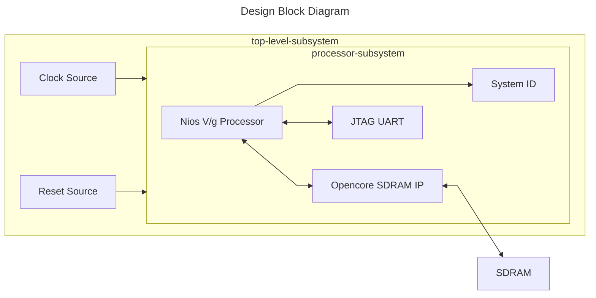

 


## Introduction

### Nios® V/g TinyML LiteRT System Example Design Overview

 This design demonstrates the TinyML application using LiteRT for microcontrollers software with Nios® V/g processor in Terasic’s Atum A3 Nano (Atum Nios® V Starter Kit). </br>
 The design is built with basic peripherals required for simple application execution:

 - JTAG UART for serial output.

### Prerequisites

 - Terasic’s Atum A3 Nano (Atum Nios® V Starter Kit), ordering code Atum-A3-Nano(Atum-Nios® V). </br> Refer to the board documentation for more information about the development kit.
 - Type-C USB Cable. Included with the development kit.
 - Host PC with 64 GB of RAM. Less will be fine for only exercising the prebuilt binaries, and not rebuilding the design.
 - Quartus® Prime Pro Edition Software version 26.1
 - Ashling* RiscFree* IDE for Altera® FPGAs
 
### Release Contents  

Every Nios V processor design example is maintained based on this folder structure. </br>
Here is the Github link to root directory of this design example: [**Nios® V/g TinyML LiteRT Example Design Github link**](https://github.com/altera-fpga/agilex3c-nios-ed/tree/rel/26.1/terasic_atum_a3_nano/niosv_g/niosv_g_tinyml_liteRT)



## Nios® V/g TinyML LiteRT Design Architecture
 This example design includes a Nios® V/g processor connected to the Opencore SDRAM IP, JTAG UART IP and System ID peripheral core. </br>
 The objective of the design is to accomplish data transfer between the processor and soft IP peripherals:

 - Running TinyML application that identify Modified National Institute of Standards and Technology (MNIST) data samples.
 - Prints the classification result through JTAG UART IP.



### Nios® V/g Processor IP
- General-purpose 32-bit CPU for high performance applications with larger logic area utilization.
- Implements RV32IMZicsr_Zicbom instruction set (optionally with “F” and "Smclic" extension) instruction set.
- Supports five-stages pipelined datapath.
- It is a customizable soft-core processor, that can be tailored to meet specific application requirements, providing flexibility and scalability in embedded system designs.
 
### Embedded Peripheral IP Cores
The following embedded peripheral IPs are used in this design:

- Opencore SDRAM IP[(link)](https://github.com/ultraembedded/core_sdram_axi4)
- JTAG UART IP
- System ID IP

### System Components
The following components are used in this design:

- Clock Source (Clock Bridge IP)
- Reset Source (Reset Release IP)

### Nios® V Processor Address Map Details
 |Address Offset	|Size (Bytes)	|Peripheral	| Description|
  |-|-|-|-|
  |0x0008_0440|8|System ID|Hardware configuration system ID (0x0)|
  |0x0008_0448|8|JTAG UART|Communication between a host PC and the Nios V processor system|
  |0x0400_0000|64MB|Opencore SDRAM|To store application|
  ||||

## Development Kit Setup

Refer to [Atum A3 Nano Getting Started Guide](https://www.terasic.com.tw/cgi-bin/page/archive.pl?Language=English&CategoryNo=44&No=1373&PartNo=4#contentsl) to setup the development kit.


## Environment Setup

Download the Quartus® Prime Pro Edition and Ashling* RiscFree* IDE for Altera® FPGAs (software version 26.1) from the [Quartus® Prime Design Software - Download](https://www.altera.com/products/development-tools/quartus#download) from Altera website. </br>
Follow the on-screen instructions to complete the installation process.

Next, set up the Quartus® Prime Pro Edition and Ashling* RiscFree* IDE tools in the PATH.
```console
export QUARTUS_ROOTDIR=~/altera_pro/26.1/quartus/
export PATH=$QUARTUS_ROOTDIR/bin:$QUARTUS_ROOTDIR/linux64:$QUARTUS_ROOTDIR/../qsys/bin:$QUARTUS_ROOTDIR/../riscfree/RiscFree:$QUARTUS_ROOTDIR/../niosv/bin/$PATH
```

## Exercising Prebuilt Binaries

### Program Hardware Binary SOF
1. Connect the development kit to the host PC using USB Blaster II.
2. Change the JTAG clock frequency to 6 MHz, and probe the JTAGServer to get the JTAG scan chain.
3. Execute the quartus_pgm command to program the SOF file with the correct device number. </br>Based on the JTAG scan chain below, the FPGA is at device number 1. You may require to provide a different device number if your JTAG chain is different from the given example.

```console
jtagconfig --setparam 1 JtagClock 6M
jtagconfig -d
quartus_pgm --cable=1 -m jtag -o 'p;ready_to_test/golden_top.sof@1'
```

For example:
```console
 1) Atum A3 Nano
  436DB0DD   A3CY135BB18A(.|RO)/ .. (IR=10)
 
  Captured DR after reset = (436DB0DD) [32]
  Captured IR after reset = (001) [10]
  Captured Bypass after reset = (0) [1]
  Captured Bypass chain = (0) [1]
  JTAG clock speed auto-adjustment is enabled. To disable, set JtagClockAutoAdjust parameter to 0
  JTAG clock speed 6 MHz
```


### Program Software Image ELF
1. Ensure that the development kit is successfully configured with the Hardware Binary SOF file.
2. Launch the Nios V Command Shell. You may skip this if the shell is active.
3. Execute the following command to download the ELF file.

```console
niosv-shell
niosv-download -g ready_to_test/tflite_app.elf -c 1
```

### Run Serial Console
You may proceed to to display the application printouts, and verify the design.

```console
juart-terminal -d 1 -c 1 -i 0 
```

For example, you should see similar display at the start of the application.


## Rebuilding the Design 

### Generate Hardware Binary SOF
Run the following command in the terminal from the *source* directory. </br> 
Copy the custom IP in the hw directory, and execute the build script.
The script performs the following tasks, which generates the hardware binary SOF file of this design.

1. Create a new project
2. Create a new Platform Designer system
3. Configure assignments and constraints
4. Compile the project
5. Generate a hardware binary SOF file
 
```console
cp -a custom_logic/. hw
quartus_py ./scripts/build_sof.py
```

### Generate Software Image ELF
After the hardware binary SOF file is ready, you may begin building the software design. </br>
It consists of the following steps:

1. Create a board support package (BSP) project.
2. Create a Nios® V processor application project with TinyML source codes.
3. Build the TinyML application.
4. Generate a software image ELF file.

Launch the Nios V Command Shell. You may skip this if the shell is active. </br>
Run the following command in the shell from the *source* directory.
```console
niosv-shell

niosv-bsp -c --quartus-project=hw/golden_top.qpf -s=hw/nios_system.qsys --type=hal --no-default --script=sw/bsp_script.tcl sw/tflite_bsp/settings.bsp

niosv-app --bsp-dir=sw/tflite_bsp --app-dir=sw/tflite_app --srcs-recursive=sw/tflite_app/image_classification,sw/tflite_app/signal,sw/tflite_app/tensorflow --incs=sw/tflite_app,sw/tflite_app/image_classification/model,sw/tflite_app/image_classification/image,sw/tflite_app/tensorflow,sw/tflite_app/third_party/flatbuffers/include,sw/tflite_app/third_party/gemmlowp,sw/tflite_app/third_party/kissfft,sw/tflite_app/third_party/ruy

cmake -S ./sw/tflite_app -B sw/tflite_app/build/Release -G "Unix Makefiles" -DCMAKE_BUILD_TYPE=Release

make -C sw/tflite_app/build/Release
```

### Program Hardware Binary SOF
1. Connect the development kit to the host PC using USB Blaster II.
2. Change the JTAG clock frequency to 6 MHz, and probe the JTAGServer to get the JTAG scan chain.
3. Execute the quartus_pgm command to program the SOF file with the correct device number. </br>Based on the JTAG scan chain below, the FPGA is at device number 1. You may require to provide a different device number if your JTAG chain is different from the given example.

```console
jtagconfig --setparam 1 JtagClock 6M
jtagconfig -d
quartus_pgm --cable=1 -m jtag -o 'p;hw/output_files/golden_top.sof@1'
```

For example:
```console
 1) Atum A3 Nano
  436DB0DD   A3CY135BB18A(.|RO)/ .. (IR=10)
 
  Captured DR after reset = (436DB0DD) [32]
  Captured IR after reset = (001) [10]
  Captured Bypass after reset = (0) [1]
  Captured Bypass chain = (0) [1]
  JTAG clock speed auto-adjustment is enabled. To disable, set JtagClockAutoAdjust parameter to 0
  JTAG clock speed 6 MHz
```


### Program Software Image ELF
1. Ensure that the development kit is successfully configured with the Hardware Binary SOF file.
2. Launch the Nios V Command Shell. You may skip this if the shell is active.
3. Execute the following command to download the ELF file.

```console
niosv-shell
niosv-download -g sw/tflite_app/build/Release/tflite_app.elf -c 1
```

### Run Serial Console
You may proceed to to display the application printouts, and verify the design.

```console
juart-terminal -d 1 -c 1 -i 0 
```

For example, you should see similar display at the start of the application.


