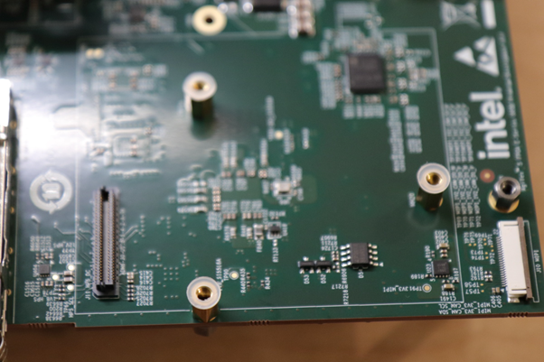
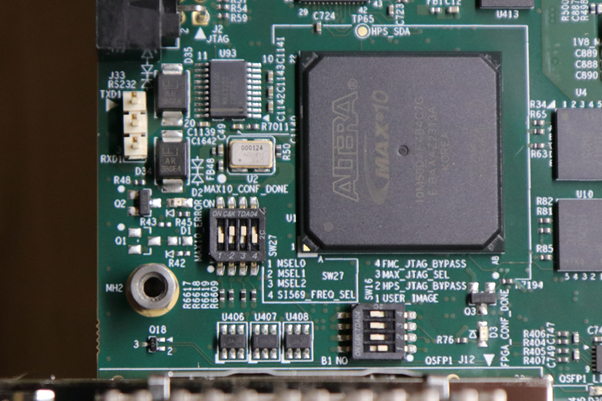

## Introduction

### Overview

### Prerequisites

The following are required to be able to fully exercise the Agilex 5 Premium Development Kit GSRD:

* Altera Agilex 5 FPGA E-Series 065B Premium Development Kit, ordering code DK-A5E065BB32AES1. Refer to https://www.intel.com/content/www/us/en/products/details/fpga/development-kits/agilex/a5e065b-premium.html for more information about the development kit.

  * HPS Enablement  Expansion Board. Included with the development kit.
  * HPS NAND Board. Enables both NAND and eMMC storage for HPS. Orderable separately.
  * HPS Test Board. Supports SD card boot, and external Arm tracing. Orderable separately.
  * Mini USB Cable. Included with the development kit.
  * Micro USB Cable. Included with the development kit.
  * Ethernet Cable. Included with the development kit.
  * Micro SD card and USB card writer. Included with the development kit.
* Host PC with
  * 64 GB of RAM. Less will be fine for only exercising the binaries, and not rebuilding the GSRD.
  * Linux OS installed. Ubuntu 22.04LTS was used to create this page, other versions and distributions may work too
  * Serial terminal (for example Gtkterm or Minicom on Linux and TeraTerm or PuTTY on Windows)
  * Intel Quartus Prime Pro Edition version 24.1. Used to recompile the hardware design. If only writing binaris is required, then the smaller Intel Quartus Prime Pro Edition Programmer version 24.1 is sufficient.
  * TFTP server. This used to download the eMMC and NAND binaries to board to be flashed by U-Boot
* Local Ethernet network, with DHCP server
* Internet connection. For downloading the files, especially when rebuilding the GSRD.

### Release Contents

#### Binaries

The Agilex 5 Premium Development Kit GSRD binaries are located at https://releases.rocketboards.org/2024.05/:

| HPS Daughter Card | Boot Source | Link |
| :--: | ---------------------- | -- |
| Enablement Board | SD Card | https://releases.rocketboards.org/2024.05/gsrd/agilex5_dk_a5e065bb32aes1_gsrd |
| Enablement Board | QSPI | https://releases.rocketboards.org/2024.05/qspi/agilex5_dk_a5e065bb32aes1_qspi |
| NAND Board | NAND | https://releases.rocketboards.org/2024.05/nand/agilex5_dk_a5e065bb32aes1_nand |
| NAND Board | eMMC | https://releases.rocketboards.org/2024.05/emmc/agilex5_dk_a5e065bb32aes1_emmc |
| Test Board | SD Card | https://releases.rocketboards.org/2024.05/debug/agilex5_dk_a5e065bb32aes1_debug |

#### Sources

Quartus Prime Pro v24.1 and the following software component versions are used to build the GSRD:

| Component | Location | Branch | Commit ID/Tag |
| :-- | :-- | :-- | :-- |
| GHRD | https://github.com/altera-opensource/ghrd-socfpga | master | QPDS24.1_REL_AGILEX5_GSRD_PR |
| Linux | https://github.com/altera-opensource/linux-socfpga | socfpga-6.1.68-lts | QPDS24.1_REL_AGILEX5_GSRD_PR |
| Arm Trusted Firmware | https://github.com/arm-trusted-firmware         | socfpga_v2.10.0 | QPDS24.1_REL_AGILEX5_GSRD_PR |
| U-Boot | https://github.com/altera-opensource/u-boot-socfpga | socfpga_v2023.10   | QPDS24.1_REL_AGILEX5_GSRD_PR |
| Yocto Project: poky | https://git.yoctoproject.org/poky | nanbield | latest |
| Yocto Project: meta-intel-fpga | https://git.yoctoproject.org/meta-intel-fpga | nanbield | latest |
| Yocto Project: meta-intel-fpga-refdes | https://github.com/altera-opensource/meta-intel-fpga-refdes | nanbield | QPDS24.1_REL_AGILEX5_GSRD_PR |
| GSRD Build Script: gsrd-socfpga | https://github.com/altera-opensource/gsrd-socfpga | nanbield | QPDS24.1_REL_AGILEX5_GSRD_PR |

#### Release Notes

### GHRD Overview

### Development Kit

This release targets the Agilex 5 FPGA E-Series 065B Premium Development Kit. Refer to https://www.intel.com/content/www/us/en/products/details/fpga/development-kits/agilex/a5e065b-premium.html for more information about the development kit.


#### Installing HPS Daughtercard

This section presents how to install the included HPS Enablement daughtercard on the development kit. Installation for the other optional HPS daughtercards is similar.

1. Identify the correct thumb screws and washers needed, they are in plastic bag:


2. Locate the area on the development board where the HPS Daughtercard needs to be installed:


3. Place the plastic washers on top of the three hex mounting posts:



4. Place daughtercard on top of the posts and washers:


5. Place the hex thumb screws on the two posts, as shown below. Note the 3rd one on the bottom is best unplaced as fully screwing that in may move the board. Also note the thumb screw close to the Ethernet connector is hard to screw, recommend to use small pliers and patience to make it secure. It is important that the HPS daughtercard is secure, and does not move:


#### Changing MSEL

MSEL signals instruct the FPGA device on which configuration scheme to use. Configuration schemes used by the scenarios presented in this guide are JTAG and QSPI.

MSEL is changed through dipswitch SW27. Only change the settings while the board is powered off.

Configuration OFF-OFF-OFF-OFF corresponds to JTAG:


Configuration OFF-ON-ON-OFF corresponds to JTAG:



## Exercising Prebuilt Binaries

This section presents how to use the prebuilt binaries included with the GSRD release.

### Configure Board

1. Leave all jumpers and switches in their default configuration.
2. Install the appropriate HPS Daughtercard.
3. Connect mini USB cable from vertical connector on HPS Daughtercard to host PC. This is used for the HPS serial console.
4. Connect micro USB cable from development board to host PC. This is used by the tools for JTAG communication.
5. Connect Ethernet cable from HPS daughtercard to a switch connected to local network, which provides also a DCHP server.

### Configure Serial Console

All the scenarios included in this release require a serial connection. This section presents how to configure the serial connection.

1. Install a serial terminal emulator application on your host PC:
   * For Windows: TeraTerm or PuTTY are available
   * For Linux: GtkTerm or Minicom are available

2. Power down your board if powered up. This is important, as once powered up, with the micro USB JTAG cable connected, a couple more USB serial ports will enumerate, and you may choose the wrong port.

3. Connect min-USB cable from the vertical mini-USB connector on the HPS daughtercard to the host PC

4. On the host PC, an USB serial port will enumerate. On Windows machines it will be something like `COM4`, while on Linux machines it will be something like `/dev/tty/USB0`.

5. Configure your serial terminal emulator to use the following settings:
   * Serial port: as mentioned above
   * Baud rate: 115,200
   * Data bits: 8
   * Stop bits: 1
   * CRC: disabled
   * Hardware flow control: disabled

6. Connect your terminal emulator


### Booting from SD Card using HPS Enablement DC

#### Write SD Card

1. Download SD card image from the prebuilt binaries https://releases.rocketboards.org/2024.05/gsrd/agilex5_dk_a5e065bb32aes1_gsrd/sdimage.tar.gz and extract the archive, obtaining the file `gsrd-console-image-agilex5_devkit.wic`.
1. Write the SD card image to the micro SD card using the included USB writer, and `dd` utility on Linux, or  Win32DiskImager on Windows, available at https://win32diskimager.org/.

#### Write QSPI Flash

1. Power down board
2. Set MSEL dipswitch SW27 to JTAG: OFF-OFF-OFF-OFF
3. Power up the board
4. Download and extract the JIC image: https://releases.rocketboards.org/2024.05/gsrd/agilex5_dk_a5e065bb32aes1_gsrd/ghrd_a5ed065bb32ae6sr0.hps.jic.tar.gz
5. Write the JIC image to QSPI:
```bash
quartus_pgm -c 1 -m jtag -o "pvi;ghrd_a5ed065bb32ae6sr0.hps.jic"
```

#### Boot Linux

1. Power down board
2. Set MSEL dipswitch SW27 to QSPI: OFF-ON-ON-OFF
3. Power up the board
4. Wait for Linux to boot, use `root` as user name, and no password wil be requested:

```
U-Boot SPL 2023.10 (May 13 2024 - 10:08:02 +0000)
Reset state: Cold
MPU           875000 kHz
L4 Main	      400000 kHz
L4 sys free   100000 kHz
L4 MP         200000 kHz
L4 SP         100000 kHz
SDMMC          50000 kHz
init_mem_cal: Initial DDR calibration IO96B_0 succeed
...
NOTICE:  BL31: CPU ID = 81000000
NOTICE:  BL31: v2.10.0	(release):rel_socfpga_v2.10.0_24.04.02_pr-3-g6020e807b
NOTICE:  BL31: Built : 07:27:47, May 13 2024


U-Boot 2023.10 (May 13 2024 - 10:08:02 +0000)socfpga_agilex5

CPU:   Intel FPGA SoCFPGA Platform (ARMv8 64bit Cortex-A55/A76)
Model: SoCFPGA Agilex5 SoCDK
DRAM:  2 GiB (effective 8 GiB)
Core:  51 devices, 26 uclasses, devicetree: separate
WDT:   Not starting watchdog@10d00200
WDT:   Not starting watchdog@10d00300
WDT:   Not starting watchdog@10d00400
WDT:   Not starting watchdog@10d00500
WDT:   Not starting watchdog@10d00600
NAND:  cadence-nand-dt nand@10b80000: Timeout while waiting for reg 118 with mask 200 is clear 0
Failed to initialize Cadence NAND controller. (error -110)
0 MiB
MMC:   mmc0@10808000: 0
Loading Environment from FAT... Unable to read "uboot.env" from mmc0:1...
Loading Environment from UBI... cadence-nand-dt nand@10b80000: Timeout while waiting for reg 118 with mask 200 is clear 0
SF: Detected mt25qu02g with page size 256 Bytes, erase size 64 KiB, total 256 MiB
Could not find a valid device for 10b80000.nand.0
Volume env not found!
...
Hit any key to stop autoboot:  5  4  3  2  1  0 
switch to partitions #0, OK
mmc0 is current device
Scanning mmc 0:1...
Found U-Boot script /boot.scr.uimg
2411 bytes read in 13 ms (180.7 KiB/s)
## Executing script at 81000000
crc32+ Trying to boot Linux from device mmc0
Found kernel in mmc0
16904211 bytes read in 733 ms (22 MiB/s)
## Loading kernel from FIT Image at 82000000 ...
   Using 'board-4' configuration
   Verifying Hash Integrity ... OK
   Trying 'kernel' kernel subimage
     Description:  Linux Kernel
     Type:         Kernel Image
     Compression:  lzma compressed
     Data Start:   0x820000dc
     Data Size:    9786153 Bytes = 9.3 MiB
     Architecture: AArch64
     OS:           Linux
     Load Address: 0x86000000
     Entry Point:  0x86000000
     Hash algo:    crc32
     Hash value:   e2f6570b
   Verifying Hash Integrity ... crc32+ OK
## Loading fdt from FIT Image at 82000000 ...
   Using 'board-4' configuration
   Verifying Hash Integrity ... OK
   Trying 'fdt-4' fdt subimage
     Description:  socfpga_socdk_combined
     Type:         Flat Device Tree
     Compression:  uncompressed
     Data Start:   0x829729a4
     Data Size:    41318 Bytes = 40.3 KiB
     Architecture: AArch64
     Hash algo:    crc32
     Hash value:   0a933b6c
   Verifying Hash Integrity ... crc32+ OK
   Booting using the fdt blob at 0x829729a4
Working FDT set to 829729a4
## Loading fpga from FIT Image at 82000000 ...
   Trying 'fpga-4' fpga subimage
     Description:  FPGA bitstream for GHRD
     Type:         FPGA Image
     Compression:  uncompressed
     Data Start:   0x82cdc598
     Data Size:    1728512 Bytes = 1.6 MiB
     Load Address: 0x8a000000
     Hash algo:    crc32
     Hash value:   bd84dc3f
   Verifying Hash Integrity ... crc32+ OK
   Loading fpga from 0x82cdc598 to 0x8a000000
..FPGA reconfiguration OK!
Enable FPGA bridges
   Programming full bitstream... OK
   Uncompressing Kernel Image
   Loading Device Tree to 00000000ff8d6000, end 00000000ff8e3165 ... OK
Working FDT set to ff8d6000
Removing MTD device #2 (root) with use count 1
Error when deleting partition "root" (-16)
SF: Detected mt25qu02g with page size 256 Bytes, erase size 64 KiB, total 256 MiB
Enabling QSPI at Linux DTB...
Working FDT set to ff8d6000
QSPI clock frequency updated
RSU: Firmware or flash content not supporting RSU
RSU: Firmware or flash content not supporting RSU
RSU: Firmware or flash content not supporting RSU
RSU: Firmware or flash content not supporting RSU

Starting kernel ...

Deasserting all peripheral resets
[    0.000000] Booting Linux on physical CPU 0x0000000000 [0x412fd050]
[    0.000000] Linux version 6.1.68-altera (oe-user@oe-host) (aarch64-poky-linux-gcc (GCC) 13.2.0, GNU ld (GNU Binutils) 2.41.0.20231213) #1 SMP PREEMPT Mon May 13 07:24:08 UTC 2024
[    0.000000] Machine model: SoCFPGA Agilex5 SoCDK
...
[   24.994963] socfpga-dwmac 10830000.ethernet eth0: configuring for phy/rgmii-id link mode
[   25.127618] 8021q: adding VLAN 0 to HW filter on device eth0
[  OK  ] Started Hostname Service.
[  OK  ] Started Network Configuration.
[  OK  ] Reached target Network.
[  OK  ] Finished OpenSSH Key Generation.


Poky (Yocto Project Reference Distro) 4.3.4 agilex5devkit ttyS0

agilex5devkit login: root

[   30.253163] socfpga-dwmac 10830000.ethernet eth0: Link is Up - 1Gbps/Full - flow control rx/tx
[   30.261928] IPv6: ADDRCONF(NETDEV_CHANGE): eth0: link becomes ready
root@agilex5devkit:~# 
```

#### Run Sample Applications

1. Boot to Linux
2. Change current folder to `intelFPGA` folder
```bash
cd intelFPGA
```
2. Run the hello world application
```bash
./hello
```
3. Run the `syscheck` application
```bash
./syscheck
```
#### Control LEDs
1. Boot to Linux
2. Control LEDs by using the following sysfs entries:
  * /sys/class/leds/fpga_led0/brightness
  * /sys/class/leds/fpga_led1/brightness
  * /sys/class/leds/fpga_led2/brightness
  * /sys/class/leds/hps_led1/brightness

Using commands such as:
```bash
cat /sys/class/leds/fpga_led0/brightness
echo 0 > /sys/class/leds/fpga_led0/brightness
echo 1 > /sys/class/leds/fpga_led1/brightness
```

#### Connect to Board Using SSH

1. Boot to Linux
2. Determine the board IP address using the `ifconfig` command:
```bash
root@agilex5devkit:~# ifconfig
eth0: flags=-28605<UP,BROADCAST,RUNNING,MULTICAST,DYNAMIC>  mtu 1500
        inet 192.168.1.153  netmask 255.255.255.0  broadcast 192.168.1.255
        inet6 fe80::f0eb:c8ff:fec4:eed7  prefixlen 64  scopeid 0x20<link>
        ether f2:eb:c8:c4:ee:d7  txqueuelen 1000  (Ethernet)
        RX packets 649  bytes 45132 (44.0 KiB)
        RX errors 0  dropped 226  overruns 0  frame 0
        TX packets 56  bytes 8789 (8.5 KiB)
        TX errors 0  dropped 0 overruns 0  carrier 0  collisions 0
        device interrupt 23  

lo: flags=73<UP,LOOPBACK,RUNNING>  mtu 65536
        inet 127.0.0.1  netmask 255.0.0.0
        inet6 ::1  prefixlen 128  scopeid 0x10<host>
        loop  txqueuelen 1000  (Local Loopback)
        RX packets 100  bytes 8408 (8.2 KiB)
        RX errors 0  dropped 0  overruns 0  frame 0
        TX packets 100  bytes 8408 (8.2 KiB)
        TX errors 0  dropped 0 overruns 0  carrier 0  collisions 0
```
3. Connect to the board over SSH using `root` username, no password will be requested:
```bash
ssh root@192.168.1.153
```
**Note**: Make sure to replace the above IP address to the one matching the output of running `ifconfig` on youir board.

#### Visit Board Web Page
1. Boot to Linux
2. Determine board IP address using `ifconfig` like in the previous scenario
3. Start a web browser and enter the IP address in the address bar
4. The web browser will display a page served by the web server running on the board.

**Note**: Current release has a limitation, in that the LEDs are not controllable from the web page. This will be fixed in the next release.

### Booting from QSPI using HPS Enablement DC
This section presents how to boot from QSPI. One notable aspect is that you need to wipe the SD card partitioning information, as otherwise U-Boot SPL could find a valid image, and try to boot from that first.

#### Wipe SD Card

Either write 1MB of zeroes at the beginning of the SD card, or remove the SD card from the HPS dauhgtercard. You can use `dd` on Linux, or `Win32DiskImager` on Windows to achieve this.

#### Write QSPI Flash

1. Power down board
2. Set MSEL dipswitch SW27 to JTAG: OFF-OFF-OFF-OFF
3. Power up the board
4. Download and extract the JIC image: https://releases.rocketboards.org/2024.05/gsrd/agilex5_dk_a5e065bb32aes1_qspi/agilex_flash_image.hps.jic.tar.gz
5. Write the JIC image to QSPI:
```bash
quartus_pgm -c 1 -m jtag -o "pvi;agilex_flash_image.hps.jic"
```

#### Boot Linux

1. Power down board
2. Set MSEL dipswitch SW27 to QSPI: OFF-ON-ON-OFF
3. Power up the board
4. Wait for Linux to boot, use `root` as user name, and no password wil be requested.

### Booting from eMMC using HPS NAND DC

#### Configure Board
For this scenario, we are using the HPS NAND Board, which can be configured through dipswitch SW3 to enable either eMMC or NAND. Set SW3 to ON to enable eMMC

#### Write eMMC Flash

We are writing the eMMC Flash by using U-Boot commands. We are getting to U-Boot prompt by booting from QSPI using a JIC image which contains U-Boot, thereby not relying on what is already in eMMC.

1. Download, and extract the eMMC image
```bash
wget https://releases.rocketboards.org/2024.05/emmc/agilex5_dk_a5e065bb32aes1_emmc/sdimage.tar.gz
tar xf sdimage.tar.gz
```
2. Split the eMMC image into 1GB chunks and copy them to your TFT folder:
```bash
split --bytes=1G gsrd-console-image-agilex5_devkit.wic
mv xa* <your_tfp_folder>
```
This will put the two chunks called `xaa` and `xab` on your TFTP folder.
4. Power down the board. 
5. Set MSEL dipswitch SW27 to JTAG: OFF-OFF-OFF-OFF
6. Power up the board
7. Download the helper JIC used to write the eMMC image, extract it and flash it to QSPI:
```bash
wget https://releases.rocketboards.org/2024.05/emmc/agilex5_dk_a5e065bb32aes1_emmc/uboot.jic.tar.gz
tar xf uboot.jic.tar.gz
quartus_pgm -c 1 -m jtag -o "pvi;uboot.jic"
```
8. Determine your host IP address using `ifconfig` to use it as the IP address of the TFTP server
9. Power down the board
10. Set MSEL dipswitch SW27 to QSPI: OFF-ON-ON-OFF
11. Power up the board
12. Stop U-Boot at the boot coundown, to drop to U-Boot console
14. At the U-Boot console, run the following commands to write the SD card image:
```
setenv autoload no
dhcp
setenv serverip <tftp_server_ip_address>
tftp ${loadaddr} xaa
setexpr blkcnt1 ${filesize} / 0x200
mmc write ${loadaddr} 0 ${blkcnt1}
tftp ${loadaddr} xab
setexpr blkcnt2 ${filesize} / 0x200
mmc write ${loadaddr} ${blkcnt1} ${blkcnt2}
```
**Note**: If you already have a valid image in eMMC, the U-Boot SPL which runs from QSPI will be able to see that and load it instead of the U-Boot from QSPI. To prevent this from happening, you can wipe out the eMMC card partitioning, then issue a reset for U-Boot to reboot:

```
mw.w ${loadaddr} 0x0 0x80000
mmc rescan
mmc write ${loadaddr} 0x0 0x400
reset
```
#### Write QSPI Flash

1. Power down the board. 
2. Set MSEL dipswitch SW27 to JTAG: OFF-OFF-OFF-OFF
3. Power up the board
4. Download the JIC and write it to QSPI:
```bash
wget https://releases.rocketboards.org/2024.05/emmc/agilex5_dk_a5e065bb32aes1_emmc/ghrd_a5ed065bb32ae6sr0.hps.jic.tar.gz 
tar xf ghrd_a5ed065bb32ae6sr0.hps.jic.tar.gz 
quartus_pgm -c 1 -m jtag -o "pvi;ghrd_a5ed065bb32ae6sr0.hps.jic"
```
#### Boot Linux
1. Power down the board. 
2. Set MSEL dipswitch SW27 to QSPI: OFF-ON-ON-OFF
3. Power up the board
4. Board will boot to Linux. Enter `root` as username, no password will be requested

### Booting from NAND using HPS NAND DC

#### Configure Board

For this scenario, we are using the HPS NAND Board, which can be configured through dipswitch SW3 to enable either eMMC or NAND. Set SW3 to OFF to enable NAND.

#### Write NAND Flash

We are writing the NAND Flash by using U-Boot commands. We are getting to U-Boot prompt by booting from QSPI using a JIC image which contains U-Boot, thereby not relying on what is already in NAND.

1. Download the NAND binaries and write then to your TFTP folder

```bash
cd <your_tftp_folder>
wget https://releases.rocketboards.org/2024.05/nand/agilex5_dk_a5e065bb32aes1_nand/u-boot.itb
wget https://releases.rocketboards.org/2024.05/nand/agilex5_dk_a5e065bb32aes1_nand/root.ubi
```

2. Power down the board. 
3. Set MSEL dipswitch SW27 to JTAG: OFF-OFF-OFF-OFF
4. Power up the board
5. Download the helper JIC used to write the NAND binaeries, extract it and flash it to QSPI:

```bash
wget https://releases.rocketboards.org/2024.05/nand/agilex5_dk_a5e065bb32aes1_nand/uboot.jic.tar.gz
tar xf uboot.jic.tar.gz
quartus_pgm -c 1 -m jtag -o "pvi;uboot.jic"
```

6. Determine your host IP address using `ifconfig` to use it as the IP address of the TFTP server
7. Power down the board
8. Set MSEL dipswitch SW27 to QSPI: OFF-ON-ON-OFF
9. Power up the board
10. Stop U-Boot at the boot coundown, to drop to U-Boot console
11. At the U-Boot console, run the following commands to write the NAND binaries:

```
setenv autoload no
dhcp
setenv serverip <tftp_server_ip_address>
tftp $loadaddr u-boot.itb
nand erase.part u-boot
nand write $loadaddr u-boot $filesize
tftp $loadaddr root.ubi
nand erase.part clean root
nand write.trimffs $loadaddr root $filesize
```

#### Write QSPI Flash

1. Power down the board. 
2. Set MSEL dipswitch SW27 to JTAG: OFF-OFF-OFF-OFF
3. Power up the board
4. Download the JIC and write it to QSPI:

```bash
wget https://releases.rocketboards.org/2024.05/nand/agilex5_dk_a5e065bb32aes1_nand/ghrd_a5ed065bb32ae6sr0.hps.jic.tar.gz 
tar xf ghrd_a5ed065bb32ae6sr0.hps.jic.tar.gz 
quartus_pgm -c 1 -m jtag -o "pvi;ghrd_a5ed065bb32ae6sr0.hps.jic"
```

#### Boot Linux

1. Power down the board. 
2. Set MSEL dipswitch SW27 to QSPI: OFF-ON-ON-OFF
3. Power up the board
4. Board will boot to Linux. Enter `root` as username, no password will be requested

### Booting from SD Card Using HPS Test DC

#### Configure Board

For this scenario we are using the HPS Test Board. There is single dipswitch on that board called SW1, which needs to be set to the ON position.

#### Write SD Card

1. Download SD card image from the prebuilt binaries https://releases.rocketboards.org/2024.05/debug/agilex5_dk_a5e065bb32aes1_debug/sdimage.tar.gz and extract the archive, obtaining the file `gsrd-console-image-agilex5_devkit.wic`.
2. Write the SD card image to the micro SD card using the included USB writer, and `dd` utility on Linux, or  Win32DiskImager on Windows, available at https://win32diskimager.org/.

#### Write QSPI Flash

1. Power down the board. 
2. Set MSEL dipswitch SW27 to JTAG: OFF-OFF-OFF-OFF
3. Power up the board
4. Download the JIC and write it to QSPI:

```bash
wget https://releases.rocketboards.org/2024.05/debug/agilex5_dk_a5e065bb32aes1_debug/ghrd_a5ed065bb32ae6sr0.hps.jic.tar.gz 
tar xf ghrd_a5ed065bb32ae6sr0.hps.jic.tar.gz 
quartus_pgm -c 1 -m jtag -o "pvi;ghrd_a5ed065bb32ae6sr0.hps.jic"
```

#### Boot Linux

1. Power down the board. 
2. Set MSEL dipswitch SW27 to QSPI: OFF-ON-ON-OFF
3. Power up the board
4. Board will boot to Linux. Enter `root` as username, no password will be requested

## Rebuilding the GSRD

### Building the Binaries for HPS Enablement DC

<!--{"type":"recipe", "name":"Agilex5GSRD.Enablement", "results":["$TOP_FOLDER/ghrd_a5ed065bb32ae6sr0.hps.jic","$TOP_FOLDER/ghrd_a5ed065bb32ae6sr0.hps.rbf","$TOP_FOLDER/gsrd_socfpga/agilex5_devkit-gsrd-images/sdimage.tar.gz","$TOP_FOLDER/qspi_boot/agilex_flash_image.hps.jic"],"TOP_FOLDER":"artifacts.enablement", "board_keywords":["DK-A5E065BB32AES1","SD"], "test_commands":["write-sd=$TOP_FOLDER/gsrd_socfpga/agilex5_devkit-gsrd-images/sdimage.tar.gz","write-jic=$TOP_FOLDER/ghrd_a5ed065bb32ae6sr0.hps.jic","boot-linux-qspi","wipe-sd","write-jic=$TOP_FOLDER/qspi_boot/agilex_flash_image.hps.jic","boot-linux-qspi"]}-->

#### Building the SD Card Boot Binaries


#### Building the QSPI Boot Binaries


<!--{"type":"/recipe" }-->

### Building the eMMC binaries for HPS NAND DC

<!--{"type":"recipe", "name":"Agilex5GSRD.Enablement", "results":["$TOP_FOLDER/ghrd_a5ed065bb32ae6sr0.hps.jic","$TOP_FOLDER/ghrd_a5ed065bb32ae6sr0.hps.rbf","$TOP_FOLDER/gsrd_socfpga/agilex5_devkit-gsrd-images/sdimage.tar.gz"],"TOP_FOLDER":"artifacts.emmc", "board_keywords":["DK-A5E065BB32AES1","eMMC"], "test_commands":["write-sd=$TOP_FOLDER/gsrd_socfpga/agilex5_devkit-gsrd-images/sdimage.tar.gz","write-jic=$TOP_FOLDER/ghrd_a5ed065bb32ae6sr0.hps.jic","boot-linux-qspi"]}-->


#### Building the QSPI  Helper JIC


<!--{"type":"/recipe" }-->

### Building the NAND binaries for HPS NAND DC

<!--{"type":"recipe", "name":"Agilex5GSRD.Enablement", "results":["$TOP_FOLDER/ghrd_a5ed065bb32ae6sr0.hps.jic","$TOP_FOLDER/ghrd_a5ed065bb32ae6sr0.hps.rbf","$TOP_FOLDER/gsrd_socfpga/agilex5_devkit-nand-images/sdimage.tar.gz"],"TOP_FOLDER":"artifacts.nand", "board_keywords":["DK-A5E065BB32AES1","NAND"], "test_commands":["write-nand=$TOP_FOLDER","write-jic=$TOP_FOLDER/ghrd_a5ed065bb32ae6sr0.hps.jic","boot-linux-qspi"]}-->

#### NAND Flash Layout

There are two MTD partitions in NAND Flash:

| MTD Partition | Partition Type | Image File | Flash Offset | Size    |
| ------------- | -------------- | ---------- | ------------ | ------- |
| 0             | u-boot         | u-boot.itb | 0x00000000   | 2 MB    |
| 1             | root           | root.ubi   | 0x00200000   | 1022 MB |

The second partition contains the following components:

| UBI Volume | Volume Name | Type  | Image File   | Size   |
| ---------- | ----------- | ----- | ------------ | ------ |
| 0          | env         | UBI   | u-boot.env   | 256 KB |
| 1          | script      | UBI   | u-boot.scr   | 128 KB |
| 2          | kernel      | UBI   | kernel.itb   | 64 MB  |
| 3          | dtb         | UBI   | kernel.dtb   | 256 KB |
| 4          | rootfs      | UBIFS | rootfs.ubifs | rest   |

#### Build Flow


#### Building the QSPI Helper JIC


<!--{"type":"/recipe" }-->

### Building the binaries binaries for HPS Test DC

<!--{"type":"recipe", "name":"Agilex5GSRD.Enablement", "results":["$TOP_FOLDER/ghrd_a5ed065bb32ae6sr0.hps.jic","$TOP_FOLDER/ghrd_a5ed065bb32ae6sr0.hps.rbf","$TOP_FOLDER/gsrd_socfpga/agilex5_devkit-gsrd-images/sdimage.tar.gz"],"TOP_FOLDER":"artifacts.test", "board_keywords":["DK-A5E065BB32AES1","DEBUG"], "test_commands":["write-sd=$TOP_FOLDER/gsrd_socfpga/agilex5_devkit-gsrd-images/sdimage.tar.gz","write-jic=$TOP_FOLDER/ghrd_a5ed065bb32ae6sr0.hps.jic","boot-linux-qspi"]}-->


<!--{"type":"/recipe" }-->
