## Introduction

This tutorial presents an introduction to the TSE GMII to SGMII via FPGA LVDS I/O pins Design example and focuses on the design development workflow and methodology. The compiled binaries included with this material are provided strictly for reference purposes and have not been built, optimized, or validated for any specific target development kit. As such, they should not be used for device programming or hardware deployment.

## Overview

The [Triple-Speed Ethernet IP](https://docs.altera.com/r/docs/683402/25.3/triple-speed-ethernet-ip-user-guide/about-this-ip) is a configurable intellectual property (IP) core that complies with the IEEE 802.3 standard.
It incorporates a 10/100/1000 Mbps Ethernet media access controller (MAC) and an optional 1000BASE-X/SGMII physical coding sublayer (PCS) with an embedded physical medium attachment (PMA) built with either on-chip transceiver I/Os or LVDS I/Os. When offered in MAC-only mode, the IP connects with an external PHY chip using Media Independent Interface (MII), Gigabit Media Independent Interface (GMII), or Reduced Gigabit Media Independent Interface (RGMII). The IP was tested and successfully validated by the University of New Hampshire InterOperability Lab.

It describes the overall architecture of TSE GMII to SGMII via FPGA LVDS I/O pins, showing how HPS EMACs interface with Triple-Speed Ethernet (TSE) IP cores. Each enabled EMAC connects to a dedicated TSE using an 8-bit GMII interface. Configuration and status access is provided through the HPS Lightweight (LW) AXI bridge and optional JTAG master.

| Block        | Role                                           |
|-------------|-------------------------------------------------|
| **TSE IP**  | High‑speed Ethernet MAC in FPGA fabric           |
| **HPS (EMAC)** | Software‑driven networking and system control |
| **Address Decoder** | Decodes the master address space into multiple destination groups


**Overall TSE GMII to SGMII via FPGA LVDS I/O pins Architecture Details**

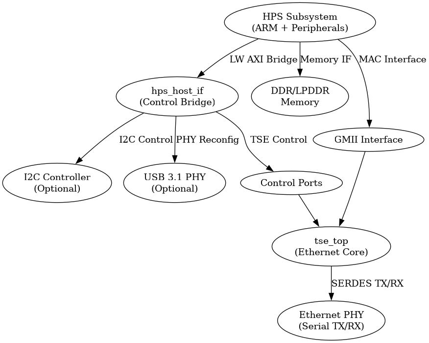

The address decoder decodes the master address space into multiple destination groups.
The HPS Lightweight (LW) interface supports a 29‑bit address width.

This section explains the design of HPS + TSE GMII to SGMII via FPGA LVDS I/O pins diagram.
<br />
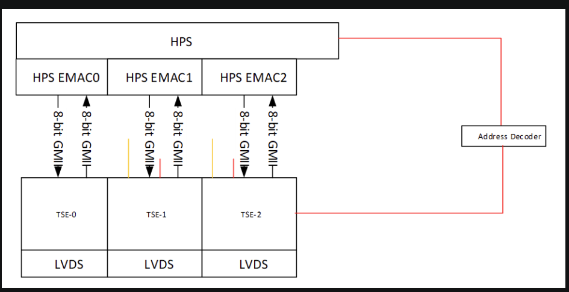

## Project creation (Address Decoder + HPS Subsystem + TSN Subsystem)

This section provides a comprehensive overview of the HPS configuration, covering key components such as the EMAC setup, DDR4 EMIF interface, clocking scheme, and reset management. The EMACs are configured to operate in GMII mode, with appropriate I/O multiplexing applied to ensure correct signal routing. Additionally, clock domain crossings between the HPS and the FPGA fabric are managed using standard bridge interfaces to maintain reliable data transfer and system stability.

To begin working with Platform Designer:
### Creating Address Decoder block
- **hps_host_if.qsys**
<br />
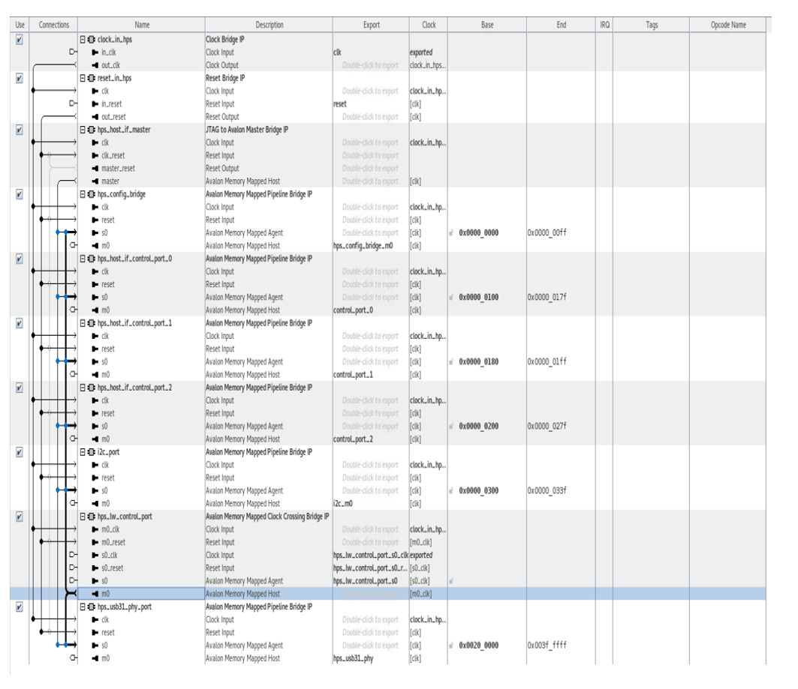

**Below is the setting for each of the IP:**
<br />
1. Clock Bridge IP: clock_in_hps
<br />
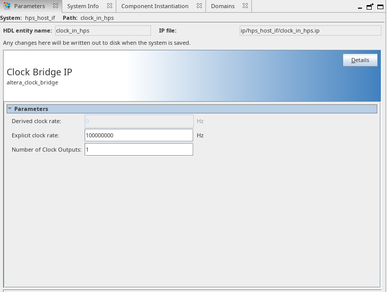
<br />
2. Reset Bridge IP: reset_in_hps
<br />
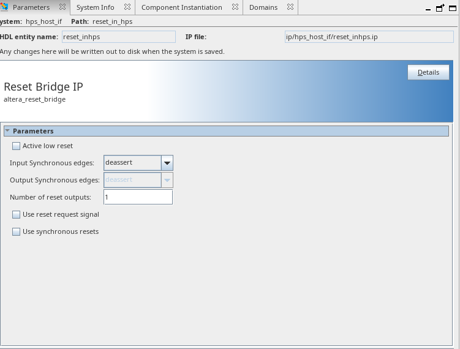
<br />
3. Avalon Memory Mapped Clock Crossing Bridge IP: hps_lw_control_port
<br />
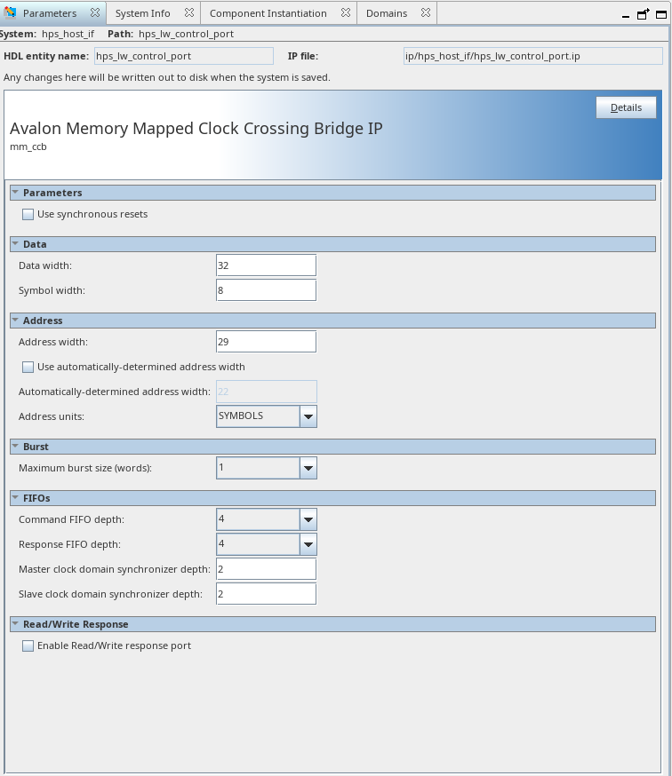
<br />
4. JTAG to Avalon Master Bridge IP: hps_host_if.master
  - Default Setting
<br /> 
5. Avalon Memorry Mapped Pipeline Bridge IP x6
<br />
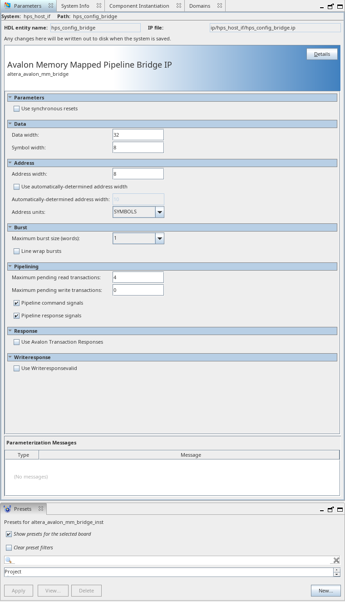
<br />
<br />
The HPS LW and normal H2F interfaces are enabled.
<br />
* LW interface is a 29-bit interface used for CSR accesses.
<br />
* The regular 38-bit address interface is chosen not to be used for CSR accesses, but it is enabled for future purpose.
<br />
The F2H interface is not enabled.

Address Map:

| Address Range               | Destination Group    | Description |
|-----------------------------|----------------------|-------------|
| 0x0000_0000 → 0x0000_00FF   | Fabric Level CSR (optional)    | Configuration and Status Register bank for fabric‑level control |
| 0x0000_0100 → 0x0000_017F   | TSE‑0 CSR            | CSR address space for TSE instance 0 |
| 0x0000_0180 → 0x0000_0200  | TSE‑1 CSR            | CSR address space for TSE instance 1 |
| 0x0000_0200 → 0x0000_027F  | TSE‑2 CSR            | CSR address space for TSE instance 2 |
| 0x0000_0300 → 0x0000_033F  | Fabric I2C CSR (optional)      | CSR address space for fabric I2C controller |
| 0x0020_0000 → 0x003F_FFFF  | HPS USB31 (optional)           | CSR address space for HPS USB 3.1 PHY |
  


### Creating HPS Sub-System
The figure above illustrates that EMAC0 and EMAC1 are configured to operate in GMII mode, enabling their connection to the TSE blocks for Ethernet communication. In this configuration, EMAC2 is not linked to the TSE; instead, it is directly connected to the HPS I/O, providing an alternative interface path for network or peripheral connectivity depending on system requirements.

**hps_subsys.qsys**
<br />
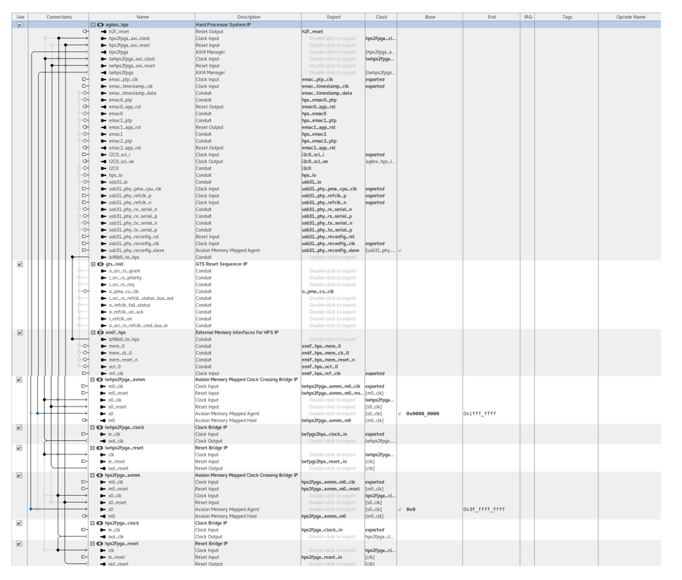

The following figures are steps how to configurate Hard Processor System IP Configuration
<br />
1. Click to HPS FPGA interface tab:
<br />
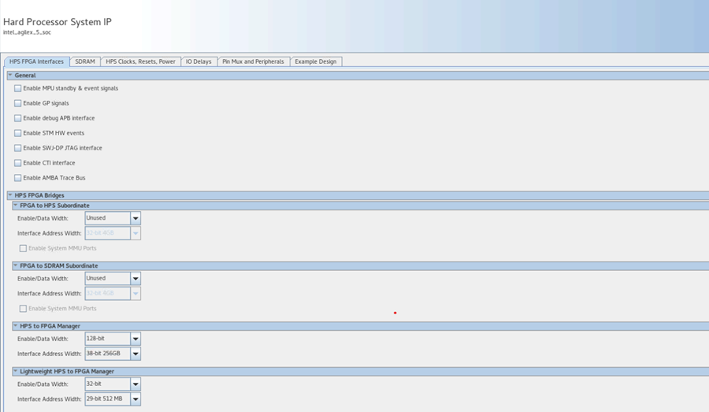
<br />
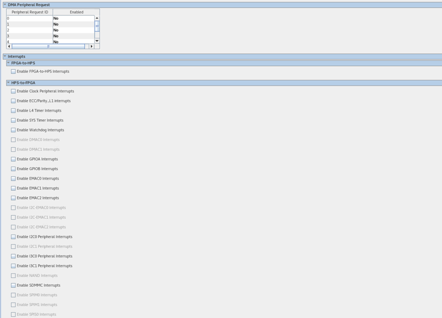
<br />
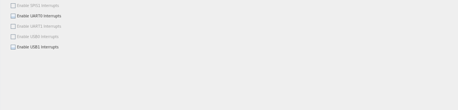
<br />
2. Click to SDRAM tab:
<br />
  - 1x16 configuration used.
<br />
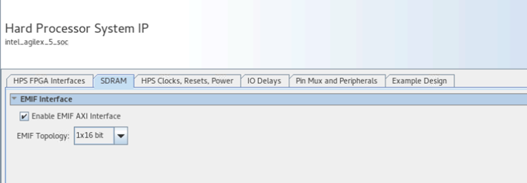
<br />
3. Click to HPS Clocks, Reset, Power tab
<br />
* Input clock
<br />
* PLL Clock and Power & Resets
<br />
  - Default setting
<br />
  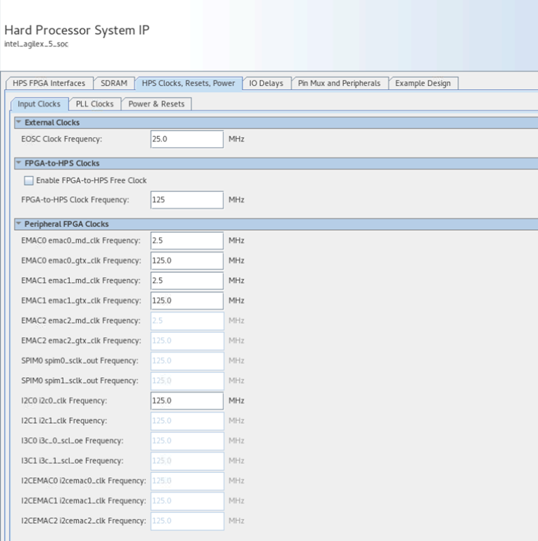
<br />
4. Click to IO Delays
<br />
  - Default setting
<br />
5. Click to Pin Mux and Peripherals tab
<br />
  - Auto Place IP: Configurate EMAC1 and EMAC2 interface to GMII interface and enable PTP interface selection.
<br />
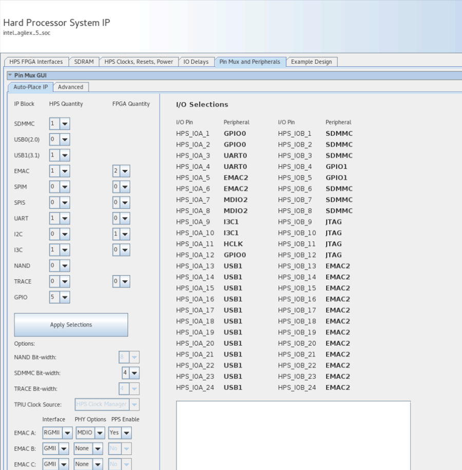
<br />

<br />

<br />
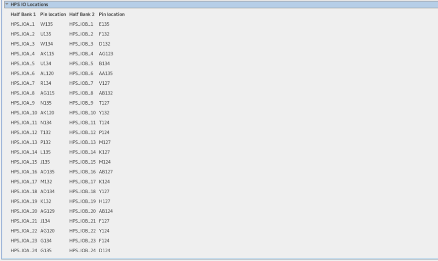
<br />
  - Click to Advanced tab: Advanced IP Placement
<br />
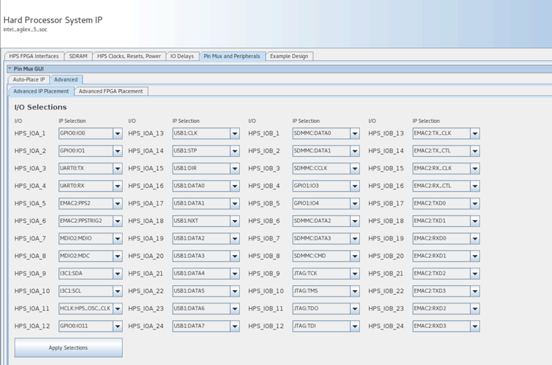
<br />
  - Click to Advanced tab: Advanced FPGA Placement
<br />
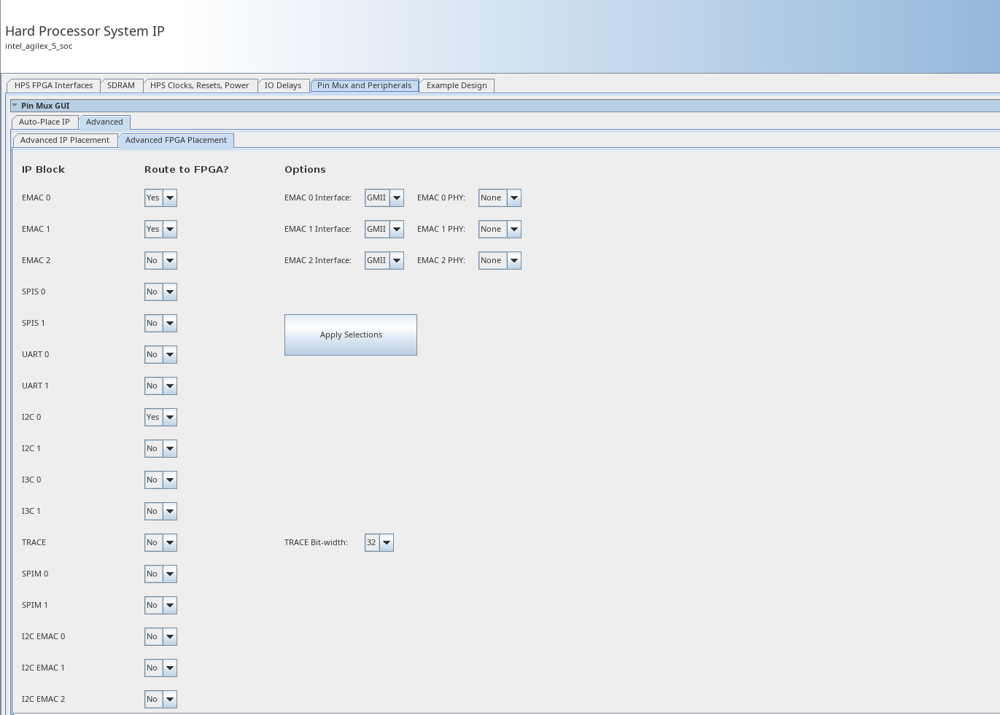
<br />
GTS Reset Sequencer IP
<br />
  - GTS Reset Sequencer IP ensure that only one transmitter or receiver lane undergoes reset-entry or reset-exit at a time per side of the device to comply with SiPi (Signal and Power Integrity). The GTS Reset Sequencer IP gets the requests from all the Soft Reset Controller(SRC) Lanes per side of the device and these requests will get granted one at a time in round robin
<br />
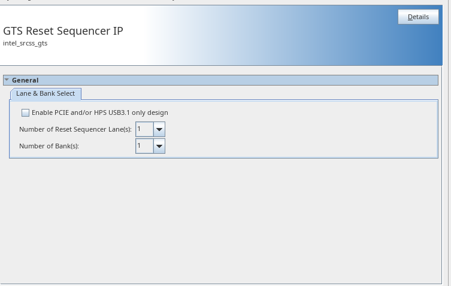
<br />
lwhps2fpga_avmm/clock (100Mhz)/reset (Input synchronous edge =deassert)
<br />
hps2fpaa_avmm/clock (100Mhz)/reset (Input synchronous edge = deassert)
<br />

>[Note:]
>Please invoke platform designer to get the exact details of the EMIF configuration as it is too complex to reproduce in this document.

---
### Creating TSE Subsystem

**hps_tse.qsys**
<br />
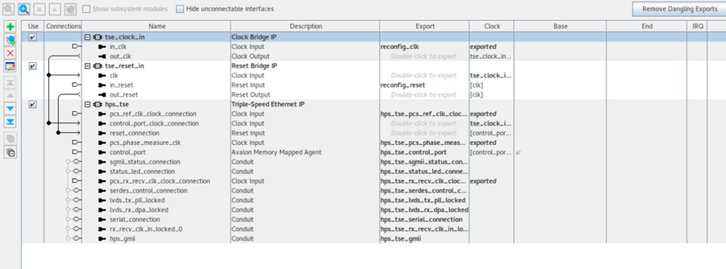
<br />
Open Platform Designer and search for "Triple-Speed Ethernet IP"
<br />
  1. Core Configuration tab
<br />
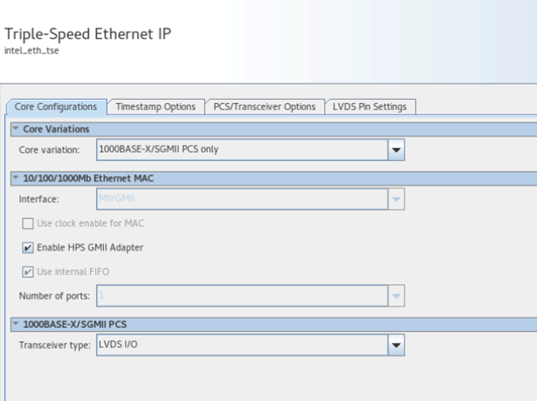
<br />
  2. Timestamp Option
<br />
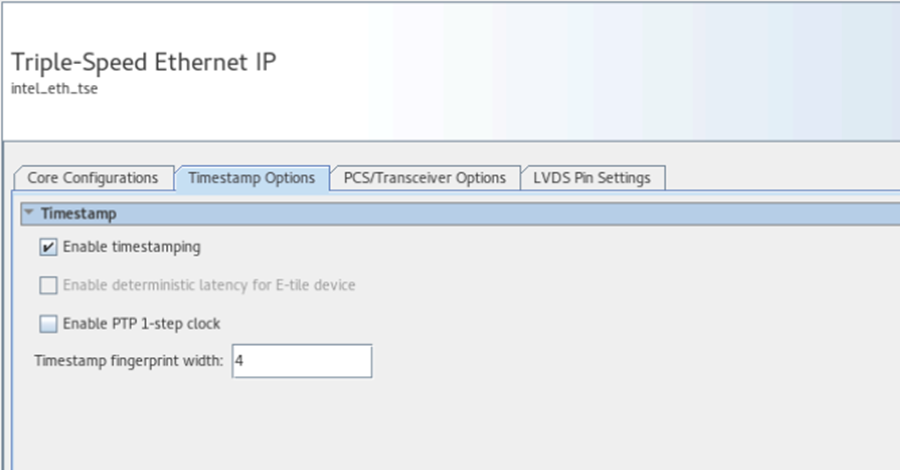
<br />
  3. TSE PCS And Transceiver Option
<br />
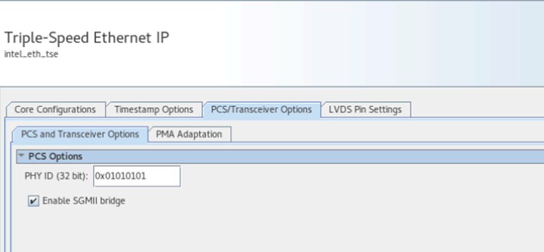
<br />
  4. LVDS Pin Settings
<br />
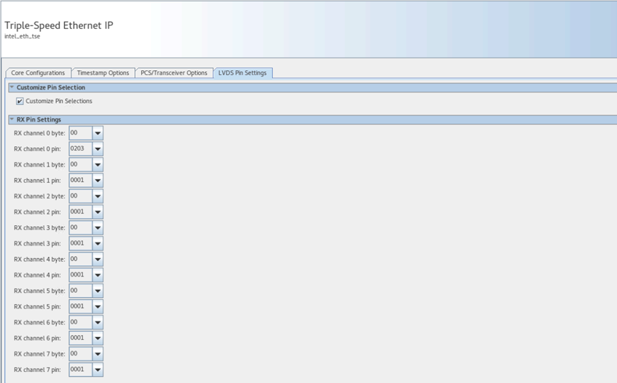
<br />
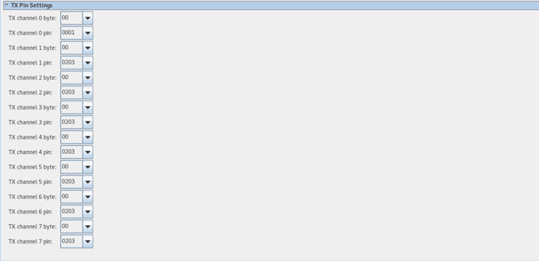
<br />
  5. Clock Bridge IP: clock (100Mhz)
<br />
  6. Reset Bridge IP: reset (Input synchronous edge = deassert)

## GMII Interface Integration

The HPS Ethernet Media Access Controller (EMAC) is integrated with the Triple-Speed Ethernet (TSE) core to facilitate efficient Ethernet packet transfers. To support this functionality, the GMII interface is enabled within the HPS configuration. Depending on the specific target architecture and system requirements, either two EMAC instances or all three available EMACs are enabled to ensure optimal network connectivity and performance.

GMII Interface Signals — HPS EMAC ↔ TSE

| Signal Name | Width | From | To | Description |
|------------|-------|------|----|-------------|
| **hps_tse_gmii_phy_txd** | 8 | HPS EMAC | TSE | Ethernet transmit data |
| **hps_tse_gmii_phy_txen** | 1 | HPS EMAC | TSE | Ethernet transmit enable |
| **hps_tse_gmii_phy_txer** | 1 | HPS EMAC | TSE | Ethernet transmit error |
| **hps_tse_gmii_phy_rxd** | 8 | TSE | HPS EMAC | Ethernet receive data |
| **hps_tse_gmii_phy_rxen** | 1 | TSE | HPS EMAC | Ethernet receive enable |
| **hps_tse_gmii_phy_rxer** | 1 | TSE | HPS EMAC | Ethernet receive error |
| **hps_tse_gmii_rx_clk_in** | 1 | TSE | HPS EMAC | GMII RX clock, 125 MHz for 1 Gbps |
| **hps_tse_gmii_tx_clk_in** | 1 | TSE | HPS EMAC | GMII TX clock, 125 MHz for 1 Gbps |
| **hps_tse_gmii_phy_tx_clk_o** | 1 | TSE | HPS EMAC | GMII TX output clock |
| **hps_tse_gmii_tx_reset_reset_n** | 1 | HPS EMAC | TSE | Reset for GMII 8‑bit adapter on TX path |
| **hps_tse_gmii_rx_reset_reset_n** | 1 | HPS EMAC | TSE | Reset for GMII 8‑bit adapter on RX path |
| **hps_tse_gmii_phy_mac_speed** | 3 → 2 | HPS EMAC | TSE | MAC speed indication (3‑bit from HPS, converted to 2‑bit for TSE) |
| **hps_tse_gmii_phy_col** | 1 | TSE | HPS EMAC | Ethernet collision detect |
| **hps_tse_gmii_phy_crs** | 1 | TSE | HPS EMAC | Ethernet carrier sense |

---
* Architecture of the PHY Sub-System

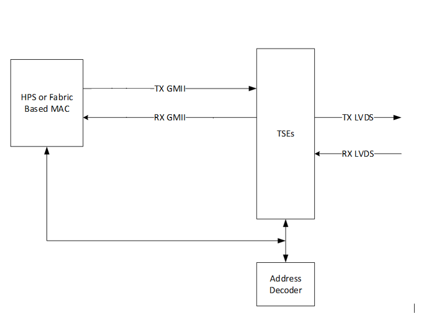

* GMII Protocol Under Normal Circumstances
 
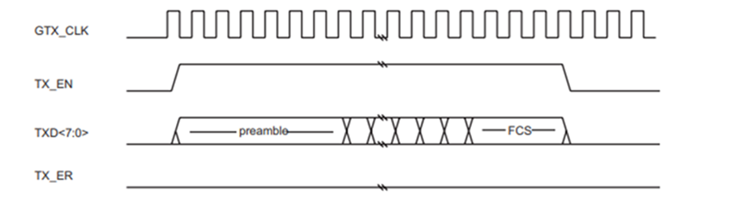

* GMII Protocol Under Error Conditions
 
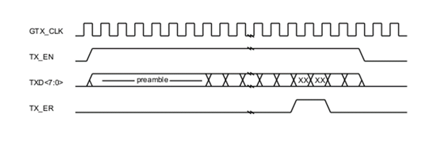

>[Note:]
>GMII clocks operate at 125 MHz for 1 Gbps Ethernet mode. Separate TX and RX reset signals allow independent reset control of the GMII adapters.

## Clock

This section outlines the clocking architecture of the system. The Hard Processor System (HPS) operates in EOSC mode, utilizing a 25 MHz reference clock as its primary timing source. From this base frequency, the programmable fabric clocks are generated through the use of phase-locked loops (PLLs), enabling flexible and reliable clock distribution throughout the design.

The TSE GMII to SGMII via FPGA LVDS I/O pins design uses three primary clocks:
<br />
* External oscillator clock to HPS: EOSC -> 25mhz external OSC clock
<br />
* 100 MHz configuration (CSR) clock: i_reconfig_clk -> 100MHZ CSR clock
<br />
* 125 MHz SYS_PLL clock for TSEs: in_refclk_xcvr -> 125MHZ reference clock to the TSE


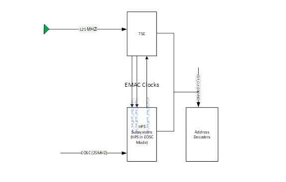

### PTP Phase‑Measurement Clock
The 100MHZ clock is also used to generate the PTP Phase measure clock required for the TSE when it is enabled. This is generated using the IOPLL IP which is a catalog product.
<br /> 
The following figure shows configuration from platform designer used to generate the phase measure clock.

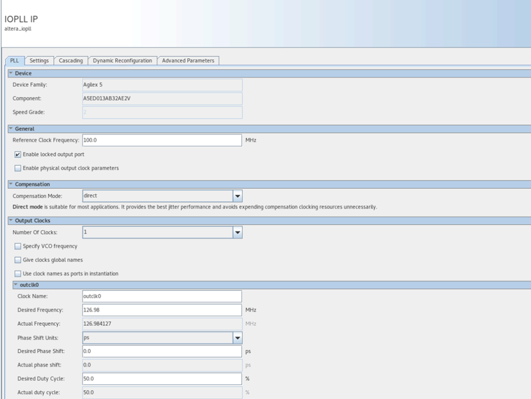


### TSE Receive Clock Mode
The TSE Receive Clock can be clocked by two sources.
<br />
* LVDS Feedback (set_global_assignment -name VERILOG_MACRO "USE_LVDS_FEEDBACK=1")
<br />
* Input reference clock (Input: in_refclk_xcvr)

The on-board 125MHZ clock is used to provide the TSE Phase reference clock as well as the hps_tse_rx_recv_clk_clock in non-LVDS feedback mode. The LVDS Feedback mode is the default mode.
  
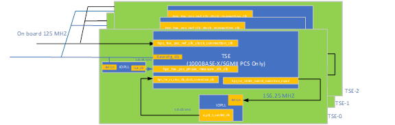

## Reset

Explains reset generation and distribution. All resets are asynchronous at their source and synchronized locally using reset bridges to avoid metastability.

* Overall Top-level Reset Tree

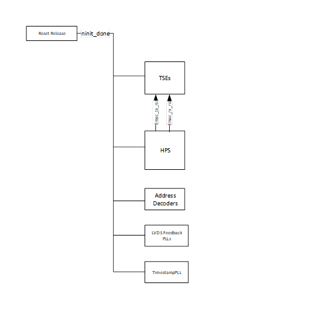

### SW Reset Control of the TSEs
To enable resetting of the TSE independently without affecting the rest of the FPGA fabric, dedicated software-controlled registers are provided. These registers allow selective reset control of the TSE and associated PHY components. The table below outlines the relation between the PHY reset signals and their corresponding software reset controls.

**TSE Reset Port Software Control**

| PHY Reset Port               | Notes |
|------------------------------|-------|
| **Reconfig_reset**             | Resets the TSE reconfiguration block |
| **hps_tse_gmii_rst_tx_n**      | Active-low GMII TX reset for TSE instances 0–2 |
| **hps_tse_gmii_rst_rx_n**      | Active-low GMII RX reset for TSE instances 0–2 |
| **reconfig_reset**             | Software-controlled PHY reset associated with reconfiguration |

## Software Enablement

### Device tree changes for configuring EMAC1 with SFP+

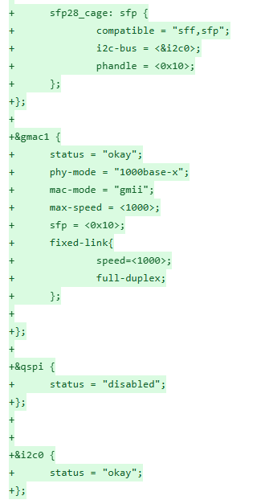

### STMMAC driver changes to access rx/tx latency registers

The Ethernet MAC (EMAC) provides configurable receive (RX) and transmit (TX) latency parameters through sysfs interfaces. These interfaces allow direct tuning of signal timing to ensure proper data alignment and reliable Ethernet communication.
To simplify the process of calculating and programming emac registers the prog_reg.sh script is provided.

Execute the following Linux shell command to create the 0001-dwmac-socfpga-add-delay-property-sysfs.patch file from the encoded data.

* Adds enhancements to the STMMAC driver, allowing RX/TX latency registers to be accessed from user space.

<details>
   <summary>
      <span style="color: #0056b3; font-weight: bold; cursor: pointer;">
      Click for the command to retrieve the encoded data
      </span>
   </summary>
   
```bash
base64 -d <<'EOF' | gunzip > 0001-dwmac-socfpga-add-delay-property-sysfs.patch
H4sIALogJmoCA+1X/0/jNhT/Ofkr3pgOpW3SpkBbBhoCQXdDgtNUerdN22SlsdN6lyY52yntTvzv
e7aTAqXsTuyLpmlFjV2/L/74895zHm8LqQSL5sGNilQpj+A7llGeTV2X8iSBIJhyBVGHCr5gQnYy
pjpMzZjQE6nmPBa5HudR3KG3+AxkHifFNGrHMHmJlcszypaQDOgk+YrRkEa9djse0MO43wv3+mEP
umHYPzhwgyB4GS631Wq9ENvpKQS9Q78PLXx2Qzg9deFLyhKeMbi5Hr8mo+FrEi67+46jnxvC8eX1
kNx8e/nN2HG6fRfcVi0eXp+dk9EP5GJ4dfajdoLmF73DDYXxhkI/dFv4BxjAMlZQwSQG9PH2ZZIX
Ej664PBMgdeUTJFitiLznLKGt80AmtauQLYax4aA7l6oGejuHfiHmgLcKFI8hkXO6cZuCV8SPcqC
MeoZhab25EOZST7NGAUNxIjv1xDenQt3mqDKtZT8N0YUYJyIWpI0UiyLV0SqXLAaNmULHjPEy9D9
ozUSKSX4pFQo1VPfbTn1J84zqSCeRQKakzJBS7tTyrKG2/qImpUrzA5Sb4FznMLXoHJSrXv4RX7W
6jaBDG32yKhtzcyaZ+fGouwfwCJKUSE81gF1eAJazhMiyizDWqy1G6ABodz7wnuPG6m8TFPPwA59
2EUnjVrHuRVcsQ8ervmgdwxOeB5RKqD1NJkMDMcRTJUiA69iu4EcGMEdPvS3kgfDyzfvzq5QdKfh
fiJEs/x2W4QehOCPY3Ufm39hPAzVVhfvUPrB+zymKyIlamcqsQHceZWm5c/Zjq/3NmrPUV4RfjF8
d3k+JGfj8YiMvvce8944fiY04v/q+SuqZ/Q3Vo/4L1TP58XiU6Uz+sdKRzxTOvb8D2itX3AVJVoi
f/oFT6EPtKsZ0UvkcTm268J5rCCeKrx5e3WF491DELbKNqGQqcjLArbgqSQWkvEs8cc24OudbBtx
/xqfYh7IuZoqPl9fEXPOyaSU0MSJb9/bqEF0vHx8ZTsOgA5+06xqQxIrgZX1dLHbcBGb7iX6vX3d
Swz2u363+6CXMN4ftRKFyCdrKAXSluRivs7hQicVgshsJq/l+hxULGikIq+wKQqY1NtSuJLazNF8
rWQiSYzJWXPt7Wql4AQf7ff55Fe8NJ5l36ShTn90ViW73ooJ4dmm8sTctDtJxFPsglSOVTDlUjEB
atkRSyzoNFohDxZHG9AyF0fwippE116rRMcDdZownrGaMLCdLZ6OUak9Y/4okaegtI4BivbY+mmZ
GXAdu0B0BE3QrWAbzs2xIULbYgV5YnRifF9UlrMoo6neEfC/gzjKYMKglHiQSeVG61c4dIqLtg13
f+APMNy9EIc/HW1Xk0LoQhDB5vmCHZnYmkDcL3q7RR00ZCzQd5oJrJW+KLBQ3y04HNtG9XfjTeBe
Rg0AAA==
EOF
```
   
</details>

### Reference script to calculate/program emac latency registers.

Execute the following Linux shell command to create the prog_delay.sh file from the encoded data. This example demonstrates how to adjust Emacs latency.

* Program delay script
<details>
   <summary>
      <span style="color: #0056b3; font-weight: bold; cursor: pointer;">
      Click for the command to retrieve the encoded data
      </span>
   </summary>
   
```bash
base64 -d <<'EOF' | gunzip > prog_delay.sh
H4sIALogJmoCA7VXYW/TSBD9HP+KwQkiAaWJe22uBwQpDQkglbueYw5OV2Rt7HVi1V4H76ZNxfHf
b3btOGs7DZXg8gG63tk3b2Zn3tjNR715yHpzwpeGEQbwD7Sa0I0EWPD5BYglZUajQb1lAuY54aEH
fEmjCLiXhisBIgGPRN46IoLCRFpTAatwRaOQUfBpRO4gZDCKBE0JzJIxTC/fjEwD8l8G/IGTBX0O
rT7aomFAPAqMxBReUrHsv6qaTzYkXkXZAWlQ3c/+/rikKVX7EHIZCDB6m6TXVR8YwipNFimJId30
xCZjzTXQTYjZMILQMCbOW9f+5L6eXIz+du3Jm6HZ43e850WE8x6G3mtZPfTophtXZoR5d6Y64zzg
jNDOGM1xwoJwASfIhocLBiuCBCkS58bby5l78dE9H80mw/7muJ/9DGc2cccz2/1jOp1NHNyx+n1o
Aj4GfAwpXYQJS4KA4w3N77a4bbydlAaYKoYJ8ZTXwmkoMHMKqKPg+ztwiY3/QldlNghTLuRFl72p
Q9bu0Bkeeqb+w6TLc6uU3oTJmivD4wr1/ZbK9HI82+X03e7c4ESysn57elI3m2pmZ8pspJnZ+9DG
yux8n5mG9qtKhTVGM2PmjJwPM3nNu/3p+fbxX6MLXI+naIgJcm9INDQxiSZe0w1JQzKPVDlykWDl
ppT4Ko8cbx33ozU15DMXn0G7A1+NRglkt2y1fXoT0/gYWhb8C4uUrsC0JRwRJj4gt9fw5OsqxUaA
1u/Tb086xjcjw+aCiDWXLjIPTQkhcfPCMRpb6G3lTc/gVhq9gh5u9dg6iiSTnGdhNZYumoBlfUNT
AQRLzAtjEsl4Q8HhT2twZA1Uby4wXKScUk4Z0pF1JBL3izVwrYFiBRAlqDrA1vGwZRnbtuf4jA77
L6Ddwh14CoPT018GHeiBJaOee1UKFZ9z4l1LOgQvgDCfpH5BskInSJP4wYROXoDi08v4ZFRQYSUb
vi7hNDKY7A7bGAem9ZVqwA48w+UxLuUKOtDpGI1MrdEauguh0E/gs9HINVvdbwDmDH0nAZB0sY4x
Ag6POUqaR6lPfYjJBqxBd44KpypMWkqg06MjU0FL8c/0r0EjTrezQNJDds8AOUkqUhwxnizu8ZJ6
1yFbQFZNuyLG5MZEeMtcZ1Dd3r0+Qk/V2oNWrY/kaEKfZisvchMeDXG1aywTeWznVRF6gfIcs/i4
f7aRo4AlAuiXdVZ7+eNupvIsuYUrhpHnXkBzYDR2g+CAA/14kRAV7hqbGnWk21chV/rIGvSxj7CP
DVmjs/dbCeYrLMEAx+7l+1E+mWBOKduNXV/qLg9juVCa+8lF20ymsIyK1oFj6+js1OoY9v0GHelc
KQWKXT6+VV3wnfSoq9dmkCyC8uzZPulX1nt1VpZPfXNYpPBn+50e8jv96X6dQ/E6/1+8zqF4nT3x
asqIbZFLY5Ck2LC1PGXqVL81ePmyUKt6bvcxKCM5B5GcEpLkW7x5ikRgs6p6Lb1vKfjqeQmptYAE
09/rSmfs3Rm7cqYQgSuGPV+smj/w03FUF8rXqaIT+XN9vxpVIUDdLio840qHaqG32trsQv2sGpid
mgP7IQ7s7zmw6w6u2Mj35Yudt5VHX1O5crBa7vfz0C+nxkHb1Pzb3wO1D4Ha+0GvmKNqEb+FKt9B
XPbVnG4/NmLql0LUy3YvG92gxkbf1NjodX0vqH0IVLs3LcbLPAY55LPeSzdAfAbF55McSpP3o3Ex
/KW/fByWgfHNsVX9rtINnaqh/jFVbhf1Bncokdl0bntE1KE6tfjvsdNLqOTVfqBX+4Fe7Xu8/qjE
/AfqOoQ/8w8AAA==
EOF
```
   
</details>


---
