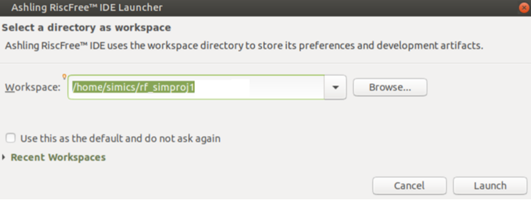
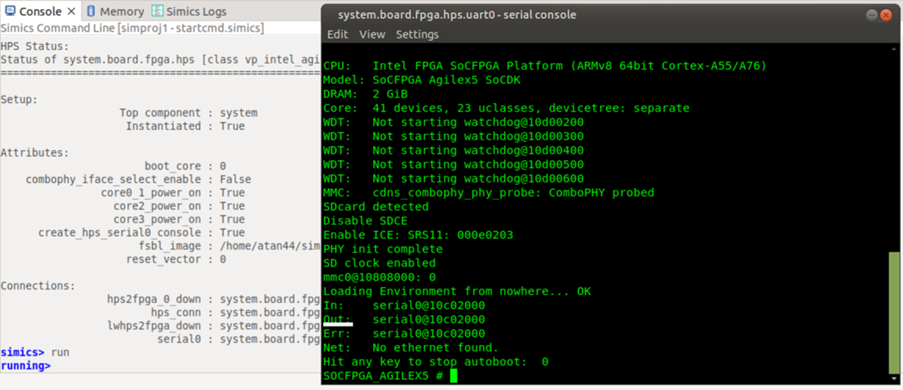
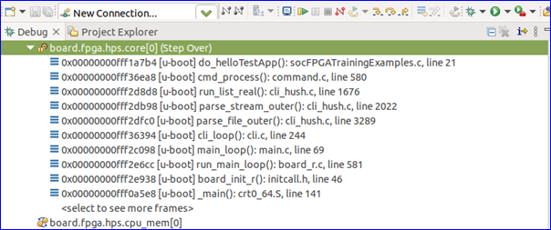
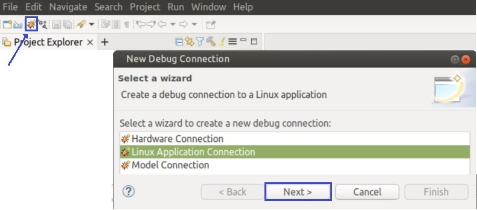

## Overview

Agilex™ 5 E-Series and D-Series devices provide the next-generation hard processor system (HPS) after those provided with the Agilex™ 7 and  Stratix® 10 SoC FPGA devices. Agilex™ 5 E-Series devices support new features, such as TSN, USB 3.1 Gen 1, and I3C, SPI.


The Agilex™ 5 HPS application processors can run Linux or an RTOS, such as Zephyr*, with a scalable performance using one to four Arm* Cortex*-A cores with variable frequencies that allow for a wide range of applications.

The Agilex™ 5 Simics virtual platform models the HPS processor with two Arm Cortex-A55 cores, two Arm Cortex-A76 cores, and HPS peripherals. The Agilex™ 5 E-Series HPS virtual platform is released as part of the Simics® Simulator for Intel® FPGAs software, which also includes a virtual platforms where the Agilex™ 5 device is instantiated, emulating the concept of having different versions of a development kit or daughter cards.


The Agilex™ 5 E-Series device has the following supported virtual platforms:

- Agilex™ 5  Universal Virtual Platform - Used to simulate E-Series and D-Series devices.


The following sections describe the prerequisites for the Intel Simics Simulator for Intel® FPGA and the available virtual platforms, including prebuilt binaries, and instructions for building these binaries. It also covers some common use cases that you can exercise on the virtual platforms.


### Prerequisites


To exercise the instructions presented on this page (build your binaries and exercise the use cases), your system must satisfy the following prerequisites:

- Host PC with Linux OS. (**Note:** Instructions on this page use Ubuntu 22.04 LTS.)
- The following packages are needed to deploy the Simics project:
  - GCC 6.3 compiler or higher
  - g++ 9.4 or higher
  - GNU make 4.1 or higher
- Local Ethernet network with DHCP server (provides IP address to the board).
- Intel Simics Simulator for Intel FPGAs installed.
- Intel Agilex™ 5 Virtual Platform components available to be deployed.


**Notes:**

- For binaries building instructions, see [Build Instructions](#build-instructions).
- For installation instructions for the Intel Simics Simulator for Intel FPGAs and the Agilex™ 5 E-Series virtual platforms, refer to the following documents:
  - [Intel® Simics® Simulator Landing Page](https://www.intel.com/content/www/us/en/products/details/fpga/development-tools/simics-virtual-platform.html) 
  - [Intel® Simics® Simulator for Intel® FPGAs User Guide](https://www.intel.com/content/www/us/en/docs/programmable/784383/)
  - [Agilex™ 5 E-Series Virtual Platform User Guide](https://www.intel.com/content/www/us/en/docs/programmable/786901/)
- U-Boot, Linux compilation, Yocto compilation, and the creation of an SD card image require a Linux host PC.
  To create these binaries, the toolchain and other software required need to be downloaded. This is described as part of the instructions in each section.
- The Intel Simics Simulator for Intel® FPGAs is available only for Linux systems.
- In case any use case requires additional prerequisites, these are listed as part of the use case description.


## Release Content


**Version: 24.3**

| SW Component             | Repository                                                   | Branch/TAG/Version                                           |
| :----------------------- | :----------------------------------------------------------- | :----------------------------------------------------------- |
| U-Boot                   | https://github.com/altera-opensource/u-boot-socfpga          | socfpga_v2024.04/QPDS24.3_REL_GSRD_PR |
| ATF                      | https://github.com/altera-opensource/arm-trusted-firmware    | socfpga_v2.11.0/QPDS24.3_REL_GSRD_PR |
| Linux                    | https://github.com/altera-opensource/linux-socfpga           | socfpga-6.6.37-lts/QPDS24.3_REL_GSRD_PR  |
| Reference Design Sources | https://github.com/altera-opensource/meta-intel-fpga-refdes  | scarthgap/QPDS24.3_REL_GSRD_PR |
| GSRD                     | https://github.com/altera-opensource/gsrd-socfpga            | scarthgap |
| Yocto Project            | https://git.yoctoproject.org/poky                            |  scarthgap/latest     |
| Reference Design Recipes | https://git.yoctoproject.org/meta-intel-fpga                 | scarthgap/latest |
| Arm Debugger             | http://fpgasoftware.intel.com/armds                          | ARM DS 2022.2 |
| Ashling RiscFree         | https://www.intel.com/content/www/us/en/software-kit/826843/ Additional Software/Stand-Alone Software tab | 24.3 |

**Note:** For information prior 24.2 release, please refer to [Linux GSRD Intel Simics Virtual Platform for Intel Agilex® 5 E-Series](https://www.rocketboards.org/foswiki/Documentation/Agilex5SoCSimicsVirtualPlatformsReferenceGuide). 

### Prebuilt Binaries

You can find the prebuilt binaries from the GSRD prebuilt at the following URL: [https://releases.rocketboards.org/2024.11/gsrd/agilex5_dk_a5e065bb32aes1_gsrd/](https://releases.rocketboards.org/2024.11/gsrd/agilex5_dk_a5e065bb32aes1_gsrd/). The files in this folder allow you to boot directly from SDCard. It also contains some of the files that are used to generate the final images used to boot from QSPI and from NAND. The following folders contain the remaining files used by the recipes to create the binaries to boot from QSPI and NAND.

- QSPI: [QSPI boot complement files](https://releases.rocketboards.org/2024.11/qspi/agilex5_dk_a5e065bb32aes1_qspi/). Here is the link to obtain the [uboot_script.its](https://github.com/altera-opensource/meta-intel-fpga-refdes/blob/scarthgap/recipes-bsp/u-boot/files/uboot_script.its) file which is also needed.
- NAND: No available since NAND is not supported in silicon yet.


**Note:** The final images used to boot from QSPI and NAND are not provided, but the binaries used to generate these are provided, so you can generate the final images following the instructions in [Build QSPI Boot Image](#build-qspi-boot-image) and [Build NAND Boot Image](#build-nand-boot-image) sections.

**Note:**  Starting from 24.2 release, the binaries targeted for silicon can also be used with Simics simulator.


| HPS Peripheral                         | Supported |
| :------------------------------------- | :-------- |
| eMMC/SDCard & Combo Phy Controllers    | Yes       |
| DMA Controller                         | Yes       |
| XGMAC Ethernet Controller              | Yes       |
| USB 3.1 Gen1 Controller                | Yes       |
| USB 2.0 Controller                     | Yes       |
| GPIO Controller                        | Yes       |
| I2C Controller Initiator/Target        | Yes       |
| SPI Controller Initiator/Target        | Yes       |
| I3C Controller Initiator               | Yes       |
| I3C Controller Target                  | Yes       |
| NAND Controller & Combo PHY Controller | Yes       |
| APB Timer                              | Yes       |
| QSPI Controller                        | Yes       |
| GICv3 Interrupt controller             | Yes       |
| EDAC RAS Driver                        | Yes       |
| Clock manager                          | Yes       |
| Reset manager                          | Yes       |
| UART                                   | Yes       |
| WatchDog timer                         | Yes       |
| System manager                         | Yes       |
| SVC SOC FPGA manager                   | Yes       |
| SVC FPGA firmware                      | Yes       |
| SMMU                                   | Yes       |
| SVC FCS Crypto                         | Yes       |
| SVC HWMON                              | Yes       |
| SVC RSU                                | Yes       |
| CVP                                    | Yes       |
| PMU                                    | Yes       |


### Build Instructions

The following diagram illustrates the full-build flow for the binaries used with the Intel Simics simulator. The build flow utilizes the source code placed in [GitHub](https://github.com/altera-opensource) in repositories and uses a flow based on Yocto.


#### Set Up the Environment


```bash
sudo rm -rf agilex5_gsrd
mkdir agilex5_gsrd
cd agilex5_gsrd
export TOP_FOLDER=$(pwd)
```


Download the compiler toolchain, add it to the PATH variable, to be used by the GHRD makefile to build the HPS Debug FSBL:


```bash
cd $TOP_FOLDER
wget https://developer.arm.com/-/media/Files/downloads/gnu/11.2-2022.02/binrel/\
gcc-arm-11.2-2022.02-x86_64-aarch64-none-linux-gnu.tar.xz
tar xf gcc-arm-11.2-2022.02-x86_64-aarch64-none-linux-gnu.tar.xz
rm -f gcc-arm-11.2-2022.02-x86_64-aarch64-none-linux-gnu.tar.xz
export PATH=`pwd`/gcc-arm-11.2-2022.02-x86_64-aarch64-none-linux-gnu/bin:$PATH
export ARCH=arm64
export CROSS_COMPILE=aarch64-none-linux-gnu-
```

Enable Quartus tools to be called from command line:


```bash
export QUARTUS_ROOTDIR=~/intelFPGA_pro/24.3/quartus/
export PATH=$QUARTUS_ROOTDIR/bin:$QUARTUS_ROOTDIR/linux64:$QUARTUS_ROOTDIR/../qsys/bin:$PATH
```


#### Get SOF from Hardware Design

In Simics, the SOF file generated as result of the build of the hardware design is not used at all in the simulation, but this is needed to create the RPD file to exercise the QSPI boot. This is the reason why we provide the steps to build the hardware desgin here.


```bash
cd $TOP_FOLDER
rm ghrd_a5ed065bb32ae6sr0_hps.sof
wget https://releases.rocketboards.org/2024.11/gsrd/agilex5_dk_a5e065bb32aes1_gsrd/ghrd_a5ed065bb32ae6sr0_hps.sof 
```


The following file is created:

* $TOP_FOLDER/agilex5_soc_devkit_ghrd/output_files/ghrd_a5ed065bb32ae6sr0_hps.sof


#### Set Up the Yocto Build System


1\. Make sure you have Yocto system requirements met: https://docs.yoctoproject.org/5.0.1/ref-manual/system-requirements.html#supported-linux-distributions.

The command to install the required packages on Ubuntu 22.04 is:

```bash
sudo apt-get update
sudo apt-get upgrade
sudo apt-get install openssh-server mc libgmp3-dev libmpc-dev gawk wget git diffstat unzip texinfo gcc \
build-essential chrpath socat cpio python3 python3-pip python3-pexpect xz-utils debianutils iputils-ping \
python3-git python3-jinja2 libegl1-mesa libsdl1.2-dev pylint3 xterm python3-subunit mesa-common-dev zstd \
liblz4-tool git fakeroot build-essential ncurses-dev xz-utils libssl-dev bc flex libelf-dev bison xinetd \
tftpd tftp nfs-kernel-server libncurses5 libc6-i386 libstdc++6:i386 libgcc++1:i386 lib32z1 \
device-tree-compiler curl mtd-utils u-boot-tools net-tools swig -y
```

On Ubuntu 22.04 you will also need to point the /bin/sh to /bin/bash, as the default is a link to /bin/dash:

```bash
 sudo ln -sf /bin/bash /bin/sh
```

**Note**: You can also use a Docker container to build the Yocto recipes, refer to https://rocketboards.org/foswiki/Documentation/DockerYoctoBuild for details. When using a Docker container, it does not matter what Linux distribution or packages you have installed on your host, as all dependencies are provided by the Docker container.

2. Clone the Yocto script and prepare the build:
    
  ```bash
  cd $TOP_FOLDER
  rm -rf gsrd-socfpga
  git clone -b scarthgap https://github.com/altera-opensource/gsrd-socfpga
  cd gsrd-socfpga
  . agilex5_dk_a5e065bb32aes1-gsrd-build.sh
  build_setup
  ```
  

  **Note**: Run the following commands to set up the yocto build environments again, if you closed the current window (for example, when rebooting the Linux host) and want to resume the next steps:

  ```bash
  cd $TOP_FOLDER/gsrd-socfpga
  . ./poky/oe-init-build-env agilex5_devkit-gsrd-rootfs/
  ```


#### Customize the Yocto Build

1. (Optional) Change the following files in **gsrd-socfpga/meta-intel-fpga-refdes/recipes-bsp/u-boot/files/**:
   * distroboot script:[uboot.txt](https://github.com/altera-opensource/meta-intel-fpga-refdes/blob/master/recipes-bsp/u-boot/files/uboot.txt)
   * **its** file for creating FIT image fromthe above script: [uboot_script.its](https://github.com/altera-opensource/meta-intel-fpga-refdes/blob/master/recipes-bsp/u-boot/files/uboot_script.its) 

2. (Optional) Change the following file in **gsrd-socfpga/meta-intel-fpga-refdes/recipes-kernel/linux/linux-socfpga-lts**:
   * **its** file for creating the **kernel.itb** image: [fit_kernel_agilex5.its](https://github.com/altera-opensource/meta-intel-fpga-refdes/blob/master/recipes-kernel/linux/linux-socfpga-lts/fit_kernel_agilex5.its) , which by default contains the following:<br>
    * Kernel <br>
    * Distroboot boot script<br>
    * Device tree configurations<br>
    * Board configurations 
   
#### Build Yocto


Build Yocto:


```bash
bitbake_image
```


Gather files:

```bash 
package 
```


After the build is completed successfully, the following two folders are created:

- `agilex5_devkit-gsrd-rootfs`: area used by OpenEmbedded build system for builds. For the description of the build directory structure, refer to https://docs.yoctoproject.org/ref-manual/structure.html#the-build-directory-build.
- `agilex5_devkit-gsrd-images`: the build script copies here are relevant files built by Yocto from the `agilex5_devkit-gsrd-rootfs/tmp/deploy/images/agilex5` folder. It also includes other relevant files.


**Note**: If you want to build binaries creating each one of the binaries independently, you could refer to [Agilex™ 5 E-Series GHRD Linux Boot Examples](https://altera-fpga.github.io/rel-24.3/embedded-designs/agilex-5/e-series/premium/boot-examples/ug-linux-boot-agx5e-premium/).


The most relevant files created in the `$TOP_FOLDER/gsrd-socfpga/agilex5_devkit-gsrd-images` folder are:


|                          File                           |                        Description                        | SD Card Boot | QSPI Boot | NAND Boot |
| :-----------------------------------------------------: | :-------------------------------------------------------: | ------------ | --------- | --------- |
| ghrd_a5ed065bb32ae6sr0_hps.sof | SOF file from the hardware design |  | * | | 
| u-boot-spl-dtb.bin |                  U-Boot SPL binary file                   | * | * | * |
|                       u-boot.itb                        |                       U-Boot (SSBL)                       | * | * | * |
|                      boot.scr.uimg                      |                  Distroboot boot script                   | * |  | * |
|                       kernel.itb                        |                  Linux kernel fit image                   | *            | *         | *         |
|     console-image-minimal-agilex5_nand.ubifs     |                 File system for NAND boot                 |              |           | *         |
|     console-image-minimal-agilex5_nor.ubifs      |                 File system for QSPI boot                 |              | *         |           |
|          gsrd-console-image-agilex5.wic          |                       SD Card Image                       | *            |           |           |
|                        uboot.txt                        |                 U-Boot Distroboot script                  |              | *         |           |
|                    uboot_script.its                     | ITS file to create FIT binary of U-Boot Distroboot script |              | *         |           |

#### Build QSPI Boot Image


The next step consists of creating the QSPI image with UBIFS format that will be used by in the simulation that exercises this use case. To build this image the same binaries generated from the GSRD build are used.


The layout of the QSPI image is shown in the following table:


| MTD Partition     | UBI Volume | Volume Name | Type         | Image/Individual File               | Group File | Start Addr | Size |
| :---------------- | :--------- | :---------- | :----------- | :----------------------------------- | :--------- | :-------- | ----------- |
| 0 (qspi_bootinfo) | N/A        | N/A         | RAW          | Bootinfo (Empty)                     | N/A | 0x0    | 2MB |
| 1 (qspi_uboot)    | N/A<br>N/A    | N/A<br>N/A     | RAW<br>RAW      | bitstream (FPGA image, SDM firmware)<br>u-boot.itb | N/A | 0x00200000<br>0x04000000 |~1 MB<br>AUTO|
| 2 (qspi_root)     | 0<br>1<br>2<br>3<br>4 | env<br>script<br>kernel<br>dtb<br>rootfs | UBI<br>UBI<br>UBI<br>UBI<br>UBIFS | u-boot.env<br>u-boot.scr<br>kernel.itb<br>kernel.dtb<br>rootfs.ubifs | <br><br>root.ubi | 0x4200000<br>Auto<br>Auto<br>Auto<br>Auto | 256KB<br>128KB<br>24MB<br>256KB<br>160MB |


1. Gather the required files.
    
  ```bash
  # Gattering files
  cd $TOP_FOLDER
  rm -rf qspi-bin && mkdir qspi-bin && cd qspi-bin 
  mv $TOP_FOLDER/ghrd_a5ed065bb32ae6sr0_hps.sof agilex5_factory.sof
  ln -s $TOP_FOLDER/gsrd-socfpga/agilex5_dk_a5e065bb32aes1-gsrd-images/u-boot-agilex5-socdk-gsrd-atf/u-boot.itb u-boot-itb.bin
  ln -s $TOP_FOLDER/gsrd-socfpga/agilex5_dk_a5e065bb32aes1-gsrd-images/u-boot-agilex5-socdk-gsrd-atf/u-boot-spl-dtb.hex u-boot-spl.hex
  ln -s $TOP_FOLDER/gsrd-socfpga/agilex5_dk_a5e065bb32aes1-gsrd-images/kernel.itb kernel-image
  ln -s $TOP_FOLDER/gsrd-socfpga/agilex5_dk_a5e065bb32aes1-gsrd-images/console-image-minimal-agilex5_nor.ubifs  rootfs.ubifs
  ln -s $TOP_FOLDER/gsrd-socfpga/agilex5_dk_a5e065bb32aes1-gsrd-images/u-boot-agilex5-socdk-gsrd-atf/boot.scr.uimg boot.scr.uimg
  ```
  

2. Create the PFG file that describes the format of the QSPI image: 

  

  ```bash

  cd $TOP_FOLDER/qspi-bin
  cat << EOF > agilex5_flash_image.pfg
  <pfg version="1">
      <settings custom_db_dir="./" mode="ASX4"/>
      <output_files>
          <output_file name="flash_image" directory="." type="JIC">
              <file_options/>
              <secondary_file type="MAP" name="flash_image_jic">
                  <file_options/>
              </secondary_file>
              <secondary_file type="SEC_RPD" name="flash_image_jic">
                  <file_options bitswap="1"/>
              </secondary_file>
              <flash_device_id>Flash_Device_1</flash_device_id>
          </output_file>
      </output_files>
      <bitstreams>
          <bitstream id="Bitstream_1">
              <path hps_path="./u-boot-spl.hex">./agilex5_factory.sof</path>
          </bitstream>
      </bitstreams>
      <raw_files>
          <raw_file bitswap="1" type="RBF" id="Raw_File_1">u-boot-itb.bin</raw_file>
          <raw_file bitswap="1" type="RBF" id="Raw_File_2">hps.bin</raw_file>
      </raw_files>
      <flash_devices>
          <flash_device type="MT25QU02G" id="Flash_Device_1">
              <partition reserved="1" fixed_s_addr="1" s_addr="0x00000000" e_addr="0x001FFFFF" fixed_e_addr="1" id="BOOT_INFO" size="0"/>
              <partition reserved="0" fixed_s_addr="0" s_addr="0x00200000" e_addr="0x0030FFFF" fixed_e_addr="0" id="P1" size="0"/>
              <partition reserved="0" fixed_s_addr="0" s_addr="0x04000000" e_addr="auto" fixed_e_addr="0" id="U-Boot" size="0"/>
              <partition reserved="0" fixed_e_addr="1" e_addr="0xFFFFFFF" id="HPS" s_addr="0x4200000"/>
          </flash_device>
          <flash_loader>A5ED065BB32AE6SR0</flash_loader>
      </flash_devices>
      <assignments>
          <assignment page="0" partition_id="P1">
              <bitstream_id>Bitstream_1</bitstream_id>
          </assignment>
          <assignment page="0" partition_id="U-Boot">
              <raw_file_id>Raw_File_1</raw_file_id>
          </assignment>
          <assignment page="0" partition_id="HPS">
              <raw_file_id>Raw_File_2</raw_file_id>
          </assignment>
      </assignments>
  </pfg>
  EOF
  
  ```
  

3. Create UBI configuration file for the rootfs partition:

  
  ```bash
  # Creating UBI Configuration file
  cd $TOP_FOLDER/qspi-bin
  cat << EOT >ubinize_nor.cfg 
  [env]
  mode=ubi
  vol_id=0
  vol_name=env
  vol_size=256KiB
  vol_type=dynamic

  [script]
  mode=ubi
  image=boot.scr.uimg
  vol_id=1
  vol_name=script
  vol_size=128KiB
  vol_type=dynamic

  [kernel]
  mode=ubi
  image=kernel-image     
  vol_id=2
  vol_name=kernel
  vol_size=24MiB
  vol_type=dynamic

  [dtb]
  mode=ubi
  vol_id=3
  vol_name=dtb
  vol_size=256KiB
  vol_type=dynamic

  [rootfs]
  mode=ubi
  image=rootfs.ubifs
  vol_id=4
  vol_name=rootfs
  vol_type=dynamic
  vol_size=160MiB
  vol_flag=autoresize
  EOT
  ```
  

  The following file is created:

  * $TOP_FOLDER/qspi-bin/ubinize_nor.cfg

4. Generate the *root.ubi* file for root partition. For this, the *ubinize_nor.cfg* is used with the files obtained from the previous steps. This file defines the components to be included in the root.ubi file as indicated in the table above. The ubinize executable is available as part of the *mtd-tools* package. 
    The parameters for ubinize command are:

  -p: physical erase block size of the flash<br>
  -m: minimum input/output unit size of the flash<br>
  -s: sub-pages and sub-page size 

  Once the *root.ubi* files is created this is renamed as *hps.bin*. <br>
  *Required files for this step:* ubinize_nor.cfg,  boot.scr.uimg,  kernel-image,  rootfs.ubifs


  

  ```bash
  # Generate hps.bin file with UBI format
  ubinize -o root.ubi -p 65536 -m 1 -s 1 ubinize_nor.cfg
  mv root.ubi hps.bin
  ```
  

  The following file is created:

   * $TOP_FOLDER/qspi-bin/hps.bin

5. Using Quartus Programming File Generator to compile an RPD file by using the configuration specified in the PFG file.

  *Required files for this step:* u-boot-spl.hex,  agilex5_factory.sof, u-boot-itb.bin and hps.bin  <br>
  *Note:* Make sure the filenames are specified correctly in agilex5_flash_image.pfg

  Run the Quartus File Generator command below to generate an RPD file:
  

  ```bash
  # Creating QSPI image
  quartus_pfg -c agilex5_flash_image.pfg
  ```
  


The following file is created:

* $TOP_FOLDER/qspi-bin/flash_image_jic.rpd

#### Build NAND Boot Image


The next step consists of creating the NAND image that will be used by in the simulation that exercises this use case. For this, the NAND image will have the layout shown in the following figure:

| MTD Partition | UBI Volume | Volume Name | Type  | Image/Individual File | Group File | Flash Offset       | Size  | Size in Hex |
| :------------ | :--------- | :---------- | :---- | :----------- | :--------- | :----------------- | :---- | ----------- |
| 0 (u-boot)    | N/A        | N/A         | RAW   | u-boot.itb   | N/A | 0x00000000         | 2 MB  | 0x200000    |
| 1 (root)      | 0<br>1<br>2<br>3<br>4 | env<br>script<br>kernel<br>dtb<br>rootfs| UBI<br>UBI<br>UBI<br>UBI<br>UBIFS   | u-boot.env<br>u-boot.scr<br>kernel.itb<br>kernel.dtb<br>rootfs.ubifs | <br><br>root.ubi | <br><br>0x00200000<br> onwards | 256KB<br>128KB<br>24MB<br>256KB<br>272MB | 0x40000<br>0x20000<br>0xA00000<br>0x40000<br>0x11000000 |


Based on the table above, we have 2 partitions. One contains just the U-Boot fit image located at address 0x0 and the other contains the rest of the software components in a ubi file (with UBIFS format) located at address 0x200000. Continue with the following steps to create the NAND boot image.


1. Bring the required files from the GSRD build directory to a NAND boot directory:
    

  ```bash
  # Gathering the required files
  cd $TOP_FOLDER
  rm -rf nand-bin && mkdir nand-bin && cd nand-bin
  ln -s $TOP_FOLDER/gsrd-socfpga/meta-intel-fpga-refdes/recipes-bsp/u-boot/files/uboot_script.its uboot_script.its 
  cp $TOP_FOLDER/gsrd-socfpga/meta-intel-fpga-refdes/recipes-bsp/u-boot/files/uboot.txt .
  ln -s $TOP_FOLDER/gsrd-socfpga/agilex5_dk_a5e065bb32aes1-gsrd-images/u-boot-agilex5-socdk-gsrd-atf/u-boot.itb u-boot.itb
  ln -s $TOP_FOLDER/gsrd-socfpga/agilex5_dk_a5e065bb32aes1-gsrd-images/kernel.itb kernel-image
  ln -s $TOP_FOLDER/gsrd-socfpga/agilex5_dk_a5e065bb32aes1-gsrd-images/socfpga_agilex5_socdk_nand_vanilla.dtb kernel-dtb
  ln -s $TOP_FOLDER/gsrd-socfpga/agilex5_dk_a5e065bb32aes1-gsrd-images/console-image-minimal-agilex5_nand.ubifs rootfs.ubifs
  ```
  

2. The Agilex 5 E-Series Universal virtual virtual returns by default a board_id = 0 when U-Boot reads the **STRATIX_JTAG_USER_CODE** parameter. The board_id is used to select the desired configuration (linux kernel image + device tree + fpga fabric design) as described in [Single  Image Boot flow](https://www.rocketboards.org/foswiki/Documentation/SingleImageBoot). Starting from 24.2 release, the configuration for board_id = 0 defines the device tree for the OOB board in the premium dev kit (SD card daughter card). Since we want to load the configuratio that works for NAND boot, we require to use the device tree specific for the NAND daughter card. In order to address this problem, one solution is to force having a board_id that defines the configuration for NAND (and also without defining a FPGA core fabric since in Simics programming the fabric is not supported). For this, we require to set in U-Boot the  **board_id** environment variable to 7 for which the **socfpga_agilex5_socdk_nand_vanilla.dtb** device tree is used (as can be seen in **fit_kernel_agilex5_devkit.its**). This is achieved with the following code:

  

  ```bash
  # Update boot script to modify board_id so we can boot from nand_vanila device tree
  cd $TOP_FOLDER/nand-bin
  sed -i '/Trying to boot Linux from device/a setenv board_id 7 ' uboot.txt
  mkimage -f uboot_script.its boot.scr.uimg
  ```
  

3. Create UBI configuration file for the root partition:

  

  ```bash
  # Create the UBI Configuration file
  cd $TOP_FOLDER/nand-bin
  cat <<EOT >ubinize_nand.cfg 
  [env]
  mode=ubi
  vol_id=0
  vol_name=env
  vol_size=256KiB
  vol_type=dynamic

  [script]
  mode=ubi
  image=boot.scr.uimg
  vol_id=1
  vol_name=script
  vol_size=128KiB
  vol_type=dynamic

  [kernel]
  mode=ubi
  image=kernel-image     
  vol_id=2
  vol_name=kernel
  vol_size=24MiB
  vol_type=dynamic

  [dtb]
  mode=ubi
  image=kernel-dtb
  vol_id=3
  vol_name=dtb
  vol_size=256KiB
  vol_type=dynamic

  [rootfs]
  mode=ubi
  image=rootfs.ubifs
  vol_id=4
  vol_name=rootfs
  vol_type=dynamic
  vol_size=400MiB
  vol_flag=autoresize

  EOT
  ```
  

  **Note:** **kernel-dtb** is not really used since the dtb used is inside the **kernel-image** file.

4. Generate root.ubi file for root partition, using the **ubinize_nand.cfg** file generated in previous step. This file defines the components to be included in the root.ubi file as indicated in the table above. The command used to generate the file is **ubinize** which is available as part of the mtd-tools package. The parameters that **ubinize** command received are listed next:

  -p: physical erase block size of the flash<br>
  -m: minimum input/output unit size of the flash<br>
  -s: sub-pages and sub-page size, ubinize will take into account and put the VID header to same NAND page as the EC header

  

  ```bash
  # Create the UBI file with root partition
  cd $TOP_FOLDER/nand-bin
  ubinize -o root.ubi -p 1024KiB -m 8192 -s 8192 ubinize_nand.cfg
  ```
  

  The following file is created:

  * $TOP_FOLDER/nand-bin/root.ubi

5. Generate final NAND image (nand.img) using **dd** command. This file includes the U-Boot built from the GSRD and the root.ubi file generated in the step before. The location in the NAND image is indicated in the table above.

  

  ```bash
  # Creating the NAND image
  export COMBINEDFILE=nand.img
  dd if=/dev/zero bs=1024M count=1 | tr '\0' $'\xFF' > $COMBINEDFILE
  # Adding u-boot.itb
  dd conv=notrunc bs=1 if='u-boot.itb' of=$COMBINEDFILE seek=$((0x00000000))
  # Adding root.ubi
  dd conv=notrunc bs=1 if='root.ubi' of=$COMBINEDFILE seek=$((0x00200000))
  ```
  


The following file is created:

* $TOP_FOLDER/nand-bin/nand.img 


### Known Issues with the Release

For known issues in this release please refer to the [Intel Simics Simulator for FPGA Release page](https://www.rocketboards.org/foswiki/Documentation/SimicsSimulatorForIntelFPGAReleasePage#Known_Issues).

## Agilex™ 5  Simics Virtual Platform - Universal

Note: The Agilex 5 Simics Virtual Platform - Universal was initially developed to support the Agilex 5 E-Series device, but it also supports the Agilex 5 D-Series device which matches the B0 steping of the E-Series device. In this page we refer to Agilex 5 E-Series,  but it also applies for the Agilex 5 D-Series, unless other thing is indicated.

This virtual platform is associated with the **agilex5e-universal.simics** target script. The following figure shows a high-level block diagram of this virtual platform. In this diagram, you can observe the main components that can be exercised during the execution of the use cases described later on this page. The implementation of this virtual platform allows all the peripherals in the HPS to be enabled at the same time, which is not possible in physical hardware implementations. The pinmux and Combo PHY impose restrictions on the physical hardware. In the case of the pinmux in the physical hardware, you can enable only a subset of peripherals simultaneously because there are not enough pins if all pins are enabled simultaneously. This limitation does not exist in the Agilex™ 5 E-Series Universal Virtual Platform. For the Combo PHY, the physical hardware allows only one flash controller (NAND or SDMMC) to be enabled at a time. However, the virtual platform allows both to be enabled simultaneously.


In this block diagram:

- The architecture of the virtual platform follows a hierarchy that goes from **target script → system → board → fpga → qsys_top → hps_subsystem → agilex_hps,** which is aligned with the Simics virtual platform development philosophy that tries to match with the real golden hardware reference design (GHRD) architecture.
- The **target script** instantiates the **system component**, provides the CLI run time commands, and creates the network configuration. This script also defines the parameters that configure other components.
- The **system component** represents the complete virtual platform system and instantiates the **board component**. This component is implemented in a Python file.
- The **board component** represents the model of a PCB (analogous to a development kit). It includes the instance of the **FPGA component** and all board components connected to the FPGA (for example, flash devices, ethernet PHY). The GPIO loopback connection is implemented here. This component is implemented in a Python file.
- The **FPGA component** represents the top-level hardware design model in the Quartus Prime software project design that targets the Agilex™ 5 E-Series SoC FPGA device. It matches the logical hierarchy of the fictitious GHRD that the Agilex™ 5 E-Series Universal Virtual Platform models. This component only instantiates the qsys_top component and is implemented as a Python script.
- The **qsys_top** component matches the design's top view being modeled and corresponds to the system seen from the Platform Designer under the GHRD (soc_inst instance). The HPS subsystem component and the components included as part of the FPGA fabric design are instantiated under the qsys_top component. The qsys_top component is modeled as a Python script.
- The **FPGA fabric** design corresponds to the logic model implemented in the FPGA fabric.
- The **HPS subsystem** component corresponds to the model of the module that integrates all components associated with the HPS in the Agilex™ 5 E-Series device. It includes the HPS models, SDM mailbox, and EMIF model.
- The **Agilex™ 5 HPS component** in the virtual platform is an Intel Simics model that corresponds to the Hard Processor System Agilex™ 5 FPGA IP in the  Quartus Prime software.
- The embedded software running in the HPS component is expected to be the same that can be run in the real silicon. Exercising the HPS-embedded software in this virtual platform allows you to debug the software using the Simics debug capabilities.

### Main Features Supported by the Intel Agilex™ 5 E-Series Universal Virtual Platform

#### Boot an Operative System

The Agilex™ 5 E-Series Virtual Platform allows exercising the HPS software in all parts of the boot flow for Linux* and Zephyr* operating systems. You can exercise the boot flow from a flash device such as an SD Card, NAND flash, or QSPI flash. Booting from an SD Card is the default boot mode.


#### Basic Ethernet

The basic ethernet functionality is configured from the **agilex5e-universal.simics target** script. The virtual platform simulates a network switch and a router in the simulated environment using the service node component referred to as **service_node_cmp0**. This provides a TFTP server to transfer files from the host PC to the target system and a DHCP server to assign an IP to the target system dynamically.


The service node acts as a simulated environment router configured with the 10.10.0.1 IP address. The DHCP service is configured to assign an IP in the range of 10.10.0.100 and 10.10.0.199. The service node is also configured to provide Network Address Port Translation (NAPT) for outgoing traffic, allowing it to interact with the host PC enabling TFTP, SCP, and SSH services.


The target device provides ethernet functionality using the XGMAC/TSN devices, enabling an **ethX** ethernet link. This link connects with an ethernet switch instantiated in the target script. Only the TSN0 instance is connected to this switch using the Marvell ethernet Phy instantiated at the **board** level.


Basic ethernet support in the virtual platform allows the target software to set a MAC address locally to allow communication over the network. This supports all key transport layers of a protocol, such as TCP, UDP, and ICMP. Basic ethernet allows communication over IPv4 and IP6 protocols while supporting different hardware offloading features. The virtual platform supports L2, L3, and L4 filtering and can show network statistics.


#### CPU Power-On and Boot Core Selection

The virtual platform supports setting the CPU power-on settings and the CPU boot core selection. This configuration is defined at the target script level (**agilex5e-universal.simics**) for this virtual platform. Based on the configuration, the virtual platform exposes only the appropriate number of cores available to the target software. When multiple CPUs are enabled, the virtual platform is configured to support symmetric multiprocessing (SMP).


#### Reset Flow

The virtual platform is designed to support all key reset flows described in the Agilex™ 5 E-Series Technical Reference Manual. Reset flows initiated by the CPU are simulated through the same mechanism in which the CPU writes to the appropriate addresses (reset manager device). Resets triggered by the external hardware signaling are simulated with Simics' commands.


| Reset Type     | Recipe                                                       | Notes                                                        |
| :------------- | :----------------------------------------------------------- | :----------------------------------------------------------- |
| Power-on reset | Not supported                                                | The power-on reset is not supported as its effect is equivalent to restarting the simulation in a virtual platform simulation. However, if this is required for some exceptional use cases, you can trigger the cold reset instead, as this resets most domains. |
| HPS cold reset | **system.board.hps-cold-reset**                                | Simulates toggling the **HPS_COLD_nRESET** pin using the command registered in the board component. |
| HPS warm reset | **system.board.fpga.soc_inst.hps_subsys.agilex_hps.hps-warm-reset** | Simulates a warm reset of the HPS without triggering any other event. This type of reset is not enabled through external means in hardware. The command is registered in the HPS component. |
| Watchdog reset | Software-based                                               | The watchdog timer peripheral in the HPS can be configured and enabled through software. When the watchdog expires, the HPS resets (only the trigger of warm reset is supported). |


#### GPIO Loopback Connection

The virtual platform supports the feature that allows creating a loopback connection in certain pins in GPIO0 and GPIO1 ports. This is implemented at the **board** component level. The loopback implementation directly connects GPIO **in** and **out** pins of the GPIO ports in both directions to reflect the same state on those pins. In each GPIO port, the pair of pins that are connected are shown in the following table:

| Pin Source | Pin Destination |
| :--------- | :-------------- |
| 0          | 1               |
| 5          | 6               |
| 18         | 19              |
| 20         | 21              |

The Simics command to activate the GPIO loop-back connection is `system.board.create-gpio-loopback`.


**Note:** The loopback connection is activated by default from the target script.


#### USB Disks Hot-Plug Support


The virtual platform instantiates three USB disks that support hot-plugging by using Simics CLI commands to emulate plugging and unplugging the USB disks.


The current connection of the USB disks in this virtual platform is indicated in the following table:


| Disk         | Type            | Slot | USB Controller |
| :----------- | :-------------- | :--- | :------------- |
| usb3_disk    | SuperSpeed (SS) | usb3 | USB 3.1 Gen 1  |
| usb3_hs_disk | High Speed (HS) | usb2 | USB 3.1 Gen 1  |
| usbotg_disk  | High Speed (HS) | otg  | USB 2.0 OTG    |


#### FPGA Fabric Example Design


The FPGA Fabric example design includes one instance of a On-Chip memory design exist in the FGPA fabric model. This is located directly under the qsys_top component. This On-Chip memory instance has a size of 1 MB and is connected to the HPS2FPGA bridge. This On-Chip memory model supports reading and writing to any memory location. You can access the memory designs using direct memory access to the memory locations in which these are mapped under the HPS2FPGA bridge memory space or by accessing the memories example design as a memory space or by accessing the memories example design as a memory space.


The mapping of the memory instance is defined as follows:


| Example Design Name | Bridge   | Size | Start address | End Address  |
| :------------------ | :------- | :--- | :------------ | :----------- |
| example_design      | hps2fpga | 1 MB | 0x0040000000  | 0x00400FFFFF |


The memory instance in the FPGA fabric example design receives a parameter named **base_addr**. The description of this parameter is described as follows:


| Parameter | Description                                                  | Range   | Default Value |
| :-------- | :----------------------------------------------------------- | :------ | :------------ |
| base_addr | An offset value that indicates the mapping of the instance taking as reference the **Start Address** value defined in the previous table. | Integer | 0x00000000    |


The FPGA fabric example design also includes a Peripheral subsystem which is integrated by 3 I/O IP components, each one to access or allow to control a set of LEDs, a Dip switch and a push button. The peripheral subsystem is mapped into the lwhps2pga bridge starting at a base address of 0x20000000. These components includes some internal registers that allow to control the state of the output (for LED component) and also to read state of the input of push button and dip-switch components. The mapping of these components and their registers are shown next:


| Component  | Mapping Address | Range | Register Information                                         |
| :--------- | :-------------- | :---- | :----------------------------------------------------------- |
| button_pio | 0x00010060      | 0x10  | [0x0] - DATA[0:0]: Read state of the button. Read Only. [0x8] - INTERRUPTMASK[0:0]- Enable('1’)/Disable('0’) the interrupt trigger. When dsiable, the interrupt is cleared. Read/Write |
| dipsw_pio  | 0x00010070      | 0x10  | [0x0] - DATA[0:0]: Read state of the button. Read Only. [0x8] - INTERRUPTMASK[0:0]- Enable('1’)/Disable('0’) the interrupt trigger. When dsiable, the interrupt is cleared. Read/Write |
| led_pio    | 0x00010080      | 0x10  | [0x0] - DATA[31:0]: Set and read the state of the LEDs. Read/Write |

The DIP switch and push button component can trigger an interrupt to the HPS on the assertion of the corresponding input signal.

| Component  | Interrupt         | HPS Interrupt Connection |
| :--------- | :---------------- | :----------------------- |
| button_pio | periph_button_irq | f2s_fpga_irq[0] – SIP 49 |
| dipsw_pio  | periph_dipsw_irq  | f2s_fpga_irq[1] – SIP 50 |


#### FPGA-to-HPS Bridges

The FPGA-To-HPS bridges provide a way in which the FPGA fabric IPs can interact with the HPS subsystem and the SDRAM. The bridge implementation includes two new memory spaces in the FPGA logic model that are used to send read and write transactions to the HPS or SDRAM component from the FPGA logic passing through the FPGA-to-HPS bridges.

- FPGA to HPS bridge (FPGA2HPS): Connects the FPGA2HPS memory space with the HPS component.
- FPGA to SDRAM bridge (FPGA2SDRAM): Connects the F2SDRAM memory space with the HPS component.


You can send read and write transactions through each one of the bridges from the Intel Simics CLI.

#### B0 Silicon Features Selection

The Agilex 5 E-Series Universal Virtual Platform allows you to select the stepping
silicon features that the Agilex 5 Simics model supports by stepping the target script
parameter accepting the value of A0 or B0. The B0 stepping corresponds to the HPS model of the Agilex 5 D-Series.

**Note:** Agilex 5 E-Series Universal Virtual Platform stepping features support is released in
the 24.1 Intel Simics Simulator for Intel FPGAs release although the default stepping
during the project deployment remains being A0. You can override the default
stepping using the stepping parameter from the target script. In this case, the B0
features are enabled in the Agilex 5 E-Series model.


### Configurable Parameters in the Intel Agilex™ 5 E-Series Universal Virtual Platform

The parameters that you can configure are shown in the following table:

| Parameter                    | Description                                                  | Range                | Default Value |
| :--------------------------- | :----------------------------------------------------------- | :------------------- | :------------ |
| **sd_image_filename**          | Name of the SD image to load into the SD memory model of the board component. Supported formats are `.img` and `.wic`. | Filename string      | ""            |
| **fsbl_image_filename**        | First-stage boot loader file. The supported format is `.bin`. | Filename string      | ""            |
| **hps_boot_core**              | The CPU to use as the boot core.                             | Integer [0,2]        | 0             |
| **hps_core0_1_power_on**       | The power-on states of CPU 0/1.                              | Boolean              | True          |
| **hps_core2_power_on**         | The power-on states of CPU 2.                                | Boolean              | True          |
| **hps_core3_power_on**         | The power-on states of CPU 3.                                | Boolean              | True          |
| **create_hps_serial0_console** | Choose whether to create or not a console component and connect it to the `serial0` peripheral of the HPS IP. | Boolean              | True          |
| **create_hps_eth0_network**    | Choose whether to create or not a basic ethernet network and connect the `ethX` peripheral of the HPS IP to this. | Boolean              | True          |
| **create_hps_sd_card**         | Create the SD card in the board component and connect it to the SD/eMMC controller. You can set either the create_hps_sd_card or create_hps_mmc parameter to true at a time. | Boolean              | True          |
| **create_hps_mmc**             | Create the eMMC card in the board component and connect it to the SD/eMMC controller. You can set either the create_hps_sd_card or create_hps_mmc parameter to true at a time. | Boolean              | False         |
| **nand_data_image_filename**   | Name of the NAND image to load into the NAND memory model of the board component. The supported format is raw binary (.bin or .craff). | Filename string      | ""            |
| **nand_spare_image_filename**  | Name of the NAND spare image to load into the NAND memory model of the board component. The supported format is raw binary (.bin or .craff). | Filename string      | ""            |
| **qspi_image_filename**        | Name of the QSPI image to load into the QSPI memory model of the board component. The supported format is raw binary (.bin or .craff). | Filename string      | ""            |
| **usb3_image_filename**        | Name of the USB disk image corresponding to the SuperSpeed disk in the board component connected to the USB 3.1 controller. | Filename string      | ""            |
| **usb3_hs_image_filename**     | Name of the USB disk image corresponding to the high-speed disk in the board component connected to the USB 3.1 controller. | Filename string      | ""            |
| **usb_otg_image_filename**     | Name of the USB disk image corresponding to the high-speed disk in the board component connected to the USB 2.0 OTG controller. | Filename string      | ""            |
| **hps_cpu_freq_mhz**           | ARM cores frequency in Megahertz (MHz).                      | Integer [400 - 1500] | 400           |
| **stepping**     | Select the silicon features that the Agilex 5 Simics model supports. | A0 or B0. D-Series corresponds to B0 device.      | A0  | 

### Use Cases Supported by the Agilex™ 5 E-Series Universal Virtual Platform

The following sections explain some supported use cases using the **Agilex™ 5 E-Series Universal** virtual platform. The preconditions required to execute them are listed in the following section:

#### Simulation Setup

Consider that the Intel Simics Simulator for Intel FPGAs Simulator has been installed on a Linux System and the output binaries generated from [Build Instructions](#build-instructions) section are already available.


1. Create a project directory under the Intel Simics Simulator installation directory (Assuming it is **SimicsInstallDir**):

  ```bash
  $ mkdir project-1
  $ cd project-1
  ```

2. Under the new project directory created, deploy the **agilex5e-universal** virtual platform:

  ```bash
  $<Simics installation dir>/simics/bin/simics_intelfpga_cli –-deploy agilex5e-universal
  Simics(R) Simulator for Intel(R) FPGA CLI:
  INFO: Preparing to initialize /home/simicsUser/SimicsInstallDir/project-1 as a
  Simics workspace
  Project created successfully
  # Observe that the directory has been initialized and the simics and simics-gui
  # commands appear in the project directory. Also, the target directory is
  # created. This includes the target script corresponding to the deployed
  # platform.
  ```

3. Build the virtual platform components:

  ```bash
  $ make
  === Environment Check ===
  '/home/simicsUser/SimicsInstallDir/project-1' is up-to-date
  gcc version 9
  === Building module agilex5e-universal-board-comp ===
  :
  === Building module agilex5e-universal-fpga-comp ===
  :
  === Building module agilex5e-universal-system-comp ===
  :
  Copying agilex5_icon_84x84.png
  ```

4. Copy the following binaries created in [Build Instructions](#build-instructions) section to the Simics project directory:

  - gsrd-socfpga/agilex5_dk_a5e065bb32aes1-gsrd-images/gsrd-console-image-agilex5.wic
  - gsrd-socfpga/agilex5_dk_a5e065bb32aes1-gsrd-images/u-boot-agilex5-socdk-gsrd-atf/u-boot-spl-dtb.bin
  - qspi-bin/flash_image_jic.rpd
  - nand-bin/nand.img

5. Customize the configuration of the Agilex™ 5 E-Series Universal virtual platform, according to the setup required to exercise any specific use case. Set up the **fsbl_image_filename** parameter with the first-stage bootloader. If the boot implies booting from an SD Card device, configure **sd_image_filename** and **create_hps_sd_card** parameters (this image should include the main bootloader and the OS and/or application images). As part of the configuration, select the core used to boot using the **hps_boot_core** parameter, which could be core 0 (A55) or core 2 (A76).

  You can configure the virtual platform either by updating the **agilex5e-universal.simics**target script or creating a separate top-level target script (named based on the simulation purpose) that is expected to be run with this (example: **uboot-linux_sdcard.simics** used to boot from U-Boot to Linux from an SD Card device). You become the owner of this new target script, in which, you can set the required parameters and call the original virtual platform target script (**targets/agilex5e-universal/agilex5e-universal.simics** path). An example of the setup required to run a simulation that exercises the boot flow going from U-Boot to Linux, booting from an SD Card is shown in the following:

  ```bash
  #uboot-linux_sdcard.simics
  $sd_image_filename = "gsrd-console-image-agilex5.wic"
  $fsbl_image_filename = "u-boot-spl-dtb.bin"
  $hps_boot_core = 0
  $create_hps_sd_card = TRUE
  run-command-file "targets/agilex5e-universal/agilex5e-universal.simics"
  ```

  **Note:** The **uboot-linux_sdcard.simics** file must be created under the Intel Simics project directory.

  **Tip:** Any specific configuration needed for a use case is indicated under the **Setup** section of that use case.

#### Use Case: Exercise SDCard Boot Flow from FSBL to Linux

This use case consists of booting from an SDCard device going from U-Boot to Linux prompt passing through **U-Boot SPL → ATF → U-Boot → Linux**.

<h5>Setup</h5>

Complete the procedure described in the [Simulation Setup](#simulation-setup) section.

<h5>Procedure</h5>

To exercise this use case, follow the below steps once the Simulation setup is complete:

1. From the project directory, launch the simulation using the **uboot-linux_sdcard.simics** target script. This script launches the simulator and the current terminal becomes the Simics CLI:

  ```bash
  $ ./simics uboot-linux_sdcard.simics 
  ```

2. From the Simics CLI, start running the simulation with the **run** command.

  ```bash
  simics>  run
  ```

3. Wait to get to the Linux prompt in the target serial console. 
4. Login into the Linux prompt using the **root** user without a password.

  ```bash
  # Target Serial console
  U-Boot SPL 2024.04 (Oct 16 2024 - 02:54:45 +0000)
  Reset state: Cold
  MPU           875000 kHz
  L4 Main       400000 kHz
  L4 sys free   100000 kHz
  L4 MP         200000 kHz
  L4 SP         100000 kHz
  SDMMC          50000 kHz
  io96b_cal_status: Calibration for IO96B instance 0x18400400 done at 0 msec!

  init_mem_cal: Initial DDR calibration IO96B_0 succeed
  io96b_mb_init: num_instance 1
  io96b_mb_init: get memory interface IO96B 0
  :
  DDR: size check success
  DDR: firewall init success
  DDR: init success
  QSPI: Reference clock at 400000 kHz
  Trying to boot from MMC1
  ## Checking hash(es) for config board-0 ... OK
  ## Checking hash(es) for Image atf ... crc32+ OK
  ## Checking hash(es) for Image uboot ... crc32+ OK
  ## Checking hash(es) for Image fdt-0 ... crc32+ OK
  WARNING: Data cache not enabled
  NOTICE:  BL31: Boot Core = 0
  NOTICE:  BL31: CPU ID = 0
  NOTICE:  BL31: v2.11.0(release):QPDS24.3_REL_GSRD_PR
  NOTICE:  BL31: Built : 07:09:49, Oct 15 2024

  U-Boot 2024.04 (Oct 16 2024 - 02:54:45 +0000)socfpga_agilex5

  CPU:   Intel FPGA SoCFPGA Platform (ARMv8 64bit Cortex-A55/A76)
  Model: SoCFPGA Agilex5 SoCDK
  DRAM:  2 GiB (effective 8 GiB)
  Core:  51 devices, 26 uclasses, devicetree: separate
  WDT:   Not starting watchdog@10d00200
  WDT:   Not starting watchdog@10d00300
  WDT:   Not starting watchdog@10d00400
  WDT:   Not starting watchdog@10d00500
  WDT:   Not starting watchdog@10d00600
  NAND:  4096 MiB
  MMC:   mmc0@10808000: 0
  Loading Environment from FAT... Unable to read "uboot.env" from mmc0:1...
  Loading Environment from UBI... SF: Detected mt25qu02g with page size   256 Bytes, erase size 64 KiB, total 256 MiB
  :
  Scanning mmc 0:1...
  Found U-Boot script /boot.scr.uimg
  2411 bytes read in 12 ms (195.3 KiB/s)
  ## Executing script at 81000000
  crc32+ Trying to boot Linux from device mmc0
  Found kernel in mmc0
  17685575 bytes read in 33 ms (511.1 MiB/s)
  ## Loading kernel from FIT Image at 82000000 ...
  :
  SF: Detected mt25qu02g with page size 256 Bytes, erase size 64 KiB, total 256 MiB
  Enabling QSPI at Linux DTB...
  Working FDT set to ffad6000
  QSPI clock frequency updated
  RSU: Firmware or flash content not supporting RSU
  RSU: Firmware or flash content not supporting RSU
  RSU: Firmware or flash content not supporting RSU
  RSU: Firmware or flash content not supporting RSU

  Starting kernel ...

  Deasserting all peripheral resets
  [    0.000000] Booting Linux on physical CPU 0x0000000000 [0x412fd050]
  [    0.000000] Linux version 6.6.37-altera-g978b3d90f408 (oe-user@oe-host) (aarch64-poky-linux-gcc (GCC) 13.3.0, GNU ld (GNU Binutils) 2.42.0.20240723) #1 SMP PREEMPT Mon Oct 14 01:56:39 UTC 2024

  [    0.000000] KASLR disabled due to lack of seed
  [    0.000000] Machine model: SoCFPGA Agilex5 SoCDK
  [    0.000000] efi: UEFI not found.
  [    0.000000] Reserved memory: created DMA memory pool at 0x0000000080000000, size 32 MiB
  [    0.000000] OF: reserved mem: initialized node svcbuffer@0, compatible id shared-dma-pool
  [    0.000000] OF: reserved mem: 0x0000000080000000..0x0000000081ffffff (32768 KiB) nomap non-reusable svcbuffer@0
  :
  Poky (Yocto Project Reference Distro) 5.0.5 dhcp0 ttyS0

  dhcp0 login: [   37.881580] kauditd_printk_skb: 15 callbacks suppressed
  [   37.881588] audit: type=1334 audit(1709054800.748:33): prog-id=27 op=UNLOAD
  [   37.882865] audit: type=1334 audit(1709054800.748:34): prog-id=26 op=UNLOAD
  [   37.883602] audit: type=1334 audit(1709054800.748:35): prog-id=25 op=UNLOAD

  dhcp0 login: root

  WARNING: Poky is a reference Yocto Project distribution that should be used for testing and development purposes only. It is recommended that you create your own distribution for production use.

  root@dhcp0:~# 
  ```
  This finishes the main scenario of this use case, but there are some extensions that are described next.

  **Note**: You can speed-up the boot process by skipping the U-Boot autoboot countdown by pressing any key and then typing the **boot** command:


  ```bash
  U-Boot 2024.01 (Jun 25 2024 - 09:28:56 +0000)socfpga_agilex5

  CPU:   Intel FPGA SoCFPGA Platform (ARMv8 64bit Cortex-A55/A76)
  Model: SoCFPGA Agilex5 SoCDK

  :
  Net:   No ethernet found.
  Hit any key to stop autoboot:  0 
  SOCFPGA_AGILEX5 # boot
  switch to partitions #0, OK
  mmc0 is current device
  Scanning mmc 0:1...
  ```

#### Use Case: Exercise Hello Application

This is an extension of the **Use Case: Exercise SDCard Boot Flow from FSBL to Linux** and includes executing the **hello** application from the Linux prompt.

<h5>Setup</h5>

Complete the procedure described in the [Simulation Setup](#simulation-setup) section.

<h5>Procedure</h5>

1. Execute the parent use case to get to the Linux prompt and log in.

2. Execute the **hello** application located in the **intelFPGA** directory. After executing this application, the **Hello SoC FPGA!** message is displayed on the command prompt:

  ```bash
  # Target Serial console 
  root@dhcp0:~#  ./intelFPGA/hello 
  Hello SoC FPGA!
  ```

#### Use Case: Exercise System Check Application with HPS LED Turn On/Off control


This use case is an extension of the **Use Case: Exercise SDCard Boot Flow from FSBL to Linux** and includes executing the System Check Application to observe the state of the HPS LEDs. The execution of this use case works under the assumption that the LEDs are connected to the corresponding GPIOs in the virtual platform.

<h5>Setup</h5>

Same setup as the parent use case.

<h5>Procedure</h5>

1. Execute the parent use case to get to the Linux prompt and log in.

2. From the target system serial console, execute the System Check application (**syschk**) located under the **intelFPGA** directory. This shows some system information, such as the target system IP address and the state of the HPS LEDs. Observe that the initial state of the three HPS LEDs is **OFF**.

  **Note:**  When using device tree targeted for OOB card, only **hps_led1** is available, so the System Check application only shows this led.

  ```bash
  # Target Serial console 
  root@dhcp0:~#  ./intelFPGA/syschk 
  # Target Serial console 
  Actual changes:
                                ALTERA SYSTEM CHECK                              
  lo                    : 127.0.0.1       usb3                  : xHCI Host Contro
  eth1                  : 10.10.0.100     usb1                  : DWC OTG Controll
                                        usb2                  : xHCI Host Contro
  hps_led2              : OFF
  hps_led0              : OFF             serial@10c02100       : disabled
  mmc0::                : OFF             serial@10c02000       : okay
  hps_led1              : OFF
  ```

3. Change the state of any of the HPS LEDs using the **/sys/class/led/hps_ledX/brightness** files writing either a '1' or '0' to these. For this, you need to first close the System Check application by typing **Ctrl+C** in the target serial console. Change the state of the LEDs to 'ON' state as indicated next and reopen the System Check application to observe the new state of the LEDs.

  ```bash
  # Target Serial console 
  root@dhcp0:~# echo 1 > /sys/class/leds/hps_led0/brightness 
  root@dhcp0:~# echo 1 > /sys/class/leds/hps_led1/brightness 
  root@dhcp0:~# echo 1 > /sys/class/leds/hps_led2/brightness 
  root@dhcp0:~# ./intelFPGA/syschk 
  # Target Serial console 
  Actual changes:
                                      ALTERA SYSTEM CHECK

  lo                    : 127.0.0.1       usb3                  : xHCI Host Contro
  eth1                  : 10.10.0.100     usb1                  : DWC OTG Controll
                                          usb2                  : xHCI Host Contro
  hps_led2              : ON
  hps_led0              : ON              serial@10c02100       : disabled
  mmc0::                : OFF             serial@10c02000       : okay
  hps_led1              : ON
  ```

4. Close the System Check application with **Ctrl+C** and return the HPS LEDs to the OFF state. Reconfirm that the state of the LEDs was updated to the new state in the System Check application.

  ```bash
  # Target Serial console 
  root@dhcp0:~# echo 0 > /sys/class/leds/hps_led0/brightness 
  root@dhcp0:~# echo 0 > /sys/class/leds/hps_led1/brightness 
  root@dhcp0:~# echo 0 > /sys/class/leds/hps_led2/brightness 
  root@dhcp0:~# ./intelFPGA/syschk 
  # Target Serial console 
  Actual changes:
                                ALTERA SYSTEM CHECK                              

  lo                    : 127.0.0.1       usb3                  : xHCI Host Contro
  eth1                  : 10.10.0.100     usb1                  : DWC OTG Controll
                                        usb2                  : xHCI Host Contro
  hps_led2              : OFF
  hps_led0              : OFF             serial@10c02100       : disabled
  mmc0::                : OFF             serial@10c02000       : okay
  hps_led1              : OFF
  ```

5. Close the System Check application with **Ctrl+C**.

#### Use Case: Access the Web Server Application from Host PC

This use case is an extension of the **Use Case: Exercise SDCard Boot Flow from FSBL to Linux** and includes accessing from the host PC a web page that is being hosted by the target system, which runs a web server application. This application is launched automatically as part of the Linux boot process.

<h5>Setup</h5>

Using the **uboot-linux_sdcard.simics** Simics script, create an incoming port forwarding shown in the following:

```bash
connect-real-network-port-in ethernet-link = ethernet_switch0 target-ip=10.10.0.100 target-port = 80 host-port = 4080 -tcp 
```

The port forwarding created allows you to access the webpage from the host PC. In the configuration, use the **connect-real-network-port-in** command, port 4080 in the host PC, and the target port in the target system is 80 (HTTP port). You also assign as the target IP, the IP that corresponds to the target system, which is 10.10.0.100. Also, indicate that this port forwarding is related to the TCP protocol. YOu can check the new port forwarding setup using the **list-port-forwarding-setup** command (this setup also could be done from the Simics CLI but in this case, the simulation should be stopped to perform the network configuration).

<h5>Procedure</h5>

1. Execute the parent use case to get to the Linux prompt and log in.

2. From the host PC, open a web browser and access the webpage running in the target system using the address: http://localhost:4080 . Note that the host machine is referred to as **localhost** and the port is 4080, which is the one visible from the host PC. 

  

  **Note:** The IP address of the host PC could be used as well instead of **localhost**.

  **Note:** The webpage displays instructions to connect to the target system using SSH. These instructions are valid if you run these binaries in real hardware. If you want to establish the SSH connection with a simulated target system, create a second incoming port forwarding with the following setup:


  **connect-real-network-port-in ethernet-link = ethernet_switch0 target-ip=10.10.0.100 target-port = 22 host-port = 4022 -tcp**


  Then, connect to the target system using **ssh -p 4022 root@localhost** from the host PC or **ssh -p 4022 root@<host PC IP address>** from any other PC in the same network.

A variation of this use case consists of accessing the web page from another PC under the same network that the host PC (both PCs in a real network). For this, use the IP address of the host PC instead of **localhost** and continue using the same port: **http://<*host PC address*>:4080**.

**Note:** In the Linux Ubuntu system, you can get the IP address using the **ifconfig** command from a terminal. Also, ensure that the firewall in this PC is not blocking port 80.

#### Use Case: Access ON-Chip RAM in FPGA Example Design from Linux Prompt

This use case is an extension of the **Use Case: Exercise SDCard Boot Flow from FSBL to Linux** and includes accessing from Linux the FPGA fabric example design for read and write operations. For this, the **devmem2** Linux application is used. Also, a Simics CLI script is used to write some initial content to the memories in the example design.

<h5>Setup</h5>

Start with the setup as the parent use case. From the Simics CLI or using the **uboot-linux_sdcard.simics** Simics script, add the script branch that adds some content to the memories in the example design. The script branch writes 256 32-bit words in each memory.


```bash
# uboot-linux_sdcard.simics
:
script-branch{
  # Wait until we see any message in the Serial Console to be sure the model has been fully initialized
  bp.console_string.wait-for system.board.fpga.soc_inst.hps_subsys.agilex_hps.console0.con "U-Boot SPL"
  $idx = 0
  while ($idx < 256) {
    $addr = 4*$idx
    $valueMem1 = 0xcafe0000 | $idx
    echo "Set Values " + (hex($valueMem1)) + " at address " + (hex($addr))
    system.board.fpga.soc_inst.example_design.design_mem.write $addr $valueMem1    

    $idx+=1 
  }
}
```
<h5>Procedure</h5>

1. Execute the parent use case to get to the Linux prompt and log in.

2. Read the first and last locations written by the CLI script in the memories in the example design using the **devmem2** application in Linux. This command receives the physical memory that wants to be accessed (in this case, based on the offset where the HPS2FPGA bridges are mapped to):

  ```bash
  dhcp0 login:  root 
  root@dhcp0:~#  devmem2 0x40000000 w 
  /dev/mem opened.
  Memory mapped at address 0xffffa3940000.
  Read at address  0x40000000 (0xffffa3940000): 0xCAFE0000
  root@dhcp0:~#  devmem2 0x400003fc w 
  /dev/mem opened.
  Memory mapped at address 0xffff91ac1000.
  Read at address  0x400003FC (0xffff91ac13fc): 0xCAFE00FF
  ```

  Observe that the values read matches the expected one shown in the figure above.

  **Note:** The addresses in parenthesis in the capture above correspond to the virtual address in which Linux maps the physical address corresponding to the location in the memory example design that is being accessed. This virtual address may be different than the one shown in the capture.

3. Use the `devmem2` command to write into the memories in the example design and read back the data. For this, the following addresses are selected:


  | Bridge   | Address    | Memory Design Addr | Index | Value      |
  | :------- | :--------- | :----------------- | :---- | :--------- |
  | HPS2FPGA | 0x40000400 | 0x400              | 256   | 0xcafe0200 |


  ```bash
  root@dhcp0:~#  devmem2 0x40000400 w 0xcafe0200 
  /dev/mem opened.
  Memory mapped at address 0xffffbd034000.
  Read at address  0x40000400 (0xffffbd034400): 0x00000000
  Write at address 0x40000400 (0xffffbd034400): 0xCAFE0200, readback   0xCAFE0200
  ```

4. Read back to the previous memory location written to confirm the operation was performed successfully.

  ```bash
  root@dhcp0:~#  devmem2 0x40000400 w  
  /dev/mem opened.
  Memory mapped at address 0xffffa5ab9000.
  Read at address  0x40000400 (0xffffa5ab9400): 0xCAFE0200
  ```

#### Use Case: Exercise Peripheral Components in FPGA Fabric Example Design

This use case is an extension of the **Use Case: Exercise SDCard Boot Flow from FSBL to Linux** and exercising:

- LED I/O component to write/and read the state of the LED from Simics CLI and from U-Boot shell
- Dip-Swich and Push-Button I/O components to change the state of the input from Simics CLI and read the state of the input from U-Boot shell. Also configure the triggering of an nterrupts from these component to the HPS.

<h5>Setup</h5>

Complete the procedure described in the [Simulation Setup](#simulation-setup) section.

<h5>Procedure</h5>

1. Start the simulation similar to how it is done in the main use case, but in the serial console stop the U-Boot autoboot by pressing a key on the reception of the message "**Hit any key to stop autoboot:**".
2. Here you are going to exercise the setting of some LEDs. Read the state of the LEDs I/O pins from the U-Boot shell through memory access using the address in which the DATA register of this component is mapped (0x20010080) and turn-on the 3 LEDs associated with the 3 less significative bits in this register. Then read-back the state of these pins to confirm these has been updated. You can confirm that the state of the LED's was updated reading directly into the DATA register of the LED I/O components from the Simics CLI.

  ```bash
  # U-Boot shell
  SOCFPGA_AGILEX5 # md 0x20010080 1
  20010080: 00000000                             ….
  SOCFPGA_AGILEX5 # mw 0x20010080 0x7 1
  SOCFPGA_AGILEX5 # md 0x20010080 1
  20010080: 00000007  
  ```

  ```bash
  # Simics CLI
  running> print-device-reg-info system.board.fpga.soc_inst.periph_subsys.led_pio.bank.regs.DATA 
  [system.board.fpga.soc_inst.periph_subsys.led_pio.bank.regs.DATA]

             Bits : 32
           Offset : 0x0
            Value : 7

  Bit Fields:
    Data @ [31:0] : 00000000000000000000000000000111
  ```


3. Next you will exercise the toggling the input pin of the dip-switch component using the Simics CLI through the **signal_raise()** and **signal_lower()** and then reading back the state of the pin using the DATA register in this component using the U-Boot shell through the corresponding memory location of this register (0x20010070).

  ```bash
  # Simics CLI
  running> @conf.system.board.fpga.soc_inst.periph_subsys.dipsw_pio.port.input_io[0].iface.signal.signal_raise() 
  None
  ```

  ```bash
  # U-Boot shell
  SOCFPGA_AGILEX5 # md 0x20010070 1 
  20010070: 00000001 
  ```

  ```bash
  # Simics CLI
  running>  @conf.system.board.fpga.soc_inst.periph_subsys.dipsw_pio.port.input_io[0].iface.signal.signal_lower() 
  None
  ```

  ```bash
  # U-Boot shell
  SOCFPGA_AGILEX5 # md 0x20010070 1 
  20010070: 00000000                             ….
  ```

4. Finally you are going to exercise triggering an interrupt and clearing the interrupt generated from the rising edge of the input in the button I/O component. This will be exercised from the Simics CLI. To observe that the interrupt is triggered, the log level of the interrupt controller is increased. First the interrupt needs to be enabled using the INTERRUPT register in this component. Once the interrupt is enabled, we can assert the input signal and observe that the interrupt is triggered and the DATA register gets also updated with the set value ('1'). Finally, you will clear the interrupt using again the INTERRUPT register.

  ```bash
  # Simics CLI
  running> log-level object = system.board.fpga.soc_inst.hps_subsys.agilex_hps.gic level = 4 
  [system.board.fpga.soc_inst.hps_subsys.agilex_hps.gic] Changing log level: 1 → 4
  running>  read-device-reg system.board.fpga.soc_inst.periph_subsys.button_pio.bank.regs.DATA 
  0
  running>  write-device-reg system.board.fpga.soc_inst.periph_subsys.button_pio.bank.regs.INTERRUPTMASK 1 
  [system.board.fpga.soc_inst.hps_subsys.agilex_hps.gic.port.spi[49] info] SPI49 already low
  running>  @conf.system.board.fpga.soc_inst.periph_subsys.button_pio.port.input_io[0].iface.signal.signal_raise() 
  [system.board.fpga.soc_inst.hps_subsys.agilex_hps.gic.port.spi[49] info] SPI49 raised
  None
  running>  read-device-reg system.board.fpga.soc_inst.periph_subsys.button_pio.bank.regs.DATA 
  1
  running>  write-device-reg system.board.fpga.soc_inst.periph_subsys.button_pio.bank.regs.INTERRUPTMASK 0 
  [system.board.fpga.soc_inst.hps_subsys.agilex_hps.gic.port.spi[49] info] SPI49 lowered
  running>  read-device-reg system.board.fpga.soc_inst.periph_subsys.button_pio.bank.regs.DATA 
  1
  ```

#### Use Case: Exercise USB Disk Hot-Plug

This use case is an extension of the main use case and includes attaching a USB image to one of the USB disks available in the Agilex™ 5-E Universal virtual platform and exercising the plug-in and plug-out actions as follows:

1. Boot to the Linux prompt and plug in the USB disk (default), mount the disk and access some of the disk content, and add new content. The disk used in this use case is usb3_disk connected to the USB 3.0 Gen 1 controller.
2. Unmount and plug-out the disk, and verify that this is not seen by Linux anymore.
3. Plug-in and remount the disk, and verify that the content created is still available.

All this is done as part of a single simulation session. The procedure described in the current use case does not allow to keep persistence of the content updated in the USB image after finishing the simulation.

For this use case, we require to create an initial USB disk Image for which some information is provided in the Setup section.

<h5>Setup</h5>

Start with the setup as the parent use case an continue with next steps. 1. Create a 32 MB USB image (`usbImage.img`) following the instructions . The image has a `ext4` type file system in the partition created that includes as  initial content the `hello1.txt` file:


1. In your Simics project directory, create the `usbImage.img` image:  

  ```bash
  # Create a dircetory to create the image
  mkdir usbDisk && cd usbDisk
  wget https://releases.rocketboards.org/release/2020.11/gsrd/tools/make_sdimage_p3.py
  # remove mkfs.fat parameter which has some issues on Ubuntu 22.04
  sed -i 's/\"\-F 32\",//g' make_sdimage_p3.py
  chmod +x make_sdimage_p3.py
  mkdir part1 &&  cd part1
  echo "This is my original file in USB image" > hello1.txt 
  cd ..
  sudo python3 make_sdimage_p3.py -f \
  -P part1/*,num=1,format=ext4,size=16M \
  -s 32M \
  -n usbImage.img
  ```

2. Update the target script to attach the image to the USB disk.

  ```bash
  #uboot-linux_sdcard.simics   
  $sd_image_filename = "gsrd-console-image-agilex5.wic"
  $fsbl_image_filename = "u-boot-spl-dtb.bin"
  $usb3_image_filename = "usbDisk/usbImage.img"
  $hps_boot_core = 0
  $create_hps_sd_card = TRUE
  run-command-file "targets/agilex5e-universal/agilex5e-universal.simics"
  ```

<h5>Procedure</h5>

1. Execute the parent use case to get to the Linux prompt and log in. By default, the USB disks in the virtual platform are plugged in. These can be detected from the Linux using the **fdisk -l** command and shown next:

  ```bash
  root@dhcp0:~# fdisk -l 
  Disk /dev/mmcblk0: 16 GB, 17179869184 bytes, 33554432 sectors 262144 cylinders, 4 heads, 32 sectors/track
  Units: sectors of 1 * 512 = 512 bytes

  Device       Boot StartCHS    EndCHS        StartLBA     EndLBA    Sectors  Size Id Type
  /dev/mmcblk0p1 *  16,0,1      1023,3,32         2048    1026047    1024000  500M  b Win95 FAT32
  /dev/mmcblk0p2    1023,3,32   1023,3,32      1026048    4098047    3072000 1500M 83 Linux
  Disk /dev/sda: 32 MB, 33554432 bytes, 65536 sectors 37 cylinders, 43 heads, 41 sectors/track
  Units: sectors of 1 * 512 = 512 bytes

  Device  Boot StartCHS    EndCHS        StartLBA     EndLBA    Sectors  Size Id Type
  /dev/sda1    0,32,33     2,42,41           2048      34816      32769 16.0M 83 Linux
  Partition 1 has different physical/logical start (non-Linux?):
       phys=(0,32,33) logical=(1,6,40)
  Partition 1 has different physical/logical end:
       phys=(2,42,41) logical=(19,32,8)
  ```

2. Observe that the usb3_disk corresponds to the **/dev/sda** device and **/dev/sda1** corresponds to the partition created in this disk which size of 16 MB.

3. Mount the partition in usb3_disk, observe the content (**hello1.txt** file), add new content (**hello2.txt**), and unmount the disk.

  ```bash
  root@dhcp0:~# mkdir /media/usbDrive 
  root@dhcp0:~# mount /dev/sda1 /media/usbDrive 
  [  680.753967] EXT4-fs (sda1): mounted filesystem with ordered data mode. Quota mode: none.
  root@dhcp0:~# ls /media/usbDrive 
  hello1.txt 
  root@dhcp0:~# more /media/usbDrive/hello1.txt 
  This is my original file in USB image
  root@dhcp0:~# echo "This is my new file in the USB image" > /media/usbDrive/hello2.txt 
  root@dhcp0:~# ls /media/usbDrive 
  hello1.txt  hello2.txt 
  root@dhcp0:~# umount /media/usbDrive/ 
  [ 2403.043825] EXT4-fs (sda1): unmounting filesystem.
  ```

4. Unplug the usb3_disk from the Simics CLI and observe that Linux detects this action.

  In Simics CLI:
  ```bash
  running> system.board.usb3_disk.unplug 
  ```

  In Linux shell:
  ```bash
  root@dhcp0:~# 
  [ 1115.122439] usb 3-1: USB disconnect, device number 2
  ```

  You can call **fdisk -l** command again to observe that **/dev/sda** device is no longer present.

5. From the Simics CLI plugin, the usb3_disk again provides the **usb3** port. Observe in the Linux shell that the device connection is detected. Remount the device partition and confirm that the new content created before is still present. Finally, unmount the disk.

  In Simics CLI:

  ```bash
  running> system.board.usb3_disk.plug port = usb1_typec
  ```
  In Linux shell:

  ```bash
  root@dhcp0:~# 
  [ 1415.994946] usb 3-1: new SuperSpeed USB device number 3 using xhci-hcd
  [ 1416.015078] usb 3-1: LPM exit latency is zeroed, disabling LPM.
  [ 1416.016520] usb-storage 3-1:1.0: USB Mass Storage device detected
  [ 1416.017476] scsi host0: usb-storage 3-1:1.0
  [ 1417.023153] scsi 0:0:0:0: Direct-Access     Vtech    Turbo_Disk(tm)   0001 PQ: 0 ANSI: 2
  [ 1417.024835] sd 0:0:0:0: [sda] 65536 512-byte logical blocks: (33.6 MB/32.0 MiB)
  [ 1417.025818] sd 0:0:0:0: [sda] Test WP failed, assume Write Enabled
  [ 1417.026685] sd 0:0:0:0: [sda] Asking for cache data failed
  [ 1417.027290] sd 0:0:0:0: [sda] Assuming drive cache: write through
  [ 1417.029785]  sda: sda1
  [ 1417.030333] sd 0:0:0:0: [sda] Attached SCSI disk

  root@dhcp0:~# fdisk -l
  Disk /dev/mmcblk0: 16 GB, 17179869184 bytes, 33554432 sectors
  :
  Device  Boot StartCHS    EndCHS        StartLBA     EndLBA    Sectors  Size Id Type
  /dev/sda1    0,32,33     2,42,41           2048      34816      32769 16.0M 83 Linux
  Partition 1 has different physical/logical start (non-Linux?):
       phys=(0,32,33) logical=(1,6,40)
  Partition 1 has different physical/logical end:
       phys=(2,42,41) logical=(19,32,8)

  root@dhcp0:~# mount /dev/sda1 /media/usbDrive 
  [ 5419.362283] EXT4-fs (sda1): mounted filesystem 0fe6c96c-996c-4659-b7e2-e694076e5aef r/w with ordered data mode. Quota mode: none.
  root@dhcp0:~# ls  /media/usbDrive 
  hello1.txt  hello2.txt  lost+found
  root@dhcp0:~# more  /media/usbDrive /media/usbDrive/hello2.txt
  This is my new file in the USB image
  root@dhcp0:~# umount /media/usbDrive/ 
  [ 7348.324046] EXT4-fs (sda1): unmounting filesystem 0fe6c96c-996c-4659-b7e2-e694076e5aef.
  ```

#### Use Case: Exercise UBIFS QSPI Boot Flow from FSBL to Linux

This use case consists of booting from a QSPI flash device going from U-Boot to Linux prompt passing through **U-Boot SPL → ATF → U-Boot → Linux** using an image with UBIFS format.

<h5>Setup</h5>

Perform steps 1 to 4 described in the [Simulation Setup](#simulation-setup) section.

5. In the Intel Simics environment at the project directory, generate a compressed version of the .rpd file created (.craff) file using the **craff** tool provided under the Simics Base installation directory:

  ```bash
  <SimicsInstallDir>/simics-6.0.202/bin/craff -o qspi_image.img.craff flash_image_jic.rpd
  ```

  The following file is created under the Simics project directory:

  - qspi_image.img.craff

6. In the Intel Simics environment at the project directory, create a customized target script to exercise the FSBL to Linux boot flow from QSPI device with an image with UBIFS format. The file to create is called **uboot-linux_qspi.simics**. This file will look like this:

  ```bash
  #uboot-linux_qspi.simics
  $fsbl_image_filename = "u-boot-spl-dtb.bin"
  $qspi_image_filename  = "qspi_image.img.craff"
  $hps_boot_core = 0
  $create_hps_sd_card = FALSE
  run-command-file "targets/agilex5e-universal/agilex5e-universal.simics"
  ```

<h5>Procedure</h5>

To exercise this use case, follow the steps below once the Simulation setup is complete:

1. From the project directory, launch the simulation using the **uboot-linux_qspi.simics** target script. This script launches the simulator and the current terminal becomes the Simics CLI:

  ```bash
  $ ./simics uboot-linux_qspi.simics 
  ```

2. From the Simics CLI, start running the simulation with the `run` command.
  ```bash
  simics>  run
  ```

3. Wait for the simulation to get to the Linux prompt in the target serial console.

4. Login into the Linux prompt using the **root** user without a password.  

   ```bash
    U-Boot SPL 2024.04 (Oct 16 2024 - 02:54:45 +0000)
     Reset state: Cold
     MPU           875000 kHz
     L4 Main       400000 kHz
     L4 sys free   100000 kHz
     L4 MP         200000 kHz
     L4 SP         100000 kHz
     SDMMC          50000 kHz
     io96b_cal_status: Calibration for IO96B instance 0x18400400 done at 0 msec!
     init_mem_cal: Initial DDR calibration IO96B_0 succeed
     io96b_mb_init: num_instance 1
     io96b_mb_init: get memory interface IO96B 0
     :
     ecc_enable_status: ECC enable status: 0
     DDR: size check success
     DDR: firewall init success
     DDR: init success
     QSPI: Reference clock at 400000 kHz
     Trying to boot from MMC1
     MMC: no card present
     spl: mmc init failed with error: -123
     Trying to boot from SPI
     ## Checking hash(es) for config board-0 ... OK
     ## Checking hash(es) for Image atf ... crc32+ OK
     ## Checking hash(es) for Image uboot ... crc32+ OK
     ## Checking hash(es) for Image fdt-0 ... crc32+ OK
     WARNING: Data cache not enabled
     NOTICE:  BL31: Boot Core = 0
     NOTICE:  BL31: CPU ID = 0
     NOTICE:  BL31: v2.11.0(release):QPDS24.3_REL_GSRD_PR
     NOTICE:  BL31: Built : 07:09:49, Oct 15 2024
     
     U-Boot 2024.04 (Oct 16 2024 - 02:54:45 +0000)socfpga_agilex5
     
     CPU:   Intel FPGA SoCFPGA Platform (ARMv8 64bit Cortex-A55/A76)
     Model: SoCFPGA Agilex5 SoCDK
     DRAM:  2 GiB (effective 8 GiB)
     Core:  51 devices, 26 uclasses, devicetree: separate
     WDT:   Not starting watchdog@10d00200
     WDT:   Not starting watchdog@10d00300
     WDT:   Not starting watchdog@10d00400
     WDT:   Not starting watchdog@10d00500
     WDT:   Not starting watchdog@10d00600
     NAND:  4096 MiB
     MMC:   mmc0@10808000: 0
     Loading Environment from FAT... MMC: no card present
     :
     Hit any key to stop autoboot:  0 
     MMC: no card present
     SF: Detected mt25qu02g with page size 256 Bytes, erase size 64 KiB, total 256 MiB
     Select Environment on UBI: OK
     Saving Environment to UBI... done
     OK
     UBI partition 'root' already selected
     UBI partition 'root' already selected
     No size specified -> Using max size (196224)
     Read 196224 bytes from volume script to 0000000081000000
     QSPI: Running script from UBIFS
     QSPI: Trying to boot script at 0x81000000
     ## Executing script at 81000000
     crc32+ Trying to boot Linux from device qspi
     
     device nor0 <nor0>, # parts = 2
     #: name                size            offset          mask_flags
     0: u-boot              0x04200000      0x00000000      0
     1: root                0x0be00000      0x04200000      0
     
     device nand0 <nand.0>, # parts = 2
     #: name                size            offset          mask_flags
     0: nand_uboot          0x00200000      0x00000000      0
     1: nand_root           0x1f400000      0x00200000      0
     
     active partition: nor0,0 - (u-boot) 0x04200000 @ 0x00000000
     
     defaults:
     mtdids  : nand0=10b80000.nand.0
     mtdparts: mtdparts=10b80000.nand.0:2m(u-boot),-(root)
     UBI partition 'root' already selected
     :
     SF: Detected mt25qu02g with page size 256 Bytes, erase size 64 KiB, total 256 MiB
     Enabling QSPI at Linux DTB...
     Working FDT set to ffae1000
     QSPI clock frequency updated
     RSU: Firmware or flash content not supporting RSU
     RSU: Firmware or flash content not supporting RSU
     RSU: Firmware or flash content not supporting RSU
     RSU: Firmware or flash content not supporting RSU
     
     Starting kernel ...
     
     Deasserting all peripheral resets
     [    0.000000] Booting Linux on physical CPU 0x0000000000 [0x412fd050]
     [    0.000000] Linux version 6.6.37-altera-g978b3d90f408 (oe-user@oe-host) (aarch64-poky-linux-gcc (GCC) 13.3.0, GNU ld (GNU Binutils) 2.42.0.20240723) #1 SMP PREEMPT Mon Oct 14 01:56:39 UTC 2024
     [    0.000000] KASLR disabled due to lack of seed
     [    0.000000] Machine model: SoCFPGA Agilex5 SoCDK
     [    0.000000] efi: UEFI not found.
     [    0.000000] Reserved memory: created DMA memory pool at 0x0000000080000000, size 32 MiB
     [    0.000000] OF: reserved mem: initialized node svcbuffer@0, compatible id shared-dma-pool
     [    0.000000] OF: reserved mem: 0x0000000080000000..0x0000000081ffffff (32768 KiB) nomap non-reusable svcbuffer@0
     [    0.000000] earlycon: uart0 at MMIO32 0x0000000010c02000 (options '115200n8')
     [    0.000000] printk: bootconsole [uart0] enabled
     [    0.000000] NUMA: No NUMA configuration found
     :
     Poky (Yocto Project Reference Distro) 5.0.5 agilex5dka5e065bb32aes1 ttyS0
     
    agilex5dka5e065bb32aes1 login: [  270.942017] socfpga-dwmac 10830000.ethernet eth0: Register MEM_TYPE_PAGE_POOL RxQ-0
     [  270.947263] socfpga-dwmac 10830000.ethernet eth0: Register MEM_TYPE_PAGE_POOL RxQ-1
     [  270.952619] socfpga-dwmac 10830000.ethernet eth0: Register MEM_TYPE_PAGE_POOL RxQ-2
     :
     [  281.452200] socfpga-dwmac 10830000.ethernet eth0: Link is Up - 1Gbps/Full - flow control rx/tx
     [  311.541769] audit: type=1334 audit(1709054902.844:15): prog-id=18 op=UNLOAD
     [  311.542509] audit: type=1334 audit(1709054902.844:16): prog-id=17 op=UNLOAD
     [  311.543247] audit: type=1334 audit(1709054902.844:17): prog-id=16 op=UNLOAD
     
     dhcp0 login: root
     
     WARNING: Poky is a reference Yocto Project distribution that should be used for testing and development purposes only. It is recommended that you create your own distribution for production use.
     
     root@dhcp0:~#
   ```

   

####Use Case: Exercise NAND Boot Flow from FSBL to Linux

This use case consists of booting from a NAND flash device going from U-Boot to Linux prompt passing through **U-Boot SPL → ATF → U-Boot → Linux**.

<h5>Setup</h5>

Perform steps 1 to 4 described in the [Simulation Setup](#simulation-setup) section.

5. In the Intel Simics environment at the project directory, create a customized target script to exercise the FSBL to Linux boot flow from NAND device. The file to create is called **uboot-linux_nand.simics**. This file will look like this:

  ```bash
  #uboot-linux_nand.simics
  $fsbl_image_filename = "u-boot-spl-dtb.bin"
  $nand_data_image_filename = "nand.img"
  $hps_boot_core = 0 
  $create_hps_sd_card = FALSE
  run-command-file "targets/agilex5e-universal/agilex5e-universal.simics"
  ```

  Also, in order to have ethernet connectivity, you need to connect the ethernet interface defined in the NAND device tree (eth0). For this,  update the following line in the **targets/agilex5e-universal/agilex5e-universal.simics** file:

  ```bash
  if $create_hps_eth0_network {    
      :
      # Connect HPS eth0 instead of eth2 to Ethernet Switch
      connect ($eth_switch.get-free-connector) $system.board.eth0
	  :    
  }
  ```

<h5>Procedure</h5>

To exercise this use case, follow the below steps once the Simulation setup is complete:

1. From the project directory, launch the simulation using the `uboot-linux_nand.simics` target script. This script launches the simulator and the current terminal becomes the Simics CLI:

  ```bash
  $ ./simics uboot-linux_nand.simics 
  ```

2. From the Simics CLI, start running the simulation with the `run` command.

  ```bash
  simics>  run
  ```

3. Wait for the simulation to get to the Linux prompt in the target serial console.

4. Login into the Linux prompt using the **root** user without a password.  

   ```bash
     U-Boot SPL 2024.04 (Oct 16 2024 - 02:54:45 +0000)  
     Reset state: Cold
     MPU           875000 kHz
     L4 Main       400000 kHz
     L4 sys free   100000 kHz
     L4 MP         200000 kHz
     L4 SP         100000 kHz
     SDMMC          50000 kHz
     io96b_cal_status: Calibration for IO96B instance 0x18400400 done at 0 msec!
     init_mem_cal: Initial DDR calibration IO96B_0 succeed
     :
     ecc_enable_status: ECC enable status: 0
     DDR: size check success
     DDR: firewall init success
     DDR: init success
     QSPI: Reference clock at 400000 kHz
     Trying to boot from MMC1
     MMC: no card present
     spl: mmc init failed with error: -123
     Trying to boot from SPI
     Trying to boot from NAND
     ## Checking hash(es) for config board-0 ... OK
     ## Checking hash(es) for Image atf ... crc32+ OK
     ## Checking hash(es) for Image uboot ... crc32+ OK
     ## Checking hash(es) for Image fdt-0 ... crc32+ OK
     WARNING: Data cache not enabled
     NOTICE:  BL31: Boot Core = 0
     NOTICE:  BL31: CPU ID = 0
     NOTICE:  BL31: v2.11.0(release):QPDS24.3_REL_GSRD_PR
     NOTICE:  BL31: Built : 07:09:49, Oct 15 2024
   
     U-Boot 2024.04 (Oct 16 2024 - 02:54:45 +0000)socfpga_agilex5
   
     CPU:   Intel FPGA SoCFPGA Platform (ARMv8 64bit Cortex-A55/A76)
     Model: SoCFPGA Agilex5 SoCDK
     DRAM:  2 GiB (effective 8 GiB)
     Core:  51 devices, 26 uclasses, devicetree: separate
     WDT:   Not starting watchdog@10d00200
     WDT:   Not starting watchdog@10d00300
     WDT:   Not starting watchdog@10d00400
     WDT:   Not starting watchdog@10d00500
     WDT:   Not starting watchdog@10d00600
     NAND:  4096 MiB
     MMC:   mmc0@10808000: 0
     Loading Environment from FAT... MMC: no card present
     :
     ** Cannot find mtd partition "root"
     In:    serial0@10c02000
     Out:   serial0@10c02000
     Err:   serial0@10c02000
     Net:   
     Warning: ethernet@10810000 (eth0) using random MAC address - 9a:4a:35:36:eb:71
     eth0: ethernet@10810000
     Warning: ethernet@10830000 (eth2) using random MAC address - 8e:87:b0:0c:94:09, eth2: ethernet@10830000
     Hit any key to stop autoboot:  0 
     MMC: no card present
     SF: Detected mt25qu02g with page size 256 Bytes, erase size 64 KiB, total 256 MiB
     Select Environment on UBI: OK
   NAND: Trying to boot script at 0x81000000
   
     ## Executing script at 81000000
     crc32+ Trying to boot Linux from device nand
     Select Environment on UBI: OK
     Saving Environment to UBI... UBI partition 'root' already selected
     done
     OK
     :
     device nor0 <nor0>, # parts = 2
      #: name                size            offset          mask_flags
      0: u-boot              0x04200000      0x00000000      0
      1: qspi_root           0x0be00000      0x04200000      0
   
     device nand0 <ffb90000.nand.0>, # parts = 2
      #: name                size            offset          mask_flags
      0: u-boot              0x00200000      0x00000000      0
      1: root                0xffe00000      0x00200000      0
   
     active partition: nor0,0 - (u-boot) 0x04200000 @ 0x00000000
   
     defaults:
     mtdids  : nand0=10b80000.nand.0
     mtdparts: mtdparts=10b80000.nand.0:2m(u-boot),-(root)
     :
     Starting kernel ...
   
     Deasserting all peripheral resets
     [    0.000000] Booting Linux on physical CPU 0x0000000000 [0x412fd050]
     [    0.000000] Linux version 6.6.37-altera-g978b3d90f408 (oe-user@oe-host) (aarch64-poky-linux-gcc (GCC) 13.3.0, GNU ld (GNU Binutils) 2.42.0.20240723) #1 SMP PREEMPT Mon Oct 14 01:56:39 UTC 2024
   
     [    0.000000] KASLR disabled due to lack of seed
     [    0.000000] Machine model: SoCFPGA Agilex5 SoCDK
     [    0.000000] efi: UEFI not found.
     [    0.000000] Reserved memory: created DMA memory pool at 0x0000000080000000, size 32 MiB
     [    0.000000] OF: reserved mem: initialized node svcbuffer@0, compatible id shared-dma-pool
     [    0.000000] OF: reserved mem: 0x0000000080000000..0x0000000081ffffff (32768 KiB) nomap non-reusable svcbuffer@0
     [    0.000000] earlycon: uart0 at MMIO32 0x0000000010c02000 (options '115200n8')
     :
     Poky (Yocto Project Reference Distro) 5.0.2 dhcp0 ttyS0
   
     [   15.586539] soc64-hwmon soc@0:firmware:svc:hwmon: Initialized 4 temperature and 6 voltage channels
     [   15.587715] soc64-hwmon soc@0:firmware:svc:hwmon: couldn't get service channel rsu
     [   15.594272] Stratix10 SoC FPGA manager soc@0:firmware:svc:fpga-mgr: couldn't get service channel (fpga)
     [   15.595272] platform soc@0:firmware:svc:hwmon: deferred probe pending
     [   15.595948] platform soc@0:base_fpga_region: deferred probe pending
     [   15.596631] platform soc@0:firmware:svc:fpga-mgr: deferred probe pending
     [   36.588749] audit: type=1334 audit(1709054799.316:15): prog-id=18 op=UNLOAD
     [   36.589487] audit: type=1334 audit(1709054799.316:16): prog-id=17 op=UNLOAD
     [   36.590224] audit: type=1334 audit(1709054799.316:17): prog-id=16 op=UNLOAD
   
     WARNING: Poky is a reference Yocto Project distribution that should be used for testing and development purposes only. It is recommended that you create your own distribution for production use.
   
     root@dhcp0:~#
   ```

   

  **Note:** Most of the same use cases that are exercised from the **Exercise SDCard Boot Flow from FSBL to Linux** use case can also be exercised from this use case. There are some exceptions due to the limitation in the size of the file system which does not support the required commands.

#### Use Case: Debug Bare-Metal Code Using Intel Simics Simulator

This use case consists of performing a debug session in a bare-metal environment, which in this case corresponds to a U-Boot application example. In this use case, debugging is performed using only the Simics CLI commands allowing us to navigate on the source code of the application, advance in the execution of this, and observe and modify values of variables. The application is created in the form of a U-Boot command (**helloTestApp**) that should be executed from the U-Boot shell. The application starts by printing a hello message (**Hello Intel SoC FPGA!**) and printing the number of times the command has been executed since the last power-up. After this, the application enters into a loop in which it waits for 100 sec and increases an iteration counter by one. The content on the loop is executed as long as the iterator counter is lower than 100000 and also the value of the **exitVar** variable remains in 0, otherwise, it leaves the loop and continues printing the number of times the content of the loop was executed. After this, the code performs some mathematical operations involving the iterator value and other variables and finally prints the result of the final operation.


The source code of the application is shown next. This is included in the **do_helloTestApp()** function, which then is referenced in the **U_BOOT_CMD** macro, which converts this into a U-Boot command. This source code must be included in a new file under the U-Boot repository as **cmd/socFPGATrainingExamples.c**. Also, to be built as part of the U-Boot binaries, update the **cmd/Makefile** file by adding **obj-y += socFPGATrainingExamples.o**.

```bash
/*
   Training Examples called from a command from U-Boot shell
*/

#include <stdio.h>
#include <command.h>
#include <linux/delay.h>

static char helloTestCmd_help_text[] =
   "helloTestApp\t\n";

static unsigned int execCount = 0;

static int do_helloTestApp(struct cmd_tbl *cmdtp, int flag, int argc, char *const argv[])
{
   volatile unsigned char exitVar = 0;
   unsigned int waitIter = 0;
   volatile unsigned int myVarA = 0;
   unsigned int temp = 0;
   unsigned int result;

   if (argc > 1)
   {
      return CMD_RET_USAGE;
   }

   printf("Hello Intel SoC FPGA! \r\n");
   execCount++;
   printf("Executed %d times \r\n", execCount);
   printf("Relocated address of do_helloTestApp: %p and execCount: %p \r\n", &do_helloTestApp, &execCount);

   while ((exitVar == 0) && (waitIter < 100000)){
       udelay(100);
       waitIter++;
   }

   printf("Exit from loop at iteration: %d \r\n", waitIter);

   temp = waitIter + myVarA;
   result = temp % 1000;

   printf("Final result: %d \r\n", result);

   return CMD_RET_SUCCESS;
}

U_BOOT_CMD(
   helloTestApp, 1, 1, do_helloTestApp,
   "Command used to launch hello application", helloTestCmd_help_text
);
```

Note: You can perform the build of this application by updating the Yocto recipe. This can be done by creating a patch in which you describe the files that need to be created/updated in the U-Boot repository and then deploy it. This can be done during the Yocto customization stage (Customize the Yocto Build). To create the u-boot patch (`myUbootExampleApp.patch`), do the following:

```bash
cd $TOP_FOLDER
git clone -b QPDS24.2_REL_GSRD_PR https://github.com/altera-opensource/u-boot-socfpga u-boot-socfpga-patch
cd u-boot-socfpga-patch/
 - Create cmd/socFPGATrainingExamples.c file with the source code provided of the example application.
 - Edit cmd/Makefile to include the build of socFPGATrainingExamples.c

    obj-y += help.o
    obj-y += panic.o
    obj-y += version.o
    obj-y += socFPGATrainingExamples.o

git add cmd/Makefile cmd/socFPGATrainingExamples.c
git diff --patch --staged > myUbootExampleApp.patch
```

To deploy the patch in the Yocto build flow do the following:

1. Copy the `myUbootExampleApp.patch` file to the **$TOP_FOLDER/gsrd-socfpga/meta-intel-fpga-refdes/recipes-bsp/u-boot/files/** directory.
2. Request to deploy the path by adding a patch to the **$TOP_FOLDER/gsrd-socfpga/meta-intel-fpga-refdes/recipes-bsp/u-boot/u-boot-socfpga_%.bbappend** file:

  ```bash
  SRC_URI:append = " \ 
        file://0001-arm-Add-dwarf-4-to-compilation-flag.patch \   
        file://0001-arm-agilex-add-board-configuration.patch \    
        file://0001-arm-stratix10-add-board-configuration.patch \ 
        file://myUbootExampleApp.patch \ 
        "
  ```

3. Continue with the rest of the Yocto build flow indicated at [Build Yocto](#build-yocto) section.


After these steps, the application is included in the U-Boot binary file (**uboot.itb**), which is part of the SDCard image created (**gsrd-console-image-agilex5.wic**) and a symbol file corresponding to the U-Boot image, located at **$TOP_FOLDER/gsrd-socfpga/agilex5_devkit-gsrd-images/u-boot-agilex5_devkit-socdk-gsrd-atf/u-boot**. The symbol file is used later during the setup of the debug session.

<h5>Setup</h5>

Start with the setup of the main use case defined at [Simulation Setup]#simulation-setup). Modify the target script to add the created symbol file and set a breakpoint at the entry point of the  **do_helloTestApp** function as indicated in the following:

```bash
# uboot-linux_sdcard.simics
:
add-symbol-file  <path of symbol file>/u-boot  0x7FAF2000 -relative
bp.source_location.break do_helloTestApp
```

**Note:** The symbol file is being loaded with an offset relocation of 0x7FAF2000. This is needed because in a late stage of the U-Boot execution, this relocates itself into a different SDRAM memory location and this should be indicated to the debugger, so there is a match between the addresses indicated in the symbol file and the real memory address location of the symbols. You can obtain this relocation offset by subtracting the real address of a specific function (which can be obtained from the application being executed) and the original offset from the same function in the symbols file (provided in the **u-boot.sym** file). This is shown in the following figure:


<h5>Procedure</h5>

1. Start the simulation similar to how it is done in the main use case, but in the serial console stop the U-Boot autoboot by pressing a key on the reception of the message "**Hit any key to stop autoboot:**". 

2. Start the U-Boot example application by calling the **helloTestApp** command from the U-Boot shell. This will make the breakpoint set in the target script trigger and the simulation will be stopped. In the Simics CLI, you will see the following message:

  ```bash
    [tcf] Breakpoint 1 on execution in context board.fpga.soc_inst.hps_subsys.agilex_hps.core[0] 
  ```

3. From Simics CLI, start a debug session by calling the following command:
  ```bash
  simics> (psel).debug 
    dbg0 (the arm-cortex-a55 system.board.fpga.soc_inst.hps_subsys.agilex_hps.core[0]) Now debugging the arm-cortex-a55 
    system.board.fpga.soc_inst.hps_subsys.agilex_hps.core[0] 
    do_helloTestApp(cmdtp=(struct cmd_tbl *) 0xfffc5788, flag=0, argc=1, argv=(char * const *) 0xffb09520) at 
    /home/tasks/gsrd/agilex5/updateUbootApp/agilex5_gsrd/gsrd-socfpga/agilex5_devkit-gsrd-rootfs/tmp/work/agilex5-poky-linux/u-boot-socfpga/1_v2022.10+gitAUTOINC+59fa161039-r0/git/cmd/socFPGATrainingExamples.c:19 19 volatile unsigned char exitVar = 0; 
  ```
4. Following the program's logic, if the value of **exitVar** stays zero and the program is continued, the loop will continue until it reaches 100,000 and then the program ends with output messages in the serial console. You can check the values of the variable using the **sym-type**  and **sym-value** features:
  ```bash
  simics> dbg0.sym-type exitVar 
      volatile unsigned char 
  simics> dbg0.sym-value exitVar 
     0 '\x00' 
  simics> dbg0.sym-type myVarA 
     volatile unsigned int- 
  simics> dbg0.sym-value myVarA 
     0
  ```

5. Control the program by using *breakpoint* and *value modification*. In this section, first insert a breakpoint at Line 34, which is in the loop (You may let the program run for a few seconds before inserting this breakpoint). With that, expect the program to pause when the breakpoint is met and modify the value of **exitVar**.
  ```bash
  //The loop conditions are exitVar and waitIter   
  32| while ((exitVar == 0) && (waitIter < 100000)){   
  33|    udelay(100);   
  34|    waitIter++;   
  35| }
  ```

  In the Simics Serial Console, enter the following line to insert the breakpoint at Line 34:
  ```bash
  running> bp.source_line.break filename=socFPGATrainingExamples.c line-number=34
  Breakpoint 2: 0x2 (planted) 
  ```

  As the breakpoint is planted, continue the program by entering **run**. The program will stop when the breakpoint is hit. When the program stopped, modify the value of **exitVar** in the Serial Console by using the **sym-write** feature.

  ```bash
  simics> dbg0.sym-write exitVar 1 
     exitVar = 1 '\x01'
  simics> run
  ```

  Next, enter **run** and see the program ends immediately due to **exitVar=1**.
  ```bash
  SOCFPGA_AGILEX5 # helloTestApp
      Hello Intel SoC FPGA!
      Executed 1 times
      Relocated address of do_helloTestApp: 00000000fff1a7a8 and execCount: 00000000fffddba0
      Exit from loop at iteration: 9691
      Final result: 691
  SOCFPGA_AGILEX5 #
  ```

  From the output print, it shows that the program iterated for 9691 loops before hitting the Line-34 breakpoint you planted, this number would be bigger if you waited longer before planting the breakpoint. Lastly, the modification of **exitVar**  ended the program.

  *Note:*
    a) You can modify the value of **myVarA** and **exitVar** at any time before the looping ends (the test program ends after 99,999 loops).
    b) If the loop-ending condition (**myVarA** and **exitVar**) changed, the program should exit in the next **run**.
    c) Using the same Simics session, you can enter **helloTestApp** in U-boot Shell to restart the test program again.

6. For the first time the program is executed, the output shows **“Executed 1 times”**, this value will increase (+1) as you run the program again without ending the Simics session. Meanwhile, in the serial console, the program has ended as soon as it just started because the controlling variable **exitVar**, having a value of 1, already reached the loop-ending condition. Output on a serial console:

  ```bash
  SOCFPGA_AGILEX5 # helloTestApp
      Hello Intel SoC FPGA!
      Executed 1 times
      Relocated address of do_helloTestApp: 00000000fff1a7a8 and execCount: 00000000fffddba0
      Exit from loop at iteration: 2
      Final result: 2
  SOCFPGA_AGILEX5 #
  ```

7. If the value **exitVar** remained zero, the loop counter is allowed to run for 99,999 loops. While the program is looping, you may change the value of **myVarA** to ‘345’. The **Final result** will be 345 when the looping ends. Final result is the modulus value where the `Final result = ( (waitIter + myVarA) % 1000 )`

  ```bash
   SOCFPGA_AGILEX5 # helloTestApp
      Hello Intel SoC FPGA!
      Executed 2 times
      Relocated address of do_helloTestApp: 00000000fff1a7a8 and execCount: 00000000fffddba0
      Exit from loop at iteration: 100,000
      Final result: 345
  SOCFPGA_AGILEX5 #
  ```

8. If both values of **exitVar** and **myVarA** remain unchanged, both being zero respectively, the looping continues until it reaches waitIter = 100,000. When the program ends, the **Final result** would be zero.

  ```bash
  SOCFPGA_AGILEX5 # helloTestApp
      Hello Intel SoC FPGA!
      Executed 1 times
      Relocated address of do_helloTestApp: 00000000fff1a7a8 and execCount: 00000000fffddba0
      Exit from loop at iteration: 100,000
      Final result: 0
  SOCFPGA_AGILEX5 #
  ```

#### Use Case: Debug Bare-metal Code Using Simics-RiscFree

This use case is an extension to the use case in section **Use Case: Debug Bare-metal Code Using Intel Simics Simulator** above but the debugging steps are performed in the Simics-RiscFree IDE. The test program used here is the same **helloTestApp.c**
**Important:** The offset relocation of 0x7FAF2000 in the symbol file is still required and must be done before the symbol file is used to launch Simics-RiscFree.

<h5>Setup</h5>

This section requires the **simics-riscfree** script. It is included in your Intel Simics Simulator project directory.

1. To launch Simics-RiscFree IDE, use this command:

  ```bash
  $  ./simics-riscfree 
  ```

2. Following the command, you must set up a **RiscFree**  workspace. You should use a new directory as a **RiscFree** workspace different from the Simics project directory.
    

3. In the **RiscFree** IDE GUI launched, you should see the current Simics project you selected shown in the Project Explorer window. If this is not shown, you can open it from **"Window > Show View > Project Explorer"** menu.

  

4. From the Project Explorer window, right-click on the target script you want to launch (**uboot-linux_sdcard.simics**) and select **“Debug As > Simics Session”**.
    

5. When prompted for Switching Perspective, select **Yes**. The interface switches to the RiscFree Debugger, which is more user-friendly for debugging.
    

<h5>Procedure</h5>

1. In the RiscFree Debugger window, click on the **Run** button  to launch the Intel Simics Simulator project.
2. As the project is launched, a Simics CLI window appears. When the CLI reaches the **Hit any key to stop autoboot** message, press any key to stop the autoboot to OS, which will then go into the U-boot Shell.

  

3. Start the test program by entering **helloTestApp** in the U-boot Shell.

  ```bash
  SOCFPGA_AGILEX5 # helloTestApp
  simics> 
       [tcf] Breakpoint 1 on execution in context board.fpga.soc_inst.hps_subsys.agilex_hps.core[0]
  ```

4. As the first breakpoint is met, the program is halted at the entry point of the **do_helloTestApp()** function. Use the **step into/step-over** buttons  to get to the **while ((exitVar == 0)  &&  (waitIter < 100000))** line and show a capture of this with list command.

  


5. At this point, if you click on the **Run** button, the test program prints **“Hello Intel SoC FPGA!”** and finishes looping after some time.

  

  **Note:** If the loop already ended, relaunch the test program "helloTestApp" to proceed to the next step.

6. To modify the loop conditions for debugging purposes, you can modify the value of **exitVar** in the Variable window. For example, changing the value of **exitVar** from ‘\377’ (this is a random value assigned by the system) to ‘\001’. As `exitVar` is no longer zero, the condition of the loop is exceeded, and thus the looping ends.

  Before modification:

  

  After modification:

  [

7. The loop exits depending on two conditions: **exitVar** not equals to zero OR **waitIter** reached 100,000. As the value of exitVar is modified to 1 in the middle of looping, the loop ends with exitVar = 1 and `waitIter` at any number less than 100,000. In this example, **waitIter** is 82251 when the loop ends. Following the code logic, **Final result** is the modulus value where Final result = ( (waitIter + myVarA) % 1000 ) = 252.

  

#### Use Case: Remote Debugging of a Linux User Mode Program Using ARM DS Debugger

This use case is an extension of the **Use Case: Exercise SDCard Boot Flow from FSBL to Linux** and consists of performing a debug session in a Linux user mode application using ARM Development Studio. For this, the debugging is done using the GDB server running in the target system. Also, set up the Simics network connectivity with the host PC, which is the one that runs ARM DS through TCP protocol. The application to be debugged is listed next **myArmDSDebugExample.c**. This application determines the core in which this run started and then enters into a loop counting the number of times the loop is executed and continue observing the execution core. It also counts the number of times the application is executed in each one of the four cores. The application exits from the loop when the iterator reaches a limit or the **exitVar** variable has a value of '1', which normally never should occur. After the loop, the application assigns the value in **x** variable to the **a** and **b** variables and then adds these variables and assigns the result value in **c** variable. In the end, the application prints the result of the addition, the number of times the loop was iterated and the final value of **exitVar**, and the number of times each core executed the application.

  ```bash
  #define _GNU_SOURCE

  #include <stdio.h>

  #define NUM_CORES 4
  unsigned int coreCount[NUM_CORES];

  unsigned long int read_mpidr(void)
  {
      unsigned long int value;
      asm volatile("mrs %[result], mpidr_el1" : [result] "=r" (value));
      return value;
  }

  unsigned int getCore(){
     static unsigned int corePrev = (unsigned int)(-1);
     unsigned long mpidr;
     unsigned int core;

     mpidr = read_mpidr();
     core = (mpidr >> 8) & 0xFF;    
     if (core != corePrev)
     {
        coreCount[core]++; 
        corePrev = core;
     }

     return core;
  }

  int main()
  {

     int x = 1000;
     unsigned int core;    
     unsigned int iter = 0;
     int a;
     int b;
     int c;
     volatile int exitVar = 0;

     core = getCore();
     printf("=== My Debug example started on Core %d ===\n", core); 

     while((exitVar==0) && (iter < 1000000000))
     {
         core = getCore(); 
         iter++;
     }
     a = x;
     b = x;
     c = a + b;
     printf("Count:%d  iter: %d  exitVar:%d \n", c, iter, exitVar);
     for (core = 0; core < NUM_CORES; core++)
         printf("  core[%d]: %d times\r\n", core, coreCount[core]);

     return 0;
  }
  ```

<h5>Setup</h5>

1. Start with the setup as the parent use case. From the Simics CLI or from the **uboot-linux_sdcard.simics** Simics script, add the network configuration that allows establishing the GDB server connexion between the target system and the host PC. This configuration creates an incoming forwarding port for TCP traffic from a port in the host PC to port **9123** in the target system. The port in the host PC is shown when calling the **list-port-forwarding-setup** command (port **4001** will be used in this example).

  ```bash
  # uboot-linux_sdcard.simics
  :
  connect-real-network-port-in 9123 ethernet-link = ethernet_switch0 target-ip = 10.10.0.100 -tcp 
  list-port-forwarding-setup
  running>  list-port-forwarding-setup 
  NAPT enabled with gateway 10.10.0.1/24 on link ethernet_switch0.link.
  NAPT enabled with gateway fe80::2220:20ff:fe20:2000/64 on link ethernet_switch0.link.

  Real DNS enabled at 10.10.0.1/24 on link ethernet_switch0.link.
  Real DNS enabled at fe80::2220:20ff:fe20:2000/64 on link ethernet_switch0.link.

  Host TCP port 4001 → 10.10.0.100:9123
  ```

2. The Linux example application must be compiled so you can have the executable binary available. This binary is generated with a toolchain and should be built to include debug information (i.e. symbol file). ARM DS does not support the DWARF 5.0 format in the symbols files, so the application must be built with a toolchain that creates this with DWARF 4.0 version. The instructions to build the applications are shown next. This generates the **myArmDSDebugExample** binary.

  ```bash
  mkdir SymDbg && cd SymDbg
  wget https://developer.arm.com/-/media/Files/downloads/gnu-a/10.2-2020.11/binrel/gcc-arm-10.2-2020.11-x86_64-aarch64-none-linux-gnu.tar.xz
  tar xf gcc-arm-10.2-2020.11-x86_64-aarch64-none-linux-gnu.tar.xz
  rm gcc-arm-10.2-2020.11-x86_64-aarch64-none-linux-gnu.tar.xz

  ./gcc-arm-10.2-2020.11-x86_64-aarch64-none-linux-gnu/bin/aarch64-none-linux-gnu-gcc -g -o  myArmDSDebugExample myArmDSDebugExample.c
  ```
<h5>Procedure</h5>

1. Execute parent use case to get to the Linux prompt and log in.

2. Take the Linux application binary to the target system filesystem using tftp. For this, you will need to do the following. The **myArmDSDebugExample** binary should be located in the Simics project directory before calling **tftp** command.

  ```bash
  root@dhcp0:~# ethtool -K eth1 tx off 
  tx-checksum-ipv4: off
  tx-checksum-ipv6: off
  tx-tcp-segmentation: off [not requested]
  tx-tcp6-segmentation: off [not requested]
  root@dhcp0:~# tftp -gr myArmDSDebugExample 10.10.0.1 
  root@dhcp0:~# chmod +x myArmDSDebugExample 
  ```

3. Start a GDB Server debug session over the application from the Linux prompt using the port created in the target system during the port forwarding setup:

  ```bash
  root@dhcp0:~# gdbserver 10.10.0.1:9123 myArmDSDebugExample 
  Process /home/root/myArmDSDebugExample created; pid = 283
  Listening on port 9123
  ```

4. In ARM Development Studio, create a new debug connection following the next steps:

  a) Create a New Debug Connection to a **Linux Application Connection**. Press Next.

     

  b) Give a name to the Debug connection: **DebugLinuxAppSimicsGDB** . Press Finish.

    

  c) Edit the configuration. In the **Connection** tab, select:<br>

    - Linux Application Debug → Application Debug → Connections via AArch64 gdbserver → Connect to already running application<br>
    - Address: localhost (or host PC IP if want to be accessed from a different PC in the same network)<br>
    - Port: 4001<br>
    - Select Terminate gdbserver on disconnect
    
    

  d) Edit the configuration. In **Files** tab, select the application binary loaded as symbol file: <br>  
    

  e) Edit the configuration. In **Debugger** tab, select **Debug from symbol: main** 

    
    
    Press **Debug** button to start the debug.

5. The application debug can be performed now. ARM DS shows the source code of the test application stopped at the entry point of the **main()** function and we observe at the left the Debug Control panel with the options to control the execution of the code:

  

  Observe that in the target serial console, the gdb server reports that the connection with the host was achieved showing the message: **Remote debugging from host 10.10.0.1, port 4097**

    a) Run the code and after a few seconds pause it. Observe that it stops under the while loop (or under the **getCore()** function which is called under the loop). You can observe the value of the variables using the Variables tab. The **iter** variable is increased in every iteration in the loop and the current value of **exitVar** variable is 0. You can also observe that the application is being executed in core 0. The loop will exit whenever the **exitVar** variable has a value of 1 or the iterator reaches gets greater than 1000000000. At this point, the application already printed the **=== My Debug example started on Core 0 ===** message in the serial console. 
    
    
    
    b) You can change the value of the **exitVar** variable from the **Value** column in the **Variables** tab, use the **step-over** button to advance in the execution of the application, and confirm that this condition makes it exit from the loop. You can continue advancing in the code execution and observe that the variables **a** and **b** gets initialized with the value of **x**. Observe that the **c** variable gets updated with the result of the addition of **a** and **b** variables.
    
    
    
    c) Proceed to continue the code execution and observe that the application gets finished printing the results. Also, you can get disconnected from the gdb server session and after this, the serial console shows again the Linux prompt.
    
    
