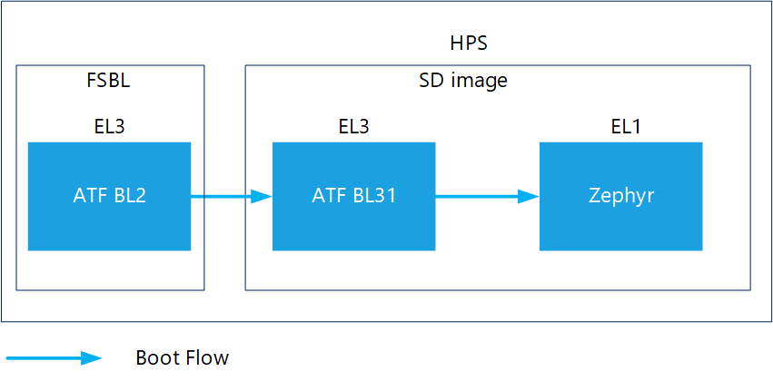

## Overview
Agilex™ 5 E-Series devices provide the next generation HPS after those provided with the Agilex™® 7 and Stratix 10® SoC FPGA devices.
The Agilex™ 5 E-Series HPS application processors can run Zephyr RTOS and Linux with scalable performance using from one to four Arm **Cortex** -A cores that allow for a wide range of applications.
The Agilex™ 5 E-Series Simics virtual platform models the HPS processor with two Arm Cortex-A55 cores and two Arm Cortex-A76 cores along with the hard processor system (HPS) peripherals. The Agilex™ 5 E-Series HPS virtual platform is released as part of the Simics® Simulator for Agilex™ FPGAs software, which also includes several virtual platforms where the Agilex™ 5 E-Series device is instantiated, emulating the concept of having different versions of a development kit or daughter cards.
The Agilex™ 5 E-Series has the following supported virtual platforms:

- Agilex™ 5 E-Series Virtual Platform - Universal

The following sections describe the prerequisites for the Simics simulator for Altera FPGA and the available virtual platforms including prebuilt Zephyr binaries. Instructions about how to build these binaries and run the Software stack are provided as well.
Additionally, some common use cases that you can exercise with this Zephyr release are discussed.

### Prerequisites

To exercise the instructions presented on this page, the following prerequisites need to be satisfied:

- Host PC with Linux. The instructions on this page use Ubuntu 20.04 LTS.  
- The following package versions are needed to build Zephyr binaries:
  - cmake - 3.20.5
  -  python3 - 3.8
  - dtc - 1.4.6
- The following packages are needed to be able to deploy the Simics project: GCC 6.3 compiler or higher, g++ 9.4 or higher, GNU make 4.1 or higher.
- Agilex™ 5 Simics Virtual Platform components are available to be deployed.
- Quartus® Prime Pro Edition Programmer and Tools 24.3 or later.
  

**Note**: For installation instructions for the Simics Simulator for Altera® FPGAs and the Agilex™ 5 E-Series virtual platforms, refer to the following documents:

- [Intel® Simics® Simulator for Intel® FPGAs User Guide](https://www.intel.com/content/www/us/en/docs/programmable/784383/)
- [Agilex™ 5 E-Series Virtual Platform User Guide](https://www.intel.com/content/www/us/en/docs/programmable/786901/)

  
#### Release Contents
#### Source Code

| SW Component | Repository | Branch/tag |
| --- | --- | --- |
| ATF | [https://github.com/altera-opensource/arm-trusted-firmware/](https://github.com/altera-opensource/arm-trusted-firmware/) | socfpga_v2.11.0/QPDS24.3_REL_GSRD_PR |
| Zephyr | [https://github.com/altera-opensource/zephyr-socfpga/](https://github.com/altera-opensource/zephyr-socfpga/)  | socfpga_rel_24.3/QPDS24.3_REL_GSRD_PR |

<span style="color: red;">NOTE:  For 24.3 release only QSPI Boot is supported. Regardless of this, we are providing instructions on how the binaries for SDCard and NAND boot are generated, but these has not been validated.  </span>

#### Prebuilt Binaries

Prebuilt binaries can be found at the following URL: [https://releases.rocketboards.org/2024.11/zephyr/agilex5/hps_zephyr/](https://releases.rocketboards.org/2024.11/zephyr/agilex5/hps_zephyr/).
The prebuilt binaries consist of application programs built to run on the MPU cores in multicore configuration.
There are binary files designed for boot devices such as SD cards, NAND flash, and QSPI.
Additionally, files used by the recipes to create the binaries to boot from QSPI and NAND are provided in their respective folders.
The sample applications provided are:

| Directory | Application Description |
| --- | --- |
| cli  | Application to demonstrate Command Line Interface |
| hello_world | Application that displays a Hello World! message|

<span style="color: red;">NOTE:  For 24.3 release only binaries for QSPI Boot are supported, so files for SDMMC and NAND are not provided. </span>

## Embedded Software Peripheral Zephyr Drivers Availability

| HPS Peripheral | Supported | 
| --- | --- | 
| SD Card driver | Partially | 
| GPIO Driver | Yes | 
| I2C Driver | Partially | 
| UART Driver | Yes | 
| Timer Driver | Yes | 
| WatchDog Driver  | Yes | 
| SMP Driver | No | 
| QSPI Driver | Yes | 
| NAND Driver | Partially | 
| SDRAM Driver | Yes | 
| Ethernet Driver | Partially | 
| SPI Driver | Partially | 
| SDM Mailbox Driver | Yes | 
| USB 2.0 Driver | Partially | 
| HPS DMA Driver | Partially | 
| I3C driver | Partially | 
| EDAC/RAS drivers | No | 

### Boot Flow 
Starting with this release the Arm Trusted Firmware will act as the FSBL and SSBL bootloader for  Zephyr as described in the following diagram: 

 

## Agilex™ 5 Simics Virtual Platform 
This virtual platform is associated with the *agilex5e-universal.simics* target script. The following figure shows a high-level block diagram of this virtual platform. In this diagram, we can observe the main components that can be exercised during the execution of the use cases described later on this page. The implementation of this virtual platform allows all the peripherals in the HPS to be enabled at the same time, which is not possible in physical hardware implementations. The pinmux and Combo PHY impose restrictions in physical hardware. In the case of the pinmux in physical hardware, only a subset of peripherals can be enabled at the same time because there are not enough pins if all pins are enabled simultaneously. This limitation does not exist in the Agilex 5 E-Series Universal Virtual Platform. For the Combo PHY, the physical hardware allows only one flash controller (NAND or SDMMC) to be enabled at one time. However, the virtual platform allows both to be enabled simultaneously. 

 

The architecture of the virtual platform follows a hierarchy that goes from *system -> board -> fpga -> hps,* which is aligned with the Agilex™ 5 Simics virtual platform development philosophy that tries to match with the real hardware system architecture.

The **target script** instantiates the *system component*, provides the CLI run time commands and creates the network configuration. This script also defines the parameters that configure other components.

The **system component** represents the complete system of the virtual platform and instantiates the **board component**. This component is implemented in a Python file.

The **board component** represents the model of a PCB (analogous to a development kit). It includes the instance of the **FPGA component** and all board components connected to the FPGA (for example, flash device, ethernet PHY). The GPIO loopback connection is implemented here. This component is implemented in a Python file.

The **FPGA component** represents a model of the top-level FPGA design. The hierarchy matches the logical hierarchy of a hypothetical GHRD that the virtual platform models. This instantiates the HPS, the external memory interface IP, and the FPGA example design.

The embedded software running in this virtual platform is expected to be the same that could be run in the real silicon. Additionally, the ability to exercise the HPS embedded software in this virtual platform allows you to debug the software using the Simics® Simulator debug capabilities.

For more details about Intel Simics® Simulator please refer to: [Linux Simics GSRD](../linux-gsrd/ug-linux-gsrd-agilex5-virtual-platforms.md)

### Key points for Zephyr

The Zephyr GSRD requires a top-level target script that wraps the agilex5e-universal.simics and execute Simics commands to run Zephyr.  The example of the file contents is shown below:

```
#Universal Zephyr simics Script. 
local $board_name = "system.board.fpga" 

# TOP-LEVEL CONFIG Script TO BOOT ZEPHYR.
# Ensure the sdimage.img & bl2.bin paths are relative to the simics executable#

# Enable Console
$create_hps_serial0_console=TRUE

# Boot from SD Card
$create_hps_sd_card=TRUE
$create_hps_mmc=FALSE

# SD Card boot Image file path
$sd_image_filename = ../sdcard_bin/sdimage.img

# First stage boot loader, ATF BL2 path
$fsbl_image_filename = ../sdcard_bin/bl2.bin

run-command-file "targets/agilex5e-universal/agilex5e-universal.simics"  

run
```

In this script, the most relevant parameters to run Zephyr  are the following:

| *Parameter* | *Description* | *Range* | *Default Value* |
|--- | ---| --- | --- |
| $sd_image_filename | Sdcard image path  | Filename string | "" |
| $fsbl_image_filename | Fsbl image path | Filename string | "" |

## Using Prebuilt Binaries With Simics

The Zephyr GSRD requires a top-level target script that wraps the agilex5e-universal.simics and execute Simics commands to run Zephyr. The example of the file contents is shown below:

```
#Universal Zephyr simics Script. 
local $board_name = "system.board.fpga" 

# TOP-LEVEL CONFIG Script TO BOOT ZEPHYR.
# Ensure the sdimage.img & bl2.bin paths are relative to the simics executable#

# Enable Console
$create_hps_serial0_console=TRUE

# Boot from SD Card
$create_hps_sd_card=TRUE
$create_hps_mmc=FALSE

# SD Card boot Image file path
$sd_image_filename = ../sdcard_bin/sdimage.img

# First stage boot loader, ATF BL2 path
$fsbl_image_filename = ../sdcard_bin/bl2.bin

run-command-file "targets/agilex5e-universal/agilex5e-universal.simics"  run
```

In this script, the most relevant parameters to run Zephyr  are the following:

| *Parameter* | *Description* | *Range* | *Default Value* |
|---| --- | --- | --- |
| $sd_image_filename | Sdcard image path  | Filename string | "" |
| $fsbl_image_filename | Fsbl image path | Filename string | "" |


### Setting Up to Use Prebuilt Binaries

You will need both the boot image as well the firmware(ATF) binaries. The links below go directly to the directory with binaries corresponding to the application and boot device:

- Hello World:
  1. [QSPI Flash](https://releases.rocketboards.org/2024.11/zephyr/agilex5/hps_zephyr/hello_world/qspi_boot/)
  

- CLI:
  1. [QSPI Flash](https://releases.rocketboards.org/2024.11/zephyr/agilex5/hps_zephyr/cli/qspi_boot/) 
  

The following are the helper instructions to download the prebuilt binaries according to the application and boot device:

1.  This step assumes you have not created the folders as mentioned in [Build Instructions](#build-instructions) or that you want to start afresh. It will remove any prior work! Skip to the next step to retain prior work.
Create the !ZephyrGSRD directory.
```bash
rm -rf agilex5_zgsrd
mkdir agilex5_zgsrd
cd agilex5_zgsrd
export TOP_FOLDER=$(pwd)
```

2.  Create a folder to contain the prebuilt binaries.
```bash
cd $TOP_FOLDER 
mkdir prebuilt
```

3. Specify sample application and boot device
   
   * App
     
      | Application | Environment Variable |
      | --------------- | --------------- |
      | Hello World  | export app=hello_world |
      | CLI          | export app=cli |

   * Boot Device
     
      | Boot Device | Environment Variable |
      | --------------- | --------------- | 
      | QSPI | export bootdev=qspi_boot bin_dir=qspi_bin bootimg=flash_image_jic.rpd |
     

4. Get the prebuilt binaries into the prebuilt folder.

<span style="color: red;"> NOTE:  At the moment of creating this page, the .jic file for the prebuild applications was not included in the official binaries release page, so in the example below we are using an alternate location in the meantime these binaries are uploaded. The temporary location of the page is https://www.rocketboards.org/foswiki/Projects/ZephyrPrebuildBinaries </span>. The .rpd files were generated from the current available binaries from the official page following the instuctions at [Creating Boot Images](#Creating Boot Images) section.
```bash
cd $TOP_FOLDER/prebuilt
wget https://www.rocketboards.org/foswiki/pub/Projects/ZephyrPrebuildBinaries/ZephyrPrebuildBinaries24p3.tar
tar xf ZephyrPrebuildBinaries24p3.tar

```

The prebuilt samples for Agilex™ 5 would have the following structure:
   * prebuilt/hello_world
   * prebuilt/cli

### Organizing the Prebuilt Binaries

If you've downloaded the prebuilt binaries manually, please place them in the following structure, then refer below to the step "To boot on Simics"...

```
agilex5_zgsrd
└── qspi_bin
    └── bl2.bin
    └── flash_image_jic.rpd

```

If you've followed the helper steps above, follow the next instructions:

1. Prepare the binaries to run on Simics® Simulator.
   
```bash
cd $TOP_FOLDER 
rm -rf $bin_dir
mkdir -p $bin_dir

ln -s $TOP_FOLDER/prebuilt/ZephyrPrebuildBinaries24p3/$app/$bootdev/$bootimg $bin_dir/$bootimg
ln -s $TOP_FOLDER/prebuilt/ZephyrPrebuildBinaries24p3/$app/$bootdev/bl2.bin $bin_dir/bl2.bin
```
2. For the first time run, set up the Agilex™ 5 virtual platform. Refer to [Simulation Setup](#simulation-setup).
   
- To boot on Simics, based on the boot device refer to the corresponding sections :  [Booting from SD Card Image binaries](#booting-from-sd-card-image-binaries),  [Booting from NAND binaries](#booting-from-nand-binaries) and [Booting from QSPI binaries](#booting-from-qspi-binaries).
  


## Build Instructions


### Setting up Environment

- Update your system
  
   
```bash
sudo apt-get update
sudo apt-get upgrade
```

- Install all the required dependencies:

```bash
sudo apt-get install --no-install-recommends git cmake ninja-build gperf 
ccache dfu-util device-tree-compiler wget 
python3-dev python3-pip python3-setuptools python3-tk python3-wheel python3-venv xz-utils file libpython3-dev 
make gcc gcc-multilib g++-multilib libsdl2-dev libmagic1 libguestfs-tools  libssl-dev
```

|  Package  |  Zephyr Requirement  |  Ubuntu 22.04 (default versions)  |  command  |
| --- | --- | --- | --- |
| cmake | 3.20.5 | 3.16.3 (upgrade required) | cmake --version |
| python | 3.8 | 3.8.10 | python3 --version |
| dtc | 1.4.6 | 1.5.0 | dtc --version |

- As a minimum CMake version 3.20.0 is required, if you have an older version, then execute the following commands to add a non-intrusive CMake binary:

```bash
CURR_FOLDER=$PWD
mkdir -p $HOME/bin/cmake && cd $HOME/bin/cmake
wget https://github.com/Kitware/CMake/releases/download/v3.21.1/cmake-3.21.1-Linux-x86_64.sh
yes | sh cmake-3.21.1-Linux-x86_64.sh | cat
echo "export PATH=$PWD/cmake-3.21.1-linux-x86_64/bin:\$PATH" >> $HOME/.zephyrrc
cd $CURR_FOLDER
```

- Load the profile that was created to use the newer cmake (*this should be done for every session when* [Building Zephyr](#zephyr-build-environment-setup):
  
```bash
source  $HOME/.zephyrrc
```
- Create the ZephyrGSRD directories:


```bash
rm -rf agilex5_zgsrd
mkdir agilex5_zgsrd
cd agilex5_zgsrd
export TOP_FOLDER=$(pwd)
```

- Download the compiler toolchain. Define environment variables and append the toolchain path in the environment PATH variable. so the toolchain can be used to build the binaries:


```bash
cd $TOP_FOLDER
wget https://developer.arm.com/-/media/Files/downloads/gnu/11.3.rel1/binrel/arm-gnu-toolchain-11.3.rel1-x86_64-aarch64-none-linux-gnu.tar.xz
tar xf arm-gnu-toolchain-11.3.rel1-x86_64-aarch64-none-linux-gnu.tar.xz
rm -f arm-gnu-toolchain-11.3.rel1-x86_64-aarch64-none-linux-gnu.tar.xz
export PATH=`pwd`/arm-gnu-toolchain-11.3.rel1-x86_64-aarch64-none-linux-gnu/bin:$PATH
echo "export PATH=`pwd`/arm-gnu-toolchain-11.3.rel1-x86_64-aarch64-none-linux-gnu/bin:\$PATH" >> $TOP_FOLDER/.zephyrrc
```


Enable Quartus tools to be called from command line:


```bash
export QUARTUS_ROOTDIR=~/intelFPGA_pro/24.3/quartus/
export PATH=$QUARTUS_ROOTDIR/bin:$QUARTUS_ROOTDIR/linux64:$QUARTUS_ROOTDIR/../qsys/bin:$PATH
```


### Get SOF file from Hardware Design

In Simics, the SOF file generated as result of the build of the hardware design is not used at all in the simulation, but this is needed to create the RPD file to exercise the QSPI boot. This is the reason why we provide the steps to build the hardware desgin here.


```bash
cd $TOP_FOLDER
rm ghrd_a5ed065bb32ae6sr0_hps.sof
wget https://releases.rocketboards.org/2024.11/gsrd/agilex5_dk_a5e065bb32aes1_gsrd/ghrd_a5ed065bb32ae6sr0_hps.sof 
```


The following file is created:

* $TOP_FOLDER/agilex5_soc_devkit_ghrd/output_files/ghrd_a5ed065bb32ae6sr0_hps.sof


### Building Arm Trusted Firmware

We will build 3 ATF sets of binaries: One for SDCard boot, other for NAND boot and other for QSPI boot.

#### Build ATF SDCard


- Clone the ATF repository from GitHub and build it

```bash
git clone -b QPDS24.3_REL_GSRD_PR  https://github.com/altera-opensource/arm-trusted-firmware arm-trusted-firmware-sdcard
cd arm-trusted-firmware-sdcard
git switch -c test
make realclean
ARCH=arm64 CROSS_COMPILE=aarch64-none-linux-gnu- make PLAT=agilex5 SOCFPGA_BOOT_SOURCE_SDMMC=1 bl2 bl31 PRELOADED_BL33_BASE=0x80100000 -j$(nproc) 
```


- Build Fiptool to be able to create the sdimage in later steps.


```bash
make fiptool
cp tools/fiptool/fiptool $TOP_FOLDER
```


The previous instructions will produce (in the $TOP_FOLDER/arm-trusted-firmware directory):
- $TOP_FOLDER/arm-trusted-firmware-sdcard/build/agilex5/release/bl2.bin
- $TOP_FOLDER/arm-trusted-firmware-sdcard/build/agilex5/release/bl31.bin
- $TOP_FOLDER/fiptool

#### Build ATF NAND


- Clone the ATF repository from GitHub and build it

```bash
cd $TOP_FOLDER
git clone -b QPDS24.3_REL_GSRD_PR  https://github.com/altera-opensource/arm-trusted-firmware arm-trusted-firmware-nand
cd arm-trusted-firmware-nand
wget https://releases.rocketboards.org/2023.12/zephyr/gsrd_zephyr/agilex5/cli/nand_boot/0001-plat-intel-soc-agilex5-enable-NAND-boot.patch
git apply 0001-plat-intel-soc-agilex5-enable-NAND-boot.patch
make realclean
ARCH=arm64 CROSS_COMPILE=aarch64-none-linux-gnu- make PLAT=agilex5 SOCFPGA_BOOT_SOURCE_NAND=1 bl2 bl31 PRELOADED_BL33_BASE=0x80100000 -j$(nproc)
```


The previous instructions will produce (in the $TOP_FOLDER/arm-trusted-firmware directory):
- $TOP_FOLDER/arm-trusted-firmware-nand/build/agilex5/release/bl2.bin
- $TOP_FOLDER/arm-trusted-firmware-nand/build/agilex5/release/bl31.bin

#### Build ATF QSPI


- Clone the ATF repository from GitHub and build it

```bash
cd $TOP_FOLDER
git clone -b QPDS24.3_REL_GSRD_PR  https://github.com/altera-opensource/arm-trusted-firmware arm-trusted-firmware-qspi
cd arm-trusted-firmware-qspi
git switch -c test
make realclean
ARCH=arm64 CROSS_COMPILE=aarch64-none-linux-gnu- make PLAT=agilex5 SOCFPGA_BOOT_SOURCE_QSPI=1 bl2 bl31 PRELOADED_BL33_BASE=0x80100000 -j$(nproc)
```


The previous instructions will produce (in the $TOP_FOLDER/arm-trusted-firmware directory):
- $TOP_FOLDER/arm-trusted-firmware-qspi/build/agilex5/release/bl2.bin
- $TOP_FOLDER/arm-trusted-firmware-qspi/build/agilex5/release/bl31.bin

### Zephyr Build Environment Setup


- Create a new virtual environment and activate it


```bash
cd $TOP_FOLDER
python3 -m venv ~/.zephyrproject/.venv
#Environment Activation
source ~/.zephyrproject/.venv/bin/activate
```


- Install west, pull the official Zephyr repository and other Zephyr dependencies:


```bash
pip3 install wheel
pip3 install west
west init -m https://github.com/zephyrproject-rtos/zephyr --mr v3.6-branch zephyrproject
cd $TOP_FOLDER/zephyrproject
west update
west zephyr-export
pip install -r $TOP_FOLDER/zephyrproject/zephyr/scripts/requirements.txt
```


Note: If you get a similar error like:
```
ERROR: sphinx-tabs 3.4.1 has requirement docutils~=0.18.0, but you'll have docutils 0.19 which is incompatible.
ERROR: sphinx-rtd-theme 1.2.2 has requirement docutils<0.19, but you'll have docutils 0.19 which is incompatible
```

Run:
```bash
pip install sphinx-rtd-theme sphinx
```

- Install Zephyr SDK in home folder so it can be used on many Zephyr projects:


```bash
wget https://github.com/zephyrproject-rtos/sdk-ng/releases/download/v0.16.4/zephyr-sdk-0.16.4_linux-x86_64.tar.xz
wget -O - https://github.com/zephyrproject-rtos/sdk-ng/releases/download/v0.16.4/sha256.sum | shasum --check --ignore-missing
wget https://github.com/zephyrproject-rtos/sdk-ng/releases/download/v0.16.1/zephyr-sdk-0.16.1_linux-x86_64.tar.xz
wget -O - https://github.com/zephyrproject-rtos/sdk-ng/releases/download/v0.16.1/sha256.sum | shasum --check --ignore-missing 
tar xf zephyr-sdk*.tar.xz -C ~/
rm zephyr-sdk*.tar.xz
$HOME/zephyr-sdk*/setup.sh -t aarch64-zephyr-elf -h -c
```


- Substitute the official "Zephyr" folder for zephyr-socfpga repository:
  


```bash
cd $TOP_FOLDER/zephyrproject
rm -rf zephyr 
git clone -b QPDS24.3_REL_GSRD_PR --single-branch https://github.com/altera-opensource/zephyr-socfpga zephyr
west update
west zephyr-export
```


### Building Zephyr Application

Every Zephyr application is composed of several configurable key components that work together in the same executable:

 - Zephyr Kernel: Manages system resources and task scheduling.
 - Device Drivers: Enable interaction with hardware peripherals.
 - Libraries: Provide additional functionality and utilities.
 - Application Code: Written in C to define application behavior

The following Zephyr sample applications are available to test:

- HelloWorld: samples/hello_world/
- GPIO: samples/basic/blinky/
- I2C: samples/drivers/i2c_fujitsu_fram/
- Timer/Counter: samples/drivers/counter/alarm/
- Watchdog: samples/drivers/watchdog/
- SD: samples/subsys/fs/fat_fs/
- UART: samples/drivers/uart/echo_bot/
- Ethernet: samples/net/sockets/echo_client and samples/net/sockets/ echo_server
- NAND: samples/drivers/soc_flash_nand/
- SPI: samples/drivers/jesd216/
- QSPI : samples/drivers/soc_flash_qspi/
- SDM Mailbox: sample/subsys/sip_svc/
- USB 2.0 Host: samples/subsys/fs/fat_fs/
- HPS DMA: samples/drivers/dma/mem_to_mem/
- I3C: samples/drivers/i3c_sample_app_simics/

In this regard, we will focus on building the "Hello World" sample that will allow us to test our development environment and run it in Simics® Simulator.

- Build the "Hello World" Zephyr application binary and place the built outputs in an "agilex5" directory in the current active directory.


```bash
cd $TOP_FOLDER/zephyrproject/zephyr
west build -b intel_socfpga_agilex5_socdk samples/hello_world -d agilex5
```


Successful build console output should be similar to the following:

```
Zephyr version: 3.6.0 (/home/msangele/Artifacts/zephyr_samples/agilex5_zgsrd/zephyrproject/zephyr), build: f1571bf6e7e2
[134/144] Linking C executable zephyr/zephyr_pre0.elf

[138/144] Linking C executable zephyr/zephyr_pre1.elf

[144/144] Linking C executable zephyr/zephyr.elf
Memory region         Used Size  Region Size  %age Used
           FLASH:          0 GB         0 GB
             RAM:      134048 B         8 MB      1.60%
        IDT_LIST:          0 GB         2 KB      0.00%
```

The output of this stage is:

- $TOP_FOLDER/zephyrproject/zephyr/agilex5/zephyr/zephyr.bin

### Creating Boot Images

Three types of boot devices are supported:

1. [SD Card](#sd-card-image-binaries)
2. [NAND Flash](#nand-binaries)
3. [QSPI Flash](#qspi-binaries)


#### SD Card Image binaries

- Create FIP(Firmware Image Package) binary. This will pack the Zephyr binary and ATF BL31 binary into one single binary called FIP binary.


```bash
cd $TOP_FOLDER
mkdir sdcard_bin && cd sdcard_bin
cp $TOP_FOLDER/arm-trusted-firmware-sdcard/build/agilex5/release/bl2.bin .
$TOP_FOLDER/fiptool create --soc-fw $TOP_FOLDER/arm-trusted-firmware-sdcard/build/agilex5/release/bl31.bin --nt-fw $TOP_FOLDER/zephyrproject/zephyr/agilex5/zephyr/zephyr.bin fip.bin
```


To build the "SDCard Image" for simics use the following commands:

- Obtain the make_sdimage.sh script.
  


```bash
cd $TOP_FOLDER/sdcard_bin
wget https://releases.rocketboards.org/2023.12/zephyr/gsrd_zephyr/agilex5/cli/sdmmc_boot/make_sdimage.sh
chmod +x make_sdimage.sh
```


- Create the sdimage.img

```bash
touch dummy.tar.gz
sudo ./make_sdimage.sh -k dummy.tar.gz -p fip.bin -o sdimage.img -g 2G -pg 16
```


To deactivate the environment when development is done execute:

```bash
deactivate
```

##### Resulted Files

After the build is completed successfully the most relevant files are:

| File  | Description |
| --- | --- |
| bl2.bin  | The FSBL that Simics will launch first |
| bl31.bin  | The ATF BL31 (similar to legacy SSBL stage)  |
| zephyr.bin  | Zephyr Application/Kernel  |
| fip.bin  | Firmware Image Package |
| sdimage.img | Application image |

If you have not set up Simics Virtual Platform for Agilex™ 5, go to [Simulation Setup](#simulation-setup). 
For booting on Simics Virtual Platform for Agilex 5, refer [Booting from SD Card Image binaries](#booting-from-sd-card-image-binaries)

#### NAND binaries


To build the "NAND Image" for simics use the following commands with the ATF created for NAND boot:


- Rebuild fip.bin with NAND ATF

```bash
cd $TOP_FOLDER
mkdir nand_bin && cd nand_bin
cp $TOP_FOLDER/arm-trusted-firmware-nand/build/agilex5/release/bl2.bin .
$TOP_FOLDER/fiptool create --soc-fw $TOP_FOLDER/arm-trusted-firmware-nand/build/agilex5/release/bl31.bin  --nt-fw $TOP_FOLDER/zephyrproject/zephyr/agilex5/zephyr/zephyr.bin fip.bin
```


- Create the nand_mem.img image and write the fip.bin within:

```bash
cd $TOP_FOLDER/nand_bin
dd if=/dev/zero count=8 bs=16MB | tr '\0' '\377' > nand_mem.img 
dd if=fip.bin of=nand_mem.img conv=notrunc bs=1 seek=2097152
```


To deactivate the environment when development is done and return to the main branch execute:

```bash
deactivate
```

##### Resulted Files

After the build is completed successfully the most relevant files are:

| File  | Description |
| --- | --- |
| bl2.bin  | The FSBL that Simics will launch first |
| bl31.bin  | The ATF BL31 (similar to legacy SSBL stage)  |
| zephyr.bin  | Zephyr Application/Kernel  |
| fip.bin  | Firmware Image Package |
| nand_mem.img | NAND Application image |

If you have not set up Simics Virtual Platform for Agilex 5, go to [Simulation Setup](#simulation-setup). 
For booting on Simics Virtual Platform for Agilex 5, refer [Booting from NAND binaries](#booting-from-nand-binaries)


#### QSPI binaries

To build the "QSPI Image" for simics use the following commands using the ATF built for QSPI boot:


- Rebuild fip.bin


```bash
cd $TOP_FOLDER
mkdir qspi_bin && cd qspi_bin
cp $TOP_FOLDER/arm-trusted-firmware-qspi/build/agilex5/release/bl2.bin .
$TOP_FOLDER/fiptool create --soc-fw $TOP_FOLDER/arm-trusted-firmware-qspi/build/agilex5/release/bl31.bin --nt-fw $TOP_FOLDER/zephyrproject/zephyr/agilex5/zephyr/zephyr.bin fip.bin
```


- Create pfg file:

```bash
cd $TOP_FOLDER/qspi_bin
tee qspi_flash_image_agilex5_boot.pfg  << 'EOF'
<pfg version="1">
  <settings custom_db_dir="./" mode="ASX4"/>
  <output_files>
      <output_file name="flash_image" directory="." type="JIC">
          <file_options/>
          <secondary_file type="MAP" name="flash_image_jic">
              <file_options/>
          </secondary_file>
          <secondary_file type="SEC_RPD" name="flash_image_jic">
              <file_options bitswap="1"/>
          </secondary_file>
          <flash_device_id>Flash_Device_1</flash_device_id>
      </output_file>
  </output_files>
  <bitstreams>
      <bitstream id="Bitstream_1">
          <path hps_path="bl2.hex">agilex5_factory.sof</path>
      </bitstream>
  </bitstreams>
  <raw_files>
      <raw_file bitswap="1" type="RBF" id="Raw_File_1">bin/fip.bin</raw_file>
  </raw_files>
  <flash_devices>
      <flash_device type="MT25QU02G" id="Flash_Device_1">
          <partition reserved="1" fixed_s_addr="1" s_addr="0x00000000" e_addr="0x001FFFFF" fixed_e_addr="1" id="BOOT_INFO" size="0"/>
          <partition reserved="0" fixed_s_addr="0" s_addr="auto" e_addr="auto" fixed_e_addr="0" id="P1" size="0"/>
          <partition reserved="0" fixed_s_addr="0" s_addr="0x03C00000" e_addr="auto" fixed_e_addr="0" id="fip" size="0"/>
      </flash_device>
      <flash_loader>A5ED065BB32AE6SR0</flash_loader>
  </flash_devices>
  <assignments>
      <assignment page="0" partition_id="P1">
          <bitstream_id>Bitstream_1</bitstream_id>
      </assignment>
      <assignment page="0" partition_id="fip">
          <raw_file_id>Raw_File_1</raw_file_id>
      </assignment>
  </assignments>
</pfg>
EOF
```


- Create *bl2.hex* from *bl2.bin*

```bash 
cd $TOP_FOLDER/qspi_bin
aarch64-none-linux-gnu-objcopy -v -I binary -O ihex --change-addresses 0x00000000 bl2.bin bl2.hex
```


- Create *flash_image_jic.rpd* qspi image from fip.bin and *bl2.hex*:

```bash
cd $TOP_FOLDER/qspi_bin
ln -s $TOP_FOLDER/ghrd_a5ed065bb32ae6sr0_hps.sof agilex5_factory.sof
quartus_pfg -c qspi_flash_image_agilex5_boot.pfg
```


The output of this stage is:
- flash_image_jic.rpd

To deactivate the environment when development is done and return to the main branch execute:

```bash
deactivate
```

##### Resulted Files

After the build is completed successfully the most relevant files are:

| File  | Description |
| --- | --- |
| bl2.bin  | The FSBL that Simics will launch first |
| bl2.hex  | The FSBL in hex format |
| bl31.bin  | The ATF BL31 (similar to legacy SSBL stage)  |
| zephyr.bin  | Zephyr Application/Kernel  |
| fip.bin  | Firmware Image Package |
| flash_image_jic.rpd | QSPI Application image  |

If you have not set up Simics Virtual Platform for Agilex 5, go to [Simulation Setup](#simulation-setup). 

For booting on Simics Virtual Platform for Agilex 5, refer [Booting from QSPI binaries](#booting-from-qspi-binaries)


### Simulation Setup

We assume that the Simics® Simulator for Intel® FPGAs Simulator has been installed in a Linux System.

- Lets add the Simics binary to the path to make things easier:

```bash
export PATH=$PATH:SIMICS_INSTALLATION/simics/bin/
```
note: default path is "~/intelFPGA_pro/intel-fpga-ext_24.3/simics/bin"

- Create a Simics project directory under ZephyrGSRD directory:

```bash
cd $TOP_FOLDER
rm -r project-1
mkdir project-1
cd project-1
```

Under the new project directory created, deploy the *agilex5e-universal* virtual platform:

```bash
simics_intelfpga_cli --deploy agilex5e-universal
```

The above will produce the following:
```
Simics(R) Simulator for Intel(R) FPGA CLI:
INFO: Preparing to initialize /home/simicsUser/SimicsInstallDir/project-1 as a
Simics workspace
Project created successfully
# Observe that the directory has been initialized and the simics and simics-gui
# commands appears in the project directory. Also the target directory is
# created. This includes the target script corresponding to the deployed
# platform.
```

- Build the virtual platform components:

```bash
make
```

Example of console output:

```
=== Environment Check ===
'/home/simicsUser/SimicsInstallDir/project-1' is up-to date
gcc version 9
=== Building module agilex5e-universal-board-comp ===
.
:
=== Building module agilex5e-universal-fpga-comp ===
.
:
=== Building module agilex5e-universal-system-comp ===
.
:
```

Note: You only have to setup the Agilex 5 Virtual Platform once (or until it has been remove)

#### Booting On Simics Virtual Platform for Agilex 5

We assume that the following binaries are already available (either from the [Prebuilt Binaries](#prebuilt-binaries) package or built from the steps in [Build Instructions](#build-instructions)) :
   * bl2.bin
   * bl31.bin
   * zephyr.bin
   * sdimage.img /nand_mem.img / flash_image_jic.rpd

##### Booting from SD Card Image binaries

- Zephyr's SMP support allow us to select the boot core within simics. Select the boot core as follows:
  
  | *Core Selection* | *Env-variable* |
  | --- | --- | 
  | A55 | export cputype=a55|
  | A76 | export cputype=a76  |

- You will need a Simics script named zephyr.simics with the contents detailed in [Key points for Zephyr](#key-points-for-zephyr). Run the following to create the script:
  
```bash
cd $TOP_FOLDER/project-1
cputypestring=""
if [ $cputype = "a76" ]; then
cputypestring='$hps_boot_core = 2 
$hps_core0_1_power_on = TRUE 
$hps_core2_power_on = TRUE 
$hps_core3_power_on = TRUE'
fi;

tee zephyr_sdcard.simics << 'EOF'
# TOP-LEVEL CONFIG Script TO BOOT ZEPHYR.
local $board_name = "system.board.fpga"

# Ensure the sdimage.img & bl2.bin paths are relative to the simics executable#

# Enable Console
$create_hps_serial0_console=TRUE

# Boot from SD Card
$create_hps_sd_card=TRUE
$create_hps_mmc=FALSE

# SD Card boot Image file path
$sd_image_filename = ../sdcard_bin/sdimage.img

# First stage boot loader, ATF BL2 path
$fsbl_image_filename = ../sdcard_bin/bl2.bin
EOF

echo "$cputypestring" >> zephyr_sdcard.simics 

echo 'run-command-file "targets/agilex5e-universal/agilex5e-universal.simics"
run' >> zephyr_sdcard.simics 
```

##### Booting from NAND binaries


- Zephyr's SMP support allow us to select the boot core within simics. Select the boot core by as follows:
  
  | Core Selection | Env-variable |
  | --- | --- |
  | A55 | export cputype=a55  |
  | A76 | export cputype=a76  |


- You will need a Simics script modified for NAND named zephyr.simics. This will take [Key points for Zephyr](#key-points-for-zephyr) as base. Run the following to create the script:

```bash
cd $TOP_FOLDER/project-1
cputypestring=""
if [ $cputype = "a76" ]; then
cputypestring='$hps_boot_core = 2 
$hps_core0_1_power_on = TRUE 
$hps_core2_power_on = TRUE 
$hps_core3_power_on = TRUE '
fi;

tee zephyr_nand.simics << 'EOF'
# TOP-LEVEL CONFIG Script TO BOOT ZEPHYR.
local $board_name = "system.board.fpga"

# Ensure the nand_mem.img & bl2.bin paths are relative to the simics executable

# First stage boot loader, ATF BL2 path
$fsbl_image_filename = ../nand_bin/bl2.bin
#Boot from NAND
$nand_data_image_filename = ../nand_bin/nand_mem.img 
# Enable Console
$create_hps_serial0_console=TRUE
EOF

echo "$cputypestring" >> zephyr_nand.simics 

echo 'run-command-file "targets/agilex5e-universal/agilex5e-universal.simics"
run' >> zephyr_nand.simics 
```
##### Booting from QSPI binaries

- Zephyr's SMP support allow us to select the boot core within simics. Select the boot core as follows:
  
  | *Core Selection* | *Env-variable* |
  | --- | --- | 
  | A55 | export cputype=a55|
   | A76 | export cputype=a76  |

- You will need a Simics script modified for QSPI named zephyr.simics. This will take [Key points for Zephyr](#key-points-for-zephyr) as base. Run the following to create the script:
  
```bash
cd $TOP_FOLDER/project-1
cputypestring=""
if [ $cputype = "a76" ]; then
cputypestring='$hps_boot_core = 2 
$hps_core0_1_power_on = TRUE 
$hps_core2_power_on = TRUE 
$hps_core3_power_on = TRUE '
fi;

tee zephyr_qspi.simics << 'EOF'
# TOP-LEVEL CONFIG Script TO BOOT ZEPHYR.
local $board_name = "system.board.fpga"

# Ensure the nand_mem.img & bl2.bin paths are relative to the simics executable

# First stage boot loader, ATF BL2 path
$fsbl_image_filename = ../qspi_bin/bl2.bin
#Boot from QSPI
$qspi_image_filename = ../qspi_bin/flash_image_jic.rpd  
# Enable Console
$create_hps_serial0_console=TRUE 
EOF

echo "$cputypestring" >> zephyr_qspi.simics 

echo 'run-command-file "targets/agilex5e-universal/agilex5e-universal.simics"
run' >> zephyr_qspi.simics 
```
### Running Hello World!

To exercise this use case, follow the next steps once the Simulation setup has been completed:

- From the project directory, launch the simulation using the *zephyr.simics* (a soft link to the desired .simics file) target script. This will launch the simulator and the current terminal will become the Simics CLI:

```bash
cd $TOP_FOLDER/project-1
ln -s zephyr_sdcard.simics  zephyr.simics
./simics zephyr.simics
```

2. Wait to get "Hello World!" message in the target serial console.

```
# Target Serial console</b>
NOTICE:  DDR: Reset type is 'Power-On'
NOTICE:  IOSSM: Calibration success status check...
NOTICE:  IOSSM: All EMIF instances within the IO96 have calibrated successfully!
NOTICE:  DDR: Calibration success
NOTICE:  ###DDR:init success###
NOTICE:  SDMMC boot
NOTICE:  BL2: v2.11.0(release):QPDS24.3_REL_GSRD_PR
NOTICE:  BL2: Built : 14:04:49, Dec  6 2024
NOTICE:  BL2: Booting BL31
NOTICE:  BL31: Boot Core = 0
NOTICE:  BL31: CPU ID = 0
NOTICE:  BL31: v2.11.0(release):QPDS24.3_REL_GSRD_PR
NOTICE:  BL31: Built : 14:04:50, Dec  6 2024
*** Booting Zephyr OS build b755e7bab5f8 ***
Secondary CPU core 1 (MPID:0x100) is up
Secondary CPU core 2 (MPID:0x200) is up
Secondary CPU core 3 (MPID:0x300) is up
Hello World! intel_socfpga_agilex5_socdk
```
## Use Cases

The following sections provide instructions on how to exercise some supported use cases through cli using the *Intel Agilex® 5 E-Series Universal* virtual platform.
The compatible sample for Agilex™ 5 can be found at:

- {zephyrfolder}/samples/boards/intel_socfpga/cli

The preconditions required to execute them are listed in the following section. To use the application built following the [Build Instructions](#build-instructions), jump to [Simulation_Setup](#simulation-setup).

### Running Zephyr Command Line Application

To demonstrate the use of some Zephyr peripherals/zephyr subsystems it supports commands like:

- device: Device commands
- flash: Flash shell commands
- fs: File system commands
- gpio: GPIO commands
- i2c: I2C commands
- io96b: IO96B information
- mailbox: Altera SoC FPGA SDM mailbox client commands
- mdio: MDIO commands
- net: Networking commands
- psci: ARM PSCI interface commands
- sip_svc: ARM SiP services commands
- spi: spi commands
- timer: Timer commands
- i3c: I3C commands

##### CLI application - Prebuilt binaries

Note: The following steps assume you have followed the instructions in [Setting Up to Use Prebuilt Binaries](#setting-up-to-use-prebuilt-binaries)

- Select the sample based on app and boot device (e.g. nand):

```bash
export app=cli
export bootdev=sdmmc_boot bootimg=sdimage.img
```

- Obtain the prebuilt binaries for the CLI sample app
  
```bash
cd $TOP_FOLDER/prebuilt
wget -N https://releases.rocketboards.org/2024.11/zephyr/agilex5/hps_zephyr/$app/$bootdev/$bootimg -P $app/$bootdev/ 
wget -N https://releases.rocketboards.org/2024.11/zephyr/agilex5/hps_zephyr/$app/$bootdev/bl2.bin -P $app/$bootdev/
```

- Prepare the binaries to run on Simics® Simulator

```bash
cd $TOP_FOLDER
rm -rf bin
mkdir -p bin/atf
ln -s $TOP_FOLDER/prebuilt/$app/$bootdev/$bootimg bin/ 
ln -s $TOP_FOLDER/prebuilt/$app/$bootdev/bl2.bin bin/atf/bl2.bin
```

To run the application, go to the section [CLI application - Run](#cli-application---run)

##### CLI application - Build-from-source

There is a sample specially made for Agilex™ E-Series that can be found at *samples/boards/intel_socfpga/cli/* within the Zephyr folder. The following  instructions show how to build and run:

```bash
cd $TOP_FOLDER/zephyrproject/zephyr/
west build -b intel_socfpga_agilex5_socdk samples/boards/intel_socfpga/cli/ -d agilex5 

#If you need to overwrite a previous build you need to add the --pristine flag as follows.
#west build -b intel_socfpga_agilex5_socdk samples/boards/intel_socfpga/cli/ -d agilex5 --pristine
cd $TOP_FOLDER
```

A. if you were using prebuilt binaries before this, perform this step: [Organizing the Build-From-Source Binaries](#organizing-the-build-from-source-binaries).

As the Zephyr application has been changed, you'll to create the bootable image according to the boot device you desire. Refer to [Creating Boot Images](#creating-boot-images)

Run the application following [CLI_application - Run](#cli-application---run).

#### CLI application - Run

Once this sample is ready, you can run it in the same way as the 'hello world' sample, as follows:

```bash
cd $TOP_FOLDER/project-1
./simics zephyr.simics
```

The following output and *agilex5$* prompt will appear:

```
NOTICE:  return = 0 Hz
NOTICE:  mmc_clk = 200000000 Hz
NOTICE:  SDMMC boot
NOTICE:  BL2: v2.9.1(release):f0d41e37d
NOTICE:  BL2: Built : 08:55:04, Nov 17 2023
NOTICE:  BL2: Booting BL31
NOTICE:  BL31: Boot Core = 0
NOTICE:  BL31: CPU ID = 81000000
NOTICE:  BL31: v2.9.1(release):f0d41e37d
NOTICE:  BL31: Built : 08:55:08, Nov 17 2023
*** Booting Zephyr OS build 33d4a115fbed ***

agilex5$ Secondary CPU core 1 (MPID:0x100) is up
Secondary CPU core 2 (MPID:0x200) is up
Secondary CPU core 3 (MPID:0x300) is up
intel_socfpga_agilex5_socdk: Starting Command Line Interface...
Enumeration started
USB enumeration success

agilex5$
```

At this point you can use the interactive command line and execute the following commands:
- help -> Show all the available commands\
- fs -> To interact with file system for storage devices
- gpio -> To interact with the gpio ports
- i2c -> To send and receive data from the i2c ports
- timer -> To interact with the timer interrupts.

```
agilex5$ help
You can try to call commands with <-h> or <--help> parameter for more information.

Available commands:
  device   :Device commands
  edac     :EDAC information
  flash    :Flash shell commands
  fs       :File system commands
  gpio     :GPIO commands
  help     :Prints the help message.
  i2c      :I2C commands
  i3c      :I3C commands
  mailbox  :Intel SoC FPGA SDM mailbox client commands
  mdio     :MDIO commands
  net      :Networking commands
  psci     :ARM PSCI interface commands
  sip_svc  :ARM SiP services commands
  spi      :spi commands
  timer    :Timer commands
agilex5$
```

Let's execute blink through the gpio command to demonstrate the usage of the CLI(Command line interface):

```
agilex5$ gpio help
gpio - GPIO commands
Subcommands:
  conf   :Configure GPIO: conf <gpio_node_id> <pin> <mode(in/out)>
  get    :Get GPIO value: get <gpio_node_id> <pin>
  set    :Set GPIO: set <gpio_node_id> <pin> <value(0/1)>
  blink  :Blink GPIO: blink <gpio_node_id> <pin>
agilex5$ gpio conf gpio@10c03300  5 out
Configuring gpio@10c03300 pin 5
agilex5$ gpio blink  gpio@10c03300  5  
Blinking port gpio@10c03300 pin 5. Hit any key to exit
agilex5$
```

Note: GPIO port gpio@10c03200 pins 0 to 10 are used for sdcard boot and should not be used for other purposes.

### Using I3C

This use case is an extension to the CLI application. The CLI prebuilt or build from source binary can be used directly for this use case.

The Zephyr driver enabled 2 I3C devices and 1 I2C device of the modeled board components and attached to the I3C master's bus.
To test the I3C read and write operation to a device, set the **inverted_loopback** parameter to TRUE. This may be done in the zephyr.simics script.

Note: 

1. The 2 I3C device enabled have the PIDs 0xFB1122330001 and 0xFB1122330002. You'll have to enable **inverted_loopback** for the desired devices to read-back the write operation.
   - Device #1: **system.board.i3c0_device1.target->inverted_loopback=TRUE**
   - Device #2: **system.board.i3c0_device2.target->inverted_loopback=TRUE**
2. The 1 I2C device has the address 0x50.
3. The read-back values are inverted(by NOT bit-wise operation) at byte level. (E.g. write 0xAF -> read returns 0x50).
4. For the first usage, the read FIFO will contain a 1-byte value of 0xF0 due to initialization (this is not a driver issue but the device model behaviour). Reads will flush the FIFO.
5. When the FIFO is empty, a read-back will have a default 1-byte value of 0xA5. Data after the 1st byte are random constant value.

- For more details, refer to [Intel Agilex® 5 E-Series Virtual Platform User Guide - I3C Device](https://www.intel.com/content/www/us/en/docs/programmable/786901/23-4/i3c-device.html)

Enable the (inverted)loopback in target simics script.

```bash
cd $TOP_FOLDER/project-1
sed -i '/^run$/i system.board.i3c0_device1.target->inverted_loopback=TRUE \
system.board.i3c0_device2.target->inverted_loopback=TRUE' zephyr.simics
```

If everything was done correctly we can execute "i3c" commands after running **./simics zephyr.simics** as shown below:

- Perform a dummy i3c read for the first use after boot. This is to clear the data in the RX fifo resulting from CCC operation during driver initialization. The output seen will be 0xf0.
  
```
NOTICE:  return = 0 Hz
NOTICE:  mmc_clk = 200000000 Hz
NOTICE:  SDMMC boot
NOTICE:  BL2: v2.9.1(release):f0d41e37d
NOTICE:  BL2: Built : 08:55:04, Nov 17 2023
NOTICE:  BL2: Booting BL31
NOTICE:  BL31: Boot Core = 0
NOTICE:  BL31: CPU ID = 81000000
NOTICE:  BL31: v2.9.1(release):f0d41e37d
NOTICE:  BL31: Built : 08:55:08, Nov 17 2023
*** Booting Zephyr OS build 33d4a115fbed ***

agilex5$ Secondary CPU core 1 (MPID:0x100) is up
Secondary CPU core 2 (MPID:0x200) is up
Secondary CPU core 3 (MPID:0x300) is up
intel_socfpga_agilex5_socdk: Starting Command Line Interface...
Enumeration started
USB enumeration success

agilex5$ %BLUE%i3c read i3c@10DA0000 0xfb11 0x22330001 0x1%ENDCOLOR%

Read 1 bytes from i3c device with address (9)

00000000: f0                                               |.                |
```

- Perform i3c commands for write and read test to I3C device.
  
```
agilex5$ i3c write i3c@10DA0000 0xfb11 0x22330001 0xf0 0xca 0x14 0x52
To be Written data[0]: f0
To be Written data[1]: ca
To be Written data[2]: 14
To be Written data[3]: 52
Wrote 4 bytes: Device Dynamic address (9)
agilex5$ i3c read i3c@10DA0000 0xfb11 0x22330001 0x4             

Read 4 bytes from i3c device with address (9)

00000000: 0f 35 eb ad                                      |.5..             |
```

- Perform i3c commands for write and read test to I2C device.
  
```
agilex5$ i3c i2c_write i3c@10DA0000 0x50 0x08 0xb0 0x55 0xca 0xfe   
agilex5$ i3c i2c_read i3c@10DA0000 0x50 0x08 0x4                    
00000000: b0 55 ca fe                                      |.U..             |
agilex5$ 
```
### Using USB 2.0

To test file operations We can load the USB 2.0 device model: "usb-msd.craff" in Simics.

- Download the USB2.0 model:
  
```bash
cd $TOP_FOLDER/project-1
wget https://releases.rocketboards.org/2023.12/zephyr/gsrd_zephyr/agilex5/cli/usb-msd.craff
```

Then we need to modify our current zephyr.simics script to provide: *$usb_otg_image_filename* parameter as follows:

```bash
cd $TOP_FOLDER/project-1
sed -i '1i$usb_otg_image_filename = "usb-msd.craff"' zephyr.simics
```

If  everything was done correctly we can execute "fs" commands after running =./simics zephyr.simics= as shown below:
```
NOTICE:  return = 0 Hz
NOTICE:  mmc_clk = 200000000 Hz
NOTICE:  QSPI boot
NOTICE:  BL2: v2.9.1(release):6e6d72e35
NOTICE:  BL2: Built : 08:50:06, Nov 17 2023
NOTICE:  BL2: Booting BL31
NOTICE:  BL31: Boot Core = 800
NOTICE:  BL31: CPU ID = 81000200
NOTICE:  BL31: v2.9.1(release):f0d41e37d
NOTICE:  BL31: Built : 08:55:08, Nov 17 2023
*** Booting Zephyr OS build 33d4a115fbed ***

agilex5$ Secondary CPU core 1 (MPID:0x0) is up
Secondary CPU core 2 (MPID:0x100) is up
Secondary CPU core 3 (MPID:0x300) is up
intel_socfpga_agilex5_socdk: Starting Command Line Interface...
Enumeration started
USB enumeration success

agilex5$ fs mount fat /USB2: 
Successfully mounted fat fs:/USB2:
agilex5$ fs ls USB2:/ 
agilex5$ fs write USB2:/cafe.txt 0C 0A 0F 0F 0E
Successfully written 5 bytes
agilex5$ fs read USB2:/cafe.txt                
File size: 5
00000000  0C 0A 0F 0F 0E                                   …..
Successfully read 5 bytes
agilex5$ fs ls USB2:/ 
      CAFE.TXT  size: 5          bytes
agilex5$
```
## Exercising Zephyr on a single core.

By default, SMP is enabled in Zephyr, and all the cores will be up and running. However, the user may choose the specific core on which the Zephyr application should run on a single core. This can be accomplished as follows:

### Prebuilt Binaries for A55 and A76

To execute the binaries prebuilt for A76, change the "cputype" in the steps for
[Organizing the Prebuilt Binaries](#organizing-the-prebuilt-binaries) or
[CLI application - Prebuilt binaries](#cli-application---prebuilt-binaries)

### Build the Zephyr Application

The default build configuration targets the A55 core. The following steps will guide you in rebuilding the "Hello World" application for A76.
It's assumed you have already followed the [Build Instructions](#build-instructions) with default settings.

- Load the profile and activate the python virtual environment

```
source  $TOP_FOLDER/.zephyrrc
source ~/.zephyrproject/.venv/bin/activate 
```

- Pick either core0(a55) or core2(a76):

| *Core Selection* | *Env-variable* |
| --- | ---|
| A55 | export cputype=a55  |
| A76 | export cputype=a76 |

- For demonstration purposes, we will create a new local branch so that we can revert to the default SMP configurations:

```bash
cd $TOP_FOLDER/zephyrproject/zephyr
git checkout QPDS24.3_REL_GSRD_PR
git branch nosmp_$cputype
git checkout nosmp_$cputype
```

- Modify the file in *$TOP_FOLDER/zephyrproject/zephyr/dts/arm64/intel/intel_socfpga_agilex5.dtsi*, to remove the rest of the cores:

```bash
if [ $cputype = "a55" ]; then
sed -i '27,46d' dts/arm64/intel/intel_socfpga_agilex5.dtsi;
else
sed -i '20,32d' dts/arm64/intel/intel_socfpga_agilex5.dtsi;
sed -i '28,33d' dts/arm64/intel/intel_socfpga_agilex5.dtsi;
fi;
```

For reference, the device tree should look like this:


A55:
```
13: #include <zephyr/dt-bindings/gpio/gpio.h>
14: 
15: / {
16:     cpus {
17:         #address-cells = <1>;
18:         #size-cells = <0>;
19: 
20:         cpu@0 {
21:             device_type = "cpu";
22:             compatible = "arm,cortex-a55";
23:             enable-method = "psci";
24:             reg = <0>;
25:         };
26:     };
};
```

A76:
```
14: 
15: / {
16:     cpus {
17:         #address-cells = <1>;
18:         #size-cells = <0>;
19: 
20: 
21:         cpu@200 {
22:             device_type = "cpu";
23:             compatible = "arm,cortex-a76";
24:             enable-method = "psci";
25:             reg = <0>;
26:         };
27: 
28:     };
};
```
Remove CONFIG_SMP=y and CONFIG_MP_MAX_NUM_CPUS=4 within intel_socfpga_agilex5_socdk_defconfig:

```bash
sed -i '/CONFIG_SMP/d' boards/arm64/intel_socfpga_agilex5_socdk/intel_socfpga_agilex5_socdk_defconfig
sed -i '/CONFIG_MP_MAX_NUM_CPUS/d' boards/arm64/intel_socfpga_agilex5_socdk/intel_socfpga_agilex5_socdk_defconfig
git commit -a -m "smpremove_$cputype"
```

- Re-build the "Hello World" sample.

```bash
west build -b intel_socfpga_agilex5_socdk samples/hello_world -d agilex5 --pristine
```

- Prepare the binaries to run on Simics® Simulator
  
   a. Remove obsolete folder and create the new fip binary.

```bash
cd $TOP_FOLDER
rm -rf sdcard_bin
mkdir sdcard_bin && cd sdcard_bin
$TOP_FOLDER/fiptool create --soc-fw $TOP_FOLDER/arm-trusted-firmware-sdcard/build/agilex5/release/bl31.bin  --nt-fw $TOP_FOLDER/zephyrproject/zephyr/agilex5/zephyr/zephyr.bin fip.bin
```

To create the boot image, we will use the creating [SD Card Image binaries](#sd-card-image-binaries) section as base. Refer back to [Creating Boot Images](#creating-boot-images) to boot from other boot devices.


- Obtain the make_sdimage.sh script.

```bash
cd $TOP_FOLDER/sdcard_bin
wget https://releases.rocketboards.org/2023.12/zephyr/gsrd_zephyr/agilex5/cli/sdmmc_boot/make_sdimage.sh
chmod +x make_sdimage.sh
```

- Create the sdimage.img

```bash
touch dummy.tar.gz
sudo ./make_sdimage.sh -k dummy.tar.gz -p fip.bin -o sdimage.img -g 2G -pg 16</pre>
```

Note:
To return to QPDS24.3_REL_GSRD_PR tag execute:

```bash
cd $TOP_FOLDER/zephyrproject/zephyr
git checkout QPDS24.3_REL_GSRD_PR
cd $TOP_FOLDER
```

### Simulation Setup

It is assumed you have executed the steps at least once in [Simulation Setup](#simulation-setup) with default settings.

- Lets add the Simics binary to the path to make things easier:

```
export PATH=$PATH:&ltSimics installation dir&gt/simics/bin/
```

- Configure the Simics top-level target script to run on a single core by adding the following parameters before the **run-command-file** command:

A55:

```
$hps_core0_power_on = TRUE 
$hps_core1_power_on = FALSE 
$hps_core2_power_on = FALSE 
$hps_core3_power_on = FALSE
```

A76:

```
$hps_boot_core = 2 
$hps_core0_1_power_on = FALSE 
$hps_core2_power_on = TRUE 
$hps_core3_power_on = FALSE
```

This can be achieved by executing the following command:

```bash
cd $TOP_FOLDER/project-1
cputypestring=""
if [ $cputype = "a55" ]; then
cputypestring='$hps_boot_core = 0 
$hps_core0_power_on = TRUE 
$hps_core1_power_on = FALSE 
$hps_core2_power_on = FALSE 
$hps_core3_power_on = FALSE'
else
cputypestring='$hps_boot_core = 2 
   $hps_core0_1_power_on = FALSE 
   $hps_core2_power_on = TRUE 
   $hps_core3_power_on = FALSE'
fi;

tee zephyr_sdcard.simics << 'EOF'
# TOP-LEVEL CONFIG Script TO BOOT ZEPHYR.
local $board_name = "system.board.fpga"

# Ensure the sdimage.img & bl2.bin paths are relative to the simics executable#

# Enable Console
$create_hps_serial0_console=TRUE

# Boot from SD Card
$create_hps_sd_card=TRUE
$create_hps_mmc=FALSE

# SD Card boot Image file path
$sd_image_filename = ../sdcard_bin/sdimage.img

# First stage boot loader, ATF BL2 path
$fsbl_image_filename = ../arm-trusted-firmware-sdcard/build/agilex5/release/bl2.bin
EOF

echo "$cputypestring" >> zephyr_sdcard.simics 

echo 'run-command-file "targets/agilex5e-universal/agilex5e-universal.simics"
run' >> zephyr_sdcard.simics
```

Note: We based our approach on the SDCard script. For NAND boot and QSPI options, refer to [Booting from NAND binaries](#booting-from-nand-binaries)
and [Booting from QSPI binaries](#booting-from-qspi-binaries).


#### Running Hello World

- Run the hello world example:

```bash
./simics zephyr.simics
```

- Wait to get "Hello World!" message in the target serial console.
  
```
NOTICE:  return = 0 Hz
NOTICE:  mmc_clk = 200000000 Hz
NOTICE:  SDMMC boot
NOTICE:  BL2: v2.9.1(release):QPDS23.4_REL_GSRD_PR
NOTICE:  BL2: Built : 19:41:32, Dec 18 2023
NOTICE:  BL2: Booting BL31
NOTICE:  BL31: Boot Core = 800
NOTICE:  BL31: CPU ID = 81000200
NOTICE:  BL31: v2.9.1(release):QPDS23.4_REL_GSRD_PR
NOTICE:  BL31: Built : 19:41:33, Dec 18 2023
*** Booting Zephyr OS build 33d4a115fbed ***
Hello World! intel_socfpga_agilex5_socdk
```

#### Configuration Reference

You may rebuild and run on Simics for the target core based on the following configuration:

| *Config file* | *A55* | *A76* |
|--- | ---| ---|
| $TOP_FOLDER/zephyrproject/zephyr/dts/arm64/intel/intel_socfpga_agilex5.dtsi | At node **cpu@0** : **compatible** = "arm,cortex-a75"  **reg** = | At node **cpu@0** :  **compatible** = "arm,cortex-a76" **reg** = |
| $TOP_FOLDER/project-1/zephyr.simics | $hps_boot_core = 0 | $hps_boot_core = 2 |

## Notices & Disclaimers

Altera<sup>&reg;</sup> Corporation technologies may require enabled hardware, software or service activation.
No product or component can be absolutely secure. 
Performance varies by use, configuration and other factors.
Your costs and results may vary. 
You may not use or facilitate the use of this document in connection with any infringement or other legal analysis concerning Altera or Intel products described herein. You agree to grant Altera Corporation a non-exclusive, royalty-free license to any patent claim thereafter drafted which includes subject matter disclosed herein.
No license (express or implied, by estoppel or otherwise) to any intellectual property rights is granted by this document, with the sole exception that you may publish an unmodified copy. You may create software implementations based on this document and in compliance with the foregoing that are intended to execute on the Altera or Intel product(s) referenced in this document. No rights are granted to create modifications or derivatives of this document.
The products described may contain design defects or errors known as errata which may cause the product to deviate from published specifications.  Current characterized errata are available on request.
Altera disclaims all express and implied warranties, including without limitation, the implied warranties of merchantability, fitness for a particular purpose, and non-infringement, as well as any warranty arising from course of performance, course of dealing, or usage in trade.
You are responsible for safety of the overall system, including compliance with applicable safety-related requirements or standards. 
<sup>&copy;</sup> Altera Corporation.  Altera, the Altera logo, and other Altera marks are trademarks of Altera Corporation.  Other names and brands may be claimed as the property of others. 

OpenCL* and the OpenCL* logo are trademarks of Apple Inc. used by permission of the Khronos Group™. 