# HPS GSRD User Guide for the Agilex™ 5 FPGA E-Series 013B Development Kit

##  Introduction

### GSRD Overview

The Golden System Reference Design (GSRD) is a reference design running on the Agilex&trade; 5 FPGA E-Series 013B Development Kit

The GSRD is comprised of the following components:

- Golden Hardware Reference Design (GHRD)
- Reference HPS software including:
  - Arm Trusted Firmware
  - U-Boot
  - Linux Kernel
  - Linux Drivers
  - Sample Applications

### Prerequisites

The following are required to be able to fully exercise the Agilex 5 FPGA E-Series 013B Development Kit GSRD:

* Altera&reg; Agilex&trade; 5 FPGA E-Series 013B Development Kit, ordering code DK-A5E013BM16AEA. Refer to [board documentation](https://www.altera.com/products/devkit/po-3196/agilex-5-fpga-e-series-013b-development-kit) for more information about the development kit.

* Host PC with:

  * 64 GB of RAM. Less will be fine for only exercising the binaries, and not rebuilding the GSRD.
  * Linux OS installed. Ubuntu 22.04LTS was used to create this page, other versions and distributions may work too
  * Serial terminal (for example GtkTerm or Minicom on Linux and TeraTerm or PuTTY on Windows)
  * Altera&reg; Quartus<sup>&reg;</sup> Prime Pro Edition Version 26.1
  
* Local Ethernet network, with DHCP server
* Internet connection. For downloading the files, especially when rebuilding the GSRD.

### Prebuilt Binaries

The Agilex&trade; 5 FPGA E-Series 013B Development Kit GSRD binaries are located at [https://releases.rocketboards.org/2026.04/](https://releases.rocketboards.org/2026.04/):

| Boot Source | Link |
| ---------------------- | -- |
| SD Card | [https://releases.rocketboards.org/2026.04/gsrd/agilex5_dk_a5e013bm16aea_gsrd](https://releases.rocketboards.org/2026.04/gsrd/agilex5_dk_a5e013bm16aea_gsrd) |
| QSPI | [https://releases.rocketboards.org/2026.04/qspi/agilex5_dk_a5e013bm16aea_gsrd](https://releases.rocketboards.org/2026.04/qspi/agilex5_dk_a5e013bm16aea_gsrd) |

### Component Versions

Altera&reg; Quartus<sup>&reg;</sup> Prime Pro Edition Version 26.1 and the following software component versions integrate the 26.1 release. 


| Component                             | Location                                                     | Branch                       | Commit ID/Tag       |
| :------------------------------------ | :----------------------------------------------------------- | :--------------------------- | :------------------ |
| Agilex 5 Design | [https://github.com/altera-fpga/agilex5e-ed-gsrd](https://github.com/altera-fpga/agilex5e-ed-gsrd) | main                    | QPDS26.1_REL_GSRD_PR |
| Linux                                 | [https://github.com/altera-fpga/linux-socfpga](https://github.com/altera-fpga/linux-socfpga) | socfpga-6.18.2-lts | QPDS26.1_REL_GSRD_PR |
| Arm Trusted Firmware                  | [https://github.com/altera-fpga/arm-trusted-firmware](https://github.com/altera-fpga/arm-trusted-firmware) | socfpga_v2.14.0   | QPDS26.1_REL_GSRD_PR |
| U-Boot                                | [https://github.com/altera-fpga/u-boot-socfpga](https://github.com/altera-fpga/u-boot-socfpga) | socfpga_v2026.01 | QPDS26.1_REL_GSRD_PR |
| Yocto Project                         | [https://git.yoctoproject.org/poky](https://git.yoctoproject.org/poky) | scarthgap | latest              |
| Yocto meta-altera-fpga Layer | [https://github.com/altera-fpga/meta-altera-fpga](https://github.com/altera-fpga/meta-altera-fpga) | scarthgap | QPDS26.1_REL_GSRD_PR |

**Note:** The combination of the component versions indicated in the table above has been validated through the use cases described in this page and it is strongly recommended to use these versions together. If you decided to use any component with different version than the indicated, there is not warranty that this will work.

### Release Notes

See [https://github.com/altera-fpga/gsrd-socfpga/releases/tag/QPDS26.1_REL_GSRD_PR](https://github.com/altera-fpga/gsrd-socfpga/releases/tag/QPDS26.1_REL_GSRD_PR)

### Development Kit

This release targets the Agilex 5 FPGA E-Series 013B Development Kit. Refer to [board documentation](https://www.altera.com/products/devkit/po-3196/agilex-5-fpga-e-series-013b-development-kit) for more information about the development kit.

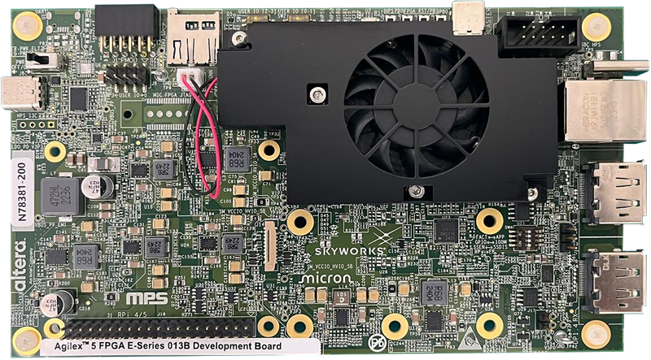

<h4>MSEL Setting</h4>
The default configuration is AS x4 (Fast) using a 512 Mb QSPI flash device.

### GHRD Overview

The Golden Hardware Reference Design is an important part of the GSRD and consists of the following components:

- Hard Processor System (HPS)
  - Dual core Arm Cortex-A55 processor
  - HPS Peripheral and I/O:
    - Micro SD Card
    - EMAC
    - MDIO
    - JTAG
    - I2C
    - UART
    - USB
    - GPIO
- Multi-Ported Front End (MPFE) for HPS External Memory Interface (EMIF)
- FPGA Peripherals connected to Lightweight HPS-to-FPGA (LWH2F) AXI Bridge and JTAG to Avalon Master Bridge
  - Two user LED outputs
  - Four user DIP switch inputs
  - Two user push-button inputs
  - System ID
- FPGA Peripherals connected to HPS-to-FPGA (H2F) AXI Bridge
  - 256KB of FPGA on-chip memory

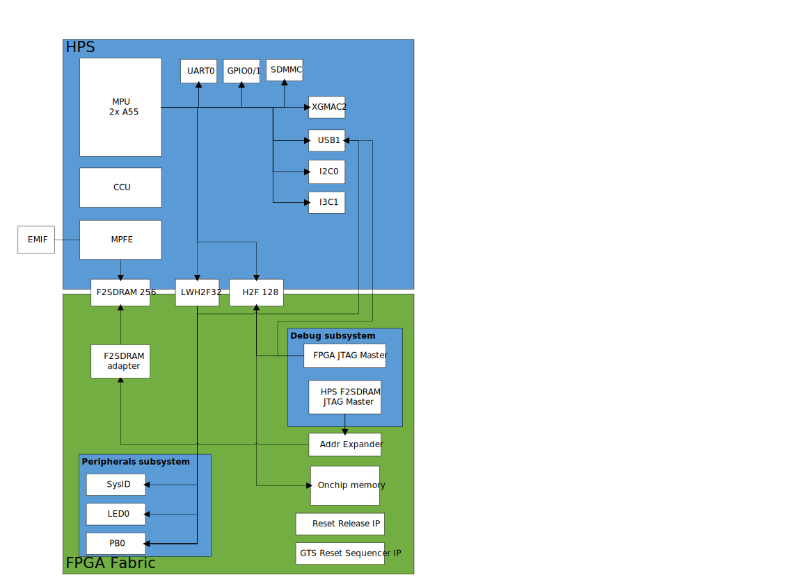

<h4> MPU Address Maps</h4>

This section presents the address maps as seen from the MPU side.  
<h5> HPS-to-FPGA Address Map</h5>

The three FPGA windows in the MPU address map provide access to 256 GB of FPGA space. First window is 1 GB from 00_4000_0000, second window is 15 GB from 04_4000_0000, third window is 240 GB from 44_0000_0000. The following table lists the offset of each peripheral from the HPS-to-FPGA bridge in the FPGA portion of the SoC.

| Peripheral | Address Offset | Size (bytes) | Attribute |
| :-- | :-- | :-- | :-- |
| onchip_memory2_0 | 0x0 | 256K | On-chip RAM as scratch pad |

<h5>Lightweight HPS-to-FPGA Address Map</h5>

The the memory map of system peripherals in the FPGA portion of the SoC as viewed by the MPU, which starts at the lightweight HPS-to-FPGA base address of 0x00_2000_0000, is listed in the following table.

| Peripheral | Address Offset | Size (bytes) | Attribute |
| :-- | :-- | :-- | :-- |
| sysid | 0x0001_0000 | 32 | Unique system ID   |
| led_pio | 0x0001_0080 | 16 | LED outputs   |
| button_pio | 0x0001_0060 | 16 | Push button inputs |

<h5>JTAG Master Address Map</h5>

There are three JTAG master interfaces in the design, one for accessing non-secure peripherals in the FPGA fabric, and another for accessing secure peripheral in the HPS through the FPGA-to-HPS Interface and another for FPGA fabric to SDRAM.

The following table lists the address of each peripheral in the FPGA portion of the SoC, as seen through the non-secure JTAG master interface.

| Peripheral | Address Offset | Size (bytes) | Attribute |
| :-- | :-- | :-- | :-- |
| onchip_memory2_0 | 0x0004_0000 | 256K | On-chip RAM |
| sysid | 0x0001_0000 | 32 | Unique system ID |
| led_pio | 0x0001_0080 | 16 | LED outputs |
| button_pio | 0x0001_0060 | 16 | Push button inputs |
| dipsw_pio | 0x0001_0070 | 16 | DIP switch inputs |

<h4> Interrupt Routing</h4>

The HPS exposes 64 interrupt inputs for the FPGA logic. The following table lists the interrupt connections from soft IP peripherals to the HPS interrupt input interface.
      
| Peripheral | Interrupt Number | Attribute |
| :-- | :-- | :-- |
| button_pio | f2h_irq0[1] | 2 Push button inputs |

## Exercising Prebuilt Binaries

This section presents how to use the prebuilt binaries included with the GSRD release.

### Configure Board

1\. Leave all jumpers and switches in their default configuration.

2\. Connect Type-C USB cable from Type-C USB connector to host PC. This is used for the HPS serial console and JTAG communication.

3\. Connect Ethernet cable from HPS Board to an Ethernet switch connected to local network. Local network must provide a DCHP server.

**Note:** Please refer to [Powering Up the Development Board](https://www.intel.com/content/www/us/en/docs/programmable/860700/current/powering-up-the-development-board.html)  for instructions about how to powering up correctly the development kit.

### Configure Serial Console

All the scenarios included in this release require a serial connection. This section presents how to configure the serial connection.

1\. Install a serial terminal emulator application on your host PC:  

* For Windows: TeraTerm or PuTTY are available
* For Linux: GtkTerm or Minicom are available

2\. Power down your board if powered up. This is important, as once powered up, with the Type-C USB cable connected, a couple more USB serial ports will enumerate, and you may choose the wrong port.

3\. Connect Type-C USB cable from the Type-C USB connector on the development board to the host PC

4\. On the host PC, an USB serial port will enumerate. On Windows machines it will be something like `COM<number>`, while on Linux machines it will be something like `/dev/tty/USB0`.

5\. Configure your serial terminal emulator to use the following settings:  

* Serial port: as mentioned above
* Baud rate: 115,200
* Data bits: 8
* Stop bits: 1
* CRC: disabled
* Hardware flow control: disabled

6\. Connect your terminal emulator


#### Booting from SD Card
<hr/>
<h5 id="write-sd-card-image">Write SD Card</h5>

1\. Download SD card image from the prebuilt binaries [https://releases.rocketboards.org/2026.04/gsrd/agilex5_dk_a5e013bm16aea_gsrd/sdimage.tar.gz](https://releases.rocketboards.org/2026.04/gsrd/agilex5_dk_a5e013bm16aea_gsrd/sdimage.tar.gz) and extract the archive, obtaining the file `gsrd-console-image-agilex5.wic`.

2\. Write the gsrd-console-image-agilex5.wic. SD card image to the micro SD card using the included USB writer in the host computer:

- On Linux, use the `dd` utility as shown next:
```bash
# Determine the device asociated with the SD card on the host computer.	
cat /proc/partitions
# This will return for example /dev/sdx
# Use dd to write the image in the corresponding device
sudo dd if=gsrd-console-image-agilex5.wic of=/dev/sdx bs=1M
# Flush the changes to the SD card
sync
```
- On Windows, use the Win32DiskImager program, available at [https://sourceforge.net/projects/win32diskimager](https://sourceforge.net/projects/win32diskimager). For this, first rename the gsrd-console-image-agilex5.wic to an .img file (sdcard.img for example) and write the image as shown in the next figure:

 

<h5>Write QSPI Flash</h5>

1\. Power down board

2\. Power up the board

3\. Download and extract the JIC image, then write it to QSPI
```bash
wget https://releases.rocketboards.org/2026.04/gsrd/agilex5_dk_a5e013bm16aea_gsrd/ghrd_a5ed013bm16ae4scs.hps.jic.tar.gz
tar xf ghrd_a5ed013bm16ae4scs.hps.jic.tar.gz
jtagconfig --setparam 1 JtagClock 16M
quartus_pgm -c 1 -m jtag -o "pvi;ghrd_a5ed013bm16ae4scs.hps.jic"
```

<h5>Boot Linux</h5>

1\. Power down board

2\. Power up the board

3\. Wait for Linux to boot, use `root` as user name, and no password wil be requested.

<h5>Run Sample Applications</h5>

1\. Boot to Linux

2\. Change current folder to `alteraFPGA` folder
```bash
cd alteraFPGA
```
3\. Run the hello world application
```bash
./hello
```
4\. Run the `syscheck` application
```bash
./syscheck
```
Press `q` to exit the `syscheck` application.

<h5>Control LEDs</h5>

1\. Boot to Linux

2\. Control LEDs by using the following sysfs entries:

* /sys/class/leds/fpga_led0/brightness
* /sys/class/leds/fpga_led1/brightness
* /sys/class/leds/hps_led0/brightness
* /sys/class/leds/hps_led1/brightness

using commands such as:
```bash
cat /sys/class/leds/fpga_led0/brightness
echo 0 > /sys/class/leds/fpga_led0/brightness
echo 1 > /sys/class/leds/fpga_led1/brightness
```

Because of how the LEDs are connected, for the above commands `0` means LED is turned on, `1` means LED is turned off.

<h5>Connect to Board Using SSH</h5>

1\. Boot to Linux  

2\. Determine the board IP address using the `ifconfig` command:
```bash
root@agilex5:~# ifconfig
eth0: flags=4163<UP,BROADCAST,RUNNING,MULTICAST>  mtu 1500
        inet 10.244.216.200  netmask 255.255.255.224  broadcast 10.244.216.223
        inet6 fe80::305b:c2ff:fee5:f2ec  prefixlen 64  scopeid 0x20<link>
        ether 32:5b:c2:e5:f2:ec  txqueuelen 1000  (Ethernet)
        RX packets 8  bytes 1371 (1.3 KiB)
        RX errors 0  dropped 0  overruns 0  frame 0
        TX packets 29  bytes 5734 (5.5 KiB)
        TX errors 0  dropped 0 overruns 0  carrier 0  collisions 0
        device interrupt 23  base 0x8000

lo: flags=73<UP,LOOPBACK,RUNNING>  mtu 65536
        inet 127.0.0.1  netmask 255.0.0.0
        inet6 ::1  prefixlen 128  scopeid 0x10<host>
        loop  txqueuelen 1000  (Local Loopback)
        RX packets 252  bytes 17530 (17.1 KiB)
        RX errors 0  dropped 0  overruns 0  frame 0
        TX packets 252  bytes 17530 (17.1 KiB)
        TX errors 0  dropped 0 overruns 0  carrier 0  collisions 0
```
3\. Connect to the board over SSH using `root` username, no password will be requested:
```bash
ssh root@10.244.216.200
```
**Note**: Make sure to replace the above IP address to the one matching the output of running `ifconfig` on youir board.

<h5>Visit Board Web Page</h5>

1\. Boot to Linux  

2\. Determine board IP address using `ifconfig` like in the previous scenario  

3\. Start a web browser and enter the IP address in the address bar  

4\. The web browser will display a page served by the web server running on the board.  

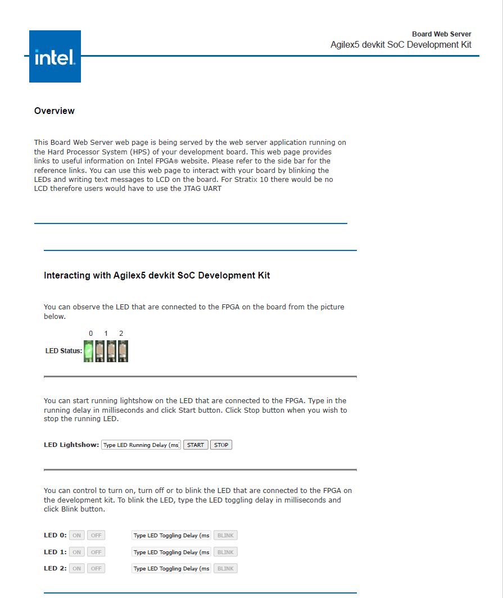

* You will able to see which LED are ON and OFF in **LED Status**.
* You can **Start** and **Stop** the LED from scrolling. Set the delay(ms) in the **LED Lightshow** box. 
* You can controll each LED with ON and OFF button.
* Blink each LED by entering the delay(ms) and click on the **BLINK** button.

#### Booting from QSPI
<hr/>
This section presents how to boot from QSPI. One notable aspect is that you need to wipe the SD card partitioning information, as otherwise U-Boot SPL could find a valid SD card image, and try to boot from that first.

<h5>Wipe SD Card</h5>

Either write 1MB of zeroes at the beginning of the SD card, or remove the SD card from the HPS Daughter Card. You can use `dd` on Linux, or `Win32DiskImager` on Windows to achieve this.

<h5>Write QSPI Flash</h5>

1\. Power down board

2\. Power up the board

3\. Download and extract the JIC image, then write it to QSPI:
```bash
wget https://releases.rocketboards.org/2026.04/qspi/agilex5_dk_a5e013bm16aea_qspi/ghrd_a5ed013bm16ae4scs.hps.jic.tar.gz
tar xf ghrd_a5ed013bm16ae4scs.hps.jic.tar.gz
jtagconfig --setparam 1 JtagClock 16M
quartus_pgm -c 1 -m jtag -o "pvi;agilex_flash_image.hps.jic"
```

<h5>Boot Linux</h5>

1\. Power down board

2\. Power up the board

3\. Wait for Linux to boot, use `root` as user name, and no password wil be requested.

**Note**: On first boot, the UBIFS rootfilesystem is initialized, and that takes a few minutes. This will not happen on next reboots. See a sample log below:

```
[   12.837281] UBIFS (ubi0:4): Mounting in unauthenticated mode
[   12.843233] UBIFS (ubi0:4): background thread "ubifs_bgt0_4" started, PID 77
[   12.854642] UBIFS (ubi0:4): start fixing up free space
[   20.692155] random: crng init done
[   42.087027] UBIFS (ubi0:4): free space fixup complete
[   42.210248] UBIFS (ubi0:4): UBIFS: mounted UBI device 0, volume 4, name "rootfs"
[   42.217667] UBIFS (ubi0:4): LEB size: 65408 bytes (63 KiB), min./max. I/O unit sizes: 8 bytes/256 bytes
[   42.227062] UBIFS (ubi0:4): FS size: 43365504 bytes (41 MiB, 663 LEBs), max 8600 LEBs, journal size 8650240 bytes (8 MiB, 133 LEBs)
[   42.238870] UBIFS (ubi0:4): reserved for root: 0 bytes (0 KiB)
[   42.244702] UBIFS (ubi0:4): media format: w4/r0 (latest is w5/r0), UUID 86831E0C-2E6F-439D-99EB-139B00E31D93, small LPT model
[   42.321834] VFS: Mounted root (ubifs filesystem) on device 0:22.

```

## Build GSRD 2.0 Binaries

Kas is a Python-based lightweight build orchestration layer on top of BitBake/Yocto. Kas allows you to define your build environment in a YAML manifest, so you can perform checkout, environment setup, configuration, and build invocation with a single command. 

In order to simplify the GSRD build process, Altera introduces GSRD 2.0, which uses [Kas](https://github.com/siemens/kas). In this release, the HPS Enablement daughter card is supported, for both booting from SD card and QSPI. In the future, more boards and daughter cards will be supported.

Kas replaces the [gsrd-socfpga repository](https://github.com/altera-fpga/gsrd-socfpga), providing a more maintainable build description. It offers improved reproducibility, reduced setup friction, and a clearer abstraction for managing multiple layers, revisions, and configuration fragments. Once all GSRD variations move to Kas, the gsrd-soc-fpga repository and GSRD build script will be retired.

The GSRD 2.0 software source code is released inside the [software/yocto_linux](https://github.com/altera-fpga/agilex5e-ed-gsrd/tree/QPDS26.1_REL_GSRD_PR/a5ed013-devkit-oobe/baseline-a55/software/yocto_linux) directory of the Agilex 5 E-Series Golden Hardware Reference Design (GHRD). Accessing the link will display a README page with details on how the GSRD 2.0 is organized around the Kas tool.

For more details about Kas, refer to the official documentation at [https://kas.readthedocs.io/en/latest/](https://kas.readthedocs.io/en/latest/).

### Kas Build Prerequisites

The same [prerequisites](#yocto-build-prerequisites) as for regular Yocto build are required. 

1\. Make sure you have Yocto system requirements met: [https://docs.yoctoproject.org/scarthgap/ref-manual/system-requirements.html#supported-linux-distributions](https://docs.yoctoproject.org/scarthgap/ref-manual/system-requirements.html#supported-linux-distributions).

The command to install the required packages on Ubuntu 22.04 is:

```bash
sudo apt-get update
sudo apt-get upgrade
sudo apt-get install openssh-server mc libgmp3-dev libmpc-dev gawk wget git diffstat unzip texinfo gcc \
build-essential chrpath socat cpio python3 python3-pip python3-pexpect xz-utils debianutils iputils-ping \
python3-git python3-jinja2 libegl1-mesa libsdl1.2-dev pylint xterm python3-subunit mesa-common-dev zstd \
liblz4-tool git fakeroot build-essential ncurses-dev xz-utils libssl-dev bc flex libelf-dev bison xinetd \
tftpd tftp nfs-kernel-server libncurses5 libc6-i386 libstdc++6:i386 libgcc++1:i386 lib32z1 \
device-tree-compiler curl mtd-utils u-boot-tools net-tools swig -y
```

On Ubuntu 22.04 you will also need to point the /bin/sh to /bin/bash, as the default is a link to /bin/dash:

```bash
 sudo ln -sf /bin/bash /bin/sh
```

**Note**: You can also use a Docker container to build the Yocto recipes, refer to https://rocketboards.org/foswiki/Documentation/DockerYoctoBuild for details. When using a Docker container, it does not matter what Linux distribution or packages you have installed on your host, as all dependencies are provided by the Docker container.

In addition to the above, you must also install `python3-newt`, and `python3.10-venv` with a command like this:

```bash
sudo apt-get install python3-newt python3.10-venv
```

### HPS Enablement Board

#### Build SD Card Binaries


<h5>Setup Environment</h5>

1\. Create the top folder to store all the build artifacts:


```bash
sudo rm -rf agilex5-013b_gsrd_20.enablement_sd
mkdir agilex5-013b_gsrd_20.enablement_sd
cd agilex5-013b_gsrd_20.enablement_sd
export TOP_FOLDER=`pwd`
```


Enable Quartus tools to be called from command line:


```bash
source ~/altera_pro/26.1/qinit.sh
```


<h5>Build Hardware Design</h5>


```bash
cd $TOP_FOLDER
rm -rf agilex5_soc_devkit_ghrd && mkdir agilex5_soc_devkit_ghrd && cd agilex5_soc_devkit_ghrd
wget https://github.com/altera-fpga/agilex5e-ed-gsrd/releases/download/QPDS26.1_REL_GSRD_PR/a5ed013-devkit-oobe-baseline-a55.zip
unzip a5ed013-devkit-oobe-baseline-a55.zip
rm -f a5ed013-devkit-oobe-baseline-a55.zip
make baseline_a55-install
```


The following files are created:

* `$TOP_FOLDER/agilex5_soc_devkit_ghrd/output_files/baseline_a55.sof`
* `$TOP_FOLDER/agilex5_soc_devkit_ghrd/install/binaries/ghrd.core.rbf`


<span style="color: red;">**Important Note:**</span> Please refer to [Migrate Hardware Design from GSRD 1.0 to GSRD 2.0](#migrate-hardware-design-from-gsrd-10-to-gsrd-20) section for important information about how to migrate from a hardware design based on GSRD 1.0 to GSRD 2.0.

<h5>Build Yocto Using Kas</h5>


1\. Create and enter a new Python virtual environment:


```bash
cd $TOP_FOLDER/agilex5_soc_devkit_ghrd/software/yocto_linux
python3 -m venv venv --system-site-packages
source venv/bin/activate
pip install --upgrade pip
pip install kas
pip install --upgrade kas
pip install kconfiglib
```


2\. Copy the core.rbf file to where Kas expects it to be:


```bash
cp $TOP_FOLDER/agilex5_soc_devkit_ghrd/install/binaries/ghrd.core.rbf \
   $TOP_FOLDER/agilex5_soc_devkit_ghrd/software/yocto_linux/meta-custom/recipes-fpga/fpga-bitstream/files/baseline_a55_hps_debug.core.rbf
```


3\. Build Yocto with Kas:


```bash
kas build kas.yml gsrd-console-image
```


The following relevant files are created in `$TOP_FOLDER/agilex5_soc_devkit_ghrd/software/yocto_linux/build/tmp/deploy/images/agilex5e_013b/`:

* `gsrd-console-image-agilex5e-013b.rootfs.wic`
* `u-boot-spl-dtb.hex`

> **Note**: If you experience build failures related to file-locks, you can work around these by reducing the parallelism of your build by running the following commands before running `kas`:

```bash
export PARALLEL_MAKE="-j 8"
export BB_NUMBER_THREADS="8"
export BB_ENV_PASSTHROUGH_ADDITIONS="$BB_ENV_PASSTHROUGH_ADDITIONS PARALLEL_MAKE BB_NUMBER_THREADS"
```


<h5>Build QSPI Image</h5>


```bash
cd $TOP_FOLDER
rm -f baseline_a55.hps.jic baseline_a55.core.rbf
quartus_pfg \
-c agilex5_soc_devkit_ghrd/output_files/baseline_a55.sof baseline_a55.jic \
-o device=QSPI512 \
-o flash_loader=A5ED013BM16AE4SCS \
-o hps_path=agilex5_soc_devkit_ghrd/software/yocto_linux/build/tmp/deploy/images/agilex5e_013b/u-boot-spl-dtb.hex \
-o mode=ASX4 \
-o hps=1
```


The following file is created:

* `$TOP_FOLDER/baseline_a55.hps.jic`


#### Build QSPI Binaries


<h5>Setup Environment</h5>

1\. Create the top folder to store all the build artifacts:


```bash
sudo rm -rf agilex5-013b_gsrd_20.enablement_qspi
mkdir agilex5-013b_gsrd_20.enablement_qspi
cd agilex5-013b_gsrd_20.enablement_qspi
export TOP_FOLDER=`pwd`
```


Enable Quartus tools to be called from command line:


```bash
source ~/altera_pro/26.1/qinit.sh
```


<h5>Build Hardware Design</h5>


```bash
cd $TOP_FOLDER
rm -rf agilex5_soc_devkit_ghrd && mkdir agilex5_soc_devkit_ghrd && cd agilex5_soc_devkit_ghrd
wget https://github.com/altera-fpga/agilex5e-ed-gsrd/releases/download/QPDS26.1_REL_GSRD_PR/a5ed013-devkit-oobe-baseline-a55.zip
unzip a5ed013-devkit-oobe-baseline-a55.zip
rm -f a5ed013-devkit-oobe-baseline-a55.zip
make baseline_a55-build
make baseline_a55-install-core-rbf
cd ..
```


The following files are created:

* `$TOP_FOLDER/agilex5_soc_devkit_ghrd/output_files/baseline_a55.sof`
* `$TOP_FOLDER/agilex5_soc_devkit_ghrd/install/binaries/ghrd.core.rbf`


<span style="color: red;">**Important Note:**</span> Please refer to [Migrate Hardware Design from GSRD 1.0 to GSRD 2.0](#migrate-hardware-design-from-gsrd-10-to-gsrd-20) section for important information about how to migrate from a hardware design based on GSRD 1.0 to GSRD 2.0.

<h5>Build Yocto Using Kas</h5>


1\. Create and enter a new Python virtual environment. A virtual environment allows you to install packages without impacting your global environment:


```bash
cd $TOP_FOLDER/agilex5_soc_devkit_ghrd/software/yocto_linux
python3 -m venv venv --system-site-packages
source venv/bin/activate
pip install --upgrade pip
pip install kas
pip install --upgrade kas
pip install kconfiglib
```


2\. Copy the core.rbf file to where Kas expects it to be:


```bash
cp $TOP_FOLDER/agilex5_soc_devkit_ghrd/install/binaries/ghrd.core.rbf \
   $TOP_FOLDER/agilex5_soc_devkit_ghrd/software/yocto_linux/meta-custom/recipes-fpga/fpga-bitstream/files/baseline_a55_hps_debug.core.rbf
```


3\. Build Yocto with Kas:


```bash
kas build kas.yml:qspi_boot_src.yml
```


> **Note**: If you wish to customize your Linux image, you can use the `kas menu` command instead. The options here are explained in section [Customizing Yocto Kas Build](#customizing-yocto-kas-build) below.

The following relevant files are created in `$TOP_FOLDER/agilex5_soc_devkit_ghrd/software/yocto_linux/build/tmp/deploy/images/agilex5e_013b/`:

* `u-boot-spl-dtb.hex`
* `u-boot.itb`
* `core-image-minimal-agilex5e-013b.rootfs_nor.ubifs`
* `kernel.itb`
* `boot.scr.uimg`


<h5>Build QSPI Image</h5>


1\. Create the folder to contain all the files:

```bash
cd $TOP_FOLDER
sudo rm -rf qspi_boot
mkdir qspi_boot
cd qspi_boot
```

2\. Get the `ubinize_nor.cfg` file which contains the details on how to build the `root.ubi` volume, and `qspi_boot.pfg` which contains the instructions for Programming File Generator on how to create the .jic filem and the `uboot.env` containing the U-Boot environment:

```bash
wget https://releases.rocketboards.org/2026.04/qspi/agilex5_dk_a5e013bm16aea_qspi.baseline-a55/ubinize_nor.cfg
wget https://releases.rocketboards.org/2026.04/qspi/agilex5_dk_a5e013bm16aea_qspi.baseline-a55/qspi_boot.pfg
wget https://releases.rocketboards.org/2026.04/qspi/agilex5_dk_a5e013bm16aea_qspi.baseline-a55/uboot.env
```

3\. Link to the files that are needed from building the hardware design, and yocto:

```bash
ln -s $TOP_FOLDER/agilex5_soc_devkit_ghrd/output_files/baseline_a55.sof ghrd.sof
ln -s $TOP_FOLDER/agilex5_soc_devkit_ghrd/software/yocto_linux/build/tmp/deploy/images/agilex5e_013b/u-boot-spl-dtb.hex .
ln -s $TOP_FOLDER/agilex5_soc_devkit_ghrd/software/yocto_linux/build/tmp/deploy/images/agilex5e_013b/u-boot.itb u-boot.bin
ln -s $TOP_FOLDER/agilex5_soc_devkit_ghrd/software/yocto_linux/build/tmp/deploy/images/agilex5e_013b/core-image-minimal-agilex5e_013b.rootfs_nor.ubifs core-image-minimal-agilex5e.rootfs_nor.ubifs
ln -s $TOP_FOLDER/agilex5_soc_devkit_ghrd/software/yocto_linux/build/tmp/deploy/images/agilex5e_013b/kernel.itb .
ln -s $TOP_FOLDER/agilex5_soc_devkit_ghrd/software/yocto_linux/build/tmp/deploy/images/agilex5e_013b/boot.scr.uimg .

```


4\. Create the `root.ubi` file and rename it to `hps.bin` as Programming File Generator needs the `.bin` extension:

```bash
ubinize -o root.ubi -p 65536 -m 1 -s 1 ubinize_nor.cfg
ln -s root.ubi hps.bin
```

5\. Create the JIC file:

```bash
quartus_pfg -c qspi_boot.pfg
```


The following file will be created:

* `$TOP_FOLDER/qspi_boot/qspi_boot.hps.jic`


### Additional Guides


#### Customize Kas Build

The `kas.yml` file is the central configuration file used by Kas to define all components required for a reproducible Yocto build environment. It specifies the repositories, branches, layers, and build targets, as well as optional environment variables and machine settings. By consolidating this information into a single YAML file, `kas.yml` eliminates manual setup steps and ensures that builds can be easily replicated across systems or shared with collaborators. This makes it an essential part of version-controlled, automated build workflows.

Kas also offers Kconfig-based customizations to provide a flexible and user-friendly configuration experience. This enables you to select repositories, layers, and build targets through a structured menu interface instead of editing YAML files directly. This approach combines the clarity and reproducibility of Kas with the modular configurability of the Linux kernel’s Kconfig system, making it easier to tailor builds for different platforms or use cases while maintaining a consistent and automated setup.

Review the kas.yml file, the Kconfig options and associated documentation at [https://github.com/altera-fpga/agilex5e_013b-ed-gsrd/tree/QPDS26.1_REL_GSRD_PR/a5ed013-devkit-oobe/baseline-a55/software/yocto_linux](https://github.com/altera-fpga/agilex5e_013b-ed-gsrd/tree/QPDS26.1_REL_GSRD_PR/a5ed013-devkit-oobe/baseline-a55/software/yocto_linux).

In the build instructions presented in [Rebuilding GSRD 2.0 Binaries](#rebuilding-gsrd-20-binaries), we did not use the Kconfig options, only the default options from `kas.yml` were used. This section shows how you can use `kas menu` to customize the build.

When using `kas menu`, the initial settings from `kas.yml` are customized with the user selected options through Kconfig, and are saved to a file called `.config.yaml` which is then used for build purposes.


1\. Build the hardware design as mentioned before. Note the same hardware design is used for both booting from SD card and booting from QSPI.

2\. Copy the core.rbf file to where Kas needs it to be. Note that the filename when using Kconfig is different than when using the `kas.yml` alone (`top.core.rbf` vs `ghrd.core.rbf`)

```bash
cp $TOP_FOLDER/agilex5_soc_devkit_ghrd/install/binaries/ghrd.core.rbf \
   $TOP_FOLDER/agilex5_soc_devkit_ghrd/software/yocto_linux/meta-custom/recipes-fpga/fpga-bitstream/files/top.core.rbf
```

3\. Create an enter a new Python virtual environment, not to interfere with the current system Python packages:

```bash
cd $TOP_FOLDER/agilex5_soc_devkit_ghrd/software/yocto_linux
python3 -m venv venv --system-site-packages
source venv/bin/activate
pip install --upgrade pip
pip install kas
pip install --upgrade kas
pip install kconfiglib
```

4\. Run `kas menu`:

```bash
kas menu
```

5\. You will be presented with a Kconfig text menu, similar to the ones from Linux Kernel & U-Boot:

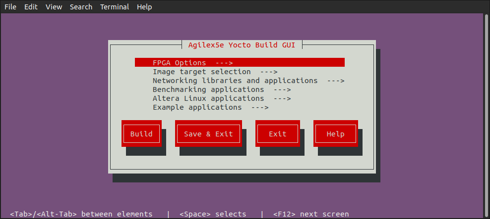

6\. Go to **FPGA Options** screen and make any changes you desire:

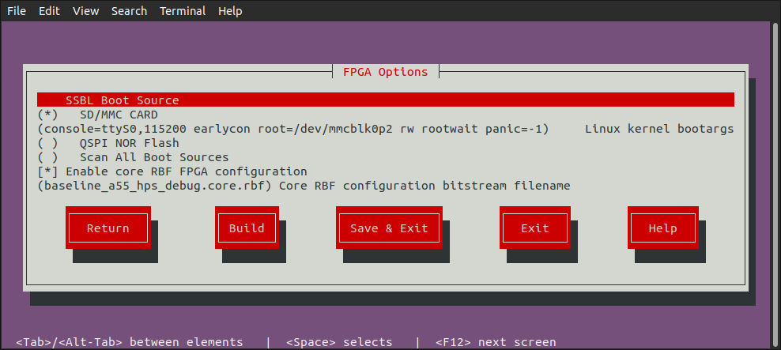

7\. Go to **Image Target Selection** screen and select which images to be built:

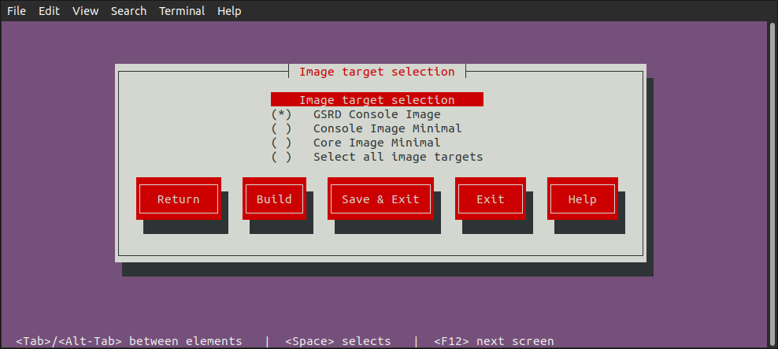

8\. Go to **Networking Libraries and Apllications** screen and select desired options:

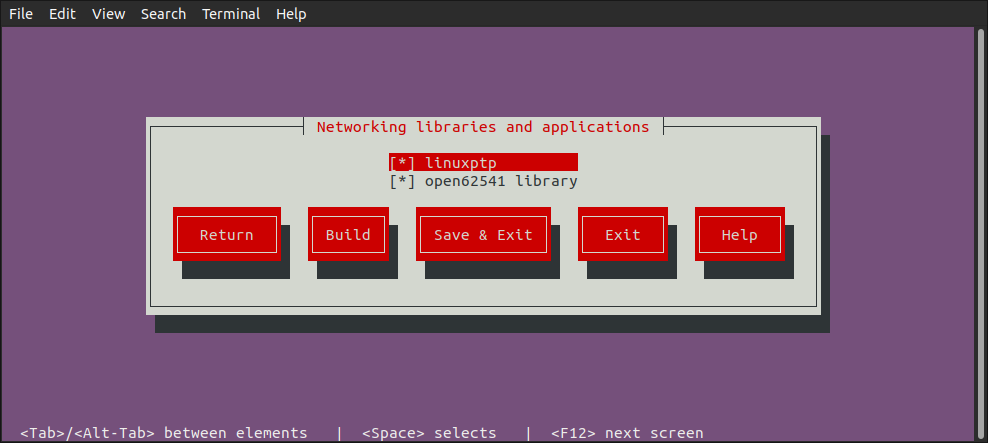

9\. Go to **Benchmarking Applications** screen and select the desired applications:

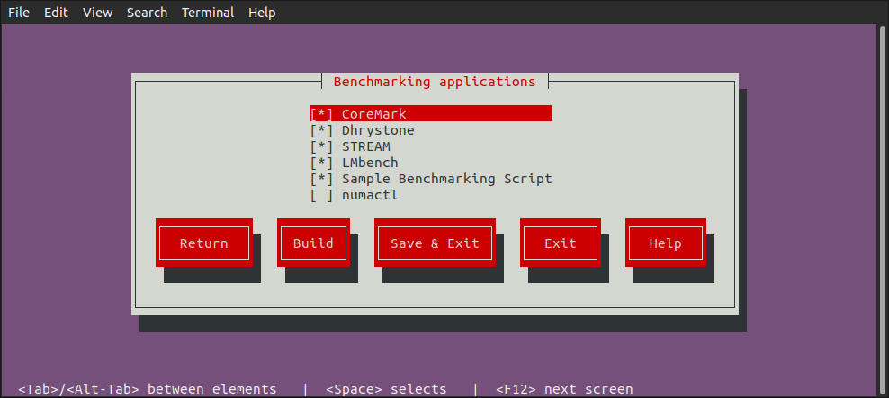

10\. Go to **Altera Linux Applications** screen and select the desired applications:

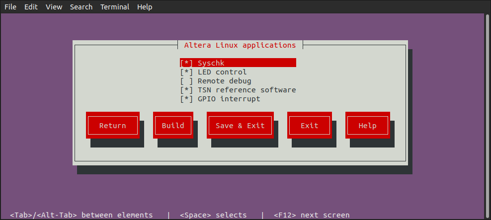

11\. Go to **Example Applications** screen and select what you need:

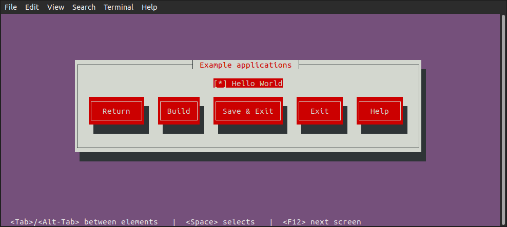

12\. Once you have selected all the options you want, you can clik the **Build** button to start the build process:

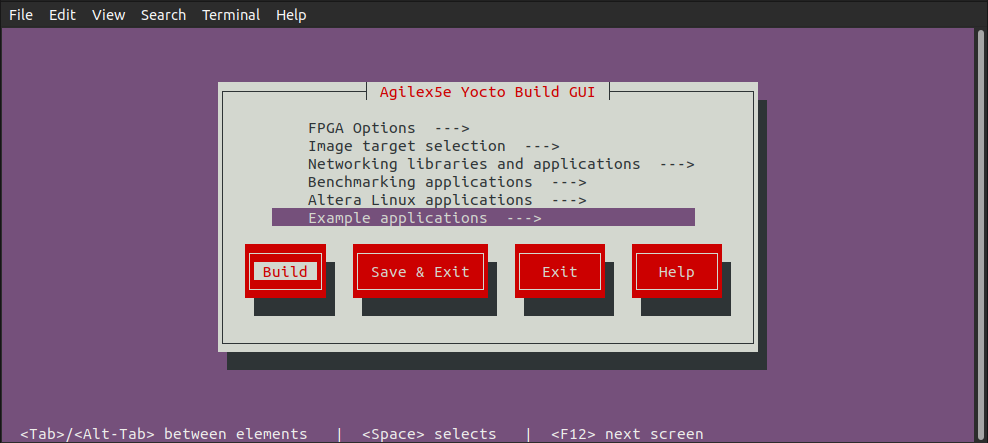

#### Build Kas Interactively

In addition to using `kas build` to build Yocto based on the `kas.yml` and `kas menu` to build Yocto based on Kconfig options selected from the text GUI, there is also the `kas shell` option, which allows you to build Yocto interactively.


1\. Build the hardware design as mentioned before. Note the same hardware design is used for both booting from SD card and booting from QSPI.

2\. Copy the core.rbf file to where bitbake needs it to be. 

```bash
cp $TOP_FOLDER/agilex5_soc_devkit_ghrd/install/binaries/ghrd.core.rbf \
   $TOP_FOLDER/agilex5_soc_devkit_ghrd/software/yocto_linux/meta-custom/recipes-fpga/fpga-bitstream/files/baseline_a55_hps_debug.core.rbf
```

3\. Create an enter a new Python virtual environment, not to interfere with the current system Python packages:

```bash
cd $TOP_FOLDER/agilex5_soc_devkit_ghrd/software/yocto_linux
python3 -m venv venv --system-site-packages
source venv/bin/activate
pip install --upgrade pip
pip install kas
pip install --upgrade kas
pip install kconfiglib
```

4\. You can optionally use `kas menu` to change settings, and at the end press the **Save** button instead of the **Build** button. This will save the custom configuration in the file `.config.yaml`.

5\. Run `kas shell`, there are several options:

| Command | Description |
| :-- | :-- |
| `kas shell` | Use the configuration from the `.config.yaml ` resulted from using `kas menu` |
| `kas shell kas.yml` | Use the default configuration for SD card boot |
| `kas shell kas.yml:qspi_boot_src.yml` | Use the default configuration for QSPI boot |

6\. Use regular `bitbake` commands. For example to simply build the rootfs, use:

```bash
bitbake core-image-minimal
bitbake console-image-minimal
bitbake gsrd-console-image
```

#### Migrate Hardware Design from GSRD 1.0 to GSRD 2.0

If your hardware design was originally based on the HPS Legacy System Example Design 1.0, and you want to migrate it to  be used with HPS Baseline System Example Design 2.0, you must ensure that the **JTAG user code** parameter gets defined  with a value of 0 or not defined (FFFFFFFF). This parameter can be found in Quartus Pro from the **Assignments** >> **Device** >> **Device and Pin Options** >> **General** menu. Alternatively, this parameter can also be defined in the **.qsf** file  in your Quartus project directory as **STRATIX_JTAG_USER_CODE**, so you can set this parameter to 0 or just delete the assignment line. This change is needed because in the HPS Legacy System Example Design 1.0, this parameter is used to indicate to U-Boot which configuration components (kernel image, device tree and 2nd phase fabric design) need to be loaded from the kernel.itb binary. The most relevant configurations supported in HPS Legacy System Example Design 1.0 were  for booting from OOO daughter card, booting from eMMC/NAND daughter card and exercise Partial Reconfiguration. In each one of these configurations a specific value in the **JTAG user code**/**STRATIX_JTAG_USER_CODE** was used. In the case of HPS Baseline System Example Design 2.0, the valid value for this parameter are:

* 0:  Load kernel image, device tree and 2nd phase fabric design from kernel.itb. FPGA is configured.
* 1: Load kernel image and device tree from kernel.itb. FPGA is not configured. Used for debug purposes.
* FFFFFFFF or undefined: U-Boot assumes that the parameter is 0 and performs the actions described above.

For any other value, U-Boot will fail to load a valid set of Linux components and 2nd phase fabric design.  

#### Using Beanchmarking Applications

The HPS Baseline System Example Design provides you a set of Linux benchmarking applications that allow you to evaluate the performance of your system. These applications aim to evaluate areas such a CPUs performance and memory transfer performance among others.

You can control the inclusion/exclusion of each one of these applications individually using the KAS framework.

**Option 1. Use the Kas menu**

After you obtain the HPS Baseline System Example Design source content from the corresponding device HPS Baseline System Example Design repository and before you build Yocto with Kas, open the Kas menu with:

```bash
$ cd software/yocto_linux/
$ kas menu
```
This opens the Kas graphical interface menu. Navigate to the **Benchmarking applications** option. This switches to a menu window that allows you to select the benchmarking applications that you want to include in your Linux file system.


Once you complete the selection of the application, go to the **Save and Exit** option.

**Option 2.  Use the Kconfig Configuration file**

Alternatively, you can add or remove the benchmarking applications by manually editing Kas configuration file **software/yocto_linux/kas/gsrd/Kconfig.** Each one of these applications is associated with a **config** that you can set to **‘y’** to include it or with **‘n’** to exclude this. An extract  of this configuration file is shown next. After editing the file you must save it to keep these changes.

```bash
if GSRD_CONSOLE_IMAGE_BUILD
menu "Benchmarking applications"

config APP_COREMARK
    bool "CoreMark"
    default y
    help
      CoreMark - EEMBC benchmark for evaluating embedded CPU performance through lightweight core tests.

config BENCHMARK_APP_COREMARK
    string
    default "true" if APP_COREMARK
    default "false" if !APP_COREMARK
:
:
```

After you make your choose about the applications to be included or excluded, you can continue with the regular Kas Yocto Build.

> **NOTE:** By default, all of the benchmarking applications are already enabled to be built and added in to the Linux file system. You still can use any of the 2 options above to change this default configuration. Also, it is very important to note that **the benchmarking applications are only available when the target image is the gsrd-console-image** . This means that you will not see them when the target is Console Image Minimal (console-image-minimal) nor Core Image Minimal (core-image-minimal). Please observe the implementation of the **software/yocto_linux/kas/gsrd/Kconfig** and the [gsrd-console-image.bb](https://github.com/altera-fpga/meta-altera-fpga/tree/scarthgap/meta-altera-platform/recipes-images/poky/gsrd-console-image.bb) recipe.

Once your binaries build finishes, you can proceed to program these in to your dev kit.  After your board boots to Linux shell, you will see the benchmarking applications available in the file system under the **/bin/** directory, meaning that you can actually exercise these applications from any path by just entering the application name similarly to how you can run any other Linux command.

The following table provides a brief description of the Benchmarking Scripts available as part of the HPS Baseline System Example Design:

| Application         | Command                      | Description                          | Available<br> by default |
| :--------------------- | :----------------------- | :------------------------------------------------------- | :------------------ |
|CoreMark |*coremark* | CoreMark is tailored for benchmarking embedded CPUs. It tests core functionalities such as list processing, matrix manipulation, state machines, and cyclic redundancy checks. The main metric used by CoreMark is iterations per second, which quantifies how many times the benchmark workload can be completed in one second.<br> https://www.eembc.org/coremark/ |  Yes |
|Dhrystone |*dhry* |Dhrystone is a synthetic benchmark designed to measure CPU integer performance. It evaluates the processor's speed by executing non-floating-point instructions and reports results using the metric MIPS (Million Instructions Per Second), providing a standardized measure of general CPU throughput. https://github.com/sifive/benchmark-dhrystone | Yes |
|STREAM | *stream*<br>*stream.lmbench*<br>*stream.mccalpin* | STREAM is a memory bandwidth benchmark that measures how quickly data can be transferred between memory and the CPU. It focuses on simple vector operations—Copy, Scale, Add, and Triad—to assess the sustainable memory transfer rates. Memory operations are done on a large data array (10000000 64-bit doubles) so that memory transfers do not involve the cache. The metric reported by STREAM is bandwidth in megabytes per second (MB/s). https://www.cs.virginia.edu/stream/ref.html | Yes |
| LMbench | *lmbench-run*<br>*bw_mem* | In LMbench,  the **bw_mem** tool is specifically used to measure the memory  bandwidth of a system by performing various types of memory  operations. Among its commands, fcp (fast copy), fwr(fast write),  and frd(fast read) execute memory operations on  contiguous blocks of memory. LM Bench operates on variable  data sizes; users can specify a data size that is less than the HPS  cache size and bring in cache hits when the program executes memory  operations. Each of these commands provides results in megabytes per  second (MB/s), allowing users to analyze and compare the performance of  memory read, write, and copy operations independently.   https://lmbench.sourceforge.net/ | Yes |
| Sample Benchmark Script | run-hps-benchmarks | Altera provides this sample script that exercises automatically the different benchmarks applications supported. | Yes |

The applications are integrated into the Yocto build flow through recipes (**.bb** or **.bbappend** files). These recipes are located under the [**meta-altera-fpga/meta-altera-platform/recipes-benchmarking**](https://github.com/altera-fpga/meta-altera-fpga/tree/scarthgap/meta-altera-platform/recipes-benchmarking)  repository.


There is a Yocto recipe for each one of the application as you can see in the previous  figure. In each one of the recipes you may find:

* The repository from which the application source code is obtained.
* The compilation flags needed.
* Any patch that need to be applied over the source code.
* Any required license file.
* The installation directory in the Linux file system in which the application binary will stored and the application binary permissions.

> **Note:** Dhrystone and LMbench recipes already exist in [**meta-openembedded**](https://git.openembedded.org/meta-openembedded) repository, so for these, only a **.bbappend** file is provided under **meta-altera-fpga** indicating the compilation flags needed.

The following figure shows an extract of the *Coremark* benchmarking application recipe.


The following table shows few examples of how the benchmarking applications can be used.

| Application        | Example Description |
| :--------------------- | :--------------------- |
| **CoreMark** | Focus on single-threaded  execution to highlight the performance of individual cores. Performance increases for multi-threaded execution is also predictable for CPU workloads (approximately proportional to number of cores).<br>Example:<br>**taskset -c 0 “coremark 0x0 0x0 0x66 440000”**<br><br>CoreMark is executed by CPU0, with parameters:<br/>[*seed1*] [*seed2*] [*seed3*] [*#iterations*]<br/>*seed1* is for linked list test, *seed2* is for matrix manipulation test, *seed3* is for state machine test. |
| **Dhrystone** | Focus on single-threaded  execution to highlight the performance of individual cores. Performance increases for multi-threaded execution is also predictable for CPU workloads (approximately proportional to number of cores).<br>Example:<br>**echo 1000000000 \| taskset -c 0 dhry**<br><br>Dhrystone is executed by CPU0 passing 1000000000 as parameter indicating the number of Dhrystone iterations. |
| **STREAM** | Focus on single-threaded execution since all memory accesses are done through the same HPS-memory interface (no cache hits). Benchmarking runs will not significantly differ in multi-threaded execution when the memory interface is already fully utilized.<br>Example:<br/> **taskset -c 0 stream.mccalpin**<br><br>STREAM is executed by CPU0. By default, this application works on an array size of 10000000 bytes. |
| **LMbench** | Focus on single-threaded and multi-threaded execution. With multi-threaded execution, users can potentially see great performance increase if memory operations involve cache hits as well.<br>Example:<br>**taskset -c 0 bw_mem -N 1000 -P 1 4K fcp**<br>LMbench is single-threaded executed for by CPU0 using the **bw-mem** memory bandwidth microbenchmark with parameters:<br> -N [*#iterations*] -P [*#processes*] [*memory size tested*] [*type of memory operation*] <br><br>For multi-threaded execution (4 processes):<br>**bw_mem -N 1000 -P 4 4K fcp** |
| **Sample Benchmark Script** | The script receives as parameters the name of the application(s) that want to be executed. The script iterates over the cores enabled in the system (only one of the same family or CPU ID). <br>Example:<br>**run-hps-benchmarks coremark dhrystone stream lmbench**<br><br>You can see the parameters provided to each one of the applications in the corresponding **run_[application]** function included in [**run-hps-benchmarks.sh**](https://github.com/altera-fpga/meta-altera-fpga/tree/scarthgap/meta-altera-platform/recipes-benchmarking/run-hps-benchmarks/files/run-hps-benchmarks.sh) script .<br>The script produces an independent .log file with the results for each benchmarking application executed in a specific mode bound to a specific core. The output log file has the following format: **[*app_name*]-[*mode*]-[*#core*].log** |

**Note**: The **taskset** command in these examples enforces single-threaded execution on the CPU provided after the **-c** parameter.

> **Note:** Additionally to the benchmark applications, the Linux HPS Baseline System Example Design also provides the **numactl** application. This application can be used together with the other benchmark applications and allow bind the application to a specific CPU (similarly to the **taskset** command) and to a local memory node. This application is not included by default in the HPS Baseline System Example Design. This includes commands like **numactl**, **numademo** and **numastat**. This is normally used to analyze memory latency and bandwidth by pinning workloads to specific sockets (for mor information refer to https://github.com/numactl). Here are some examples:

* **numactl --show**: Shows the current Non-Uniform Memory Access (NUMA) policy settings of a process.
* **numastat**:  Monitors and displays per-node Non-Uniform Memory Access (NUMA) statistics.
* **numactl -m 0 [benchmark app command]**: Executes [benchmark app] application forcing all its memory allocations to come from NUMA node 0.


#### Update kernel.itb File


The **kernel.itb** file is a Flattattened Image Tree (FIT) file that includes the following components:

* Linux kernel.
* Board configurations* that indicate what components from the **kernel.itb** (Linux kernel, device tree and Phase 2 FPGA configuration bitstream) should be used for a specific board.
* Linux device tree*.
* Phase 2 FPGA configuration bitstream*.

 \* One or more of these components to support the different board configurations.

The **kernel.itb** is created from a **.its** (Image Tree Source file) that describes its structure. In the HPS Baseline System Example Design, the  **kernel.itb** file is generated in the following directory. In this directory you can also find the **.its** files and all other the components needed to create the **kernel.itb** :

* **$TOP_FOLDER/<*gsrd-directory*>/<*project-directory*>/software/yocto_linux/build/tmp/work/<*device*>-poky-linux/linux-socfpga-lts/<*linux-branch*>+git/linux-<*device*>-standard-build/**

As an example of this path, for the Agilex 5 device you will find this directory as
$TOP_FOLDER/a5ed065es-premium-devkit-oobe/baseline-a55/software/yocto_linux/build/tmp/work/agilex5e-poky-linux/linux-socfpga-lts/6.12.43-lts+git/linux-agilex5e-standard-build

If you want to modify the **kernel.itb** by replacing one of the component or modifying any board configuration, you can do the following:

1. Install **mtools** package in your Linux machine.
   ```bash
   $ sudo apt update
   $ sudo apt install mtools
   ```
   
2. Go to the folder in which the **kernel.itb** is being created under the HPS Baseline System Example Design.
   ```bash
   $ cd $TOP_FOLDER/<gsrd-directory>/<project-directory>/software/yocto_linux/build/tmp/work/<device>-poky-linux/linux-socfpga-lts/<linux-branch>+git/linux-<device>-standard-build/
   $ ls *.its
   fit_<device>_kernel_.its
   ```
   
3. In the **.its** file, observe the components that integrates the kernel.itb identifying the nodes as indicated next:

   **images** node:<br>
   - **kernel** node - Linux kernel defined with the **data** parameter in the node.<br>
   - **fdt-X** node    - Device tree X defined with the **data** parameter in the node.<br>
   - **fpga-X** node -  Phase 2 FPGA configuration bitstream .rbf defined with the **data** parameter in the node. 

   **configurations** node:<br>
   - **board-X** node - Board configuration with the name defined with the **description** parameter. The components for a specific board configuration are defined with the **kernel**, **fdt** and **fpga** parameters.   

4. In this directory, you can replace any of the file components that integrate the **kernel.itb**, or you can also modify the **.its** to change the structure and components of the kernel.itb.

5. Finally, you need to re-generate the new **kernel.itb** running the following command in the same **linux-<device>-standard-build/** directory.
   ```bash
   $ rm kernel.itb
   $ mkimage -f fit_<device>_kernel.its kernel.itb
   ```

Once that you have completed this procedure, you can use the new **kernel.itb** as needed. Some options could be:

* Use U-Boot to load this into the SDRAM board through TFTP to boot Linux or to write it to a flash device
* Directly update the flash image in your board (QSPI, SD Card, eMMC or NAND) from your working machine.
 

#### Update SD Card Image


As part of the Yocto HPS Baseline System Example Designbuild flow, the SD Card image is built for the SD Card boot flow. This image includes a couple of partitions. One of these partition (a FAT32) includes the U-Boot proper, the Distroboot boot script, U-Boot environment and the Linux **.itb** - which includes the Linux kernel image, the Linux device tree, the phase 2 FPGA configuration bitstream and board configuration (there may be several versions of these last 3 components). The 2nd partition (an EXT3 or EXT4 ) includes the Linux file system. 

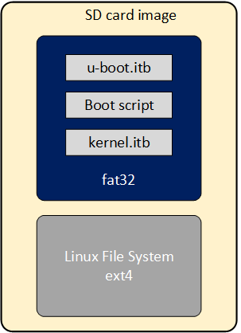{: style="height:500px"}

If you want to replace any the components or add a new item in any of these partitions, without having to run again the Yocto build flow. 

This can be done through the **wic** script available on the **Poky** repository that is included as part of the HPS Baseline System Example Design build directory:

* **$TOP_FOLDER/<*gsrd-directory*>/<*project-directory*>/software/yocto_linux/poky/scripts/wic** 

The **wic** command requires to be run in the Yocto build environment that can be setup as shown next in a Linux terminal:

  ```bash
  cd $TOP_FOLDER/<gsrd-directory>/<project-directory>/software/yocto_linux/
  source poky/oe-init-build-env build
  ```
You can verify that the Yocto environment has been setup using the **which bitbake**  command, which will respond with the path of the **bitbake** command located at **poky/bitbake/bin/bitbake**.

The **wic** command allows you to inspect the content of a SD Card image, delete, add or replace any component inside of the image. This command is also provided with help support:

   ```bash
   $ $TOP_FOLDER/<gsrd-directory>/<project-directory>/software/yocto_linux/poky/scripts/wic help
   
   Creates a customized OpenEmbedded image.

   Usage:  wic [--version]
           wic help [COMMAND or TOPIC]
           wic COMMAND [ARGS]

       usage 1: Returns the current version of Wic
       usage 2: Returns detailed help for a COMMAND or TOPIC
       usage 3: Executes COMMAND

   COMMAND:

    list   -   List available canned images and source plugins
    ls     -   List contents of partitioned image or partition
    rm     -   Remove files or directories from the vfat or ext* partitions
    help   -   Show help for a wic COMMAND or TOPIC
    write  -   Write an image to a device
    cp     -   Copy files and directories to the vfat or ext* partitions
    create -   Create a new OpenEmbedded image
    :
    :
   ```

   The following steps show you how to replace the **kernel.itb** file inside of the fat32 partition in a .wic image.

1. The **wic ls** command allows you to inspect or navigate over the directory structure inside of the SD Card image. For example you can observe the partitions  in the SD Card image in this way.

  ```bash   
  # Here you can inspect the content a wic image see the 2 partitions inside of the SD Card image
  $ $TOP_FOLDER/<gsrd-directory>/<project-directory>/software/yocto_linux/poky/scripts/wic ls my_image.wic
   Num     Start        End          Size      Fstype
   1       1048576    525336575    524288000  fat32
   2     525336576   2098200575   1572864000  ext4

   
  # Here you can naviagate inside of the partition 1
   $ $TOP_FOLDER/<gsrd-directory>/<project-directory>/software/yocto_linux/poky/scripts/wic ls my_image.wic:1
  Volume in drive : is boot       
  Volume Serial Number is 8F65-ACE9
  Directory for ::/

  BOOTSC~1 UIM      2739 2011-04-05  23:00  boot.scr.uimg
  kernel   itb  12885831 2011-04-05  23:00 
  uboot    env      8192 2011-04-05  23:00 
  u-boot   itb    938816 2011-04-05  23:00 
        4 files          13 835 578 bytes
                        509 370 368 bytes free

  ```

2. The **wic rm** command allows you to delete any of the components in the selected partition. For example, you can delete the **kernel.itb** image from the partition 1(fat32 partition).

   ```bash
   $ $TOP_FOLDER/<gsrd-directory>/<project-directory>/software/yocto_linux/poky/scripts/wic rm my_image.wic:1/kernel.itb
   ```

3. The **wic cp** command allows you to copy any new item or file from your Linux machine to a specific partition and location inside of the SD Card image. For example, you can copy a new **kernel.itb** to the partition 1.

   ```bash
   $ $TOP_FOLDER/<gsrd-directory>/<project-directory>/software/yocto_linux/poky/scripts/wic cp <path_new_kernel.itb> my_image.wic:1/kernel.itb
   ```

**NOTE**: The **wic** application also allows you to modify any image with compatible vfat and ext* type partitions which also covers images used for **eMMC** boot flow.


## Notices & Disclaimers

Altera<sup>&reg;</sup> Corporation technologies may require enabled hardware, software or service activation.
No product or component can be absolutely secure. 
Performance varies by use, configuration and other factors.
Your costs and results may vary. 
You may not use or facilitate the use of this document in connection with any infringement or other legal analysis concerning Altera or Intel products described herein. You agree to grant Altera Corporation a non-exclusive, royalty-free license to any patent claim thereafter drafted which includes subject matter disclosed herein.
No license (express or implied, by estoppel or otherwise) to any intellectual property rights is granted by this document, with the sole exception that you may publish an unmodified copy. You may create software implementations based on this document and in compliance with the foregoing that are intended to execute on the Altera or Intel product(s) referenced in this document. No rights are granted to create modifications or derivatives of this document.
The products described may contain design defects or errors known as errata which may cause the product to deviate from published specifications.  Current characterized errata are available on request.
Altera disclaims all express and implied warranties, including without limitation, the implied warranties of merchantability, fitness for a particular purpose, and non-infringement, as well as any warranty arising from course of performance, course of dealing, or usage in trade.
You are responsible for safety of the overall system, including compliance with applicable safety-related requirements or standards. 
<sup>&copy;</sup> Altera Corporation.  Altera, the Altera logo, and other Altera marks are trademarks of Altera Corporation.  Other names and brands may be claimed as the property of others. 

OpenCL* and the OpenCL* logo are trademarks of Apple Inc. used by permission of the Khronos Group™. 
