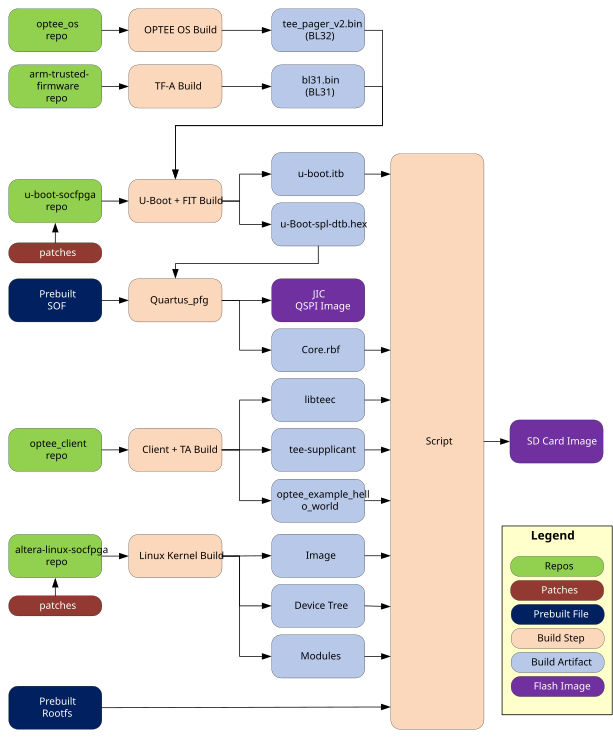
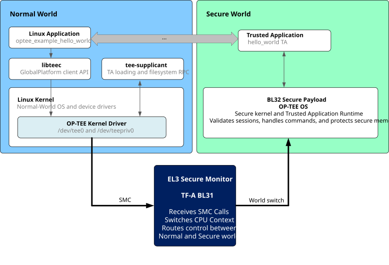

Agilex&trade; 5 FPGA E-Series 013B Development Kit, ordering code DK-A5E013BM16AEA

## Introduction

OP-TEE is an open-source Trusted Execution Environment for Arm TrustZone. This example design demonstrates building and running a simple OP-TEE application on the Altera Agilex 5 FPGA E-Series 013B Development Kit.


### Prerequisites

The following are required to be able to fully exercise the Agilex 5 FPGA E-Series 013B Development Kit GSRD:

* Altera&reg; Agilex&trade; 5 FPGA E-Series 013B Development Kit, ordering code DK-A5E013BM16AEA. Refer to [board documentation](https://www.altera.com/products/devkit/po-3196/agilex-5-fpga-e-series-013b-development-kit) for more information about the development kit.

* Host PC with:
  * Linux OS installed. Ubuntu 22.04LTS was used to create this page, other versions and distributions may work too
  * Serial terminal (for example GtkTerm or Minicom on Linux and TeraTerm or PuTTY on Windows)
  * Altera&reg; Quartus<sup>&reg;</sup> Prime Pro Edition Version 26.1.1. Only Quartus Programmer is actually needed.
 
* Internet connection. For downloading the files, especially when rebuilding the GSRD.

### Source repositories and revisions

| Component | Repository | Selection made by the script | Recorded revision |
| --- | --- | --- | --- |
| This GHRD | [altera-fpga/agilex5e-ed-gsrd](https://github.com/altera-fpga/agilex5e-ed-gsrd) | Repository containing this example; tag `QPDS26.1.1_REL_GSRD_PR` | `d970f25424bb413081fa7d4329535b0071d79627` |
| OP-TEE OS | [BenjaminLimJL/optee_os](https://github.com/BenjaminLimJL/optee_os) | Branch `socfpga_agilex5_optee` | `38bbd8423336b88cbfc0d6c00609bb4814985b60` |
| OP-TEE Client | [OP-TEE/optee_client](https://github.com/OP-TEE/optee_client) | Tag `4.5.0` | `6486773583b5983af8250a47cf07eca938e0e422` |
| OP-TEE examples | [BenjaminLimJL/optee_examples](https://github.com/BenjaminLimJL/optee_examples) | Branch `master` | `934c7edb74a26e90f68024cf441073528444177f` |
| TF-A | [altera-fpga/arm-trusted-firmware](https://github.com/altera-fpga/arm-trusted-firmware) | Default branch (`socfpga_v2.14.1` at capture time); release tag `QPDS26.1.1_REL_GSRD_PR` | `2ea5afda7f34774ddcc677fb3a728fa57f780a1e` |
| U-Boot | [altera-fpga/u-boot-socfpga](https://github.com/altera-fpga/u-boot-socfpga) | Default branch (`socfpga_v2026.04` at capture time); release tag `QPDS26.1.1_REL_GSRD_PR` | `e09d6fcc95f33b8a60377103f6e37e635660a3ee` before local patches |
| Linux | [altera-fpga/linux-socfpga](https://github.com/altera-fpga/linux-socfpga) | Shallow clone of the default branch (`socfpga-6.18.20-lts` at capture time); release tag `QPDS26.1.1_REL_GSRD_PR` | `d8e46bd82a1e1dbbc641db7f0f57d7ddeb2621b1` before local patches |

### Local patches

| Patch | Mail patch ID | Effect |
| --- | --- | --- |
| `0001-arm-socfpga-Add-OP-TEE-memory-to-SDRAM-firewall_uboot.patch` | `e2b47d4c8ee3f3e54db474e81c512f90bfe70ad9` | Protects the OP-TEE TZDRAM gap in the MPU, non-MPU, and F2SDRAM firewalls |
| `0002-arm-socfpga-Add-OP-TEE-OS-as-a-loadable-firmware-in-_uboot.patch` | `ff18a40bc9d1ce86c18081788a12ef36b2acc570` | Adds OP-TEE to the U-Boot FIT and moves the kernel load address |
| `0001-arm64-agilex5-enable-optee-support-for-agilex5_linux.patch` | `804e3a5c3e297530700dbd02955ef37ee259d23e` | Adds TZDRAM reservation and the OP-TEE firmware node to the 013B DTB | 
| `0002-arm64-agilex5-enable-optee-support-for-agilex5_013b-_linux.patch` | `30ecf98c8e791d1333f4e3c80becc1c73fb1db4c` | Adds the same nodes to the alternate SDMMC/TF-A DTB |

## Build Example Design


The following diagram shows an overview of how the example design is built:



1\. Install the required tools if not already done.

The flow is written for Bash on Linux and requires network access to GitHub, Arm Developer, RocketBoards, PyPI, Debian, GNU mirrors, and kernel.org.
For Debian or Ubuntu, the following command can be used to install the required tools:

```bash
sudo apt-get update
sudo apt-get install \
  autoconf automake bc bison build-essential cmake dosfstools e2fsprogs \
  fakeroot flex gawk genimage git libconfuse-dev libelf-dev libssl-dev \
  libtool mtools pkg-config python3 python3-cryptography python3-pip \
  python3-pyelftools rsync uuid-dev wget xz-utils
```

2\. Create a top folder for the example:


```bash
sudo rm -rf agilex5-013b.optee_hello
mkdir agilex5-013b.optee_hello
cd mkdir agilex5-013b.optee_hello
export TOP_FOLDER=`pwd`
```


3\. Add Quartus tools to the `PATH`:


```bash
source ~/altera_pro/26.1.1/qinit.sh
```


4\. Get the example files


```bash
cd $TOP_FOLDER
rm -rf agilex5_soc_devkit_ghrd && mkdir agilex5_soc_devkit_ghrd && cd agilex5_soc_devkit_ghrd
wget https://github.com/altera-fpga/agilex5e-ed-gsrd/releases/download/QPDS26.1.1_REL_GSRD_PR/dk-a5e013bm16aea-baseline-a55.zip
unzip dk-a5e013bm16aea-baseline-a55.zip
rm -f dk-a5e013bm16aea-baseline-a55.zip
```


5\. Go to example folder, replace `/netbatch` with `/tmp` as that folder may not be available on your machine, but `/tmp` always is:


```bash
cd $TOP_FOLDER/agilex5_soc_devkit_ghrd/software/ryo_optee/
sed -i 's|/netbatch/|/tmp/|g' ryo_optee_sd.sh
```


6\. Invoke the build script:


```bash
CMAKE_POLICY_VERSION_MINIMUM=3.5 ./ryo_optee_sd.sh --jobs="$(nproc)"
```


Once the build is done, it displays this message:

```bash
  ========================================                                                                                                                      
  DONE                                                                                                                                                                                                      
  ========================================                                                                                                                                                                  
  Key outputs:                                                                                                                                                                                              
    OP-TEE OS : optee_os/out/agilex5/core/tee-pager_v2.bin                                                                                                                                                  
    BL31 : arm-trusted-firmware/build/agilex5/release/bl31.bin                                                                                                                                              
    U-Boot ITB : uboot-socfpga/u-boot.itb                                                                                                                                                                   
    Kernel : linux-socfpga/arch/arm64/boot/Image                                                                                                                                                            
    DTB : linux-socfpga/arch/arm64/boot/dts/intel/socfpga_agilex5_socdk_013b.dtb                                                                                                                            
    SD image : sd_image/sdcard.img                                                                                                                                                                          
    JIC : ghrd_sd.hps.jic                                                                                                                                                                                   
```

## Run Example Design

In this example, `/usr/bin/optee_example_hello_world` opens a session to the TA. The application is simple: it sends the integer `42`; the TA increments it and returns `43`.

The following diagram depicts the runtime operation:



The steps to run the example are:

1\. Write SD card image

2\. Flash QSPI image

3\. Power cycle the board

4\. Linux will boot. When prompted enter 'root' as the username, and no password will be asked for.

5\. Display the Linux boot log related to OP-TEE:

```bash
root@agilex5dka5e013bm16aea:~# dmesg | grep -i optee
[    0.000000] OF: reserved mem: 0x0000000083000000..0x0000000084ffffff (32768 KiB) nomap non-reusable optee@83000000
[    1.871696] optee: probing for conduit method.
[    1.876232] optee: revision 4.9 (38bbd8423336b88c)
[    1.892569] optee: dynamic shared memory is enabled
[    1.902497] optee: initialized driver
```

This shows:

* **Reserved memory**: The 32 MiB carve-out at 0x83000000–0x84FFFFFF is OP-TEE's secure DDR, declared in the devicetree with no-map so Linux never creates a mapping for it. It matches what OP-TEE OS was built with (CFG_TZDRAM_START/CFG_TZDRAM_SIZE).
* **Driver probe**: Revision 4.9 is OP-TEE OS reporting itself over the SMC interface, and that hash is the build ID of the running secure image. Dynamic shared memory is enabled means the kernel can register arbitrary normal-world pages with secure world on demand instead of being limited to a small fixed static SHM pool.


6\. Show the device nodes:

```bash
root@agilex5dka5e013bm16aea:~# ls -l /dev/tee*
crw-------    1 root     root      246,   0 May 29 16:30 /dev/tee0
crw-------    1 root     root      246,  16 May 29 16:30 /dev/teepriv0
```

This shows that both device nodes are present, so the driver registered client and privileged interfaces.


7\. Check that the `tee-supplicant` is running:

```bash
root@agilex5dka5e013bm16aea:~# pidof tee-supplicant
329
```

8\. Run the Trusted Application:

```bash
root@agilex5dka5e013bm16aea:~# /usr/bin/optee_example_hello_world
I/TC: WARNING (insecure configuration): Failed to get monotonic counter for REE FS, using 0
I/TC: WARNING (insecure configuration): Failed to commit dirh counter 2
D/TA:  TA_CreateEntryPoint:18 has been called
D/TA:  __GP11_TA_OpenSessionEntryPoint:47 has been called
I/TA: Hello World!
Invoking TA to increment 42
D/TA:  inc_value:78 has been called
I/TA: Got value: 42 from NW
I/TA: Increase value to: 43
TA incremented value to 43
I/TA: Goodbye!
D/TA:  TA_DestroyEntryPoint:29 has been called
```

The warnings are relaed to the fact that OP-TEE wants a hardware monotonic counter to protect the REE filesystem secure storage against rollback. That is typically provided by an eMMC device which is not present in this design.

The `D/TA` and `I/TA` prefixed lines are are logs coming from the secure world. The messages without the prefix are coming from the normal world.


## Notices & Disclaimers

Altera<sup>&reg;</sup> Corporation technologies may require enabled hardware, software or service activation.
No product or component can be absolutely secure. 
Performance varies by use, configuration and other factors.
Your costs and results may vary. 
You may not use or facilitate the use of this document in connection with any infringement or other legal analysis concerning Altera or Intel products described herein. You agree to grant Altera Corporation a non-exclusive, royalty-free license to any patent claim thereafter drafted which includes subject matter disclosed herein.
No license (express or implied, by estoppel or otherwise) to any intellectual property rights is granted by this document, with the sole exception that you may publish an unmodified copy. You may create software implementations based on this document and in compliance with the foregoing that are intended to execute on the Altera or Intel product(s) referenced in this document. No rights are granted to create modifications or derivatives of this document.
The products described may contain design defects or errors known as errata which may cause the product to deviate from published specifications.  Current characterized errata are available on request.
Altera disclaims all express and implied warranties, including without limitation, the implied warranties of merchantability, fitness for a particular purpose, and non-infringement, as well as any warranty arising from course of performance, course of dealing, or usage in trade.
You are responsible for safety of the overall system, including compliance with applicable safety-related requirements or standards. 
<sup>&copy;</sup> Altera Corporation.  Altera, the Altera logo, and other Altera marks are trademarks of Altera Corporation.  Other names and brands may be claimed as the property of others. 

OpenCL* and the OpenCL* logo are trademarks of Apple Inc. used by permission of the Khronos Group™. 