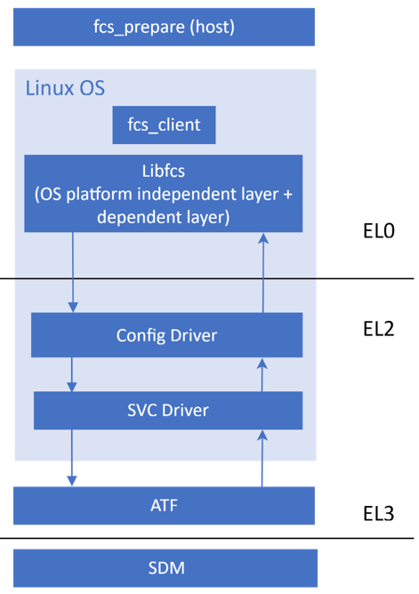

# FPGA Crypto Services (FCS) Tutorial Example Design User Guide

 

## Introduction

The new FPGA Crypto Services (FCS) solution features a modular design and utilizes the standard Linux cryptographic framework. This offers the FCS clients a simplified API interface for performing cryptographic operations. Furthermore, it integrates the advanced SIP-SVC v3 protocol, which improves communication with the SDM over the previous SIP-SVC v1 version. This enhancement leads to greater efficiency, flexibility, and security in cryptographic operations.

This tutorial provides an overview of the new architecture, instructions for building various FCS components, guidance on which configurations to enable or disable, details on new commands, and information on modifications needed to execute other API commands. All FCS commands are the same as Legacy FCS solutions except a few which are detailed in the upcoming sections.

| **Features**                                 | **Actions**                                                  |
| -------------------------------------------- | ------------------------------------------------------------ |
| Session management                           | Open and Close sessions                                      |
| Key Management                               | Create a key, Import a key, Export a Key, Remove a key, Get key info |
| Random number generation                     | Send a request to generate random number                     |
| AES Encryption and Description               | ECB Mode, CTR Mode, CBC Mode                                 |
| Provision data                               | Retrieve the device provision data for device management and confirmation needs |
| Counter set and Counter set preauthorization | Set one selected counter to its specified value in both provision firmware and the main firmware |
| Get the digest                               | Request the SHA-2 hash digest on a blob                      |
| MAC verify                                   | Check the integrity and authenticity of a blob by comparing the calculated MAC with tagged MAC |
| Get ECDH shared secret                       | Digital signature signing request on a data blob             |
| QSPI COMMANDS                                | OPEN, CLOSE, SET_CS, READ, ERASE, WRITE                      |
| Device Information                           | GET_IDCODE, GET_DEVICE_IDENTITY                              |
| Attestation Commands                         | MCTP_REQUEST, CREATE_CERTIFICATES_ON_RELOAD, GET_ATTESTATION_CERTIFICATE |
| SDOS Encryption and  Decryption              | Encrypt an input data and decrypt it                         |
| Support ECDSA Use case                       | Get ECDSA public key, ECDSA Hash signing, ECDSA Hash verify, ECDSA SHA2 Data Signing, ECDSA SHA2 Data verify |
| HPS image validation                         | Check the integrity and authenticity of an image before configuration |

## Architecture Overview

The new FCS architecture software stack and its components can be found in the figure below.



## FCS Repository

**Boards/Device Utilized:** Agilex™ 5 FPGA E-Series 013B Development Kit
 **Release Type:** Source code release

| **SW Component** | **Repository**                                               | **Branch/tag/Version** |
| ---------------- | ------------------------------------------------------------ | ---------------------- |
| LibFCS           | [altera-fpga/libfcs: Altera FPGA Crypto Services Library](https://github.com/altera-fpga/libfcs) | main                   |
| Linux            | [altera-fpga/linux-socfpga: Linux development repository for socfpga](https://github.com/altera-fpga/linux-socfpga) | QPDS25.3_REL_GSRD_PR   |
| U-Boot           | [altera-fpga/u-boot-socfpga](https://github.com/altera-fpga/u-boot-socfpga) | QPDS25.3_REL_GSRD_PR   |
| ATF              | [altera-fpga/arm-trusted-firmware](https://github.com/altera-fpga/arm-trusted-firmware) | QPDS25.3_REL_GSRD_P    |

## Setup Environment

1. Create the top folder to store all the build artifacts:

```bash
mkdir agilex5_fcs
cd agilex5_fcs
export TOP_FOLDER=`pwd`
```

2. Download the compiler toolchain, add it to the PATH variable:

```bash
cd $TOP_FOLDER
wget https://developer.arm.com/-/media/Files/downloads/gnu/14.3.rel1/binrel/arm-gnu-toolchain-14.3.rel1-x86_64-aarch64-none-linux-gnu.tar.xz
tar xf arm-gnu-toolchain-14.3.rel1-x86_64-aarch64-none-linux-gnu.tar.xz
rm -f arm-gnu-toolchain-14.3.rel1-x86_64-aarch64-none-linux-gnu.tar.xz
export PATH=`pwd`/arm-gnu-toolchain-14.3.rel1-x86_64-aarch64-none-linux-gnu/bin/:$PATH
export ARCH=arm64
export CROSS_COMPILE=aarch64-none-linux-gnu-
```

3. Enable Quartus tools to be called from command line:

```bash
export QUARTUS_ROOTDIR=~/altera_pro/25.3/quartus/
export PATH=$QUARTUS_ROOTDIR/bin:$QUARTUS_ROOTDIR/linux64:$QUARTUS_ROOTDIR/../qsys/bin:$PATH
```

4. Install Yocto Dependencies:

Make sure you have Yocto system requirements met: https://docs.yoctoproject.org/5.0.1/ref-manual/system-requirements.html#supported-linux-distributions. The commands to install the required packages on Ubuntu 22.04 are:

```bash
sudo apt-get update
sudo apt-get upgrade
sudo apt-get install openssh-server mc libgmp3-dev libmpc-dev gawk wget git diffstat unzip texinfo gcc \
build-essential chrpath socat cpio python3 python3-pip python3-pexpect xz-utils debianutils iputils-ping \
python3-git python3-jinja2 libegl1-mesa libsdl1.2-dev pylint xterm python3-subunit mesa-common-dev zstd \
liblz4-tool git fakeroot build-essential ncurses-dev xz-utils libssl-dev bc flex libelf-dev bison xinetd \
tftpd tftp nfs-kernel-server libncurses5 libc6-i386 libstdc++6:i386 libgcc++1:i386 lib32z1 \
device-tree-compiler curl mtd-utils u-boot-tools net-tools swig -y
```

On Ubuntu 22.04 you will also need to point the /bin/sh to /bin/bash, as the default is a link to /bin/dash:

```bash
sudo ln -sf /bin/bash /bin/sh
```

## System Image Creation

### Build Arm Trusted Firmware

```bash
cd $TOP_FOLDER
git clone -b QPDS25.3_REL_GSRD_PR https://github.com/altera-fpga/arm-trusted-firmware 
cd arm-trusted-firmware 
make bl31 PLAT=agilex 
cd ..
```

### Build U-Boot

```bash
cd $TOP_FOLDER
rm -rf u-boot-socfpga
git clone -b QPDS25.3_REL_GSRD_PR https://github.com/altera-opensource/u-boot-socfpga
cd u-boot-socfpga 
# only boot from SD, do not try QSPI and NAND
sed -i 's/u-boot,spl-boot-order.*/u-boot\,spl-boot-order = \&mmc;/g' arch/arm/dts/socfpga_agilex5_socdk-u-boot.dtsi
# disable NAND in the device tree
sed -i '/&nand {/!b;n;c\\tstatus = "disabled";' arch/arm/dts/socfpga_agilex5_socdk-u-boot.dtsi
# link to atf
ln -s ../arm-trusted-firmware/build/agilex5/release/bl31.bin 

cat << EOF > config-fragment
# Use 'Image' for kernel image instead of 'kernel.itb'
CONFIG_BOOTFILE="Image"
# disable NAND/UBI related settings from defconfig.
CONFIG_NAND_BOOT=n
CONFIG_SPL_NAND_SUPPORT=n
CONFIG_CMD_NAND_TRIMFFS=n
CONFIG_CMD_NAND_LOCK_UNLOCK=n
CONFIG_NAND_DENALI_DT=n
CONFIG_SYS_NAND_U_BOOT_LOCATIONS=n
CONFIG_SPL_NAND_FRAMEWORK=n
CONFIG_CMD_NAND=n
CONFIG_MTD_RAW_NAND=n
CONFIG_CMD_UBI=n
CONFIG_CMD_UBIFS=n
CONFIG_MTD_UBI=n
CONFIG_ENV_IS_IN_UBI=n
CONFIG_UBI_SILENCE_MSG=n
CONFIG_UBIFS_SILENCE_MSG=n
# disable distroboot and use specific boot command.
CONFIG_DISTRO_DEFAULTS=n
CONFIG_HUSH_PARSER=y
CONFIG_SYS_PROMPT_HUSH_PS2="> "
CONFIG_USE_BOOTCOMMAND=y
CONFIG_BOOTCOMMAND="load mmc 0:1 \${loadaddr} signed_bitstream_core.rbf; bridge disable;fpga load 0 \${loadaddr} \${filesize};bridge enable; setenv bootfile Image; run mmcload;run linux_qspi_enable;run rsu_status;run mmcboot"
CONFIG_CMD_FAT=y
CONFIG_CMD_FS_GENERIC=y
CONFIG_DOS_PARTITION=y
CONFIG_SPL_DOS_PARTITION=y
CONFIG_CMD_PART=y
CONFIG_SPL_CRC32=y
CONFIG_LZO=y
CONFIG_CMD_DHCP=y
# enable more QSPI flash manufacturers
CONFIG_SPI_FLASH_MACRONIX=y
CONFIG_SPI_FLASH_GIGADEVICE=y
CONFIG_SPI_FLASH_WINBOND=y
CONFIG_SPI_FLASH_ISSI=y
EOF
# build U-Boot
make clean && make mrproper
make socfpga_agilex5_defconfig 
# use created custom configuration file to merge with the default configuration obtained in .config file. 
./scripts/kconfig/merge_config.sh -O . -m .config config-fragment
make -j 64
cd ..
```

The following files are created:

- $TOP_FOLDER/u-boot-socfpga/u-boot.itb
- $TOP_FOLDER/u-boot-socfpga/spl/u-boot-spl-dtb.hex

### Build Linux

```bash
cd $TOP_FOLDER
rm -rf linux-socfpga
git clone -b QPDS25.3_REL_GSRD_PR  https://github.com/altera-fpga/linux-socfpga linux-socfpga
cd linux-socfpga
make defconfig 
```

After that, the FCS drivers need to be enabled using menuconfig

```bash
make menuconfig
```

Select the following configuration options for FCS.

Device Drivers --> Misc devices --> Altera FPGA FCS configuration support(select *)


Finally, build the Linux Image:

```bash
make -j 64 Image && make intel/socfpga_agilex5_socdk.dtb 
```

The following files are created:

- $TOP_FOLDER/linux-socfpga/arch/arm64/boot/dts/intel/socfpga_agilex5_socdk.dtb
- $TOP_FOLDER/linux-socfpga/arch/arm64/boot/Image

### Compile LibFCS and FCS Client application

#### Compile fcs_prepare tool

```bash
git clone https://github.com/altera-fpga/libfcs
cd libfcs/
export CROSS_COMPILE=; export ARCH=
rm -rf build_prepare && cmake -S . -B build_prepare -DBUILD_FCS_PREPARE=ON && cmake --build build_prepare
```

The fcs_prepare executable file is generated here:

- $TOP_FOLDER/libfcs/build_prepare/tools/fcs_prepare/fcs_prepare

#### Compile the FCS Client and LibFCS

```bash
export ARCH=arm64; export CROSS_COMPILE=aarch64-none-linux-gnu-
rm -rf build/ && rm -rf third_party/libkcapi/ && cmake -S . -B build -DARCH=linux_aarch64 -DOS=linux && cmake --build build
```

The output files of the compilation must be copied to the target device, as below:

- $TOP_FOLDER/libfcs/build/bin/fcs_client
- $TOP_FOLDER/libfcs/build/lib/LibFCS.so
- $TOP_FOLDER/libfcs/build/lib/LibFCS.so.2

## Build Rootfs

```bash
cd $TOP_FOLDER
rm -rf yocto && mkdir yocto && cd yocto
git clone -b styhead https://git.yoctoproject.org/poky
git clone -b styhead https://git.yoctoproject.org/meta-intel-fpga
git clone -b styhead https://github.com/openembedded/meta-openembedded
source poky/oe-init-build-env ./build
echo 'MACHINE = "agilex5_dk_a5e013bb32aes"' >> conf/local.conf
echo 'BBLAYERS += " ${TOPDIR}/../meta-intel-fpga "' >> conf/bblayers.conf
echo 'BBLAYERS += " ${TOPDIR}/../meta-openembedded/meta-oe "' >> conf/bblayers.conf
echo 'CORE_IMAGE_EXTRA_INSTALL += "openssh gdbserver"' >> conf/local.conf
bitbake core-image-minimal
```

The following file is created:

- $TOP_FOLDER/yocto/build/tmp/deploy/images/agilex5_dk_a5e013bb32aes/core-image-minimal-agilex5_dk_a5e013bb32aes.rootfs.tar.gz

## Generate Signature Chains

```bash
cd $TOP_FOLDER
mkdir keys && cd keys
mkdir -p privatekeys; mkdir -p publickeys; mkdir -p qky 
```

Start a Nios V command shell to have all Quartus tools in the PATH:

```bash
~/altera_pro/25.3/niosv/bin/niosv-shell
```

### Generate Root Key

```bash
quartus_sign --family=agilex5 --operation=make_private_pem --curve=secp384r1 --no_passphrase privatekeys/private_root0.pem
quartus_sign --family=agilex5 --operation=make_public_pem privatekeys/private_root0.pem publickeys/public_root0.pem
quartus_sign --family=agilex5 --operation=make_root publickeys/public_root0.pem qky/root0.qky
```

### Generate Signing Keys

FPGA Signing

```bash
quartus_sign --family=agilex5 --operation=make_private_pem --curve=secp384r1 --no_passphrase privatekeys/private_sign0.pem
quartus_sign --family=agilex5 --operation=make_public_pem privatekeys/private_sign0.pem publickeys/public_sign0.pem
```

SDOS Service Root (If SDOS is used)

```bash
quartus_sign --family=agilex5 --operation=make_private_pem --curve=secp384r1 --no_passphrase privatekeys/private_sdos.pem
quartus_sign --family=agilex5 --operation=make_public_pem privatekeys/private_sdos.pem publickeys/public_sdos.pem
```

### Generate Signature Chain

FPGA Signing - Cancel ID 1 – Permissions: FPGA/HPS/HPS Debug

```bash
quartus_sign --family=agilex5 --operation=append_key --previous_pem=privatekeys/private_root0.pem --previous_qky=qky/root0.qky --permission=14 --cancel=1 --input_pem=publickeys/public_sign0.pem qky/sign0_cancel1.qky
```

SDOS Service Root Key Compact Certificate Signing (If SDOS is used)

```bash
quartus_sign --family=agilex5 --operation=append_key --previous_pem=privatekeys/private_root0.pem --previous_qky=qky/root0.qky \
--permission=0x8000 --cancel=1 --input_pem=publickeys/public_sdos.pem qky/sdosccert1_sign_chain.qky
```

## Build Hardware Design

### Build the GHRD

```bash
cd $TOP_FOLDER
rm -rf agilex5_soc_devkit_ghrd && mkdir agilex5_soc_devkit_ghrd && cd agilex5_soc_devkit_ghrd
wget https://github.com/altera-fpga/agilex5e-ed-gsrd/releases/download/QPDS25.3_REL_GSRD_PR/a5ed013-devkit-oobe-legacy-baseline.zip
unzip a5ed013-devkit-oobe-legacy-baseline.zip
rm -f a5ed013-devkit-oobe-legacy-baseline.zip
make legacy_baseline-build
make legacy_baseline-install-sof
cd ..
```

The following files are created:

- `$TOP_FOLDER/agilex5_soc_devkit_ghrd/install/binaries/legacy_baseline.sof`

### Enable Security Features: Authentication

Next, enable the QKY key file in the Quartus project: For the FPGA configuration bitstream to be properly signed, enable the Quartus key File in the Quartus Project.

Open the GHRD project in Quartus.

- From the Assignments Menu, navigate to Device > Device and Pin Options > Security. Under the Quartus key file, browse and select qky/sign0_cancel1.qky.
- Alternatively, you can add the following assignment to the .qsf file: "set_global_assignment -name QKY_FILE "

Regenerate the sof by running the Assembler.

- From the Processing menu, select Compilation Dashboard. In the Compilation Dashboard, select Assembler to regenerate the sof.

### Generate and Sign FPGA and HPS RBF Files

Add FSBL bootloader to configuration bitstream, and generate the core and HPS .rbf files:

```bash
cd $TOP_FOLDER
mkdir bitstreams && cd bitstreams
cp ../agilex5_soc_devkit_ghrd/output_files/legacy_baseline.sof .
quartus_pfg -c legacy_baseline.sof ghrd.rbf \
-o hps_path=$TOP_FOLDER/u-boot-socfpga/spl/u-boot-spl-dtb.hex \
-o hps=1 \
-o sign_later=ON
```

After that, two .rbf files are created:

- $TOP_FOLDER /bitstreams/ghrd.core.rbf
- $TOP_FOLDER /bitstreams/ghrd.hps.rbf

Finally, sign the .rbf files:

```bash
quartus_sign --family=agilex5 --operation=sign --qky=../keys/qky/sign0_cancel1.qky \
--pem=../keys/privatekeys/private_sign0.pem ghrd.core.rbf signed_bitstream_core.rbf
quartus_sign --family=agilex5 --operation=sign --qky=../keys/qky/sign0_cancel1.qky \
--pem=../keys/privatekeys/private_sign0.pem ghrd.hps.rbf signed_bitstream_hps.rbf
```

### Generate SDOS Signed Certificate (If SDOS is needed)

Generate the SDOS signed certificate using the command below:

```bash
quartus_pfg --ccert -o ccert_type=PROV_SERVICE_ROOT_KEY -o ccert_device=A5ED013BM16AE4SCS unsigned_prov_srk.ccert
```

Finally, sign the generated compact certificate using the following command:

```bash
quartus_sign --family=agilex5 --operation=sign --pem=../keys/privatekeys/private_sdos.pem \
--qky=../keys/qky/sdosccert1_sign_chain.qky unsigned_prov_srk.ccert signed_prov_srk.ccert
```

## Generate the Key Object File for Encryption/Decryption

First, create the key data file in .txt format:

```bash
cd $TOP_FOLDER
mkdir fcs_prepare && cd fcs_prepare
cp $TOP_FOLDER/libfcs/build_prepare/tools/fcs_prepare/fcs_prepare .
echo 1111122222333333444444555555666666777777888888999999aaAAbbBBccCC >> key.txt
./fcs_prepare -g aes_key.obj -i 14 -x 256 -k 1 -u 0x3 -t key.txt
```

To view the aes_test.obj file, use the command below to observe the output:

```bash
./fcs_prepare -P aes_key.obj

---- Decode and print crypto service key object file ---- 
Successfully decode aes_test.obj file with 136 bytes
Print crypto service key object
    key_id              0x0000000e
    key_type            1 (1:AES, 2:HMAC, 3:ECC NIST P Curve, 4:ECC-BrainPool)
    key_usage           0x00000003 (B0:Enc, B1:Dec, B2:Sign, B3:Verify, B4:Exchange)
    key_size            256 bits
    key_object_version  1 
    key_fips_mode		0 
    key_owner_id		0 
    key_user_id			0 
    key_protection      0
    key_wrap_version    0
    data          
		11 11 12 22 22 33 33 33 44 44 44 55 55 55 66 66
        66 77 77 77 88 88 88 99 99 99 aa aa bb bb cc cc
    iv            
        00 00 00 00 00 00 00 00 00 00 00 00 00 00 00 00
    mac           
        00 00 00 00 00 00 00 00 00 00 00 00 00 00 00 00
        00 00 00 00 00 00 00 00 00 00 00 00 00 00 00 00
        00 00 00 00 00 00 00 00 00 00 00 00 00 00 00 00
```

## Prepare the fcs_client Files

### Copy the fcs_client binary and drivers

```bash
Cd $TOP_FOLDER
mkdir fcs_client_bins && cd fcs_client_bins
cp ../libfcs/build/bin/fcs_client .
mkdir fcs_drivers && cd fcs_drivers
cp ../../libfcs/build/lib/libFCS* .
cd ..
cp ../fcs_prepare/aes_key.obj .
```

## Create SD Card Image

```bash
cd $TOP_FOLDER
sudo rm -rf sd_card && mkdir sd_card && cd sd_card
# Download the sd-card image creator
wget https://releases.rocketboards.org/release/2020.11/gsrd/tools/make_sdimage_p3.py
sed -i 's/\"\-F 32\",//g' make_sdimage_p3.py
chmod +x make_sdimage_p3.py
# Prepare the image files
mkdir fatfs && cd fatfs
cp $TOP_FOLDER/bitstreams/signed_bitstream_core.rbf .
cp $TOP_FOLDER/u-boot-socfpga/u-boot.itb .
cp $TOP_FOLDER/linux-socfpga/arch/arm64/boot/Image .
cp $TOP_FOLDER/linux-socfpga/arch/arm64/boot/dts/intel/socfpga_agilex5_socdk.dtb .
cd ..
mkdir rootfs && cd rootfs
sudo tar xf $TOP_FOLDER/yocto/build/tmp/deploy/images/agilex5_dk_a5e013bb32aes/core-image-minimal-agilex5_dk_a5e013bb32aes.rootfs.tar.gz
# Copy the fcs_client files
cd home/
sudo cp -r ../../../fcs_client_bins/ root/
cd ../..
# Create the image
sudo python3 make_sdimage_p3.py -f \
-P fatfs/*,num=1,format=fat,size=100M \
-P rootfs/*,num=2,format=ext3,size=512M \
-s 640M \
-n agilex5_fcs.img
cd ..
```

## Write SD Card Image

On Linux, use the dd utility as shown next:

```bash
# Determine the device asociated with the SD card on the host computer. 
cat /proc/partitions
# This will return for example /dev/sdx
# Use dd to write the image in the corresponding device
sudo dd if= agilex5_fcs.img of=/dev/sdx bs=1M
# Flush the changes to the SD card
sync
```

On Windows, use the Win32DiskImager program, available at https://sourceforge.net/projects/win32diskimager. Write the image as shown in the next figure: 


## Running the Application on Board

### Board Configuration

1. Power down the board
2. Set MSEL to JTAG mode (SW27: OFF- OFF- OFF- OFF)
3. Connect the HPS UART to a terminal on the host machine.
4. Configure the root key, SDOS ccert, and signed_bitstream_hps.rbf

```bash
cd $TOP_FOLDER/bitstreams
quartus_pgm -c 1 -m jtag -o "pi;../keys/qky/root0.qky"
quartus_pgm -c 1 -m jtag -o "p;signed_prov_srk.ccert"
quartus_pgm -c 1 -m jtag -o "p;signed_bitstream_hps.rbf"
```

On the HPS terminal, observe the FSBL output:

```bash
U-Boot SPL 2025.12-36773 (Dec 12 2025 - 04:34:22 -0400)
Reset state: Cold
MPU          800000 kHz
L4 Main      400000 kHz
L4 sys free  100000 kHz
L4 MP        200000 kHz
L4 SP        100000 kHz
SDMMC        50000 kHz
...
Trying to boot from MMC1
## Checking hash(es) for config board-0 ... OK
## Checking hash(es) for Image atf ... crc32+ OK
Image Authentication passed at address 0x000000008000000c (57408 bytes)
## Checking hash(es) for Image uboot ... crc32+ OK
Image Authentication passed at address 0x0000000080200000 (708432 bytes)
## Checking hash(es) for Image fdt-0 ... crc32+ OK
Image Authentication passed at address 0x00000000802acf88 (23592 bytes)
NOTICE: SOCFPGA: Boot Core = 0
NOTICE: SOCFPGA: CPU ID = 0
NOTICE: BL31: v2.12.0(release):f308bb3d7
NOTICE: BL31: Built : 15:06:34, Dec 12 2025
```

### Linux Environment Setup

Use “root” as login, and navigate to the fcs_client_bins directory. We need to deploy the fcs client drivers and the Linux modules.

```bash
cd fcs_client_bins
cd fcs_drivers
cp * /usr/lib
ldconfig
cd ../linux_drivers
insmod altera-fcs-config.ko
```

Navigate to the fcs_client binary and check all the dependencies availability using ldd command:

```bash
cd ../bins/
ldd fcs_client
        linux-vdso.so.1 (0x0000ffff7f7ec000)
        libFCS.so.2 => /usr/lib/libFCS.so.2 (0x0000ffff7f780000)
        libfdt.so.1 => /usr/lib/libfdt.so.1 (0x0000ffff7f760000)
        libc.so.6 => /lib/libc.so.6 (0x0000ffff7f5b0000)
        /lib/ld-linux-aarch64.so.1 (0x0000ffff7f7b0000)
```

### Testing fcs_client Application

Inside bins/ directory, run the fcs_client help command

```bash
./fcs_client -h
```

The help argument prints out all the supported actions in fcs_client application.

#### Encryption/Decryption through Crypto-Services Commands

To run an encryption test, first create a random data file and the IV file.

```bash
dd if=/dev/urandom of=iv.bin bs=1 count=16
dd if=/dev/urandom of=usr_data.bin bs=1 count=32672
```

Next, open an fcs_client session and retrieve a session ID:

```bash
./fcs_client -e
Crypto service sessionID=affea22b-80c3-a14e-a82e-a3a22656f0ce
```

After that, import the crypto service key to the device:

```bash
./fcs_client -B -s affea22b-80c3-a14e-a82e-a3a22656f0ce -i aes_key.obj
```

Then use the -Y (AES Crypt) function to encrypt the user_data.bin:

```bash
./fcs_client -Y -s affea22b-80c3-a14e-a82e-a3a22656f0ce -n 1 -k 14 -b 0 -m 0 -i usr_data.bin -o enc_usr_data.bin -f iv.bin
```

The encrypted file enc_usr_data.bin can be seen in the current running directory.

To retrieve the original file from the encrypted one, use the following command:

```bash
./fcs_client -Y -s affea22b-80c3-a14e-a82e-a3a22656f0ce -n 1 -k 14 -b 0 -m 1 -i enc_usr_data.bin -o dec_usr_data.bin -f iv.bin
```

To verify the operation, use “diff” command to check the usr_data.bin with dec_usr_data.bin.

```bash
diff usr_data.bin dec_usr_data.bin
```

No output from this command must be observed on terminal to prove the match case.

#### SDOS Tests

To perform encryption operation via SDOS, use:

```bash
./fcs_client -E -i usr_data.bin -o enc_sdos_usr_data.bin -s affea22b-80c3-a14e-a82e-a3a22656f0ce -d 0x1234 -r 0xabcd -n 0x22334455 -v
```

The expected output is:

```bash
main[2528] filesize=32672
Magic Number: 0xACBDBDED
Data Length (w/ padding): 32672
Pad: 0
SRKI: 0
ASOI: 4660
Owner ID: cd ab 00 00 00 00 00 00
Header Padding: 0x1020304
IV field: 00 00 00 00 00 00 00 00 00 00 00 00 00 00 00 00
Size of struct fcs_aes_crypt_header: 40
Save encrypted data to enc_sdos_usr_data.bin
Saving 32760 [0x7FF8] bytes
```

The decryption operation via SDOS can be executing running the command below:

```bash
./fcs_client -D -i enc_sdos_usr_data.bin -o dec_sdos_usr_data.bin -s affea22b-80c3-a14e-a82e-a3a22656f0ce -n 0x22334455 -v 
```

The expected output is:

```bash
main[2655] filesize=32760
Magic Number: 0xACBDBDED
Data Length (w/ padding): 32672
Pad: 0
SRKI: 0
ASOI: 4660
Owner ID: cd ab 00 00 00 00 00 00
Header Padding: 0x1020304
IV field: 00 00 00 00 6d fc 6b 49 6a ca 23 a6 e6 98 61 8e
Save decrypted data to dec_sdos_usr_data.bin
Saving 32672 [0x7FA0] bytes
```

