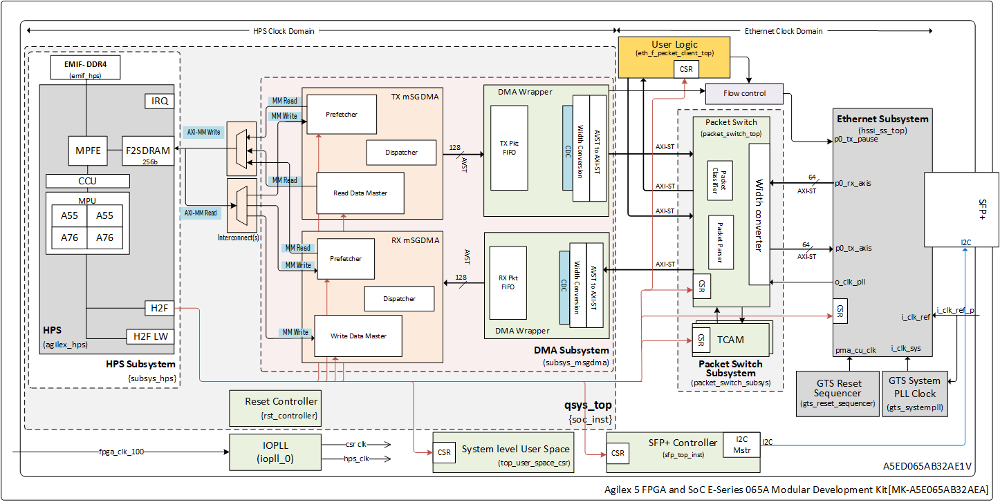
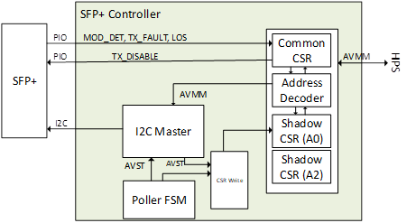
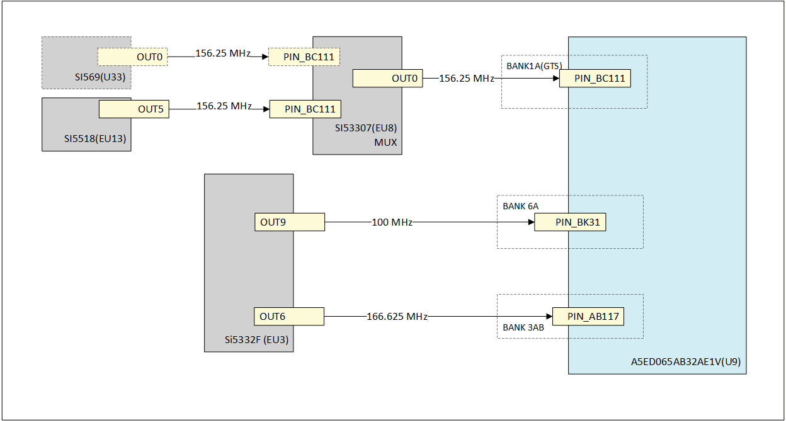
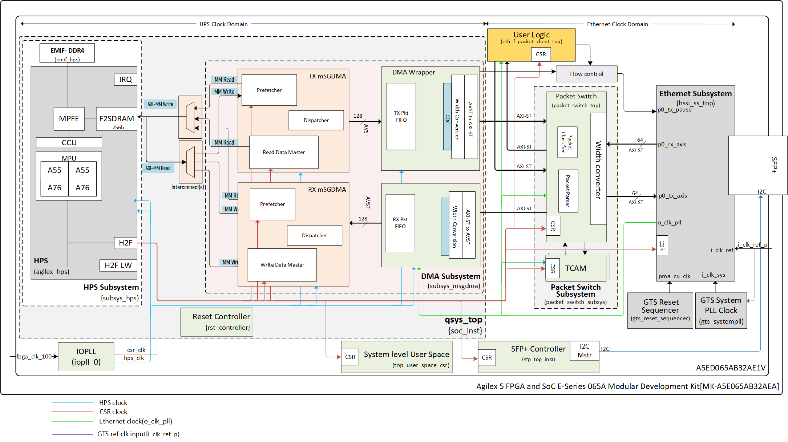
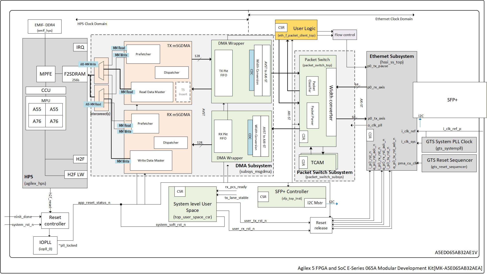
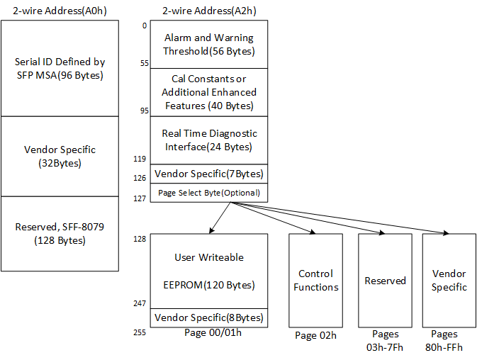
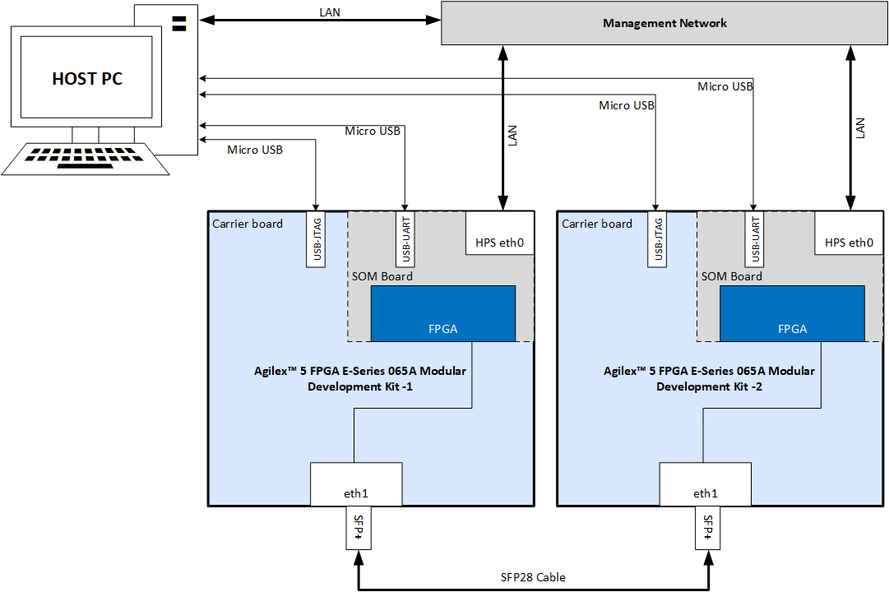

<style>
  #tab-sync-controls {
    margin-bottom: 1.5em;
    display: flex;
    gap: 1rem;
  }
  #tab-sync-controls button {
    background-color: #0078d4; /* nice blue */
    color: white;
    border: none;
    padding: 0.5em 1.25em;
    font-size: 1rem;
    font-weight: 600;
    border-radius: 6px;
    cursor: pointer;
    transition: background-color 0.3s ease;
  }
  #tab-sync-controls button:hover {
    background-color: #005a9e;
  }
  #tab-sync-controls button:focus {
    outline: 2px solid #004578;
    outline-offset: 2px;
  }
  #tab-sync-controls button.active {
  background-color: #004578; /* darker blue for active */
  }
</style>

<script>
function setAllTabsTo(labelText) {
  // Remember scroll position
  const scrollY = window.scrollY;

  // Click matching labels in tab sets
  document.querySelectorAll('.tabbed-set').forEach(set => {
    const labels = set.querySelectorAll('label');
    labels.forEach(label => {
      if (label.textContent.trim() === labelText) {
        label.click();
      }
    });
  });

  // Update button active state
  document.querySelectorAll('#tab-sync-controls button').forEach(btn => {
    if (btn.textContent.trim() === labelText) {
      btn.classList.add('active');
    } else {
      btn.classList.remove('active');
    }
  });

  //update the indicator text
  const indicator = document.getElementById('current-selection');
  if (indicator) {
    indicator.textContent = `Currently selected: ${labelText}`;
  }

  window.scrollTo(0, scrollY);
}
</script>

# Agilex&trade; 5 E-Series(Group A) 25G/10G Ethernet System Example Design
<center>
This system example design supports multiple Ethernet link data rates. Select the desired link data rate:
</center>

<div id="tab-sync-controls" style="display: flex; justify-content: center; gap: 1em; margin-bottom: 1em;">
  <button onclick="setAllTabsTo('25 GbE')">25 GbE</button>
  <button onclick="setAllTabsTo('10 GbE')">10 GbE</button>
</div>

<center>
<p id="current-selection">Currently selected: None</p>
</center>

## Introduction

This page presents Agilex&trade; 5 E-Series(Group A) 25G/10G Ethernet System Example Design showcasing Ethernet functionality for applications that handle traffic up to 25GbE/10GbE Ethernet speed/bandwidth using Agilex&trade; 5 Device on Agilex&trade; 5 FPGA and SoC E-Series 065A Modular Development Kit. This design was created using Quartus IPs from Agilex&trade; 5 Device, facilitating the data and control paths between the Linux software stack running on HPS and the Hard Ethernet MAC with GTS Transceiver on Agilex&trade; 5 devices. This example design assists customers in leveraging and incorporating Ethernet solutions into their designs aimed at high-speed (25G/10G data rate) Ethernet applications. The system example design is targeted to the Agilex&trade; 5 FPGA and SoC E-Series 065A Modular Development Kit for demonstration purposes.

### Overview

  The Agilex&trade; 5 E-Series(Group A) 25G/10G Ethernet System Example Design developed using Altera&reg; Quartus&reg; Prime Pro Edition version 26.1.1. The design targets the [Agilex&trade; 5 FPGA and SoC E-Series 065A Modular Development Kit](https://www.altera.com/products/devkit/po-3278/agilex-5-fpga-and-soc-e-series-065a-modular-development-kit) and leverages the [GTS Ethernet Hard IP](https://docs.altera.com/r/docs/817676/current) and Hard Processing System (HPS). It runs on a Linux OS based on kernel version 6.12.19lts.
  The design features a configurable L2 Packet Switch service that parses incoming Ethernet packets from external link partner and routes them either to internal User Logic port(Packet client) or to a set of priority queues designated for the HPS through DMA. A priority-based arbitration mechanism manages egress port access, granting it based on the packet's source.

  This System example design demonstrates Ethernet functionality of the Altera&reg; Agilex&trade; 5 FPGA supporting GTS transceivers. It provides a 1-Port, 25GbE/10GbE design leveraging the GTS Ethernet IP.The full Ethernet Traffic bandwidth will be achieve through HPS-DMA datapath(Max ~1.7Gbps) and the User Logic-Packet Client module(upto 24.7Gbps for 25G and upto 9.8Gbps for 10G) which emulates the real world data streams up to line rates.

  The primary components in the design are:

* Hard Processor Subsystem (HPS).

* Channelized Modular scatter-Gather Direct Memory Access (MSGDMA) Subsystem.

* L2 Packet Switch module.

* User Logic (Packet Client).

* GTS Ethernet Hard IP.



Figure 1. System Example Design high-level architecture diagram.

  Important features of the design include,

* Single Ethernet port working at 25G/10G speed connected with external SFP+ interface on the Modular Development Kit.
* Configurable L2 Packet Switch supporting multiple source streams to Ethernet port and packet rerouting from Ethernet port to multiple destinations like HPS or User Logic(Packet client).
* Separate DMA channel per TX and RX direction for HPS system memory accesses.  
* Traffic bandwidth Performance achievability matching the lane rate (25G/10G) using User Logic (Packet Client) through the L2 Packet Switch.

### Glossary

| Term          | Description                                 |
|---------------|---------------------------------------------|
| HPS           | Hard Processor System                       |
| mSGDMA        | Modular Scatter-Gather Direct Memory Access |
|EHIP           | Ethernet Hard IP                            |
|MDK            | Modular Development Kit                     |
|FSM            | Finite State Machine                        |
|TCAM           | Ternary Content Addressable Memory          |
|SOM            | System-on-Module                            |
|AVMM           | Avalon® Memory Mapped Interface             |
|AVST           | Avalon® Streaming Interface                 |
|AXI            | Advanced eXtensible Interface               |
|HSSI           | High-Speed Serial Interface                 |

### Prerequisites

  The following are required prerequisites to fully exercise the Agilex&trade; 5 E-Series(Group A) 25G/10G Ethernet System Example Design:

* 2 Nos of Altera&reg; Agilex&trade; 5 FPGA and SoC E-Series 065A Modular Development Kit, ordering code MK-A5E065AB32AEA. Refer to [board documentation](https://www.altera.com/products/devkit/po-3278/agilex-5-fpga-and-soc-e-series-065a-modular-development-kit) for more information about the development kit.
  * Power supply Module for board power.
  * 2 x Micro USB Cable.
  * RJ45 Ethernet LAN Cable(CAT6).
  * Micro SD card and USB card writer.
* SFP28 passive copper (DAC) cable with 3 Meter length.
 [Part Number: SFP-25G-PC03, Mfr: FS].
* Host PC with
  * 64 GB of RAM recommended. (Less memory works only for exercising the binaries).
  * Linux OS installed. Ubuntu 22.04LTS recommended.
  * Serial terminal (for example GtkTerm or Minicom on Linux and TeraTerm or PuTTY on Windows).
  * Altera&reg; Quartus&reg; Prime Pro Edition Version 26.1.1.
  * Local Ethernet network, with DHCP server Internet connection. For downloading GitHub source package and rebuilding the Design.

_**NOTE**_: For UVM Simulation, additional 3rd Party tools and IPs are required as mentioned in Section [Tools/IP Pre-requisites](#toolsip-pre-requisites).

## Release Contents  

### Binaries

  Release notes and pre-built binaries can be found in the [GitHub repository](https://github.com/altera-fpga/agilex5-ed-ethernet/releases/tag/SED-1xETH-a5e065a-mdk-Q26.1.1-Rel-1.1).
  
  Directory Structure used in this System Example Design:

```bash
|--- a5e065a-mod-devkit-exp-prod
  |   |--- src
  |   |   |--- hw
  |   |   |--- sw
```

  Clone the repository to get the source files as below.

  ```bash
  git clone https://github.com/altera-fpga/agilex5-ed-ethernet.git
  cd agilex5-ed-ethernet/
  git checkout SED-1xETH-a5e065a-mdk-Q26.1.1-Rel-1.1
  cd a5e065a-mod-devkit-exp-prod/
  export TOP_FOLDER=`pwd`
  mkdir bin
  ```
  
  _The Pre-built Binaries (`Images.zip` and sdcard Image `sdimage.tar.gz`) are available in assets. Please extract and copy all files to `$TOP_FOLDER/bin` folder to exercise hardware testing on Development kit._

### Sources

| Component                             | Location                                                                                                                    | Branch                          | Commit ID/Tag                             |
|---------------------------------------|-----------------------------------------------------------------------------------------------------------------------------|---------------------------------|-----------------------------------------  |
| GHRD                                  | <https://github.com/altera-fpga/agilex5-ed-ethernet/tree/rel/26.1.1/a5e065a-mod-devkit-exp-prod/src/hw>                         | rel/26.1.1                         |SED-1xETH-a5e065a-mdk-Q26.1.1-Rel-1.1      |
| Linux                                 | <https://github.com/altera-fpga/linux-socfpga>                                                                              | socfpga-6.12.19-lts-ethernet-sed |SED-1xETH-a5e065a-mdk-Q26.1.1-Rel-1.1      |
| Arm Trusted Firmware                  | <https://github.com/altera-fpga/arm-trusted-firmware>                                                                         | socfpga_v2.14.1                 | 2b046d58376a64f56c055e310c8cf7a7ba367dd7 |
| U-Boot                                | <https://github.com/altera-fpga/u-boot-socfpga>                                                                               | socfpga_v2026.04                | 2b046d58376a64f56c055e310c8cf7a7ba367dd7 |
| Yocto Project: poky                   | <https://git.yoctoproject.org/poky/>                                                                                          | scarthgap                         | 69ae79bf5a01a24491648e2fdea6faf51aeb3bf2 |
| Yocto Project: meta-intel-fpga        | <https://git.yoctoproject.org/meta-intel-fpga/>                                                                               | scarthgap                         | bcab658814ce6e4f8140f1f2a79ed549b926f39b |
| Yocto Project: meta-intel-fpga-refdes | <https://github.com/altera-fpga/meta-intel-fpga-refdes/>                                                                      | scarthgap                         | f6f9a473a0f436922fcd550276f233929b36fd8c |
| Yocto Project: meta-agilex5-sed       | <https://github.com/altera-fpga/agilex5-ed-ethernet/tree/rel/26.1.1/a5e065a-mod-devkit-exp-prod/src/sw/yocto/meta-agilex5-sed>  | rel/26.1.1                         |SED-1xETH-a5e065a-mdk-Q26.1.1-Rel-1.1      |
| GSRD Build Script: gsrd-socfpga       | <https://github.com/altera-fpga/agilex5-ed-ethernet/blob/rel/26.1.1/a5e065a-mod-devkit-exp-prod/src/sw/yocto/build.sh>          | rel/26.1.1                         |SED-1xETH-a5e065a-mdk-Q26.1.1-Rel-1.1      |

## Release Notes

   Refer to this link for [Known Issues](https://github.com/altera-fpga/agilex5-ed-ethernet/releases/tag/SED-1xETH-a5e065a-mdk-Q26.1.1-Rel-1.1).

## Agilex&trade; 5E-Series MDK Ethernet Design Architecture

The Agilex&trade; 5 FPGA and SoC E-Series 065A Modular Development Kit features Agilex&trade; 5 E-Series(Group A) 25G/10G Ethernet System Example Design that incorporates a single 25G/10G Ethernet port on the SFP+ Connector, targeting the GTS Ethernet Hard IP (EHIP) and GTS Transceiver, integrated Agilex&trade; 5 Hard Processor System (HPS) running Linux software stack.

### Hardware Architecture

The system's main components include:

* HPS Subsystem.
* Channelized mSGDMA Subsystem.
* Packet Switch Subsystem.
* User Logic (Packet Client Generator/Checker).
* Ethernet (HSSI) Subsystem.

    

Figure 2. Agilex&trade; 5 E-Series(Group A) 25G/10G Ethernet System Example Design high-level architecture diagram.

#### HPS Subsystem

The HPS Subsystem (`subsys_hps`) comprises the Agilex&trade; 5 Hard Processor System (HPS) and its supporting logic, functioning as the central hub that executes the Ethernet software stack on the Linux OS. It configures the full system on Power ON and additionally offers access to status and control registers for other system components used in the Design. The HPS Subsystem uses Light Weight HPS to FPGA Manager (H2F) interface to communicate with FPGA fabric IP components.

Refer [Hard Processor System Technical Reference Manual: Agilex&trade; 5 SoCs](https://docs.altera.com/r/docs/814346/current) for more information.

#### DMA subsystem

The DMA Subsystem (`subsys_msgdma`) deploys mSGDMA engines that efficiently transfer data between the HPS Subsystem and the Ethernet (HSSI) Subsystem. It incorporates two DMA channels; each per direction that handle TX and RX traffic. These channels optimize seamless Ethernet packet processing and ensure efficient data handling accurately. Additionally, users can configure individual DMA ports with either a single TX (transmit) or RX (receive) channel, which enables customized solutions for specific application requirements.
Beyond facilitating data transfers, the DMA Subsystem executes protocol translation between its native Avalon® Streaming interfaces and the AXI-Stream* (AXI-ST) interfaces of the Ethernet Subsystem. This module also manages clock domain crossing between the clock domains of the Ethernet Subsystem and the DMA Subsystem (HPS Clock).

The mSGDMA subsystem is formed using different components available in Platform Designer IP catalog like: Prefetcher, Read/Write Data Master, Dispatcher etc. per each direction. Each direction's mSGDMA subsystem exposes 3 independent AVMM interfaces as shown in Figure 2.

The mSGDMA Subsystem's user data width is fixed at 128b to ease timing constraints and the clock frequency is fixed across all the Ethernet data rates that design can support now which are 10GbE and 25GbE. The design for 10G Ethernet which requires a user interface of 64 bits running at ~161 MHz and Design for 25G Ethernet which requires a user interface of 64 bits running at ~402.8 MHz. The HPS and mSGDMA subsystem can run at half or more the frequency of Ethernet as the width gets double to match the data rate. We chose 180MHz as HPS and DMA subsystem clock frequency, considering the descriptor fetch overhead of DMA channels.  

#### Packet Switch Subsystem

The Packet Switch Subsystem (`packet_switch_subsys`) is L2 Packet Switch that processes incoming Ethernet packets(RX). It routes packets based on user-defined rules in TCAM, allowing configuration to prioritize and direct specific data types to designated ports. The two source streams which are HPS (Hard Processor System) and User logic(Packet Client Generator/checker) can send and receive traffic via the Ethernet(HSSI) Subsystem.

Since the HPS processes packets at approximately 1.7 Gbps maximum bandwidth, the software processing in HPS cannot support the maximum bandwidth of Ethernet IP data rates, which reach speed of 25G.
The Packet Switch Subsystem operates as a channelizable component, and users only need to instantiate it N-times for an N-port design.

* **Packets from Ethernet SS port RX path**: The system routes these packets either to HPS or to User logic (Packet Client) based on the Destination MAC address in L2 packets.
* **Packets from HPS**: The system routes these packets to the Ethernet SS port TX path.
* **Packets from User logic**: The system routes these packets to the Ethernet SS port TX path.

 Users can use it as a reference and modify filtering schemes according to their needs. This solution proposes a filtering scheme based on Destination MAC address (DA) in received L2 packets, which the HPS configures into the packet filtering logic.

The Packet Switch Subsystem's functionality is divided into two components: the TX (Transmit) and RX (Receive) datapaths.

The TX datapath arbitrates between packet requests from DMA Port in the DMA Subsystem and User Logic. This arbitration is priority based and can be configured via software. Notably, the TX datapath arbitration does not evaluate the Ethernet packet type; instead, it employs a priority round-robin scheme to manage requests from different sources.

The RX datapath processes all packets arriving from the HSSI Ethernet Subsystem. An internal parser extracts L2 header field information to generate a lookup key for the Content Addressable Memory (TCAM) IP. The TCAM returns routing instructions for the current packet.

By default, packets without a matching entry in the TCAM are dropped. For matched entries, the TCAM determines whether the packet should be routed to DMA Port within the DMA Subsystem or to a User Logic(Packet Client-Generator/Checker). The TCAM is fully programmable through software, allowing dynamic updates to routing rules.

It is important to note that the RX datapath does not implement priority-based arbitration. Instead, the priority for incoming traffic to the HPS (Hard Processor System) is defined in software, where users can assign priority levels to each source port.

#### User Logic (Packet Client)

The User Logic (Packet Client) serves as a placeholder for custom user logic(`eth_f_packet_client_top`) designed to handle  Ethernet traffic or other packets not destined for the HPS (Hard Processor System). In this system example design, the User Logic is equipped with generic Packet Generator, which is used to test and saturate the Ethernet port bandwidth to max line-rate. These Packet Generators are fully configurable through software.
The User Logic (Packet Client) module generates client-side Ethernet traffic with the control on Inter frame gap, Number of packets and features like dynamic payload size increment between the minimum packet size and maximum packet size.

* Supports the standard AXI-ST interface along with compatible additional Sideband TUSER signals.

* Includes a traffic generator and checker or monitor.

* Provides pause signals to Ethernet Subsystem for XON and XOFF generation.

Path between Ethernet and Packet client works in a single clock domain and with the same data bus width matching the Ethernet data rate. Connections between both the modules are more of 1:1 mapping. Packet clients are maintained in HW itself and software functions do not implement data plane termination and sourcing at/from a Host. Also, Ethernet use cases are not limited to NIC where the packets to terminate at TCP port. It could be a L2, L3 function or a switch.

Packet client contains internal FSMs that generate packet data based on Control from CSR interface. Applications running on Host VMs can customize the design’s data traffic by programming the packet client registers. Host applications may also need to pause/stop the packet transfers during SA retire. It produces AVST data streams which need to be converted
to AXI-ST* using bridge adaptors.
Below is an example sequence of CSR access needed to enable packet client. Please note that below sequence does not cover all the available CSR options.

* Start Packet client Tx by setting `CFG_PKT_CL_CTRL[0]` to ‘1’ (offset 0x0, value 0x01).
* Wait for Data traffic to complete & counters to update.
* Set Status Snapshot capture bit by setting `CFG_PKT_CL_CTRL[6]` to ‘1’ (offset 0x0, value 0x41).
* Read Status counters (offsets 0x20 to 0x4C) & verify.
* Clear Status Snapshot capture bit by setting `CFG_PKT_CL_CTRL[6]` to ‘0’ (offset 0x0, value 0x1).
* Set CSR Status Clear bit by setting `CFG_PKT_CL_CTRL[7]` to ‘1’ (offset 0x0, value 0x81).
* Clear CSR Status Clear bit by setting `CFG_PKT_CL_CTRL[7]` to ‘0’ (offset 0x0, value 0x1).
* Stop Packet client & clear all internal counters (offset 0x0, value 0x100).

#### Ethernet (HSSI) Subsystem

The Ethernet (HSSI) Subsystem(`hssi_ss_top`) consists of GTS Ethernet QHIP along with dependent IPs such as GTS System PLL Clock , GTS Reset Sequencer and the AXI Bridges for system level interfacing with Packet switch Subsystem which runs on AXI-ST* protocol. Each QHIP comes with a separate reconfiguration interface space and the remapping of the same to system level register map is handled within Ethernet subsystem to maintain modularity for number of ports enabled.

The Ethernet (HSSI) Subsystem needs to be connected to SFP28 PHY connector at board level. Ethernet Subsystem provides packet network access. It includes Ethernet layer 1 and layer 2 components including MAC, PCS, FEC, and PMA which interface to external Ethernet PHY.

The Ethernet Subsystem can be easily scaled up to N-port by regenerating it in IP GUI with instances of GTS reset sequencer and System PLL as clocks can spread into multiple neighboring Quads.

The Ethernet (HSSI) Subsystem is an implementation of the [GTS Ethernet Hard IP](https://docs.altera.com/r/docs/817676/current). It is responsible for configuring and managing the system's Ethernet interface. In this design, the Ethernet Subsystem is configured to support Single-Port port on Development kit, enabling high-speed data transmission and network connectivity.

#### SFP28 PHY Controller

On the development kit, the system example design uses 1C Bank's XCVR Channel 3 as data path for the Ethernet port with external connectivity through SFP28 PHY. Control path of SFP28 PHY is controlled through I2C lane from FPGA fabric. The solution uses AXI-MM/AVMM to I2C Master to communicate with I2C slave in PHY from HPS along with additional CSR space for driving TX_DISABLE which should be 0 for data transfers. It also maintains additional CSR space for status on TX_FAULT (TX path), LOS (RX path) and MOD_DET.

SFP28 Controller (`sfp_top_inst`)  follows SFF-8472 for management interface which supports two I2C address spaces 0xA0 and 0xA2.



Figure 3. SFP28 PHY Controller

### Board Level Clocking Architecture

At the board level, the system clocking architecture includes the following components:

* SI5518 SyncE Network Synchronizer (EU13)
* Agilex&trade; 5 A5ED065AB32AE1V (U9)
* Si5332F Low-Jitter Clock Generator (EU13)



The source clock 100Mhz is used as System management clock to derive the related clocks. 166.66Mhz is driven to HPS EMIF memory subsystems and 156.25MHz used for the GTS Ethernet(HSSI) subsystem.


### FPGA Clocking Architecture

The component and signal identifiers used in this section follow the naming convention from The Agilex&trade; 5 FPGA and SoC E-Series 065A Modular Development Kit Ethernet system example design Quartus&reg; Prime project.

A high-level FPGA system-level clock architecture is shown in the figure below.




Figure 4. System high-level clocking diagram.

=== "25 GbE"
    For the clock frequencies associated with the Ethernet Subsystem IP ports `i_clk_ref_p` (PLL Reference clock), `i_clk_sys` (system PLL reference clock), the system example design follows the guidelines provided in the [GTS Ethernet Hard IP User Guide: Implement Required Clocking](https://docs.altera.com/r/docs/817676/26.1.1/gts-ethernethard-ip-user-guide-agilex-5-fpgas-and-socs/implement-required-clocking).

    | **Clock**                             | **Frequency**   | **Reference Clock**                    | **Description**                                                                        |
    | --------------------------------------| --------------- | -------------------------------------- |----------------------------------------------------------------------------------------|
    | hps_clk                               | 180 MHz         | fpga_clk_100 (100 MHz)                 | Reference clock for HPS F2H/HPS data path along with mSGDMA subsystem.                 |
    | csr_clk                               | 125 MHz         | fpga_clk_100 (100 MHz)                 | For driving clocks for  `csr_clk`(125MHz) and H2F interfaces.                          |
    | syspll_ref_clk_i                      | 156.25 MHz      | i_clk_ref                              | System PLL reference clock .                                                           |
    | tx_pll_ref_clk_i                      | 156.25 MHz      | i_clk_ref                              | TX Transceiver reference clock. This can be same as `syspll_ref_clk_i`.                |
    | i_clk_sys                             | 805.664 MHz     | i_clk_ref                              | System PLL input clock to GTS Ethernet Hard IP.                                        |
    | tx_clk_i                              | 402.832 MHz     | o_clk_pll                              | For TX user data path in Ethernet domain (Per Port). Derived from `o_clk_pll`.         |
    | rx_clk_i                              | 402.832 MHz     | o_clk_pll                              | For RX user data path in Ethernet domain (Per Port). Derived from `o_clk_pll`.         |

    Table 1. General clock signals for the system example design  datapath.

=== "10 GbE"
    For the clock frequencies associated with the Ethernet Subsystem IP ports `i_clk_ref_p` (PLL Reference clock), `i_clk_sys` (system PLL reference clock), the system example design follows the guidelines provided in the [GTS Ethernet Hard IP User Guide: Implement Required Clocking](https://docs.altera.com/r/docs/817676/26.1.1/gts-ethernethard-ip-user-guide-agilex-5-fpgas-and-socs/implement-required-clocking).

    | **Clock**                             | **Frequency**   | **Reference Clock**                    | **Description**                                                                        |
    | --------------------------------------| --------------- | -------------------------------------- |----------------------------------------------------------------------------------------|
    | hps_clk                               | 180 MHz         | fpga_clk_100 (100 MHz)                 | Reference clock for HPS F2H/HPS data path along with mSGDMA subsystem.                 |
    | csr_clk                               | 125 MHz         | fpga_clk_100 (100 MHz)                 | For driving clocks for  `csr_clk`(125MHz) and H2F interfaces.                          |
    | syspll_ref_clk_i                      | 156.25 MHz      | i_clk_ref                              | System PLL reference clock .                                                           |
    | tx_pll_ref_clk_i                      | 156.25 MHz      | i_clk_ref                              | TX Transceiver reference clock. This can be same as `syspll_ref_clk_i`.                |
    | i_clk_sys                             | 322.265 MHz     | i_clk_ref                              | System PLL input clock to GTS Ethernet Hard IP.                                        |
    | tx_clk_i                              | 161.132 MHz     | o_clk_pll                              | For TX  user data path in Ethernet domain (Per Port). Derived from `o_clk_pll`.        |
    | rx_clk_i                              | 161.132 MHz     | o_clk_pll                              | For RX user data path in Ethernet domain (Per Port). Derived from `o_clk_pll`.         |

    Table 1. General clock signals for the system example design  datapath.

### FPGA Reset Architecture

This example design triggers partial or full resets under three different scenarios:

* **Power-on Reset (NINIT_DONE):** The system resets the entire mSGDMA subsystem for all Ethernet ports and all glue logic, including the L2 Packet Switch, User logic packet generators, and Ethernet subsystem during power-on.
* **Peer Link Down:** The system resets the Ethernet subsystem and glue logic for a specific port per direction when the peer on the LAN goes down. The mSGDMA subsystem for that particular port remains functional along with other ports in this partial reset scenario.
* **Local Link Down:** The local system brings down the link, which resets both the mSGDMA subsystem and the glue logic for the Ethernet port. The system limits this reset to the particular port being targeted while keeping the rest of the ports functional.

The system can assert and de-assert reset domains independently of each other. However, due to the Host-centric nature of the design, the system must convey different conditions to the host, and the host must drive decisions as described below.



Figure 5 . System high-level Reset Architecture.

### Software Architecture

The Software Architecture of the Design described in the following sections.

#### Architecture Overview

The Agilex&trade; 5 E-Series(Group A) 25G/10G Ethernet System Example Design follows an HPS-first design approach. This section provides an overview of the design approach, Ethernet Subsystem IP control, L2 Switching and specific rules for packet handling.

The default priorities set in the arbiter is

1. HPS DMA-0 is highest priority – This is traffic being routed to the HPS

2. User traffic is the 2nd priority – This would probably take all the user traffic

#### HPS-First Design Approach

The Hard Processor System (HPS) initializes first and then configures the FPGA fabric. The HPS loads the uBoot image from SPI flash. The secondary boot loader loads the final kernel and FPGA configuration bitstream. The uBoot secondary boot loader activates the HPS bridges and programs the FPGA through its connection to the SDM. Once the FPGA is programmed, the HPS proceeds to boot the Linux operating system.

#### Ethernet Subsystem

The Ethernet Subsystem is controlled by the HPS as the primary system CPU. The SFP module is connected to the HPS through SFP Controller. The control pins of the SFP, including MODSEL, Presence, interrupt, and LP_MODE, are connected to the HPS using SFP Controller IP in FPGA.
The design leverages  mSGDMA IP for a single port. The mSGDMA IPs are connected to a L2 Packet Switch that provides ingress Packet switching functionality. This approach ensures effective prioritization and management of packets, reducing the likelihood of high-priority packet drops and enhancing overall system performance.

HPS Ethernet driver identifies all available DMA channels linked to the Ethernet physical port using information from the device tree. For each DMA channel, it sets up a dedicated Tx/Rx buffer ring and advertises these channels as independent hardware queues for the network interface (netdev). The driver manages each queue independently, handling tasks such as memory allocation, queue start/stop, and wake operations.

#### Egress Switching

Egress Switching is managed by Linux software using open-source libraries like Traffic Class (tc) and qDisc. The Traffic Class (tc), provided by the network stack, enables different priority-based scheduling of packets. Integration of the TC library with netfilter and iptables allows for the prioritization of packets to different mSGDMA ports. Once the packet enters the mSGDMA ports, the FPGA implementation schedules the egress of the packet according to the priority rules set.

#### Ingress Switching

Ingress Switching is handled by the L2 Packet Switch along with the packet-Arbiter. All ingress packets are deeply inspected and matched with TCAM rules that can be dynamically programmed by the host. The L2 Packet Switch sorts and segregates packets according to their priorities and sends them to different DMA ports. Once in the DMA port, the DMA prefetchers/dispatchers send the data to the CPU to be handled by the OS.
In this design example as there is only one single DMA to the HPS all the packets that are sent towards the HPS need to take the same port. All the packets destined towards the User Logic (Packet Client) module need to be routed to the user port.

#### Agilex&trade; 5 SoC-FPGA  Drivers

#### HSSI Subsystem Drivers

The HSSI Subsystem driver acts as a bridge between the software operating in the HPS and Ethernet subsystem which consists of GTS Ethernet Hard IP with associate IPs and sw glue logic. It provides various levels of abstraction to simplify communication with the underlying GTS Ethernet Hard IP. The HSSI Subsystem driver exposes APIs used by Ethernet netdev driver that higher-level software layers can utilize to interact with the Ethernet IP. Some of the abstractions offered by the HSSI Subsystem driver include:

* Get Link state.
* Get MAC stats.

These abstractions are used by the HSSI Ethernet netdev driver to provide Ethernet functionality to the above layers.

#### HSSI Ethernet and Associated Driver

The HSSI Ethernet netdev driver offers a network device interface (Linux netdev interface) to the Linux kernel. It registers all the necessary interfaces to enable the corresponding functionalities provided by the system like:

* mSGDMA support for data movement.
* PTP functionality support.
* ToD driver functionality support.

#### SFP Driver Interface

The SFP driver is responsible for accessing the SFP+ controller module in Fabric to configure, control and status operations of SFP28 PHY module over I2C bus. SFP driver is responsible for reading Shadow CSR Register space A0 and A2 from SFP+ controller module.It configures the A0 CSR space therefore trigger the SFP+ controller to initialize and execute functions for SFP28 PHY module over I2C bus.

During power on, SFP+ controller can read all the 0xA0 page into shadow register space meant for 0xA0. Same can be requested through CSR by driver also during driver initialization. Once this page is read, SFP+ controller updates a register field that indicates that 0xA0 is read. driver to poll this bit, once asserted, it can assess whether additional pages with address 0xA2 implemented or not as indicated below for few important fields. Use of the paging system is optional so check before enabling polling for 0xA2 addresses.

Based on 0xA0 response data (read from SFP controller in shadow register space), if 0xA2 pages are implemented, then SW driver can enable poll_en. Post this, controller will repeatedly read the Pages of 0xA2 until `poll_en` is de-asserted by SW driver.



Figure 6. SFP memory space

#### User Space Applications

#### ethtool

`ethtool` is a well-known open-source utility used to query network driver and hardware settings. For more information on ethtool, please refer to the [ethtool man](https://linux.die.net/man/8/ethtool) page.

#### packetgenerator

The `packetgenerator` application is a Linux-based utility designed to configure the User Logic (Packet Client) module integrated with Ethernet-based system example designs. This application is particularly useful for testing and validating the data pipeline and line rate of an FPGA by generating L2 packets.

* The application configures the User Logic (Packet Client) IP core in the FPGA, which is responsible for generating test packets.
* It generates test L2 packets that can be used to test the FPGA data pipeline and measure the line rate.
* The application supports multiple options to create a variety of traffic patterns, including:
  * Different destination and source MAC addresses.
  * Various frame sizes.
  * Configurable idle packet gaps.

_Usage:_

`packetgenerator [--device] [/dev/uioX] [options]`

_Options:_

* `--help`: Print this help contents
* `--device`: UIO device name
* `--dump`: Dump all register contents
* `--register-offset <offset>`: 32-bit aligned register offset to do direct register read/write
* `--register-value <value>`: 32-bit value to be written to the register
* `--dest-mac`: Destination MAC address in the packet
* `--src-mac`: Source MAC address in the packet
* `--traffic <bool>`: Enable or disable traffic
* `--one-shot <bool>`: Enable or disable one-shot mode
* `--soft-reset`: Trigger a soft reset
* `--packet-checker <bool>`: Enable or disable packet checker
* `--cntr-snapshot <bool>`: Take a counter snapshot
* `--cntr-clear <bool>`: Clear all counter CSRs
* `--cntr-internal-clear <bool>`: Clear all internal counters
* `--fixed-gap <bool>`: Enable or disable fixed gap between packets
* `--pkt-len-mode <value>`: Set packet generation length mode (Fixed/Incremental) [1,2]
* `--num-idle-cycles <value>`: Number of idle cycles to insert [0...255]
* `--tx-pkt-size <value>`: TX packet size [64...9216]
* `--tx-max-pkt-size <value>`: Maximum TX packet size [64...9216]
* `--num-packets <value>`: Number of packets to generate [0...0xFFFFFFFF]

_Example Usage:_

* Configure Packet Generation

  This command configures the User Logic (Packet Client) i.e., `packetgenerator` with specific parameters such as dynamic packet mode, fixed gap, packet length mode, idle cycles, packet checker, one-shot mode, and packet sizes before starting the traffic generation.

  ```bash
  packetgenerator --device /dev/uio0 --traffic false --fixed-gap true --pkt-len-mode 0x01 --num-idle-cycles 22 --packet-checker true --one-shot false --tx-pkt-size 1024 --tx-max-pkt-size 1024
  ```

* Generate Packets

  This command starts the traffic generation based on the previously configured settings.

  ```bash
  packetgenerator --device /dev/uio0 --traffic 1
  ```

* Check the Dump from Traffic Generation

  This command dumps all register contents.

  ```bash
  packetgenerator --device /dev/uio0 --dump
  ```

The Source Code (Driver) Package can be located in below path.

`$TOP_FOLDER/src/sw/yocto/meta-agilex5-sed/recipes-devtools/packetgenerator/files`

#### L2 Packet Switch

The L2 Packet Switch (`packetswitch`) application is a Linux-based utility designed to configure and set up the L2 Packet Switch IP used in Ethernet system example designs. This application is particularly useful for managing ingress Quality of Service (QoS) functionalities and routing packets to the network stack running on the Hard Processor System (HPS) or other entities connected through user ports.

* The application configures the L2 Packet Switch IP core in the FPGA, which is responsible for handling ingress QoS and packet routing.
* It provides functionalities to manage the quality of service for incoming packets, ensuring that network traffic is handled efficiently and according to specified priorities.

_Usage:_

`packetswitch [--device] [/dev/uioX] [Options]`

_Options:_

* `help`: Print this help contents
* `device`: UIO device name
* `dump`: Dump all register contents
* `set-key`: Set Key. Requires Key fields to be provided
* `remove-key`: Remove Key using key-index
* `flush-all-keys`: Flush all Key entries from the system
* `flush-all-counters`: Flush all debug counters value to 0
* `show-key`: Search for Keys fulfilling a search criteria for a port
* `register-rw`: Do a direct register read write
* `key-index`: Key index to work on
* `dest-mac`: Key - Destination MAC
* `src-mac`: Key - Source MAC
* `dest-ip`: Key - Destination IP Address
* `src-ip`: Key - Source IP address
* `dest-port`: Key - Destination L4 port
* `src-port`: Key - Source L4 port
* `vlanb`: Key - VALNB
* `vlana`: Key - VLANA
* `ethtype`: Key - Ethernet type
* `protocol`: Key - IP Protocol type
* `message`: Key - IP Message type
* `flag`: Key - Flag field
* `result`: Result
* `port`: Ethernet port index eth1-0 eth2-1 etc
* `register-offset`: Register offset to read/write to.
* `register-value`: Register value to write. Can be comma separated to write multiple values.
* `length`: Number of registers to read
* `mask`: Set Mask properties for fields manually

_Example Usage:_

* Programming the L2 Packet Switch Generic Rule:

    This command sets a generic rule for the L2 Packet Switch on port 0 with a specific key index and destination MAC address.

    ```bash
    packetswitch --port 0 --set-key --key-index 0 --dest-mac "eth1" --result 0x2
    ```

Source Code (Driver) Package can be found in below path:

`$TOP_FOLDER/src/sw/yocto/meta-agilex5-sed/recipes-devtools/packetswitch/files`

## Address Map Details

### Address Map

| **Subordinate Name**                            | **Component**                 | **Agilex&trade; HPS H2F AXI Master**  | **Register Description**                                                                                        |
| ------------------------------------------------| ------------------------------| --------------------------------------| --------------------------------------------------------------------------------------------------------------- |
| top.hssi_ss_top                                 | Ethernet (HSSI) Subsystem CSR | 0x4030_0000 - 0x406f_ffff             |   | 
| top.top_user_space_csr                          | User Space CSR                | 0x4020_0000 - 0x4020_0fff             |                                                                                                                 |
| top.hssi_top.u0                                 | GTS Ethernet Hard IP          | 0x4030_0000 - 0x403f_ffff             | [Register Map](https://docs.altera.com/r/docs/817676/25.3.1/gts-ethernet-hard-ip-user-guide-agilextm-5-fpgas-and-socs/appendix-b-configuration-registers) |
| top.hssi_top.u0                                 | GTS Ethernet Hard IP - PLD Interface  | 0x4032_0000 - 0x4032_02ff     |  |
| top.hssi_top.u0                                 | GTS Ethernet Hard IP - deskew         | 0x4033_0000 - 0x4033_00ff     |  |
| top.hssi_top.u0                                 | GTS Ethernet Hard IP - MAC            | 0x4035_0000 - 0x4035_0f7f     |  |
| top.hssi_top.u0                                 | GTS Ethernet Hard IP - PCS,FEC        | 0x4035_1000 - 0x4037_ffff     |  |
| top.hssi_top.u0                                 | GTS Ethernet Hard IP - xcvr FIFO      | 0x4038_0000 - 0x4038_ffff     |  |
| top.hssi_top.u0                                 | GTS Ethernet Hard IP - xcvr PMA       | 0x4039_0000 - 0x403c_ffff     |  |
| top.sfp_top_inst                                | SFP Controller                        | 0x4404_0000 - 0x4404_ffff     |   |
| top.soc_inst.subsys_msgdma                      | mSGDMA subsystem                      | 0x4500_0000 - 0x4500_00ff     |   [Register Map](https://docs.altera.com/r/docs/683130/26.1.1/embedded-peripherals-ip-user-guide/register-map-of-msgdma)              |
| top.soc_inst.subsys_msgdma.tx_msgdma_prefetcher | mSGDMA TX 0 Prefetcher                | 0x4500_0000 - 0x4500_001f     |                 |
| top.soc_inst.subsys_msgdma.tx_msgdma_dispatcher | mSGDMA TX 0 Dispatcher                | 0x4500_0020 - 0x4500_003f     |                 |
| top.soc_inst.subsys_msgdma.tx_dma_fifo_0        | mSGDMA TX 0 FIFO                      | 0x4500_0040 - 0x4500_005f     |                 |
| top.soc_inst.subsys_msgdma.rx_msgdma_prefetcher | mSGDMA RX 0 Prefetcher                | 0x4500_0080 - 0x4500_009f     |                 |
| top.soc_inst.subsys_msgdma.rx_msgdma_dispatcher | mSGDMA RX 0 Dispatcher                | 0x4500_00a0 - 0x4500_00bf     |                 |
| top.soc_inst.subsys_msgdma.rx_gdma_fifo_0       | mSGDMA RX 0 FIFO                      | 0x4500_00c0 - 0x4500_00cf     |                 |
| top.eth_f_packet_client_top                     | User Port(Packet Client)              | 0x5000_0000 - 0x5000_ffff     |                 |
| top.packet_switch_subsys                        | L2 Packet Switch                      | 0x5001_0000 - 0x5001_ffff     |                 |

Table 2.  system address map.

### Interrupt Map

Interrupts to be implemented in:

* mSGDMA subsystem (per port TX/RX) to indicate HPS that, packet has been transmitted/received from any of the Prefetcher.

| Interrupt                           | F2H IRQ   |
| ----------------------------------- | --------- |
| mSGDMA 0 TX        | 2         |
| mSGDMA 0 RX        | 3         |

Table 3. Interrupt map.

## Hardware Setup

Refer this [Section](#prerequisites) for hardware pre-requisites required to setup the Hardware.

The Board-to-Board hardware setup connection details are captured in the image below.



Figure 7. Board level connection between Development kits

### Configure Boards

1. Leave all jumpers and switches in their default configuration. Please refer [Development kit default switch settings](https://docs.altera.com/r/docs/820977/current/agilextm-5-fpga-e-series-065b-modular-development-kit-user-guide/default-settings).

2. Connect micro USB cable from bottom right of the SOM board to PC. This will be used for JTAG & HPS UART communication.

3. Connect Ethernet cable from SOM board to an Ethernet switch connected to local network.

4. Connect two Agilex&trade; 5 FPGA and SoC E-Series 065A Modular Development Kits using a SFP cable via the SFP0 port.

5. Power ON the boards. Please refer section [Powering Up the Development Kit](https://docs.altera.com/r/docs/820977/current/agilextm-5-fpga-e-series-065b-modular-development-kit-user-guide/powering-up-the-development-kit) for Powering ON  process.

  _NOTE: Local network with  DCHP server is must if you are opting for TFTP Booting._

### Configure the Serial Connection

The Embedded Linux OS on the Agilex&trade; 5 FPGA and SoC E-Series 065A Modular Development Kit can be accessed via a serial terminal such as Minicom or PuTTY. First, identify the serial connection IDs between your host and each development kit. On an Ubuntu host, list the most recently connected USB-to-Serial devices using:

``` bash
admin@10.1.23.255:~$ dmesg | grep "ttyUSB*"
[    6.251435] usb 1-1.2: FTDI USB Serial Device converter now attached to ttyUSB1
[    6.255400] usb 1-1.3: FTDI USB Serial Device converter now attached to ttyUSB2
```

In this example, the two detected devices correspond to the serial connections for the Agilex&trade; 5 FPGA and SoC E-Series 065A Modular Development Kits, as no other USB-to-Serial cables are connected to the host.

Start a serial session for each development kit using Minicom. Open separate terminal windows and launch a Minicom instance in each to monitor both kits concurrently.

Development Kit 1 terminal:

``` bash
# Note: Device names may vary depending on your system. Adjust accordingly.
admin@10.1.23.255:~$ minicom -D /dev/ttyUSB1
```

Development Kit 2 terminal:

``` bash
# Note: Device names may vary depending on your system. Adjust accordingly.
admin@10.1.23.255:~$ minicom -D /dev/ttyUSB2
```

Access the Minicom configuration screen using the following key combination:

- `Ctrl + A`, then press `Z` for the Command Summary menu
- `SHIFT + O` for the configuration menu

Configure each serial session with the following parameters:

- Bps/Par/Bits: 115200 8N1
- Hardware Flow Control: No
- Software Flow Control: No

Your 'Serial port setup' screen should resemble the following after adjusting the configuration parameters:

``` bash  
Welcome to minicom 2.7.1                                                                  

OPTI+--------------------------------------------------------------------#             
Comp| A -    Serial Device      : /dev/ttyUSB1                              |             
Port| B - Lockfile Location     : /var/lock                                 |             
    | C -   Callin Program      :                                           |             
Pres| D -  Callout Program      :                                           |             
    | E -    Bps/Par/Bits       : 115200 8N1                                |             
    | F - Hardware Flow Control : No                                        |             
    | G - Software Flow Control : No                                        |             
    |                                                                       |             
    |    Change which setting?                                              |             
    +--------------------------------------------------------------------#             
            | Screen and keyboard      |                                                  
            | Save setup as dfl        |                                                  
            | Save setup as..          |                                                  
            | Exit                     |                                                  
            +-----------------------#
```

Both terminal will remain inactive until the Agilex&trade; 5 device is configured.

## User Flow

 There are two ways to test the design based on use case.

 **User Flow 1**: Testing with Prebuild Binaries.

 **User Flow 2**: Testing Complete Flow.

 |User Flow|Description|Required for User Flow 1|Required for User Flow 2|
 |-|-|-|-|
 |[Environment Setup](#environment-setup)|[Tools Download and Installation](#tools-download-and-installation)|Yes|Yes|
 ||[Install dependency packages for SW compilation](#installing-dependency-packages-for-sw-compilation)|No|Yes|
 ||[Package Download](#package-download)|Yes|Yes|
 |[Compilation](#compile-the-design)|[HW compilation](#hardware-compilation)|No|Yes|
 ||[SW compilation](#software-compilation)|No|Yes|  
 ||[Custom SW compilation](#customize-yocto)|No|Yes|
 |[Programming](#programming)|[Programming the HW binary](#programming-hardware-binary)|Yes|Yes|
 ||[Programming the SW binary](#programming-software-image)|Yes|Yes|
 ||[Linux boot](#linux-boot)|Yes|Yes|
 ||[Ethernet Status](#ethernet-link-status)|Yes|Yes|
 ||[Configuring Design](#configuring-design)|Yes|Yes|
 |[Testing](#testing)|[Run Ping Test](#link-testing---ping) |Yes|Yes|
 ||[Run iPerf3 Test](#iperf3-testing)|Yes|Yes|
 ||[Run User Logic (Packet client) Test](#user-logic-packet-client-testing)|Yes|Yes|
  |[Simulation](#simulation)|[Simulating Test cases](#simulating-test-cases) |No|Yes|

## Environment Setup

### Tools Download and Installation

#### Altera Quartus Prime Pro

Download the Quartus&reg; Prime Pro Edition software version 26.1.1 from the [FPGA Software Download Center](https://www.altera.com/downloads/fpga-development-tools/quartus-prime-pro-edition-design-software-version-26-1-1-linux). Follow the on-screen instructions to complete the installation process.

Refer to [Altera&reg; FPGA Software Installation and Licensing](https://docs.altera.com/r/docs/683472/26.1.1/altera-fpga-software-installation-and-licensing/answers-to-top-faqs) for more information on the installation and licensing process.

Set up the Altera&reg; Quartus&reg; tools in the PATH environmental variable.

``` bash
# Adjust QUARTUS_ROOTDIR target to reflect your Quartus installation path  
export QUARTUS_ROOTDIR=~/altera_pro/26.1.1/quartus/
export PATH=$QUARTUS_ROOTDIR/bin:$QUARTUS_ROOTDIR/linux64:$QUARTUS_ROOTDIR/../qsys/bin:$PATH
```

#### Win32 Disk Imager

Download and install the latest [Win32 Disk Imager](https://win32diskimager.org/). This tool will used for loading SD card image.

### Installing Dependency Packages for SW Compilation

Download the compiler toolchain, add it to the PATH variable, to be used by the GHRD makefile to build the HPS Debug FSBL:

```bash
wget https://developer.arm.com/-/media/files/downloads/gnu/11.3.rel1/binrel/\
arm-gnu-toolchain-11.3.rel1-x86_64-aarch64-none-linux-gnu.tar.xz
tar xf arm-gnu-toolchain-11.3.rel1-x86_64-aarch64-none-linux-gnu.tar.xz
rm -f arm-gnu-toolchain-11.3.rel1-x86_64-aarch64-none-linux-gnu.tar.xz
export PATH=`pwd`/arm-gnu-toolchain-11.3.rel1-x86_64-aarch64-none-linux-gnu/bin:$PATH
export ARCH=arm64
export CROSS_COMPILE=aarch64-none-linux-gnu-
```

#### Yocto Build Prerequisites

Before building the Yocto-based Linux image, ensure the host system meets the [Yocto system requirements](https://docs.yoctoproject.org/scarthgap/ref-manual/system-requirements.html).

The command to install the required packages and set the environment on Ubuntu 22.04-LTS is:

``` bash
sudo apt-get update
sudo apt-get upgrade
sudo apt-get install openssh-server mc libgmp3-dev libmpc-dev gawk wget git diffstat unzip texinfo gcc \
build-essential chrpath socat cpio python3 python3-pip python3-pexpect xz-utils debianutils iputils-ping \
python3-git python3-jinja2 libegl1-mesa libsdl1.2-dev pylint xterm python3-subunit mesa-common-dev zstd \
liblz4-tool git fakeroot build-essential ncurses-dev xz-utils libssl-dev bc flex libelf-dev bison xinetd \
tftpd tftp nfs-kernel-server libncurses5 libc6-i386 libstdc++6:i386 libgcc++1:i386 lib32z1 \
device-tree-compiler curl mtd-utils u-boot-tools net-tools swig -y
export LC_ALL="en_US.UTF-8"
export LC_CTYPE="en_US.UTF-8"
export LC_NUMERIC="en_US.UTF-8"
export LANG=en_US.UTF-8
export LANGUAGE=en_US.UTF-8
```
#### Bash as Default Command Interpreter

On Ubuntu 22.04 you will also need to point the `/bin/sh` to `/bin/bash`, as the default is a link to /bin/dash:

```bash
sudo ln -sf /bin/bash /bin/sh
```

Note: You can also use a Docker container to build the Yocto recipes, refer to <https://rocketboards.org/foswiki/Documentation/DockerYoctoBuild> for details. When using a Docker container, it does not matter what Linux distribution or packages you have installed on your host, as all dependencies are provided by the Docker container.

### Package Download

Clone the repository to get the source package for the System Example Design

```bash
git clone https://github.com/altera-fpga/agilex5-ed-ethernet.git
cd agilex5-ed-ethernet/
git checkout SED-1xETH-a5e065a-mdk-Q26.1.1-Rel-1.1
cd a5e065a-mod-devkit-exp-prod/
export TOP_FOLDER=`pwd`
mkdir bin
```

Directory Structure Used in This Example Design:

```bash
|--- a5e065a-mod-devkit-exp-prod
  |   |--- src
  |   |   |--- hw
  |   |   |--- sw
```

Pre-built binaries are available under the [GitHub repository releases](https://github.com/altera-fpga/agilex5-ed-ethernet/releases/tag/SED-1xETH-a5e065a-mdk-Q26.1.1-Rel-1.1). File descriptions are provided in the [Binaries](#binaries) section.

Extract all files and copy them to $TOP_FOLDER/bin to run hardware tests on the development kit.

## Compilation

Below section provides the steps to build both Hardware (hw) and Software (sw) files:

## Compiling the Hardware Design

The next section presents the steps to Compile the Hardware design using Altera&reg; Quartus&reg; Prime Pro 26.1.1 version.

### Hardware Compilation

The `src/hw/synth` directory contains the Quartus project and a Makefile with the following build targets:

- `make synth`   - Runs synthesis stage of Altera&reg; Quartus&reg;
- `make compile` - Runs the compile stage of Altera&reg; Quartus&reg;
- `make all`     - Runs a full Altera&reg; Quartus&reg; compilation flow

The project Makefile reads `src/hw/synth/config.txt` to determine the Ethernet data rate for the Ethernet Subsystem IPs. Open `config.txt` and set the configuration to the desired Ethernet data rate  as shown in the snippet below.

=== "25 GbE"

    ```
    Configuration=25G_NON_ANLT
    ```

    A message with your configuration selection will be printed as part of Quartus compilation standard output messages as shown below.

    ``` bash
    Info: Configuration selected is 25G_NON_ANLT
    ```

=== "10 GbE"

    ```
    Configuration=10G_NON_ANLT
    ```
    A message with your configuration selection will be printed as part of Quartus compilation standard output messages as shown below.

    ``` bash
    Info: Configuration selected is 10G_NON_ANLT
    ```

Alternatively, if using the GUI is preferred, the `top.qpf` file can be opened in Altera&reg; Quartus&reg; and compile option can be executed.

The following file will be generated:

`$TOP_FOLDER/src/hw/output_files/top.sof`

### Build HPS and CORE RBF file

The configuration bitstream generated after an Altera&reg; Quartus&reg; Prime compilation contains both the FPGA core and I/O sections, as well as the HPS First-Stage Bootloader (FSBL). Once the system example design is recompiled, you must integrate the `.hex` file containing the U-Boot FSBL into the new bitstream [`u-boot-spl-dtb.hex`](https://github.com/altera-fpga/agilex5-ed-ethernet/tree/rel/26.1.1/a5e065a-mod-devkit-exp-prod/src/sw/artifacts/u-boot-spl-dtb.hex)

To integrate the `.hex` file into the new bitstream execute the following command:

```bash
cd $TOP_FOLDER
quartus_pfg -c -o hps=on -o hps_path=src/sw/artifacts/u-boot-spl-dtb.hex src/hw/synth/output_files/top.sof bin/top.rbf
```

The following files are generated:

* `$TOP_FOLDER/bin/top.hps.rbf` - HPS First configuration bitstream, phase 1 (HPS and DDR)
* `$TOP_FOLDER/bin/top.core.rbf`- HPS First configuration bitstream, phase 2 (FPGA fabric)

### Build QSPI Image

This step will generate the QSPI Flash Image for on-board QSPI Flash.

```bash
cd $TOP_FOLDER
rm -f bin/top.hps.jic bin/top.core.rbf
```

 Note : If user doing compilation first time, download the prebuilt u-boot-spl-dtb.hex  file and create the following path $TOP_FOLDER/src/sw/agilex5_mk_a5e065ab32aes1-gsrd-ETH_1P25G-images/u-boot-agilex5-socdk-gsrd-atf/ and copy the u boot file here.

```bash
quartus_pfg \
-c src/hw/synth/output_files/top.sof bin/top.jic \
-o device=MT25QU128 \
-o flash_loader=A5ED065AB32AE1V \
-o hps_path=src/sw/artifacts/u-boot-spl-dtb.hex \
-o mode=ASX4 \
-o hps=1
```

The following file will be created:
  
`$TOP_FOLDER/bin/top.hps.jic`

### Software Compilation

### Build Yocto

the Yocto builds everything required for a boot of the devkit with the design. To start building please use the devkit specific build script

=== "25 GbE"

    ``` bash
    cd $TOP_FOLDER/src/sw/yocto
    . agilex5_mk_a5e065ab32aes1-ETH_1P25G-build.sh
    build_default
    ```
    All the required images are captured in the agilex5_mk_a5e065ab32aes1-gsrd-ETH_1P25G-images/ directory after a successful build.
    The build process time depends on the resource specifications of the Host being used to build the software. After a successful compilation process for the Ethernet system example design.
    The following files are created:

    * `$TOP_FOLDER/src/sw/yocto/agilex5_mk_a5e065ab32aes1-gsrd-ETH_1P25G-images/u-boot-agilex5-socdk-gsrd-atf/u-boot-spl-dtb.hex`
    * `$TOP_FOLDER/src/sw/yocto/agilex5_mk_a5e065ab32aes1-gsrd-ETH_1P25G-images/u-boot.itb`
    * `$TOP_FOLDER/src/sw/yocto/agilex5_mk_a5e065ab32aes1-gsrd-ETH_1P25G-images/kernel_sed.itb`
    * `$TOP_FOLDER/src/sw/yocto/agilex5_mk_a5e065ab32aes1-gsrd-ETH_1P25G-images/sdimage.tar.gz`

    Copy the `sdimage.tar.gz` and `kernel_sed.itb` to `bin` folder.
    ```bash
      cp -rf $TOP_FOLDER/src/sw/yocto/agilex5_mk_a5e065ab32aes1-gsrd-ETH_1P25G-images/sdimage.tar.gz $TOP_FOLDER/bin/sdimage.tar.gz
      cp -rf $TOP_FOLDER/src/sw/yocto/agilex5_mk_a5e065ab32aes1-gsrd-ETH_1P25G-images/kernel_sed.itb $TOP_FOLDER/bin/kernel_sed.itb
    ```

=== "10 GbE"

    ``` bash
    cd $TOP_FOLDER/src/sw/yocto
    . agilex5_mk_a5e065ab32aes1-ETH_1P10G-build.sh
    build_default
    ```
    All the required images are captured in the agilex5_mk_a5e065ab32aes1-gsrd-ETH_1P10G-images/ directory after a successful build.
    The build process time depends on the resource specifications of the Host being used to build the software. After a successful compilation process for the Ethernet system example design.
    The following files are created:

    * `$TOP_FOLDER/src/sw/yocto/agilex5_mk_a5e065ab32aes1-gsrd-ETH_1P10G-images/u-boot-agilex5-socdk-gsrd-atf/u-boot-spl-dtb.hex`
    * `$TOP_FOLDER/src/sw/yocto/agilex5_mk_a5e065ab32aes1-gsrd-ETH_1P10G-images/u-boot.itb`
    * `$TOP_FOLDER/src/sw/yocto/agilex5_mk_a5e065ab32aes1-gsrd-ETH_1P10G-images/kernel_sed.itb`
    * `$TOP_FOLDER/src/sw/yocto/agilex5_mk_a5e065ab32aes1-gsrd-ETH_1P10G-images/sdimage.tar.gz`

    Copy the `sdimage.tar.gz` and `kernel_sed.itb` to `bin` folder.
    ```bash
    cp -rf $TOP_FOLDER/src/sw/yocto/agilex5_mk_a5e065ab32aes1-gsrd-ETH_1P10G-images/sdimage.tar.gz $TOP_FOLDER/bin/sdimage.tar.gz
    cp -rf $TOP_FOLDER/src/sw/yocto/agilex5_mk_a5e065ab32aes1-gsrd-ETH_1P10G-images/kernel_sed.itb $TOP_FOLDER/bin/kernel_sed.itb
    ```

### Customize Yocto

If changes are made to the Hardware Design project, for example adding Signal Tap , you must rebuild the HPS software. The HPS second stage bootloader have the FPGA core bitstream SHA signature embedded in the compile process, with an bitstream update the SHA calculation change and needs to be updated in the second stage bootloader.
=== "25 GbE"
    Follow the next steps to update the FPGA core bitstream used in the HPS second stage bootloader:

    1. Save the `top.core.rbf` as `$TOP_FOLDER/src/sw/yocto/meta-agilex5-sed/recipes-bsp/ghrd/files/agilex5_mk_a5e065bb32aes1_gsrd_ghrd_ETH_1P25G.core.rbf`

    2. Update the recipe `$TOP_FOLDER/src/sw/yocto/meta-agilex5-sed/recipes-bsp/ghrd/hw-ref-design.bb`  from below commands:

    ```bash
    cd $TOP_FOLDER
    CORE_RBF=src/sw/yocto/meta-agilex5-sed/recipes-bsp/ghrd/files/agilex5_mk_a5e065bb32aes1_gsrd_ghrd_ETH_1P25G.core.rbf
    rm -rf $CORE_RBF
    cp -f bin/top.core.rbf $CORE_RBF
    FILE=src/sw/yocto/meta-agilex5-sed/recipes-bsp/ghrd/hw-ref-design.bbappend
    CORE_SHA=$(sha256sum $CORE_RBF | cut -f1 -d" ") 
    OLD_SHA=".*sha256sum_ETH_1P25G =.*"
    NEW_SHA="sha256sum_ETH_1P25G = \"$CORE_SHA\"" 
    sed -i "s/$OLD_SHA/$NEW_SHA/" "$FILE"
    ```

=== "10 GbE"
    Follow the next steps to update the FPGA core bitstream used in the HPS second stage bootloader:

    1. Save the `top.core.rbf` as `$TOP_FOLDER/src/sw/yocto/meta-agilex5-sed/recipes-bsp/ghrd/files/agilex5_mk_a5e065bb32aes1_gsrd_ghrd_ETH_1P18G.core.rbf`

    2. Update the recipe `$TOP_FOLDER/src/sw/yocto/meta-agilex5-sed/recipes-bsp/ghrd/hw-ref-design.bb`  from below commands:

    ```bash
    cd $TOP_FOLDER
    CORE_RBF=src/sw/yocto/meta-agilex5-sed/recipes-bsp/ghrd/files/agilex5_mk_a5e065bb32aes1_gsrd_ghrd_ETH_1P10G.core.rbf
    rm -rf $CORE_RBF
    cp -f bin/top.core.rbf $CORE_RBF
    FILE=src/sw/yocto/meta-agilex5-sed/recipes-bsp/ghrd/hw-ref-design.bbappend
    CORE_SHA=$(sha256sum $CORE_RBF | cut -f1 -d" ") 
    OLD_SHA=".*sha256sum_ETH_1P10G =.*"
    NEW_SHA="sha256sum_ETH_1P10G = \"$CORE_SHA\"" 
    sed -i "s/$OLD_SHA/$NEW_SHA/" "$FILE"
    ```


After executing above step please proceed for rebuilding the design as mention [Build Yocto](#build-yocto).

## Programming

_Note:_

* Please download [Prebuilt Binaries](#binaries), if you are leveraging **User Flow 1**.
* Leave all jumpers and switches in their default configuration.

The Embedded Linux operating system running on the  Agilex&trade; 5 FPGA and SoC E-Series 065A Modular Development Kit can be accessed using a Serial Communication program such as Mincom or Putty. Start by identifying the assigned ID for each of your serial connections between the host and the development kits. Please make sure to POWER ON the boards.

### Programming Software Image

The SD card image file `sdimage.tar.gz` is provided in  [Release package](https://github.com/altera-fpga/agilex5-ed-ethernet/releases/tag/SED-1xETH-a5e065a-mdk-Q26.1.1-Rel-1.1), you may refer to [Release Content](#release-contents) for more details.

Follow the instructions under ["Write SD Card"](https://altera-fpga.github.io/rel-26.1.1/embedded-designs/agilex-5/e-series/modular-065b/gsrd/ug-gsrd-agx5e-modular-065b/#booting-from-sd-card) from the HPS GSRD User Guide for the Agilex&trade; 5 E-Series Modular Dev Kit to create a boot-able SD card with this image file.

### Programming Hardware binary

Users can choose either to flash the QSPI flash using `top.hps.jic` file or to program the FPGA with `top.hps.rbf` file. Below two section provide the details for both process. Flashing QSPI provides default Power-ON booting of the design where as the FPGA programming with hps.rbf needs to be carried out on every power cycle.

#### Write QSPI Flash

Refer to the [Documentation](https://altera-fpga.github.io/rel-26.1.1/embedded-designs/agilex-5/e-series/modular-065b/gsrd/ug-gsrd-agx5e-modular-065b/#booting-from-qspi) for detailed steps. Identify the FPGA device position in the JTAG chain by using `jtagconfig` and program flash using `quartus_pgm`.

```bash
cd $TOP_FOLDER
jtagconfig
quartus_pgm -c 1 -m jtag -o "pvi;./bin/top.hps.jic@2" 
#  If FPGA device in position #1 no need to mention the position number, by default it will take position
```

Please execute above command for both the development kits to update QSPI flash with new binaries.

#### Program FPGA

Using the Altera&reg; Quartus&reg; Programmer Tool Version 26.1.1, configure the onboard Agilex&trade; 5 device with `top.hps.rbf`. Alternatively, you can achieve the same goal through command line with the following steps:
Verify that all devices from the development kit are recognized and check the JTAG cable number assigned to the development kit with

**Command:**

```bash
jtagconfig
```

**Output :**

```bash
root@bapvedev126t:# jtagconfig
1) Agilex 5E065A MDK Carrier [1-1.1-iface0]
  4BA06477   ARM_CORESIGHT_SOC_600
  4364F0DD   A5EC065(AB32A|BB32A)/..
  020D10DD   VTAP10

2) Agilex 5E065A MDK Module [1-1.2-iface0]
  4BA06477   ARM_CORESIGHT_SOC_600
  4364F0DD   A5EC065(AB32A|BB32A)/..

3) Agilex 5E065A MDK Module [1-1.3-iface0]
  4BA06477   ARM_CORESIGHT_SOC_600
  4364F0DD   A5EC065(AB32A|BB32A)/..

4) Agilex 5E065A MDK Carrier [1-1.4.2-iface0]
  4BA06477   ARM_CORESIGHT_SOC_600
  4364F0DD   A5EC065(AB32A|BB32A)/..
  020D10DD   VTAP10

# Here, FPGA device in position #2 from JTAG ID 2 and 3
```

From the previous output, you can see that two Agilex&trade; 5 FPGA and SoC E-Series 065A Modular Development Kit are visible, both of them have all their devices identified correctly and that they have been assigned to cable 1) and 2).
Now you can configure the development kits from your host with the following command:

**Command:**

```bash
cd $TOP_FOLDER
quartus_pgm -c 2 -m jtag -o "p;./bin/top.hps.rbf@2" && quartus_pgm -c 3 -m jtag -o "p;./bin/top.hps.rbf@2"
```

**Output :**

```bash
mbk@bapvedev135t:~$ quartus_pgm -c 2 -m jtag -o "p;./bin/top.hps.rbf@2" && quartus_pgm -c 3 -m jtag -o "p;./bin/top.hps.rbf@2"
Info: *******************************************************************
Info: Running Quartus Prime Programmer
    Info: Version 26.1.1 Build 130 08/06/2026 SC Pro Edition
    Info: Copyright (C) 2026  Altera Corporation. All rights reserved.
    Info: Your use of Altera Corporation's design tools, logic functions 
    Info: and other software and tools, and any partner logic 
    Info: functions, and any output files from any of the foregoing 
    Info: (including device programming or simulation files), and any 
    Info: associated documentation or information are expressly subject 
    Info: to the terms and conditions of the Altera Program License 
    Info: Subscription Agreement, the Altera Quartus Prime License Agreement,
    Info: the Altera IP License Agreement, or other applicable license
    Info: agreement, including, without limitation, that your use is for
    Info: the sole purpose of programming logic devices manufactured by
    Info: Altera and sold by Altera or its authorized distributors.  Please
    Info: refer to the Altera Software License Subscription Agreements 
    Info: on the Quartus Prime software download page.
    Info: Processing started: Tue Sep  1 15:20:33 2026
    Info: System process ID: 1538111
Info: Command: quartus_pgm -c 2 -m jtag -o p;./bin/top.hps.rbf@2
Info (213045): Using programming cable "Agilex 5E065A MDK Module [1-1.2-iface0]"
Info (213011): Using programming file top.hps.rbf with checksum 0x1D542A21 for device A5ED065AB32A@2
Info (209060): Started Programmer operation at Tue Sep  1 15:20:54 2026
Info (18942): Configuring device index 2
Info (18943): Configuration succeeded at device index 2
Info (209011): Successfully performed operation(s)
Info (209061): Ended Programmer operation at Tue Sep  1 15:20:55 2026
Info: Quartus Prime Programmer was successful. 0 errors, 2 warnings
    Info: Peak virtual memory: 1749 megabytes
    Info: Processing ended: Tue Sep  1 15:20:55 2026
    Info: Elapsed time: 00:00:22
    Info: System process ID: 1538111
Info: *******************************************************************
Info: Running Quartus Prime Programmer
    Info: Version 26.1.1 Build 130 08/06/2026 SC Pro Edition
    Info: Copyright (C) 2026  Altera Corporation. All rights reserved.
    Info: Your use of Altera Corporation's design tools, logic functions 
    Info: and other software and tools, and any partner logic 
    Info: functions, and any output files from any of the foregoing 
    Info: (including device programming or simulation files), and any 
    Info: associated documentation or information are expressly subject 
    Info: to the terms and conditions of the Altera Program License 
    Info: Subscription Agreement, the Altera Quartus Prime License Agreement,
    Info: the Altera IP License Agreement, or other applicable license
    Info: agreement, including, without limitation, that your use is for
    Info: the sole purpose of programming logic devices manufactured by
    Info: Altera and sold by Altera or its authorized distributors.  Please
    Info: refer to the Altera Software License Subscription Agreements 
    Info: on the Quartus Prime software download page.
    Info: Processing started: Tue Sep  1 15:20:56 2026
    Info: System process ID: 1538443
Info: Command: quartus_pgm -c 3 -m jtag -o p;./bin/top.hps.rbf@2
Info (213045): Using programming cable "SM72 MDK OB UBIII [1-1.3-iface0]"
Info (213011): Using programming file top.hps.rbf with checksum 0x1D542A21 for device A5ED065AB32A@2
Info (209060): Started Programmer operation at Tue Sep  1 15:21:16 2026
Info (18942): Configuring device index 2
Info (18943): Configuration succeeded at device index 2
Info (209011): Successfully performed operation(s)
Info (209061): Ended Programmer operation at Tue Sep  1 15:21:17 2026
Info: Quartus Prime Programmer was successful. 0 errors, 2 warnings
    Info: Peak virtual memory: 1749 megabytes
    Info: Processing ended: Tue Sep  1 15:21:17 2026
    Info: Elapsed time: 00:00:21
    Info: System process ID: 1538443
```

wait for the HPS to come up.

### Linux Boot

On the HPS UART (minicom connection) you will notice the HPS booting up.

HPS will boot up from the SD card to get the whole design up. Once the HPS is up, please login using root, no password is required. your system is ready to get configured.

If everything went as expected, each Minicom terminal shows the messages from the HPS booting Linux OS.

To login into the system use `root` as your login credentials with no password. You can execute `uname -a` and `cat /etc/os-release` commands to print current version of package as shown in below commands.

```bash
agilex5mka5e065ab32a login: root

WARNING: Poky is a reference Yocto Project distribution that should be used for
testing and development purposes only. It is recommended that you create your
own distribution for production use.

root@agilex5mka5e065ab32a:~# uname -a
Linux agilex5mka5e065ab32a 6.12.19-altera-eth-sed-Q26.1.1-R1.1 #1 SMP PREEMPT Fri Aug 28 06:31:27 UTC 2026 aarch64 GNU/Linux
root@agilex5mka5e065ab32a:~# cat /etc/os-release
ID=poky
NAME="Poky (Yocto Project Reference Distro)"
VERSION="5.0.20 (scarthgap)"
VERSION_ID=5.0.20
VERSION_CODENAME="scarthgap"
PRETTY_NAME="Poky (Yocto Project Reference Distro) 5.0.20 (scarthgap)"
CPE_NAME="cpe:/o:openembedded:poky:5.0.20"
root@agilex5mka5e065ab32a:~# 
```

Repeat the same steps for the second Agilex&trade; 5 FPGA and SoC E-Series 065A Modular Development Kit.

### Ethernet Link status

Start by checking the network status on each Agilex&trade; 5 FPGA and SoC E-Series 065A Modular Development Kit with the 'ip' command:

**Command:**

```bash
ip addr
```

**Output:**

```bash
root@agilex5mka5e065ab32a:~# ip addr
1: lo: <LOOPBACK,UP,LOWER_UP> mtu 65536 qdisc noqueue state UNKNOWN group default qlen 1000
    link/loopback 00:00:00:00:00:00 brd 00:00:00:00:00:00
    inet 127.0.0.1/8 scope host lo
       valid_lft forever preferred_lft forever
    inet6 ::1/128 scope host noprefixroute 
       valid_lft forever preferred_lft forever
2: eth1: <BROADCAST,MULTICAST,UP,LOWER_UP> mtu 1500 qdisc mq state UP group default qlen 1000
    link/ether 52:51:67:e3:8b:03 brd ff:ff:ff:ff:ff:ff
    inet 169.254.215.242/16 brd 169.254.255.255 scope global eth1
       valid_lft forever preferred_lft forever
    inet6 fe80::5051:67ff:fee3:8b03/64 scope link proto kernel_ll 
       valid_lft forever preferred_lft forever
3: eth0: <BROADCAST,MULTICAST,UP,LOWER_UP> mtu 1500 qdisc mq state UP group default qlen 1000
    link/ether be:6e:62:58:96:0b brd ff:ff:ff:ff:ff:ff
    inet 10.244.192.210/22 brd 10.244.195.255 scope global eth0
       valid_lft forever preferred_lft forever
    inet6 fe80::bc6e:62ff:fe58:960b/64 scope link proto kernel_ll 
       valid_lft forever preferred_lft forever
4: teql0: <NOARP> mtu 1500 qdisc noop state DOWN group default qlen 100
    link/void 
5: sit0@NONE: <NOARP> mtu 1480 qdisc noop state DOWN group default qlen 1000
    link/sit 0.0.0.0 brd 0.0.0.0
root@agilex5mka5e065ab32a:~# 
```

Please note There are Two Ethernet Links available.

=== "25 GbE"
    1. `eth0` : HPS dedicated Ethernet interface (1Gbps)
    2. `eth1` : 25G Ethernet Port (25Gbps)

=== "10 GbE"
    1. `eth0` : HPS dedicated Ethernet interface (1Gbps)
    2. `eth1` : 10G Ethernet Port (10 Gbps)

Ethernet interfaces need to be in 'UP' state as shown in the previous transcript. The interfaces also have an assigned IP4 and IP6 address assigned to them.

### Configuring Design

The System Example design once booted in to Development Kits, its components needs to initialized with startup configuration.
the Components include DMA subsystem, User Logic (Packet Client), L2 Packet Switch, Ethernet configurations-switching, IPV6 Routing, Egress QoS-TC and Iperf configuration.
There are two methods of configuring system design.

1. One-shot configuration via Automated script.

2. Step-by-Step configuration of each interface.

User can proceed to run the script which contains full start-up configuration or choose to execute each config commands as described below,

### Configuring Design by Automated script

For Step-by-Step Configuration, skip this section and move to [Configure Ethernet Link](#configure-egress-qos---tc).

The `1Port.sh` script is included with the yocto rootfs image (in `/root/scripts/` folder). The script contains all the commands that were described above in a concise format so that it can be executed easily.

Please run the script with the devkit number [`./scripts/1Port.sh <devkit number>`] so that the correct details can be set.

#### **Development Kit 1**

Command:

```bash
./scripts/1Port.sh 1
```

Output:

```bash
root@agilex5mka5e065ab32a:~# ./scripts/1Port.sh 1
Programming the Basic IP address...
Clearing old packetswitch rules Port - 0...
UIO device file found. Using /dev/uio1
Key Flush successful...
Clearing old TC rules Port - 0...
No Filters attached to eth1. Continuing...
Flushing old IPv4 and IPv6 addresses and routes
Setting DEVKIT to 1.
Running script for Devkit 1.
    link/ether 52:51:67:e3:8b:03 brd ff:ff:ff:ff:ff:ff
    link/ether be:6e:62:58:96:0b brd ff:ff:ff:ff:ff:ff
Programming the PacketSwitch Port - 0...
Programming the PacketSwitch Generic rule...
eth1 - 52:51:67:e3:8b:03
UIO device file found. Using /dev/uio1
Setting Entry: Success
Copying Keyfields: Port: 0 Key index: 0 Success
Setting Result Register: 0. Success
Setting Mask Register: Success
Setting Mgmt Cntrl Register: Success
Wait till operation is done: Key Insertion successful...
Programming the PacketSwitch - Low priority rules...
UIO device file found. Using /dev/uio1
Setting Entry: Success
Copying Keyfields: Port: 0 Key index: 1 Success
Setting Result Register: 0. Success
Setting Mask Register: Success
Setting Mgmt Cntrl Register: Success
Wait till operation is done: Key Insertion successful...
UIO device file found. Using /dev/uio1

<-- output truncated -->

Tx traffic state set: Disabled
Fixed Gap set: Enabled
Packet length mode set: 1
Number of Idle Cycles set: 22
Pkt Checker set: Enabled
One Shot mode set: Disabled
Tx Packet Size set: 1024
Max Tx Packet Size set: 1024
Programming the IPV6 rules - Port 0
Setting IPv6 local addresses
UIO device file found. Using /dev/uio1
Setting Entry: Success
Copying Keyfields: Port: 0 Key index: 20 Success
Setting Result Register: 0. Success
Setting Mask Register: Success
Setting Mgmt Cntrl Register: Success
Wait till operation is done: Key Insertion successful...
UIO device file found. Using /dev/uio1
Setting Entry: Success
Copying Keyfields: Port: 0 Key index: 21 Success
Setting Result Register: 0. Success
Setting Mask Register: Success
Setting Mgmt Cntrl Register: Success
Wait till operation is done: Key Insertion successful...
Traffic Class Egress QOS programming - Port - eth1
Create QDisc...
Create Filters - PTP packets to DMA0...
Create Filters - IPERF 540X packets to DMA0...
Create Filters - IPERF 530X packets to DMA1...
Create Filters - IPERF 520X packets to DMA2...
Create Filters - ICMP packets to DMA2...
Configuration for Devkit 1 set
root@agilex5mka5e065ab32a:~# 
```

#### Development Kit 2

Command:

```bash
root@agilex5mka5e065ab32aes1:~# ./scripts/1Port.sh 2
```

Output:

```bash
root@agilex5mka5e065ab32a:~# ./scripts/1Port.sh 2
Programming the Basic IP address...
Clearing old packetswitch rules Port - 0...
UIO device file found. Using /dev/uio1
Key Flush successful...
Clearing old TC rules Port - 0...
No Filters attached to eth1. Continuing...
Flushing old IPv4 and IPv6 addresses and routes
Setting DEVKIT to 2.
Running script for Devkit 2.
    link/ether 76:1f:88:db:14:9d brd ff:ff:ff:ff:ff:ff
    link/ether 96:8c:7b:b6:77:f4 brd ff:ff:ff:ff:ff:ff
Programming the PacketSwitch Port - 0...
Programming the PacketSwitch Generic rule...
eth1 - 76:1f:88:db:14:9d
UIO device file found. Using /dev/uio1
Setting Entry: Success
Copying Keyfields: Port: 0 Key index: 0 Success
Setting Result Register: 0. Success
Setting Mask Register: Success
Setting Mgmt Cntrl Register: Success
Wait till operation is done: Key Insertion successful...
Programming the PacketSwitch - Low priority rules...
UIO device file found. Using /dev/uio1
Setting Entry: Success
Copying Keyfields: Port: 0 Key index: 1 Success
Setting Result Register: 0. Success
Setting Mask Register: Success
Setting Mgmt Cntrl Register: Success
Wait till operation is done: Key Insertion successful...
UIO device file found. Using /dev/uio1
Setting Entry: Success

<-- output truncated -->

Programming the PacketSwitch - Port 0 User packets to User port...
UIO device file found. Using /dev/uio1
Setting Entry: Success
Copying Keyfields: Port: 0 Key index: 19 Success
Setting Result Register: 8. Success
Setting Mask Register: Success
Setting Mgmt Cntrl Register: Success
Wait till operation is done: Key Insertion successful...
Programming the Packet Generator - Port 0
Tx traffic state set: Disabled
Fixed Gap set: Enabled
Packet length mode set: 1
Number of Idle Cycles set: 22
Pkt Checker set: Enabled
One Shot mode set: Disabled
Tx Packet Size set: 1024
Max Tx Packet Size set: 1024
Programming the IPV6 rules - Port 0
Setting IPv6 local addresses
UIO device file found. Using /dev/uio1
Setting Entry: Success
Copying Keyfields: Port: 0 Key index: 20 Success
Setting Result Register: 0. Success
Setting Mask Register: Success
Setting Mgmt Cntrl Register: Success
Wait till operation is done: Key Insertion successful...
UIO device file found. Using /dev/uio1
Setting Entry: Success
Copying Keyfields: Port: 0 Key index: 21 Success
Setting Result Register: 0. Success
Setting Mask Register: Success
Setting Mgmt Cntrl Register: Success
Wait till operation is done: Key Insertion successful...
Traffic Class Egress QOS programming - Port - eth1
Create QDisc...
Create Filters - PTP packets to DMA0...
Create Filters - IPERF 540X packets to DMA0...
Create Filters - IPERF 530X packets to DMA1...
Create Filters - IPERF 520X packets to DMA2...
Create Filters - ICMP packets to DMA2...
Configuration for Devkit 2 set
root@agilex5mka5e065ab32a:~# 

```

### Configure Ethernet Interface

**Note: If you executed [Configuring Design by Automated script](#configuring-design-by-automated-script) please skip to the section [Testing The Agilex&trade; 5 E-Series(Group A) 25G/10G Ethernet System Example Design](#testing).**

Configure IP address on these ports using the ip addr commands. Also setup smp affinity for the interrupts so as to distribute the interrupt handling to different CPUs of the system.

Please execute following commands to respective development kits to configure the Ethernet links (eth1 & eth2).

#### Development Kit 1

Command:

```bash
echo "8" > /proc/irq/24/smp_affinity && echo "8" > /proc/irq/23/smp_affinity
date --set "2025-06-10 13:46:00"
ip link set eth1 up && ip addr add 192.168.121.1 dev eth1 && ip route add 192.168.121.0/24 dev eth1 src 192.168.121.1
ip -6 addr add 2001:db8:abcd:0012::1/64 dev eth1 && ip link set dev eth1 up
sleep 2
ip -6 route add 2001:db8:abcd:0012::1/64 dev eth1 src 2001:db8:abcd:0012::1
```

#### Development Kit 2

Command:

```bash
echo "8" > /proc/irq/24/smp_affinity && echo "8" > /proc/irq/23/smp_affinity
date --set "2025-06-10 13:46:00"
ip link set eth1 up && ip addr add 192.168.121.2 dev eth1 && ip route add 192.168.121.0/24 dev eth1 src 192.168.121.2
ip -6 addr add 2001:db8:abcd:0012::2/64 dev eth1 && ip link set dev eth1 up
sleep 2
ip -6 route add 2001:db8:abcd:0012::2/64 dev eth1 src 2001:db8:abcd:0012::2
```

The first  command do interrupt routing to different CPUs to ensure they are balanced. Ethernet port has 2 interrupts – DMA having  1-Tx and 1-Rx Interrupts.

The second command configures the correct date and time.You need to change the date as required.

The 3rd and the 4th command sets the IP config parameters of the eth1. IP route is also set so that packets can be routed properly by the Linux networking stack.

### Configure Ingress QOS - L2 Packet Switch

For all ingress packets the L2 Packet Switch needs to be setup properly. By default the L2 Packet Switch will drop any packets that does not pass the programmed rules. The priority of the rule is as per the index – Higher index is of higher priority. If a packet passes multiple rules, then the highest key index is returned. We need to ensure that the most generic rule is programmed in the first and the specific rules are programmed in the later key-indices.

There are multiple rules to be setup in the L2 Packet Switch to ensure that it can route packets to the correct entities. These rules can be divided into different groups according to the functionality they provide.

### Configure DMA with Ping packets switching

We can also create rules to switch ping packets specifically to DMA-2 which is the lowest priority channel.
Please execute the following commands to both the development kits.

Command:

```bash
echo -e "Programming the Packet Switch Generic rule..."
packetswitch --port 0 --set-key --key-index 0 --dest-mac "eth1"  --result 0x0
echo -e "Programming the Packet Switch - Low priority rules..."
packetswitch --port 0 --set-key --key-index 1 --ethtype 0x0806 --result 0x0
packetswitch --port 0 --set-key --key-index 2 --ethtype 0x0800 --protocol 0x01 --result 0x0

```

### Configure packets to Highest priority DMA

The first few rules provide the L2 Packet Switch  to route all packets to the highest priority DMA on both the Ethernet port. The below rules help the Packet Switch to route the packets.
Please execute the following commands to both the development kits.

Command:

```bash
echo -e "Programming the Packet Switch Port - 0..."
echo -e "Programming the Packet Switch - IPERF 540X to DMA0..."
packetswitch --port 0 --set-key --key-index 3 --ethtype 0x0800 --dest-port 5401 --result 0x0
packetswitch --port 0 --set-key --key-index 4 --ethtype 0x0800 --dest-port 5402 --result 0x0
packetswitch --port 0 --set-key --key-index 5 --ethtype 0x0800 --src-port 5401 --result 0x0
packetswitch --port 0 --set-key --key-index 6 --ethtype 0x0800 --src-port 5402 --result 0x0
echo -e "Programming the Packetswitch - PTP Packets to DMA0..."
packetswitch --port 0 --set-key --key-index 15 --dest-mac "01:80:C2:00:00:0E" --result 0x0
packetswitch --port 0 --set-key --key-index 16 --dest-mac "01:1B:19:00:00:00" --result 0x0
packetswitch --port 0 --set-key --key-index 17 --ethtype 0x88F7 --result 0x0
packetswitch --port 0 --set-key --key-index 18 --ethtype 0x88F8 --result 0x0
```

The rules are pretty straight forward.

1) Port – 0 represents `eth1`.
2) Set-key is the command.
3) Key-index represents the index which needs to be programmed.
4) Result represents where the packet needs to be routed 0 -DMA0.
5) Others are the keys on which the search needs to be done.

### Configure User Logic (Packet Client)

Packets which are generated for the User Logic (Packet Client) needs to be switched to the User Logic (Packet Client) so that they can be processed.
Please execute following commands to respective development kits to configure the User Logic (Packet Client).

#### Development Kit 1

Command:

```bash
echo -e "Programming the Packet Switch - Port 0 User packets to User port..."
packetgenerator --device /dev/uio0 --dest-mac "12:34:56:78:0A:2" --src-mac "12:34:56:78:0A:1"
packetswitch --set-key --port 0 --key-index 19 --dest-mac "12:34:56:78:0A:1" --result 0x8
```

#### Development Kit 2

Command:

```bash
echo -e "Programming the Packetswitch - Port 0 User packets to User port..."
packetgenerator --device /dev/uio0 --dest-mac "12:34:56:78:0A:1" --src-mac "12:34:56:78:0A:2"
packetswitch --set-key --port 0 --key-index 19 --dest-mac "12:34:56:78:0A:2" --result 0x8
```

The first command sets the destination mac address and the source mac address that the packetgenerator uses to create L2 packets. The second command programs the packetswitch to route the packets with these specific mac addresses to the correct user port (result = 0x8)

### Configure DMA with IPV6 packets routing

The below rule setup the L2Bridge to route ipv6 packets for the HPS to the correct DMA.

Command:

```bash
packetswitch --port 0 --set-key --key-index 20 --ethtype 0x86DD --result 0x0
packetswitch --port 0 --set-key --key-index 21 --ethtype 0x86DD --protocol 0x3A  --result 0x0
```

### Configure Egress QOS - TC

Egress QOS is provided by the Linux TC (traffic classification stack) along with the network stack. The below commands help us create an equivalent egress QOS rules on the system.

#### Creating TC- QDISC

For TC, we create a simple QDISC based TC that can be then attached with filters that can route egress packets to different DMA paths. Note that the design does packet routing to different DMA paths using the skb priority field which needs to be modified according to the requirements.
Please execute the following commands to both the development kits.

Command:

```bash
tc qdisc add dev eth1 clsact
```

### Configure Iperf packets switching to DMA

Command:

```bash
echo -e "Create Filters - IPERF 540X packets to DMA0..."
tc filter add dev eth1 egress prio 0 u32 match ip dport 5401 0xffff match ip protocol 6 0xff action skbedit priority 0
tc filter add dev eth1 egress prio 0 u32 match ip sport 5401 0xffff match ip protocol 6 0xff action skbedit priority 0

```

### Ping packets switching to DMA

Ping packets can be switched to DMA-2 by looking at the protocol fields.

Command:

```bash
echo -e "Create Filters - ICMP packets to DMA0..."
tc filter add dev eth1 egress prio 0 u32 match ip protocol 1 0xff action skbedit priority 2
```

Once the setup is done, the setup can be tested using variety of tools like ping, iperf.

## Testing

### Link Testing - Ping

Use the `ping` command to verify the connectivity between both development kits. Start by getting the IP address of eth1 from both development kits:

Development kit 1, `eth1` IP address: `192.168.121.1`

Development kit 2, `eth1` IP address: `192.168.121.2`

Both IP addresses must belong to the same sub network in order to communicate between each other. Execute the following command to test the connectivity:

#### Development Kit 1

Execute the following commands on development kit 1:

```
ping -i 0.0001 -q -c 100000 -I eth1 192.168.121.2
cat /proc/interrupts | grep eth1
```

```bash
root@agilex5mka5e065ab32a:~# ping -i 0.0001 -q -c 100000 -I eth1 192.168.121.2
PING 192.168.121.2 (192.168.121.2): 56 data bytes

--- 192.168.121.2 ping statistics ---
100000 packets transmitted, 100000 packets received, 0% packet loss
round-trip min/avg/max = 0.026/0.042/0.627 ms
root@agilex5mka5e065ab32a:~# cat /proc/interrupts | grep eth1
 23:        333          0          0     100041     GICv3  51 Level     eth1
 24:          0          0          0     100008     GICv3  52 Level     eth1
root@agilex5mka5e065ab32a:~# 
```

#### Development Kit 2

Execute the following commands on development kit 2:

```
ping -i 0.0001 -q -c 100000 -I eth1 192.168.121.1
cat /proc/interrupts | grep eth1
```

```bash
root@agilex5mka5e065ab32a:~# ping -i 0.0001 -q -c 100000 -I eth1 192.168.121.1
PING 192.168.121.1 (192.168.121.1): 56 data bytes


--- 192.168.121.1 ping statistics ---
100000 packets transmitted, 100000 packets received, 0% packet loss
round-trip min/avg/max = 0.027/0.043/0.575 ms
root@agilex5mka5e065ab32a:~# cat /proc/interrupts | grep eth1
 23:        471          0          0     200037     GICv3  51 Level     eth1
 24:          0          0          0     199996     GICv3  52 Level     eth1
root@agilex5mka5e065ab32a:~# 
```

In the above example, we can see clearly that the ping packets have been routed to the DMA which is serviced by the last 2 interrupts.

### iPerf3 Testing

Iperf can also be tested in the same way. Start the server on one devkit.

#### Development Kit 1

Command:

```
iperf3 -s -B 192.168.121.1 -p 5401 > /var/log/iperf.eth1.3 2>&1 &
```

Start iperf client on the other devkit to do Tx packet testing. Please note that due to the CPU architecture it is better to test iperf on CPU2/3 as they are better equipped to perform better. Please use taskset or other commands to pin the corresponding executables to the respective CPUs. The below command pins the iperf3 executables to CPU2.

#### Development Kit 2

Command:

```
iperf3 -M 1460 -c 192.168.121.1 -t 80000 -p 5401 --cport 5402 -w 102400 -A 2,2 -R
```

Output:

```bash
root@agilex5mka5e065ab32a:~# iperf3 -M 1460 -c 192.168.121.1 -t 80000 -p 5401 --cport 5402 -w 102400 -A 2,2 -R
Connecting to host 192.168.121.1, port 5401
Reverse mode, remote host 192.168.121.1 is sending
[  5] local 192.168.121.2 port 5402 connected to 192.168.121.1 port 5401
[ ID] Interval           Transfer     Bitrate
[  5]   0.00-1.00   sec   214 MBytes  1.80 Gbits/sec                  
[  5]   1.00-2.00   sec   212 MBytes  1.78 Gbits/sec                  
[  5]   2.00-3.00   sec   213 MBytes  1.79 Gbits/sec                  
[  5]   3.00-4.00   sec   212 MBytes  1.78 Gbits/sec                  
[  5]   4.00-5.00   sec   212 MBytes  1.78 Gbits/sec                  
[  5]   5.00-6.00   sec   213 MBytes  1.78 Gbits/sec                  
[  5]   6.00-7.00   sec   212 MBytes  1.78 Gbits/sec                  
[  5]   7.00-8.00   sec   212 MBytes  1.78 Gbits/sec                  
[  5]   8.00-9.00   sec   212 MBytes  1.78 Gbits/sec                  
[  5]   9.00-10.00  sec   212 MBytes  1.78 Gbits/sec                  
[  5]  10.00-11.00  sec   212 MBytes  1.78 Gbits/sec                  
[  5]  11.00-12.00  sec   212 MBytes  1.78 Gbits/sec                  
^C[  5]  12.00-12.43  sec  89.9 MBytes  1.78 Gbits/sec                  
- - - - - - - - - - - - - - - - - - - - - - - - -
[ ID] Interval           Transfer     Bitrate
[  5]   0.00-12.43  sec  0.00 Bytes  0.00 bits/sec                  sender
[  5]   0.00-12.43  sec  2.58 GBytes  1.78 Gbits/sec                  receiver
iperf3: interrupt - the client has terminated
root@agilex5mka5e065ab32a:~# 
```

From the above outputs we can clearly see that all iperf packets generated towards port 5401 is directed towards DMA-0. This is according to the rules set at the TC and the L2 Packet Switch.

### User Logic (Packet client) Testing

User Logic Port (Packet client) can be started which pumps the user port with traffic. This traffic can go upto line rate which helps us to test the whole Architecture.

=== "25 GbE"  
    Execute the following commands on development kit 1:

    ```bash
    packetgenerator --device /dev/uio0 --traffic false --fixed-gap true --pkt-len-mode 0x01 --num-idle-cycles 8 --packet-checker true  --one-shot false --tx-pkt-size 1024 --tx-max-pkt-size 1024
    packetgenerator --device /dev/uio0 --traffic 1
    packetgenerator --device /dev/uio0 --dump
    ```

    The expected output is shown below.

    ``` bash
    root@agilex5mka5e065ab32a:~# packetgenerator --device /dev/uio0 --traffic false --fixed-gap true --pkt-len-mode 0x01 --num-idle-cycles 8 --packet-checker true  --one-shot false --tx-pkt-size 1024 --tx-max-pkt-size 1024
    Tx traffic state set: Disabled
    Fixed Gap set: Enabled
    Packet length mode set: 1
    Number of Idle Cycles set: 8
    Pkt Checker set: Enabled
    One Shot mode set: Disabled
    Tx Packet Size set: 1024
    Max Tx Packet Size set: 1024
    root@agilex5mka5e065ab32a:~# packetgenerator --device /dev/uio0 --traffic 1
    Tx traffic state set: Enabled
    root@agilex5mka5e065ab32a:~# packetgenerator --device /dev/uio0 --dump
    Config Control: 0x8635
            Tx traffic: Enabled
            Packet Generation Mode: Continuous 
            Soft Reset: Disabled
            Dynamic Mode: Enabled
            Pkt Checker: Enabled
            Counter Snapshot Status: Disabled
            Counter Clear Status: Disabled
            Internal Counter Clear Status: Disabled
            Fixed Gap: Enabled
            Packet Length Mode: Fixed
            Number of Idle Cycles: 8
    Destination Mac Address: 12:34:56:78:0A:02
    Source Mac Address: 12:34:56:78:0A:01
    Number of Packets: 4294967295
    Packet Size Config Control: 0x4000400
            Tx Packet Size: 1024 Tx Max Packet Size: 1024
    Packet Generator Status: 0x1c
            SADB configuration status: Incomplete
            System Reset Sequence status: Incomplete
            HSSI SS tx_lanes_stable status: Asserted
            HSSI SS tx_pll_locked status: Asserted
            HSSI SS rx_pcs status: Asserted
    Packet Checker Status: 0x0
            Data Mismatch status: Not seen
    TX Start of Packet Count: 13600213
    TX End of Packet Count: 13600382
    TX Error Packet Count: 0
    RX Start of Packet Count: 0
    RX End of Packet Count: 0
    RX Error Packet Count: 0
    Pkt Checker Live Counter: 0
    PKT TX Byte Count: 13927639896
    PKT RX Byte Count: 0
    PKT TX Num Ticks Count: 1740996988
    PKT RX Num Ticks Count: 0
    TX Bandwidth: 24264705984 bps
    RX Bandwidth: 0 bps
    Number of words: 1
    root@agilex5mka5e065ab32a:~# 
    ```

    The transcript above shows that the Ethernet link is reporting a ~24.2 Gbps throughput. 

    TX bandwidth utilization can be tuned by adjusting packet length and idle cycles. The transcript below modifies the number of idle cycles between packets in flight. The change is verified via a read of the packet generator status registers, which shows a maximum bandwidth of ~22.91 Gbps as shown below.

    ``` bash
    root@agilex5mka5e065ab32a:~# packetgenerator --device /dev/uio0 --num-idle-cycles 16 --tx-pkt-size 1024 --tx-max-pkt-size 1024
    Number of Idle Cycles set: 16
    Tx Packet Size set: 1024
    Max Tx Packet Size set: 1024
    root@agilex5mka5e065ab32a:~#     packetgenerator --device /dev/uio0 --dump
    Config Control: 0x10635
            Tx traffic: Enabled
            Packet Generation Mode: Continuous 
            Soft Reset: Disabled
            Dynamic Mode: Enabled
            Pkt Checker: Enabled
            Counter Snapshot Status: Disabled
            Counter Clear Status: Disabled
            Internal Counter Clear Status: Disabled
            Fixed Gap: Enabled
            Packet Length Mode: Fixed
            Number of Idle Cycles: 16
    Destination Mac Address: 12:34:56:78:0A:02
    Source Mac Address: 12:34:56:78:0A:01
    Number of Packets: 4294967295
    Packet Size Config Control: 0x4000400
            Tx Packet Size: 1024 Tx Max Packet Size: 1024
    Packet Generator Status: 0x1c
            SADB configuration status: Incomplete
            System Reset Sequence status: Incomplete
            HSSI SS tx_lanes_stable status: Asserted
            HSSI SS tx_pll_locked status: Asserted
            HSSI SS rx_pcs status: Asserted
    Packet Checker Status: 0x0
            Data Mismatch status: Not seen
    TX Start of Packet Count: 631577148
    TX End of Packet Count: 631577307
    TX Error Packet Count: 0
    RX Start of Packet Count: 0
    RX End of Packet Count: 0
    RX Error Packet Count: 0
    Pkt Checker Live Counter: 0
    PKT TX Byte Count: 646735963976
    PKT RX Byte Count: 0
    PKT TX Num Ticks Count: 80842035123
    PKT RX Num Ticks Count: 0
    TX Bandwidth: 22916667328 bps
    RX Bandwidth: 0 bps
    Number of words: 1
    root@agilex5mka5e065ab32a:~# 
    ```

    Enabling the packet generator on the second development kit starts the integrated packet checker and reports RX bandwidth. The transcript below shows the status change after activation.

    Execute the following commands on development kit 2:

    ``` bash
    root@agilex5mka5e065ab32a:~# packetgenerator --device /dev/uio0 --dump
    Config Control: 0x16634
            Tx traffic: Disabled
            Packet Generation Mode: Continuous 
            Soft Reset: Disabled
            Dynamic Mode: Enabled
            Pkt Checker: Enabled
            Counter Snapshot Status: Disabled
            Counter Clear Status: Disabled
            Internal Counter Clear Status: Disabled
            Fixed Gap: Enabled
            Packet Length Mode: Fixed
            Number of Idle Cycles: 22
    Destination Mac Address: 12:34:56:78:0A:01
    Source Mac Address: 12:34:56:78:0A:02
    Number of Packets: 4294967295
    Packet Size Config Control: 0x4000400
            Tx Packet Size: 1024 Tx Max Packet Size: 1024
    Packet Generator Status: 0x1c
            SADB configuration status: Incomplete
            System Reset Sequence status: Incomplete
            HSSI SS tx_lanes_stable status: Asserted
            HSSI SS tx_pll_locked status: Asserted
            HSSI SS rx_pcs status: Asserted
    Packet Checker Status: 0x0
            Data Mismatch status: Not seen
    TX Start of Packet Count: 0
    TX End of Packet Count: 0
    TX Error Packet Count: 0
    RX Start of Packet Count: 816352489
    RX End of Packet Count: 816352644
    RX Error Packet Count: 0
    Pkt Checker Live Counter: 816352805
    PKT TX Byte Count: 0
    PKT RX Byte Count: 835945590096
    PKT TX Num Ticks Count: 0
    PKT RX Num Ticks Count: 112600041150
    TX Bandwidth: 0 bps
    RX Bandwidth: 22916662976 bps
    Number of words: 1
    root@agilex5mka5e065ab32a:~# 

    ```

    RX bandwidth is reported to be ~22.91 Gbps.

    To fully saturate an Ethernet port, run the following commands on both development kits to enable their respective packet generators:

    ``` bash
    packetgenerator --device /dev/uio0 --num-idle-cycles 8 --tx-pkt-size 2048 --tx-max-pkt-size 2048
    packetgenerator --device /dev/uio0 --traffic 1
    packetgenerator --device /dev/uio0 --dump
    ```

    Both development kits are now transmitting and receiving Ethernet traffic on port 1. Run a status dump on either kit to report bandwidth utilization:

    ``` bash
    root@agilex5mka5e065ab32a:~#     packetgenerator --device /dev/uio0 --dump
    Config Control: 0x8635
            Tx traffic: Enabled
            Packet Generation Mode: Continuous 
            Soft Reset: Disabled
            Dynamic Mode: Enabled
            Pkt Checker: Enabled
            Counter Snapshot Status: Disabled
            Counter Clear Status: Disabled
            Internal Counter Clear Status: Disabled
            Fixed Gap: Enabled
            Packet Length Mode: Fixed
            Number of Idle Cycles: 8
    Destination Mac Address: 12:34:56:78:0A:01
    Source Mac Address: 12:34:56:78:0A:02
    Number of Packets: 4294967295
    Packet Size Config Control: 0x8000800
            Tx Packet Size: 2048 Tx Max Packet Size: 2048
    Packet Generator Status: 0x1c
            SADB configuration status: Incomplete
            System Reset Sequence status: Incomplete
            HSSI SS tx_lanes_stable status: Asserted
            HSSI SS tx_pll_locked status: Asserted
            HSSI SS rx_pcs status: Asserted
    Packet Checker Status: 0x0
            Data Mismatch status: Not seen
    TX Start of Packet Count: 3076796
    TX End of Packet Count: 3076881
    TX Error Packet Count: 0
    RX Start of Packet Count: 1025481048
    RX End of Packet Count: 1025481131
    RX Error Packet Count: 0
    Pkt Checker Live Counter: 1025481219
    PKT TX Byte Count: 6302320096
    PKT RX Byte Count: 1135673393608
    PKT TX Num Ticks Count: 787832742
    PKT RX Num Ticks Count: 152958941309
    TX Bandwidth: 24758220288 bps
    RX Bandwidth: 24758217152 bps
    Number of words: 1
    root@agilex5mka5e065ab32a:~# 
    ```

    Both TX and RX channels are now active and transmitting at a ~24.75 Gpbs.

=== "10 GbE"  
    Execute the following commands on development kit 1:

    ```bash
    packetgenerator --device /dev/uio0 --traffic false --fixed-gap true --pkt-len-mode 0x01 --num-idle-cycles 8 --packet-checker true  --one-shot false --tx-pkt-size 1024 --tx-max-pkt-size 1024
    packetgenerator --device /dev/uio0 --traffic 1
    packetgenerator --device /dev/uio0 --dump
    ```

    The expected output is shown below.

    ``` bash
    root@agilex5mka5e065ab32a:~# packetgenerator --device /dev/uio0 --traffic false --fixed-gap true --pkt-len-mode 0x01 --num-idle-cycles 8 --packet-checker true  --one-shot false --tx-pkt-size 1024 --tx-max-pkt-size 1024
    Tx traffic state set: Disabled
    Fixed Gap set: Enabled
    Packet length mode set: 1
    Number of Idle Cycles set: 8
    Pkt Checker set: Enabled
    One Shot mode set: Disabled
    Tx Packet Size set: 1024
    Max Tx Packet Size set: 1024
    root@agilex5mka5e065ab32a:~#     packetgenerator --device /dev/uio0 --traffic 1
    Tx traffic state set: Enabled
    root@agilex5mka5e065ab32a:~#     packetgenerator --device /dev/uio0 --dump
    Config Control: 0x8635
            Tx traffic: Enabled
            Packet Generation Mode: Continuous 
            Soft Reset: Disabled
            Dynamic Mode: Enabled
            Pkt Checker: Enabled
            Counter Snapshot Status: Disabled
            Counter Clear Status: Disabled
            Internal Counter Clear Status: Disabled
            Fixed Gap: Enabled
            Packet Length Mode: Fixed
            Number of Idle Cycles: 8
    Destination Mac Address: 12:34:56:78:0A:02
    Source Mac Address: 12:34:56:78:0A:01
    Number of Packets: 4294967295
    Packet Size Config Control: 0x4000400
            Tx Packet Size: 1024 Tx Max Packet Size: 1024
    Packet Generator Status: 0x1c
            SADB configuration status: Incomplete
            System Reset Sequence status: Incomplete
            HSSI SS tx_lanes_stable status: Asserted
            HSSI SS tx_pll_locked status: Asserted
            HSSI SS rx_pcs status: Asserted
    Packet Checker Status: 0x0
            Data Mismatch status: Not seen
    TX Start of Packet Count: 5677880
    TX End of Packet Count: 5677960
    TX Error Packet Count: 0
    RX Start of Packet Count: 0
    RX End of Packet Count: 0
    RX Error Packet Count: 0
    Pkt Checker Live Counter: 0
    PKT TX Byte Count: 5814641408
    PKT RX Byte Count: 0
    PKT TX Num Ticks Count: 726850189
    PKT RX Num Ticks Count: 0
    TX Bandwidth: 9705882304 bps
    RX Bandwidth: 0 bps
    Number of words: 1
    root@agilex5mka5e065ab32a:~# 
    ```
    The transcript above shows that the Ethernet link is reporting a 9.7 Gbps throughput.

    TX bandwidth utilization can be tuned by adjusting packet length and idle cycles. The transcript below modifies the number of idle cycles between packets in flight. The change is verified via a read of the packet generator status registers, which shows a maximum bandwidth of 8.25 Gbps as shown below.

    ``` bash
    root@agilex5mka5e065ab32a:~# packetgenerator --device /dev/uio0 --num-idle-cycles 16 --tx-pkt-size 512 --tx-max-pkt-size 512
    Number of Idle Cycles set: 16
    Tx Packet Size set: 512
    Max Tx Packet Size set: 512
    root@agilex5mka5e065ab32a:~#     packetgenerator --device /dev/uio0 --dump
    Config Control: 0x10635
            Tx traffic: Enabled
            Packet Generation Mode: Continuous 
            Soft Reset: Disabled
            Dynamic Mode: Enabled
            Pkt Checker: Enabled
            Counter Snapshot Status: Disabled
            Counter Clear Status: Disabled
            Internal Counter Clear Status: Disabled
            Fixed Gap: Enabled
            Packet Length Mode: Fixed
            Number of Idle Cycles: 16
    Destination Mac Address: 12:34:56:78:0A:02
    Source Mac Address: 12:34:56:78:0A:01
    Number of Packets: 4294967295
    Packet Size Config Control: 0x2000200
            Tx Packet Size: 512 Tx Max Packet Size: 512
    Packet Generator Status: 0x1c
            SADB configuration status: Incomplete
            System Reset Sequence status: Incomplete
            HSSI SS tx_lanes_stable status: Asserted
            HSSI SS tx_pll_locked status: Asserted
            HSSI SS rx_pcs status: Asserted
    Packet Checker Status: 0x0
            Data Mismatch status: Not seen
    TX Start of Packet Count: 210975404
    TX End of Packet Count: 210975541
    TX Error Packet Count: 0
    RX Start of Packet Count: 0
    RX End of Packet Count: 0
    RX Error Packet Count: 0
    Pkt Checker Live Counter: 0
    PKT TX Byte Count: 171735148144
    PKT RX Byte Count: 0
    PKT TX Num Ticks Count: 21466910502
    PKT RX Num Ticks Count: 0
    TX Bandwidth: 8250000128 bps
    RX Bandwidth: 0 bps
    Number of words: 1
    root@agilex5mka5e065ab32a:~# 
    ```

    Enabling the packet generator on the second development kit starts the integrated packet checker and reports RX bandwidth. The transcript below shows the status change after activation.

    Execute the following commands on development kit 2:

    ``` bash
    root@agilex5mka5e065ab32a:~# packetgenerator --device /dev/uio0 --dump
    Config Control: 0x16634
            Tx traffic: Disabled
            Packet Generation Mode: Continuous 
            Soft Reset: Disabled
            Dynamic Mode: Enabled
            Pkt Checker: Enabled
            Counter Snapshot Status: Disabled
            Counter Clear Status: Disabled
            Internal Counter Clear Status: Disabled
            Fixed Gap: Enabled
            Packet Length Mode: Fixed
            Number of Idle Cycles: 22
    Destination Mac Address: 12:34:56:78:0A:01
    Source Mac Address: 12:34:56:78:0A:02
    Number of Packets: 4294967295
    Packet Size Config Control: 0x4000400
            Tx Packet Size: 1024 Tx Max Packet Size: 1024
    Packet Generator Status: 0x1c
            SADB configuration status: Incomplete
            System Reset Sequence status: Incomplete
            HSSI SS tx_lanes_stable status: Asserted
            HSSI SS tx_pll_locked status: Asserted
            HSSI SS rx_pcs status: Asserted
    Packet Checker Status: 0x0
            Data Mismatch status: Not seen
    TX Start of Packet Count: 0
    TX End of Packet Count: 0
    TX Error Packet Count: 0
    RX Start of Packet Count: 318434766
    RX End of Packet Count: 318434900
    RX Error Packet Count: 0
    Pkt Checker Live Counter: 318435047
    PKT TX Byte Count: 0
    PKT RX Byte Count: 226754202624
    PKT TX Num Ticks Count: 0
    PKT RX Num Ticks Count: 41677751088
    TX Bandwidth: 0 bps
    RX Bandwidth: 8249998912 bps
    Number of words: 1
    root@agilex5mka5e065ab32a:~# 
    ```

    RX bandwidth is reported to be ~8.25 Gbps.

    To fully saturate an Ethernet port, run the following commands on both development kits to enable their respective packet generators:

    ``` bash
    packetgenerator --device /dev/uio0 --num-idle-cycles 6 --tx-pkt-size 1024 --tx-max-pkt-size 1024
    packetgenerator --device /dev/uio0 --traffic 1
    ```

    Both development kits are now transmitting and receiving Ethernet traffic on port 1. Run a status dump on either kit to report bandwidth utilization:

    ``` bash
    root@agilex5mka5e065ab32a:~# packetgenerator --device /dev/uio0 --dump
    Config Control: 0x6635
            Tx traffic: Enabled
            Packet Generation Mode: Continuous 
            Soft Reset: Disabled
            Dynamic Mode: Enabled
            Pkt Checker: Enabled
            Counter Snapshot Status: Disabled
            Counter Clear Status: Disabled
            Internal Counter Clear Status: Disabled
            Fixed Gap: Enabled
            Packet Length Mode: Fixed
            Number of Idle Cycles: 6
    Destination Mac Address: 12:34:56:78:0A:01
    Source Mac Address: 12:34:56:78:0A:02
    Number of Packets: 4294967295
    Packet Size Config Control: 0x4000400
            Tx Packet Size: 1024 Tx Max Packet Size: 1024
    Packet Generator Status: 0x1c
            SADB configuration status: Incomplete
            System Reset Sequence status: Incomplete
            HSSI SS tx_lanes_stable status: Asserted
            HSSI SS tx_pll_locked status: Asserted
            HSSI SS rx_pcs status: Asserted
    Packet Checker Status: 0x0
            Data Mismatch status: Not seen
    TX Start of Packet Count: 5364198
    TX End of Packet Count: 5364279
    TX Error Packet Count: 0
    RX Start of Packet Count: 427410187
    RX End of Packet Count: 427410266
    RX Error Packet Count: 0
    Pkt Checker Live Counter: 427410354
    PKT TX Byte Count: 5493437592
    PKT RX Byte Count: 292065131336
    PKT TX Num Ticks Count: 686699956
    PKT RX Num Ticks Count: 51410110927
    TX Bandwidth: 9808429120 bps
    RX Bandwidth: 9808427904 bps
    Number of words: 1
    root@agilex5mka5e065ab32a:~# 
    ```

    Both TX and RX channels are now active and transmitting at a ~9.81 Gpbs.

## Simulation

The Agilex&trade; 5 E-Series(Group A) 25G/10G Ethernet System Example Design includes a comprehensive suite of standalone hardware design UVM simulation tests. These tests enable verification of the Quartus&reg; Design project within a UVM (Universal Verification Methodology) environment, providing thorough validation of the system's functionality and performance characteristics.

The UVM test suite offers a structured approach to hardware verification, allowing users to execute comprehensive simulation scenarios that validate the design's behavior under various operating conditions and use cases.

### Tools/IP Pre-requisites

Following 3rd Party tools and dependent 3rd Party Verification IPs with thier valid licenses are required to execute Design UVM Simulation Test cases.

| Design Tool /Verification IP                          |   Version       |
| -----------------------------------   | -------------   |
| Synopsys VCS* Tool                        | U-2023.03-SP2-1 |
| Altera&reg; Quartus&reg; Prime Pro  Tool          | 26.1.1            |
| Synopsys Verdi* Tool                      | U-2023.03-SP2-1 |
|AXI4 Synopsys Verification IP|U-2023.03C |

It is mandatory to define these parameter variables and their installation location by the user as shown in the Section [Configuring UVM environment](#configuring-uvm-environment) before proceeding to simulation.

### Simulation Directory

```bash
$TOP_FOLDER/src/hw/verification
```

### Simulation UVM Testing

This Design provides 4 test simulation cases to evaluate design functionality in UVM simulation environment.

* User Logic (Packet Client) Ethernet Traffic Test.
* HPS and User Logic (Packet Client) concurrent Ethernet Traffic Test.

#### 1. User Logic (Packet Client) Ethernet Traffic Test

This test validates traffic generation and reception through the user client (Packet Client) interface. The test sequence initiates traffic generation from the user client, which transmits data to the Ethernet subsystem. Through the DUT's loopback, the transmitted data returns to the user client (Packet Client) for reception verification.

Test Case Sequence identifier : `sm_eth_user0_seq.sv`

#### 2. HPS and User Logic (Packet Client) concurrent Ethernet Traffic Test

This Ttest validates simultaneous operation of both User Logic (Packet Client) and HPS DMA paths. The test sequence generates concurrent traffic on both the user client interface and the DMA path, with each descriptor configured for 64-byte payloads. This test case operates with descriptor polling disabled in the DMA path configuration.

Test Case Sequence identifier : `sm_eth_all_ports_64B_traffic_seq.sv`

The following test cases validate DMA path functionality with descriptor polling enabled:

Test Case Sequence identifier : `sm_eth_h2d0_path_poll_en_seq.sv`

Test Case Sequence identifier : `sm_eth_all_ports_dma_desc_poll_en_seq.sv`

### Configuring UVM environment

Set the environment variables for simulation these can be set by modifying `setup.sh` with values from user setup environment.This `setup.sh` can be found in below path.

`$TOP_FOLDER/src/hw/verification/setup.sh`

Paramater variable which are essential for simulation as list below.

```bash
export ROOTDIR=$TOP_FOLDER/src/hw
export WORKDIR=$ROOTDIR
export QUARTUS_HOME=$QUARTUS_ROOTDIR
export QUARTUS_INSTALL_DIR=$QUARTUS_ROOTDIR
export DESIGNWARE_HOME=<synopsys vip location>
export VERDIR=$WORKDIR/verification
export DESIGN=src
export DESIGN_DIR=$ROOTDIR/$DESIGN/
export VCS_HOME=<Synopsys VCS simulation installation dir>
export UVM_HOME=$VCS_HOME/etc/uvm-1.2

```

### Simulating Test cases

This section outlines the step-by-step procedures for simulating each of the test cases listed above.

#### Pre-requisites

Navigate to the verification scripts directory:

```bash
cd $ROOTDIR/verification/scripts
```

Invoke Altera&reg; Quartus&reg;, Synopsys VCS* and Synopsys Verdi tool licenses.

#### Simulation Steps

1. Initial Compilation (One-time Setup)

    Execute this command when compiling the DUT for the first time or after any IP changes:
    
    ```bash
    #for 10G
    make -f Makefile.mk cmplib HSSI_10G=1

    #for 25G
    make -f Makefile.mk cmplib HSSI_25G=1
    ```

    Note: This is a one-time operation required only during initial setup or when IP modifications occur.

2. Build DUT and Testbench

    Compile and elaborate the Design Under Test (DUT) and testbench:

    ```bash
     #for 10G
     make -f Makefile.mk build HSSI_10G=1

     #for 25G
     make -f Makefile.mk build HSSI_25G=1
    ```

3. Execute Test Sequence

    Run a specific test sequence using the following command:

    ```bash
    make -f Makefile.mk run SEQNAME=<sequence_identifier>
    ```

   EX:

   ```bash
   make -f Makefile.mk run SEQNAME=sm_eth_all_ports_64B_traffic_seq
   ```

4. Combined Build and Run (Alternative)

    Steps 2 and 3 can be combined into a single command for efficiency:

   ```bash
   make -f Makefile.mk build run SEQNAME=sm_eth_all_ports_64B_traffic_seq
   ```

#### Waveform Generation

To enable waveform dumping, add the DUMP=1 option to the build and run commands.

**Method 1:** Separate Build and Run Commands

```bash
make -f Makefile.mk build DUMP=1
make -f Makefile.mk run SEQNAME=sm_eth_all_ports_64B_traffic_seq DUMP=1
```

**Method 2:** Combined Command

```bash
make -f Makefile.mk build run SEQNAME=sm_eth_all_ports_64B_traffic_seq DUMP=1
```

#### Command Reference Summary

| Operation | Command |
| -----------------------------------   | -------------   |
|  Initial compilation | `make -f Makefile.mk cmplib` |
| Build DUT/Testbench | `make -f Makefile.mk build` |
| Run Test sequence | `make -f Makefile.mk run SEQNAME=<sequence_identifier>` |
| Combined build/run | `make -f Makefile.mk build run SEQNAME=<sequence_identifier>` |

Enable waveform dump Add DUMP=1 to any build/run command.

Replace `<sequence_identifier>` with the appropriate Test Case Sequence identifier for your specific test case.

#### Output Directory Structure

* The simulation framework stores test results in `$ROOTDIR/verification/sim`.

* When the library compilation step (step 2) executes again, the system automatically renames the existing `sim` directory to `sim.#` where `#` represents an incremental number.

* A fresh sim directory is then created for new results

* The system saves logs and waveform files in `$ROOTDIR/verification/sim/<sequence_identifier>` directory

* When running the same sequence multiple times, the system preserves previous results by renaming the existing sequence directory to `$ROOTDIR/verification/sim/<sequence_identifier>.#`.

* A new `$ROOTDIR/verification/sim/<sequence_identifier>` directory is created for the current run.

* This versioning system ensures that historical simulation data remains accessible while providing a clean workspace for new test executions.

## References

* [GTS Ethernet Hard IP](https://docs.altera.com/r/docs/817676/current)
* [Hard Processor System Technical Reference Manual: Agilex&trade; 5 SoCs](https://docs.altera.com/r/docs/814346/current)
* [Altera&reg; Agilex&trade; 5 FPGA E-Series 065A Modular Development Kit](https://www.altera.com/products/devkit/po-3278/agilex-5-fpga-and-soc-e-series-065a-modular-development-kit)

## Notices & Disclaimers

Altera<sup>&reg;</sup> Corporation technologies may require enabled hardware, software or service activation.
No product or component can be absolutely secure. 
Performance varies by use, configuration and other factors.
Your costs and results may vary. 
You may not use or facilitate the use of this document in connection with any infringement or other legal analysis concerning Altera or Intel products described herein. You agree to grant Altera Corporation a non-exclusive, royalty-free license to any patent claim thereafter drafted which includes subject matter disclosed herein.
No license (express or implied, by estoppel or otherwise) to any intellectual property rights is granted by this document, with the sole exception that you may publish an unmodified copy. You may create software implementations based on this document and in compliance with the foregoing that are intended to execute on the Altera or Intel product(s) referenced in this document. No rights are granted to create modifications or derivatives of this document.
The products described may contain design defects or errors known as errata which may cause the product to deviate from published specifications.  Current characterized errata are available on request.
Altera disclaims all express and implied warranties, including without limitation, the implied warranties of merchantability, fitness for a particular purpose, and non-infringement, as well as any warranty arising from course of performance, course of dealing, or usage in trade.
You are responsible for safety of the overall system, including compliance with applicable safety-related requirements or standards. 
<sup>&copy;</sup> Altera Corporation.  Altera, the Altera logo, and other Altera marks are trademarks of Altera Corporation.  Other names and brands may be claimed as the property of others. 

OpenCL* and the OpenCL* logo are trademarks of Apple Inc. used by permission of the Khronos Group™. 