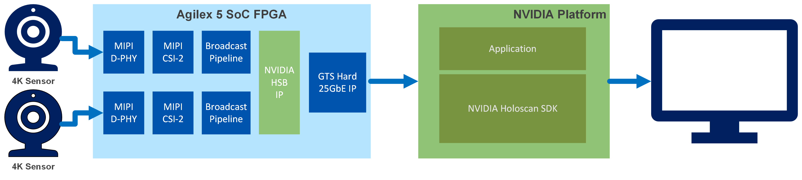

# Holoscan Sensor Bridge MIPI to 25GbE System Example Design for Agilex™ 5 Devices

The design is compatible with
[Altera® Quartus® Prime Pro Edition version 26.1 Linux].

## Overview

The Holoscan Sensor Bridge MIPI to 25GbE System Example Design for Agilex™ 5 Devices demonstrates an implementation of using industry-standard Mobile Industry Processor Interface (MIPI) D-PHY and MIPI CS1-2 interface on Agilex™ 5 FPGAs to integrate to a Holoscan processing flow.

The MIPI interface supports up to 3.5Gbps per lane and up to 8x lanes per MIPI
interface, enabling seamless data reception from multiple 4K image sensors to
the FPGA fabric for further processing. Each MIPI CSI-2 IP instance converts
pixel data to AXI4-Streaming outputs, enabling connectivity to other IP cores
within Altera's Video and Vision Processing (VVP) Suite.

The FPGA design comprises a MIPI D-PHY and MIPI CSI-2 interface connected to an NVIDIA Holoscan Sensor Bridge IP and Altera's 25GbE MAC IP.

The software comprises a number of demonstration applications running within [NVIDIA Holoscan Sensor Bridge SDK](https://github.com/altera-fpga/holoscan-sensor-bridge/tree/altera-release-2.6.0).

 

{:style="display:block; margin-left:auto; margin-right:auto; width: 80%"}

**High-Level Block Diagram of the Holoscan Sensor Bridge System Example Design**

## Example design build and run instructions can be found [here](https://github.com/altera-fpga/holoscan-sensor-bridge/tree/altera-release-2.6.0/fpga/altera/AGX_5E_065A_Modular_DevKit_HSB_MIPI_25GbE)

* [Example design instructions](https://github.com/altera-fpga/holoscan-sensor-bridge/tree/altera-release-2.6.0/fpga/altera/AGX_5E_065A_Modular_DevKit_HSB_MIPI_25GbE)

## Useful User Manuals and Reference Materials
* [Agilex™ 5 FPGA E-Series 065A Modular Development Kit].

## Notices & Disclaimers

Altera&reg; Corporation technologies may require enabled hardware, software or service activation.
No product or component can be absolutely secure. 
Performance varies by use, configuration and other factors.
Your costs and results may vary. 
You may not use or facilitate the use of this document in connection with any infringement or other legal analysis concerning Altera or Intel products described herein. You agree to grant Altera Corporation a non-exclusive, royalty-free license to any patent claim thereafter drafted which includes subject matter disclosed herein.
No license (express or implied, by estoppel or otherwise) to any intellectual property rights is granted by this document, with the sole exception that you may publish an unmodified copy. You may create software implementations based on this document and in compliance with the foregoing that are intended to execute on the Altera or Intel product(s) referenced in this document. No rights are granted to create modifications or derivatives of this document.
The products described may contain design defects or errors known as errata which may cause the product to deviate from published specifications.  Current characterized errata are available on request.
Altera disclaims all express and implied warranties, including without limitation, the implied warranties of merchantability, fitness for a particular purpose, and non-infringement, as well as any warranty arising from course of performance, course of dealing, or usage in trade.
You are responsible for safety of the overall system, including compliance with applicable safety-related requirements or standards. 
&copy; Altera Corporation.  Altera, the Altera logo, and other Altera marks are trademarks of Altera Corporation.  Other names and brands may be claimed as the property of others. 

OpenCL* and the OpenCL* logo are trademarks of Apple Inc. used by permission of the Khronos Group™. 

[Agilex™ 5 FPGA E-Series 065A Modular Development Kit]: https://www.altera.com/products/devkit/po-3278/agilex-5-fpga-and-soc-e-series-065a-modular-development-kit

[Altera® Quartus® Prime Pro Edition version 26.1 Linux]: https://www.intel.com/content/www/us/en/software-kit/851652/intel-quartus-prime-pro-edition-design-software-version-26-1-for-linux.html

