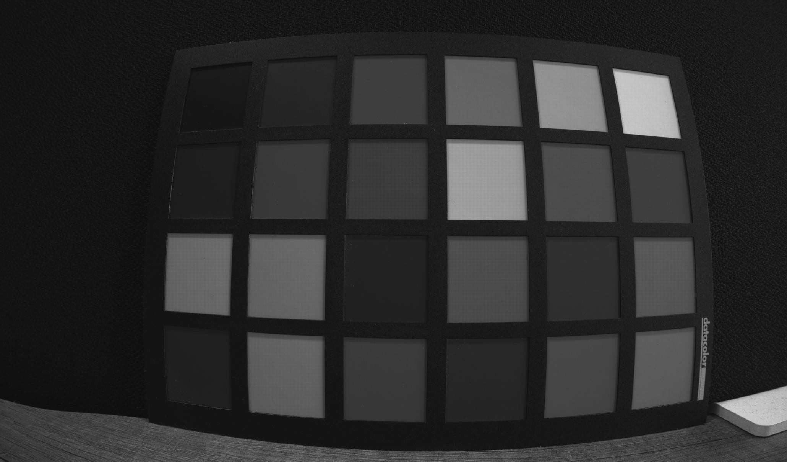
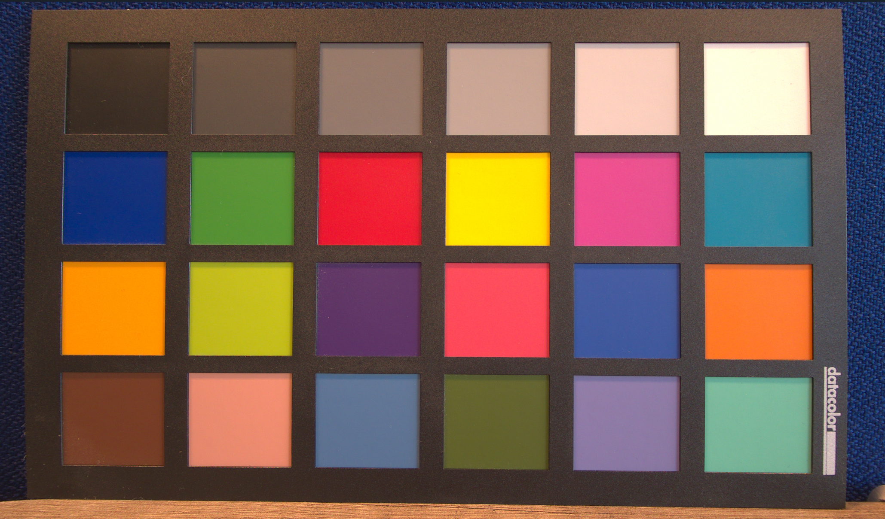

# 4Kp60 Multi-Sensor HDR Camera Solution System Example Design for Agilex™ 5 Devices

The design is compatible with
[Altera® Quartus® Prime Pro Edition version 26.1 Linux](https://www.altera.com/downloads/fpga-development-tools/quartus-prime-pro-edition-design-software-version-26-1-linux).

## Overview

The 4Kp60 Multi-Sensor HDR Camera Solution System Example Design for Agilex™ 5
Devices demonstrates a practical glass-to-glass camera solution. The exclusive
support for industry-standard Mobile Industry Processor Interface (MIPI) D-PHY
and MIPI CSI-2 interface on Agilex™ 5 FPGAs provides a powerful tool for camera
product development.

|
Sensor Output (ISP Input)
|
ISP Output
|
|-|-|
|  |  |

The MIPI interface supports up to 2.5Gbps per lane and up to 8x lanes per MIPI
interface, enabling seamless data reception from multiple 4K image sensors to
the FPGA fabric for further processing. Each MIPI CSI-2 IP instance converts
pixel data to AXI4-Streaming outputs, enabling connectivity to other IP cores
within Altera®'s Video and Vision Processing (VVP) Suite.

The design is a hardware-software co-design, whose hardware component comprises
an Image Signal Processor (ISP), various VVP IPs, Hard Processor Subsystem
(HPS) and various connectivity IPs. The software stack is Linux based and runs
on the HPS.

The hardware includes a multi-sensor input video switch feeding into an Image
Signal Processing (ISP) subsystem. The ISP is a video processing pipeline
incorporating many VVP IP cores such that the raw sensor image data can be
processed into RGB video data. The backend of the ISP pipeline also includes
adaptive local tone mapping (TMO) for handling wide dynamic range scenes,
1D-LUT and 3D-LUT IPs for color transformations and High Dynamic Range (HDR)
conversion, and a high-performance Warp IP core for geometric distortion
correction. The design drives the resulting 4Kp60 streaming video output data
through an Altera® DisplayPort IP.

The software stack consists of an application software binary running on Linux
operating system with various layers of drivers. The backend part of the
application software interrogates the hardware, discovers the IP components
dynamically and configures them. Multiple feedback loops monitor the hardware
and keep various hardware components in lockstep. Some of the notable feedback
loops are Automatic White Balance (AWB), Auto Exposure (AE), and Adaptive Noise
Reduction (ANR) algorithms, reading their relevant statistics and adjusting
various coefficients and Look Up Tables (LUTs) in real time. The frontend of
the software creates a web based Graphical User Interface (GUI) and runs it
over a web server.

## Detailed Design

The detailed design can be found at [camera_4k.md](https://github.com/altera-fpga/agilex5-ed-camera/blob/rel/26.1/docs/camera/camera_4k/camera_4k.md)

The project GitHub repository can be found at [https://github.com/altera-fpga/agilex5-ed-camera](https://github.com/altera-fpga/agilex5-ed-camera)

 

## Notices & Disclaimers

Altera&reg; Corporation technologies may require enabled hardware, software or service activation.
No product or component can be absolutely secure. 
Performance varies by use, configuration and other factors.
Your costs and results may vary. 
You may not use or facilitate the use of this document in connection with any infringement or other legal analysis concerning Altera or Intel products described herein. You agree to grant Altera Corporation a non-exclusive, royalty-free license to any patent claim thereafter drafted which includes subject matter disclosed herein.
No license (express or implied, by estoppel or otherwise) to any intellectual property rights is granted by this document, with the sole exception that you may publish an unmodified copy. You may create software implementations based on this document and in compliance with the foregoing that are intended to execute on the Altera or Intel product(s) referenced in this document. No rights are granted to create modifications or derivatives of this document.
The products described may contain design defects or errors known as errata which may cause the product to deviate from published specifications.  Current characterized errata are available on request.
Altera disclaims all express and implied warranties, including without limitation, the implied warranties of merchantability, fitness for a particular purpose, and non-infringement, as well as any warranty arising from course of performance, course of dealing, or usage in trade.
You are responsible for safety of the overall system, including compliance with applicable safety-related requirements or standards. 
&copy; Altera Corporation.  Altera, the Altera logo, and other Altera marks are trademarks of Altera Corporation.  Other names and brands may be claimed as the property of others. 

OpenCL* and the OpenCL* logo are trademarks of Apple Inc. used by permission of the Khronos Group™. 

 
