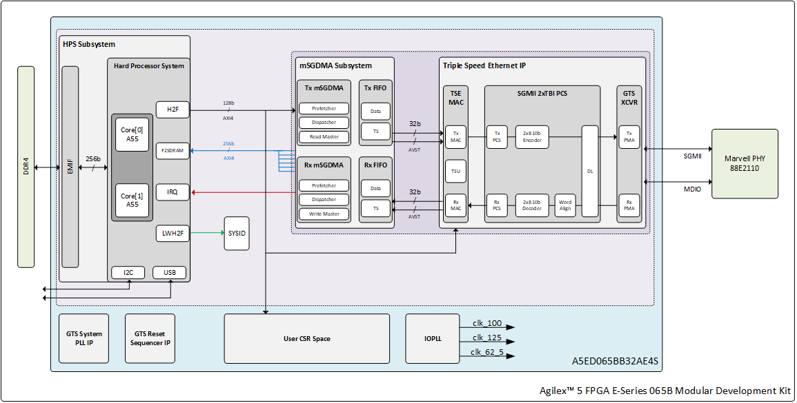
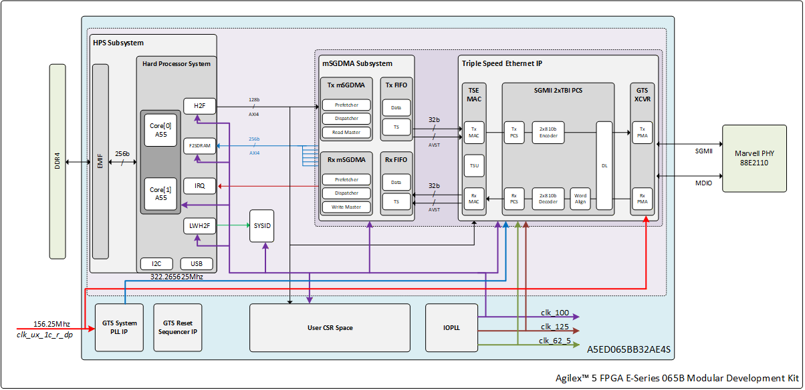
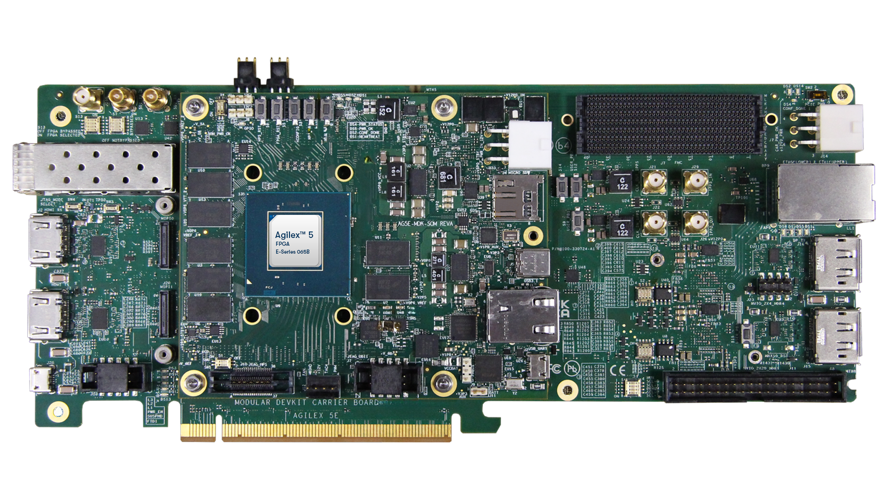
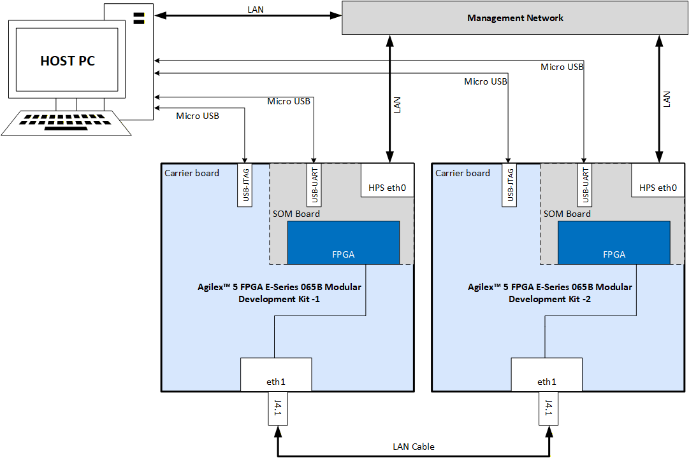
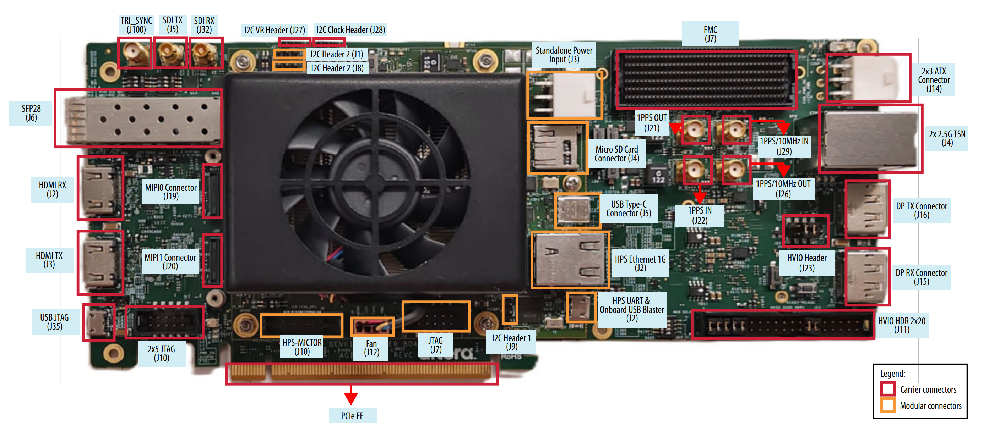

# Triple-Speed Ethernet System Example Design: Agilex&trade; 5 FPGA and SoC E-Series 065B Modular Development Kit

## Introduction

This page presents Agilex&trade; 5 FPGA and SoC E-Series 065B Modular Development Kit Triple-Speed Ethernet System Example Design on the Agilex&trade; 5 FPGA and SoC E-Series 065B Modular Development Kit and includes the following Quartus IPs such as Triple Speed Ethernet IP [ 10/100/1000 Ethernet MAC, 1000BASE-X SGMII 2xTBI PCS, MDIO for external transceiver control] per-direction(TX and RX) DMA subsystem for HPS memory access, HPS, DDR4 EMIF, and a Linux software environment.

The intended functional use cases are back-to-back operation at 10 Mbps, 100 Mbps, and 1000 Mbps; TCP and UDP over both IPv4 and IPv6; and Ethernet traffic across different frame sizes.

showcasing Ethernet functionality for applications that handle 10M/100M/1G data speed/bandwidth using Agilex&trade; 5 Device on Agilex&trade; 5 FPGA and SoC E-Series 065B Modular Development Kit. This design was created using Quartus IPs from Agilex&trade; 5 Device, facilitating the data and control paths between the Linux software stack running on HPS and the Hard Ethernet MAC with GTS Transceiver on Agilex&trade; 5 devices. This example design assists customers in leveraging and incorporating Ethernet solutions into their designs aimed at triple-speed Ethernet applications. The system example design is targeted to the Agilex&trade; 5 FPGA and SoC E-Series 065B Modular Development Kit for demonstration purposes.

### Overview

  The Agilex&trade; 5 FPGA and SoC E-Series 065B Modular Development Kit Triple-Speed Ethernet System Example Design developed using Altera&reg; Quartus&reg; Prime Pro Edition version 26.1. The design targets the [Agilex&trade; 5 FPGA and SoC E-Series 065B Modular Development Kit](https://www.altera.com/products/devkit/po-3274/agilex-5-fpga-and-soc-e-series-065b-modular-development-kit) and leverages the [Triple-Speed Ethernet IP for Agilex™ 3 and Agilex™ 5 devices](https://docs.altera.com/r/docs/813669/current) and Hard Processing System (HPS). It runs on a Linux OS based on kernel version 6.12.19lts.
  The design features the HPS driving the Ethernet traffic through DMA to Triple-Speed Ethernet IP configured in FPGA fabric.

  This System example design demonstrates Ethernet functionality of the Altera&reg; Agilex&trade; 5 FPGA supporting GTS transceivers. It provides a 1-Port, Triple-Speed Ethernet design leveraging the Triple-Speed Ethernet IP for Agilex™ 3 and Agilex™ 5 devices.

  The primary components in the design are:

* Hard Processor Subsystem (HPS).

* Channelized Modular scatter-Gather Direct Memory Access (MSGDMA) Subsystem.


* Triple-Speed Ethernet IP for Agilex™ 3 and Agilex™ 5 devices.



Figure 1. System Example Design high-level architecture diagram.

  Important features of the design include,

* Single Ethernet port working at 10M/100M/1G speed.
* HPS driving the Ethernet traffic through DMA to Triple-Speed Ethernet IP configured in FPGA fabric.
* Separate DMA channel per direction for HPS system memory accesses.  


### Glossary

| Term          | Description                                 |
|---------------|---------------------------------------------|
| HPS           | Hard Processor System                       |
| mSGDMA        | Modular Scatter-Gather Direct Memory Access |
| EMIF          | External Memory Interface                    |
| TSE           | Triple-Speed Ethernet                       |
| MDK           | Modular Development Kit                     |
| FSM           | Finite State Machine                        |
| SOM           | System-on-Module                            |
| AVMM          | Avalon® Memory Mapped Interface             |
| AVST          | Avalon® Streaming Interface                 |
| AXI           | Advanced eXtensible Interface               |
| HSSI          | High-Speed Serial Interface                 |

### Prerequisites

  The following are required to fully exercise the Agilex&trade; 5 FPGA and SoC E-Series 065B Modular Development Kit Triple-Speed Ethernet System Example Design:

* 2 Nos of Altera&reg; Agilex&trade; 5 FPGA and SoC E-Series 065B Modular Development Kit, ordering code MK-A5E065BB32AEA. Refer to [board documentation](https://docs.altera.com/r/docs/820977/current/agilextm-5-fpga-e-series-065b-modular-development-kit-user-guide/overview) for more information about the development kit.
  * Power supply.
  * 2 x Micro USB Cable.
  * RJ45 Ethernet LAN Cable.
  * Micro SD card and USB card writer.
* RJ45 Ethernet LAN Cable
* Host PC with
  * 64 GB of RAM recommended. (Less memory works only for exercising the binaries).
  * Linux OS installed. Ubuntu 22.04LTS recommended.
  * Serial terminal (for example GtkTerm or Minicom on Linux and TeraTerm or PuTTY on Windows).
  * Altera&reg; Quartus&reg; Prime Pro Edition Version 26.1.
  * Local Ethernet network, with DHCP server Internet connection. For downloading GitHub source package and rebuilding the Design.

_**NOTE**_: For UVM Simulation, additional 3rd Party tools and IPs are required as mentioned in Section [Tools/IP Pre-requisites](#toolsip-pre-requisites).

## Release Contents  

### Binaries

  Release notes and pre-built binaries can be found in the [GitHub repository](https://github.com/altera-fpga/agilex5e-ed-tse/releases/tag/SED-TSE-a5e065b-mdk-Q26.1-Rel-1.1).
  
  Directory Structure used in this example design:

```bash
|--- a5e065b-mod-devkit-exp-prod
  |   |--- src
  |   |   |--- hw
  |   |   |--- sw
```

  Clone the repository to get the source files as below.

  ```bash
  git clone https://github.com/altera-fpga/agilex5e-ed-tse.git
  cd agilex5e-ed-tse/
  git checkout SED-TSE-a5e065b-mdk-Q26.1-Rel-1.1
  cd a5e065b-mod-devkit-exp-prod/
  export TOP_FOLDER=`pwd`
  mkdir bin
  ```
  
  _The Pre-built Binaries (`Images.zip` and sdcard Image `sdimage.tar.gz`) are available in assets. Please extract and copy all files to `$TOP_FOLDER/bin` folder to exercise hardware testing on Development kit._

### Sources

| Component                             | Location                                                                                                                    | Branch                          | Commit ID/Tag                             |
|---------------------------------------|-----------------------------------------------------------------------------------------------------------------------------|---------------------------------|-----------------------------------------  |
| GHRD                                  | <https://github.com/altera-fpga/agilex5e-ed-tse/tree/rel/26.1/a5e065b-mod-devkit-exp-prod/src/hw>                         | rel/26.1                         |SED-TSE-a5e065b-mdk-Q26.1-Rel-1.1      |
| Linux                                 | <https://github.com/altera-fpga/linux-socfpga>                                                                              | socfpga-6.12.19-lts-ethernet-sed |SED-TSE-a5e065b-mdk-Q26.1-Rel-1.1      |
| Arm Trusted Firmware                  | <https://github.com/altera-fpga/arm-trusted-firmware>                                                                         | socfpga_v2.13.0                  | d1ca26265db2b4c3c4eb9c9bdb0d2547002058a6 |
| U-Boot                                | <https://github.com/altera-fpga/u-boot-socfpga>                                                                               | socfpga_v2025.07                 | e5f40a8ed1ec65f20c4e2491bfe8e738efce6d94 |
| Yocto Project: poky                   | <https://git.yoctoproject.org/poky/>                                                                                          | rel/26.1                         | 802e4c1135c4eb451e504996aa797c04736496d4 |
| Yocto Project: meta-intel-fpga        | <https://git.yoctoproject.org/meta-intel-fpga/>                                                                               | rel/26.1                         | 9714ae1ef8f22302bac60b7d2081bbdf3199ca70 |
| Yocto Project: meta-intel-fpga-refdes | <https://github.com/altera-fpga/meta-intel-fpga-refdes/>                                                                      | rel/26.1                         | bffc5bc012f1653beb58878b54b44e74b0f27404 |
| Yocto Project: meta-agilex5-sed       | <https://github.com/altera-fpga/agilex5e-ed-tse/tree/rel/26.1/a5e065b-mod-devkit-exp-prod/src/sw/yocto/meta-agilex5-sed>  | rel/26.1                         |SED-TSE-a5e065b-mdk-Q26.1-Rel-1.1      |
| GSRD Build Script: gsrd-socfpga       | <https://github.com/altera-fpga/agilex5e-ed-tse/blob/rel/26.1/a5e065b-mod-devkit-exp-prod/src/sw/yocto/build.sh>          | rel/26.1                         |SED-TSE-a5e065b-mdk-Q26.1-Rel-1.1      |

## Release Notes

   Refer to this link for [Known Issues](https://github.com/altera-fpga/agilex5e-ed-tse/releases/tag/SED-TSE-a5e065b-mdk-Q26.1-Rel-1.1).

## Agilex&trade; 5E-Series MDK Triple-Speed Ethernet Design Architecture

The Agilex&trade; 5 FPGA and SoC E-Series 065B Modular Development Kit features Triple-Speed Ethernet system example design that incorporates a single 1G Ethernet port, targeting the Triple Speed Ethernet IP and GTS Transceiver, integrated Agilex&trade; 5 Hard Processor System (HPS) running Linux software stack.

### Hardware Architecture

The system follows an HPS-centric architecture in which the Linux software stack on the HPS controls the Ethernet data path through memory-mapped control and DMA-based packet movement.

The core hardware blocks in this Design are:

* HPS Subsystem for Linux execution and system control.
* mSGDMA Subsystem for packet movement between HPS memory and Ethernet streaming interfaces.
* Triple Speed Ethernet IP containing MAC and PCS/PMA functions.
* External Marvell 88E2110 PHY connected through SGMII and managed through MDIO.

#### HPS Subsystem

The HPS contains the ARM CPU complex used to run Linux, networking software, drivers, and optional PTP software such as ptp4l.

The HPS-to-FPGA address map uses both H2F and lightweight H2F windows for peripheral access.

#### Triple Speed Ethernet IP

The Triple Speed Ethernet IP includes both the 10/100/1000 Ethernet MAC and the 1000BASE-X SGMII 2xTBI PCS with embedded PMA connectivity toward an external SERDES/PHY component. The external PHY is the Marvell 88E2110.

The MAC handles data flow between user applications and the external Ethernet PHY, exposes configuration and status registers, and requires TX_ENA and RX_ENA to be set last because MAC operation begins immediately once those bits are asserted.

The PCS implements IEEE 802.3 Clause 36 behavior, operates in SGMII mode, interfaces internally through TBI, and supports transmit encapsulation/8b10b encoding plus receive comma detection, decoding, de-encapsulation, synchronization, and carrier sense.

Auto-negotiation is enabled by default and supports 10/100/1000 Mbps operation. It can also be bypassed by disabling auto-negotiation and explicitly programming the interface mode and speed fields in the PCS and PHY.

#### MDIO Management

The MAC implements MDIO using IEEE 802.3 Clause 22 access semantics for external PHY management.

To access a PHY, software writes the PHY address into MDIO ADDR 0|1 and then performs reads or writes through MDIO SPACE 0|1. The design supports mapping up to two PHY devices into the MAC register space at one time, and only bits [15:0] of each MDIO data register are significant.

When two external PHY devices are present in an x2 topology, a single TSE MAC can manage both PHYs by using both MDIO register banks.

#### mSGDMA Subsystem

The mSGDMA subsystem is a legacy soft DMA architecture that performs AVMM-to-AVST conversion and is assembled from Platform Designer building blocks such as prefetchers, read/write masters, and dispatchers for each traffic direction.

Each DMA direction exposes three independent AVMM interfaces, and the architecture is arranged so read and write traffic can proceed in parallel toward the HPS F2SDRAM interface.

The DMA data width is fixed at 128 bits so the same subsystem can be reused across supported data rates without re-validation of DMA width changes.

The TX wrapper adds packet-aligned buffering, timestamp request handling, and fingerprint generation/validation. A fingerprint mismatch is reported into user CSR space and can raise an interrupt to the HPS.

The RX wrapper stores packets and receive timestamps, supports pause-control interaction, and transfers timestamp data into the host-facing path together with packet reception handling.

### FPGA Clocking Architecture

The component and signal identifiers used in this section follow the naming convention from The Agilex&trade; 5 FPGA and SoC E-Series 065B Modular Development Kit Triple-Speed Ethernet system example design Quartus&reg; Prime project.

A high-level FPGA system-level clock architecture is shown in the figure below.



Figure 4. System high-level clocking diagram.

For the clock frequencies associated with the Ethernet Subsystem IP ports `i_clk_ref_p` (PLL Reference clock), `i_clk_sys` (system PLL reference clock), the system example design follows the guidelines provided in the [Triple-Speed Ethernet IP User Guide: Clocking Scheme of MAC with 2XTBI PCS and Embedded PMA (GTS)](https://docs.altera.com/r/docs/813669/26.1/triple-speed-ethernet-ip-user-guide-agilextm-3-and-agilextm-5-fpgas-and-socs/clocking-scheme-of-mac-with-2xtbi-pcs-and-embedded-pma-gts).

| **Clock**                             | **Frequency**   | **Reference Clock**                    | **Description**                                                                        |
| --------------------------------------| --------------- | -------------------------------------- |----------------------------------------------------------------------------------------|
| clk_100                               | 100 MHz         | fpga_clk_100 (100 MHz)                 | Reference clock for HPS F2H/HPS data path along with mSGDMA subsystem.                 |
| clk_125                               | 125 MHz         | fpga_clk_100 (100 MHz)                 | For driving clocks for  TSE Ethernet interfaces                          |
| clk_62_5                               | 62.5 MHz         | fpga_clk_100 (100 MHz)                 | For driving clocks for  TSE Ethernet interface.                          |
| tx_pll_ref_clk_i                      | 156.25 MHz      | i_clk_ref                              | GTS TX Transceiver reference clock.                 |
| syspll_ref_clk_i                      | 322.265625 MHz   | i_clk_sys                             | System PLL reference clock.                         |

Table 1. General clock signals for the system example design  datapath.

### FPGA Reset Architecture

This example design triggers partial or full resets under three different scenarios:

* **Power-on Reset (NINIT_DONE):** The system resets the entire mSGDMA subsystem for all Ethernet ports and all glue logic, including Ethernet subsystem during power-on.
* **Peer Link Down:** The system resets the Ethernet subsystem and glue logic for a specific port per direction when the peer on the LAN goes down. The mSGDMA subsystem for that particular port remains functional along with other ports in this partial reset scenario.
* **Local Link Down:** The local system brings down the link, which resets both the mSGDMA subsystem and the glue logic for the Ethernet port. The system limits this reset to the particular port being targeted while keeping the rest of the ports functional.

### Software Architecture

The Software Archtecture of the Design described in the following sections.

#### Architecture Overview

The Agilex&trade; 5 Triple-Speed Ethernet System Example Design follows an HPS-first design approach. This section provides an overview of the design approach, Ethernet Subsystem IP control.

#### HPS-First Design Approach

The Hard Processor System (HPS) initializes first and then configures the FPGA fabric. The HPS loads the uBoot image from SPI flash. The secondary boot loader loads the final kernel and FPGA configuration bitstream. The uBoot secondary boot loader activates the HPS bridges and programs the FPGA through its connection to the SDM. Once the FPGA is programmed, the HPS proceeds to boot the Linux operating system.

The software bring-up model is HPS-first: software configures the external PHY through MDIO, configures TSE MAC and PCS register space, manages resets and link recovery, and services DMA completion and error interrupts.

#### External PHY Configuration Flow

A detailed configuration sequence for the external PHY. At a high level, software should:

* Select the target PHY address through mdio_addr1 and trigger MDIO transactions through the MDIO register space.
* Program PHY port-control settings for SGMII auto-negotiation on or off.
* Run SERDES initialization and wait for completion.
* Configure copper-specific and advertisement registers as required.
* Enable or disable auto-negotiation and select operating speed.
* Reset PCS/PMA control where required and then poll link-up status.

For direct Clause 45 MMD accesses, the document also provides explicit read and write sequences using MDIO registers 13 and 14.

#### TSE MAC and PCS Bring-Up Flow

A practical TSE initialization sequence is:

* Disable MAC TX and RX before reconfiguration.
* Program PCS mode for SGMII with either auto-negotiation enabled or a fixed speed selection.
* Apply PCS soft reset and wait for self-clear.
* Configure MAC thresholds, frame-length, pause, and MAC address registers if needed.
* Apply MAC reset and configure command options such as padding and address insertion.
* Enable `TX_ENA` and `RX_ENA` as the final step.

#### Link Monitoring and Recovery

Software should monitor link-health indicators such as `rx_pcs_ready`, `tx_lanes_stable`, `tx_pll_locked`, and `rx_cdr_locked` and pause traffic on link-down conditions before resetting or reinitializing the affected path.

The design also includes logic expectations for dummy timestamp handling during certain link-down and recovery scenarios when timestamp return ordering would otherwise be disrupted.

#### Agilex&trade; 5 SoC-FPGA  Drivers

##### Triple-Speed Ethernet IP Drivers

The Triple-Speed Ethernet IP driver acts as a bridge between the software operating in the HPS and Ethernet subsystem which consists of Triple-Speed Ethernet IP with associate IPs and sw glue logic. It provides various levels of abstraction to simplify communication with the underlying Triple-Speed Ethernet IP. The Triple-Speed Ethernet IP driver exposes APIs used by Ethernet netdev driver that higher-level software layers can utilize to interact with the Ethernet IP. Some of the abstractions offered by the Triple-Speed Ethernet IP driver include:

* Get Link state.
* Get MAC stats.

These abstractions are used by the HSSI Ethernet netdev driver to provide Ethernet functionality to the above layers.

#### HSSI Ethernet and Associated Driver

The HSSI Ethernet netdev driver offers a network device interface (Linux netdev interface) to the Linux kernel. It registers all the necessary interfaces to enable the corresponding functionalities provided by the system like:

* mSGDMA support for data movement.

#### MDIO PHY Interface

The MAC function implements the standard MDIO specification, IEEE 803.2 standard Clause 22, to access the external PHY device management registers. 

To access each PHY device, write the PHY address to the MDIO ADDR 0|1 register followed by the transaction data to the MDIO SPACE 0|1. 

The MAC function allows up to two PHY devices to be mapped in its register space at any one time.  Subsequent transactions to the same PHYs do not require writing the PHY addresses. 

MDIO SPACE 0|1 map to register 0 to 31 of the PHY device(s) whose addresses are configured in the MDIO ADDR 0|1 registers.  For example, register 0 of PHY device 0 maps to DWORD offset 0x80, register 1 to DWORD offset 0x81, and so forth. 

Reading or writing to MDIO SPACE 0|1 immediately triggers a corresponding MDIO transaction to read or write the PHY register.  Only bits [15:0] of each register are significant.  Write 0 to bits [31:16] and ignore them on reads. 

If two external PHY devices are implemented, while SGMII is implemented across two TSE IPs, only single MDIO port is provided; therefore, single TSE MAC function implements two PHY devices by utilizing both MDIO registers 0 and 1.

#### User Space Applications

#### ethtool

`ethtool` is a well-known open-source utility used to query network driver and hardware settings. For more information on ethtool, please refer to the [ethtool man](https://linux.die.net/man/8/ethtool) page.

## Address Map Details

### Address Map

| **Subordinate Name**                            | **Component**                 | **Agilex&trade; HPS H2F AXI Master**  | **Register Description**                                     |
| ------------------------------------------------| ------------------------------| --------------------------------------| ------------------------------------------------------------ |
| intel_eth_tse_0.control_port                    | Ethernet (TSE) Subsystem CSR  | 0x0000_0000 - 0x0000_03ff             |                                                              |
| top.soc_inst.subsys_msgdma                      | mSGDMA subsystem              | 0x0500_0000 - 0x0500_00ff             | [Register Map](https://docs.altera.com/r/docs/683130/26.1/embedded-peripherals-ip-user-guide/register-map-of-msgdma)|
| top.soc_inst.subsys_msgdma.tx_msgdma_prefetcher | mSGDMA TX 0 Prefetcher                | 0x5000_0000 - 0x5000_001f     |                 |
| top.soc_inst.subsys_msgdma.tx_msgdma_dispatcher | mSGDMA TX 0 Dispatcher                | 0x5000_0020 - 0x5000_003f     |                 |
| top.soc_inst.subsys_msgdma.tx_dma_fifo_0        | mSGDMA TX 0 FIFO                      | 0x5000_0040 - 0x5000_005f     |                 |
| top.soc_inst.subsys_msgdma.rx_msgdma_prefetcher | mSGDMA RX 0 Prefetcher                | 0x5000_0080 - 0x5000_009f     |                 |
| top.soc_inst.subsys_msgdma.rx_msgdma_dispatcher | mSGDMA RX 0 Dispatcher                | 0x5000_00a0 - 0x5000_00bf     |                 |
| top.soc_inst.subsys_msgdma.rx_gdma_fifo_0       | mSGDMA RX 0 FIFO                      | 0x5000_00c0 - 0x5000_00cf     |                 |

Table 2.  system address map.

### Interrupt Map

Interrupts to be implemented in:

* mSGDMA subsystem (per port TX/RX) to indicate HPS that, packet has been transmitted/received from any of the Prefetcher.

| Interrupt                           | F2H IRQ   |
| ----------------------------------- | --------- |
| mSGDMA 0 TX        | 2         |
| mSGDMA 0 RX        | 3         |

Table 3. Interrupt map.

## Hardware Setup



**Figure 7.** Agilex&trade; 5 FPGA and SoC E-Series 065A Madular Development Kit.

Set up the board default settings, as listed by the Agilex&trade; 5 FPGA and SoC E-Series 065A Modular Development Kit  User Guide, "[Default Settings](https://docs.altera.com/r/docs/820977/current/agilex-5-fpga-e-series-065b-modular-development-kit-user-guide/default-settings)" section:

Refer this [Section](#prerequisites) for hardware pre-requisites required to setup the Hardware.

The Board-to-Board hardware setup connection details are captured in the image below.



**Figure 8.** Board level connection between Development kits

Connect the Type B USB cable from each development kit (J2 & J35 - Highlighted in  below Figure) to the host for JTAG access.

Connect the two Agilex&trade; 5 FPGA and SoC E-Series Modular Development Kits  with a LAN cable via the RJ45 cage - J4.1 (Highlighted in below Figure).


**Figure 9.** Board interface location of Development kit.

### Configure Boards

1. Leave all jumpers and switches in their default configuration. Please refer [Development kit default switch settings](https://docs.altera.com/r/docs/820977/current/agilextm-5-fpga-e-series-065b-modular-development-kit-user-guide/default-settings).

2. Connect micro USB cable from bottom right of the SOM board to PC. This will be used for JTAG & HPS UART communication.

3. Connect Ethernet cable from SOM board to an Ethernet switch connected to local network(^ **NOTE 1**).

4. Connect two Agilex&trade; 5 FPGA and SoC E-Series 065B Modular Development Kits using a RJ45 LAN cable via the J4 RJ45(A-Port) Lower port(^ **NOTE 2**).

5. Power ON the boards. Please refer section [Powering Up the Development Kit](https://docs.altera.com/r/docs/820977/current/agilextm-5-fpga-e-series-065b-modular-development-kit-user-guide/powering-up-the-development-kit) for Powering ON  process.

_NOTE:_

1. Local network with  DHCP server is must if you are opting for TFTP Booting.
2. Using Two Development kits are used as reference for this Example Design, however the Design will work with one Development kit along with any 1G Host(PC/Laptop) used as replacement for another Development kit.

## User Flow

 There are two ways to test the design based on use case.

 **User Flow 1**: Testing with Prebuild Binaries.

 **User Flow 2**: Testing Complete Flow.

 |User Flow|Description|Required for User Flow 1|Required for User Flow 2|
 |-|-|-|-|
 |[Environment Setup](#environment-setup)|[Tools Download and Installation](#tools-download-and-installation)|Yes|Yes|
 ||[Install dependency packages for SW compilation](#installing-dependency-packages-for-sw-compilation)|No|Yes|
 ||[Package Download](#package-download)|Yes|Yes|
 |[Compilation](#compile-the-design)|[HW compilation](#hardware-compilation)|No|Yes|
 ||[SW compilation](#software-compilation)|No|Yes|  
 ||[Custom SW compilation](#customize-yocto)|No|Yes|
 |[Programming](#programming)|[Programming the HW binary](#programming-hardware-binary)|Yes|Yes|
 ||[Programming the SW binary](#programming-software-image)|Yes|Yes|
 ||[Linux boot](#linux-boot)|Yes|Yes|
 ||[Ethernet Status](#ethernet-link-status)|Yes|Yes|
 ||[Configuring Design](#configuring-design)|Yes|Yes|
 |[Testing](#testing)|[Run Ping Test](#link-testing---ping) |Yes|Yes|
 ||[Run iPerf3 Test](#iperf3-testing)|Yes|Yes|
 |[Simulation](#simulation)|[Simulating Test cases](#simulating-test-cases) |No|Yes|

## Environment Setup

### Tools Download and Installation

1. Altera&reg; Quartus&reg; Prime Pro

    Download the Quartus&reg; Prime Pro Edition software version 26.1 from the FPGA Software Download Center [webpage](https://www.altera.com/downloads/fpga-development-tools/quartus-prime-pro-edition-design-software-version-26-1-linux) of the Altera website. Follow the on-screen instructions to complete the installation process. Choose an installation directory that is relative to the Quartus&reg; Prime Pro Edition software installation directory.
    Set up the Altera&reg; Quartus&reg; tools in the PATH, so they are accessible without full path.
    Enable Altera&reg; Quartus&reg; tools to be called from command line.

    ```bash
    export QUARTUS_ROOTDIR=~/altera_pro/26.1/quartus/
    export PATH=$QUARTUS_ROOTDIR/bin:$QUARTUS_ROOTDIR/linux64:$QUARTUS_ROOTDIR/../qsys/bin:$PATH
    ```

2. Win32 Disk Imager

    Download and install the latest [Win32 Disk Imager](https://win32diskimager.org/). This tool will used for loading SD card image.

### Installing Dependency Packages for SW Compilation

Download the compiler toolchain, add it to the PATH variable, to be used by the GHRD makefile to build the HPS Debug FSBL.

```bash
wget https://developer.arm.com/-/media/files/downloads/gnu/11.3.rel1/binrel/\
arm-gnu-toolchain-11.3.rel1-x86_64-aarch64-none-linux-gnu.tar.xz
tar xf arm-gnu-toolchain-11.3.rel1-x86_64-aarch64-none-linux-gnu.tar.xz
rm -f arm-gnu-toolchain-11.3.rel1-x86_64-aarch64-none-linux-gnu.tar.xz
export PATH=`pwd`/arm-gnu-toolchain-11.3.rel1-x86_64-aarch64-none-linux-gnu/bin:$PATH
export ARCH=arm64
export CROSS_COMPILE=aarch64-none-linux-gnu-
```

### Yocto Build Prerequisites /Setup Environment

Make sure you have Yocto system requirements met <https://docs.yoctoproject.org/3.4.1/ref-manual/system-requirements.html#supported-linux-distributions>.

The command to install the required packages on Ubuntu 22.04-LTS is.

  ```bash
  sudo apt-get update
  sudo apt-get upgrade
  sudo apt-get install openssh-server mc libgmp3-dev libmpc-dev gawk wget git diffstat unzip texinfo gcc \
  build-essential chrpath socat cpio python3 python3-pip python3-pexpect xz-utils debianutils iputils-ping \
  python3-git python3-jinja2 libegl1-mesa libsdl1.2-dev pylint xterm python3-subunit mesa-common-dev zstd \
  liblz4-tool git fakeroot build-essential ncurses-dev xz-utils libssl-dev bc flex libelf-dev bison xinetd \
  tftpd tftp nfs-kernel-server libncurses5 libc6-i386 libstdc++6:i386 libgcc++1:i386 lib32z1 \
  device-tree-compiler curl mtd-utils u-boot-tools net-tools swig -y
  export LC_ALL="en_US.UTF-8"
  export LC_CTYPE="en_US.UTF-8"
  export LC_NUMERIC="en_US.UTF-8"
  export LANG=en_US.UTF-8
  export LANGUAGE=en_US.UTF-8
  ```

On Ubuntu 22.04 you will also need to point the `/bin/sh` to `/bin/bash`, as the default is a link to /bin/dash

  ```bash
  sudo ln -sf /bin/bash /bin/sh
  ```

Note: You can also use a Docker container to build the Yocto recipes, refer to <https://rocketboards.org/foswiki/Documentation/DockerYoctoBuild> for details. When using a Docker container, it does not matter what Linux distribution or packages you have installed on your host, as all dependencies are provided by the Docker container.

### Package Download

Clone the repository to get the source package for the System Example Design

  ```bash
  git clone https://github.com/altera-fpga/agilex5e-ed-tse.git
  cd agilex5e-ed-tse/
  git checkout SED-TSE-a5e065b-mdk-Q26.1-Rel-1.1
  cd a5e065b-mod-devkit-exp-prod/
  export TOP_FOLDER=`pwd`
  mkdir bin
  ```

## Compile the Design

Below section provides the steps to build both Hardware (hw) and Software (sw) files.

## Compiling the Hardware Design

The next section presents the steps to Compile the Hardware design using Altera&reg; Quartus&reg; Prime Pro 26.1 version.

### Hardware Compilation

The `synth` folder contains a `Makefile` and the Altera&reg; Quartus&reg; Project.The `Makefile` support various compile options such as,

* `make compile` - runs the compile stage of Altera&reg; Quartus&reg;
* `make synth` - runs synthesis stage of Altera&reg; Quartus&reg;
* `make all` - runs a full Altera&reg; Quartus&reg; compile including the Assembler

  ```bash
  cd $TOP_FOLDER/src/hw/synth/
  make all
  ```

Alternatively, if using the GUI is preferred, the `top.qpf` file can be opened in Altera&reg; Quartus&reg; and compile option can be executed.

The following file will be generated.

`$TOP_FOLDER/src/hw/output_files/top.sof`

### Build HPS and CORE RBF file

The configuration bitstream generated after an Altera&reg; Quartus&reg; Prime compilation contains both the FPGA core and I/O sections, as well as the HPS First-Stage Bootloader (FSBL). Once the system example design is recompiled, you must integrate the `.hex` file containing the U-Boot FSBL into the new bitstream [`u-boot-spl-dtb.hex`](https://github.com/altera-fpga/agilex5e-ed-tse/tree/rel/26.1/a5e065b-mod-devkit-exp-prod/src/sw/artifacts/u-boot-spl-dtb.hex)

To integrate the `.hex` file into the new bitstream execute the following command.

  ```bash
  cd $TOP_FOLDER
  quartus_pfg -c -o hps=on -o hps_path=src/sw/artifacts/u-boot-spl-dtb.hex src/hw/synth/output_files/top.sof bin/top.rbf
  ```

The following files are generated.

* `$TOP_FOLDER/bin/top.hps.rbf` - HPS First configuration bitstream, phase 1 (HPS and DDR)
* `$TOP_FOLDER/bin/top.core.rbf`- HPS First configuration bitstream, phase 2 (FPGA fabric)

### Build QSPI Image

This step will generate the QSPI Flash Image for on-board QSPI Flash.

  ```bash
  cd $TOP_FOLDER
  rm -f bin/top.hps.jic bin/top.core.rbf

  # Note : If user doing compilation first time, download the prebuilt u-boot-spl-dtb.hex  file and create the following path $TOP_FOLDER/src/sw/agilex5_mk_a5e065bb32aes1-gsrd-images/u-boot-agilex5-socdk-gsrd-atf/ and copy the u boot file here.

  quartus_pfg \
  -c src/hw/synth/output_files/top.sof bin/top.jic \
  -o device=MT25QU128 \
  -o flash_loader=A5ED065BB32AE4S \
  -o hps_path=src/sw/artifacts/u-boot-spl-dtb.hex \
  -o mode=ASX4 \
  -o hps=1
  ```

The following file will be created.
  
`$TOP_FOLDER/bin/top.hps.jic`

### Software Compilation

### Build Yocto

the Yocto builds everything required for a boot of the devkit with the design. To start building please use the devkit specific build script

  ```bash
  cd $TOP_FOLDER/src/sw/yocto/
  . agilex5_mk_a5e065bb32aes1-TSE_1P-build.sh
  build_default
  ```

All the required images are captured in the agilex5_mk_a5e065bb32aes1-gsrd-images directory after a successful build.
The build process time depends on the resource specifications of the Host being used to build the software. After a successful compilation process for the 10G system example design.

The following files are created.

* `$TOP_FOLDER/src/sw/yocto/agilex5_mk_a5e065bb32aes1-gsrd-images/u-boot-agilex5-socdk-gsrd-atf/u-boot-spl-dtb.hex`
* `$TOP_FOLDER/src/sw/yocto/agilex5_mk_a5e065bb32aes1-gsrd-images/u-boot.itb`
* `$TOP_FOLDER/src/sw/yocto/agilex5_mk_a5e065bb32aes1-gsrd-images/kernel_sed.itb`
* `$TOP_FOLDER/src/sw/yocto/agilex5_mk_a5e065bb32aes1-gsrd-images/sdimage.tar.gz`

Copy the `sdimage.tar.gz` and `kernel_sed.itb` to `bin` folder.

  ```bash
  cp -rf $TOP_FOLDER/src/sw/yocto/agilex5_mk_a5e065bb32aes1-gsrd-images/sdimage.tar.gz $TOP_FOLDER/bin/sdimage.tar.gz
  cp -rf $TOP_FOLDER/src/sw/yocto/agilex5_mk_a5e065bb32aes1-gsrd-images/kernel_sed.itb $TOP_FOLDER/bin/kernel_sed.itb
  ```

### Customize Yocto

If changes are made to the Hardware Design project, for example adding Signal Tap , you must rebuild the HPS software. The HPS second stage bootloader have the FPGA core bitstream SHA signature embedded in the compile process, with an bitstream update the SHA calculation change and needs to be updated in the second stage bootloader.
Follow the next steps to update the FPGA core bitstream used in the HPS second stage bootloader.

1. Save the `top.core.rbf` as `$TOP_FOLDER/src/sw/yocto/meta-agilex5-sed/recipes-bsp/ghrd/files/agilex5_mk_a5e065bb32aes1_gsrd_ghrd_TSE_1P.core.rbf`

2. Update the recipe `$TOP_FOLDER/src/sw/yocto/meta-agilex5-sed/recipes-bsp/ghrd/hw-ref-design.bb`  from below commands.

  ```bash
  cd $TOP_FOLDER
  CORE_RBF=src/sw/yocto/meta-agilex5-sed/recipes-bsp/ghrd/files/agilex5_mk_a5e065bb32aes1_gsrd_ghrd_TSE_1P.core.rbf
  rm -rf $CORE_RBF
  cp -f bin/top.core.rbf $CORE_RBF
  FILE=src/sw/yocto/meta-agilex5-sed/recipes-bsp/ghrd/hw-ref-design.bbappend
  CORE_SHA=$(sha256sum $CORE_RBF | cut -f1 -d" ") 
  OLD_SHA=".*sha256sum_TSE_1P.*"
  NEW_SHA="sha256sum_TSE_1P = \"$CORE_SHA\"" 
  sed -i "s/$OLD_SHA/$NEW_SHA/" "$FILE"
  ```

After executing above step please proceed for rebuilding the design as mention [Build Yocto](#build-yocto).

## Programming

If following User Flow 1, download the [Prebuild Binaries](#binaries). Ensure all steps under [Hardware Setup](#hardware-setup) are completed before proceeding.

The Embedded Linux operating system running on the  Agilex&trade; 5 FPGA and SoC E-Series 065B Modular Development Kit can be accessed using a Serial Communication program such as Mincom or Putty. Start by identifying the assigned ID for each of your serial connections between the host and the development kits. Please make sure to POWER ON the boards.

### Programming Software Image

The SD card image file `sdimage.tar.gz` is provided in  [Release package](https://github.com/altera-fpga/agilex5e-ed-tse/releases/tag/SED-TSE-a5e065b-mdk-Q26.1-Rel-1.1), you may refer to [Release Content](#release-contents) for more details.

Follow the instructions under ["Write SD Card"](https://altera-fpga.github.io/rel-26.1/embedded-designs/agilex-5/e-series/modular-065b/gsrd/ug-gsrd-agx5e-modular-065b/#booting-from-sd-card) from the HPS GSRD User Guide for the Agilex&trade; 5 E-Series Modular Dev Kit to create a boot-able SD card with this image file.

### Programming Hardware binary

Users can choose either to flash the QSPI flash using `top.hps.jic` file or to program the FPGA with `top.hps.rbf` file. Below two section provide the details for both process. Flashing QSPI provides default Power-ON booting of the design where as the FPGA programming with hps.rbf needs to be carried out on every power cycle.

#### Write QSPI Flash

Refer to the [Documentation](https://altera-fpga.github.io/rel-26.1/embedded-designs/agilex-5/e-series/modular-065b/gsrd/ug-gsrd-agx5e-modular-065b/#booting-from-qspi) for detailed steps. Identify the FPGA device position in the JTAG chain by using `jtagconfig` and program flash using `quartus_pgm`.

  ```bash
  cd $TOP_FOLDER
  jtagconfig
  quartus_pgm -c 1 -m jtag -o "pvi;./bin/top.hps.jic@2" 
  #  If FPGA device in position #1 no need to mention the position number, by default it will take position
  ```

Please execute above command for both the development kits to update QSPI flash with new binaries.

#### Program FPGA

Using the Altera&reg; Quartus&reg; Programmer Tool Version 26.1, configure the onboard Agilex&trade; 5 device with `top.hps.rbf`. Alternatively, you can achieve the same goal through command line with the following steps.
Verify that all devices from the development kit are recognized and check the JTAG cable number assigned to the development kit with

**Command:**

  ```bash
  jtagconfig
  ```

**Output :**

  ```bash
  mbk@bapvedev135t:~$ jtagconfig
  1) SM72 MDK OB-SOM UBIII [1-5-iface0]
    4BA06477   ARM_CORESIGHT_SOC_600
    4364F0DD   A5EC065(AB32A|BB32A)/..

  2) SM72 MDK OB-SOM UBIII [1-6-iface0]
    4BA06477   ARM_CORESIGHT_SOC_600
    4364F0DD   A5EC065(AB32A|BB32A)/..
  # Here, FPGA device in position #2
  ```

From the previous output, you can see that two Agilex&trade; 5 FPGA and SoC E-Series 065B Modular Development Kit are visible, both of them have all their devices identified correctly and that they have been assigned to cable 1) and 2).
Now you can configure the development kits from your host with the following command.

**Command:**

```bash
cd $TOP_FOLDER
quartus_pgm -c 1 -m jtag -o "p;./bin/top.hps.rbf@2" && quartus_pgm -c 2 -m jtag -o "p;./bin/top.hps.rbf@2"
```

**Output :**

```bash
mbk@bapvedev135t:~$ quartus_pgm -c 1 -m jtag -o "p;./bin/top.hps.rbf@2" && quartus_pgm -c 2 -m jtag -o "p;./bin/top.hps.rbf@2"
Info: *******************************************************************
Info: Running Quartus Prime Programmer
    Info: Version 26.1.0 Build 110 03/26/2026 SC Pro Edition
    Info: Copyright (C) 2026  Altera Corporation. All rights reserved.
    Info: Your use of Altera Corporation's design tools, logic functions 
    Info: and other software and tools, and any partner logic 
    Info: functions, and any output files from any of the foregoing 
    Info: (including device programming or simulation files), and any 
    Info: associated documentation or information are expressly subject 
    Info: to the terms and conditions of the Altera Program License 
    Info: Subscription Agreement, the Altera Quartus Prime License Agreement,
    Info: the Altera IP License Agreement, or other applicable license
    Info: agreement, including, without limitation, that your use is for
    Info: the sole purpose of programming logic devices manufactured by
    Info: Altera and sold by Altera or its authorized distributors.  Please
    Info: refer to the Altera Software License Subscription Agreements 
    Info: on the Quartus Prime software download page.
    Info: Processing started: Fri Jul 24 15:07:56 2026
    Info: System process ID: 477968
Info: Command: quartus_pgm -c 1 -m jtag -o p;./top.hps.rbf@2
Info (213045): Using programming cable "SM72 MDK OB-SOM UBIII [1-5-iface0]"
Info (213011): Using programming file ./top.hps.rbf with checksum 0x1CF64063 for device A5ED065BB32A@2
Info (209060): Started Programmer operation at Fri Jul 24 15:07:56 2026
Info (18942): Configuring device index 2
Info (18943): Configuration succeeded at device index 2
Info (209011): Successfully performed operation(s)
Info (209061): Ended Programmer operation at Fri Jul 24 15:07:57 2026
Info: Quartus Prime Programmer was successful. 0 errors, 0 warnings
    Info: Peak virtual memory: 1740 megabytes
    Info: Processing ended: Fri Jul 24 15:07:57 2026
    Info: Elapsed time: 00:00:01
    Info: System process ID: 477968
Info: *******************************************************************
Info: Running Quartus Prime Programmer
    Info: Version 26.1.0 Build 110 03/26/2026 SC Pro Edition
    Info: Copyright (C) 2026  Altera Corporation. All rights reserved.
    Info: Your use of Altera Corporation's design tools, logic functions 
    Info: and other software and tools, and any partner logic 
    Info: functions, and any output files from any of the foregoing 
    Info: (including device programming or simulation files), and any 
    Info: associated documentation or information are expressly subject 
    Info: to the terms and conditions of the Altera Program License 
    Info: Subscription Agreement, the Altera Quartus Prime License Agreement,
    Info: the Altera IP License Agreement, or other applicable license
    Info: agreement, including, without limitation, that your use is for
    Info: the sole purpose of programming logic devices manufactured by
    Info: Altera and sold by Altera or its authorized distributors.  Please
    Info: refer to the Altera Software License Subscription Agreements 
    Info: on the Quartus Prime software download page.
    Info: Processing started: Fri Jul 24 15:07:58 2026
    Info: System process ID: 478008
Info: Command: quartus_pgm -c 2 -m jtag -o p;./top.hps.rbf@2
Info (213045): Using programming cable "SM72 MDK OB-SOM UBIII [1-6-iface0]"
Info (213011): Using programming file ./top.hps.rbf with checksum 0x1CF64063 for device A5ED065BB32A@2
Info (209060): Started Programmer operation at Fri Jul 24 15:07:58 2026
Info (18942): Configuring device index 2
Info (18943): Configuration succeeded at device index 2
Info (209011): Successfully performed operation(s)
Info (209061): Ended Programmer operation at Fri Jul 24 15:07:59 2026
Info: Quartus Prime Programmer was successful. 0 errors, 0 warnings
    Info: Peak virtual memory: 1740 megabytes
    Info: Processing ended: Fri Jul 24 15:07:59 2026
    Info: Elapsed time: 00:00:01
    Info: System process ID: 478008
```

wait for the HPS to come up.

### Linux Boot

On the HPS UART (minicom connection) you will notice the HPS booting up.

HPS will boot up from the SD card to get the whole design up. Once the HPS is up, please login using root, no password is required. your system is ready to get configured.

If everything went as expected, each Minicom terminal shows the messages from the HPS booting Linux OS.

To login into the system use `root` as your login credentials with no password. You can execute `uname -a` and `cat /etc/os-release` commands to print current version of package as shown in below commands.

```bash
agilex5mka5e065bb32a login: root

WARNING: Poky is a reference Yocto Project distribution that should be used for
testing and development purposes only. It is recommended that you create your
own distribution for production use.

root@agilex5mka5e065bb32a:~# uname -a
Linux agilex5mka5e065bb32a 6.12.19-altera-tse-sed-Q26.1-R1.1 #1 SMP PREEMPT Fri Jul 31 10:15:18 UTC 2026 aarch64 GNU/Linux
root@agilex5mka5e065bb32a:~# cat /etc/os-release
ID=poky
NAME="Poky (Yocto Project Reference Distro)"
VERSION="5.0.18 (scarthgap)"
VERSION_ID=5.0.18
VERSION_CODENAME="scarthgap"
PRETTY_NAME="Poky (Yocto Project Reference Distro) 5.0.18 (scarthgap)"
CPE_NAME="cpe:/o:openembedded:poky:5.0.18"
root@agilex5mka5e065bb32a:~# 
```

Repeat the same steps for the second Agilex&trade; 5 FPGA and SoC E-Series 065B Modular Development Kit.

### Ethernet Link status

Start by checking the network status on each Agilex&trade; 5 FPGA and SoC E-Series 065B Modular Development Kit with the 'ip' command.

**Command:**

```bash
ip addr
```

**Output:**

```bash
root@agilex5mka5e065bb32a:~#  ip addr
1: lo: <LOOPBACK,UP,LOWER_UP> mtu 65536 qdisc noqueue state UNKNOWN group default qlen 1000
    link/loopback 00:00:00:00:00:00 brd 00:00:00:00:00:00
    inet 127.0.0.1/8 scope host lo
       valid_lft forever preferred_lft forever
    inet6 ::1/128 scope host noprefixroute 
       valid_lft forever preferred_lft forever
2: eth1: <BROADCAST,MULTICAST,UP,LOWER_UP> mtu 1518 qdisc mq state UP group default qlen 1000
    link/ether 9a:13:9b:56:d6:2c brd ff:ff:ff:ff:ff:ff
    inet 169.254.87.79/16 brd 169.254.255.255 scope global eth1
       valid_lft forever preferred_lft forever
    inet6 fe80::9813:9bff:fe56:d62c/64 scope link proto kernel_ll 
       valid_lft forever preferred_lft forever
3: eth0: <BROADCAST,MULTICAST,UP,LOWER_UP> mtu 1500 qdisc mq state UP group default qlen 1000
    link/ether 5a:d2:5d:36:03:8a brd ff:ff:ff:ff:ff:ff
    inet 10.244.193.15/22 metric 10 brd 10.244.195.255 scope global dynamic eth0
       valid_lft 12055sec preferred_lft 12055sec
    inet6 fe80::58d2:5dff:fe36:38a/64 scope link proto kernel_ll 
       valid_lft forever preferred_lft forever
4: sit0@NONE: <NOARP> mtu 1480 qdisc noop state DOWN group default qlen 1000
    link/sit 0.0.0.0 brd 0.0.0.0
root@agilex5mka5e065bb32a:~#  
```

Please note There are two Ethernet Links available.

1. `eth0` : HPS Ethernet Link(1Gbps)
2. `eth1` : 10M/100M/1G Ethernet Port(upto 1Gbps)

Ethernet interfaces need to be in 'UP' state as shown in the previous transcript. The interfaces also have an assigned IP4 and IP6 address assigned to them.

### TSE Ethernet Link Speed configuration

you can check  the `eth1` link speed and status configuration using `ethtool` command.

```bash
root@agilex5mka5e065bb32a:~#  ethtool eth1
Settings for eth1:
        Supported ports: [  ]
        Supported link modes:   10baseT/Half 10baseT/Full
                                100baseT/Half 100baseT/Full
                                1000baseT/Full
        Supported pause frame use: Symmetric
        Supports auto-negotiation: Yes
        Supported FEC modes: Not reported
        Advertised link modes:  10baseT/Half 10baseT/Full
                                100baseT/Half 100baseT/Full
                                1000baseT/Full
        Advertised pause frame use: Symmetric
        Advertised auto-negotiation: Yes
        Advertised FEC modes: Not reported
        Link partner advertised link modes:  10baseT/Half 10baseT/Full
                                             100baseT/Half 100baseT/Full
                                             1000baseT/Full
        Link partner advertised pause frame use: Symmetric
        Link partner advertised auto-negotiation: Yes
        Link partner advertised FEC modes: Not reported
        Speed: 1000Mb/s
        Duplex: Full
        Auto-negotiation: on
        Port: Twisted Pair
        PHYAD: 0
        Transceiver: external
        MDI-X: on (auto)
        Current message level: 0x000000f6 (246)
                               probe link ifdown ifup rx_err tx_err
        Link detected: yes
root@agilex5mka5e065bb32a:~#  
```

User can change the link speed with `ethtool -s <eth1> speed <100/10/1000> duplex <half/full>` command.

```bash
ethtool -s eth1 speed 100 duplex full
```

output: 

```bash
root@agilex5mka5e065bb32a:~#  ethtool -s eth1 speed 100 duplex full
root@agilex5mka5e065bb32a:~#  [46403.452830] intel_fpga_eth 40000000.tse_1_eth eth1: Link is Down
[46405.482240] intel_fpga_eth 40000000.tse_1_eth eth1: Link is Up - 100Mbps/Full - flow control rx/tx
[46424.937341] intel_fpga_eth 40000000.tse_1_eth eth1: Link is Down
[46425.962247] intel_fpga_eth 40000000.tse_1_eth eth1: Link is Up - 100Mbps/Full - flow control rx/tx

root@agilex5mka5e065bb32a:~#  ethtool eth1
Settings for eth1:
        Supported ports: [  ]
        Supported link modes:   10baseT/Half 10baseT/Full
                                100baseT/Half 100baseT/Full
                                1000baseT/Full
        Supported pause frame use: Symmetric
        Supports auto-negotiation: Yes
        Supported FEC modes: Not reported
        Advertised link modes:  100baseT/Full
        Advertised pause frame use: Symmetric
        Advertised auto-negotiation: Yes
        Advertised FEC modes: Not reported
        Link partner advertised link modes:  100baseT/Full
        Link partner advertised pause frame use: Symmetric
        Link partner advertised auto-negotiation: Yes
        Link partner advertised FEC modes: Not reported
        Speed: 100Mb/s
        Duplex: Full
        Auto-negotiation: on
        Port: Twisted Pair
        PHYAD: 0
        Transceiver: external
        MDI-X: on (auto)
        Current message level: 0x000000f6 (246)
                               probe link ifdown ifup rx_err tx_err
        Link detected: yes
root@agilex5mka5e065bb32a:~#  
```

### Configuring Design

The System Example design once booted in to Development Kits, its components needs to initialized with startup configuration.
the Components include DMA subsystem, IPV6 Routing,and Iperf configuration.
There are two methods of configuring system design.

1. One-shot configuration via Automated script.

2. Step-by-Step configuration of each interface.

User can proceed to run the script which contains full start-up configuration or choose to execute each config commands as described below,

### Configuring Design by Automated script

For Step-by-Step Configuration, skip this section and move to [Configure Ethernet Link](#configure-egress-qos---tc).

The `1Port.sh` script is included with the yocto rootfs image (in `/root/scripts/` folder). The script contains all the commands that were described above in a concise format so that it can be executed easily.

Please run the script with the devkit number [`./scripts/1Port.sh <devkit number>`] so that the correct details can be set.

#### **Development Kit 1**

Command.

```bash
source ./scripts/1Port.sh 1
```

Output.

```bash
root@agilex5mka5e065bb32a:~#  source ./scripts/1Port.sh 1
Programming the Basic IP address...
Flushing old IPv4 and IPv6 addresses and routes
Setting DEVKIT to 1.
Running script for Devkit 1.
    link/ether 9a:13:9b:56:d6:2c brd ff:ff:ff:ff:ff:ff
    link/ether 5a:d2:5d:36:03:8a brd ff:ff:ff:ff:ff:ff
Programming the IPV6 rules - Port 0
Setting IPv6 local addresses
Error: Invalid source address.
Configuration for Devkit 1 set
root@agilex5mka5e065bb32a:~#  
```

#### Development Kit 2

Command.

```bash
source ./scripts/1Port.sh 2
```

Output.

```bash
root@agilex5mka5e065bb32a:~#  source ./scripts/1Port.sh 2
Programming the Basic IP address...
Flushing old IPv4 and IPv6 addresses and routes
Setting DEVKIT to 2.
Running script for Devkit 2.
    link/ether 92:83:29:0b:9b:a8 brd ff:ff:ff:ff:ff:ff
    link/ether d2:e7:42:22:fc:64 brd ff:ff:ff:ff:ff:ff
Programming the IPV6 rules - Port 0
Setting IPv6 local addresses
Configuration for Devkit 2 set
root@agilex5mka5e065bb32a:~#  
```

### Configure Ethernet Interface

**Note: If you executed [Configuring Design by Automated script](#configuring-design-by-automated-script) please skip to the section [Testing The Agilex&trade; 5 Triple-Speed Ethernet System Example Design](#testing).**

Configure IP address on these ports using the ip addr commands. Also setup smp affinity for the interrupts so as to distribute the interrupt handling to different CPUs of the system.

Please execute following commands to respective development kits to configure the Ethernet links (eth1 & eth2).

#### Development Kit 1

Command.

```bash
echo -e "Programming the Basic IP address..."
arr_eth1=($(awk -F: '/eth1/ {print $1}' /proc/interrupts))
echo "8" > /proc/irq/${arr_eth1[0]}/smp_affinity && echo "8" > /proc/irq/${arr_eth1[1]}/smp_affinity
ip link set eth1 up && ip addr add 192.168.121.1 dev eth1 && ip route add 192.168.121.0/24 dev eth1 src 192.168.121.1
ip -6 addr add 2001:db8:abcd:0012::1/64 dev eth1 && ip link set dev eth1 up
sleep 2
ip -6 route add 2001:db8:abcd:0012::1/64 dev eth1 src 2001:db8:abcd:0012::1
```

#### Development Kit 2

Command.

```bash
echo -e "Programming the Basic IP address..."
arr_eth1=($(awk -F: '/eth1/ {print $1}' /proc/interrupts))
echo "8" > /proc/irq/${arr_eth1[0]}/smp_affinity && echo "8" > /proc/irq/${arr_eth1[1]}/smp_affinity
ip link set eth1 up && ip addr add 192.168.121.2 dev eth1 && ip route add 192.168.121.0/24 dev eth1 src 192.168.121.2
ip -6 addr add 2001:db8:abcd:0012::2/64 dev eth1 && ip link set dev eth1 up
sleep 2
ip -6 route add 2001:db8:abcd:0012::2/64 dev eth1 src 2001:db8:abcd:0012::2
```

The first  command do interrupt routing to different CPUs to ensure they are balanced. Ethernet port has 2 interrupts – DMA having  1-Tx and 1-Rx Interrupts.

The second command configures the correct date and time.You need to change the date as required.

The 3rd and the 4th command sets the IP config parameters of the eth1. IP route is also set so that packets can be routed properly by the Linux networking stack.

Once the setup is done, the setup can be tested using variety of tools like ping, iperf.

## Testing

### Link Testing - Ping

Use the `ping` command to verify the connectivity between both development kits. Start by getting the IP address of eth1 from both development kits.

Development kit 1, `eth1` IP address: `192.168.121.1`

Development kit 2, `eth1` IP address: `192.168.121.2`

Both IP addresses must belong to the same sub network in order to communicate between each other. Execute the following command to test the connectivity.

#### Development Kit 1

```bash
root@agilex5mka5e065bb32a:~#  ping -i 0.0001 -q -c 100000 -I eth1 192.168.121.2
PING 192.168.121.2 (192.168.121.2): 56 data bytes

--- 192.168.121.2 ping statistics ---
100000 packets transmitted, 100000 packets received, 0% packet loss
round-trip min/avg/max = 0.052/0.069/0.787 ms
root@agilex5mka5e065bb32a:~#  cat /proc/interrupts | grep eth1
 25:       4181          0          0      99995     GICv3  51 Level     eth1
 26:       4175          0          0      99960     GICv3  52 Level     eth1
root@agilex5mka5e065bb32a:~#  
```

#### Development Kit 2

```bash
root@agilex5mka5e065bb32a:~#  ping -i 0.0001 -q -c 100000 -I eth1 192.168.121.1
PING 192.168.121.1 (192.168.121.1): 56 data bytes

--- 192.168.121.1 ping statistics ---
100000 packets transmitted, 100000 packets received, 0% packet loss
round-trip min/avg/max = 0.055/0.072/1.116 ms
root@agilex5mka5e065bb32a:~#  cat /proc/interrupts | grep eth1
 25:       4182          0          0     199929     GICv3  51 Level     eth1
 26:       4203          0          0     199861     GICv3  52 Level     eth1
root@agilex5mka5e065bb32a:~#  
```

In the above example, we can see clearly that the ping packets have been routed to the DMA which is serviced by the last 2 interrupts.

### iPerf3 Testing

Iperf can also be tested in the same way. Start the server on one devkit.

**NOTE:** Please note Iperf brandwidth results will varies based on the link speed set using the `ethtool`. By default interface will links up with 1G speed on 'eth1`.

#### Development Kit 1

Command.

  ```bash
  iperf3 -s -B 192.168.121.1 -p 5401 > /var/log/iperf.eth1.3 2>&1 &
  ```

Start iperf client on the other devkit to do Tx packet testing. Please note that due to the CPU architecture it is better to test iperf on CPU2/3 as they are better equipped to perform better. Please use taskset or other commands to pin the corresponding executables to the respective CPUs. The below command pins the iperf3 executables to CPU2.

#### Development Kit 2

Command.

  ```bash
  iperf3 -M 1460 -c 192.168.121.1 -t 80000 -p 5401 --cport 5402 -w 102400 -A 2,2 -R
  ```

Output.

  ```bash
  root@agilex5mka5e065bb32a:~#  iperf3 -M 1460 -c 192.168.121.1 -t 80000 -p 5401 --cport 5402 -w 102400 -A 2,2 -R
  Connecting to host 192.168.121.1, port 5401
  Reverse mode, remote host 192.168.121.1 is sending
  [  5] local 192.168.121.2 port 5402 connected to 192.168.121.1 port 5401
  [ ID] Interval           Transfer     Bitrate
  [  5]   0.00-1.00   sec   112 MBytes   940 Mbits/sec                  
  [  5]   1.00-2.00   sec   112 MBytes   942 Mbits/sec                  
  [  5]   2.00-3.00   sec   112 MBytes   941 Mbits/sec                  
  [  5]   3.00-4.00   sec   112 MBytes   942 Mbits/sec                  
  [  5]   4.00-5.00   sec   112 MBytes   941 Mbits/sec                  
  [  5]   5.00-6.00   sec   112 MBytes   941 Mbits/sec                  
  [  5]   6.00-7.00   sec   112 MBytes   941 Mbits/sec                  
  [  5]   7.00-8.00   sec   112 MBytes   941 Mbits/sec                  
  [  5]   8.00-9.00   sec   112 MBytes   942 Mbits/sec                  
  [  5]   9.00-10.00  sec   112 MBytes   941 Mbits/sec                  
  [  5]  10.00-11.00  sec   112 MBytes   941 Mbits/sec                  
  [  5]  11.00-12.00  sec   112 MBytes   941 Mbits/sec                  
  [  5]  12.00-13.00  sec   112 MBytes   942 Mbits/sec                  
  [  5]  13.00-14.00  sec   112 MBytes   941 Mbits/sec                  
  [  5]  14.00-15.00  sec   112 MBytes   941 Mbits/sec                  
  [  5]  15.00-16.00  sec   112 MBytes   942 Mbits/sec                  
  [  5]  16.00-17.00  sec   112 MBytes   941 Mbits/sec                  
  ^C[  5]  17.00-17.69  sec  77.2 MBytes   941 Mbits/sec                  
  - - - - - - - - - - - - - - - - - - - - - - - - -
  [ ID] Interval           Transfer     Bitrate
  [  5]   0.00-17.69  sec  0.00 Bytes  0.00 bits/sec                  sender
  [  5]   0.00-17.69  sec  1.94 GBytes   941 Mbits/sec                  receiver
  iperf3: interrupt - the client has terminated
  root@agilex5mka5e065bb32a:~#  
  ```

From the above outputs we can clearly see that all iperf packets generated towards port 5401 is directed towards DMA-0.

## Simulation

The Agilex&trade; 5 FPGA and SoC E-Series 065B Modular Development Kit Triple-Speed Ethernet System Example Design includes a comprehensive suite of standalone hardware design UVM simulation tests. These tests enable verification of the Quartus&reg; Design project within a UVM (Universal Verification Methodology) environment, providing thorough validation of the system's functionality and performance characteristics.

The UVM test suite offers a structured approach to hardware verification, allowing users to execute comprehensive simulation scenarios that validate the design's behavior under various operating conditions and use cases.

### Tools/IP Pre-requisites

Following 3rd Party tools and dependent 3rd Party Verification IPs with thier valid licenses are required to execute Design UVM Simulation Test cases.

| Design Tool /Verification IP                          |   Version       |
| -----------------------------------   | -------------   |
| Synopsys VCS* Tool                        | U-2023.03-SP2-1 |
| Altera&reg; Quartus&reg; Prime Pro  Tool          | 26.1            |
| Synopsys Verdi* Tool                      | U-2023.03-SP2-1 |
|AXI4 Synopsys Verification IP|U-2023.03 |

It is mandatory to define these parameter variables and their installation location by the user as shown in the Section [Configuring UVM environment](#configuring-uvm-environment) before proceeding to simulation.

### Simulation Directory

  ```bash
    $TOP_FOLDER/src/hw/verification
  ```

### Simulation UVM Testing

This Design provides 4 test simulation cases to evaluate design functionality in UVM simulation environment.

* HPS DMA Test.


#### 1. HPS DMA  Test

This test validates the DMA-based data transfer path from the HPS host memory to the Ethernet subsystem. The test sequence initiates DMA operations to fetch data from HPS host memory and transmit it through the Ethernet subsystem. The DUT's internal loopback mechanism triggers the RX DMA to receive the transmitted data and write it back to host memory. The test configures payload lengths and descriptor counts to thoroughly exercise the TX/RX FIFO depth capabilities. This test case operates with descriptor polling disabled in the DMA path configuration.This provide the 1 Channel Design with DMA Port 0 to Port 0 loopback.

Test Case Sequence identifier : `sm_ptp_h2d0_90B_seq.sv`
Test Case Sequence identifier : `sm_ptp_h2d0_path_seq.sv`
Test Case Sequence identifier : `sm_ptp_h2d0_fifo_depth_cover_seq.sv`
Test Case Sequence identifier : `sm_ptp_h2d0_path_poll_en_seq.sv`
Test Case Sequence identifier : `sm_ptp_h2d0_pkt_err_seq.sv`

### Configuring UVM environment

Set the environment variables for simulation these can be set by modifying `setup.sh` with values from user setup environment.This `setup.sh` can be found in below path.

`$TOP_FOLDER/src/hw/verification/setup.sh`

Paramater variable which are essential for simulation as list below.

```bash
export ROOTDIR=$TOP_FOLDER/src/hw
export WORKDIR=$ROOTDIR
export QUARTUS_HOME=$QUARTUS_ROOTDIR
export QUARTUS_INSTALL_DIR=$QUARTUS_ROOTDIR
export DESIGNWARE_HOME=<synopsys vip location>
export VERDIR=$WORKDIR/verification
export DESIGN=src
export DESIGN_DIR=$ROOTDIR/$DESIGN/
export VCS_HOME=<Synopsys VCS simulation installation dir>
export UVM_HOME=$VCS_HOME/etc/uvm-1.2

```

### Simulating Test cases

This section outlines the step-by-step procedures for simulating each of the test cases listed above.

#### Pre-requisites

Navigate to the verification scripts directory:

```bash
cd $ROOTDIR/verification/scripts
```

Invoke Altera&reg; Quartus&reg;, Synopsys VCS* and Synopsys Verdi tool licenses.

#### Simulation Steps

1. Initial Compilation (One-time Setup)

    Execute this command when compiling the DUT for the first time or after any IP changes:

    ```bash
    make -f Makefile.mk cmplib
    ```

    Note: This is a one-time operation required only during initial setup or when IP modifications occur.

2. Build DUT and Testbench

    Compile and elaborate the Design Under Test (DUT) and testbench:

    ```bash
    make -f Makefile.mk build
    ```

3. Execute Test Sequence

    Run a specific test sequence using the following command:

    ```bash
    make -f Makefile.mk run SEQNAME=<sequence_identifier>
    ```

   EX:

   ```bash
   make -f Makefile.mk run SEQNAME=sm_eth_all_ports_64B_traffic_seq
   ```

4. Combined Build and Run (Alternative)

    Steps 2 and 3 can be combined into a single command for efficiency:

   ```bash
   make -f Makefile.mk build run SEQNAME=sm_eth_all_ports_64B_traffic_seq
   ```

#### Waveform Generation

To enable waveform dumping, add the DUMP=1 option to the build and run commands.

**Method 1:** Separate Build and Run Commands

```bash
make -f Makefile.mk build DUMP=1
make -f Makefile.mk run SEQNAME=sm_eth_all_ports_64B_traffic_seq DUMP=1
```

**Method 2:** Combined Command

```bash
make -f Makefile.mk build run SEQNAME=sm_eth_all_ports_64B_traffic_seq DUMP=1
```

#### Command Reference Summary

| Operation | Command |
| -----------------------------------   | -------------   |
|  Initial compilation | `make -f Makefile.mk cmplib` |
| Build DUT/Testbench | `make -f Makefile.mk build` |
| Run Test sequence | `make -f Makefile.mk run SEQNAME=<sequence_identifier>` |
| Combined build/run | `make -f Makefile.mk build run SEQNAME=<sequence_identifier>` |

Enable waveform dump Add DUMP=1 to any build/run command.

Replace `<sequence_identifier>` with the appropriate Test Case Sequence identifier for your specific test case.

#### Results

Simulation of each of the test cases listed above can be carried out from below steps.

1. `cd $ROOTDIR/verification/scripts`

2. Below is a one time run that needs to be given when compiling
   the DUT for the first time or if there is any change in the IP

   `make -f Makefile.mk cmplib`

3. Run below make commands to compile and elaborate the DUT and TESTBENCH

   `make -f Makefile.mk build`

4. Run below command to run a sequence

   `make -f Makefile.mk run SEQNAME=<sequence name>`

    Eg:
       `make -f Makefile.mk run SEQNAME=sm_ptp_h2d0_path_seq`

5. Steps 3 and 4 can be combined and run in a single step

   `make -f Makefile.mk build run SEQNAME=sm_ptp_h2d0_path_seq`

6. Dumping a waveform
  Please add option DUMP=1 to steps 3 and 4 or step 5 to enable waveform dumping

   Eg 1:

   `make -f Makefile.mk build DUMP=1`

   `make -f Makefile.mk run SEQNAME=sm_ptp_h2d0_path_seq DUMP=1`
  
   Eg 2:

   `make -f Makefile.mk build run SEQNAME=sm_ptp_h2d0_path_seq DUMP=1`

#### Output Directory Structure

* The simulation framework stores test results in `$ROOTDIR/verification/sim`.

* When the library compilation step (step 2) executes again, the system automatically renames the existing `sim` directory to `sim.#` where `#` represents an incremental number.

* A fresh sim directory is then created for new results

* The system saves logs and waveform files in `$ROOTDIR/verification/sim/<sequence_identifier>` directory

* When running the same sequence multiple times, the system preserves previous results by renaming the existing sequence directory to `$ROOTDIR/verification/sim/<sequence_identifier>.#`.

* A new `$ROOTDIR/verification/sim/<sequence_identifier>` directory is created for the current run.

* This versioning system ensures that historical simulation data remains accessible while providing a clean workspace for new test executions.

## References

* [Triple-Speed Ethernet IP for Agilex™ 3 and Agilex™ 5 devices](https://docs.altera.com/r/docs/813669/current)
* [Hard Processor System Technical Reference Manual: Agilex&trade; 5 SoCs](https://docs.altera.com/r/docs/814346/current)
* [Altera&reg; Agilex&trade; 5 FPGA E-Series 065B Modular Development Kit](https://www.altera.com/products/devkit/po-3274/agilex-5-fpga-and-soc-e-series-065b-modular-development-kit)

## Notices & Disclaimers

Altera<sup>&reg;</sup> Corporation technologies may require enabled hardware, software or service activation.
No product or component can be absolutely secure. 
Performance varies by use, configuration and other factors.
Your costs and results may vary. 
You may not use or facilitate the use of this document in connection with any infringement or other legal analysis concerning Altera or Intel products described herein. You agree to grant Altera Corporation a non-exclusive, royalty-free license to any patent claim thereafter drafted which includes subject matter disclosed herein.
No license (express or implied, by estoppel or otherwise) to any intellectual property rights is granted by this document, with the sole exception that you may publish an unmodified copy. You may create software implementations based on this document and in compliance with the foregoing that are intended to execute on the Altera or Intel product(s) referenced in this document. No rights are granted to create modifications or derivatives of this document.
The products described may contain design defects or errors known as errata which may cause the product to deviate from published specifications.  Current characterized errata are available on request.
Altera disclaims all express and implied warranties, including without limitation, the implied warranties of merchantability, fitness for a particular purpose, and non-infringement, as well as any warranty arising from course of performance, course of dealing, or usage in trade.
You are responsible for safety of the overall system, including compliance with applicable safety-related requirements or standards. 
<sup>&copy;</sup> Altera Corporation.  Altera, the Altera logo, and other Altera marks are trademarks of Altera Corporation.  Other names and brands may be claimed as the property of others. 

OpenCL* and the OpenCL* logo are trademarks of Apple Inc. used by permission of the Khronos Group™. 
