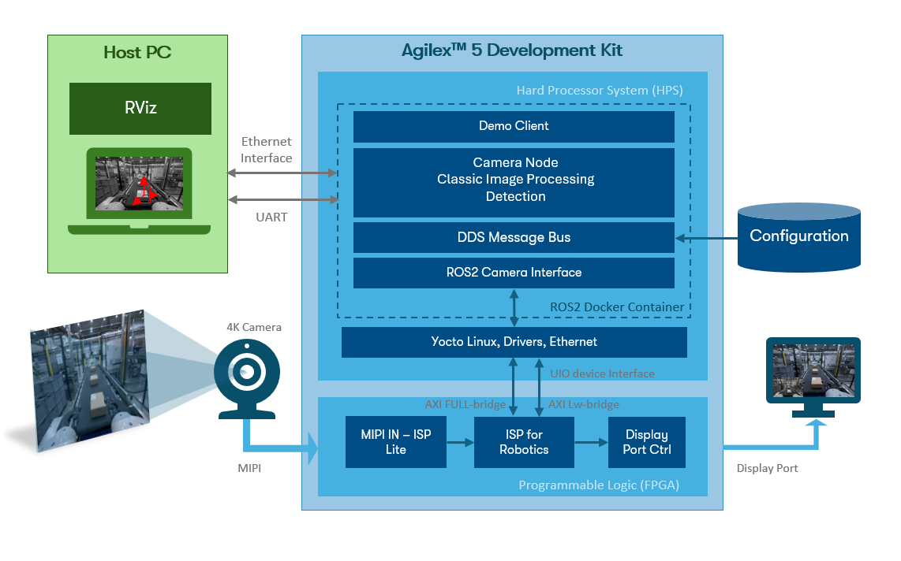
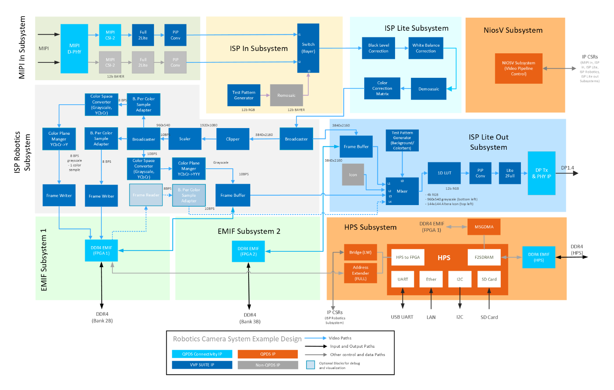
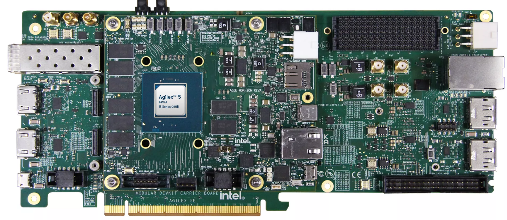
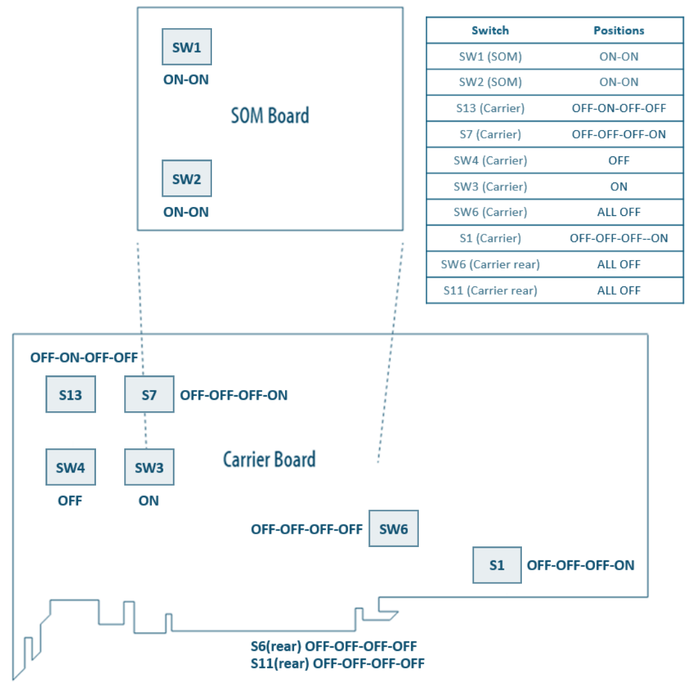
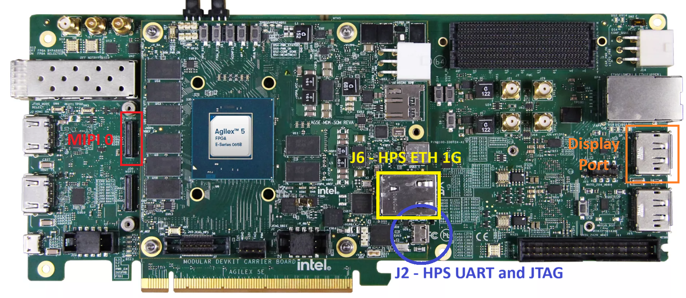
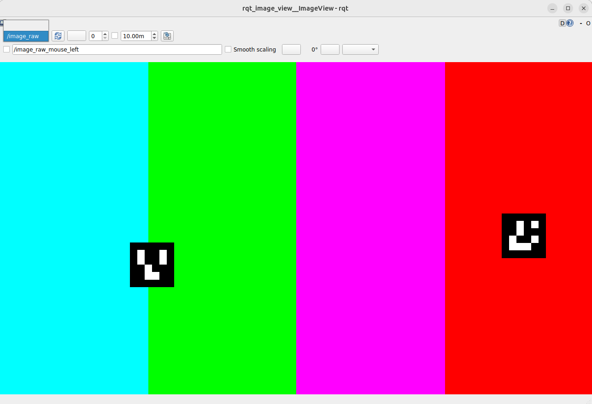

[Robot Controller with Vision System Example Design for Agilex™ 5 Devices]: https://altera-fpga.github.io/rel-26.1/embedded-designs/agilex-5/e-series/modular-065b/robotics/robotics-vision-doc
[Robotics Camera System Example Design for Agilex™ 5 Devices]: https://altera-fpga.github.io/rel-26.1/embedded-designs/agilex-5/e-series/modular-065b/robotics/robotics-camera
[ROS Consolidated Robot Controller Example Design for Agilex™ 5 Devices]: https://altera-fpga.github.io/rel-26.1/embedded-designs/agilex-5/e-series/modular-065b/drive-on-chip/doc-crc
[Drive-On-Chip with Functional Safety System Example Design for Agilex™ 5 Devices]: https://altera-fpga.github.io/rel-26.1/embedded-designs/agilex-5/e-series/modular-065b/drive-on-chip/doc-funct-safety
[Drive-On-Chip with PLC System Example Design for Agilex™ Devices]: https://altera-fpga.github.io/rel-26.1/embedded-designs/agilex-5/e-series/modular-065b/drive-on-chip/doc-plc
[4Kp60 Multi-Sensor HDR Camera Solution System Example Design for Agilex™ 5 Devices]: https://altera-fpga.github.io/rel-26.1/embedded-designs/agilex-5/e-series/modular/camera/camera_4k/camera_4k
[4Kp30 Camera Lite Solution System Example Design for Agilex™ 3 Devices]: https://altera-fpga.github.io/rel-26.1/embedded-designs/agilex-3/c-series/camera/camera_lite_4k30/camera_4k
[Agilex™ 5 FPGA - Drive-On-Chip Design Example]: https://docs.altera.com/r/example-designs/825736/current
[Altera® Agilex™ 7 FPGA – Drive-On-Chip for Altera® Agilex™ 7 Devices Design Example]: https://docs.altera.com/r/example-designs/780358/current
[Agilex™ 7 FPGA – Safe Drive-On-Chip Design Example]: https://docs.altera.com/r/example-designs/825942/current


[https://github.com/altera-fpga/agilex-ed-robotics]: https://github.com/altera-fpga/agilex-ed-robotics
[Modular Design Toolkit]: https://github.com/altera-fpga/modular-design-toolkit
[agilex-ed-robotics/sw]: https://github.com/altera-fpga/agilex-ed-robotics/tree/rel/26.1/sw


[Agilex™ 5 FPGA E-Series 065B Modular Development Kit]: https://www.altera.com/products/devkit/po-3274/agilex-5-fpga-and-soc-e-series-065b-modular-development-kit
[Agilex™ 5 E-Series Modular Development Kit GSRD User Guide (26.1)]: https://altera-fpga.github.io/26.1/embedded-designs/agilex-5/e-series/modular-065b/gsrd/ug-gsrd-agx5e-modular-065b/
[Agilex™ 5 E-Series Modular Development Kit GHRD Linux Boot Examples]: https://altera-fpga.github.io/rel-26.1/embedded-designs/agilex-5/e-series/modular-065b/boot-examples/ug-linux-boot-agx5e-modular-065b
[Hard Processor System Technical Reference Manual: Agilex™ 5 SoCs (26.1)]: https://docs.altera.com/r/docs/814346/26.1/hard-processor-system-technical-reference-manual-agilextm-5-socs/agilextm-5-hard-processor-system-technical-reference-manual-revision-history
[VVP IP Suite]: https://www.altera.com/products/ip/po-3150/video-and-vision-processing-suite
[AN 1000: Drive-on-Chip Design Example: Agilex™ 5 Devices]: https://docs.altera.com/r/docs/826207/current
[Tandem Motion-Power 48 V Board Reference Manual]: https://docs.altera.com/r/docs/683164/current/tandem-motion-power-48-v-board-reference-manual
[Tamagawa TS4747N3200E600 motor]: https://www.tamagawa-seiki.com/products/servomotor/search/product.php?model=TS4747N3200E600


[Framos FSM:GO IMX678C Camera Modules]: https://www.framos.com/en/fsmgo
[Wide 110deg HFOV Lens]: https://www.mouser.co.uk/ProductDetail/FRAMOS/FSMGO-IMX678C-M12-L110A-PM-A1Q1?qs=%252BHhoWzUJg4KQkNyKsCEDHw%3D%3D
[Medium 100deg HFOV Lens]: https://www.mouser.co.uk/ProductDetail/FRAMOS/FSMGO-IMX678C-M12-L100A-PM-A1Q1?qs=%252BHhoWzUJg4IesSwD2ACIBQ%3D%3D
[Narrow 54deg HFOV Lens]: https://www.mouser.co.uk/ProductDetail/FRAMOS/FSMGO-IMX678C-M12-L54A-PM-A1Q1?qs=%252BHhoWzUJg4L5yHZulKgVGA%3D%3D
[Framos Tripod Mount Adapter]: https://www.framos.com/en/products/fma-mnt-trp1-4-v1c-26333
[Tripod]: https://thepihut.com/products/small-tripod-for-raspberry-pi-hq-camera
[150mm flex-cable]: https://www.mouser.co.uk/ProductDetail/FRAMOS/FMA-FC-150-60-V1A?qs=GedFDFLaBXGCmWApKt5QIQ%3D%3D
[300mm micro-coax cable]: https://www.mouser.co.uk/ProductDetail/FRAMOS/FFA-MC50-Kit-0.3m?qs=%252BHhoWzUJg4K3LtaE207mhw%3D%3D
[Framos FFA-GMSL-SER-V2A Serializer]: https://www.framos.com/en/products/ffa-gmsl-ser-v2a-27617
[Framos FFA-GMSL-DES-V2A Deserializer]: https://www.framos.com/en/products/ffa-gmsl-des-v2a-27240
[DP to HDMI Adapter]: https://www.amazon.com/DisplayPort-HDMI-Adapter-Uni-Directional/dp/B01K2H8K6I
[DIGITNOW USB Video Capture Card]: https://digitnow.com/en-euro/products/digitnow-usb-video-capture-card-4k-60hz-hdr10-zero-lag-passthrough-ultra-low-latency-full-hd-video-recording-for-ps5-ps4-pro-xbox-series-x-s-xbox-one-x-s-real-usb3-0


[Video and Vision Processing Suite Altera® FPGA IP User Guide]: https://docs.altera.com/r/docs/683329/current/about-the-video-and-vision-processing-suite
[Tone Mapping Operator]: https://www.altera.com/products/ip/a1jui000004r0hlmak/tone-mapping-operator-fpga-ip
[3D LUT]: https://www.altera.com/products/ip/po-3152/3d-lut-altera-fpga-ip
[MIPI DPHY IP and MIPI CSI-2 IP]: https://www.altera.com/products/ip/po-3062/mipi-d-phy-ip
[Nios® V Processor]: https://www.altera.com/products/ip/po-3098/nios-v-processors


[ROS 2]: https://www.ros.org/
[MoveIt]: https://moveit.ai/
[Altera ROS 2]: https://github.com/altera-fpga/altera-ros2
[Rocker]: https://github.com/osrf/rocker
[Docker]: https://docs.docker.com/engine/install/
[quartus_pgm command]: https://docs.altera.com/r/docs/847422/25.3.1/device-configuration-user-guide-agilextm-3-fpgas-and-socs/understanding-configuration-status-using-quartus_pgm-command
[UFACTORY Lite 6 robot arm]: https://www.ufactory.cc/lite-6-collaborative-robot/


[Release Tag]: https://github.com/altera-fpga/agilex-ed-robotics/releases/tag/rel-camera-26.1
[wic.gz]: https://github.com/altera-fpga/agilex-ed-robotics/releases/download/rel-camera-26.1/core-image-minimal-agilex5_mk_a5e065bb32aea.rootfs.wic.gz
[wic.bmap]: https://github.com/altera-fpga/agilex-ed-robotics/releases/download/rel-camera-26.1/core-image-minimal-agilex5_mk_a5e065bb32aea.rootfs.wic.bmap
[top.hps.jic]: https://github.com/altera-fpga/agilex-ed-robotics/releases/download/rel-camera-26.1/top.hps.jic
[top.core.rbf]: https://github.com/altera-fpga/agilex-ed-robotics/releases/download/rel-camera-26.1/top.core.rbf
[u-boot-spl-dtb.hex]: https://github.com/altera-fpga/agilex-ed-robotics/releases/download/rel-camera-26.1/u-boot-spl-dtb.hex
[ROBOTICS_ISP_CAMERA.qar]: https://github.com/altera-fpga/agilex-ed-robotics/releases/download/rel-camera-26.1/ROBOTICS_ISP_CAMERA.qar
[top.sof]: https://github.com/altera-fpga/agilex-ed-robotics/releases/download/rel-camera-26.1/top.sof

[HPS_ISP_CAM_ROBOTICS]: https://github.com/altera-fpga/agilex-ed-robotics/tree/rel/26.1/HPS_ISP_CAM_ROBOTICS
[AGX_5E_Modular_Devkit_HPS_ISP_CAM_ROB.xml]: https://github.com/altera-fpga/agilex-ed-robotics/blob/rel/26.1/HPS_ISP_CAM_ROBOTICS/AGX_5E_Modular_Devkit_HPS_ISP_CAM_ROB.xml
[Creating and Building the Design based on Modular Design Toolkit (MDT).]: https://github.com/altera-fpga/agilex-ed-robotics/blob/rel/26.1/HPS_ISP_CAM_ROBOTICS/Readme.md
[Create SD card image (.wic) using YOCTO/KAS]: https://github.com/altera-fpga/agilex-ed-robotics/blob/rel/26.1/sw/README.md
[kas-camera.yml]: https://github.com/altera-fpga/agilex-ed-robotics/blob/rel/26.1/sw/kas-camera.yml

[robotics_camera package]: https://github.com/altera-fpga/altera-ros2


# Robotics Camera System Example Design for Agilex™ 5 Devices

## Overview

This example design demonstrates a compact, robotics-oriented **glass-to-glass** camera path on the Agilex™ 5 FPGA E-Series 065B
Modular Development Kit. Sensor capture, real-time conditioning, and display run largely in programmable logic, while the Hard
Processor System (HPS) hosts Linux for application software:

* **MIPI CSI-2 sensor interface:** connects a [Framos FSM:GO IMX678C Camera Modules](https://www.framos.com/en/fsmgo) to the FPGA using industry-standard MIPI D-PHY
  and CSI-2, bringing raw Bayer frames from the imager into the fabric for low-latency processing.
* **ISP Lite pipeline:** a streamlined Image Signal Processor in FPGA logic converts raw sensor data into display-ready video
  (demosaic, color correction, and related conditioning) using IP from the [VVP IP Suite](https://www.altera.com/products/ip/po-3150/video-and-vision-processing-suite), without the full multi-stage HDR pipeline
  of the larger camera solution designs.
* **DisplayPort output:** streams the processed video to a local monitor through the kit’s DisplayPort interface so you can
  verify exposure, framing, and pipeline behavior during bring-up and demonstration.
* **HPS and Linux software stack:** runs on the ARM cores in the HPS with drivers and services to configure the video path;
  the platform is intended as a foundation for higher-level robotics stacks (for example perception nodes, recording, or [ROS 2](https://www.ros.org/)
  integration) rather than as a standalone camera product.

<br>

{:style="display:block; margin-left:auto; margin-right:auto"}
<center>

**High-Level Block Diagram of the Robotics Camera System Example Design.**
</center>
<br>

The figure shows the end-to-end **glass-to-glass** path and the main Platform Designer subsystems. The **MIPI In subsystem** connects the
FRAMOS IMX678 on the kit MIPI connector through **MIPI D-PHY** and **MIPI CSI-2** receive IP (with format conversion) to produce a 12-bit
Bayer stream in the fabric. The **ISP In subsystem** uses a **Switch (Bayer)** to select live sensor data or a **Test Pattern Generator**
path (via **Remosaic**) for pipeline debug without a camera attached. The **ISP Lite subsystem** then performs first-stage
conditioning—**Black Level Correction**, **White Balance**, **Demosaic**, and **Color Correction Matrix**—to convert Bayer data into an RGB stream.

Between ISP Lite and the display, the **ISP Robotics subsystem** provides robotics-oriented processing. **Clipper** and **Scaler** blocks
resize the stream (for example from 3840×2160 to 1920×1080 and 960×540 branches). **Color Space Converter** and **Color Plane Merger**
blocks derive 8-bit and 10-bit grayscale streams for vision workloads. **Frame Writer**, **Frame Reader**, and **Frame Buffer** paths
connect to **EMIF subsystems** (DDR4 banks 2B and 3B) so the HPS can access processed frames through **MSGDMA**. The **ISP Lite Out subsystem**
buffers the main 4K RGB path; its **Mixer** composites the full-resolution stream with the scaled grayscale preview, an optional
**Altera icon** overlay, and test patterns, and **DP Tx & PHY** drives **DisplayPort 1.4** for local monitoring.

A **Nios® V/m subsystem** acts as the soft processor for **video pipeline control**, programming **IP CSRs** in the MIPI In, ISP In, ISP
Lite, and ISP Lite Out subsystems. The **HPS subsystem** is the Agilex™ 5 HPS with dedicated **DDR4 EMIF**, UART, Ethernet, I2C, and SD
interfaces; Linux configures the **ISP Robotics subsystem** CSRs and moves frame data over **HPS-to-FPGA** and/or **F2SDRAM** bridges for
higher-level robotics software (for example [ROS 2](https://www.ros.org/) perception nodes).

<br>

{:style="display:block; margin-left:auto; margin-right:auto"}
<center>

**High-Level Hardware Block Diagram of the Robotics Camera System Example Design.**
</center>
<br>

Blue interconnect in the diagram is the live video path (MIPI In → ISP In → ISP Lite → ISP Robotics → ISP Lite Out → DisplayPort).
Dashed paths are control and memory access from the Nios® V and HPS subsystems.

Subsystem names and grouping match the Modular Design Toolkit (MDT) view and the variant XML ([AGX_5E_Modular_Devkit_HPS_ISP_CAM_ROB.xml](https://github.com/altera-fpga/agilex-ed-robotics/blob/rel/26.1/HPS_ISP_CAM_ROBOTICS/AGX_5E_Modular_Devkit_HPS_ISP_CAM_ROB.xml)).

The hardware variant **[AGX_5E_Modular_Devkit_HPS_ISP_CAM_ROB.xml](https://github.com/altera-fpga/agilex-ed-robotics/blob/rel/26.1/HPS_ISP_CAM_ROBOTICS/AGX_5E_Modular_Devkit_HPS_ISP_CAM_ROB.xml)** is built with the [Modular Design Toolkit](https://github.com/altera-fpga/modular-design-toolkit) from
the [https://github.com/altera-fpga/agilex-ed-robotics](https://github.com/altera-fpga/agilex-ed-robotics) repository. See the [HPS_ISP_CAM_ROBOTICS](https://github.com/altera-fpga/agilex-ed-robotics/tree/rel/26.1/HPS_ISP_CAM_ROBOTICS) README for MDT create and build steps.

<br>

## Pre-requisites

The following are required to be able to fully exercise the Agilex™ 5 Modular
Development Kit:

### Software Requirements to run

* Host PC with
  * 4 GB of RAM
  * Linux OS installed
  * Serial terminal (for example GtkTerm or Minicom on Linux and TeraTerm or
    PuTTY on Windows)
  * Tool to write SD card images ([USBImager](https://bztsrc.gitlab.io/usbimager/) or similar)
  * Altera® Quartus® Prime Pro Edition Version 26.1 Programmer and Tools
  * [Docker](https://docs.docker.com/engine/install/)
  * [Rocker](https://github.com/osrf/rocker) (recommended to run graphical applications in a container on a host PC)

### Software Requirements to build

* 8 GB of RAM
* Linux OS installed
* ~62 GB free storage (~2 GB Quartus® build, ~60 GB Yocto/KAS)
* Python/PIP/KAS for Yocto (or a suitable container)
* Altera® Quartus® Prime Pro Edition Version 26.1 with Agilex™ 5 device support
* FPGA NiosV/g Open-Source Tools 26.1 (installed with Quartus® Prime)

### Hardware Requirements

* [Agilex™ 5 FPGA E-Series 065B Modular Development Kit](https://www.altera.com/products/devkit/po-3274/agilex-5-fpga-and-soc-e-series-065b-modular-development-kit) (ordering code MK-A5E065BB32AEA)
* Power supply
* 1 × Micro USB cable (JTAG and HPS serial console)
* 2 × Ethernet cables (one for the board, one for the host PC). An Ethernet router or switch may be needed for a local network
* Micro SD card and USB card writer (minimum 8 GB)
* DisplayPort cable, or HDMI cable with [DP to HDMI Adapter](https://www.amazon.com/DisplayPort-HDMI-Adapter-Uni-Directional/dp/B01K2H8K6I) (4Kp30 capable recommended when using DisplayPort output)
* 4Kp30 capable monitor or Video Capture Card (like [DIGITNOW USB Video Capture Card](https://digitnow.com/en-euro/products/digitnow-usb-video-capture-card-4k-60hz-hdr10-zero-lag-passthrough-ultra-low-latency-full-hd-video-recording-for-ps5-ps4-pro-xbox-series-x-s-xbox-one-x-s-real-usb3-0))

For designs that use the FRAMOS sensor (see the design-specific user guide):

* 1 [Framos FSM:GO IMX678C Camera Modules](https://www.framos.com/en/fsmgo), with:
  * [Wide 110deg HFOV Lens](https://www.mouser.co.uk/ProductDetail/FRAMOS/FSMGO-IMX678C-M12-L110A-PM-A1Q1?qs=%252BHhoWzUJg4KQkNyKsCEDHw%3D%3D), or
  * [Medium 100deg HFOV Lens](https://www.mouser.co.uk/ProductDetail/FRAMOS/FSMGO-IMX678C-M12-L100A-PM-A1Q1?qs=%252BHhoWzUJg4IesSwD2ACIBQ%3D%3D), or
  * [Narrow 54deg HFOV Lens](https://www.mouser.co.uk/ProductDetail/FRAMOS/FSMGO-IMX678C-M12-L54A-PM-A1Q1?qs=%252BHhoWzUJg4L5yHZulKgVGA%3D%3D)
* (Optional) [Framos Tripod Mount Adapter](https://www.framos.com/en/products/fma-mnt-trp1-4-v1c-26333) and [Tripod](https://thepihut.com/products/small-tripod-for-raspberry-pi-hq-camera)
* [150mm flex-cable](https://www.mouser.co.uk/ProductDetail/FRAMOS/FMA-FC-150-60-V1A?qs=GedFDFLaBXGCmWApKt5QIQ%3D%3D) or [300mm micro-coax cable](https://www.mouser.co.uk/ProductDetail/FRAMOS/FFA-MC50-Kit-0.3m?qs=%252BHhoWzUJg4K3LtaE207mhw%3D%3D) per camera module

<br>

{:style="display:block; margin-left:auto; margin-right:auto"}
<center>

**Agilex™ 5 FPGA E-Series 065B Modular Development Kit.**
</center>
<br>

#### Sources

The sources below are recommended for Quartus® 26.1 builds. This is an example design and is not intended for production deployment.

<br>

<center>

**Example Design Source Repositories.**

| Component | Location | Branch |
| --------- | -------- | ------ |
| Assets Release Tag | [https://github.com/altera-fpga/agilex-ed-robotics/releases/tag/rel-camera-26.1](https://github.com/altera-fpga/agilex-ed-robotics/releases/tag/rel-camera-26.1) | rel-camera-26.1 |
| Altera Robotics | [https://github.com/altera-fpga/agilex-ed-robotics](https://github.com/altera-fpga/agilex-ed-robotics) | rel/26.1 |
| Modular Design Toolkit | [https://github.com/altera-fpga/modular-design-toolkit](https://github.com/altera-fpga/modular-design-toolkit) | rel/26.1 |
| Altera ROS2 | [https://github.com/altera-fpga/altera-ros2](https://github.com/altera-fpga/altera-ros2) | main |
| Linux (Yocto/KAS) | [https://github.com/altera-fpga/agilex-ed-robotics/tree/rel/26.1/sw](https://github.com/altera-fpga/agilex-ed-robotics/tree/rel/26.1/sw) | rel/26.1 |
| Linux kernel | [https://github.com/altera-fpga/linux-socfpga](https://github.com/altera-fpga/linux-socfpga) | socfpga-6.18.2-lts |
| Arm Trusted Firmware | [https://github.com/altera-fpga/arm-trusted-firmware](https://github.com/altera-fpga/arm-trusted-firmware) | socfpga_v2.14.0 |
| U-Boot | [https://github.com/altera-fpga/u-boot-socfpga](https://github.com/altera-fpga/u-boot-socfpga) | socfpga_v2026.01 |
| Yocto Project: poky | [https://git.yoctoproject.org/poky](https://git.yoctoproject.org/poky) | wrynose |

</center>

## Getting Started — run with pre-built binaries

Follow these steps to run the example on the Agilex™ 5 E-Series 065B Modular Development Kit.

### Download the minimum pre-built binaries

<center>

| Boot Source | Link |
| ----------- | ---- |
| SD Card Image | [wic.gz](https://github.com/altera-fpga/agilex-ed-robotics/releases/download/rel-camera-26.1/core-image-minimal-agilex5_mk_a5e065bb32aea.rootfs.wic.gz), [wic.bmap](https://github.com/altera-fpga/agilex-ed-robotics/releases/download/rel-camera-26.1/core-image-minimal-agilex5_mk_a5e065bb32aea.rootfs.wic.bmap) |
| QSPI | [top.hps.jic](https://github.com/altera-fpga/agilex-ed-robotics/releases/download/rel-camera-26.1/top.hps.jic) |

</center>

### Setting up your development board


* Configure the board switches:
  The following provides the default configuration for all the switches in the
  board.

{:style="display:block; margin-left:auto; margin-right:auto"}
<center>

**Development Board switch position**
</center>
<br>

!!! note "Main configurations used in this example design"

    JTAG:     SOM SW1[1:0]=OFF:OFF <br>
    ASx4 (QSPI):  SOM SW1[1:0]=ON:ON

<br>

!!! warning "ESD"
    Handle ESD-sensitive equipment (boards, microSD cards, camera sensors, etc.) only when properly grounded at an ESD-safe workstation.

* Connect the Framos cable between the [Framos FSM:GO IMX678C Camera Modules] and the MIPI connector on the modular development kit SOM (`MIPI0`).
  Align pin 1 on the flex cable with pin 1 on the connector.
* Connect a DisplayPort or HDMI display to the development kit when validating the ISP and display pipeline (`J16`).
* Connect micro USB cable from bottom right of the SOM board to PC
  (`J2`, HPS_UART). This will be used for HPS UART communication and JTAG terminal
  for FPGA programming. Look at what ports are enumerated on your host computer.
  Use the new one in the list as the HPS serial
  port (see figure below).
* Connect an ethernet cable to the ethernet port on the SOM board (`J6`, ETH 1G HPS) and make
  sure your device is in the same network as your intended host device. After
  Linux boots, check the IP address of the `end2` ethernet interface using the
  `ip addr` command.

{:style="display:block; margin-left:auto; margin-right:auto"}
<center>

**USB connections to the board**
</center>
<br>


### SD Card Image Flashing

* Download SD card image (`.wic` or `.wic.gz`) from the prebuilt binary links above.
* Write the `.wic` or `.wic.gz` SD card image to the micro SD card using one of the options below.
* Turn off the board and insert the SD card in the micro SD card slot on the SOM board.

#### [USBImager](https://bztsrc.gitlab.io/usbimager/) (Windows, Linux, Mac OS)

* Open [USBImager](https://bztsrc.gitlab.io/usbimager/) and click the `...` button in the top right.
* Select the image you downloaded earlier and click `Open`.
* Next select the device associated with your SD card reader from the drop-down list.
* Click `Write` to start flashing.

#### [bmaptool](https://github.com/yoctoproject/bmaptool) (Linux)

!!! note
    You will require a `.wic.bmap` file in addition to the `.wic` or `.wic.gz` in order to use `bmaptool`. If this is not available use `USBImager`.

On many distributions `bmap-tools` can be installed using your distros package manager (e.g. `sudo apt install bmap-tools`).

For more information see the [Yocto documentation](https://docs.yoctoproject.org/dev-manual/bmaptool.html) for `bmaptool`.

First of all determine the device `logical name` associated with the SD card on your host:

```
sudo lshw -class disk
```

Use `bmaptool` to copy the image to the SD card. Make sure the `wic` image file and `bmap` file are in the same directory.

```
sudo bmaptool copy ${IMAGE} ${DEVICE}
```

For example:

```
sudo bmaptool copy core-image-minimal-agilex5_mk_a5e065bb32aea.wic.gz /dev/sda
```


### Flash the QSPI


* Download the `.jic` image from the prebuilt binary links above.
* Power down the board.
* Set **MSEL** dipswitch **S1** on SOM to **JTAG: OFF-OFF**
* Power up the board.
* Program the QSPI with the following command. See: [quartus_pgm command]

    ```bash
    quartus_pgm -c 1 -m jtag -o "pvi;top.hps.jic"
    ```

* **(Optional)** Use the Quartus® Programmer GUI

  * Launch the Quartus® Programmer and Configure the **"Hardware Setup..."**
    and select the SOM device (SM27 MDK OB-SOM UBIII)

  * Click "Auto Detect", select the device `A5ED065BB32A` and press
    **"Change File.."**

  * Select the `.jic` file you downloaded earlier. The `MT25QU02G` device
    should now show. Select the **"Program/Configure"** box, and press **"Start"**.
    Wait until completed (It could take several minutes).
  <br>

  {:style="display:block; margin-left:auto; margin-right:auto"}

  <br>

* Power down the board. Set **MSEL** dip switch **S1** on SOM to **ASX4 (QSPI): ON-ON**
<br>


### Bring Up the board

* Power up the board and set up the serial terminal (minicom, PuTTY, etc.):
  * Select the correct `COMx` port from the HPS serial UART.
  * **Serial Port configuration**:
    * Baud rate: 115200, Data bits: 8,
      Stop bits: 1, CRC: disabled, Hardware flow control: disabled
  * Connect your terminal emulator.

* Wait for Linux to boot. Login password = `root`.

### Pull the Altera® ROS2 Docker Image

Run the following on the development kit HPS to pull the latest Altera® ROS2 Docker image.

!!! note
    An internet connection is required to run the following commands.

```bash
docker pull alterafpga/ros2
```

The Docker image `alterafpga/ros2` should now be listed when you run the following command.

```bash
docker image ls
```

The Docker image includes the [Altera ROS 2](https://github.com/altera-fpga/altera-ros2) packages and examples pre-installed and ready to use.

### Run the Altera® Camera ROS node

Next, run the **Altera® Camera** ROS node in a [Docker](https://docs.docker.com/engine/install/) container on the HPS. The node is a C++ [ROS 2](https://www.ros.org/) publisher that reads frames from the **ISP Robotics subsystem** and publishes [`sensor_msgs/CameraInfo`](https://docs.ros.org/en/api/sensor_msgs/html/msg/CameraInfo.html) and [`sensor_msgs/msg/Image`](https://docs.ros.org/en/rolling/p/sensor_msgs/msg/Image.html) messages.

You can use the `altera_camera.launch.py` launch file provided by the `altera_camera` ROS package to start an instance of the node and start publishing frames from the FPGA video pipeline with [ROS 2](https://www.ros.org/).

On the HPS, start a container using the image pulled in the previous section:

```bash
docker run -it --rm --network host --device /dev/uio0 --device /dev/uio1 alterafpga/ros2
```
Note that the container is run with host networking passthrough mode so the board can communicate to other machines on the same LAN.

We also pass through the **ISP Robotics subsystem** frame writer devices which appear as Userspace I/O (UIO) devices in Linux. `uio0` is the **BGR** color stream and `uio1` is the greyscale stream.

Launch the example camera node:

```bash
ros2 launch altera_camera altera_camera.launch.py
```

By default this will use `/dev/uio0`. If you wish to publish the greyscale stream run the following:

```bash
ros2 launch altera_camera altera_camera.launch.py fw_device:=/dev/uio1
```

Upon successful initialization, you should see output similar to the following:

```bash
[INFO] [launch]: Default logging verbosity is set to INFO
[INFO] [altera_camera_node-1]: process started with pid [29]
[altera_camera_node-1] [INFO] [1781794579.867108167] [altera_camera]: using default calibration URL
[altera_camera_node-1] [INFO] [1781794579.867396841] [altera_camera]: camera calibration URL: file:///root/.ros/camera_info/altera-camera.yaml
```

While the node runs, the **DisplayPort** output continues to show the mixed live and preview video from the FPGA for local monitoring independent of [ROS 2](https://www.ros.org/).

### View the published camera stream

To visualize the published stream on a host PC, you can use the [RQT Image View](https://github.com/ros-visualization/rqt_image_view) ROS package which is included in the Altera® ROS2 Docker image.

You first need to ensure [Docker](https://docs.docker.com/engine/install/) is installed on your host PC.

It is recommended to install [Rocker](https://github.com/osrf/rocker) to run a container capable of launching graphical applications. Follow the [Rocker installation instructions](https://github.com/osrf/rocker#installation) before proceeding.

Once you have [Rocker](https://github.com/osrf/rocker) installed pull the Altera® ROS2 Docker image.

!!! note
    An internet connection is required to run the following commands.

```bash
docker pull alterafpga/ros2
```

Next launch the `rqt_image_view` application in a [Docker](https://docs.docker.com/engine/install/) container on your host PC using the following command:

```bash
rocker --x11 --devices /dev/dri --network host alterafpga/ros2 ros2 run rqt_image_view rqt_image_view /image_raw
```

!!! note
    The command above is for systems with Intel® integrated or discrete GPUs. On systems with an **Nvidia®** GPU, follow the [Rocker Nvidia® steps](https://github.com/osrf/rocker#nvidia-settings) and add the `--nvidia` flag.

You should see the live preview from the ISP Robotics video pipeline.

<br>

{:style="display:block; margin-left:auto; margin-right:auto"}

<br>

## Recommended User Flows

With the available resources, you can build, compile, modify, and execute this
design example. Additionally, there are two extra user flows that you can explore.

* **User Flow 1:** [Getting Started — run with pre-built binaries](#getting-started--run-with-pre-built-binaries).
* **User Flow 2:** Running the example design using the QAR and KAS.
* **User Flow 3:** Running the example design by creating and building with the Modular Design Toolkit (MDT) and KAS.

<center>

**More resources.**

| Source | Link |
| ------ | ---- |
| Pre-created QAR | [ROBOTICS_ISP_CAMERA.qar](https://github.com/altera-fpga/agilex-ed-robotics/releases/download/rel-camera-26.1/ROBOTICS_ISP_CAMERA.qar) |
| JIC / RBF | [top.hps.jic](https://github.com/altera-fpga/agilex-ed-robotics/releases/download/rel-camera-26.1/top.hps.jic), [top.core.rbf](https://github.com/altera-fpga/agilex-ed-robotics/releases/download/rel-camera-26.1/top.core.rbf) |
| u-boot-spl-dtb.hex | [u-boot-spl-dtb.hex](https://github.com/altera-fpga/agilex-ed-robotics/releases/download/rel-camera-26.1/u-boot-spl-dtb.hex) |

</center>

<style>
r { color: Red; font-weight: bold; }
g { color: Green; font-weight: bold; }
</style>

<center>

**Recommended User Flows.**


 |User Flow     |Description| User flow 1 | User flow 2 | User flow 3 |
 |--------------|---------------------------------------------------------------------------------------------------|:------------:|:------------:|:------------:|
 |Pre-requisites| [Software Requirements to run.](#software-requirements-to-run)                                    |<g>&check;</g>|<g>&check;</g>|<g>&check;</g>|
 |              | [Software Requirements to build.](#software-requirements-to-build)                                |<r>&cross;</r>|<g>&check;</g>|<g>&check;</g>|
 |              | [Hardware Requirements.](#hardware-requirements)                                                  |<g>&check;</g>|<g>&check;</g>|<g>&check;</g>|
 |              | [Download the minimum Pre-built Binaries.](#download-the-minimum-pre-built-binaries)              |<g>&check;</g>|<r>&cross;</r>|<r>&cross;</r>|
 |HW-Compilation| [Compile pre-created QAR with Quartus®.](https://altera-fpga.github.io/latest/embedded-designs/agilex-5/e-series/modular-065b/robotics/robotics-camera/other-user-flow/#compiling-the-project-using-a-mdt-qar-file)     |<r>&cross;</r>|<g>&check;</g>|<r>&cross;</r>|
 |              | [Generating and Building the NiosV application and BSP.](https://altera-fpga.github.io/latest/embedded-designs/agilex-5/e-series/modular-065b/robotics/robotics-camera/other-user-flow/#compiling-and-building-the-niosv-application-and-bsp)     |<r>&cross;</r>|<g>&check;</g>|<r>&cross;</r>|
 |              | [Creating and Building the Design based on Modular Design Toolkit (MDT).](https://github.com/altera-fpga/agilex-ed-robotics/blob/rel/26.1/HPS_ISP_CAM_ROBOTICS/Readme.md)                         |<r>&cross;</r>|<r>&cross;</r>|<g>&check;</g>|
 |              | [Creating the QSPI Flash and SD card configuration bitstreams for the board (JIC/RBF).](https://altera-fpga.github.io/latest/embedded-designs/agilex-5/e-series/modular-065b/robotics/robotics-camera/other-user-flow/#creating-the-qspi-flash-and-sd-card-configuration-bitstreams-for-the-board) <br> <r>Warning!</r>: this procedure requires a `u-boot-spl-dtb.hex` file, which is generated in the step below. |<r>&cross;</r>|<g>&check;</g>|<g>&check;</g>|
 |SW-Compilation| [Create SD card image (.wic) using YOCTO/KAS](https://github.com/altera-fpga/agilex-ed-robotics/blob/rel/26.1/sw/README.md) <br> <r>NOTE</r>: use <g>**KAS_MACHINE=agilex5_mk_a5e065bb32aea**</g> and <g>**kas-camera.yml**</g> configuration                                                                                                      |<r>&cross;</r>|<g>&check;</g>|<g>&check;</g>|
 |Programming   | [Setting Up your Development Board.](#setting-up-your-development-board)                          |<g>&check;</g>|<g>&check;</g>|<g>&check;</g>|
 |              | [SD Card Image Flashing.](#sd-card-image-flashing)                                                |<g>&check;</g>|<g>&check;</g>|<g>&check;</g>|
 |              | [Program the QSPI Flash Memory.](#flash-the-qspi)                                  |<g>&check;</g>|<g>&check;</g>|<g>&check;</g>|
 |Testing       | [Run the example design.](#bring-up-the-board)                                                |<g>&check;</g>|<g>&check;</g>|<g>&check;</g>|


</center>

## Example Design Documentation

* [Design Example Features.](https://altera-fpga.github.io/latest/embedded-designs/agilex-5/e-series/modular-065b/robotics/robotics-camera/features/)
* [FPGA Hardware Functional Description.](https://altera-fpga.github.io/latest/embedded-designs/agilex-5/e-series/modular-065b/robotics/robotics-camera/hw-funct-descr/)
* [Software Stack Functional Description.](https://altera-fpga.github.io/latest/embedded-designs/agilex-5/e-series/modular-065b/robotics/robotics-camera/sw-funct-descr/)
* [Acronyms and Terminology.](https://altera-fpga.github.io/latest/embedded-designs/agilex-5/e-series/modular-065b/robotics/robotics-camera/glossary/)

## Related Documentation

### Example Designs

* [Robot Controller with Vision System Example Design for Agilex™ 5 Devices](https://altera-fpga.github.io/rel-26.1/embedded-designs/agilex-5/e-series/modular-065b/robotics/robotics-vision-doc)
* [ROS Consolidated Robot Controller Example Design for Agilex™ 5 Devices](https://altera-fpga.github.io/rel-26.1/embedded-designs/agilex-5/e-series/modular-065b/drive-on-chip/doc-crc)
* [4Kp60 Multi-Sensor HDR Camera Solution System Example Design for Agilex™ 5 Devices](https://altera-fpga.github.io/rel-26.1/embedded-designs/agilex-5/e-series/modular/camera/camera_4k/camera_4k)
* [4Kp30 Camera Lite Solution System Example Design for Agilex™ 3 Devices](https://altera-fpga.github.io/rel-26.1/embedded-designs/agilex-3/c-series/camera/camera_lite_4k30/camera_4k)
* [Drive-On-Chip with Functional Safety System Example Design for Agilex™ 5 Devices](https://altera-fpga.github.io/rel-26.1/embedded-designs/agilex-5/e-series/modular-065b/drive-on-chip/doc-funct-safety)
* [Drive-On-Chip with PLC System Example Design for Agilex™ Devices](https://altera-fpga.github.io/rel-26.1/embedded-designs/agilex-5/e-series/modular-065b/drive-on-chip/doc-plc)
* [Agilex™ 5 FPGA - Drive-On-Chip Design Example](https://docs.altera.com/r/example-designs/825736/current)
* [Altera® Agilex™ 7 FPGA – Drive-On-Chip for Altera® Agilex™ 7 Devices Design Example](https://docs.altera.com/r/example-designs/780358/current)
* [Agilex™ 7 FPGA – Safe Drive-On-Chip Design Example](https://docs.altera.com/r/example-designs/825942/current)
* [Agilex™ 5 E-Series Modular Development Kit GSRD User Guide (26.1)](https://altera-fpga.github.io/26.1/embedded-designs/agilex-5/e-series/modular-065b/gsrd/ug-gsrd-agx5e-modular-065b/)
* [Agilex™ 5 E-Series Modular Development Kit GHRD Linux Boot Examples](https://altera-fpga.github.io/rel-26.1/embedded-designs/agilex-5/e-series/modular-065b/boot-examples/ug-linux-boot-agx5e-modular-065b)

### User Manuals

* [Agilex™ 5 FPGA E-Series 065B Modular Development Kit](https://www.altera.com/products/devkit/po-3274/agilex-5-fpga-and-soc-e-series-065b-modular-development-kit)
* [Agilex™ 5 E-Series Modular Development Kit GSRD User Guide (26.1)](https://altera-fpga.github.io/26.1/embedded-designs/agilex-5/e-series/modular-065b/gsrd/ug-gsrd-agx5e-modular-065b/)
* [Hard Processor System Technical Reference Manual: Agilex™ 5 SoCs (26.1)](https://docs.altera.com/r/docs/814346/26.1/hard-processor-system-technical-reference-manual-agilextm-5-socs/agilextm-5-hard-processor-system-technical-reference-manual-revision-history)
* [Framos FSM:GO IMX678C Camera Modules](https://www.framos.com/en/fsmgo).
* [Framos FFA-GMSL-SER-V2A Serializer](https://www.framos.com/en/products/ffa-gmsl-ser-v2a-27617).
* [Framos FFA-GMSL-DES-V2A Deserializer](https://www.framos.com/en/products/ffa-gmsl-des-v2a-27240).
* [Video and Vision Processing Suite Altera® FPGA IP User Guide](https://docs.altera.com/r/docs/683329/current/about-the-video-and-vision-processing-suite).
* [VVP IP Suite](https://www.altera.com/products/ip/po-3150/video-and-vision-processing-suite).
* [3D LUT](https://www.altera.com/products/ip/po-3152/3d-lut-altera-fpga-ip).
* [MIPI DPHY IP and MIPI CSI-2 IP](https://www.altera.com/products/ip/po-3062/mipi-d-phy-ip).
* [Nios® V Processor](https://www.altera.com/products/ip/po-3098/nios-v-processors).

<br>

### Notices & Disclaimers

Altera® Corporation technologies may require enabled hardware, software or service
activation. No product or component can be absolutely secure. Performance varies
by use, configuration and other factors. Your costs and results may vary. You may
not use or facilitate the use of this document in connection with any infringement
or other legal analysis concerning Altera® products described herein. You
agree to grant Altera® Corporation a non-exclusive, royalty-free license to any
patent claim thereafter drafted which includes subject matter disclosed herein.
No license (express or implied, by estoppel or otherwise) to any intellectual
property rights is granted by this document, with the sole exception that you
may publish an unmodified copy. You may create software implementations based on
this document and in compliance with the foregoing that are intended to execute
on the Altera® or product(s) referenced in this document. No rights are granted
to create modifications or derivatives of this document. The products described
may contain design defects or errors known as errata which may cause the product
to deviate from published specifications. Current characterized errata are available
on request. Altera® disclaims all express and implied warranties, including without
limitation, the implied warranties of merchantability, fitness for a particular purpose,
and non-infringement, as well as any warranty arising from course of performance,
course of dealing, or usage in trade. You are responsible for safety of the overall
system, including compliance with applicable safety-related requirements or standards.
© Altera® Corporation. Altera®, the Altera logo, and other Altera® marks are trademarks
of Altera® Corporation. Other names and brands may be claimed as the property of
others.

OpenCL\* and the OpenCL\* logo are trademarks of Apple Inc. used by permission of
the Khronos Group™.


<br>
