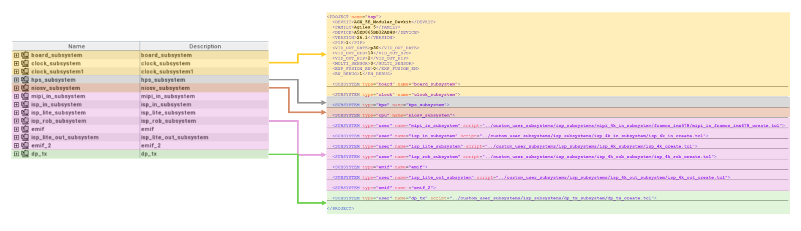
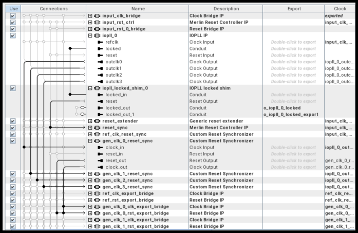
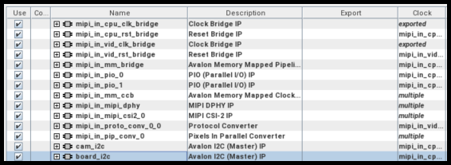
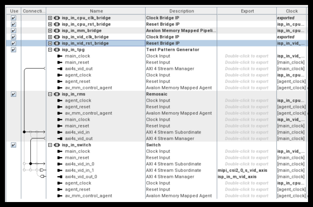
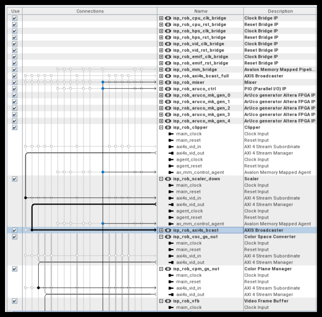

[Robot Controller with Vision System Example Design for Agilex™ 5 Devices]: https://altera-fpga.github.io/rel-26.1/embedded-designs/agilex-5/e-series/modular-065b/robotics/robotics-vision-doc
[Robotics Camera System Example Design for Agilex™ 5 Devices]: https://altera-fpga.github.io/rel-26.1/embedded-designs/agilex-5/e-series/modular-065b/robotics/robotics-camera
[ROS Consolidated Robot Controller Example Design for Agilex™ 5 Devices]: https://altera-fpga.github.io/rel-26.1/embedded-designs/agilex-5/e-series/modular-065b/drive-on-chip/doc-crc
[Drive-On-Chip with Functional Safety System Example Design for Agilex™ 5 Devices]: https://altera-fpga.github.io/rel-26.1/embedded-designs/agilex-5/e-series/modular-065b/drive-on-chip/doc-funct-safety
[Drive-On-Chip with PLC System Example Design for Agilex™ Devices]: https://altera-fpga.github.io/rel-26.1/embedded-designs/agilex-5/e-series/modular-065b/drive-on-chip/doc-plc
[4Kp60 Multi-Sensor HDR Camera Solution System Example Design for Agilex™ 5 Devices]: https://altera-fpga.github.io/rel-26.1/embedded-designs/agilex-5/e-series/modular/camera/camera_4k/camera_4k
[4Kp30 Camera Lite Solution System Example Design for Agilex™ 3 Devices]: https://altera-fpga.github.io/rel-26.1/embedded-designs/agilex-3/c-series/camera/camera_lite_4k30/camera_4k
[Agilex™ 5 FPGA - Drive-On-Chip Design Example]: https://docs.altera.com/r/example-designs/825736/current
[Altera® Agilex™ 7 FPGA – Drive-On-Chip for Altera® Agilex™ 7 Devices Design Example]: https://docs.altera.com/r/example-designs/780358/current
[Agilex™ 7 FPGA – Safe Drive-On-Chip Design Example]: https://docs.altera.com/r/example-designs/825942/current

[https://github.com/altera-fpga/agilex-ed-robotics]: https://github.com/altera-fpga/agilex-ed-robotics
[Modular Design Toolkit]: https://github.com/altera-fpga/modular-design-toolkit
[agilex-ed-robotics/sw]: https://github.com/altera-fpga/agilex-ed-robotics/tree/rel/26.1/sw

[Agilex™ 5 FPGA E-Series 065B Modular Development Kit]: https://www.altera.com/products/devkit/po-3274/agilex-5-fpga-and-soc-e-series-065b-modular-development-kit
[Agilex™ 5 E-Series Modular Development Kit GSRD User Guide (26.1)]: https://altera-fpga.github.io/26.1/embedded-designs/agilex-5/e-series/modular-065b/gsrd/ug-gsrd-agx5e-modular-065b/
[Agilex™ 5 E-Series Modular Development Kit GHRD Linux Boot Examples]: https://altera-fpga.github.io/rel-26.1/embedded-designs/agilex-5/e-series/modular-065b/boot-examples/ug-linux-boot-agx5e-modular-065b
[Hard Processor System Technical Reference Manual: Agilex™ 5 SoCs (26.1)]: https://docs.altera.com/r/docs/814346/26.1/hard-processor-system-technical-reference-manual-agilextm-5-socs/agilextm-5-hard-processor-system-technical-reference-manual-revision-history
[VVP IP Suite]: https://www.altera.com/products/ip/po-3150/video-and-vision-processing-suite
[AN 1000: Drive-on-Chip Design Example: Agilex™ 5 Devices]: https://docs.altera.com/r/docs/826207/current
[Tandem Motion-Power 48 V Board Reference Manual]: https://docs.altera.com/r/docs/683164/current/tandem-motion-power-48-v-board-reference-manual
[Tamagawa TS4747N3200E600 motor]: https://www.tamagawa-seiki.com/products/servomotor/search/product.php?model=TS4747N3200E600

[Framos FSM:GO IMX678C Camera Modules]: https://www.framos.com/en/fsmgo
[Wide 110deg HFOV Lens]: https://www.mouser.co.uk/ProductDetail/FRAMOS/FSMGO-IMX678C-M12-L110A-PM-A1Q1?qs=%252BHhoWzUJg4KQkNyKsCEDHw%3D%3D
[Medium 100deg HFOV Lens]: https://www.mouser.co.uk/ProductDetail/FRAMOS/FSMGO-IMX678C-M12-L100A-PM-A1Q1?qs=%252BHhoWzUJg4IesSwD2ACIBQ%3D%3D
[Narrow 54deg HFOV Lens]: https://www.mouser.co.uk/ProductDetail/FRAMOS/FSMGO-IMX678C-M12-L54A-PM-A1Q1?qs=%252BHhoWzUJg4L5yHZulKgVGA%3D%3D
[Framos Tripod Mount Adapter]: https://www.framos.com/en/products/fma-mnt-trp1-4-v1c-26333
[Tripod]: https://thepihut.com/products/small-tripod-for-raspberry-pi-hq-camera
[150mm flex-cable]: https://www.mouser.co.uk/ProductDetail/FRAMOS/FMA-FC-150-60-V1A?qs=GedFDFLaBXGCmWApKt5QIQ%3D%3D
[300mm micro-coax cable]: https://www.mouser.co.uk/ProductDetail/FRAMOS/FFA-MC50-Kit-0.3m?qs=%252BHhoWzUJg4K3LtaE207mhw%3D%3D
[Framos FFA-GMSL-SER-V2A Serializer]: https://www.framos.com/en/products/ffa-gmsl-ser-v2a-27617
[Framos FFA-GMSL-DES-V2A Deserializer]: https://www.framos.com/en/products/ffa-gmsl-des-v2a-27240
[DP to HDMI Adapter]: https://www.amazon.com/DisplayPort-HDMI-Adapter-Uni-Directional/dp/B01K2H8K6I
[DIGITNOW USB Video Capture Card]: https://digitnow.com/en-euro/products/digitnow-usb-video-capture-card-4k-60hz-hdr10-zero-lag-passthrough-ultra-low-latency-full-hd-video-recording-for-ps5-ps4-pro-xbox-series-x-s-xbox-one-x-s-real-usb3-0

[Video and Vision Processing Suite Altera® FPGA IP User Guide]: https://docs.altera.com/r/docs/683329/current/about-the-video-and-vision-processing-suite
[Tone Mapping Operator]: https://www.altera.com/products/ip/a1jui000004r0hlmak/tone-mapping-operator-fpga-ip
[3D LUT]: https://www.altera.com/products/ip/po-3152/3d-lut-altera-fpga-ip
[MIPI DPHY IP and MIPI CSI-2 IP]: https://www.altera.com/products/ip/po-3062/mipi-d-phy-ip
[Nios® V Processor]: https://www.altera.com/products/ip/po-3098/nios-v-processors

[ROS 2]: https://www.ros.org/
[MoveIt]: https://moveit.ai/
[Altera ROS 2]: https://github.com/altera-fpga/altera-ros2
[Rocker]: https://github.com/osrf/rocker
[Docker]: https://docs.docker.com/engine/install/
[quartus_pgm command]: https://docs.altera.com/r/docs/847422/25.3.1/device-configuration-user-guide-agilextm-3-fpgas-and-socs/understanding-configuration-status-using-quartus_pgm-command
[UFACTORY Lite 6 robot arm]: https://www.ufactory.cc/lite-6-collaborative-robot/

[Release Tag]: https://github.com/altera-fpga/agilex-ed-robotics/releases/tag/rel-camera-26.1
[wic.gz]: https://github.com/altera-fpga/agilex-ed-robotics/releases/download/rel-camera-26.1/core-image-minimal-agilex5_mk_a5e065bb32aea.rootfs.wic.gz
[wic.bmap]: https://github.com/altera-fpga/agilex-ed-robotics/releases/download/rel-camera-26.1/core-image-minimal-agilex5_mk_a5e065bb32aea.rootfs.wic.bmap
[top.hps.jic]: https://github.com/altera-fpga/agilex-ed-robotics/releases/download/rel-camera-26.1/top.hps.jic
[top.core.rbf]: https://github.com/altera-fpga/agilex-ed-robotics/releases/download/rel-camera-26.1/top.core.rbf
[u-boot-spl-dtb.hex]: https://github.com/altera-fpga/agilex-ed-robotics/releases/download/rel-camera-26.1/u-boot-spl-dtb.hex
[ROBOTICS_ISP_CAMERA.qar]: https://github.com/altera-fpga/agilex-ed-robotics/releases/download/rel-camera-26.1/ROBOTICS_ISP_CAMERA.qar
[top.sof]: https://github.com/altera-fpga/agilex-ed-robotics/releases/download/rel-camera-26.1/top.sof

[HPS_ISP_CAM_ROBOTICS]: https://github.com/altera-fpga/agilex-ed-robotics/tree/rel/26.1/HPS_ISP_CAM_ROBOTICS
[AGX_5E_Modular_Devkit_HPS_ISP_CAM_ROB.xml]: https://github.com/altera-fpga/agilex-ed-robotics/blob/rel/26.1/HPS_ISP_CAM_ROBOTICS/AGX_5E_Modular_Devkit_HPS_ISP_CAM_ROB.xml
[Creating and Building the Design based on Modular Design Toolkit (MDT).]: https://github.com/altera-fpga/agilex-ed-robotics/blob/rel/26.1/HPS_ISP_CAM_ROBOTICS/Readme.md
[Create SD card image (.wic) using YOCTO/KAS]: https://github.com/altera-fpga/agilex-ed-robotics/blob/rel/26.1/sw/README.md
[kas-camera.yml]: https://github.com/altera-fpga/agilex-ed-robotics/blob/rel/26.1/sw/kas-camera.yml

[robotics_camera package]: https://github.com/altera-fpga/altera-ros2

# Robotics Camera System Example Design — FPGA Hardware Functional Description

This document describes the functionality of the **[HPS_ISP_CAM_ROBOTICS](https://github.com/altera-fpga/agilex-ed-robotics/tree/rel/26.1/HPS_ISP_CAM_ROBOTICS)** hardware variant, using Platform Designer subsystems as
a reference. The variant implements a robotics-oriented **glass-to-glass** camera path from the MIPI sensor through ISP to DisplayPort.

This page documents **FPGA hardware** subsystems, interconnect, and registers. **Higher-level robotics software** can run perception
applications (for example ROS 2). A **Nios® V** core brings up the MIPI sensor, configures the ISP Lite and DisplayPort path, and
services pipeline interrupts.

## Platform overview

The Platform Designer system implements sensor ingest, real-time ISP, robotics frame export, and DisplayPort monitoring on the
Agilex™ 5 device.

* The `clock_subsystem` and `board_subsystem` provide reference clocks, resets, switches, and LEDs for the modular development kit.
* The `hps_subsystem` is the Agilex™ 5 Hard Processor System with DDR4 EMIF, UART, Ethernet, I2C, SD, and HPS-to-FPGA bridges.
  Linux configures **ISP Robotics** CSRs on the **lightweight** bridge and reads frame buffers on the **full** bridge (or via MSGDMA).
* **Vision subsystems:** `MIPI In`, `ISP In`, `ISP Lite`, `ISP Robotics`, `ISP Lite Out`, and `dp_tx` implement the live path
  from the [Framos FSM:GO IMX678C Camera Modules](https://www.framos.com/en/fsmgo) to **DisplayPort 1.4** at up to **4Kp30**. **ISP Robotics** scales the
  stream and writes **960×540** grayscale and RGB branches to FPGA DDR for software. A **Nios® V subsystem** programs MIPI,
  ISP In, ISP Lite, ISP Lite Out, and DisplayPort CSRs.
* **EMIF subsystem 1** and **EMIF subsystem 2:** DDR4 frame stores on banks **2B** and **3B** for robotics and display buffering.

 

{:style="display:block; margin-left:auto; margin-right:auto"}

**High-Level Hardware Block Diagram of the Robotics Camera System Example Design.**

 

Blue interconnect in the diagram is the live video path (**MIPI In → ISP In → ISP Lite → ISP Robotics → ISP Lite Out → DisplayPort**).
Grey paths are control and memory access from the Nios® V and HPS subsystems.

The diagram is color-coded to match the Platform Designer view and the XML file (Modular Design Toolkit methodology) for
this design (see: [AGX_5E_Modular_Devkit_HPS_ISP_CAM_ROB.xml](https://github.com/altera-fpga/agilex-ed-robotics/blob/rel/26.1/HPS_ISP_CAM_ROBOTICS/AGX_5E_Modular_Devkit_HPS_ISP_CAM_ROB.xml)). The following figure correlates the
XML file, and the Platform Designer view:

 

{:style="display:block; margin-left:auto; margin-right:auto"}

**Modular Design Tool Kit PD project vs XML file.**

 

## Hardware subsystems and components

### Clock and board subsystems

The clock subsystem and board subsystem contain IP related to modular development kit resources: buttons, switches, LEDs,
reference clocks, and resets. They forward clocks and resets to the MIPI, ISP, DisplayPort, and HPS subsystems. These are
shared MDT building blocks, consistent with other camera and robotics example designs.

 

{:style="display:block; margin-left:auto; margin-right:auto"}

**Board and Clock Subsystems PD sub-Blocks.**

 

This variant uses a **single** `clock_subsystem` with multiple generated clocks (for example 297 MHz, 148.5 MHz, and
200 MHz domains) to satisfy MIPI, ISP, DisplayPort, and EMIF timing.

### HPS subsystem

The HPS subsystem is an instance of the Hard Processor System Agilex™ 5 FPGA IP, configured consistently with the
[Agilex™ 5 E-Series Modular Development Kit GSRD User Guide (26.1)](https://altera-fpga.github.io/26.1/embedded-designs/agilex-5/e-series/modular-065b/gsrd/ug-gsrd-agx5e-modular-065b/). The design boots a Yocto-based Linux image built.

Internally the subsystem includes:

* HPS DDR4 EMIF for the on-board SOM memory used by software paths.
* **Lightweight** and **full** HPS-to-FPGA AXI bridges. **ISP Robotics CSRs** (frame writers, clipper, scaler, and
  related blocks) map to the **lightweight** bridge (MPU base `0x2000_0000`). **Frame pixel data** in FPGA DDR is
  accessed through the **full** bridge and optionally **mSGDMA**.
* Modular Scatter-Gather DMA (mSGDMA) for memory-to-memory frame movement on the robotics ISP path.

 

{:style="display:block; margin-left:auto; margin-right:auto"}

**Hard Processor System (HPS) PD sub-Block.**

 

The **lightweight** HPS-to-FPGA bridge (base `0x2000_0000`) exposes ISP Robotics control registers to Linux and UIO
drivers. The **full** HPS-to-FPGA bridge provides high-bandwidth access to frame buffers in `EMIF subsystem 1`
(MPU window starting at `0x6000_0000`; see below).

### Vision pipeline subsystems

The vision path follows the streamlined **ISP Lite** style. Video and vision IP blocks come from the [VVP IP Suite](https://www.altera.com/products/ip/po-3150/video-and-vision-processing-suite);
see the [Video and Vision Processing Suite Altera® FPGA IP User Guide](https://docs.altera.com/r/docs/683329/current/about-the-video-and-vision-processing-suite) for block-level IP documentation.

#### MIPI In subsystem

The MIPI In subsystem is the **primary video source** for this example. It connects a [Framos FSM:GO IMX678C Camera Modules](https://www.framos.com/en/fsmgo)
on the kit MIPI connector through **MIPI D-PHY** and **MIPI CSI-2** receive IP, with format conversion to produce a 12-bit
Bayer stream in FPGA fabric. Sensor power and I2C setup are exposed through PIO and I2C controller agents, initialized by
the Nios® V pipeline controller during bring-up (configuration profile `cfg_sensor` in `software_rob`).

 

{:style="display:block; margin-left:auto; margin-right:auto"}

**MIPI In Subsystem PD sub-Blocks.**

 

#### ISP In subsystem

The ISP In subsystem provides a **Switch (Bayer)** to select **live MIPI sensor data** or a **Test Pattern Generator**
path (color bars, via **Remosaic**) for pipeline debug without a camera attached. For normal operation, select the MIPI
path after the sensor is powered and configured.

 

{:style="display:block; margin-left:auto; margin-right:auto"}

**ISP In Subsystem PD sub-Blocks.**

 

#### ISP Lite subsystem

The ISP Lite subsystem performs first-stage Bayer conditioning:

* Black level correction
* White balance
* Demosaic
* Color correction matrix (Bayer to RGB)

 

{:style="display:block; margin-left:auto; margin-right:auto"}

**ISP Lite Subsystem PD sub-Blocks.**

 

This stage matches the **Camera Lite** philosophy: a focused real-time path without tone-mapping, HDR merge, or
multi-exposure blocks of the full 4K HDR camera solution.

#### ISP Robotics subsystem

The ISP Robotics subsystem adds robotics-oriented processing on the RGB stream from ISP Lite.

* **Clipper** and **Scaler:** produce reduced-resolution branches (for example from 3840×2160 toward 1920×1080
  and **960×540**) for lower-bandwidth software consumption.
* **Color space converter** and **color plane merger:** derive 8-bit and 10-bit grayscale streams for vision workloads.
* **Frame writer**, **frame reader**, and **frame buffer:** connect to `EMIF subsystem 1` so the HPS can read
  processed frames through the full bridge and MSGDMA.
* **Frame writer (low res, grayscale)** and **frame writer (low res, RGB):** export **960×540** frames for
  Linux (for example `sensor_msgs/Image` `mono8` on `/robotics_camera/image_raw`).

 

{:style="display:block; margin-left:auto; margin-right:auto"}

**ISP Robotics Subsystem PD sub-Blocks.**

 

##### HPS control (lightweight bridge)

ISP Robotics blocks that Linux configures are on the **lightweight** HPS-to-FPGA bridge (MPU base **`0x2000_0000`**):

| Block | Offset from lightweight base (`0x2000_0000`) | MPU address |
| :---- | :------------------------------------------- | :---------- |
| Frame writer (low res, RGB) | `0x0000_0200` | `0x2000_0200` |
| Frame writer (low res, grayscale) | `0x0000_0800` | `0x2000_0800` |

Frame **pixel data** is not on the lightweight bridge; it resides in `EMIF subsystem 1` and is reached through
the **full** bridge (see **EMIF subsystems** below).

###### Frame writer (low res, RGB and grayscale)

Both low-resolution frame writers share the same VVP frame-writer CSR map (see the [Video and Vision Processing Suite Altera® FPGA IP User Guide](https://docs.altera.com/r/docs/683329/current/about-the-video-and-vision-processing-suite)).
Offsets in the table below are relative to each block’s base (`0x2000_0200` for RGB, `0x2000_0800` for grayscale).

| Offset | Register | Access | Description |
| :----- | :------- | :----- | :---------- |
| `0x0100` | IRQ_CONTROL | R/W | Interrupt control |
| `0x0104` | IRQ_STATUS | R | Interrupt status |
| `0x0120` | IMG_INFO_WIDTH | R/W | Image width (default 960) |
| `0x0124` | IMG_INFO_HEIGHT | R/W | Image height (default 540) |
| `0x0140` | STATUS | R | Frame writer status |
| `0x0164` | COMMIT | R/W | Commit pending CSR writes |
| `0x0168` | BUFFER_ACKNOWLEDGE | W | Write **`0x1`** to commit a frame write to memory |
| `0x016C` | RUN | R/W | Run mode (see below) |

**RUN** (`0x016C`) values:

| Value | Mode |
| :---: | :--- |
| `0` | Frame writer stopped |
| `1` | Frame writer free-running |
| `2` | Frame writer stopped |
| `3` | Frame writer single-shot |

#### ISP Lite Out subsystem

The ISP Lite Out subsystem buffers the main **4K** display path. A **Mixer** composites the full-resolution RGB
stream with the scaled **960×540** grayscale preview, an optional **Altera icon** overlay, and test patterns.
**DP Tx** and PHY drive **DisplayPort 1.4** at up to **4Kp30** for local monitoring.

#### DisplayPort (`dp_tx` subsystem)

The `dp_tx` subsystem contains DisplayPort transmitter IP and board I2C for the DP link. The Nios® V/m application
configures the mode table and link training; see `software_rob` under the Quartus project.

#### Nios® V subsystem (video pipeline control)

A Nios® V soft-processor subsystem acts as the **video pipeline controller**. It programs IP CSRs in MIPI In,
ISP In, ISP Lite, ISP Lite Out, and DisplayPort during boot and runtime. The HPS owns CSR programming and
frame access for the ISP Robotics path. Refer to the `software` directory in the Quartus project (`cfg_sensor` build profile).

#### EMIF subsystems (vision frame stores)

`EMIF subsystem 1` (DDR4 bank **2B**) holds the **robotics frame buffers** written by ISP Robotics. `EMIF subsystem 2`
(DDR4 bank **3B**) backs the higher-resolution display pipeline in ISP Lite Out and DisplayPort. Both are separate
from the HPS DDR4 EMIF used by the HPS.

In the default **960×540** configuration, `EMIF subsystem 1` exposes two buffers for HPS software:

| Buffer | Format | Size (pixels) | Bytes per frame | Offset in FPGA EMIF window | HPS access (full bridge) |
| :----- | :----- | :------------ | :-------------- | :------------------------- | :----------------------- |
| Grayscale (luma) | Single-plane 8-bit (mono8-style) | 960 × 540 | **518,400** (`0x7E900`) | `0x0020_0000` | **`0x6020_0000`** |
| RGB | 8 bits per color sample (R, G, B) | 960 × 540 | **1,555,200** (`0x17B000`) | `0x0000_0000` | **`0x6000_0000`** |

Frame size calculations:

* Grayscale: 960 × 540 × **1** byte/sample = **518,400** bytes.
* RGB: 960 × 540 × **3** bytes/pixel = **1,555,200** bytes (line stride **2880** bytes in the frame writer configuration).

The HPS reaches FPGA DDR through the **full** HPS-to-FPGA bridge. The FPGA EMIF window is at offset **`0x2000_0000`**
from the bridge base (**`0x4000_0000`**), so `EMIF subsystem 1` appears at MPU address **`0x6000_0000`**. Linux maps
the buffer regions through UIO; ISP Robotics CSRs remain on the lightweight bridge at **`0x2000_0200`** and **`0x2000_0800`**.

`EMIF subsystem 2` supports the 4K display path in ISP Lite Out, not the exported robotics buffers above.

 

[Back to Documentation](../robotics-camera.md#example-design-documentation){ .md-button }

 
