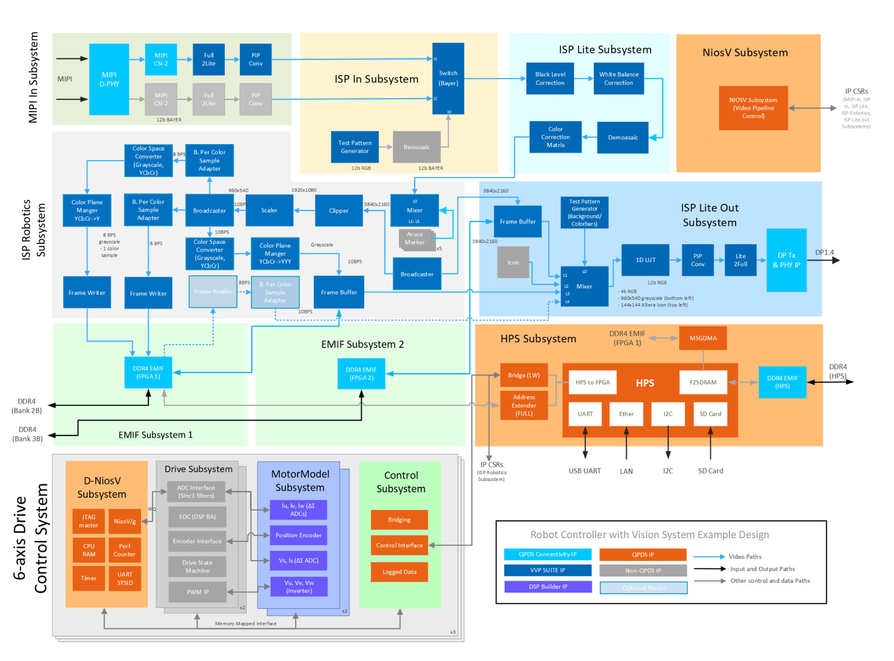
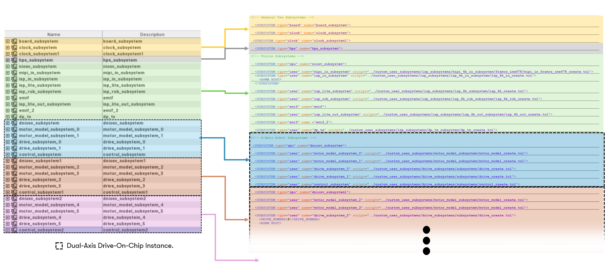
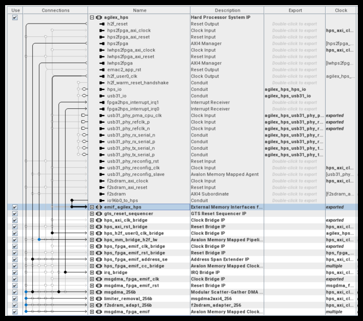
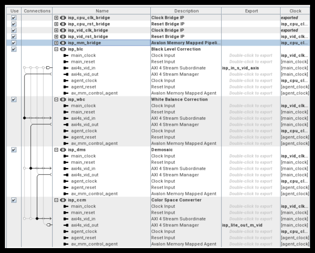
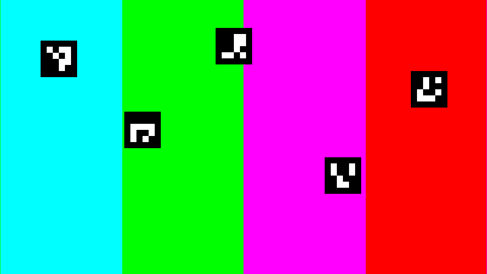

[Robot Controller with Vision System Example Design for Agilex™ 5 Devices]: https://altera-fpga.github.io/rel-26.1/embedded-designs/agilex-5/e-series/modular-065b/robotics/robotics-vision-doc
[Robotics Camera System Example Design for Agilex™ 5 Devices]: https://altera-fpga.github.io/rel-26.1/embedded-designs/agilex-5/e-series/modular-065b/robotics/robotics-camera
[ROS Consolidated Robot Controller Example Design for Agilex™ 5 Devices]: https://altera-fpga.github.io/rel-26.1/embedded-designs/agilex-5/e-series/modular-065b/drive-on-chip/doc-crc
[Drive-On-Chip with Functional Safety System Example Design for Agilex™ 5 Devices]: https://altera-fpga.github.io/rel-26.1/embedded-designs/agilex-5/e-series/modular-065b/drive-on-chip/doc-funct-safety
[Drive-On-Chip with PLC System Example Design for Agilex™ Devices]: https://altera-fpga.github.io/rel-26.1/embedded-designs/agilex-5/e-series/modular-065b/drive-on-chip/doc-plc
[4Kp60 Multi-Sensor HDR Camera Solution System Example Design for Agilex™ 5 Devices]: https://altera-fpga.github.io/rel-26.1/embedded-designs/agilex-5/e-series/modular/camera/camera_4k/camera_4k
[4Kp30 Camera Lite Solution System Example Design for Agilex™ 3 Devices]: https://altera-fpga.github.io/rel-26.1/embedded-designs/agilex-3/c-series/camera/camera_lite_4k30/camera_4k
[Agilex™ 5 FPGA - Drive-On-Chip Design Example]: https://docs.altera.com/r/example-designs/825736/current
[Altera® Agilex™ 7 FPGA – Drive-On-Chip for Altera® Agilex™ 7 Devices Design Example]: https://docs.altera.com/r/example-designs/780358/current
[Agilex™ 7 FPGA – Safe Drive-On-Chip Design Example]: https://docs.altera.com/r/example-designs/825942/current

[https://github.com/altera-fpga/agilex-ed-robotics]: https://github.com/altera-fpga/agilex-ed-robotics
[Modular Design Toolkit]: https://github.com/altera-fpga/modular-design-toolkit
[agilex-ed-robotics/sw]: https://github.com/altera-fpga/agilex-ed-robotics/tree/rel/26.1/sw

[Agilex™ 5 FPGA E-Series 065B Modular Development Kit]: https://www.altera.com/products/devkit/po-3274/agilex-5-fpga-and-soc-e-series-065b-modular-development-kit
[Agilex™ 5 E-Series Modular Development Kit GSRD User Guide (26.1)]: https://altera-fpga.github.io/26.1/embedded-designs/agilex-5/e-series/modular-065b/gsrd/ug-gsrd-agx5e-modular-065b/
[Agilex™ 5 E-Series Modular Development Kit GHRD Linux Boot Examples]: https://altera-fpga.github.io/rel-26.1/embedded-designs/agilex-5/e-series/modular-065b/boot-examples/ug-linux-boot-agx5e-modular-065b
[Hard Processor System Technical Reference Manual: Agilex™ 5 SoCs (26.1)]: https://docs.altera.com/r/docs/814346/26.1/hard-processor-system-technical-reference-manual-agilextm-5-socs/agilextm-5-hard-processor-system-technical-reference-manual-revision-history
[VVP IP Suite]: https://www.altera.com/products/ip/po-3150/video-and-vision-processing-suite
[AN 1000: Drive-on-Chip Design Example: Agilex™ 5 Devices]: https://docs.altera.com/r/docs/826207/current
[Tandem Motion-Power 48 V Board Reference Manual]: https://docs.altera.com/r/docs/683164/current/tandem-motion-power-48-v-board-reference-manual
[Tamagawa TS4747N3200E600 motor]: https://www.tamagawa-seiki.com/products/servomotor/search/product.php?model=TS4747N3200E600

[Framos FSM:GO IMX678C Camera Modules]: https://www.framos.com/en/fsmgo
[Wide 110deg HFOV Lens]: https://www.mouser.co.uk/ProductDetail/FRAMOS/FSMGO-IMX678C-M12-L110A-PM-A1Q1?qs=%252BHhoWzUJg4KQkNyKsCEDHw%3D%3D
[Medium 100deg HFOV Lens]: https://www.mouser.co.uk/ProductDetail/FRAMOS/FSMGO-IMX678C-M12-L100A-PM-A1Q1?qs=%252BHhoWzUJg4IesSwD2ACIBQ%3D%3D
[Narrow 54deg HFOV Lens]: https://www.mouser.co.uk/ProductDetail/FRAMOS/FSMGO-IMX678C-M12-L54A-PM-A1Q1?qs=%252BHhoWzUJg4L5yHZulKgVGA%3D%3D
[Framos Tripod Mount Adapter]: https://www.framos.com/en/products/fma-mnt-trp1-4-v1c-26333
[Tripod]: https://thepihut.com/products/small-tripod-for-raspberry-pi-hq-camera
[150mm flex-cable]: https://www.mouser.co.uk/ProductDetail/FRAMOS/FMA-FC-150-60-V1A?qs=GedFDFLaBXGCmWApKt5QIQ%3D%3D
[300mm micro-coax cable]: https://www.mouser.co.uk/ProductDetail/FRAMOS/FFA-MC50-Kit-0.3m?qs=%252BHhoWzUJg4K3LtaE207mhw%3D%3D
[Framos FFA-GMSL-SER-V2A Serializer]: https://www.framos.com/en/products/ffa-gmsl-ser-v2a-27617
[Framos FFA-GMSL-DES-V2A Deserializer]: https://www.framos.com/en/products/ffa-gmsl-des-v2a-27240
[DP to HDMI Adapter]: https://www.amazon.com/DisplayPort-HDMI-Adapter-Uni-Directional/dp/B01K2H8K6I
[DIGITNOW USB Video Capture Card]: https://digitnow.com/en-euro/products/digitnow-usb-video-capture-card-4k-60hz-hdr10-zero-lag-passthrough-ultra-low-latency-full-hd-video-recording-for-ps5-ps4-pro-xbox-series-x-s-xbox-one-x-s-real-usb3-0

[Video and Vision Processing Suite Altera® FPGA IP User Guide]: https://docs.altera.com/r/docs/683329/current/about-the-video-and-vision-processing-suite
[Tone Mapping Operator]: https://www.altera.com/products/ip/a1jui000004r0hlmak/tone-mapping-operator-fpga-ip
[3D LUT]: https://www.altera.com/products/ip/po-3152/3d-lut-altera-fpga-ip
[MIPI DPHY IP and MIPI CSI-2 IP]: https://www.altera.com/products/ip/po-3062/mipi-d-phy-ip
[Nios® V Processor]: https://www.altera.com/products/ip/po-3098/nios-v-processors

[ROS 2]: https://www.ros.org/
[MoveIt]: https://moveit.ai/
[Altera ROS 2]: https://github.com/altera-fpga/altera-ros2
[Rocker]: https://github.com/osrf/rocker
[Docker]: https://docs.docker.com/engine/install/
[quartus_pgm command]: https://docs.altera.com/r/docs/847422/25.3.1/device-configuration-user-guide-agilextm-3-fpgas-and-socs/understanding-configuration-status-using-quartus_pgm-command
[UFACTORY Lite 6 robot arm]: https://www.ufactory.cc/lite-6-collaborative-robot/

[Release Tag]: https://github.com/altera-fpga/agilex-ed-robotics/releases/tag/rel-vision-doc-26.1
[wic.gz]: https://github.com/altera-fpga/agilex-ed-robotics/releases/download/rel-vision-doc-26.1/core-image-minimal-agilex5_mk_a5e065bb32aea.rootfs.wic.gz
[wic.bmap]: https://github.com/altera-fpga/agilex-ed-robotics/releases/download/rel-vision-doc-26.1/core-image-minimal-agilex5_mk_a5e065bb32aea.rootfs.wic.bmap
[top.hps.jic]: https://github.com/altera-fpga/agilex-ed-robotics/releases/download/rel-vision-doc-26.1/top.hps.jic
[top.core.rbf]: https://github.com/altera-fpga/agilex-ed-robotics/releases/download/rel-vision-doc-26.1/top.core.rbf
[u-boot-spl-dtb.hex]: https://github.com/altera-fpga/agilex-ed-robotics/releases/download/rel-vision-doc-26.1/u-boot-spl-dtb.hex
[ROBOTICS_ISP_VISION_DOC.qar]: https://github.com/altera-fpga/agilex-ed-robotics/releases/download/rel-vision-doc-26.1/ROBOTICS_ISP_VISION_DOC.qar
[top.sof]: https://github.com/altera-fpga/agilex-ed-robotics/releases/download/rel-vision-doc-26.1/top.sof

[HPS_ISP_VIS_DOC3x2_ROBOTICS]: https://github.com/altera-fpga/agilex-ed-robotics/tree/rel/26.1/HPS_ISP_VIS_DOC3x2_ROBOTICS
[AGX_5E_Modular_Devkit_HPS_ISP_VIS_DOC3x2_ROB.xml]: https://github.com/altera-fpga/agilex-ed-robotics/blob/rel/26.1/HPS_ISP_VIS_DOC3x2_ROBOTICS/AGX_5E_Modular_Devkit_HPS_ISP_VIS_DOC3x2_ROB.xml
[Creating and Building the Design based on Modular Design Toolkit (MDT).]: https://github.com/altera-fpga/agilex-ed-robotics/blob/rel/26.1/HPS_ISP_VIS_DOC3x2_ROBOTICS/Readme.md
[Create SD card image (.wic) using YOCTO/KAS]: https://github.com/altera-fpga/agilex-ed-robotics/blob/rel/26.1/sw/README.md
[kas-vision-doc.yml]: https://github.com/altera-fpga/agilex-ed-robotics/blob/rel/26.1/sw/kas-vision-doc.yml
[6-axis Drive-on-Chip design]: https://github.com/altera-fpga/agilex-ed-drive-on-chip/tree/rel/26.1/HPS_NIOSVg_DoC_3x2_axis
[MoveIt client]: https://github.com/altera-fpga/altera-ros2/tree/main/examples/moveit_demo_client
[ROS Control hardware interface]: https://github.com/altera-fpga/altera-ros2/tree/main/fpga_doc_control_driver

# Robot Controller with Vision System Example Design — FPGA Hardware Functional Description

This document describes the functionality of the **[HPS_ISP_VIS_DOC3x2_ROBOTICS](https://github.com/altera-fpga/agilex-ed-robotics/tree/rel/26.1/HPS_ISP_VIS_DOC3x2_ROBOTICS)** hardware variant using the Platform Designer
subsystems as a reference. The variant merges a 6-axis Drive-on-Chip stack with a robotics-oriented vision pipeline derived from
the Robotics Camera, 4Kp60 Multi-Sensor HDR Camera, and 4Kp30 Camera Lite example designs.

This page documents **FPGA hardware**—subsystems, interconnect, and registers. Linux on the **HPS** drives the pick-and-place demo,
ArUco control, and frame-buffer access; a **Nios® V** core configures the video pipeline and services ArUco placement; three
**NiosV/g** cores run real-time motor control (two axes each). Read those software components together with this hardware description to understand the full design.

## Platform overview

The Platform Designer system combines vision ingress and display, robotics ISP processing, and six-axis motor control in one Agilex™ device.

* The `clock_subsystem` and `board_subsystem` provide reference clocks, resets, switches, and LEDs for the modular development kit.
* The `hps_subsystem` is the Agilex™ 5 Hard Processor System with DDR4 EMIF, UART, Ethernet, I2C, SD, and HPS-to-FPGA bridges.
  Linux orchestrates application workflows, configures ISP Robotics CSRs (if necessary) over the lightweight bridge, retrieves
  images for robotics workloads over the full bridge and/or via MSGDMA, and accesses Drive-on-Chip control memory through the
  lightweight HPS-to-FPGA bridge (base `0x2000_0000`).
* **Vision subsystems** — `MIPI In`, `ISP In`, `ISP Lite`, `ISP Robotics`, and `ISP Lite Out` implement the glass-to-glass path
  to DisplayPort. By default, **ISP In** feeds **color-bar test patterns** (not live MIPI); optional FRAMOS IMX678 ingest is
  supported for sensor-based deployments. **ISP Robotics** performs virtualized **ArUco** overlay so the system example design
  does not require a camera to run, and pre-processes the 4K image for robotics applications while buffering scaled and grayscale
  branches. A **Nios® V/m subsystem** configures and monitors MIPI and ISP Lite CSRs; the HPS uses MSGDMA and CSR access for the robotics path.
* **Motor subsystems** — three instances each of `dniosv_subsystem`, `control_subsystem`, and paired `drive_subsystem` and
  `motor_model_subsystem` blocks implement a **3×2** Drive-on-Chip topology (six axes of field-oriented control with simulated motors).
  For IP-level motor details, refer to [AN 1000: Drive-on-Chip Design Example: Agilex™ 5 Devices](https://docs.altera.com/r/docs/826207/current) hardware description.

 

{:style="display:block; margin-left:auto; margin-right:auto"}

**High-Level Hardware Block Diagram of the Robot Controller with Vision System Example Design.**

 

Blue interconnect in the diagram is the video path (ISP In → ISP Lite → ISP Robotics → ISP Lite Out → DisplayPort). In the
default example configuration, **ISP In** is driven by the **test-pattern generator** (color bars), not MIPI In; the
optional MIPI In block is bypassed. Gray interconnect paths are control and memory access from the Nios® V and HPS
subsystems using memory mapped interfaces. The lower section shows three dual-axis Drive-on-Chip slices (D-NiosV,
Drive, MotorModel, Control) connected to the HPS through AXI bridges.

The following diagram is color-coded to match the Platform Designer view and the XML file (Modular Design Toolkit methodology)
for this design (see: [AGX_5E_Modular_Devkit_HPS_ISP_VIS_DOC3x2_ROB.xml](https://github.com/altera-fpga/agilex-ed-robotics/blob/rel/26.1/HPS_ISP_VIS_DOC3x2_ROBOTICS/AGX_5E_Modular_Devkit_HPS_ISP_VIS_DOC3x2_ROB.xml)). The following figure correlates the XML file and
the Platform Designer view:

 

{:style="display:block; margin-left:auto; margin-right:auto"}

**Modular Design Tool Kit PD project vs XML file.**

 

## Hardware subsystems and components

### Clock and board subsystems

The clock subsystem and board subsystem contain IP related to modular development kit resources: buttons, switches, LEDs,
reference clocks, and resets. They forward clocks and resets to the vision pipeline, HPS, and motor-control subsystems.
These subsystems are shared MDT building blocks, consistent with the Drive-On-Chip and camera solution designs.

 

{:style="display:block; margin-left:auto; margin-right:auto"}

**Board and Clock Subsystems PD sub-Blocks.**

 

This variant instantiates **two** `clock_subsystem` blocks (`clock_subsystem` and `clock_subsystem1`), each with its own
PLL network. One supplies clocks and resets for the **vision pipeline** (MIPI, ISP, DisplayPort); the other supplies clocks
for the **Drive-on-Chip** motor-control fabric (NiosV/g, drive, and control subsystems).

### HPS subsystem

The HPS subsystem is an instance of the Hard Processor System Agilex™ 5 FPGA IP, configured consistently with the
[Agilex™ 5 E-Series Modular Development Kit GSRD User Guide (26.1)](https://altera-fpga.github.io/26.1/embedded-designs/agilex-5/e-series/modular-065b/gsrd/ug-gsrd-agx5e-modular-065b/). The design boots a Yocto-based Linux image built.

Internally the subsystem includes:

* HPS DDR4 EMIF for the on-board SOM memory used by Linux and high-bandwidth software paths.
* **Lightweight** and **full** HPS-to-FPGA AXI bridges. Drive-on-Chip `control_subsystem` blocks and **ISP Robotics CSRs** map
  to the **lightweight** bridge (MPU base `0x2000_0000`). **Frame pixel data** in FPGA DDR is accessed through the **full** bridge (and optionally mSGDMA).
* Modular Scatter-Gather DMA (mSGDMA) for memory-to-memory frame movement on the robotics ISP path.

 

{:style="display:block; margin-left:auto; margin-right:auto"}

**Hard Processor System (HPS) PD sub-Block.**

 

The **lightweight** HPS-to-FPGA bridge (base `0x2000_0000`) connects to the Drive-on-Chip `control_subsystem` instances and
to **ISP Robotics CSRs** (frame writers, ArUco control, and related blocks in the `0x0030_xxxx` address range). Linux or
UIO-based drivers use this map for motor set-points and vision control registers. The **full** HPS-to-FPGA bridge is
used for **high-bandwidth** access to frame **pixel data** in FPGA DDR (`EMIF subsystem 1`), not for those CSRs.

### Vision pipeline subsystems

The vision path follows the streamlined **ISP Lite** style. Video and vision IP blocks come from the Video and Vision
Processing (VVP) IP Suite; see the [Video and Vision Processing Suite Altera® FPGA IP User Guide](https://docs.altera.com/r/docs/683329/current/about-the-video-and-vision-processing-suite) for block-level IP documentation.

#### MIPI In subsystem (optional)

The MIPI In subsystem is present for real-world deployments but is **not used for the default ArUco marker demonstration**.
In the pre-configured example flow, video for manipulation-style feedback comes from **virtualized marker generation** in
the ISP Robotics path (overlaid on an internal test source), so you can run the full vision plus motion example with
**only the Agilex™ 5 modular development kit**—no FRAMOS camera module or other vision hardware is required.

When a sensor is used, the MIPI In subsystem connects a FRAMOS IMX678 module on the kit MIPI connector through **MIPI D-PHY**
and **MIPI CSI-2** receive IP, with format conversion to produce a 12-bit Bayer stream in FPGA fabric. Sensor power and I2C
setup are exposed through PIO and I2C controller agents, typically initialized by the Nios® V pipeline controller during
bring-up. Select the live MIPI path in ISP In when you want to replace the default pattern source with real sensor data.

#### ISP In subsystem

The ISP In subsystem provides a **Switch (Bayer)** to select live MIPI sensor data or a **Test Pattern Generator** path
(color bars, via **Remosaic**). **The example design defaults to the test-pattern path**, not live MIPI ingest, because
ArUco overlay and mixing do not depend on an external imager. The test-pattern source supplies a predictable background
for the virtualized fiducial scene on DisplayPort while any high-level software application exercises the motor stack.

 

{:style="display:block; margin-left:auto; margin-right:auto"}

**ISP In Subsystem (HPS) PD sub-Block.**

 

The live-sensor path remains available for bring-up and for applications that move to a physical camera later, using the
same ISP Lite and ISP Robotics pipeline as the Robotics Camera example design.

#### ISP Lite subsystem

The ISP Lite subsystem performs first-stage Bayer conditioning:

* Black level correction
* White balance
* Demosaic
* Color correction matrix (Bayer to RGB)

 

{:style="display:block; margin-left:auto; margin-right:auto"}

**ISP Lite Subsystem (HPS) PD sub-Block.**

 

This stage matches the **Camera Lite** philosophy: a focused real-time path without the tone-mapping, HDR merge, or multi-exposure blocks.

#### ISP Robotics subsystem

The ISP Robotics subsystem adds robotics-oriented processing on the RGB stream:

* **Clipper** and **Scaler:** produce reduced-resolution branches (for example from 3840×2160 toward 1920×1080 and
960×540) for lower-bandwidth software consumption.
* **Color space converter** and **color plane merger:** derive 8-bit and 10-bit grayscale streams for vision workloads.
* **Frame writer**, **frame reader**, and **frame buffer:** connect to `EMIF subsystem 1` and `EMIF subsystem 2`
  (FPGA DDR4 on banks 2B and 3B) so the HPS can read processed frames through MSGDMA, the full bridge, and F2SDRAM paths.
* **ArUco overlay:** **virtualized** fiducial generation and mixing in fabric. Markers stand in for pick targets on
  the DisplayPort preview. The pick-and-place demo removes them one at a time from the scene; when the table is cleared,
  markers are **re-populated and shuffled** to new random positions—without a physical camera, robot arm, or external vision PC.

 

{:style="display:block; margin-left:auto; margin-right:auto"}

**ISP Robotics Subsystem (HPS) PD sub-Block.**

 

##### HPS control (lightweight bridge)

The ISP Robotics blocks that Linux must configure or trigger are exposed on the **lightweight** HPS-to-FPGA bridge. The MPU
base address is **`0x2000_0000`**. Add the offsets below to that base for absolute addresses (for example RGB frame writer
CSRs at **`0x2030_0200`**).

| Block | Offset from lightweight base (`0x2000_0000`) | MPU address |
| :---- | :------------------------------------------- | :---------- |
| Frame writer (low res, RGB) | `0x0030_0200` | `0x2030_0200` |
| ArUco marker control | `0x0030_0600` | `0x2030_0600` |
| Frame writer (low res, grayscale) | `0x0030_0800` | `0x2030_0800` |

Frame pixel data for these writers is **not** on the lightweight bridge; it resides in `EMIF subsystem 1` and is reached
through the **full** bridge (see **EMIF subsystems** below).

###### Frame writer (low res, RGB and grayscale)

Both low-resolution frame writers share the same VVP frame-writer CSR map (see the [Video and Vision Processing Suite Altera® FPGA IP User Guide](https://docs.altera.com/r/docs/683329/current/about-the-video-and-vision-processing-suite)).
Offsets are relative to each block’s base (`0x0030_0200` for RGB, `0x0030_0800` for grayscale).

| Offset | Register | Access | Description |
| :----- | :------- | :----- | :---------- |
| `0x0100` | IRQ_CONTROL | R/W | Interrupt control |
| `0x0104` | IRQ_STATUS | R | Interrupt status |
| `0x0120` | IMG_INFO_WIDTH | R/W | Image width (default 960) |
| `0x0124` | IMG_INFO_HEIGHT | R/W | Image height (default 540) |
| `0x0140` | STATUS | R | Frame writer status |
| `0x0164` | COMMIT | R/W | Commit pending CSR writes |
| `0x0168` | BUFFER_ACKNOWLEDGE | W | Write **`0x1`** to acknowledge / commit a frame write to memory |
| `0x016C` | RUN | R/W | Run mode (see below) |

**RUN** (`0x016C`) values:

| Value | Mode |
| :---: | :--- |
| `0` | Frame writer stopped |
| `1` | Frame writer free-running |
| `2` | Frame writer stopped |
| `3` | Frame writer single-shot |

###### ArUco marker control register

The **ArUco marker control** register is the main **HPS** interface for the virtualized fiducial overlay. It is
reached on the **lightweight** HPS-to-FPGA bridge (MPU base **`0x2000_0000`**) at offset **`0x0030_0600`**, so
Linux and user applications read and write it at MPU address **`0x2030_0600`**. This is separate from the **full**
bridge used only for frame-buffer data in FPGA DDR.

The register is a single 32-bit CSR. The HPS programs **MM** and **SS** from software; the Nios® V ISP application
(`arUco_ctrl()` in `software_rob`) polls the same location, randomizes marker positions when **MM** is set, and
drives the ISP Robotics mixer layers.

Register format **RR-SS-ID-MM** (MSB to LSB):

| Field | Bits | Description |
| :---- | :--- | :---------- |
| RR | [31:24] | Reserved |
| SS | [23:16] | **Show** mask — one bit per marker ID. Controls which ArUco layers are enabled in the robotics mixer. |
| ID | [15:8] | **ID** — marker count. Updated by Nios to `num_mixer_layers − 1` (not normally written by the HPS). |
| MM | [7:0] | **Mix** — write **`0x1`** to request a new placement mix. Cleared to **`0`** by Nios after the mix completes. |

**SS = 0 (default / “show all” mode).** When the show mask is zero, the Nios firmware does **not** hide the markers.
Instead, `arUco_ctrl()` automatically sets **MM** to **`0x1`**, calls `pixels_place_squares_random()` to assign new
non-overlapping screen positions for every marker, updates the mixer offsets, and then writes **SS** with all placement
bits set (for example `0x1F` when five markers are placed). All configured markers are shown after the mix. Use this
mode from the HPS when you want a fresh random layout of the full marker set.

**SS ≠ 0 (selective show).** A non-zero mask selects which marker IDs are visible without forcing a new placement.
Example: **`0x11`** (`8'b0001_0001`) enables marker IDs **0** and **4** only; other IDs are turned off in the mixer.
To change positions as well, write **MM = `0x1`** (alone or together with **SS**); Nios runs the random placement
routine, then updates **SS** to reflect the markers that were placed.

Typical HPS flows (32-bit writes to **`0x2030_0600`** on the lightweight bridge):

* **Re-randomize and show all markers:** write **SS = 0** (Nios triggers mix and fills in positions), or write **MM = 1** explicitly.
* **Show a subset at fixed positions:** write the desired **SS** mask; do not pulse **MM** unless new positions are required.

**Pick-and-place demo behavior.** The ArUco overlay is intended to mimic a work surface with multiple parts
waiting to be picked. In the combined vision plus MoveIt pick-and-place flow:

1. **Initial state** — several markers are visible at random non-overlapping positions (after a mix, **SS**
   holds a full mask such as `0x1F` for five markers).
2. **Each pick cycle** — HPS software clears one bit in **SS** when a virtual “pick” completes (for example
   after a robot motion), which turns off that marker ID in the robotics mixer so it disappears from the 
   DisplayPort preview—one marker removed per cycle.
3. **Re-populate and shuffle** — when every marker has been removed (**SS** returns to **`0`**), Nios
   sees an empty show mask, asserts **MM**, runs `pixels_place_squares_random()` again, and writes a new full
   **SS** mask. The screen fills with a fresh set of markers at new shuffled positions, ready for the next round of picks.

This gives continuous visual feedback for pick-and-place testing on the kit alone. Motion runs on the simulated
six-axis arm while the video path behaves like a dynamic parts table, without ArUco detection or a real sensor.

 

{:style="display:block; margin-left:auto; margin-right:auto"}

**arUco marker FrameWritter dump from EMIF2 example.**

 

#### ISP Lite Out subsystem

The ISP Lite Out subsystem buffers the main display path, composites streams in a **Mixer** (full-resolution RGB,
scaled grayscale preview, ArUco overlay, and optional test patterns), and drives **DisplayPort 1.4** through
**DP Tx** and PHY for local monitoring at up to 4Kp30 when using the recommended display setup in the user guide.

#### Nios® V subsystem (video pipeline control)

A Nios® V/m soft-processor subsystem acts as the **video pipeline controller**. It programs IP CSRs in the
MIPI In, ISP In, ISP Lite, and ISP Lite Out subsystems during boot and runtime configuration.
The HPS owns CSR programming and DMA for the ISP Robotics path. Refer to the
`software` directory in the Quartus project for more details.

#### EMIF subsystems (vision frame stores)

`EMIF subsystem 1` (DDR4 bank **2B**) holds the **robotics frame buffers** written by the ISP Robotics path. `EMIF subsystem 2`
(DDR4 bank **3B**) backs additional display-path buffering in ISP Lite Out. Both are separate from the HPS DDR4 EMIF used
by Linux and from the motor-control datapath.

In the default **960×540** robotics configuration, `EMIF subsystem 1` exposes two buffers for HPS software
(for example perception or debug capture via MSGDMA / UIO):

| Buffer | Format | Size (pixels) | Bytes per frame | Offset in FPGA EMIF window | HPS access (full bridge) |
| :----- | :----- | :------------ | :-------------- | :------------------------- | :----------------------- |
| Grayscale (luma) | Single-plane 8-bit (mono8-style) | 960 × 540 | **518,400** (`0x7E900`) | `0x0020_0000` | **`0x6020_0000`** |
| RGB | 8 bits per color sample (R, G, B) | 960 × 540 | **1,555,200** (`0x17B000`) | `0x0000_0000` | **`0x6000_0000`** |

Frame size calculations:

* Grayscale: 960 × 540 × **1** byte/sample = **518,400** bytes.
* RGB: 960 × 540 × **3** bytes/pixel = **1,555,200** bytes (line stride **2880** bytes in the frame writer configuration).

The HPS reaches FPGA DDR through the **full** HPS-to-FPGA bridge. The FPGA EMIF window for this design is at offset
**`0x2000_0000`** from the bridge base (**`0x4000_0000`**), so the MPU view of `EMIF subsystem 1` starts at
**`0x6000_0000`**. Add the buffer offsets above for the grayscale and RGB frame stores. Linux can map these regions
using a device tree for UIO frame-writer nodes; ISP Robotics CSRs remain on the lightweight bridge
(for example `0x2030_0200` for the RGB frame writer control block).

`EMIF subsystem 2` is not used for these robotics export buffers in the default example; it supports the higher-resolution
display pipeline in ISP Lite Out and DisplayPort output.

### Motor control subsystems (6-axis, 3×2 topology)

The lower portion of the design reuses the [6-axis Drive-on-Chip design](https://github.com/altera-fpga/agilex-ed-drive-on-chip/tree/rel/26.1/HPS_NIOSVg_DoC_3x2_axis) architecture, as documented in the
[ROS Consolidated Robot Controller Example Design for Agilex™ 5 Devices](https://altera-fpga.github.io/rel-26.1/embedded-designs/agilex-5/e-series/modular-065b/drive-on-chip/doc-crc). Three **NiosV/g** processor subsystems
each manage **two** drive axes (dual-axis Drive-on-Chip slice), for six axes total in FPGA fabric with **emulated**
motor and power-stage models.

#### CPU (`dniosv_subsystem`) - three instances

Each `dniosv_subsystem` is a fully functional NiosV/g processor system (on-chip memory, JTAG debug, IRQ, timers,
performance counters) running the Drive-on-Chip embedded application. The ISR uses on-chip memory for deterministic
field-oriented control loop execution. See `software` project directory or Drive-on-Chip for more details.

#### Drive subsystem — six instances

There are six instances of `drive_subsystem` (two per NiosV/g). Each instance collects motor-control IP:

* Six-channel PWM interface (doc_pwm)
* Drive system monitor (doc_sm)
* Quadrature encoder interface (doc_qep)
* Sigma-delta ADC interfaces (doc_adc, doc_adc_pow)
* Field-oriented control algorithm IP from DSP Builder (doc_foc_fixp)
* Resolver SPI interface (doc_rslvr_spi*)
* Parallel I/O for Hall interface

Refer to [AN 1000: Drive-on-Chip Design Example: Agilex™ 5 Devices](https://docs.altera.com/r/docs/826207/current) for block-level descriptions.

#### Control subsystem — three instances

Each `control_subsystem` pairs with one NiosV/g and its two drive axes. Control RAM (`doc_sys_debug_ram`) and
trace memory (`doc_svm_dump`) let software and the HPS read drive state, set speed/position targets, and tune PI loops.

To interface with the Drive-on-Chip application from Linux, use the **lightweight** HPS-to-FPGA bridge MPU base
address **`0x2000_0000`**, plus the per-axis offsets below (32-bit registers). Each `control_subsystem` debug window
is in the lightweight address map; each axis occupies `0x108` bytes within that window.

| Axis  | Offset from lightweight bridge base (`0x2000_0000`) |
| :---: | :-------------------------- |
| Axis0 | 0x0008_0000                 |
| Axis1 | 0x0008_0108                 |
| Axis2 | 0x0018_0000                 |
| Axis3 | 0x0018_0108                 |
| Axis4 | 0x0028_0000                 |
| Axis5 | 0x0028_0108                 |

!!! note
    Offsets in the table are added to the lightweight bridge base `0x2000_0000`. For example, axis0 debug memory
    starts at `0x2008_0000` (`0x2000_0000 + 0x0008_0000`). The second axis in that NiosV/g pair is at `+0x108`
    within the same control block. The next pair uses offset `0x0018_0000`, and the third pair uses `0x0028_0000`.

| Offset from axis base | Register name              | R/W | Description |
| :-------------------- | :------------------------- | :-- | :---------- |
| 0x00                  | DOC_DBG_DRIVE_STATE        | R   | Drive system monitor state |
| 0x04                  | DOC_DBG_RUNTIME            | R   | DoC application runtime (seconds) |
| 0x08                  | DOC_DBG_DSP_MODE           | R   | FOC in software (0) or DSP Builder IP (1) |
| 0x0C                  | DOC_DBG_APP_STATE          | R   | Embedded application state |
| 0x10                  | DOC_DBG_LATENCY1           | R   | FOC calculation latency |
| 0x28                  | DOC_DBG_SPEED              | R   | Measured speed (RPM) |
| 0x30                  | DOC_DBG_POSITION           | R   | Encoder position; degrees = value × 360 / 65536 |
| 0x34                  | DOC_DBG_BUTTON_DSP_MODE    | R/W | Select software or DSP Builder FOC |
| 0x38                  | DOC_DBG_BUTTON_DRIVE_RESET | R/W | Write 0x1 to reset axes on this NiosV/g |
| 0x3C                  | DOC_DBG_DEMO_MODE          | R/W | Closed/open loop and rate variants |
| 0x48                  | DOC_DBG_I_PI_KP            | R/W | Current-loop proportional gain |
| 0x4C                  | DOC_DBG_I_PI_KI            | R/W | Current-loop integral gain |
| 0x50                  | DOC_DBG_SPEED_PI_KP        | R/W | Speed-loop proportional gain |
| 0x54                  | DOC_DBG_SPEED_PI_KI        | R/W | Speed-loop integral gain |
| 0x58                  | DOC_DBG_SPEED_SETP0        | R/W | Speed set-point (RPM) |
| 0x64                  | DOC_DBG_POS_SETP0          | R/W | Position set-point |
| 0x74                  | DOC_DBG_WAVE_DEMO_MODE     | R/W | 0 = speed mode, 1 = position mode |
| 0x78                  | DOC_DBG_POS_SPEED_LIMIT    | R/W | Speed limit in position mode (RPM) |
| 0x7C                  | DOC_DBG_POS_PI_KP          | R/W | Position-loop proportional gain |
| 0xE0                  | DOC_DBG_LATENCY2           | R   | ISR latency |

Target address:

`0x2000_0000 + debug_memory_offset + (axis_within_pair × 0x108) + register_offset`

where `0x2000_0000` is the lightweight HPS-to-FPGA bridge base and `debug_memory_offset` is the axis row in
the table above (`0x0008_0000`, `0x0008_0108`, …). Example: to write the speed set-point for axis1,
use `0x2000_0000 + 0x0008_0108 + 0x58` = `0x2008_0160`.

For additional registers and application states, refer to the Drive-on-Chip NiosV/g source in the
`HPS_ISP_VIS_DOC3x2_ROBOTICS` and [AN 1000: Drive-on-Chip Design Example: Agilex™ 5 Devices](https://docs.altera.com/r/docs/826207/current).

#### Motor model subsystem — six instances

Six instances of `motor_model_subsystem` implement DSP Builder–based motor and power-board models
([Tandem Motion-Power 48 V Board Reference Manual](https://docs.altera.com/r/docs/683164/current/tandem-motion-power-48-v-board-reference-manual) parameters with [Tamagawa TS4747N3200E600 motor](https://www.tamagawa-seiki.com/products/servomotor/search/product.php?model=TS4747N3200E600) data).
Each instance is paired one-to-one with a `drive_subsystem`, so all **six drives** close their control
loops against a **virtualized axis** that models a joint on a manipulator arm. You can run the full robotics
controller example **without a real robot or motor kit**: the plant is emulated in fabric, but each axis
still runs a **real field-oriented control (FOC) application**—PWM generation, current/speed/position
regulation, and the same NiosV/g plus HPS interaction as a real Drive-on-Chip deployment.
This mirrors the vision side, where ArUco markers are generated in logic rather than captured from
a camera, so both motion and vision feedback are demonstrated on the development kit alone.

 

[Back to Documentation](../robotics-vision-doc.md#example-design-documentation){ .md-button }
