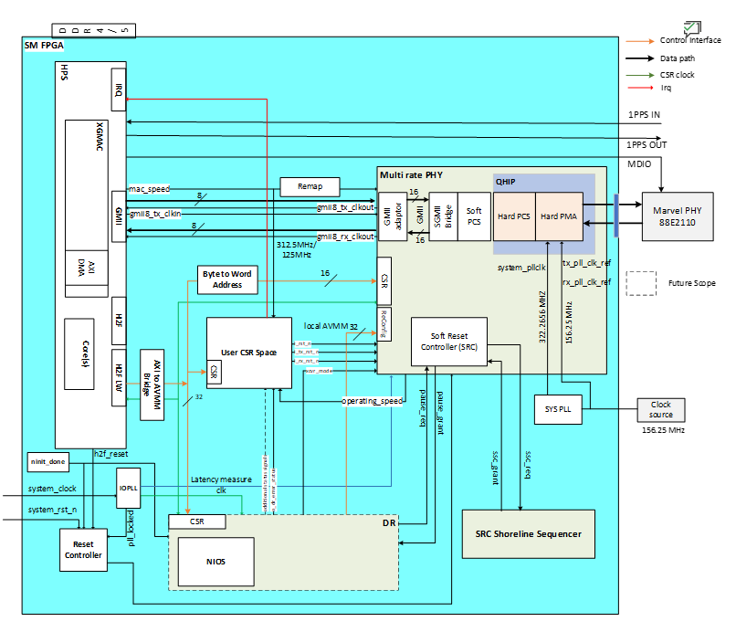
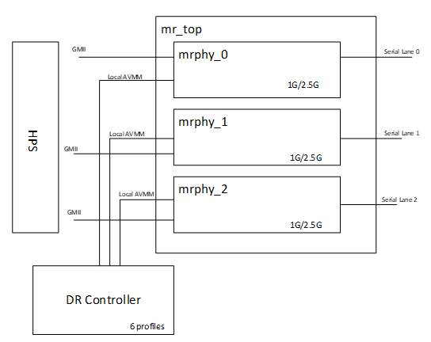
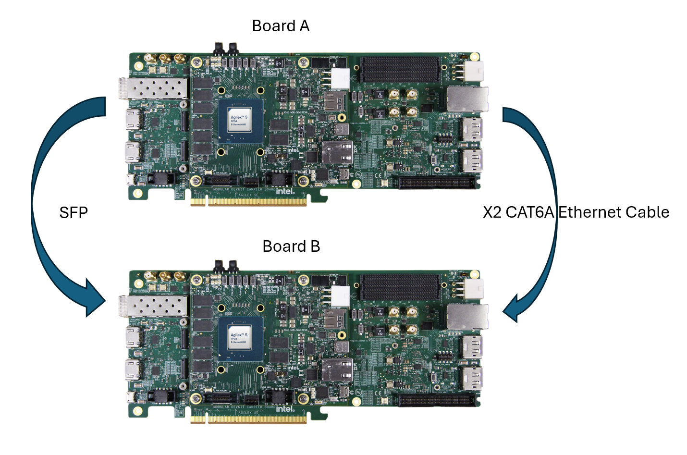

# HPS Time Sensitive Network - XCVR SGMII+ 3x2.5G System Example Design for the Agilex™ 5 E-Series Modular Development Kit 

## Introduction

The IEEE Ethernet is a core technology which is a backbone for IT operations and was designed to provide best effort communication suitable for IT operations. Operational Technology vendors have innovatively used Core IEEE Ethernet technology with proprietary solutions for enabling time-bounded communication. To address the need for precision timing, traffic shaping, and time-bounded communication over networks, IEEE introduced a suite of standards known as Time Sensitive Networking (TSN).

Agilex&trade; 5 E-Series is designed as an end point for Industrial automation application with support for the following TSN protocols:

<h5> Time Synchronization Protocols: </h5>
  
* IEEE 1588-2008 Advanced Timestamp (Precision Time Protocol - PTP):
  * Function: Provides sub-microsecond accuracy for time synchronization between computing systems over a local area network.
    * Key Features: 2-step synchronization, PTP offload, and timestamping.
    * Use Case: Synchronizing industrial devices to operate in unison, ensuring coordinated actions across factory or plant operations.
  * IEEE 802.1AS (Timing and Synchronization):
    * Function: A profile of PTP (version 2) that ensures precise time synchronization in a hierarchical master-slave architecture.
    * Key Features: Prioritizes accuracy and variability of timing, crucial for industrial and automotive systems.
    * Use Case: Synchronizing devices to a common time for optimal operation and collaboration.

<h5> Credit Based Shaper Protocol: </h5>

* IEEE 802.1Qav (Time-Sensitive Streams Forwarding and Queuing):
  * Function: Provides low-latency, time-synchronized delivery of audio and video streams over Ethernet networks.
    * Key Features: Credit-based shaper ensuring end-to-end guaranteed bandwidth with fairness to best-effort traffic.
    * Use Case: Ensuring dedicated bandwidth for audio-video bridging (AVB) streams with minimal latency.

<h5> Traffic Scheduling Protocols: </h5>

* IEEE 802.1Qbv (Time-Scheduled Traffic Enhancements):
  * Function: Enables the transmission of frames at specific scheduled times within microsecond ranges.
    * Key Features: Critical for time-sensitive scheduled traffic in industrial applications.
    * Use Case: Facilitating precise, time-critical communication for industrial devices like PLCs and drives.
  * IEEE 802.1Qbu (Frame Preemption):
    * Function: Allows high-priority frames to preempt lower-priority frames, reducing latency and jitter.
    * Key Features: Utilizes Express Media Access Control (eMAC) and Preemptable Media Access Control (pMAC).
    * Use Case: Ensuring high-priority frames arrive with fixed latency, crucial for applications requiring consistent timing.
  
These TSN standards collectively enable precise timing, traffic shaping, and time-bounded communication, making them indispensable for applications requiring high reliability and determinism.

The details of TSN are out of scope of this document. Here are some reference to the TSN specifications:

* [The IEEE Std 802.1AS™-2011 "Timing and Synchronization for Time-Sensitive Applications in Bridged Local Area Networks"](https://standards.ieee.org/standard/802_1AS-2011.html?oslc_config.context=https%3A%2F%2Frtc.intel.com%2Fgc%2Fconfiguration%2F964)
* [The IEEE Std 802.1Qav™-2009 “Forwarding and Queuing Enhancements for Time-Sensitive Streams”](https://standards.ieee.org/standard/802_1Qav-2009.html?oslc_config.context=https%3A%2F%2Frtc.intel.com%2Fgc%2Fconfiguration%2F964)
* [The IEEE Std 802.1Qbv™-2015 “Enhancements for Scheduled Traffic”](https://standards.ieee.org/standard/802_1Qbv-2015.html?oslc_config.context=https%3A%2F%2Frtc.intel.com%2Fgc%2Fconfiguration%2F964)
* [The IEEE Std 802.1Qbu™-2016 “Frame Preemption”](https://standards.ieee.org/standard/802_1Qbu-2016.html?oslc_config.context=https%3A%2F%2Frtc.intel.com%2Fgc%2Fconfiguration%2F964)
  
### TSN XCVR SGMII+ 3x2.5G Overview

The TSN XCVR SGMII+ is a Reference design, enable datapath between [HPS](https://docs.altera.com/r/docs/814346/26.1/hard-processor-system-technical-reference-manual-agilextm-5-socs/agilextm-5-hard-processor-system-technical-reference-manual-revision-history), [EMAC Controller](https://docs.altera.com/r/docs/814346/26.1/hard-processor-system-technical-reference-manual-agilextm-5-socs/ethernet-media-access-controller), [Multirate Ethernet
PHY IP](https://docs.altera.com/r/docs/813667/26.1/1g/2.5g/5g/10g-multirate-ethernet-phy-ip-user-guide-agilextm-3-and-agilextm-5-fpgas-and-socs/about-the-1g/2.5g/5g/10g-multirate-ethernet-phy-ip-for-agilextm-3-and-agilextm-5-devices) and [Marvell PHY 88E2110](https://www.marvell.com/content/dam/marvell/en/public-collateral/phys-transceivers/marvell-phys-transceivers-alaska-m-88e21x0-datasheet.pdf) running at 2.5G rate on the Agilex™ 5 FPGA E-Series 065B Modular Development Kit.

```bash
Note:
| Interface   | Path                                                | Supported Speeds      | DR  | PTP |
|-------------|-----------------------------------------------------|-----------------------|-----|-----|
| eth0 / phy0 | MAC0 -> MRPHY0 -> Marvell 88E2110 -> Link Partner   | 1G, 2.5G             | Yes | Yes |
| eth1 / phy1 | MAC1 -> MRPHY1 -> Marvell 88E2110 -> Link Partner   | 10M, 100M, 1G, 2.5G  | Yes | No  |
| eth2 / phy2 | MAC2 -> MRPHY2 -> SFP Cage -> Link Partner          | Fixed 2.5G           | No  | Yes |
```

### Prerequisites

* Agilex&trade; 5 FPGA E-Series 065B Modular Development Kit x2, ordering code MK-A5E065BB32AEA. [Refer to the board documentation](https://www.altera.com/products/devkit/po-3274/agilex-5-fpga-and-soc-e-series-065b-modular-development-kit) for more information about the development kit.

* Mini and Micro USB Cable. Included with the development kit.

* Two RJ45 CAT6A copper media and 1 SFP Ethernet Cable.

* Micro SD card and USB card writer. Included with the development kit.

* Host PC with 64 GB of RAM. Less will be fine for only exercising the binaries, and not rebuilding the GSRD.

* Linux OS installed on host PC, preferably Ubuntu 22.04LTS , while other versions and distributions may work too.

* Serial terminal (for example GtkTerm or Minicom on Linux and TeraTerm or PuTTY on Windows)

* Quartus&reg; Prime Pro Edition software version 26.1 is used to recompile the hardware design. If only writing binaries is required, then the Quartus&reg; Prime Pro Edition Programmer version 26.1 is sufficient.

* Local Ethernet network, with DHCP server
Internet connection. For downloading the files, especially when rebuilding the GSRD.

### Release Contents  

#### Binaries

* Prebuilt binaries are located [here](https://github.com/altera-fpga/agilex5-ed-tsn-sgmii/releases/tag/26.1-1).

#### Component Versions

Altera&reg; Quartus<sup>&reg;</sup> Prime Pro Edition Version 26.1 and the following software component versions integrate the 26.1 release. 


| Component                             | Location                                                     | Branch                       | Commit ID/Tag       |
| :------------------------------------ | :----------------------------------------------------------- | :--------------------------- | :------------------ |
| Agilex 5 Design | [https://github.com/altera-fpga/agilex5e-ed-gsrd](https://github.com/altera-fpga/agilex5e-ed-gsrd) | main                    | QPDS26.1_p1_REL_GSRD_PR |
| Linux                                 | [https://github.com/altera-fpga/linux-socfpga](https://github.com/altera-fpga/linux-socfpga) | socfpga-6.18.20-lts | QPDS26.1_REL_GSRD_PR |
| Arm Trusted Firmware                  | [https://github.com/altera-fpga/arm-trusted-firmware](https://github.com/altera-fpga/arm-trusted-firmware) | socfpga_v2.14.1   | QPDS26.1_REL_GSRD_PR |
| U-Boot                                | [https://github.com/altera-fpga/u-boot-socfpga](https://github.com/altera-fpga/u-boot-socfpga) | socfpga_v2026.04 | QPDS26.1_REL_GSRD_PR |
| Yocto Project                         | [https://git.yoctoproject.org/poky](https://git.yoctoproject.org/poky) | wrynose | latest              |
| Yocto meta-altera-fpga Layer | [https://github.com/altera-fpga/meta-altera-fpga](https://github.com/altera-fpga/meta-altera-fpga) | wrynose | QPDS26.1_p1_REL_GSRD_PR |
| KAS | [https://github.com/siemens/kas/](https://github.com/siemens/kas/) | master | 5.4 |

**Note:** The combination of the component versions indicated in the table above has been validated through the use cases described in this page and it is strongly recommended to use these versions together. If you decided to use any component with different version than the indicated, there is not warranty that this will work.

#### Release Notes

* Refer this link for [Known Issues](https://github.com/altera-fpga/agilex5-ed-tsn-sgmii/releases/tag/26.1-1).

### TSN XCVR SGMII+ 2.5G Architecture

Agilex™  FPGAs provide a powerful platform for showcasing 2.5G Ethernet with TSN-enabled applications with all the TSN features including IEEE 802.1AS, IEEE802.1Qbv, IEEE802.1Qbu, IEEE802.1Qav in HPS subsystem by enabling the EMAC Controller.  To support the 2.5G rate, you must enable the 8-bit GMII interface to the FPGA fabric, from where it gets connected to a [Marvell PHY 88E2110](https://www.marvell.com/content/dam/marvell/en/public-collateral/phys-transceivers/marvell-phys-transceivers-alaska-m-88e21x0-datasheet.pdf)  (through the FPGA transceivers) device to drive the two RJ45 CAT6A copper media and 1 SFP

This design demonstrates 3x2.5G ports to HPS

Enable the Data path between HPS <-> XGMAC <->MR PHY (Direct mode) <-> 2 Marvell PHY port + 1 SFP running at 2.5G rate.

Dynamic Reconfiguration Transceiver, this feature allows the transceiver to adapt its operating settings in real time without requiring a full system reprogramming.

In simple terms, the system can store multiple predefined “profiles,” each optimized for a specific data rate, protocol, or signal condition. The hardware can then seamlessly switch between these profiles during operation, depending on application needs or changing link conditions.

```bash
#Switch to 1G
ethtool -s eth0 speed 1000 duplex full autoneg on 
ethtool -s eth1 speed 1000 duplex full autoneg on

#Switch to 2.5G
ethtool -s eth0 speed 2500 duplex full autoneg on
ethtool -s eth1 speed 2500 duplex full autoneg on


```

This Example design  showcases 2.5G data rate.

```text
+----------------------------------------------------------------------+
|                     Agilex 5 SoC System                              |
|                                                                      |
|   +----------------------------------------------------+             |
|   |                        HPS                         |             |
|   +----------------------------------------------------+             |
|            |                      |                |                 |
|            |                      |                |                 |
|   +------------------+  +------------------+  +------------------+   |
|   |   MR PHY 0       |  |   MR PHY 1       |  |   MR PHY 2       |   |
|   |   (PTP)          |  |   (Non-PTP)      |  |   (SFP + PTP)    |   |
|   +------------------+  +------------------+  +------------------+   |
|         |                    |                     |                 |
|   +-----------+        +------------+         +-----------+          |
|   | Marvell PHY|        | Marvell PHY|        | SFP Cage  |          |
|   | Port 0     |        | Port 1     |        | Port 2    |          |
|   | 2.5G/1G    |        | 2.5G/1G/   |        | 2.5G      |          |
|   | PTP        |        | 100M/10M   |        | SFP+PTP   |          |
|   |            |        | Non-PTP    |        |           |          |
|   +------------+        +-------------+       +-----------+          |
|                                                                      |
+----------------------------------------------------------------------+
```

* Showcases dynamic reconfiguration, allowing runtime switching between Ethernet rates without system downtime.
- Demonstrates **Dynamic Reconfiguration (DR)**, enabling Ethernet link rates to be switched at runtime without requiring system downtime.
- **Port 0**
  - Supports **2.5G** and **1G** operation.
  - Demonstrates **Precision Time Protocol (PTP)** functionality.
- **Port 1**
  - Configured as a **non-PTP** port.
  - Provides expanded multi-rate support, including **2.5G**, **1G**, **100M**, and **10M** operation.
- **Port 2**
  - Configured for **Small Form-factor Pluggable (SFP)** operation.
  - Supports a fixed **2.5G** link rate.
  - Provides **PTP** functionality.

```bash
Note: Port 2 (SFP) does not support dynamic reconfiguration.
```

* Enable the Deterministic Latency (DL) feature of MR PHY IP which precisely determines the delay between the PCS elastic FIFO (EFIFO) and the PMA pins for TSN usecases. Also enable the CSR interface with HPS Light weight bridge to convey these delays (Soft PCS, Hard PCS and PMA delays) for both RX and TX directions.

* GMII (8-bit) interface for TSN enabled ethernet data transfers to and from XGMAC to external PHY. Transceiever’s reference clocks are used to derive the required frequency for running this parallel interface as the expectation is to have zero ppm difference between these clocks.




#### HPS Subsystem

The Hard Processor System (HPS) in this design is a critical component that interfaces with various subsystems and peripherals to ensure efficient and high-performance operation. The following are the key connections of the HPS to other design components;

* Light Weight HPS to FPGA Manager (H2F) interface to access control and status registers of TSN Subsystem and Peripheral Subsystem

* 8-bit EMAC GMII interface to connect to 1G/2.5G/5G/10G Multirate Ethernet PHY IP for TSN-enabled ethernet data transfers

#### TSN Subsystem

The main components of the TSN Subsystem are _[Multirate Ethernet PHY IP](https://docs.altera.com/r/docs/813667/26.1/1g/2.5g/5g/10g-multirate-ethernet-phy-ip-user-guide-agilextm-3-and-agilextm-5-fpgas-and-socs/about-the-1g/2.5g/5g/10g-multirate-ethernet-phy-ip-for-agilextm-3-and-agilextm-5-devices), GTS System PLL Clocks IP, Reset Release IP and IOPLL IP_.

* The Multirate Ethernet PHY IP transmits outgoing traffic (from HPS GMII interface) and receives incoming traffic through GTS Transceiver PHY.

* The GMII adapter is enabled to convert the 8-bit GMII data from HPS to the 16-bit data inside the Multirate Ethernet PHY IP
  
* The IEEE 1588 Precision Time Protocol feature is enabled to accurately measure internal data path delay, ensuring high accuracy of TSN applications.

* The GTS System PLL Clocks IP provides a system PLL clock input to Multirate Ethernet PHY IP, while the IOPLL IP generates a clock source for latency_sclk and latency_measurement_clk of Multirate Ethernet PHY IP.

#### Software Subsystem

The software subsystem for the TSN XCVR SGMII+ 2.5G System Example Design is built on the Linux OS, which is responsible for managing the proper register settings of the peripheral components. A crucial part of this setup involves configuring the Device Tree Source (.dts) file to ensure the correct operation.

In this design example, gmac0/gmac1/gmac2 is routed to the FPGA and the corresponding device tree node gmac0/1/2 is described as follows:
(Note that while the phy-mode 2500base-x, the mac-mode should be specified as gmii.)

```text
+	/*
+	 * MRPHY soft-PCS CSR for each port. PHY0 and PHY1 reference
+	 * the shared DR controller and User-Space CSR. PHY2 (SFP) is
+	 * fixed at 2.5G and does not use DR.
+	 */
+	gmii_to_sgmii_converter0: phy@30020100 {
+		compatible = "altr,gmii-to-sgmii-2.0";
+		reg = <0x0 0x30020100 0x0 0x80>;
+		reg-names = "mrphy";
+
+		altr,drphy = <&drphy>;
+		altr,mrphy-usrspc = <&mrphy_usrspc>;
+		altr,phy-num = <0>;
+		altr,drphy-profile-1g = <1>;
+		altr,drphy-profile-2500 = <2>;
+	};
+
+	gmii_to_sgmii_converter1: phy@30020180 {
+		compatible = "altr,gmii-to-sgmii-2.0";
+		reg = <0x0 0x30020180 0x0 0x80>;
+		reg-names = "mrphy";
+
+		altr,drphy = <&drphy>;
+		altr,mrphy-usrspc = <&mrphy_usrspc>;
+		altr,phy-num = <1>;
+		altr,drphy-profile-1g = <3>;
+		altr,drphy-profile-2500 = <4>;
+	};
+
+	gmii_to_sgmii_converter2: phy@30020200 {
+		compatible = "altr,gmii-to-sgmii-2.0";
+		reg = <0x0 0x30020200 0x0 0x80>;
+		reg-names = "mrphy";
+		altr,phy-num = <2>;
+	};
+
+	/* Shared Dynamic Reconfiguration controller (PHY0 + PHY1). */
+	drphy: phy-dr@30020700 {
+		compatible = "altr,xcvr-dr-controller";
+		reg = <0x0 0x30020700 0x0 0x80>;
+	};
+
+	/* MRPHY User-Space CSR: per-port reset, status, delay regs. */
+	mrphy_usrspc: mrphy-usrspc@30020300 {
+		compatible = "altr,mrphy-user-csr";
+		reg = <0x0 0x30020300 0x0 0x50>;
+	};
+
+	mdio: mdio@30020500 {
+		compatible = "altr,altr-mdio";
+		reg = <0x0 0x30020500 0x0 0x100>;
+		#address-cells = <1>;
+		#size-cells = <0>;
+
+		phy_0: ethernet-phy@0 {
+			reg = <0>;
+			compatible = "ethernet-phy-ieee802.3-c45";
+			max-speed = <2500>;
+		};
+
+		phy_1: ethernet-phy@1c {
+			reg = <0x1c>;
+			compatible = "ethernet-phy-ieee802.3-c45";
+			max-speed = <2500>;
+		};
+	};
+
+	i2c5: i2c@30020600 {
+		compatible = "altr,softip-i2c-v1.0";
+		reg = <0x0 0x30020600 0x0 0x100>;
+		#address-cells = <1>;
+		#size-cells = <0>;
+		interrupt-parent = <&intc>;
+		interrupts = <0 0x33 4>;
+		clocks = <&clkmgr AGILEX5_L4_SP_CLK>;
+		fifo-size = <256>;
+		clock-frequency = <400000>;
+	};
+};
+
+&gmac0 {
+	status = "okay";
+	phy-mode = "2500base-x";
+	mac-mode = "gmii";
+	phy-handle = <&phy_0>;
+	max-speed = <2500>;
+	altr,min-speed = <1000>;        /* eth0: advertise 1G + 2.5G only */
+	max-frame-size = <9000>;
+	#address-cells = <1>;
+	#size-cells = <1>;
+	altr,gmii-to-sgmii-converter = <&gmii_to_sgmii_converter0>;
+};
+
+&gmac1 {
+	status = "okay";
+	phy-mode = "2500base-x";
+	mac-mode = "gmii";
+	phy-handle = <&phy_1>;
+	max-speed = <2500>;
+	/* No altr,min-speed; eth1 advertises 10M/100M/1G/2.5G. */
+	max-frame-size = <9000>;
+	#address-cells = <1>;
+	#size-cells = <1>;
+	altr,gmii-to-sgmii-converter = <&gmii_to_sgmii_converter1>;
+};
+
+&gmac2 {
+	status = "okay";
+	phy-mode = "2500base-x";
+	mac-mode = "gmii";
+	max-speed = <2500>;
+	max-frame-size = <9000>;
+	#address-cells = <1>;
+	#size-cells = <1>;
+	altr,gmii-to-sgmii-converter = <&gmii_to_sgmii_converter2>;
+
+	sfp28_cage: sfp {
+		compatible = "sff,sfp";
+		i2c-bus = <&i2c5>;
+	};
+
+	/*
+	 * fixed-link pins eth2 at 2.5G; no PHY-side autoneg, so no
+	 * altr,min-speed is needed.
+	 */
+	fixed-link {
+		speed = <2500>;
+		full-duplex;
+	};
+};
--
```

### Hardware Setup

 The _Board-to-Board_ hardware setup connection details are captured in the image below.


Note:

_1. This is the reference hardware setup  and user can leverage with their own hardware setup(Ex: Board to Third party device)._

### Address Map Details

#### HPS LW H2F Register Map

| Address Offset | Size (Bytes) | Peripheral | Description |
|-----|-----|-----|-----|
| GHRD-aligned address space |
|0x2000_0000 |4k|DFL ROM |DFL ROM containing device list content generated from Platform |
|0x2001_0000 |32|System ID |Hardware configuration system ID (0xacd5cafe) |
|0x2001_1060 | 16 | Button PIO | Push Button |
|0x2001_1070 |16 | DIPSW PIO | DIP Switch |
|0x2001_1080 | 16 | LED PIO | LED connections on board |
|0x2001_0100 | 256 | Interrupt Latency Counter | Interrupt Latency Counting |
| Application-specific address space |
| 0x3002_0000 | 128 | DR Controller | DR controller for XCVR Profile change |
| 0x3002_0100 | 128 | Multirate Ethernet PHY | Multirate Ethernet PHY IP CSR |
| 0x3002_0180 | 128 | Multirate Ethernet PHY | Multirate Ethernet PHY IP CSR |
| 0x3002_0200 | 128 | Multirate Ethernet PHY | Multirate Ethernet PHY IP CSR |
| 0x3002_0280 | Rsvd | | |
| 0x3002_0300 | 128 | User space CSR | Collect sideband signals from different modules; Control signals like resets too; Error conditions |
| 0x3002_0400 | Rsvd | | |
| 0x3002_0500 | 256 | MDIO PHY Management| |
| 0x3002_0600 | 256 | I2C PHY Management| |

#### User Space CSR

The User Space CSR contains registers specific to system-level status (e.g. PLL locked, RX ready) and control (e.g., reset).

| Access | Definition |
|---|---|
| RO | Read only |
| RW | Read and write |

<h5> Multirate Ethernet PHY Status Register (Offset 0x00)</h5>

| Name | Bit | Access | Default | Description |
|-----|-----|-----|-----|-----|
| Reserved | [31:21] | RO | 11'b0 | Reserved |
| PHY_2_op_speed | [20:18] | RO | 3'b100 | PHY2 -MRPHY Op speed - 2.5G |
| PHY_2_rx_block_lock | [17:17] | RO | 1'b0 | PHY2 -Asserted when 66b block alignment is finished on all PCS virtual lanes |
| PHY_2_tx_ready | [16:16] | RO | 1'b0 | PHY2 -Asserted when MRPHY TX is ready |
| PHY_2_rx_ready | [15:15] | RO | 1'b0 | PHY2 -Asserted when MRPHY RX is ready |
| PHY_2_mrphy_pll_lock | [14:14] | RO | 1'b0 | PHY2 -Asserted when PLL in MRPHY soft logic is locked |
| PHY_1_op_speed | [13:11] | RO | 3'b100 | PHY1 -MRPHY Op speed - 2.5G |
| PHY_1_rx_block_lock | [10:10] | RO | 1'b0 |PHY1 -Asserted when 66b block alignment is finished on all PCS virtual lanes |
| PHY_1_tx_ready | [9:9] | RO | 1'b0 |PHY1 -Asserted when MRPHY TX is ready |
| PHY_1_rx_ready |[8:8] |RO |1'b0 | PHY1 -Asserted when MRPHY RX is ready |
| PHY_1_mrphy_pll_lock | [7:7] | RO | 1'b0 | PHY1 -Asserted when PLL in MRPHY soft logic is locked |
| PHY_0_op_speed | [6:4] | RO | 3'b100 | PHY0 -MRPHY Op speed - 2.5G | 
| PHY_0_rx_block_lock | [3:3] | RO | 1'b0 | PHY0 -Asserted when 66b block alignment is finished on all PCS virtual lanes |
| PHY_0_tx_ready | [2:2] | RO | 1'b0 |PHY0 -Asserted when MRPHY TX is ready |
| PHY_0_rx_ready | [1:1] | RO | 1'b0 | PHY0 -Asserted when MRPHY RX is ready |
| PHY_0_mrphy_pll_lock | [0:0] | RO |1'b0 | PHY0 - Asserted when PLL in MRPHY soft logic is locked |

<h5>Multirate Ethernet PHY Reset Control Register (Offset 0x04)</h5>

| Name | Bit | Access | Default | Description |
|-----|-----|-----|-----|-----|
| Reserved | [31:9] | RO | 23'b0 | Reserved |
| PHY_2_i_rx_rst_n | [8:8] | RW | 1'b1 | PHY2 -Reset MRPHY RX path. Self cleared on o_rx_rst_ack_n |
| PHY_2_i_tx_rst_n | [7:7] | RW | 1'b1 | PHY2 -Reset MRPHY TX path. Self cleared on o_rx_rst_ack_n |
| PHY_2_i_rst_n | [6:6] | RW | 1'b1 | PHY2 -Global reset to MRPHY. Self cleared on o_rst_ack_n |
| PHY_1_i_rx_rst_n | [5:5] | RW | 1'b1 | PHY1 -Reset MRPHY RX path. Self cleared on o_rx_rst_ack_n |
| PHY_1_i_tx_rst_n | [4:4] | RW | 1'b1 | PHY1 -Reset MRPHY TX path. Self cleared on o_rx_rst_ack_n |
| PHY_1_i_rst_n | [3:3] | RW | 1'b1 | PHY1 -Global reset to MRPHY. Self cleared on o_rst_ack_n |
| PHY_0_i_rx_rst_n | [2:2] | RW | 1'b1 | PHY0 -Reset MRPHY RX path. Self cleared on o_rx_rst_ack_n |
| PHY_0_i_tx_rst_n | [1:1] | RW | 1'b1 | PHY0 -Reset MRPHY TX path. Self cleared on o_rx_rst_ack_n |
| PHY_0_i_rst_n | [0:0] | RW | 1'b1 | PHY0 -Global reset to MRPHY. Self cleared on o_rst_ack_n |

<h5>TX Delay Register (Offset 0x08)</h5>

| Name | Bit | Access | Default | Description |
|-----|-----|-----|-----|-----|
| Reserved | [31:12] | RO | 20'b0 | Reserved |
| Additional_User_added_delay1 | [11:8] | RO | 4'b0 | Future - In concurrent use case |
| Additional_User_added_delay2 | [7:4] | RO | 4'b0 | Future - In concurrent use case |
| Additional_User_added_delay3 | [3:0] | RO | 4'b0 |Additional GMII Datapath Delay added by used if timing issue arise in number of clock cycles gmii8_tx_clkout |

<h5>RX Delay Register (Offset 0x0C)</h5>

| Name | Bit | Access | Default | Description |
|-----|-----|-----|-----|-----|
| Reserved | [31:12] | RO | 20'b0 | Reserved |
| Additional_User_added_delay1 | [11:8] | RO | 4'b0 | Future - In concurrent use case |
| Additional_User_added_delay2 | [7:4] | RO | 4'b0 | Future - In concurrent use case |
| Additional_User_added_delay3 | [3:0] | RO | 4'b0 |Additional GMII Datapath Delay added by used if timing issue arise in number of clock cycles gmii8_rx_clkout |

<h5>Error Status Register (Offset 0x10)</h5>

| Name | Bit | Access | Default | Description |
|-----|-----|-----|-----|-----|
| Reserved | [31:3] | RO | 29'b0 | Reserved |
| Unsupported_Speed_Error1 | [2:1] | RW | 2'b0 | For concurrent Usecases |
| Unsupported_Speed_Error2 | [0:0] | RW | 1'b0 | Assert high when XGMAC publish unsupported speeds. SW to clear these bits once addressed |

<h5>DR Status Register (Offset 0x14)</h5>

| Field Name | Bits | Access | Default | Description |
|------------|------|---------|---------|-------------|
| Reserved | [31:17] | Reserved | 0x0 | Reserved |
| dr_new_cfg_applied | [16] | RO | 0x0 | Asserted when a new profile is applied by the DR Controller |
| Reserved | [15:1] | Reserved | 0x0 | Reserved |
| dr_error_status | [0] | RW | 0x0 | Error status indication from DR Controller |

<h5>XCVR_MODE Register (Offset 0x18)</h5>

| Field Name | Bits | Access | Default | Description |
|------------|------|---------|---------|-------------|
| Reserved | [31:6] | RO | 26'b0 | Reserved |
| xcvr_mode_phy2 | [5:4] | RW | 2'b00 | XCVR mode for MR PHY2 |
| xcvr_mode_phy1 | [3:2] | RW | 2'b00 | XCVR mode for MR PHY1 |
| xcvr_mode_phy0 | [1:0] | RW | 2'b00 | XCVR mode for MR PHY0 |

<h5>PHY0_TX_DELAY (Offset 0x1C)</h5>

| Field Name | Bits | Access | Default | Description |
|------------|------|---------|---------|-------------|
| Reserved | [31:16] | Reserved | 0x0 | Reserved |
| phy_delay_ns | [15:0] | RO | 0 | FPGA IO to Marvell PHY TX path delay (ns) |

<h5>PHY0_RX_DELAY (Offset 0x20)</h5>

| Field Name | Bits | Access | Default | Description |
|------------|------|---------|---------|-------------|
| Reserved | [31:16] | Reserved | 0x0 | Reserved |
| phy_delay_ns | [15:0] | RO | 0 | FPGA IO to Marvell PHY RX path delay (ns) |

<h5>PHY1_TX_DELAY (Offset 0x24)</h5>

| Field Name | Bits | Access | Default | Description |
|------------|------|---------|---------|-------------|
| Reserved | [31:16] | Reserved | 0x0 | Reserved |
| phy_delay_ns | [15:0] | RO | 0 | FPGA IO to Marvell PHY TX path delay (ns) |

<h5>PHY1_RX_DELAY (Offset 0x28)</h5>

| Field Name | Bits | Access | Default | Description |
|------------|------|---------|---------|-------------|
| Reserved | [31:16] | Reserved | 0x0 | Reserved |
| phy_delay_ns | [15:0] | RO | 0 | FPGA IO to Marvell PHY RX path delay (ns) |

<h5>PHY2_TX_DELAY (Offset 0x2C)</h5>

| Field Name | Bits | Access | Default | Description |
|------------|------|---------|---------|-------------|
| Reserved | [31:16] | Reserved | 0x0 | Reserved |
| phy_delay_ns | [15:0] | RO | 0 | FPGA IO to Marvell PHY TX path delay (ns) |

<h5>PHY2_RX_DELAY (Offset 0x30)</h5>

| Field Name | Bits | Access | Default | Description |
|------------|------|---------|---------|-------------|
| Reserved | [31:16] | Reserved | 0x0 | Reserved |
| phy_delay_ns | [15:0] | RO | 0 | FPGA IO to Marvell PHY RX path delay (ns) |

<h5>Reserved Register (Offset 0x40)</h5>

| Field Name | Bits | Access | Default | Description |
|------------|------|---------|---------|-------------|
| Reserved | [31:0] | Reserved | 0x0 | Address-space padding register. No functional use. |

## User Flow

 There are two ways to test the design based on user flow.

<h5> User Flow 1: Testing with Prebuild Binaries. </h5>

<h5> User Flow 2: Testing Complete Flow. </h5>

 |User Flow|Description|Required for [User flow 1](#user-flow)|Required for [User flow 2](#user-flow)|
 |-|-|-|-|
 |Environment Setup|[Tools Download and Installation](#tools-download-and-installation)|Yes|Yes|
 ||[Installing Dependency Packages for SW Compilation](#installing-dependency-packages-for-sw-compilation)|No|Yes|
 ||[Package Download](#package-download)|No|Yes|
 |Compilation|Simulation|No|No|
 ||[Hardware Compilation](#hardware-compilation)|No|Yes|
 ||[Software Compilation](#software-compilation)|No|Yes|
 |Programming|[Programming Hardware binary](#programming-hardware-binary)|Yes|Yes|
 ||[Programming Software Image](#programming-software-image)|Yes|Yes|
 ||[Linux boot](#linux-boot)|Yes|Yes|
 |Testing|[Run Ping Test](#running-ping-test)|Yes|Yes|
 ||[Running _iperf_ Test](#running-iperf-test)|Yes|Yes|

### Environment Setup

#### Tools Download and Installation

1\. Quartus Prime Pro

* Download the Quartus® Prime Pro Edition software version 26.1 from the FPGA Software Download Center of the Altera® Website. Follow the on-screen instructions to complete the installation process. Choose an installation directory that is relative to the Quartus® Prime Pro Edition software installation directory.

* Set up the Quartus tools in the PATH, so they are accessible without full path.
  


Enable Quartus tools to be called from command line:


```bash
source ~/altera_pro/26.1/qinit.sh
```


2\. Download and setup the build toolchain. It will be used only by the GHRD makefile to build the debug HPS FSBL, to build the \_hps\_debug.sof file:

Note that this is installed in the `TOP_FOLDER`. You may installed this is in other location, but note the path and export it accordingly

```bash
# Create the top folder to store all the build artifacts:
rm -rf artifacts.enablement
mkdir artifacts.enablement
cd artifacts.enablement
export TOP_FOLDER=`pwd`
```

```bash
cd $TOP_FOLDER
wget https://developer.arm.com/-/media/Files/downloads/gnu/11.2-2022.02/binrel\
/gcc-arm-11.2-2022.02-x86_64-aarch64-none-linux-gnu.tar.xz
tar xf gcc-arm-11.2-2022.02-x86_64-aarch64-none-linux-gnu.tar.xz
rm -f gcc-arm-11.2-2022.02-x86_64-aarch64-none-linux-gnu.tar.xz
```

```bash
export PATH=`pwd`/gcc-arm-11.2-2022.02-x86_64-aarch64-none-linux-gnu/bin:$PATH
export ARCH=arm64
export CROSS_COMPILE=aarch64-none-linux-gnu- 
```

3\. Win32 Disk Imager

* Download and install the latest [Win32 Disk Imager](https://win32diskimager.org/).

4\. Agilex&trade;  5 FPGA E-Series 065B Modular Development Kit Board Test System (BTS)

* Go to the [Agilex™ 5 FPGA E-Series 065B Modular Development Kit](https://www.altera.com/products/devkit/po-3274/agilex-5-fpga-and-soc-e-series-065b-modular-development-kit) webpage, download and extract the [installer package](https://cdrdv2.intel.com/v1/dl/getContent/822942), which includes [BTS](https://docs.altera.com/r/docs/820977/current/agilextm-5-fpga-e-series-065b-modular-development-kit-user-guide/board-test-system).
  
   _Note: If you are using [User Flow 1](#1-testing-with-prebuild-binaries), after the BTS installation, go to [Programming](#programming-the-binaries) stage directly._

#### Installing Dependency Packages for SW Compilation

Follow the instructions in the Base GSRD [Yocto Build Prerequisites](https://altera-fpga.github.io/rel-26.1/embedded-designs/agilex-5/e-series/modular/gsrd/ug-gsrd-agx5e-modular/#yocto-build-prerequisites) section.

#### Package Download

```bash
cd $TOP_FOLDER
rm -rf agilex5-ed-tsn-sgmii
git clone -b rel/26.1 https://github.com/altera-fpga/agilex5-ed-tsn-sgmii
```

### Compilation

#### Hardware Compilation

```bash
cd $TOP_FOLDER/agilex5-ed-tsn-sgmii/src/hw/a5e065bb32aea_mdk_3x2.5G/
quartus_sh --flow compile top.qpf -c top
```

The following file will be generated:

`$TOP_FOLDER/agilex5-ed-tsn-sgmii/src/hw/a5e065bb32aea_mdk_3x2.5G/output_files/top.sof`

<h5>Build QSPI Image</h5>

```bash
cd $TOP_FOLDER
rm -f top.hps.jic top.core.rbf

# Note : If user doing compilation first time, download the prebuilt u-boot-spl-dtb.hex  file and create the following path $TOP_FOLDER/agilex5-ed-tsn-sgmii/src/sw/agilex5_mk_a5e065bb32aes1-gsrd-images/u-boot-agilex5-socdk-gsrd-atf/ and copy the u boot file here.


SOF=$TOP_FOLDER/agilex5-ed-tsn-sgmii/src/hw/a5e065bb32aea_mdk_3x2.5G/output_files/top.sof
JIC=top.jic
HPS_PRELOADER=$TOP_FOLDER/agilex5-ed-tsn-sgmii/src/sw/artifacts/u-boot-spl-dtb.hex

quartus_pfg -c $SOF $JIC \
  -o device=MT25QU128 \
  -o flash_loader=A5ED065BB32AE6SR0 \
  -o hps_path=$HPS_PRELOADER \
  -o mode=ASX4 \
  -o hps=1


```

The following file will be created:

`$TOP_FOLDER/top.hps.jic`

<h5>Build RBF</h5>

```bash
cd $TOP_FOLDER
rm -f top.*.rbf

# Note : If user doing compilation first time, download the prebuilt u-boot-spl-dtb.hex  file and create the following path $TOP_FOLDER/agilex5-ed-tsn-sgmii/src/sw/agilex5_mk_a5e065bb32aes1-gsrd-images/u-boot-agilex5-socdk-gsrd-atf/ and copy the u boot file here.

# Input FPGA design file
SOF=$TOP_FOLDER/agilex5-ed-tsn-sgmii/src/hw/a5e065bb32aea_mdk_3x2.5G/output_files/top.sof

# HPS preloader file
HPS_PRELOADER=$TOP_FOLDER/agilex5-ed-tsn-sgmii/src/sw/artifacts/u-boot-spl-dtb.hex

# Generate bootable SOF with HPS preloader
quartus_pfg -c -o hps_path=$HPS_PRELOADER $SOF $SOF

# Generate RBF for runtime FPGA configuration
quartus_pfg -c -o hps=on $SOF $TOP_FOLDER/top.rbf

```

The following file will be generated:

`$TOP_FOLDER/top.core.rbf`
`$TOP_FOLDER/top.hps.rbf`

#### Software Compilation

<h5>Set Up Yocto</h5>

```bash
   cd $TOP_FOLDER/agilex5-ed-tsn-sgmii/src/sw
   # Run the `agilex5_mk_a5e065bb32aes1-gsrd-build.sh` script to sync the submodules.
   . agilex5_mk_a5e065bb32aes1-gsrd-build.sh
   # Run the `build_setup` script to set up the build environment.
   build_setup
```

<h5> Optional: Follow these steps, if you have a custom GHRD  </h5>

Follow the below procedure to add the generated `agilex5_*_a5e065bb32aes1_gsrd_ghrd.core.rbf` file.
  
* For Agilex5 MK-A5E065BB32AES1:-agilex5_mk_a5e065bb32aes1_gsrd_ghrd.core.rbf

Update the recipe `$WORKSPACE/meta-sm-tsn-sgmii/recipes-bsp/ghrd/hw-ref-design.bbappend` as follows:

```bash
cd $TOP_FOLDER
CORE_RBF=$WORKSPACE/meta-altera-tsn-sgmii/recipes-bsp/ghrd/files/agilex5_mk_a5e065bb32aes1_gsrd_ghrd.core.rbf
rm -rf $CORE_RBF
ln -s $TOP_FOLDER/top.core.rbf $CORE_RBF
CORE_SHA=$(sha256sum $CORE_RBF | cut -f1 -d" ")
FILE="$WORKSPACE/meta-sm-tsn-sgmii/recipes-bsp/ghrd/hw-ref-design.bbappend"
OLD_URI='SRC_URI\[agilex5_mk_a5e065bb32aes1_gsrd_core_cfg3.sha256sum\] += "[^"]*"'
NEW_URI="SRC_URI[agilex5_mk_a5e065bb32aes1_gsrd_core_cfg3.sha256sum] += \"$CORE_SHA\""
sed -i "s|$OLD_URI|$NEW_URI|" "$FILE"
```

<h5> Build Yocto </h5>

Build Yocto:

```bash
    # Run the `bitbake_image` command to generate the binaries.
    bitbake_image
```

Gather Files:

```bash
   #  Package the binaries into the build folder.
    package
```

The following files will be created:

* `$TOP_FOLDER/agilex5-ed-tsn-sgmii/src/sw/agilex5_mk_a5e065bb32aes1-gsrd-images/u-boot-agilex5-socdk-gsrd-atf/u-boot-spl-dtb.hex`

* `$TOP_FOLDER/agilex5-ed-tsn-sgmii/src/sw/agilex5_mk_a5e065bb32aes1-gsrd-images/u-boot-agilex5-socdk-gsrd-atf/u-boot.itb`

* `$TOP_FOLDER/agilex5-ed-tsn-sgmii/src/sw/agilex5_mk_a5e065bb32aes1-gsrd-images/sdimage.tar.gz`

### Programming

_Note:_

* Download the [Prebuild Binaries](#binaries), if you are leveraging on _[User Flow 1](#user-flow-1-testing-with-prebuild-binaries)._
* Leave all jumpers and switches in their default configuration.

#### Programming Software Image

<h5> Write SD Card </h5>

1. Extract the SD card image(sdimage.tar.gz) archive and obtain the file `gsrd-console-image-agilex5.wic`.

2. Write the extracted SD card image (gsrd-console-image-agilex5.wic) to the micro-SD card using the included USB writer in the host computer:

On Linux, use the dd utility as shown below:

```bash
    # Determine the device associated with the SD card on the host computer. 
    cat /proc/partitions
    # This will return for example /dev/sdx
    # Use dd to write the image in the corresponding device
    sudo dd if=gsrd-console-image-agilex5.wic of=/dev/sdx bs=1M
    # Flush the changes to the SD card
    sync
```

On Windows, use the Win32DiskImager program. First, rename the gsrd-console-image-agilex5.wic to an .img file (sdcard.img, for example) and write the image as shown in the following figure:


#### Programming Hardware binary

<h5> Write QSPI Flash</h5>

1. Download the JIC image, then write it to QSPI.

```bash
jtagconfig --setparam 1 JtagClock 16M
quartus_pgm -c 1 -m jtag -o "pvi;top.hps.jic"
```

#### Linux Boot

1. Open the serial port of Board A and Board B by using serial communication utility.

    _Note: Follow the instructions in the Base GSRD [configure-serial-console](https://altera-fpga.github.io/rel-26.1/embedded-designs/agilex-5/e-series/modular/gsrd/ug-gsrd-agx5e-modular/#configure-serial-console) section, to configure and setup serial connection._

2. Power cycle the board.

3. Monitor the serial communication windows and wait for Linux to boot, use _root_ as user name, and no password is required.

#### Running Ping Test

Use _ifconfig_ to configure the IP address on both the Board DUT and start testing.

Example:-

```bash
ifconfig

eth0: flags=4163<UP,BROADCAST,RUNNING,MULTICAST>  mtu 1500
        inet 169.254.220.240  netmask 255.255.0.0  broadcast 169.254.255.255
        inet6 fe80::b068:1aff:fe7c:aa02  prefixlen 64  scopeid 0x20<link>
        ether b2:68:1a:7c:aa:02  txqueuelen 1000  (Ethernet)
        RX packets 347637  bytes 484781613 (462.3 MiB)
        RX errors 0  dropped 0  overruns 0  frame 0
        TX packets 178614  bytes 32669690 (31.1 MiB)
        TX errors 0  dropped 0 overruns 0  carrier 0  collisions 0
        device interrupt 23  base 0x8000

eth1: flags=4163<UP,BROADCAST,RUNNING,MULTICAST>  mtu 1500
        inet 169.254.225.122  netmask 255.255.0.0  broadcast 169.254.255.255
        inet6 fe80::e45c:b0ff:fee4:767c  prefixlen 64  scopeid 0x20<link>
        ether e6:5c:b0:e4:76:7c  txqueuelen 1000  (Ethernet)
        RX packets 328640  bytes 456017787 (434.8 MiB)
        RX errors 0  dropped 0  overruns 0  frame 0
        TX packets 171153  bytes 32075199 (30.5 MiB)
        TX errors 0  dropped 0 overruns 0  carrier 0  collisions 0
        device interrupt 40

eth2: flags=4163<UP,BROADCAST,RUNNING,MULTICAST>  mtu 1500
        inet 169.254.158.219  netmask 255.255.0.0  broadcast 169.254.255.255
        inet6 fe80::88be:c9ff:fe7a:7bec  prefixlen 64  scopeid 0x20<link>
        ether 8a:be:c9:7a:7b:ec  txqueuelen 1000  (Ethernet)
        RX packets 342615  bytes 477159176 (455.0 MiB)
        RX errors 0  dropped 0  overruns 0  frame 0
        TX packets 176198  bytes 32459349 (30.9 MiB)
        TX errors 0  dropped 0 overruns 0  carrier 0  collisions 0
        device interrupt 57  base 0x8000

lo: flags=73<UP,LOOPBACK,RUNNING>  mtu 65536
        inet 127.0.0.1  netmask 255.0.0.0
        inet6 ::1  prefixlen 128  scopeid 0x10<host>
        loop  txqueuelen 1000  (Local Loopback)
        RX packets 2736892  bytes 166952698 (159.2 MiB)
        RX errors 0  dropped 0  overruns 0  frame 0
        TX packets 2736892  bytes 166952698 (159.2 MiB)
        TX errors 0  dropped 0 overruns 0  carrier 0  collisions 0

# Execute this command on Board #A DUT: 
 ifconfig eth0 192.168.1.100
 ifconfig eth1 192.169.1.100
 ifconfig eth2 192.170.1.100 
  
# Execute this command on Board #B DUT: 
 ifconfig eth0 192.168.1.101
 ifconfig eth1 192.169.1.101
 ifconfig eth2 192.170.1.101

# Do ping to Board #B from Board #A

root@agilex5mka5e065bb32aes1:~# ping -I eth0 192.168.1.101
PING 192.168.1.101 (192.168.1.101): 56 data bytes
64 bytes from 192.168.1.101: seq=0 ttl=64 time=1.053 ms
64 bytes from 192.168.1.101: seq=1 ttl=64 time=0.330 ms
64 bytes from 192.168.1.101: seq=2 ttl=64 time=0.250 ms
64 bytes from 192.168.1.101: seq=3 ttl=64 time=0.178 ms
64 bytes from 192.168.1.101: seq=4 ttl=64 time=0.164 ms

--- 192.168.1.101 ping statistics ---
5 packets transmitted, 5 packets received, 0% packet loss
round-trip min/avg/max = 0.164/0.395/1.053 ms

root@agilex5mka5e065bb32aes1:~# ping -I eth1 192.169.1.101
PING 192.169.1.101 (192.169.1.101): 56 data bytes
64 bytes from 192.169.1.101: seq=0 ttl=64 time=0.587 ms
64 bytes from 192.169.1.101: seq=1 ttl=64 time=0.256 ms
64 bytes from 192.169.1.101: seq=2 ttl=64 time=0.194 ms
64 bytes from 192.169.1.101: seq=3 ttl=64 time=0.622 ms

--- 192.169.1.101 ping statistics ---
4 packets transmitted, 4 packets received, 0% packet loss
round-trip min/avg/max = 0.194/0.414/0.622 ms

root@agilex5mka5e065bb32aes1:~# ping -I eth2 192.170.1.101
PING 192.170.1.101 (192.170.1.101): 56 data bytes
64 bytes from 192.170.1.101: seq=0 ttl=64 time=0.906 ms
64 bytes from 192.170.1.101: seq=1 ttl=64 time=0.456 ms
64 bytes from 192.170.1.101: seq=2 ttl=64 time=0.280 ms
64 bytes from 192.170.1.101: seq=3 ttl=64 time=0.212 ms

--- 192.170.1.101 ping statistics ---
4 packets transmitted, 4 packets received, 0% packet loss
round-trip min/avg/max = 0.212/0.463/0.906 ms
```

#### Running _iperf_ Test

1. Execute below command on Board #A DUT.

    `iperf3 --bind-dev eth0 -s --port 5201 -1`


2. Execute below command on Board #B DUT. User need to configure the inet address.

    `iperf3 --bind-dev eth0 -c 192.168.1.101 --port 5201`


3. Output:
1G
```text
root@agilex5mka5e065bb32aes1:~# ethtool -s eth0 speed 1000 duplex full autoneg on
root@agilex5mka5e065bb32aes1:~# ethtool -s eth1 speed 1000 duplex full autoneg on
netlink error: link settings update failed
netlink error: Invalid argument
root@agilex5mka5e065bb32aes1:~#
root@agilex5mka5e065bb32aes1:~# ethtool eth0 | grep Speed
        Speed: 1000Mb/s
root@agilex5mka5e065bb32aes1:~# ethtool eth1 | grep Speed
        Speed: 1000Mb/s
root@agilex5mka5e065bb32aes1:~# ethtool eth2 | grep Speed
        Speed: 2500Mb/s
root@agilex5mka5e065bb32aes1:~#
root@agilex5mka5e065bb32aes1:~# ip addr replace 192.168.1.101/16 dev eth0
root@agilex5mka5e065bb32aes1:~# ip addr replace 192.169.1.101/16 dev eth1
root@agilex5mka5e065bb32aes1:~# ip addr replace 192.170.1.101/16 dev eth2
root@agilex5mka5e065bb32aes1:~#
root@agilex5mka5e065bb32aes1:~# iperf3 --bind-dev eth0 -s -1
-----------------------------------------------------------
Server listening on 5201 (test #1)
-----------------------------------------------------------
^Ciperf3: interrupt - the server has terminated
root@agilex5mka5e065bb32aes1:~# iperf3 --bind-dev eth0 -s -1 --port 5201
-----------------------------------------------------------
Server listening on 5201 (test #1)
-----------------------------------------------------------
Accepted connection from 192.168.1.100, port 60304
[  5] local 192.168.1.101 port 5201 connected to 192.168.1.100 port 60310
[ ID] Interval           Transfer     Bitrate
[  5]   0.00-1.00   sec   110 MBytes   917 Mbits/sec
[  5]   1.00-2.00   sec   112 MBytes   941 Mbits/sec
[  5]   2.00-3.00   sec   112 MBytes   942 Mbits/sec
[  5]   3.00-4.00   sec   112 MBytes   942 Mbits/sec
[  5]   4.00-5.00   sec   112 MBytes   942 Mbits/sec
[  5]   5.00-6.00   sec   112 MBytes   940 Mbits/sec
[  5]   6.00-7.00   sec   112 MBytes   942 Mbits/sec
[  5]   7.00-8.00   sec   112 MBytes   942 Mbits/sec
[  5]   8.00-9.00   sec   111 MBytes   931 Mbits/sec
[  5]   9.00-10.00  sec   111 MBytes   932 Mbits/sec
[  5]  10.00-10.02  sec  1.88 MBytes   898 Mbits/sec
- - - - - - - - - - - - - - - - - - - - - - - - -
[ ID] Interval           Transfer     Bitrate
[  5]   0.00-10.02  sec  1.09 GBytes   937 Mbits/sec                  receiver
root@agilex5mka5e065bb32aes1:~#
root@agilex5mka5e065bb32aes1:~# iperf3 --bind-dev eth1 -s -1 --port 5202
-----------------------------------------------------------
Server listening on 5202 (test #1)
-----------------------------------------------------------
Accepted connection from 192.169.1.100, port 45126
[  5] local 192.169.1.101 port 5202 connected to 192.169.1.100 port 45136
[ ID] Interval           Transfer     Bitrate
[  5]   0.00-1.00   sec   111 MBytes   927 Mbits/sec
[  5]   1.00-2.00   sec   111 MBytes   930 Mbits/sec
[  5]   2.00-3.00   sec   111 MBytes   931 Mbits/sec
[  5]   3.00-4.00   sec   111 MBytes   930 Mbits/sec
[  5]   4.00-5.00   sec   111 MBytes   933 Mbits/sec
[  5]   5.00-6.00   sec   111 MBytes   930 Mbits/sec
[  5]   6.00-7.00   sec   111 MBytes   931 Mbits/sec
[  5]   7.00-8.00   sec   111 MBytes   931 Mbits/sec
[  5]   8.00-9.00   sec   111 MBytes   931 Mbits/sec
[  5]   9.00-10.00  sec   111 MBytes   929 Mbits/sec
[  5]  10.00-10.03  sec  2.75 MBytes   916 Mbits/sec
- - - - - - - - - - - - - - - - - - - - - - - - -
[ ID] Interval           Transfer     Bitrate
[  5]   0.00-10.03  sec  1.09 GBytes   930 Mbits/sec                  receiver
```

2.5G
```text
root@agilex5mka5e065bb32aes1:~#
root@agilex5mka5e065bb32aes1:~# ethtool eth0 | grep Speed
        Speed: 2500Mb/s
root@agilex5mka5e065bb32aes1:~# ethtool eth1 | grep Speed
        Speed: 2500Mb/s
root@agilex5mka5e065bb32aes1:~# ethtool eth2 | grep Speed
        Speed: 2500Mb/s
root@agilex5mka5e065bb32aes1:~# ip addr replace 192.168.1.101/16 dev eth0
root@agilex5mka5e065bb32aes1:~# ip addr replace 192.169.1.101/16 dev eth1
root@agilex5mka5e065bb32aes1:~# ip addr replace 192.170.1.101/16 dev eth2
root@agilex5mka5e065bb32aes1:~# [  277.239938] socfpga-dwmac 10810000.ethernet eth0: Link is Down
[  281.336599] socfpga-dwmac 10810000.ethernet eth0: Link is Up - 2.5Gbps/Full - flow control rx/tx
[  286.360708] socfpga-dwmac 10820000.ethernet eth1: Link is Down
[  291.480603] socfpga-dwmac 10820000.ethernet eth1: Link is Up - 2.5Gbps/Full - flow control rx/tx

root@agilex5mka5e065bb32aes1:~#
root@agilex5mka5e065bb32aes1:~# iperf3 --bind-dev eth0 -c 192.168.1.101 --port 5201
Connecting to host 192.168.1.101, port 5201
[  5] local 192.168.1.100 port 43158 connected to 192.168.1.101 port 5201
[ ID] Interval           Transfer     Bitrate         Retr  Cwnd
[  5]   0.00-1.00   sec   246 MBytes  2.06 Gbits/sec    0   1.15 MBytes
[  5]   1.00-2.00   sec   249 MBytes  2.09 Gbits/sec    0   1.15 MBytes
[  5]   2.00-3.00   sec   249 MBytes  2.09 Gbits/sec    1    856 KBytes
[  5]   3.00-4.00   sec   250 MBytes  2.10 Gbits/sec    0    923 KBytes
[  5]   4.00-5.00   sec   251 MBytes  2.11 Gbits/sec    0    923 KBytes
[  5]   5.00-6.00   sec   250 MBytes  2.09 Gbits/sec    1    663 KBytes
[  5]   6.00-7.00   sec   246 MBytes  2.07 Gbits/sec    2    495 KBytes
[  5]   7.00-8.00   sec   249 MBytes  2.09 Gbits/sec    0    683 KBytes
[  5]   8.00-9.00   sec   250 MBytes  2.10 Gbits/sec    0    728 KBytes
[  5]   9.00-10.01  sec   250 MBytes  2.07 Gbits/sec    1    591 KBytes
- - - - - - - - - - - - - - - - - - - - - - - - -
[ ID] Interval           Transfer     Bitrate         Retr
[  5]   0.00-10.01  sec  2.43 GBytes  2.09 Gbits/sec    5            sender
[  5]   0.00-10.02  sec  2.43 GBytes  2.09 Gbits/sec                  receiver

iperf Done.
root@agilex5mka5e065bb32aes1:~#

```

    _Note : Update the Board #A DUT IP address using the above command._

## PTP/TSN Delay Programming
Note: For TSN and PTP tests, programming of the egress and ingress delays with delays of mrphy IP is required. Once you boot till kernel prompt, at the /home/root/ you will find the below files

1. README_ tsn-delay-config
2. tsn-delay-config

For the concurrent design, as the delay values needs to be updated for all the three interface eth0, eth1 and eth2, you just need to run the tsn-delay-config application just once at every power cycle (./tsn-delay-config), the application itself will detect automatically all the eth interfaces connected to the mrphy and will update the egress and ingress values. You can then run the PTP and TSN test cases.
