
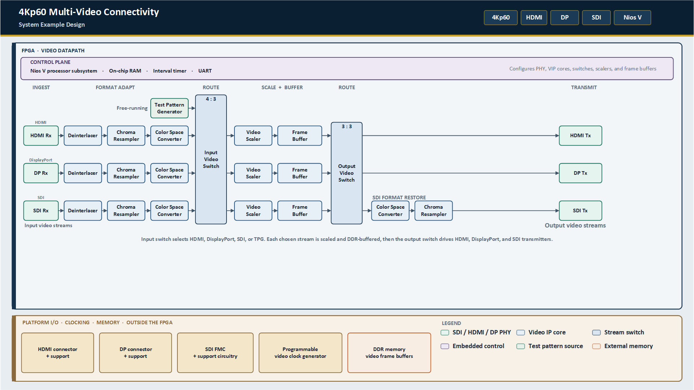

# 4Kp60 Multi-Video Connectivity Solution System Example Design for Agilex™ 5 Devices

## Overview

The 4Kp60 Multi-Video Connectivity System Example Design for Agilex™ 5 Devices 
shows how a single FPGA device can unify HDMI, DisplayPort (DP), 
and serial digital interface (SDI) video using a common streaming protocol. 
The design converts between video protocols and processes video between these interfaces in real time.

The design receives SDI video through an FPGA mezzanine card (FMC) daughter card, 
and receives HDMI and DP video through the onboard connectors on the modular development kit.
All three video interfaces support standards up to UHD and 
can deliver video resolutions up to 4Kp60 to the FPGA fabric. 
Each interface converts pixel data to AXI4-Stream, 
which provides connectivity to other IP cores in the [Altera Video and Vision Processing (VVP) Suite](https://www.altera.com/products/ip/po-3150/video-and-vision-processing-suite).

The design comprises the following hardware and software components:

* **Software**—A bare-metal application that runs on a Nios® V soft processor. The application provides runtime control and debug menus through a JTAG UART interface.

The following figure shows the interaction between the Nios® V software and the hardware in the FPGA fabric.

|
Multi-Video Connectivity Example Design—Top-Level System Block Diagram
|
| --- |
|  |

* **Hardware**—Three video datapaths, one for each input and output video interface. Each datapath includes a frame buffer and a video scaler that decouple frame rates and active video resolutions between the input and output interfaces. Input and output video switches route input video to the output interfaces that you select in the software application. The design also includes an input test pattern generator (TPG), additional VVP Suite IP cores for video preprocessing, and an embedded processor subsystem.

The following figure shows the main hardware components and subsystems.

|
Multi-Video Connectivity Example Design—Top-Level Hardware Block Diagram
|
| --- |
|  |

## Detailed Design

The detailed design can be found at [doc-mvc.md](https://github.com/altera-fpga/agilex5e-ed-mvc-video/blob/rel/26.1.1/agilex5e-ed/a5e065b-mod-devkit/docs/doc-mvc.md)

The project GitHub repository can be found at [https://github.com/altera-fpga/agilex5e-ed-mvc-video](https://github.com/altera-fpga/agilex5e-ed-mvc-video)

 

## Notices & Disclaimers

Altera&reg; Corporation technologies may require enabled hardware, software or service activation.
No product or component can be absolutely secure. 
Performance varies by use, configuration and other factors.
Your costs and results may vary. 
You may not use or facilitate the use of this document in connection with any infringement or other legal analysis concerning Altera or Intel products described herein. You agree to grant Altera Corporation a non-exclusive, royalty-free license to any patent claim thereafter drafted which includes subject matter disclosed herein.
No license (express or implied, by estoppel or otherwise) to any intellectual property rights is granted by this document, with the sole exception that you may publish an unmodified copy. You may create software implementations based on this document and in compliance with the foregoing that are intended to execute on the Altera or Intel product(s) referenced in this document. No rights are granted to create modifications or derivatives of this document.
The products described may contain design defects or errors known as errata which may cause the product to deviate from published specifications.  Current characterized errata are available on request.
Altera disclaims all express and implied warranties, including without limitation, the implied warranties of merchantability, fitness for a particular purpose, and non-infringement, as well as any warranty arising from course of performance, course of dealing, or usage in trade.
You are responsible for safety of the overall system, including compliance with applicable safety-related requirements or standards. 
&copy; Altera Corporation.  Altera, the Altera logo, and other Altera marks are trademarks of Altera Corporation.  Other names and brands may be claimed as the property of others. 

OpenCL* and the OpenCL* logo are trademarks of Apple Inc. used by permission of the Khronos Group™. 

 

