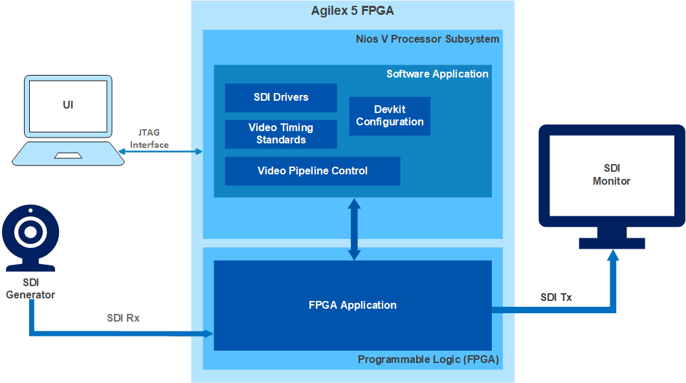
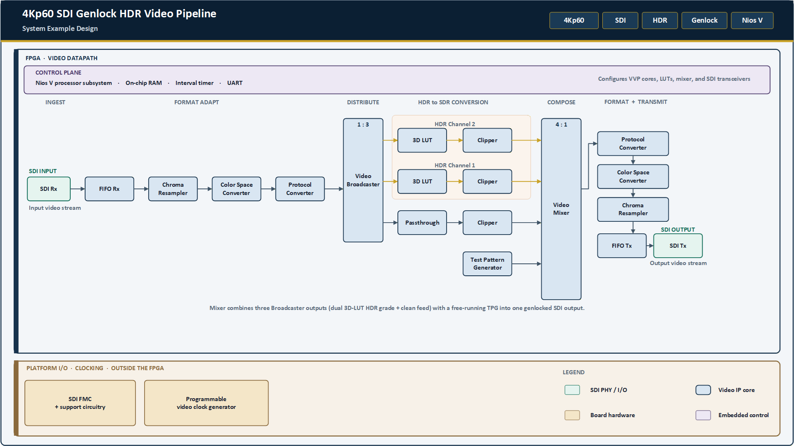

# 4Kp60 SDI-based Genlock HDR Video Pipeline Solution System Example Design for Agilex™ 5 Devices

## Overview

The 4Kp60 SDI-based Genlock HDR Video Pipeline System Example Design for Agilex™ 5 Devices demonstrates three-dimensional lookup table (3D LUT)-based conversion between high dynamic range (HDR) and standard dynamic range (SDR) video. HDR-to-SDR conversion is required for interoperability between legacy and emerging formats in broadcast workflows.

The following figure shows example SDI input and output images, after applying a 3D LUT on the input image.

|
SDI Input Image
|
SDI Output Image
|
| --- | --- |
|  |  |

The design receives video through an industry-standard serial digital interface (SDI) on an FPGA mezzanine card (FMC) daughter card. The SDI interface supports video standards up to 12G-SDI and can deliver video resolutions up to 4Kp60 to the FPGA fabric. The SDI IP converts pixel data to AXI4-Stream, which provides connectivity to other IP cores in the [Altera Video and Vision Processing (VVP) Suite](https://www.altera.com/products/ip/po-3150/video-and-vision-processing-suite).

The design comprises hardware and software components:

* The software is a bare-metal application that runs on a Nios® V soft processor. The application provides runtime control and debug menus through a JTAG UART interface.

The following figure shows the interaction between the Nios® V software and the hardware in the FPGA fabric.

|
SDI-based Genlock HDR Video Pipeline Example Design—Top-Level System Block Diagram
|
| --- |
|  |

* The hardware includes one bypass path and two HDR datapaths. Each path is fully genlocked and does not use a frame buffer. The hardware also includes VVP Suite IP cores and an embedded processor subsystem. Each HDR datapath contains a 3D LUT IP core that is initialized with 3D cube files that implement a specific HDR-to-SDR conversion.

  A Mixer IP at the output of the pipeline combines the HDR and bypass streams with a background layer from the Test Pattern Generator (TPG) IP into a single video frame. The software can configure the Mixer IP for side-by-side display of the input video and the 3D LUT result. Processed video leaves the design through the SDI transmit interface.

  The following figure shows the main hardware components and subsystems.

|
SDI-based Genlock HDR Video Pipeline Example Design—Top-Level Hardware Block Diagram
|
| --- |
|  |

## Detailed Design

The detailed design can be found at [doc-genlock-hdr.md](https://github.com/altera-fpga/agilex5-ed-genlock-hdr-video/blob/rel/26.1.1/agilex5e-ed/a5e065b-mod-devkit/docs/doc-genlock-hdr.md)

The project GitHub repository can be found at [https://github.com/altera-fpga/agilex5-ed-genlock-hdr-video](https://github.com/altera-fpga/agilex5-ed-genlock-hdr-video)

 

## Notices & Disclaimers

Altera&reg; Corporation technologies may require enabled hardware, software or service activation.
No product or component can be absolutely secure. 
Performance varies by use, configuration and other factors.
Your costs and results may vary. 
You may not use or facilitate the use of this document in connection with any infringement or other legal analysis concerning Altera or Intel products described herein. You agree to grant Altera Corporation a non-exclusive, royalty-free license to any patent claim thereafter drafted which includes subject matter disclosed herein.
No license (express or implied, by estoppel or otherwise) to any intellectual property rights is granted by this document, with the sole exception that you may publish an unmodified copy. You may create software implementations based on this document and in compliance with the foregoing that are intended to execute on the Altera or Intel product(s) referenced in this document. No rights are granted to create modifications or derivatives of this document.
The products described may contain design defects or errors known as errata which may cause the product to deviate from published specifications.  Current characterized errata are available on request.
Altera disclaims all express and implied warranties, including without limitation, the implied warranties of merchantability, fitness for a particular purpose, and non-infringement, as well as any warranty arising from course of performance, course of dealing, or usage in trade.
You are responsible for safety of the overall system, including compliance with applicable safety-related requirements or standards. 
&copy; Altera Corporation.  Altera, the Altera logo, and other Altera marks are trademarks of Altera Corporation.  Other names and brands may be claimed as the property of others. 

OpenCL* and the OpenCL* logo are trademarks of Apple Inc. used by permission of the Khronos Group™. 

 
