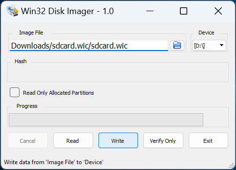
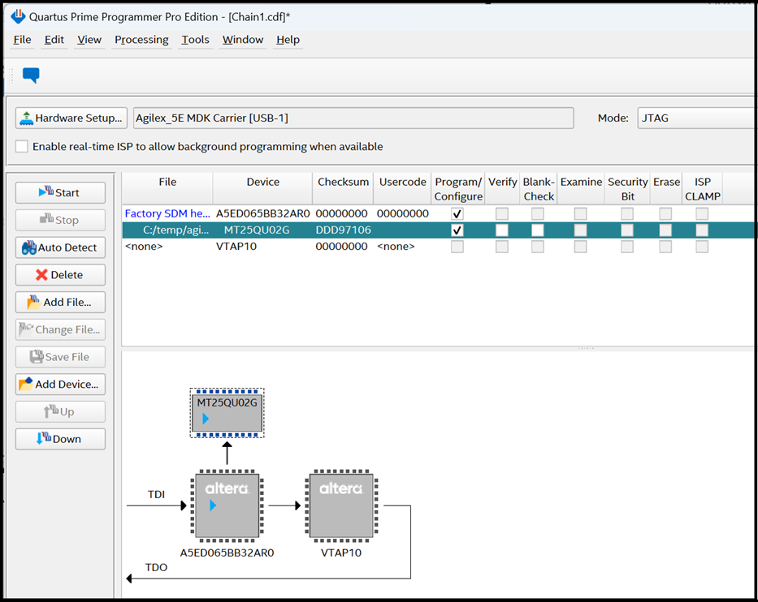
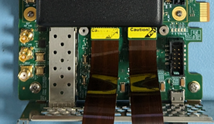
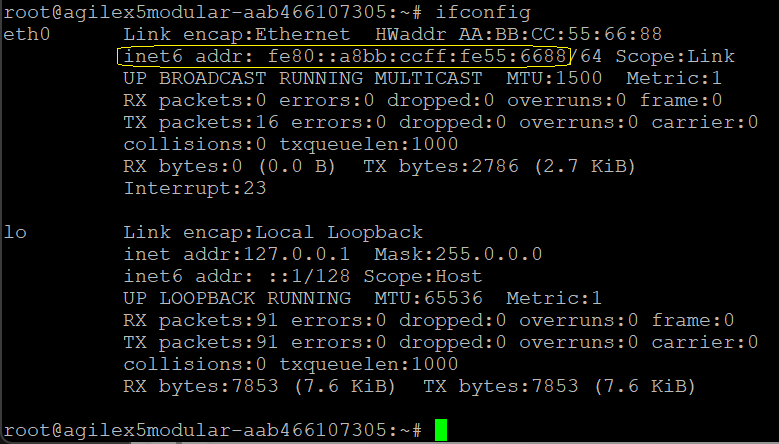

# 4Kp60 Multi-Sensor HDR Camera Solution System Example Design for Agilex™ 5 Devices

The design is compatible with
[Altera® Quartus® Prime Pro Edition version 25.1 Linux](https://www.intel.com/content/www/us/en/software-kit/851652/intel-quartus-prime-pro-edition-design-software-version-25-1-for-linux.html).

## Overview

The 4K Multi-Sensor HDR Camera Solution System Example Design for Agilex™ 5
Devices demonstrates a practical glass-to-glass camera solution. The exclusive
support for industry-standard Mobile Industry Processor Interface (MIPI) D-PHY
and MIPI CSI-2 interface on Agilex™ 5 FPGAs provides a powerful tool for camera
product development. The MIPI interface supports up to 2.5Gbps per lane and up
to 8x lanes per MIPI interface enables seamless data reception from multiple 4K
image sensors to the FPGA fabric for further processing. Each MIPI CSI-2 IP
instance converts pixel data to AXI4-Streaming outputs, enabling connectivity
to other IP cores within Altera®'s Video and Vision Processing (VVP) Suite.

The design is a hardware-software co-design, whose hardware component comprises
an Image Signal Processor (ISP), various VVP IPs, Hard Processor Subsystem
(HPS) and various connectivity IPs. The software stack is Linux based and runs
on the HPS.

The hardware includes a multi-sensor input video switch feeding into an Image
Signal Processing (ISP) subsystem. The ISP is a video processing pipeline
incorporating many VVP IP cores such that the raw sensor image data can be
processed into RGB video data. The backend of the ISP pipeline also includes
adaptive local tone mapping (TMO) for handling wide dynamic range scenes,
1D-LUT and 3D-LUT IPs for color transformations and High Dynamic Range (HDR)
conversion, and a high-performance Warp IP core for geometric distortion
correction. The design drives the resulting 4Kp60 streaming video output data
through an Altera® DisplayPort IP.

The software stack consists of an application software binary running on Linux
operating system with various layers of drivers. The backend part of the
application software interrogates the hardware, discovers the IP components
dynamically and configures them. Multiple feedback loops monitor the hardware
and keep various hardware components in lockstep. Some of the notable feedback
loops are Automatic White Balance (AWB), Auto Exposure (AE), and Adaptive Noise
Reduction (ANR) algorithms, reading their relevant statistics and adjusting
various coefficients and Look Up Tables (LUTs) in real time. The frontend of
the software creates a web based Graphical User Interface (GUI) and runs it
over a web server.

The following diagrams provide an overview of the interaction of software
running on ARM CPUs inside the Hard Processor Subsystem (HPS) and hardware
components running in the programmable logic parts of the device. (For more
information of ARM HPS in Altera® Agilex™ Devices refer to the
[User Manuals](#useful-user-manuals-and-reference-materials) section.)

<br/>

{:style="display:block; margin-left:auto; margin-right:auto"}
<center markdown="1">

**High-Level Block Diagram of the 4Kp60 Multi-Sensor HDR Camera Solution System Example Design**
</center>
<br/>

## Pre-requisites

### Hardware Requirements
* [Agilex™ 5 FPGA E-Series 065B Modular Development Kit].

<br/>
{:style="display:block; margin-left:auto; margin-right:auto"}
<center markdown="1">

**Agilex™ 5 FPGA E-Series 065B Modular Development Kit**
</center>
<br/>

* 1 or 2 [Framos FSM:GO IMX678C Camera Modules], with:
  * [Wide 110deg HFOV Lens], or
  * [Medium 100deg HFOV Lens], or
  * [Narrow 54deg HFOV Lens].
* Mount/Tripod
  * [Framos Tripod Mount Adapter].
  * [Tripod].
* A Framos cable for PixelMate MIPI-CSI-2 for each Camera Module:
  * [150mm flex-cable], or
  * [300mm micro-coax cable].
* Minimum 8GB U3 microSD Card.
* DP Cable or HDMI Cable (with [4Kp60 Converter Dongle]).
* USB Micro B JTAG Cable (for JTAG programming).
* USB Micro B Serial Cable (for HPS terminal connection).
* RJ45 Ethernet Cable (HPS network connection).
* Monitor/TV (recommend 4Kp60 capable).

<br/>


### Software Requirements to run
* Host PC with:
  * 8 GB of RAM (less if not rebuilding binaries).
  * Linux/Windows OS installed.
  * Serial terminal (such as GtkTerm or Minicom on Linux, and [TeraTerm] or
    PuTTY on Windows).
    * FTDI FT232R USB UART drivers (for a Windows host).
  * Tool to write images for removable USB drives or microSD cards such as
  [Win32DiskImager] on Windows or "dd" command on Linux.
  * Altera® Quartus® Prime Pro Edition version 25.1 Programmer and Tools.
  * Ethernet connection (either direct from Host PC to development board, or
    via a switch or router).
    * Note, you may need to disconnected/disabled VPN if it is installed on the
      Host PC.
  * Web browser.

<br/>


### **Download the pre-built Binaries**

* Download the Agilex™ 5 Modular Development board binaries:

<br/>
<center markdown="1">

**Binaries**

| Source | Link | Description |
| ---- | ---- | ---- |
| QSPI | [top.core.jic] | Allows the development board to be booted from the microSD card |
| microSD Card Image | [hps-first-vvp-isp-demo-image-agilex5_mk_a5e065bb32aes1.wic.gz] | The complete Camera Solution System Example Design |

<br/>

</center>


## Getting Started - run with pre-built binaries

Follow the instructions provided in this section to run the 4K Multi-Sensor HDR
Camera Solution System Example Design on the Agilex™ 5 FPGA E-Series 065B
Modular Development Kit.

## Programming

### **Setting Up your Modular Development Board**

!!! NOTE "Warning"
    Handle ESD-sensitive equipment (boards, microSD Cards, Camera sensors, etc.) only when properly grounded and at an ESD-safe workstation

* Configure the board switches as shown:

<br>

{:style="display:block; margin-left:auto; margin-right:auto"}
<center markdown="1">

**Modular Development Board - Default Switch Positions**
</center>
<br>

!!! note "Main switch configurations used by the Camera Solution System Example Design"

    JTAG Mode:         SOM S4=OFF:OFF, or<br>
    ASx4 (QSPI) Mode:  SOM S4=ON:ON

<br>

* Connect micro USB cable between the carrier board (`J35`) and the Host PC.
  This will be used for JTAG communication. Look at what ports are enumerated
  on your Host computer. There should be a series of four.
* Connect micro USB cable between the SOM board (`J2`, HSP_UART) and the Host
  PC. This will be used for HPS UART communication. Look at what ports are
  enumerated on your Host computer. There should be a series of four. Use the
  3rd one in the list as the HPS serial port.
* Connect an RJ45 cable between the ethernet port on the SOM board (`J6`, ETH
  1G HPS) and make sure it is on the same network as your Host PC. You can
  check the `eth0` IP address after boot using the Linux `ip a` command.

<br>

{:style="display:block; margin-left:auto; margin-right:auto"}
<center markdown="1">

**Board Connections**
</center>
<br>


### **Burn the microSD Card Image**

* Either use your own or download the pre-built `<name>.wic.gz` image.
* Extract `<name>.wic` image from the zip file
  * On Linux, use the `dd` utility:

  ```bash
  tar -xzf `<name>.wic.gz`
  ```

  * On Windows, use the [7-Zip](https://www.7-zip.org) program (or similar):
    * Right click `<name>.wic.gz` file, and select "Extract All..."

* Write the `<name>.wic` image to the microSD card using a USB writer:
  * On Linux, use the `dd` utility:

  ```bash
  # Determine the device associated with the SD card on the host computer.
  cat /proc/partitions
  # This will return for example /dev/sd<x>
  # Use dd to write the image in the corresponding device
  sudo dd if=<name>.wic of=/dev/sd<x> bs=1M
  # Flush the changes to the microSD card
  sync
  ```

  * On Windows, use the [Win32DiskImager](https://sourceforge.net/projects/win32diskimager) program (or similar):
    * Click browse icon and select "\*.\*" filter:

    {:style="display:block; margin-left:auto; margin-right:auto"}
    <center markdown="1">

    **Navigate to your download and select `<name>.wic` in the "Disk Imager" tool**
    </center>
<br>

    * Write the image (note your Device may be different to that shown):

    {:style="display:block; margin-left:auto; margin-right:auto"}
    <center markdown="1">

    **Write the microSD Card using the "Disk Imager" tool**
    </center>

* Turn off the board and insert the microSD card in the microSD card slot
  located on the SOM board.

<br>


[4Kp60 Multi-Sensor HDR Camera Solution System Example Design for Agilex™ 5 Devices]: https://altera-fpga.github.io/rel-25.1/embedded-designs/agilex-5/e-series/modular/camera/camera_4k
[Agilex™ 5 E-Series Modular Development Board GSRD User Guide (25.1)]: https://altera-fpga.github.io/rel-25.1/embedded-designs/agilex-5/e-series/modular/gsrd/ug-gsrd-agx5e-modular/


[Hard Processor System Technical Reference Manual: Agilex™ 5 SoCs (25.1)]: https://www.intel.com/content/www/us/en/docs/programmable/814346/25-1/hard-processor-system-technical-reference.html
[NiosV Processor for Altera® FPGA]: https://www.intel.com/content/www/us/en/products/details/fpga/intellectual-property/processors-peripherals/niosv.html
[Agilex™ 5 FPGA E-Series 065B Modular Development Kit]: https://www.intel.com/content/www/us/en/products/details/fpga/development-kits/agilex/a5e065b-modular.html
[Agilex™ 5 FPGA E-Series 065B Modular Development Kit Product Brief]: https://www.intel.com/content/www/us/en/content-details/815178/agilex-5-fpga-e-series-065b-modular-development-kit-product-brief.html


[Win32DiskImager]: https://sourceforge.net/projects/win32diskimager
[7-Zip]: https://www.7-zip.org
[teraterm]: https://github.com/TeraTermProject/teraterm/releases
[putty]: https://www.chiark.greenend.org.uk/~sgtatham/putty/latest.html


[Framos FSM:GO IMX678C Camera Modules]: https://www.framos.com/en/fsmgo
[Wide 110deg HFOV Lens]: https://www.mouser.co.uk/ProductDetail/FRAMOS/FSMGO-IMX678C-M12-L110A-PM-A1Q1?qs=%252BHhoWzUJg4KQkNyKsCEDHw%3D%3D
[Medium 100deg HFOV Lens]: https://www.mouser.co.uk/ProductDetail/FRAMOS/FSMGO-IMX678C-M12-L100A-PM-A1Q1?qs=%252BHhoWzUJg4IesSwD2ACIBQ%3D%3D
[Narrow 54deg HFOV Lens]: https://www.mouser.co.uk/ProductDetail/FRAMOS/FSMGO-IMX678C-M12-L54A-PM-A1Q1?qs=%252BHhoWzUJg4L5yHZulKgVGA%3D%3D
[Framos Tripod Mount Adapter]: https://www.framos.com/en/products/fma-mnt-trp1-4-v1c-26333
[Tripod]: https://thepihut.com/products/small-tripod-for-raspberry-pi-hq-camera
[150mm flex-cable]: https://www.mouser.co.uk/ProductDetail/FRAMOS/FMA-FC-150-60-V1A?qs=GedFDFLaBXGCmWApKt5QIQ%3D%3D&_gl=1*d93qim*_ga*MTkyOTE4MjMxNy4xNzQxMTcwMzQy*_ga_15W4STQT4T*MTc0MTE3MDM0Mi4xLjEuMTc0MTE3MDQ5OS40NS4wLjA
[300mm micro-coax cable]: https://www.mouser.co.uk/ProductDetail/FRAMOS/FFA-MC50-Kit-0.3m?qs=%252BHhoWzUJg4K3LtaE207mhw%3D%3D
[4Kp60 Converter Dongle]: https://www.amazon.co.uk/gp/product/B01M6WK3KU/ref=ppx_yo_dt_b_asin_title_o02_s00?ie=UTF8&psc=1


[VVP IP Suite, VVP Tone Mapping Operator (TMO) IP, VVP Warp IP, and 3D LUT IP]: https://www.intel.com/content/www/us/en/products/details/fpga/intellectual-property/dsp/video-vision-processing-suite.html
[MIPI DPHY IP and MIPI CSI-2 IP]: https://www.intel.com/content/www/us/en/products/details/fpga/intellectual-property/interface-protocols/mipi-d-phy.html#tab-blade-1-3
[Nios® V Processor]: https://www.intel.com/content/www/us/en/products/details/fpga/intellectual-property/processors-peripherals/niosv/glossy.html


[Altera® Quartus® Prime Pro Edition version 25.1 Linux]: https://www.intel.com/content/www/us/en/software-kit/851652/intel-quartus-prime-pro-edition-design-software-version-25-1-for-linux.html
[Altera® Quartus® Prime Pro Edition version 25.1 Windows]: https://www.intel.com/content/www/us/en/software-kit/851653/intel-quartus-prime-pro-edition-design-software-version-25-1-for-windows.html


### **Program the QSPI Flash Memory**

This should only need to be done once. To program the QSPI flash memory:

* Power down the board. Set MSEL=JTAG by setting the **S4** dip switch
  on the SOM to **OFF-OFF**.
  * This prevents any bootloader from starting and leaves the JTAG chain in a
    default state.

* Power up the board.

* Either use your own or download the pre-built `JIC` image, and write it to
  the QSPI Flash memory using either the command:

    ```bash
    quartus_pgm -c 1 -m jtag -o "pvi;top.core.jic" 
    ```

* or, optionally using the Quartus® Programmer GUI:

  * Launch the Quartus® Programmer and Configure the **"Hardware Setup..."**
settings as following:
  <br>

{:style="display:block; margin-left:auto; margin-right:auto"}
<center markdown="1">

**Programmer - GUI Hardware Settings**
</center>
<br>

* Click "Auto Detect", select the device `A5EC065BB32AR0`, and press **"Change File.."**
<br>

{:style="display:block; margin-left:auto; margin-right:auto"}
<center markdown="1">

**Programmer - After "Auto Detect"**
</center>
<br>

Select your `top.core.jic` file. The `MT25QU02G` device should be shown (see
below). Check the **"Program/Configure"** box and press the **"Start"** button.
Wait until the programming has been completed (which can take several minutes).
<br>

{:style="display:block; margin-left:auto; margin-right:auto"}
<center markdown="1">

**Programming the QSPI Flash with the JIC file**
</center>
<br>

* Power down the board. Set MSEL=ASX4 (QSPI) by setting the **S4** dip switch
  on the SOM to **ON-ON**.
  * This starts the HPS bootloader and FPGA configuration from the microSD Card
    after power up.
<br>


## Running

### **Board and Host PC Setup**

!!! NOTE "Warning"
    Handle ESD-sensitive equipment (boards, microSD Cards, Camera sensors, etc.) only when properly grounded and at an ESD-safe workstation

Make the required connections between the Host PC and the Modular Development
board as shown in the following diagram:

<br/>

{:style="display:block; margin-left:auto; margin-right:auto;"}
<center markdown="1">

**Development Kit and Host PC Connection diagram**
</center>
<br/>

* Connect the Framos cable(s) between the Framos Camera Module(s) and the Modular
  Development board taking care to align the cable(s) correctly with the
  connectors (pin 1 to pin 1). For a single camera module, either MIPI connector can be used.

{:style="display:block; margin-left:auto; margin-right:auto;"}
<center markdown="1">

**Board MIPI connections**
</center>
<br/>

{:style="display:block; margin-left:auto; margin-right:auto;"}
<center markdown="1">

**Board MIPI and Ribbon Cable**
</center>
<br/>

{:style="display:block; margin-left:auto; margin-right:auto;"}
<center markdown="1">

**Camera and Ribbon Cable**
</center>
<br/>

{:style="display:block; margin-left:auto; margin-right:auto;"}
<center markdown="1">

**Board with Connections**
</center>
<br/>

* Connect the Modular Development carrier board DisplayPort Tx connector to the
  Monitor using a suitable cable (and dongle if you are using HDMI).


### **Connect Browser to UI**
* Power up the board (if not already powered) and set up the serial terminal emulator (minicom,
  [teraterm], [putty], etc.):
  * Select the correct `COMx` port. (The Modular Development board presents 4
    serial COM ports over a single connection and the Linux system uses the 3rd
    port in order). Set the port configuration as follows:
    * 115200 baud rate, 8 Data bits, 1 Stop bit, CRC and Hardware flow control
      disabled.
* The Linux OS will boot and the 4K Multi-Sensor HDR Camera Solution System
  Example Design Application should run automatically.
* A few seconds after Linux boots, the application will detect the attached
  Monitor and the ISP processed output will be displayed using the best
  supported format.
* Take note of the board's IP address.
  * The board's IP address can also be found using the terminal by logging in
    as `root` (no password required) and querying the Ethernet controller:

    ```bash
    root
    ifconfig
    ```

  * `eth0` provides the IPv4 or IPv6 address to connect to.
<br/>

{:style="display:block; margin-left:auto; margin-right:auto;"}
<center markdown="1">

**Example ifconfig output for if network provides DHCP**
</center>

<br/>

{:style="display:block; margin-left:auto; margin-right:auto;"}

<center markdown="1">

**Example ifconfig output for if no DHCP support, or direct connection**
</center>

<br/>

* Connect your web browser to the boards IP address so you can interact with
  the 4K Multi-Sensor HDR Camera Solution System Example Design using the GUI.
  * To connect using IPv6 for the examples above you would use
    `http://[fe80::a8bb:ccff:fe55:6688]` (note the square brackets)
  * To connect using IPv4 for the DHCP example above you would use
    `http://192.168.0.1`

<br/>

{:style="display:block; margin-left:auto; margin-right:auto;"}
<center markdown="1">

**Example web browser URL for IPv6 address**
</center>

<br/>

{:style="display:block; margin-left:auto; margin-right:auto;"}
<center markdown="1">

**Example web browser URL for IPv4 address**
</center>

<br/>

* During connection, you will see the Altera® splash screen, after which you
  will be presented with the 
  [Web GUI:](../camera_4k_resources/ui-funct-descr.md)

<br/>

{:style="display:block; margin-left:auto; margin-right:auto;"}
<center markdown="1">

**Example Camera Solution GUI**
</center>

<br/>


## Recommended User Flows

### Sources

The sources listed in this table are the most current and highly recommended
for Quartus® 25.1 builds. Users are advised to utilize the updated versions
of these building blocks in production environments. Please note that this
is a demonstration design and is not suitable for production or final
deployment.

<center markdown="1">

**System Example Design Source Repository**

|Component |Location |Branch |
|-|-|-|
|Assets Release Tag|[https://github.com/altera-fpga/agilex-ed-camera/releases/tag/rel-25.1](https://github.com/altera-fpga/agilex-ed-camera/releases/tag/rel-25.1)| rel-25.1|
|Repository|[https://github.com/altera-fpga/agilex-ed-camera](https://github.com/altera-fpga/agilex-ed-camera)|rel-25.1|

</center>

<br/>

With the available resources, you can create and modify, build and compile, and
execute the 4K Multi-Sensor HDR Camera Solution System Example Design. There
are 3 recommended flows that you can explore:

* [User Flow 1]: [Getting Started - Running with pre-built binaries.](#getting-started-run-with-pre-built-binaries)
* [User Flow 2]: Use the [SOF Modular Design Toolkit (MDT) Flow](https://github.com/altera-fpga/agilex-ed-camera/blob/rel-25.1/README.md#create-the-design-using-the-modular-design-toolkit-mdt) - typically
  used for Quartus® with OpenCore Plus IP Evaluation License for time limited and tethered
  camera solutions.
* [User Flow 3]: Use the [RBF Modular Design Toolkit (MDT) Flow](https://github.com/altera-fpga/agilex-ed-camera/blob/rel-25.1/README.md#create-the-design-using-the-modular-design-toolkit-mdt) - typically
  used for Quartus® with full IP License for turnkey microSD card camera
  solutions.

!!! NOTE "Note"
    The free OpenCore Plus feature allows you to evaluate licensed IP cores in
    simulation and hardware before purchase. OpenCore Plus evaluation supports
    the following two operation modes: <br/>
    Untethered — run the design containing the licensed IP for a limited time. <br/>
    Tethered — run the design containing the licensed IP for a longer time or
    indefinitely. This operation requires a JTAG connection between your board
    and the Host computer. <br/>
    Note: All IP cores that use OpenCore Plus time out simultaneously when any
    IP core in the design times out.

<br/>

<style>
r { color: Red; font-weight: bold;}
o { color: Orange; font-weight: bold;}
g { color: Green; font-weight: bold;}
y { color: #CCCC00; font-weight: bold;}
</style>

<center markdown="1">

### Flows 
**Recommended User Flows**

 |User Flow                        |Description                                                                                                                                                                         | [User Flow 1]                                                                       | [User Flow 2]                                                                                     | [User Flow 3]                                                                                     |
 |---------------------------------|-----------------------------------------------------------------------------------------------------------------------------------------------------------------------------------:|:-----------------------------------------------------------------------------------:|:-------------------------------------------------------------------------------------------------:|:-------------------------------------------------------------------------------------------------:|
 |[Pre-requisites](#pre-requisites)| [Hardware Requirements.](#hardware-requirements)                                                                                                                                   |[<g>&check;</g>](../camera_4k/camera_4k.md#hardware-requirements)                    |[<g>&check;</g>](../camera_4k_resources/flow2-sof-mdt.md#hardware-requirements)                    |[<g>&check;</g>](../camera_4k_resources/flow3-rbf-mdt.md#hardware-requirements)                    |
 |                                 | Software Requirements to build.                                                                                                                                                    |<r>&cross;</r>                                                                       |[<g>&check;</g>](../camera_4k_resources/flow2-sof-mdt.md#software-requirements-to-build)           |[<g>&check;</g>](../camera_4k_resources/flow3-rbf-mdt.md#software-requirements-to-build)           |
 |                                 | License Requirements to build.                                                                                                                                                     |<r>&cross;</r>                                                                       |[<g>&check;</g>](../camera_4k_resources/flow2-sof-mdt.md#license-requirements-to-build)            |[<g>&check;</g>](../camera_4k_resources/flow3-rbf-mdt.md#license-requirements-to-build)            |
 |                                 | [Software Requirements to run.](#software-requirements-to-run)                                                                                                                     |[<g>&check;</g>](../camera_4k/camera_4k.md#software-requirements-to-run)             |[<g>&check;</g>](../camera_4k_resources/flow2-sof-mdt.md#software-requirements-to-run)             |[<g>&check;</g>](../camera_4k_resources/flow3-rbf-mdt.md#software-requirements-to-run)             |
 |                                 | [Download the Pre-built Binaries.](#download-the-pre-built-binaries)                                                                                                               |[<g>&check;</g>](../camera_4k/camera_4k.md#download-the-pre-built-binaries)          |<r>&cross;</r>                                                                                     |<r>&cross;</r>                                                                                     |
 |HW-Compilation                   | Creating and Building the Design based on the [SOF Modular Design Toolkit (MDT) Flow](https://github.com/altera-fpga/agilex-ed-camera/blob/rel-25.1/README.md#create-the-design-using-the-modular-design-toolkit-mdt)                                                                                              |<r>&cross;</r>                                                                       |[<g>&check;</g><span hidden="true"> SOF MDT Flow </span>](https://github.com/altera-fpga/agilex-ed-camera/blob/rel-25.1/README.md#create-the-design-using-the-modular-design-toolkit-mdt)                                          |<r>&cross;</r>                                                                                     |
 |                                 | Creating and Building the Design based on the [RBF Modular Design Toolkit (MDT) Flow](https://github.com/altera-fpga/agilex-ed-camera/blob/rel-25.1/README.md#create-the-design-using-the-modular-design-toolkit-mdt)                                                                                              |<r>&cross;</r>                                                                       |<r>&cross;</r>                                                                                     |[<g>&check;</g><span hidden="true"> RBF MDT Flow </span>](https://github.com/altera-fpga/agilex-ed-camera/blob/rel-25.1/README.md#create-the-design-using-the-modular-design-toolkit-mdt)                                          |
 |SW-Compilation                   | [Create microSD card image (.wic.gz) using YOCTO/KAS](https://github.com/altera-fpga/agilex-ed-camera/blob/rel-25.1/sw/README.md) <br/> <r>NOTE</r>: use <g>**KAS_MACHINE=agilex5_mk_a5e065bb32aes1**</g> and <g>**kas/agilex_camera_ff.yml**</g> configuration|<r>&cross;</r>                                                                       |[<g>&check;</g><span hidden="true"> YOCTO/KAS </span>](https://github.com/altera-fpga/agilex-ed-camera/blob/rel-25.1/sw/README.md)                                             |<r>&cross;</r>                                                                                     |
 |                                 | [Create microSD card image (.wic.gz) using YOCTO/KAS](https://github.com/altera-fpga/agilex-ed-camera/blob/rel-25.1/sw/README.md) <br/> <r>NOTE</r>: use <g>**KAS_MACHINE=agilex5_mk_a5e065bb32aes1**</g> and <g>**kas/agilex_camera.yml**</g> configuration   |<r>&cross;</r>                                                                       |<r>&cross;</r>                                                                                     |[<g>&check;</g><span hidden="true"> YOCTO/KAS </span>](https://github.com/altera-fpga/agilex-ed-camera/blob/rel-25.1/sw/README.md)                                             |
 |[Programming](#programming)      | [Setting Up your Modular Development Board.](#setting-up-your-modular-development-board)                                                                                           |[<g>&check;</g>](../camera_4k/camera_4k.md#setting-up-your-modular-development-board)|[<g>&check;</g>](../camera_4k_resources/flow2-sof-mdt.md#setting-up-your-modular-development-board)|[<g>&check;</g>](../camera_4k_resources/flow3-rbf-mdt.md#setting-up-your-modular-development-board)|
 |                                 | [Burn the microSD card image.](#burn-the-microsd-card-image)                                                                                                                       |[<g>&check;</g>](../camera_4k/camera_4k.md#burn-the-microsd-card-image)              |[<g>&check;</g>](../camera_4k_resources/flow2-sof-mdt.md#burn-the-microsd-card-image)              |[<g>&check;</g>](../camera_4k_resources/flow3-rbf-mdt.md#burn-the-microsd-card-image)              |
 |                                 | [Program the QSPI Flash Memory.](#program-the-qspi-flash-memory)                                                                                                                   |[<g>&check;</g>](../camera_4k/camera_4k.md#program-the-qspi-flash-memory)            |<r>&cross;</r>                                                                                     |[<g>&check;</g>](../camera_4k_resources/flow3-rbf-mdt.md#program-the-qspi-flash-memory)            |
 |[Running](#running)              | [Board and Host PC Setup.](#board-and-host-pc-setup)                                                                                                                               |[<g>&check;</g>](../camera_4k/camera_4k.md#board-and-host-pc-setup)                  |[<g>&check;</g>](../camera_4k_resources/flow2-sof-mdt.md#board-and-host-pc-setup)                  |[<g>&check;</g>](../camera_4k_resources/flow3-rbf-mdt.md#board-and-host-pc-setup)                  |
 |                                 | Program the FPGA SOF.                                                                                                                                                              |<r>&cross;</r>                                                                       |[<g>&check;</g>](../camera_4k_resources/flow2-sof-mdt.md#program-the-fpga-sof)                     |<r>&cross;</r>                                                                                     |
 |                                 | [Connect Browser to UI.](#connect-browser-to-ui)                                                                                                                                   |[<g>&check;</g>](../camera_4k/camera_4k.md#connect-browser-to-ui)                    |[<g>&check;</g>](../camera_4k_resources/flow2-sof-mdt.md#connect-browser-to-ui)                    |[<g>&check;</g>](../camera_4k_resources/flow3-rbf-mdt.md#connect-browser-to-ui)                    |

</center>
<br/>

## Camera Solution System Example Design - Documentation
* [Features.](../camera_4k_resources/features.md)
* [ISP Functional Description.](../camera_4k_resources/isp-funct-descr.md)
* [FPGA Hardware Functional Description.](../camera_4k_resources/hw-funct-descr.md)
* [Software Functional Description.](../camera_4k_resources/sw-funct-descr.md)
* [Web GUI Functional Description.](../camera_4k_resources/ui-funct-descr.md)
* [Design Security Considerations.](../camera_4k_resources/design-security-considerations.md)
* [Acronyms and Terminology.](../camera_4k_resources/glossary.md)

## Camera Solution System Example Design - References
* [Agilex™ 5 FPGA E-Series 065B Modular Development Kit Product Brief](https://www.intel.com/content/www/us/en/content-details/815178/agilex-5-fpga-e-series-065b-modular-development-kit-product-brief.html).
* [Framos FSM:GO IMX678C Camera Modules](https://www.framos.com/en/fsmgo).
* [Video and Vision Processing Suite Altera® FPGA IP User Guide](https://www.intel.com/content/www/us/en/docs/programmable/683329/25-1/about-the-video-and-vision-processing-suite.html).
* [VVP IP Suite, VVP Tone Mapping Operator (TMO) IP, VVP Warp IP, and 3D LUT IP](https://www.intel.com/content/www/us/en/products/details/fpga/intellectual-property/dsp/video-vision-processing-suite.html).
* [MIPI DPHY IP and MIPI CSI-2 IP](https://www.intel.com/content/www/us/en/products/details/fpga/intellectual-property/interface-protocols/mipi-d-phy.html#tab-blade-1-3).
* [Nios® V Processor](https://www.intel.com/content/www/us/en/products/details/fpga/intellectual-property/processors-peripherals/niosv/glossy.html).


## Other Repositories Used
|Component |Location |Branch |
|-|-|-|
|Modular Design Toolkit|[https://github.com/altera-fpga/modular-design-toolkit](https://github.com/altera-fpga/modular-design-toolkit)|rel-25.1|
|Linux|[https://github.com/altera-opensource/linux-socfpga](https://github.com/altera-opensource/linux-socfpga)|socfpga-6.6.22-lts|
|Arm Trusted Firmware|[https://github.com/ARM-software/arm-trusted-firmware](https://github.com/ARM-software/arm-trusted-firmware)|socfpga_v2.11.0|
|U-Boot|[https://github.com/altera-opensource/u-boot-socfpga](https://github.com/altera-opensource/u-boot-socfpga)|v2024.01|
|Yocto Project: poky|[https://git.yoctoproject.org/poky](https://git.yoctoproject.org/poky)|scarthgap|

## Useful User Manuals and Reference Materials
* [Hard Processor System Technical Reference Manual: Agilex™ 5 SoCs (25.1)](https://www.intel.com/content/www/us/en/docs/programmable/814346/25-1/hard-processor-system-technical-reference.html).
* [NiosV Processor for Altera® FPGA](https://www.intel.com/content/www/us/en/products/details/fpga/intellectual-property/processors-peripherals/niosv.html).
* [Agilex™ 5 FPGA E-Series 065B Modular Development Kit](https://www.intel.com/content/www/us/en/products/details/fpga/development-kits/agilex/a5e065b-modular.html).

<br/>

## Notices & Disclaimers

Altera<sup>&reg;</sup> Corporation technologies may require enabled hardware, software or service activation.
No product or component can be absolutely secure. 
Performance varies by use, configuration and other factors.
Your costs and results may vary. 
You may not use or facilitate the use of this document in connection with any infringement or other legal analysis concerning Altera or Intel products described herein. You agree to grant Altera Corporation a non-exclusive, royalty-free license to any patent claim thereafter drafted which includes subject matter disclosed herein.
No license (express or implied, by estoppel or otherwise) to any intellectual property rights is granted by this document, with the sole exception that you may publish an unmodified copy. You may create software implementations based on this document and in compliance with the foregoing that are intended to execute on the Altera or Intel product(s) referenced in this document. No rights are granted to create modifications or derivatives of this document.
The products described may contain design defects or errors known as errata which may cause the product to deviate from published specifications.  Current characterized errata are available on request.
Altera disclaims all express and implied warranties, including without limitation, the implied warranties of merchantability, fitness for a particular purpose, and non-infringement, as well as any warranty arising from course of performance, course of dealing, or usage in trade.
You are responsible for safety of the overall system, including compliance with applicable safety-related requirements or standards. 
<sup>&copy;</sup> Altera Corporation.  Altera, the Altera logo, and other Altera marks are trademarks of Altera Corporation.  Other names and brands may be claimed as the property of others. 

OpenCL* and the OpenCL* logo are trademarks of Apple Inc. used by permission of the Khronos Group™. 


[4Kp60 Multi-Sensor HDR Camera Solution System Example Design for Agilex™ 5 Devices]: https://altera-fpga.github.io/rel-25.1/embedded-designs/agilex-5/e-series/modular/camera/camera_4k
[Agilex™ 5 E-Series Modular Development Board GSRD User Guide (25.1)]: https://altera-fpga.github.io/rel-25.1/embedded-designs/agilex-5/e-series/modular/gsrd/ug-gsrd-agx5e-modular/


[Hard Processor System Technical Reference Manual: Agilex™ 5 SoCs (25.1)]: https://www.intel.com/content/www/us/en/docs/programmable/814346/25-1/hard-processor-system-technical-reference.html
[NiosV Processor for Altera® FPGA]: https://www.intel.com/content/www/us/en/products/details/fpga/intellectual-property/processors-peripherals/niosv.html
[Agilex™ 5 FPGA E-Series 065B Modular Development Kit]: https://www.intel.com/content/www/us/en/products/details/fpga/development-kits/agilex/a5e065b-modular.html
[Agilex™ 5 FPGA E-Series 065B Modular Development Kit Product Brief]: https://www.intel.com/content/www/us/en/content-details/815178/agilex-5-fpga-e-series-065b-modular-development-kit-product-brief.html


[Win32DiskImager]: https://sourceforge.net/projects/win32diskimager
[7-Zip]: https://www.7-zip.org
[teraterm]: https://github.com/TeraTermProject/teraterm/releases
[putty]: https://www.chiark.greenend.org.uk/~sgtatham/putty/latest.html


[Framos FSM:GO IMX678C Camera Modules]: https://www.framos.com/en/fsmgo
[Wide 110deg HFOV Lens]: https://www.mouser.co.uk/ProductDetail/FRAMOS/FSMGO-IMX678C-M12-L110A-PM-A1Q1?qs=%252BHhoWzUJg4KQkNyKsCEDHw%3D%3D
[Medium 100deg HFOV Lens]: https://www.mouser.co.uk/ProductDetail/FRAMOS/FSMGO-IMX678C-M12-L100A-PM-A1Q1?qs=%252BHhoWzUJg4IesSwD2ACIBQ%3D%3D
[Narrow 54deg HFOV Lens]: https://www.mouser.co.uk/ProductDetail/FRAMOS/FSMGO-IMX678C-M12-L54A-PM-A1Q1?qs=%252BHhoWzUJg4L5yHZulKgVGA%3D%3D
[Framos Tripod Mount Adapter]: https://www.framos.com/en/products/fma-mnt-trp1-4-v1c-26333
[Tripod]: https://thepihut.com/products/small-tripod-for-raspberry-pi-hq-camera
[150mm flex-cable]: https://www.mouser.co.uk/ProductDetail/FRAMOS/FMA-FC-150-60-V1A?qs=GedFDFLaBXGCmWApKt5QIQ%3D%3D&_gl=1*d93qim*_ga*MTkyOTE4MjMxNy4xNzQxMTcwMzQy*_ga_15W4STQT4T*MTc0MTE3MDM0Mi4xLjEuMTc0MTE3MDQ5OS40NS4wLjA
[300mm micro-coax cable]: https://www.mouser.co.uk/ProductDetail/FRAMOS/FFA-MC50-Kit-0.3m?qs=%252BHhoWzUJg4K3LtaE207mhw%3D%3D
[4Kp60 Converter Dongle]: https://www.amazon.co.uk/gp/product/B01M6WK3KU/ref=ppx_yo_dt_b_asin_title_o02_s00?ie=UTF8&psc=1


[VVP IP Suite, VVP Tone Mapping Operator (TMO) IP, VVP Warp IP, and 3D LUT IP]: https://www.intel.com/content/www/us/en/products/details/fpga/intellectual-property/dsp/video-vision-processing-suite.html
[MIPI DPHY IP and MIPI CSI-2 IP]: https://www.intel.com/content/www/us/en/products/details/fpga/intellectual-property/interface-protocols/mipi-d-phy.html#tab-blade-1-3
[Nios® V Processor]: https://www.intel.com/content/www/us/en/products/details/fpga/intellectual-property/processors-peripherals/niosv/glossy.html


[Altera® Quartus® Prime Pro Edition version 25.1 Linux]: https://www.intel.com/content/www/us/en/software-kit/851652/intel-quartus-prime-pro-edition-design-software-version-25-1-for-linux.html
[Altera® Quartus® Prime Pro Edition version 25.1 Windows]: https://www.intel.com/content/www/us/en/software-kit/851653/intel-quartus-prime-pro-edition-design-software-version-25-1-for-windows.html


[User flow 1]: ../camera_4k/camera_4k.md#pre-requisites
[User flow 2]: ../camera_4k_resources/flow2-sof-mdt.md
[User flow 3]: ../camera_4k_resources/flow3-rbf-mdt.md


[https://github.com/altera-fpga/agilex-ed-camera]: https://github.com/altera-fpga/agilex-ed-camera
[https://github.com/altera-fpga/modular-design-toolkit]: https://github.com/altera-fpga/modular-design-toolkit
[meta-altera-fpga]: https://github.com/altera-fpga/agilex-ed-camera/tree/rel-25.1/sw/meta-altera-fpga
[meta-altera-fpga-ocs]: https://github.com/altera-fpga/agilex-ed-camera/tree/rel-25.1/sw/meta-altera-fpga-ocs
[meta-vvp-isp-demo]: https://github.com/altera-fpga/agilex-ed-camera/tree/rel-25.1/sw/meta-vvp-isp-demo
[agilex-ed-camera/sw]: https://github.com/altera-fpga/agilex-ed-camera/tree/rel-25.1/sw


[Release Tag]: https://github.com/altera-fpga/agilex-ed-camera/releases/tag/rel-25.1
[https://github.com/altera-fpga/agilex-ed-camera/releases/tag/rel-25.1]: https://github.com/altera-fpga/agilex-ed-camera/releases/tag/rel-25.1
[hps-first-vvp-isp-demo-image-agilex5_mk_a5e065bb32aes1.wic.gz]: https://github.com/altera-fpga/agilex-ed-camera/releases/download/rel-25.1/hps-first-vvp-isp-demo-image-agilex5_mk_a5e065bb32aes1.wic.gz
[fpga-first-vvp-isp-demo-image-agilex5_mk_a5e065bb32aes1.wic.gz]: https://github.com/altera-fpga/agilex-ed-camera/releases/download/rel-25.1/fpga-first-vvp-isp-demo-image-agilex5_mk_a5e065bb32aes1.wic.gz
[fsbl_agilex5_modkit_vvpisp_time_limited.sof]: https://github.com/altera-fpga/agilex-ed-camera/releases/download/rel-25.1/fsbl_agilex5_modkit_vvpisp_time_limited.sof
[top.core.jic]: https://github.com/altera-fpga/agilex-ed-camera/releases/download/rel-25.1/top.core.jic
[top.core.rbf]: https://github.com/altera-fpga/agilex-ed-camera/releases/download/rel-25.1/top.core.rbf


[AGX_5E_Modular_Devkit_ISP_FF_RD.xml]: https://github.com/altera-fpga/agilex-ed-camera/blob/rel-25.1/AGX_5E_Altera_Modular_Dk_ISP_designs/AGX_5E_Modular_Devkit_ISP_FF_RD.xml
[AGX_5E_Modular_Devkit_ISP_RD.xml]: https://github.com/altera-fpga/agilex-ed-camera/blob/rel-25.1/AGX_5E_Altera_Modular_Dk_ISP_designs/AGX_5E_Modular_Devkit_ISP_RD.xml
[Create microSD card image (.wic.gz) using YOCTO/KAS]: https://github.com/altera-fpga/agilex-ed-camera/blob/rel-25.1/sw/README.md
[<g>&check;</g><span hidden="true"> YOCTO/KAS </span>]: https://github.com/altera-fpga/agilex-ed-camera/blob/rel-25.1/sw/README.md

[SOF Modular Design Toolkit (MDT) Flow]: https://github.com/altera-fpga/agilex-ed-camera/blob/rel-25.1/README.md#create-the-design-using-the-modular-design-toolkit-mdt
[RBF Modular Design Toolkit (MDT) Flow]: https://github.com/altera-fpga/agilex-ed-camera/blob/rel-25.1/README.md#create-the-design-using-the-modular-design-toolkit-mdt
[<g>&check;</g><span hidden="true"> SOF MDT Flow </span>]: https://github.com/altera-fpga/agilex-ed-camera/blob/rel-25.1/README.md#create-the-design-using-the-modular-design-toolkit-mdt
[<g>&check;</g><span hidden="true"> RBF MDT Flow </span>]: https://github.com/altera-fpga/agilex-ed-camera/blob/rel-25.1/README.md#create-the-design-using-the-modular-design-toolkit-mdt


[Test Pattern Generator IP]: https://www.intel.com/content/www/us/en/docs/programmable/683329/25-1/test-pattern-generator.html
[Switch IP]: https://www.intel.com/content/www/us/en/docs/programmable/683329/25-1/switch.html
[Black Level Statistics IP]: https://www.intel.com/content/www/us/en/docs/programmable/683329/25-1/black-level-statistics.html
[Clipper IP]: https://www.intel.com/content/www/us/en/docs/programmable/683329/25-1/clipper.html
[Defective Pixel Correction IP]: https://www.intel.com/content/www/us/en/docs/programmable/683329/25-1/defective-pixel-correction.html
[Adaptive Noise Reduction IP]: https://www.intel.com/content/www/us/en/docs/programmable/683329/25-1/adaptive-noise-reduction.html
[Black Level Correction IP]: https://www.intel.com/content/www/us/en/docs/programmable/683329/25-1/black-level-correction.html
[Vignette Correction IP]: https://www.intel.com/content/www/us/en/docs/programmable/683329/25-1/vignette-correction.html
[White Balance Statistics IP]: https://www.intel.com/content/www/us/en/docs/programmable/683329/25-1/white-balance-statistics.html
[White Balance Correction IP]: https://www.intel.com/content/www/us/en/docs/programmable/683329/25-1/white-balance-correction.html
[Demosaic IP]: https://www.intel.com/content/www/us/en/docs/programmable/683329/25-1/demosaic.html
[Histogram Statistics IP]: https://www.intel.com/content/www/us/en/docs/programmable/683329/25-1/histogram-statistics.html
[Color Space Converter IP]: https://www.intel.com/content/www/us/en/docs/programmable/683329/25-1/color-space-converter.html
[1D LUT IP]: https://www.intel.com/content/www/us/en/docs/programmable/683329/25-1/1d-lut.html
[3D LUT]: https://www.intel.com/content/www/us/en/products/details/fpga/intellectual-property/dsp/3d-lut.html
[3D LUT IP]: https://www.intel.com/content/www/us/en/docs/programmable/683329/25-1/3d-lut.html
[LUTCalc GitHub page]: https://github.com/cameramanben/LUTCalc
[Tone Mapping Operator]: https://www.intel.com/content/www/us/en/products/details/fpga/intellectual-property/dsp/tone-mapping-operator.html
[Tone Mapping Operator IP]: https://www.intel.com/content/www/us/en/docs/programmable/683329/25-1/tone-mapping-operator.html
[Unsharp Mask IP]: https://www.intel.com/content/www/us/en/docs/programmable/683329/25-1/unsharp-mask.html
[Warp]: https://www.intel.com/content/www/us/en/products/details/fpga/intellectual-property/dsp/video-warp.html
[Warp IP]: https://www.intel.com/content/www/us/en/docs/programmable/683329/25-1/warp.html
[Mixer IP]: https://www.intel.com/content/www/us/en/docs/programmable/683329/25-1/mixer.html
[Video Frame Writer IP]: https://www.intel.com/content/www/us/en/docs/programmable/683329/25-1/video-frame-writer-intel-fpga-ip.html
[Color Plane Manager IP]: https://www.intel.com/content/www/us/en/docs/programmable/683329/25-1/color-plane-manager.html
[Bits per Color Sample Adapter IP]: https://www.intel.com/content/www/us/en/docs/programmable/683329/25-1/bits-per-color-sample-adapter.html
[Protocol Converter IP]: https://www.intel.com/content/www/us/en/docs/programmable/683329/25-1/protocol-converter.html
[Pixels in Parallel Converter IP]: https://www.intel.com/content/www/us/en/docs/programmable/683329/25-1/pixels-in-parallel-converter.html
[Video and Vision Processing Suite Altera® FPGA IP User Guide]: https://www.intel.com/content/www/us/en/docs/programmable/683329/25-1/about-the-video-and-vision-processing-suite.html
[Altera® FPGA Streaming Video Protocol Specification]: https://www.intel.com/content/www/us/en/docs/programmable/683397/current/about-the-intel-fpga-streaming-video.html
[AMBA 4 AXI4-Stream Protocol Specification]: https://developer.arm.com/documentation/ihi0051/a/
[Avalon® Interface Specifications – Avalon® Streaming Interfaces]: https://www.intel.com/content/www/us/en/docs/programmable/683091/20-1/streaming-interfaces.html
[KAS]: https://kas.readthedocs.io/en/latest/


<br/>
