# 4Kp60 Multi-Sensor HDR Camera Solution System Example Design for Agilex™ 5 Devices - ISP Functional Description

The 4Kp60 Multi-Sensor HDR Camera Solution System Example Design demonstrates a
practical glass-to-glass camera solution using standard Altera® Connectivity
and Video and Vision Processing (VVP) Suite IP Cores available through the
Quartus® Prime Design Software (QPDS).

The design ingests the video input through industry-standard MIPI directly
connected to each sensor. The selected sensor video is then processed through
the Image Signal Processing (ISP) pipeline before output through DisplayPort
(DP). The design runs an embedded Linux Software Application (SW App) on
the Hard Processor System (HPS) to provide real-time auto white balance (AWB)
and auto exposure (AE) functions.

 

The following block diagram shows the main components and subsystems of the
Camera Solution System Example Design. Note that where an IP has been used
multiple times, its instance number is shown (bottom right corner of the IP)
and can be used for identification in the detail that follows.

 

{:style="display:block; margin-left:auto; margin-right:auto"}

**4Kp60 Multi-Sensor HDR Camera Solution System Example Design for Agilex™ 5 Devices Top Block Diagram**

 

## MIPI Ingest

The Framos FSM:GO IMX678 optical sensor module with PixelMate MIPI-CSI-2
connection uses a 4-lane MIPI interface. The sensor is a Sony Starvis2 8MP
IMX678 that outputs a Color Filter Array (CFA) image (also known as a Bayer
image) and can support up to a UHD 4K resolution at 60 FPS.

A CFA is typically a 2x2 mosaic of tiny colored filters (usually red, green,
and blue) placed over a monochromatic image sensor to effectively capture
single color pixels. The CFA typically contains twice the number of green
filters to align with human vision which is more sensitive to light in the
yellow-green part of the spectrum. The example below shows a typical RGGB (Red,
Green, Green, Blue) CFA pattern which repeats over the entire image (an 8x8
image in this example). Pixels arrive left to right, top to bottom, as
alternating Red and Green pixels on the first line, and then alternating Green
and Blue pixels on the next line. This pattern repeats on the next pair of
lines, and so on.

 

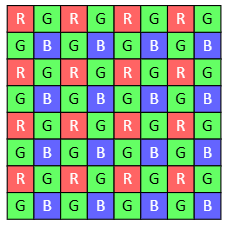{:style="display:block; margin-left:auto; margin-right:auto"}

**8x8 RGGB Color Filter Array (Bayer) Image Example**

 

Using single color pixels reduces the overall bandwidth requirements of the
sensor. A demosaic algorithm can be used to rebuild the full color image.
Note that in the CFA domain, 4 color channels actually exist (in our example
they are Red, Green1, Green2, and Blue). Therefore, it can be seen that any
given pixel belongs to just one of these color channels when processing. Each
color channel is sometimes referred to as a CFA phase.

The sensor also contains a Clear HDR feature that when enabled allows the
sensor to capture two images simultaneously, one with a low gain level set to
the bright region and the other with a high gain level set to the dark region.
Post sensor processing can be used to combine the two images to produce a
16-bit HDR image. Since images are captured simultaneously, there are no motion
chromatic aberrations or other artifacts. However, this mode reduces the frame
rate to 25 FPS.

The Altera® MIPI D-PHY IP interfaces the FPGA directly to 2 Framos optical
sensor modules via Framos connectors on the Modular Development Kit Carrier
Board and PixelMate CSI-2 Flex-Cables. The design showcases a 4K (3840x2160)
sensor that can process images up to 60 FPS using 12-bit Bayer pixel samples.
The MIPI D-PHY is configured for 2 links (one per sensor) of x4 lanes at 1782
Mbps (which provides sufficient bandwidth) with no skew calibration and
non-continuous clock mode. Each sensor module has additional pins, including
Power on Reset, Master/Slave mode, as well as sync signals and a slave I2C
interface for control and status. The MAX10 device on the Modular Development
Kit Carrier Board drives some of these signals which can be controlled via the
FPGA using an additional I2C interface. All the I2C interfaces are connected
to the HPS I2C controllers. The SW App auto-detects and configures all of the
detected sensor modules, including a GMSL3 link in MIPI0 if being used.
The FPGA AI Suite IP resource has been limited to achieve a maximum inference
rate of 30 FPS. Therefore, the sensor module output is configured to limit it to
30 FPS.

The design connects an Altera® MIPI CSI-2 IP to each of the MIPI D-PHY IP Rx
links using a 4-lane 16-bit PHY Protocol Interface (PPI) bus. The design
configures each CSI-2 IP output at 4 Pixels In Parallel (PiP) using a 297MHz
clock and minimal internal buffering. Since all ISP IP only support VVP AXI4-S
Lite protocol, A VVP Protocol Converter IP is used on each CSI-2 IP output.

In Clear HDR configuration, the two simultaneous captured sensor images are
sent over the single MIPI interface and output as 2 separate image streams by
the MIPI CSI-2 IP. The non-QPDS Exposure Fusion IP (supplied with the source
project) accepts both image streams and provides preliminary support to combine
them into a single HDR image stream. By default, the example design does not
enable Clear HDR and the IP operates in bypass. Regardless of the mode of
operation, the output is always 16-bits, MSB aligned.

To reduce FPGA resources, a VVP PIP Converter IP is then used to reduce the PIP
from 4 to 2 (which still provides sufficient bandwidth to process the video
image). The sensor modules cannot be stalled. So the PIP Converter contains 2
lines of video buffer to accommodate small amounts of back-pressure from
downstream IPs.

 

## ISP Ingest

 

{:style="display:block; margin-left:auto; margin-right:auto"}

**ISP Ingest**

 

The Input TPG IP (Instance 0) allows you to test the ISP parts of the design
without a sensor module input. It uses the VVP Test Pattern Generator IP and a
non-QPDS IP called Remosaic (RMS) (supplied with the source project). The TPG
has an RGB output which cannot be processed by the ISP IP as they only support
CFA images. The RMS is used to convert the RGB image into a CFA image by
discarding color information for pixels based on the CFA pattern supported by
the sensor. The TPG features several modes, including SMPTE color bars and
solid colors. The Bayer Switch - VVP Switch IP (Instance 1), is used to select
the Input source.

!!! note "Related Information"

    [Test Pattern Generator IP](https://www.intel.com/content/www/us/en/docs/programmable/683329/25-1/test-pattern-generator.html)  
    [Switch IP](https://www.intel.com/content/www/us/en/docs/programmable/683329/25-1/switch.html)

 

 

## ISP Processing

This section summarizes notable ISP processing functions and IPs used in the
Camera Solution System Example Design:

* [Black Level Statistics](#black-level-statistics)
* [Clipper](#clipper)
* [Defective Pixel Correction](#defective-pixel-correction)
* [Adaptive Noise Reduction](#adaptive-noise-reduction)
* [Black Level Correction](#black-level-correction)
* [Vignette Correction](#vignette-correction)
* [White Balance Statistics](#white-balance-statistics)
* [White Balance Correction](#white-balance-correction)
* [Demosaic](#demosaic)
* [Histogram Statistics](#histogram-statistics)
* [Color Correction Matrix](#color-correction-matrix)
  
* [1D LUT](#1d-lut)
  
* [3D LUT](#3d-lut)
* [Tone Mapping Operator](#tone-mapping-operator)
* [Unsharp Mask Filter](#unsharp-mask-filter)

* [Warp](#warp)

 

### Black Level Statistics

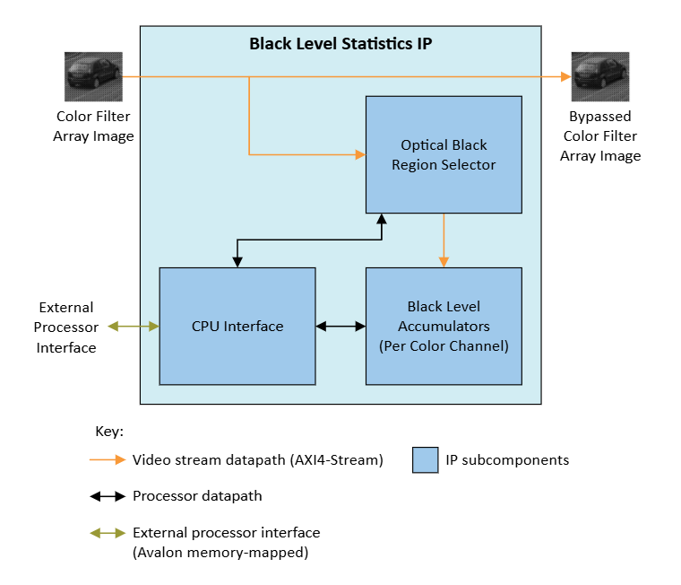{:style="display:block; margin-left:auto; margin-right:auto"}

**Black Level Statistics Block Diagram**

 

The Black Level Statistics (BLS) IP accumulates pixel values in a Region of
Interest (ROI), which is usually associated with a shielded area of an imaging
sensor called an Optical Black Region (OBR). The SW App, using these 
statistics, may choose to keep the sensor's black-level value constant and
compensate for any deviations caused by various external factors like 
temperature changes, voltage drifts, or aging.

The BLS calculates statistics across an OBR of the 2x2 CFA input from the
sensor. The IP has dedicated accumulators for each CFA channel that calculates
4 independent pixel sums. The SW App uses the BLS IP to set the offset and
scalar coefficients of the Black Level Correction (BLC) IP. The BLS passes the
input image to its output unchanged.

Note that although the hardware design includes BLS IP as part of the video
pipeline, the SW App does not configure the imaging sensor and the MIPI
connectivity IPs to pass the OBR for processing the statistics real time. The
SW App reads these statistics as part of a hidden and unsupported offline
calibration flow.

!!! note "Related Information"

    [Black Level Statistics IP](https://www.intel.com/content/www/us/en/docs/programmable/683329/25-1/black-level-statistics.html)

 

### Clipper

The Clipper IP crops an active area from an input image and discards the
remainder. The SW App may choose to use this IP to discard unwanted regions of
the video like OBR from the sensor input or perform digital zoom. Currently,
the SW App configures the sensor to output 4K video at the input, therefore it
configures the Clipper IP to bypass the input image.

!!! note "Related Information"

    [Clipper IP](https://www.intel.com/content/www/us/en/docs/programmable/683329/25-1/clipper.html)

 

### Defective Pixel Correction

The Defective Pixel Correction (DPC) IP removes impulse noise associated with
defective pixels in the sensor image. Such impulse noise is usually the result
of defective pixel circuitry within image sensor for a given pixel, and it
manifests itself in those pixels to respond to light drastically differently
compared to their neighboring pixels. The DPC IP operates on 2x2 Bayer CFA
images, identifying defective pixels using a configurable non-linear filter, and
then corrects them.

 

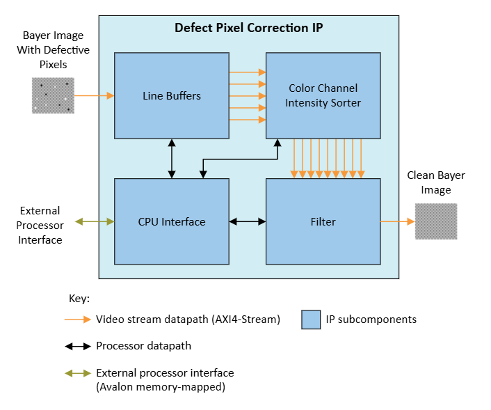{:style="display:block; margin-left:auto; margin-right:auto"}

**Defective Pixel Correction Block Diagram**

 

The DPC IP works on a 5x5 pixel neighborhood. The IP gathers the 9 pixels of
the same color channel closest to the current pixel (the center pixel in the
neighborhood) and sorts them according to their pixel values. A non-linear
filter calculates a corrected pixel value from the sorted group of pixels
depending on the sensitivity setting.

 

{:style="display:block; margin-left:auto; margin-right:auto"}

**A Bayer CFA for a 6x6 section of an image and an example pixel neighborhood for green, red, and blue pixels**

 

The DPC IP dynamically identifies and filters defect pixels and does not
support static defective pixel correction of predetermined pixels. When you set
the sensitivity level to the weakest value, the pixel value is altered only if
its original value falls outside the value range of its whole pixel
neighborhood. As the sensitivity increases the IP approximates a class of
median filter.

!!! note "Related Information"

    [Defective Pixel Correction IP](https://www.intel.com/content/www/us/en/docs/programmable/683329/25-1/defective-pixel-correction.html)

 

### Adaptive Noise Reduction

The Adaptive Noise Reduction (ANR) IP is an edge-preserving smoothing filter
that mainly reduces the independent pixel noise of an image. The IP operates on
2x2 Bayer CFA images.

 

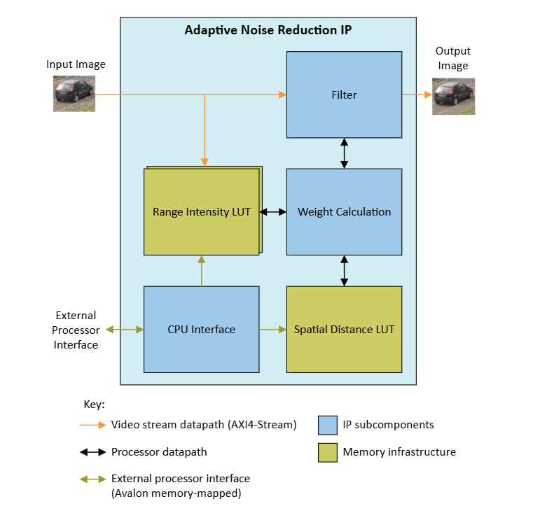{:style="display:block; margin-left:auto; margin-right:auto"}

**Adaptive Noise Reduction Block Diagram**

 

The ANR IP uses a spatial weighted averaging filter that analyzes the scene and
correlates similar pixels dynamically while generating the weights on the fly.
The IP utilizes two LUTs when correlating the pixels, one for correlating pixel
intensities and the other for correlating the spatial distance between the
pixels.

The design provides the intensity range LUT pre-calibrated offline using the
difference in noise level between two video images with identical content but
different temporal noise. The noise level is a function of the sensors analog
gain. Therefore, the calibration file contains a table of LUT parameters for a
range of sensor analog gain settings. Using a LUT allows you to program
different denoising strengths across the pixel intensities. For example, you
may opt for stronger denoising of dark content to reduce shadow noise more 
aggressively while preserving the details on the mid-tones and highlights.

The spatial distance LUT is used to make the ANR more versatile. It is
programmed to create a weight distribution from the center pixel to the
neighboring pixels. Traditional distributions like a Hamming or Hanning window
can be used to reduce ringing artifacts, or the same value entries can be used
for a rectangular distribution to maximize denoising capability. By default,
the software configures a Gaussian distribution into the spatial distance LUT.

!!! note "Related Information"

    [Adaptive Noise Reduction IP](https://www.intel.com/content/www/us/en/docs/programmable/683329/25-1/adaptive-noise-reduction.html)

 

### Black Level Correction

The Black Level Correction (BLC) IP operates on a 2x2 CFA input image and
adjusts the minimum brightness level of the image, ensuring an actual black
value is represented by the minimum pixel intensity. A camera system typically
adds a pedestal value as an offset to the image at the sensor side.
Artificially increasing black level creates foot room for preserving noise
distribution of the black pixels and prevents artifacts in the final image. The
design positions the BLC IP after the ANR IP where the noise is reduced as much
as desired.

 

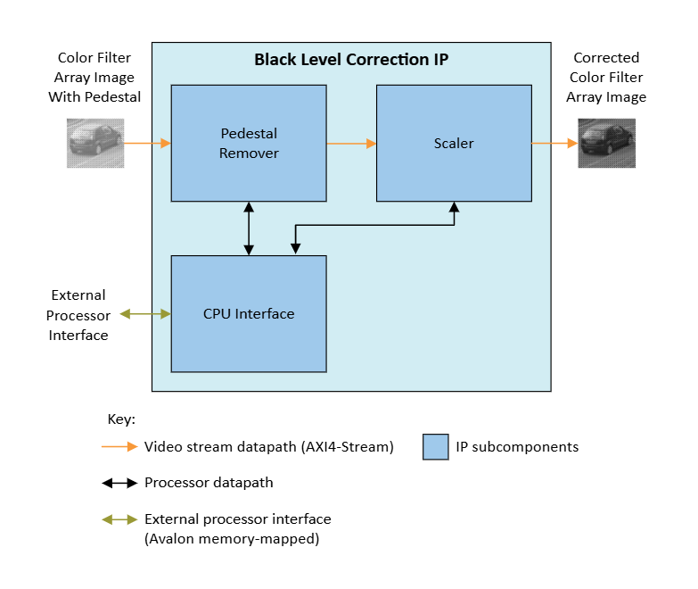{:style="display:block; margin-left:auto; margin-right:auto"}

**Black Level Correction Block Diagram**

 

The BLC IP subtracts the pedestal value from the input video stream and scales
the result back to the full dynamic range. The scaler part of BLC multiplies
the pedestal remover value by the scaler coefficient, clipping to the maximum
output pixel value should the calculation overflow.

 

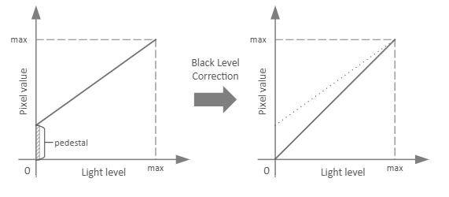{:style="display:block; margin-left:auto; margin-right:auto"}

**BLC Function**

 

The SW App sets the pedestal and scaler coefficients for each of the 2x2 CFA
color channels dynamically during runtime. These values can be pre-calibrated,
or calculated dynamically from statistics obtained from the BLS IP using OBR of
the sensor. You can configure the BLC IP to reflect negative values around zero
or clip them to zero.

 

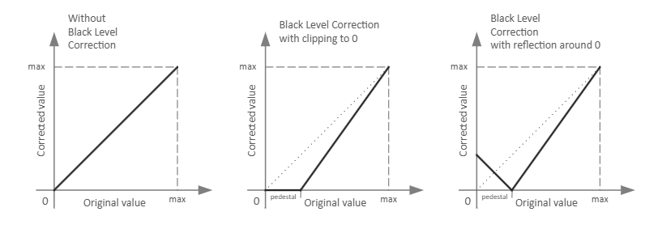{:style="display:block; margin-left:auto; margin-right:auto"}

**Effects of Reflection Around Zero**

 

Note that for this design, the SW App provided does not utilize the BLS IP to
read the OBR of the sensor and relies on pre-calibrated coefficients as a
function of analog gain of the sensor.

!!! note "Related Information"

    [Black Level Correction IP](https://www.intel.com/content/www/us/en/docs/programmable/683329/25-1/black-level-correction.html)

 

### Vignette Correction

The Vignette Correction (VC) IP compensates for non-uniform intensity across
the image caused by uneven light-gathering limitation of the sensor and optics.
In the usual case, the non-uniformity can be caused by lens geometry transforms
such as zoom, aperture, etc., where the center of the lens gathers more light
compared to the outer regions. The VC IP corrects uniformity using a runtime
mesh of coefficients and interpolating coefficients for any given pixel. 

 

{:style="display:block; margin-left:auto; margin-right:auto"}

**Vignette Correction Block Diagram**

 

The VC IP uses a rectangular mesh of coefficients to adjust the pixel
intensities across an image, therefore tuning out vignetting and other sensor
non-uniformities. The VC IP operates independently on the 4 color channels of
the 2x2 CFA input image. For all color channels, you may calculate the mesh
coefficients with a calibration process in a controlled imaging environment
and configure the SW App to write them to the VC IP. The precision of a mesh
coefficient is fixed-point unsigned 8.11, with 8 integer bits and 11 fractional
bits. The mesh divides the image into rectangular zones, with mesh points
residing at the corners of the zones. For each pixel, the IP selects the 4 mesh
points corresponding to the corners of the pixel's zone and interpolates them
using the distance from the pixel location to the mesh points. A multiplier
scales the input pixels using this interpolated coefficient.

Note that the vignetting effect is very low for the sensor module used in this
design, therefore, the design does not contain a pre-calibrated mesh of
coefficients.

 

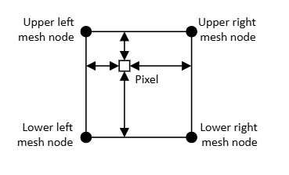{:style="display:block; margin-left:auto; margin-right:auto"}

**A Mesh Zone with a Pixel of Interest**

 

!!! note "Related Information"

    [Vignette Correction IP](https://www.intel.com/content/www/us/en/docs/programmable/683329/25-1/vignette-correction.html)

 

### White Balance Statistics

{:style="display:block; margin-left:auto; margin-right:auto"}

**White Balance Statistics Block Diagram**

 

The White Balance Statistics IP (WBS) operates on a 2x2 Bayer CFA image and
calculates red-green and blue-green ratios within a Region of Interest (ROI).
The ROI is divided into 7x7 zones, and the WBS calculates independent
statistics for all 49 zones. The SW App uses the WBS to set the White Balance
Correction IP.

 

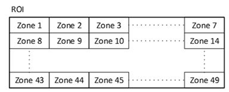{:style="display:block; margin-left:auto; margin-right:auto; width: 50%"}

**Packing Order of the Zones within a Region of Interest**

 

Each 2x2 Bayer region creates a virtual pixel from grouping 4 pixels. The IP
then calculates a red-green and a blue-green ratio for each virtual pixel
within the ROI.

 

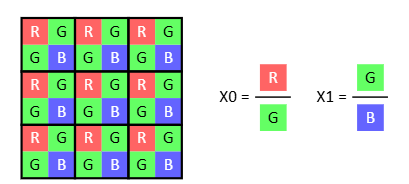{:style="display:block; margin-left:auto; margin-right:auto"}

**Example of ratio calculation for 2x2 virtual pixels for a 6x6 Section of Image**

 

The WBS IP checks both ratios against runtime programmable lower and upper
range thresholds and increments a zone virtual pixel count only if both ratios
fall between their respective threshold values. If at least one of the ratios
is out of range, the IP discards both ratios for that 2x2 virtual pixel and
therefore do not contribute to the final statistics of that zone. Ratios of all
virtual pixels that are not marked out of range are accumulated, and along with
the zone virtual pixel count are transferred to the zone memory at the end of
the zone.

The SW App reads each zone memory and calculates an average ratio by dividing
the accumulated ratio by the virtual pixel count. If the number of counted
pixels is too low, it indicates a zone with mixed content and is therefore
unsuitable for inclusion in calculating white imbalance of the image. The Auto
White Balance (AWB) algorithm is a feedback loop inside the SW App that
continuously reads the white balance statistics and guesses the color
temperature of the image scene.

The WBS IP passes its input image to its output unchanged.

!!! note "Related Information"

    [White Balance Statistics IP](https://www.intel.com/content/www/us/en/docs/programmable/683329/25-1/white-balance-statistics.html)

 

### White Balance Correction

The White Balance Correction (WBC) IP adjusts colors in a CFA image to
eliminate color casts, which occur due to lighting conditions or differences
in the light sensitivity of the pixels of different color. The IP ensures that
gray and white objects appear truly gray and white without, unwanted color
tinting.

 

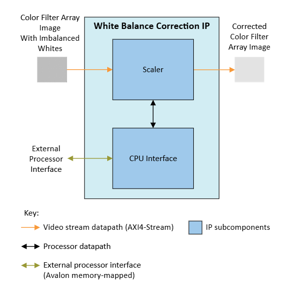{:style="display:block; margin-left:auto; margin-right:auto"}

**White Balance Correction Block Diagram**

 

The WBC IP multiplies the color channels of a 2x2 CFA input image by scalar
coefficients per color channel, clipping to the maximum output pixel value
should the calculation overflow.

The design provides a table of WBC scalars pre-calibrated for the sensor for a
range of color temperatures. The white balance algorithm in the SW App uses
color temperature information of the scene to look up WBC scalars from the
calibration table and configures the WBC IP over the Avalon® memory-mapped
interface. The SW App uses AWB to guess the color temperature in automatic
mode. The SW App also supports many fixed color temperature options.

!!! note "Related Information"

    [White Balance Correction IP](https://www.intel.com/content/www/us/en/docs/programmable/683329/25-1/white-balance-correction.html)

 

### Demosaic

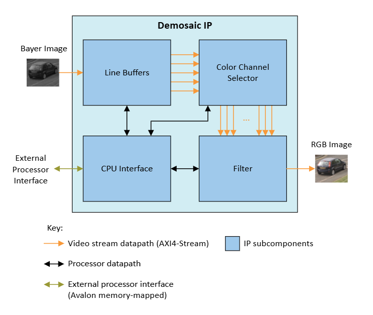{:style="display:block; margin-left:auto; margin-right:auto"}

**Demosaic Block Diagram**

 

The Demosaic IP (DMS) is a color reconstruction IP for converting a 2x2 Bayer
CFA input image to an RGB output image. The DMS interpolates missing colors
for each pixel based on its neighboring pixels.

 

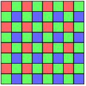{:style="display:block; margin-left:auto; margin-right:auto"}

**An example of a 2x2 RGGB Bayer Color Filter Array (for an 8x8 pixel section of the image)**

 

The DMS analyzes the neighboring pixels for every CFA input pixel and
interpolates the missing colors to produce an RGB output pixel. The IP uses
line buffers to construct pixel neighborhood information, maps the pixels in
the neighborhood depending on the position on the 2x2 CFA pattern, and
interpolates missing colors to calculate the RGB output.

!!! note "Related Information"

    [Demosaic IP](https://www.intel.com/content/www/us/en/docs/programmable/683329/25-1/demosaic.html)

 

### Histogram Statistics

The Histogram Statistics (HS) IP operates on RGB images. It analyzes the pixel
values for every frame to collects data to form a histogram of light intensity.

 

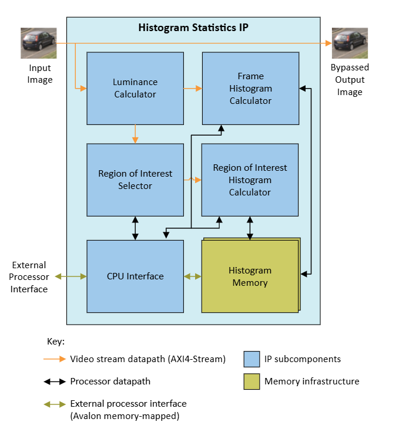{:style="display:block; margin-left:auto; margin-right:auto"}

**Histogram Statistics Block Diagram**

 

The HS IP calculates two light intensity histograms on the RGB input image - a
whole image histogram and a ROI image histogram. The RGB to intensity
conversion is performed according to the ITU-R BT.709 standard.

The Automatic Exposure (AE) algorithm is a feedback loop in the SW App that
guesses the optimum exposure of the scene. It continuously reads the HS IP and
guesses whether the capture is underexposed or overexposed and adjust camera
sensor exposure settings accordingly.

The HS IP passes its input to its output unmodified.

!!! note "Related Information"

    [Histogram Statistics IP](https://www.intel.com/content/www/us/en/docs/programmable/683329/25-1/histogram-statistics.html)

 

### Color Correction Matrix

The Color Correction Matrix (CCM) functionality is provided by the VVP Color
Space Converter (CSC) IP. A CCM correction is necessary to untangle the
undesired color bleeding across CFA color channels on the sensor. This is
mainly caused by each colored pixel being sensitive to color spectrums other
than their intended color.

The design configures the CSC IP to multiply the input RGB values of each pixel
with a 3x3 CCM to obtain the color corrected output RGB values.

The design provides a table of CCM coefficients pre-calibrated for the sensor
for a range of color temperatures. The AWB algorithm in the SW App uses color
temperature information of the scene to look up the CCM coefficients from the
calibration table and configures the CSC IP over the Avalon® memory-mapped
interface. The SW App uses AWB to guess the color temperature in automatic
mode. The SW App also supports many fixed color temperature options.

The SW App also provides many post-processing options to modulate the CCM
coefficients for adding an artistic effect on top of the pre-calibrated
accurate representation of the scene.

!!! note "Related Information"

    [Color Space Converter IP](https://www.intel.com/content/www/us/en/docs/programmable/683329/25-1/color-space-converter.html)

 

### 1D LUT

The 1D LUT IP uses a runtime configurable LUT to apply an input output transfer
function to the image. You may use it to implement OOTF, OETF, and EOTF
transfer functions defined for video standards and legacy gamma compression or
decompression. You may also change the LUT content arbitrarily for other
transfer functions or to apply an artistic effect to the image.

 

{:style="display:block; margin-left:auto; margin-right:auto"}

**1D LUT Block Diagram**

 

The 1D LUT IP calculates LUT addresses from the input pixels. It interpolates
fractional differences between LUT values to generate output pixel values. The
IP uses an independent LUT for each color plane. The SW App uses the Avalon®
memory-mapped interface to configure the LUTs.

The example design contains 2 instances of 1D LUT.

Instance 0 is used for traditional Gamma, High Dynamic Range Perceptual
Quantizer (HDR PQ) and Hybrid Log-Gamma (HDR HLG) correction. The 1D LUT is
configured as a 9-bit LUT and the output is increased to 16-bits to support the
Capture Switch that follows.

Instance 1 is used to facilitate the following 3D LUT IP where the available
.cube files do not support linear video. To minimize logic resource, this 1D
LUT is configured as a 12-bit LUT and the output is reduced to 14-bits.

!!! note "Related Information"

    [1D LUT IP](https://www.intel.com/content/www/us/en/docs/programmable/683329/25-1/1d-lut.html)

 

### 3D LUT

The 3D LUT IP maps an image's color space to another using interpolated values
from a lookup table.

Typical applications include:

* Color space conversion
* Chroma keying
* Dynamic range conversion (standard to high and high to standard)
* Artistic effects (sepia, hue rotation, color volume adjustment, etc.)

 

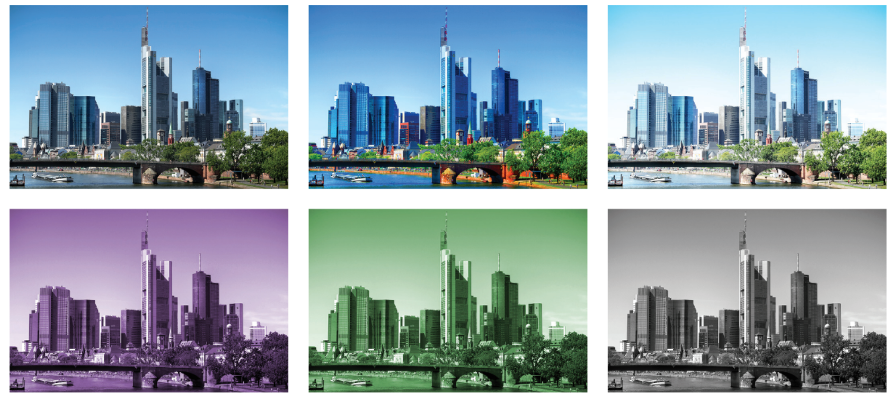{:style="display:block; margin-left:auto; margin-right:auto; width: 80%"}

**3D LUT Color Transform Examples**
(From top left to right: original, saturation, brightness increase, colorize (purple), colorize (green), desaturation)

 

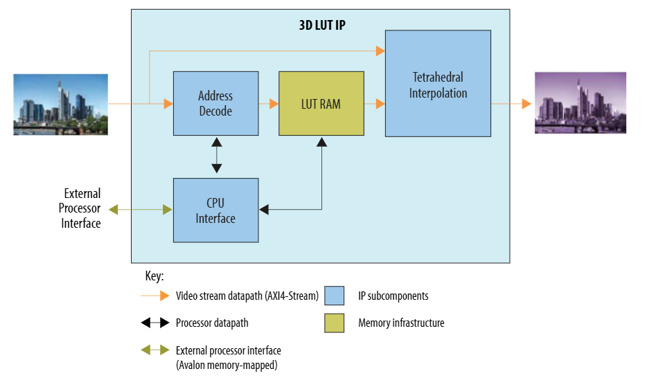{:style="display:block; margin-left:auto; margin-right:auto"}

**3D LUT Block Diagram**

 

The 3D LUT uses the most significant bits (MSBs) of the 3 RGB color component
inputs to retrieve data values from the LUT and the least significant bits
(LSBs) to interpolate the final output value. The SW App connected to the
Avalon® memory-mapped interface handles runtime control and LUT programming.

The example design uses 2 back to back 3D LUT IPs to support combinations of
conversions and will be application specific. If a 3D LUT isn't required, it
can be placed in bypass mode. The output of the final 3D LUT IP is reduced to
12-bits.

#### Generating LUT Files

You are responsible for sourcing or generating LUTs for the example design.
LUTs are generally developed based on input (optical system, sensor, ISP, etc.)
and display parameters. Various tools are available under open-source licenses
to produce LUTs. One such tool is LUTCalc, which can be used online. When using
it to generate LUTs for the 3D LUT IP, ensure that:

* The LUT is set to 3D
* Size matches the 3D LUT IP parameters (i.e. 17, 33, or 65 cube)
* Input and Output Range are 100%
* LUT Type is "General cube LUT (.cube)"

 

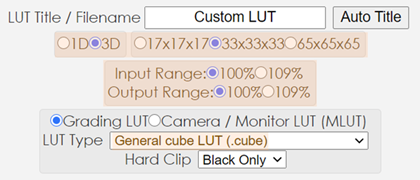{:style="display:block; margin-left:auto; margin-right:auto"}

**LUTCalc Format Settings**

 

In general, any LUT file used with this example design must follow these
formatting conventions:

* RGB component order
* Components change first from left to right, i.e., R first, G second, B third
* The data type must match the IP GUI parameter and may either be:
  * normalized fixed- or floating-point numbers between 0.0 to 1.0
  * integers between 0 and 2LUT_DEPTH-1 (for example, 10-bit: 0 to 1023)
* The data type must be the same for the whole file

!!! note "Related Information"

    [3D LUT](https://www.altera.com/products/ip/a1jui000004r4gnmas/3d-lut-altera-fpga-ip)  
    [3D LUT IP](https://www.intel.com/content/www/us/en/docs/programmable/683329/25-1/3d-lut.html)  
    [LUTCalc GitHub page](https://github.com/cameramanben/LUTCalc)

 

### Tone Mapping Operator

The Tone Mapping Operator (TMO) IP implements a tile-based local tone mapping
algorithm. It improves the visibility of latent image details and enhances the
overall viewing experience.

 

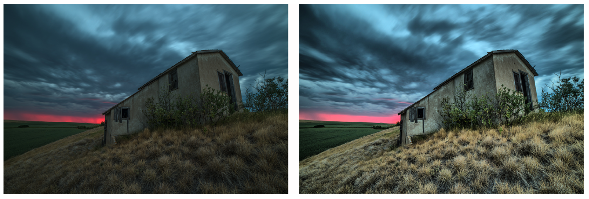{:style="display:block; margin-left:auto; margin-right:auto; width: 80%"}

**Before (left) and after (right) TMO is applied to an example image**

 

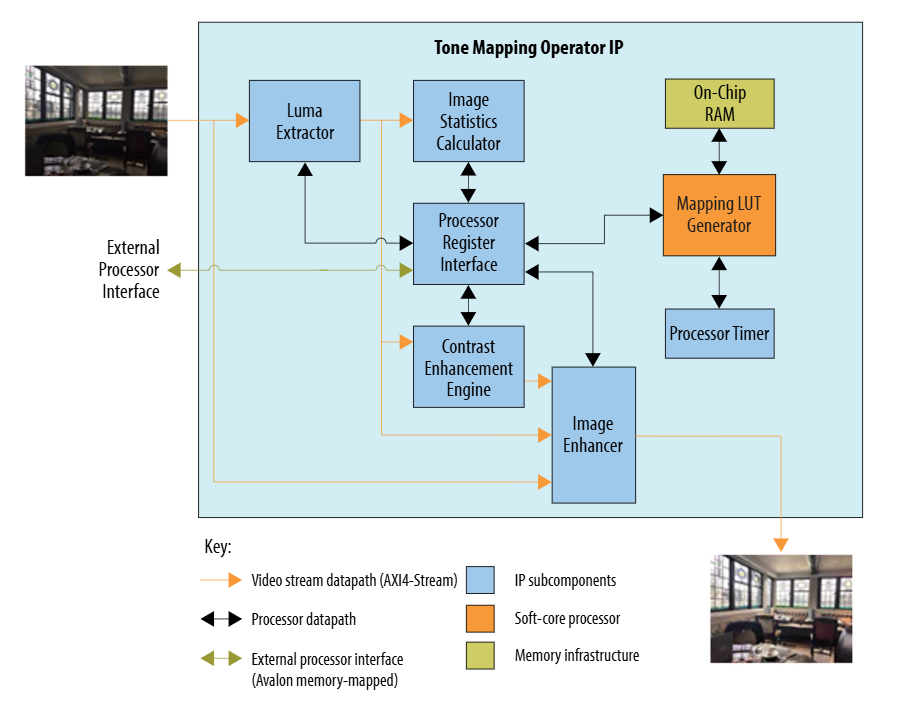{:style="display:block; margin-left:auto; margin-right:auto"}

**TMO Block Diagram**

 

The luminance extractor converts the RGB input to LUMA. The image statistics
calculator uses LUMA to calculate a set of global and local statistics
regarding the contrast of the input image over a 4x4 grid. The LUT generator
software runs on an embedded Nios® V CPU which analyzes the statistics,
generates a set of mapping transfer functions, and converts them to LUTs. The
contrast enhancement engine applies mapping transfer functions locally for
better granularity. The image enhancer combines the information and calculates
a set of weights that are applied to the input to generate the contrast-enhanced
output. Since the following VVP USM IP only support 10-bits color, the output
of the TMO is reduced down to 10-bits using a VVP Pixel Adapter IP.

The TMO does not use image buffers and therefore the statistics collected from
the previous image are used to enhance the current image.

The SW App configures the TMO IP over the Avalon® memory-mapped interface.

!!! note "Related Information"

    [Tone Mapping Operator](https://www.altera.com/products/ip/a1jui000004r0hlmak/tone-mapping-operator-fpga-ip)  
    [Tone Mapping Operator IP](https://www.intel.com/content/www/us/en/docs/programmable/683329/25-1/tone-mapping-operator.html)  
    [Bits per Color Sample Adapter IP](https://www.intel.com/content/www/us/en/docs/programmable/683329/25-1/bits-per-color-sample-adapter.html)  

 

### Unsharp Mask Filter

The Unsharp Mask (USM) IP applies a sharpening algorithm to the input image
by implementing an unsharp mask filter.

The IP firstly converts the RGB input to LUMA. The LUMA input is then passed
through a low-pass Gaussian blur filter. The IP subtracts the blurred input
from the original LUMA input to generate a high frequency component. A strength
scaler is applied to the high frequency component which is then used to scale
the input RGB image to generate the output RGB image.

The unsharp mask has an agent Avalon® memory-mapped interface to allow runtime
control for changing the sharpening strength. You can configure a positive or
negative strength value for sharpening or blurring the image. Setting the
strength to 0 is equivalent to bypass i.e. passing the input to the output
unmodified.

!!! note "Related Information"

    [Unsharp Mask IP](https://www.intel.com/content/www/us/en/docs/programmable/683329/25-1/unsharp-mask.html)

 

### Warp

The Warp IP applies an arbitrary warp (or image transform) to an input image.
It allows for lens distortion corrections (fisheye for instance) and the
ability to scale, rotate, and mirror the image.

 

{:style="display:block; margin-left:auto; margin-right:auto; width: 80%"}

**Warp Transform Examples**
(From left: arbitrary warp with a 5x5 array of control points, four corner warp with some radial distortion.)

 

{:style="display:block; margin-left:auto; margin-right:auto; width: 80%"}

**Warp Mirror and Rotation Examples**
(From top left clockwise: original image, mirrored, 90° rotate and 180° rotate.)

 

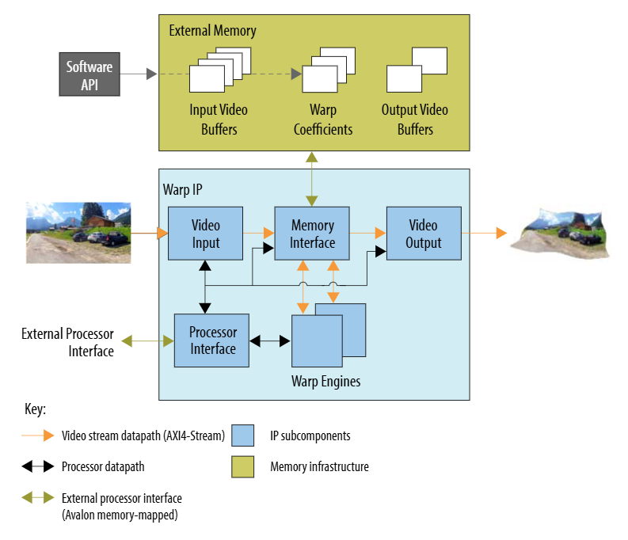{:style="display:block; margin-left:auto; margin-right:auto"}

**Warp Block Diagram**

 

The block diagram shows an external memory which is used to buffer the incoming
and outgoing image data. The external memory also stores the coefficient tables
used to control the Warp IPs operation and define the required image transform.

The IP uses its Warp engines to operate on the input images stored in the input
buffers and to construct warped, output images from the output buffers.

The example design configures the Warp IP with two engines to support any
arbitrary transformation at 4K resolution.

!!! note "Related Information"

    [Warp](https://www.altera.com/products/ip/a1jui000004rhk1mag/warp-fpga-ip)  
    [Warp IP](https://www.intel.com/content/www/us/en/docs/programmable/683329/25-1/warp.html)

 

## Output Processing

This section summarizes notable output processing functions and IPs used in the
Camera Solution System Example Design:

* [Video Mixer](#video-mixer)
* [1D LUT](#1d-lut)
* [Frame Capture](#frame-capture)
* [DP Egress](#dp-egress)

### Video Mixer

The Video Mixer is used to combine the different input images into a single
output image. It uses a VVP Test Pattern Generator IP, a VVP Mixer IP, and a
non-QPDS Icon IP (supplied with the source project).

The TPG (Instance 1) is the base layer for the Mixer IP. It is configured by
default as a 4K solid black image which also serves as the screensaver
function. The TPG also supports color bars, which can be used to test the DP
output.

The base layer is mixed with the ISP output image and the Altera® logo overlay
image. The opacity of the Icon overlay is globally controlled and can be
changed during runtime by the SW App.

!!! note "Related Information"

    [Test Pattern Generator IP](https://www.intel.com/content/www/us/en/docs/programmable/683329/25-1/test-pattern-generator.html)  
    [Mixer IP](https://www.intel.com/content/www/us/en/docs/programmable/683329/25-1/mixer.html)

 

### Frame Capture

The Frame Capture function uses a two VVP Switch IPs and a VVP Video Frame
Writer IP which is connected to an external FPGA DDR4 SDRAM memory (via an
EMIF).

The Video Frame Writer IP operates in a single shot mode on RGB 16-bit images.

The Capture Switch (VVP Switch IP - Instance 5) is used to feed the Video Frame
Writer with either the raw sensor image via the Raw Capture Switch (VVP Switch
IP - Instance 4) or the ISP output image via the 1D LUT IP (Instance 0). The
raw sensor image uses a single color for each pixel and so a VVP Color Plane
Manager IP is used to copy the single color into all 3 color planes to generate
a grayscale RGB raw sensor image for capture.

The HPS has a host Avalon® memory-mapped interface to the FPGA external DDR4
SDRAM, allowing it to read out the captured image.

The output of the Capture Switch when not feeding the Video Frame Writer IP,
feeds the output image to the DP output via a VVP Pixel Adapter IP to reduce
the color bit depth back down to 10-bits.

!!! note "Related Information"

    [Switch IP](https://www.intel.com/content/www/us/en/docs/programmable/683329/25-1/switch.html)  
    [Video Frame Writer IP](https://www.intel.com/content/www/us/en/docs/programmable/683329/25-1/video-frame-writer-intel-fpga-ip.html)  
    [Color Plane Manager IP](https://www.intel.com/content/www/us/en/docs/programmable/683329/25-1/color-plane-manager.html)  
    [Bits per Color Sample Adapter IP](https://www.intel.com/content/www/us/en/docs/programmable/683329/25-1/bits-per-color-sample-adapter.html)  

 

### ISP Egress

The ISP Egress is used to interface the final ISP 4K output to the multi-rate
DP IP. The following output resolutions and color bit depths are supported by
the Camera Solution System Example Design:

* 4Kp60 @ 10-bit RGB Color
* 4Kp30 @ 8/10-bit RGB color
* 1080p60 @ 8/10-bit RGB color
* 720p60 @ 8/10-bit RGB color

Since the DP IP does not support 2 PiP or the VVP AXI4-S Lite protocol, the
output from the switch is passed through a VVP PiP Converter IP followed by a
VVP Protocol Converter IP.

!!! note "Related Information"

    [Pixels in Parallel Converter IP](https://www.intel.com/content/www/us/en/docs/programmable/683329/25-1/pixels-in-parallel-converter.html)  
    [Protocol Converter IP](https://www.intel.com/content/www/us/en/docs/programmable/683329/25-1/protocol-converter.html)

 

## DP Egress

The DP Tx function is provided by the Altera® DisplayPort connectivity IP.

It is configured to support DisplayPort 1.4 (x4 lanes of 8.1 Gbps, sufficient for
4Kp60 8-bit RGB and 4Kp30 8/10-bit RGB). The DP IP also supports
the VVP AXI4-S Full protocol interface.

 

## Hard Processor System 

Hard Processor System (HPS) runs the Software Application that configures the
external optical sensor module and the internal IPs, and provides the AI
functionality and various camera control loops such as AWB and AE. In addition,
it runs a web server that allows you to interact with the design demonstration
via an Ethernet connection. The HPS has its own external DDR4 SDRAM that is
used exclusively by the software stack.

The HPS is also connected to the
external FPGA fabric DDR4 SDRAM/s to process data for the Warp and frame
capture functions.

 

## Additional Reference Information
* [Video and Vision Processing Suite Altera® FPGA IP User Guide](https://www.intel.com/content/www/us/en/docs/programmable/683329/25-1/about-the-video-and-vision-processing-suite.html)
* [Altera® FPGA Streaming Video Protocol Specification](https://www.intel.com/content/www/us/en/docs/programmable/683397/current/about-the-intel-fpga-streaming-video.html)
* [AMBA 4 AXI4-Stream Protocol Specification](https://developer.arm.com/documentation/ihi0051/a/)
* [Avalon® Interface Specifications – Avalon® Streaming Interfaces](https://www.intel.com/content/www/us/en/docs/programmable/683091/20-1/streaming-interfaces.html)

 

 
[Back](../camera_4k/camera_4k.md#documentation){ .md-button }
 

[Agilex™ 5 E-Series Modular Development Board GSRD User Guide (25.1)]: https://altera-fpga.github.io/rel-25.1/embedded-designs/agilex-5/e-series/modular/gsrd/ug-gsrd-agx5e-modular/

[Hard Processor System Technical Reference Manual: Agilex™ 5 SoCs (25.1)]: https://www.intel.com/content/www/us/en/docs/programmable/814346/25-1/hard-processor-system-technical-reference.html
[NiosV Processor for Altera® FPGA]: https://www.altera.com/design/guidance/nios-v-developer
[Agilex™ 5 FPGA E-Series 065B Modular Development Kit]: https://www.altera.com/products/devkit/a1jui0000061qabmaa/agilex-5-fpga-and-soc-e-series-modular-development-kit-es
[Agilex™ 5 FPGA E-Series 065B Modular Development Kit Product Brief]: https://www.intel.com/content/www/us/en/content-details/815178/agilex-5-fpga-e-series-065b-modular-development-kit-product-brief.html
[Altera® FPGA AI Suite]: https://www.altera.com/products/development-tools/fpga-ai-suite

[Win32DiskImager]: https://sourceforge.net/projects/win32diskimager
[7-Zip]: https://www.7-zip.org
[TeraTerm]: https://github.com/TeraTermProject/teraterm/releases
[PuTTY]: https://www.chiark.greenend.org.uk/~sgtatham/putty/latest.html

[Framos FSM:GO IMX678C Camera Modules]: https://www.framos.com/en/fsmgo
[Wide 110deg HFOV Lens]: https://www.mouser.co.uk/ProductDetail/FRAMOS/FSMGO-IMX678C-M12-L110A-PM-A1Q1?qs=%252BHhoWzUJg4KQkNyKsCEDHw%3D%3D
[Medium 100deg HFOV Lens]: https://www.mouser.co.uk/ProductDetail/FRAMOS/FSMGO-IMX678C-M12-L100A-PM-A1Q1?qs=%252BHhoWzUJg4IesSwD2ACIBQ%3D%3D
[Narrow 54deg HFOV Lens]: https://www.mouser.co.uk/ProductDetail/FRAMOS/FSMGO-IMX678C-M12-L54A-PM-A1Q1?qs=%252BHhoWzUJg4L5yHZulKgVGA%3D%3D
[Framos Tripod Mount Adapter]: https://www.framos.com/en/products/fma-mnt-trp1-4-v1c-26333
[Tripod]: https://thepihut.com/products/small-tripod-for-raspberry-pi-hq-camera
[150mm flex-cable]: https://www.mouser.co.uk/ProductDetail/FRAMOS/FMA-FC-150-60-V1A?qs=GedFDFLaBXGCmWApKt5QIQ%3D%3D&_gl=1*d93qim*_ga*MTkyOTE4MjMxNy4xNzQxMTcwMzQy*_ga_15W4STQT4T*MTc0MTE3MDM0Mi4xLjEuMTc0MTE3MDQ5OS40NS4wLjA
[300mm micro-coax cable]: https://www.mouser.co.uk/ProductDetail/FRAMOS/FFA-MC50-Kit-0.3m?qs=%252BHhoWzUJg4K3LtaE207mhw%3D%3D
[DP to HDMI Adapter]: https://www.amazon.co.uk/gp/product/B01M6WK3KU/ref=ppx_yo_dt_b_asin_title_o02_s00?ie=UTF8&psc=1
[Framos GMSL3 5m]: https://www.mouser.co.uk/ProductDetail/FRAMOS/FFA-GMSL3-Kit-5m?qs=%252BHhoWzUJg4IkLHv%2F6fzsXQ%3D%3D
[Framos FFA-GMSL-SER-V2A Serializer]: https://www.framos.com/en/products/ffa-gmsl-ser-v2a-27617
[Framos FFA-GMSL-DES-V2A Deserializer]: https://www.framos.com/en/products/ffa-gmsl-des-v2a-27240

[VVP IP Suite]: https://www.altera.com/products/ip/a1jui000004qxfpmak/video-and-vision-processing-suite
[MIPI DPHY IP and MIPI CSI-2 IP]: https://www.altera.com/products/ip/a1jui0000049uuamam/mipi-d-phy-ip#tab-blade-1-3
[Nios® V Processor]: https://www.altera.com/products/ip/a1jui0000049uvama2/nios-v-processors

[Altera® Quartus® Prime Pro Edition version 25.1 Linux]: https://www.intel.com/content/www/us/en/software-kit/851652/intel-quartus-prime-pro-edition-design-software-version-25-1-for-linux.html
[Altera® Quartus® Prime Pro Edition version 25.1 Windows]: https://www.intel.com/content/www/us/en/software-kit/851653/intel-quartus-prime-pro-edition-design-software-version-25-1-for-windows.html
[Altera® Quartus® Prime Pro Edition version 25.1 Programmer and Tools]: https://www.intel.com/content/www/us/en/software-kit/851652/intel-quartus-prime-pro-edition-design-software-version-25-1-for-linux.html

[ultralytics YOLO]: https://docs.ultralytics.com
[ONNX]: https://onnx.ai/
[OpenVINO Toolkit]: https://storage.openvinotoolkit.org/repositories/openvino/packages/2024.6/linux

[Test Pattern Generator IP]: https://www.intel.com/content/www/us/en/docs/programmable/683329/25-1/test-pattern-generator.html
[Switch IP]: https://www.intel.com/content/www/us/en/docs/programmable/683329/25-1/switch.html
[Black Level Statistics IP]: https://www.intel.com/content/www/us/en/docs/programmable/683329/25-1/black-level-statistics.html
[Clipper IP]: https://www.intel.com/content/www/us/en/docs/programmable/683329/25-1/clipper.html
[Defective Pixel Correction IP]: https://www.intel.com/content/www/us/en/docs/programmable/683329/25-1/defective-pixel-correction.html
[Adaptive Noise Reduction IP]: https://www.intel.com/content/www/us/en/docs/programmable/683329/25-1/adaptive-noise-reduction.html
[Black Level Correction IP]: https://www.intel.com/content/www/us/en/docs/programmable/683329/25-1/black-level-correction.html
[Vignette Correction IP]: https://www.intel.com/content/www/us/en/docs/programmable/683329/25-1/vignette-correction.html
[White Balance Statistics IP]: https://www.intel.com/content/www/us/en/docs/programmable/683329/25-1/white-balance-statistics.html
[White Balance Correction IP]: https://www.intel.com/content/www/us/en/docs/programmable/683329/25-1/white-balance-correction.html
[Demosaic IP]: https://www.intel.com/content/www/us/en/docs/programmable/683329/25-1/demosaic.html
[Histogram Statistics IP]: https://www.intel.com/content/www/us/en/docs/programmable/683329/25-1/histogram-statistics.html
[Color Space Converter IP]: https://www.intel.com/content/www/us/en/docs/programmable/683329/25-1/color-space-converter.html
[1D LUT]: https://www.altera.com/products/ip/a1jui000004r4gnmas/1d-lut-altera-fpga-ip
[1D LUT IP]: https://www.intel.com/content/www/us/en/docs/programmable/683329/25-1/1d-lut.html
[3D LUT]: https://www.altera.com/products/ip/a1jui000004r4gnmas/3d-lut-altera-fpga-ip
[3D LUT IP]: https://www.intel.com/content/www/us/en/docs/programmable/683329/25-1/3d-lut.html
[LUTCalc GitHub page]: https://github.com/cameramanben/LUTCalc
[Tone Mapping Operator]: https://www.altera.com/products/ip/a1jui000004r0hlmak/tone-mapping-operator-fpga-ip
[Tone Mapping Operator IP]: https://www.intel.com/content/www/us/en/docs/programmable/683329/25-1/tone-mapping-operator.html
[Unsharp Mask IP]: https://www.intel.com/content/www/us/en/docs/programmable/683329/25-1/unsharp-mask.html
[Warp]: https://www.altera.com/products/ip/a1jui000004rhk1mag/warp-fpga-ip
[Warp IP]: https://www.intel.com/content/www/us/en/docs/programmable/683329/25-1/warp.html
[Mixer IP]: https://www.intel.com/content/www/us/en/docs/programmable/683329/25-1/mixer.html
[Video Frame Writer IP]: https://www.intel.com/content/www/us/en/docs/programmable/683329/25-1/video-frame-writer-intel-fpga-ip.html
[Video Frame Reader IP]: https://www.intel.com/content/www/us/en/docs/programmable/683329/25-1/video-frame-reader-intel-fpga-ip.html
[Color Plane Manager IP]: https://www.intel.com/content/www/us/en/docs/programmable/683329/25-1/color-plane-manager.html
[Bits per Color Sample Adapter IP]: https://www.intel.com/content/www/us/en/docs/programmable/683329/25-1/bits-per-color-sample-adapter.html
[Protocol Converter IP]: https://www.intel.com/content/www/us/en/docs/programmable/683329/25-1/protocol-converter.html
[Pixels in Parallel Converter IP]: https://www.intel.com/content/www/us/en/docs/programmable/683329/25-1/pixels-in-parallel-converter.html
[Video and Vision Processing Suite Altera® FPGA IP User Guide]: https://www.intel.com/content/www/us/en/docs/programmable/683329/25-1/about-the-video-and-vision-processing-suite.html
[Altera® FPGA Streaming Video Protocol Specification]: https://www.intel.com/content/www/us/en/docs/programmable/683397/current/about-the-intel-fpga-streaming-video.html
[AMBA 4 AXI4-Stream Protocol Specification]: https://developer.arm.com/documentation/ihi0051/a/
[Avalon® Interface Specifications – Avalon® Streaming Interfaces]: https://www.intel.com/content/www/us/en/docs/programmable/683091/20-1/streaming-interfaces.html
[KAS]: https://kas.readthedocs.io/en/latest/
[EMIF]: https://www.altera.com/design/guidance/emif-support
[Scaler IP]: https://www.intel.com/content/www/us/en/docs/programmable/683329/25-1/scaler.html
[MSGDMA IP]: https://www.intel.com/content/www/us/en/docs/programmable/683130/25-1-1/modular-scatter-gather-dma-core.html

[User flow 1]: ../camera_4k/camera_4k.md#pre-requisites
[User flow 2]: ../camera_4k/flow2-sof-mdt.md
[User flow 3]: ../camera_4k/flow3-rbf-mdt.md

[https://github.com/altera-fpga/agilex-ed-camera]: https://github.com/altera-fpga/agilex-ed-camera
[https://github.com/altera-fpga/modular-design-toolkit]: https://github.com/altera-fpga/modular-design-toolkit
[meta-altera-fpga]: https://github.com/altera-fpga/agilex-ed-camera/tree/rel-25.1/sw/meta-altera-fpga
[meta-altera-fpga-ocs]: https://github.com/altera-fpga/agilex-ed-camera/tree/rel-25.1/sw/meta-altera-fpga-ocs
[meta-vvp-isp-demo]: https://github.com/altera-fpga/agilex-ed-camera/tree/rel-25.1/sw/meta-vvp-isp-demo
[agilex-ed-camera/sw]: https://github.com/altera-fpga/agilex-ed-camera/tree/rel-25.1/sw

[Release Tag]: https://github.com/altera-fpga/agilex-ed-camera/releases/tag/rel-25.1
[https://github.com/altera-fpga/agilex-ed-camera/releases/tag/rel-25.1]: https://github.com/altera-fpga/agilex-ed-camera/releases/tag/rel-25.1
[hps-first-vvp-isp-demo-image-agilex5_mk_a5e065bb32aes1.wic.gz]: https://github.com/altera-fpga/agilex-ed-camera/releases/download/rel-25.1/hps-first-vvp-isp-demo-image-agilex5_mk_a5e065bb32aes1.wic.gz
[fpga-first-vvp-isp-demo-image-agilex5_mk_a5e065bb32aes1.wic.gz]: https://github.com/altera-fpga/agilex-ed-camera/releases/download/rel-25.1/fpga-first-vvp-isp-demo-image-agilex5_mk_a5e065bb32aes1.wic.gz
[fsbl_agilex5_modkit_vvpisp_time_limited.sof]: https://github.com/altera-fpga/agilex-ed-camera/releases/download/rel-25.1/fsbl_agilex5_modkit_vvpisp_time_limited.sof
[top.core.jic]: https://github.com/altera-fpga/agilex-ed-camera/releases/download/rel-25.1/top.core.jic
[top.core.rbf]: https://github.com/altera-fpga/agilex-ed-camera/releases/download/rel-25.1/top.core.rbf
[model_compiler]: https://github.com/altera-fpga/agilex-ed-camera/releases/download/rel-25.1/compile_model.exe

[AGX_5E_Modular_Devkit_ISP_FF_RD.xml]: https://github.com/altera-fpga/agilex-ed-camera/blob/rel-25.1/AGX_5E_Altera_Modular_Dk_ISP_designs/AGX_5E_Modular_Devkit_ISP_FF_RD.xml
[AGX_5E_Modular_Devkit_ISP_RD.xml]: https://github.com/altera-fpga/agilex-ed-camera/blob/rel-25.1/AGX_5E_Altera_Modular_Dk_ISP_designs/AGX_5E_Modular_Devkit_ISP_RD.xml
[Create microSD card image (.wic.gz) using YOCTO/KAS]: https://github.com/altera-fpga/agilex-ed-camera/blob/rel-25.1/sw/README.md
[<g>&check;</g> YOCTO/KAS ]: https://github.com/altera-fpga/agilex-ed-camera/blob/rel-25.1/sw/README.md

[SOF Modular Design Toolkit (MDT) Flow]: https://github.com/altera-fpga/agilex-ed-camera/blob/rel-25.1/README.md#create-the-design-using-the-modular-design-toolkit-mdt
[RBF Modular Design Toolkit (MDT) Flow]: https://github.com/altera-fpga/agilex-ed-camera/blob/rel-25.1/README.md#create-the-design-using-the-modular-design-toolkit-mdt
[<g>&check;</g> SOF MDT Flow ]: https://github.com/altera-fpga/agilex-ed-camera/blob/rel-25.1/README.md#create-the-design-using-the-modular-design-toolkit-mdt
[<g>&check;</g> RBF MDT Flow ]: https://github.com/altera-fpga/agilex-ed-camera/blob/rel-25.1/README.md#create-the-design-using-the-modular-design-toolkit-mdt

[Agilex™ 5 E-Series Modular Development Board GSRD User Guide (25.1)]: https://altera-fpga.github.io/rel-25.1/embedded-designs/agilex-5/e-series/modular/gsrd/ug-gsrd-agx5e-modular/

[Hard Processor System Technical Reference Manual: Agilex™ 5 SoCs (25.1)]: https://www.intel.com/content/www/us/en/docs/programmable/814346/25-1/hard-processor-system-technical-reference.html
[NiosV Processor for Altera® FPGA]: https://www.altera.com/design/guidance/nios-v-developer
[Agilex™ 5 FPGA E-Series 065B Modular Development Kit]: https://www.altera.com/products/devkit/a1jui0000061qabmaa/agilex-5-fpga-and-soc-e-series-modular-development-kit-es
[Agilex™ 5 FPGA E-Series 065B Modular Development Kit Product Brief]: https://www.intel.com/content/www/us/en/content-details/815178/agilex-5-fpga-e-series-065b-modular-development-kit-product-brief.html
[Altera® FPGA AI Suite]: https://www.altera.com/products/development-tools/fpga-ai-suite

[Win32DiskImager]: https://sourceforge.net/projects/win32diskimager
[7-Zip]: https://www.7-zip.org
[TeraTerm]: https://github.com/TeraTermProject/teraterm/releases
[PuTTY]: https://www.chiark.greenend.org.uk/~sgtatham/putty/latest.html

[Framos FSM:GO IMX678C Camera Modules]: https://www.framos.com/en/fsmgo
[Wide 110deg HFOV Lens]: https://www.mouser.co.uk/ProductDetail/FRAMOS/FSMGO-IMX678C-M12-L110A-PM-A1Q1?qs=%252BHhoWzUJg4KQkNyKsCEDHw%3D%3D
[Medium 100deg HFOV Lens]: https://www.mouser.co.uk/ProductDetail/FRAMOS/FSMGO-IMX678C-M12-L100A-PM-A1Q1?qs=%252BHhoWzUJg4IesSwD2ACIBQ%3D%3D
[Narrow 54deg HFOV Lens]: https://www.mouser.co.uk/ProductDetail/FRAMOS/FSMGO-IMX678C-M12-L54A-PM-A1Q1?qs=%252BHhoWzUJg4L5yHZulKgVGA%3D%3D
[Framos Tripod Mount Adapter]: https://www.framos.com/en/products/fma-mnt-trp1-4-v1c-26333
[Tripod]: https://thepihut.com/products/small-tripod-for-raspberry-pi-hq-camera
[150mm flex-cable]: https://www.mouser.co.uk/ProductDetail/FRAMOS/FMA-FC-150-60-V1A?qs=GedFDFLaBXGCmWApKt5QIQ%3D%3D&_gl=1*d93qim*_ga*MTkyOTE4MjMxNy4xNzQxMTcwMzQy*_ga_15W4STQT4T*MTc0MTE3MDM0Mi4xLjEuMTc0MTE3MDQ5OS40NS4wLjA
[300mm micro-coax cable]: https://www.mouser.co.uk/ProductDetail/FRAMOS/FFA-MC50-Kit-0.3m?qs=%252BHhoWzUJg4K3LtaE207mhw%3D%3D
[DP to HDMI Adapter]: https://www.amazon.co.uk/gp/product/B01M6WK3KU/ref=ppx_yo_dt_b_asin_title_o02_s00?ie=UTF8&psc=1
[Framos GMSL3 5m]: https://www.mouser.co.uk/ProductDetail/FRAMOS/FFA-GMSL3-Kit-5m?qs=%252BHhoWzUJg4IkLHv%2F6fzsXQ%3D%3D
[Framos FFA-GMSL-SER-V2A Serializer]: https://www.framos.com/en/products/ffa-gmsl-ser-v2a-27617
[Framos FFA-GMSL-DES-V2A Deserializer]: https://www.framos.com/en/products/ffa-gmsl-des-v2a-27240

[VVP IP Suite]: https://www.altera.com/products/ip/a1jui000004qxfpmak/video-and-vision-processing-suite
[MIPI DPHY IP and MIPI CSI-2 IP]: https://www.altera.com/products/ip/a1jui0000049uuamam/mipi-d-phy-ip#tab-blade-1-3
[Nios® V Processor]: https://www.altera.com/products/ip/a1jui0000049uvama2/nios-v-processors

[Altera® Quartus® Prime Pro Edition version 25.1 Linux]: https://www.intel.com/content/www/us/en/software-kit/851652/intel-quartus-prime-pro-edition-design-software-version-25-1-for-linux.html
[Altera® Quartus® Prime Pro Edition version 25.1 Windows]: https://www.intel.com/content/www/us/en/software-kit/851653/intel-quartus-prime-pro-edition-design-software-version-25-1-for-windows.html
[Altera® Quartus® Prime Pro Edition version 25.1 Programmer and Tools]: https://www.intel.com/content/www/us/en/software-kit/851652/intel-quartus-prime-pro-edition-design-software-version-25-1-for-linux.html

[ultralytics YOLO]: https://docs.ultralytics.com
[ONNX]: https://onnx.ai/
[OpenVINO Toolkit]: https://storage.openvinotoolkit.org/repositories/openvino/packages/2024.6/linux

[Test Pattern Generator IP]: https://www.intel.com/content/www/us/en/docs/programmable/683329/25-1/test-pattern-generator.html
[Switch IP]: https://www.intel.com/content/www/us/en/docs/programmable/683329/25-1/switch.html
[Black Level Statistics IP]: https://www.intel.com/content/www/us/en/docs/programmable/683329/25-1/black-level-statistics.html
[Clipper IP]: https://www.intel.com/content/www/us/en/docs/programmable/683329/25-1/clipper.html
[Defective Pixel Correction IP]: https://www.intel.com/content/www/us/en/docs/programmable/683329/25-1/defective-pixel-correction.html
[Adaptive Noise Reduction IP]: https://www.intel.com/content/www/us/en/docs/programmable/683329/25-1/adaptive-noise-reduction.html
[Black Level Correction IP]: https://www.intel.com/content/www/us/en/docs/programmable/683329/25-1/black-level-correction.html
[Vignette Correction IP]: https://www.intel.com/content/www/us/en/docs/programmable/683329/25-1/vignette-correction.html
[White Balance Statistics IP]: https://www.intel.com/content/www/us/en/docs/programmable/683329/25-1/white-balance-statistics.html
[White Balance Correction IP]: https://www.intel.com/content/www/us/en/docs/programmable/683329/25-1/white-balance-correction.html
[Demosaic IP]: https://www.intel.com/content/www/us/en/docs/programmable/683329/25-1/demosaic.html
[Histogram Statistics IP]: https://www.intel.com/content/www/us/en/docs/programmable/683329/25-1/histogram-statistics.html
[Color Space Converter IP]: https://www.intel.com/content/www/us/en/docs/programmable/683329/25-1/color-space-converter.html
[1D LUT]: https://www.altera.com/products/ip/a1jui000004r4gnmas/1d-lut-altera-fpga-ip
[1D LUT IP]: https://www.intel.com/content/www/us/en/docs/programmable/683329/25-1/1d-lut.html
[3D LUT]: https://www.altera.com/products/ip/a1jui000004r4gnmas/3d-lut-altera-fpga-ip
[3D LUT IP]: https://www.intel.com/content/www/us/en/docs/programmable/683329/25-1/3d-lut.html
[LUTCalc GitHub page]: https://github.com/cameramanben/LUTCalc
[Tone Mapping Operator]: https://www.altera.com/products/ip/a1jui000004r0hlmak/tone-mapping-operator-fpga-ip
[Tone Mapping Operator IP]: https://www.intel.com/content/www/us/en/docs/programmable/683329/25-1/tone-mapping-operator.html
[Unsharp Mask IP]: https://www.intel.com/content/www/us/en/docs/programmable/683329/25-1/unsharp-mask.html
[Warp]: https://www.altera.com/products/ip/a1jui000004rhk1mag/warp-fpga-ip
[Warp IP]: https://www.intel.com/content/www/us/en/docs/programmable/683329/25-1/warp.html
[Mixer IP]: https://www.intel.com/content/www/us/en/docs/programmable/683329/25-1/mixer.html
[Video Frame Writer IP]: https://www.intel.com/content/www/us/en/docs/programmable/683329/25-1/video-frame-writer-intel-fpga-ip.html
[Video Frame Reader IP]: https://www.intel.com/content/www/us/en/docs/programmable/683329/25-1/video-frame-reader-intel-fpga-ip.html
[Color Plane Manager IP]: https://www.intel.com/content/www/us/en/docs/programmable/683329/25-1/color-plane-manager.html
[Bits per Color Sample Adapter IP]: https://www.intel.com/content/www/us/en/docs/programmable/683329/25-1/bits-per-color-sample-adapter.html
[Protocol Converter IP]: https://www.intel.com/content/www/us/en/docs/programmable/683329/25-1/protocol-converter.html
[Pixels in Parallel Converter IP]: https://www.intel.com/content/www/us/en/docs/programmable/683329/25-1/pixels-in-parallel-converter.html
[Video and Vision Processing Suite Altera® FPGA IP User Guide]: https://www.intel.com/content/www/us/en/docs/programmable/683329/25-1/about-the-video-and-vision-processing-suite.html
[Altera® FPGA Streaming Video Protocol Specification]: https://www.intel.com/content/www/us/en/docs/programmable/683397/current/about-the-intel-fpga-streaming-video.html
[AMBA 4 AXI4-Stream Protocol Specification]: https://developer.arm.com/documentation/ihi0051/a/
[Avalon® Interface Specifications – Avalon® Streaming Interfaces]: https://www.intel.com/content/www/us/en/docs/programmable/683091/20-1/streaming-interfaces.html
[KAS]: https://kas.readthedocs.io/en/latest/
[EMIF]: https://www.altera.com/design/guidance/emif-support
[Scaler IP]: https://www.intel.com/content/www/us/en/docs/programmable/683329/25-1/scaler.html
[MSGDMA IP]: https://www.intel.com/content/www/us/en/docs/programmable/683130/25-1-1/modular-scatter-gather-dma-core.html

