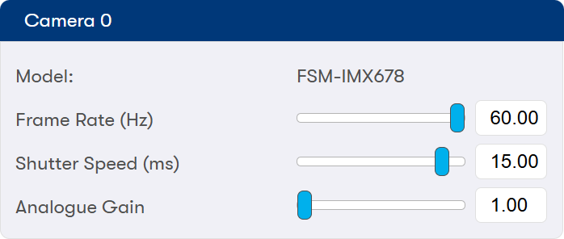
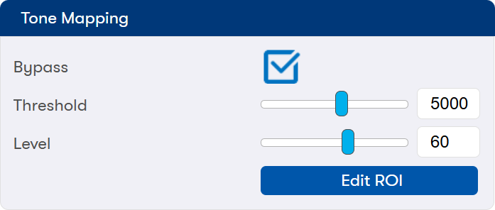
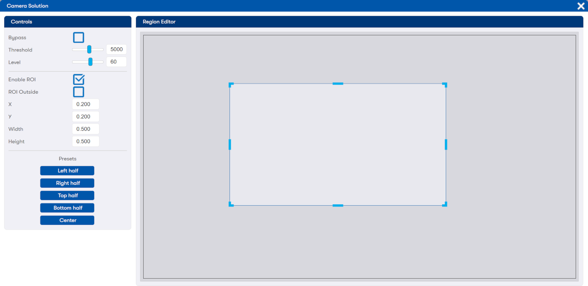

# 4Kp60 Multi-Sensor HDR Camera Solution System Example Design for Agilex™ 5 Devices - Web Graphical User Interface Functional Description

## Running the Graphical User Interface (GUI)

The application software of the design has a web-server GUI that is used to
control and demonstrate various hardware and software features of the Camera
Solution System Example Design. Follow the
[**instructions**](../camera_4k/camera_4k.md#setting-up-the-camera-solution) to
run the GUI on a web browser. The GUI is optimized for displaying the full
screen on a 1920x1080 resolution screen. Press F11 in your browser to go full
screen.
<br/>

The Software Application is flexible in discovering available hardware
components and only drawing the components present in the design on the GUI.
Therefore, some parts of the GUI elements can be missing or different across
different camera solution designs. Also note that there may be slight
variations in the GUI compared to the example images shown in this section.
<br/>


## Connecting to the Demo Application Web GUI

Take note of the Modular Development Kit IP address. This will be displayed on
the HPS console serial port when the demo application starts. Alternatively,
use the following command to list IP addresses:

```
ip a
```

Use a web browser of your choice (such as Chrome) on any device connected to
the same network as the Modular Development Kit. If connecting directly without
a switch or router, the self-assigned IPv6 address can be used, or assign a
[**static IPv4 Address**](./sw-funct-descr.md#using-a-static-ip-address).
<br/>


## Descriptions of the Tabs

This section summarizes the GUI tabs in the Camera Solution System Example
Design.

* [Input Config Tab](#input-config-tab)
* [ISP Pipeline Tab](#isp-pipeline-tab)
* [Output Config Tab](#output-config-tab)
* [Pipeline Statistics Tab](#pipeline-statistics-tab)


<br/>


### Input Config Tab
<br/>

{:style="display:block; margin-left:auto; margin-right:auto"}
<center markdown="1">

**Input Config Tab**
</center>
<br/>

The Input Config Tab controls two separate parts of the application:

* The Input Stage which corresponds to selecting which input to use and the
parameters for those input sources.
* The Control Loops, corresponding to the Auto White Balance and Auto Exposure
functions.
<br/>
<br/>

This section summarizes the GUI controls in the Input Config Tab:

* [Input Select](#input-select)
* [Test Pattern Generator](#test-pattern-generator)
* [Camera Control](#camera-control)
* [Sensor Profile](#sensor-profile)
* [Histogram](#histogram)
* [Auto Exposure](#auto-exposure)
* [Auto White Balance](#auto-white-balance)

<br/>


#### Input Select
<br/>

{:style="display:block; margin-left:auto; margin-right:auto; width: 50%"}
<center markdown="1">

**Input Select**
</center>
<br/>

The Input Source UI controls which input is selected:

* Input TPG corresponds to the
[**Test Pattern Generator (TPG)**](#test-pattern-generator). The TPG RGB output
image is passed through a Remosaic IP to convert it to a Color Filter Array
(CFA) format image (also known as Bayer) that is consistent with the camera
input. It can be used to verify the system without a sensor module.
* Camera N, where N corresponds to the sensor module or modules connected to
the board. The number of sensor modules visible in the dropdown menu depends on
the camera solution design and the number of sensor modules physically
connected to the development board.

<br/>


#### Test Pattern Generator
<br/>

{:style="display:block; margin-left:auto; margin-right:auto; width: 50%"}
<center markdown="1">

**Test Pattern Generator**
</center>
<br/>

The Test Pattern Generator UI allows you to control the Input Test Pattern
Generator operation mode:

* SMPTE standard color bars.
* Solid Color. Use the Color Select dropdown box to set the color from the list
(including standard SMPTE color bar colors, and a mid-level gray).
* Rainbow. Cycles every few seconds the color selection from the Solid Color
mode.

<br/>


#### Camera Control
<br/>

{:style="display:block; margin-left:auto; margin-right:auto; width: 50%"}
<center markdown="1">

**Camera Control - FSM-IMX678 Sensor**
</center>
<br/>

The camera control provides manual exposure controls for the corresponding
imaging sensor. The UI presents a camera control tile for each sensor module
connected to the board. The model field shows the model of the optical sensor
module detected.
<br/>

The Analog Gain slider adjusts the light sensitivity of the sensor, allowing
the image to be brightened or dimmed. However, increasing exposure via analog
gain has a tradeoff of reducing signal-to-noise ratio resulting in a grainier
image.
<br/>

The Frame Rate slider adjusts the sensor frame rate. Reducing the frame rate
gives more time to accumulate time, while increasing it reduces motion blurring
artifacts. For flickering light sources, we recommend setting the frame rate to
an integer multiple or reciprocal integer multiple of the electrical grid
frequency. For example, for 50 Hz grid frequency you may set the frame rate to
50, 25, 12.5 or 6.25 Hz to mitigate flickering.
<br/>

The Shutter Speed slider controls the light integration time of the sensor,
allowing the image to be brightened or dimmed. The maximum shutter speed is
inversely proportional to the frame rate, where a lower frame rate gives more
time for the sensor to integrate more light.
<br/>

We recommend the following flow for manually adjusting the total exposure of a
scene:

* Minimize the analog gain.
* If the image is flickering adjust frame rate to 50 or 60 Hz depending on the
  power line frequency.
* Adjust shutter speed for optimum exposure.
* If the image is underexposed even at maximum shutter speed, do one or both of
  the following, depending on your motion artifact vs. noise preference, until
  satisfied:
  * Reduce the frame rate, halving it if flickering, and further increase the
  shutter speed. This will reduce the responsiveness of the video and increase
  motion artifacts without increasing graininess.
  * Increase the analog gain. This will increase the graininess of the video
  without changing responsiveness.

<br/>


#### Sensor Profile
<br/>

{:style="display:block; margin-left:auto; margin-right:auto; width: 50%"}
<center markdown="1">

**Sensor Profile**
</center>
<br/>

The Import Camera Profile button loads a sensor profile (a JSON format
pre-calibrated sensor settings file) into the application. The application
comes with a default calibration profile preloaded on the microSD card image
for the IMX678 as featured in the Camera Solution System Example Design.
Therefore, is not necessary to load a new profile in normal operation. The
IMX678 profile was produced using the Calibration Tab in the UI, as well as
some offline processes for best-in-class color reproduction. Note that using
the calibration tab requires expert knowledge and is therefore hidden in the UI
by default.

<br/>


#### Histogram
<br/>

{:style="display:block; margin-left:auto; margin-right:auto; width: 50%"}
<center markdown="1">

**Histogram Statistics**
</center>
<br/>

The Histogram Statistics displays the real-time output of the Histogram
Statistics IP. It is intended to be used as a visual aid while adjusting
exposure controls.

<br/>


#### Auto Exposure
<br/>

{:style="display:block; margin-left:auto; margin-right:auto; width: 50%"}
<center markdown="1">

**Auto Exposure Controls**
</center>
<br/>

The Auto Exposure function built into the camera solution demonstration, uses
data from the Histogram Statistics IP to control the sensor analog gain and
shutter speed. When using the ROI, the algorithm will prioritize the region
specified when calculating the exposure.
<br/>

{:style="display:block; margin-left:auto; margin-right:auto"}
<center markdown="1">

**Auto Exposure - Region of Interest Editor**
</center>
<br/>

The Region of Interest (ROI) editor allows you to select a region of the image
to use for the Auto Exposure function. Drag the region with a mouse stretch and
drag the window freely, or enter starting coordinates and the size of the
region manually. Highlighting ROI makes the region visible on the ISP output
as an overlay. Clicking the circular arrow on the tile resets the configuration
to its default values.

<br/>


#### Auto White Balance

The Auto White Balance UI allows control of the Automatic White Balance (AWB)
function built into the camera solution demonstration. It uses the calibration
settings loaded via the Sensor Profile UI.

<br/>

{:style="display:block; margin-left:auto; margin-right:auto; width: 50%"}
<center markdown="1">

**Auto White Balance Controls**
</center>
<br/>

The White Balance control has five modes of operation:

* Disabled. This mode turns off the white balance function by bypassing the
White Balance Correction and Black Level Correction IPs, as well as unlocking
the controls of those IPs in the UI in the
[**ISP Pipeline Tab**](#isp-pipeline-tab). You may then enable those IPs and
manually change their coefficients. This mode also disables the Color
Correction Matrix function by programming it to unity.
* Choose Temperature. This mode lets you enter a color temperature freely using
the Temperature (K) slider. The temperature must be set correctly otherwise
incorrect coefficients will be used causing the image to look incorrect. As a
guide, scenes generally require a color temperature ranging from 4000 to 6500
Kelvin.
* Choose Lighting. This mode operates similarly to the Choose Temperature mode.
However, in this mode Temperature (K) slider is disabled. Instead, you can
choose the lighting conditions from the Lighting dropdown menu. Note that the
real temperature varies among the family of light sources.
* Automatic. Automatic mode turns off all user input and instead uses the White
Balance Statistics IP pre- and post- White Balance Correction to attempt to guess
the scene's color temperature.
* Custom Preset (Spot). This is a one-shot automatic white balance mode which
runs the AWB function for 2 seconds before locking in the temperature. Clicking
the Snapshot button or changing the ROI, resets the mode and triggers another 2
seconds one-shot. This mode is useful where the scene is too colorful. You can
position a gray card or position the camera to focus on a gray or white object
in the scene, and using the ROI to focus in on just that area, snapshot the
temperature to keep it constant for the entire scene.

The Tint Adjustment slider is unlocked across all modes. This control enables
you to adjust the magenta-green color balance when the light source illuminating
the scene is not an ideal black light source following the black body radiation
curve (Planckian locus).
<br/>

The CCM strength slider controls the color vibrancy. A unity value of 1.0 gives
the most accurate color reproduction following the sensor profile. If the light
source is not ideal, then a value of 1.0 might over-saturate some colors, which
requires you to lower it until satisfied. Conversely, you may increase the color
vibrancy for artistic purposes.
<br/>

Automatic and Custom Preset (Spot) modes unlock the ROI editor. The selected
region defines the area over which the White Balance Statistics IP performs its
calculations. Resizing or moving the active region automatically highlights the
region on the ISP output as an overlay for 2 seconds. For mixed scenes with
plenty of gray content, a full-screen statistics gives decent performance. For
mixed scenes, it is beneficial to localize the region of interest onto gray
parts of the image as described above.
<br/>

Clicking the circular arrow on the tile resets the configuration to its default
values.

<br/>


## ISP Pipeline Tab
<br/>

{:style="display:block; margin-left:auto; margin-right:auto"}
<center markdown="1">

**ISP Pipeline Tab**
</center>
<br/>

The ISP Pipeline tab contains the controls corresponding to the core ISP
functions and are summarized as follows:

* [Defective Pixel](#defective-pixel-correction)
* [Adaptive Noise Reduction](#adaptive-noise-reduction)
* [Black Level Correction](#black-level-correction)
* [Vignette Correction](#vignette-correction)
* [White Balance Correction](#white-balance-correction)
* [Demosaic](#demosaic)
* [Unsharp Mask Filter](#unsharp-mask-filter)
* [Color Correction Matrix](#color-correction-matrix)

<br/>


### Defective Pixel Correction
<br/>

{:style="display:block; margin-left:auto; margin-right:auto; width: 50%"}
<center markdown="1">

**Defective Pixel Correction**
</center>
<br/>

The Defective Pixel Correction UI provides controls for bypassing the Defective
Pixel Correction (DPC) IP functionality, and when enabled setting the DPC
strength. The default strength is Very Weak which provides a good balance
between mitigating defective pixels, and preserving details and specular
highlights. Increasing the strength mitigates more defective pixels with a
tradeoff of softening the image.

<br/>


### Adaptive Noise Reduction
<br/>

{:style="display:block; margin-left:auto; margin-right:auto; width: 50%"}
<center markdown="1">

**Adaptive Noise Reduction**
</center>
<br/>

The Adaptive Noise Reduction UI provides controls for bypassing or setting the
strength of the denoising algorithm of the Adaptive Noise Reduction (ANR) IP. A
higher strength provides better denoising with a tradeoff of softening the
image.

Clicking the circular arrow on the tile resets the ANR configuration to its
default values.

<br/>


### Black Level Correction
<br/>

{:style="display:block; margin-left:auto; margin-right:auto; width: 50%"}
<center markdown="1">

**Black Level Correction**
</center>
<br/>

The Black Level Correction UI provides access to low level Black Level
Correction (BLC) IP controls. This tile is locked, displaying live values for
most of the white balance modes in the
[**Auto White Balance Control**](#auto-white-balance) as the settings are
controlled by the Application software. Note that disabling Auto White Balance
to enable manual BLC controls is not implemented by default. This is because
the SW App does not configure the imaging sensor and the MIPI connectivity IPs
to pass the Optical Black Region (OBR) required for processing the black level
statistics in real time. Instead, it uses offline calibrated values.

<br/>


### Vignette Correction
<br/>

{:style="display:block; margin-left:auto; margin-right:auto; width: 50%"}
<center markdown="1">

**Vignette Correction Controls**
</center>
<br/>

Vignette Correction (VC) is used to compensate for non-uniform intensity across
the image caused by the uneven light gathering limitations of the sensor and
optics. The most common non-uniformity is where the center of the lens gathers
more light compared to the outer regions. The VC IP corrects uniformity using a
runtime mesh of pre-calibrated coefficients and interpolating coefficients for
any given pixel.
<br/>

The Vignette Correction UI controls the Vignette Correction (VC) IP and
provides controls for bypassing as well as radial and lens corona correction.
Inverting the functionality allows adding vignetting to the image for artistic
purposes or showcasing the effect. The Radial Vignette slider simulates radial
vignetting as commonly seen on fisheye lenses. Likewise, the Lens Corona
simulates the effects of a strong light source on an imperfect lens, showing as
a bright spot in the center. The Application software translates the controls
into a mesh of coefficients that the VC IP uses.
<br/>

Clicking the circular arrow on the tile resets the configuration to its default
values.

<br/>


### White Balance Correction
<br/>

{:style="display:block; margin-left:auto; margin-right:auto; width: 50%"}
<center markdown="1">

**White Balance Correction Controls**
</center>
<br/>

The White Balance Correction UI provides access to low level White Balance
Correction (WBC) IP controls. This tile is locked, displaying live values for
most of the white balance modes in the
[**Auto White Balance Control**](#auto-white-balance) as the settings are
controlled by the Application software. Disable Auto White Balance to enable
manual WBC controls.
<br/>

Clicking the circular arrow on the tile resets the configuration to its default
values.

<br/>


### Demosaic
<br/>

{:style="display:block; margin-left:auto; margin-right:auto; width: 50%"}
<center markdown="1">

**Demosaic Controls**
</center>
<br/>

The bypass control is the only option in the Demosaic UI controls. In bypass
mode the Demosaic IP generates an RGB monochrome output image by simply
replicating the single color of a given input CFA pixel to all 3 color planes
to generate the given output RGB pixel.

<br/>


### Unsharp Mask Filter
<br/>

{:style="display:block; margin-left:auto; margin-right:auto; width: 50%"}
<center markdown="1">

**Unsharp Mask Filter Controls**
</center>
<br/>

The Unsharp Mask Filter UI controls the strength of the sharpening applied to
the image. Positive strengths will sharpen the image, while negative strengths
will soften the image.
<br/>

Clicking the circular arrow on the tile will reset the configuration of the IP
to its default values.

<br/>


### Color Correction Matrix
<br/>

{:style="display:block; margin-left:auto; margin-right:auto; width: 50%"}
<center markdown="1">

**Color Correction Matrix Control**
</center>
<br/>

The Color Correction Matrix (CCM) UI is an artistic control interface for
tuning the CCM (which is implemented by the Color Space Converter (CSC) IP).
The white balance function of the application software calculates a base CCM
targeting an accurate representation of the scene. The application software
calculates the final CCM based on the control settings on the Color Correction
Matrix UI:

* Hue, Saturation, and Value (Brightness) controls enable transformations in
the HSV color space.
* Enabling color temperature post-processing enables further control for the
color temperature and tint on top of the values set by the white balance
controls.
* Red, Green, Blue Channel Strength sliders enable transformations in the RGB
color space.
* Contrast adjustment and raising image floor change the dynamic range of the
image.

Clicking the circular arrow on the tile of the UI resets the functionality of
these controls to their default values.

<br/>


## Output Config Tab
<br/>

{:style="display:block; margin-left:auto; margin-right:auto"}
<center markdown="1">

**Output Config Tab**
</center>
<br/>

The Output Config tab contains UI controls for IP Cores typically located after
the ISP core pipeline, right up to and including the output.
<br/>
<br/>

This section summarizes the GUI controls in the Output Config Tab:


* [1D LUT and Color Volume Manipulations Controls](#1d-lut-and-color-volume-manipulation-controls)


* [Tone Mapping Operator](#tone-mapping-operator)

* [Warp Engine](#warp)

* [1D LUT](#1d-lut)
* [Logo](#logo)
* [Frame Writer](#frame-writer)
* [Output Source](#output-source)

<br/>


### 1D LUT and Color Volume Manipulation Controls
<br/>

{:style="display:block; margin-left:auto; margin-right:auto; width: 50%"}
<center markdown="1">

**1D LUT – 3D LUT – 3D LUT Control Chain**
</center>
<br/>

The output of the ISP core functions is linear which is not suited for viewing
on a video sink, capturing, or broadcasting. The 1D LUT – 3D LUT – 3D LUT chain
enables fine-grained controls for the color compression and color volume of the
image to better match the end device.
<br/>

An example video pipeline is to compress linear video to the sRGB domain with
the 1D LUT, then change the color volume to better match Hybrid Log Gamma
(HLG); and finally apply an arbitrary color volume manipulation with the final
3D LUT for artistic effects. Note that setting the 1D LUT into Legacy Gamma
OETF mode with a Gamma value of 2.2 approximates a linear to sRGB
transformation.
<br/>

If a complex color transformation is not necessary, then you may use one of the
3D LUTs and keep the other 3D LUT and the 1D LUT in bypass. By default, all IPs
in the chain are in bypass mode. 3D LUT files are not supplied with the Camera
Solution System Example Design.
<br/>

3D LUT IPs can support dual buffer mode to allow 2 LUT tables to be loaded and
switched between. However, for resource utilization reasons, the Camera
Solution System Example Designs only single buffer mode is supported and so the
LUT 2 section of the UI is grayed out.

Note that 3D LUT files are not supplied with the Camera Solution System Example
Design.

<br/>


### Tone Mapping Operator

The Tone Mapping Operator (TMO) UI has controls to bypass the tone mapping and
sliders to adjust the threshold and level. The threshold slider controls the
strength of the tone mapping. The level slider controls the alpha blending
percentage between fully processed TMO output and its original input. The tone
mapping feature can use an ROI which can be adjusted from a pop-up panel.

<br/>

{:style="display:block; margin-left:auto; margin-right:auto; width: 50%"}
<center markdown="1">

**TMO Controls**

<br/>

{:style="display:block; margin-left:auto; margin-right:auto"}
<center markdown="1">

**TMO ROI Editor**
</center>
<br/>

</center>
<br/>


### Warp

The main Warp UI is a popup interface you open by clicking the Show Controls
button in the Warp tile.

<br/>

{:style="display:block; margin-left:auto; margin-right:auto; width: 50%"}
<center markdown="1">

**Warp Controls**
</center>
<br/>

The dialog box that pops up has 3 blue buttons at the center/bottom which
switch between the three warp editing modes: Fixed, Corners and Arbitrary.
<br/>

If any transformations go outside the warp IP's capability, the mesh will
change color from blue to red indicating an invalid configuration. When the
parameterization ranges become valid again, the mesh color will change back to
blue. The Scale View slider zooms out the Mesh Editor which makes it possible
to view transforms that could extend outside the target window. The Show
alignment guide box lets you turn the 16x9 grid of squares on and off.

<br/>

{:style="display:block; margin-left:auto; margin-right:auto"}
<center markdown="1">

**Fixed Warp Controls**
</center>
<br/>

The Fixed Controls panel has high-level controls for specifying a warp mesh
based on various mathematical transforms. Clicking on the 3x3 mesh button on
Fixed Controls title page snapshots the current mesh and changes the warp
editing mode to arbitrary mesh control mode. Clicking the circular arrow next
to it resets the functionality of these controls to their default values.

<br/>

{:style="display:block; margin-left:auto; margin-right:auto"}
<center markdown="1">

**Corner Warp Controls**
</center>
<br/>

Corner Controls mode allows you to drag 4 corners of the transformation mesh
rectangle. There is also a control to apply additional radial distortion.

<br/>

{:style="display:block; margin-left:auto; margin-right:auto"}
<center markdown="1">

**Arbitrary Warp Controls**
</center>
<br/>

The mesh editor in Arbitrary Controls mode lets you manually adjust the mesh
by dragging any control points. The number of control points can be changed
with the slider. The interface also allows you to export and import mesh files
to and from your host device.

<br/>


### 1D LUT
<br/>

{:style="display:block; margin-left:auto; margin-right:auto; width: 50%"}
<center markdown="1">

**1D LUT Control**
</center>
<br/>

The 1D LUT UI allows you to apply a transfer function to the output video image
to match the video sink. You may bypass the functionality or use it in one of
two modes:

* Enable Gamma Layer calculates industry standard OETF, EOTF and OOTF LUTs from
the options provided. The default transfer function is an OETF Gamma Curve
compliant with BT.709 standard.
* Enable Custom Curve allows you to draw a custom transfer function curve using
the Custom Curve Editor popup window. The background histogram allows you to
guide shaping the transfer function, and you have the option of using the full
screen or ROI histograms. You adjust the ROI using the UI pane provided in the
bottom left corner of the popup window. The number of segments allows you to
control more points on the transfer function window. Resetting the curve
changes the curve to a unity transfer function.

Clicking the circular arrow on the title of the UI resets the functionality of
these controls to their default values.

<br/>

{:style="display:block; margin-left:auto; margin-right:auto"}
<center markdown="1">

**Custom Curve Editor**
</center>
<br/>
<br/>


### Logo
<br/>

{:style="display:block; margin-left:auto; margin-right:auto; width: 50%"}
<center markdown="1">

**Logo Control**
</center>
<br/>

The Logo UI controls the position and opacity of the Altera® logo on the
screen. The UI also lets you adjust the location of the logo which can be
positioned in each corner or configured to bounce across the screen. The
opacity slider determines how transparent the Logo is, where 1 is fully opaque
and 0 is fully transparent. The Logo also has a configurable screensaver
function to protect screen burn-in where applicable. If you enable the
screensaver, the screen output will drop to a black background with the logo
bouncing across the screen. Interact with the GUI on your web browser to get
out of the screensaver.

<br/>


### Frame Writer
<br/>

{:style="display:block; margin-left:auto; margin-right:auto; width: 50%"}
<center markdown="1">

**Frame Writer Controls**
</center>
<br/>

The Frame Writer UI allows you to take screenshots of the raw sensor input
image or the final processed output image prior to the final Gamma 1D LUT.
Clicking Raw Camera Snapshot or ISP Output Snapshot, captures a single image
from the input or output of the video pipeline, respectively. The Download
Image button allows you to download a 48-bit MSB-aligned RGB TIFF image to the
device running the Web browser. Just as in Demosaic bypass, the application
software replicates CFA data to the RGB channels when you select raw capture.
<br/>

Note that the output flickers while the image capture is in progress and the
GUI becomes unresponsive for a moment. A popup notification indicates that the
application software has finished the capture process, and that the image is
ready for download.

<br/>


### Output Source
<br/>

{:style="display:block; margin-left:auto; margin-right:auto; width: 50%"}
<center markdown="1">

**Output Source Control**
</center>
<br/>

The Output Source UI controls which output is selected:

* Select the ISP option to output the fully processed final image.
* Select the SMPTE Bars option to output an unprocessed SMPTE color bar image.
This option allows you to test the video connection to the video sink.

<br/>


## Pipeline Statistics Tab
<br/>

{:style="display:block; margin-left:auto; margin-right:auto"}
<center markdown="1">

**Pipeline Statistics Tab**
</center>
<br/>

The Pipeline Statistics Tab contains UI controls to help visualize the
statistics IPs within the ISP pipeline.
<br/>
<br/>

This section summarizes the GUI controls in the Pipeline Statistics Tab:

* [Black Level Statistics](#black-level-statistics)
* [White Balance Statistics](#white-balance-statistics)
* [Histogram Statistics](#histogram-statistics)

<br/>


### Black Level Statistics
<br/>

{:style="display:block; margin-left:auto; margin-right:auto; width: 25%"}
<center markdown="1">

**Black level Statistics**
</center>
<br/>

The Black Level Statistics UI visualizes the black level from the white balance
algorithm. The channels are color-coded so that they match the color channels
of the CFA pattern. Note that the BLS IP remains in bypass in normal operation
and is only used during calibration. The application software shows these
calibrated statistics used by the white balance algorithm.

<br/>


### White Balance Statistics
<br/>

{:style="display:block; margin-left:auto; margin-right:auto; width: 40%"}
<center markdown="1">

**White Balance Statistics**
</center>
<br/>

The White Balance Statistics UI shows a color ratio representation of a
captured scene from the camera input. The scene is split into 7x7 zones and
clicking on a grid square will select and visualize the ratios below.
<br/>

It is important to note that the color grid does not capture luminosity, only
color ratios. Therefore, results in some zones may appear unusual. For example,
dark gray and light gray sections will be indistinguishable.
<br/>

The UI works on a captured scene. You can use the "Update" button to force a
scene capture update.

<br/>


### Histogram Statistics
<br/>

{:style="display:block; margin-left:auto; margin-right:auto"}
<center markdown="1">

**Histogram Statistics**
</center>
<br/>

The Histogram Statistics UI shows a luminosity histogram of the current scene.
The Auto Exposure algorithm uses the histogram statistics in the background as
part of the brightness control function.
<br/>

The histogram automatically updates at a frequency of 1Hz, which you may
disable using the Auto Update checkbox. Read Stats button triggers a manual
update of the histogram.
<br/>

The Histogram Statistics IP calculates two histograms, one for the entire frame
and the other for an ROI. The display mode dropdown box allows you to display
either histogram statistics separately, or overlays them on the UI.
<br/>

Finally, the "Edit ROI" button opens a popup window for adjusting the ROI.

<br/>


<br/>
[Back](../camera_4k/camera_4k.md#documentation){ .md-button }
<br/>


[User flow 1]: ../camera_4k/camera_4k.md#pre-requisites
[User flow 2]: ../camera_4k/flow2-sof-mdt.md
[User flow 3]: ../camera_4k/flow3-rbf-mdt.md


[https://github.com/altera-fpga/agilex-ed-camera]: https://github.com/altera-fpga/agilex-ed-camera
[https://github.com/altera-fpga/modular-design-toolkit]: https://github.com/altera-fpga/modular-design-toolkit
[meta-altera-fpga]: https://github.com/altera-fpga/agilex-ed-camera/tree/rel-25.1/sw/meta-altera-fpga
[meta-altera-fpga-ocs]: https://github.com/altera-fpga/agilex-ed-camera/tree/rel-25.1/sw/meta-altera-fpga-ocs
[meta-vvp-isp-demo]: https://github.com/altera-fpga/agilex-ed-camera/tree/rel-25.1/sw/meta-vvp-isp-demo
[agilex-ed-camera/sw]: https://github.com/altera-fpga/agilex-ed-camera/tree/rel-25.1/sw


[Release Tag]: https://github.com/altera-fpga/agilex-ed-camera/releases/tag/rel-25.1
[https://github.com/altera-fpga/agilex-ed-camera/releases/tag/rel-25.1]: https://github.com/altera-fpga/agilex-ed-camera/releases/tag/rel-25.1
[hps-first-vvp-isp-demo-image-agilex5_mk_a5e065bb32aes1.wic.gz]: https://github.com/altera-fpga/agilex-ed-camera/releases/download/rel-25.1/hps-first-vvp-isp-demo-image-agilex5_mk_a5e065bb32aes1.wic.gz
[fpga-first-vvp-isp-demo-image-agilex5_mk_a5e065bb32aes1.wic.gz]: https://github.com/altera-fpga/agilex-ed-camera/releases/download/rel-25.1/fpga-first-vvp-isp-demo-image-agilex5_mk_a5e065bb32aes1.wic.gz
[fsbl_agilex5_modkit_vvpisp_time_limited.sof]: https://github.com/altera-fpga/agilex-ed-camera/releases/download/rel-25.1/fsbl_agilex5_modkit_vvpisp_time_limited.sof
[top.core.jic]: https://github.com/altera-fpga/agilex-ed-camera/releases/download/rel-25.1/top.core.jic
[top.core.rbf]: https://github.com/altera-fpga/agilex-ed-camera/releases/download/rel-25.1/top.core.rbf
[model_compiler]: https://github.com/altera-fpga/agilex-ed-camera/releases/download/rel-25.1/compile_model.exe


[AGX_5E_Modular_Devkit_ISP_FF_RD.xml]: https://github.com/altera-fpga/agilex-ed-camera/blob/rel-25.1/AGX_5E_Altera_Modular_Dk_ISP_designs/AGX_5E_Modular_Devkit_ISP_FF_RD.xml
[AGX_5E_Modular_Devkit_ISP_RD.xml]: https://github.com/altera-fpga/agilex-ed-camera/blob/rel-25.1/AGX_5E_Altera_Modular_Dk_ISP_designs/AGX_5E_Modular_Devkit_ISP_RD.xml
[Create microSD card image (.wic.gz) using YOCTO/KAS]: https://github.com/altera-fpga/agilex-ed-camera/blob/rel-25.1/sw/README.md
[<g>&check;</g><span hidden="true"> YOCTO/KAS </span>]: https://github.com/altera-fpga/agilex-ed-camera/blob/rel-25.1/sw/README.md

[SOF Modular Design Toolkit (MDT) Flow]: https://github.com/altera-fpga/agilex-ed-camera/blob/rel-25.1/README.md#create-the-design-using-the-modular-design-toolkit-mdt
[RBF Modular Design Toolkit (MDT) Flow]: https://github.com/altera-fpga/agilex-ed-camera/blob/rel-25.1/README.md#create-the-design-using-the-modular-design-toolkit-mdt
[<g>&check;</g><span hidden="true"> SOF MDT Flow </span>]: https://github.com/altera-fpga/agilex-ed-camera/blob/rel-25.1/README.md#create-the-design-using-the-modular-design-toolkit-mdt
[<g>&check;</g><span hidden="true"> RBF MDT Flow </span>]: https://github.com/altera-fpga/agilex-ed-camera/blob/rel-25.1/README.md#create-the-design-using-the-modular-design-toolkit-mdt

