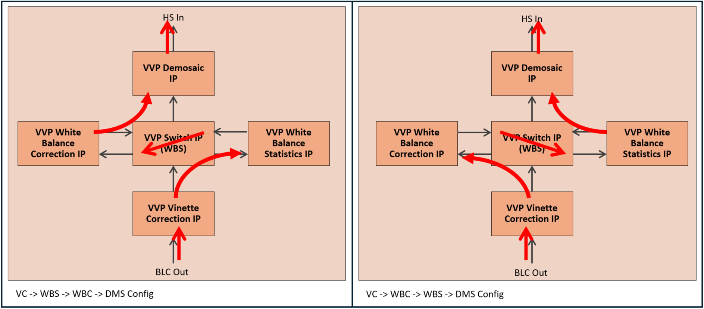

# 4Kp30 Multi-Sensor Camera with AI Inference Solution System Example Design for Agilex™ 5 Devices - Hardware Design Functional Description

The hardware design for the 4Kp30 Multi-Sensor Camera with AI Inference
Solution System Example Design uses the Modular Design Toolkit (MDT). The MDT
is a method of creating and building Platform Designer (PD) based Quartus®
projects from a single `.xml` file.

The main advantages of using MDT are:

* Enforces a hierarchical design approach (single level deep).
* Encourages design reuse through a library of off-the-shelf subsystems.
* Enables simple porting of designs to different development boards and FPGA
  devices.
* Provides consistent folder structure and helper scripts.
* Uses TCL scripting for the PD Quartus® project.
 
 

## MDT Overview

The MDT flow consists of 2 separate main steps; a create step and a build step.

The create step:

* Parses the design `.xml` file.
* Creates a Quartus® project.
* Creates a PD system for the project.
* Copies all the project files and adds all the MDT generated files to the Quartus® project.
 
 

The build step:

* Generates the Offset Capability Structure (OCS) ROM (detailed later).
* Compiles all the Nios® V Software into `.hex` files.
* Runs the Quartus® compilation flow.
* Post processes `.sof` files.
 
 

The following top level block diagram shows the main components and subsystems
for the Camera Solution System Example Design hardware.
 
 

{:style="display:block; margin-left:auto; margin-right:auto"}

**Top Level Hardware Block Diagram**

 

* The Board and Clock subsystems contain IP related to the Modular Development
  Kit Carrier and SOM Board resources, such as buttons, switches, LEDs,
  reference clocks, and resets. They also forward the resources to the other
  subsystems.
* The HPS subsystem is an instance of the Agilex™ 5 HPS (Hard Processor System)
  which runs all the Linux software for the Camera Solution System Example
  Design. The subsystem includes an EMIF (External Memory Interface) for the
  HPS DDR4 SDRAM on the Modular Development Kit SOM Board and bridges out to
  the FPGA fabric for integration with other subsystems.

  In addition, it also
  instances the Modular Scatter-Gather Direct Memory Access IP (mSGDMA) for
  memory to memory copy offload.

* The OCS subsystem (readable by the Software Application) is a ROM describing
  the IP (and its capabilities) within the Camera Solution System Example
  Design. Capabilities include the IPs address offset within the system memory
  map allowing the software to auto discover the IP during boot. The main
  advantage of using the OCS is that Hardware (FPGA RTL) and Software can be
  co-developed in parallel without the need to continuously update the system
  memory map.
* MIPI_In, ISP_In, ISP, and VID_Out subsystems are the IP related to camera
  image ingress and Image Signal Processing (ISP). The MIPI_In subsystem
  includes the D-PHY for interfacing the Framos MIPI connectors on the Modular
  Development Kit Carrier Board to the FPGA.

* ISP AI, AI, and AI Nios® V subsystems are IP relating to the AI inference
  functions.
* The EMIF subsystems are used for buffering image data and AI inference data,
  and includes EMIFs for the FPGA DDR4 SDRAMs on the Modular Development Kit
  SOM Board.

* The DP_Tx and DP Nios® V subsystems are related to the DisplayPort (DP)
  output. The Nios® V is used to control the DP IP and along with some glue
  logic provides multi-rate support. The DP_Tx subsystem includes the DP Tx IP.
* The top level includes the FPGA pins and other logic such as the DP Tx Phy to
  drive the DP Tx connector on the Modular Development Kit Carrier Board.
 
 

The MDT flow describes the top level hardware block diagram using an `.xml`
source file. The `.xml` directly relates to the MDT generated PD Quartus®
project. Using the color-coding shown in the Top Level Hardware Block Diagram,
the following diagram illustrates an example of how some of the blocks would
relate to the MDT `.xml` source file and the MDT generated PD Quartus® project:
 
 

{:style="display:block; margin-left:auto; margin-right:auto"}

**An Example of a MDT PD Quartus® Project from the MDT `.xml` source file**

 

The `.xml` also defines:

* The name of the overall project.
* The target development board.
* The target FPGA device.
* The QPDS version to use.
* Global PD parameters (for example Pixels In Parallel, Bits Per Symbol, etc.).
* Non-PD subsystems (like the Top level).
 
 

## Quartus® Project

The MDT PD Quartus® project and its subsystems for the Camera Solution System

Example Design (as instantiated from the [AGX_5E_Modular_Devkit_ISP_AI_RD.xml]

file) are described in greater detail below.
 
 

{:style="display:block; margin-left:auto; margin-right:auto"}

**Camera Solution System Example Design Quartus® Project**

 

MDT PD subsystems:

* [Board Subsystem](#board-subsystem)
* [Clock Subsystem](#clock-subsystem)
* [HPS Subsystem](#hps-subsystem)
* [OCS Subsystem](#ocs-subsystem)
* [MIPI_In Subsystem](#mipi_in-subsystem)
* [ISP_In Subsystem](#isp_in-subsystem)
* [ISP Subsystem](#isp-subsystem)

* [ISP AI Subsystem](#isp-ai-subsystem)
* [AI Subsystem](#ai-subsystem)
* [AI Nios® V Subsystem](#ai-nios-v-subsystem)

* [EMIF Subsystems](#emif-subsystems)
* [VID_Out Subsystem](#vid_out-subsystem)
* [DP Nios® V Subsystem](#dp-nios-v-subsystem)
* [DP_Tx Subsystem](#dp_tx-subsystem)
 
 

### **Board Subsystem**

The Board subsystem contains IP related to the Modular Development Kit
resources such as buttons, switches, and LEDs. The Board subsystem is part of
the MDT common subsystems and the Camera Solution System Example Design does
not necessarily use all the IP.
 
 

{:style="display:block; margin-left:auto; margin-right:auto"}

**Board Subsystem**

 

The Board subsystem also includes `.qsf` and `.sdc` files relating to the IO
assignments and timing constraints, as well as non-QPDS IP such as a reset
module needed for correct functionality.
 
 

### **Clock Subsystem**

The Clock subsystem contains IP related to the Modular Development Kit Carrier
and SOM Board reference clocks and resets, reset pulse extenders, PLLs for
system clock generation, and system reset synchronizers. The Clock subsystem is
part of the MDT common subsystems.
 
 

{:style="display:block; margin-left:auto; margin-right:auto"}

**Clock Subsystem**

 

The clocks and corresponding resets are distributed to the other subsystems and
are detailed in the following table (note that not all of the clocks are
necessarily used in this variant of the Camera Solution System Example Design):
 
 

**Clocks and Resets**

| Clock/Reset | Frequency | Description |
| ---- | ---- | ---- |
| Ref | 100MHz | Board Input Reference (and DP Nios® V CPU interface) Clock |
| 0 | 297MHz | Video and FPGA AI Suite IP Core Clock |
| 1 | 148.5MHz | Half-rate Video Clock |
| 2 | 200MHz | IP agent (HPS and TMO Nios® V CPU interface) Clock |
| 3 | 16MHz | DP Management (DP CPU interface) Clock |
| 4 | 50MHz | EMIF Calibration Clock |

 

The Clock subsystem also includes non-QPDS IP, such as a reset extender,
needed for correct functionality.
 
 

### **HPS Subsystem**

The HPS subsystem (Hard Processor System) is mainly an instance of the “Hard
Processor System Agilex™ (or other) FPGA IP” and is generally configured
consistently with the GSRD:
[Agilex™ 5 E-Series Modular Development Board GSRD User Guide (25.1)]. However,
some modifications have been made, for example to increase the number of I2C
Masters. Likewise, some IP is not required for this variant of the Camera
Solution System Example Design. The HPS boots a custom version of Linux based
on Yocto to drive the Camera Solution System Example Design.
 
 

{:style="display:block; margin-left:auto; margin-right:auto"}

**HPS Subsystem**

 
 

{:style="display:block; margin-left:auto; margin-right:auto; width: 80%"}

**HPS Subsystem Block Diagram**

 

Internally the basic HPS subsystem is composed of the HPS, EMIF for external
8GB HPS DDR4 SDRAM (available on the Modular Development Kit SOM Board), and
the full HPS to FPGA interface bridge. The HPS to FPGA bridge allows the
Software App to read and write IP registers, and IP memory tables to control
the Camera Solution System Example Design. In addition, the HPS also contains
the mSGDMA IP (Modular Scatter-Gather Direct Memory Access). This IP has access
to the FPGA DDR4 SDRAM and can is used to offload memory copy functions between
the HPS and FPGA DDR4 SDRAM. The HPS subsystem to FPGA memory map is detailed
in the following table:
 
 

**HPS Subsystem to FPGA Memory Map**

| Address Start | Address End | Subsystem | Description |
| ---- | ---- | ---- | ---- |
| 0x4000_0000 | 0x4000_3FFF | OCS | Offset Capability Structure subsystem IP |
| 0x4020_0000 | 0x4027_FFFF | ISP | ISP subsystem IP |
| 0x4030_0000 | 0x4030_0FFF | ISP_In | ISP Input subsystem IP |
| 0x4040_0000 | 0x4040_3FFF | MIPI_In | MIPI Input subsystem IP |
| 0x4050_0000 | 0x4050_0FFF | Vid_Out | Video Output subsystem IP |
| 0x4060_0000 | 0x4060_0FFF | ISP_AI | ISP AI subsystem IP |
| 0x4070_0000 | 0x4070_7FFF | AI | FPGA AI Suite subsystem IP |
| 0x4080_0000 | 0x4080_001F | HPS mSGDMA | mSGDMA CSR |
| 0x4080_0020 | 0x4080_003F | HPS mSGDMA | mSGDMA Descriptor |

 

The mSGDMA memory map is detailed in the following table:

 
 

**mSGDMA Memory Map**

| Address Start | Address End | Subsystem | Description |
| ---- | ---- | ---- | ---- |
| 0x0000_0000_0000 | 0x0000_7FFF_FFFF | Reserved | Reserved |
| 0x0000_8000_0000 | 0x0000_0009_FFFF | HPS DDR4 SDRAM | Lower 2GB of the HPS Physical RAM |
| 0x0000_A000_0000 | 0x0008_7FFF_FFFF | Reserved | Reserved |
| 0x0008_8000_0000 | 0x0009_FFFF_FFFF | HPS DDR4 SDRAM | Upper 6GB of the HPS Physical RAM |
| 0x000A_0000_0000 | 0x000F_FFFF_FFFF | Reserved | Reserved |
| 0x0010_0000_0000 | 0x0011_FFFF_FFFF | FPGA DDR4 SDRAM 1 | 8GB FPGA DDR4 SDRAM 1 |
| 0x0012_0000_0000 | 0x001F_FFFF_FFFF | - | Unused |

 

The HPS subsystem includes a `.qsf` file relating to the HPS IO assignments.
 
 

### **OCS Subsystem**

The OCS subsystem (Offset Capability Structure) provides a method to allow
the HPS software to self-discover all the IP within the project that it can
interact with.
 
 

{:style="display:block; margin-left:auto; margin-right:auto"}

**OCS Subsystem**

 

All VVP IP contain an OCS entry in the form of:

* Type - A unique identifier for the IP.
* Version - The IP version.
* ID Component - Instance number of the IP.
* Base - Base address of the IP register map.
* Size - Size of the IP Register map.
 
 

OCS entries are stored within the OCS IP inside a ROM. The IP itself can
contain any number of ROMs which are linked together within the IP with the
first ROM always being at a base address offset of 0x0. The Software App is
programmed to always assume that the OCS IP is the first IP on the HPS to FPGA
(hps2fpga) bridge (at a base address offset of 0x0) facilitating the auto
discovery process.
 
 

ROMs can be automatic or manually populated. The MDT flow uses a TCL script
during the build step to search for all the IP within the PD project,
extracting the OCS entry information, and building the automatic ROM. Manually
populated ROMs are used for IP that do not have an OCS entry. Typically, these
are non-VVP IP such as the Address Span Extender for example. An OCS
Modification subsystem is used to specify the manual ROM which MDT builds
during the create step. Note this does not create an additional PD subsystem as
it simply modifies the OCS subsystem. The Camera Solution System Example Design
contains an automatic and a manual ROM. Upon boot, the Software App reads the
entries from the ROMs to determine where the IP is; the driver version to load;
and how it should be used (using its instance number).
 
 

### **MIPI_In Subsystem**

The MIPI_In subsystem is used to ingress 12-bit RAW format 4Kp60 camera

sensor data from 2 Framos MIPI inputs. It is a common subsystem used in
different Camera Solution System Example Designs.

 
 

{:style="display:block; margin-left:auto; margin-right:auto"}

**MIPI_In Subsystem**

 
 

{:style="display:block; margin-left:auto; margin-right:auto; width: 95%"}

**MIPI_In Subsystem Block Diagram**

 

The MIPI_In subsystem consists of a MIPI D-Phy IP configured to support 2
input links - one each for the 2 Framos MIPI sensor inputs. Each link is
configured for x4 MIPI lanes @1768 Mbps per lane providing enough bandwidth for
4Kp60 processing with 12-bit RAW format data.
 
 

The MIPI D-Phy outputs data using a pair of 16-bit PHY Protocol Interfaces
(PPI) - one per sensor. Each PPI connects natively to a MIPI CSI-2 IP which
decodes the RAW12 format MIPI packets and outputs VVP AXI4-S format packets.
Each MIPI CSI-2 IP outputs a VVP AXI4-S Full streaming interface using 4 PIP
(Pixels in Parallel) at 297MHz. This rate was chosen to allow for any bursty
data coming from the sensor and because no real AXI4-S back pressure can be
applied (the sensor cannot be stalled).
 
 

The MIPI CSI-2 output interfaces each pass through a VVP Monitor IP to
determine if a sensor is on and passing the expected image data. VVP Protocol
Converter IPs are then used on each interface to change the protocol from VVP
AXI4-S Full to VVP AXI4-S Lite. Since the FPGA AI Suite IP resource has been
limited to achieve a maximum inference rate of 30 FPS, the sensors are
programmed to output just 30 FPS. A VVP PIP Converter IP hangs off each
interface to buffer and convert the image data from 4 PIP down to 1 PIP at
297MHz (enough bandwidth for 4Kp30 processing). The buffer in the PIP
Converter means that the MIPI CSI-2 IP Rx buffer is kept to a minimum to
minimize resource usage.
 
 

The MIPI_In subsystem also includes Input and Output PIO IPs which are used
to provide control and status for the Software App. Control and status can be
connected to external FPGA I/O, like control for the additional master, slave,
and sync sensor signals on the Framos connectors on the Modular Development Kit
Carrier Board. Equally though, control and status can exist within the FPGA,
like status for FPGA build specific capabilities such as a build timestamp,
frame rate and multi-sensor support, development board target, etc. These are
all Camera Solution System Example Design dependent and therefore may be used
in part or not at all.
 
 

The HPS subsystem to MIPI_In subsystem memory map is detailed in the
following table:
 
 

**HPS Subsystem to MIPI_In Subsystem Memory Map**

| Address Start | Address End | Module | Description |
| ---- | ---- | ---- | ---- |
| 0x4040_0000 | 0x4040_0FFF | MIPI DPHY IP | MIPI D-Phy |
| 0x4040_1000 | 0x4040_100F | PIO IP | Input PIO (inst 0) |
| 0x4040_1010 | 0x4040_101F | PIO IP | Input PIO (inst 1) |
| 0x4040_1200 | 0x4040_12FF | Reserved | Reserved |
| 0x4040_1400 | 0x4040_14FF | Reserved | Reserved |
| 0x4040_1600 | 0x4040_17FF | VVP PIP Converter IP | Pixels In Parallel Converter (inst 0) |
| 0x4040_1800 | 0x4040_19FF | VVP PIP Converter IP | Pixels In Parallel Converter (inst 1) |
| 0x4040_1A00 | 0x4040_1BFF | VVP Monitor IP | Snoop (inst 0) |
| 0x4040_1C00 | 0x4040_1DFF | VVP Monitor IP | Snoop (inst 1) |
| 0x4040_2000 | 0x4040_2FFF | MIPI CSI-2 IP | MIPI CSI-2 - via Clock Crossing Bridge (inst 0) |
| 0x4040_3000 | 0x4040_3FFF | MIPI CSI-2 IP | MIPI CSI-2 - via Clock Crossing Bridge (inst 1) |

 

The MIPI_In subsystem includes `.qsf` and `.sdc` files relating to the IO
assignments and timing constraints required for the design.
 
 

### **ISP_In Subsystem**

The ISP_In subsystem is used to provide the input into the ISP subsystem.
 
 

{:style="display:block; margin-left:auto; margin-right:auto"}

**ISP_In Subsystem**

 
 

{:style="display:block; margin-left:auto; margin-right:auto; width: 70%"}

**ISP_In Subsystem Block Diagram**

 

The ISP_In subsystem consists of a VVP Test Pattern Generator (TPG) IP, a
non-QPDS Remosaic (RMS) IP, and a VVP Switch IP to switch between the 3 input
sources. Switching, when activated in the Software App, always occurs at the
end of an active video line. Therefore, software must guard against switching
to camera sources that are not active to avoid lock-up. The VVP Monitor IP
within the MIPI_In subsystem should be used.
 
 

The first input into the switch comes from the VVP TPG IP path. The TPG is
configured to support color bars and solid color output patterns which can be
selected by the Software App. However, the TPG only outputs an RGB (Red, Green,
Blue) image. And since the ISP operates on a Color Filter Array (CFA) image
(sometimes known as a Color Filter Mosaic or Bayer image), a conversion is
required. The RMS IP performs this conversion, allowing a programmable CFA
phase to be applied to the TPG RGB output image to create a CFA image. The TPG
path is used for system testing with or without sensors.
 
 

The second and third inputs into the switch come from the 2 outputs of the
MIPI_In subsystem.
 
 

The HPS subsystem to ISP_In subsystem memory map is detailed in the
following table:
 
 

**HPS Subsystem to ISP_In Subsystem Memory Map**

| Address Start | Address End | Module | Description |
| ---- | ---- | ---- | ---- |
| 0x4030_0400 | 0x4030_05FF | VVP TPG IP | RGB Test Pattern Generator |
| 0x4030_0600 | 0x4030_06FF | Remosaic IP | Remosaic (RGB to Bayer conversion) |
| 0x4030_0800 | 0x4030_09FF | VVP Switch IP | Bayer Switch |

 

### **ISP Subsystem**

The ISP subsystem is the main image processing pipeline. Reference should be
made to the [ISP Functional Description.](./isp-funct-descr.md) when
reading this section in order to understand the exact IP function.

 
 

{:style="display:block; margin-left:auto; margin-right:auto"}

**ISP Subsystem**

 
 

{:style="display:block; margin-left:auto; margin-right:auto"}

**ISP Subsystem Block Diagram**

 

The input into the ISP is a Color Filter Array (CFA) image from the
ISP_In subsystem. For simplicity, the main block diagram doesn't show all the
IP within the ISP subsystem - just the main processing ISP.
 
 

The first ISP IP is the VVP Black Level Statistics (BLS) IP. This IP is used to
obtain statistics relating to the Optical Black Region (OBR) of the image
sensor - typically a shielded area within the sensor. The BLS is used to
continually set the coefficients for the VVP Black Level Correction (BLC) IP as
the black level can change, for example with temperature. However, the IMX 678
used in the Camera Solution System Example Design does not allow access to the
OBR and as such the BLS isn't used in normal operation. However, it is used
during calibration where the sensor lens can be covered to provide a black
level reading. Although not as accurate as continuous reading, it does
nonetheless provide a pretty good black level reading.
 
 

As with all VVP ISP Statistics IP. the BLS IP passes input image data to the
output untouched.
 
 

The output from BLS feeds into the VVP Clipper IP. The clipper is used to
remove the OBR from the image. However, since the OBR is not available for the
IMX 678, the input image simply passes through the clipper untouched.
 
 

Not shown in the main block diagram is the Raw Capture VVP Switch IP. It takes
the clipper output and under Software control, can direct the image data to the
Capture VVP Switch IP via a VVP Color Plane Manager (CPM) IP. The CPM is used
to replicate the CFA color of a given input pixel into all 3 RGB components of
a given output pixel, therefore producing a monochrome RGB image from the CFA
raw image. The Capture Switch, under Software control, can direct either the
raw image or the output image (ISP post processed output from the Gamma 1D LUT
IP) to the VVP Frame Writer (VFW) IP. The Frame Writer uses a frame buffer
within a 2GB area of the external 8GB FPGA DDR4 SDRAM (only the first 2GB of
the DDR4 SDRAM is used in the Camera Solution System Example Design). It
interfaces to an Address Span Extender which provides the 2GB window into the
EMIF. The Software App can access the buffer for downloading the captured
images.
 
 

{:style="display:block; margin-left:auto; margin-right:auto"}

**ISP Subsystem Capture Switch Configuration Block Diagram**

 

The Capture block is reused from another Camera Solution System Example Design where

Switches are required due to the limited EMIF performance for the FPGA speed
grade Device fitted to the Modular Development Kit SOM Board which cannot
support an uninterrupted 4Kp60 pipeline and 4K capture to a single FPGA DDR4
SDRAM. Raw capture temporarily switches off the input pipeline while output
capture temporarily switches off the output pipeline. The DP output can flicker
or go blank during the captures. The Capture feature is intended for debug.
 
 

The VVP Defective Pixel Correction (DPC) IP takes the output of clipper. The
function of the DPC is to effectively remove defective pixels from the sensor
image. Defective pixels manifests themselves as drastically different intensity
to their neighboring pixels.
 
 

The DPC feeds the VVP Adaptive Noise Reduction IP (ANR). ANR is an
edge-preserving smoothing filter that mainly reduces the independent pixel noise
of an image. It is configured with a 17x17 kernel size and was chosen to
maximize functionality with a sensible resource utilization footprint.
 
 

VVP Black Level Correction (BLC) IP comes next in the processing pipeline.
Based on the BLS results, the image black level can be compensated for by
firstly subtracting a pedestal value before scaling the result back to the full
dynamic range.
 
 

BLC feeds the VVP Vignette Correction (VC) IP. VC is used to compensate for
non-uniform intensity across the image, often caused by uneven light-gathering
of the sensor and optics. The compensation is achieved using a mesh of
coefficient scalers for each color plane and interpolating values between them
for any given pixel. The mesh coefficient generation is done using a
calibration process often with a white non-reflective image from the sensor.
Darker and lighter areas of the image can then be compensated for by boosting
or reducing pixel color values.
 
 

The next stage in the processing pipeline is the White Balance correction. Both
the VVP White Balance Statistics (WBS) IP and VVP White Balance Correction
(WBC) IP are used to eliminate color casts which occur due to lighting
conditions or difference in the light sensitivity of pixels of different color.
The WBS IP collects statistics relating to the red-green and blue-green ratios
within a region of interest (ROI). The Software App uses the WBS results to set
individual color scalers within the WBC IP to alter the balance between the
colors, therefore ensuring that whites really look white, and grays really look
gray without unwanted color tinting. In the Camera Solution System Example
Design, and not shown in the main block diagram, a WBS VVP Switch IP sits
in-line between the VC IP and the VVP Demosaic (DMS) IP. Both the WBS and WBC
are fully connected to the WBS Switch. The Software App allows WBS to come
before or after WBC in the processing pipeline.
 
 

{:style="display:block; margin-left:auto; margin-right:auto; width: 80%"}

**ISP Subsystem White Balance Switch Configuration Block Diagram**

 

The Software App Auto-White Balance algorithm (AWB) (as used in the Camera
Solution System Example Design), switches continuously between the
configurations during normal operation to continually adjust the white balance.
 
 

VVP Demosaic (DMS) IP is the final processing IP in the CFA image data domain.
It is a color reconstructing IP and converts the CFA image into an RGB image.
The DMS interpolates missing colors for each pixel based on its neighboring
pixels.
 
 

The RGB image from DMS feeds into the VVP Histogram Statistics (HS) IP. This IP
produces light intensity histograms for both the entire image and a ROI. The
HPS Auto-Exposure algorithm (AE) uses the histograms to adjust the sensor's
exposure settings such as shutter speed and analog gain.
 
 

The Color Correction Matrix (CCM) is primarily used to correct undesired color
bleeding across color channels in the sensor, which is mainly caused by pixels
being sensitive to color spectrums other than their own intended color. The
functionality is provided by a VVP Color Space Converter (CSC) IP which is used
to multiply the input RGB values with a 3x3 CCM to produce the corrected output
RGB values. The CCM can also be used to provide many artistic effects.
 
 

To facilitate conversions between different color spaces and dynamic ranges, or
to simply apply artistic effects, the Camera Solution System Example Design

contains a VVP 3D LUT IP. The 3D LUT IP is configured for 12-bit input/output
with a LUT size of 17 cubed and 12-bit color depth. The LUT can be placed in
bypass mode when not required.

 
 

The VVP TMO IP implements a ROI based tone mapping algorithm to improve the
visibility of latent image detail across areas of the image. The IP feeds into
a VVP Pixel Adapter IP to reduce the output to 10-bits to match the maximum
color depth of the VVP Unsharp Mask (USM) IP.
 
 

The USM applies a sharpening algorithm to the input image by implementing an
unsharp mask. The input image passes through a low pass blur filter to create a
blurred image which is subtracted from the original input image to create a
high frequency component. This component is scaled using a positive (sharpen)
or negative (soften) strength value which is then multiplied against the

original input image before being output to the
[ISP AI Subsystem](#isp-ai-subsystem).

 
 

The output of [ISP AI Subsystem](#isp-ai-subsystem) feeds into the VVP Mixer IP
on 2 separate layers. layer 1 is the ISP output and layer 2 is the inference
results overlay. The mixer uses a VVP TPG IP to provide a 4K solid black base
layer (layer 0) for the ISP output to be overlaid onto. This can be useful when
the ISP output is of a smaller resolution than the connected monitor as it can
be "framed" over the TPG background. In addition, the TPG is also configured to
support color bars, which the Software App can use for system testing, even
with no ISP output. The inference results overlay on layer 2 has a per pixel
alpha blend allowing the opacity of each pixel to be controlled by the Software
App. The mixer also has an additional layer (layer 3) for the Altera® logo
overlay. The opacity of this layer can be controlled on a global basis by the
Software App.
 
 

The mixer output feeds into the Gamma LUT - a VVP 1D LUT IP. The Gamma LUT is
used to implement input to output transfer functions (such as Opto-Optical
Transfer Function (OOTF), Opto-Electrical Transfer Function (OETF), and
Electrical-Optical Transfer Function (EOTF)) for video standards and
traditional gamma compression and decompression, as well as High Dynamic Range
Perceptual Quantizer (HDR PQ) and Hybrid Log-Gamma (HDR HLG) correction. The 1D
LUT is configured as a 9-bit LUT with a 10-bit input and 12-bit output to
support the output capture functionality via the Capture Switch. (The Switch
only supports a single color depth configuration and therefore is configured
for 12-bit as this is the value used by the Raw Capture pipeline). A VVP Pixel
Adapter IP is used to convert the output back to 10-bits.
 
 

To support multi-rate output, an additional VVP Switch IP is used, along with a
pair of VVP Scaler IPs. When the output is 4K, the Software App uses the Switch
to pass the input to the output untouched and onwards to the VID_Out subsystem.
When 1080p or 720p output is required, the Software App uses the Switch to pass
the input through the H Scaler and then the V Scaler before passing it onwards.
Using a Switch and a pair of Scalers saves memory resource over a Scaler that
supports 4K pass-through.
 
 

The HPS subsystem to ISP subsystem memory map is detailed in the following
table:
 
 

**HPS Subsystem to ISP Subsystem Memory Map**

| Address Start | Address End | Module | Description |
| ---- | ---- | ---- | ---- |
| 0x4020_0000 | 0x4020_7FFF | reserved | reserved |
| 0x4020_8000 | 0x4020_81FF | VVP Switch IP | Switch Out (inst 6) |
| 0x4020_8200 | 0x4020_83FF | VVP 3D-LUT IP | 3D LUT (inst 1) |
| 0x4020_8400 | 0x4020_87FF | VVP Mixer IP | Mixer |
| 0x4020_8800 | 0x4020_89FF | VVP TPG IP | Test Pattern Generator |
| 0x4020_8A00 | 0x4020_8BFF | VVP BLC IP | Black Level Correction |
| 0x4020_8C00 | 0x4020_8DFF | VVP DPC IP | Defective Pixel Correction |
| 0x4020_8E00 | 0x4020_8FFF | VVP Clipper IP | Clipper |
| 0x4020_9000 | 0x4020_91FF | VVP TMO IP | Tone Mapping Operator |
| 0x4020_9200 | 0x4020_93FF | VVP DMS IP | Demosaic |
| 0x4020_9400 | 0x4020_95FF | VVP WBC IP | White Balance Correction |
| 0x4020_9600 | 0x4020_97FF | VVP BLS IP | Black Level Statistics |
| 0x4020_9800 | 0x4020_99FF | VVP USM IP | Un-Sharp Mask Filter |
| 0x4020_9A00 | 0x4020_9BFF | reserved | reserved |
| 0x4020_9C00 | 0x4020_9DFF | VVP CSC IP | Color Correction Matrix |
| 0x4020_A000 | 0x4020_A3FF | VVP Scaler IP | V Down Scaler |
| 0x4020_B000 | 0x4020_BFFF | VVP HS IP | Histogram Statistics |
| 0x4020_C000 | 0x4020_CFFF | VVP WBS IP | White Balance Statistics |
| 0x4020_D000 | 0x4020_D1FF | VVP Switch IP | White Balance Switch (inst 3) |
| 0x4020_D200 | 0x4020_D3FF | VVP Switch IP | Raw Capture Switch (inst 4) |
| 0x4020_D400 | 0x4020_D5FF | VVP VFW IP | Frame Writer |
| 0x4020_D800 | 0x4020_D9FF | VVP Switch IP | Capture Switch (inst 5) |
| 0x4020_DA00 | 0x4020_DBFF | VVP CPM IP | Color Plane Manager |
| 0x4020_DC00 | 0x4020_DEFF | VVP Scaler IP | H Down Scaler |
| 0x4020_E000 | 0x4020_FFFF | VVP 1D-LUT IP | 1D LUT for Gamma correction (inst 0) |
| 0x4021_0000 | 0x4021_3FFF | VVP ANR IP | Adaptive Noise Reduction |
| 0x4022_0000 | 0x4022_FFFF | reserved | reserved |
| 0x4024_0000 | 0x4027_FFFF | VVP VC IP | Vignette Correction |

 

The ISP subsystem also includes some additional processing scripts to allow
the 3D LUT to be preloaded with a cube file and built into the FPGA.
 
 

### **ISP AI Subsystem**

The ISP AI subsystem provides the main image processing functions for the AI
function within the Camera Solution System Example Design. It consists of a
full resolution image path in and out of one FPGA DDR4 SDRAM, a low resolution
image path into the other FPGA DDR4 SDRAM, and an inference results overlay
image path also from the other FPGA DDR4 SDRAM. Using 2 FPGA DDR4 SDRAMs give
the best possible performance for the Camera Solution System Example Design.
Reference should be made to the
[ISP AI Functional Description.](../camera_4k_ai/isp-ai-funct-descr.md) when reading this
section in order to understand the exact IP function.
 
 

{:style="display:block; margin-left:auto; margin-right:auto"}

**ISP AI Subsystem**

 
 

{:style="display:block; margin-left:auto; margin-right:auto"}

**ISP AI Subsystem Block Diagram**

 

A VVP Broadcaster IP takes the USM ISP output and passes it to 2 pipelines.

The first pipeline is the full resolution image path. VVP Frame Writer and
Frame Reader IPs are used to buffer the image in one of the external FPGA DDR4
SDRAMs. The image stays in the buffer for a delay that matches the inference
rate of the AI function, and is controlled by Software Stream Controller that
runs in the [AI Nios® V Subsystem](#ai-nios-v-subsystem). The IPs interface to
Address Span Extenders which provides a 2GB window into the EMIF. Note that
only the first 2GB of the DDR4 SDRAM is used in the Camera Solution System
Example Design. The full resolution image path outputs to the Mixer in the
[ISP Subsystem](#isp-subsystem).

The second pipeline is the low resolution image path that supplies image data
in the correct format for the FPGA AI Suite IP. To achieve this, a VVP Scaler
IP is first used to reduce the 4K input image size. Next is a non-QPDS IP
called Layout Transform. This vectorizes the image data into the format
supported by the FPGA AI Suite IP. Finally, a VVP Frame Writer IP is used to
store the image into the other external FPGA DDR4 SDRAM for the FPGA AI Suite
IP (which also interfaces to the same FPGA DDR4 SDRAM). Storing into a buffer
allows the Software Stream Controller to drop complete input frames if the
inference rate is unable to keep up. The Frame Writer IP interfaces to an
Address Span Extender which provides a 2GB window into the EMIF.

When an inference is completed, the Software App reads the result from the
appropriate external FPGA DDR4 SDRAM, processes it, and generates a 960x540
(quarter HD) sized ARGB2222 (8-bit per pixel with 2-bits for each color plane -
Alpha, Red, Green, and Blue) inference results overlay image, that is copied
into the same external FPGA DDR4 SDRAM. Under Software Stream Controller
control, a VVP Frame Reader IP is used to read the inference results overlay.
It interfaces to an Address Span Extender which provides a 2GB window into the
EMIF. The overlay is passed onto a VVP Scaler IP which is used to up scale the
image to 4K. The up scaled ARGB2222 image is converted to an ARGB10101010 image
using the following conversion:
 
 

**2-bit to 10-bit Conversion**

| 2-bit Value | 10-bit Value | Percentage of Total Range |
| ---- | ---- | ---- |
| 00 | 00_0000_0000 | 0% |
| 01 | 01_0101_0101 | 33% |
| 10 | 10_1010_1010 | 66% |
| 11 | 11_1111_1111 | 100% |

 

This scheme dramatically reduces the bandwidth requirements for the inference
results overlay image yet still allowing each pixel to be 1 of 64 colors with 1
of 4 levels of opacity. The ARGB10101010 image is fed to the Mixer in the
[ISP Subsystem](#isp-subsystem).

Since the Nios® V is a common MDT subsystem, some of the Stream Controller IPs
are located in the ISP AI subsystem. These include the Message Queue (On-chip RAM
IP), PIO IPs (for IRQ generation), and IRQ CDC IPs which are all required to
facilitate communication between the Nios® V Stream Controller and the Software
Application running on the HPS.
 
 

The HPS subsystem to ISP AI subsystem memory map is detailed in the following
table:
 
 

**HPS Subsystem to ISP AI Subsystem Memory Map**

| Address Start | Address End | Module | Description |
| ---- | ---- | ---- | ---- |
| 0x4060_0000 | 0x4060_01FF | VVP Scaler IP | Down Scaler |
| 0x4060_0200 | 0x4060_03FF | VVP Frame Writer | Low Res Frame Writer |
| 0x4060_0400 | 0x4060_07FF | VVP Frame Reader | Inference Overlay Frame Reader |
| 0x4060_0800 | 0x4060_09FF | VVP Scaler IP | Inference Overlay Up Scaler |
| 0x4060_0A00 | 0x4060_0AFF | Layout Transform IP | Layout Transform |
| 0x4060_0C00 | 0x4060_0DFF | VVP Frame Writer IP | Main Buffer Frame Writer |
| 0x4060_1000 | 0x4060_13FF | VVP Frame Reader IP | Main Buffer Frame Reader |
| 0x4060_1400 | 0x4060_140F | PIO IP | AI Nios® V IRQ |
| 0x4060_1410 | 0x4060_141F | PIO IP | HPS IRQ to AI Nios® V CPU |
| 0x4060_1800 | 0x4060_1FFF | Message Queue | Message Queue |

 

The AI NIOS® V subsystem to ISP AI subsystem memory map is detailed in the following
table:
 
 

**AI NIOS® V Subsystem to ISP AI Subsystem Memory Map**

| Address Start | Address End | Module | Description |
| ---- | ---- | ---- | ---- |
| 0x0004_0000 | 0x0004_07FF | Message Queue | Message Queue |
| 0x0004_0800 | 0x0004_080F | PIO IP | AI Nios® V CPU IRQ to HPS |
| 0x0004_0810 | 0x0004_081F | PIO IP | HPS IRQ |

 

### **AI Subsystem**

The AI subsystem is the FPGA AI Suite IP with associated Clock and Reset
bridges; Avalon Memory-Mapped bridges, and DDR4 SDRAM bridges.
 
 

{:style="display:block; margin-left:auto; margin-right:auto"}

**AI Subsystem**

 

Both the AI NIOS® V Stream Controller Software and the Software App on the HPS
require access to the FPGA AI Suite IP Control and Status Register (CSR) AXI
Interface.
 
 

### **AI Nios® V Subsystem**

The AI Nios® V subsystem (Nios® V CPU subsystem) is used to provide the Stream
Controller functionality of the AI function. The Nios® V subsystem is part of
the MDT common CPU subsystems.

 
 

{:style="display:block; margin-left:auto; margin-right:auto"}

**AI Nios® V Subsystem**

 

The AI Nios® V subsystem consists of the Nios® V/m soft processor IP along with
on-chip RAM and IRQ-management. The MDT flow compiles the AI software during
the build step and generates the `.hex` file for the on-chip RAM such that the
Nios® automatically boots and runs on power up. The AI software is known as the
Stream Controller, and is used to synchronize the Main Frame, AI Frame, and
Overlay Output Buffers to the FPGA AI Suite IP inference and results. The AI
Nios® V subsystem memory map is detailed in the following table:
 
 

**AI Nios® V Subsystem to FPGA Memory Map**

| Address Start | Address End | Module | Description |
| ---- | ---- | ---- | ---- |
| 0x0000_0000 | 0x0001_FFFF | CPU RAM | 128KB On-chip RAM (for the Nios® V CPU) |
| 0x0002_0000 | 0x003F_FFFF | - | Reserved for larger CPU RAM |
| 0x0040_0000 | 0x0040_FFFF | Nios® V/m DM Agent | Nios® V/m Debug Module |
| 0x0041_0000 | 0x0041_003F | Nios® V/m Tmer | Nios® V/m Timer Module |
| 0x0041_0040 | 0x0041_FFFF | - | Reserved for extra CPU peripherals |
| 0x0042_0000 | 0x0042_3FFF | Bridge | ISP AI and AI subsystems Bridge |

 

### **EMIF Subsystems**

The EMIF subsystems (External Memory Interface) provides an interface to each
of the external 8GB FPGA DDR4 SDRAMs (available on the Modular Development
Kit SOM Board). The local EMIF interface is 256-bit wide running at a clock
frequency of 200MHz. This provides just enough bandwidth to perform 2 write and
read accesses of a 4K image at 30 FPS with 70% efficiency (providing IPs
accessing the DDR4 SDRAM do so in a non-wasteful manner). The EMIF subsystems
are part of the MDT common subsystems.
 
 

{:style="display:block; margin-left:auto; margin-right:auto"}

**EMIF Subsystem**

 

The MDT EMIF subsystems also includes non-QPDS IP such as a reset module needed
for correct functionality.
 
 

The FPGA DDR4 SDRAM memory maps are detailed in the following tables:
 
 

**FPGA DDR4 SDRAM 1 Memory Map**

| Address Start | Address End | Size | Module | Description |
| ---- | ---- | ---- | ---- | ---- |
| 0x0_0000_0000 | 0x0_0FFF_FFFF | 256MB |AI subsystem | FPGA AI Suite IP Weights and In/Out Buffers |
| 0x0_1000_0000 | 0x0_17FF_FFFF | 128MB | ISP AI subsystem | Inference Results Overlay Buffer |
| 0x0_1800_0000 | 0x0_1FFF_FFFF | 128MB | ISP AI subsystem | Dummy Low Res Frame Buffer |
| 0x0_2000_0000 | 0x0_3FFF_FFFF | 512MB | ISP subsystem | Capture Buffer |
| 0x0_4000_0000 | 0x0_7FFF_FFFF | 1GB | - | Reserved |
| 0x0_8000_0000 | 0x1_FFFF_FFFF | 6GB | - | Unused |

 

**FPGA DDR4 SDRAM 2 Memory Map**

| Address Start | Address End | Size | Module | Description |
| ---- | ---- | ---- | ---- | ---- |
| 0x0_0000_0000 | 0x0_5FFF_FFFF | 1.5GB | - | Reserved |
| 0x0_6000_0000 | 0x0_7FFF_FFFF | 512MB | AI subsystem | Main Frame Buffer |
| 0x0_8000_0000 | 0x1_FFFF_FFFF | 6GB | - | Unused |

 

### **VID_Out Subsystem**

The VID_Out subsystem is used to interface the ISP subsystem output (1 PIP VVP
AXI4-S Lite), to the DP_Tx subsystem input (2 PIP VVP AXI4-S Full). The VID_Out
subsystem uses both a VVP PIP Converter IP and VVP Protocol Converter IP for
the conversion. The VID_Out subsystem also includes PIO IPs for the Software
App to handshake DP control and status with the DP Nios® V Software.
 
 

{:style="display:block; margin-left:auto; margin-right:auto"}

**VID_Out Subsystem**

 
 

{:style="display:block; margin-left:auto; margin-right:auto; width: 70%"}

**VID_Out Subsystem Block Diagram**

 
 

The HPS subsystem to VID_Out subsystem memory map is detailed in the
following table:
 
 

**HPS Subsystem to VID_Out Subsystem Memory Map**

| Address Start | Address End | Module | Description |
| ---- | ---- | ---- | ---- |
| 0x4050_0400 | 0x4050_35FF | VVP PIP Converter IP | PIP Converter |
| 0x4050_0800 | 0x4050_080F | PIO IP | Input DP Rate Control |
| 0x4050_0810 | 0x4050_081F | PIO IP | Input DP status |
| 0x4050_0820 | 0x4050_082F | PIO IP | Input DP monitor supported formats |
| 0x4050_0830 | 0x4050_083F | PIO IP | Input DP current format |
| 0x4050_0840 | 0x4050_084F | PIO IP | Output DP new monitor format to override |
| 0x4050_0A00 | 0x4050_0BFF | VVP Protocol Converter IP | VVP AXI4-S Lite to VVP AXI4-S Full Protocol Converter |

 

### **DP Nios® V Subsystem**

The DP Nios® V subsystem (Nios® V CPU subsystem) is used to control the Display
Port Tx IP. In addition, it provides the EDID (Extended Display Identification
Data) processing and interfaces to the HPS for DP control and status
handshaking. The Nios® V subsystem is part of the MDT common CPU subsystems.
 
 

{:style="display:block; margin-left:auto; margin-right:auto"}

**DP Nios® V Subsystem**

 

The Nios® V subsystem consists of the Nios® V/m soft processor IP along with
on-chip RAM and IRQ-management. The MDT flow compiles the DP Tx software during
the build step and generates the `.hex` file for the on-chip RAM such that the
Nios® automatically boots and runs on power up.

Note that the `settings.bsp` (normally generated as part of the MDT flow) has
been post modified to remove features to reduce the compiled code size and
therefore reduce the on-chip memory resource. The modified file is supplied
with the DP Tx software source and is explicitly used in the design `.xml`
file which bypasses the generation of a new file during the MDT flow.
Modifications made to the DP Tx software will need to remove the `.xml` setting
to generate a new `settings.bsp` file using the MDT flow. Note that the
compilation may fail due to the size of the new software, although the
`settings.bsp` will be generated correctly. The file can then be modified in a
similar manner, updated in the source software, and reintroduced into the
`.xml` if the User requires. Note the MDT flow should be run again when doing
this. Alternatively, the `.xml` can be modified to increase the memory size for
the new software and allow the `settings.bsp` to be generated every time the MDT
flow is run.

The DP Tx software determines the best resolution and color depth a connected
monitor/TV supports and configures the DP Tx IP accordingly. The Nios® V
subsystem memory map is detailed in the following table:
 
 

**DP Nios® V Subsystem to FPGA Memory Map**

| Address Start | Address End | Module | Description |
| ---- | ---- | ---- | ---- |
| 0x0000_0000 | 0x0001_FFFF | CPU RAM | 128KB On-chip RAM (for the Nios® V CPU) |
| 0x0002_0000 | 0x003F_FFFF | - | Reserved for larger CPU RAM |
| 0x0040_0000 | 0x0040_FFFF | Nios® V/m DM Agent | Nios® V/m Debug Module |
| 0x0041_0000 | 0x0041_003F | Nios® V/m Tmer | Nios® V/m Timer Module |
| 0x0041_0040 | 0x0041_FFFF | - | Reserved for extra CPU peripherals |
| 0x0042_0000 | 0x0042_3FFF | Bridge | DP_Tx subsystem Bridge |

 

### **DP_Tx Subsystem**

The DP_Tx subsystem (Display Port Tx) provides the DP Tx output. It consists
of the DP Tx IP, I2C controllers for adjusting reference clock frequencies on
the development board, and PIO (Parallel Input/Output) IPs for the DP Nios® V
software to handshake DP control and status with the HPS software.
 
 

{:style="display:block; margin-left:auto; margin-right:auto"}

**DP_Tx Subsystem**

 
 

{:style="display:block; margin-left:auto; margin-right:auto; width: 60%"}

**DP_Tx Subsystem Block Diagram**

 

The DP_Tx subsystem includes `.qsf` and `.sdc` files relating to the DP Tx IO
assignments and timing constraints. The MDT DP_Tx creation Tcl script also
includes top level Verilog code for instancing the DP GTS Tx Phy as well as CDC
(Cross Clock Domain) code for the PIO handshaking, and the rate control logic
for the DP multi-rate support.
 

The Nios® V subsystem to DP_Tx subsystem memory map is detailed in the
following table:
 
 

**Nios® V Subsystem to DP_Tx Subsystem Memory Map**

| Address Start | Address End | Module | Description |
| ---- | ---- | ---- | ---- |
| 0x0004_0000 | 0x0004_1FFF | DP Tx IP | DP Tx IP |
| 0x0004_2000 | 0x0004_203F | I2C Master IP | Not Used |
| 0x0004_2040 | 0x0004_207F | I2C Master IP | Development board DP reference clock chip reprogram |
| 0x0004_2080 | 0x0004_208F | PIO IP | Output DP Rate Control |
| 0x0004_2090 | 0x0004_209F | PIO IP | Output DP status |
| 0x0004_20A0 | 0x0004_20AF | PIO IP | Output DP monitor supported formats |
| 0x0004_20B0 | 0x0004_20BF | PIO IP | Output DP current format |
| 0x0004_20C0 | 0x0004_20CF | PIO IP | Input DP new monitor format to override |

 

### Top Level

The Quartus® project top level Verilog file gets generated through the MDT
create step, along with all supporting files such as `.qsf` and `.sdc` files.
In addition, the Camera Solution System Example Design contains another
subsystem `system` which does not produce a PD subsystem, but instead produces
further supporting files such as `.qsf`, `.sdc`, `dawf`, and `.stp` (if enabled
in the `.xml` file). These are needed to ensure a successful build for the
Quartus® version and IP used and to work around any errata that may exist.
 

### Build Results

The following screenshots show a set of typical build results for the Camera
Solution System Example Design Quartus® project:
 
 

{:style="display:block; margin-left:auto; margin-right:auto; width: 50%"}

**Flow Summary**

 
 

{:style="display:block; margin-left:auto; margin-right:auto"}

**Hierarchy Resource Summary**

 
 

{:style="display:block; margin-left:auto; margin-right:auto; width: 70%"}

**FMAX Summary**

 
 

{:style="display:block; margin-left:auto; margin-right:auto; width: 60%"}

**Design Closure Summary**

 

 
[Back](../camera_4k_ai/camera_4k_ai.md#documentation){ .md-button }
 

[User flow 1]: ../camera_4k_ai/camera_4k_ai.md#pre-requisites
[User flow 2]: ../camera_4k_ai/flow2-sof-mdt.md
[User flow 3]: ../camera_4k_ai/flow3-rbf-mdt.md

[https://github.com/altera-fpga/agilex-ed-camera-ai]: https://github.com/altera-fpga/agilex-ed-camera-ai
[https://github.com/altera-fpga/modular-design-toolkit]: https://github.com/altera-fpga/modular-design-toolkit
[meta-altera-fpga]: https://github.com/altera-fpga/agilex-ed-camera-ai/tree/rel-25.1/sw/meta-altera-fpga
[meta-altera-fpga-ocs]: https://github.com/altera-fpga/agilex-ed-camera-ai/tree/rel-25.1/sw/meta-altera-fpga-ocs
[meta-vvp-isp-demo]: https://github.com/altera-fpga/agilex-ed-camera-ai/tree/rel-25.1/sw/meta-vvp-isp-demo
[agilex-ed-camera-ai/sw]: https://github.com/altera-fpga/agilex-ed-camera-ai/tree/rel-25.1/sw

[Release Tag]: https://github.com/altera-fpga/agilex-ed-camera-ai/releases/tag/rel-25.1
[https://github.com/altera-fpga/agilex-ed-camera-ai/releases/tag/rel-25.1]: https://github.com/altera-fpga/agilex-ed-camera-ai/releases/tag/rel-25.1
[hps-first-vvp-isp-demo-image-agilex5_mk_a5e065bb32aes1.wic.gz]: https://github.com/altera-fpga/agilex-ed-camera-ai/releases/download/rel-25.1/hps-first-vvp-isp-demo-image-agilex5_mk_a5e065bb32aes1.wic.gz
[fpga-first-vvp-isp-demo-image-agilex5_mk_a5e065bb32aes1.wic.gz]: https://github.com/altera-fpga/agilex-ed-camera-ai/releases/download/rel-25.1/fpga-first-vvp-isp-demo-image-agilex5_mk_a5e065bb32aes1.wic.gz
[fsbl_agilex5_modkit_vvpisp_time_limited.sof]: https://github.com/altera-fpga/agilex-ed-camera-ai/releases/download/rel-25.1/fsbl_agilex5_modkit_vvpisp_time_limited.sof
[top.core.jic]: https://github.com/altera-fpga/agilex-ed-camera-ai/releases/download/rel-25.1/top.core.jic
[top.core.rbf]: https://github.com/altera-fpga/agilex-ed-camera-ai/releases/download/rel-25.1/top.core.rbf
[model_compiler]: https://github.com/altera-fpga/agilex-ed-camera-ai/tree/rel-25.1/yolo_cnn

[AGX_5E_Modular_Devkit_ISP_AI_FF_RD.xml]: https://github.com/altera-fpga/agilex-ed-camera-ai/blob/rel-25.1/AGX_5E_Altera_Modular_Dk_ISP_designs/AGX_5E_Modular_Devkit_ISP_AI_FF_RD.xml
[AGX_5E_Modular_Devkit_ISP_AI_RD.xml]: https://github.com/altera-fpga/agilex-ed-camera-ai/blob/rel-25.1/AGX_5E_Altera_Modular_Dk_ISP_designs/AGX_5E_Modular_Devkit_ISP_AI_RD.xml
[Create microSD card image (.wic.gz) using YOCTO/KAS]: https://github.com/altera-fpga/agilex-ed-camera-ai/blob/rel-25.1/sw/README.md
[<g>&check;</g> YOCTO/KAS ]: https://github.com/altera-fpga/agilex-ed-camera-ai/blob/rel-25.1/sw/README.md

[SOF Modular Design Toolkit (MDT) Flow]: https://github.com/altera-fpga/agilex-ed-camera-ai/blob/rel-25.1/README.md#create-the-design-using-the-modular-design-toolkit-mdt
[RBF Modular Design Toolkit (MDT) Flow]: https://github.com/altera-fpga/agilex-ed-camera-ai/blob/rel-25.1/README.md#create-the-design-using-the-modular-design-toolkit-mdt
[<g>&check;</g> SOF MDT Flow ]: https://github.com/altera-fpga/agilex-ed-camera-ai/blob/rel-25.1/README.md#create-the-design-using-the-modular-design-toolkit-mdt
[<g>&check;</g> RBF MDT Flow ]: https://github.com/altera-fpga/agilex-ed-camera-ai/blob/rel-25.1/README.md#create-the-design-using-the-modular-design-toolkit-mdt

