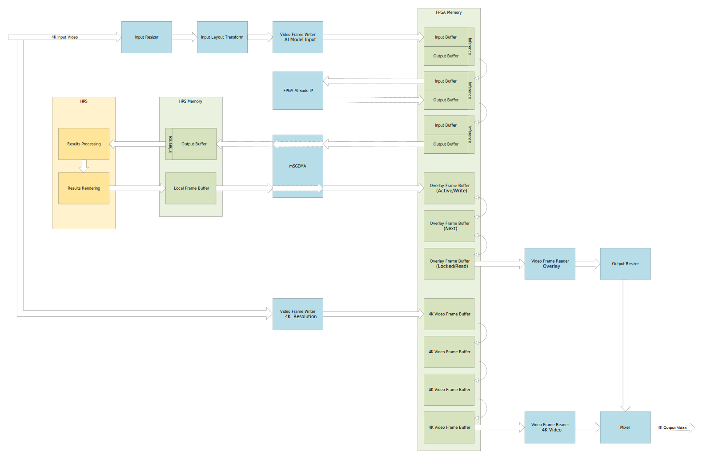
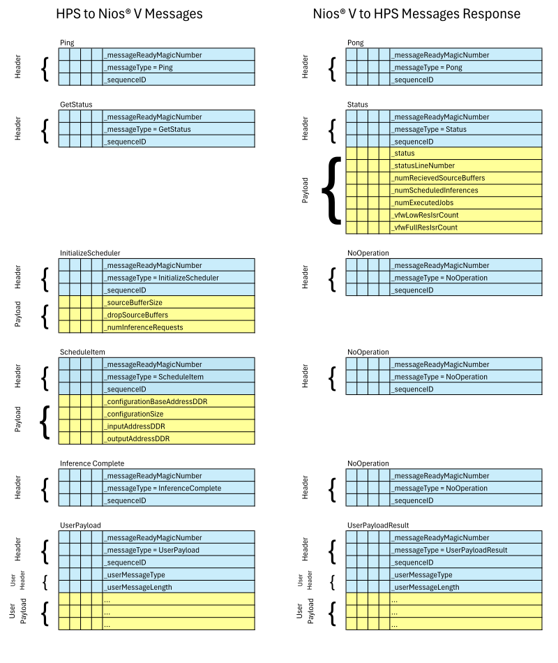
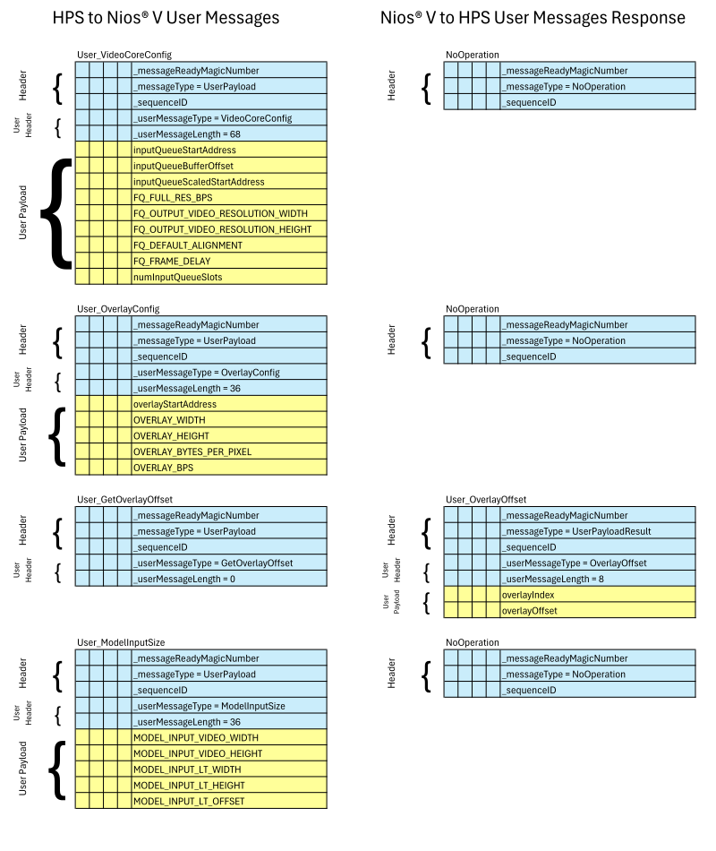
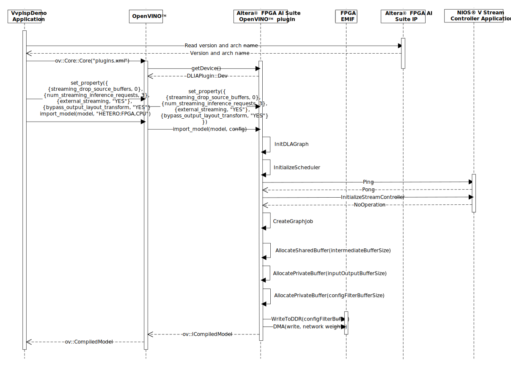
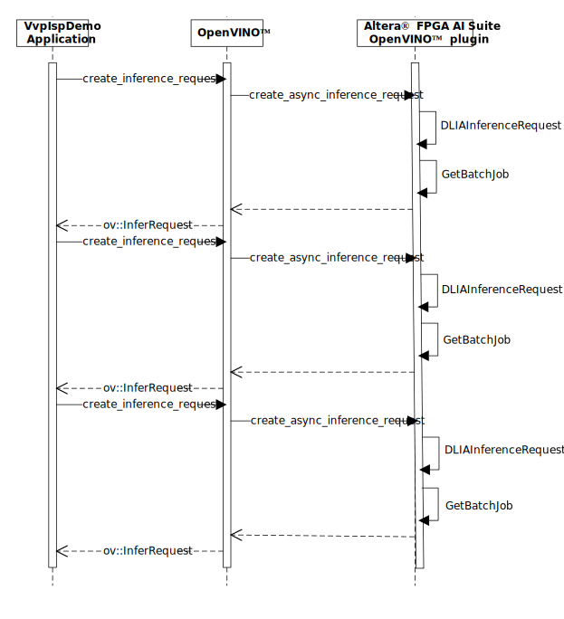
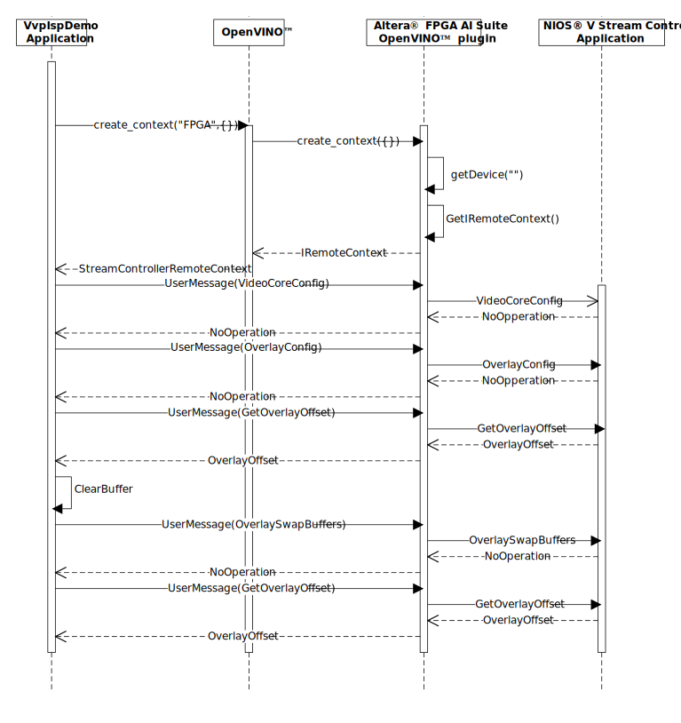
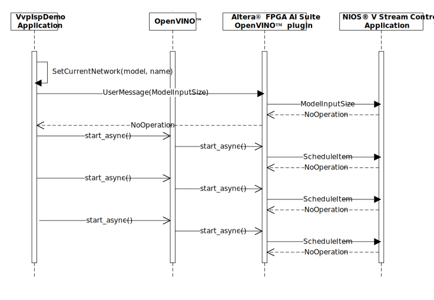
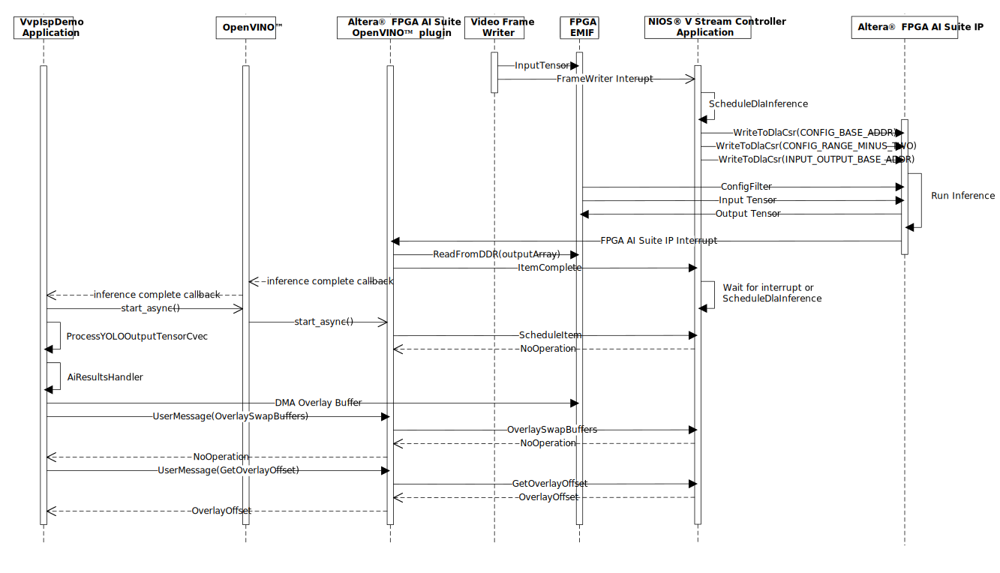

# 4Kp30 Multi-Sensor Camera with AI Inference Solution System Example Design for Agilex™ 5 Devices - AI Software Design Functional Description

## Overview
The 4Kp30 Multi-Sensor Camera with AI Inference Solution System Example Design
uses the FPGA AI Suite IP to run inferences on live video data. The video
input is streamed to the FPGA AI Suite IP to perform an inference on each frame.

The VvpIspDemo application running in the HPS system communicates with a stream
controller application running on a Nios® V soft processor. The VvpIspDemo
application uses OpenVINO™ framework to schedule inferences and process the
results. The FPGA AI Suite OpenVINO™ plugin sends messages to the stream
controller application to control video processing and inference scheduling.

{:style="display:block; margin-left:auto; margin-right:auto"}

**Stream Controller data flow**

 

## VvpIspDemo application
The VvpIspDemo application directly controls a collection of IP cores to
provide ISP functions, such as auto-white-balance, and auto-exposure. Running
per-frame inferences with minimum latency, requires a real-time response to
arriving video frames. This task is best suited to an independent stream
controller application running on a Nios® V soft processor. 

The VvpIspDemo application uses OpenVINO™ framework to perform the AI Inference
processing. This requires a number of OpenVINO™ plugins and libraries:

* OpenVINO™ runtime libraries
* OpenVINO™ HETERO plugin
* OpenVINO™ Arm* (third-party) CPU plugin
* FPGA AI Suite OpenVINO™ plugin

The responsibilities of the applications are shown below:

### VvpIspDemo Application
* Configuration and control of IP cores for ISP functions.
* HTTP Server providing user interface.
* Communication of video configuration, memory map and relevant AI inference
  model parameters to stream controller.
* Creation of OpenVINO™ Inference requests.
* Asynchronous scheduling of OpenVINO™ Inference requests.
* Post processing of OpenVINO™ Inference requests.
* AI results extraction and processing, such as non-maximum suppression.
* Rendering graphical display of processed inference results.
#### OpenVINO™ runtime libraries
* Provide implementation of OpenVINO™ runtime API.
* Loads OpenVINO™ plugins
* Loads AI inference models into OpenVINO™ plugins
* Provides creation and scheduling of inferences via OpenVINO™ plugins
#### OpenVINO™ HETERO plugin
* Allows AI inference models to be split between different technologies, such as CPU and FPGA.
#### OpenVINO™ Arm* (third-party) CPU plugin
* Provides a software implementation of OpenVINO™ AI inference operators
#### FPGA AI Suite OpenVINO™ plugin
* Allocates input/output, network, and scratch buffers for the FPGA AI Suite IP
* Communicates with stream controller app via mailbox and stream controller protocol
* Loads compiled FPGA AI Suite inference models into network buffers
* Controls scheduling, and completion of OpenVINO™ inference requests via stream controller application
* Controls DMA transfer of inference results

### Nios® V Stream Controller Application
* Configuration and control of IP cores for video frame delay, and AI inference.
* Scheduling 4K full resolution buffers to full resolution video frame writer.
* Scheduling 4K full resolution buffers to full resolution video frame reader.
* Scheduling AI model lower resolution buffers to low resolution video frame writer.
* Scheduling AI model lower resolution buffers inferences to FPGA AI Suite CoreDLA IP.
* Scheduling overlay frame buffers to overlay video frame reader.
* Stream controller protocol communications handling
* Video frame reader/writer, and communications mailbox interrupt handling.

## Nios® V Subsystem
The stream controller module runs autonomously on a Nios® V soft processor. An
interface to the module is created by the FPGA AI Suite OpenVINO™ plugin when
an "external streaming" flag is enabled by the inference application. At
startup, the interface checks that the stream controller is present by sending
a ping message and waiting for a response.

The following sections describe details of the various messages that are sent
between the plugin and the stream controller, along with their packet
structure.

### Stream Controller Communication Protocol
The FPGA AI Suite OpenVINO™ plugin running on the HPS system includes a 
coredla-device component which in turn has a stream controller interface if the
"external streaming" flag is enabled by the inference application. This stream
controller interface manages the communications from the HPS end to the stream
controller microcode module running on the Nios® V soft processor.

Messages are sent between the HPS and the Nios® V soft processor using the
mailbox RAM which is shared between the two. In the HPS, this RAM is accessed 
using HapiOnChipMemII driver, and in the Nios® V soft processor, it is mapped
at address ISP_AI_SUBSYSTEM_ISP_AI_MSG_Q_BASE (in generated system.h). The RAM
is 512 bytes implemented in on chip memory. The lower 256 bytes are used to
send messages from the HPS to the Nios® V soft processor, and the upper 256
bytes are used to send messages from the Nios® V soft processor to the HPS.

Message flow is always initiated from the HPS end, and the Nios® V
soft processor always responds with a message. Therefore, after sending any
message the HPS end waits until it receives a reply message. This can contain
payload data (for example, status information) or just a "no operation" message
with no payload. The HPS sets, and clears a PIO register bit connected to an
edge triggered interrupt on the Nios® V soft processor to signal the presence
of a new message. Similarly, the Nios® V soft processor sets and clears a PIO
register bit connected to an edge triggered interrupt on the HPS.

Each message has a 3 x uint32_t header, which consists of a
messageReadyMagicNumber field, a messageType field, and a sequenceID field.
This header is followed by a payload, the size of which depends on the
messageType. The messageReadyMagicNumber field is set to the arbitrary value of
0x55225522 when the message is ready to be received

When a message is to be sent, all of the buffer apart from the
messageReadyMagicNumber is first written to the mailbox RAM. The sequenceID
increments by 1 with every message sent. Then the messageReadyMagicNumber is
written. The message available interrupt on the Nios® V soft processor is
triggered by the setting and clearing of a PIO register bit. The sending end
then waits for the message available interrupt from the Nios® V soft processor,
the value of messageReadyMagicNumber is checked to ensure it has changed to the
value of the sequenceID. This is set by the stream controller microcode module
and indicates that the message has been received and processed by the receiving
end.

Messages used directly by the FPGA AI Suite are shown below.
{:style="display:block; margin-left:auto; margin-right:auto; width: 80%"}

**Stream Controller Message Packets**

 

For controlling the video IP cores additional messages are required. These messages are sent as user message, and are detailed below.
{:style="display:block; margin-left:auto; margin-right:auto; width: 80%"}

**Stream Controller User Message Packets**

 

## Software operation

The VvpIspDemo application, FPGA AI Suite OpenVINO™ plugin, and Nios® V 
stream controller application, go through a number of initialization sequences
to configure the video IP cores, and the FPGA AI Suite IP core for
operation.

* [Graph loading](#graph-loading)
* [Inference creation](#inference-creation)
* [Video initialization](#video-initialization)
* [Network selection](#network-selection)

After initialization, an inference is completed for each video frame.

* [Inference](#inference)

### Graph loading
During graph loading, OpenVINO™ is initialized. OpenVINO™ loads the FPGA AI 
Suite OpenVINO™ plugin, and sets a number of streaming parameters. At this
point the FPGA AI Suite OpenVINO™ plugin establishes communication with the
Nios® V stream controller application. The FPGA AI Suite OpenVINO™ plugin then
loads the compiled network graph binary data and transfers this to FPGA DDR
memory. At this stage memory is also reserved for the input and output buffers.
Memory is allocated for maximum number of inferences possible.
{:style="display:block; margin-left:auto; margin-right:auto; width: 80%"}

**Graph load sequence diagram**

 
### Inference creation
After the network graph has been loaded, a configurable number of OpenVINO™
inference objects are created. These objects are used to pass inference input
and output buffers to the Nios® V stream controller application, and to pass
the resulting output data back to the VvpIspDemo application.
{:style="display:block; margin-left:auto; margin-right:auto; width: 80%"}

**Inference creation sequence diagram**

 
### Video initialization
During video initialization, video parameters, such as width and height, are
passed to the Nios® V stream controller application. The Nios® V stream
controller application configures the video IP cores accordingly.
{:style="display:block; margin-left:auto; margin-right:auto; width: 80%"}

**Video initialization sequence diagram**

 
### Network selection
It is possible to load multiple network graphs simultaneously. Each is allocated
separate buffers with the FPGA DDR memory. It is possible to switch between these 
networks, at any time, by scheduling inferences from the newly selected network,
and no longer scheduling inference objects from the previous network. During
initialization the inference objects for the default network graph are scheduled.
{:style="display:block; margin-left:auto; margin-right:auto; width: 80%"}

**Network selection sequence diagram**

 
### Inference
Once initialization is complete the VvpIspDemo, and Nios® V stream controller
applications enter a running phase. After each frame writer completion, the
network graph memory location and the input/output buffer memory location are
written to the FPGA AI Suite IP core. Once the core completes the inference and
has written the result to the FPGA DDR memory, an interrupt is raised on the HPS.
The FPGA AI Suite OpenVINO™ plugin receives this interrupt, and signals the
completion of the inference to the VvpIspDemo application, via OpenVINO™ inference
object. The VvpIspDemo application first copies the output result data, and
reschedules the inference object. The VvpIspDemo application then schedules
processing of the results, and subsequently rendering of the results to the
graphics overlay. The VvpIspDemo application then signals the overlay completion
to the Nios® V stream controller application. The Nios® V stream controller
application manages a triple buffer model for the overlay. This ensures there
is no video tearing of the overlay during updates.
{:style="display:block; margin-left:auto; margin-right:auto"}

**Inference sequence diagram**

 

## Input processing
### Video image format
The FPGA AI Suite IP core memory format for tensors is not the same as the
video core IP image format. The video image format can be described as a
NHWC (1, height, width, 3) tensor format. That means that the red, green and
blue channels are in sequential memory locations. Every three memory locations
represent an increase of one pixel in the horizontal direction. Every 3*width
memory locations represent an increase of one pixel in the vertical direction.
This is also known as a channel last format.

### OpenVINO™ input tensor format
Applications, typically, transform the image channel last format to a NCHW (1,
3, height, width) channel first format, compatible with OpenVINO™. In streaming
operation, the video images do not go via the application and this
transformation is rolled into the input layout transformation described below.

### FPGA AI Suite tensor format
The memory layout of a tensor for the FPGA AI Suite IP is different to the
OpenVINO™ format. Performance is greatly enhanced by processing multiple channels
simultaneously. The specified number of channels are grouped into a vector
referred to as Cvec (C-vector). The tensor format can be described as NCHWCvec
(batch, channel, height, width, C-vector respectively), where the Cvec is the
fastest-changing dimension in the tensor’s memory representation and batch is
the slowest. Cvec refers to the dimension required to execute convolution
operations as SIMD instructions in the FPGA AI Suite IP. Non-streaming
applications would use the FPGA AI Suite OpenVINO™ plugin input layout
transform to perform this operation. For streaming video inferences, this
transform is performed by the non-QPDS Layout Transform (LT) IP (supplied with
the source project).

## Results processing
As with input tensor, the FPGA AI Suite IP core uses the NCHWCvec format.
Applications, typically, use the FPGA AI Suite OpenVINO™ plugin output layout
transform to convert the results tensor to OpenVINO™ NCHW format. Many graphs
require post-processing of this tensor to create a result set. This
post-processing can be done within the network graph, using Arm* (third-party)
CPU plugin, or it can be post-processed using a custom application function.
Using a custom application function can often be more optimal, depending on use
case.

In the case of the VvpIspDemo application this is taken one step further. The
OpenVINO™ NCHW tensor format creates a very scattered memory access pattern
when post-processing YOLO results. This creates an inefficient cache utilization.
The post-processing performed by the VvpIspDemo application does not use the
OpenVINO™ NCHW format, or the FPGA AI Suite OpenVINO™ plugin output layout.
transform. Instead, the FPGA AI Suite IP core format of NCHWCvec is used. The
vectored channel results format allows for better use of the HPS cache memory.

Post-processing the results from NCHWCvec format also allows for some algorithm
optimisations. For instance the use of SIMD instructions within the HPS.

## Results rendering
Not all applications require graphical overlaying of results, but the VvpIspDemo
application does. To facilitate this the application renders the results using
the "Lightweight and Versatile Graphics Library" LVGL. This allows text, and
vector graphics to be easily rendered to an overlay buffer. The VvpIspDemo 
application uses a 940x540 resolution ARGB2222 buffer format. This format allows
minimum memory bandwidth, but accurate results rendering.

 

 
[Back](../camera_4k_ai/camera_4k_ai.md#documentation){ .md-button }
 

[User flow 1]: ../camera_4k_ai/camera_4k_ai.md#pre-requisites
[User flow 2]: ../camera_4k_ai/flow2-sof-mdt.md
[User flow 3]: ../camera_4k_ai/flow3-rbf-mdt.md

[https://github.com/altera-fpga/agilex-ed-camera-ai]: https://github.com/altera-fpga/agilex-ed-camera-ai
[https://github.com/altera-fpga/modular-design-toolkit]: https://github.com/altera-fpga/modular-design-toolkit
[meta-altera-fpga]: https://github.com/altera-fpga/agilex-ed-camera-ai/tree/rel-25.1/sw/meta-altera-fpga
[meta-altera-fpga-ocs]: https://github.com/altera-fpga/agilex-ed-camera-ai/tree/rel-25.1/sw/meta-altera-fpga-ocs
[meta-vvp-isp-demo]: https://github.com/altera-fpga/agilex-ed-camera-ai/tree/rel-25.1/sw/meta-vvp-isp-demo
[agilex-ed-camera-ai/sw]: https://github.com/altera-fpga/agilex-ed-camera-ai/tree/rel-25.1/sw

[Release Tag]: https://github.com/altera-fpga/agilex-ed-camera-ai/releases/tag/rel-25.1
[https://github.com/altera-fpga/agilex-ed-camera-ai/releases/tag/rel-25.1]: https://github.com/altera-fpga/agilex-ed-camera-ai/releases/tag/rel-25.1
[hps-first-vvp-isp-demo-image-agilex5_mk_a5e065bb32aes1.wic.gz]: https://github.com/altera-fpga/agilex-ed-camera-ai/releases/download/rel-25.1/hps-first-vvp-isp-demo-image-agilex5_mk_a5e065bb32aes1.wic.gz
[fpga-first-vvp-isp-demo-image-agilex5_mk_a5e065bb32aes1.wic.gz]: https://github.com/altera-fpga/agilex-ed-camera-ai/releases/download/rel-25.1/fpga-first-vvp-isp-demo-image-agilex5_mk_a5e065bb32aes1.wic.gz
[fsbl_agilex5_modkit_vvpisp_time_limited.sof]: https://github.com/altera-fpga/agilex-ed-camera-ai/releases/download/rel-25.1/fsbl_agilex5_modkit_vvpisp_time_limited.sof
[top.core.jic]: https://github.com/altera-fpga/agilex-ed-camera-ai/releases/download/rel-25.1/top.core.jic
[top.core.rbf]: https://github.com/altera-fpga/agilex-ed-camera-ai/releases/download/rel-25.1/top.core.rbf
[model_compiler]: https://github.com/altera-fpga/agilex-ed-camera-ai/tree/rel-25.1/yolo_cnn

[AGX_5E_Modular_Devkit_ISP_AI_FF_RD.xml]: https://github.com/altera-fpga/agilex-ed-camera-ai/blob/rel-25.1/AGX_5E_Altera_Modular_Dk_ISP_designs/AGX_5E_Modular_Devkit_ISP_AI_FF_RD.xml
[AGX_5E_Modular_Devkit_ISP_AI_RD.xml]: https://github.com/altera-fpga/agilex-ed-camera-ai/blob/rel-25.1/AGX_5E_Altera_Modular_Dk_ISP_designs/AGX_5E_Modular_Devkit_ISP_AI_RD.xml
[Create microSD card image (.wic.gz) using YOCTO/KAS]: https://github.com/altera-fpga/agilex-ed-camera-ai/blob/rel-25.1/sw/README.md
[<g>&check;</g> YOCTO/KAS ]: https://github.com/altera-fpga/agilex-ed-camera-ai/blob/rel-25.1/sw/README.md

[SOF Modular Design Toolkit (MDT) Flow]: https://github.com/altera-fpga/agilex-ed-camera-ai/blob/rel-25.1/README.md#create-the-design-using-the-modular-design-toolkit-mdt
[RBF Modular Design Toolkit (MDT) Flow]: https://github.com/altera-fpga/agilex-ed-camera-ai/blob/rel-25.1/README.md#create-the-design-using-the-modular-design-toolkit-mdt
[<g>&check;</g> SOF MDT Flow ]: https://github.com/altera-fpga/agilex-ed-camera-ai/blob/rel-25.1/README.md#create-the-design-using-the-modular-design-toolkit-mdt
[<g>&check;</g> RBF MDT Flow ]: https://github.com/altera-fpga/agilex-ed-camera-ai/blob/rel-25.1/README.md#create-the-design-using-the-modular-design-toolkit-mdt

 
