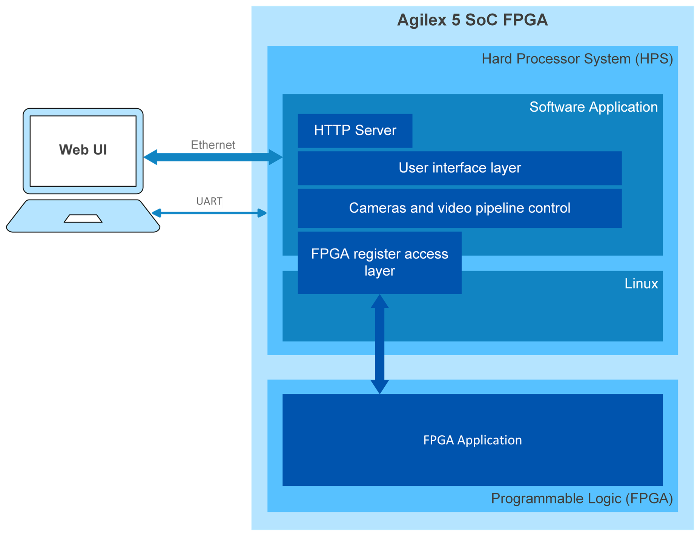

# 4Kp30 Multi-Sensor Camera with AI Inference Solution System Example Design for Agilex™ 5 Devices - Software Functional Description

## Overview

The primary software components are summarized in the following diagram and
described below:
<br/>
<br/>

{:style="display:block; margin-left:auto; margin-right:auto; width: 60%"}
<center markdown="1">

**Software Top Block Diagram**
</center>
<br/>

Summary:

* A Software application running on an embedded Linux system.
* The application provides Web based UI to control the video pipeline and


  individual ISP IP, and the AI Inference.

* User accesses Web UI from a remote PC or tablet over the network with a Web
browser e.g. Chrome.
* Linux system includes necessary drivers allowing the software application to
access and control FPGA using register read/write interface.


## Custom Linux distribution based on KAS

For the Camera Solution System Example Design, Altera® provides the files to
build the Linux system to run the demo application. A custom version of Linux
is built based on [KAS] (setup tool for Yocto projects, see [KAS]) and is
composed of the following meta-layers:

* Altera® FPGA Layer - **[meta-altera-fpga]**
* Altera® FPGA OCS (Offset Capability Structure) Layer - **[meta-altera-fpga-ocs]**
* Camera Layer - **[meta-vvp-isp-demo]**


!!! note "KAS Reference"
    [agilex-ed-camera-ai/sw]


### Necessary elements in the meta-layers to bind Software and Hardware

This section details the various elements included in the meta-layers that
facilitate running the camera application. These elements assist in "binding"
the FPGA Soft IP with the Linux software running on the HPS. The following
sections explain these elements to clarify the interaction between the HPS
software stack and the FPGA soft IP. This interaction between the HPS and
Camera IP serves as an example of how to interface any soft IP in the FPGA
fabric with higher-level software.


#### Device Tree

Adds a custom .dtsi (device tree fragment) file to the main device tree for
Linux kernel boot up stage `socfpga_agilex5_socdk.dts`. it compiles into a DTB
(device tree blob) during kernel compilation and is added to the microSD card
image during the Yocto build with the recipe `device-tree.bb`. The specific
file for this design example (`agilex5_vvp-isp-demo.dtsi`), is appended using
`device-tree.bbappend` directive. Look for these files in the different
meta-layers provided.
<br/>

#### FPGA Bitstream

Adds the `agilex5_modkit_vvpisp.hps_first.core.rbf` file to the build. The file
is generated after Quartus® compilation. The `*core.rbf` file is added to the
boot partition of the microSD card (renamed as `top.core.rbf`). The HPS
configures the FPGA at initialization using u-boot `load` command in
`uboot.txt` generated into `boot.scr.uimg` in the boot partition by 
`u-boot-socfpga_%.bbappend` (look for the files in the meta-layer).
<br/>

``` #5
Found U-Boot script /boot.scr.uimg
1711 bytes read in 12 ms (138.7 KiB/s)
## Executing script at 81000000
crc32+ 12038144 bytes read in 627 ms (18.3 MiB/s)
............FPGA reconfiguration OK!
47645184 bytes read in 2435 ms (18.7 MiB/s)
42988 bytes read in 17 ms (2.4 MiB/s)
## Flattened Device Tree blob at 86000000
   Booting using the fdt blob at 0x86000000
Working FDT set to 86000000
   Loading Device Tree to 00000000feae5000, end 00000000feaf27eb ... OK
Working FDT set to feae5000

Starting kernel ...
```
<center markdown="1">

**FPGA configuration during HPS booting process**
</center>
<br/>

Look for the message **"..... FPGA reconfiguration OK "** during the device booting
process, as shown in the previous figure to ensure the FPGA bitstream (`top.core.rbf`)
has been properly loaded.


#### Additional u-boot configuration

Append to the u-boot arguments using `IMAGE_BOOT_ARGS` and
`IMAGE_BOOT_ARGS:append:agilex5_modular` in different KAS/YOCTO configuration
files to enable UIO drivers defined by `uio_pdrv_genirq.of_id=generic-uio`.
<br/>


## Using a Static IP Address

Linux on the microSD card obtains an IP address automatically via DHCP if the
Ethernet network has a DHCP server. Alternatively, you may configure the
network with a static IP address by editing the following file via the terminal
interface:
<br/>

```
/etc/systemd/network/11-eth.network
```

Find the following lines in the file:
```
[Network]
DHCP=yes
```

Replace the lines with the following content:
```
[Network]
DHCP=no
Gateway=192.168.1.1
Address=192.168.1.123/24
```

Use the gateway and the static IP address as appropriate for your network. Save
the file and reboot the board.
<br/>

<br/>
[Back](../camera_4k_ai/camera_4k_ai.md#documentation){ .md-button }
<br/>


[User flow 1]: ../camera_4k_ai/camera_4k_ai.md#pre-requisites
[User flow 2]: ../camera_4k_ai/flow2-sof-mdt.md
[User flow 3]: ../camera_4k_ai/flow3-rbf-mdt.md


[https://github.com/altera-fpga/agilex-ed-camera-ai]: https://github.com/altera-fpga/agilex-ed-camera-ai
[https://github.com/altera-fpga/modular-design-toolkit]: https://github.com/altera-fpga/modular-design-toolkit
[meta-altera-fpga]: https://github.com/altera-fpga/agilex-ed-camera-ai/tree/rel-25.1/sw/meta-altera-fpga
[meta-altera-fpga-ocs]: https://github.com/altera-fpga/agilex-ed-camera-ai/tree/rel-25.1/sw/meta-altera-fpga-ocs
[meta-vvp-isp-demo]: https://github.com/altera-fpga/agilex-ed-camera-ai/tree/rel-25.1/sw/meta-vvp-isp-demo
[agilex-ed-camera-ai/sw]: https://github.com/altera-fpga/agilex-ed-camera-ai/tree/rel-25.1/sw


[Release Tag]: https://github.com/altera-fpga/agilex-ed-camera-ai/releases/tag/rel-25.1
[https://github.com/altera-fpga/agilex-ed-camera-ai/releases/tag/rel-25.1]: https://github.com/altera-fpga/agilex-ed-camera-ai/releases/tag/rel-25.1
[hps-first-vvp-isp-demo-image-agilex5_mk_a5e065bb32aes1.wic.gz]: https://github.com/altera-fpga/agilex-ed-camera-ai/releases/download/rel-25.1/hps-first-vvp-isp-demo-image-agilex5_mk_a5e065bb32aes1.wic.gz
[fpga-first-vvp-isp-demo-image-agilex5_mk_a5e065bb32aes1.wic.gz]: https://github.com/altera-fpga/agilex-ed-camera-ai/releases/download/rel-25.1/fpga-first-vvp-isp-demo-image-agilex5_mk_a5e065bb32aes1.wic.gz
[fsbl_agilex5_modkit_vvpisp_time_limited.sof]: https://github.com/altera-fpga/agilex-ed-camera-ai/releases/download/rel-25.1/fsbl_agilex5_modkit_vvpisp_time_limited.sof
[top.core.jic]: https://github.com/altera-fpga/agilex-ed-camera-ai/releases/download/rel-25.1/top.core.jic
[top.core.rbf]: https://github.com/altera-fpga/agilex-ed-camera-ai/releases/download/rel-25.1/top.core.rbf
[model_compiler]: https://github.com/altera-fpga/agilex-ed-camera-ai/tree/rel-25.1/yolo_cnn


[AGX_5E_Modular_Devkit_ISP_AI_FF_RD.xml]: https://github.com/altera-fpga/agilex-ed-camera-ai/blob/rel-25.1/AGX_5E_Altera_Modular_Dk_ISP_designs/AGX_5E_Modular_Devkit_ISP_AI_FF_RD.xml
[AGX_5E_Modular_Devkit_ISP_AI_RD.xml]: https://github.com/altera-fpga/agilex-ed-camera-ai/blob/rel-25.1/AGX_5E_Altera_Modular_Dk_ISP_designs/AGX_5E_Modular_Devkit_ISP_AI_RD.xml
[Create microSD card image (.wic.gz) using YOCTO/KAS]: https://github.com/altera-fpga/agilex-ed-camera-ai/blob/rel-25.1/sw/README.md
[<g>&check;</g><span hidden="true"> YOCTO/KAS </span>]: https://github.com/altera-fpga/agilex-ed-camera-ai/blob/rel-25.1/sw/README.md

[SOF Modular Design Toolkit (MDT) Flow]: https://github.com/altera-fpga/agilex-ed-camera-ai/blob/rel-25.1/README.md#create-the-design-using-the-modular-design-toolkit-mdt
[RBF Modular Design Toolkit (MDT) Flow]: https://github.com/altera-fpga/agilex-ed-camera-ai/blob/rel-25.1/README.md#create-the-design-using-the-modular-design-toolkit-mdt
[<g>&check;</g><span hidden="true"> SOF MDT Flow </span>]: https://github.com/altera-fpga/agilex-ed-camera-ai/blob/rel-25.1/README.md#create-the-design-using-the-modular-design-toolkit-mdt
[<g>&check;</g><span hidden="true"> RBF MDT Flow </span>]: https://github.com/altera-fpga/agilex-ed-camera-ai/blob/rel-25.1/README.md#create-the-design-using-the-modular-design-toolkit-mdt

