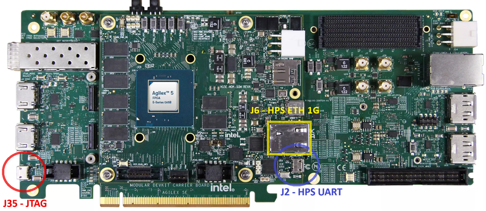
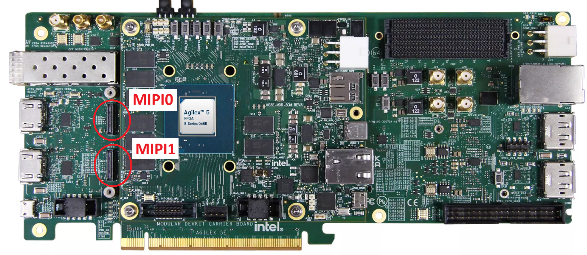
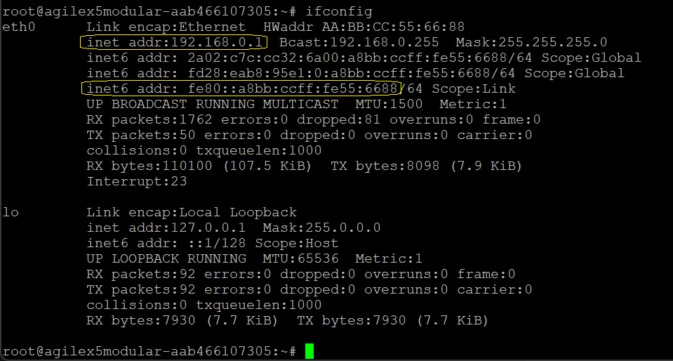
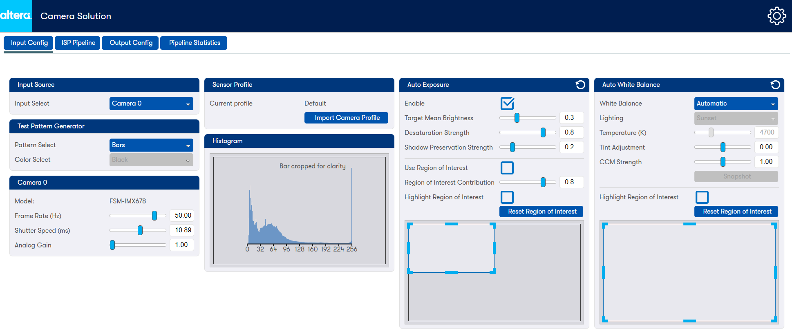

# 4Kp60 Multi-Sensor HDR Camera Solution System Example Design for Agilex™ 5 Devices - SOF Modular Design Toolkit (MDT) Flow

## Pre-requisites

### Software Requirements to build
* Linux OS installed.
* 72 GB free storage (~2GB for Quartus® Build and ~70GB for YOCTO/KAS build).
* Python/PIP/KAS for Yocto Build (or a suitable container) see [KAS].
* [Altera® Quartus® Prime Pro Edition version 25.1 Linux].
  * Altera® Quartus® Agilex™ 5 Support.
* FPGA NiosV Open-Source Tools 25.1 (installed with Quartus® Prime).

<br/>


### License Requirements to build
* OpenCore Plus (OCP) IP evaluation license.
* Free licenses (must be downloaded and installed):
  * [Nios® V Processor].

<br/>


### Hardware Requirements
* [Agilex™ 5 FPGA E-Series 065B Modular Development Kit].

<br/>
{:style="display:block; margin-left:auto; margin-right:auto"}
<center markdown="1">

**Agilex™ 5 FPGA E-Series 065B Modular Development Kit**
</center>
<br/>

* 1 or 2 [Framos FSM:GO IMX678C Camera Modules], with:
  * [Wide 110deg HFOV Lens], or
  * [Medium 100deg HFOV Lens], or
  * [Narrow 54deg HFOV Lens].
* Mount/Tripod
  * [Framos Tripod Mount Adapter].
  * [Tripod].
* A Framos cable for PixelMate MIPI-CSI-2 for each Camera Module:
  * [150mm flex-cable], or
  * [300mm micro-coax cable].
* Minimum 8GB U3 microSD Card.
* DP Cable or HDMI Cable (with [4Kp60 Converter Dongle]).
* USB Micro B JTAG Cable (for JTAG programming).
* USB Micro B Serial Cable (for HPS terminal connection).
* RJ45 Ethernet Cable (HPS network connection).
* Monitor/TV (recommend 4Kp60 capable).

<br/>


### Software Requirements to run
* Host PC with:
  * 8 GB of RAM (less if not rebuilding binaries).
  * Linux/Windows OS installed.
  * Serial terminal (such as GtkTerm or Minicom on Linux, and [TeraTerm] or
    PuTTY on Windows).
    * FTDI FT232R USB UART drivers (for a Windows host).
  * Tool to write images for removable USB drives or microSD cards such as
  [Win32DiskImager] on Windows or "dd" command on Linux.
  * Altera® Quartus® Prime Pro Edition version 25.1 Programmer and Tools.
  * Ethernet connection (either direct from Host PC to development board, or
    via a switch or router).
    * Note, you may need to disconnected/disabled VPN if it is installed on the
      Host PC.
  * Web browser.

<br/>


## Getting Started - build and run SOF, and microSD Card Image

Follow the instructions provided in this section to build the 4K Multi-Sensor
HDR Camera Solution System Example Design on the Agilex™ 5 FPGA E-Series 065B
Modular Development Kit. You will build a `SOF` file using the Modular
Development Toolkit, and a microSD Card image using [KAS](https://kas.readthedocs.io/en/latest/) and Yocto (suitable
for use with the OpenCore License).

### Reference pre-built Binaries

You can use the pre-built binaries for reference:

<center markdown="1">

| Boot Source | Link |
| ---------------------------------- | ---- |
| Pre-built microSD Card Image for SOF MDT Flow | [fpga-first-vvp-isp-demo-image-agilex5_mk_a5e065bb32aes1.wic.gz](https://github.com/altera-fpga/agilex-ed-camera/releases/download/rel-25.1/fpga-first-vvp-isp-demo-image-agilex5_mk_a5e065bb32aes1.wic.gz) |
| Pre-built FPGA First `.sof` file | [fsbl_agilex5_modkit_vvpisp_time_limited.sof](https://github.com/altera-fpga/agilex-ed-camera/releases/download/rel-25.1/fsbl_agilex5_modkit_vvpisp_time_limited.sof) |

</center>

## HW Compilation
Use the **[SOF Modular Design Toolkit (MDT) Flow](https://github.com/altera-fpga/agilex-ed-camera/blob/rel-25.1/README.md#create-the-design-using-the-modular-design-toolkit-mdt)** to create and build the
FPGA Design.

## SW Compilation
Use the **[Create microSD card image (.wic.gz) using YOCTO/KAS](https://github.com/altera-fpga/agilex-ed-camera/blob/rel-25.1/sw/README.md)** flow to
create the microSD card image.

!!! NOTE "Note"
    use <g>**KAS_MACHINE=agilex5_mk_a5e065bb32aes1**</g> and <g>**kas/agilex_camera_ff.yml**</g> configuration

## Programming

### **Setting Up your Modular Development Board**

!!! NOTE "Warning"
    Handle ESD-sensitive equipment (boards, microSD Cards, Camera sensors, etc.) only when properly grounded and at an ESD-safe workstation

* Configure the board switches as shown:

<br>

{:style="display:block; margin-left:auto; margin-right:auto"}
<center markdown="1">

**Modular Development Board - Default Switch Positions**
</center>
<br>

!!! note "Main switch configurations used by the Camera Solution System Example Design"

    JTAG Mode:         SOM S4=OFF:OFF, or<br>
    ASx4 (QSPI) Mode:  SOM S4=ON:ON

<br>

* Connect micro USB cable between the carrier board (`J35`) and the Host PC.
  This will be used for JTAG communication. Look at what ports are enumerated
  on your Host computer. There should be a series of four.
* Connect micro USB cable between the SOM board (`J2`, HSP_UART) and the Host
  PC. This will be used for HPS UART communication. Look at what ports are
  enumerated on your Host computer. There should be a series of four. Use the
  3rd one in the list as the HPS serial port.
* Connect an RJ45 cable between the ethernet port on the SOM board (`J6`, ETH
  1G HPS) and make sure it is on the same network as your Host PC. You can
  check the `eth0` IP address after boot using the Linux `ip a` command.

<br>

{:style="display:block; margin-left:auto; margin-right:auto"}
<center markdown="1">

**Board Connections**
</center>
<br>


### **Burn the microSD Card Image**

* Either use your own or download the pre-built `<name>.wic.gz` image.
* Extract `<name>.wic` image from the zip file
  * On Linux, use the `dd` utility:

  ```bash
  tar -xzf `<name>.wic.gz`
  ```

  * On Windows, use the [7-Zip](https://www.7-zip.org) program (or similar):
    * Right click `<name>.wic.gz` file, and select "Extract All..."

* Write the `<name>.wic` image to the microSD card using a USB writer:
  * On Linux, use the `dd` utility:

  ```bash
  # Determine the device associated with the SD card on the host computer.
  cat /proc/partitions
  # This will return for example /dev/sd<x>
  # Use dd to write the image in the corresponding device
  sudo dd if=<name>.wic of=/dev/sd<x> bs=1M
  # Flush the changes to the microSD card
  sync
  ```

  * On Windows, use the [Win32DiskImager](https://sourceforge.net/projects/win32diskimager) program (or similar):
    * Click browse icon and select "\*.\*" filter:

    {:style="display:block; margin-left:auto; margin-right:auto"}
    <center markdown="1">

    **Navigate to your download and select `<name>.wic` in the "Disk Imager" tool**
    </center>
<br>

    * Write the image (note your Device may be different to that shown):

    {:style="display:block; margin-left:auto; margin-right:auto"}
    <center markdown="1">

    **Write the microSD Card using the "Disk Imager" tool**
    </center>

* Turn off the board and insert the microSD card in the microSD card slot
  located on the SOM board.

<br>


[4Kp60 Multi-Sensor HDR Camera Solution System Example Design for Agilex™ 5 Devices]: https://altera-fpga.github.io/rel-25.1/embedded-designs/agilex-5/e-series/modular/camera/camera_4k
[Agilex™ 5 E-Series Modular Development Board GSRD User Guide (25.1)]: https://altera-fpga.github.io/rel-25.1/embedded-designs/agilex-5/e-series/modular/gsrd/ug-gsrd-agx5e-modular/


[Hard Processor System Technical Reference Manual: Agilex™ 5 SoCs (25.1)]: https://www.intel.com/content/www/us/en/docs/programmable/814346/25-1/hard-processor-system-technical-reference.html
[NiosV Processor for Altera® FPGA]: https://www.intel.com/content/www/us/en/products/details/fpga/intellectual-property/processors-peripherals/niosv.html
[Agilex™ 5 FPGA E-Series 065B Modular Development Kit]: https://www.intel.com/content/www/us/en/products/details/fpga/development-kits/agilex/a5e065b-modular.html
[Agilex™ 5 FPGA E-Series 065B Modular Development Kit Product Brief]: https://www.intel.com/content/www/us/en/content-details/815178/agilex-5-fpga-e-series-065b-modular-development-kit-product-brief.html


[Win32DiskImager]: https://sourceforge.net/projects/win32diskimager
[7-Zip]: https://www.7-zip.org
[teraterm]: https://github.com/TeraTermProject/teraterm/releases
[putty]: https://www.chiark.greenend.org.uk/~sgtatham/putty/latest.html


[Framos FSM:GO IMX678C Camera Modules]: https://www.framos.com/en/fsmgo
[Wide 110deg HFOV Lens]: https://www.mouser.co.uk/ProductDetail/FRAMOS/FSMGO-IMX678C-M12-L110A-PM-A1Q1?qs=%252BHhoWzUJg4KQkNyKsCEDHw%3D%3D
[Medium 100deg HFOV Lens]: https://www.mouser.co.uk/ProductDetail/FRAMOS/FSMGO-IMX678C-M12-L100A-PM-A1Q1?qs=%252BHhoWzUJg4IesSwD2ACIBQ%3D%3D
[Narrow 54deg HFOV Lens]: https://www.mouser.co.uk/ProductDetail/FRAMOS/FSMGO-IMX678C-M12-L54A-PM-A1Q1?qs=%252BHhoWzUJg4L5yHZulKgVGA%3D%3D
[Framos Tripod Mount Adapter]: https://www.framos.com/en/products/fma-mnt-trp1-4-v1c-26333
[Tripod]: https://thepihut.com/products/small-tripod-for-raspberry-pi-hq-camera
[150mm flex-cable]: https://www.mouser.co.uk/ProductDetail/FRAMOS/FMA-FC-150-60-V1A?qs=GedFDFLaBXGCmWApKt5QIQ%3D%3D&_gl=1*d93qim*_ga*MTkyOTE4MjMxNy4xNzQxMTcwMzQy*_ga_15W4STQT4T*MTc0MTE3MDM0Mi4xLjEuMTc0MTE3MDQ5OS40NS4wLjA
[300mm micro-coax cable]: https://www.mouser.co.uk/ProductDetail/FRAMOS/FFA-MC50-Kit-0.3m?qs=%252BHhoWzUJg4K3LtaE207mhw%3D%3D
[4Kp60 Converter Dongle]: https://www.amazon.co.uk/gp/product/B01M6WK3KU/ref=ppx_yo_dt_b_asin_title_o02_s00?ie=UTF8&psc=1


[VVP IP Suite, VVP Tone Mapping Operator (TMO) IP, VVP Warp IP, and 3D LUT IP]: https://www.intel.com/content/www/us/en/products/details/fpga/intellectual-property/dsp/video-vision-processing-suite.html
[MIPI DPHY IP and MIPI CSI-2 IP]: https://www.intel.com/content/www/us/en/products/details/fpga/intellectual-property/interface-protocols/mipi-d-phy.html#tab-blade-1-3
[Nios® V Processor]: https://www.intel.com/content/www/us/en/products/details/fpga/intellectual-property/processors-peripherals/niosv/glossy.html


[Altera® Quartus® Prime Pro Edition version 25.1 Linux]: https://www.intel.com/content/www/us/en/software-kit/851652/intel-quartus-prime-pro-edition-design-software-version-25-1-for-linux.html
[Altera® Quartus® Prime Pro Edition version 25.1 Windows]: https://www.intel.com/content/www/us/en/software-kit/851653/intel-quartus-prime-pro-edition-design-software-version-25-1-for-windows.html


## Running

### **Board and Host PC Setup**

!!! NOTE "Warning"
    Handle ESD-sensitive equipment (boards, microSD Cards, Camera sensors, etc.) only when properly grounded and at an ESD-safe workstation

Make the required connections between the Host PC and the Modular Development
board as shown in the following diagram:

<br/>

{:style="display:block; margin-left:auto; margin-right:auto;"}
<center markdown="1">

**Development Kit and Host PC Connection diagram**
</center>
<br/>

* Connect the Framos cable(s) between the Framos Camera Module(s) and the Modular
  Development board taking care to align the cable(s) correctly with the
  connectors (pin 1 to pin 1). For a single camera module, either MIPI connector can be used.

{:style="display:block; margin-left:auto; margin-right:auto;"}
<center markdown="1">

**Board MIPI connections**
</center>
<br/>

{:style="display:block; margin-left:auto; margin-right:auto;"}
<center markdown="1">

**Board MIPI and Ribbon Cable**
</center>
<br/>

{:style="display:block; margin-left:auto; margin-right:auto;"}
<center markdown="1">

**Camera and Ribbon Cable**
</center>
<br/>

{:style="display:block; margin-left:auto; margin-right:auto;"}
<center markdown="1">

**Board with Connections**
</center>
<br/>

* Connect the Modular Development carrier board DisplayPort Tx connector to the
  Monitor using a suitable cable (and dongle if you are using HDMI).


### **Program the FPGA SOF**

* To program the FPGA using SOF with first stage bootloader (fsbl):

  * Power down the board. Set MSEL=JTAG by setting the **S4** dip switch
    on the SOM to **OFF-OFF**.
    * This prevents the starting of any bootloader and FPGA configuration after
      power up and until the SOF is programmed over JTAG.

  * Power up the board.

  * Either use your own or download the pre-built fsbl `SOF` image, and program
    the FPGA with either the command:

    ```bash
    quartus_pgm -c 1 -m jtag -o "p;fsbl_agilex5_modkit_vvpisp_time_limited.sof"
    ```

  * or, optionally use the Quartus® Programmer GUI:

    * Launch the Quartus® Programmer and Configure the **"Hardware Setup..."**
      settings as follows:

<br>

{:style="display:block; margin-left:auto; margin-right:auto"}
<center markdown="1">

**Programmer GUI Hardware Settings**
</center>
<br>

* Click "Auto Detect", select the device `A5EC065BB32AR0` and press
  **"Change File.."**
<br>

{:style="display:block; margin-left:auto; margin-right:auto"}
<center markdown="1">

**Programmer after "Auto Detect"**
</center>
<br>

Select your `fsbl_agilex5_modkit_vvpisp_time_limited.sof` file. Check the
**"Program/Configure"** box and press the **"Start"** button (see below). Wait
until the programming has been completed.

<br>

{:style="display:block; margin-left:auto; margin-right:auto"}
<center markdown="1">

**Programming the FPGA with SOF file**
</center>
<br>


[4Kp60 Multi-Sensor HDR Camera Solution System Example Design for Agilex™ 5 Devices]: https://altera-fpga.github.io/rel-25.1/embedded-designs/agilex-5/e-series/modular/camera/camera_4k
[Agilex™ 5 E-Series Modular Development Board GSRD User Guide (25.1)]: https://altera-fpga.github.io/rel-25.1/embedded-designs/agilex-5/e-series/modular/gsrd/ug-gsrd-agx5e-modular/


[Hard Processor System Technical Reference Manual: Agilex™ 5 SoCs (25.1)]: https://www.intel.com/content/www/us/en/docs/programmable/814346/25-1/hard-processor-system-technical-reference.html
[NiosV Processor for Altera® FPGA]: https://www.intel.com/content/www/us/en/products/details/fpga/intellectual-property/processors-peripherals/niosv.html
[Agilex™ 5 FPGA E-Series 065B Modular Development Kit]: https://www.intel.com/content/www/us/en/products/details/fpga/development-kits/agilex/a5e065b-modular.html
[Agilex™ 5 FPGA E-Series 065B Modular Development Kit Product Brief]: https://www.intel.com/content/www/us/en/content-details/815178/agilex-5-fpga-e-series-065b-modular-development-kit-product-brief.html


[Win32DiskImager]: https://sourceforge.net/projects/win32diskimager
[7-Zip]: https://www.7-zip.org
[teraterm]: https://github.com/TeraTermProject/teraterm/releases
[putty]: https://www.chiark.greenend.org.uk/~sgtatham/putty/latest.html


[Framos FSM:GO IMX678C Camera Modules]: https://www.framos.com/en/fsmgo
[Wide 110deg HFOV Lens]: https://www.mouser.co.uk/ProductDetail/FRAMOS/FSMGO-IMX678C-M12-L110A-PM-A1Q1?qs=%252BHhoWzUJg4KQkNyKsCEDHw%3D%3D
[Medium 100deg HFOV Lens]: https://www.mouser.co.uk/ProductDetail/FRAMOS/FSMGO-IMX678C-M12-L100A-PM-A1Q1?qs=%252BHhoWzUJg4IesSwD2ACIBQ%3D%3D
[Narrow 54deg HFOV Lens]: https://www.mouser.co.uk/ProductDetail/FRAMOS/FSMGO-IMX678C-M12-L54A-PM-A1Q1?qs=%252BHhoWzUJg4L5yHZulKgVGA%3D%3D
[Framos Tripod Mount Adapter]: https://www.framos.com/en/products/fma-mnt-trp1-4-v1c-26333
[Tripod]: https://thepihut.com/products/small-tripod-for-raspberry-pi-hq-camera
[150mm flex-cable]: https://www.mouser.co.uk/ProductDetail/FRAMOS/FMA-FC-150-60-V1A?qs=GedFDFLaBXGCmWApKt5QIQ%3D%3D&_gl=1*d93qim*_ga*MTkyOTE4MjMxNy4xNzQxMTcwMzQy*_ga_15W4STQT4T*MTc0MTE3MDM0Mi4xLjEuMTc0MTE3MDQ5OS40NS4wLjA
[300mm micro-coax cable]: https://www.mouser.co.uk/ProductDetail/FRAMOS/FFA-MC50-Kit-0.3m?qs=%252BHhoWzUJg4K3LtaE207mhw%3D%3D
[4Kp60 Converter Dongle]: https://www.amazon.co.uk/gp/product/B01M6WK3KU/ref=ppx_yo_dt_b_asin_title_o02_s00?ie=UTF8&psc=1


[VVP IP Suite, VVP Tone Mapping Operator (TMO) IP, VVP Warp IP, and 3D LUT IP]: https://www.intel.com/content/www/us/en/products/details/fpga/intellectual-property/dsp/video-vision-processing-suite.html
[MIPI DPHY IP and MIPI CSI-2 IP]: https://www.intel.com/content/www/us/en/products/details/fpga/intellectual-property/interface-protocols/mipi-d-phy.html#tab-blade-1-3
[Nios® V Processor]: https://www.intel.com/content/www/us/en/products/details/fpga/intellectual-property/processors-peripherals/niosv/glossy.html


[Altera® Quartus® Prime Pro Edition version 25.1 Linux]: https://www.intel.com/content/www/us/en/software-kit/851652/intel-quartus-prime-pro-edition-design-software-version-25-1-for-linux.html
[Altera® Quartus® Prime Pro Edition version 25.1 Windows]: https://www.intel.com/content/www/us/en/software-kit/851653/intel-quartus-prime-pro-edition-design-software-version-25-1-for-windows.html


### **Connect Browser to UI**
* Power up the board (if not already powered) and set up the serial terminal emulator (minicom,
  [teraterm], [putty], etc.):
  * Select the correct `COMx` port. (The Modular Development board presents 4
    serial COM ports over a single connection and the Linux system uses the 3rd
    port in order). Set the port configuration as follows:
    * 115200 baud rate, 8 Data bits, 1 Stop bit, CRC and Hardware flow control
      disabled.
* The Linux OS will boot and the 4K Multi-Sensor HDR Camera Solution System
  Example Design Application should run automatically.
* A few seconds after Linux boots, the application will detect the attached
  Monitor and the ISP processed output will be displayed using the best
  supported format.
* Take note of the board's IP address.
  * The board's IP address can also be found using the terminal by logging in
    as `root` (no password required) and querying the Ethernet controller:

    ```bash
    root
    ifconfig
    ```

  * `eth0` provides the IPv4 or IPv6 address to connect to.
<br/>

{:style="display:block; margin-left:auto; margin-right:auto;"}
<center markdown="1">

**Example ifconfig output for if network provides DHCP**
</center>

<br/>

{:style="display:block; margin-left:auto; margin-right:auto;"}

<center markdown="1">

**Example ifconfig output for if no DHCP support, or direct connection**
</center>

<br/>

* Connect your web browser to the boards IP address so you can interact with
  the 4K Multi-Sensor HDR Camera Solution System Example Design using the GUI.
  * To connect using IPv6 for the examples above you would use
    `http://[fe80::a8bb:ccff:fe55:6688]` (note the square brackets)
  * To connect using IPv4 for the DHCP example above you would use
    `http://192.168.0.1`

<br/>

{:style="display:block; margin-left:auto; margin-right:auto;"}
<center markdown="1">

**Example web browser URL for IPv6 address**
</center>

<br/>

{:style="display:block; margin-left:auto; margin-right:auto;"}
<center markdown="1">

**Example web browser URL for IPv4 address**
</center>

<br/>

* During connection, you will see the Altera® splash screen, after which you
  will be presented with the 
  [Web GUI:](../camera_4k_resources/ui-funct-descr.md)

<br/>

{:style="display:block; margin-left:auto; margin-right:auto;"}
<center markdown="1">

**Example Camera Solution GUI**
</center>

<br/>


<br/>
[Back](../camera_4k/camera_4k.md#recommended-user-flows){ .md-button }
<br/>


[4Kp60 Multi-Sensor HDR Camera Solution System Example Design for Agilex™ 5 Devices]: https://altera-fpga.github.io/rel-25.1/embedded-designs/agilex-5/e-series/modular/camera/camera_4k
[Agilex™ 5 E-Series Modular Development Board GSRD User Guide (25.1)]: https://altera-fpga.github.io/rel-25.1/embedded-designs/agilex-5/e-series/modular/gsrd/ug-gsrd-agx5e-modular/


[Hard Processor System Technical Reference Manual: Agilex™ 5 SoCs (25.1)]: https://www.intel.com/content/www/us/en/docs/programmable/814346/25-1/hard-processor-system-technical-reference.html
[NiosV Processor for Altera® FPGA]: https://www.intel.com/content/www/us/en/products/details/fpga/intellectual-property/processors-peripherals/niosv.html
[Agilex™ 5 FPGA E-Series 065B Modular Development Kit]: https://www.intel.com/content/www/us/en/products/details/fpga/development-kits/agilex/a5e065b-modular.html
[Agilex™ 5 FPGA E-Series 065B Modular Development Kit Product Brief]: https://www.intel.com/content/www/us/en/content-details/815178/agilex-5-fpga-e-series-065b-modular-development-kit-product-brief.html


[Win32DiskImager]: https://sourceforge.net/projects/win32diskimager
[7-Zip]: https://www.7-zip.org
[teraterm]: https://github.com/TeraTermProject/teraterm/releases
[putty]: https://www.chiark.greenend.org.uk/~sgtatham/putty/latest.html


[Framos FSM:GO IMX678C Camera Modules]: https://www.framos.com/en/fsmgo
[Wide 110deg HFOV Lens]: https://www.mouser.co.uk/ProductDetail/FRAMOS/FSMGO-IMX678C-M12-L110A-PM-A1Q1?qs=%252BHhoWzUJg4KQkNyKsCEDHw%3D%3D
[Medium 100deg HFOV Lens]: https://www.mouser.co.uk/ProductDetail/FRAMOS/FSMGO-IMX678C-M12-L100A-PM-A1Q1?qs=%252BHhoWzUJg4IesSwD2ACIBQ%3D%3D
[Narrow 54deg HFOV Lens]: https://www.mouser.co.uk/ProductDetail/FRAMOS/FSMGO-IMX678C-M12-L54A-PM-A1Q1?qs=%252BHhoWzUJg4L5yHZulKgVGA%3D%3D
[Framos Tripod Mount Adapter]: https://www.framos.com/en/products/fma-mnt-trp1-4-v1c-26333
[Tripod]: https://thepihut.com/products/small-tripod-for-raspberry-pi-hq-camera
[150mm flex-cable]: https://www.mouser.co.uk/ProductDetail/FRAMOS/FMA-FC-150-60-V1A?qs=GedFDFLaBXGCmWApKt5QIQ%3D%3D&_gl=1*d93qim*_ga*MTkyOTE4MjMxNy4xNzQxMTcwMzQy*_ga_15W4STQT4T*MTc0MTE3MDM0Mi4xLjEuMTc0MTE3MDQ5OS40NS4wLjA
[300mm micro-coax cable]: https://www.mouser.co.uk/ProductDetail/FRAMOS/FFA-MC50-Kit-0.3m?qs=%252BHhoWzUJg4K3LtaE207mhw%3D%3D
[4Kp60 Converter Dongle]: https://www.amazon.co.uk/gp/product/B01M6WK3KU/ref=ppx_yo_dt_b_asin_title_o02_s00?ie=UTF8&psc=1


[VVP IP Suite, VVP Tone Mapping Operator (TMO) IP, VVP Warp IP, and 3D LUT IP]: https://www.intel.com/content/www/us/en/products/details/fpga/intellectual-property/dsp/video-vision-processing-suite.html
[MIPI DPHY IP and MIPI CSI-2 IP]: https://www.intel.com/content/www/us/en/products/details/fpga/intellectual-property/interface-protocols/mipi-d-phy.html#tab-blade-1-3
[Nios® V Processor]: https://www.intel.com/content/www/us/en/products/details/fpga/intellectual-property/processors-peripherals/niosv/glossy.html


[Altera® Quartus® Prime Pro Edition version 25.1 Linux]: https://www.intel.com/content/www/us/en/software-kit/851652/intel-quartus-prime-pro-edition-design-software-version-25-1-for-linux.html
[Altera® Quartus® Prime Pro Edition version 25.1 Windows]: https://www.intel.com/content/www/us/en/software-kit/851653/intel-quartus-prime-pro-edition-design-software-version-25-1-for-windows.html


[User flow 1]: ../camera_4k/camera_4k.md#pre-requisites
[User flow 2]: ../camera_4k_resources/flow2-sof-mdt.md
[User flow 3]: ../camera_4k_resources/flow3-rbf-mdt.md


[https://github.com/altera-fpga/agilex-ed-camera]: https://github.com/altera-fpga/agilex-ed-camera
[https://github.com/altera-fpga/modular-design-toolkit]: https://github.com/altera-fpga/modular-design-toolkit
[meta-altera-fpga]: https://github.com/altera-fpga/agilex-ed-camera/tree/rel-25.1/sw/meta-altera-fpga
[meta-altera-fpga-ocs]: https://github.com/altera-fpga/agilex-ed-camera/tree/rel-25.1/sw/meta-altera-fpga-ocs
[meta-vvp-isp-demo]: https://github.com/altera-fpga/agilex-ed-camera/tree/rel-25.1/sw/meta-vvp-isp-demo
[agilex-ed-camera/sw]: https://github.com/altera-fpga/agilex-ed-camera/tree/rel-25.1/sw


[Release Tag]: https://github.com/altera-fpga/agilex-ed-camera/releases/tag/rel-25.1
[https://github.com/altera-fpga/agilex-ed-camera/releases/tag/rel-25.1]: https://github.com/altera-fpga/agilex-ed-camera/releases/tag/rel-25.1
[hps-first-vvp-isp-demo-image-agilex5_mk_a5e065bb32aes1.wic.gz]: https://github.com/altera-fpga/agilex-ed-camera/releases/download/rel-25.1/hps-first-vvp-isp-demo-image-agilex5_mk_a5e065bb32aes1.wic.gz
[fpga-first-vvp-isp-demo-image-agilex5_mk_a5e065bb32aes1.wic.gz]: https://github.com/altera-fpga/agilex-ed-camera/releases/download/rel-25.1/fpga-first-vvp-isp-demo-image-agilex5_mk_a5e065bb32aes1.wic.gz
[fsbl_agilex5_modkit_vvpisp_time_limited.sof]: https://github.com/altera-fpga/agilex-ed-camera/releases/download/rel-25.1/fsbl_agilex5_modkit_vvpisp_time_limited.sof
[top.core.jic]: https://github.com/altera-fpga/agilex-ed-camera/releases/download/rel-25.1/top.core.jic
[top.core.rbf]: https://github.com/altera-fpga/agilex-ed-camera/releases/download/rel-25.1/top.core.rbf


[AGX_5E_Modular_Devkit_ISP_FF_RD.xml]: https://github.com/altera-fpga/agilex-ed-camera/blob/rel-25.1/AGX_5E_Altera_Modular_Dk_ISP_designs/AGX_5E_Modular_Devkit_ISP_FF_RD.xml
[AGX_5E_Modular_Devkit_ISP_RD.xml]: https://github.com/altera-fpga/agilex-ed-camera/blob/rel-25.1/AGX_5E_Altera_Modular_Dk_ISP_designs/AGX_5E_Modular_Devkit_ISP_RD.xml
[Create microSD card image (.wic.gz) using YOCTO/KAS]: https://github.com/altera-fpga/agilex-ed-camera/blob/rel-25.1/sw/README.md
[<g>&check;</g><span hidden="true"> YOCTO/KAS </span>]: https://github.com/altera-fpga/agilex-ed-camera/blob/rel-25.1/sw/README.md

[SOF Modular Design Toolkit (MDT) Flow]: https://github.com/altera-fpga/agilex-ed-camera/blob/rel-25.1/README.md#create-the-design-using-the-modular-design-toolkit-mdt
[RBF Modular Design Toolkit (MDT) Flow]: https://github.com/altera-fpga/agilex-ed-camera/blob/rel-25.1/README.md#create-the-design-using-the-modular-design-toolkit-mdt
[<g>&check;</g><span hidden="true"> SOF MDT Flow </span>]: https://github.com/altera-fpga/agilex-ed-camera/blob/rel-25.1/README.md#create-the-design-using-the-modular-design-toolkit-mdt
[<g>&check;</g><span hidden="true"> RBF MDT Flow </span>]: https://github.com/altera-fpga/agilex-ed-camera/blob/rel-25.1/README.md#create-the-design-using-the-modular-design-toolkit-mdt


[Test Pattern Generator IP]: https://www.intel.com/content/www/us/en/docs/programmable/683329/25-1/test-pattern-generator.html
[Switch IP]: https://www.intel.com/content/www/us/en/docs/programmable/683329/25-1/switch.html
[Black Level Statistics IP]: https://www.intel.com/content/www/us/en/docs/programmable/683329/25-1/black-level-statistics.html
[Clipper IP]: https://www.intel.com/content/www/us/en/docs/programmable/683329/25-1/clipper.html
[Defective Pixel Correction IP]: https://www.intel.com/content/www/us/en/docs/programmable/683329/25-1/defective-pixel-correction.html
[Adaptive Noise Reduction IP]: https://www.intel.com/content/www/us/en/docs/programmable/683329/25-1/adaptive-noise-reduction.html
[Black Level Correction IP]: https://www.intel.com/content/www/us/en/docs/programmable/683329/25-1/black-level-correction.html
[Vignette Correction IP]: https://www.intel.com/content/www/us/en/docs/programmable/683329/25-1/vignette-correction.html
[White Balance Statistics IP]: https://www.intel.com/content/www/us/en/docs/programmable/683329/25-1/white-balance-statistics.html
[White Balance Correction IP]: https://www.intel.com/content/www/us/en/docs/programmable/683329/25-1/white-balance-correction.html
[Demosaic IP]: https://www.intel.com/content/www/us/en/docs/programmable/683329/25-1/demosaic.html
[Histogram Statistics IP]: https://www.intel.com/content/www/us/en/docs/programmable/683329/25-1/histogram-statistics.html
[Color Space Converter IP]: https://www.intel.com/content/www/us/en/docs/programmable/683329/25-1/color-space-converter.html
[1D LUT IP]: https://www.intel.com/content/www/us/en/docs/programmable/683329/25-1/1d-lut.html
[3D LUT]: https://www.intel.com/content/www/us/en/products/details/fpga/intellectual-property/dsp/3d-lut.html
[3D LUT IP]: https://www.intel.com/content/www/us/en/docs/programmable/683329/25-1/3d-lut.html
[LUTCalc GitHub page]: https://github.com/cameramanben/LUTCalc
[Tone Mapping Operator]: https://www.intel.com/content/www/us/en/products/details/fpga/intellectual-property/dsp/tone-mapping-operator.html
[Tone Mapping Operator IP]: https://www.intel.com/content/www/us/en/docs/programmable/683329/25-1/tone-mapping-operator.html
[Unsharp Mask IP]: https://www.intel.com/content/www/us/en/docs/programmable/683329/25-1/unsharp-mask.html
[Warp]: https://www.intel.com/content/www/us/en/products/details/fpga/intellectual-property/dsp/video-warp.html
[Warp IP]: https://www.intel.com/content/www/us/en/docs/programmable/683329/25-1/warp.html
[Mixer IP]: https://www.intel.com/content/www/us/en/docs/programmable/683329/25-1/mixer.html
[Video Frame Writer IP]: https://www.intel.com/content/www/us/en/docs/programmable/683329/25-1/video-frame-writer-intel-fpga-ip.html
[Color Plane Manager IP]: https://www.intel.com/content/www/us/en/docs/programmable/683329/25-1/color-plane-manager.html
[Bits per Color Sample Adapter IP]: https://www.intel.com/content/www/us/en/docs/programmable/683329/25-1/bits-per-color-sample-adapter.html
[Protocol Converter IP]: https://www.intel.com/content/www/us/en/docs/programmable/683329/25-1/protocol-converter.html
[Pixels in Parallel Converter IP]: https://www.intel.com/content/www/us/en/docs/programmable/683329/25-1/pixels-in-parallel-converter.html
[Video and Vision Processing Suite Altera® FPGA IP User Guide]: https://www.intel.com/content/www/us/en/docs/programmable/683329/25-1/about-the-video-and-vision-processing-suite.html
[Altera® FPGA Streaming Video Protocol Specification]: https://www.intel.com/content/www/us/en/docs/programmable/683397/current/about-the-intel-fpga-streaming-video.html
[AMBA 4 AXI4-Stream Protocol Specification]: https://developer.arm.com/documentation/ihi0051/a/
[Avalon® Interface Specifications – Avalon® Streaming Interfaces]: https://www.intel.com/content/www/us/en/docs/programmable/683091/20-1/streaming-interfaces.html
[KAS]: https://kas.readthedocs.io/en/latest/


<br/>
