# 4Kp60 Multi-Sensor HDR Camera Solution System Example Design for Agilex™ 5 Devices - Hardware Functional Description

The hardware design for the 4Kp60 Multi-Sensor HDR Camera Solution System
Example Design uses the Modular Design Toolkit (MDT). The MDT is a method of
creating and building Platform Designer (PD) based Quartus® projects from a
single `.xml` file.

The main advantages of using MDT are:

* Enforces a hierarchical design approach (single level deep).
* Encourages design reuse through a library of off-the-shelf subsystems.
* Enables simple porting of designs to different development boards and FPGA
  devices.
* Provides consistent folder structure and helper scripts.
* Uses TCL scripting for the PD Quartus® project.
 
 

## MDT Overview

The MDT flow consists of 2 separate main steps; a create step and a build step.

The create step:

* Parses the design `.xml` file.
* Creates a Quartus® project.
* Creates a PD system for the project.
* Copies all the project files and adds all the MDT generated files to the Quartus® project.
 
 

The build step:

* Generates the Offset Capability Structure (OCS) ROM (detailed later).
* Compiles all the Nios® V Software into `.hex` files.
* Runs the Quartus® compilation flow.
* Post processes `.sof` files.
 
 

The following top level block diagram shows the main components and subsystems
for the 4Kp60 Multi-Sensor HDR Camera Solution System Example Design hardware.
 
 

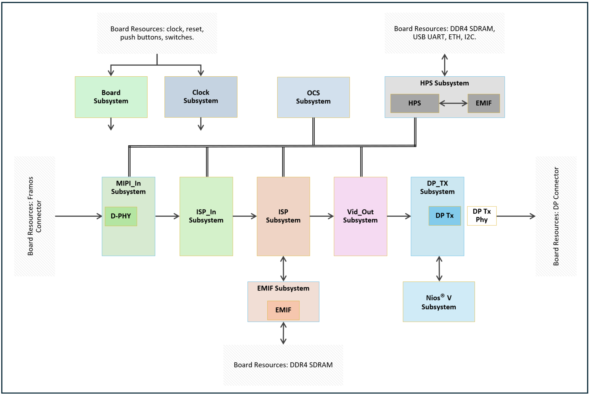{:style="display:block; margin-left:auto; margin-right:auto"}

**Top Level Hardware Block Diagram**

 

* The Board and Clock Subsystems contain blocks related to the development
  board resources, such as buttons, switches, LEDs, reference clocks, and
  resets. They also forward the resources to the other subsystems.
* The HPS Subsystem is an instance of the Agilex™ 5 HPS (Hard Processor System)
  which runs all the Linux software for the 4Kp60 Multi-Sensor HDR Camera
  Solution System Example Design. The subsystem includes an EMIF (External
  Memory Interface) for the HPS DDR4 SDRAM on the development board and bridges
  out to the FPGA fabric for integration with other subsystems.
* The OCS Subsystem (readable by the HPS) is a ROM describing the IP (and its
  capabilities) within the 4Kp60 Multi-Sensor HDR Camera Solution System
  Example Design. Capabilities include the IPs address offset within the system
  memory map allowing the software to auto discover the IP during boot. The
  main advantage of using the OCS is that Hardware (FPGA RTL) and Software can
  be co-developed in parallel without the need to continuously update the
  system memory map.
* MIPI_In, ISP_In, ISP, and VID_Out Subsystems are the blocks related to camera
  image ingress and Image Signal Processing (ISP). The MIPI_In Subsystem
  includes the D-PHY for interfacing the Framos MIPI connectors on the
  development board to the FPGA.
* The EMIF Subsystem is used for buffering image data and includes an EMIF for
  the FPGA DDR4 SDRAM on the development board.
* The DP_Tx and Nios® V Subsystems are related to the Display Port (DP) output.
  The Nios® V is used to control the DP IP to provide multi-rate output
  support. The DP_Tx Subsystem includes the DP Tx IP.
* The top level includes the DP Tx Phy to drive the DP Tx connector on the
  development board.
 
 

The top level hardware block diagram is color-coded to match the MDT generated
PD Quartus® project from the MDT `.xml` source file
([AGX_5E_Modular_Devkit_ISP_RD.xml](https://github.com/altera-fpga/agilex-ed-camera/blob/rel-25.1/AGX_5E_Altera_Modular_Dk_ISP_designs/AGX_5E_Modular_Devkit_ISP_RD.xml)) as shown in the following diagram:
 
 

{:style="display:block; margin-left:auto; margin-right:auto"}

**MDT PD Quartus® Project from the MDT `.xml` source file**

 

Although not shown in the above diagram, the `.xml` also defines:

* The name of the overall project.
* The target development board.
* The target FPGA device.
* The QPDS version to use.
* Global PD parameters (such as Pixels In Parallel for example).
* Non-PD subsystems (such as the top level).
 
 

## Quartus® Project

The MDT PD Quartus® project and its subsystems (as instantiated from the `.xml`
file) are described in greater detail below.
 
 

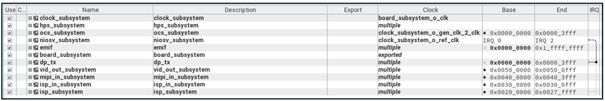{:style="display:block; margin-left:auto; margin-right:auto"}

**Quartus® Project**

 

MDT PD subsystems:

* [Board Subsystem](#board-subsystem)
* [Clock Subsystem](#clock-subsystem)
* [HPS Subsystem](#hps-subsystem)
* [OCS Subsystem](#ocs-subsystem)
* [MIPI_In Subsystem](#mipi_in-subsystem)
* [ISP_In Subsystem](#isp_in-subsystem)
* [ISP Subsystem](#isp-subsystem)
* [EMIF Subsystem](#emif-subsystem)
* [VID_Out Subsystem](#vid_out-subsystem)
* [Nios® V Subsystem](#nios-v-subsystem)
* [DP_Tx Subsystem](#dp_tx-subsystem)
 
 

### **Board Subsystem**

The Board Subsystem contains blocks related to the board resources such as
buttons, switches, and LEDs. The Board Subsystem is part of the MDT common
subsystems and the 4Kp60 Multi-Sensor HDR Camera Solution System Example Design
does not use all the blocks.
 
 

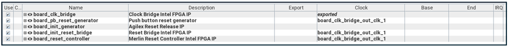{:style="display:block; margin-left:auto; margin-right:auto"}

**Board Subsystem**

 

The Board Subsystem also includes `.qsf` and `.sdc` files relating to the IO
assignments and timing constraints, as well as non-QPDS IP such as a reset
module needed for correct functionality.
 
 

### **Clock Subsystem**

The Clock Subsystem contains blocks related to the board reference clocks and
resets, reset pulse extenders, PLLs for system clock generation, and system
reset synchronizers. The Clock Subsystem is part of the MDT common subsystems.
 
 

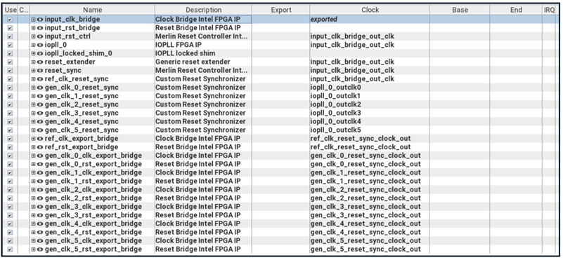{:style="display:block; margin-left:auto; margin-right:auto"}

**Clock Subsystem**

 

The clocks and corresponding resets are distributed to the other subsystems and
are detailed in the following table (note that not all clocks are used in this
variant of the 4Kp60 Multi-Sensor HDR Camera Solution System Example Design):
 
 

**Clocks and Resets**

| Clock/Reset | Frequency | Description |
| ---- | ---- | ---- |
| Ref | 100MHz | Board Input Reference (and DP Nios® V CPU interface) Clock |
| 0 | 297MHz | Video Clock |
| 1 | 148.5MHz | Half-rate Video Clock |
| 2 | 200MHz | IP agent (HPS and TMO Nios® V CPU interface) Clock |
| 3 | 74.25MHz | Quarter-rate Video Clock |
| 4 | 16MHz | DP Management (DP CPU interface) Clock |
| 5 | 50MHz | EMIF Calibration Clock |

 

The Clock Subsystem also includes non-QPDS IP, such as a reset extender,
needed for correct functionality.
 
 

### **HPS Subsystem**

The HPS Subsystem (Hard Processor System) is mainly an instance of the “Hard
Processor System Agilex™ (or other) FPGA IP” and is generally configured
consistently with the GSRD: [Agilex™ 5 E-Series Modular Development Board GSRD User Guide (25.1)](https://altera-fpga.github.io/rel-25.1/embedded-designs/agilex-5/e-series/modular/gsrd/ug-gsrd-agx5e-modular/)
. However, some modifications have been made, for example to
increase the number of I2C Masters. Likewise, some blocks are not required for
the 4Kp60 Multi-Sensor HDR Camera Solution System Example Design. The HPS boots
a custom version of Linux based on Yocto to drive the 4Kp60 Multi-Sensor HDR
Camera Solution System Example Design.
 
 

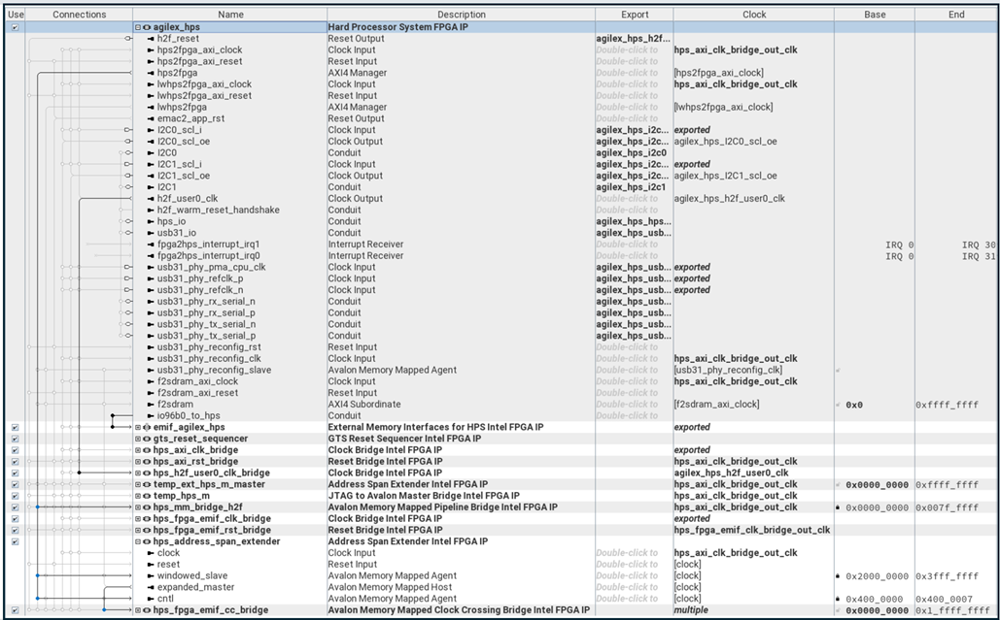{:style="display:block; margin-left:auto; margin-right:auto"}

**HPS Subsystem**

 
 

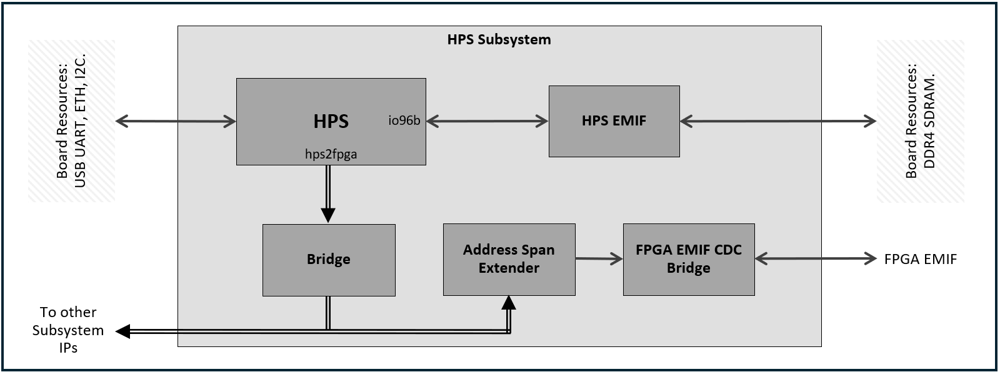{:style="display:block; margin-left:auto; margin-right:auto"}

**HPS Subsystem Block Diagram**

 

Internally the HPS Subsystem is composed of the HPS, EMIF for external 8GB
HPS DDR4 SDRAM (available on the development board), the full HPS to FPGA
interface bridge, and an Address Span Extender which provides a movable 512MB
read/write access window into one of the external 8GB FPGA DDR4 SDRAMs (also
available on the development board). The HPS to FPGA bridge allows the HPS
software to read and write IP registers, IP memory tables, and the external
FPGA DDR4 SDRAM (via the Address Span Extender) to control the 4Kp60
Multi-Sensor HDR Camera Solution System Example Design. The HPS Subsystem to
FPGA memory map is detailed in the following table:
 
 

**HPS Subsystem to FPGA Memory Map**

| Address Start | Address End | Subsystem | Description |
| ---- | ---- | ---- | ---- |
| 0x4000_0000 | 0x4000_3FFF | OCS | Offset Capability Structure subsystem IP |
| 0x4020_0000 | 0x4027_FFFF | ISP | ISP subsystem IP |
| 0x4030_0000 | 0x4030_0FFF | ISP_In | ISP Input subsystem IP |
| 0x4040_0000 | 0x4040_3FFF | MIPI_In | MIPI Input subsystem IP |
| 0x4050_0000 | 0x4050_0FFF | Vid_Out | Video Output subsystem IP |
| 0x4400_0000 | 0x4400_0007 | HPS | Address Span Extender - Control |
| 0x6000_0000 | 0x7FFF_FFFF | HPS | Address Span Extender - FPGA DDR4 SDRAM 512MB Window |

 

The HPS Subsystem includes a `.qsf` file relating to the HPS IO assignments.
 
 

### **OCS Subsystem**

The OCS Subsystem (Offset Capability Structure) provides a method to allow
the HPS software to self-discover all the IP within the project that it can
interact with.
 
 

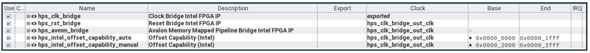{:style="display:block; margin-left:auto; margin-right:auto"}

**OCS Subsystem**

 

All VVP IP contain an OCS entry in the form of:

* Type - A unique identifier for the IP.
* Version - The IP version.
* ID Component - Instance number of the IP.
* Base - Base address of the IP register map.
* Size - Size of the IP Register map.
 
 

OCS entries are stored within the OCS IP inside a ROM. The IP itself can
contain any number of ROMs which are linked together within the IP with the
first ROM always being at a base address offset of 0x0. The HPS is programmed
to always assume that the OCS IP is the first IP on the HPS to FPGA (hps2fpga)
bridge (at a base address offset of 0x0) facilitating the auto discovery
process.
 
 

ROMs can be automatic or manually populated. The MDT flow uses a TCL script
during the build step to search for all the IP within the PD project,
extracting the OCS entry information, and building the automatic ROM. Manually
populated ROMs are used for IP that do not have an OCS entry. Typically, these
are non-VVP IP such as the Address Span Extender for example. An
OCS Modification Subsystem is used to specify the manual ROM which MDT builds
during the create step. Note this does not create an additional PD subsystem as
it simply modifies the OCS Subsystem. The 4Kp60 Multi-Sensor HDR Camera
Solution System Example Design contains an automatic and a manual ROM. Upon
boot, the HPS reads the entries from the ROMs to determine where the IP is; the
driver version to load; and how it should be used (using its instance number).
 
 

### **MIPI_In Subsystem**

The MIPI_In Subsystem is used to ingress 12-bit RAW format 4Kp60 camera
sensor data from 2 Framos MIPI inputs.
 
 

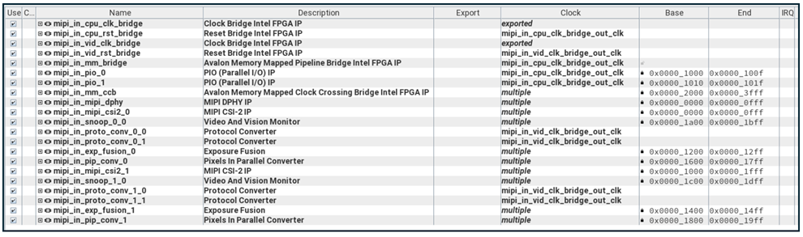{:style="display:block; margin-left:auto; margin-right:auto"}

**MIPI_In Subsystem**

 
 

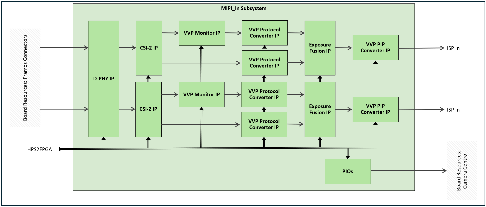{:style="display:block; margin-left:auto; margin-right:auto"}

**MIPI_In Subsystem Block Diagram**

 

The MIPI_In Subsystem consists of a MIPI D-Phy IP configured to support 2
input links - one each for the 2 Framos MIPI sensor inputs. Each link is
configured for x4 MIPI lanes @1768 Mbps per lane providing enough bandwidth for
4Kp60 processing with 12-bit RAW format data.
 
 

The sensor also supports a Clear HDR feature. In this mode, the sensor
simultaneously captures two images at 25 FPS, one with a low gain level set to
the bright region and the other a high gain level set to the dark region. Since
the images are captured simultaneously, there are no motion chromatic
aberrations or other artifacts. The sensor passes the two images interleaved on
a line per basis over the same single MIPI link.
 
 

The MIPI D-Phy outputs data using a pair of 16-bit PHY Protocol Interfaces
(PPI) - one per sensor. Each PPI connects natively to a MIPI CSI-2 IP which
decodes the RAW12 format MIPI packets and outputs VVP AXI4-S format packets.
Each MIPI CSI-2 IP outputs 1 primary or 2 primary and secondary (for Clear HDR
mode) VVP AXI4-S Full streaming interfaces using 4 PIP (Pixels in Parallel) at
297MHz. This rate was chosen to allow for any bursty data coming from the
sensor and because no real AXI4-S back pressure can be applied (the sensor
cannot be stalled).
 
 

The primary MIPI CSI-2 output interfaces each pass through a VVP Monitor IP to
determine if a sensor is on and passing the expected image data. The secondary
interfaces do not require a Monitor IP. VVP Protocol Converter IPs are then
used on all interfaces to change the protocol from VVP AXI4-S Full to VVP
AXI4-S Lite. Each pair of MIPI CSI-2 IP output interfaces are then passed into
a non-QPDS Exposure Fusion IP which is used to combine the two low and high
gain images to produce a single 16-bit HDR image. If Clear HDR mode is in
bypass mode, the Exposure Fusion IP simply maps the 12-bit primary interface to
a 16-bit output interface (most significant 12-bits aligned with 4 least
significant zero bits). Finally, a VVP PIP Converter IP hangs off the back of
each Exposure Fusion IP to buffer and convert the image data from 4 PIP down to
2 PIP at 297MHz (enough bandwidth for 4Kp60 processing). The buffer in the PIP
Converter means that the MIPI CSI-2 IP Rx buffer can be deliberately shallow to
minimize resource usage.
 
 

The MIPI_In Subsystem also includes Input and Output PIO IPs which are used
to provide control and status for the HPS Software. Currently, no controls are
being used in the 4Kp60 Multi-Sensor HDR Camera Solution System Example Design.
The Framos MIPI connectors on the development board have additional sensor
controls such as master slave sync, etc. These could be controlled by the HPS
Software for instance. HPS status information includes FPGA build specific
capabilities, such as frame rate, multi-sensor and HDR support, development
board target, etc.; and a build timestamp.
 
 

The HPS Subsystem to MIPI_In Subsystem memory map is detailed in the
following table:
 
 

**HPS Subsystem to MIPI_In Subsystem Memory Map**

| Address Start | Address End | Module | Description |
| ---- | ---- | ---- | ---- |
| 0x4040_0000 | 0x4040_0FFF | MIPI DPHY IP | MIPI D-Phy |
| 0x4040_1000 | 0x4040_100F | PIO IP | Input PIO (inst 0) |
| 0x4040_1010 | 0x4040_101F | PIO IP | Input PIO (inst 1) |
| 0x4040_1200 | 0x4040_12FF | Exposure Fusion IP | Exposure Fusion (inst 0) |
| 0x4040_1400 | 0x4040_14FF | Exposure Fusion IP | Exposure Fusion (inst 1) |
| 0x4040_1600 | 0x4040_17FF | VVP PIP Converter IP | Pixels In Parallel Converter (inst 0) |
| 0x4040_1800 | 0x4040_19FF | VVP PIP Converter IP | Pixels In Parallel Converter (inst 1) |
| 0x4040_1A00 | 0x4040_1BFF | VVP Monitor IP | Snoop (inst 0) |
| 0x4040_1C00 | 0x4040_1DFF | VVP Monitor IP | Snoop (inst 1) |
| 0x4040_2000 | 0x4040_2FFF | MIPI CSI-2 IP | MIPI CSI-2 - via Clock Crossing Bridge (inst 0) |
| 0x4040_3000 | 0x4040_3FFF | MIPI CSI-2 IP | MIPI CSI-2 - via Clock Crossing Bridge (inst 1) |

 

The MIPI_In Subsystem includes `.qsf` and `.sdc` files relating to the IO
assignments and timing constraints required for the design.
 
 

### **ISP_In Subsystem**

The ISP_In Subsystem is used to provide the input into the ISP Subsystem.
 
 

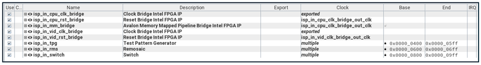{:style="display:block; margin-left:auto; margin-right:auto"}

**ISP_In Subsystem**

 
 

{:style="display:block; margin-left:auto; margin-right:auto"}

**ISP_In Subsystem Block Diagram**

 

The ISP_In Subsystem consists of a VVP Test Pattern Generator (TPG) IP, a
non-QPDS Remosaic (RMS) IP, and a VVP Switch IP to switch between the 3 input
sources. Switching, when activated in the HPS Software, always occurs at the
end of an active video line. Therefore, software must guard against switching to
sources that are not active to avoid lock-up.
 
 

The first input into the switch comes from the VVP TPG IP path. The TPG is
configured to support color bars and solid color output patterns which can be
selected by the HPS Software. However, the TPG only outputs an RGB (Red, Green,
Blue) image. And since the ISP operates on a Color Filter Array (CFA) image
(sometimes known as a Color Filter Mosaic or Bayer image), a conversion is
required. The RMS IP performs this conversion, allowing a programmable CFA
phase to be applied to the TPG RGB output image to create a CFA image. The TPG
path is used for system testing with or without sensors.
 
 

The second and third inputs into the switch come from the 2 outputs of the
MIPI_In Subsystem.
 
 

The HPS Subsystem to ISP_In Subsystem memory map is detailed in the
following table:
 
 

**HPS Subsystem to ISP_In Subsystem Memory Map**

| Address Start | Address End | Module | Description |
| ---- | ---- | ---- | ---- |
| 0x4030_0400 | 0x4030_05FF | VVP TPG IP | RGB Test Pattern Generator |
| 0x4030_0600 | 0x4030_06FF | Remosaic IP | Remosaic (RGB to Bayer conversion) |
| 0x4030_0800 | 0x4030_09FF | VVP Switch IP | Bayer Switch |

 

### **ISP Subsystem**

The ISP Subsystem is the main image processing pipeline. Reference should be
made to the [ISP Functional Description.](./isp-funct-descr.md) when
reading this section in order to understand the exact IP function.

 
 

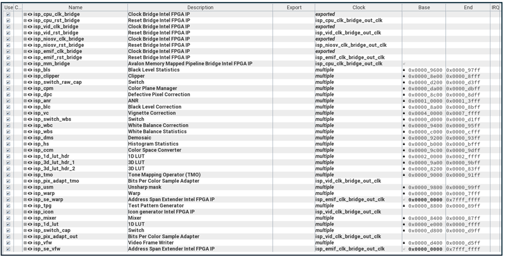{:style="display:block; margin-left:auto; margin-right:auto"}

**ISP Subsystem**

 
 

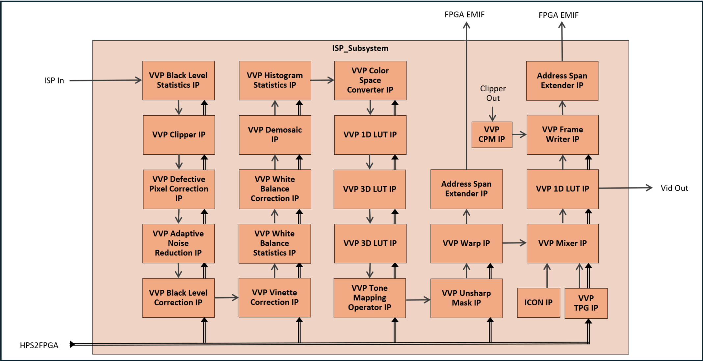{:style="display:block; margin-left:auto; margin-right:auto"}

**ISP Subsystem Block Diagram**

 

The input into the ISP is a Color Filter Array (CFA) image from the
ISP_In Subsystem. For simplicity, the main block diagram doesn't show all the
IP within the ISP Subsystem - just the main processing ISP.
 
 

The first ISP IP is the VVP Black Level Statistics (BLS) IP. This IP is used to
obtain statistics relating to the Optical Black Region (OBR) of the image
sensor - typically a shielded area within the sensor. The BLS is used to
continually set the coefficients for the VVP Black Level Correction (BLC) IP as
the black level can change, for example with temperature. However, the IMX 678
used in the 4Kp60 Multi-Sensor HDR Camera Solution System Example Design does
not allow access to the OBR and as such the BLS isn't used in normal operation.
However, it is used during calibration where the sensor lens can be covered to
provide a black level reading. Although not as accurate as continuous reading,
it does nonetheless provide a pretty good black level reading.
 
 

As with all VVP ISP Statistics IP. the BLS IP passes input image data to the
output untouched.
 
 

The output from BLS feeds into the VVP Clipper IP. The clipper is used to
remove the OBR from the image. However, since the OBR is not available for the
IMX 678, the input image simply passes through the clipper untouched.
 
 

Not shown in the main block diagram is the Raw Capture VVP Switch IP. It takes
the clipper output and under HPS SW control, can direct the image data to the
Capture VVP Switch IP via a VVP Color Plane Manager (CPM) IP. The CPM is used
to replicate the CFA color of a given input pixel into all 3 RGB components of
a given output pixel, therefore producing a monochrome RGB image from the CFA
raw image. The Capture Switch, under HPS SW control, can direct either the raw
image or the output image (ISP post processed output from the Gamma 1D LUT IP)
to the VVP Frame Writer (VFW) IP. The Frame Writer uses a frame buffer within
a 512MB area of external 8GB FPGA DDR4 SDRAM. It interfaces to an Address Span
Extender which provides the 512MB window into the EMIF. The HPS can access the
buffer for downloading the captured images.
 
 

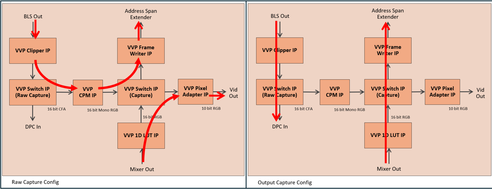{:style="display:block; margin-left:auto; margin-right:auto"}

**ISP Subsystem Capture Switch Configuration Block Diagram**

 

Switches are required due to the limited EMIF performance for the FPGA Device
fitted to the development board which cannot support an uninterrupted 4Kp60
pipeline and 4K capture to a single FPGA DDR4 SDRAM. Therefore, raw capture
temporarily switches off the input pipeline while output capture temporarily
switches off the output pipeline. The DP output can flicker or go blank during
the captures.
 
 

The VVP Defective Pixel Correction (DPC) IP takes the output of clipper. The
function of the DPC is to effectively remove defective pixels from the sensor
image. Defective pixels manifests themselves as drastically different intensity
to their neighboring pixels.
 
 

The DPC feeds the VVP Adaptive Noise Reduction IP (ANR). ANR is an
edge-preserving smoothing filter that mainly reduces the independent pixel noise
of an image. It is configured with a 17x17 kernel size and was chosen to
maximize functionality with a sensible resource utilization footprint.
 
 

VVP Black Level Correction (BLC) IP comes next in the processing pipeline.
Based on the BLS results, the image black level can be compensated for by
firstly subtracting a pedestal value before scaling the result back to the full
dynamic range.
 
 

BLC feeds the VVP Vignette Correction (VC) IP. VC is used to compensate for
non-uniform intensity across the image, often caused by uneven light-gathering
of the sensor and optics. The compensation is achieved using a mesh of
coefficient scalers for each color plane and interpolating values between them
for any given pixel. The mesh coefficient generation is done using a
calibration process often with a white non-reflective image from the sensor.
Darker and lighter areas of the image can then be compensated for by boosting
or reducing pixel color values.
 
 

The next stage in the processing pipeline is the White Balance correction. Both
the VVP White Balance Statistics (WBS) IP and VVP White Balance Correction
(WBC) IP are used to eliminate color casts which occur due to lighting
conditions or difference in the light sensitivity of pixels of different color.
The WBS IP collects statistics relating to the red-green and blue-green ratios
within a region of interest (ROI). The HPS SW uses the WBS results to set
individual color scalers within the WBC IP to alter the balance between the
colors, therefore ensuring that whites really look white, and grays really look
gray without unwanted color tinting. In the 4Kp60 Multi-Sensor HDR Camera
Solution System Example Design, and not shown in the main block diagram, a WBS
VVP Switch IP sits in-line between the VC IP and the VVP Demosaic (DMS) IP.
Both the WBS and WBC are fully connected to the WBS Switch which allows under
HPS software control, WBS to come before or after WBC in the processing
pipeline.
 
 

{:style="display:block; margin-left:auto; margin-right:auto"}

**ISP Subsystem White Balance Switch Configuration Block Diagram**

 

The HPS Auto-White Balance algorithm (AWB) (as used in the 4Kp60 Multi-Sensor
HDR Camera Solution System Example Design), switches continuously between the
configurations during normal operation to continually adjust the white balance.
 
 

VVP Demosaic (DMS) IP is the final processing IP in the CFA image data domain.
It is a color reconstructing IP and converts the CFA image into an RGB image.
The DMS interpolates missing colors for each pixel based on its neighboring
pixels.
 
 

The RGB image from DMS feeds into the VVP Histogram Statistics (HS) IP. This IP
produces light intensity histograms for both the entire image and a ROI. The
HPS Auto-Exposure algorithm (AE) uses the histograms to adjust the sensor's
exposure settings such as shutter speed and analog gain.
 
 

The Color Correction Matrix (CCM) is primarily used to correct undesired color
bleeding across color channels in the sensor, which is mainly caused by pixels
being sensitive to color spectrums other than their own intended color. The
functionality is provided by a VVP Color Space Converter (CSC) IP which is used
to multiply the input RGB values with a 3x3 CCM to produce the corrected output
RGB values. The CCM can also be used to provide many artistic effects.
 
 

To facilitate conversions between different color spaces and dynamic ranges, or
to simply apply artistic effects, the 4Kp60 Multi-Sensor HDR Camera Solution
System Example Design provides a combination chain of a VVP 1D LUT IP followed
by 2 back to back VVP 3D LUT IPs. The 1D LUT can be used to apply an input to
output transfer function, for instance to convert between linear and non-linear
color spaces. The IP is configured as a 12-bit LUT with a 16-bit input lookup
and a 14-bit output value. The configuration was chosen to maximize
functionality with a sensible resource utilization footprint. The VVP 3D LUT
IPs can be used to support application specific combinations of color space
conversions, such as RGB to HLG followed by HLG to BT.709 for instance. Both 3D
LUT IPs are configured for 14-bit input with a LUT size of 17 cubed and 14-bit
color depth. The first 3D LUT has an output of 14-bits whereas the second has
an output of 12-bit to match the maximum color depth of the VVP Tone Mapping
Operator IP. Unused LUTs can be placed in bypass mode when not required.
 
 

The VVP TMO IP implements a ROI based tone mapping algorithm to improve the
visibility of latent image detail across areas of the image. The IP feeds into
a VVP Pixel Adapter IP to reduce the output to 10-bits to match the maximum
color depth of the VVP Unsharp Mask (USM) IP.
 
 

The USM applies a sharpening algorithm to the input image by implementing an
unsharp mask. The input image passes through a low pass blur filter to create a
blurred image which is subtracted from the original input image to create a
high frequency component. This component is scaled using a positive (sharpen)
or negative (soften) strength value which is then multiplied against the
original input image before being output.
 
 

The VVP Warp IP is used to apply arbitrary transforms and can correct for lens
distortions like fisheye for instance. Warp can also scale, rotate, and mirror
the image. The Warp uses 512MB of the external 8GB FPGA DDR4 SDRAM. 128MB is
allocated for the transform coefficients (which the HPS Software writes) while
the remainder is used as frame buffers. The Warp interfaces to an Address Span
Extender which provides the 512MB window into the EMIF. The Warp is effectively
the last ISP processing IP.
 
 

The output of Warp (the ISP) feeds into the VVP Mixer IP. The mixer uses a VVP
TPG IP to provide a base, solid black layer, up to 4K resolution in size, for
the ISP output to be overlaid onto. This can be useful when the ISP output is
of a smaller resolution than the connected monitor. The mixer allows the ISP
layer to be placed anywhere over the TPG background, therefore "framing" the
ISP output for the monitor. In addition, the TPG is also configured to support
color bars, which under HPS SW control can be used with no ISP output for
system testing. The mixer also has an additional layer for the Altera® logo
overlay. The opacity of this layer can be controlled by the HPS SW.
 
 

The mixer output feeds into the Gamma LUT - a second VVP 1D LUT IP instance in
the 4Kp60 Multi-Sensor HDR Camera Solution System Example Design. The Gamma LUT
is used to implement input to output transfer functions (such as Opto-Optical
Transfer Function (OOTF), Opto-Electrical Transfer Function (OETF), and
Electrical-Optical Transfer Function (EOTF)) for video standards and
traditional gamma compression and decompression, as well as High Dynamic Range
Perceptual Quantizer (HDR PQ) and Hybrid Log-Gamma (HDR HLG) correction. The 1D
LUT is configured as a 9-bit LUT with a 10-bit input and 16-bit output to
support the output capture functionality via the Capture Switch. (The Switch
only supports a single color depth configuration and therefore is configured
for 16-bit as this is the value used by the Raw Capture pipeline). A VVP Pixel
Adapter IP is used to convert the output back to 10-bits for the
VID_Out Subsystem input.
 
 

The following Color Depth Change Block Diagram summarizes the change in color
depth at the different stages in the ISP pipeline.
 
 

{:style="display:block; margin-left:auto; margin-right:auto"}

**ISP Subsystem Color Depth Change Block Diagram**

 
 

The HPS Subsystem to ISP Subsystem memory map is detailed in the
following table:
 
 

**HPS Subsystem to ISP Subsystem Memory Map**

| Address Start | Address End | Module | Description |
| ---- | ---- | ---- | ---- |
| 0x4020_0000 | 0x4020_7FFF | VVP Warp IP | Warp |
| 0x4020_8200 | 0x4020_83FF | VVP 3D-LUT IP | 3D LUT for HDR processing (inst 1) |
| 0x4020_8400 | 0x4020_87FF | VVP Mixer IP | Mixer |
| 0x4020_8800 | 0x4020_89FF | VVP TPG IP | Test Pattern Generator |
| 0x4020_8A00 | 0x4020_8BFF | VVP BLC IP | Black Level Correction |
| 0x4020_8C00 | 0x4020_8DFF | VVP DPC IP | Defective Pixel Correction |
| 0x4020_8E00 | 0x4020_8FFF | VVP Clipper IP | Clipper |
| 0x4020_9000 | 0x4020_91FF | VVP TMO IP | Tone Mapping Operator |
| 0x4020_9200 | 0x4020_93FF | VVP DMS IP | Demosaic |
| 0x4020_9400 | 0x4020_95FF | VVP WBC IP | White Balance Correction |
| 0x4020_9600 | 0x4020_97FF | VVP BLS IP | Black Level Statistics |
| 0x4020_9800 | 0x4020_99FF | VVP USM IP | Un-Sharp Mask Filter |
| 0x4020_9A00 | 0x4020_9BFF | VVP 3D-LUT IP | 3D LUT for HDR processing (inst 0) |
| 0x4020_9C00 | 0x4020_9DFF | VVP CSC IP | Color Correction Matrix |
| 0x4020_B000 | 0x4020_BFFF | VVP HS IP | Histogram Statistics |
| 0x4020_C000 | 0x4020_CFFF | VVP WBS IP | White Balance Statistics |
| 0x4020_D000 | 0x4020_D1FF | VVP Switch IP | White Balance Switch (inst 3) |
| 0x4020_D200 | 0x4020_D3FF | VVP Switch IP | Raw Capture Switch (inst 4) |
| 0x4020_D400 | 0x4020_D5FF | VVP VFW IP | Frame Writer |
| 0x4020_D800 | 0x4020_D9FF | VVP Switch IP | Capture Switch (inst 5) |
| 0x4020_DA00 | 0x4020_DBFF | VVP CPM IP | Color Plane Manager |
| 0x4020_E000 | 0x4020_FFFF | VVP 1D-LUT IP | 1D LUT for Gamma correction (inst 0) |
| 0x4021_0000 | 0x4021_3FFF | VVP ANR IP | Adaptive Noise Reduction |
| 0x4022_0000 | 0x4022_FFFF | VVP 1D-LUT IP | 1D LUT for HDR processing (inst 1) |
| 0x4024_0000 | 0x4027_FFFF | VVP VC IP | Vignette Correction |

 

The ISP Subsystem also includes some additional processing scripts to allow
the 3D LUTs to be preloaded with a cube file.
 
 

### **EMIF Subsystem**

The EMIF Subsystem (External Memory Interface) provides an interface to one
of the external 8GB FPGA DDR4 SDRAMs (available on the development board). The
local EMIF interface is 256-bit wide running at a clock frequency of 200MHz.
This provides just enough bandwidth to perform write and read of a 4K image
at 60 FPS with 70% efficiency. The EMIF Subsystem is part of the MDT common
subsystems.
 
 

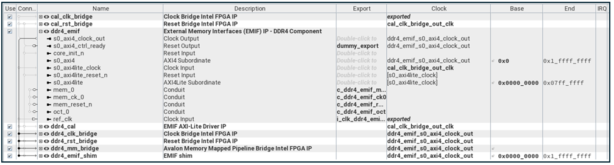{:style="display:block; margin-left:auto; margin-right:auto"}

**EMIF Subsystem**

 

The MDT EMIF Subsystem also includes non-QPDS IP such as an AXI shim and reset
module needed for correct functionality.
 
 

The FPGA DDR4 SDRAM memory map is detailed in the following table:
 
 

**FPGA DDR4 SDRAM Memory Map**

| Address Start | Address End | Module | Description |
| ---- | ---- | ---- | ---- |
| 0x0_0000_0000 | 0x0_017F_FFFF | VVP Warp IP | Warp Buffers |
| 0x0_0180_0000 | 0x0_01FF_FFFF | VVP Warp IP | Warp Coefficients |
| 0x0_0200_0000 | 0x0_03FF_FFFF | VVP VFW IP | Capture Buffer |
| 0x0_0400_0000 | 0x1_FFFF_FFFF | - | Unused |

 

### **VID_Out Subsystem**

The VID_Out Subsystem is used to interface the ISP Subsystem 2 PIP VVP
AXI4-S Lite output, to the DP_Tx Subsystem 4 PIP VVP AXI4-S Full input. The
VID_Out Subsystem uses both a VVP PIP Converter IP and VVP Protocol Converter
IP to achieve the conversion. The VID_Out Subsystem also includes PIO IPs for
the HPS software to handshake DP control and status with the DP Nios® V
software.
 
 

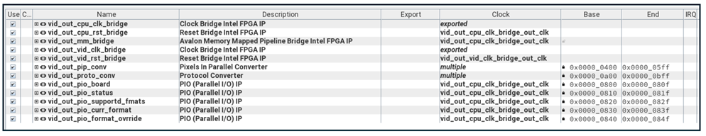{:style="display:block; margin-left:auto; margin-right:auto"}

**VID_Out Subsystem**

 
 

{:style="display:block; margin-left:auto; margin-right:auto"}

**VID_Out Subsystem Block Diagram**

 
 

The HPS Subsystem to VID_Out Subsystem memory map is detailed in the
following table:
 
 

**HPS Subsystem to VID_Out Subsystem Memory Map**

| Address Start | Address End | Module | Description |
| ---- | ---- | ---- | ---- |
| 0x4050_0400 | 0x4050_35FF | VVP PIP Converter IP | PIP Converter |
| 0x4050_0800 | 0x4050_080F | PIO IP | Input DP Rate Control |
| 0x4050_0810 | 0x4050_081F | PIO IP | Input DP status |
| 0x4050_0820 | 0x4050_082F | PIO IP | Input DP monitor supported formats |
| 0x4050_0830 | 0x4050_083F | PIO IP | Input DP current format |
| 0x4050_0840 | 0x4050_084F | PIO IP | Output DP new monitor format to override |
| 0x4050_0A00 | 0x4050_0BFF | VVP Protocol Converter IP | VVP AXI4-S Lite to VVP AXI4-S Full VVP Protocol Converter |

 

### **Nios® V Subsystem**

The Nios® V Subsystem (Nios® V CPU subsystem) is used to control the Display
Port Tx IP. In addition, it provides the EDID (Extended Display Identification
Data) processing and interfaces to the HPS for DP control and status
handshaking. The Nios® V Subsystem is part of the MDT common CPU subsystems.
 
 

{:style="display:block; margin-left:auto; margin-right:auto"}

**Nios® V Subsystem**

 

The Nios® V Subsystem consists of the Nios® V/m soft processor IP along with
on-chip RAM, JTAG master, IRQ-management, JTAG UART, and timers. The MDT flow
compiles the DP Tx software during the build step and generates the `.hex` file
for the on-chip RAM such that the Nios® automatically boots and runs on power
up. The UART can be used for debug purposes, but it is disabled in the DP Tx
software by default for added security. The DP Tx software determines the best
resolution and color depth a connected monitor/TV supports and configures the
DP Tx IP accordingly. The Nios® V Subsystem memory map is detailed in the
following table:
 
 

**Nios® V Subsystem to FPGA Memory Map**

| Address Start | Address End | Module | Description |
| ---- | ---- | ---- | ---- |
| 0x0000_0000 | 0x0003_FFFF | CPU RAM | 256KB On-chip RAM (for the Nios® V CPU) |
| 0x0004_0000 | 0x0004_3FFF | Bridge | DP_Tx Subsystem Bridge |
| 0x0040_0000 | 0x0040_FFFF | Nios® V/m DM Agent | Nios® V/m Debug Module |
| 0x0041_0000 | 0x0041_003F | Nios® V/m Tmer | Nios® V/m Timer Module |
| 0x0041_0040 | 0x0041_005F | CPU Timer | Interval Timer IP (for the Nios® V CPU) |
| 0x0041_0060 | 0x0041_0067 | JTAG UART | JTAG UART IP (for the Nios® V CPU) |

 

### **DP_Tx Subsystem**

The DP_Tx Subsystem (Display Port Tx) provides the DP Tx output. It consists
of the DP Tx IP, I2C controllers for adjusting reference clock frequencies on
the development board, and PIO (Parallel Input/Output) IPs for the DP Nios® V
software to handshake DP control and status with the HPS software.
 
 

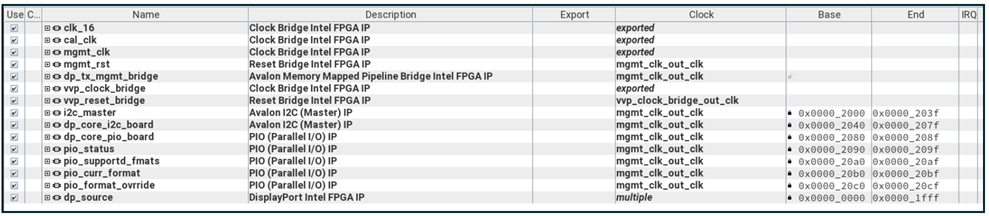{:style="display:block; margin-left:auto; margin-right:auto"}

**DP_Tx Subsystem**

 
 

{:style="display:block; margin-left:auto; margin-right:auto"}

**DP_Tx Subsystem Block Diagram**

 

The DP_Tx Subsystem includes `.qsf` and `.sdc` files relating to the DP Tx IO
assignments and timing constraints. The MDT DP_Tx creation Tcl script also
includes top level Verilog code for instancing the DP GTS Tx Phy as well as CDC
(Cross Clock Domain) code for the PIO handshaking, and the rate control logic
for the DP multi-rate support.
 

The Nios® V Subsystem to DP_Tx Subsystem memory map is detailed in the
following table:
 
 

**Nios® V Subsystem to DP_Tx Subsystem Memory Map**

| Address Start | Address End | Module | Description |
| ---- | ---- | ---- | ---- |
| 0x0004_0000 | 0x0004_1FFF | DP Tx IP | DP Tx IP |
| 0x0004_2000 | 0x0004_203F | I2C Master IP | Not Used |
| 0x0004_2040 | 0x0004_207F | I2C Master IP | Development board DP reference clock chip reprogram |
| 0x0004_2080 | 0x0004_208F | PIO IP | Output DP Rate Control |
| 0x0004_2090 | 0x0004_209F | PIO IP | Output DP status |
| 0x0004_20A0 | 0x0004_20AF | PIO IP | Output DP monitor supported formats |
| 0x0004_20B0 | 0x0004_20BF | PIO IP | Output DP current format |
| 0x0004_20C0 | 0x0004_20CF | PIO IP | Input DP new monitor format to override |

 

### Top Level

The Quartus® project top level Verilog file gets generated through the MDT
create step, along with all supporting files such as `.qsf` and `.sdc` files.
In addition, the 4Kp60 Multi-Sensor HDR Camera Solution System Example Design
contains another subsystem `system` which does not produce a PD subsystem, but
instead produces further supporting files such as `.qsf`, `.sdc`, `dawf`, and
`.stp` (when enabled in the `.xml` file). These are needed to ensure a
successful build for the Quartus® version and IP used and to work around any
errata that exist.
 

 
[Back](../camera_4k/camera_4k.md#camera-solution-system-example-design-documentation){ .md-button }
 

[4Kp60 Multi-Sensor HDR Camera Solution System Example Design for Agilex™ 5 Devices]: https://altera-fpga.github.io/rel-25.1/embedded-designs/agilex-5/e-series/modular/camera/camera_4k
[Agilex™ 5 E-Series Modular Development Board GSRD User Guide (25.1)]: https://altera-fpga.github.io/rel-25.1/embedded-designs/agilex-5/e-series/modular/gsrd/ug-gsrd-agx5e-modular/

[Hard Processor System Technical Reference Manual: Agilex™ 5 SoCs (25.1)]: https://www.intel.com/content/www/us/en/docs/programmable/814346/25-1/hard-processor-system-technical-reference.html
[NiosV Processor for Altera® FPGA]: https://www.intel.com/content/www/us/en/products/details/fpga/intellectual-property/processors-peripherals/niosv.html
[Agilex™ 5 FPGA E-Series 065B Modular Development Kit]: https://www.intel.com/content/www/us/en/products/details/fpga/development-kits/agilex/a5e065b-modular.html
[Agilex™ 5 FPGA E-Series 065B Modular Development Kit Product Brief]: https://www.intel.com/content/www/us/en/content-details/815178/agilex-5-fpga-e-series-065b-modular-development-kit-product-brief.html

[Win32DiskImager]: https://sourceforge.net/projects/win32diskimager
[7-Zip]: https://www.7-zip.org
[teraterm]: https://github.com/TeraTermProject/teraterm/releases
[putty]: https://www.chiark.greenend.org.uk/~sgtatham/putty/latest.html

[Framos FSM:GO IMX678C Camera Modules]: https://www.framos.com/en/fsmgo
[Wide 110deg HFOV Lens]: https://www.mouser.co.uk/ProductDetail/FRAMOS/FSMGO-IMX678C-M12-L110A-PM-A1Q1?qs=%252BHhoWzUJg4KQkNyKsCEDHw%3D%3D
[Medium 100deg HFOV Lens]: https://www.mouser.co.uk/ProductDetail/FRAMOS/FSMGO-IMX678C-M12-L100A-PM-A1Q1?qs=%252BHhoWzUJg4IesSwD2ACIBQ%3D%3D
[Narrow 54deg HFOV Lens]: https://www.mouser.co.uk/ProductDetail/FRAMOS/FSMGO-IMX678C-M12-L54A-PM-A1Q1?qs=%252BHhoWzUJg4L5yHZulKgVGA%3D%3D
[Framos Tripod Mount Adapter]: https://www.framos.com/en/products/fma-mnt-trp1-4-v1c-26333
[Tripod]: https://thepihut.com/products/small-tripod-for-raspberry-pi-hq-camera
[150mm flex-cable]: https://www.mouser.co.uk/ProductDetail/FRAMOS/FMA-FC-150-60-V1A?qs=GedFDFLaBXGCmWApKt5QIQ%3D%3D&_gl=1*d93qim*_ga*MTkyOTE4MjMxNy4xNzQxMTcwMzQy*_ga_15W4STQT4T*MTc0MTE3MDM0Mi4xLjEuMTc0MTE3MDQ5OS40NS4wLjA
[300mm micro-coax cable]: https://www.mouser.co.uk/ProductDetail/FRAMOS/FFA-MC50-Kit-0.3m?qs=%252BHhoWzUJg4K3LtaE207mhw%3D%3D
[4Kp60 Converter Dongle]: https://www.amazon.co.uk/gp/product/B01M6WK3KU/ref=ppx_yo_dt_b_asin_title_o02_s00?ie=UTF8&psc=1

[VVP IP Suite, VVP Tone Mapping Operator (TMO) IP, VVP Warp IP, and 3D LUT IP]: https://www.intel.com/content/www/us/en/products/details/fpga/intellectual-property/dsp/video-vision-processing-suite.html
[MIPI DPHY IP and MIPI CSI-2 IP]: https://www.intel.com/content/www/us/en/products/details/fpga/intellectual-property/interface-protocols/mipi-d-phy.html#tab-blade-1-3
[Nios® V Processor]: https://www.intel.com/content/www/us/en/products/details/fpga/intellectual-property/processors-peripherals/niosv/glossy.html

[Altera® Quartus® Prime Pro Edition version 25.1 Linux]: https://www.intel.com/content/www/us/en/software-kit/851652/intel-quartus-prime-pro-edition-design-software-version-25-1-for-linux.html
[Altera® Quartus® Prime Pro Edition version 25.1 Windows]: https://www.intel.com/content/www/us/en/software-kit/851653/intel-quartus-prime-pro-edition-design-software-version-25-1-for-windows.html

[User flow 1]: ../camera_4k/camera_4k.md#pre-requisites
[User flow 2]: ../camera_4k_resources/flow2-sof-mdt.md
[User flow 3]: ../camera_4k_resources/flow3-rbf-mdt.md

[https://github.com/altera-fpga/agilex-ed-camera]: https://github.com/altera-fpga/agilex-ed-camera
[https://github.com/altera-fpga/modular-design-toolkit]: https://github.com/altera-fpga/modular-design-toolkit
[meta-altera-fpga]: https://github.com/altera-fpga/agilex-ed-camera/tree/rel-25.1/sw/meta-altera-fpga
[meta-altera-fpga-ocs]: https://github.com/altera-fpga/agilex-ed-camera/tree/rel-25.1/sw/meta-altera-fpga-ocs
[meta-vvp-isp-demo]: https://github.com/altera-fpga/agilex-ed-camera/tree/rel-25.1/sw/meta-vvp-isp-demo
[agilex-ed-camera/sw]: https://github.com/altera-fpga/agilex-ed-camera/tree/rel-25.1/sw

[Release Tag]: https://github.com/altera-fpga/agilex-ed-camera/releases/tag/rel-25.1
[https://github.com/altera-fpga/agilex-ed-camera/releases/tag/rel-25.1]: https://github.com/altera-fpga/agilex-ed-camera/releases/tag/rel-25.1
[hps-first-vvp-isp-demo-image-agilex5_mk_a5e065bb32aes1.wic.gz]: https://github.com/altera-fpga/agilex-ed-camera/releases/download/rel-25.1/hps-first-vvp-isp-demo-image-agilex5_mk_a5e065bb32aes1.wic.gz
[fpga-first-vvp-isp-demo-image-agilex5_mk_a5e065bb32aes1.wic.gz]: https://github.com/altera-fpga/agilex-ed-camera/releases/download/rel-25.1/fpga-first-vvp-isp-demo-image-agilex5_mk_a5e065bb32aes1.wic.gz
[fsbl_agilex5_modkit_vvpisp_time_limited.sof]: https://github.com/altera-fpga/agilex-ed-camera/releases/download/rel-25.1/fsbl_agilex5_modkit_vvpisp_time_limited.sof
[top.core.jic]: https://github.com/altera-fpga/agilex-ed-camera/releases/download/rel-25.1/top.core.jic
[top.core.rbf]: https://github.com/altera-fpga/agilex-ed-camera/releases/download/rel-25.1/top.core.rbf

[AGX_5E_Modular_Devkit_ISP_FF_RD.xml]: https://github.com/altera-fpga/agilex-ed-camera/blob/rel-25.1/AGX_5E_Altera_Modular_Dk_ISP_designs/AGX_5E_Modular_Devkit_ISP_FF_RD.xml
[AGX_5E_Modular_Devkit_ISP_RD.xml]: https://github.com/altera-fpga/agilex-ed-camera/blob/rel-25.1/AGX_5E_Altera_Modular_Dk_ISP_designs/AGX_5E_Modular_Devkit_ISP_RD.xml
[Create microSD card image (.wic.gz) using YOCTO/KAS]: https://github.com/altera-fpga/agilex-ed-camera/blob/rel-25.1/sw/README.md
[<g>&check;</g> YOCTO/KAS ]: https://github.com/altera-fpga/agilex-ed-camera/blob/rel-25.1/sw/README.md

[SOF Modular Design Toolkit (MDT) Flow]: https://github.com/altera-fpga/agilex-ed-camera/blob/rel-25.1/README.md#create-the-design-using-the-modular-design-toolkit-mdt
[RBF Modular Design Toolkit (MDT) Flow]: https://github.com/altera-fpga/agilex-ed-camera/blob/rel-25.1/README.md#create-the-design-using-the-modular-design-toolkit-mdt
[<g>&check;</g> SOF MDT Flow ]: https://github.com/altera-fpga/agilex-ed-camera/blob/rel-25.1/README.md#create-the-design-using-the-modular-design-toolkit-mdt
[<g>&check;</g> RBF MDT Flow ]: https://github.com/altera-fpga/agilex-ed-camera/blob/rel-25.1/README.md#create-the-design-using-the-modular-design-toolkit-mdt

[Test Pattern Generator IP]: https://www.intel.com/content/www/us/en/docs/programmable/683329/25-1/test-pattern-generator.html
[Switch IP]: https://www.intel.com/content/www/us/en/docs/programmable/683329/25-1/switch.html
[Black Level Statistics IP]: https://www.intel.com/content/www/us/en/docs/programmable/683329/25-1/black-level-statistics.html
[Clipper IP]: https://www.intel.com/content/www/us/en/docs/programmable/683329/25-1/clipper.html
[Defective Pixel Correction IP]: https://www.intel.com/content/www/us/en/docs/programmable/683329/25-1/defective-pixel-correction.html
[Adaptive Noise Reduction IP]: https://www.intel.com/content/www/us/en/docs/programmable/683329/25-1/adaptive-noise-reduction.html
[Black Level Correction IP]: https://www.intel.com/content/www/us/en/docs/programmable/683329/25-1/black-level-correction.html
[Vignette Correction IP]: https://www.intel.com/content/www/us/en/docs/programmable/683329/25-1/vignette-correction.html
[White Balance Statistics IP]: https://www.intel.com/content/www/us/en/docs/programmable/683329/25-1/white-balance-statistics.html
[White Balance Correction IP]: https://www.intel.com/content/www/us/en/docs/programmable/683329/25-1/white-balance-correction.html
[Demosaic IP]: https://www.intel.com/content/www/us/en/docs/programmable/683329/25-1/demosaic.html
[Histogram Statistics IP]: https://www.intel.com/content/www/us/en/docs/programmable/683329/25-1/histogram-statistics.html
[Color Space Converter IP]: https://www.intel.com/content/www/us/en/docs/programmable/683329/25-1/color-space-converter.html
[1D LUT IP]: https://www.intel.com/content/www/us/en/docs/programmable/683329/25-1/1d-lut.html
[3D LUT]: https://www.intel.com/content/www/us/en/products/details/fpga/intellectual-property/dsp/3d-lut.html
[3D LUT IP]: https://www.intel.com/content/www/us/en/docs/programmable/683329/25-1/3d-lut.html
[LUTCalc GitHub page]: https://github.com/cameramanben/LUTCalc
[Tone Mapping Operator]: https://www.intel.com/content/www/us/en/products/details/fpga/intellectual-property/dsp/tone-mapping-operator.html
[Tone Mapping Operator IP]: https://www.intel.com/content/www/us/en/docs/programmable/683329/25-1/tone-mapping-operator.html
[Unsharp Mask IP]: https://www.intel.com/content/www/us/en/docs/programmable/683329/25-1/unsharp-mask.html
[Warp]: https://www.intel.com/content/www/us/en/products/details/fpga/intellectual-property/dsp/video-warp.html
[Warp IP]: https://www.intel.com/content/www/us/en/docs/programmable/683329/25-1/warp.html
[Mixer IP]: https://www.intel.com/content/www/us/en/docs/programmable/683329/25-1/mixer.html
[Video Frame Writer IP]: https://www.intel.com/content/www/us/en/docs/programmable/683329/25-1/video-frame-writer-intel-fpga-ip.html
[Color Plane Manager IP]: https://www.intel.com/content/www/us/en/docs/programmable/683329/25-1/color-plane-manager.html
[Bits per Color Sample Adapter IP]: https://www.intel.com/content/www/us/en/docs/programmable/683329/25-1/bits-per-color-sample-adapter.html
[Protocol Converter IP]: https://www.intel.com/content/www/us/en/docs/programmable/683329/25-1/protocol-converter.html
[Pixels in Parallel Converter IP]: https://www.intel.com/content/www/us/en/docs/programmable/683329/25-1/pixels-in-parallel-converter.html
[Video and Vision Processing Suite Altera® FPGA IP User Guide]: https://www.intel.com/content/www/us/en/docs/programmable/683329/25-1/about-the-video-and-vision-processing-suite.html
[Altera® FPGA Streaming Video Protocol Specification]: https://www.intel.com/content/www/us/en/docs/programmable/683397/current/about-the-intel-fpga-streaming-video.html
[AMBA 4 AXI4-Stream Protocol Specification]: https://developer.arm.com/documentation/ihi0051/a/
[Avalon® Interface Specifications – Avalon® Streaming Interfaces]: https://www.intel.com/content/www/us/en/docs/programmable/683091/20-1/streaming-interfaces.html
[KAS]: https://kas.readthedocs.io/en/latest/

