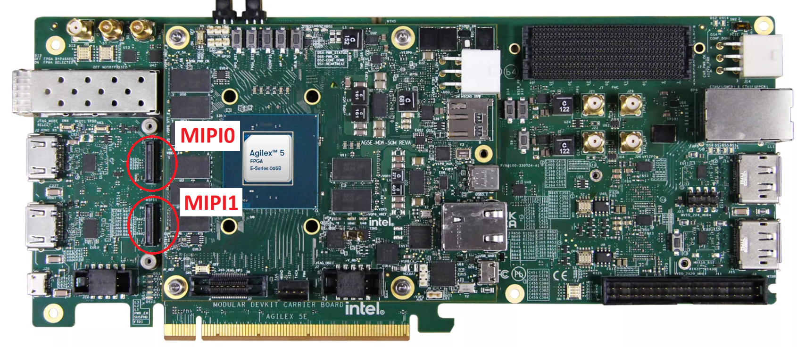
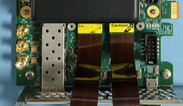
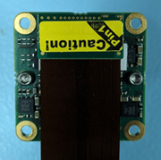
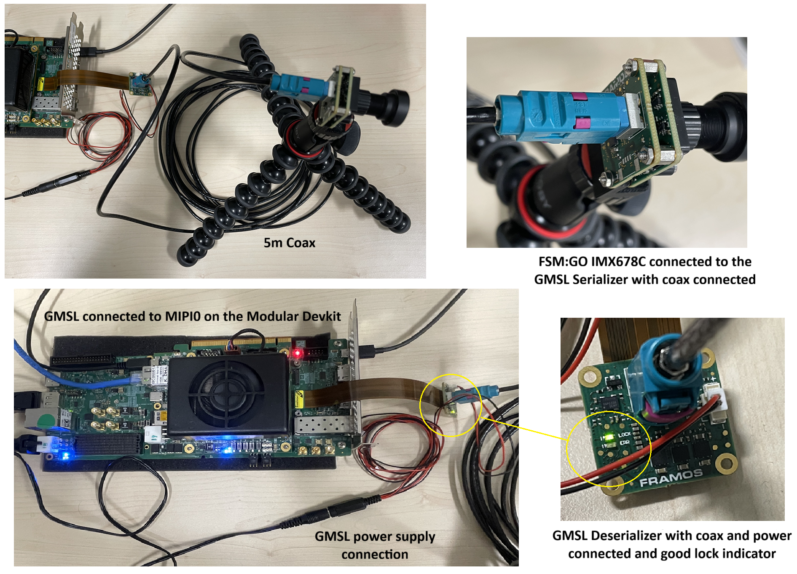
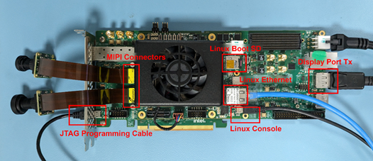

### **Setting Up the Camera Solution**

!!! NOTE "Warning"
    Handle ESD-sensitive equipment (boards, microSD Cards, Camera sensors, etc.) only when properly grounded and at an ESD-safe workstation

* Make the required connections between the Host PC and the
[Agilex™ 5 FPGA E-Series 065B Modular Development Kit] as detailed in the
  **Setting Up the Modular Development Kit** section.
* Connect the Framos cable(s) between the Framos Camera Module(s) and the MIPI
  connector(s) on the Modular Development Kit Carrier Board taking care to
  align the cable(s) correctly with the connector(s) (pin 1 to pin 1). When
  using a single camera module, either MIPI connector can be used.

 

{:style="display:block; margin-left:auto; margin-right:auto;"}

**Modular Development Kit Carrier Board MIPI Connector Locations**

 

{:style="display:block; margin-left:auto; margin-right:auto;"}

**Modular Development Kit Carrier Board with MIPI Framos Flex Cable Connected**

 

{:style="display:block; margin-left:auto; margin-right:auto;"}

**Framos Camera with Flex Cable Connected**

 

* If using the optional Framos GMSL3 solution (and the Camera Solution System
  Example Design supports it):
  * Connect the [Framos FFA-GMSL-SER-V2A Serializer] module back-to-back to the
    Framos Camera module.
  * Using the Framos [150mm flex-cable] connect the
    [Framos FFA-GMSL-DES-V2A Deserializer] module to the MIPI0 connector on the
    Modular Development Kit Carrier Board taking care to align the cable
    correctly with the connector (pin 1 to pin 1).
    * Note the System Example Design only supports one GMSL3 link on the MIPI0
      port. However, a second Framos Camera module can be connected directly to
      the MIPI1 port using a Framos [150mm flex-cable].
  * Connect the serializer module to the deserializer module using the GMSL3 5m
    coax cable. 
  * Connect the power supply to the deserializer module.
    * Note the GMSL3 deserializer module must be powered up before the Modular
      Development Kit.
  * Power up the Modular Development Kit and ensure the deserializer
    modules Lock LED is illuminated green.

 

{:style="display:block; margin-left:auto; margin-right:auto; width: 85%"}

**GMSL Connections**

 

* Connect the Modular Development Kit Carrier Board DisplayPort Tx connector to
  the Monitor using a suitable cable (and the adapter if you are using an HDMI cable).

 

{:style="display:block; margin-left:auto; margin-right:auto;"}

**Modular Development Kit with Connections**

 
