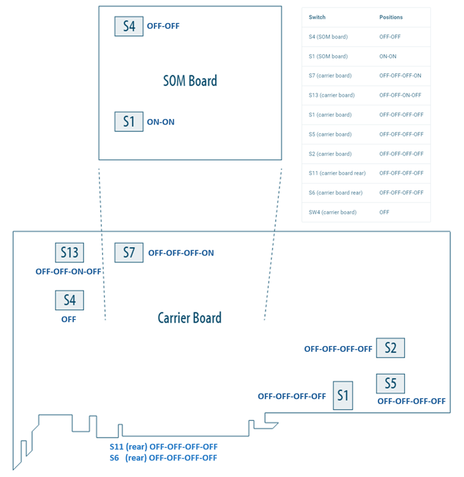
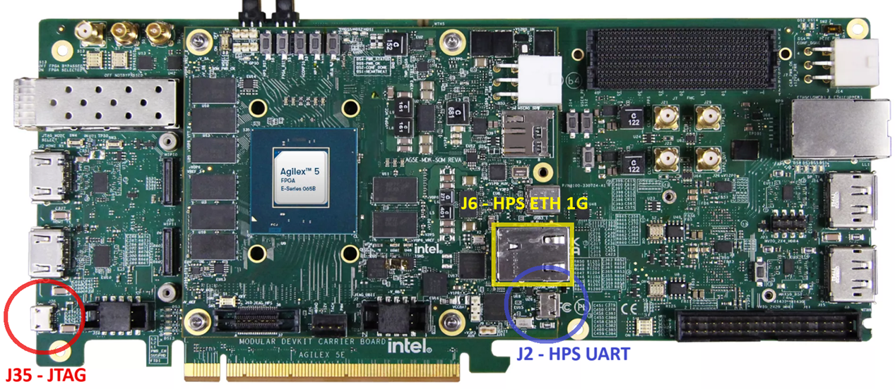

### **Setting Up your Modular Development Board**

!!! NOTE "Warning"
    Handle ESD-sensitive equipment (boards, microSD Cards, Camera sensors, etc.) only when properly grounded and at an ESD-safe workstation

* Configure the board switches as shown:

 

{:style="display:block; margin-left:auto; margin-right:auto"}

**Modular Development Board - Default Switch Positions**

 

!!! note "Main switch configurations used by the Camera Solution System Example Design"

    JTAG Mode:         SOM S4=OFF:OFF, or 
    ASx4 (QSPI) Mode:  SOM S4=ON:ON

 

* Connect micro USB cable between the carrier board (`J35`) and the Host PC.
  This will be used for JTAG communication. Look at what ports are enumerated
  on your Host computer. There should be a series of four.
* Connect micro USB cable between the SOM board (`J2`, HSP_UART) and the Host
  PC. This will be used for HPS UART communication. Look at what ports are
  enumerated on your Host computer. There should be a series of four. Use the
  3rd one in the list as the HPS serial port.
* Connect an RJ45 cable between the ethernet port on the SOM board (`J6`, ETH
  1G HPS) and make sure it is on the same network as your Host PC. You can
  check the `eth0` IP address after boot using the Linux `ip a` command.

 

{:style="display:block; margin-left:auto; margin-right:auto"}

**Board Connections**

 
