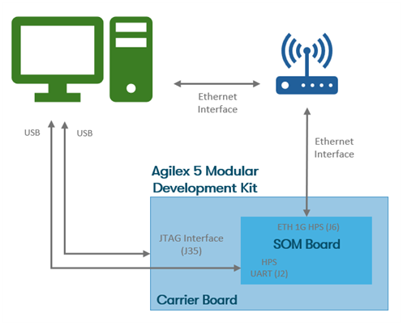

### **Setting Up the Development Kit**

!!! NOTE "Warning"
    Handle ESD-sensitive equipment (boards, microSD cards, camera sensors, etc.) only when properly grounded and at an ESD-safe workstation

* Configure the Agilex™ 5 FPGA E-Series 065B Modular Development Kit switches
  as shown:

 

{:style="display:block; margin-left:auto; margin-right:auto"}

**Modular Development Kit - Default Switch Positions**

 

!!! note "FPGA configuration modes used by the Camera Solution System Example Design"

    The Camera Solution System Example Design can use one of the following FPGA configuration modes: JTAG or ASx4(QSPI). 
    The MSEL switch (S4) on the SOM board instructs the FPGA device on which configuration mode to use.

    JTAG mode:         Modular Development Kit SOM Board S4=OFF:OFF, or 
    ASx4 (QSPI) mode:  Modular Development Kit SOM Board S4=ON:ON

    The pre-built version of the design uses ASx4 (QSPI) mode, S4=ON:ON.

 

* Make the required connections between the Host PC and the Modular Development
  Kit as shown in the following diagram:

 

{:style="display:block; margin-left:auto; margin-right:auto;"}

**Host PC and Modular Development Kit Connections diagram**

 

* Connect micro USB cable between the Modular Development Kit Carrier Board
  (`J35`) and the Host PC. This will be used for QSPI programming / FGPA
  configuration over JTAG.
  Look at what serial ports are enumerated on your Host computer. There should be a
  series of four.
* Connect micro USB cable between the Modular Development Kit SOM Board (`J2`,
  HSP_UART) and the Host PC. This will be used to access HPS serial console. Look
  at what ports are enumerated on your Host computer. There should be a series
  of four. Use the 3rd one in the list as the HPS serial port.
* Connect an RJ45 cable between the ethernet port on the Modular Development
  Kit SOM Board (`J6`, ETH 1G HPS) and make sure it is on the same network as
  your Host PC. You can check the `eth0` IP address after boot using the Linux
  `ip a` command.

 

{:style="display:block; margin-left:auto; margin-right:auto"}

**Modular Development Kit Connector Locations**

 
